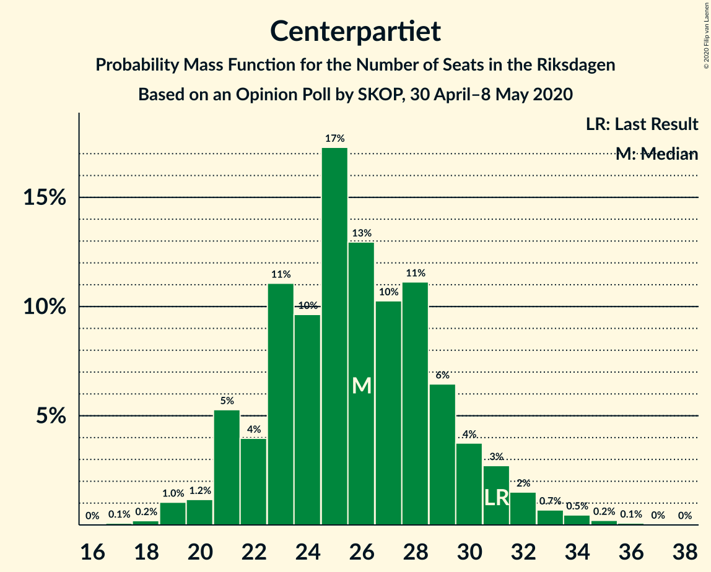
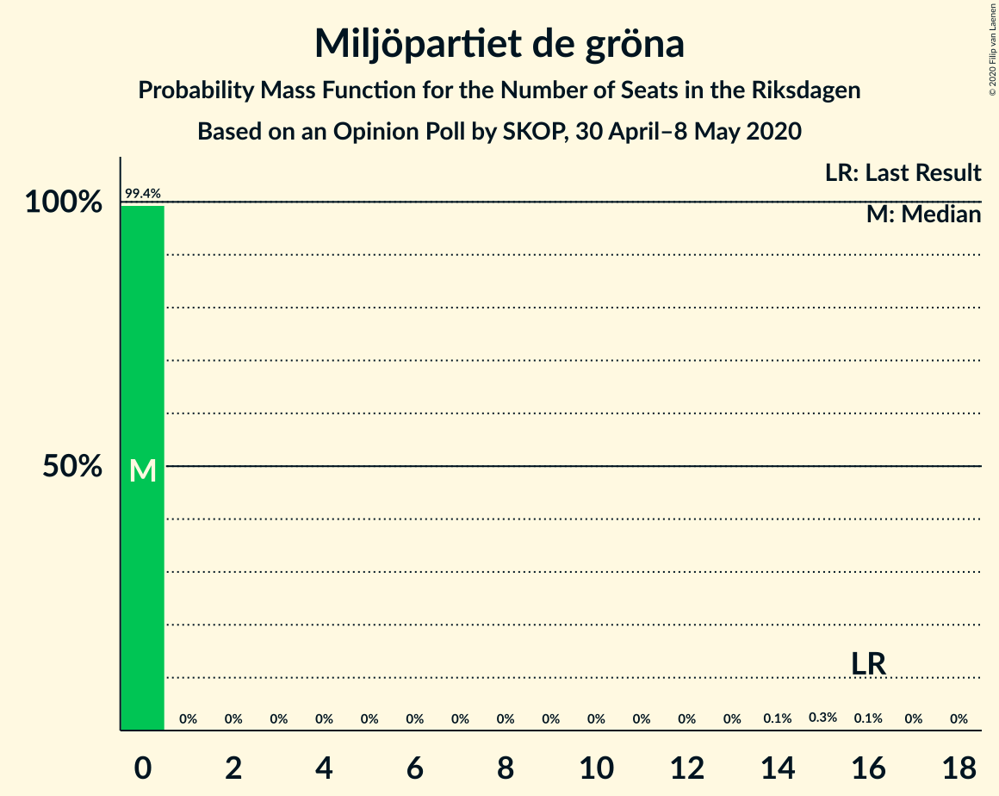
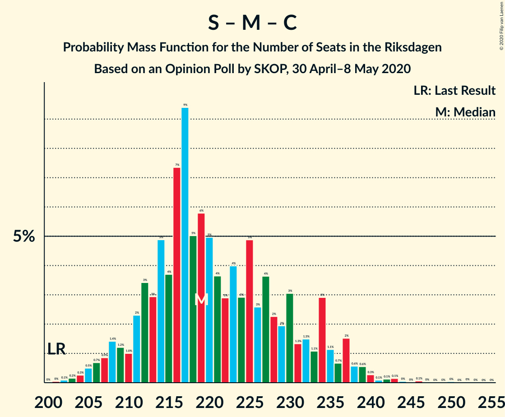

# Opinion Poll by SKOP, 30 April–8 May 2020

<a href="#voting-intentions">Voting Intentions</a> | <a href="#seats">Seats</a> | <a href="#coalitions">Coalitions</a> | <a href="#technical-information">Technical Information</a>

## Voting Intentions

### Confidence Intervals

| Party | Last Result | Poll Result | 80% Confidence Interval | 90% Confidence Interval | 95% Confidence Interval | 99% Confidence Interval |
|:-----:|:-----------:|:-----------:|:-----------------------:|:-----------------------:|:-----------------------:|:-----------------------:|
| Sveriges socialdemokratiska arbetareparti | 28.3% | 32.6% | 30.7–34.5% |30.2–35.1% |29.8–35.5% |28.9–36.5% |
| Moderata samlingspartiet | 19.8% | 20.4% | 18.9–22.1% |18.4–22.6% |18.0–23.0% |17.3–23.8% |
| Sverigedemokraterna | 17.5% | 16.3% | 14.9–17.9% |14.5–18.3% |14.1–18.7% |13.5–19.5% |
| Vänsterpartiet | 8.0% | 9.7% | 8.6–11.0% |8.3–11.4% |8.0–11.7% |7.5–12.3% |
| Centerpartiet | 8.6% | 7.0% | 6.0–8.1% |5.8–8.4% |5.6–8.7% |5.1–9.3% |
| Kristdemokraterna | 6.3% | 5.2% | 4.4–6.2% |4.2–6.5% |4.0–6.8% |3.6–7.3% |
| Liberalerna | 5.5% | 4.4% | 3.7–5.4% |3.5–5.6% |3.3–5.9% |3.0–6.4% |
| Miljöpartiet de gröna | 4.4% | 2.6% | 2.0–3.3% |1.9–3.5% |1.7–3.7% |1.5–4.1% |

*Note:* The poll result column reflects the actual value used in the calculations. Published results may vary slightly, and in addition be rounded to fewer digits.

## Seats

### Confidence Intervals

| Party | Last Result | Median | 80% Confidence Interval | 90% Confidence Interval | 95% Confidence Interval | 99% Confidence Interval |
|:-----:|:-----------:|:------:|:-----------------------:|:-----------------------:|:-----------------------:|:-----------------------:|
| <a href="#sveriges-socialdemokratiska-arbetareparti">Sveriges socialdemokratiska arbetareparti</a> | 100 | 120 | 112–128 |110–131 |109–132 |105–137 |
| <a href="#moderata-samlingspartiet">Moderata samlingspartiet</a> | 70 | 75 | 69–82 |67–83 |66–85 |63–89 |
| <a href="#sverigedemokraterna">Sverigedemokraterna</a> | 62 | 61 | 55–66 |53–68 |52–69 |50–72 |
| <a href="#vänsterpartiet">Vänsterpartiet</a> | 28 | 36 | 32–41 |30–42 |30–43 |28–45 |
| <a href="#centerpartiet">Centerpartiet</a> | 31 | 26 | 22–29 |21–31 |21–32 |19–34 |
| <a href="#kristdemokraterna">Kristdemokraterna</a> | 22 | 19 | 16–22 |15–23 |0–24 |0–27 |
| <a href="#liberalerna">Liberalerna</a> | 20 | 16 | 0–19 |0–20 |0–21 |0–23 |
| <a href="#miljöpartiet-de-gröna">Miljöpartiet de gröna</a> | 16 | 0 | 0 |0 |0 |0–14 |

### Sveriges socialdemokratiska arbetareparti

*For a full overview of the results for this party, see the [Sveriges socialdemokratiska arbetareparti](party-sverigessocialdemokratiskaarbetareparti.html) page.*

| Number of Seats | Probability | Accumulated | Special Marks |
|:---------------:|:-----------:|:-----------:|:-------------:|
| 100 | 0% | 100% | Last Result |
| 101 | 0% | 100% |  |
| 102 | 0% | 100% |  |
| 103 | 0.1% | 99.9% |  |
| 104 | 0.2% | 99.9% |  |
| 105 | 0.2% | 99.7% |  |
| 106 | 0.4% | 99.5% |  |
| 107 | 0.5% | 99.1% |  |
| 108 | 0.7% | 98.5% |  |
| 109 | 1.3% | 98% |  |
| 110 | 2% | 97% |  |
| 111 | 2% | 95% |  |
| 112 | 3% | 93% |  |
| 113 | 3% | 89% |  |
| 114 | 6% | 87% |  |
| 115 | 3% | 81% |  |
| 116 | 8% | 77% |  |
| 117 | 4% | 70% |  |
| 118 | 7% | 66% |  |
| 119 | 6% | 60% |  |
| 120 | 9% | 54% | Median |
| 121 | 8% | 45% |  |
| 122 | 6% | 38% |  |
| 123 | 6% | 31% |  |
| 124 | 3% | 25% |  |
| 125 | 3% | 22% |  |
| 126 | 3% | 19% |  |
| 127 | 3% | 16% |  |
| 128 | 3% | 13% |  |
| 129 | 1.3% | 10% |  |
| 130 | 3% | 8% |  |
| 131 | 2% | 6% |  |
| 132 | 1.2% | 3% |  |
| 133 | 0.6% | 2% |  |
| 134 | 0.4% | 2% |  |
| 135 | 0.3% | 1.2% |  |
| 136 | 0.2% | 0.9% |  |
| 137 | 0.3% | 0.7% |  |
| 138 | 0.1% | 0.4% |  |
| 139 | 0% | 0.2% |  |
| 140 | 0.1% | 0.2% |  |
| 141 | 0% | 0.1% |  |
| 142 | 0% | 0% |  |

### Moderata samlingspartiet

*For a full overview of the results for this party, see the [Moderata samlingspartiet](party-moderatasamlingspartiet.html) page.*

| Number of Seats | Probability | Accumulated | Special Marks |
|:---------------:|:-----------:|:-----------:|:-------------:|
| 60 | 0% | 100% |  |
| 61 | 0.1% | 99.9% |  |
| 62 | 0.2% | 99.8% |  |
| 63 | 0.2% | 99.6% |  |
| 64 | 0.7% | 99.4% |  |
| 65 | 1.0% | 98.7% |  |
| 66 | 2% | 98% |  |
| 67 | 2% | 96% |  |
| 68 | 3% | 94% |  |
| 69 | 4% | 91% |  |
| 70 | 5% | 87% | Last Result |
| 71 | 8% | 82% |  |
| 72 | 8% | 75% |  |
| 73 | 8% | 67% |  |
| 74 | 6% | 59% |  |
| 75 | 6% | 53% | Median |
| 76 | 9% | 47% |  |
| 77 | 8% | 38% |  |
| 78 | 9% | 31% |  |
| 79 | 5% | 22% |  |
| 80 | 3% | 16% |  |
| 81 | 3% | 13% |  |
| 82 | 2% | 10% |  |
| 83 | 3% | 8% |  |
| 84 | 2% | 5% |  |
| 85 | 1.1% | 3% |  |
| 86 | 1.0% | 2% |  |
| 87 | 0.3% | 1.1% |  |
| 88 | 0.3% | 0.9% |  |
| 89 | 0.2% | 0.5% |  |
| 90 | 0.2% | 0.4% |  |
| 91 | 0.1% | 0.2% |  |
| 92 | 0.1% | 0.1% |  |
| 93 | 0% | 0% |  |

### Sverigedemokraterna

*For a full overview of the results for this party, see the [Sverigedemokraterna](party-sverigedemokraterna.html) page.*

| Number of Seats | Probability | Accumulated | Special Marks |
|:---------------:|:-----------:|:-----------:|:-------------:|
| 47 | 0.1% | 100% |  |
| 48 | 0.2% | 99.9% |  |
| 49 | 0.2% | 99.7% |  |
| 50 | 0.6% | 99.5% |  |
| 51 | 0.7% | 98.9% |  |
| 52 | 2% | 98% |  |
| 53 | 2% | 97% |  |
| 54 | 2% | 95% |  |
| 55 | 4% | 92% |  |
| 56 | 4% | 88% |  |
| 57 | 6% | 84% |  |
| 58 | 11% | 79% |  |
| 59 | 6% | 68% |  |
| 60 | 10% | 62% |  |
| 61 | 8% | 52% | Median |
| 62 | 11% | 43% | Last Result |
| 63 | 7% | 32% |  |
| 64 | 5% | 25% |  |
| 65 | 5% | 20% |  |
| 66 | 5% | 15% |  |
| 67 | 4% | 9% |  |
| 68 | 2% | 6% |  |
| 69 | 2% | 4% |  |
| 70 | 1.0% | 2% |  |
| 71 | 0.3% | 1.1% |  |
| 72 | 0.5% | 0.8% |  |
| 73 | 0.2% | 0.4% |  |
| 74 | 0.1% | 0.2% |  |
| 75 | 0.1% | 0.1% |  |
| 76 | 0% | 0% |  |

### Vänsterpartiet

*For a full overview of the results for this party, see the [Vänsterpartiet](party-vänsterpartiet.html) page.*

| Number of Seats | Probability | Accumulated | Special Marks |
|:---------------:|:-----------:|:-----------:|:-------------:|
| 26 | 0.1% | 100% |  |
| 27 | 0.3% | 99.9% |  |
| 28 | 0.8% | 99.6% | Last Result |
| 29 | 0.9% | 98.8% |  |
| 30 | 3% | 98% |  |
| 31 | 4% | 95% |  |
| 32 | 5% | 91% |  |
| 33 | 8% | 85% |  |
| 34 | 10% | 77% |  |
| 35 | 11% | 68% |  |
| 36 | 12% | 57% | Median |
| 37 | 13% | 45% |  |
| 38 | 8% | 32% |  |
| 39 | 7% | 24% |  |
| 40 | 6% | 17% |  |
| 41 | 5% | 11% |  |
| 42 | 3% | 6% |  |
| 43 | 1.4% | 4% |  |
| 44 | 1.1% | 2% |  |
| 45 | 0.5% | 1.0% |  |
| 46 | 0.2% | 0.4% |  |
| 47 | 0.1% | 0.3% |  |
| 48 | 0.1% | 0.1% |  |
| 49 | 0% | 0.1% |  |
| 50 | 0% | 0% |  |

### Centerpartiet

*For a full overview of the results for this party, see the [Centerpartiet](party-centerpartiet.html) page.*

| Number of Seats | Probability | Accumulated | Special Marks |
|:---------------:|:-----------:|:-----------:|:-------------:|
| 17 | 0.1% | 100% |  |
| 18 | 0.2% | 99.9% |  |
| 19 | 1.0% | 99.7% |  |
| 20 | 1.2% | 98.7% |  |
| 21 | 5% | 98% |  |
| 22 | 4% | 92% |  |
| 23 | 11% | 88% |  |
| 24 | 10% | 77% |  |
| 25 | 17% | 68% |  |
| 26 | 13% | 50% | Median |
| 27 | 10% | 37% |  |
| 28 | 11% | 27% |  |
| 29 | 6% | 16% |  |
| 30 | 4% | 9% |  |
| 31 | 3% | 6% | Last Result |
| 32 | 2% | 3% |  |
| 33 | 0.7% | 1.5% |  |
| 34 | 0.5% | 0.8% |  |
| 35 | 0.2% | 0.4% |  |
| 36 | 0.1% | 0.1% |  |
| 37 | 0% | 0.1% |  |
| 38 | 0% | 0% |  |

### Kristdemokraterna

*For a full overview of the results for this party, see the [Kristdemokraterna](party-kristdemokraterna.html) page.*

| Number of Seats | Probability | Accumulated | Special Marks |
|:---------------:|:-----------:|:-----------:|:-------------:|
| 0 | 3% | 100% |  |
| 1 | 0% | 97% |  |
| 2 | 0% | 97% |  |
| 3 | 0% | 97% |  |
| 4 | 0% | 97% |  |
| 5 | 0% | 97% |  |
| 6 | 0% | 97% |  |
| 7 | 0% | 97% |  |
| 8 | 0% | 97% |  |
| 9 | 0% | 97% |  |
| 10 | 0% | 97% |  |
| 11 | 0% | 97% |  |
| 12 | 0% | 97% |  |
| 13 | 0% | 97% |  |
| 14 | 0% | 97% |  |
| 15 | 3% | 97% |  |
| 16 | 7% | 94% |  |
| 17 | 9% | 87% |  |
| 18 | 21% | 78% |  |
| 19 | 16% | 57% | Median |
| 20 | 15% | 41% |  |
| 21 | 12% | 26% |  |
| 22 | 5% | 14% | Last Result |
| 23 | 4% | 9% |  |
| 24 | 3% | 5% |  |
| 25 | 1.3% | 2% |  |
| 26 | 0.5% | 1.0% |  |
| 27 | 0.3% | 0.5% |  |
| 28 | 0.2% | 0.2% |  |
| 29 | 0% | 0.1% |  |
| 30 | 0% | 0% |  |

### Liberalerna

*For a full overview of the results for this party, see the [Liberalerna](party-liberalerna.html) page.*

| Number of Seats | Probability | Accumulated | Special Marks |
|:---------------:|:-----------:|:-----------:|:-------------:|
| 0 | 26% | 100% |  |
| 1 | 0% | 74% |  |
| 2 | 0% | 74% |  |
| 3 | 0% | 74% |  |
| 4 | 0% | 74% |  |
| 5 | 0% | 74% |  |
| 6 | 0% | 74% |  |
| 7 | 0% | 74% |  |
| 8 | 0% | 74% |  |
| 9 | 0% | 74% |  |
| 10 | 0% | 74% |  |
| 11 | 0% | 74% |  |
| 12 | 0% | 74% |  |
| 13 | 0% | 74% |  |
| 14 | 0.1% | 74% |  |
| 15 | 16% | 73% |  |
| 16 | 19% | 57% | Median |
| 17 | 16% | 38% |  |
| 18 | 9% | 23% |  |
| 19 | 6% | 14% |  |
| 20 | 3% | 8% | Last Result |
| 21 | 2% | 5% |  |
| 22 | 1.2% | 2% |  |
| 23 | 0.9% | 1.2% |  |
| 24 | 0.3% | 0.4% |  |
| 25 | 0.1% | 0.1% |  |
| 26 | 0% | 0% |  |

### Miljöpartiet de gröna

*For a full overview of the results for this party, see the [Miljöpartiet de gröna](party-miljöpartietdegröna.html) page.*

| Number of Seats | Probability | Accumulated | Special Marks |
|:---------------:|:-----------:|:-----------:|:-------------:|
| 0 | 99.4% | 100% | Median |
| 1 | 0% | 0.6% |  |
| 2 | 0% | 0.6% |  |
| 3 | 0% | 0.6% |  |
| 4 | 0% | 0.6% |  |
| 5 | 0% | 0.6% |  |
| 6 | 0% | 0.6% |  |
| 7 | 0% | 0.6% |  |
| 8 | 0% | 0.6% |  |
| 9 | 0% | 0.6% |  |
| 10 | 0% | 0.6% |  |
| 11 | 0% | 0.6% |  |
| 12 | 0% | 0.6% |  |
| 13 | 0% | 0.6% |  |
| 14 | 0.1% | 0.6% |  |
| 15 | 0.3% | 0.5% |  |
| 16 | 0.1% | 0.2% | Last Result |
| 17 | 0% | 0% |  |

## Coalitions

### Confidence Intervals

| Coalition | Last Result | Median | Majority? | 80% Confidence Interval | 90% Confidence Interval | 95% Confidence Interval | 99% Confidence Interval |
|:---------:|:-----------:|:------:|:---------:|:-----------------------:|:-----------------------:|:-----------------------:|:-----------------------:|
| Sveriges socialdemokratiska arbetareparti – Moderata samlingspartiet – Centerpartiet | 201 | 219 | 100% | 212–232 | 209–235 | 207–237 | 204–242 |
| Sveriges socialdemokratiska arbetareparti – Moderata samlingspartiet | 170 | 194 | 99.9% | 186–205 | 184–209 | 182–210 | 178–215 |
| Sveriges socialdemokratiska arbetareparti – Vänsterpartiet – Centerpartiet – Liberalerna – Miljöpartiet de gröna | 195 | 195 | 99.9% | 185–203 | 184–205 | 180–208 | 177–213 |
| Sveriges socialdemokratiska arbetareparti – Centerpartiet – Liberalerna – Miljöpartiet de gröna | 167 | 159 | 0.8% | 149–167 | 146–170 | 144–172 | 139–176 |
| Sveriges socialdemokratiska arbetareparti – Vänsterpartiet – Miljöpartiet de gröna | 144 | 156 | 0.6% | 148–165 | 145–168 | 144–169 | 141–175 |
| Sveriges socialdemokratiska arbetareparti – Vänsterpartiet | 128 | 156 | 0.5% | 148–165 | 145–168 | 144–169 | 140–175 |
| Moderata samlingspartiet – Sverigedemokraterna – Kristdemokraterna | 154 | 154 | 0.1% | 146–164 | 144–165 | 141–169 | 136–172 |
| Moderata samlingspartiet – Sverigedemokraterna | 132 | 135 | 0% | 127–145 | 126–146 | 124–149 | 120–153 |
| Moderata samlingspartiet – Centerpartiet – Kristdemokraterna – Liberalerna | 143 | 133 | 0% | 122–141 | 119–144 | 117–146 | 113–149 |
| Sveriges socialdemokratiska arbetareparti – Miljöpartiet de gröna | 116 | 120 | 0% | 112–128 | 111–131 | 109–132 | 106–137 |
| Moderata samlingspartiet – Centerpartiet – Kristdemokraterna | 123 | 119 | 0% | 112–127 | 110–130 | 107–131 | 101–136 |
| Moderata samlingspartiet – Centerpartiet – Liberalerna | 121 | 114 | 0% | 103–123 | 100–124 | 98–127 | 94–130 |
| Moderata samlingspartiet – Centerpartiet | 101 | 101 | 0% | 94–108 | 91–110 | 90–112 | 87–116 |

### Sveriges socialdemokratiska arbetareparti – Moderata samlingspartiet – Centerpartiet

| Number of Seats | Probability | Accumulated | Special Marks |
|:---------------:|:-----------:|:-----------:|:-------------:|
| 200 | 0% | 100% |  |
| 201 | 0% | 99.9% | Last Result |
| 202 | 0.1% | 99.9% |  |
| 203 | 0.2% | 99.8% |  |
| 204 | 0.3% | 99.6% |  |
| 205 | 0.5% | 99.4% |  |
| 206 | 0.7% | 98.9% |  |
| 207 | 0.9% | 98% |  |
| 208 | 1.4% | 97% |  |
| 209 | 1.2% | 96% |  |
| 210 | 1.0% | 95% |  |
| 211 | 2% | 94% |  |
| 212 | 3% | 91% |  |
| 213 | 3% | 88% |  |
| 214 | 5% | 85% |  |
| 215 | 4% | 80% |  |
| 216 | 7% | 76% |  |
| 217 | 9% | 69% |  |
| 218 | 5% | 60% |  |
| 219 | 6% | 55% |  |
| 220 | 5% | 49% |  |
| 221 | 4% | 44% | Median |
| 222 | 3% | 40% |  |
| 223 | 4% | 37% |  |
| 224 | 3% | 33% |  |
| 225 | 5% | 31% |  |
| 226 | 3% | 26% |  |
| 227 | 4% | 23% |  |
| 228 | 2% | 19% |  |
| 229 | 2% | 17% |  |
| 230 | 3% | 15% |  |
| 231 | 1.3% | 12% |  |
| 232 | 1.5% | 11% |  |
| 233 | 1.1% | 9% |  |
| 234 | 3% | 8% |  |
| 235 | 1.1% | 5% |  |
| 236 | 0.7% | 4% |  |
| 237 | 2% | 4% |  |
| 238 | 0.6% | 2% |  |
| 239 | 0.6% | 1.5% |  |
| 240 | 0.3% | 0.9% |  |
| 241 | 0.1% | 0.6% |  |
| 242 | 0.1% | 0.5% |  |
| 243 | 0.1% | 0.4% |  |
| 244 | 0% | 0.3% |  |
| 245 | 0% | 0.2% |  |
| 246 | 0.1% | 0.2% |  |
| 247 | 0% | 0.1% |  |
| 248 | 0% | 0.1% |  |
| 249 | 0% | 0.1% |  |
| 250 | 0% | 0.1% |  |
| 251 | 0% | 0.1% |  |
| 252 | 0% | 0.1% |  |
| 253 | 0% | 0% |  |

### Sveriges socialdemokratiska arbetareparti – Moderata samlingspartiet

| Number of Seats | Probability | Accumulated | Special Marks |
|:---------------:|:-----------:|:-----------:|:-------------:|
| 170 | 0% | 100% | Last Result |
| 171 | 0% | 100% |  |
| 172 | 0% | 100% |  |
| 173 | 0% | 100% |  |
| 174 | 0% | 100% |  |
| 175 | 0.1% | 99.9% | Majority |
| 176 | 0.1% | 99.9% |  |
| 177 | 0.1% | 99.8% |  |
| 178 | 0.2% | 99.7% |  |
| 179 | 0.2% | 99.5% |  |
| 180 | 0.6% | 99.3% |  |
| 181 | 0.6% | 98.7% |  |
| 182 | 1.2% | 98% |  |
| 183 | 1.1% | 97% |  |
| 184 | 1.3% | 96% |  |
| 185 | 3% | 94% |  |
| 186 | 3% | 92% |  |
| 187 | 3% | 89% |  |
| 188 | 3% | 86% |  |
| 189 | 6% | 82% |  |
| 190 | 3% | 76% |  |
| 191 | 6% | 73% |  |
| 192 | 8% | 66% |  |
| 193 | 5% | 58% |  |
| 194 | 6% | 53% |  |
| 195 | 4% | 47% | Median |
| 196 | 3% | 43% |  |
| 197 | 5% | 40% |  |
| 198 | 5% | 35% |  |
| 199 | 3% | 29% |  |
| 200 | 3% | 26% |  |
| 201 | 2% | 23% |  |
| 202 | 5% | 21% |  |
| 203 | 4% | 17% |  |
| 204 | 2% | 13% |  |
| 205 | 2% | 12% |  |
| 206 | 2% | 10% |  |
| 207 | 0.6% | 8% |  |
| 208 | 2% | 8% |  |
| 209 | 3% | 6% |  |
| 210 | 1.0% | 3% |  |
| 211 | 0.5% | 2% |  |
| 212 | 0.5% | 2% |  |
| 213 | 0.3% | 1.4% |  |
| 214 | 0.3% | 1.1% |  |
| 215 | 0.4% | 0.8% |  |
| 216 | 0.1% | 0.4% |  |
| 217 | 0.1% | 0.3% |  |
| 218 | 0% | 0.2% |  |
| 219 | 0% | 0.2% |  |
| 220 | 0% | 0.2% |  |
| 221 | 0% | 0.1% |  |
| 222 | 0% | 0.1% |  |
| 223 | 0% | 0.1% |  |
| 224 | 0% | 0% |  |

### Sveriges socialdemokratiska arbetareparti – Vänsterpartiet – Centerpartiet – Liberalerna – Miljöpartiet de gröna

| Number of Seats | Probability | Accumulated | Special Marks |
|:---------------:|:-----------:|:-----------:|:-------------:|
| 171 | 0% | 100% |  |
| 172 | 0% | 99.9% |  |
| 173 | 0% | 99.9% |  |
| 174 | 0% | 99.9% |  |
| 175 | 0.2% | 99.9% | Majority |
| 176 | 0.1% | 99.6% |  |
| 177 | 0.2% | 99.5% |  |
| 178 | 0.6% | 99.4% |  |
| 179 | 0.5% | 98.8% |  |
| 180 | 0.8% | 98% |  |
| 181 | 0.6% | 97% |  |
| 182 | 0.5% | 97% |  |
| 183 | 1.0% | 96% |  |
| 184 | 4% | 95% |  |
| 185 | 2% | 92% |  |
| 186 | 2% | 90% |  |
| 187 | 3% | 88% |  |
| 188 | 3% | 85% |  |
| 189 | 3% | 82% |  |
| 190 | 8% | 78% |  |
| 191 | 4% | 71% |  |
| 192 | 2% | 67% |  |
| 193 | 8% | 65% |  |
| 194 | 6% | 57% |  |
| 195 | 7% | 51% | Last Result |
| 196 | 4% | 44% |  |
| 197 | 6% | 40% |  |
| 198 | 6% | 34% | Median |
| 199 | 8% | 28% |  |
| 200 | 2% | 20% |  |
| 201 | 2% | 18% |  |
| 202 | 4% | 16% |  |
| 203 | 3% | 12% |  |
| 204 | 3% | 9% |  |
| 205 | 1.4% | 6% |  |
| 206 | 0.6% | 5% |  |
| 207 | 1.4% | 4% |  |
| 208 | 0.8% | 3% |  |
| 209 | 0.4% | 2% |  |
| 210 | 0.3% | 1.5% |  |
| 211 | 0.5% | 1.2% |  |
| 212 | 0.1% | 0.7% |  |
| 213 | 0.2% | 0.6% |  |
| 214 | 0.2% | 0.4% |  |
| 215 | 0.1% | 0.3% |  |
| 216 | 0% | 0.1% |  |
| 217 | 0% | 0.1% |  |
| 218 | 0% | 0.1% |  |
| 219 | 0% | 0.1% |  |
| 220 | 0% | 0% |  |

### Sveriges socialdemokratiska arbetareparti – Centerpartiet – Liberalerna – Miljöpartiet de gröna

| Number of Seats | Probability | Accumulated | Special Marks |
|:---------------:|:-----------:|:-----------:|:-------------:|
| 136 | 0.1% | 100% |  |
| 137 | 0.1% | 99.9% |  |
| 138 | 0.2% | 99.8% |  |
| 139 | 0.1% | 99.5% |  |
| 140 | 0.2% | 99.5% |  |
| 141 | 0.3% | 99.3% |  |
| 142 | 0.4% | 99.0% |  |
| 143 | 0.2% | 98.6% |  |
| 144 | 0.9% | 98% |  |
| 145 | 1.1% | 97% |  |
| 146 | 3% | 96% |  |
| 147 | 0.7% | 93% |  |
| 148 | 3% | 93% |  |
| 149 | 2% | 90% |  |
| 150 | 1.0% | 88% |  |
| 151 | 3% | 87% |  |
| 152 | 3% | 84% |  |
| 153 | 5% | 82% |  |
| 154 | 8% | 77% |  |
| 155 | 3% | 69% |  |
| 156 | 5% | 66% |  |
| 157 | 5% | 61% |  |
| 158 | 4% | 56% |  |
| 159 | 4% | 52% |  |
| 160 | 5% | 48% |  |
| 161 | 10% | 43% |  |
| 162 | 6% | 33% | Median |
| 163 | 3% | 27% |  |
| 164 | 8% | 24% |  |
| 165 | 2% | 16% |  |
| 166 | 2% | 14% |  |
| 167 | 3% | 12% | Last Result |
| 168 | 2% | 10% |  |
| 169 | 2% | 8% |  |
| 170 | 2% | 6% |  |
| 171 | 1.5% | 4% |  |
| 172 | 1.0% | 3% |  |
| 173 | 0.4% | 2% |  |
| 174 | 0.4% | 1.2% |  |
| 175 | 0.1% | 0.8% | Majority |
| 176 | 0.2% | 0.7% |  |
| 177 | 0.1% | 0.4% |  |
| 178 | 0.1% | 0.3% |  |
| 179 | 0.1% | 0.2% |  |
| 180 | 0% | 0.1% |  |
| 181 | 0% | 0.1% |  |
| 182 | 0% | 0.1% |  |
| 183 | 0% | 0% |  |

### Sveriges socialdemokratiska arbetareparti – Vänsterpartiet – Miljöpartiet de gröna

| Number of Seats | Probability | Accumulated | Special Marks |
|:---------------:|:-----------:|:-----------:|:-------------:|
| 137 | 0.1% | 100% |  |
| 138 | 0.1% | 99.9% |  |
| 139 | 0.2% | 99.8% |  |
| 140 | 0.2% | 99.7% |  |
| 141 | 0.6% | 99.5% |  |
| 142 | 0.4% | 98.9% |  |
| 143 | 0.5% | 98% |  |
| 144 | 2% | 98% | Last Result |
| 145 | 1.4% | 96% |  |
| 146 | 1.4% | 95% |  |
| 147 | 2% | 93% |  |
| 148 | 2% | 92% |  |
| 149 | 5% | 89% |  |
| 150 | 6% | 85% |  |
| 151 | 2% | 79% |  |
| 152 | 8% | 77% |  |
| 153 | 5% | 68% |  |
| 154 | 6% | 63% |  |
| 155 | 4% | 58% |  |
| 156 | 6% | 54% | Median |
| 157 | 9% | 48% |  |
| 158 | 3% | 39% |  |
| 159 | 5% | 36% |  |
| 160 | 5% | 30% |  |
| 161 | 5% | 26% |  |
| 162 | 2% | 21% |  |
| 163 | 3% | 19% |  |
| 164 | 3% | 16% |  |
| 165 | 3% | 13% |  |
| 166 | 2% | 9% |  |
| 167 | 1.3% | 8% |  |
| 168 | 3% | 6% |  |
| 169 | 1.0% | 3% |  |
| 170 | 0.5% | 2% |  |
| 171 | 0.5% | 2% |  |
| 172 | 0.5% | 1.5% |  |
| 173 | 0.3% | 1.0% |  |
| 174 | 0.1% | 0.7% |  |
| 175 | 0.2% | 0.6% | Majority |
| 176 | 0.2% | 0.4% |  |
| 177 | 0.1% | 0.3% |  |
| 178 | 0% | 0.1% |  |
| 179 | 0% | 0.1% |  |
| 180 | 0% | 0.1% |  |
| 181 | 0% | 0% |  |

### Sveriges socialdemokratiska arbetareparti – Vänsterpartiet

| Number of Seats | Probability | Accumulated | Special Marks |
|:---------------:|:-----------:|:-----------:|:-------------:|
| 128 | 0% | 100% | Last Result |
| 129 | 0% | 100% |  |
| 130 | 0% | 100% |  |
| 131 | 0% | 100% |  |
| 132 | 0% | 100% |  |
| 133 | 0% | 100% |  |
| 134 | 0% | 100% |  |
| 135 | 0% | 100% |  |
| 136 | 0% | 100% |  |
| 137 | 0.1% | 99.9% |  |
| 138 | 0.1% | 99.9% |  |
| 139 | 0.2% | 99.8% |  |
| 140 | 0.2% | 99.6% |  |
| 141 | 0.6% | 99.5% |  |
| 142 | 0.5% | 98.9% |  |
| 143 | 0.5% | 98% |  |
| 144 | 2% | 98% |  |
| 145 | 1.4% | 96% |  |
| 146 | 1.5% | 95% |  |
| 147 | 2% | 93% |  |
| 148 | 2% | 91% |  |
| 149 | 5% | 89% |  |
| 150 | 6% | 84% |  |
| 151 | 2% | 78% |  |
| 152 | 8% | 76% |  |
| 153 | 5% | 68% |  |
| 154 | 6% | 63% |  |
| 155 | 4% | 57% |  |
| 156 | 6% | 54% | Median |
| 157 | 9% | 48% |  |
| 158 | 3% | 38% |  |
| 159 | 5% | 35% |  |
| 160 | 5% | 30% |  |
| 161 | 5% | 25% |  |
| 162 | 2% | 20% |  |
| 163 | 3% | 18% |  |
| 164 | 3% | 16% |  |
| 165 | 3% | 12% |  |
| 166 | 2% | 9% |  |
| 167 | 1.3% | 7% |  |
| 168 | 3% | 6% |  |
| 169 | 0.9% | 3% |  |
| 170 | 0.5% | 2% |  |
| 171 | 0.5% | 2% |  |
| 172 | 0.4% | 1.4% |  |
| 173 | 0.3% | 0.9% |  |
| 174 | 0.1% | 0.6% |  |
| 175 | 0.1% | 0.5% | Majority |
| 176 | 0.2% | 0.4% |  |
| 177 | 0.1% | 0.2% |  |
| 178 | 0% | 0.1% |  |
| 179 | 0% | 0.1% |  |
| 180 | 0% | 0.1% |  |
| 181 | 0% | 0% |  |

### Moderata samlingspartiet – Sverigedemokraterna – Kristdemokraterna

| Number of Seats | Probability | Accumulated | Special Marks |
|:---------------:|:-----------:|:-----------:|:-------------:|
| 130 | 0% | 100% |  |
| 131 | 0% | 99.9% |  |
| 132 | 0% | 99.9% |  |
| 133 | 0% | 99.9% |  |
| 134 | 0.1% | 99.9% |  |
| 135 | 0.2% | 99.7% |  |
| 136 | 0.2% | 99.6% |  |
| 137 | 0.1% | 99.4% |  |
| 138 | 0.5% | 99.3% |  |
| 139 | 0.3% | 98.8% |  |
| 140 | 0.4% | 98.5% |  |
| 141 | 0.8% | 98% |  |
| 142 | 1.4% | 97% |  |
| 143 | 0.6% | 96% |  |
| 144 | 1.4% | 95% |  |
| 145 | 3% | 94% |  |
| 146 | 3% | 91% |  |
| 147 | 4% | 88% |  |
| 148 | 2% | 84% |  |
| 149 | 2% | 82% |  |
| 150 | 8% | 80% |  |
| 151 | 6% | 72% |  |
| 152 | 6% | 66% |  |
| 153 | 4% | 60% |  |
| 154 | 7% | 56% | Last Result |
| 155 | 6% | 49% | Median |
| 156 | 8% | 43% |  |
| 157 | 2% | 35% |  |
| 158 | 4% | 33% |  |
| 159 | 8% | 29% |  |
| 160 | 3% | 22% |  |
| 161 | 3% | 18% |  |
| 162 | 3% | 15% |  |
| 163 | 2% | 12% |  |
| 164 | 2% | 10% |  |
| 165 | 4% | 8% |  |
| 166 | 1.0% | 5% |  |
| 167 | 0.5% | 4% |  |
| 168 | 0.6% | 3% |  |
| 169 | 0.8% | 3% |  |
| 170 | 0.5% | 2% |  |
| 171 | 0.6% | 1.2% |  |
| 172 | 0.2% | 0.6% |  |
| 173 | 0.1% | 0.5% |  |
| 174 | 0.2% | 0.4% |  |
| 175 | 0% | 0.1% | Majority |
| 176 | 0% | 0.1% |  |
| 177 | 0% | 0.1% |  |
| 178 | 0% | 0.1% |  |
| 179 | 0% | 0% |  |

### Moderata samlingspartiet – Sverigedemokraterna

| Number of Seats | Probability | Accumulated | Special Marks |
|:---------------:|:-----------:|:-----------:|:-------------:|
| 116 | 0% | 100% |  |
| 117 | 0% | 99.9% |  |
| 118 | 0.1% | 99.9% |  |
| 119 | 0.2% | 99.8% |  |
| 120 | 0.2% | 99.7% |  |
| 121 | 0.5% | 99.5% |  |
| 122 | 0.6% | 99.0% |  |
| 123 | 0.8% | 98% |  |
| 124 | 0.9% | 98% |  |
| 125 | 1.4% | 97% |  |
| 126 | 2% | 95% |  |
| 127 | 3% | 93% |  |
| 128 | 3% | 90% |  |
| 129 | 3% | 87% |  |
| 130 | 7% | 84% |  |
| 131 | 4% | 77% |  |
| 132 | 5% | 74% | Last Result |
| 133 | 5% | 69% |  |
| 134 | 8% | 64% |  |
| 135 | 8% | 56% |  |
| 136 | 6% | 48% | Median |
| 137 | 4% | 42% |  |
| 138 | 6% | 38% |  |
| 139 | 4% | 33% |  |
| 140 | 6% | 28% |  |
| 141 | 6% | 22% |  |
| 142 | 1.3% | 16% |  |
| 143 | 2% | 15% |  |
| 144 | 3% | 13% |  |
| 145 | 4% | 10% |  |
| 146 | 2% | 7% |  |
| 147 | 1.0% | 5% |  |
| 148 | 1.1% | 4% |  |
| 149 | 0.4% | 3% |  |
| 150 | 1.1% | 2% |  |
| 151 | 0.4% | 1.2% |  |
| 152 | 0.1% | 0.7% |  |
| 153 | 0.2% | 0.6% |  |
| 154 | 0.2% | 0.4% |  |
| 155 | 0.1% | 0.3% |  |
| 156 | 0% | 0.1% |  |
| 157 | 0% | 0.1% |  |
| 158 | 0% | 0.1% |  |
| 159 | 0% | 0.1% |  |
| 160 | 0% | 0% |  |

### Moderata samlingspartiet – Centerpartiet – Kristdemokraterna – Liberalerna

| Number of Seats | Probability | Accumulated | Special Marks |
|:---------------:|:-----------:|:-----------:|:-------------:|
| 105 | 0% | 100% |  |
| 106 | 0% | 99.9% |  |
| 107 | 0.1% | 99.9% |  |
| 108 | 0% | 99.8% |  |
| 109 | 0% | 99.8% |  |
| 110 | 0.1% | 99.8% |  |
| 111 | 0.1% | 99.7% |  |
| 112 | 0.1% | 99.7% |  |
| 113 | 0.2% | 99.5% |  |
| 114 | 0.2% | 99.4% |  |
| 115 | 0.6% | 99.2% |  |
| 116 | 0.3% | 98.6% |  |
| 117 | 2% | 98% |  |
| 118 | 0.5% | 97% |  |
| 119 | 2% | 96% |  |
| 120 | 0.6% | 94% |  |
| 121 | 2% | 94% |  |
| 122 | 4% | 91% |  |
| 123 | 2% | 88% |  |
| 124 | 2% | 85% |  |
| 125 | 4% | 83% |  |
| 126 | 3% | 80% |  |
| 127 | 3% | 77% |  |
| 128 | 3% | 74% |  |
| 129 | 5% | 71% |  |
| 130 | 6% | 66% |  |
| 131 | 5% | 59% |  |
| 132 | 5% | 55% |  |
| 133 | 4% | 50% |  |
| 134 | 6% | 47% |  |
| 135 | 6% | 40% |  |
| 136 | 7% | 34% | Median |
| 137 | 7% | 27% |  |
| 138 | 2% | 20% |  |
| 139 | 3% | 18% |  |
| 140 | 2% | 15% |  |
| 141 | 3% | 12% |  |
| 142 | 2% | 9% |  |
| 143 | 2% | 7% | Last Result |
| 144 | 2% | 5% |  |
| 145 | 1.0% | 4% |  |
| 146 | 0.7% | 3% |  |
| 147 | 0.6% | 2% |  |
| 148 | 0.7% | 1.5% |  |
| 149 | 0.3% | 0.8% |  |
| 150 | 0.2% | 0.5% |  |
| 151 | 0.1% | 0.3% |  |
| 152 | 0.1% | 0.2% |  |
| 153 | 0% | 0.1% |  |
| 154 | 0% | 0.1% |  |
| 155 | 0% | 0% |  |

### Sveriges socialdemokratiska arbetareparti – Miljöpartiet de gröna

| Number of Seats | Probability | Accumulated | Special Marks |
|:---------------:|:-----------:|:-----------:|:-------------:|
| 102 | 0% | 100% |  |
| 103 | 0.1% | 99.9% |  |
| 104 | 0.1% | 99.9% |  |
| 105 | 0.2% | 99.7% |  |
| 106 | 0.4% | 99.5% |  |
| 107 | 0.5% | 99.1% |  |
| 108 | 0.6% | 98.6% |  |
| 109 | 1.3% | 98% |  |
| 110 | 2% | 97% |  |
| 111 | 2% | 95% |  |
| 112 | 3% | 93% |  |
| 113 | 3% | 90% |  |
| 114 | 6% | 87% |  |
| 115 | 3% | 81% |  |
| 116 | 8% | 78% | Last Result |
| 117 | 4% | 70% |  |
| 118 | 7% | 66% |  |
| 119 | 6% | 60% |  |
| 120 | 9% | 54% | Median |
| 121 | 8% | 46% |  |
| 122 | 6% | 38% |  |
| 123 | 6% | 32% |  |
| 124 | 3% | 26% |  |
| 125 | 4% | 22% |  |
| 126 | 3% | 19% |  |
| 127 | 3% | 16% |  |
| 128 | 3% | 13% |  |
| 129 | 1.3% | 10% |  |
| 130 | 3% | 9% |  |
| 131 | 2% | 6% |  |
| 132 | 1.2% | 4% |  |
| 133 | 0.7% | 2% |  |
| 134 | 0.4% | 2% |  |
| 135 | 0.3% | 1.3% |  |
| 136 | 0.2% | 1.0% |  |
| 137 | 0.3% | 0.8% |  |
| 138 | 0.1% | 0.5% |  |
| 139 | 0.1% | 0.3% |  |
| 140 | 0.1% | 0.2% |  |
| 141 | 0% | 0.1% |  |
| 142 | 0% | 0.1% |  |
| 143 | 0% | 0% |  |

### Moderata samlingspartiet – Centerpartiet – Kristdemokraterna

| Number of Seats | Probability | Accumulated | Special Marks |
|:---------------:|:-----------:|:-----------:|:-------------:|
| 96 | 0% | 100% |  |
| 97 | 0% | 99.9% |  |
| 98 | 0% | 99.9% |  |
| 99 | 0.3% | 99.9% |  |
| 100 | 0% | 99.5% |  |
| 101 | 0.1% | 99.5% |  |
| 102 | 0.1% | 99.4% |  |
| 103 | 0.1% | 99.3% |  |
| 104 | 0.2% | 99.2% |  |
| 105 | 0.3% | 98.9% |  |
| 106 | 0.6% | 98.6% |  |
| 107 | 0.8% | 98% |  |
| 108 | 0.7% | 97% |  |
| 109 | 1.1% | 97% |  |
| 110 | 2% | 95% |  |
| 111 | 2% | 93% |  |
| 112 | 3% | 92% |  |
| 113 | 3% | 89% |  |
| 114 | 5% | 86% |  |
| 115 | 7% | 81% |  |
| 116 | 4% | 74% |  |
| 117 | 8% | 70% |  |
| 118 | 3% | 61% |  |
| 119 | 9% | 58% |  |
| 120 | 7% | 50% | Median |
| 121 | 8% | 43% |  |
| 122 | 6% | 35% |  |
| 123 | 5% | 29% | Last Result |
| 124 | 3% | 24% |  |
| 125 | 5% | 21% |  |
| 126 | 3% | 16% |  |
| 127 | 3% | 13% |  |
| 128 | 2% | 10% |  |
| 129 | 3% | 8% |  |
| 130 | 2% | 5% |  |
| 131 | 1.2% | 3% |  |
| 132 | 0.7% | 2% |  |
| 133 | 0.5% | 2% |  |
| 134 | 0.3% | 1.1% |  |
| 135 | 0.3% | 0.8% |  |
| 136 | 0.2% | 0.5% |  |
| 137 | 0.1% | 0.3% |  |
| 138 | 0.1% | 0.2% |  |
| 139 | 0% | 0.1% |  |
| 140 | 0% | 0.1% |  |
| 141 | 0% | 0.1% |  |
| 142 | 0% | 0% |  |

### Moderata samlingspartiet – Centerpartiet – Liberalerna

| Number of Seats | Probability | Accumulated | Special Marks |
|:---------------:|:-----------:|:-----------:|:-------------:|
| 91 | 0% | 100% |  |
| 92 | 0.1% | 99.9% |  |
| 93 | 0.3% | 99.9% |  |
| 94 | 0.1% | 99.6% |  |
| 95 | 0.1% | 99.5% |  |
| 96 | 0.6% | 99.3% |  |
| 97 | 1.0% | 98.7% |  |
| 98 | 1.1% | 98% |  |
| 99 | 0.8% | 97% |  |
| 100 | 1.1% | 96% |  |
| 101 | 0.9% | 95% |  |
| 102 | 3% | 94% |  |
| 103 | 3% | 91% |  |
| 104 | 3% | 88% |  |
| 105 | 2% | 85% |  |
| 106 | 2% | 83% |  |
| 107 | 3% | 81% |  |
| 108 | 4% | 78% |  |
| 109 | 3% | 75% |  |
| 110 | 4% | 71% |  |
| 111 | 2% | 67% |  |
| 112 | 9% | 65% |  |
| 113 | 3% | 55% |  |
| 114 | 8% | 52% |  |
| 115 | 2% | 44% |  |
| 116 | 4% | 42% |  |
| 117 | 8% | 39% | Median |
| 118 | 9% | 31% |  |
| 119 | 4% | 22% |  |
| 120 | 2% | 18% |  |
| 121 | 3% | 16% | Last Result |
| 122 | 2% | 13% |  |
| 123 | 4% | 11% |  |
| 124 | 2% | 6% |  |
| 125 | 0.8% | 4% |  |
| 126 | 0.7% | 3% |  |
| 127 | 0.5% | 3% |  |
| 128 | 1.2% | 2% |  |
| 129 | 0.3% | 1.0% |  |
| 130 | 0.2% | 0.7% |  |
| 131 | 0.1% | 0.5% |  |
| 132 | 0.2% | 0.4% |  |
| 133 | 0.1% | 0.2% |  |
| 134 | 0.1% | 0.1% |  |
| 135 | 0% | 0.1% |  |
| 136 | 0% | 0% |  |

### Moderata samlingspartiet – Centerpartiet

| Number of Seats | Probability | Accumulated | Special Marks |
|:---------------:|:-----------:|:-----------:|:-------------:|
| 84 | 0% | 100% |  |
| 85 | 0.1% | 99.9% |  |
| 86 | 0.2% | 99.8% |  |
| 87 | 0.3% | 99.6% |  |
| 88 | 0.3% | 99.4% |  |
| 89 | 0.6% | 99.1% |  |
| 90 | 1.2% | 98% |  |
| 91 | 2% | 97% |  |
| 92 | 2% | 95% |  |
| 93 | 2% | 93% |  |
| 94 | 2% | 91% |  |
| 95 | 5% | 89% |  |
| 96 | 6% | 83% |  |
| 97 | 9% | 78% |  |
| 98 | 5% | 68% |  |
| 99 | 6% | 63% |  |
| 100 | 5% | 58% |  |
| 101 | 7% | 52% | Last Result, Median |
| 102 | 10% | 45% |  |
| 103 | 5% | 35% |  |
| 104 | 7% | 30% |  |
| 105 | 4% | 23% |  |
| 106 | 3% | 19% |  |
| 107 | 3% | 16% |  |
| 108 | 4% | 12% |  |
| 109 | 3% | 9% |  |
| 110 | 1.4% | 6% |  |
| 111 | 2% | 5% |  |
| 112 | 0.7% | 3% |  |
| 113 | 0.5% | 2% |  |
| 114 | 0.9% | 2% |  |
| 115 | 0.3% | 0.9% |  |
| 116 | 0.2% | 0.7% |  |
| 117 | 0.1% | 0.5% |  |
| 118 | 0.1% | 0.4% |  |
| 119 | 0.1% | 0.2% |  |
| 120 | 0.1% | 0.1% |  |
| 121 | 0% | 0% |  |

## Technical Information

### Opinion Poll

+ **Polling firm:** SKOP
+ **Commissioner(s):** —
+ **Fieldwork period:** 30 April–8 May 2020

### Calculations

+ **Sample size:** 1019
+ **Simulations done:** 1,048,576
+ **Error estimate:** 2.06%

