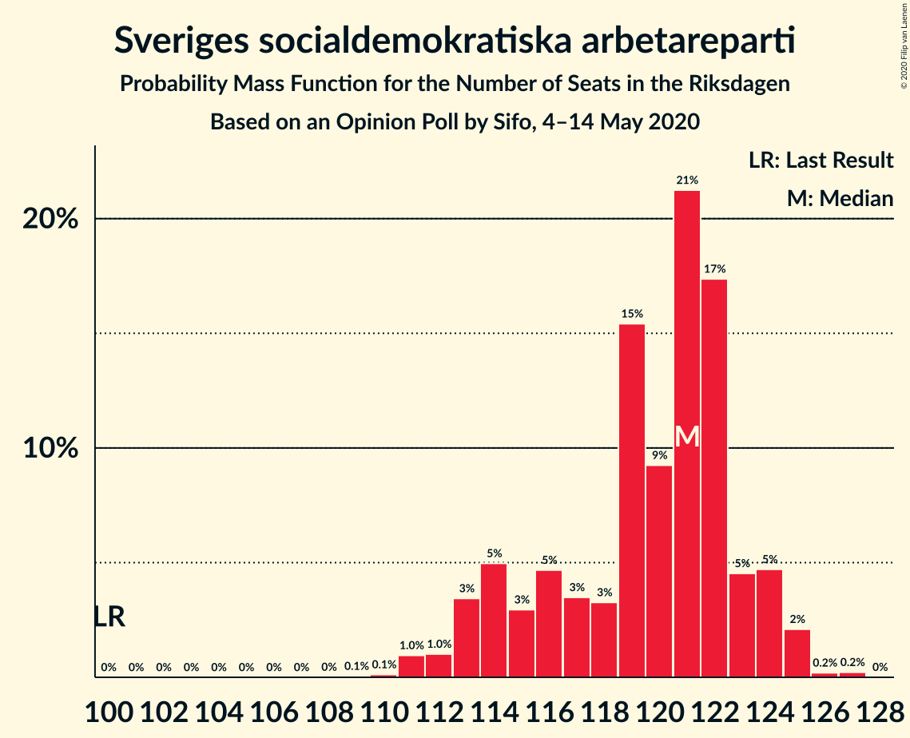
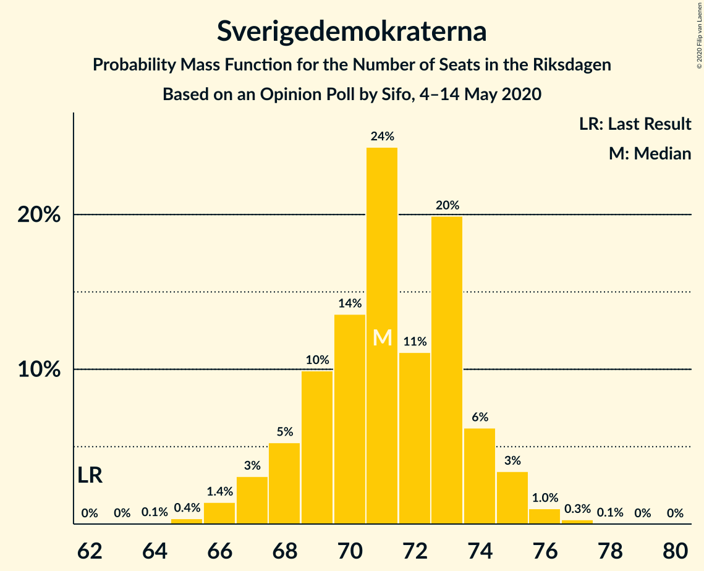
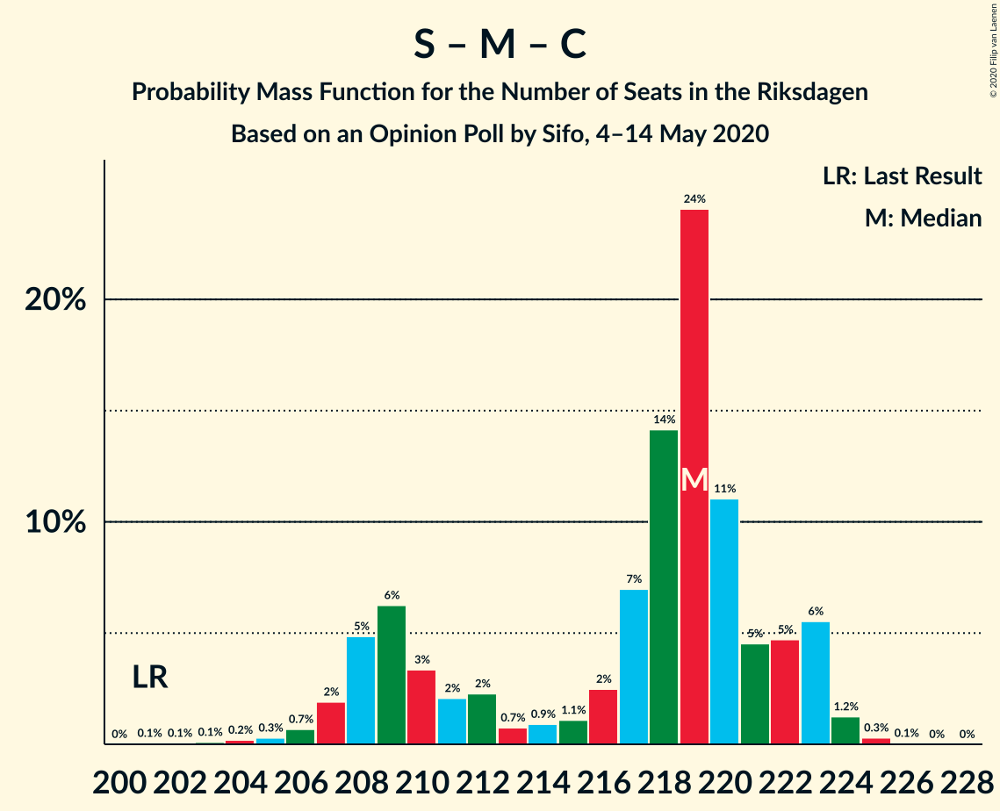

# Opinion Poll by Sifo, 4–14 May 2020

<a href="#voting-intentions">Voting Intentions</a> | <a href="#seats">Seats</a> | <a href="#coalitions">Coalitions</a> | <a href="#technical-information">Technical Information</a>

## Voting Intentions

### Confidence Intervals

| Party | Last Result | Poll Result | 80% Confidence Interval | 90% Confidence Interval | 95% Confidence Interval | 99% Confidence Interval |
|:-----:|:-----------:|:-----------:|:-----------------------:|:-----------------------:|:-----------------------:|:-----------------------:|
| Sveriges socialdemokratiska arbetareparti | 28.3% | 31.6% | 30.9–32.3% |30.7–32.5% |30.5–32.7% |30.2–33.0% |
| Sverigedemokraterna | 17.5% | 18.8% | 18.3–19.4% |18.1–19.6% |18.0–19.8% |17.7–20.0% |
| Moderata samlingspartiet | 19.8% | 18.5% | 18.0–19.1% |17.8–19.3% |17.7–19.5% |17.4–19.8% |
| Vänsterpartiet | 8.0% | 9.0% | 8.6–9.4% |8.4–9.5% |8.3–9.7% |8.1–9.9% |
| Centerpartiet | 8.6% | 7.2% | 6.8–7.6% |6.7–7.7% |6.6–7.8% |6.4–8.0% |
| Kristdemokraterna | 6.3% | 6.1% | 5.7–6.5% |5.6–6.6% |5.5–6.7% |5.4–6.8% |
| Miljöpartiet de gröna | 4.4% | 3.9% | 3.6–4.2% |3.5–4.3% |3.5–4.4% |3.3–4.5% |
| Liberalerna | 5.5% | 3.4% | 3.1–3.7% |3.1–3.8% |3.0–3.8% |2.9–4.0% |

*Note:* The poll result column reflects the actual value used in the calculations. Published results may vary slightly, and in addition be rounded to fewer digits.

## Seats

### Confidence Intervals

| Party | Last Result | Median | 80% Confidence Interval | 90% Confidence Interval | 95% Confidence Interval | 99% Confidence Interval |
|:-----:|:-----------:|:------:|:-----------------------:|:-----------------------:|:-----------------------:|:-----------------------:|
| <a href="#sveriges-socialdemokratiska-arbetareparti">Sveriges socialdemokratiska arbetareparti</a> | 100 | 121 | 114–123 |113–124 |113–125 |111–125 |
| <a href="#sverigedemokraterna">Sverigedemokraterna</a> | 62 | 71 | 68–74 |68–74 |67–75 |66–76 |
| <a href="#moderata-samlingspartiet">Moderata samlingspartiet</a> | 70 | 70 | 67–73 |66–73 |65–74 |64–75 |
| <a href="#vänsterpartiet">Vänsterpartiet</a> | 28 | 34 | 32–36 |32–36 |31–37 |30–37 |
| <a href="#centerpartiet">Centerpartiet</a> | 31 | 27 | 26–29 |25–29 |25–29 |24–30 |
| <a href="#kristdemokraterna">Kristdemokraterna</a> | 22 | 23 | 22–25 |21–25 |21–25 |20–26 |
| <a href="#miljöpartiet-de-gröna">Miljöpartiet de gröna</a> | 16 | 0 | 0–15 |0–16 |0–16 |0–17 |
| <a href="#liberalerna">Liberalerna</a> | 20 | 0 | 0 |0 |0 |0 |

### Sveriges socialdemokratiska arbetareparti

*For a full overview of the results for this party, see the [Sveriges socialdemokratiska arbetareparti](party-sverigessocialdemokratiskaarbetareparti.html) page.*

| Number of Seats | Probability | Accumulated | Special Marks |
|:---------------:|:-----------:|:-----------:|:-------------:|
| 100 | 0% | 100% | Last Result |
| 101 | 0% | 100% |  |
| 102 | 0% | 100% |  |
| 103 | 0% | 100% |  |
| 104 | 0% | 100% |  |
| 105 | 0% | 100% |  |
| 106 | 0% | 100% |  |
| 107 | 0% | 100% |  |
| 108 | 0% | 100% |  |
| 109 | 0.1% | 100% |  |
| 110 | 0.1% | 99.9% |  |
| 111 | 1.0% | 99.8% |  |
| 112 | 1.0% | 98.9% |  |
| 113 | 3% | 98% |  |
| 114 | 5% | 94% |  |
| 115 | 3% | 89% |  |
| 116 | 5% | 86% |  |
| 117 | 3% | 82% |  |
| 118 | 3% | 78% |  |
| 119 | 15% | 75% |  |
| 120 | 9% | 60% |  |
| 121 | 21% | 50% | Median |
| 122 | 17% | 29% |  |
| 123 | 5% | 12% |  |
| 124 | 5% | 7% |  |
| 125 | 2% | 3% |  |
| 126 | 0.2% | 0.4% |  |
| 127 | 0.2% | 0.2% |  |
| 128 | 0% | 0% |  |

### Sverigedemokraterna

*For a full overview of the results for this party, see the [Sverigedemokraterna](party-sverigedemokraterna.html) page.*

| Number of Seats | Probability | Accumulated | Special Marks |
|:---------------:|:-----------:|:-----------:|:-------------:|
| 62 | 0% | 100% | Last Result |
| 63 | 0% | 100% |  |
| 64 | 0.1% | 100% |  |
| 65 | 0.4% | 99.9% |  |
| 66 | 1.4% | 99.5% |  |
| 67 | 3% | 98% |  |
| 68 | 5% | 95% |  |
| 69 | 10% | 90% |  |
| 70 | 14% | 80% |  |
| 71 | 24% | 66% | Median |
| 72 | 11% | 42% |  |
| 73 | 20% | 31% |  |
| 74 | 6% | 11% |  |
| 75 | 3% | 5% |  |
| 76 | 1.0% | 1.3% |  |
| 77 | 0.3% | 0.3% |  |
| 78 | 0.1% | 0.1% |  |
| 79 | 0% | 0% |  |

### Moderata samlingspartiet

*For a full overview of the results for this party, see the [Moderata samlingspartiet](party-moderatasamlingspartiet.html) page.*

| Number of Seats | Probability | Accumulated | Special Marks |
|:---------------:|:-----------:|:-----------:|:-------------:|
| 63 | 0.1% | 100% |  |
| 64 | 2% | 99.9% |  |
| 65 | 1.5% | 98% |  |
| 66 | 3% | 97% |  |
| 67 | 6% | 94% |  |
| 68 | 11% | 88% |  |
| 69 | 15% | 77% |  |
| 70 | 18% | 62% | Last Result, Median |
| 71 | 13% | 44% |  |
| 72 | 19% | 31% |  |
| 73 | 8% | 12% |  |
| 74 | 3% | 4% |  |
| 75 | 0.9% | 1.1% |  |
| 76 | 0.2% | 0.2% |  |
| 77 | 0% | 0% |  |

### Vänsterpartiet

*For a full overview of the results for this party, see the [Vänsterpartiet](party-vänsterpartiet.html) page.*

| Number of Seats | Probability | Accumulated | Special Marks |
|:---------------:|:-----------:|:-----------:|:-------------:|
| 28 | 0% | 100% | Last Result |
| 29 | 0.1% | 100% |  |
| 30 | 0.7% | 99.9% |  |
| 31 | 4% | 99.3% |  |
| 32 | 9% | 96% |  |
| 33 | 22% | 87% |  |
| 34 | 23% | 65% | Median |
| 35 | 28% | 42% |  |
| 36 | 10% | 14% |  |
| 37 | 4% | 4% |  |
| 38 | 0.4% | 0.4% |  |
| 39 | 0.1% | 0.1% |  |
| 40 | 0% | 0% |  |

### Centerpartiet

*For a full overview of the results for this party, see the [Centerpartiet](party-centerpartiet.html) page.*

| Number of Seats | Probability | Accumulated | Special Marks |
|:---------------:|:-----------:|:-----------:|:-------------:|
| 23 | 0.1% | 100% |  |
| 24 | 2% | 99.9% |  |
| 25 | 7% | 98% |  |
| 26 | 22% | 91% |  |
| 27 | 25% | 70% | Median |
| 28 | 27% | 45% |  |
| 29 | 15% | 18% |  |
| 30 | 2% | 2% |  |
| 31 | 0.3% | 0.3% | Last Result |
| 32 | 0% | 0% |  |

### Kristdemokraterna

*For a full overview of the results for this party, see the [Kristdemokraterna](party-kristdemokraterna.html) page.*

| Number of Seats | Probability | Accumulated | Special Marks |
|:---------------:|:-----------:|:-----------:|:-------------:|
| 19 | 0.1% | 100% |  |
| 20 | 1.2% | 99.9% |  |
| 21 | 7% | 98.7% |  |
| 22 | 21% | 92% | Last Result |
| 23 | 30% | 71% | Median |
| 24 | 29% | 41% |  |
| 25 | 10% | 11% |  |
| 26 | 1.2% | 1.4% |  |
| 27 | 0.1% | 0.1% |  |
| 28 | 0% | 0% |  |

### Miljöpartiet de gröna

*For a full overview of the results for this party, see the [Miljöpartiet de gröna](party-miljöpartietdegröna.html) page.*

| Number of Seats | Probability | Accumulated | Special Marks |
|:---------------:|:-----------:|:-----------:|:-------------:|
| 0 | 77% | 100% | Median |
| 1 | 0% | 23% |  |
| 2 | 0% | 23% |  |
| 3 | 0% | 23% |  |
| 4 | 0% | 23% |  |
| 5 | 0% | 23% |  |
| 6 | 0% | 23% |  |
| 7 | 0% | 23% |  |
| 8 | 0% | 23% |  |
| 9 | 0% | 23% |  |
| 10 | 0% | 23% |  |
| 11 | 0% | 23% |  |
| 12 | 0% | 23% |  |
| 13 | 0% | 23% |  |
| 14 | 0% | 23% |  |
| 15 | 15% | 23% |  |
| 16 | 8% | 9% | Last Result |
| 17 | 0.5% | 0.5% |  |
| 18 | 0% | 0% |  |

### Liberalerna

*For a full overview of the results for this party, see the [Liberalerna](party-liberalerna.html) page.*

| Number of Seats | Probability | Accumulated | Special Marks |
|:---------------:|:-----------:|:-----------:|:-------------:|
| 0 | 99.7% | 100% | Median |
| 1 | 0% | 0.3% |  |
| 2 | 0% | 0.3% |  |
| 3 | 0% | 0.3% |  |
| 4 | 0% | 0.3% |  |
| 5 | 0% | 0.3% |  |
| 6 | 0% | 0.3% |  |
| 7 | 0% | 0.3% |  |
| 8 | 0% | 0.3% |  |
| 9 | 0% | 0.3% |  |
| 10 | 0% | 0.3% |  |
| 11 | 0% | 0.3% |  |
| 12 | 0% | 0.3% |  |
| 13 | 0% | 0.3% |  |
| 14 | 0.1% | 0.3% |  |
| 15 | 0.2% | 0.2% |  |
| 16 | 0% | 0% |  |
| 17 | 0% | 0% |  |
| 18 | 0% | 0% |  |
| 19 | 0% | 0% |  |
| 20 | 0% | 0% | Last Result |

## Coalitions

### Confidence Intervals

| Coalition | Last Result | Median | Majority? | 80% Confidence Interval | 90% Confidence Interval | 95% Confidence Interval | 99% Confidence Interval |
|:---------:|:-----------:|:------:|:---------:|:-----------------------:|:-----------------------:|:-----------------------:|:-----------------------:|
| Sveriges socialdemokratiska arbetareparti – Moderata samlingspartiet – Centerpartiet | 201 | 219 | 100% | 209–222 | 208–223 | 207–223 | 205–224 |
| Sveriges socialdemokratiska arbetareparti – Moderata samlingspartiet | 170 | 191 | 100% | 182–194 | 181–196 | 181–196 | 178–197 |
| Sveriges socialdemokratiska arbetareparti – Vänsterpartiet – Centerpartiet – Miljöpartiet de gröna – Liberalerna | 195 | 184 | 100% | 181–190 | 179–192 | 179–193 | 178–195 |
| Sverigedemokraterna – Moderata samlingspartiet – Kristdemokraterna | 154 | 165 | 0% | 159–168 | 157–170 | 156–170 | 154–171 |
| Sveriges socialdemokratiska arbetareparti – Vänsterpartiet – Miljöpartiet de gröna | 144 | 156 | 0% | 153–164 | 152–165 | 152–167 | 150–168 |
| Sveriges socialdemokratiska arbetareparti – Centerpartiet – Miljöpartiet de gröna – Liberalerna | 167 | 149 | 0% | 146–157 | 145–159 | 145–160 | 143–162 |
| Sveriges socialdemokratiska arbetareparti – Vänsterpartiet | 128 | 155 | 0% | 147–157 | 146–158 | 145–159 | 144–160 |
| Sverigedemokraterna – Moderata samlingspartiet | 132 | 142 | 0% | 136–145 | 135–146 | 134–147 | 132–148 |
| Sveriges socialdemokratiska arbetareparti – Miljöpartiet de gröna | 116 | 122 | 0% | 119–131 | 119–133 | 117–134 | 116–136 |
| Moderata samlingspartiet – Centerpartiet – Kristdemokraterna – Liberalerna | 143 | 121 | 0% | 116–124 | 114–125 | 113–125 | 112–127 |
| Moderata samlingspartiet – Centerpartiet – Kristdemokraterna | 123 | 121 | 0% | 116–124 | 114–125 | 113–125 | 112–127 |
| Moderata samlingspartiet – Centerpartiet – Liberalerna | 121 | 98 | 0% | 94–100 | 92–101 | 91–102 | 90–104 |
| Moderata samlingspartiet – Centerpartiet | 101 | 98 | 0% | 94–100 | 92–101 | 91–101 | 90–103 |

### Sveriges socialdemokratiska arbetareparti – Moderata samlingspartiet – Centerpartiet

| Number of Seats | Probability | Accumulated | Special Marks |
|:---------------:|:-----------:|:-----------:|:-------------:|
| 201 | 0.1% | 100% | Last Result |
| 202 | 0.1% | 99.9% |  |
| 203 | 0.1% | 99.9% |  |
| 204 | 0.2% | 99.8% |  |
| 205 | 0.3% | 99.6% |  |
| 206 | 0.7% | 99.3% |  |
| 207 | 2% | 98.6% |  |
| 208 | 5% | 97% |  |
| 209 | 6% | 92% |  |
| 210 | 3% | 86% |  |
| 211 | 2% | 82% |  |
| 212 | 2% | 80% |  |
| 213 | 0.7% | 78% |  |
| 214 | 0.9% | 77% |  |
| 215 | 1.1% | 76% |  |
| 216 | 2% | 75% |  |
| 217 | 7% | 73% |  |
| 218 | 14% | 66% | Median |
| 219 | 24% | 51% |  |
| 220 | 11% | 27% |  |
| 221 | 5% | 16% |  |
| 222 | 5% | 12% |  |
| 223 | 6% | 7% |  |
| 224 | 1.2% | 2% |  |
| 225 | 0.3% | 0.4% |  |
| 226 | 0.1% | 0.1% |  |
| 227 | 0% | 0% |  |

### Sveriges socialdemokratiska arbetareparti – Moderata samlingspartiet

| Number of Seats | Probability | Accumulated | Special Marks |
|:---------------:|:-----------:|:-----------:|:-------------:|
| 170 | 0% | 100% | Last Result |
| 171 | 0% | 100% |  |
| 172 | 0% | 100% |  |
| 173 | 0% | 100% |  |
| 174 | 0% | 100% |  |
| 175 | 0% | 100% | Majority |
| 176 | 0.1% | 100% |  |
| 177 | 0.1% | 99.9% |  |
| 178 | 0.4% | 99.8% |  |
| 179 | 0.3% | 99.4% |  |
| 180 | 0.7% | 99.1% |  |
| 181 | 4% | 98% |  |
| 182 | 7% | 94% |  |
| 183 | 3% | 87% |  |
| 184 | 3% | 84% |  |
| 185 | 2% | 81% |  |
| 186 | 2% | 80% |  |
| 187 | 2% | 77% |  |
| 188 | 1.2% | 76% |  |
| 189 | 3% | 75% |  |
| 190 | 16% | 72% |  |
| 191 | 21% | 56% | Median |
| 192 | 8% | 34% |  |
| 193 | 12% | 27% |  |
| 194 | 7% | 15% |  |
| 195 | 3% | 8% |  |
| 196 | 3% | 5% |  |
| 197 | 2% | 2% |  |
| 198 | 0.1% | 0.1% |  |
| 199 | 0% | 0% |  |

### Sveriges socialdemokratiska arbetareparti – Vänsterpartiet – Centerpartiet – Miljöpartiet de gröna – Liberalerna

| Number of Seats | Probability | Accumulated | Special Marks |
|:---------------:|:-----------:|:-----------:|:-------------:|
| 176 | 0.1% | 100% |  |
| 177 | 0.2% | 99.9% |  |
| 178 | 1.2% | 99.7% |  |
| 179 | 4% | 98% |  |
| 180 | 3% | 94% |  |
| 181 | 8% | 91% |  |
| 182 | 17% | 83% | Median |
| 183 | 9% | 65% |  |
| 184 | 16% | 57% |  |
| 185 | 10% | 40% |  |
| 186 | 6% | 30% |  |
| 187 | 3% | 24% |  |
| 188 | 4% | 21% |  |
| 189 | 4% | 18% |  |
| 190 | 4% | 14% |  |
| 191 | 4% | 10% |  |
| 192 | 3% | 6% |  |
| 193 | 2% | 4% |  |
| 194 | 0.6% | 2% |  |
| 195 | 0.8% | 1.0% | Last Result |
| 196 | 0.1% | 0.3% |  |
| 197 | 0.1% | 0.1% |  |
| 198 | 0% | 0% |  |

### Sverigedemokraterna – Moderata samlingspartiet – Kristdemokraterna

| Number of Seats | Probability | Accumulated | Special Marks |
|:---------------:|:-----------:|:-----------:|:-------------:|
| 152 | 0.1% | 100% |  |
| 153 | 0.1% | 99.9% |  |
| 154 | 0.8% | 99.7% | Last Result |
| 155 | 0.6% | 99.0% |  |
| 156 | 2% | 98% |  |
| 157 | 3% | 96% |  |
| 158 | 4% | 94% |  |
| 159 | 4% | 90% |  |
| 160 | 4% | 86% |  |
| 161 | 4% | 82% |  |
| 162 | 3% | 79% |  |
| 163 | 6% | 76% |  |
| 164 | 10% | 70% | Median |
| 165 | 16% | 60% |  |
| 166 | 9% | 43% |  |
| 167 | 17% | 35% |  |
| 168 | 8% | 17% |  |
| 169 | 3% | 9% |  |
| 170 | 4% | 6% |  |
| 171 | 1.2% | 2% |  |
| 172 | 0.2% | 0.3% |  |
| 173 | 0.1% | 0.1% |  |
| 174 | 0% | 0% |  |

### Sveriges socialdemokratiska arbetareparti – Vänsterpartiet – Miljöpartiet de gröna

| Number of Seats | Probability | Accumulated | Special Marks |
|:---------------:|:-----------:|:-----------:|:-------------:|
| 144 | 0% | 100% | Last Result |
| 145 | 0% | 100% |  |
| 146 | 0% | 100% |  |
| 147 | 0% | 99.9% |  |
| 148 | 0.1% | 99.9% |  |
| 149 | 0.2% | 99.9% |  |
| 150 | 0.6% | 99.6% |  |
| 151 | 0.9% | 99.0% |  |
| 152 | 4% | 98% |  |
| 153 | 7% | 94% |  |
| 154 | 10% | 87% |  |
| 155 | 14% | 77% | Median |
| 156 | 19% | 63% |  |
| 157 | 12% | 44% |  |
| 158 | 5% | 32% |  |
| 159 | 4% | 27% |  |
| 160 | 2% | 23% |  |
| 161 | 2% | 21% |  |
| 162 | 4% | 19% |  |
| 163 | 4% | 16% |  |
| 164 | 3% | 12% |  |
| 165 | 4% | 8% |  |
| 166 | 2% | 5% |  |
| 167 | 2% | 3% |  |
| 168 | 1.2% | 1.4% |  |
| 169 | 0.2% | 0.2% |  |
| 170 | 0% | 0.1% |  |
| 171 | 0% | 0% |  |

### Sveriges socialdemokratiska arbetareparti – Centerpartiet – Miljöpartiet de gröna – Liberalerna

| Number of Seats | Probability | Accumulated | Special Marks |
|:---------------:|:-----------:|:-----------:|:-------------:|
| 142 | 0.1% | 100% |  |
| 143 | 0.4% | 99.8% |  |
| 144 | 2% | 99.5% |  |
| 145 | 3% | 98% |  |
| 146 | 5% | 95% |  |
| 147 | 16% | 90% |  |
| 148 | 15% | 74% | Median |
| 149 | 13% | 59% |  |
| 150 | 8% | 46% |  |
| 151 | 9% | 38% |  |
| 152 | 3% | 28% |  |
| 153 | 3% | 25% |  |
| 154 | 2% | 22% |  |
| 155 | 2% | 21% |  |
| 156 | 5% | 18% |  |
| 157 | 4% | 14% |  |
| 158 | 4% | 10% |  |
| 159 | 3% | 6% |  |
| 160 | 1.3% | 4% |  |
| 161 | 2% | 2% |  |
| 162 | 0.4% | 0.7% |  |
| 163 | 0.2% | 0.3% |  |
| 164 | 0% | 0.2% |  |
| 165 | 0.1% | 0.1% |  |
| 166 | 0% | 0.1% |  |
| 167 | 0% | 0% | Last Result |

### Sveriges socialdemokratiska arbetareparti – Vänsterpartiet

| Number of Seats | Probability | Accumulated | Special Marks |
|:---------------:|:-----------:|:-----------:|:-------------:|
| 128 | 0% | 100% | Last Result |
| 129 | 0% | 100% |  |
| 130 | 0% | 100% |  |
| 131 | 0% | 100% |  |
| 132 | 0% | 100% |  |
| 133 | 0% | 100% |  |
| 134 | 0% | 100% |  |
| 135 | 0% | 100% |  |
| 136 | 0% | 100% |  |
| 137 | 0% | 100% |  |
| 138 | 0% | 100% |  |
| 139 | 0% | 100% |  |
| 140 | 0% | 100% |  |
| 141 | 0% | 100% |  |
| 142 | 0.1% | 100% |  |
| 143 | 0.3% | 99.9% |  |
| 144 | 1.0% | 99.5% |  |
| 145 | 2% | 98.5% |  |
| 146 | 2% | 97% |  |
| 147 | 5% | 95% |  |
| 148 | 3% | 90% |  |
| 149 | 3% | 86% |  |
| 150 | 4% | 83% |  |
| 151 | 2% | 79% |  |
| 152 | 5% | 77% |  |
| 153 | 8% | 72% |  |
| 154 | 10% | 64% |  |
| 155 | 14% | 54% | Median |
| 156 | 19% | 40% |  |
| 157 | 12% | 21% |  |
| 158 | 5% | 9% |  |
| 159 | 3% | 4% |  |
| 160 | 0.7% | 1.0% |  |
| 161 | 0.2% | 0.4% |  |
| 162 | 0.1% | 0.2% |  |
| 163 | 0% | 0% |  |

### Sverigedemokraterna – Moderata samlingspartiet

| Number of Seats | Probability | Accumulated | Special Marks |
|:---------------:|:-----------:|:-----------:|:-------------:|
| 130 | 0% | 100% |  |
| 131 | 0.2% | 99.9% |  |
| 132 | 0.9% | 99.8% | Last Result |
| 133 | 1.0% | 98.9% |  |
| 134 | 2% | 98% |  |
| 135 | 3% | 95% |  |
| 136 | 4% | 93% |  |
| 137 | 4% | 89% |  |
| 138 | 5% | 85% |  |
| 139 | 4% | 80% |  |
| 140 | 9% | 76% |  |
| 141 | 12% | 66% | Median |
| 142 | 13% | 55% |  |
| 143 | 18% | 42% |  |
| 144 | 10% | 24% |  |
| 145 | 7% | 14% |  |
| 146 | 3% | 7% |  |
| 147 | 2% | 3% |  |
| 148 | 0.5% | 0.8% |  |
| 149 | 0.2% | 0.3% |  |
| 150 | 0% | 0.1% |  |
| 151 | 0% | 0% |  |

### Sveriges socialdemokratiska arbetareparti – Miljöpartiet de gröna

| Number of Seats | Probability | Accumulated | Special Marks |
|:---------------:|:-----------:|:-----------:|:-------------:|
| 113 | 0% | 100% |  |
| 114 | 0.1% | 99.9% |  |
| 115 | 0.2% | 99.9% |  |
| 116 | 0.4% | 99.7% | Last Result |
| 117 | 2% | 99.3% |  |
| 118 | 2% | 97% |  |
| 119 | 13% | 95% |  |
| 120 | 9% | 82% |  |
| 121 | 21% | 73% | Median |
| 122 | 17% | 52% |  |
| 123 | 5% | 35% |  |
| 124 | 5% | 30% |  |
| 125 | 2% | 26% |  |
| 126 | 1.1% | 24% |  |
| 127 | 1.2% | 22% |  |
| 128 | 1.5% | 21% |  |
| 129 | 5% | 20% |  |
| 130 | 3% | 15% |  |
| 131 | 4% | 11% |  |
| 132 | 2% | 8% |  |
| 133 | 2% | 5% |  |
| 134 | 3% | 4% |  |
| 135 | 0.3% | 0.8% |  |
| 136 | 0.5% | 0.5% |  |
| 137 | 0.1% | 0.1% |  |
| 138 | 0% | 0% |  |

### Moderata samlingspartiet – Centerpartiet – Kristdemokraterna – Liberalerna

| Number of Seats | Probability | Accumulated | Special Marks |
|:---------------:|:-----------:|:-----------:|:-------------:|
| 110 | 0.1% | 100% |  |
| 111 | 0.1% | 99.9% |  |
| 112 | 0.9% | 99.8% |  |
| 113 | 2% | 98.9% |  |
| 114 | 2% | 97% |  |
| 115 | 3% | 95% |  |
| 116 | 4% | 92% |  |
| 117 | 6% | 88% |  |
| 118 | 5% | 82% |  |
| 119 | 7% | 77% |  |
| 120 | 11% | 69% | Median |
| 121 | 12% | 58% |  |
| 122 | 22% | 46% |  |
| 123 | 10% | 24% |  |
| 124 | 6% | 14% |  |
| 125 | 6% | 7% |  |
| 126 | 0.9% | 2% |  |
| 127 | 0.5% | 0.8% |  |
| 128 | 0.1% | 0.3% |  |
| 129 | 0% | 0.2% |  |
| 130 | 0% | 0.2% |  |
| 131 | 0% | 0.1% |  |
| 132 | 0% | 0.1% |  |
| 133 | 0% | 0.1% |  |
| 134 | 0% | 0% |  |
| 135 | 0% | 0% |  |
| 136 | 0% | 0% |  |
| 137 | 0% | 0% |  |
| 138 | 0% | 0% |  |
| 139 | 0% | 0% |  |
| 140 | 0% | 0% |  |
| 141 | 0% | 0% |  |
| 142 | 0% | 0% |  |
| 143 | 0% | 0% | Last Result |

### Moderata samlingspartiet – Centerpartiet – Kristdemokraterna

| Number of Seats | Probability | Accumulated | Special Marks |
|:---------------:|:-----------:|:-----------:|:-------------:|
| 109 | 0% | 100% |  |
| 110 | 0.1% | 99.9% |  |
| 111 | 0.1% | 99.9% |  |
| 112 | 1.0% | 99.7% |  |
| 113 | 2% | 98.7% |  |
| 114 | 2% | 97% |  |
| 115 | 3% | 95% |  |
| 116 | 4% | 92% |  |
| 117 | 6% | 88% |  |
| 118 | 5% | 82% |  |
| 119 | 7% | 76% |  |
| 120 | 11% | 69% | Median |
| 121 | 12% | 58% |  |
| 122 | 22% | 46% |  |
| 123 | 10% | 23% | Last Result |
| 124 | 6% | 13% |  |
| 125 | 6% | 7% |  |
| 126 | 0.9% | 1.5% |  |
| 127 | 0.5% | 0.6% |  |
| 128 | 0.1% | 0.1% |  |
| 129 | 0% | 0% |  |

### Moderata samlingspartiet – Centerpartiet – Liberalerna

| Number of Seats | Probability | Accumulated | Special Marks |
|:---------------:|:-----------:|:-----------:|:-------------:|
| 88 | 0% | 100% |  |
| 89 | 0.1% | 99.9% |  |
| 90 | 1.1% | 99.8% |  |
| 91 | 2% | 98.7% |  |
| 92 | 3% | 97% |  |
| 93 | 2% | 94% |  |
| 94 | 6% | 91% |  |
| 95 | 7% | 86% |  |
| 96 | 11% | 79% |  |
| 97 | 10% | 68% | Median |
| 98 | 26% | 58% |  |
| 99 | 11% | 31% |  |
| 100 | 12% | 20% |  |
| 101 | 6% | 9% |  |
| 102 | 1.5% | 3% |  |
| 103 | 0.5% | 1.1% |  |
| 104 | 0.3% | 0.5% |  |
| 105 | 0% | 0.3% |  |
| 106 | 0.1% | 0.2% |  |
| 107 | 0% | 0.2% |  |
| 108 | 0% | 0.2% |  |
| 109 | 0% | 0.1% |  |
| 110 | 0% | 0.1% |  |
| 111 | 0% | 0.1% |  |
| 112 | 0% | 0% |  |
| 113 | 0% | 0% |  |
| 114 | 0% | 0% |  |
| 115 | 0% | 0% |  |
| 116 | 0% | 0% |  |
| 117 | 0% | 0% |  |
| 118 | 0% | 0% |  |
| 119 | 0% | 0% |  |
| 120 | 0% | 0% |  |
| 121 | 0% | 0% | Last Result |

### Moderata samlingspartiet – Centerpartiet

| Number of Seats | Probability | Accumulated | Special Marks |
|:---------------:|:-----------:|:-----------:|:-------------:|
| 88 | 0.1% | 100% |  |
| 89 | 0.1% | 99.9% |  |
| 90 | 1.2% | 99.8% |  |
| 91 | 2% | 98.6% |  |
| 92 | 3% | 97% |  |
| 93 | 2% | 93% |  |
| 94 | 6% | 91% |  |
| 95 | 7% | 85% |  |
| 96 | 11% | 78% |  |
| 97 | 10% | 67% | Median |
| 98 | 26% | 57% |  |
| 99 | 11% | 31% |  |
| 100 | 12% | 20% |  |
| 101 | 6% | 8% | Last Result |
| 102 | 1.4% | 2% |  |
| 103 | 0.5% | 0.8% |  |
| 104 | 0.2% | 0.3% |  |
| 105 | 0% | 0% |  |

## Technical Information

### Opinion Poll

+ **Polling firm:** Sifo
+ **Commissioner(s):** —
+ **Fieldwork period:** 4–14 May 2020

### Calculations

+ **Sample size:** 7310
+ **Simulations done:** 1,048,576
+ **Error estimate:** 0.49%

