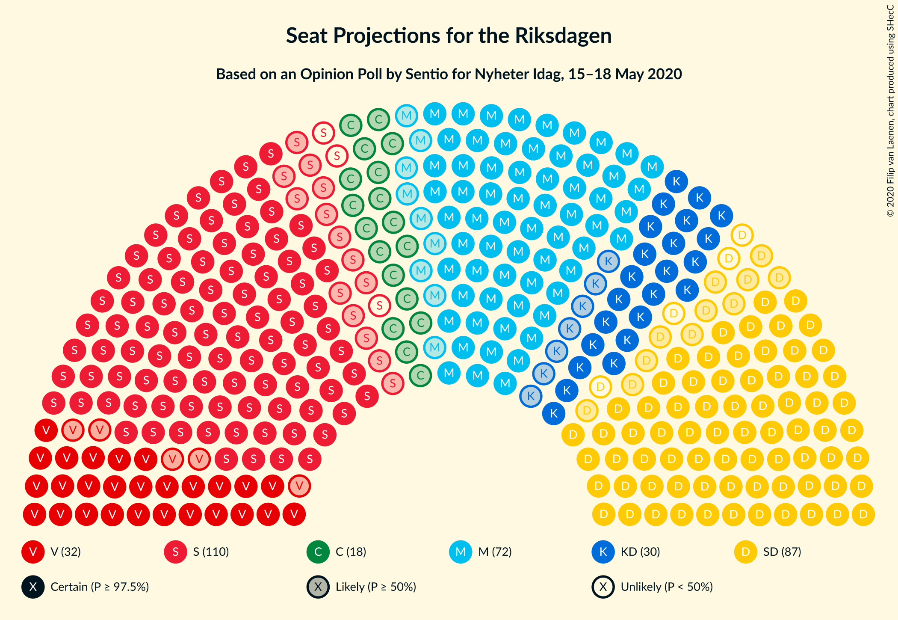
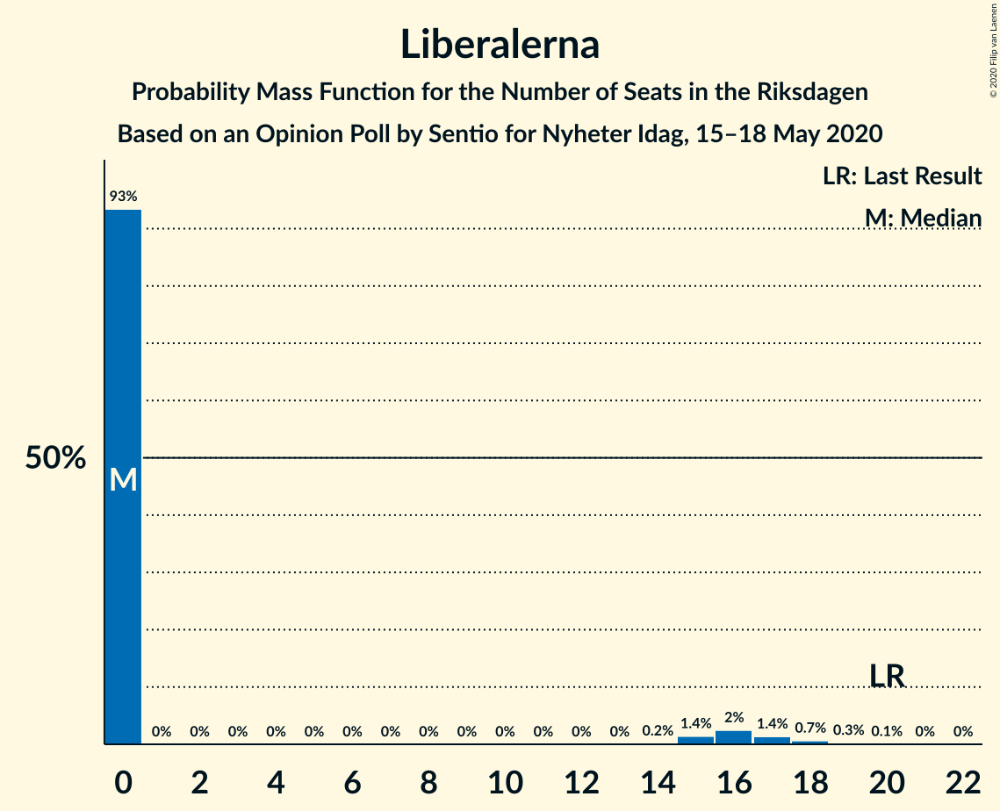
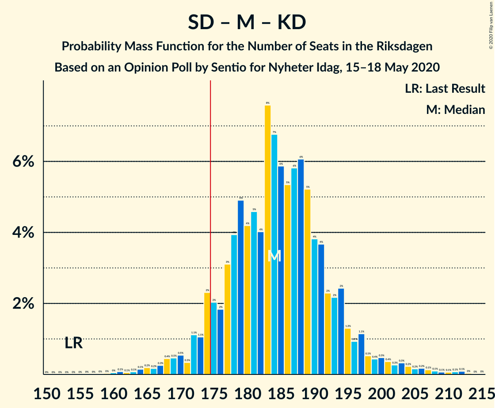
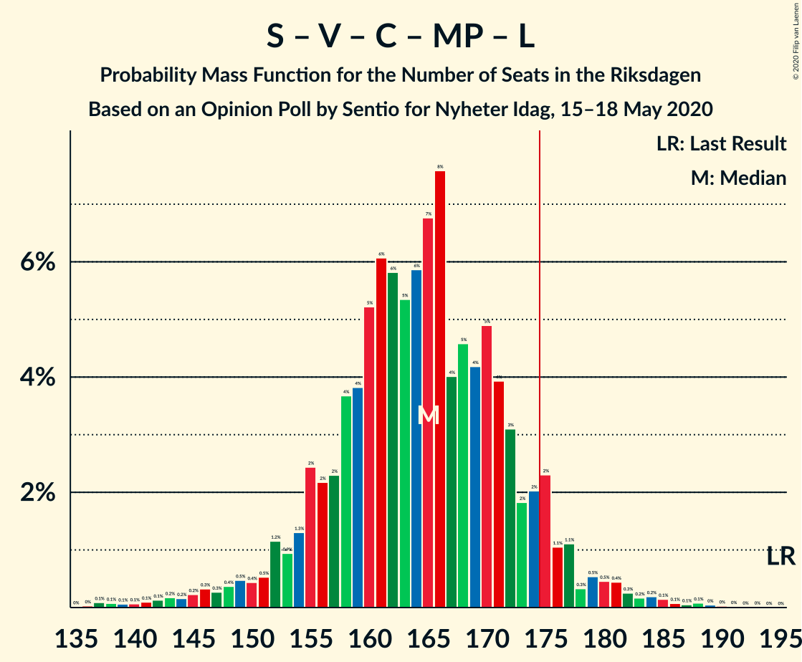
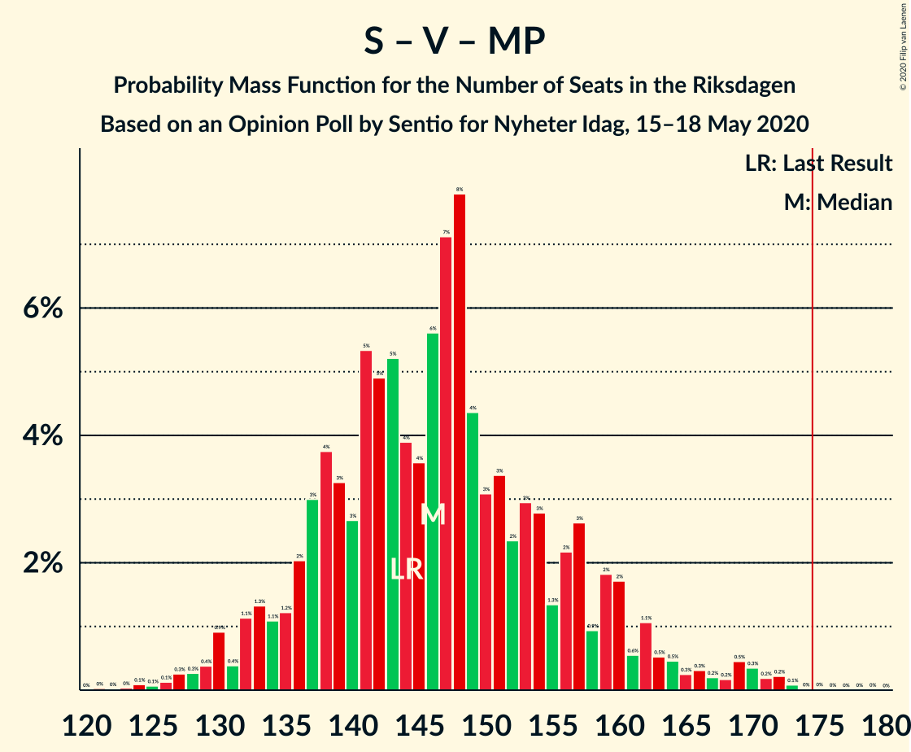

# Opinion Poll by Sentio for Nyheter Idag, 15–18 May 2020

<a href="#voting-intentions">Voting Intentions</a> | <a href="#seats">Seats</a> | <a href="#coalitions">Coalitions</a> | <a href="#technical-information">Technical Information</a>

## Voting Intentions

### Confidence Intervals

| Party | Last Result | Poll Result | 80% Confidence Interval | 90% Confidence Interval | 95% Confidence Interval | 99% Confidence Interval |
|:-----:|:-----------:|:-----------:|:-----------------------:|:-----------------------:|:-----------------------:|:-----------------------:|
| Sveriges socialdemokratiska arbetareparti | 28.3% | 28.1% | 26.2–30.3% |25.6–30.9% |25.1–31.4% |24.2–32.4% |
| Sverigedemokraterna | 17.5% | 22.2% | 20.4–24.2% |19.9–24.7% |19.4–25.2% |18.6–26.2% |
| Moderata samlingspartiet | 19.8% | 19.4% | 17.7–21.3% |17.2–21.8% |16.8–22.3% |16.0–23.2% |
| Vänsterpartiet | 8.0% | 9.3% | 8.0–10.7% |7.7–11.1% |7.4–11.5% |6.9–12.2% |
| Kristdemokraterna | 6.3% | 7.7% | 6.6–9.1% |6.3–9.5% |6.1–9.8% |5.6–10.5% |
| Centerpartiet | 8.6% | 4.7% | 3.9–5.8% |3.6–6.1% |3.4–6.4% |3.0–7.0% |
| Miljöpartiet de gröna | 4.4% | 3.5% | 2.8–4.6% |2.6–4.8% |2.5–5.1% |2.2–5.6% |
| Liberalerna | 5.5% | 3.0% | 2.4–4.0% |2.2–4.3% |2.1–4.5% |1.8–5.0% |

*Note:* The poll result column reflects the actual value used in the calculations. Published results may vary slightly, and in addition be rounded to fewer digits.

## Seats

### Confidence Intervals

| Party | Last Result | Median | 80% Confidence Interval | 90% Confidence Interval | 95% Confidence Interval | 99% Confidence Interval |
|:-----:|:-----------:|:------:|:-----------------------:|:-----------------------:|:-----------------------:|:-----------------------:|
| <a href="#sveriges-socialdemokratiska-arbetareparti">Sveriges socialdemokratiska arbetareparti</a> | 100 | 107 | 98–116 |95–118 |93–121 |89–125 |
| <a href="#sverigedemokraterna">Sverigedemokraterna</a> | 62 | 83 | 76–91 |74–93 |72–95 |69–100 |
| <a href="#moderata-samlingspartiet">Moderata samlingspartiet</a> | 70 | 72 | 66–78 |64–80 |63–83 |59–90 |
| <a href="#vänsterpartiet">Vänsterpartiet</a> | 28 | 32 | 29–42 |28–43 |27–45 |26–47 |
| <a href="#kristdemokraterna">Kristdemokraterna</a> | 22 | 30 | 25–34 |24–35 |23–37 |21–39 |
| <a href="#centerpartiet">Centerpartiet</a> | 31 | 18 | 15–21 |0–23 |0–24 |0–26 |
| <a href="#miljöpartiet-de-gröna">Miljöpartiet de gröna</a> | 16 | 0 | 0–17 |0–18 |0–19 |0–21 |
| <a href="#liberalerna">Liberalerna</a> | 20 | 0 | 0 |0–15 |0–16 |0–18 |

### Sveriges socialdemokratiska arbetareparti

*For a full overview of the results for this party, see the [Sveriges socialdemokratiska arbetareparti](party-sverigessocialdemokratiskaarbetareparti.html) page.*

| Number of Seats | Probability | Accumulated | Special Marks |
|:---------------:|:-----------:|:-----------:|:-------------:|
| 84 | 0% | 100% |  |
| 85 | 0% | 99.9% |  |
| 86 | 0.1% | 99.9% |  |
| 87 | 0.1% | 99.8% |  |
| 88 | 0.1% | 99.7% |  |
| 89 | 0.2% | 99.6% |  |
| 90 | 0.3% | 99.4% |  |
| 91 | 0.3% | 99.1% |  |
| 92 | 0.7% | 98.8% |  |
| 93 | 1.0% | 98% |  |
| 94 | 1.0% | 97% |  |
| 95 | 1.2% | 96% |  |
| 96 | 2% | 95% |  |
| 97 | 2% | 93% |  |
| 98 | 2% | 91% |  |
| 99 | 2% | 88% |  |
| 100 | 4% | 86% | Last Result |
| 101 | 7% | 82% |  |
| 102 | 3% | 76% |  |
| 103 | 6% | 73% |  |
| 104 | 4% | 66% |  |
| 105 | 4% | 62% |  |
| 106 | 4% | 58% |  |
| 107 | 5% | 54% | Median |
| 108 | 5% | 49% |  |
| 109 | 7% | 44% |  |
| 110 | 6% | 37% |  |
| 111 | 3% | 31% |  |
| 112 | 3% | 27% |  |
| 113 | 5% | 24% |  |
| 114 | 3% | 20% |  |
| 115 | 3% | 16% |  |
| 116 | 5% | 14% |  |
| 117 | 2% | 9% |  |
| 118 | 2% | 6% |  |
| 119 | 1.2% | 5% |  |
| 120 | 0.7% | 3% |  |
| 121 | 0.8% | 3% |  |
| 122 | 0.4% | 2% |  |
| 123 | 0.5% | 1.4% |  |
| 124 | 0.3% | 0.9% |  |
| 125 | 0.1% | 0.6% |  |
| 126 | 0.2% | 0.5% |  |
| 127 | 0% | 0.3% |  |
| 128 | 0.2% | 0.3% |  |
| 129 | 0% | 0.1% |  |
| 130 | 0% | 0.1% |  |
| 131 | 0% | 0% |  |

### Sverigedemokraterna

*For a full overview of the results for this party, see the [Sverigedemokraterna](party-sverigedemokraterna.html) page.*

| Number of Seats | Probability | Accumulated | Special Marks |
|:---------------:|:-----------:|:-----------:|:-------------:|
| 62 | 0% | 100% | Last Result |
| 63 | 0% | 100% |  |
| 64 | 0% | 100% |  |
| 65 | 0% | 100% |  |
| 66 | 0.1% | 99.9% |  |
| 67 | 0.1% | 99.9% |  |
| 68 | 0.2% | 99.8% |  |
| 69 | 0.3% | 99.5% |  |
| 70 | 0.5% | 99.2% |  |
| 71 | 0.5% | 98.7% |  |
| 72 | 1.2% | 98% |  |
| 73 | 2% | 97% |  |
| 74 | 2% | 95% |  |
| 75 | 3% | 93% |  |
| 76 | 5% | 91% |  |
| 77 | 2% | 86% |  |
| 78 | 4% | 84% |  |
| 79 | 6% | 80% |  |
| 80 | 8% | 74% |  |
| 81 | 6% | 66% |  |
| 82 | 6% | 60% |  |
| 83 | 7% | 54% | Median |
| 84 | 7% | 47% |  |
| 85 | 5% | 40% |  |
| 86 | 5% | 35% |  |
| 87 | 8% | 30% |  |
| 88 | 3% | 22% |  |
| 89 | 5% | 18% |  |
| 90 | 3% | 14% |  |
| 91 | 3% | 11% |  |
| 92 | 1.1% | 8% |  |
| 93 | 3% | 7% |  |
| 94 | 2% | 4% |  |
| 95 | 0.8% | 3% |  |
| 96 | 0.6% | 2% |  |
| 97 | 0.3% | 1.4% |  |
| 98 | 0.3% | 1.0% |  |
| 99 | 0.1% | 0.7% |  |
| 100 | 0.4% | 0.6% |  |
| 101 | 0.1% | 0.2% |  |
| 102 | 0.1% | 0.2% |  |
| 103 | 0% | 0.1% |  |
| 104 | 0% | 0% |  |

### Moderata samlingspartiet

*For a full overview of the results for this party, see the [Moderata samlingspartiet](party-moderatasamlingspartiet.html) page.*

| Number of Seats | Probability | Accumulated | Special Marks |
|:---------------:|:-----------:|:-----------:|:-------------:|
| 55 | 0% | 100% |  |
| 56 | 0.1% | 99.9% |  |
| 57 | 0.1% | 99.9% |  |
| 58 | 0.1% | 99.8% |  |
| 59 | 0.3% | 99.6% |  |
| 60 | 0.3% | 99.4% |  |
| 61 | 0.6% | 99.1% |  |
| 62 | 0.9% | 98.5% |  |
| 63 | 1.2% | 98% |  |
| 64 | 2% | 96% |  |
| 65 | 3% | 95% |  |
| 66 | 3% | 92% |  |
| 67 | 4% | 89% |  |
| 68 | 5% | 84% |  |
| 69 | 9% | 79% |  |
| 70 | 7% | 70% | Last Result |
| 71 | 8% | 63% |  |
| 72 | 11% | 55% | Median |
| 73 | 9% | 43% |  |
| 74 | 7% | 34% |  |
| 75 | 7% | 27% |  |
| 76 | 5% | 20% |  |
| 77 | 4% | 14% |  |
| 78 | 2% | 10% |  |
| 79 | 2% | 8% |  |
| 80 | 2% | 6% |  |
| 81 | 1.0% | 4% |  |
| 82 | 0.7% | 3% |  |
| 83 | 0.6% | 3% |  |
| 84 | 0.4% | 2% |  |
| 85 | 0.4% | 2% |  |
| 86 | 0.3% | 1.4% |  |
| 87 | 0.2% | 1.1% |  |
| 88 | 0.2% | 0.9% |  |
| 89 | 0.1% | 0.7% |  |
| 90 | 0.2% | 0.6% |  |
| 91 | 0.1% | 0.4% |  |
| 92 | 0.1% | 0.2% |  |
| 93 | 0% | 0.2% |  |
| 94 | 0.1% | 0.1% |  |
| 95 | 0% | 0.1% |  |
| 96 | 0% | 0% |  |

### Vänsterpartiet

*For a full overview of the results for this party, see the [Vänsterpartiet](party-vänsterpartiet.html) page.*

| Number of Seats | Probability | Accumulated | Special Marks |
|:---------------:|:-----------:|:-----------:|:-------------:|
| 23 | 0% | 100% |  |
| 24 | 0.1% | 99.9% |  |
| 25 | 0.3% | 99.9% |  |
| 26 | 0.9% | 99.6% |  |
| 27 | 2% | 98.7% |  |
| 28 | 4% | 97% | Last Result |
| 29 | 6% | 93% |  |
| 30 | 9% | 86% |  |
| 31 | 15% | 77% |  |
| 32 | 13% | 62% | Median |
| 33 | 11% | 49% |  |
| 34 | 9% | 39% |  |
| 35 | 5% | 30% |  |
| 36 | 3% | 25% |  |
| 37 | 2% | 22% |  |
| 38 | 2% | 20% |  |
| 39 | 2% | 18% |  |
| 40 | 2% | 16% |  |
| 41 | 3% | 14% |  |
| 42 | 3% | 11% |  |
| 43 | 3% | 8% |  |
| 44 | 2% | 5% |  |
| 45 | 1.1% | 3% |  |
| 46 | 1.0% | 2% |  |
| 47 | 0.3% | 0.7% |  |
| 48 | 0.2% | 0.4% |  |
| 49 | 0.1% | 0.2% |  |
| 50 | 0.1% | 0.1% |  |
| 51 | 0% | 0% |  |

### Kristdemokraterna

*For a full overview of the results for this party, see the [Kristdemokraterna](party-kristdemokraterna.html) page.*

| Number of Seats | Probability | Accumulated | Special Marks |
|:---------------:|:-----------:|:-----------:|:-------------:|
| 19 | 0.1% | 100% |  |
| 20 | 0.2% | 99.9% |  |
| 21 | 0.5% | 99.7% |  |
| 22 | 0.8% | 99.2% | Last Result |
| 23 | 2% | 98% |  |
| 24 | 5% | 96% |  |
| 25 | 6% | 92% |  |
| 26 | 7% | 86% |  |
| 27 | 12% | 79% |  |
| 28 | 10% | 66% |  |
| 29 | 6% | 57% |  |
| 30 | 14% | 51% | Median |
| 31 | 11% | 37% |  |
| 32 | 5% | 26% |  |
| 33 | 7% | 21% |  |
| 34 | 6% | 14% |  |
| 35 | 4% | 8% |  |
| 36 | 1.2% | 4% |  |
| 37 | 1.4% | 3% |  |
| 38 | 0.8% | 2% |  |
| 39 | 0.4% | 0.8% |  |
| 40 | 0.2% | 0.4% |  |
| 41 | 0.1% | 0.2% |  |
| 42 | 0.1% | 0.1% |  |
| 43 | 0% | 0% |  |

### Centerpartiet

*For a full overview of the results for this party, see the [Centerpartiet](party-centerpartiet.html) page.*

| Number of Seats | Probability | Accumulated | Special Marks |
|:---------------:|:-----------:|:-----------:|:-------------:|
| 0 | 9% | 100% |  |
| 1 | 0% | 91% |  |
| 2 | 0% | 91% |  |
| 3 | 0% | 91% |  |
| 4 | 0% | 91% |  |
| 5 | 0% | 91% |  |
| 6 | 0% | 91% |  |
| 7 | 0% | 91% |  |
| 8 | 0% | 91% |  |
| 9 | 0% | 91% |  |
| 10 | 0% | 91% |  |
| 11 | 0% | 91% |  |
| 12 | 0% | 91% |  |
| 13 | 0% | 91% |  |
| 14 | 0% | 91% |  |
| 15 | 5% | 91% |  |
| 16 | 9% | 86% |  |
| 17 | 16% | 77% |  |
| 18 | 20% | 61% | Median |
| 19 | 13% | 41% |  |
| 20 | 12% | 28% |  |
| 21 | 6% | 16% |  |
| 22 | 5% | 10% |  |
| 23 | 3% | 5% |  |
| 24 | 1.2% | 3% |  |
| 25 | 0.5% | 1.4% |  |
| 26 | 0.4% | 0.9% |  |
| 27 | 0.3% | 0.5% |  |
| 28 | 0.1% | 0.2% |  |
| 29 | 0% | 0.1% |  |
| 30 | 0% | 0% |  |
| 31 | 0% | 0% | Last Result |

### Miljöpartiet de gröna

*For a full overview of the results for this party, see the [Miljöpartiet de gröna](party-miljöpartietdegröna.html) page.*

| Number of Seats | Probability | Accumulated | Special Marks |
|:---------------:|:-----------:|:-----------:|:-------------:|
| 0 | 66% | 100% | Median |
| 1 | 0% | 34% |  |
| 2 | 0% | 34% |  |
| 3 | 0% | 34% |  |
| 4 | 0% | 34% |  |
| 5 | 0% | 34% |  |
| 6 | 0% | 34% |  |
| 7 | 0% | 34% |  |
| 8 | 0% | 34% |  |
| 9 | 0% | 34% |  |
| 10 | 0% | 34% |  |
| 11 | 0% | 34% |  |
| 12 | 0% | 34% |  |
| 13 | 0% | 34% |  |
| 14 | 0.1% | 34% |  |
| 15 | 12% | 34% |  |
| 16 | 8% | 22% | Last Result |
| 17 | 5% | 14% |  |
| 18 | 4% | 9% |  |
| 19 | 3% | 4% |  |
| 20 | 1.1% | 2% |  |
| 21 | 0.4% | 0.6% |  |
| 22 | 0.1% | 0.2% |  |
| 23 | 0.1% | 0.1% |  |
| 24 | 0% | 0.1% |  |
| 25 | 0% | 0% |  |

### Liberalerna

*For a full overview of the results for this party, see the [Liberalerna](party-liberalerna.html) page.*

| Number of Seats | Probability | Accumulated | Special Marks |
|:---------------:|:-----------:|:-----------:|:-------------:|
| 0 | 93% | 100% | Median |
| 1 | 0% | 7% |  |
| 2 | 0% | 7% |  |
| 3 | 0% | 7% |  |
| 4 | 0% | 7% |  |
| 5 | 0% | 7% |  |
| 6 | 0% | 7% |  |
| 7 | 0% | 7% |  |
| 8 | 0% | 7% |  |
| 9 | 0% | 7% |  |
| 10 | 0% | 7% |  |
| 11 | 0% | 7% |  |
| 12 | 0% | 7% |  |
| 13 | 0% | 7% |  |
| 14 | 0.2% | 7% |  |
| 15 | 1.4% | 6% |  |
| 16 | 2% | 5% |  |
| 17 | 1.4% | 2% |  |
| 18 | 0.7% | 1.1% |  |
| 19 | 0.3% | 0.4% |  |
| 20 | 0.1% | 0.1% | Last Result |
| 21 | 0% | 0% |  |

## Coalitions

### Confidence Intervals

| Coalition | Last Result | Median | Majority? | 80% Confidence Interval | 90% Confidence Interval | 95% Confidence Interval | 99% Confidence Interval |
|:---------:|:-----------:|:------:|:---------:|:-----------------------:|:-----------------------:|:-----------------------:|:-----------------------:|
| Sveriges socialdemokratiska arbetareparti – Moderata samlingspartiet – Centerpartiet | 201 | 196 | 98.9% | 185–207 | 181–209 | 177–211 | 171–215 |
| Sverigedemokraterna – Moderata samlingspartiet – Kristdemokraterna | 154 | 184 | 93% | 176–193 | 173–196 | 170–200 | 165–207 |
| Sveriges socialdemokratiska arbetareparti – Moderata samlingspartiet | 170 | 179 | 73% | 169–189 | 166–191 | 164–194 | 159–200 |
| Sveriges socialdemokratiska arbetareparti – Vänsterpartiet – Centerpartiet – Miljöpartiet de gröna – Liberalerna | 195 | 165 | 7% | 156–173 | 153–176 | 149–179 | 142–184 |
| Sverigedemokraterna – Moderata samlingspartiet | 132 | 155 | 0.9% | 146–164 | 144–167 | 141–170 | 137–177 |
| Sveriges socialdemokratiska arbetareparti – Vänsterpartiet – Miljöpartiet de gröna | 144 | 146 | 0.1% | 137–157 | 133–160 | 131–164 | 127–171 |
| Sveriges socialdemokratiska arbetareparti – Vänsterpartiet | 128 | 141 | 0% | 131–150 | 128–153 | 126–156 | 122–161 |
| Sveriges socialdemokratiska arbetareparti – Centerpartiet – Miljöpartiet de gröna – Liberalerna | 167 | 132 | 0% | 119–140 | 115–142 | 111–145 | 102–152 |
| Moderata samlingspartiet – Kristdemokraterna – Centerpartiet – Liberalerna | 143 | 120 | 0% | 111–129 | 103–132 | 99–135 | 95–141 |
| Moderata samlingspartiet – Kristdemokraterna – Centerpartiet | 123 | 119 | 0% | 110–127 | 102–130 | 99–132 | 94–136 |
| Sveriges socialdemokratiska arbetareparti – Miljöpartiet de gröna | 116 | 113 | 0% | 101–124 | 97–127 | 95–130 | 91–137 |
| Moderata samlingspartiet – Centerpartiet – Liberalerna | 121 | 90 | 0% | 81–99 | 75–103 | 70–106 | 65–112 |
| Moderata samlingspartiet – Centerpartiet | 101 | 89 | 0% | 80–97 | 73–99 | 69–101 | 65–105 |

### Sveriges socialdemokratiska arbetareparti – Moderata samlingspartiet – Centerpartiet

| Number of Seats | Probability | Accumulated | Special Marks |
|:---------------:|:-----------:|:-----------:|:-------------:|
| 164 | 0% | 100% |  |
| 165 | 0.1% | 99.9% |  |
| 166 | 0% | 99.9% |  |
| 167 | 0% | 99.8% |  |
| 168 | 0% | 99.8% |  |
| 169 | 0.1% | 99.8% |  |
| 170 | 0.2% | 99.7% |  |
| 171 | 0.1% | 99.5% |  |
| 172 | 0.2% | 99.4% |  |
| 173 | 0.2% | 99.3% |  |
| 174 | 0.2% | 99.1% |  |
| 175 | 0.5% | 98.9% | Majority |
| 176 | 0.8% | 98% |  |
| 177 | 0.4% | 98% |  |
| 178 | 0.5% | 97% |  |
| 179 | 0.6% | 97% |  |
| 180 | 1.0% | 96% |  |
| 181 | 0.9% | 95% |  |
| 182 | 1.3% | 94% |  |
| 183 | 2% | 93% |  |
| 184 | 1.3% | 91% |  |
| 185 | 2% | 90% |  |
| 186 | 1.4% | 88% |  |
| 187 | 3% | 87% |  |
| 188 | 4% | 84% |  |
| 189 | 3% | 80% |  |
| 190 | 4% | 77% |  |
| 191 | 3% | 73% |  |
| 192 | 3% | 70% |  |
| 193 | 2% | 67% |  |
| 194 | 6% | 65% |  |
| 195 | 6% | 59% |  |
| 196 | 4% | 53% |  |
| 197 | 5% | 50% | Median |
| 198 | 5% | 44% |  |
| 199 | 4% | 40% |  |
| 200 | 4% | 36% |  |
| 201 | 5% | 32% | Last Result |
| 202 | 4% | 27% |  |
| 203 | 4% | 23% |  |
| 204 | 2% | 19% |  |
| 205 | 2% | 17% |  |
| 206 | 2% | 15% |  |
| 207 | 3% | 12% |  |
| 208 | 3% | 9% |  |
| 209 | 2% | 6% |  |
| 210 | 1.0% | 4% |  |
| 211 | 0.7% | 3% |  |
| 212 | 0.8% | 2% |  |
| 213 | 0.5% | 2% |  |
| 214 | 0.4% | 1.2% |  |
| 215 | 0.4% | 0.8% |  |
| 216 | 0.1% | 0.4% |  |
| 217 | 0.1% | 0.3% |  |
| 218 | 0.1% | 0.2% |  |
| 219 | 0.1% | 0.1% |  |
| 220 | 0% | 0.1% |  |
| 221 | 0% | 0% |  |

### Sverigedemokraterna – Moderata samlingspartiet – Kristdemokraterna

| Number of Seats | Probability | Accumulated | Special Marks |
|:---------------:|:-----------:|:-----------:|:-------------:|
| 154 | 0% | 100% | Last Result |
| 155 | 0% | 100% |  |
| 156 | 0% | 100% |  |
| 157 | 0% | 100% |  |
| 158 | 0% | 100% |  |
| 159 | 0% | 99.9% |  |
| 160 | 0% | 99.9% |  |
| 161 | 0.1% | 99.9% |  |
| 162 | 0.1% | 99.8% |  |
| 163 | 0.1% | 99.7% |  |
| 164 | 0.1% | 99.7% |  |
| 165 | 0.2% | 99.5% |  |
| 166 | 0.2% | 99.3% |  |
| 167 | 0.3% | 99.1% |  |
| 168 | 0.4% | 98.9% |  |
| 169 | 0.5% | 98% |  |
| 170 | 0.5% | 98% |  |
| 171 | 0.3% | 97% |  |
| 172 | 1.1% | 97% |  |
| 173 | 1.1% | 96% |  |
| 174 | 2% | 95% |  |
| 175 | 2% | 93% | Majority |
| 176 | 2% | 91% |  |
| 177 | 3% | 89% |  |
| 178 | 4% | 86% |  |
| 179 | 5% | 82% |  |
| 180 | 4% | 77% |  |
| 181 | 5% | 73% |  |
| 182 | 4% | 68% |  |
| 183 | 8% | 64% |  |
| 184 | 7% | 56% |  |
| 185 | 6% | 50% | Median |
| 186 | 5% | 44% |  |
| 187 | 6% | 38% |  |
| 188 | 6% | 33% |  |
| 189 | 5% | 27% |  |
| 190 | 4% | 21% |  |
| 191 | 4% | 18% |  |
| 192 | 2% | 14% |  |
| 193 | 2% | 12% |  |
| 194 | 2% | 9% |  |
| 195 | 1.3% | 7% |  |
| 196 | 0.9% | 6% |  |
| 197 | 1.1% | 5% |  |
| 198 | 0.5% | 4% |  |
| 199 | 0.4% | 3% |  |
| 200 | 0.5% | 3% |  |
| 201 | 0.4% | 2% |  |
| 202 | 0.3% | 2% |  |
| 203 | 0.3% | 2% |  |
| 204 | 0.2% | 1.2% |  |
| 205 | 0.2% | 1.0% |  |
| 206 | 0.2% | 0.8% |  |
| 207 | 0.1% | 0.6% |  |
| 208 | 0.1% | 0.5% |  |
| 209 | 0.1% | 0.4% |  |
| 210 | 0.1% | 0.3% |  |
| 211 | 0.1% | 0.3% |  |
| 212 | 0.1% | 0.2% |  |
| 213 | 0% | 0.1% |  |
| 214 | 0% | 0.1% |  |
| 215 | 0% | 0% |  |

### Sveriges socialdemokratiska arbetareparti – Moderata samlingspartiet

| Number of Seats | Probability | Accumulated | Special Marks |
|:---------------:|:-----------:|:-----------:|:-------------:|
| 153 | 0% | 100% |  |
| 154 | 0% | 99.9% |  |
| 155 | 0.1% | 99.9% |  |
| 156 | 0.1% | 99.8% |  |
| 157 | 0.1% | 99.8% |  |
| 158 | 0.1% | 99.7% |  |
| 159 | 0.2% | 99.5% |  |
| 160 | 0.4% | 99.3% |  |
| 161 | 0.3% | 99.0% |  |
| 162 | 0.4% | 98.7% |  |
| 163 | 0.6% | 98% |  |
| 164 | 0.6% | 98% |  |
| 165 | 1.1% | 97% |  |
| 166 | 1.5% | 96% |  |
| 167 | 2% | 95% |  |
| 168 | 2% | 93% |  |
| 169 | 2% | 91% |  |
| 170 | 4% | 90% | Last Result |
| 171 | 3% | 86% |  |
| 172 | 3% | 83% |  |
| 173 | 3% | 80% |  |
| 174 | 4% | 77% |  |
| 175 | 5% | 73% | Majority |
| 176 | 5% | 68% |  |
| 177 | 5% | 63% |  |
| 178 | 5% | 58% |  |
| 179 | 4% | 53% | Median |
| 180 | 8% | 49% |  |
| 181 | 4% | 41% |  |
| 182 | 5% | 37% |  |
| 183 | 3% | 31% |  |
| 184 | 4% | 29% |  |
| 185 | 4% | 25% |  |
| 186 | 3% | 20% |  |
| 187 | 2% | 17% |  |
| 188 | 4% | 15% |  |
| 189 | 1.5% | 11% |  |
| 190 | 2% | 9% |  |
| 191 | 2% | 7% |  |
| 192 | 0.9% | 5% |  |
| 193 | 1.1% | 4% |  |
| 194 | 0.6% | 3% |  |
| 195 | 0.6% | 2% |  |
| 196 | 0.4% | 2% |  |
| 197 | 0.2% | 1.2% |  |
| 198 | 0.3% | 1.0% |  |
| 199 | 0.1% | 0.7% |  |
| 200 | 0.2% | 0.6% |  |
| 201 | 0.1% | 0.3% |  |
| 202 | 0.1% | 0.3% |  |
| 203 | 0% | 0.2% |  |
| 204 | 0.1% | 0.1% |  |
| 205 | 0% | 0.1% |  |
| 206 | 0% | 0.1% |  |
| 207 | 0% | 0.1% |  |
| 208 | 0% | 0% |  |

### Sveriges socialdemokratiska arbetareparti – Vänsterpartiet – Centerpartiet – Miljöpartiet de gröna – Liberalerna

| Number of Seats | Probability | Accumulated | Special Marks |
|:---------------:|:-----------:|:-----------:|:-------------:|
| 135 | 0% | 100% |  |
| 136 | 0% | 99.9% |  |
| 137 | 0.1% | 99.9% |  |
| 138 | 0.1% | 99.8% |  |
| 139 | 0.1% | 99.7% |  |
| 140 | 0.1% | 99.7% |  |
| 141 | 0.1% | 99.6% |  |
| 142 | 0.1% | 99.5% |  |
| 143 | 0.2% | 99.4% |  |
| 144 | 0.2% | 99.2% |  |
| 145 | 0.2% | 99.0% |  |
| 146 | 0.3% | 98.8% |  |
| 147 | 0.3% | 98% |  |
| 148 | 0.4% | 98% |  |
| 149 | 0.5% | 98% |  |
| 150 | 0.4% | 97% |  |
| 151 | 0.5% | 97% |  |
| 152 | 1.2% | 96% |  |
| 153 | 0.9% | 95% |  |
| 154 | 1.3% | 94% |  |
| 155 | 2% | 93% |  |
| 156 | 2% | 91% |  |
| 157 | 2% | 88% | Median |
| 158 | 4% | 86% |  |
| 159 | 4% | 82% |  |
| 160 | 5% | 79% |  |
| 161 | 6% | 73% |  |
| 162 | 6% | 67% |  |
| 163 | 5% | 61% |  |
| 164 | 6% | 56% |  |
| 165 | 7% | 50% |  |
| 166 | 8% | 43% |  |
| 167 | 4% | 36% |  |
| 168 | 5% | 32% |  |
| 169 | 4% | 27% |  |
| 170 | 5% | 23% |  |
| 171 | 4% | 18% |  |
| 172 | 3% | 14% |  |
| 173 | 2% | 11% |  |
| 174 | 2% | 9% |  |
| 175 | 2% | 7% | Majority |
| 176 | 1.1% | 5% |  |
| 177 | 1.1% | 4% |  |
| 178 | 0.3% | 3% |  |
| 179 | 0.5% | 3% |  |
| 180 | 0.5% | 2% |  |
| 181 | 0.4% | 2% |  |
| 182 | 0.3% | 1.1% |  |
| 183 | 0.2% | 0.8% |  |
| 184 | 0.2% | 0.7% |  |
| 185 | 0.1% | 0.5% |  |
| 186 | 0.1% | 0.3% |  |
| 187 | 0.1% | 0.3% |  |
| 188 | 0.1% | 0.2% |  |
| 189 | 0% | 0.1% |  |
| 190 | 0% | 0.1% |  |
| 191 | 0% | 0.1% |  |
| 192 | 0% | 0% |  |
| 193 | 0% | 0% |  |
| 194 | 0% | 0% |  |
| 195 | 0% | 0% | Last Result |

### Sverigedemokraterna – Moderata samlingspartiet

| Number of Seats | Probability | Accumulated | Special Marks |
|:---------------:|:-----------:|:-----------:|:-------------:|
| 131 | 0% | 100% |  |
| 132 | 0% | 99.9% | Last Result |
| 133 | 0% | 99.9% |  |
| 134 | 0% | 99.9% |  |
| 135 | 0.1% | 99.8% |  |
| 136 | 0.1% | 99.7% |  |
| 137 | 0.3% | 99.6% |  |
| 138 | 0.3% | 99.3% |  |
| 139 | 0.5% | 99.0% |  |
| 140 | 0.8% | 98% |  |
| 141 | 0.8% | 98% |  |
| 142 | 0.8% | 97% |  |
| 143 | 0.8% | 96% |  |
| 144 | 2% | 95% |  |
| 145 | 2% | 94% |  |
| 146 | 2% | 92% |  |
| 147 | 2% | 90% |  |
| 148 | 4% | 88% |  |
| 149 | 3% | 84% |  |
| 150 | 3% | 81% |  |
| 151 | 5% | 78% |  |
| 152 | 6% | 73% |  |
| 153 | 7% | 67% |  |
| 154 | 6% | 60% |  |
| 155 | 9% | 54% | Median |
| 156 | 6% | 45% |  |
| 157 | 5% | 39% |  |
| 158 | 5% | 33% |  |
| 159 | 3% | 29% |  |
| 160 | 4% | 25% |  |
| 161 | 4% | 22% |  |
| 162 | 4% | 17% |  |
| 163 | 2% | 14% |  |
| 164 | 4% | 12% |  |
| 165 | 1.0% | 8% |  |
| 166 | 2% | 7% |  |
| 167 | 1.0% | 5% |  |
| 168 | 0.9% | 4% |  |
| 169 | 0.7% | 3% |  |
| 170 | 0.6% | 3% |  |
| 171 | 0.4% | 2% |  |
| 172 | 0.4% | 2% |  |
| 173 | 0.2% | 1.3% |  |
| 174 | 0.2% | 1.1% |  |
| 175 | 0.2% | 0.9% | Majority |
| 176 | 0.1% | 0.7% |  |
| 177 | 0.1% | 0.5% |  |
| 178 | 0.2% | 0.4% |  |
| 179 | 0.1% | 0.2% |  |
| 180 | 0% | 0.1% |  |
| 181 | 0% | 0.1% |  |
| 182 | 0% | 0.1% |  |
| 183 | 0% | 0.1% |  |
| 184 | 0% | 0% |  |

### Sveriges socialdemokratiska arbetareparti – Vänsterpartiet – Miljöpartiet de gröna

| Number of Seats | Probability | Accumulated | Special Marks |
|:---------------:|:-----------:|:-----------:|:-------------:|
| 121 | 0% | 100% |  |
| 122 | 0% | 99.9% |  |
| 123 | 0% | 99.9% |  |
| 124 | 0.1% | 99.9% |  |
| 125 | 0.1% | 99.8% |  |
| 126 | 0.1% | 99.7% |  |
| 127 | 0.3% | 99.6% |  |
| 128 | 0.3% | 99.3% |  |
| 129 | 0.4% | 99.1% |  |
| 130 | 0.9% | 98.7% |  |
| 131 | 0.4% | 98% |  |
| 132 | 1.1% | 97% |  |
| 133 | 1.3% | 96% |  |
| 134 | 1.1% | 95% |  |
| 135 | 1.2% | 94% |  |
| 136 | 2% | 93% |  |
| 137 | 3% | 91% |  |
| 138 | 4% | 88% |  |
| 139 | 3% | 84% | Median |
| 140 | 3% | 81% |  |
| 141 | 5% | 78% |  |
| 142 | 5% | 73% |  |
| 143 | 5% | 68% |  |
| 144 | 4% | 62% | Last Result |
| 145 | 4% | 59% |  |
| 146 | 6% | 55% |  |
| 147 | 7% | 49% |  |
| 148 | 8% | 42% |  |
| 149 | 4% | 34% |  |
| 150 | 3% | 30% |  |
| 151 | 3% | 27% |  |
| 152 | 2% | 24% |  |
| 153 | 3% | 21% |  |
| 154 | 3% | 18% |  |
| 155 | 1.3% | 16% |  |
| 156 | 2% | 14% |  |
| 157 | 3% | 12% |  |
| 158 | 0.9% | 9% |  |
| 159 | 2% | 8% |  |
| 160 | 2% | 7% |  |
| 161 | 0.6% | 5% |  |
| 162 | 1.1% | 4% |  |
| 163 | 0.5% | 3% |  |
| 164 | 0.5% | 3% |  |
| 165 | 0.3% | 2% |  |
| 166 | 0.3% | 2% |  |
| 167 | 0.2% | 2% |  |
| 168 | 0.2% | 2% |  |
| 169 | 0.5% | 1.4% |  |
| 170 | 0.3% | 0.9% |  |
| 171 | 0.2% | 0.6% |  |
| 172 | 0.2% | 0.4% |  |
| 173 | 0.1% | 0.2% |  |
| 174 | 0% | 0.1% |  |
| 175 | 0% | 0.1% | Majority |
| 176 | 0% | 0% |  |

### Sveriges socialdemokratiska arbetareparti – Vänsterpartiet

| Number of Seats | Probability | Accumulated | Special Marks |
|:---------------:|:-----------:|:-----------:|:-------------:|
| 117 | 0% | 100% |  |
| 118 | 0% | 99.9% |  |
| 119 | 0% | 99.9% |  |
| 120 | 0.1% | 99.9% |  |
| 121 | 0.2% | 99.8% |  |
| 122 | 0.4% | 99.6% |  |
| 123 | 0.3% | 99.2% |  |
| 124 | 0.4% | 99.0% |  |
| 125 | 0.7% | 98.6% |  |
| 126 | 0.6% | 98% |  |
| 127 | 1.0% | 97% |  |
| 128 | 1.5% | 96% | Last Result |
| 129 | 1.4% | 95% |  |
| 130 | 2% | 93% |  |
| 131 | 2% | 91% |  |
| 132 | 5% | 89% |  |
| 133 | 4% | 85% |  |
| 134 | 3% | 81% |  |
| 135 | 3% | 78% |  |
| 136 | 3% | 75% |  |
| 137 | 4% | 72% |  |
| 138 | 5% | 69% |  |
| 139 | 5% | 63% | Median |
| 140 | 4% | 58% |  |
| 141 | 7% | 54% |  |
| 142 | 5% | 47% |  |
| 143 | 5% | 41% |  |
| 144 | 4% | 36% |  |
| 145 | 3% | 32% |  |
| 146 | 4% | 28% |  |
| 147 | 5% | 24% |  |
| 148 | 4% | 19% |  |
| 149 | 3% | 14% |  |
| 150 | 2% | 11% |  |
| 151 | 2% | 9% |  |
| 152 | 2% | 7% |  |
| 153 | 1.3% | 6% |  |
| 154 | 1.0% | 4% |  |
| 155 | 0.6% | 3% |  |
| 156 | 0.7% | 3% |  |
| 157 | 0.7% | 2% |  |
| 158 | 0.2% | 1.2% |  |
| 159 | 0.2% | 1.0% |  |
| 160 | 0.2% | 0.8% |  |
| 161 | 0.1% | 0.5% |  |
| 162 | 0.1% | 0.4% |  |
| 163 | 0.1% | 0.3% |  |
| 164 | 0.1% | 0.3% |  |
| 165 | 0% | 0.1% |  |
| 166 | 0% | 0.1% |  |
| 167 | 0% | 0.1% |  |
| 168 | 0% | 0.1% |  |
| 169 | 0% | 0% |  |

### Sveriges socialdemokratiska arbetareparti – Centerpartiet – Miljöpartiet de gröna – Liberalerna

| Number of Seats | Probability | Accumulated | Special Marks |
|:---------------:|:-----------:|:-----------:|:-------------:|
| 97 | 0% | 100% |  |
| 98 | 0% | 99.9% |  |
| 99 | 0.1% | 99.9% |  |
| 100 | 0.1% | 99.8% |  |
| 101 | 0% | 99.7% |  |
| 102 | 0.2% | 99.6% |  |
| 103 | 0.1% | 99.5% |  |
| 104 | 0.3% | 99.4% |  |
| 105 | 0.1% | 99.1% |  |
| 106 | 0.2% | 99.0% |  |
| 107 | 0.3% | 98.9% |  |
| 108 | 0.3% | 98.6% |  |
| 109 | 0.3% | 98% |  |
| 110 | 0.3% | 98% |  |
| 111 | 0.5% | 98% |  |
| 112 | 0.3% | 97% |  |
| 113 | 0.7% | 97% |  |
| 114 | 1.2% | 96% |  |
| 115 | 0.4% | 95% |  |
| 116 | 2% | 95% |  |
| 117 | 2% | 93% |  |
| 118 | 0.8% | 91% |  |
| 119 | 2% | 91% |  |
| 120 | 2% | 89% |  |
| 121 | 1.5% | 87% |  |
| 122 | 2% | 86% |  |
| 123 | 1.2% | 84% |  |
| 124 | 3% | 82% |  |
| 125 | 2% | 80% | Median |
| 126 | 3% | 77% |  |
| 127 | 2% | 74% |  |
| 128 | 5% | 72% |  |
| 129 | 7% | 67% |  |
| 130 | 3% | 60% |  |
| 131 | 5% | 57% |  |
| 132 | 7% | 52% |  |
| 133 | 5% | 46% |  |
| 134 | 5% | 40% |  |
| 135 | 7% | 36% |  |
| 136 | 5% | 29% |  |
| 137 | 5% | 23% |  |
| 138 | 3% | 19% |  |
| 139 | 3% | 16% |  |
| 140 | 4% | 13% |  |
| 141 | 2% | 9% |  |
| 142 | 2% | 7% |  |
| 143 | 2% | 5% |  |
| 144 | 0.3% | 3% |  |
| 145 | 0.6% | 3% |  |
| 146 | 0.5% | 2% |  |
| 147 | 0.3% | 1.5% |  |
| 148 | 0.3% | 1.2% |  |
| 149 | 0.1% | 0.9% |  |
| 150 | 0.1% | 0.8% |  |
| 151 | 0.1% | 0.6% |  |
| 152 | 0.1% | 0.6% |  |
| 153 | 0.2% | 0.5% |  |
| 154 | 0.1% | 0.3% |  |
| 155 | 0% | 0.2% |  |
| 156 | 0.1% | 0.2% |  |
| 157 | 0% | 0.1% |  |
| 158 | 0% | 0.1% |  |
| 159 | 0% | 0% |  |
| 160 | 0% | 0% |  |
| 161 | 0% | 0% |  |
| 162 | 0% | 0% |  |
| 163 | 0% | 0% |  |
| 164 | 0% | 0% |  |
| 165 | 0% | 0% |  |
| 166 | 0% | 0% |  |
| 167 | 0% | 0% | Last Result |

### Moderata samlingspartiet – Kristdemokraterna – Centerpartiet – Liberalerna

| Number of Seats | Probability | Accumulated | Special Marks |
|:---------------:|:-----------:|:-----------:|:-------------:|
| 91 | 0% | 100% |  |
| 92 | 0.1% | 99.9% |  |
| 93 | 0.2% | 99.8% |  |
| 94 | 0.1% | 99.7% |  |
| 95 | 0.1% | 99.5% |  |
| 96 | 0.3% | 99.4% |  |
| 97 | 0.4% | 99.1% |  |
| 98 | 0.7% | 98.7% |  |
| 99 | 0.8% | 98% |  |
| 100 | 0.4% | 97% |  |
| 101 | 1.0% | 97% |  |
| 102 | 0.4% | 96% |  |
| 103 | 0.8% | 96% |  |
| 104 | 0.4% | 95% |  |
| 105 | 0.5% | 94% |  |
| 106 | 0.5% | 94% |  |
| 107 | 0.4% | 93% |  |
| 108 | 0.4% | 93% |  |
| 109 | 0.7% | 93% |  |
| 110 | 2% | 92% |  |
| 111 | 1.4% | 90% |  |
| 112 | 3% | 89% |  |
| 113 | 3% | 85% |  |
| 114 | 4% | 82% |  |
| 115 | 5% | 78% |  |
| 116 | 4% | 72% |  |
| 117 | 6% | 68% |  |
| 118 | 5% | 62% |  |
| 119 | 7% | 57% |  |
| 120 | 6% | 50% | Median |
| 121 | 6% | 44% |  |
| 122 | 4% | 38% |  |
| 123 | 6% | 34% |  |
| 124 | 6% | 27% |  |
| 125 | 2% | 22% |  |
| 126 | 3% | 19% |  |
| 127 | 3% | 16% |  |
| 128 | 3% | 13% |  |
| 129 | 2% | 11% |  |
| 130 | 2% | 9% |  |
| 131 | 2% | 8% |  |
| 132 | 1.2% | 6% |  |
| 133 | 1.0% | 5% |  |
| 134 | 0.8% | 4% |  |
| 135 | 0.6% | 3% |  |
| 136 | 0.6% | 2% |  |
| 137 | 0.5% | 2% |  |
| 138 | 0.3% | 1.4% |  |
| 139 | 0.2% | 1.0% |  |
| 140 | 0.2% | 0.8% |  |
| 141 | 0.3% | 0.7% |  |
| 142 | 0.1% | 0.4% |  |
| 143 | 0.1% | 0.3% | Last Result |
| 144 | 0.1% | 0.2% |  |
| 145 | 0% | 0.1% |  |
| 146 | 0% | 0.1% |  |
| 147 | 0% | 0.1% |  |
| 148 | 0% | 0% |  |

### Moderata samlingspartiet – Kristdemokraterna – Centerpartiet

| Number of Seats | Probability | Accumulated | Special Marks |
|:---------------:|:-----------:|:-----------:|:-------------:|
| 91 | 0% | 100% |  |
| 92 | 0.1% | 99.9% |  |
| 93 | 0.2% | 99.8% |  |
| 94 | 0.2% | 99.6% |  |
| 95 | 0.1% | 99.5% |  |
| 96 | 0.4% | 99.3% |  |
| 97 | 0.5% | 98.9% |  |
| 98 | 0.7% | 98% |  |
| 99 | 0.9% | 98% |  |
| 100 | 0.5% | 97% |  |
| 101 | 1.3% | 96% |  |
| 102 | 0.5% | 95% |  |
| 103 | 0.9% | 95% |  |
| 104 | 0.6% | 94% |  |
| 105 | 0.7% | 93% |  |
| 106 | 0.6% | 92% |  |
| 107 | 0.4% | 92% |  |
| 108 | 0.5% | 91% |  |
| 109 | 0.7% | 91% |  |
| 110 | 2% | 90% |  |
| 111 | 1.5% | 88% |  |
| 112 | 4% | 87% |  |
| 113 | 3% | 83% |  |
| 114 | 5% | 80% |  |
| 115 | 6% | 75% |  |
| 116 | 5% | 70% |  |
| 117 | 6% | 65% |  |
| 118 | 5% | 58% |  |
| 119 | 7% | 53% |  |
| 120 | 7% | 46% | Median |
| 121 | 7% | 40% |  |
| 122 | 4% | 33% |  |
| 123 | 7% | 29% | Last Result |
| 124 | 6% | 23% |  |
| 125 | 3% | 17% |  |
| 126 | 3% | 15% |  |
| 127 | 2% | 11% |  |
| 128 | 3% | 9% |  |
| 129 | 1.2% | 7% |  |
| 130 | 1.3% | 5% |  |
| 131 | 1.4% | 4% |  |
| 132 | 0.4% | 3% |  |
| 133 | 0.8% | 2% |  |
| 134 | 0.5% | 1.4% |  |
| 135 | 0.4% | 1.0% |  |
| 136 | 0.2% | 0.6% |  |
| 137 | 0.1% | 0.4% |  |
| 138 | 0.1% | 0.3% |  |
| 139 | 0% | 0.2% |  |
| 140 | 0.1% | 0.1% |  |
| 141 | 0% | 0.1% |  |
| 142 | 0% | 0% |  |

### Sveriges socialdemokratiska arbetareparti – Miljöpartiet de gröna

| Number of Seats | Probability | Accumulated | Special Marks |
|:---------------:|:-----------:|:-----------:|:-------------:|
| 87 | 0% | 100% |  |
| 88 | 0.1% | 99.9% |  |
| 89 | 0.1% | 99.9% |  |
| 90 | 0.1% | 99.8% |  |
| 91 | 0.2% | 99.6% |  |
| 92 | 0.4% | 99.4% |  |
| 93 | 0.6% | 99.0% |  |
| 94 | 0.5% | 98% |  |
| 95 | 0.6% | 98% |  |
| 96 | 1.3% | 97% |  |
| 97 | 1.1% | 96% |  |
| 98 | 2% | 95% |  |
| 99 | 1.0% | 93% |  |
| 100 | 2% | 92% |  |
| 101 | 2% | 90% |  |
| 102 | 2% | 88% |  |
| 103 | 3% | 86% |  |
| 104 | 2% | 84% |  |
| 105 | 3% | 81% |  |
| 106 | 3% | 78% |  |
| 107 | 3% | 75% | Median |
| 108 | 2% | 72% |  |
| 109 | 6% | 70% |  |
| 110 | 5% | 65% |  |
| 111 | 4% | 60% |  |
| 112 | 3% | 56% |  |
| 113 | 5% | 53% |  |
| 114 | 4% | 48% |  |
| 115 | 3% | 45% |  |
| 116 | 8% | 42% | Last Result |
| 117 | 5% | 34% |  |
| 118 | 4% | 28% |  |
| 119 | 3% | 24% |  |
| 120 | 2% | 20% |  |
| 121 | 2% | 18% |  |
| 122 | 0.9% | 16% |  |
| 123 | 4% | 15% |  |
| 124 | 3% | 11% |  |
| 125 | 2% | 9% |  |
| 126 | 2% | 7% |  |
| 127 | 1.2% | 5% |  |
| 128 | 0.4% | 4% |  |
| 129 | 1.2% | 4% |  |
| 130 | 0.5% | 3% |  |
| 131 | 0.3% | 2% |  |
| 132 | 0.2% | 2% |  |
| 133 | 0.3% | 2% |  |
| 134 | 0.2% | 1.2% |  |
| 135 | 0.1% | 1.0% |  |
| 136 | 0.4% | 1.0% |  |
| 137 | 0.3% | 0.5% |  |
| 138 | 0.1% | 0.2% |  |
| 139 | 0% | 0.1% |  |
| 140 | 0% | 0.1% |  |
| 141 | 0% | 0% |  |

### Moderata samlingspartiet – Centerpartiet – Liberalerna

| Number of Seats | Probability | Accumulated | Special Marks |
|:---------------:|:-----------:|:-----------:|:-------------:|
| 62 | 0% | 100% |  |
| 63 | 0.1% | 99.9% |  |
| 64 | 0.1% | 99.8% |  |
| 65 | 0.3% | 99.7% |  |
| 66 | 0.2% | 99.5% |  |
| 67 | 0.8% | 99.3% |  |
| 68 | 0.2% | 98% |  |
| 69 | 0.7% | 98% |  |
| 70 | 0.5% | 98% |  |
| 71 | 0.8% | 97% |  |
| 72 | 0.5% | 96% |  |
| 73 | 0.5% | 96% |  |
| 74 | 0.3% | 95% |  |
| 75 | 0.7% | 95% |  |
| 76 | 0.3% | 94% |  |
| 77 | 0.6% | 94% |  |
| 78 | 0.4% | 93% |  |
| 79 | 0.7% | 93% |  |
| 80 | 1.1% | 92% |  |
| 81 | 2% | 91% |  |
| 82 | 1.4% | 90% |  |
| 83 | 3% | 88% |  |
| 84 | 2% | 85% |  |
| 85 | 5% | 83% |  |
| 86 | 2% | 78% |  |
| 87 | 9% | 76% |  |
| 88 | 3% | 67% |  |
| 89 | 11% | 64% |  |
| 90 | 4% | 53% | Median |
| 91 | 10% | 49% |  |
| 92 | 6% | 39% |  |
| 93 | 5% | 34% |  |
| 94 | 7% | 29% |  |
| 95 | 3% | 23% |  |
| 96 | 4% | 19% |  |
| 97 | 2% | 15% |  |
| 98 | 3% | 14% |  |
| 99 | 2% | 10% |  |
| 100 | 2% | 9% |  |
| 101 | 0.7% | 7% |  |
| 102 | 1.1% | 6% |  |
| 103 | 0.8% | 5% |  |
| 104 | 0.7% | 5% |  |
| 105 | 1.1% | 4% |  |
| 106 | 0.6% | 3% |  |
| 107 | 0.5% | 2% |  |
| 108 | 0.4% | 2% |  |
| 109 | 0.2% | 1.4% |  |
| 110 | 0.1% | 1.2% |  |
| 111 | 0.5% | 1.1% |  |
| 112 | 0.1% | 0.5% |  |
| 113 | 0.1% | 0.4% |  |
| 114 | 0.2% | 0.4% |  |
| 115 | 0% | 0.2% |  |
| 116 | 0% | 0.1% |  |
| 117 | 0.1% | 0.1% |  |
| 118 | 0% | 0.1% |  |
| 119 | 0% | 0% |  |
| 120 | 0% | 0% |  |
| 121 | 0% | 0% | Last Result |

### Moderata samlingspartiet – Centerpartiet

| Number of Seats | Probability | Accumulated | Special Marks |
|:---------------:|:-----------:|:-----------:|:-------------:|
| 62 | 0% | 100% |  |
| 63 | 0.1% | 99.9% |  |
| 64 | 0.1% | 99.8% |  |
| 65 | 0.3% | 99.7% |  |
| 66 | 0.2% | 99.4% |  |
| 67 | 0.8% | 99.2% |  |
| 68 | 0.3% | 98% |  |
| 69 | 0.8% | 98% |  |
| 70 | 0.6% | 97% |  |
| 71 | 0.9% | 97% |  |
| 72 | 0.8% | 96% |  |
| 73 | 0.6% | 95% |  |
| 74 | 0.4% | 94% |  |
| 75 | 0.9% | 94% |  |
| 76 | 0.4% | 93% |  |
| 77 | 0.7% | 93% |  |
| 78 | 0.4% | 92% |  |
| 79 | 0.8% | 92% |  |
| 80 | 1.2% | 91% |  |
| 81 | 2% | 90% |  |
| 82 | 1.5% | 88% |  |
| 83 | 3% | 87% |  |
| 84 | 2% | 83% |  |
| 85 | 5% | 81% |  |
| 86 | 2% | 76% |  |
| 87 | 9% | 73% |  |
| 88 | 3% | 64% |  |
| 89 | 12% | 61% |  |
| 90 | 5% | 50% | Median |
| 91 | 10% | 45% |  |
| 92 | 6% | 35% |  |
| 93 | 5% | 29% |  |
| 94 | 6% | 25% |  |
| 95 | 3% | 18% |  |
| 96 | 4% | 15% |  |
| 97 | 2% | 11% |  |
| 98 | 3% | 9% |  |
| 99 | 1.3% | 6% |  |
| 100 | 1.4% | 4% |  |
| 101 | 0.5% | 3% | Last Result |
| 102 | 0.6% | 2% |  |
| 103 | 0.6% | 2% |  |
| 104 | 0.4% | 1.2% |  |
| 105 | 0.3% | 0.7% |  |
| 106 | 0.1% | 0.4% |  |
| 107 | 0.2% | 0.3% |  |
| 108 | 0% | 0.2% |  |
| 109 | 0.1% | 0.1% |  |
| 110 | 0% | 0.1% |  |
| 111 | 0% | 0.1% |  |
| 112 | 0% | 0% |  |

## Technical Information

### Opinion Poll

+ **Polling firm:** Sentio
+ **Commissioner(s):** Nyheter Idag
+ **Fieldwork period:** 15–18 May 2020

### Calculations

+ **Sample size:** 789
+ **Simulations done:** 1,048,576
+ **Error estimate:** 1.52%

