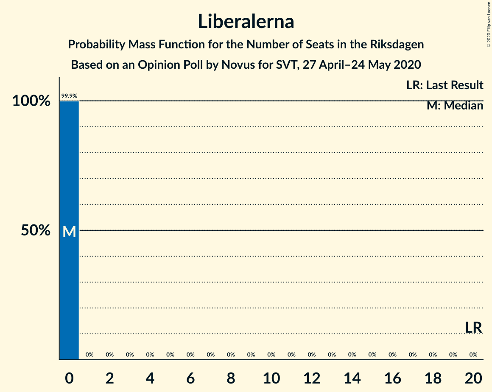
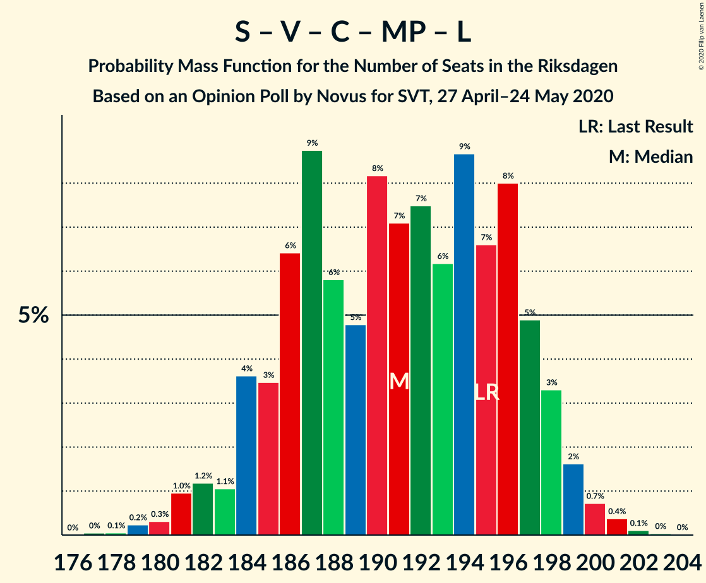

# Opinion Poll by Novus for SVT, 27 April–24 May 2020

<a href="#voting-intentions">Voting Intentions</a> | <a href="#seats">Seats</a> | <a href="#coalitions">Coalitions</a> | <a href="#technical-information">Technical Information</a>

## Voting Intentions

### Confidence Intervals

| Party | Last Result | Poll Result | 80% Confidence Interval | 90% Confidence Interval | 95% Confidence Interval | 99% Confidence Interval |
|:-----:|:-----------:|:-----------:|:-----------------------:|:-----------------------:|:-----------------------:|:-----------------------:|
| Sveriges socialdemokratiska arbetareparti | 28.3% | 31.5% | 30.5–32.4% |30.3–32.7% |30.1–33.0% |29.6–33.4% |
| Moderata samlingspartiet | 19.8% | 19.2% | 18.4–20.0% |18.2–20.3% |18.0–20.5% |17.6–20.9% |
| Sverigedemokraterna | 17.5% | 18.0% | 17.2–18.8% |17.0–19.0% |16.8–19.2% |16.5–19.6% |
| Vänsterpartiet | 8.0% | 9.4% | 8.8–10.0% |8.7–10.2% |8.5–10.4% |8.3–10.7% |
| Centerpartiet | 8.6% | 8.1% | 7.6–8.7% |7.4–8.9% |7.3–9.0% |7.0–9.3% |
| Kristdemokraterna | 6.3% | 5.5% | 5.1–6.0% |4.9–6.1% |4.8–6.3% |4.6–6.5% |
| Miljöpartiet de gröna | 4.4% | 4.1% | 3.7–4.5% |3.6–4.7% |3.5–4.8% |3.4–5.0% |
| Liberalerna | 5.5% | 3.0% | 2.7–3.4% |2.6–3.5% |2.5–3.6% |2.4–3.8% |

*Note:* The poll result column reflects the actual value used in the calculations. Published results may vary slightly, and in addition be rounded to fewer digits.

## Seats

### Confidence Intervals

| Party | Last Result | Median | 80% Confidence Interval | 90% Confidence Interval | 95% Confidence Interval | 99% Confidence Interval |
|:-----:|:-----------:|:------:|:-----------------------:|:-----------------------:|:-----------------------:|:-----------------------:|
| <a href="#sveriges-socialdemokratiska-arbetareparti">Sveriges socialdemokratiska arbetareparti</a> | 100 | 116 | 111–122 |111–123 |110–124 |108–126 |
| <a href="#moderata-samlingspartiet">Moderata samlingspartiet</a> | 70 | 71 | 68–75 |67–75 |66–76 |64–79 |
| <a href="#sverigedemokraterna">Sverigedemokraterna</a> | 62 | 67 | 63–70 |62–72 |61–72 |60–73 |
| <a href="#vänsterpartiet">Vänsterpartiet</a> | 28 | 35 | 32–37 |32–38 |31–39 |30–40 |
| <a href="#centerpartiet">Centerpartiet</a> | 31 | 30 | 28–32 |27–33 |27–33 |26–35 |
| <a href="#kristdemokraterna">Kristdemokraterna</a> | 22 | 20 | 19–22 |18–23 |18–23 |17–24 |
| <a href="#miljöpartiet-de-gröna">Miljöpartiet de gröna</a> | 16 | 15 | 0–16 |0–17 |0–17 |0–18 |
| <a href="#liberalerna">Liberalerna</a> | 20 | 0 | 0 |0 |0 |0 |

### Sveriges socialdemokratiska arbetareparti

*For a full overview of the results for this party, see the [Sveriges socialdemokratiska arbetareparti](party-sverigessocialdemokratiskaarbetareparti.html) page.*

| Number of Seats | Probability | Accumulated | Special Marks |
|:---------------:|:-----------:|:-----------:|:-------------:|
| 100 | 0% | 100% | Last Result |
| 101 | 0% | 100% |  |
| 102 | 0% | 100% |  |
| 103 | 0% | 100% |  |
| 104 | 0% | 100% |  |
| 105 | 0% | 100% |  |
| 106 | 0.1% | 100% |  |
| 107 | 0.3% | 99.9% |  |
| 108 | 0.6% | 99.6% |  |
| 109 | 1.0% | 99.0% |  |
| 110 | 3% | 98% |  |
| 111 | 6% | 95% |  |
| 112 | 5% | 89% |  |
| 113 | 7% | 84% |  |
| 114 | 14% | 78% |  |
| 115 | 10% | 64% |  |
| 116 | 10% | 54% | Median |
| 117 | 8% | 44% |  |
| 118 | 5% | 36% |  |
| 119 | 7% | 31% |  |
| 120 | 4% | 24% |  |
| 121 | 7% | 20% |  |
| 122 | 4% | 13% |  |
| 123 | 6% | 9% |  |
| 124 | 1.5% | 3% |  |
| 125 | 0.5% | 1.3% |  |
| 126 | 0.5% | 0.7% |  |
| 127 | 0.2% | 0.3% |  |
| 128 | 0.1% | 0.1% |  |
| 129 | 0% | 0% |  |

### Moderata samlingspartiet

*For a full overview of the results for this party, see the [Moderata samlingspartiet](party-moderatasamlingspartiet.html) page.*

| Number of Seats | Probability | Accumulated | Special Marks |
|:---------------:|:-----------:|:-----------:|:-------------:|
| 63 | 0.1% | 100% |  |
| 64 | 0.5% | 99.9% |  |
| 65 | 1.2% | 99.3% |  |
| 66 | 3% | 98% |  |
| 67 | 5% | 95% |  |
| 68 | 16% | 90% |  |
| 69 | 7% | 74% |  |
| 70 | 8% | 68% | Last Result |
| 71 | 16% | 60% | Median |
| 72 | 18% | 44% |  |
| 73 | 10% | 26% |  |
| 74 | 5% | 16% |  |
| 75 | 7% | 11% |  |
| 76 | 2% | 4% |  |
| 77 | 0.7% | 2% |  |
| 78 | 0.8% | 1.4% |  |
| 79 | 0.5% | 0.5% |  |
| 80 | 0% | 0.1% |  |
| 81 | 0.1% | 0.1% |  |
| 82 | 0% | 0% |  |

### Sverigedemokraterna

*For a full overview of the results for this party, see the [Sverigedemokraterna](party-sverigedemokraterna.html) page.*

| Number of Seats | Probability | Accumulated | Special Marks |
|:---------------:|:-----------:|:-----------:|:-------------:|
| 59 | 0.1% | 100% |  |
| 60 | 0.4% | 99.9% |  |
| 61 | 3% | 99.4% |  |
| 62 | 3% | 97% | Last Result |
| 63 | 5% | 93% |  |
| 64 | 11% | 89% |  |
| 65 | 11% | 78% |  |
| 66 | 16% | 67% |  |
| 67 | 16% | 51% | Median |
| 68 | 11% | 35% |  |
| 69 | 10% | 23% |  |
| 70 | 5% | 14% |  |
| 71 | 2% | 9% |  |
| 72 | 5% | 6% |  |
| 73 | 0.7% | 1.1% |  |
| 74 | 0.2% | 0.4% |  |
| 75 | 0.1% | 0.2% |  |
| 76 | 0% | 0.1% |  |
| 77 | 0% | 0% |  |

### Vänsterpartiet

*For a full overview of the results for this party, see the [Vänsterpartiet](party-vänsterpartiet.html) page.*

| Number of Seats | Probability | Accumulated | Special Marks |
|:---------------:|:-----------:|:-----------:|:-------------:|
| 28 | 0% | 100% | Last Result |
| 29 | 0.1% | 100% |  |
| 30 | 0.8% | 99.9% |  |
| 31 | 2% | 99.1% |  |
| 32 | 10% | 97% |  |
| 33 | 11% | 87% |  |
| 34 | 17% | 76% |  |
| 35 | 23% | 59% | Median |
| 36 | 21% | 36% |  |
| 37 | 8% | 15% |  |
| 38 | 4% | 7% |  |
| 39 | 2% | 3% |  |
| 40 | 0.7% | 0.8% |  |
| 41 | 0.1% | 0.2% |  |
| 42 | 0% | 0% |  |

### Centerpartiet

*For a full overview of the results for this party, see the [Centerpartiet](party-centerpartiet.html) page.*

| Number of Seats | Probability | Accumulated | Special Marks |
|:---------------:|:-----------:|:-----------:|:-------------:|
| 25 | 0.3% | 100% |  |
| 26 | 1.2% | 99.7% |  |
| 27 | 6% | 98% |  |
| 28 | 14% | 92% |  |
| 29 | 21% | 78% |  |
| 30 | 21% | 57% | Median |
| 31 | 19% | 36% | Last Result |
| 32 | 9% | 17% |  |
| 33 | 6% | 8% |  |
| 34 | 1.5% | 2% |  |
| 35 | 0.6% | 0.7% |  |
| 36 | 0.1% | 0.1% |  |
| 37 | 0% | 0% |  |

### Kristdemokraterna

*For a full overview of the results for this party, see the [Kristdemokraterna](party-kristdemokraterna.html) page.*

| Number of Seats | Probability | Accumulated | Special Marks |
|:---------------:|:-----------:|:-----------:|:-------------:|
| 16 | 0.2% | 100% |  |
| 17 | 1.2% | 99.8% |  |
| 18 | 7% | 98.6% |  |
| 19 | 16% | 91% |  |
| 20 | 29% | 76% | Median |
| 21 | 27% | 46% |  |
| 22 | 12% | 19% | Last Result |
| 23 | 6% | 8% |  |
| 24 | 2% | 2% |  |
| 25 | 0.2% | 0.3% |  |
| 26 | 0% | 0.1% |  |
| 27 | 0% | 0% |  |

### Miljöpartiet de gröna

*For a full overview of the results for this party, see the [Miljöpartiet de gröna](party-miljöpartietdegröna.html) page.*

| Number of Seats | Probability | Accumulated | Special Marks |
|:---------------:|:-----------:|:-----------:|:-------------:|
| 0 | 37% | 100% |  |
| 1 | 0% | 63% |  |
| 2 | 0% | 63% |  |
| 3 | 0% | 63% |  |
| 4 | 0% | 63% |  |
| 5 | 0% | 63% |  |
| 6 | 0% | 63% |  |
| 7 | 0% | 63% |  |
| 8 | 0% | 63% |  |
| 9 | 0% | 63% |  |
| 10 | 0% | 63% |  |
| 11 | 0% | 63% |  |
| 12 | 0% | 63% |  |
| 13 | 0% | 63% |  |
| 14 | 0.7% | 63% |  |
| 15 | 32% | 63% | Median |
| 16 | 21% | 31% | Last Result |
| 17 | 8% | 10% |  |
| 18 | 2% | 2% |  |
| 19 | 0.2% | 0.2% |  |
| 20 | 0% | 0% |  |

### Liberalerna

*For a full overview of the results for this party, see the [Liberalerna](party-liberalerna.html) page.*

| Number of Seats | Probability | Accumulated | Special Marks |
|:---------------:|:-----------:|:-----------:|:-------------:|
| 0 | 99.9% | 100% | Median |
| 1 | 0% | 0.1% |  |
| 2 | 0% | 0.1% |  |
| 3 | 0% | 0.1% |  |
| 4 | 0% | 0.1% |  |
| 5 | 0% | 0.1% |  |
| 6 | 0% | 0.1% |  |
| 7 | 0% | 0.1% |  |
| 8 | 0% | 0.1% |  |
| 9 | 0% | 0.1% |  |
| 10 | 0% | 0.1% |  |
| 11 | 0% | 0.1% |  |
| 12 | 0% | 0.1% |  |
| 13 | 0% | 0.1% |  |
| 14 | 0% | 0.1% |  |
| 15 | 0% | 0% |  |
| 16 | 0% | 0% |  |
| 17 | 0% | 0% |  |
| 18 | 0% | 0% |  |
| 19 | 0% | 0% |  |
| 20 | 0% | 0% | Last Result |

## Coalitions

### Confidence Intervals

| Coalition | Last Result | Median | Majority? | 80% Confidence Interval | 90% Confidence Interval | 95% Confidence Interval | 99% Confidence Interval |
|:---------:|:-----------:|:------:|:---------:|:-----------------------:|:-----------------------:|:-----------------------:|:-----------------------:|
| Sveriges socialdemokratiska arbetareparti – Moderata samlingspartiet – Centerpartiet | 201 | 216 | 100% | 210–225 | 209–227 | 208–228 | 207–230 |
| Sveriges socialdemokratiska arbetareparti – Vänsterpartiet – Centerpartiet – Miljöpartiet de gröna – Liberalerna | 195 | 191 | 100% | 185–197 | 184–198 | 182–199 | 180–201 |
| Sveriges socialdemokratiska arbetareparti – Moderata samlingspartiet | 170 | 186 | 100% | 181–196 | 180–196 | 179–197 | 177–199 |
| Sveriges socialdemokratiska arbetareparti – Vänsterpartiet – Miljöpartiet de gröna | 144 | 162 | 0% | 155–167 | 152–168 | 152–169 | 149–171 |
| Moderata samlingspartiet – Sverigedemokraterna – Kristdemokraterna | 154 | 158 | 0% | 152–164 | 151–165 | 150–167 | 148–169 |
| Sveriges socialdemokratiska arbetareparti – Centerpartiet – Miljöpartiet de gröna – Liberalerna | 167 | 157 | 0% | 149–163 | 147–163 | 147–164 | 144–166 |
| Sveriges socialdemokratiska arbetareparti – Vänsterpartiet | 128 | 150 | 0% | 146–158 | 144–158 | 144–159 | 142–162 |
| Moderata samlingspartiet – Sverigedemokraterna | 132 | 138 | 0% | 132–143 | 131–144 | 130–146 | 129–148 |
| Sveriges socialdemokratiska arbetareparti – Miljöpartiet de gröna | 116 | 128 | 0% | 119–132 | 117–134 | 116–135 | 114–137 |
| Moderata samlingspartiet – Centerpartiet – Kristdemokraterna – Liberalerna | 143 | 121 | 0% | 117–127 | 116–128 | 114–129 | 113–131 |
| Moderata samlingspartiet – Centerpartiet – Kristdemokraterna | 123 | 121 | 0% | 117–127 | 116–128 | 114–129 | 113–131 |
| Moderata samlingspartiet – Centerpartiet – Liberalerna | 121 | 101 | 0% | 96–105 | 95–106 | 95–108 | 93–110 |
| Moderata samlingspartiet – Centerpartiet | 101 | 101 | 0% | 96–105 | 95–106 | 95–108 | 93–110 |

### Sveriges socialdemokratiska arbetareparti – Moderata samlingspartiet – Centerpartiet

| Number of Seats | Probability | Accumulated | Special Marks |
|:---------------:|:-----------:|:-----------:|:-------------:|
| 201 | 0% | 100% | Last Result |
| 202 | 0% | 100% |  |
| 203 | 0% | 100% |  |
| 204 | 0% | 100% |  |
| 205 | 0.1% | 99.9% |  |
| 206 | 0.1% | 99.9% |  |
| 207 | 0.4% | 99.7% |  |
| 208 | 2% | 99.3% |  |
| 209 | 2% | 97% |  |
| 210 | 6% | 95% |  |
| 211 | 4% | 89% |  |
| 212 | 8% | 85% |  |
| 213 | 9% | 77% |  |
| 214 | 4% | 68% |  |
| 215 | 13% | 63% |  |
| 216 | 7% | 51% |  |
| 217 | 3% | 44% | Median |
| 218 | 3% | 40% |  |
| 219 | 2% | 38% |  |
| 220 | 3% | 36% |  |
| 221 | 4% | 33% |  |
| 222 | 4% | 29% |  |
| 223 | 5% | 25% |  |
| 224 | 5% | 21% |  |
| 225 | 7% | 16% |  |
| 226 | 2% | 8% |  |
| 227 | 3% | 6% |  |
| 228 | 1.1% | 3% |  |
| 229 | 1.1% | 2% |  |
| 230 | 0.2% | 0.5% |  |
| 231 | 0.3% | 0.3% |  |
| 232 | 0.1% | 0.1% |  |
| 233 | 0% | 0% |  |

### Sveriges socialdemokratiska arbetareparti – Vänsterpartiet – Centerpartiet – Miljöpartiet de gröna – Liberalerna

| Number of Seats | Probability | Accumulated | Special Marks |
|:---------------:|:-----------:|:-----------:|:-------------:|
| 177 | 0% | 100% |  |
| 178 | 0.1% | 99.9% |  |
| 179 | 0.2% | 99.9% |  |
| 180 | 0.3% | 99.7% |  |
| 181 | 1.0% | 99.3% |  |
| 182 | 1.2% | 98% |  |
| 183 | 1.1% | 97% |  |
| 184 | 4% | 96% |  |
| 185 | 3% | 93% |  |
| 186 | 6% | 89% |  |
| 187 | 9% | 83% |  |
| 188 | 6% | 74% |  |
| 189 | 5% | 68% |  |
| 190 | 8% | 63% |  |
| 191 | 7% | 55% |  |
| 192 | 7% | 48% |  |
| 193 | 6% | 41% |  |
| 194 | 9% | 34% |  |
| 195 | 7% | 26% | Last Result |
| 196 | 8% | 19% | Median |
| 197 | 5% | 11% |  |
| 198 | 3% | 6% |  |
| 199 | 2% | 3% |  |
| 200 | 0.7% | 1.3% |  |
| 201 | 0.4% | 0.5% |  |
| 202 | 0.1% | 0.2% |  |
| 203 | 0% | 0.1% |  |
| 204 | 0% | 0% |  |

### Sveriges socialdemokratiska arbetareparti – Moderata samlingspartiet

| Number of Seats | Probability | Accumulated | Special Marks |
|:---------------:|:-----------:|:-----------:|:-------------:|
| 170 | 0% | 100% | Last Result |
| 171 | 0% | 100% |  |
| 172 | 0% | 100% |  |
| 173 | 0% | 100% |  |
| 174 | 0% | 100% |  |
| 175 | 0.1% | 100% | Majority |
| 176 | 0.1% | 99.9% |  |
| 177 | 0.3% | 99.8% |  |
| 178 | 0.4% | 99.4% |  |
| 179 | 3% | 99.1% |  |
| 180 | 3% | 96% |  |
| 181 | 4% | 93% |  |
| 182 | 9% | 89% |  |
| 183 | 7% | 80% |  |
| 184 | 8% | 73% |  |
| 185 | 11% | 65% |  |
| 186 | 6% | 54% |  |
| 187 | 8% | 48% | Median |
| 188 | 3% | 40% |  |
| 189 | 4% | 37% |  |
| 190 | 3% | 34% |  |
| 191 | 3% | 30% |  |
| 192 | 6% | 27% |  |
| 193 | 4% | 21% |  |
| 194 | 4% | 17% |  |
| 195 | 1.3% | 12% |  |
| 196 | 7% | 11% |  |
| 197 | 2% | 4% |  |
| 198 | 1.0% | 2% |  |
| 199 | 0.7% | 1.0% |  |
| 200 | 0.1% | 0.3% |  |
| 201 | 0.1% | 0.2% |  |
| 202 | 0% | 0% |  |

### Sveriges socialdemokratiska arbetareparti – Vänsterpartiet – Miljöpartiet de gröna

| Number of Seats | Probability | Accumulated | Special Marks |
|:---------------:|:-----------:|:-----------:|:-------------:|
| 144 | 0% | 100% | Last Result |
| 145 | 0% | 100% |  |
| 146 | 0% | 100% |  |
| 147 | 0% | 100% |  |
| 148 | 0.1% | 99.9% |  |
| 149 | 0.5% | 99.8% |  |
| 150 | 0.3% | 99.3% |  |
| 151 | 1.3% | 98.9% |  |
| 152 | 3% | 98% |  |
| 153 | 1.2% | 94% |  |
| 154 | 2% | 93% |  |
| 155 | 10% | 91% |  |
| 156 | 3% | 81% |  |
| 157 | 3% | 79% |  |
| 158 | 9% | 76% |  |
| 159 | 3% | 67% |  |
| 160 | 7% | 64% |  |
| 161 | 3% | 57% |  |
| 162 | 6% | 54% |  |
| 163 | 10% | 47% |  |
| 164 | 9% | 37% |  |
| 165 | 7% | 29% |  |
| 166 | 10% | 22% | Median |
| 167 | 3% | 12% |  |
| 168 | 4% | 8% |  |
| 169 | 3% | 5% |  |
| 170 | 0.6% | 2% |  |
| 171 | 0.7% | 1.1% |  |
| 172 | 0.3% | 0.4% |  |
| 173 | 0% | 0.1% |  |
| 174 | 0% | 0% |  |

### Moderata samlingspartiet – Sverigedemokraterna – Kristdemokraterna

| Number of Seats | Probability | Accumulated | Special Marks |
|:---------------:|:-----------:|:-----------:|:-------------:|
| 146 | 0% | 100% |  |
| 147 | 0.1% | 99.9% |  |
| 148 | 0.4% | 99.8% |  |
| 149 | 0.7% | 99.5% |  |
| 150 | 2% | 98.7% |  |
| 151 | 3% | 97% |  |
| 152 | 5% | 94% |  |
| 153 | 8% | 89% |  |
| 154 | 7% | 81% | Last Result |
| 155 | 9% | 74% |  |
| 156 | 6% | 66% |  |
| 157 | 7% | 59% |  |
| 158 | 7% | 52% | Median |
| 159 | 8% | 45% |  |
| 160 | 5% | 37% |  |
| 161 | 6% | 32% |  |
| 162 | 9% | 26% |  |
| 163 | 6% | 17% |  |
| 164 | 3% | 11% |  |
| 165 | 4% | 7% |  |
| 166 | 1.1% | 4% |  |
| 167 | 1.2% | 3% |  |
| 168 | 1.0% | 2% |  |
| 169 | 0.3% | 0.7% |  |
| 170 | 0.2% | 0.3% |  |
| 171 | 0.1% | 0.1% |  |
| 172 | 0% | 0.1% |  |
| 173 | 0% | 0% |  |

### Sveriges socialdemokratiska arbetareparti – Centerpartiet – Miljöpartiet de gröna – Liberalerna

| Number of Seats | Probability | Accumulated | Special Marks |
|:---------------:|:-----------:|:-----------:|:-------------:|
| 142 | 0% | 100% |  |
| 143 | 0.1% | 99.9% |  |
| 144 | 0.4% | 99.8% |  |
| 145 | 0.5% | 99.4% |  |
| 146 | 1.3% | 99.0% |  |
| 147 | 3% | 98% |  |
| 148 | 2% | 95% |  |
| 149 | 5% | 93% |  |
| 150 | 3% | 89% |  |
| 151 | 4% | 86% |  |
| 152 | 12% | 82% |  |
| 153 | 3% | 70% |  |
| 154 | 3% | 67% |  |
| 155 | 4% | 63% |  |
| 156 | 5% | 60% |  |
| 157 | 9% | 55% |  |
| 158 | 8% | 46% |  |
| 159 | 8% | 38% |  |
| 160 | 10% | 30% |  |
| 161 | 5% | 20% | Median |
| 162 | 4% | 16% |  |
| 163 | 8% | 12% |  |
| 164 | 2% | 4% |  |
| 165 | 1.2% | 2% |  |
| 166 | 0.8% | 1.2% |  |
| 167 | 0.2% | 0.4% | Last Result |
| 168 | 0.2% | 0.2% |  |
| 169 | 0% | 0% |  |

### Sveriges socialdemokratiska arbetareparti – Vänsterpartiet

| Number of Seats | Probability | Accumulated | Special Marks |
|:---------------:|:-----------:|:-----------:|:-------------:|
| 128 | 0% | 100% | Last Result |
| 129 | 0% | 100% |  |
| 130 | 0% | 100% |  |
| 131 | 0% | 100% |  |
| 132 | 0% | 100% |  |
| 133 | 0% | 100% |  |
| 134 | 0% | 100% |  |
| 135 | 0% | 100% |  |
| 136 | 0% | 100% |  |
| 137 | 0% | 100% |  |
| 138 | 0% | 100% |  |
| 139 | 0% | 100% |  |
| 140 | 0.1% | 100% |  |
| 141 | 0.2% | 99.9% |  |
| 142 | 0.8% | 99.6% |  |
| 143 | 0.6% | 98.8% |  |
| 144 | 4% | 98% |  |
| 145 | 4% | 94% |  |
| 146 | 4% | 90% |  |
| 147 | 9% | 86% |  |
| 148 | 10% | 78% |  |
| 149 | 7% | 67% |  |
| 150 | 11% | 60% |  |
| 151 | 6% | 49% | Median |
| 152 | 6% | 43% |  |
| 153 | 5% | 38% |  |
| 154 | 4% | 33% |  |
| 155 | 10% | 29% |  |
| 156 | 3% | 19% |  |
| 157 | 2% | 16% |  |
| 158 | 9% | 14% |  |
| 159 | 3% | 5% |  |
| 160 | 0.6% | 2% |  |
| 161 | 1.2% | 2% |  |
| 162 | 0.3% | 0.5% |  |
| 163 | 0.1% | 0.2% |  |
| 164 | 0.1% | 0.1% |  |
| 165 | 0% | 0% |  |

### Moderata samlingspartiet – Sverigedemokraterna

| Number of Seats | Probability | Accumulated | Special Marks |
|:---------------:|:-----------:|:-----------:|:-------------:|
| 127 | 0.1% | 100% |  |
| 128 | 0.3% | 99.8% |  |
| 129 | 0.8% | 99.5% |  |
| 130 | 2% | 98.7% |  |
| 131 | 3% | 97% |  |
| 132 | 6% | 94% | Last Result |
| 133 | 7% | 88% |  |
| 134 | 7% | 81% |  |
| 135 | 7% | 73% |  |
| 136 | 11% | 67% |  |
| 137 | 5% | 56% |  |
| 138 | 9% | 51% | Median |
| 139 | 9% | 42% |  |
| 140 | 8% | 33% |  |
| 141 | 6% | 25% |  |
| 142 | 8% | 20% |  |
| 143 | 4% | 11% |  |
| 144 | 3% | 7% |  |
| 145 | 1.4% | 4% |  |
| 146 | 0.8% | 3% |  |
| 147 | 1.0% | 2% |  |
| 148 | 0.6% | 0.9% |  |
| 149 | 0.2% | 0.3% |  |
| 150 | 0.1% | 0.1% |  |
| 151 | 0% | 0% |  |

### Sveriges socialdemokratiska arbetareparti – Miljöpartiet de gröna

| Number of Seats | Probability | Accumulated | Special Marks |
|:---------------:|:-----------:|:-----------:|:-------------:|
| 112 | 0.1% | 100% |  |
| 113 | 0.2% | 99.9% |  |
| 114 | 0.6% | 99.6% |  |
| 115 | 1.2% | 99.1% |  |
| 116 | 2% | 98% | Last Result |
| 117 | 3% | 96% |  |
| 118 | 3% | 93% |  |
| 119 | 4% | 90% |  |
| 120 | 3% | 86% |  |
| 121 | 6% | 83% |  |
| 122 | 4% | 76% |  |
| 123 | 6% | 72% |  |
| 124 | 2% | 66% |  |
| 125 | 2% | 63% |  |
| 126 | 3% | 61% |  |
| 127 | 6% | 58% |  |
| 128 | 6% | 52% |  |
| 129 | 11% | 46% |  |
| 130 | 12% | 35% |  |
| 131 | 6% | 23% | Median |
| 132 | 8% | 18% |  |
| 133 | 4% | 10% |  |
| 134 | 3% | 6% |  |
| 135 | 2% | 3% |  |
| 136 | 0.5% | 1.2% |  |
| 137 | 0.5% | 0.6% |  |
| 138 | 0.1% | 0.2% |  |
| 139 | 0.1% | 0.1% |  |
| 140 | 0% | 0% |  |

### Moderata samlingspartiet – Centerpartiet – Kristdemokraterna – Liberalerna

| Number of Seats | Probability | Accumulated | Special Marks |
|:---------------:|:-----------:|:-----------:|:-------------:|
| 111 | 0.1% | 100% |  |
| 112 | 0.2% | 99.9% |  |
| 113 | 1.0% | 99.7% |  |
| 114 | 1.4% | 98.7% |  |
| 115 | 2% | 97% |  |
| 116 | 5% | 95% |  |
| 117 | 8% | 91% |  |
| 118 | 8% | 82% |  |
| 119 | 7% | 74% |  |
| 120 | 12% | 68% |  |
| 121 | 12% | 55% | Median |
| 122 | 11% | 44% |  |
| 123 | 6% | 33% |  |
| 124 | 9% | 28% |  |
| 125 | 5% | 19% |  |
| 126 | 2% | 14% |  |
| 127 | 5% | 11% |  |
| 128 | 3% | 6% |  |
| 129 | 1.3% | 3% |  |
| 130 | 0.4% | 2% |  |
| 131 | 0.8% | 1.1% |  |
| 132 | 0.2% | 0.3% |  |
| 133 | 0% | 0.1% |  |
| 134 | 0% | 0.1% |  |
| 135 | 0% | 0% |  |
| 136 | 0% | 0% |  |
| 137 | 0% | 0% |  |
| 138 | 0% | 0% |  |
| 139 | 0% | 0% |  |
| 140 | 0% | 0% |  |
| 141 | 0% | 0% |  |
| 142 | 0% | 0% |  |
| 143 | 0% | 0% | Last Result |

### Moderata samlingspartiet – Centerpartiet – Kristdemokraterna

| Number of Seats | Probability | Accumulated | Special Marks |
|:---------------:|:-----------:|:-----------:|:-------------:|
| 111 | 0.1% | 100% |  |
| 112 | 0.2% | 99.9% |  |
| 113 | 1.0% | 99.7% |  |
| 114 | 1.4% | 98.7% |  |
| 115 | 2% | 97% |  |
| 116 | 5% | 95% |  |
| 117 | 8% | 91% |  |
| 118 | 8% | 82% |  |
| 119 | 7% | 74% |  |
| 120 | 12% | 68% |  |
| 121 | 12% | 55% | Median |
| 122 | 11% | 44% |  |
| 123 | 6% | 33% | Last Result |
| 124 | 9% | 28% |  |
| 125 | 5% | 19% |  |
| 126 | 2% | 13% |  |
| 127 | 5% | 11% |  |
| 128 | 3% | 6% |  |
| 129 | 1.3% | 3% |  |
| 130 | 0.4% | 2% |  |
| 131 | 0.8% | 1.1% |  |
| 132 | 0.2% | 0.3% |  |
| 133 | 0% | 0.1% |  |
| 134 | 0% | 0% |  |

### Moderata samlingspartiet – Centerpartiet – Liberalerna

| Number of Seats | Probability | Accumulated | Special Marks |
|:---------------:|:-----------:|:-----------:|:-------------:|
| 91 | 0% | 100% |  |
| 92 | 0.1% | 99.9% |  |
| 93 | 0.6% | 99.8% |  |
| 94 | 0.7% | 99.2% |  |
| 95 | 4% | 98% |  |
| 96 | 7% | 94% |  |
| 97 | 4% | 87% |  |
| 98 | 8% | 83% |  |
| 99 | 12% | 75% |  |
| 100 | 7% | 63% |  |
| 101 | 13% | 56% | Median |
| 102 | 15% | 43% |  |
| 103 | 7% | 28% |  |
| 104 | 6% | 21% |  |
| 105 | 6% | 14% |  |
| 106 | 4% | 8% |  |
| 107 | 1.5% | 5% |  |
| 108 | 1.4% | 3% |  |
| 109 | 1.0% | 2% |  |
| 110 | 0.5% | 0.8% |  |
| 111 | 0.2% | 0.3% |  |
| 112 | 0.1% | 0.1% |  |
| 113 | 0% | 0% |  |
| 114 | 0% | 0% |  |
| 115 | 0% | 0% |  |
| 116 | 0% | 0% |  |
| 117 | 0% | 0% |  |
| 118 | 0% | 0% |  |
| 119 | 0% | 0% |  |
| 120 | 0% | 0% |  |
| 121 | 0% | 0% | Last Result |

### Moderata samlingspartiet – Centerpartiet

| Number of Seats | Probability | Accumulated | Special Marks |
|:---------------:|:-----------:|:-----------:|:-------------:|
| 91 | 0.1% | 100% |  |
| 92 | 0.2% | 99.9% |  |
| 93 | 0.6% | 99.8% |  |
| 94 | 0.7% | 99.2% |  |
| 95 | 4% | 98% |  |
| 96 | 7% | 94% |  |
| 97 | 4% | 87% |  |
| 98 | 8% | 83% |  |
| 99 | 12% | 75% |  |
| 100 | 7% | 63% |  |
| 101 | 13% | 56% | Last Result, Median |
| 102 | 15% | 43% |  |
| 103 | 7% | 28% |  |
| 104 | 6% | 21% |  |
| 105 | 6% | 14% |  |
| 106 | 4% | 8% |  |
| 107 | 1.5% | 5% |  |
| 108 | 1.4% | 3% |  |
| 109 | 1.0% | 2% |  |
| 110 | 0.5% | 0.8% |  |
| 111 | 0.2% | 0.2% |  |
| 112 | 0.1% | 0.1% |  |
| 113 | 0% | 0% |  |

## Technical Information

### Opinion Poll

+ **Polling firm:** Novus
+ **Commissioner(s):** SVT
+ **Fieldwork period:** 27 April–24 May 2020

### Calculations

+ **Sample size:** 3976
+ **Simulations done:** 1,048,576
+ **Error estimate:** 1.08%

