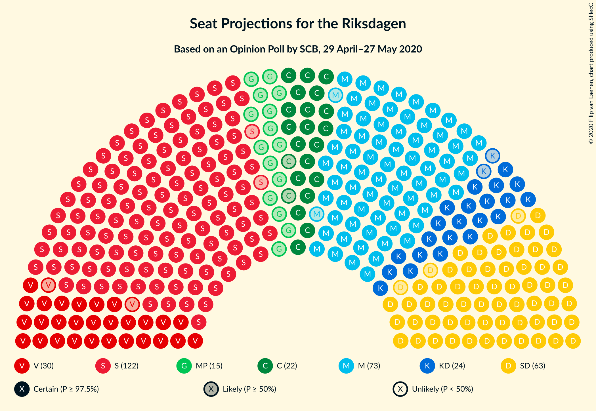
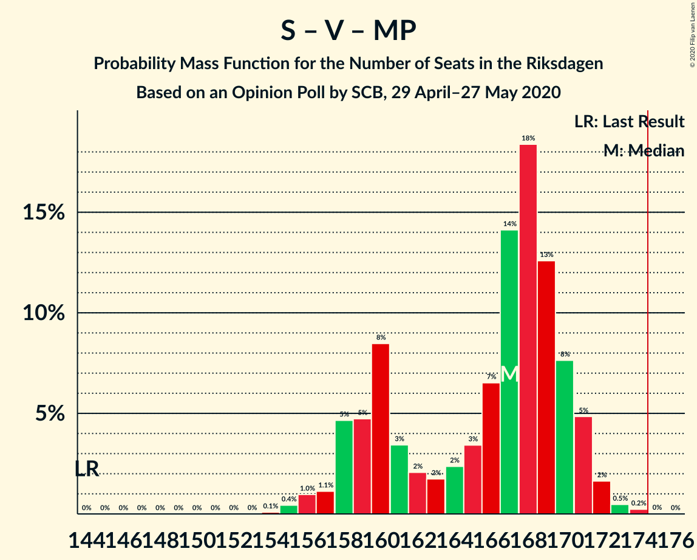

# Opinion Poll by SCB, 29 April–27 May 2020

<a href="#voting-intentions">Voting Intentions</a> | <a href="#seats">Seats</a> | <a href="#coalitions">Coalitions</a> | <a href="#technical-information">Technical Information</a>

## Voting Intentions

### Confidence Intervals

| Party | Last Result | Poll Result | 80% Confidence Interval | 90% Confidence Interval | 95% Confidence Interval | 99% Confidence Interval |
|:-----:|:-----------:|:-----------:|:-----------------------:|:-----------------------:|:-----------------------:|:-----------------------:|
| Sveriges socialdemokratiska arbetareparti | 28.3% | 33.7% | 33.1–34.3% |32.9–34.5% |32.7–34.7% |32.4–35.0% |
| Moderata samlingspartiet | 19.8% | 20.1% | 19.6–20.7% |19.4–20.8% |19.3–20.9% |19.0–21.2% |
| Sverigedemokraterna | 17.5% | 17.1% | 16.6–17.6% |16.5–17.8% |16.3–17.9% |16.1–18.1% |
| Vänsterpartiet | 8.0% | 8.2% | 7.8–8.6% |7.7–8.7% |7.7–8.8% |7.5–9.0% |
| Kristdemokraterna | 6.3% | 6.4% | 6.1–6.7% |6.0–6.8% |5.9–6.9% |5.8–7.1% |
| Centerpartiet | 8.6% | 6.0% | 5.7–6.3% |5.6–6.4% |5.5–6.5% |5.4–6.7% |
| Miljöpartiet de gröna | 4.4% | 4.1% | 3.8–4.4% |3.8–4.5% |3.7–4.5% |3.6–4.7% |
| Liberalerna | 5.5% | 3.3% | 3.1–3.6% |3.0–3.6% |2.9–3.7% |2.9–3.8% |

*Note:* The poll result column reflects the actual value used in the calculations. Published results may vary slightly, and in addition be rounded to fewer digits.

## Seats

### Confidence Intervals

| Party | Last Result | Median | 80% Confidence Interval | 90% Confidence Interval | 95% Confidence Interval | 99% Confidence Interval |
|:-----:|:-----------:|:------:|:-----------------------:|:-----------------------:|:-----------------------:|:-----------------------:|
| <a href="#sveriges-socialdemokratiska-arbetareparti">Sveriges socialdemokratiska arbetareparti</a> | 100 | 124 | 121–129 |120–130 |120–131 |118–132 |
| <a href="#moderata-samlingspartiet">Moderata samlingspartiet</a> | 70 | 74 | 72–77 |71–78 |71–79 |70–80 |
| <a href="#sverigedemokraterna">Sverigedemokraterna</a> | 62 | 63 | 61–66 |60–67 |60–67 |59–68 |
| <a href="#vänsterpartiet">Vänsterpartiet</a> | 28 | 30 | 29–32 |29–32 |28–33 |27–34 |
| <a href="#kristdemokraterna">Kristdemokraterna</a> | 22 | 24 | 22–25 |22–26 |22–26 |21–27 |
| <a href="#centerpartiet">Centerpartiet</a> | 31 | 22 | 21–23 |21–24 |20–24 |20–25 |
| <a href="#miljöpartiet-de-gröna">Miljöpartiet de gröna</a> | 16 | 15 | 0–16 |0–16 |0–17 |0–17 |
| <a href="#liberalerna">Liberalerna</a> | 20 | 0 | 0 |0 |0 |0 |

### Sveriges socialdemokratiska arbetareparti

*For a full overview of the results for this party, see the [Sveriges socialdemokratiska arbetareparti](party-sverigessocialdemokratiskaarbetareparti.html) page.*

| Number of Seats | Probability | Accumulated | Special Marks |
|:---------------:|:-----------:|:-----------:|:-------------:|
| 100 | 0% | 100% | Last Result |
| 101 | 0% | 100% |  |
| 102 | 0% | 100% |  |
| 103 | 0% | 100% |  |
| 104 | 0% | 100% |  |
| 105 | 0% | 100% |  |
| 106 | 0% | 100% |  |
| 107 | 0% | 100% |  |
| 108 | 0% | 100% |  |
| 109 | 0% | 100% |  |
| 110 | 0% | 100% |  |
| 111 | 0% | 100% |  |
| 112 | 0% | 100% |  |
| 113 | 0% | 100% |  |
| 114 | 0% | 100% |  |
| 115 | 0% | 100% |  |
| 116 | 0% | 100% |  |
| 117 | 0.1% | 100% |  |
| 118 | 0.5% | 99.9% |  |
| 119 | 2% | 99.4% |  |
| 120 | 5% | 98% |  |
| 121 | 7% | 93% |  |
| 122 | 17% | 85% |  |
| 123 | 12% | 68% |  |
| 124 | 16% | 56% | Median |
| 125 | 9% | 39% |  |
| 126 | 4% | 30% |  |
| 127 | 6% | 26% |  |
| 128 | 7% | 20% |  |
| 129 | 4% | 13% |  |
| 130 | 5% | 9% |  |
| 131 | 3% | 4% |  |
| 132 | 0.8% | 1.2% |  |
| 133 | 0.3% | 0.5% |  |
| 134 | 0.2% | 0.2% |  |
| 135 | 0% | 0% |  |

### Moderata samlingspartiet

*For a full overview of the results for this party, see the [Moderata samlingspartiet](party-moderatasamlingspartiet.html) page.*

| Number of Seats | Probability | Accumulated | Special Marks |
|:---------------:|:-----------:|:-----------:|:-------------:|
| 69 | 0.4% | 100% |  |
| 70 | 2% | 99.5% | Last Result |
| 71 | 7% | 98% |  |
| 72 | 13% | 91% |  |
| 73 | 19% | 78% |  |
| 74 | 14% | 59% | Median |
| 75 | 19% | 46% |  |
| 76 | 9% | 26% |  |
| 77 | 10% | 17% |  |
| 78 | 3% | 7% |  |
| 79 | 3% | 4% |  |
| 80 | 0.7% | 0.9% |  |
| 81 | 0.2% | 0.2% |  |
| 82 | 0% | 0% |  |

### Sverigedemokraterna

*For a full overview of the results for this party, see the [Sverigedemokraterna](party-sverigedemokraterna.html) page.*

| Number of Seats | Probability | Accumulated | Special Marks |
|:---------------:|:-----------:|:-----------:|:-------------:|
| 58 | 0.2% | 100% |  |
| 59 | 0.9% | 99.8% |  |
| 60 | 6% | 98.8% |  |
| 61 | 17% | 93% |  |
| 62 | 15% | 76% | Last Result |
| 63 | 20% | 61% | Median |
| 64 | 13% | 41% |  |
| 65 | 15% | 27% |  |
| 66 | 6% | 12% |  |
| 67 | 4% | 6% |  |
| 68 | 1.3% | 2% |  |
| 69 | 0.3% | 0.3% |  |
| 70 | 0.1% | 0.1% |  |
| 71 | 0% | 0% |  |

### Vänsterpartiet

*For a full overview of the results for this party, see the [Vänsterpartiet](party-vänsterpartiet.html) page.*

| Number of Seats | Probability | Accumulated | Special Marks |
|:---------------:|:-----------:|:-----------:|:-------------:|
| 27 | 0.7% | 100% |  |
| 28 | 4% | 99.3% | Last Result |
| 29 | 23% | 96% |  |
| 30 | 33% | 72% | Median |
| 31 | 23% | 39% |  |
| 32 | 12% | 16% |  |
| 33 | 4% | 5% |  |
| 34 | 0.8% | 0.8% |  |
| 35 | 0% | 0% |  |

### Kristdemokraterna

*For a full overview of the results for this party, see the [Kristdemokraterna](party-kristdemokraterna.html) page.*

| Number of Seats | Probability | Accumulated | Special Marks |
|:---------------:|:-----------:|:-----------:|:-------------:|
| 20 | 0.1% | 100% |  |
| 21 | 2% | 99.9% |  |
| 22 | 11% | 98% | Last Result |
| 23 | 33% | 87% |  |
| 24 | 37% | 54% | Median |
| 25 | 12% | 18% |  |
| 26 | 4% | 5% |  |
| 27 | 0.8% | 0.8% |  |
| 28 | 0% | 0% |  |

### Centerpartiet

*For a full overview of the results for this party, see the [Centerpartiet](party-centerpartiet.html) page.*

| Number of Seats | Probability | Accumulated | Special Marks |
|:---------------:|:-----------:|:-----------:|:-------------:|
| 19 | 0.3% | 100% |  |
| 20 | 4% | 99.7% |  |
| 21 | 21% | 96% |  |
| 22 | 39% | 75% | Median |
| 23 | 27% | 36% |  |
| 24 | 8% | 10% |  |
| 25 | 1.4% | 1.5% |  |
| 26 | 0.1% | 0.1% |  |
| 27 | 0% | 0% |  |
| 28 | 0% | 0% |  |
| 29 | 0% | 0% |  |
| 30 | 0% | 0% |  |
| 31 | 0% | 0% | Last Result |

### Miljöpartiet de gröna

*For a full overview of the results for this party, see the [Miljöpartiet de gröna](party-miljöpartietdegröna.html) page.*

| Number of Seats | Probability | Accumulated | Special Marks |
|:---------------:|:-----------:|:-----------:|:-------------:|
| 0 | 28% | 100% |  |
| 1 | 0% | 72% |  |
| 2 | 0% | 72% |  |
| 3 | 0% | 72% |  |
| 4 | 0% | 72% |  |
| 5 | 0% | 72% |  |
| 6 | 0% | 72% |  |
| 7 | 0% | 72% |  |
| 8 | 0% | 72% |  |
| 9 | 0% | 72% |  |
| 10 | 0% | 72% |  |
| 11 | 0% | 72% |  |
| 12 | 0% | 72% |  |
| 13 | 0% | 72% |  |
| 14 | 0% | 72% |  |
| 15 | 48% | 72% | Median |
| 16 | 21% | 24% | Last Result |
| 17 | 3% | 3% |  |
| 18 | 0.1% | 0.1% |  |
| 19 | 0% | 0% |  |

### Liberalerna

*For a full overview of the results for this party, see the [Liberalerna](party-liberalerna.html) page.*

| Number of Seats | Probability | Accumulated | Special Marks |
|:---------------:|:-----------:|:-----------:|:-------------:|
| 0 | 100% | 100% | Median |
| 1 | 0% | 0% |  |
| 2 | 0% | 0% |  |
| 3 | 0% | 0% |  |
| 4 | 0% | 0% |  |
| 5 | 0% | 0% |  |
| 6 | 0% | 0% |  |
| 7 | 0% | 0% |  |
| 8 | 0% | 0% |  |
| 9 | 0% | 0% |  |
| 10 | 0% | 0% |  |
| 11 | 0% | 0% |  |
| 12 | 0% | 0% |  |
| 13 | 0% | 0% |  |
| 14 | 0% | 0% |  |
| 15 | 0% | 0% |  |
| 16 | 0% | 0% |  |
| 17 | 0% | 0% |  |
| 18 | 0% | 0% |  |
| 19 | 0% | 0% |  |
| 20 | 0% | 0% | Last Result |

## Coalitions

### Confidence Intervals

| Coalition | Last Result | Median | Majority? | 80% Confidence Interval | 90% Confidence Interval | 95% Confidence Interval | 99% Confidence Interval |
|:---------:|:-----------:|:------:|:---------:|:-----------------------:|:-----------------------:|:-----------------------:|:-----------------------:|
| Sveriges socialdemokratiska arbetareparti – Moderata samlingspartiet – Centerpartiet | 201 | 219 | 100% | 216–229 | 215–230 | 215–230 | 214–231 |
| Sveriges socialdemokratiska arbetareparti – Moderata samlingspartiet | 170 | 197 | 100% | 194–206 | 194–207 | 193–207 | 192–209 |
| Sveriges socialdemokratiska arbetareparti – Vänsterpartiet – Centerpartiet – Miljöpartiet de gröna – Liberalerna | 195 | 189 | 100% | 182–192 | 181–193 | 180–193 | 179–195 |
| Sveriges socialdemokratiska arbetareparti – Vänsterpartiet – Miljöpartiet de gröna | 144 | 167 | 0% | 159–170 | 158–171 | 157–171 | 155–173 |
| Moderata samlingspartiet – Sverigedemokraterna – Kristdemokraterna | 154 | 160 | 0% | 157–167 | 156–168 | 156–169 | 154–170 |
| Sveriges socialdemokratiska arbetareparti – Centerpartiet – Miljöpartiet de gröna – Liberalerna | 167 | 159 | 0% | 151–162 | 150–163 | 149–163 | 147–165 |
| Sveriges socialdemokratiska arbetareparti – Vänsterpartiet | 128 | 154 | 0% | 151–160 | 150–161 | 149–162 | 148–164 |
| Moderata samlingspartiet – Sverigedemokraterna | 132 | 136 | 0% | 134–142 | 133–144 | 132–144 | 131–146 |
| Sveriges socialdemokratiska arbetareparti – Miljöpartiet de gröna | 116 | 137 | 0% | 128–140 | 127–141 | 126–141 | 124–143 |
| Moderata samlingspartiet – Kristdemokraterna – Centerpartiet – Liberalerna | 143 | 119 | 0% | 117–125 | 116–126 | 115–127 | 114–128 |
| Moderata samlingspartiet – Kristdemokraterna – Centerpartiet | 123 | 119 | 0% | 117–125 | 116–126 | 115–127 | 114–128 |
| Moderata samlingspartiet – Centerpartiet – Liberalerna | 121 | 96 | 0% | 93–100 | 93–101 | 92–102 | 91–103 |
| Moderata samlingspartiet – Centerpartiet | 101 | 96 | 0% | 93–100 | 93–101 | 92–102 | 91–103 |

### Sveriges socialdemokratiska arbetareparti – Moderata samlingspartiet – Centerpartiet

| Number of Seats | Probability | Accumulated | Special Marks |
|:---------------:|:-----------:|:-----------:|:-------------:|
| 201 | 0% | 100% | Last Result |
| 202 | 0% | 100% |  |
| 203 | 0% | 100% |  |
| 204 | 0% | 100% |  |
| 205 | 0% | 100% |  |
| 206 | 0% | 100% |  |
| 207 | 0% | 100% |  |
| 208 | 0% | 100% |  |
| 209 | 0% | 100% |  |
| 210 | 0% | 100% |  |
| 211 | 0% | 100% |  |
| 212 | 0.1% | 100% |  |
| 213 | 0.3% | 99.9% |  |
| 214 | 1.4% | 99.6% |  |
| 215 | 4% | 98% |  |
| 216 | 9% | 95% |  |
| 217 | 13% | 86% |  |
| 218 | 14% | 73% |  |
| 219 | 15% | 59% |  |
| 220 | 10% | 44% | Median |
| 221 | 4% | 34% |  |
| 222 | 1.1% | 30% |  |
| 223 | 0.4% | 29% |  |
| 224 | 0.7% | 28% |  |
| 225 | 2% | 28% |  |
| 226 | 3% | 26% |  |
| 227 | 5% | 22% |  |
| 228 | 5% | 17% |  |
| 229 | 5% | 13% |  |
| 230 | 6% | 8% |  |
| 231 | 1.4% | 2% |  |
| 232 | 0.2% | 0.4% |  |
| 233 | 0.1% | 0.2% |  |
| 234 | 0.1% | 0.1% |  |
| 235 | 0% | 0% |  |

### Sveriges socialdemokratiska arbetareparti – Moderata samlingspartiet

| Number of Seats | Probability | Accumulated | Special Marks |
|:---------------:|:-----------:|:-----------:|:-------------:|
| 170 | 0% | 100% | Last Result |
| 171 | 0% | 100% |  |
| 172 | 0% | 100% |  |
| 173 | 0% | 100% |  |
| 174 | 0% | 100% |  |
| 175 | 0% | 100% | Majority |
| 176 | 0% | 100% |  |
| 177 | 0% | 100% |  |
| 178 | 0% | 100% |  |
| 179 | 0% | 100% |  |
| 180 | 0% | 100% |  |
| 181 | 0% | 100% |  |
| 182 | 0% | 100% |  |
| 183 | 0% | 100% |  |
| 184 | 0% | 100% |  |
| 185 | 0% | 100% |  |
| 186 | 0% | 100% |  |
| 187 | 0% | 100% |  |
| 188 | 0% | 100% |  |
| 189 | 0% | 100% |  |
| 190 | 0.1% | 100% |  |
| 191 | 0.3% | 99.9% |  |
| 192 | 1.1% | 99.5% |  |
| 193 | 3% | 98% |  |
| 194 | 10% | 96% |  |
| 195 | 16% | 86% |  |
| 196 | 5% | 70% |  |
| 197 | 19% | 65% |  |
| 198 | 12% | 46% | Median |
| 199 | 4% | 34% |  |
| 200 | 2% | 30% |  |
| 201 | 1.2% | 29% |  |
| 202 | 2% | 28% |  |
| 203 | 3% | 26% |  |
| 204 | 4% | 22% |  |
| 205 | 5% | 18% |  |
| 206 | 6% | 13% |  |
| 207 | 5% | 7% |  |
| 208 | 0.9% | 2% |  |
| 209 | 0.7% | 0.9% |  |
| 210 | 0.2% | 0.2% |  |
| 211 | 0.1% | 0.1% |  |
| 212 | 0% | 0% |  |

### Sveriges socialdemokratiska arbetareparti – Vänsterpartiet – Centerpartiet – Miljöpartiet de gröna – Liberalerna

| Number of Seats | Probability | Accumulated | Special Marks |
|:---------------:|:-----------:|:-----------:|:-------------:|
| 177 | 0.1% | 100% |  |
| 178 | 0.4% | 99.9% |  |
| 179 | 1.1% | 99.6% |  |
| 180 | 1.2% | 98% |  |
| 181 | 5% | 97% |  |
| 182 | 4% | 92% |  |
| 183 | 7% | 88% |  |
| 184 | 5% | 81% |  |
| 185 | 2% | 76% |  |
| 186 | 4% | 74% |  |
| 187 | 4% | 70% |  |
| 188 | 7% | 67% |  |
| 189 | 17% | 59% |  |
| 190 | 16% | 42% |  |
| 191 | 13% | 26% | Median |
| 192 | 7% | 13% |  |
| 193 | 4% | 6% |  |
| 194 | 2% | 2% |  |
| 195 | 0.4% | 0.5% | Last Result |
| 196 | 0.1% | 0.1% |  |
| 197 | 0% | 0% |  |

### Sveriges socialdemokratiska arbetareparti – Vänsterpartiet – Miljöpartiet de gröna

| Number of Seats | Probability | Accumulated | Special Marks |
|:---------------:|:-----------:|:-----------:|:-------------:|
| 144 | 0% | 100% | Last Result |
| 145 | 0% | 100% |  |
| 146 | 0% | 100% |  |
| 147 | 0% | 100% |  |
| 148 | 0% | 100% |  |
| 149 | 0% | 100% |  |
| 150 | 0% | 100% |  |
| 151 | 0% | 100% |  |
| 152 | 0% | 100% |  |
| 153 | 0% | 100% |  |
| 154 | 0.1% | 100% |  |
| 155 | 0.4% | 99.9% |  |
| 156 | 1.0% | 99.5% |  |
| 157 | 1.1% | 98% |  |
| 158 | 5% | 97% |  |
| 159 | 5% | 93% |  |
| 160 | 8% | 88% |  |
| 161 | 3% | 79% |  |
| 162 | 2% | 76% |  |
| 163 | 2% | 74% |  |
| 164 | 2% | 72% |  |
| 165 | 3% | 70% |  |
| 166 | 7% | 66% |  |
| 167 | 14% | 60% |  |
| 168 | 18% | 46% |  |
| 169 | 13% | 27% | Median |
| 170 | 8% | 15% |  |
| 171 | 5% | 7% |  |
| 172 | 2% | 2% |  |
| 173 | 0.5% | 0.7% |  |
| 174 | 0.2% | 0.3% |  |
| 175 | 0% | 0% | Majority |

### Moderata samlingspartiet – Sverigedemokraterna – Kristdemokraterna

| Number of Seats | Probability | Accumulated | Special Marks |
|:---------------:|:-----------:|:-----------:|:-------------:|
| 153 | 0.1% | 100% |  |
| 154 | 0.4% | 99.9% | Last Result |
| 155 | 2% | 99.5% |  |
| 156 | 4% | 98% |  |
| 157 | 7% | 94% |  |
| 158 | 13% | 87% |  |
| 159 | 16% | 74% |  |
| 160 | 17% | 58% |  |
| 161 | 7% | 41% | Median |
| 162 | 4% | 33% |  |
| 163 | 4% | 30% |  |
| 164 | 2% | 26% |  |
| 165 | 5% | 24% |  |
| 166 | 7% | 19% |  |
| 167 | 4% | 12% |  |
| 168 | 5% | 8% |  |
| 169 | 1.2% | 3% |  |
| 170 | 1.1% | 2% |  |
| 171 | 0.4% | 0.4% |  |
| 172 | 0.1% | 0.1% |  |
| 173 | 0% | 0% |  |

### Sveriges socialdemokratiska arbetareparti – Centerpartiet – Miljöpartiet de gröna – Liberalerna

| Number of Seats | Probability | Accumulated | Special Marks |
|:---------------:|:-----------:|:-----------:|:-------------:|
| 146 | 0.1% | 100% |  |
| 147 | 0.7% | 99.9% |  |
| 148 | 0.9% | 99.2% |  |
| 149 | 2% | 98% |  |
| 150 | 5% | 96% |  |
| 151 | 6% | 91% |  |
| 152 | 4% | 85% |  |
| 153 | 6% | 81% |  |
| 154 | 2% | 75% |  |
| 155 | 2% | 73% |  |
| 156 | 1.4% | 72% |  |
| 157 | 4% | 70% |  |
| 158 | 7% | 66% |  |
| 159 | 16% | 59% |  |
| 160 | 15% | 43% |  |
| 161 | 11% | 28% | Median |
| 162 | 12% | 17% |  |
| 163 | 3% | 6% |  |
| 164 | 2% | 2% |  |
| 165 | 0.8% | 1.0% |  |
| 166 | 0.1% | 0.1% |  |
| 167 | 0% | 0% | Last Result |

### Sveriges socialdemokratiska arbetareparti – Vänsterpartiet

| Number of Seats | Probability | Accumulated | Special Marks |
|:---------------:|:-----------:|:-----------:|:-------------:|
| 128 | 0% | 100% | Last Result |
| 129 | 0% | 100% |  |
| 130 | 0% | 100% |  |
| 131 | 0% | 100% |  |
| 132 | 0% | 100% |  |
| 133 | 0% | 100% |  |
| 134 | 0% | 100% |  |
| 135 | 0% | 100% |  |
| 136 | 0% | 100% |  |
| 137 | 0% | 100% |  |
| 138 | 0% | 100% |  |
| 139 | 0% | 100% |  |
| 140 | 0% | 100% |  |
| 141 | 0% | 100% |  |
| 142 | 0% | 100% |  |
| 143 | 0% | 100% |  |
| 144 | 0% | 100% |  |
| 145 | 0% | 100% |  |
| 146 | 0% | 100% |  |
| 147 | 0.1% | 100% |  |
| 148 | 0.7% | 99.8% |  |
| 149 | 2% | 99.1% |  |
| 150 | 4% | 97% |  |
| 151 | 9% | 92% |  |
| 152 | 13% | 84% |  |
| 153 | 20% | 71% |  |
| 154 | 12% | 51% | Median |
| 155 | 7% | 39% |  |
| 156 | 3% | 31% |  |
| 157 | 2% | 28% |  |
| 158 | 5% | 26% |  |
| 159 | 5% | 21% |  |
| 160 | 8% | 16% |  |
| 161 | 3% | 8% |  |
| 162 | 2% | 4% |  |
| 163 | 1.4% | 2% |  |
| 164 | 0.6% | 1.0% |  |
| 165 | 0.4% | 0.4% |  |
| 166 | 0% | 0% |  |

### Moderata samlingspartiet – Sverigedemokraterna

| Number of Seats | Probability | Accumulated | Special Marks |
|:---------------:|:-----------:|:-----------:|:-------------:|
| 130 | 0.1% | 100% |  |
| 131 | 0.5% | 99.9% |  |
| 132 | 3% | 99.4% | Last Result |
| 133 | 5% | 97% |  |
| 134 | 11% | 92% |  |
| 135 | 9% | 81% |  |
| 136 | 23% | 72% |  |
| 137 | 11% | 49% | Median |
| 138 | 7% | 38% |  |
| 139 | 5% | 31% |  |
| 140 | 3% | 27% |  |
| 141 | 6% | 23% |  |
| 142 | 8% | 18% |  |
| 143 | 4% | 9% |  |
| 144 | 3% | 5% |  |
| 145 | 1.2% | 2% |  |
| 146 | 0.7% | 0.8% |  |
| 147 | 0.1% | 0.1% |  |
| 148 | 0% | 0% |  |

### Sveriges socialdemokratiska arbetareparti – Miljöpartiet de gröna

| Number of Seats | Probability | Accumulated | Special Marks |
|:---------------:|:-----------:|:-----------:|:-------------:|
| 116 | 0% | 100% | Last Result |
| 117 | 0% | 100% |  |
| 118 | 0% | 100% |  |
| 119 | 0% | 100% |  |
| 120 | 0% | 100% |  |
| 121 | 0% | 100% |  |
| 122 | 0% | 100% |  |
| 123 | 0.3% | 100% |  |
| 124 | 0.2% | 99.7% |  |
| 125 | 1.2% | 99.5% |  |
| 126 | 2% | 98% |  |
| 127 | 5% | 96% |  |
| 128 | 7% | 92% |  |
| 129 | 4% | 85% |  |
| 130 | 5% | 81% |  |
| 131 | 3% | 76% |  |
| 132 | 0.8% | 73% |  |
| 133 | 0.5% | 72% |  |
| 134 | 1.2% | 72% |  |
| 135 | 4% | 70% |  |
| 136 | 7% | 67% |  |
| 137 | 16% | 60% |  |
| 138 | 13% | 44% |  |
| 139 | 12% | 31% | Median |
| 140 | 10% | 18% |  |
| 141 | 6% | 8% |  |
| 142 | 1.3% | 2% |  |
| 143 | 0.5% | 0.7% |  |
| 144 | 0.2% | 0.2% |  |
| 145 | 0% | 0% |  |

### Moderata samlingspartiet – Kristdemokraterna – Centerpartiet – Liberalerna

| Number of Seats | Probability | Accumulated | Special Marks |
|:---------------:|:-----------:|:-----------:|:-------------:|
| 113 | 0.2% | 100% |  |
| 114 | 0.5% | 99.8% |  |
| 115 | 3% | 99.3% |  |
| 116 | 5% | 96% |  |
| 117 | 12% | 91% |  |
| 118 | 14% | 79% |  |
| 119 | 14% | 64% |  |
| 120 | 10% | 50% | Median |
| 121 | 13% | 40% |  |
| 122 | 4% | 27% |  |
| 123 | 5% | 24% |  |
| 124 | 8% | 19% |  |
| 125 | 4% | 10% |  |
| 126 | 4% | 7% |  |
| 127 | 2% | 3% |  |
| 128 | 0.6% | 0.8% |  |
| 129 | 0.1% | 0.2% |  |
| 130 | 0.1% | 0.1% |  |
| 131 | 0% | 0% |  |
| 132 | 0% | 0% |  |
| 133 | 0% | 0% |  |
| 134 | 0% | 0% |  |
| 135 | 0% | 0% |  |
| 136 | 0% | 0% |  |
| 137 | 0% | 0% |  |
| 138 | 0% | 0% |  |
| 139 | 0% | 0% |  |
| 140 | 0% | 0% |  |
| 141 | 0% | 0% |  |
| 142 | 0% | 0% |  |
| 143 | 0% | 0% | Last Result |

### Moderata samlingspartiet – Kristdemokraterna – Centerpartiet

| Number of Seats | Probability | Accumulated | Special Marks |
|:---------------:|:-----------:|:-----------:|:-------------:|
| 113 | 0.2% | 100% |  |
| 114 | 0.5% | 99.8% |  |
| 115 | 3% | 99.3% |  |
| 116 | 5% | 96% |  |
| 117 | 12% | 91% |  |
| 118 | 14% | 79% |  |
| 119 | 14% | 64% |  |
| 120 | 10% | 50% | Median |
| 121 | 13% | 40% |  |
| 122 | 4% | 27% |  |
| 123 | 5% | 24% | Last Result |
| 124 | 8% | 19% |  |
| 125 | 4% | 10% |  |
| 126 | 4% | 7% |  |
| 127 | 2% | 3% |  |
| 128 | 0.6% | 0.8% |  |
| 129 | 0.1% | 0.2% |  |
| 130 | 0.1% | 0.1% |  |
| 131 | 0% | 0% |  |

### Moderata samlingspartiet – Centerpartiet – Liberalerna

| Number of Seats | Probability | Accumulated | Special Marks |
|:---------------:|:-----------:|:-----------:|:-------------:|
| 90 | 0.1% | 100% |  |
| 91 | 0.6% | 99.9% |  |
| 92 | 2% | 99.3% |  |
| 93 | 11% | 97% |  |
| 94 | 13% | 86% |  |
| 95 | 15% | 74% |  |
| 96 | 13% | 59% | Median |
| 97 | 15% | 47% |  |
| 98 | 9% | 32% |  |
| 99 | 6% | 22% |  |
| 100 | 9% | 16% |  |
| 101 | 4% | 8% |  |
| 102 | 3% | 4% |  |
| 103 | 0.8% | 1.2% |  |
| 104 | 0.3% | 0.4% |  |
| 105 | 0.1% | 0.1% |  |
| 106 | 0% | 0% |  |
| 107 | 0% | 0% |  |
| 108 | 0% | 0% |  |
| 109 | 0% | 0% |  |
| 110 | 0% | 0% |  |
| 111 | 0% | 0% |  |
| 112 | 0% | 0% |  |
| 113 | 0% | 0% |  |
| 114 | 0% | 0% |  |
| 115 | 0% | 0% |  |
| 116 | 0% | 0% |  |
| 117 | 0% | 0% |  |
| 118 | 0% | 0% |  |
| 119 | 0% | 0% |  |
| 120 | 0% | 0% |  |
| 121 | 0% | 0% | Last Result |

### Moderata samlingspartiet – Centerpartiet

| Number of Seats | Probability | Accumulated | Special Marks |
|:---------------:|:-----------:|:-----------:|:-------------:|
| 90 | 0.1% | 100% |  |
| 91 | 0.6% | 99.9% |  |
| 92 | 2% | 99.2% |  |
| 93 | 11% | 97% |  |
| 94 | 13% | 86% |  |
| 95 | 15% | 74% |  |
| 96 | 13% | 59% | Median |
| 97 | 15% | 47% |  |
| 98 | 9% | 32% |  |
| 99 | 6% | 22% |  |
| 100 | 9% | 16% |  |
| 101 | 4% | 8% | Last Result |
| 102 | 3% | 4% |  |
| 103 | 0.8% | 1.2% |  |
| 104 | 0.3% | 0.3% |  |
| 105 | 0.1% | 0.1% |  |
| 106 | 0% | 0% |  |

## Technical Information

### Opinion Poll

+ **Polling firm:** SCB
+ **Commissioner(s):** —
+ **Fieldwork period:** 29 April–27 May 2020

### Calculations

+ **Sample size:** 9208
+ **Simulations done:** 1,048,576
+ **Error estimate:** 0.29%

