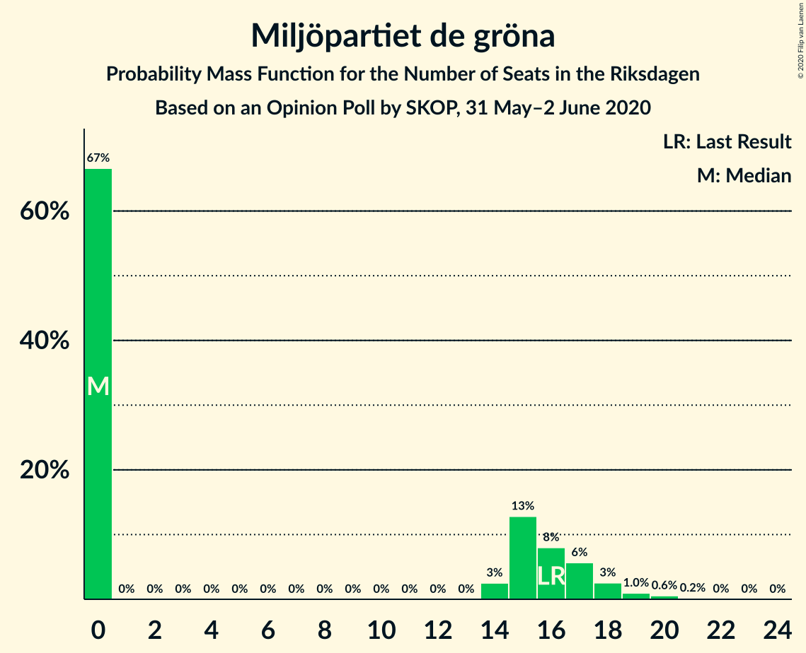

# Opinion Poll by SKOP, 31 May–2 June 2020

<a href="#voting-intentions">Voting Intentions</a> | <a href="#seats">Seats</a> | <a href="#coalitions">Coalitions</a> | <a href="#technical-information">Technical Information</a>

## Voting Intentions

### Confidence Intervals

| Party | Last Result | Poll Result | 80% Confidence Interval | 90% Confidence Interval | 95% Confidence Interval | 99% Confidence Interval |
|:-----:|:-----------:|:-----------:|:-----------------------:|:-----------------------:|:-----------------------:|:-----------------------:|
| Sveriges socialdemokratiska arbetareparti | 28.3% | 31.3% | 29.5–33.2% |29.0–33.8% |28.5–34.2% |27.6–35.2% |
| Moderata samlingspartiet | 19.8% | 20.3% | 18.7–22.0% |18.3–22.5% |17.9–22.9% |17.2–23.7% |
| Sverigedemokraterna | 17.5% | 17.0% | 15.5–18.6% |15.2–19.1% |14.8–19.4% |14.1–20.2% |
| Vänsterpartiet | 8.0% | 10.5% | 9.4–11.9% |9.1–12.3% |8.8–12.6% |8.3–13.3% |
| Centerpartiet | 8.6% | 6.6% | 5.7–7.7% |5.4–8.0% |5.2–8.3% |4.8–8.8% |
| Kristdemokraterna | 6.3% | 5.8% | 4.9–6.8% |4.7–7.1% |4.5–7.4% |4.1–7.9% |
| Miljöpartiet de gröna | 4.4% | 3.7% | 3.0–4.6% |2.8–4.8% |2.7–5.0% |2.4–5.5% |
| Liberalerna | 5.5% | 3.6% | 2.9–4.5% |2.7–4.7% |2.6–4.9% |2.3–5.4% |

*Note:* The poll result column reflects the actual value used in the calculations. Published results may vary slightly, and in addition be rounded to fewer digits.

## Seats

### Confidence Intervals

| Party | Last Result | Median | 80% Confidence Interval | 90% Confidence Interval | 95% Confidence Interval | 99% Confidence Interval |
|:-----:|:-----------:|:------:|:-----------------------:|:-----------------------:|:-----------------------:|:-----------------------:|
| <a href="#sveriges-socialdemokratiska-arbetareparti">Sveriges socialdemokratiska arbetareparti</a> | 100 | 116 | 108–123 |106–126 |104–128 |100–132 |
| <a href="#moderata-samlingspartiet">Moderata samlingspartiet</a> | 70 | 75 | 69–81 |67–83 |66–85 |62–88 |
| <a href="#sverigedemokraterna">Sverigedemokraterna</a> | 62 | 63 | 57–70 |55–71 |54–73 |52–76 |
| <a href="#vänsterpartiet">Vänsterpartiet</a> | 28 | 40 | 34–44 |33–46 |32–47 |30–50 |
| <a href="#centerpartiet">Centerpartiet</a> | 31 | 25 | 21–29 |20–30 |19–31 |18–33 |
| <a href="#kristdemokraterna">Kristdemokraterna</a> | 22 | 22 | 18–25 |17–26 |16–27 |15–29 |
| <a href="#miljöpartiet-de-gröna">Miljöpartiet de gröna</a> | 16 | 0 | 0–17 |0–17 |0–18 |0–20 |
| <a href="#liberalerna">Liberalerna</a> | 20 | 0 | 0–16 |0–17 |0–18 |0–19 |

### Sveriges socialdemokratiska arbetareparti

*For a full overview of the results for this party, see the [Sveriges socialdemokratiska arbetareparti](party-sverigessocialdemokratiskaarbetareparti.html) page.*

| Number of Seats | Probability | Accumulated | Special Marks |
|:---------------:|:-----------:|:-----------:|:-------------:|
| 96 | 0.1% | 100% |  |
| 97 | 0% | 99.9% |  |
| 98 | 0.1% | 99.9% |  |
| 99 | 0.1% | 99.8% |  |
| 100 | 0.3% | 99.7% | Last Result |
| 101 | 0.6% | 99.3% |  |
| 102 | 0.4% | 98.7% |  |
| 103 | 0.7% | 98% |  |
| 104 | 1.4% | 98% |  |
| 105 | 1.2% | 96% |  |
| 106 | 3% | 95% |  |
| 107 | 2% | 92% |  |
| 108 | 3% | 90% |  |
| 109 | 4% | 88% |  |
| 110 | 4% | 84% |  |
| 111 | 5% | 79% |  |
| 112 | 6% | 75% |  |
| 113 | 5% | 68% |  |
| 114 | 3% | 63% |  |
| 115 | 9% | 60% |  |
| 116 | 6% | 51% | Median |
| 117 | 6% | 45% |  |
| 118 | 6% | 38% |  |
| 119 | 4% | 33% |  |
| 120 | 9% | 29% |  |
| 121 | 3% | 20% |  |
| 122 | 4% | 17% |  |
| 123 | 3% | 13% |  |
| 124 | 1.5% | 9% |  |
| 125 | 2% | 8% |  |
| 126 | 2% | 6% |  |
| 127 | 2% | 4% |  |
| 128 | 0.6% | 3% |  |
| 129 | 1.0% | 2% |  |
| 130 | 0.2% | 1.0% |  |
| 131 | 0.2% | 0.8% |  |
| 132 | 0.2% | 0.6% |  |
| 133 | 0.1% | 0.3% |  |
| 134 | 0.1% | 0.2% |  |
| 135 | 0.1% | 0.2% |  |
| 136 | 0% | 0.1% |  |
| 137 | 0% | 0.1% |  |
| 138 | 0% | 0% |  |

### Moderata samlingspartiet

*For a full overview of the results for this party, see the [Moderata samlingspartiet](party-moderatasamlingspartiet.html) page.*

| Number of Seats | Probability | Accumulated | Special Marks |
|:---------------:|:-----------:|:-----------:|:-------------:|
| 59 | 0% | 100% |  |
| 60 | 0.1% | 99.9% |  |
| 61 | 0.2% | 99.9% |  |
| 62 | 0.2% | 99.7% |  |
| 63 | 0.4% | 99.5% |  |
| 64 | 0.7% | 99.0% |  |
| 65 | 0.8% | 98% |  |
| 66 | 2% | 98% |  |
| 67 | 2% | 96% |  |
| 68 | 3% | 93% |  |
| 69 | 3% | 90% |  |
| 70 | 6% | 87% | Last Result |
| 71 | 6% | 82% |  |
| 72 | 7% | 75% |  |
| 73 | 4% | 68% |  |
| 74 | 7% | 64% |  |
| 75 | 9% | 57% | Median |
| 76 | 8% | 47% |  |
| 77 | 9% | 39% |  |
| 78 | 8% | 30% |  |
| 79 | 6% | 22% |  |
| 80 | 4% | 16% |  |
| 81 | 2% | 12% |  |
| 82 | 2% | 9% |  |
| 83 | 2% | 7% |  |
| 84 | 1.2% | 5% |  |
| 85 | 1.5% | 4% |  |
| 86 | 1.0% | 2% |  |
| 87 | 0.5% | 1.2% |  |
| 88 | 0.3% | 0.7% |  |
| 89 | 0.2% | 0.4% |  |
| 90 | 0% | 0.2% |  |
| 91 | 0.1% | 0.2% |  |
| 92 | 0% | 0.1% |  |
| 93 | 0% | 0.1% |  |
| 94 | 0% | 0% |  |

### Sverigedemokraterna

*For a full overview of the results for this party, see the [Sverigedemokraterna](party-sverigedemokraterna.html) page.*

| Number of Seats | Probability | Accumulated | Special Marks |
|:---------------:|:-----------:|:-----------:|:-------------:|
| 49 | 0.1% | 100% |  |
| 50 | 0.1% | 99.9% |  |
| 51 | 0.2% | 99.8% |  |
| 52 | 0.5% | 99.6% |  |
| 53 | 1.0% | 99.1% |  |
| 54 | 1.1% | 98% |  |
| 55 | 2% | 97% |  |
| 56 | 3% | 95% |  |
| 57 | 4% | 92% |  |
| 58 | 4% | 87% |  |
| 59 | 4% | 83% |  |
| 60 | 8% | 79% |  |
| 61 | 7% | 70% |  |
| 62 | 8% | 63% | Last Result |
| 63 | 8% | 55% | Median |
| 64 | 4% | 47% |  |
| 65 | 9% | 43% |  |
| 66 | 11% | 34% |  |
| 67 | 6% | 23% |  |
| 68 | 5% | 17% |  |
| 69 | 2% | 12% |  |
| 70 | 3% | 10% |  |
| 71 | 4% | 7% |  |
| 72 | 1.1% | 4% |  |
| 73 | 1.2% | 3% |  |
| 74 | 0.4% | 2% |  |
| 75 | 0.6% | 1.1% |  |
| 76 | 0.3% | 0.5% |  |
| 77 | 0.1% | 0.3% |  |
| 78 | 0.1% | 0.2% |  |
| 79 | 0% | 0.1% |  |
| 80 | 0% | 0.1% |  |
| 81 | 0% | 0% |  |

### Vänsterpartiet

*For a full overview of the results for this party, see the [Vänsterpartiet](party-vänsterpartiet.html) page.*

| Number of Seats | Probability | Accumulated | Special Marks |
|:---------------:|:-----------:|:-----------:|:-------------:|
| 28 | 0% | 100% | Last Result |
| 29 | 0.2% | 99.9% |  |
| 30 | 0.4% | 99.8% |  |
| 31 | 0.9% | 99.4% |  |
| 32 | 1.3% | 98.5% |  |
| 33 | 2% | 97% |  |
| 34 | 6% | 95% |  |
| 35 | 4% | 89% |  |
| 36 | 7% | 85% |  |
| 37 | 9% | 78% |  |
| 38 | 11% | 69% |  |
| 39 | 6% | 58% |  |
| 40 | 12% | 52% | Median |
| 41 | 12% | 39% |  |
| 42 | 10% | 28% |  |
| 43 | 5% | 18% |  |
| 44 | 4% | 13% |  |
| 45 | 3% | 9% |  |
| 46 | 3% | 6% |  |
| 47 | 1.3% | 3% |  |
| 48 | 0.9% | 2% |  |
| 49 | 0.4% | 0.9% |  |
| 50 | 0.3% | 0.5% |  |
| 51 | 0.1% | 0.2% |  |
| 52 | 0.1% | 0.1% |  |
| 53 | 0% | 0% |  |

### Centerpartiet

*For a full overview of the results for this party, see the [Centerpartiet](party-centerpartiet.html) page.*

| Number of Seats | Probability | Accumulated | Special Marks |
|:---------------:|:-----------:|:-----------:|:-------------:|
| 16 | 0.1% | 100% |  |
| 17 | 0.2% | 99.9% |  |
| 18 | 1.1% | 99.7% |  |
| 19 | 2% | 98.5% |  |
| 20 | 4% | 97% |  |
| 21 | 8% | 93% |  |
| 22 | 8% | 85% |  |
| 23 | 14% | 77% |  |
| 24 | 10% | 63% |  |
| 25 | 16% | 53% | Median |
| 26 | 10% | 37% |  |
| 27 | 7% | 26% |  |
| 28 | 7% | 19% |  |
| 29 | 6% | 12% |  |
| 30 | 2% | 6% |  |
| 31 | 2% | 4% | Last Result |
| 32 | 0.5% | 1.2% |  |
| 33 | 0.4% | 0.7% |  |
| 34 | 0.2% | 0.3% |  |
| 35 | 0.1% | 0.1% |  |
| 36 | 0% | 0% |  |

### Kristdemokraterna

*For a full overview of the results for this party, see the [Kristdemokraterna](party-kristdemokraterna.html) page.*

| Number of Seats | Probability | Accumulated | Special Marks |
|:---------------:|:-----------:|:-----------:|:-------------:|
| 0 | 0.3% | 100% |  |
| 1 | 0% | 99.7% |  |
| 2 | 0% | 99.7% |  |
| 3 | 0% | 99.7% |  |
| 4 | 0% | 99.7% |  |
| 5 | 0% | 99.7% |  |
| 6 | 0% | 99.7% |  |
| 7 | 0% | 99.7% |  |
| 8 | 0% | 99.7% |  |
| 9 | 0% | 99.7% |  |
| 10 | 0% | 99.7% |  |
| 11 | 0% | 99.7% |  |
| 12 | 0% | 99.7% |  |
| 13 | 0% | 99.7% |  |
| 14 | 0% | 99.7% |  |
| 15 | 0.7% | 99.7% |  |
| 16 | 2% | 99.0% |  |
| 17 | 3% | 97% |  |
| 18 | 7% | 94% |  |
| 19 | 8% | 87% |  |
| 20 | 15% | 79% |  |
| 21 | 11% | 64% |  |
| 22 | 20% | 53% | Last Result, Median |
| 23 | 12% | 32% |  |
| 24 | 7% | 21% |  |
| 25 | 5% | 14% |  |
| 26 | 4% | 8% |  |
| 27 | 3% | 5% |  |
| 28 | 1.3% | 2% |  |
| 29 | 0.5% | 0.9% |  |
| 30 | 0.2% | 0.4% |  |
| 31 | 0.1% | 0.2% |  |
| 32 | 0% | 0.1% |  |
| 33 | 0% | 0% |  |

### Miljöpartiet de gröna

*For a full overview of the results for this party, see the [Miljöpartiet de gröna](party-miljöpartietdegröna.html) page.*

| Number of Seats | Probability | Accumulated | Special Marks |
|:---------------:|:-----------:|:-----------:|:-------------:|
| 0 | 67% | 100% | Median |
| 1 | 0% | 33% |  |
| 2 | 0% | 33% |  |
| 3 | 0% | 33% |  |
| 4 | 0% | 33% |  |
| 5 | 0% | 33% |  |
| 6 | 0% | 33% |  |
| 7 | 0% | 33% |  |
| 8 | 0% | 33% |  |
| 9 | 0% | 33% |  |
| 10 | 0% | 33% |  |
| 11 | 0% | 33% |  |
| 12 | 0% | 33% |  |
| 13 | 0% | 33% |  |
| 14 | 3% | 33% |  |
| 15 | 13% | 31% |  |
| 16 | 8% | 18% | Last Result |
| 17 | 6% | 10% |  |
| 18 | 3% | 4% |  |
| 19 | 1.0% | 2% |  |
| 20 | 0.6% | 0.8% |  |
| 21 | 0.2% | 0.3% |  |
| 22 | 0% | 0.1% |  |
| 23 | 0% | 0% |  |

### Liberalerna

*For a full overview of the results for this party, see the [Liberalerna](party-liberalerna.html) page.*

| Number of Seats | Probability | Accumulated | Special Marks |
|:---------------:|:-----------:|:-----------:|:-------------:|
| 0 | 74% | 100% | Median |
| 1 | 0% | 26% |  |
| 2 | 0% | 26% |  |
| 3 | 0% | 26% |  |
| 4 | 0% | 26% |  |
| 5 | 0% | 26% |  |
| 6 | 0% | 26% |  |
| 7 | 0% | 26% |  |
| 8 | 0% | 26% |  |
| 9 | 0% | 26% |  |
| 10 | 0% | 26% |  |
| 11 | 0% | 26% |  |
| 12 | 0% | 26% |  |
| 13 | 0% | 26% |  |
| 14 | 2% | 26% |  |
| 15 | 10% | 24% |  |
| 16 | 8% | 14% |  |
| 17 | 4% | 6% |  |
| 18 | 2% | 3% |  |
| 19 | 0.6% | 0.9% |  |
| 20 | 0.2% | 0.4% | Last Result |
| 21 | 0.1% | 0.1% |  |
| 22 | 0% | 0.1% |  |
| 23 | 0% | 0% |  |

## Coalitions

### Confidence Intervals

| Coalition | Last Result | Median | Majority? | 80% Confidence Interval | 90% Confidence Interval | 95% Confidence Interval | 99% Confidence Interval |
|:---------:|:-----------:|:------:|:---------:|:-----------------------:|:-----------------------:|:-----------------------:|:-----------------------:|
| Sveriges socialdemokratiska arbetareparti – Moderata samlingspartiet – Centerpartiet | 201 | 216 | 100% | 204–225 | 201–228 | 198–230 | 194–234 |
| Sveriges socialdemokratiska arbetareparti – Moderata samlingspartiet | 170 | 191 | 98% | 180–200 | 178–203 | 175–205 | 171–210 |
| Sveriges socialdemokratiska arbetareparti – Vänsterpartiet – Centerpartiet – Miljöpartiet de gröna – Liberalerna | 195 | 188 | 98% | 180–199 | 178–201 | 175–204 | 172–208 |
| Sveriges socialdemokratiska arbetareparti – Vänsterpartiet – Miljöpartiet de gröna | 144 | 160 | 4% | 150–170 | 148–173 | 146–176 | 142–179 |
| Moderata samlingspartiet – Sverigedemokraterna – Kristdemokraterna | 154 | 161 | 2% | 150–169 | 148–171 | 145–174 | 141–177 |
| Sveriges socialdemokratiska arbetareparti – Vänsterpartiet | 128 | 155 | 0.2% | 145–164 | 143–167 | 140–169 | 136–173 |
| Sveriges socialdemokratiska arbetareparti – Centerpartiet – Miljöpartiet de gröna – Liberalerna | 167 | 149 | 0.1% | 140–161 | 138–164 | 135–166 | 130–171 |
| Moderata samlingspartiet – Sverigedemokraterna | 132 | 139 | 0% | 129–147 | 127–149 | 125–151 | 120–155 |
| Moderata samlingspartiet – Centerpartiet – Kristdemokraterna – Liberalerna | 143 | 124 | 0% | 116–136 | 114–138 | 112–141 | 107–145 |
| Sveriges socialdemokratiska arbetareparti – Miljöpartiet de gröna | 116 | 120 | 0% | 111–131 | 109–134 | 107–136 | 104–140 |
| Moderata samlingspartiet – Centerpartiet – Kristdemokraterna | 123 | 121 | 0% | 113–130 | 111–132 | 109–135 | 105–137 |
| Moderata samlingspartiet – Centerpartiet – Liberalerna | 121 | 103 | 0% | 95–114 | 92–118 | 91–119 | 88–124 |
| Moderata samlingspartiet – Centerpartiet | 101 | 100 | 0% | 92–107 | 90–109 | 88–112 | 84–115 |

### Sveriges socialdemokratiska arbetareparti – Moderata samlingspartiet – Centerpartiet

| Number of Seats | Probability | Accumulated | Special Marks |
|:---------------:|:-----------:|:-----------:|:-------------:|
| 190 | 0% | 100% |  |
| 191 | 0% | 99.9% |  |
| 192 | 0.1% | 99.9% |  |
| 193 | 0.1% | 99.8% |  |
| 194 | 0.3% | 99.7% |  |
| 195 | 0.4% | 99.4% |  |
| 196 | 0.3% | 99.0% |  |
| 197 | 0.7% | 98.7% |  |
| 198 | 0.6% | 98% |  |
| 199 | 0.6% | 97% |  |
| 200 | 1.2% | 97% |  |
| 201 | 0.7% | 96% | Last Result |
| 202 | 1.1% | 95% |  |
| 203 | 2% | 94% |  |
| 204 | 3% | 92% |  |
| 205 | 2% | 90% |  |
| 206 | 4% | 88% |  |
| 207 | 2% | 83% |  |
| 208 | 2% | 81% |  |
| 209 | 3% | 79% |  |
| 210 | 4% | 76% |  |
| 211 | 2% | 72% |  |
| 212 | 4% | 70% |  |
| 213 | 4% | 66% |  |
| 214 | 8% | 62% |  |
| 215 | 2% | 53% |  |
| 216 | 4% | 52% | Median |
| 217 | 3% | 48% |  |
| 218 | 8% | 45% |  |
| 219 | 5% | 37% |  |
| 220 | 7% | 32% |  |
| 221 | 3% | 25% |  |
| 222 | 0.9% | 22% |  |
| 223 | 1.1% | 21% |  |
| 224 | 6% | 20% |  |
| 225 | 5% | 14% |  |
| 226 | 2% | 8% |  |
| 227 | 1.2% | 6% |  |
| 228 | 0.4% | 5% |  |
| 229 | 0.5% | 5% |  |
| 230 | 2% | 4% |  |
| 231 | 1.0% | 2% |  |
| 232 | 0.4% | 1.2% |  |
| 233 | 0.3% | 0.8% |  |
| 234 | 0.1% | 0.5% |  |
| 235 | 0.1% | 0.4% |  |
| 236 | 0.1% | 0.3% |  |
| 237 | 0% | 0.2% |  |
| 238 | 0.1% | 0.2% |  |
| 239 | 0% | 0.1% |  |
| 240 | 0% | 0.1% |  |
| 241 | 0% | 0% |  |

### Sveriges socialdemokratiska arbetareparti – Moderata samlingspartiet

| Number of Seats | Probability | Accumulated | Special Marks |
|:---------------:|:-----------:|:-----------:|:-------------:|
| 165 | 0% | 100% |  |
| 166 | 0% | 99.9% |  |
| 167 | 0% | 99.9% |  |
| 168 | 0.1% | 99.9% |  |
| 169 | 0.1% | 99.8% |  |
| 170 | 0.1% | 99.7% | Last Result |
| 171 | 0.1% | 99.6% |  |
| 172 | 0.2% | 99.5% |  |
| 173 | 0.9% | 99.3% |  |
| 174 | 0.5% | 98% |  |
| 175 | 0.6% | 98% | Majority |
| 176 | 0.6% | 97% |  |
| 177 | 0.7% | 97% |  |
| 178 | 2% | 96% |  |
| 179 | 2% | 94% |  |
| 180 | 2% | 92% |  |
| 181 | 3% | 90% |  |
| 182 | 1.3% | 87% |  |
| 183 | 3% | 85% |  |
| 184 | 3% | 82% |  |
| 185 | 3% | 79% |  |
| 186 | 6% | 76% |  |
| 187 | 3% | 70% |  |
| 188 | 3% | 67% |  |
| 189 | 5% | 65% |  |
| 190 | 6% | 60% |  |
| 191 | 8% | 54% | Median |
| 192 | 6% | 47% |  |
| 193 | 4% | 41% |  |
| 194 | 3% | 37% |  |
| 195 | 11% | 34% |  |
| 196 | 3% | 23% |  |
| 197 | 4% | 20% |  |
| 198 | 3% | 17% |  |
| 199 | 2% | 13% |  |
| 200 | 1.5% | 11% |  |
| 201 | 2% | 10% |  |
| 202 | 2% | 8% |  |
| 203 | 2% | 6% |  |
| 204 | 1.3% | 4% |  |
| 205 | 0.7% | 3% |  |
| 206 | 0.4% | 2% |  |
| 207 | 0.3% | 2% |  |
| 208 | 0.5% | 1.3% |  |
| 209 | 0.2% | 0.7% |  |
| 210 | 0.2% | 0.6% |  |
| 211 | 0.1% | 0.4% |  |
| 212 | 0.1% | 0.2% |  |
| 213 | 0.1% | 0.2% |  |
| 214 | 0% | 0.1% |  |
| 215 | 0% | 0.1% |  |
| 216 | 0% | 0% |  |

### Sveriges socialdemokratiska arbetareparti – Vänsterpartiet – Centerpartiet – Miljöpartiet de gröna – Liberalerna

| Number of Seats | Probability | Accumulated | Special Marks |
|:---------------:|:-----------:|:-----------:|:-------------:|
| 167 | 0% | 100% |  |
| 168 | 0% | 99.9% |  |
| 169 | 0.1% | 99.9% |  |
| 170 | 0.1% | 99.8% |  |
| 171 | 0.1% | 99.8% |  |
| 172 | 0.3% | 99.6% |  |
| 173 | 1.0% | 99.3% |  |
| 174 | 0.7% | 98% |  |
| 175 | 0.6% | 98% | Majority |
| 176 | 0.5% | 97% |  |
| 177 | 0.3% | 97% |  |
| 178 | 2% | 96% |  |
| 179 | 3% | 95% |  |
| 180 | 3% | 92% |  |
| 181 | 6% | 89% | Median |
| 182 | 3% | 84% |  |
| 183 | 2% | 81% |  |
| 184 | 2% | 79% |  |
| 185 | 3% | 77% |  |
| 186 | 10% | 74% |  |
| 187 | 8% | 64% |  |
| 188 | 7% | 56% |  |
| 189 | 3% | 48% |  |
| 190 | 4% | 45% |  |
| 191 | 6% | 42% |  |
| 192 | 4% | 36% |  |
| 193 | 4% | 32% |  |
| 194 | 4% | 28% |  |
| 195 | 3% | 23% | Last Result |
| 196 | 3% | 20% |  |
| 197 | 3% | 18% |  |
| 198 | 3% | 15% |  |
| 199 | 3% | 12% |  |
| 200 | 1.3% | 8% |  |
| 201 | 3% | 7% |  |
| 202 | 0.7% | 4% |  |
| 203 | 1.1% | 4% |  |
| 204 | 0.6% | 3% |  |
| 205 | 0.5% | 2% |  |
| 206 | 0.7% | 1.4% |  |
| 207 | 0.2% | 0.7% |  |
| 208 | 0.2% | 0.6% |  |
| 209 | 0.1% | 0.4% |  |
| 210 | 0.1% | 0.3% |  |
| 211 | 0.1% | 0.2% |  |
| 212 | 0.1% | 0.1% |  |
| 213 | 0% | 0.1% |  |
| 214 | 0% | 0% |  |

### Sveriges socialdemokratiska arbetareparti – Vänsterpartiet – Miljöpartiet de gröna

| Number of Seats | Probability | Accumulated | Special Marks |
|:---------------:|:-----------:|:-----------:|:-------------:|
| 136 | 0% | 100% |  |
| 137 | 0% | 99.9% |  |
| 138 | 0.1% | 99.9% |  |
| 139 | 0.2% | 99.9% |  |
| 140 | 0.1% | 99.7% |  |
| 141 | 0.1% | 99.6% |  |
| 142 | 0.3% | 99.5% |  |
| 143 | 0.2% | 99.3% |  |
| 144 | 0.4% | 99.0% | Last Result |
| 145 | 0.4% | 98.6% |  |
| 146 | 2% | 98% |  |
| 147 | 1.1% | 96% |  |
| 148 | 2% | 95% |  |
| 149 | 3% | 93% |  |
| 150 | 2% | 90% |  |
| 151 | 2% | 88% |  |
| 152 | 2% | 87% |  |
| 153 | 4% | 85% |  |
| 154 | 2% | 81% |  |
| 155 | 4% | 78% |  |
| 156 | 4% | 74% | Median |
| 157 | 5% | 70% |  |
| 158 | 4% | 65% |  |
| 159 | 6% | 62% |  |
| 160 | 6% | 56% |  |
| 161 | 9% | 50% |  |
| 162 | 3% | 41% |  |
| 163 | 6% | 38% |  |
| 164 | 3% | 32% |  |
| 165 | 3% | 28% |  |
| 166 | 3% | 25% |  |
| 167 | 3% | 22% |  |
| 168 | 6% | 19% |  |
| 169 | 3% | 14% |  |
| 170 | 1.5% | 11% |  |
| 171 | 1.1% | 9% |  |
| 172 | 2% | 8% |  |
| 173 | 2% | 6% |  |
| 174 | 0.5% | 4% |  |
| 175 | 0.4% | 4% | Majority |
| 176 | 1.2% | 3% |  |
| 177 | 0.6% | 2% |  |
| 178 | 0.4% | 2% |  |
| 179 | 0.8% | 1.1% |  |
| 180 | 0.1% | 0.4% |  |
| 181 | 0.1% | 0.3% |  |
| 182 | 0.1% | 0.2% |  |
| 183 | 0% | 0.1% |  |
| 184 | 0% | 0.1% |  |
| 185 | 0% | 0% |  |

### Moderata samlingspartiet – Sverigedemokraterna – Kristdemokraterna

| Number of Seats | Probability | Accumulated | Special Marks |
|:---------------:|:-----------:|:-----------:|:-------------:|
| 136 | 0% | 100% |  |
| 137 | 0.1% | 99.9% |  |
| 138 | 0.1% | 99.9% |  |
| 139 | 0.1% | 99.8% |  |
| 140 | 0.1% | 99.7% |  |
| 141 | 0.2% | 99.6% |  |
| 142 | 0.2% | 99.4% |  |
| 143 | 0.7% | 99.3% |  |
| 144 | 0.5% | 98.6% |  |
| 145 | 0.6% | 98% |  |
| 146 | 1.1% | 97% |  |
| 147 | 0.7% | 96% |  |
| 148 | 3% | 96% |  |
| 149 | 1.3% | 93% |  |
| 150 | 3% | 92% |  |
| 151 | 3% | 88% |  |
| 152 | 3% | 85% |  |
| 153 | 3% | 82% |  |
| 154 | 3% | 80% | Last Result |
| 155 | 4% | 77% |  |
| 156 | 4% | 72% |  |
| 157 | 4% | 68% |  |
| 158 | 6% | 64% |  |
| 159 | 4% | 58% |  |
| 160 | 3% | 55% | Median |
| 161 | 7% | 52% |  |
| 162 | 8% | 44% |  |
| 163 | 10% | 36% |  |
| 164 | 3% | 26% |  |
| 165 | 2% | 23% |  |
| 166 | 2% | 21% |  |
| 167 | 3% | 19% |  |
| 168 | 6% | 16% |  |
| 169 | 3% | 11% |  |
| 170 | 3% | 8% |  |
| 171 | 2% | 5% |  |
| 172 | 0.3% | 4% |  |
| 173 | 0.5% | 3% |  |
| 174 | 0.6% | 3% |  |
| 175 | 0.7% | 2% | Majority |
| 176 | 1.0% | 2% |  |
| 177 | 0.3% | 0.7% |  |
| 178 | 0.1% | 0.4% |  |
| 179 | 0.1% | 0.2% |  |
| 180 | 0.1% | 0.2% |  |
| 181 | 0% | 0.1% |  |
| 182 | 0% | 0.1% |  |
| 183 | 0% | 0% |  |

### Sveriges socialdemokratiska arbetareparti – Vänsterpartiet

| Number of Seats | Probability | Accumulated | Special Marks |
|:---------------:|:-----------:|:-----------:|:-------------:|
| 128 | 0% | 100% | Last Result |
| 129 | 0% | 100% |  |
| 130 | 0% | 100% |  |
| 131 | 0% | 100% |  |
| 132 | 0% | 100% |  |
| 133 | 0% | 99.9% |  |
| 134 | 0.2% | 99.9% |  |
| 135 | 0.1% | 99.7% |  |
| 136 | 0.2% | 99.6% |  |
| 137 | 0.4% | 99.5% |  |
| 138 | 0.3% | 99.0% |  |
| 139 | 0.4% | 98.7% |  |
| 140 | 1.0% | 98% |  |
| 141 | 0.8% | 97% |  |
| 142 | 0.7% | 97% |  |
| 143 | 1.3% | 96% |  |
| 144 | 1.2% | 95% |  |
| 145 | 4% | 93% |  |
| 146 | 2% | 90% |  |
| 147 | 4% | 87% |  |
| 148 | 4% | 84% |  |
| 149 | 5% | 80% |  |
| 150 | 3% | 75% |  |
| 151 | 3% | 72% |  |
| 152 | 4% | 69% |  |
| 153 | 8% | 65% |  |
| 154 | 2% | 57% |  |
| 155 | 6% | 54% |  |
| 156 | 5% | 48% | Median |
| 157 | 5% | 43% |  |
| 158 | 4% | 39% |  |
| 159 | 5% | 35% |  |
| 160 | 4% | 30% |  |
| 161 | 9% | 26% |  |
| 162 | 2% | 17% |  |
| 163 | 4% | 15% |  |
| 164 | 2% | 11% |  |
| 165 | 2% | 9% |  |
| 166 | 2% | 7% |  |
| 167 | 2% | 5% |  |
| 168 | 1.0% | 4% |  |
| 169 | 1.1% | 3% |  |
| 170 | 0.4% | 2% |  |
| 171 | 0.2% | 1.2% |  |
| 172 | 0.5% | 1.0% |  |
| 173 | 0.2% | 0.5% |  |
| 174 | 0.1% | 0.3% |  |
| 175 | 0.1% | 0.2% | Majority |
| 176 | 0.1% | 0.2% |  |
| 177 | 0% | 0.1% |  |
| 178 | 0% | 0.1% |  |
| 179 | 0% | 0% |  |

### Sveriges socialdemokratiska arbetareparti – Centerpartiet – Miljöpartiet de gröna – Liberalerna

| Number of Seats | Probability | Accumulated | Special Marks |
|:---------------:|:-----------:|:-----------:|:-------------:|
| 127 | 0% | 100% |  |
| 128 | 0.1% | 99.9% |  |
| 129 | 0.1% | 99.9% |  |
| 130 | 0.4% | 99.8% |  |
| 131 | 0.1% | 99.4% |  |
| 132 | 0.4% | 99.3% |  |
| 133 | 0.3% | 98.9% |  |
| 134 | 0.8% | 98.6% |  |
| 135 | 0.8% | 98% |  |
| 136 | 0.9% | 97% |  |
| 137 | 0.7% | 96% |  |
| 138 | 1.5% | 95% |  |
| 139 | 2% | 94% |  |
| 140 | 4% | 91% |  |
| 141 | 5% | 88% | Median |
| 142 | 2% | 83% |  |
| 143 | 2% | 81% |  |
| 144 | 3% | 79% |  |
| 145 | 8% | 76% |  |
| 146 | 6% | 68% |  |
| 147 | 5% | 62% |  |
| 148 | 4% | 57% |  |
| 149 | 4% | 53% |  |
| 150 | 4% | 49% |  |
| 151 | 5% | 46% |  |
| 152 | 4% | 40% |  |
| 153 | 6% | 36% |  |
| 154 | 2% | 30% |  |
| 155 | 2% | 27% |  |
| 156 | 3% | 25% |  |
| 157 | 5% | 22% |  |
| 158 | 2% | 17% |  |
| 159 | 2% | 16% |  |
| 160 | 2% | 14% |  |
| 161 | 3% | 12% |  |
| 162 | 2% | 9% |  |
| 163 | 2% | 7% |  |
| 164 | 1.2% | 6% |  |
| 165 | 0.6% | 4% |  |
| 166 | 2% | 4% |  |
| 167 | 0.5% | 2% | Last Result |
| 168 | 0.2% | 2% |  |
| 169 | 0.3% | 1.5% |  |
| 170 | 0.5% | 1.2% |  |
| 171 | 0.3% | 0.7% |  |
| 172 | 0.1% | 0.4% |  |
| 173 | 0.2% | 0.3% |  |
| 174 | 0.1% | 0.2% |  |
| 175 | 0% | 0.1% | Majority |
| 176 | 0% | 0.1% |  |
| 177 | 0% | 0% |  |

### Moderata samlingspartiet – Sverigedemokraterna

| Number of Seats | Probability | Accumulated | Special Marks |
|:---------------:|:-----------:|:-----------:|:-------------:|
| 117 | 0.1% | 100% |  |
| 118 | 0% | 99.9% |  |
| 119 | 0.1% | 99.9% |  |
| 120 | 0.3% | 99.7% |  |
| 121 | 0.2% | 99.5% |  |
| 122 | 0.5% | 99.3% |  |
| 123 | 0.4% | 98.9% |  |
| 124 | 0.4% | 98% |  |
| 125 | 1.5% | 98% |  |
| 126 | 1.2% | 97% |  |
| 127 | 2% | 95% |  |
| 128 | 2% | 93% |  |
| 129 | 3% | 92% |  |
| 130 | 3% | 89% |  |
| 131 | 3% | 86% |  |
| 132 | 3% | 83% | Last Result |
| 133 | 6% | 80% |  |
| 134 | 3% | 74% |  |
| 135 | 4% | 71% |  |
| 136 | 6% | 68% |  |
| 137 | 7% | 62% |  |
| 138 | 4% | 55% | Median |
| 139 | 2% | 51% |  |
| 140 | 10% | 49% |  |
| 141 | 9% | 39% |  |
| 142 | 5% | 30% |  |
| 143 | 4% | 25% |  |
| 144 | 5% | 21% |  |
| 145 | 2% | 16% |  |
| 146 | 3% | 14% |  |
| 147 | 2% | 11% |  |
| 148 | 3% | 9% |  |
| 149 | 1.2% | 6% |  |
| 150 | 0.6% | 5% |  |
| 151 | 2% | 4% |  |
| 152 | 0.4% | 2% |  |
| 153 | 1.2% | 2% |  |
| 154 | 0.2% | 0.9% |  |
| 155 | 0.2% | 0.6% |  |
| 156 | 0.1% | 0.5% |  |
| 157 | 0.2% | 0.3% |  |
| 158 | 0.1% | 0.2% |  |
| 159 | 0% | 0.1% |  |
| 160 | 0% | 0.1% |  |
| 161 | 0% | 0% |  |

### Moderata samlingspartiet – Centerpartiet – Kristdemokraterna – Liberalerna

| Number of Seats | Probability | Accumulated | Special Marks |
|:---------------:|:-----------:|:-----------:|:-------------:|
| 101 | 0% | 100% |  |
| 102 | 0% | 99.9% |  |
| 103 | 0% | 99.9% |  |
| 104 | 0.1% | 99.9% |  |
| 105 | 0% | 99.8% |  |
| 106 | 0.1% | 99.8% |  |
| 107 | 0.2% | 99.7% |  |
| 108 | 0.2% | 99.5% |  |
| 109 | 0.7% | 99.3% |  |
| 110 | 0.3% | 98.6% |  |
| 111 | 0.5% | 98% |  |
| 112 | 1.4% | 98% |  |
| 113 | 0.9% | 96% |  |
| 114 | 3% | 96% |  |
| 115 | 2% | 93% |  |
| 116 | 2% | 91% |  |
| 117 | 4% | 90% |  |
| 118 | 3% | 86% |  |
| 119 | 3% | 83% |  |
| 120 | 4% | 80% |  |
| 121 | 9% | 76% |  |
| 122 | 7% | 67% | Median |
| 123 | 6% | 60% |  |
| 124 | 4% | 54% |  |
| 125 | 6% | 50% |  |
| 126 | 4% | 44% |  |
| 127 | 5% | 41% |  |
| 128 | 2% | 35% |  |
| 129 | 3% | 33% |  |
| 130 | 3% | 30% |  |
| 131 | 5% | 27% |  |
| 132 | 3% | 22% |  |
| 133 | 3% | 20% |  |
| 134 | 3% | 17% |  |
| 135 | 3% | 14% |  |
| 136 | 2% | 11% |  |
| 137 | 2% | 9% |  |
| 138 | 2% | 7% |  |
| 139 | 0.9% | 5% |  |
| 140 | 0.9% | 4% |  |
| 141 | 1.2% | 3% |  |
| 142 | 0.3% | 2% |  |
| 143 | 0.4% | 1.4% | Last Result |
| 144 | 0.4% | 1.1% |  |
| 145 | 0.2% | 0.7% |  |
| 146 | 0.2% | 0.5% |  |
| 147 | 0.1% | 0.3% |  |
| 148 | 0.1% | 0.2% |  |
| 149 | 0% | 0.1% |  |
| 150 | 0% | 0.1% |  |
| 151 | 0% | 0% |  |

### Sveriges socialdemokratiska arbetareparti – Miljöpartiet de gröna

| Number of Seats | Probability | Accumulated | Special Marks |
|:---------------:|:-----------:|:-----------:|:-------------:|
| 100 | 0% | 100% |  |
| 101 | 0.1% | 99.9% |  |
| 102 | 0.1% | 99.8% |  |
| 103 | 0.2% | 99.7% |  |
| 104 | 0.3% | 99.6% |  |
| 105 | 0.3% | 99.3% |  |
| 106 | 0.7% | 99.0% |  |
| 107 | 1.0% | 98% |  |
| 108 | 2% | 97% |  |
| 109 | 1.0% | 96% |  |
| 110 | 3% | 95% |  |
| 111 | 3% | 92% |  |
| 112 | 3% | 89% |  |
| 113 | 3% | 86% |  |
| 114 | 2% | 83% |  |
| 115 | 5% | 80% |  |
| 116 | 4% | 76% | Last Result, Median |
| 117 | 6% | 71% |  |
| 118 | 4% | 66% |  |
| 119 | 4% | 61% |  |
| 120 | 10% | 58% |  |
| 121 | 4% | 48% |  |
| 122 | 6% | 44% |  |
| 123 | 4% | 39% |  |
| 124 | 4% | 35% |  |
| 125 | 3% | 30% |  |
| 126 | 3% | 28% |  |
| 127 | 3% | 25% |  |
| 128 | 2% | 21% |  |
| 129 | 4% | 19% |  |
| 130 | 5% | 15% |  |
| 131 | 1.1% | 10% |  |
| 132 | 2% | 9% |  |
| 133 | 2% | 7% |  |
| 134 | 0.6% | 5% |  |
| 135 | 1.1% | 5% |  |
| 136 | 1.4% | 4% |  |
| 137 | 0.6% | 2% |  |
| 138 | 0.3% | 2% |  |
| 139 | 0.6% | 1.3% |  |
| 140 | 0.2% | 0.7% |  |
| 141 | 0.2% | 0.5% |  |
| 142 | 0.2% | 0.3% |  |
| 143 | 0% | 0.1% |  |
| 144 | 0% | 0.1% |  |
| 145 | 0% | 0.1% |  |
| 146 | 0% | 0% |  |

### Moderata samlingspartiet – Centerpartiet – Kristdemokraterna

| Number of Seats | Probability | Accumulated | Special Marks |
|:---------------:|:-----------:|:-----------:|:-------------:|
| 99 | 0% | 100% |  |
| 100 | 0% | 99.9% |  |
| 101 | 0.1% | 99.9% |  |
| 102 | 0.1% | 99.9% |  |
| 103 | 0.1% | 99.8% |  |
| 104 | 0.2% | 99.7% |  |
| 105 | 0.3% | 99.6% |  |
| 106 | 0.5% | 99.2% |  |
| 107 | 0.6% | 98.7% |  |
| 108 | 0.5% | 98% |  |
| 109 | 2% | 98% |  |
| 110 | 0.7% | 96% |  |
| 111 | 2% | 95% |  |
| 112 | 2% | 93% |  |
| 113 | 3% | 91% |  |
| 114 | 3% | 89% |  |
| 115 | 3% | 85% |  |
| 116 | 3% | 82% |  |
| 117 | 6% | 79% |  |
| 118 | 4% | 73% |  |
| 119 | 5% | 69% |  |
| 120 | 4% | 64% |  |
| 121 | 12% | 60% |  |
| 122 | 8% | 48% | Median |
| 123 | 7% | 40% | Last Result |
| 124 | 4% | 33% |  |
| 125 | 6% | 29% |  |
| 126 | 4% | 23% |  |
| 127 | 5% | 19% |  |
| 128 | 1.5% | 14% |  |
| 129 | 2% | 13% |  |
| 130 | 2% | 10% |  |
| 131 | 3% | 8% |  |
| 132 | 1.3% | 5% |  |
| 133 | 0.9% | 4% |  |
| 134 | 0.7% | 3% |  |
| 135 | 1.4% | 3% |  |
| 136 | 0.3% | 1.2% |  |
| 137 | 0.5% | 0.9% |  |
| 138 | 0.1% | 0.4% |  |
| 139 | 0.1% | 0.3% |  |
| 140 | 0.1% | 0.2% |  |
| 141 | 0% | 0.1% |  |
| 142 | 0% | 0.1% |  |
| 143 | 0% | 0% |  |

### Moderata samlingspartiet – Centerpartiet – Liberalerna

| Number of Seats | Probability | Accumulated | Special Marks |
|:---------------:|:-----------:|:-----------:|:-------------:|
| 83 | 0% | 100% |  |
| 84 | 0.1% | 99.9% |  |
| 85 | 0.1% | 99.8% |  |
| 86 | 0.1% | 99.8% |  |
| 87 | 0.1% | 99.7% |  |
| 88 | 0.5% | 99.6% |  |
| 89 | 0.7% | 99.1% |  |
| 90 | 0.4% | 98% |  |
| 91 | 0.7% | 98% |  |
| 92 | 3% | 97% |  |
| 93 | 2% | 95% |  |
| 94 | 2% | 93% |  |
| 95 | 3% | 91% |  |
| 96 | 2% | 88% |  |
| 97 | 5% | 86% |  |
| 98 | 3% | 81% |  |
| 99 | 8% | 78% |  |
| 100 | 8% | 70% | Median |
| 101 | 6% | 61% |  |
| 102 | 3% | 55% |  |
| 103 | 5% | 52% |  |
| 104 | 5% | 47% |  |
| 105 | 4% | 42% |  |
| 106 | 3% | 38% |  |
| 107 | 5% | 36% |  |
| 108 | 5% | 31% |  |
| 109 | 2% | 26% |  |
| 110 | 2% | 23% |  |
| 111 | 3% | 21% |  |
| 112 | 3% | 18% |  |
| 113 | 4% | 16% |  |
| 114 | 2% | 12% |  |
| 115 | 1.1% | 9% |  |
| 116 | 2% | 8% |  |
| 117 | 2% | 7% |  |
| 118 | 1.1% | 5% |  |
| 119 | 2% | 4% |  |
| 120 | 0.5% | 2% |  |
| 121 | 0.5% | 2% | Last Result |
| 122 | 0.4% | 1.2% |  |
| 123 | 0.2% | 0.8% |  |
| 124 | 0.1% | 0.6% |  |
| 125 | 0.2% | 0.4% |  |
| 126 | 0.1% | 0.2% |  |
| 127 | 0% | 0.1% |  |
| 128 | 0% | 0.1% |  |
| 129 | 0% | 0% |  |

### Moderata samlingspartiet – Centerpartiet

| Number of Seats | Probability | Accumulated | Special Marks |
|:---------------:|:-----------:|:-----------:|:-------------:|
| 81 | 0% | 100% |  |
| 82 | 0% | 99.9% |  |
| 83 | 0.2% | 99.9% |  |
| 84 | 0.3% | 99.7% |  |
| 85 | 0.1% | 99.4% |  |
| 86 | 0.4% | 99.3% |  |
| 87 | 0.9% | 98.9% |  |
| 88 | 1.1% | 98% |  |
| 89 | 1.3% | 97% |  |
| 90 | 1.0% | 96% |  |
| 91 | 2% | 95% |  |
| 92 | 4% | 92% |  |
| 93 | 3% | 88% |  |
| 94 | 4% | 85% |  |
| 95 | 4% | 82% |  |
| 96 | 4% | 77% |  |
| 97 | 7% | 73% |  |
| 98 | 5% | 66% |  |
| 99 | 10% | 61% |  |
| 100 | 10% | 52% | Median |
| 101 | 7% | 42% | Last Result |
| 102 | 4% | 34% |  |
| 103 | 7% | 31% |  |
| 104 | 4% | 24% |  |
| 105 | 3% | 19% |  |
| 106 | 2% | 16% |  |
| 107 | 5% | 14% |  |
| 108 | 3% | 9% |  |
| 109 | 2% | 6% |  |
| 110 | 0.8% | 5% |  |
| 111 | 1.3% | 4% |  |
| 112 | 0.6% | 3% |  |
| 113 | 1.1% | 2% |  |
| 114 | 0.3% | 0.9% |  |
| 115 | 0.2% | 0.6% |  |
| 116 | 0.2% | 0.4% |  |
| 117 | 0.1% | 0.2% |  |
| 118 | 0% | 0.1% |  |
| 119 | 0% | 0.1% |  |
| 120 | 0% | 0% |  |

## Technical Information

### Opinion Poll

+ **Polling firm:** SKOP
+ **Commissioner(s):** —
+ **Fieldwork period:** 31 May–2 June 2020

### Calculations

+ **Sample size:** 1006
+ **Simulations done:** 1,048,576
+ **Error estimate:** 1.10%

