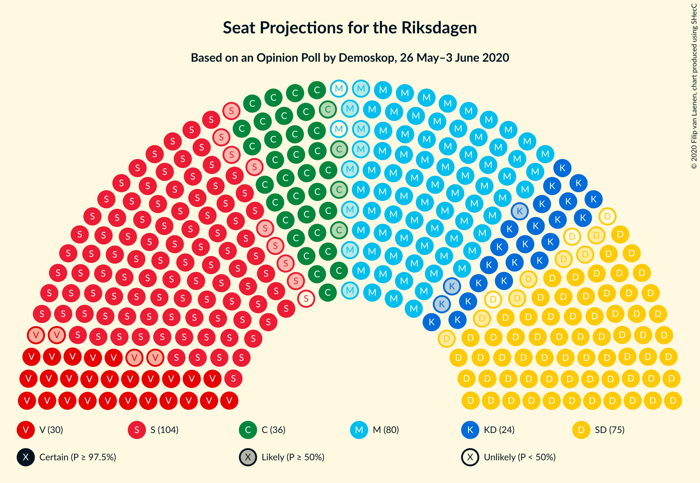

# Opinion Poll by Demoskop, 26 May–3 June 2020

<a href="#voting-intentions">Voting Intentions</a> | <a href="#seats">Seats</a> | <a href="#coalitions">Coalitions</a> | <a href="#technical-information">Technical Information</a>

## Voting Intentions

### Confidence Intervals

| Party | Last Result | Poll Result | 80% Confidence Interval | 90% Confidence Interval | 95% Confidence Interval | 99% Confidence Interval |
|:-----:|:-----------:|:-----------:|:-----------------------:|:-----------------------:|:-----------------------:|:-----------------------:|
| Sveriges socialdemokratiska arbetareparti | 28.3% | 27.8% | 26.6–29.0% |26.3–29.3% |26.0–29.6% |25.5–30.2% |
| Moderata samlingspartiet | 19.8% | 20.9% | 19.9–22.0% |19.6–22.3% |19.3–22.6% |18.8–23.1% |
| Sverigedemokraterna | 17.5% | 19.3% | 18.3–20.3% |18.0–20.7% |17.8–20.9% |17.3–21.4% |
| Centerpartiet | 8.6% | 9.7% | 8.9–10.5% |8.7–10.7% |8.6–10.9% |8.2–11.3% |
| Vänsterpartiet | 8.0% | 8.2% | 7.5–9.0% |7.3–9.2% |7.2–9.4% |6.9–9.7% |
| Kristdemokraterna | 6.3% | 6.5% | 5.9–7.2% |5.7–7.4% |5.6–7.5% |5.3–7.9% |
| Miljöpartiet de gröna | 4.4% | 3.9% | 3.4–4.5% |3.3–4.6% |3.2–4.8% |3.0–5.0% |
| Liberalerna | 5.5% | 2.7% | 2.3–3.2% |2.2–3.3% |2.1–3.4% |2.0–3.7% |

*Note:* The poll result column reflects the actual value used in the calculations. Published results may vary slightly, and in addition be rounded to fewer digits.

## Seats

### Confidence Intervals

| Party | Last Result | Median | 80% Confidence Interval | 90% Confidence Interval | 95% Confidence Interval | 99% Confidence Interval |
|:-----:|:-----------:|:------:|:-----------------------:|:-----------------------:|:-----------------------:|:-----------------------:|
| <a href="#sveriges-socialdemokratiska-arbetareparti">Sveriges socialdemokratiska arbetareparti</a> | 100 | 103 | 98–108 |96–110 |95–111 |93–113 |
| <a href="#moderata-samlingspartiet">Moderata samlingspartiet</a> | 70 | 78 | 73–82 |72–82 |70–84 |69–86 |
| <a href="#sverigedemokraterna">Sverigedemokraterna</a> | 62 | 72 | 67–76 |66–77 |65–79 |63–80 |
| <a href="#centerpartiet">Centerpartiet</a> | 31 | 36 | 33–39 |32–40 |32–41 |30–42 |
| <a href="#vänsterpartiet">Vänsterpartiet</a> | 28 | 30 | 28–33 |27–34 |26–35 |25–36 |
| <a href="#kristdemokraterna">Kristdemokraterna</a> | 22 | 24 | 22–27 |21–27 |21–28 |19–29 |
| <a href="#miljöpartiet-de-gröna">Miljöpartiet de gröna</a> | 16 | 0 | 0–16 |0–17 |0–17 |0–18 |
| <a href="#liberalerna">Liberalerna</a> | 20 | 0 | 0 |0 |0 |0 |

### Sveriges socialdemokratiska arbetareparti

*For a full overview of the results for this party, see the [Sveriges socialdemokratiska arbetareparti](party-sverigessocialdemokratiskaarbetareparti.html) page.*

| Number of Seats | Probability | Accumulated | Special Marks |
|:---------------:|:-----------:|:-----------:|:-------------:|
| 91 | 0.1% | 100% |  |
| 92 | 0.3% | 99.9% |  |
| 93 | 0.5% | 99.6% |  |
| 94 | 0.8% | 99.1% |  |
| 95 | 2% | 98% |  |
| 96 | 3% | 96% |  |
| 97 | 2% | 93% |  |
| 98 | 4% | 91% |  |
| 99 | 7% | 87% |  |
| 100 | 7% | 80% | Last Result |
| 101 | 10% | 73% |  |
| 102 | 9% | 63% |  |
| 103 | 10% | 54% | Median |
| 104 | 10% | 44% |  |
| 105 | 7% | 33% |  |
| 106 | 6% | 26% |  |
| 107 | 7% | 21% |  |
| 108 | 4% | 14% |  |
| 109 | 3% | 10% |  |
| 110 | 3% | 6% |  |
| 111 | 2% | 3% |  |
| 112 | 0.4% | 1.1% |  |
| 113 | 0.3% | 0.6% |  |
| 114 | 0.2% | 0.3% |  |
| 115 | 0.1% | 0.1% |  |
| 116 | 0% | 0.1% |  |
| 117 | 0% | 0% |  |

### Moderata samlingspartiet

*For a full overview of the results for this party, see the [Moderata samlingspartiet](party-moderatasamlingspartiet.html) page.*

| Number of Seats | Probability | Accumulated | Special Marks |
|:---------------:|:-----------:|:-----------:|:-------------:|
| 67 | 0.1% | 100% |  |
| 68 | 0.3% | 99.9% |  |
| 69 | 1.2% | 99.5% |  |
| 70 | 1.1% | 98% | Last Result |
| 71 | 1.2% | 97% |  |
| 72 | 3% | 96% |  |
| 73 | 4% | 93% |  |
| 74 | 6% | 89% |  |
| 75 | 9% | 83% |  |
| 76 | 10% | 73% |  |
| 77 | 12% | 63% |  |
| 78 | 11% | 51% | Median |
| 79 | 8% | 40% |  |
| 80 | 13% | 32% |  |
| 81 | 7% | 20% |  |
| 82 | 7% | 12% |  |
| 83 | 2% | 5% |  |
| 84 | 2% | 3% |  |
| 85 | 0.5% | 1.2% |  |
| 86 | 0.4% | 0.7% |  |
| 87 | 0.2% | 0.4% |  |
| 88 | 0.1% | 0.2% |  |
| 89 | 0.1% | 0.1% |  |
| 90 | 0% | 0% |  |

### Sverigedemokraterna

*For a full overview of the results for this party, see the [Sverigedemokraterna](party-sverigedemokraterna.html) page.*

| Number of Seats | Probability | Accumulated | Special Marks |
|:---------------:|:-----------:|:-----------:|:-------------:|
| 61 | 0% | 100% |  |
| 62 | 0.2% | 99.9% | Last Result |
| 63 | 0.4% | 99.7% |  |
| 64 | 0.8% | 99.3% |  |
| 65 | 2% | 98.5% |  |
| 66 | 5% | 96% |  |
| 67 | 5% | 91% |  |
| 68 | 5% | 86% |  |
| 69 | 8% | 81% |  |
| 70 | 10% | 74% |  |
| 71 | 10% | 64% |  |
| 72 | 9% | 54% | Median |
| 73 | 9% | 45% |  |
| 74 | 11% | 35% |  |
| 75 | 11% | 25% |  |
| 76 | 7% | 14% |  |
| 77 | 3% | 7% |  |
| 78 | 1.1% | 4% |  |
| 79 | 2% | 3% |  |
| 80 | 0.8% | 1.0% |  |
| 81 | 0.1% | 0.2% |  |
| 82 | 0.1% | 0.1% |  |
| 83 | 0% | 0% |  |

### Centerpartiet

*For a full overview of the results for this party, see the [Centerpartiet](party-centerpartiet.html) page.*

| Number of Seats | Probability | Accumulated | Special Marks |
|:---------------:|:-----------:|:-----------:|:-------------:|
| 29 | 0.1% | 100% |  |
| 30 | 0.5% | 99.8% |  |
| 31 | 1.4% | 99.3% | Last Result |
| 32 | 5% | 98% |  |
| 33 | 8% | 93% |  |
| 34 | 12% | 85% |  |
| 35 | 19% | 73% |  |
| 36 | 15% | 54% | Median |
| 37 | 13% | 39% |  |
| 38 | 11% | 26% |  |
| 39 | 8% | 15% |  |
| 40 | 3% | 7% |  |
| 41 | 3% | 4% |  |
| 42 | 0.5% | 1.0% |  |
| 43 | 0.4% | 0.5% |  |
| 44 | 0.1% | 0.1% |  |
| 45 | 0% | 0% |  |

### Vänsterpartiet

*For a full overview of the results for this party, see the [Vänsterpartiet](party-vänsterpartiet.html) page.*

| Number of Seats | Probability | Accumulated | Special Marks |
|:---------------:|:-----------:|:-----------:|:-------------:|
| 24 | 0.1% | 100% |  |
| 25 | 0.8% | 99.8% |  |
| 26 | 2% | 99.1% |  |
| 27 | 4% | 97% |  |
| 28 | 10% | 93% | Last Result |
| 29 | 17% | 83% |  |
| 30 | 19% | 66% | Median |
| 31 | 16% | 47% |  |
| 32 | 15% | 31% |  |
| 33 | 8% | 17% |  |
| 34 | 5% | 9% |  |
| 35 | 2% | 3% |  |
| 36 | 1.0% | 1.4% |  |
| 37 | 0.3% | 0.4% |  |
| 38 | 0.1% | 0.1% |  |
| 39 | 0% | 0% |  |

### Kristdemokraterna

*For a full overview of the results for this party, see the [Kristdemokraterna](party-kristdemokraterna.html) page.*

| Number of Seats | Probability | Accumulated | Special Marks |
|:---------------:|:-----------:|:-----------:|:-------------:|
| 18 | 0.1% | 100% |  |
| 19 | 0.5% | 99.9% |  |
| 20 | 2% | 99.4% |  |
| 21 | 5% | 98% |  |
| 22 | 13% | 93% | Last Result |
| 23 | 13% | 80% |  |
| 24 | 24% | 66% | Median |
| 25 | 17% | 42% |  |
| 26 | 13% | 25% |  |
| 27 | 8% | 11% |  |
| 28 | 3% | 4% |  |
| 29 | 0.9% | 1.3% |  |
| 30 | 0.3% | 0.4% |  |
| 31 | 0.1% | 0.1% |  |
| 32 | 0% | 0% |  |

### Miljöpartiet de gröna

*For a full overview of the results for this party, see the [Miljöpartiet de gröna](party-miljöpartietdegröna.html) page.*

| Number of Seats | Probability | Accumulated | Special Marks |
|:---------------:|:-----------:|:-----------:|:-------------:|
| 0 | 61% | 100% | Median |
| 1 | 0% | 39% |  |
| 2 | 0% | 39% |  |
| 3 | 0% | 39% |  |
| 4 | 0% | 39% |  |
| 5 | 0% | 39% |  |
| 6 | 0% | 39% |  |
| 7 | 0% | 39% |  |
| 8 | 0% | 39% |  |
| 9 | 0% | 39% |  |
| 10 | 0% | 39% |  |
| 11 | 0% | 39% |  |
| 12 | 0% | 39% |  |
| 13 | 0% | 39% |  |
| 14 | 0.7% | 39% |  |
| 15 | 18% | 38% |  |
| 16 | 15% | 20% | Last Result |
| 17 | 4% | 6% |  |
| 18 | 2% | 2% |  |
| 19 | 0.2% | 0.2% |  |
| 20 | 0% | 0% |  |

### Liberalerna

*For a full overview of the results for this party, see the [Liberalerna](party-liberalerna.html) page.*

| Number of Seats | Probability | Accumulated | Special Marks |
|:---------------:|:-----------:|:-----------:|:-------------:|
| 0 | 100% | 100% | Median |
| 1 | 0% | 0% |  |
| 2 | 0% | 0% |  |
| 3 | 0% | 0% |  |
| 4 | 0% | 0% |  |
| 5 | 0% | 0% |  |
| 6 | 0% | 0% |  |
| 7 | 0% | 0% |  |
| 8 | 0% | 0% |  |
| 9 | 0% | 0% |  |
| 10 | 0% | 0% |  |
| 11 | 0% | 0% |  |
| 12 | 0% | 0% |  |
| 13 | 0% | 0% |  |
| 14 | 0% | 0% |  |
| 15 | 0% | 0% |  |
| 16 | 0% | 0% |  |
| 17 | 0% | 0% |  |
| 18 | 0% | 0% |  |
| 19 | 0% | 0% |  |
| 20 | 0% | 0% | Last Result |

## Coalitions

### Confidence Intervals

| Coalition | Last Result | Median | Majority? | 80% Confidence Interval | 90% Confidence Interval | 95% Confidence Interval | 99% Confidence Interval |
|:---------:|:-----------:|:------:|:---------:|:-----------------------:|:-----------------------:|:-----------------------:|:-----------------------:|
| Sveriges socialdemokratiska arbetareparti – Moderata samlingspartiet – Centerpartiet | 201 | 217 | 100% | 208–224 | 207–225 | 205–226 | 203–228 |
| Sveriges socialdemokratiska arbetareparti – Moderata samlingspartiet | 170 | 181 | 86% | 174–187 | 172–190 | 170–190 | 168–193 |
| Sveriges socialdemokratiska arbetareparti – Centerpartiet – Vänsterpartiet – Miljöpartiet de gröna – Liberalerna | 195 | 175 | 54% | 169–183 | 167–185 | 167–186 | 164–189 |
| Moderata samlingspartiet – Sverigedemokraterna – Kristdemokraterna | 154 | 174 | 46% | 166–180 | 164–182 | 163–182 | 160–185 |
| Moderata samlingspartiet – Sverigedemokraterna | 132 | 150 | 0% | 142–155 | 141–157 | 139–158 | 137–160 |
| Sveriges socialdemokratiska arbetareparti – Centerpartiet – Miljöpartiet de gröna – Liberalerna | 167 | 144 | 0% | 138–153 | 137–155 | 135–156 | 133–159 |
| Sveriges socialdemokratiska arbetareparti – Vänsterpartiet – Miljöpartiet de gröna | 144 | 139 | 0% | 132–148 | 131–150 | 130–151 | 128–153 |
| Moderata samlingspartiet – Centerpartiet – Kristdemokraterna – Liberalerna | 143 | 138 | 0% | 132–143 | 130–145 | 129–147 | 126–149 |
| Moderata samlingspartiet – Centerpartiet – Kristdemokraterna | 123 | 138 | 0% | 132–143 | 130–145 | 129–147 | 126–148 |
| Sveriges socialdemokratiska arbetareparti – Vänsterpartiet | 128 | 134 | 0% | 128–139 | 126–141 | 125–143 | 122–145 |
| Moderata samlingspartiet – Centerpartiet – Liberalerna | 121 | 114 | 0% | 108–119 | 107–120 | 105–121 | 103–123 |
| Moderata samlingspartiet – Centerpartiet | 101 | 114 | 0% | 108–119 | 107–120 | 105–121 | 103–123 |
| Sveriges socialdemokratiska arbetareparti – Miljöpartiet de gröna | 116 | 108 | 0% | 102–118 | 100–120 | 99–121 | 97–123 |

### Sveriges socialdemokratiska arbetareparti – Moderata samlingspartiet – Centerpartiet

| Number of Seats | Probability | Accumulated | Special Marks |
|:---------------:|:-----------:|:-----------:|:-------------:|
| 200 | 0% | 100% |  |
| 201 | 0.2% | 99.9% | Last Result |
| 202 | 0.2% | 99.8% |  |
| 203 | 0.6% | 99.6% |  |
| 204 | 0.7% | 99.0% |  |
| 205 | 1.0% | 98% |  |
| 206 | 1.0% | 97% |  |
| 207 | 3% | 96% |  |
| 208 | 4% | 93% |  |
| 209 | 5% | 89% |  |
| 210 | 4% | 84% |  |
| 211 | 6% | 80% |  |
| 212 | 5% | 75% |  |
| 213 | 2% | 70% |  |
| 214 | 4% | 67% |  |
| 215 | 3% | 63% |  |
| 216 | 6% | 60% |  |
| 217 | 5% | 55% | Median |
| 218 | 9% | 50% |  |
| 219 | 8% | 41% |  |
| 220 | 5% | 33% |  |
| 221 | 5% | 27% |  |
| 222 | 4% | 22% |  |
| 223 | 4% | 18% |  |
| 224 | 6% | 14% |  |
| 225 | 3% | 8% |  |
| 226 | 3% | 5% |  |
| 227 | 1.0% | 2% |  |
| 228 | 0.8% | 1.3% |  |
| 229 | 0.2% | 0.5% |  |
| 230 | 0.1% | 0.3% |  |
| 231 | 0.1% | 0.2% |  |
| 232 | 0% | 0% |  |

### Sveriges socialdemokratiska arbetareparti – Moderata samlingspartiet

| Number of Seats | Probability | Accumulated | Special Marks |
|:---------------:|:-----------:|:-----------:|:-------------:|
| 165 | 0% | 100% |  |
| 166 | 0.2% | 99.9% |  |
| 167 | 0.2% | 99.7% |  |
| 168 | 0.6% | 99.5% |  |
| 169 | 0.7% | 99.0% |  |
| 170 | 1.0% | 98% | Last Result |
| 171 | 2% | 97% |  |
| 172 | 4% | 96% |  |
| 173 | 2% | 92% |  |
| 174 | 4% | 90% |  |
| 175 | 6% | 86% | Majority |
| 176 | 5% | 80% |  |
| 177 | 7% | 75% |  |
| 178 | 5% | 68% |  |
| 179 | 4% | 63% |  |
| 180 | 4% | 59% |  |
| 181 | 10% | 55% | Median |
| 182 | 8% | 45% |  |
| 183 | 8% | 38% |  |
| 184 | 5% | 30% |  |
| 185 | 6% | 25% |  |
| 186 | 5% | 19% |  |
| 187 | 4% | 14% |  |
| 188 | 4% | 10% |  |
| 189 | 0.8% | 6% |  |
| 190 | 3% | 5% |  |
| 191 | 0.4% | 2% |  |
| 192 | 0.9% | 1.4% |  |
| 193 | 0.1% | 0.5% |  |
| 194 | 0.2% | 0.4% |  |
| 195 | 0.1% | 0.1% |  |
| 196 | 0% | 0% |  |

### Sveriges socialdemokratiska arbetareparti – Centerpartiet – Vänsterpartiet – Miljöpartiet de gröna – Liberalerna

| Number of Seats | Probability | Accumulated | Special Marks |
|:---------------:|:-----------:|:-----------:|:-------------:|
| 161 | 0% | 100% |  |
| 162 | 0.1% | 99.9% |  |
| 163 | 0.2% | 99.8% |  |
| 164 | 0.2% | 99.6% |  |
| 165 | 0.5% | 99.5% |  |
| 166 | 1.2% | 99.0% |  |
| 167 | 4% | 98% |  |
| 168 | 2% | 94% |  |
| 169 | 4% | 92% | Median |
| 170 | 11% | 88% |  |
| 171 | 4% | 77% |  |
| 172 | 5% | 72% |  |
| 173 | 5% | 67% |  |
| 174 | 8% | 62% |  |
| 175 | 6% | 54% | Majority |
| 176 | 7% | 48% |  |
| 177 | 4% | 41% |  |
| 178 | 7% | 37% |  |
| 179 | 6% | 30% |  |
| 180 | 4% | 23% |  |
| 181 | 5% | 19% |  |
| 182 | 2% | 14% |  |
| 183 | 3% | 12% |  |
| 184 | 3% | 9% |  |
| 185 | 3% | 6% |  |
| 186 | 1.0% | 3% |  |
| 187 | 0.8% | 2% |  |
| 188 | 0.4% | 1.0% |  |
| 189 | 0.3% | 0.6% |  |
| 190 | 0.2% | 0.3% |  |
| 191 | 0.1% | 0.1% |  |
| 192 | 0% | 0% |  |
| 193 | 0% | 0% |  |
| 194 | 0% | 0% |  |
| 195 | 0% | 0% | Last Result |

### Moderata samlingspartiet – Sverigedemokraterna – Kristdemokraterna

| Number of Seats | Probability | Accumulated | Special Marks |
|:---------------:|:-----------:|:-----------:|:-------------:|
| 154 | 0% | 100% | Last Result |
| 155 | 0% | 100% |  |
| 156 | 0% | 100% |  |
| 157 | 0% | 100% |  |
| 158 | 0.1% | 100% |  |
| 159 | 0.2% | 99.9% |  |
| 160 | 0.3% | 99.7% |  |
| 161 | 0.4% | 99.4% |  |
| 162 | 0.8% | 99.0% |  |
| 163 | 1.0% | 98% |  |
| 164 | 3% | 97% |  |
| 165 | 3% | 94% |  |
| 166 | 3% | 91% |  |
| 167 | 2% | 88% |  |
| 168 | 5% | 86% |  |
| 169 | 4% | 81% |  |
| 170 | 6% | 77% |  |
| 171 | 7% | 70% |  |
| 172 | 4% | 63% |  |
| 173 | 7% | 59% |  |
| 174 | 6% | 52% | Median |
| 175 | 8% | 46% | Majority |
| 176 | 5% | 38% |  |
| 177 | 5% | 33% |  |
| 178 | 4% | 28% |  |
| 179 | 11% | 23% |  |
| 180 | 4% | 12% |  |
| 181 | 2% | 8% |  |
| 182 | 4% | 6% |  |
| 183 | 1.2% | 2% |  |
| 184 | 0.5% | 1.0% |  |
| 185 | 0.2% | 0.5% |  |
| 186 | 0.2% | 0.4% |  |
| 187 | 0.1% | 0.2% |  |
| 188 | 0% | 0.1% |  |
| 189 | 0% | 0% |  |

### Moderata samlingspartiet – Sverigedemokraterna

| Number of Seats | Probability | Accumulated | Special Marks |
|:---------------:|:-----------:|:-----------:|:-------------:|
| 132 | 0% | 100% | Last Result |
| 133 | 0% | 100% |  |
| 134 | 0% | 100% |  |
| 135 | 0.2% | 100% |  |
| 136 | 0.1% | 99.8% |  |
| 137 | 0.4% | 99.6% |  |
| 138 | 0.9% | 99.3% |  |
| 139 | 2% | 98% |  |
| 140 | 1.2% | 97% |  |
| 141 | 1.5% | 95% |  |
| 142 | 5% | 94% |  |
| 143 | 4% | 89% |  |
| 144 | 4% | 85% |  |
| 145 | 3% | 81% |  |
| 146 | 7% | 78% |  |
| 147 | 9% | 71% |  |
| 148 | 6% | 62% |  |
| 149 | 5% | 56% |  |
| 150 | 6% | 51% | Median |
| 151 | 8% | 45% |  |
| 152 | 5% | 37% |  |
| 153 | 4% | 32% |  |
| 154 | 13% | 28% |  |
| 155 | 7% | 15% |  |
| 156 | 3% | 8% |  |
| 157 | 1.4% | 5% |  |
| 158 | 2% | 4% |  |
| 159 | 2% | 2% |  |
| 160 | 0.2% | 0.6% |  |
| 161 | 0.2% | 0.4% |  |
| 162 | 0.1% | 0.2% |  |
| 163 | 0.1% | 0.1% |  |
| 164 | 0% | 0% |  |

### Sveriges socialdemokratiska arbetareparti – Centerpartiet – Miljöpartiet de gröna – Liberalerna

| Number of Seats | Probability | Accumulated | Special Marks |
|:---------------:|:-----------:|:-----------:|:-------------:|
| 131 | 0.1% | 100% |  |
| 132 | 0.2% | 99.8% |  |
| 133 | 0.3% | 99.7% |  |
| 134 | 0.5% | 99.4% |  |
| 135 | 2% | 98.9% |  |
| 136 | 2% | 97% |  |
| 137 | 2% | 95% |  |
| 138 | 6% | 93% |  |
| 139 | 8% | 87% | Median |
| 140 | 2% | 79% |  |
| 141 | 10% | 77% |  |
| 142 | 6% | 67% |  |
| 143 | 6% | 61% |  |
| 144 | 6% | 55% |  |
| 145 | 4% | 49% |  |
| 146 | 7% | 45% |  |
| 147 | 5% | 39% |  |
| 148 | 5% | 34% |  |
| 149 | 5% | 29% |  |
| 150 | 3% | 24% |  |
| 151 | 4% | 20% |  |
| 152 | 5% | 16% |  |
| 153 | 2% | 11% |  |
| 154 | 3% | 9% |  |
| 155 | 2% | 6% |  |
| 156 | 1.4% | 4% |  |
| 157 | 1.4% | 2% |  |
| 158 | 0.4% | 1.0% |  |
| 159 | 0.4% | 0.7% |  |
| 160 | 0.1% | 0.3% |  |
| 161 | 0.1% | 0.2% |  |
| 162 | 0% | 0% |  |
| 163 | 0% | 0% |  |
| 164 | 0% | 0% |  |
| 165 | 0% | 0% |  |
| 166 | 0% | 0% |  |
| 167 | 0% | 0% | Last Result |

### Sveriges socialdemokratiska arbetareparti – Vänsterpartiet – Miljöpartiet de gröna

| Number of Seats | Probability | Accumulated | Special Marks |
|:---------------:|:-----------:|:-----------:|:-------------:|
| 125 | 0.1% | 100% |  |
| 126 | 0.1% | 99.9% |  |
| 127 | 0.1% | 99.8% |  |
| 128 | 0.4% | 99.6% |  |
| 129 | 0.8% | 99.2% |  |
| 130 | 2% | 98% |  |
| 131 | 3% | 97% |  |
| 132 | 4% | 94% |  |
| 133 | 6% | 89% | Median |
| 134 | 5% | 83% |  |
| 135 | 10% | 78% |  |
| 136 | 7% | 67% |  |
| 137 | 3% | 60% |  |
| 138 | 4% | 57% |  |
| 139 | 7% | 53% |  |
| 140 | 4% | 46% |  |
| 141 | 4% | 42% |  |
| 142 | 4% | 38% |  |
| 143 | 7% | 34% |  |
| 144 | 4% | 27% | Last Result |
| 145 | 5% | 23% |  |
| 146 | 3% | 18% |  |
| 147 | 4% | 15% |  |
| 148 | 3% | 11% |  |
| 149 | 3% | 8% |  |
| 150 | 2% | 5% |  |
| 151 | 1.2% | 3% |  |
| 152 | 0.5% | 2% |  |
| 153 | 0.8% | 1.2% |  |
| 154 | 0.2% | 0.4% |  |
| 155 | 0.1% | 0.1% |  |
| 156 | 0% | 0.1% |  |
| 157 | 0% | 0% |  |

### Moderata samlingspartiet – Centerpartiet – Kristdemokraterna – Liberalerna

| Number of Seats | Probability | Accumulated | Special Marks |
|:---------------:|:-----------:|:-----------:|:-------------:|
| 123 | 0.1% | 100% |  |
| 124 | 0.1% | 99.9% |  |
| 125 | 0.1% | 99.8% |  |
| 126 | 0.4% | 99.7% |  |
| 127 | 0.9% | 99.3% |  |
| 128 | 0.9% | 98% |  |
| 129 | 2% | 98% |  |
| 130 | 3% | 96% |  |
| 131 | 2% | 93% |  |
| 132 | 4% | 91% |  |
| 133 | 3% | 87% |  |
| 134 | 7% | 84% |  |
| 135 | 5% | 77% |  |
| 136 | 9% | 71% |  |
| 137 | 11% | 63% |  |
| 138 | 6% | 52% | Median |
| 139 | 10% | 46% |  |
| 140 | 10% | 36% |  |
| 141 | 5% | 26% |  |
| 142 | 9% | 21% |  |
| 143 | 3% | 12% | Last Result |
| 144 | 3% | 9% |  |
| 145 | 3% | 7% |  |
| 146 | 1.1% | 4% |  |
| 147 | 2% | 3% |  |
| 148 | 0.4% | 0.9% |  |
| 149 | 0.2% | 0.5% |  |
| 150 | 0.2% | 0.3% |  |
| 151 | 0.1% | 0.1% |  |
| 152 | 0% | 0.1% |  |
| 153 | 0% | 0% |  |

### Moderata samlingspartiet – Centerpartiet – Kristdemokraterna

| Number of Seats | Probability | Accumulated | Special Marks |
|:---------------:|:-----------:|:-----------:|:-------------:|
| 123 | 0.1% | 100% | Last Result |
| 124 | 0.1% | 99.9% |  |
| 125 | 0.1% | 99.8% |  |
| 126 | 0.4% | 99.7% |  |
| 127 | 0.9% | 99.3% |  |
| 128 | 0.9% | 98% |  |
| 129 | 2% | 98% |  |
| 130 | 3% | 96% |  |
| 131 | 2% | 93% |  |
| 132 | 4% | 91% |  |
| 133 | 3% | 87% |  |
| 134 | 7% | 84% |  |
| 135 | 5% | 77% |  |
| 136 | 9% | 71% |  |
| 137 | 11% | 63% |  |
| 138 | 6% | 52% | Median |
| 139 | 10% | 46% |  |
| 140 | 10% | 36% |  |
| 141 | 5% | 26% |  |
| 142 | 9% | 21% |  |
| 143 | 3% | 12% |  |
| 144 | 3% | 9% |  |
| 145 | 3% | 6% |  |
| 146 | 1.1% | 4% |  |
| 147 | 2% | 3% |  |
| 148 | 0.3% | 0.8% |  |
| 149 | 0.2% | 0.5% |  |
| 150 | 0.2% | 0.3% |  |
| 151 | 0.1% | 0.1% |  |
| 152 | 0% | 0.1% |  |
| 153 | 0% | 0% |  |

### Sveriges socialdemokratiska arbetareparti – Vänsterpartiet

| Number of Seats | Probability | Accumulated | Special Marks |
|:---------------:|:-----------:|:-----------:|:-------------:|
| 120 | 0.1% | 100% |  |
| 121 | 0.2% | 99.9% |  |
| 122 | 0.2% | 99.6% |  |
| 123 | 0.7% | 99.4% |  |
| 124 | 1.1% | 98.7% |  |
| 125 | 2% | 98% |  |
| 126 | 3% | 96% |  |
| 127 | 3% | 93% |  |
| 128 | 5% | 90% | Last Result |
| 129 | 6% | 85% |  |
| 130 | 7% | 79% |  |
| 131 | 6% | 72% |  |
| 132 | 6% | 65% |  |
| 133 | 9% | 59% | Median |
| 134 | 8% | 50% |  |
| 135 | 11% | 42% |  |
| 136 | 8% | 31% |  |
| 137 | 4% | 23% |  |
| 138 | 4% | 19% |  |
| 139 | 6% | 15% |  |
| 140 | 3% | 9% |  |
| 141 | 1.4% | 6% |  |
| 142 | 2% | 5% |  |
| 143 | 2% | 3% |  |
| 144 | 0.7% | 1.2% |  |
| 145 | 0.3% | 0.5% |  |
| 146 | 0.1% | 0.2% |  |
| 147 | 0.1% | 0.1% |  |
| 148 | 0% | 0% |  |

### Moderata samlingspartiet – Centerpartiet – Liberalerna

| Number of Seats | Probability | Accumulated | Special Marks |
|:---------------:|:-----------:|:-----------:|:-------------:|
| 101 | 0.1% | 100% |  |
| 102 | 0.3% | 99.8% |  |
| 103 | 0.3% | 99.5% |  |
| 104 | 2% | 99.2% |  |
| 105 | 0.7% | 98% |  |
| 106 | 1.2% | 97% |  |
| 107 | 3% | 96% |  |
| 108 | 4% | 93% |  |
| 109 | 6% | 89% |  |
| 110 | 8% | 83% |  |
| 111 | 7% | 75% |  |
| 112 | 8% | 68% |  |
| 113 | 7% | 60% |  |
| 114 | 8% | 53% | Median |
| 115 | 13% | 45% |  |
| 116 | 10% | 32% |  |
| 117 | 4% | 22% |  |
| 118 | 6% | 18% |  |
| 119 | 4% | 12% |  |
| 120 | 3% | 7% |  |
| 121 | 3% | 5% | Last Result |
| 122 | 0.9% | 2% |  |
| 123 | 0.5% | 0.9% |  |
| 124 | 0.2% | 0.4% |  |
| 125 | 0.1% | 0.2% |  |
| 126 | 0.1% | 0.1% |  |
| 127 | 0% | 0.1% |  |
| 128 | 0% | 0% |  |

### Moderata samlingspartiet – Centerpartiet

| Number of Seats | Probability | Accumulated | Special Marks |
|:---------------:|:-----------:|:-----------:|:-------------:|
| 101 | 0.1% | 100% | Last Result |
| 102 | 0.3% | 99.8% |  |
| 103 | 0.3% | 99.5% |  |
| 104 | 2% | 99.2% |  |
| 105 | 0.7% | 98% |  |
| 106 | 1.2% | 97% |  |
| 107 | 3% | 96% |  |
| 108 | 4% | 93% |  |
| 109 | 6% | 89% |  |
| 110 | 8% | 83% |  |
| 111 | 7% | 75% |  |
| 112 | 8% | 68% |  |
| 113 | 7% | 60% |  |
| 114 | 8% | 53% | Median |
| 115 | 13% | 45% |  |
| 116 | 10% | 32% |  |
| 117 | 4% | 22% |  |
| 118 | 6% | 18% |  |
| 119 | 4% | 12% |  |
| 120 | 3% | 7% |  |
| 121 | 3% | 5% |  |
| 122 | 0.9% | 2% |  |
| 123 | 0.5% | 0.9% |  |
| 124 | 0.2% | 0.4% |  |
| 125 | 0.1% | 0.2% |  |
| 126 | 0.1% | 0.1% |  |
| 127 | 0% | 0.1% |  |
| 128 | 0% | 0% |  |

### Sveriges socialdemokratiska arbetareparti – Miljöpartiet de gröna

| Number of Seats | Probability | Accumulated | Special Marks |
|:---------------:|:-----------:|:-----------:|:-------------:|
| 94 | 0% | 100% |  |
| 95 | 0.1% | 99.9% |  |
| 96 | 0.2% | 99.9% |  |
| 97 | 0.5% | 99.7% |  |
| 98 | 0.5% | 99.1% |  |
| 99 | 2% | 98.6% |  |
| 100 | 3% | 97% |  |
| 101 | 3% | 94% |  |
| 102 | 6% | 92% |  |
| 103 | 9% | 86% | Median |
| 104 | 9% | 77% |  |
| 105 | 6% | 68% |  |
| 106 | 5% | 63% |  |
| 107 | 6% | 58% |  |
| 108 | 4% | 52% |  |
| 109 | 4% | 48% |  |
| 110 | 5% | 44% |  |
| 111 | 3% | 39% |  |
| 112 | 3% | 36% |  |
| 113 | 4% | 32% |  |
| 114 | 4% | 29% |  |
| 115 | 4% | 25% |  |
| 116 | 4% | 20% | Last Result |
| 117 | 6% | 16% |  |
| 118 | 3% | 10% |  |
| 119 | 1.2% | 7% |  |
| 120 | 3% | 6% |  |
| 121 | 1.2% | 3% |  |
| 122 | 1.1% | 2% |  |
| 123 | 0.6% | 1.0% |  |
| 124 | 0.2% | 0.4% |  |
| 125 | 0.1% | 0.2% |  |
| 126 | 0.1% | 0.1% |  |
| 127 | 0% | 0% |  |

## Technical Information

### Opinion Poll

+ **Polling firm:** Demoskop
+ **Commissioner(s):** —
+ **Fieldwork period:** 26 May–3 June 2020

### Calculations

+ **Sample size:** 2437
+ **Simulations done:** 1,048,576
+ **Error estimate:** 0.98%

