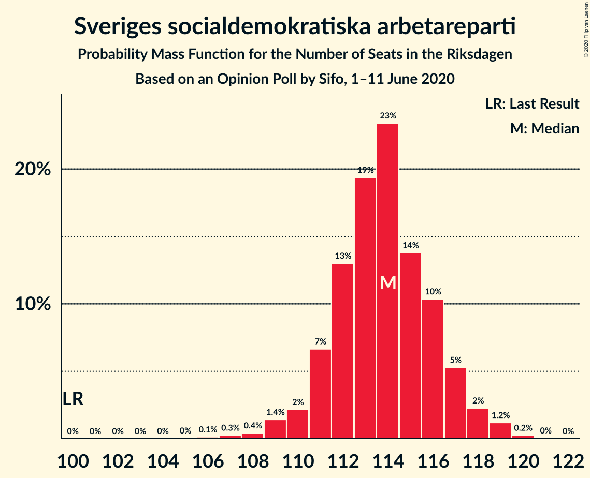
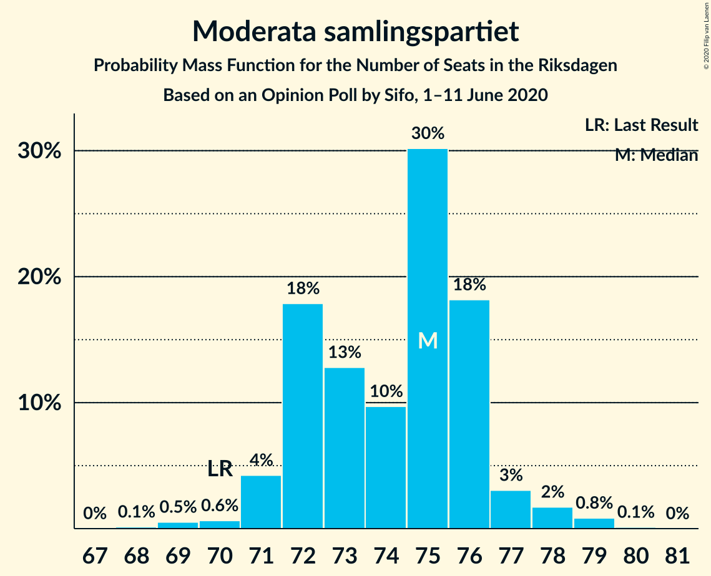
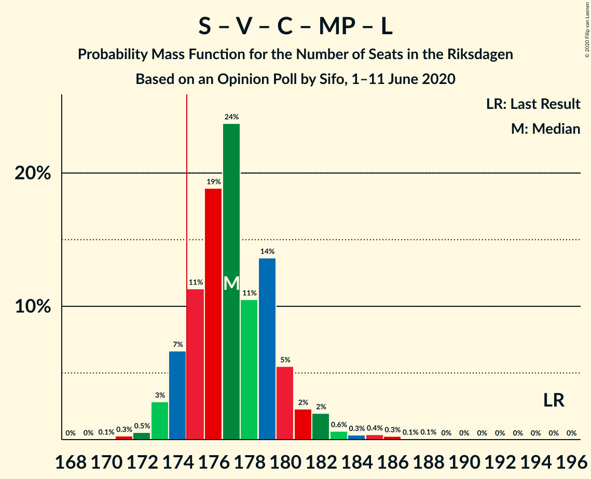
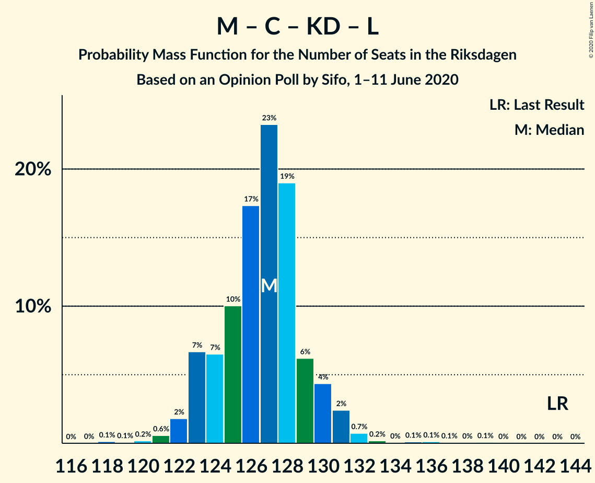

# Opinion Poll by Sifo, 1–11 June 2020

<a href="#voting-intentions">Voting Intentions</a> | <a href="#seats">Seats</a> | <a href="#coalitions">Coalitions</a> | <a href="#technical-information">Technical Information</a>

## Voting Intentions

### Confidence Intervals

| Party | Last Result | Poll Result | 80% Confidence Interval | 90% Confidence Interval | 95% Confidence Interval | 99% Confidence Interval |
|:-----:|:-----------:|:-----------:|:-----------------------:|:-----------------------:|:-----------------------:|:-----------------------:|
| Sveriges socialdemokratiska arbetareparti | 28.3% | 30.0% | 29.3–30.7% |29.1–30.9% |29.0–31.0% |28.7–31.4% |
| Moderata samlingspartiet | 19.8% | 19.5% | 18.9–20.1% |18.8–20.3% |18.6–20.4% |18.4–20.7% |
| Sverigedemokraterna | 17.5% | 18.9% | 18.3–19.5% |18.2–19.7% |18.0–19.8% |17.8–20.1% |
| Vänsterpartiet | 8.0% | 9.6% | 9.2–10.0% |9.1–10.2% |8.9–10.3% |8.7–10.5% |
| Centerpartiet | 8.6% | 7.0% | 6.6–7.4% |6.5–7.5% |6.4–7.6% |6.3–7.8% |
| Kristdemokraterna | 6.3% | 6.8% | 6.4–7.2% |6.3–7.3% |6.2–7.4% |6.1–7.6% |
| Miljöpartiet de gröna | 4.4% | 3.5% | 3.2–3.8% |3.2–3.9% |3.1–3.9% |3.0–4.1% |
| Liberalerna | 5.5% | 3.4% | 3.1–3.7% |3.1–3.8% |3.0–3.8% |2.9–4.0% |

*Note:* The poll result column reflects the actual value used in the calculations. Published results may vary slightly, and in addition be rounded to fewer digits.

## Seats

### Confidence Intervals

| Party | Last Result | Median | 80% Confidence Interval | 90% Confidence Interval | 95% Confidence Interval | 99% Confidence Interval |
|:-----:|:-----------:|:------:|:-----------------------:|:-----------------------:|:-----------------------:|:-----------------------:|
| <a href="#sveriges-socialdemokratiska-arbetareparti">Sveriges socialdemokratiska arbetareparti</a> | 100 | 114 | 111–116 |110–117 |109–119 |107–120 |
| <a href="#moderata-samlingspartiet">Moderata samlingspartiet</a> | 70 | 75 | 72–76 |71–78 |71–78 |70–78 |
| <a href="#sverigedemokraterna">Sverigedemokraterna</a> | 62 | 71 | 69–74 |69–75 |68–75 |67–76 |
| <a href="#vänsterpartiet">Vänsterpartiet</a> | 28 | 36 | 35–38 |34–39 |34–40 |33–40 |
| <a href="#centerpartiet">Centerpartiet</a> | 31 | 26 | 25–28 |25–29 |24–29 |24–30 |
| <a href="#kristdemokraterna">Kristdemokraterna</a> | 22 | 27 | 25–27 |24–28 |24–28 |23–29 |
| <a href="#miljöpartiet-de-gröna">Miljöpartiet de gröna</a> | 16 | 0 | 0 |0 |0 |0–15 |
| <a href="#liberalerna">Liberalerna</a> | 20 | 0 | 0 |0 |0 |0 |

### Sveriges socialdemokratiska arbetareparti

*For a full overview of the results for this party, see the [Sveriges socialdemokratiska arbetareparti](party-sverigessocialdemokratiskaarbetareparti.html) page.*

| Number of Seats | Probability | Accumulated | Special Marks |
|:---------------:|:-----------:|:-----------:|:-------------:|
| 100 | 0% | 100% | Last Result |
| 101 | 0% | 100% |  |
| 102 | 0% | 100% |  |
| 103 | 0% | 100% |  |
| 104 | 0% | 100% |  |
| 105 | 0% | 100% |  |
| 106 | 0.3% | 99.9% |  |
| 107 | 0.4% | 99.6% |  |
| 108 | 0.3% | 99.3% |  |
| 109 | 3% | 98.9% |  |
| 110 | 2% | 96% |  |
| 111 | 6% | 94% |  |
| 112 | 7% | 88% |  |
| 113 | 21% | 80% |  |
| 114 | 37% | 59% | Median |
| 115 | 8% | 22% |  |
| 116 | 6% | 13% |  |
| 117 | 4% | 8% |  |
| 118 | 0.8% | 4% |  |
| 119 | 2% | 3% |  |
| 120 | 1.1% | 1.2% |  |
| 121 | 0.1% | 0.1% |  |
| 122 | 0% | 0% |  |

### Moderata samlingspartiet

*For a full overview of the results for this party, see the [Moderata samlingspartiet](party-moderatasamlingspartiet.html) page.*

| Number of Seats | Probability | Accumulated | Special Marks |
|:---------------:|:-----------:|:-----------:|:-------------:|
| 68 | 0.2% | 100% |  |
| 69 | 0.2% | 99.7% |  |
| 70 | 0.6% | 99.6% | Last Result |
| 71 | 4% | 99.0% |  |
| 72 | 15% | 95% |  |
| 73 | 7% | 80% |  |
| 74 | 10% | 73% |  |
| 75 | 25% | 63% | Median |
| 76 | 29% | 38% |  |
| 77 | 3% | 8% |  |
| 78 | 5% | 5% |  |
| 79 | 0.4% | 0.4% |  |
| 80 | 0.1% | 0.1% |  |
| 81 | 0% | 0% |  |

### Sverigedemokraterna

*For a full overview of the results for this party, see the [Sverigedemokraterna](party-sverigedemokraterna.html) page.*

| Number of Seats | Probability | Accumulated | Special Marks |
|:---------------:|:-----------:|:-----------:|:-------------:|
| 62 | 0% | 100% | Last Result |
| 63 | 0% | 100% |  |
| 64 | 0% | 100% |  |
| 65 | 0% | 100% |  |
| 66 | 0.1% | 100% |  |
| 67 | 0.8% | 99.9% |  |
| 68 | 3% | 99.1% |  |
| 69 | 7% | 96% |  |
| 70 | 8% | 90% |  |
| 71 | 36% | 82% | Median |
| 72 | 23% | 46% |  |
| 73 | 9% | 23% |  |
| 74 | 4% | 13% |  |
| 75 | 7% | 9% |  |
| 76 | 2% | 2% |  |
| 77 | 0.3% | 0.4% |  |
| 78 | 0% | 0% |  |

### Vänsterpartiet

*For a full overview of the results for this party, see the [Vänsterpartiet](party-vänsterpartiet.html) page.*

| Number of Seats | Probability | Accumulated | Special Marks |
|:---------------:|:-----------:|:-----------:|:-------------:|
| 28 | 0% | 100% | Last Result |
| 29 | 0% | 100% |  |
| 30 | 0% | 100% |  |
| 31 | 0% | 100% |  |
| 32 | 0.1% | 100% |  |
| 33 | 0.8% | 99.9% |  |
| 34 | 4% | 99.1% |  |
| 35 | 7% | 95% |  |
| 36 | 42% | 87% | Median |
| 37 | 20% | 45% |  |
| 38 | 17% | 25% |  |
| 39 | 5% | 8% |  |
| 40 | 3% | 3% |  |
| 41 | 0.2% | 0.2% |  |
| 42 | 0% | 0% |  |

### Centerpartiet

*For a full overview of the results for this party, see the [Centerpartiet](party-centerpartiet.html) page.*

| Number of Seats | Probability | Accumulated | Special Marks |
|:---------------:|:-----------:|:-----------:|:-------------:|
| 23 | 0.2% | 100% |  |
| 24 | 4% | 99.8% |  |
| 25 | 42% | 95% |  |
| 26 | 26% | 54% | Median |
| 27 | 15% | 27% |  |
| 28 | 5% | 12% |  |
| 29 | 6% | 7% |  |
| 30 | 0.9% | 1.0% |  |
| 31 | 0.1% | 0.1% | Last Result |
| 32 | 0% | 0% |  |

### Kristdemokraterna

*For a full overview of the results for this party, see the [Kristdemokraterna](party-kristdemokraterna.html) page.*

| Number of Seats | Probability | Accumulated | Special Marks |
|:---------------:|:-----------:|:-----------:|:-------------:|
| 22 | 0.1% | 100% | Last Result |
| 23 | 1.2% | 99.9% |  |
| 24 | 8% | 98.7% |  |
| 25 | 15% | 91% |  |
| 26 | 21% | 75% |  |
| 27 | 48% | 54% | Median |
| 28 | 5% | 6% |  |
| 29 | 1.3% | 1.5% |  |
| 30 | 0.1% | 0.1% |  |
| 31 | 0% | 0% |  |

### Miljöpartiet de gröna

*For a full overview of the results for this party, see the [Miljöpartiet de gröna](party-miljöpartietdegröna.html) page.*

| Number of Seats | Probability | Accumulated | Special Marks |
|:---------------:|:-----------:|:-----------:|:-------------:|
| 0 | 98.6% | 100% | Median |
| 1 | 0% | 1.4% |  |
| 2 | 0% | 1.4% |  |
| 3 | 0% | 1.4% |  |
| 4 | 0% | 1.4% |  |
| 5 | 0% | 1.4% |  |
| 6 | 0% | 1.4% |  |
| 7 | 0% | 1.4% |  |
| 8 | 0% | 1.4% |  |
| 9 | 0% | 1.4% |  |
| 10 | 0% | 1.4% |  |
| 11 | 0% | 1.4% |  |
| 12 | 0% | 1.4% |  |
| 13 | 0% | 1.4% |  |
| 14 | 0% | 1.4% |  |
| 15 | 1.3% | 1.4% |  |
| 16 | 0% | 0% | Last Result |

### Liberalerna

*For a full overview of the results for this party, see the [Liberalerna](party-liberalerna.html) page.*

| Number of Seats | Probability | Accumulated | Special Marks |
|:---------------:|:-----------:|:-----------:|:-------------:|
| 0 | 99.5% | 100% | Median |
| 1 | 0% | 0.5% |  |
| 2 | 0% | 0.5% |  |
| 3 | 0% | 0.5% |  |
| 4 | 0% | 0.5% |  |
| 5 | 0% | 0.5% |  |
| 6 | 0% | 0.5% |  |
| 7 | 0% | 0.5% |  |
| 8 | 0% | 0.5% |  |
| 9 | 0% | 0.5% |  |
| 10 | 0% | 0.5% |  |
| 11 | 0% | 0.5% |  |
| 12 | 0% | 0.5% |  |
| 13 | 0% | 0.5% |  |
| 14 | 0% | 0.5% |  |
| 15 | 0.5% | 0.5% |  |
| 16 | 0% | 0% |  |
| 17 | 0% | 0% |  |
| 18 | 0% | 0% |  |
| 19 | 0% | 0% |  |
| 20 | 0% | 0% | Last Result |

## Coalitions

### Confidence Intervals

| Coalition | Last Result | Median | Majority? | 80% Confidence Interval | 90% Confidence Interval | 95% Confidence Interval | 99% Confidence Interval |
|:---------:|:-----------:|:------:|:---------:|:-----------------------:|:-----------------------:|:-----------------------:|:-----------------------:|
| Sveriges socialdemokratiska arbetareparti – Moderata samlingspartiet – Centerpartiet | 201 | 214 | 100% | 211–217 | 211–219 | 210–219 | 203–221 |
| Sveriges socialdemokratiska arbetareparti – Moderata samlingspartiet | 170 | 188 | 100% | 186–190 | 184–192 | 183–193 | 178–193 |
| Sveriges socialdemokratiska arbetareparti – Vänsterpartiet – Centerpartiet – Miljöpartiet de gröna – Liberalerna | 195 | 176 | 87% | 174–180 | 174–182 | 173–183 | 171–186 |
| Moderata samlingspartiet – Sverigedemokraterna – Kristdemokraterna | 154 | 173 | 13% | 169–175 | 167–175 | 166–176 | 163–178 |
| Sveriges socialdemokratiska arbetareparti – Vänsterpartiet – Miljöpartiet de gröna | 144 | 150 | 0% | 148–153 | 147–155 | 146–156 | 144–159 |
| Sveriges socialdemokratiska arbetareparti – Vänsterpartiet | 128 | 150 | 0% | 148–153 | 146–154 | 145–155 | 143–156 |
| Moderata samlingspartiet – Sverigedemokraterna | 132 | 147 | 0% | 143–149 | 142–150 | 141–150 | 139–152 |
| Sveriges socialdemokratiska arbetareparti – Centerpartiet – Miljöpartiet de gröna – Liberalerna | 167 | 139 | 0% | 137–144 | 137–146 | 136–147 | 136–152 |
| Moderata samlingspartiet – Centerpartiet – Kristdemokraterna – Liberalerna | 143 | 128 | 0% | 124–129 | 123–130 | 122–131 | 120–134 |
| Moderata samlingspartiet – Centerpartiet – Kristdemokraterna | 123 | 128 | 0% | 124–129 | 123–130 | 122–130 | 120–132 |
| Sveriges socialdemokratiska arbetareparti – Miljöpartiet de gröna | 116 | 114 | 0% | 111–116 | 110–118 | 109–120 | 109–125 |
| Moderata samlingspartiet – Centerpartiet – Liberalerna | 121 | 101 | 0% | 97–103 | 97–104 | 97–104 | 96–108 |
| Moderata samlingspartiet – Centerpartiet | 101 | 101 | 0% | 97–103 | 97–104 | 97–104 | 95–105 |

### Sveriges socialdemokratiska arbetareparti – Moderata samlingspartiet – Centerpartiet

| Number of Seats | Probability | Accumulated | Special Marks |
|:---------------:|:-----------:|:-----------:|:-------------:|
| 201 | 0.1% | 100% | Last Result |
| 202 | 0.2% | 99.8% |  |
| 203 | 0.2% | 99.6% |  |
| 204 | 0.2% | 99.4% |  |
| 205 | 0.2% | 99.2% |  |
| 206 | 0.1% | 99.0% |  |
| 207 | 0.1% | 98.8% |  |
| 208 | 0.1% | 98.7% |  |
| 209 | 0.7% | 98.6% |  |
| 210 | 2% | 98% |  |
| 211 | 6% | 96% |  |
| 212 | 8% | 89% |  |
| 213 | 11% | 82% |  |
| 214 | 22% | 71% |  |
| 215 | 32% | 49% | Median |
| 216 | 5% | 17% |  |
| 217 | 3% | 12% |  |
| 218 | 3% | 8% |  |
| 219 | 3% | 5% |  |
| 220 | 1.5% | 2% |  |
| 221 | 0.5% | 0.6% |  |
| 222 | 0.1% | 0.1% |  |
| 223 | 0% | 0% |  |

### Sveriges socialdemokratiska arbetareparti – Moderata samlingspartiet

| Number of Seats | Probability | Accumulated | Special Marks |
|:---------------:|:-----------:|:-----------:|:-------------:|
| 170 | 0% | 100% | Last Result |
| 171 | 0% | 100% |  |
| 172 | 0% | 100% |  |
| 173 | 0% | 100% |  |
| 174 | 0% | 100% |  |
| 175 | 0% | 100% | Majority |
| 176 | 0.2% | 100% |  |
| 177 | 0.1% | 99.7% |  |
| 178 | 0.2% | 99.6% |  |
| 179 | 0.1% | 99.4% |  |
| 180 | 0.2% | 99.3% |  |
| 181 | 0.5% | 99.1% |  |
| 182 | 0.3% | 98.6% |  |
| 183 | 2% | 98% |  |
| 184 | 1.5% | 96% |  |
| 185 | 2% | 94% |  |
| 186 | 14% | 92% |  |
| 187 | 7% | 78% |  |
| 188 | 24% | 71% |  |
| 189 | 9% | 47% | Median |
| 190 | 31% | 38% |  |
| 191 | 2% | 7% |  |
| 192 | 2% | 5% |  |
| 193 | 2% | 3% |  |
| 194 | 0.3% | 0.3% |  |
| 195 | 0% | 0.1% |  |
| 196 | 0% | 0% |  |

### Sveriges socialdemokratiska arbetareparti – Vänsterpartiet – Centerpartiet – Miljöpartiet de gröna – Liberalerna

| Number of Seats | Probability | Accumulated | Special Marks |
|:---------------:|:-----------:|:-----------:|:-------------:|
| 170 | 0.1% | 100% |  |
| 171 | 0.7% | 99.9% |  |
| 172 | 0.5% | 99.3% |  |
| 173 | 3% | 98.7% |  |
| 174 | 8% | 96% |  |
| 175 | 36% | 87% | Majority |
| 176 | 12% | 51% | Median |
| 177 | 11% | 39% |  |
| 178 | 9% | 27% |  |
| 179 | 4% | 18% |  |
| 180 | 5% | 14% |  |
| 181 | 1.2% | 9% |  |
| 182 | 5% | 7% |  |
| 183 | 2% | 3% |  |
| 184 | 0.1% | 1.2% |  |
| 185 | 0.3% | 1.1% |  |
| 186 | 0.7% | 0.8% |  |
| 187 | 0% | 0.1% |  |
| 188 | 0.1% | 0.1% |  |
| 189 | 0% | 0% |  |
| 190 | 0% | 0% |  |
| 191 | 0% | 0% |  |
| 192 | 0% | 0% |  |
| 193 | 0% | 0% |  |
| 194 | 0% | 0% |  |
| 195 | 0% | 0% | Last Result |

### Moderata samlingspartiet – Sverigedemokraterna – Kristdemokraterna

| Number of Seats | Probability | Accumulated | Special Marks |
|:---------------:|:-----------:|:-----------:|:-------------:|
| 154 | 0% | 100% | Last Result |
| 155 | 0% | 100% |  |
| 156 | 0% | 100% |  |
| 157 | 0% | 100% |  |
| 158 | 0% | 100% |  |
| 159 | 0% | 100% |  |
| 160 | 0% | 100% |  |
| 161 | 0.1% | 100% |  |
| 162 | 0% | 99.9% |  |
| 163 | 0.7% | 99.9% |  |
| 164 | 0.3% | 99.2% |  |
| 165 | 0.1% | 98.9% |  |
| 166 | 2% | 98.8% |  |
| 167 | 5% | 97% |  |
| 168 | 1.2% | 93% |  |
| 169 | 5% | 91% |  |
| 170 | 4% | 86% |  |
| 171 | 9% | 82% |  |
| 172 | 11% | 73% |  |
| 173 | 12% | 61% | Median |
| 174 | 36% | 49% |  |
| 175 | 8% | 13% | Majority |
| 176 | 3% | 4% |  |
| 177 | 0.5% | 1.3% |  |
| 178 | 0.7% | 0.7% |  |
| 179 | 0.1% | 0.1% |  |
| 180 | 0% | 0% |  |

### Sveriges socialdemokratiska arbetareparti – Vänsterpartiet – Miljöpartiet de gröna

| Number of Seats | Probability | Accumulated | Special Marks |
|:---------------:|:-----------:|:-----------:|:-------------:|
| 143 | 0.2% | 100% |  |
| 144 | 0.6% | 99.7% | Last Result |
| 145 | 0.6% | 99.2% |  |
| 146 | 3% | 98.6% |  |
| 147 | 2% | 96% |  |
| 148 | 6% | 94% |  |
| 149 | 17% | 88% |  |
| 150 | 32% | 71% | Median |
| 151 | 15% | 40% |  |
| 152 | 8% | 25% |  |
| 153 | 8% | 17% |  |
| 154 | 4% | 9% |  |
| 155 | 3% | 5% |  |
| 156 | 1.2% | 3% |  |
| 157 | 0.3% | 1.3% |  |
| 158 | 0.1% | 1.0% |  |
| 159 | 0.7% | 1.0% |  |
| 160 | 0.1% | 0.3% |  |
| 161 | 0.1% | 0.2% |  |
| 162 | 0.1% | 0.1% |  |
| 163 | 0% | 0% |  |

### Sveriges socialdemokratiska arbetareparti – Vänsterpartiet

| Number of Seats | Probability | Accumulated | Special Marks |
|:---------------:|:-----------:|:-----------:|:-------------:|
| 128 | 0% | 100% | Last Result |
| 129 | 0% | 100% |  |
| 130 | 0% | 100% |  |
| 131 | 0% | 100% |  |
| 132 | 0% | 100% |  |
| 133 | 0% | 100% |  |
| 134 | 0% | 100% |  |
| 135 | 0% | 100% |  |
| 136 | 0% | 100% |  |
| 137 | 0% | 100% |  |
| 138 | 0% | 100% |  |
| 139 | 0% | 100% |  |
| 140 | 0.1% | 100% |  |
| 141 | 0.1% | 99.9% |  |
| 142 | 0.2% | 99.8% |  |
| 143 | 0.3% | 99.6% |  |
| 144 | 1.3% | 99.3% |  |
| 145 | 0.6% | 98% |  |
| 146 | 3% | 97% |  |
| 147 | 2% | 94% |  |
| 148 | 6% | 93% |  |
| 149 | 17% | 87% |  |
| 150 | 32% | 70% | Median |
| 151 | 15% | 38% |  |
| 152 | 8% | 23% |  |
| 153 | 8% | 15% |  |
| 154 | 4% | 8% |  |
| 155 | 3% | 4% |  |
| 156 | 1.1% | 1.2% |  |
| 157 | 0.1% | 0.1% |  |
| 158 | 0% | 0% |  |

### Moderata samlingspartiet – Sverigedemokraterna

| Number of Seats | Probability | Accumulated | Special Marks |
|:---------------:|:-----------:|:-----------:|:-------------:|
| 132 | 0% | 100% | Last Result |
| 133 | 0% | 100% |  |
| 134 | 0% | 100% |  |
| 135 | 0% | 100% |  |
| 136 | 0% | 100% |  |
| 137 | 0.2% | 99.9% |  |
| 138 | 0.1% | 99.8% |  |
| 139 | 0.5% | 99.7% |  |
| 140 | 0.7% | 99.2% |  |
| 141 | 2% | 98% |  |
| 142 | 5% | 97% |  |
| 143 | 5% | 92% |  |
| 144 | 9% | 87% |  |
| 145 | 9% | 78% |  |
| 146 | 8% | 69% | Median |
| 147 | 42% | 61% |  |
| 148 | 7% | 19% |  |
| 149 | 5% | 12% |  |
| 150 | 6% | 7% |  |
| 151 | 0.5% | 1.0% |  |
| 152 | 0.2% | 0.5% |  |
| 153 | 0.3% | 0.3% |  |
| 154 | 0% | 0% |  |

### Sveriges socialdemokratiska arbetareparti – Centerpartiet – Miljöpartiet de gröna – Liberalerna

| Number of Seats | Probability | Accumulated | Special Marks |
|:---------------:|:-----------:|:-----------:|:-------------:|
| 135 | 0.2% | 100% |  |
| 136 | 3% | 99.7% |  |
| 137 | 7% | 97% |  |
| 138 | 5% | 90% |  |
| 139 | 55% | 84% |  |
| 140 | 7% | 29% | Median |
| 141 | 3% | 22% |  |
| 142 | 3% | 18% |  |
| 143 | 4% | 16% |  |
| 144 | 2% | 12% |  |
| 145 | 4% | 10% |  |
| 146 | 3% | 6% |  |
| 147 | 1.4% | 3% |  |
| 148 | 0.4% | 1.4% |  |
| 149 | 0.1% | 1.0% |  |
| 150 | 0.1% | 0.8% |  |
| 151 | 0% | 0.7% |  |
| 152 | 0.2% | 0.7% |  |
| 153 | 0.4% | 0.5% |  |
| 154 | 0.1% | 0.1% |  |
| 155 | 0% | 0% |  |
| 156 | 0% | 0% |  |
| 157 | 0% | 0% |  |
| 158 | 0% | 0% |  |
| 159 | 0% | 0% |  |
| 160 | 0% | 0% |  |
| 161 | 0% | 0% |  |
| 162 | 0% | 0% |  |
| 163 | 0% | 0% |  |
| 164 | 0% | 0% |  |
| 165 | 0% | 0% |  |
| 166 | 0% | 0% |  |
| 167 | 0% | 0% | Last Result |

### Moderata samlingspartiet – Centerpartiet – Kristdemokraterna – Liberalerna

| Number of Seats | Probability | Accumulated | Special Marks |
|:---------------:|:-----------:|:-----------:|:-------------:|
| 118 | 0.1% | 100% |  |
| 119 | 0.1% | 99.9% |  |
| 120 | 0.4% | 99.8% |  |
| 121 | 0.4% | 99.4% |  |
| 122 | 2% | 99.0% |  |
| 123 | 6% | 97% |  |
| 124 | 8% | 91% |  |
| 125 | 7% | 83% |  |
| 126 | 8% | 76% |  |
| 127 | 14% | 67% |  |
| 128 | 42% | 54% | Median |
| 129 | 6% | 12% |  |
| 130 | 4% | 6% |  |
| 131 | 1.2% | 3% |  |
| 132 | 0.9% | 2% |  |
| 133 | 0.1% | 0.6% |  |
| 134 | 0% | 0.5% |  |
| 135 | 0% | 0.5% |  |
| 136 | 0.3% | 0.5% |  |
| 137 | 0.1% | 0.1% |  |
| 138 | 0% | 0% |  |
| 139 | 0% | 0% |  |
| 140 | 0% | 0% |  |
| 141 | 0% | 0% |  |
| 142 | 0% | 0% |  |
| 143 | 0% | 0% | Last Result |

### Moderata samlingspartiet – Centerpartiet – Kristdemokraterna

| Number of Seats | Probability | Accumulated | Special Marks |
|:---------------:|:-----------:|:-----------:|:-------------:|
| 118 | 0.1% | 100% |  |
| 119 | 0.1% | 99.9% |  |
| 120 | 0.4% | 99.8% |  |
| 121 | 0.7% | 99.3% |  |
| 122 | 2% | 98.6% |  |
| 123 | 6% | 97% | Last Result |
| 124 | 8% | 90% |  |
| 125 | 7% | 82% |  |
| 126 | 8% | 75% |  |
| 127 | 14% | 67% |  |
| 128 | 42% | 53% | Median |
| 129 | 6% | 12% |  |
| 130 | 4% | 6% |  |
| 131 | 1.2% | 2% |  |
| 132 | 0.9% | 1.0% |  |
| 133 | 0.1% | 0.1% |  |
| 134 | 0% | 0% |  |

### Sveriges socialdemokratiska arbetareparti – Miljöpartiet de gröna

| Number of Seats | Probability | Accumulated | Special Marks |
|:---------------:|:-----------:|:-----------:|:-------------:|
| 107 | 0.2% | 100% |  |
| 108 | 0.2% | 99.7% |  |
| 109 | 3% | 99.5% |  |
| 110 | 2% | 96% |  |
| 111 | 6% | 95% |  |
| 112 | 7% | 89% |  |
| 113 | 21% | 81% |  |
| 114 | 37% | 60% | Median |
| 115 | 8% | 23% |  |
| 116 | 6% | 15% | Last Result |
| 117 | 4% | 9% |  |
| 118 | 0.8% | 6% |  |
| 119 | 2% | 5% |  |
| 120 | 1.2% | 3% |  |
| 121 | 0.4% | 1.4% |  |
| 122 | 0.1% | 1.0% |  |
| 123 | 0.1% | 0.9% |  |
| 124 | 0.2% | 0.8% |  |
| 125 | 0.1% | 0.6% |  |
| 126 | 0.4% | 0.5% |  |
| 127 | 0% | 0.1% |  |
| 128 | 0.1% | 0.1% |  |
| 129 | 0% | 0% |  |

### Moderata samlingspartiet – Centerpartiet – Liberalerna

| Number of Seats | Probability | Accumulated | Special Marks |
|:---------------:|:-----------:|:-----------:|:-------------:|
| 93 | 0.1% | 100% |  |
| 94 | 0.1% | 99.9% |  |
| 95 | 0.2% | 99.7% |  |
| 96 | 1.4% | 99.5% |  |
| 97 | 9% | 98% |  |
| 98 | 3% | 89% |  |
| 99 | 10% | 86% |  |
| 100 | 7% | 76% |  |
| 101 | 52% | 69% | Median |
| 102 | 4% | 18% |  |
| 103 | 5% | 14% |  |
| 104 | 8% | 9% |  |
| 105 | 0.9% | 2% |  |
| 106 | 0.2% | 0.8% |  |
| 107 | 0.1% | 0.7% |  |
| 108 | 0% | 0.5% |  |
| 109 | 0% | 0.5% |  |
| 110 | 0.1% | 0.5% |  |
| 111 | 0% | 0.3% |  |
| 112 | 0.1% | 0.3% |  |
| 113 | 0.2% | 0.3% |  |
| 114 | 0% | 0% |  |
| 115 | 0% | 0% |  |
| 116 | 0% | 0% |  |
| 117 | 0% | 0% |  |
| 118 | 0% | 0% |  |
| 119 | 0% | 0% |  |
| 120 | 0% | 0% |  |
| 121 | 0% | 0% | Last Result |

### Moderata samlingspartiet – Centerpartiet

| Number of Seats | Probability | Accumulated | Special Marks |
|:---------------:|:-----------:|:-----------:|:-------------:|
| 93 | 0.1% | 100% |  |
| 94 | 0.2% | 99.9% |  |
| 95 | 0.3% | 99.7% |  |
| 96 | 1.4% | 99.4% |  |
| 97 | 9% | 98% |  |
| 98 | 3% | 89% |  |
| 99 | 10% | 86% |  |
| 100 | 7% | 76% |  |
| 101 | 52% | 69% | Last Result, Median |
| 102 | 4% | 17% |  |
| 103 | 5% | 14% |  |
| 104 | 8% | 9% |  |
| 105 | 0.9% | 1.3% |  |
| 106 | 0.2% | 0.3% |  |
| 107 | 0.1% | 0.2% |  |
| 108 | 0% | 0% |  |

## Technical Information

### Opinion Poll

+ **Polling firm:** Sifo
+ **Commissioner(s):** —
+ **Fieldwork period:** 1–11 June 2020

### Calculations

+ **Sample size:** 7578
+ **Simulations done:** 131,072
+ **Error estimate:** 0.32%

