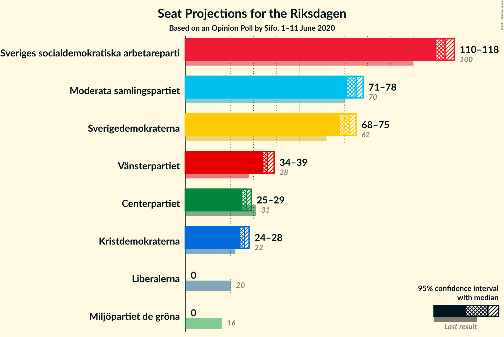
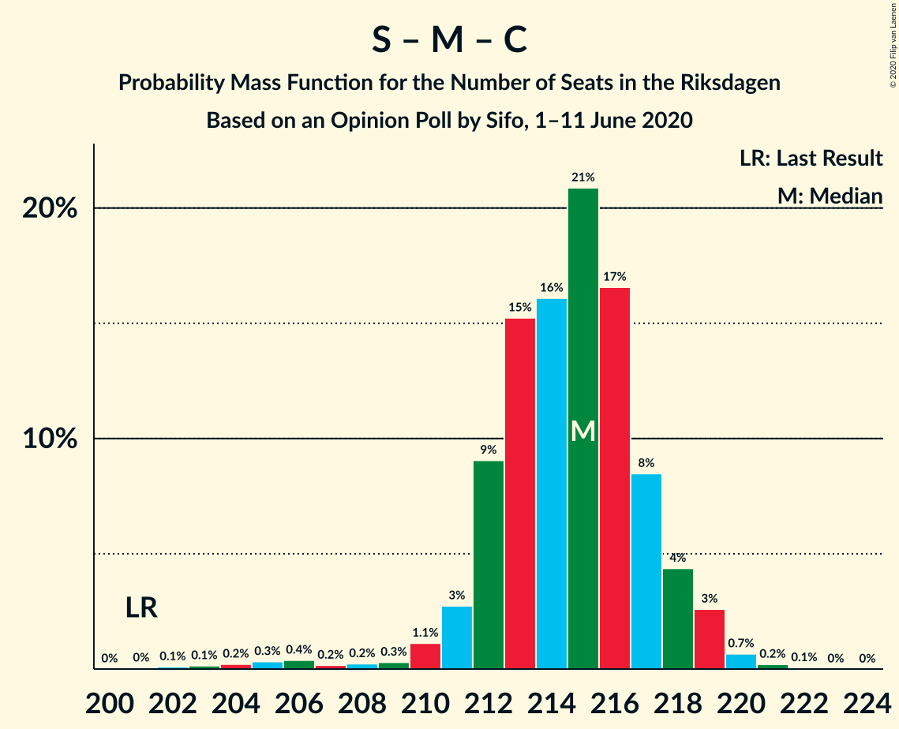
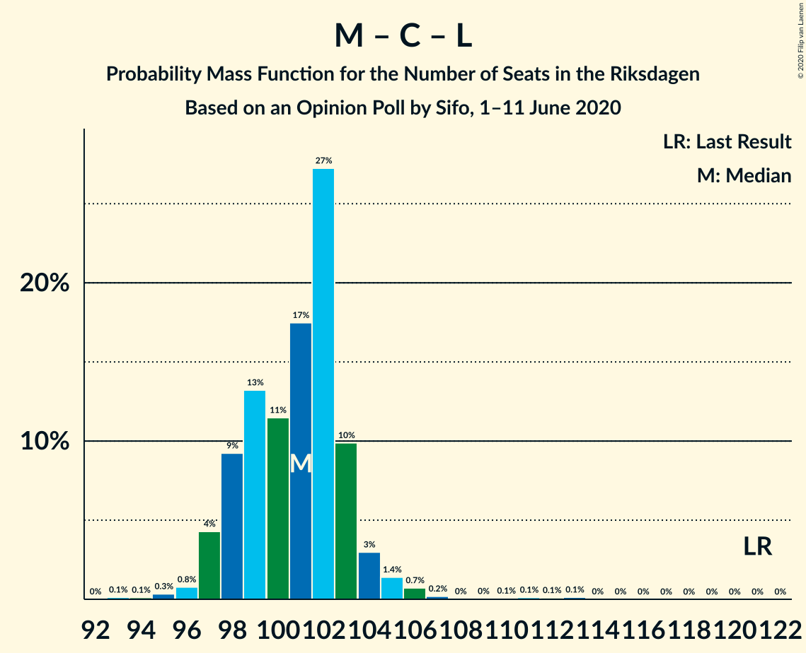

# Opinion Poll by Sifo, 1–11 June 2020

<a href="#voting-intentions">Voting Intentions</a> | <a href="#seats">Seats</a> | <a href="#coalitions">Coalitions</a> | <a href="#technical-information">Technical Information</a>

## Voting Intentions

### Confidence Intervals

| Party | Last Result | Poll Result | 80% Confidence Interval | 90% Confidence Interval | 95% Confidence Interval | 99% Confidence Interval |
|:-----:|:-----------:|:-----------:|:-----------------------:|:-----------------------:|:-----------------------:|:-----------------------:|
| Sveriges socialdemokratiska arbetareparti | 28.3% | 30.0% | 29.3–30.7% |29.1–30.9% |29.0–31.0% |28.7–31.4% |
| Moderata samlingspartiet | 19.8% | 19.5% | 18.9–20.1% |18.8–20.3% |18.6–20.4% |18.4–20.7% |
| Sverigedemokraterna | 17.5% | 18.9% | 18.3–19.5% |18.2–19.7% |18.0–19.8% |17.8–20.1% |
| Vänsterpartiet | 8.0% | 9.6% | 9.2–10.0% |9.1–10.2% |8.9–10.3% |8.7–10.5% |
| Centerpartiet | 8.6% | 7.0% | 6.6–7.4% |6.5–7.5% |6.4–7.6% |6.3–7.8% |
| Kristdemokraterna | 6.3% | 6.8% | 6.4–7.2% |6.3–7.3% |6.2–7.4% |6.1–7.6% |
| Miljöpartiet de gröna | 4.4% | 3.5% | 3.2–3.8% |3.2–3.9% |3.1–3.9% |3.0–4.1% |
| Liberalerna | 5.5% | 3.4% | 3.1–3.7% |3.1–3.8% |3.0–3.8% |2.9–4.0% |

*Note:* The poll result column reflects the actual value used in the calculations. Published results may vary slightly, and in addition be rounded to fewer digits.

## Seats

### Confidence Intervals

| Party | Last Result | Median | 80% Confidence Interval | 90% Confidence Interval | 95% Confidence Interval | 99% Confidence Interval |
|:-----:|:-----------:|:------:|:-----------------------:|:-----------------------:|:-----------------------:|:-----------------------:|
| <a href="#sveriges-socialdemokratiska-arbetareparti">Sveriges socialdemokratiska arbetareparti</a> | 100 | 114 | 111–116 |111–117 |110–118 |108–119 |
| <a href="#moderata-samlingspartiet">Moderata samlingspartiet</a> | 70 | 75 | 72–76 |71–77 |71–78 |69–79 |
| <a href="#sverigedemokraterna">Sverigedemokraterna</a> | 62 | 72 | 70–74 |69–75 |68–75 |67–76 |
| <a href="#vänsterpartiet">Vänsterpartiet</a> | 28 | 36 | 35–38 |34–39 |34–39 |33–40 |
| <a href="#centerpartiet">Centerpartiet</a> | 31 | 27 | 25–28 |25–28 |25–29 |24–30 |
| <a href="#kristdemokraterna">Kristdemokraterna</a> | 22 | 26 | 24–27 |24–28 |24–28 |23–29 |
| <a href="#miljöpartiet-de-gröna">Miljöpartiet de gröna</a> | 16 | 0 | 0 |0 |0 |0–15 |
| <a href="#liberalerna">Liberalerna</a> | 20 | 0 | 0 |0 |0 |0 |

### Sveriges socialdemokratiska arbetareparti

*For a full overview of the results for this party, see the [Sveriges socialdemokratiska arbetareparti](party-sverigessocialdemokratiskaarbetareparti.html) page.*

| Number of Seats | Probability | Accumulated | Special Marks |
|:---------------:|:-----------:|:-----------:|:-------------:|
| 100 | 0% | 100% | Last Result |
| 101 | 0% | 100% |  |
| 102 | 0% | 100% |  |
| 103 | 0% | 100% |  |
| 104 | 0% | 100% |  |
| 105 | 0% | 100% |  |
| 106 | 0.1% | 100% |  |
| 107 | 0.3% | 99.8% |  |
| 108 | 0.4% | 99.6% |  |
| 109 | 1.4% | 99.2% |  |
| 110 | 2% | 98% |  |
| 111 | 7% | 96% |  |
| 112 | 13% | 89% |  |
| 113 | 19% | 76% |  |
| 114 | 23% | 57% | Median |
| 115 | 14% | 33% |  |
| 116 | 10% | 19% |  |
| 117 | 5% | 9% |  |
| 118 | 2% | 4% |  |
| 119 | 1.2% | 1.5% |  |
| 120 | 0.2% | 0.3% |  |
| 121 | 0% | 0% |  |

### Moderata samlingspartiet

*For a full overview of the results for this party, see the [Moderata samlingspartiet](party-moderatasamlingspartiet.html) page.*

| Number of Seats | Probability | Accumulated | Special Marks |
|:---------------:|:-----------:|:-----------:|:-------------:|
| 68 | 0.1% | 100% |  |
| 69 | 0.5% | 99.8% |  |
| 70 | 0.6% | 99.3% | Last Result |
| 71 | 4% | 98.7% |  |
| 72 | 18% | 94% |  |
| 73 | 13% | 77% |  |
| 74 | 10% | 64% |  |
| 75 | 30% | 54% | Median |
| 76 | 18% | 24% |  |
| 77 | 3% | 6% |  |
| 78 | 2% | 3% |  |
| 79 | 0.8% | 1.0% |  |
| 80 | 0.1% | 0.1% |  |
| 81 | 0% | 0% |  |

### Sverigedemokraterna

*For a full overview of the results for this party, see the [Sverigedemokraterna](party-sverigedemokraterna.html) page.*

| Number of Seats | Probability | Accumulated | Special Marks |
|:---------------:|:-----------:|:-----------:|:-------------:|
| 62 | 0% | 100% | Last Result |
| 63 | 0% | 100% |  |
| 64 | 0% | 100% |  |
| 65 | 0% | 100% |  |
| 66 | 0.1% | 100% |  |
| 67 | 0.6% | 99.8% |  |
| 68 | 2% | 99.2% |  |
| 69 | 6% | 97% |  |
| 70 | 12% | 92% |  |
| 71 | 21% | 80% |  |
| 72 | 26% | 59% | Median |
| 73 | 14% | 34% |  |
| 74 | 12% | 19% |  |
| 75 | 5% | 7% |  |
| 76 | 1.0% | 1.4% |  |
| 77 | 0.3% | 0.4% |  |
| 78 | 0% | 0% |  |

### Vänsterpartiet

*For a full overview of the results for this party, see the [Vänsterpartiet](party-vänsterpartiet.html) page.*

| Number of Seats | Probability | Accumulated | Special Marks |
|:---------------:|:-----------:|:-----------:|:-------------:|
| 28 | 0% | 100% | Last Result |
| 29 | 0% | 100% |  |
| 30 | 0% | 100% |  |
| 31 | 0% | 100% |  |
| 32 | 0.1% | 100% |  |
| 33 | 0.7% | 99.9% |  |
| 34 | 6% | 99.2% |  |
| 35 | 11% | 94% |  |
| 36 | 38% | 83% | Median |
| 37 | 22% | 44% |  |
| 38 | 16% | 22% |  |
| 39 | 5% | 6% |  |
| 40 | 1.3% | 1.4% |  |
| 41 | 0.1% | 0.1% |  |
| 42 | 0% | 0% |  |

### Centerpartiet

*For a full overview of the results for this party, see the [Centerpartiet](party-centerpartiet.html) page.*

| Number of Seats | Probability | Accumulated | Special Marks |
|:---------------:|:-----------:|:-----------:|:-------------:|
| 23 | 0.2% | 100% |  |
| 24 | 2% | 99.8% |  |
| 25 | 17% | 98% |  |
| 26 | 27% | 81% |  |
| 27 | 37% | 54% | Median |
| 28 | 13% | 17% |  |
| 29 | 3% | 4% |  |
| 30 | 0.7% | 0.7% |  |
| 31 | 0% | 0% | Last Result |

### Kristdemokraterna

*For a full overview of the results for this party, see the [Kristdemokraterna](party-kristdemokraterna.html) page.*

| Number of Seats | Probability | Accumulated | Special Marks |
|:---------------:|:-----------:|:-----------:|:-------------:|
| 22 | 0.1% | 100% | Last Result |
| 23 | 1.3% | 99.9% |  |
| 24 | 9% | 98.6% |  |
| 25 | 30% | 90% |  |
| 26 | 33% | 60% | Median |
| 27 | 21% | 27% |  |
| 28 | 5% | 6% |  |
| 29 | 0.9% | 1.0% |  |
| 30 | 0.1% | 0.1% |  |
| 31 | 0% | 0% |  |

### Miljöpartiet de gröna

*For a full overview of the results for this party, see the [Miljöpartiet de gröna](party-miljöpartietdegröna.html) page.*

| Number of Seats | Probability | Accumulated | Special Marks |
|:---------------:|:-----------:|:-----------:|:-------------:|
| 0 | 98.8% | 100% | Median |
| 1 | 0% | 1.2% |  |
| 2 | 0% | 1.2% |  |
| 3 | 0% | 1.2% |  |
| 4 | 0% | 1.2% |  |
| 5 | 0% | 1.2% |  |
| 6 | 0% | 1.2% |  |
| 7 | 0% | 1.2% |  |
| 8 | 0% | 1.2% |  |
| 9 | 0% | 1.2% |  |
| 10 | 0% | 1.2% |  |
| 11 | 0% | 1.2% |  |
| 12 | 0% | 1.2% |  |
| 13 | 0% | 1.2% |  |
| 14 | 0% | 1.2% |  |
| 15 | 1.1% | 1.2% |  |
| 16 | 0.1% | 0.1% | Last Result |
| 17 | 0% | 0% |  |

### Liberalerna

*For a full overview of the results for this party, see the [Liberalerna](party-liberalerna.html) page.*

| Number of Seats | Probability | Accumulated | Special Marks |
|:---------------:|:-----------:|:-----------:|:-------------:|
| 0 | 99.5% | 100% | Median |
| 1 | 0% | 0.5% |  |
| 2 | 0% | 0.5% |  |
| 3 | 0% | 0.5% |  |
| 4 | 0% | 0.5% |  |
| 5 | 0% | 0.5% |  |
| 6 | 0% | 0.5% |  |
| 7 | 0% | 0.5% |  |
| 8 | 0% | 0.5% |  |
| 9 | 0% | 0.5% |  |
| 10 | 0% | 0.5% |  |
| 11 | 0% | 0.5% |  |
| 12 | 0% | 0.5% |  |
| 13 | 0% | 0.5% |  |
| 14 | 0% | 0.5% |  |
| 15 | 0.5% | 0.5% |  |
| 16 | 0% | 0% |  |
| 17 | 0% | 0% |  |
| 18 | 0% | 0% |  |
| 19 | 0% | 0% |  |
| 20 | 0% | 0% | Last Result |

## Coalitions

### Confidence Intervals

| Coalition | Last Result | Median | Majority? | 80% Confidence Interval | 90% Confidence Interval | 95% Confidence Interval | 99% Confidence Interval |
|:---------:|:-----------:|:------:|:---------:|:-----------------------:|:-----------------------:|:-----------------------:|:-----------------------:|
| Sveriges socialdemokratiska arbetareparti – Moderata samlingspartiet – Centerpartiet | 201 | 215 | 100% | 212–217 | 211–218 | 210–219 | 204–220 |
| Sveriges socialdemokratiska arbetareparti – Moderata samlingspartiet | 170 | 188 | 100% | 185–191 | 184–192 | 183–193 | 179–194 |
| Sveriges socialdemokratiska arbetareparti – Vänsterpartiet – Centerpartiet – Miljöpartiet de gröna – Liberalerna | 195 | 177 | 90% | 174–180 | 174–181 | 173–182 | 172–185 |
| Moderata samlingspartiet – Sverigedemokraterna – Kristdemokraterna | 154 | 172 | 10% | 169–175 | 168–175 | 167–176 | 164–177 |
| Sveriges socialdemokratiska arbetareparti – Vänsterpartiet – Miljöpartiet de gröna | 144 | 150 | 0% | 148–153 | 147–154 | 146–155 | 144–159 |
| Sveriges socialdemokratiska arbetareparti – Vänsterpartiet | 128 | 150 | 0% | 148–153 | 147–154 | 146–155 | 143–156 |
| Moderata samlingspartiet – Sverigedemokraterna | 132 | 146 | 0% | 143–149 | 142–150 | 141–150 | 139–151 |
| Sveriges socialdemokratiska arbetareparti – Centerpartiet – Miljöpartiet de gröna – Liberalerna | 167 | 140 | 0% | 138–143 | 138–144 | 137–146 | 136–150 |
| Moderata samlingspartiet – Centerpartiet – Kristdemokraterna – Liberalerna | 143 | 127 | 0% | 124–129 | 123–130 | 122–131 | 121–133 |
| Moderata samlingspartiet – Centerpartiet – Kristdemokraterna | 123 | 127 | 0% | 124–129 | 123–130 | 122–131 | 120–132 |
| Sveriges socialdemokratiska arbetareparti – Miljöpartiet de gröna | 116 | 114 | 0% | 111–117 | 111–117 | 110–119 | 109–124 |
| Moderata samlingspartiet – Centerpartiet – Liberalerna | 121 | 101 | 0% | 98–103 | 97–104 | 97–105 | 95–108 |
| Moderata samlingspartiet – Centerpartiet | 101 | 101 | 0% | 98–103 | 97–104 | 97–104 | 95–106 |

### Sveriges socialdemokratiska arbetareparti – Moderata samlingspartiet – Centerpartiet

| Number of Seats | Probability | Accumulated | Special Marks |
|:---------------:|:-----------:|:-----------:|:-------------:|
| 201 | 0% | 100% | Last Result |
| 202 | 0.1% | 99.9% |  |
| 203 | 0.1% | 99.8% |  |
| 204 | 0.2% | 99.7% |  |
| 205 | 0.3% | 99.5% |  |
| 206 | 0.4% | 99.2% |  |
| 207 | 0.2% | 98.8% |  |
| 208 | 0.2% | 98.6% |  |
| 209 | 0.3% | 98% |  |
| 210 | 1.1% | 98% |  |
| 211 | 3% | 97% |  |
| 212 | 9% | 94% |  |
| 213 | 15% | 85% |  |
| 214 | 16% | 70% |  |
| 215 | 21% | 54% |  |
| 216 | 17% | 33% | Median |
| 217 | 8% | 16% |  |
| 218 | 4% | 8% |  |
| 219 | 3% | 4% |  |
| 220 | 0.7% | 0.9% |  |
| 221 | 0.2% | 0.3% |  |
| 222 | 0.1% | 0.1% |  |
| 223 | 0% | 0% |  |

### Sveriges socialdemokratiska arbetareparti – Moderata samlingspartiet

| Number of Seats | Probability | Accumulated | Special Marks |
|:---------------:|:-----------:|:-----------:|:-------------:|
| 170 | 0% | 100% | Last Result |
| 171 | 0% | 100% |  |
| 172 | 0% | 100% |  |
| 173 | 0% | 100% |  |
| 174 | 0% | 100% |  |
| 175 | 0% | 100% | Majority |
| 176 | 0.1% | 100% |  |
| 177 | 0.1% | 99.9% |  |
| 178 | 0.2% | 99.8% |  |
| 179 | 0.2% | 99.6% |  |
| 180 | 0.2% | 99.4% |  |
| 181 | 0.5% | 99.2% |  |
| 182 | 0.4% | 98.7% |  |
| 183 | 1.2% | 98% |  |
| 184 | 2% | 97% |  |
| 185 | 6% | 95% |  |
| 186 | 13% | 89% |  |
| 187 | 14% | 76% |  |
| 188 | 18% | 62% |  |
| 189 | 23% | 44% | Median |
| 190 | 9% | 21% |  |
| 191 | 7% | 13% |  |
| 192 | 3% | 6% |  |
| 193 | 2% | 3% |  |
| 194 | 0.5% | 0.5% |  |
| 195 | 0.1% | 0.1% |  |
| 196 | 0% | 0% |  |

### Sveriges socialdemokratiska arbetareparti – Vänsterpartiet – Centerpartiet – Miljöpartiet de gröna – Liberalerna

| Number of Seats | Probability | Accumulated | Special Marks |
|:---------------:|:-----------:|:-----------:|:-------------:|
| 170 | 0.1% | 100% |  |
| 171 | 0.3% | 99.9% |  |
| 172 | 0.5% | 99.6% |  |
| 173 | 3% | 99.1% |  |
| 174 | 7% | 96% |  |
| 175 | 11% | 90% | Majority |
| 176 | 19% | 78% |  |
| 177 | 24% | 59% | Median |
| 178 | 11% | 36% |  |
| 179 | 14% | 25% |  |
| 180 | 5% | 12% |  |
| 181 | 2% | 6% |  |
| 182 | 2% | 4% |  |
| 183 | 0.6% | 2% |  |
| 184 | 0.3% | 1.1% |  |
| 185 | 0.4% | 0.8% |  |
| 186 | 0.3% | 0.4% |  |
| 187 | 0.1% | 0.2% |  |
| 188 | 0.1% | 0.1% |  |
| 189 | 0% | 0% |  |
| 190 | 0% | 0% |  |
| 191 | 0% | 0% |  |
| 192 | 0% | 0% |  |
| 193 | 0% | 0% |  |
| 194 | 0% | 0% |  |
| 195 | 0% | 0% | Last Result |

### Moderata samlingspartiet – Sverigedemokraterna – Kristdemokraterna

| Number of Seats | Probability | Accumulated | Special Marks |
|:---------------:|:-----------:|:-----------:|:-------------:|
| 154 | 0% | 100% | Last Result |
| 155 | 0% | 100% |  |
| 156 | 0% | 100% |  |
| 157 | 0% | 100% |  |
| 158 | 0% | 100% |  |
| 159 | 0% | 100% |  |
| 160 | 0% | 100% |  |
| 161 | 0.1% | 100% |  |
| 162 | 0.1% | 99.9% |  |
| 163 | 0.3% | 99.8% |  |
| 164 | 0.4% | 99.6% |  |
| 165 | 0.3% | 99.2% |  |
| 166 | 0.6% | 98.9% |  |
| 167 | 2% | 98% |  |
| 168 | 2% | 96% |  |
| 169 | 5% | 94% |  |
| 170 | 14% | 88% |  |
| 171 | 11% | 75% |  |
| 172 | 24% | 64% |  |
| 173 | 19% | 41% | Median |
| 174 | 11% | 22% |  |
| 175 | 7% | 10% | Majority |
| 176 | 3% | 4% |  |
| 177 | 0.5% | 0.9% |  |
| 178 | 0.3% | 0.4% |  |
| 179 | 0.1% | 0.1% |  |
| 180 | 0% | 0% |  |

### Sveriges socialdemokratiska arbetareparti – Vänsterpartiet – Miljöpartiet de gröna

| Number of Seats | Probability | Accumulated | Special Marks |
|:---------------:|:-----------:|:-----------:|:-------------:|
| 141 | 0% | 100% |  |
| 142 | 0% | 99.9% |  |
| 143 | 0.2% | 99.9% |  |
| 144 | 0.2% | 99.7% | Last Result |
| 145 | 0.5% | 99.5% |  |
| 146 | 3% | 99.0% |  |
| 147 | 4% | 96% |  |
| 148 | 8% | 93% |  |
| 149 | 18% | 85% |  |
| 150 | 20% | 66% | Median |
| 151 | 16% | 47% |  |
| 152 | 15% | 30% |  |
| 153 | 8% | 16% |  |
| 154 | 3% | 8% |  |
| 155 | 2% | 4% |  |
| 156 | 0.7% | 2% |  |
| 157 | 0.2% | 1.3% |  |
| 158 | 0.4% | 1.0% |  |
| 159 | 0.2% | 0.7% |  |
| 160 | 0.2% | 0.4% |  |
| 161 | 0.2% | 0.3% |  |
| 162 | 0.1% | 0.1% |  |
| 163 | 0% | 0% |  |

### Sveriges socialdemokratiska arbetareparti – Vänsterpartiet

| Number of Seats | Probability | Accumulated | Special Marks |
|:---------------:|:-----------:|:-----------:|:-------------:|
| 128 | 0% | 100% | Last Result |
| 129 | 0% | 100% |  |
| 130 | 0% | 100% |  |
| 131 | 0% | 100% |  |
| 132 | 0% | 100% |  |
| 133 | 0% | 100% |  |
| 134 | 0% | 100% |  |
| 135 | 0% | 100% |  |
| 136 | 0% | 100% |  |
| 137 | 0% | 100% |  |
| 138 | 0% | 100% |  |
| 139 | 0% | 100% |  |
| 140 | 0.1% | 100% |  |
| 141 | 0.1% | 99.9% |  |
| 142 | 0.2% | 99.8% |  |
| 143 | 0.6% | 99.7% |  |
| 144 | 0.5% | 99.1% |  |
| 145 | 0.6% | 98.6% |  |
| 146 | 3% | 98% |  |
| 147 | 4% | 95% |  |
| 148 | 8% | 92% |  |
| 149 | 18% | 84% |  |
| 150 | 20% | 65% | Median |
| 151 | 16% | 45% |  |
| 152 | 15% | 29% |  |
| 153 | 8% | 14% |  |
| 154 | 3% | 6% |  |
| 155 | 2% | 3% |  |
| 156 | 0.7% | 0.8% |  |
| 157 | 0.1% | 0.2% |  |
| 158 | 0% | 0% |  |

### Moderata samlingspartiet – Sverigedemokraterna

| Number of Seats | Probability | Accumulated | Special Marks |
|:---------------:|:-----------:|:-----------:|:-------------:|
| 132 | 0% | 100% | Last Result |
| 133 | 0% | 100% |  |
| 134 | 0% | 100% |  |
| 135 | 0% | 100% |  |
| 136 | 0% | 100% |  |
| 137 | 0.1% | 99.9% |  |
| 138 | 0.1% | 99.8% |  |
| 139 | 0.4% | 99.7% |  |
| 140 | 0.7% | 99.3% |  |
| 141 | 1.3% | 98.6% |  |
| 142 | 3% | 97% |  |
| 143 | 7% | 94% |  |
| 144 | 11% | 87% |  |
| 145 | 12% | 76% |  |
| 146 | 15% | 64% |  |
| 147 | 26% | 49% | Median |
| 148 | 11% | 23% |  |
| 149 | 7% | 12% |  |
| 150 | 4% | 5% |  |
| 151 | 1.0% | 1.4% |  |
| 152 | 0.2% | 0.3% |  |
| 153 | 0.1% | 0.1% |  |
| 154 | 0% | 0% |  |

### Sveriges socialdemokratiska arbetareparti – Centerpartiet – Miljöpartiet de gröna – Liberalerna

| Number of Seats | Probability | Accumulated | Special Marks |
|:---------------:|:-----------:|:-----------:|:-------------:|
| 134 | 0.1% | 100% |  |
| 135 | 0.2% | 99.9% |  |
| 136 | 2% | 99.7% |  |
| 137 | 3% | 98% |  |
| 138 | 10% | 95% |  |
| 139 | 19% | 86% |  |
| 140 | 17% | 66% |  |
| 141 | 21% | 49% | Median |
| 142 | 12% | 28% |  |
| 143 | 7% | 15% |  |
| 144 | 4% | 9% |  |
| 145 | 2% | 5% |  |
| 146 | 0.6% | 3% |  |
| 147 | 0.5% | 2% |  |
| 148 | 0.3% | 1.4% |  |
| 149 | 0.4% | 1.1% |  |
| 150 | 0.3% | 0.7% |  |
| 151 | 0.2% | 0.5% |  |
| 152 | 0.1% | 0.3% |  |
| 153 | 0.1% | 0.2% |  |
| 154 | 0% | 0% |  |
| 155 | 0% | 0% |  |
| 156 | 0% | 0% |  |
| 157 | 0% | 0% |  |
| 158 | 0% | 0% |  |
| 159 | 0% | 0% |  |
| 160 | 0% | 0% |  |
| 161 | 0% | 0% |  |
| 162 | 0% | 0% |  |
| 163 | 0% | 0% |  |
| 164 | 0% | 0% |  |
| 165 | 0% | 0% |  |
| 166 | 0% | 0% |  |
| 167 | 0% | 0% | Last Result |

### Moderata samlingspartiet – Centerpartiet – Kristdemokraterna – Liberalerna

| Number of Seats | Probability | Accumulated | Special Marks |
|:---------------:|:-----------:|:-----------:|:-------------:|
| 118 | 0.1% | 100% |  |
| 119 | 0.1% | 99.8% |  |
| 120 | 0.2% | 99.8% |  |
| 121 | 0.6% | 99.6% |  |
| 122 | 2% | 99.0% |  |
| 123 | 7% | 97% |  |
| 124 | 7% | 91% |  |
| 125 | 10% | 84% |  |
| 126 | 17% | 74% |  |
| 127 | 23% | 57% |  |
| 128 | 19% | 33% | Median |
| 129 | 6% | 14% |  |
| 130 | 4% | 8% |  |
| 131 | 2% | 4% |  |
| 132 | 0.7% | 1.4% |  |
| 133 | 0.2% | 0.7% |  |
| 134 | 0% | 0.5% |  |
| 135 | 0.1% | 0.4% |  |
| 136 | 0.1% | 0.3% |  |
| 137 | 0.1% | 0.2% |  |
| 138 | 0% | 0.1% |  |
| 139 | 0.1% | 0.1% |  |
| 140 | 0% | 0% |  |
| 141 | 0% | 0% |  |
| 142 | 0% | 0% |  |
| 143 | 0% | 0% | Last Result |

### Moderata samlingspartiet – Centerpartiet – Kristdemokraterna

| Number of Seats | Probability | Accumulated | Special Marks |
|:---------------:|:-----------:|:-----------:|:-------------:|
| 118 | 0.2% | 100% |  |
| 119 | 0.1% | 99.8% |  |
| 120 | 0.3% | 99.7% |  |
| 121 | 0.7% | 99.4% |  |
| 122 | 2% | 98.7% |  |
| 123 | 7% | 97% | Last Result |
| 124 | 7% | 90% |  |
| 125 | 10% | 84% |  |
| 126 | 17% | 73% |  |
| 127 | 23% | 56% |  |
| 128 | 19% | 33% | Median |
| 129 | 6% | 14% |  |
| 130 | 4% | 8% |  |
| 131 | 2% | 3% |  |
| 132 | 0.7% | 0.9% |  |
| 133 | 0.2% | 0.2% |  |
| 134 | 0% | 0% |  |

### Sveriges socialdemokratiska arbetareparti – Miljöpartiet de gröna

| Number of Seats | Probability | Accumulated | Special Marks |
|:---------------:|:-----------:|:-----------:|:-------------:|
| 106 | 0% | 100% |  |
| 107 | 0.1% | 99.9% |  |
| 108 | 0.3% | 99.9% |  |
| 109 | 1.1% | 99.6% |  |
| 110 | 2% | 98% |  |
| 111 | 6% | 96% |  |
| 112 | 13% | 90% |  |
| 113 | 19% | 77% |  |
| 114 | 23% | 58% | Median |
| 115 | 14% | 34% |  |
| 116 | 10% | 21% | Last Result |
| 117 | 5% | 10% |  |
| 118 | 2% | 5% |  |
| 119 | 1.2% | 3% |  |
| 120 | 0.3% | 1.5% |  |
| 121 | 0.1% | 1.2% |  |
| 122 | 0.2% | 1.1% |  |
| 123 | 0.2% | 0.9% |  |
| 124 | 0.3% | 0.8% |  |
| 125 | 0.1% | 0.5% |  |
| 126 | 0.2% | 0.3% |  |
| 127 | 0.1% | 0.2% |  |
| 128 | 0% | 0% |  |

### Moderata samlingspartiet – Centerpartiet – Liberalerna

| Number of Seats | Probability | Accumulated | Special Marks |
|:---------------:|:-----------:|:-----------:|:-------------:|
| 93 | 0.1% | 100% |  |
| 94 | 0.1% | 99.9% |  |
| 95 | 0.3% | 99.7% |  |
| 96 | 0.8% | 99.4% |  |
| 97 | 4% | 98.6% |  |
| 98 | 9% | 94% |  |
| 99 | 13% | 85% |  |
| 100 | 11% | 72% |  |
| 101 | 17% | 60% |  |
| 102 | 27% | 43% | Median |
| 103 | 10% | 16% |  |
| 104 | 3% | 6% |  |
| 105 | 1.4% | 3% |  |
| 106 | 0.7% | 1.4% |  |
| 107 | 0.2% | 0.7% |  |
| 108 | 0% | 0.5% |  |
| 109 | 0% | 0.5% |  |
| 110 | 0.1% | 0.4% |  |
| 111 | 0.1% | 0.4% |  |
| 112 | 0.1% | 0.3% |  |
| 113 | 0.1% | 0.2% |  |
| 114 | 0% | 0% |  |
| 115 | 0% | 0% |  |
| 116 | 0% | 0% |  |
| 117 | 0% | 0% |  |
| 118 | 0% | 0% |  |
| 119 | 0% | 0% |  |
| 120 | 0% | 0% |  |
| 121 | 0% | 0% | Last Result |

### Moderata samlingspartiet – Centerpartiet

| Number of Seats | Probability | Accumulated | Special Marks |
|:---------------:|:-----------:|:-----------:|:-------------:|
| 93 | 0.1% | 100% |  |
| 94 | 0.1% | 99.8% |  |
| 95 | 0.4% | 99.7% |  |
| 96 | 0.9% | 99.3% |  |
| 97 | 4% | 98% |  |
| 98 | 9% | 94% |  |
| 99 | 13% | 85% |  |
| 100 | 11% | 71% |  |
| 101 | 17% | 60% | Last Result |
| 102 | 27% | 42% | Median |
| 103 | 10% | 15% |  |
| 104 | 3% | 5% |  |
| 105 | 1.4% | 2% |  |
| 106 | 0.7% | 0.9% |  |
| 107 | 0.2% | 0.2% |  |
| 108 | 0% | 0% |  |

## Technical Information

### Opinion Poll

+ **Polling firm:** Sifo
+ **Commissioner(s):** —
+ **Fieldwork period:** 1–11 June 2020

### Calculations

+ **Sample size:** 7578
+ **Simulations done:** 1,048,576
+ **Error estimate:** 0.47%

