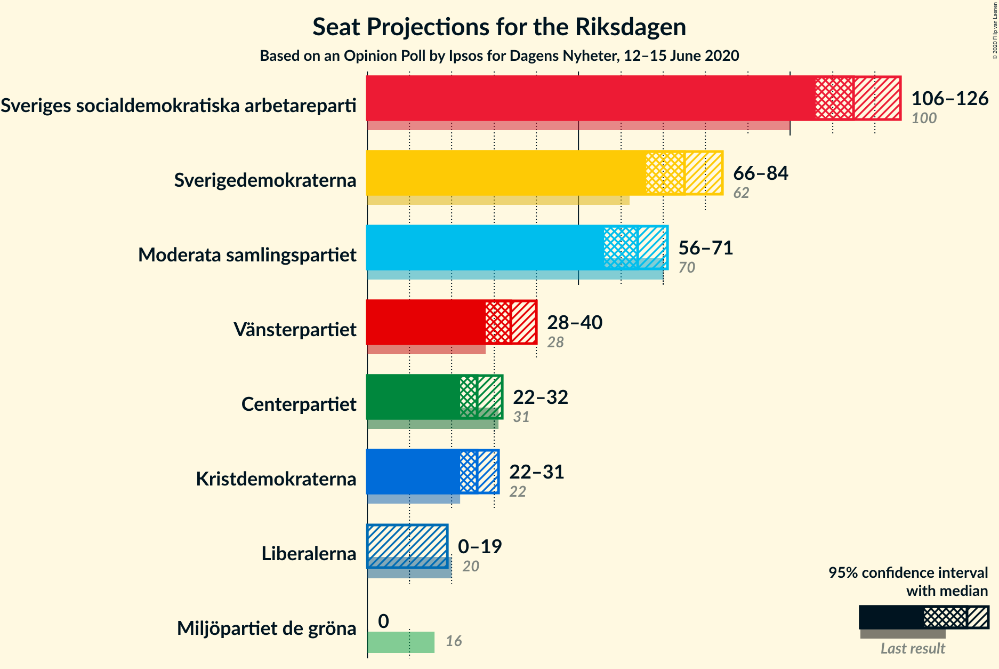
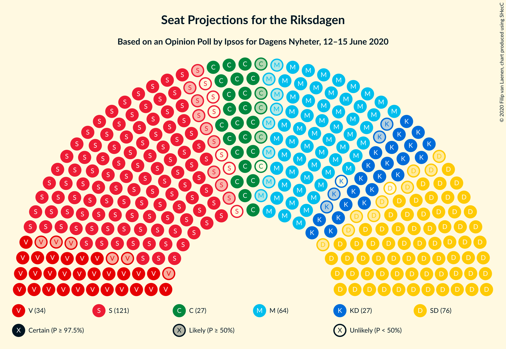
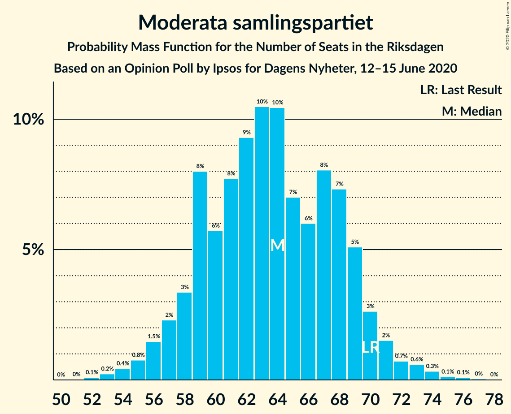
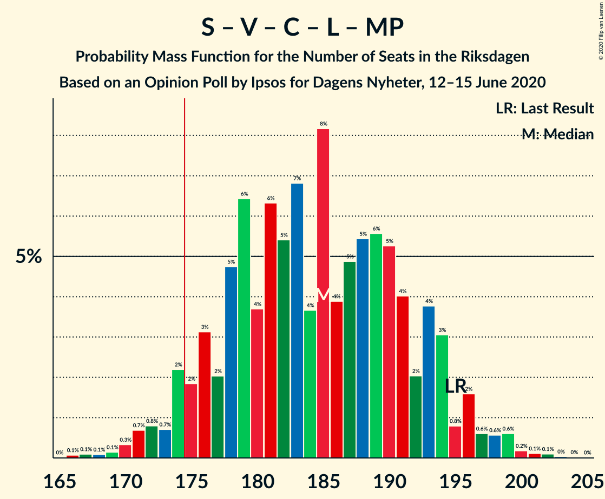
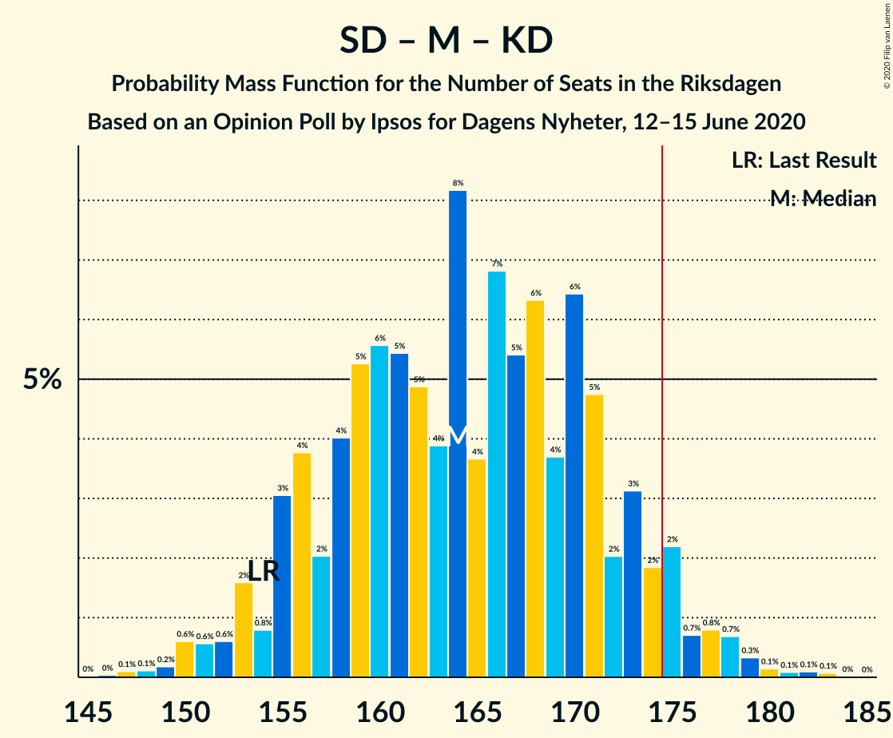
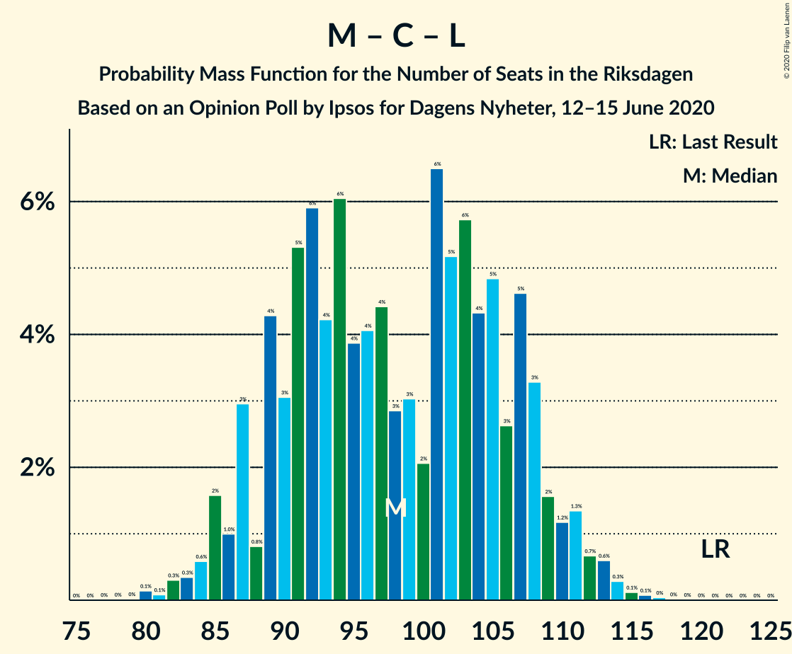

# Opinion Poll by Ipsos for Dagens Nyheter, 12–15 June 2020

<a href="#voting-intentions">Voting Intentions</a> | <a href="#seats">Seats</a> | <a href="#coalitions">Coalitions</a> | <a href="#technical-information">Technical Information</a>

## Voting Intentions

### Confidence Intervals

| Party | Last Result | Poll Result | 80% Confidence Interval | 90% Confidence Interval | 95% Confidence Interval | 99% Confidence Interval |
|:-----:|:-----------:|:-----------:|:-----------------------:|:-----------------------:|:-----------------------:|:-----------------------:|
| Sveriges socialdemokratiska arbetareparti | 28.3% | 31.0% | 29.5–32.5% |29.1–33.0% |28.7–33.4% |28.0–34.1% |
| Sverigedemokraterna | 17.5% | 20.0% | 18.7–21.4% |18.4–21.7% |18.0–22.1% |17.4–22.8% |
| Moderata samlingspartiet | 19.8% | 17.0% | 15.8–18.3% |15.5–18.7% |15.2–19.0% |14.6–19.6% |
| Vänsterpartiet | 8.0% | 9.0% | 8.1–10.0% |7.8–10.3% |7.7–10.6% |7.2–11.1% |
| Centerpartiet | 8.6% | 7.0% | 6.2–7.9% |6.0–8.2% |5.8–8.4% |5.5–8.9% |
| Kristdemokraterna | 6.3% | 7.0% | 6.2–7.9% |6.0–8.2% |5.8–8.4% |5.5–8.9% |
| Liberalerna | 5.5% | 4.0% | 3.4–4.7% |3.2–4.9% |3.1–5.1% |2.9–5.5% |
| Miljöpartiet de gröna | 4.4% | 3.0% | 2.5–3.6% |2.4–3.8% |2.2–4.0% |2.0–4.3% |

*Note:* The poll result column reflects the actual value used in the calculations. Published results may vary slightly, and in addition be rounded to fewer digits.

## Seats

### Confidence Intervals

| Party | Last Result | Median | 80% Confidence Interval | 90% Confidence Interval | 95% Confidence Interval | 99% Confidence Interval |
|:-----:|:-----------:|:------:|:-----------------------:|:-----------------------:|:-----------------------:|:-----------------------:|
| <a href="#sveriges-socialdemokratiska-arbetareparti">Sveriges socialdemokratiska arbetareparti</a> | 100 | 115 | 109–122 |109–123 |106–124 |103–128 |
| <a href="#sverigedemokraterna">Sverigedemokraterna</a> | 62 | 75 | 70–81 |69–84 |66–84 |64–85 |
| <a href="#moderata-samlingspartiet">Moderata samlingspartiet</a> | 70 | 63 | 59–69 |57–69 |56–71 |53–74 |
| <a href="#vänsterpartiet">Vänsterpartiet</a> | 28 | 33 | 30–36 |30–38 |29–39 |28–41 |
| <a href="#centerpartiet">Centerpartiet</a> | 31 | 26 | 23–29 |23–31 |22–32 |20–33 |
| <a href="#kristdemokraterna">Kristdemokraterna</a> | 22 | 25 | 24–29 |23–29 |22–31 |21–32 |
| <a href="#liberalerna">Liberalerna</a> | 20 | 15 | 0–16 |0–17 |0–18 |0–20 |
| <a href="#miljöpartiet-de-gröna">Miljöpartiet de gröna</a> | 16 | 0 | 0 |0 |0–14 |0–15 |

### Sveriges socialdemokratiska arbetareparti

*For a full overview of the results for this party, see the [Sveriges socialdemokratiska arbetareparti](party-sverigessocialdemokratiskaarbetareparti.html) page.*

| Number of Seats | Probability | Accumulated | Special Marks |
|:---------------:|:-----------:|:-----------:|:-------------:|
| 100 | 0% | 100% | Last Result |
| 101 | 0.2% | 100% |  |
| 102 | 0.2% | 99.7% |  |
| 103 | 0.3% | 99.6% |  |
| 104 | 0.4% | 99.3% |  |
| 105 | 1.1% | 98.9% |  |
| 106 | 0.6% | 98% |  |
| 107 | 0.4% | 97% |  |
| 108 | 2% | 97% |  |
| 109 | 7% | 95% |  |
| 110 | 0.9% | 88% |  |
| 111 | 11% | 88% |  |
| 112 | 13% | 77% |  |
| 113 | 7% | 64% |  |
| 114 | 4% | 57% |  |
| 115 | 11% | 53% | Median |
| 116 | 5% | 42% |  |
| 117 | 3% | 36% |  |
| 118 | 2% | 33% |  |
| 119 | 8% | 31% |  |
| 120 | 4% | 23% |  |
| 121 | 3% | 19% |  |
| 122 | 7% | 16% |  |
| 123 | 6% | 9% |  |
| 124 | 0.9% | 3% |  |
| 125 | 0.5% | 2% |  |
| 126 | 0.6% | 1.4% |  |
| 127 | 0.2% | 0.8% |  |
| 128 | 0.2% | 0.5% |  |
| 129 | 0.1% | 0.3% |  |
| 130 | 0.2% | 0.3% |  |
| 131 | 0% | 0.1% |  |
| 132 | 0% | 0.1% |  |
| 133 | 0% | 0% |  |

### Sverigedemokraterna

*For a full overview of the results for this party, see the [Sverigedemokraterna](party-sverigedemokraterna.html) page.*

| Number of Seats | Probability | Accumulated | Special Marks |
|:---------------:|:-----------:|:-----------:|:-------------:|
| 62 | 0% | 100% | Last Result |
| 63 | 0.1% | 99.9% |  |
| 64 | 0.5% | 99.9% |  |
| 65 | 0.6% | 99.4% |  |
| 66 | 2% | 98.8% |  |
| 67 | 0.9% | 97% |  |
| 68 | 0.4% | 96% |  |
| 69 | 4% | 95% |  |
| 70 | 9% | 91% |  |
| 71 | 7% | 82% |  |
| 72 | 11% | 75% |  |
| 73 | 2% | 65% |  |
| 74 | 9% | 63% |  |
| 75 | 18% | 54% | Median |
| 76 | 5% | 35% |  |
| 77 | 6% | 30% |  |
| 78 | 4% | 24% |  |
| 79 | 7% | 20% |  |
| 80 | 3% | 13% |  |
| 81 | 1.1% | 11% |  |
| 82 | 0.9% | 9% |  |
| 83 | 3% | 9% |  |
| 84 | 5% | 5% |  |
| 85 | 0.1% | 0.6% |  |
| 86 | 0.3% | 0.5% |  |
| 87 | 0.1% | 0.2% |  |
| 88 | 0% | 0.1% |  |
| 89 | 0.1% | 0.1% |  |
| 90 | 0% | 0% |  |

### Moderata samlingspartiet

*For a full overview of the results for this party, see the [Moderata samlingspartiet](party-moderatasamlingspartiet.html) page.*

| Number of Seats | Probability | Accumulated | Special Marks |
|:---------------:|:-----------:|:-----------:|:-------------:|
| 52 | 0.2% | 100% |  |
| 53 | 0.3% | 99.8% |  |
| 54 | 0.5% | 99.5% |  |
| 55 | 0.9% | 98.9% |  |
| 56 | 1.4% | 98% |  |
| 57 | 3% | 97% |  |
| 58 | 3% | 94% |  |
| 59 | 12% | 91% |  |
| 60 | 3% | 78% |  |
| 61 | 16% | 76% |  |
| 62 | 7% | 60% |  |
| 63 | 10% | 52% | Median |
| 64 | 14% | 42% |  |
| 65 | 2% | 28% |  |
| 66 | 5% | 26% |  |
| 67 | 4% | 22% |  |
| 68 | 8% | 18% |  |
| 69 | 7% | 10% |  |
| 70 | 0.5% | 3% | Last Result |
| 71 | 1.0% | 3% |  |
| 72 | 0.5% | 2% |  |
| 73 | 0.4% | 1.1% |  |
| 74 | 0.5% | 0.7% |  |
| 75 | 0.1% | 0.3% |  |
| 76 | 0.1% | 0.2% |  |
| 77 | 0% | 0% |  |

### Vänsterpartiet

*For a full overview of the results for this party, see the [Vänsterpartiet](party-vänsterpartiet.html) page.*

| Number of Seats | Probability | Accumulated | Special Marks |
|:---------------:|:-----------:|:-----------:|:-------------:|
| 26 | 0.1% | 100% |  |
| 27 | 0.3% | 99.9% |  |
| 28 | 1.2% | 99.6% | Last Result |
| 29 | 1.4% | 98% |  |
| 30 | 9% | 97% |  |
| 31 | 4% | 88% |  |
| 32 | 26% | 85% |  |
| 33 | 12% | 59% | Median |
| 34 | 8% | 46% |  |
| 35 | 9% | 39% |  |
| 36 | 20% | 30% |  |
| 37 | 2% | 9% |  |
| 38 | 4% | 7% |  |
| 39 | 2% | 3% |  |
| 40 | 0.2% | 1.4% |  |
| 41 | 0.8% | 1.1% |  |
| 42 | 0.2% | 0.3% |  |
| 43 | 0.1% | 0.2% |  |
| 44 | 0% | 0.1% |  |
| 45 | 0% | 0% |  |

### Centerpartiet

*For a full overview of the results for this party, see the [Centerpartiet](party-centerpartiet.html) page.*

| Number of Seats | Probability | Accumulated | Special Marks |
|:---------------:|:-----------:|:-----------:|:-------------:|
| 19 | 0.1% | 100% |  |
| 20 | 0.6% | 99.9% |  |
| 21 | 1.0% | 99.3% |  |
| 22 | 3% | 98% |  |
| 23 | 12% | 95% |  |
| 24 | 5% | 83% |  |
| 25 | 18% | 78% |  |
| 26 | 19% | 60% | Median |
| 27 | 12% | 41% |  |
| 28 | 12% | 29% |  |
| 29 | 9% | 17% |  |
| 30 | 1.4% | 8% |  |
| 31 | 4% | 7% | Last Result |
| 32 | 2% | 3% |  |
| 33 | 0.8% | 1.1% |  |
| 34 | 0.1% | 0.3% |  |
| 35 | 0.1% | 0.1% |  |
| 36 | 0% | 0.1% |  |
| 37 | 0% | 0% |  |

### Kristdemokraterna

*For a full overview of the results for this party, see the [Kristdemokraterna](party-kristdemokraterna.html) page.*

| Number of Seats | Probability | Accumulated | Special Marks |
|:---------------:|:-----------:|:-----------:|:-------------:|
| 19 | 0.1% | 100% |  |
| 20 | 0.2% | 99.9% |  |
| 21 | 0.5% | 99.7% |  |
| 22 | 3% | 99.2% | Last Result |
| 23 | 6% | 96% |  |
| 24 | 16% | 90% |  |
| 25 | 25% | 75% | Median |
| 26 | 16% | 50% |  |
| 27 | 6% | 34% |  |
| 28 | 13% | 28% |  |
| 29 | 10% | 15% |  |
| 30 | 2% | 5% |  |
| 31 | 2% | 3% |  |
| 32 | 0.6% | 0.9% |  |
| 33 | 0.3% | 0.3% |  |
| 34 | 0% | 0.1% |  |
| 35 | 0% | 0% |  |

### Liberalerna

*For a full overview of the results for this party, see the [Liberalerna](party-liberalerna.html) page.*

| Number of Seats | Probability | Accumulated | Special Marks |
|:---------------:|:-----------:|:-----------:|:-------------:|
| 0 | 37% | 100% |  |
| 1 | 0% | 63% |  |
| 2 | 0% | 63% |  |
| 3 | 0% | 63% |  |
| 4 | 0% | 63% |  |
| 5 | 0% | 63% |  |
| 6 | 0% | 63% |  |
| 7 | 0% | 63% |  |
| 8 | 0% | 63% |  |
| 9 | 0% | 63% |  |
| 10 | 0% | 63% |  |
| 11 | 0% | 63% |  |
| 12 | 0% | 63% |  |
| 13 | 0% | 63% |  |
| 14 | 0% | 63% |  |
| 15 | 35% | 63% | Median |
| 16 | 20% | 28% |  |
| 17 | 5% | 8% |  |
| 18 | 1.2% | 3% |  |
| 19 | 1.2% | 2% |  |
| 20 | 0.5% | 0.7% | Last Result |
| 21 | 0.2% | 0.2% |  |
| 22 | 0% | 0% |  |

### Miljöpartiet de gröna

*For a full overview of the results for this party, see the [Miljöpartiet de gröna](party-miljöpartietdegröna.html) page.*

| Number of Seats | Probability | Accumulated | Special Marks |
|:---------------:|:-----------:|:-----------:|:-------------:|
| 0 | 97% | 100% | Median |
| 1 | 0% | 3% |  |
| 2 | 0% | 3% |  |
| 3 | 0% | 3% |  |
| 4 | 0% | 3% |  |
| 5 | 0% | 3% |  |
| 6 | 0% | 3% |  |
| 7 | 0% | 3% |  |
| 8 | 0% | 3% |  |
| 9 | 0% | 3% |  |
| 10 | 0% | 3% |  |
| 11 | 0% | 3% |  |
| 12 | 0% | 3% |  |
| 13 | 0% | 3% |  |
| 14 | 0.2% | 3% |  |
| 15 | 2% | 2% |  |
| 16 | 0.2% | 0.3% | Last Result |
| 17 | 0.1% | 0.2% |  |
| 18 | 0% | 0% |  |

## Coalitions

### Confidence Intervals

| Coalition | Last Result | Median | Majority? | 80% Confidence Interval | 90% Confidence Interval | 95% Confidence Interval | 99% Confidence Interval |
|:---------:|:-----------:|:------:|:---------:|:-----------------------:|:-----------------------:|:-----------------------:|:-----------------------:|
| Sveriges socialdemokratiska arbetareparti – Moderata samlingspartiet – Centerpartiet | 201 | 204 | 100% | 198–214 | 195–217 | 193–217 | 189–221 |
| Sveriges socialdemokratiska arbetareparti – Vänsterpartiet – Centerpartiet – Liberalerna – Miljöpartiet de gröna | 195 | 187 | 93% | 177–193 | 174–196 | 171–197 | 170–200 |
| Sveriges socialdemokratiska arbetareparti – Moderata samlingspartiet | 170 | 179 | 62% | 172–187 | 170–191 | 168–191 | 164–192 |
| Sverigedemokraterna – Moderata samlingspartiet – Kristdemokraterna | 154 | 162 | 7% | 156–172 | 153–175 | 152–178 | 149–179 |
| Sveriges socialdemokratiska arbetareparti – Centerpartiet – Liberalerna – Miljöpartiet de gröna | 167 | 152 | 0% | 142–160 | 141–161 | 139–163 | 136–168 |
| Sveriges socialdemokratiska arbetareparti – Vänsterpartiet – Miljöpartiet de gröna | 144 | 148 | 0% | 144–155 | 143–158 | 141–159 | 137–163 |
| Sveriges socialdemokratiska arbetareparti – Vänsterpartiet | 128 | 148 | 0% | 144–154 | 142–156 | 141–158 | 136–163 |
| Sverigedemokraterna – Moderata samlingspartiet | 132 | 137 | 0% | 131–147 | 129–149 | 127–149 | 124–153 |
| Moderata samlingspartiet – Centerpartiet – Kristdemokraterna – Liberalerna | 143 | 126 | 0% | 116–134 | 114–135 | 114–135 | 110–140 |
| Moderata samlingspartiet – Centerpartiet – Kristdemokraterna | 123 | 115 | 0% | 110–122 | 106–125 | 106–128 | 104–129 |
| Sveriges socialdemokratiska arbetareparti – Miljöpartiet de gröna | 116 | 115 | 0% | 109–123 | 109–124 | 107–126 | 103–130 |
| Moderata samlingspartiet – Centerpartiet – Liberalerna | 121 | 101 | 0% | 90–108 | 89–109 | 89–111 | 85–112 |
| Moderata samlingspartiet – Centerpartiet | 101 | 89 | 0% | 84–95 | 83–97 | 81–101 | 80–102 |

### Sveriges socialdemokratiska arbetareparti – Moderata samlingspartiet – Centerpartiet

| Number of Seats | Probability | Accumulated | Special Marks |
|:---------------:|:-----------:|:-----------:|:-------------:|
| 184 | 0.1% | 100% |  |
| 185 | 0% | 99.9% |  |
| 186 | 0% | 99.9% |  |
| 187 | 0.1% | 99.9% |  |
| 188 | 0.2% | 99.8% |  |
| 189 | 0.1% | 99.6% |  |
| 190 | 0.1% | 99.5% |  |
| 191 | 0.6% | 99.4% |  |
| 192 | 1.3% | 98.9% |  |
| 193 | 0.4% | 98% |  |
| 194 | 2% | 97% |  |
| 195 | 0.6% | 95% |  |
| 196 | 0.8% | 95% |  |
| 197 | 2% | 94% |  |
| 198 | 17% | 92% |  |
| 199 | 0.8% | 74% |  |
| 200 | 1.1% | 74% |  |
| 201 | 14% | 72% | Last Result |
| 202 | 5% | 59% |  |
| 203 | 4% | 54% |  |
| 204 | 6% | 50% | Median |
| 205 | 6% | 44% |  |
| 206 | 3% | 38% |  |
| 207 | 6% | 35% |  |
| 208 | 4% | 29% |  |
| 209 | 3% | 25% |  |
| 210 | 1.4% | 22% |  |
| 211 | 0.7% | 20% |  |
| 212 | 3% | 20% |  |
| 213 | 0.5% | 17% |  |
| 214 | 8% | 17% |  |
| 215 | 0.7% | 9% |  |
| 216 | 0.2% | 8% |  |
| 217 | 6% | 8% |  |
| 218 | 0.4% | 2% |  |
| 219 | 0.6% | 1.4% |  |
| 220 | 0.1% | 0.7% |  |
| 221 | 0.4% | 0.6% |  |
| 222 | 0.1% | 0.2% |  |
| 223 | 0% | 0.1% |  |
| 224 | 0% | 0.1% |  |
| 225 | 0% | 0.1% |  |
| 226 | 0% | 0% |  |

### Sveriges socialdemokratiska arbetareparti – Vänsterpartiet – Centerpartiet – Liberalerna – Miljöpartiet de gröna

| Number of Seats | Probability | Accumulated | Special Marks |
|:---------------:|:-----------:|:-----------:|:-------------:|
| 166 | 0.1% | 100% |  |
| 167 | 0% | 99.9% |  |
| 168 | 0% | 99.9% |  |
| 169 | 0.2% | 99.8% |  |
| 170 | 0.7% | 99.6% |  |
| 171 | 2% | 98.9% |  |
| 172 | 0.5% | 97% |  |
| 173 | 0.5% | 97% |  |
| 174 | 3% | 96% |  |
| 175 | 0.8% | 93% | Majority |
| 176 | 2% | 92% |  |
| 177 | 4% | 90% |  |
| 178 | 1.0% | 86% |  |
| 179 | 6% | 85% |  |
| 180 | 1.4% | 79% |  |
| 181 | 4% | 78% |  |
| 182 | 9% | 74% |  |
| 183 | 3% | 65% |  |
| 184 | 3% | 63% |  |
| 185 | 8% | 60% |  |
| 186 | 1.1% | 52% |  |
| 187 | 4% | 51% |  |
| 188 | 13% | 47% |  |
| 189 | 10% | 34% | Median |
| 190 | 6% | 24% |  |
| 191 | 5% | 18% |  |
| 192 | 0.9% | 13% |  |
| 193 | 6% | 13% |  |
| 194 | 0.2% | 7% |  |
| 195 | 0.4% | 7% | Last Result |
| 196 | 3% | 6% |  |
| 197 | 1.0% | 3% |  |
| 198 | 0.7% | 2% |  |
| 199 | 1.0% | 2% |  |
| 200 | 0.4% | 0.5% |  |
| 201 | 0.1% | 0.2% |  |
| 202 | 0.1% | 0.1% |  |
| 203 | 0% | 0% |  |

### Sveriges socialdemokratiska arbetareparti – Moderata samlingspartiet

| Number of Seats | Probability | Accumulated | Special Marks |
|:---------------:|:-----------:|:-----------:|:-------------:|
| 160 | 0% | 100% |  |
| 161 | 0% | 99.9% |  |
| 162 | 0.1% | 99.9% |  |
| 163 | 0% | 99.8% |  |
| 164 | 0.5% | 99.8% |  |
| 165 | 0.5% | 99.3% |  |
| 166 | 0.8% | 98.8% |  |
| 167 | 0.4% | 98% |  |
| 168 | 0.3% | 98% |  |
| 169 | 0.7% | 97% |  |
| 170 | 2% | 97% | Last Result |
| 171 | 3% | 95% |  |
| 172 | 7% | 91% |  |
| 173 | 14% | 84% |  |
| 174 | 8% | 70% |  |
| 175 | 3% | 62% | Majority |
| 176 | 0.5% | 58% |  |
| 177 | 0.6% | 58% |  |
| 178 | 5% | 57% | Median |
| 179 | 12% | 53% |  |
| 180 | 9% | 40% |  |
| 181 | 8% | 31% |  |
| 182 | 4% | 23% |  |
| 183 | 1.0% | 19% |  |
| 184 | 0.5% | 18% |  |
| 185 | 0.4% | 17% |  |
| 186 | 7% | 17% |  |
| 187 | 1.0% | 10% |  |
| 188 | 0.8% | 9% |  |
| 189 | 0.5% | 8% |  |
| 190 | 0.8% | 8% |  |
| 191 | 6% | 7% |  |
| 192 | 0.3% | 0.6% |  |
| 193 | 0% | 0.4% |  |
| 194 | 0.1% | 0.3% |  |
| 195 | 0% | 0.2% |  |
| 196 | 0.1% | 0.2% |  |
| 197 | 0% | 0.1% |  |
| 198 | 0% | 0.1% |  |
| 199 | 0.1% | 0.1% |  |
| 200 | 0% | 0% |  |

### Sverigedemokraterna – Moderata samlingspartiet – Kristdemokraterna

| Number of Seats | Probability | Accumulated | Special Marks |
|:---------------:|:-----------:|:-----------:|:-------------:|
| 147 | 0.1% | 100% |  |
| 148 | 0.1% | 99.9% |  |
| 149 | 0.4% | 99.8% |  |
| 150 | 1.0% | 99.5% |  |
| 151 | 0.7% | 98% |  |
| 152 | 1.0% | 98% |  |
| 153 | 3% | 97% |  |
| 154 | 0.4% | 94% | Last Result |
| 155 | 0.2% | 93% |  |
| 156 | 6% | 93% |  |
| 157 | 0.9% | 87% |  |
| 158 | 5% | 87% |  |
| 159 | 6% | 82% |  |
| 160 | 10% | 76% |  |
| 161 | 13% | 66% |  |
| 162 | 4% | 53% |  |
| 163 | 1.1% | 49% | Median |
| 164 | 8% | 48% |  |
| 165 | 3% | 40% |  |
| 166 | 3% | 37% |  |
| 167 | 9% | 35% |  |
| 168 | 4% | 26% |  |
| 169 | 1.4% | 22% |  |
| 170 | 6% | 21% |  |
| 171 | 1.0% | 15% |  |
| 172 | 4% | 14% |  |
| 173 | 2% | 10% |  |
| 174 | 0.8% | 8% |  |
| 175 | 3% | 7% | Majority |
| 176 | 0.5% | 4% |  |
| 177 | 0.5% | 3% |  |
| 178 | 2% | 3% |  |
| 179 | 0.7% | 1.1% |  |
| 180 | 0.2% | 0.4% |  |
| 181 | 0% | 0.2% |  |
| 182 | 0% | 0.1% |  |
| 183 | 0.1% | 0.1% |  |
| 184 | 0% | 0% |  |

### Sveriges socialdemokratiska arbetareparti – Centerpartiet – Liberalerna – Miljöpartiet de gröna

| Number of Seats | Probability | Accumulated | Special Marks |
|:---------------:|:-----------:|:-----------:|:-------------:|
| 133 | 0.2% | 100% |  |
| 134 | 0.1% | 99.7% |  |
| 135 | 0.1% | 99.7% |  |
| 136 | 1.0% | 99.5% |  |
| 137 | 0.1% | 98.5% |  |
| 138 | 0.1% | 98% |  |
| 139 | 2% | 98% |  |
| 140 | 0.2% | 97% |  |
| 141 | 3% | 96% |  |
| 142 | 5% | 93% |  |
| 143 | 2% | 88% |  |
| 144 | 2% | 86% |  |
| 145 | 2% | 84% |  |
| 146 | 0.8% | 82% |  |
| 147 | 0.7% | 81% |  |
| 148 | 2% | 81% |  |
| 149 | 8% | 79% |  |
| 150 | 8% | 70% |  |
| 151 | 6% | 62% |  |
| 152 | 13% | 56% |  |
| 153 | 9% | 43% |  |
| 154 | 7% | 35% |  |
| 155 | 2% | 27% |  |
| 156 | 1.0% | 25% | Median |
| 157 | 8% | 25% |  |
| 158 | 3% | 17% |  |
| 159 | 2% | 14% |  |
| 160 | 4% | 12% |  |
| 161 | 3% | 7% |  |
| 162 | 0.5% | 4% |  |
| 163 | 0.7% | 3% |  |
| 164 | 1.1% | 2% |  |
| 165 | 0.2% | 1.4% |  |
| 166 | 0% | 1.2% |  |
| 167 | 0.7% | 1.2% | Last Result |
| 168 | 0.1% | 0.5% |  |
| 169 | 0% | 0.4% |  |
| 170 | 0.3% | 0.4% |  |
| 171 | 0% | 0% |  |

### Sveriges socialdemokratiska arbetareparti – Vänsterpartiet – Miljöpartiet de gröna

| Number of Seats | Probability | Accumulated | Special Marks |
|:---------------:|:-----------:|:-----------:|:-------------:|
| 134 | 0% | 100% |  |
| 135 | 0.1% | 99.9% |  |
| 136 | 0.3% | 99.8% |  |
| 137 | 0.1% | 99.5% |  |
| 138 | 0.7% | 99.4% |  |
| 139 | 0.1% | 98.8% |  |
| 140 | 0.8% | 98.7% |  |
| 141 | 0.5% | 98% |  |
| 142 | 2% | 97% |  |
| 143 | 3% | 95% |  |
| 144 | 3% | 92% | Last Result |
| 145 | 12% | 89% |  |
| 146 | 5% | 77% |  |
| 147 | 13% | 73% |  |
| 148 | 12% | 60% | Median |
| 149 | 4% | 48% |  |
| 150 | 5% | 44% |  |
| 151 | 6% | 39% |  |
| 152 | 4% | 32% |  |
| 153 | 8% | 28% |  |
| 154 | 10% | 20% |  |
| 155 | 0.8% | 11% |  |
| 156 | 4% | 10% |  |
| 157 | 0.4% | 6% |  |
| 158 | 3% | 5% |  |
| 159 | 1.1% | 3% |  |
| 160 | 0.4% | 2% |  |
| 161 | 0.2% | 1.2% |  |
| 162 | 0.3% | 1.0% |  |
| 163 | 0.3% | 0.7% |  |
| 164 | 0.1% | 0.4% |  |
| 165 | 0% | 0.3% |  |
| 166 | 0.1% | 0.3% |  |
| 167 | 0% | 0.2% |  |
| 168 | 0.1% | 0.1% |  |
| 169 | 0% | 0% |  |

### Sveriges socialdemokratiska arbetareparti – Vänsterpartiet

| Number of Seats | Probability | Accumulated | Special Marks |
|:---------------:|:-----------:|:-----------:|:-------------:|
| 128 | 0% | 100% | Last Result |
| 129 | 0% | 100% |  |
| 130 | 0% | 100% |  |
| 131 | 0% | 100% |  |
| 132 | 0% | 100% |  |
| 133 | 0% | 99.9% |  |
| 134 | 0% | 99.9% |  |
| 135 | 0.1% | 99.9% |  |
| 136 | 0.4% | 99.7% |  |
| 137 | 0.1% | 99.3% |  |
| 138 | 0.7% | 99.2% |  |
| 139 | 0.1% | 98.5% |  |
| 140 | 0.8% | 98% |  |
| 141 | 0.5% | 98% |  |
| 142 | 2% | 97% |  |
| 143 | 4% | 95% |  |
| 144 | 4% | 91% |  |
| 145 | 12% | 87% |  |
| 146 | 5% | 75% |  |
| 147 | 13% | 70% |  |
| 148 | 12% | 57% | Median |
| 149 | 4% | 45% |  |
| 150 | 5% | 41% |  |
| 151 | 6% | 36% |  |
| 152 | 4% | 30% |  |
| 153 | 8% | 26% |  |
| 154 | 10% | 18% |  |
| 155 | 0.8% | 8% |  |
| 156 | 4% | 7% |  |
| 157 | 0.4% | 4% |  |
| 158 | 1.4% | 3% |  |
| 159 | 0.6% | 2% |  |
| 160 | 0.2% | 1.3% |  |
| 161 | 0.2% | 1.0% |  |
| 162 | 0.3% | 0.9% |  |
| 163 | 0.3% | 0.6% |  |
| 164 | 0% | 0.3% |  |
| 165 | 0% | 0.2% |  |
| 166 | 0.1% | 0.2% |  |
| 167 | 0% | 0.1% |  |
| 168 | 0% | 0% |  |

### Sverigedemokraterna – Moderata samlingspartiet

| Number of Seats | Probability | Accumulated | Special Marks |
|:---------------:|:-----------:|:-----------:|:-------------:|
| 121 | 0% | 100% |  |
| 122 | 0.1% | 99.9% |  |
| 123 | 0.1% | 99.9% |  |
| 124 | 0.7% | 99.8% |  |
| 125 | 0.3% | 99.1% |  |
| 126 | 0.8% | 98.8% |  |
| 127 | 1.3% | 98% |  |
| 128 | 1.4% | 97% |  |
| 129 | 0.4% | 95% |  |
| 130 | 4% | 95% |  |
| 131 | 9% | 91% |  |
| 132 | 4% | 82% | Last Result |
| 133 | 7% | 78% |  |
| 134 | 5% | 71% |  |
| 135 | 1.0% | 66% |  |
| 136 | 14% | 65% |  |
| 137 | 2% | 51% |  |
| 138 | 6% | 49% | Median |
| 139 | 5% | 43% |  |
| 140 | 5% | 38% |  |
| 141 | 0.8% | 33% |  |
| 142 | 9% | 32% |  |
| 143 | 8% | 23% |  |
| 144 | 1.1% | 15% |  |
| 145 | 0.6% | 14% |  |
| 146 | 2% | 13% |  |
| 147 | 6% | 11% |  |
| 148 | 0.2% | 6% |  |
| 149 | 3% | 5% |  |
| 150 | 1.1% | 2% |  |
| 151 | 0.1% | 0.9% |  |
| 152 | 0.1% | 0.9% |  |
| 153 | 0.6% | 0.8% |  |
| 154 | 0.1% | 0.2% |  |
| 155 | 0% | 0.1% |  |
| 156 | 0% | 0.1% |  |
| 157 | 0% | 0% |  |

### Moderata samlingspartiet – Centerpartiet – Kristdemokraterna – Liberalerna

| Number of Seats | Probability | Accumulated | Special Marks |
|:---------------:|:-----------:|:-----------:|:-------------:|
| 105 | 0.1% | 100% |  |
| 106 | 0% | 99.9% |  |
| 107 | 0% | 99.9% |  |
| 108 | 0.1% | 99.8% |  |
| 109 | 0.2% | 99.7% |  |
| 110 | 0.1% | 99.5% |  |
| 111 | 0.3% | 99.4% |  |
| 112 | 0.3% | 99.1% |  |
| 113 | 0.5% | 98.8% |  |
| 114 | 4% | 98% |  |
| 115 | 3% | 94% |  |
| 116 | 7% | 91% |  |
| 117 | 1.0% | 84% |  |
| 118 | 2% | 83% |  |
| 119 | 0.6% | 81% |  |
| 120 | 4% | 80% |  |
| 121 | 3% | 76% |  |
| 122 | 10% | 73% |  |
| 123 | 1.4% | 63% |  |
| 124 | 1.2% | 61% |  |
| 125 | 2% | 60% |  |
| 126 | 14% | 58% |  |
| 127 | 12% | 44% |  |
| 128 | 3% | 33% |  |
| 129 | 3% | 29% | Median |
| 130 | 12% | 26% |  |
| 131 | 0.3% | 15% |  |
| 132 | 0.8% | 14% |  |
| 133 | 2% | 14% |  |
| 134 | 6% | 12% |  |
| 135 | 4% | 6% |  |
| 136 | 0.4% | 2% |  |
| 137 | 0.6% | 2% |  |
| 138 | 0.6% | 1.3% |  |
| 139 | 0.1% | 0.6% |  |
| 140 | 0.4% | 0.5% |  |
| 141 | 0% | 0.1% |  |
| 142 | 0% | 0.1% |  |
| 143 | 0% | 0.1% | Last Result |
| 144 | 0% | 0% |  |

### Moderata samlingspartiet – Centerpartiet – Kristdemokraterna

| Number of Seats | Probability | Accumulated | Special Marks |
|:---------------:|:-----------:|:-----------:|:-------------:|
| 100 | 0.1% | 100% |  |
| 101 | 0% | 99.9% |  |
| 102 | 0% | 99.9% |  |
| 103 | 0.3% | 99.9% |  |
| 104 | 1.1% | 99.5% |  |
| 105 | 0.4% | 98% |  |
| 106 | 5% | 98% |  |
| 107 | 0.3% | 93% |  |
| 108 | 1.1% | 93% |  |
| 109 | 2% | 92% |  |
| 110 | 1.4% | 90% |  |
| 111 | 16% | 89% |  |
| 112 | 10% | 73% |  |
| 113 | 3% | 62% |  |
| 114 | 4% | 60% | Median |
| 115 | 13% | 55% |  |
| 116 | 8% | 42% |  |
| 117 | 3% | 34% |  |
| 118 | 7% | 31% |  |
| 119 | 4% | 24% |  |
| 120 | 4% | 20% |  |
| 121 | 2% | 16% |  |
| 122 | 8% | 15% |  |
| 123 | 1.1% | 7% | Last Result |
| 124 | 0.5% | 6% |  |
| 125 | 0.4% | 5% |  |
| 126 | 2% | 5% |  |
| 127 | 0.3% | 3% |  |
| 128 | 2% | 3% |  |
| 129 | 0.9% | 1.2% |  |
| 130 | 0% | 0.3% |  |
| 131 | 0% | 0.3% |  |
| 132 | 0.1% | 0.3% |  |
| 133 | 0% | 0.1% |  |
| 134 | 0.1% | 0.1% |  |
| 135 | 0% | 0% |  |

### Sveriges socialdemokratiska arbetareparti – Miljöpartiet de gröna

| Number of Seats | Probability | Accumulated | Special Marks |
|:---------------:|:-----------:|:-----------:|:-------------:|
| 101 | 0.2% | 100% |  |
| 102 | 0.1% | 99.8% |  |
| 103 | 0.3% | 99.7% |  |
| 104 | 0.4% | 99.4% |  |
| 105 | 1.1% | 99.1% |  |
| 106 | 0.5% | 98% |  |
| 107 | 0.3% | 98% |  |
| 108 | 2% | 97% |  |
| 109 | 7% | 96% |  |
| 110 | 0.8% | 89% |  |
| 111 | 10% | 88% |  |
| 112 | 13% | 78% |  |
| 113 | 6% | 65% |  |
| 114 | 4% | 59% |  |
| 115 | 11% | 55% | Median |
| 116 | 5% | 44% | Last Result |
| 117 | 3% | 39% |  |
| 118 | 2% | 35% |  |
| 119 | 8% | 33% |  |
| 120 | 4% | 25% |  |
| 121 | 3% | 21% |  |
| 122 | 7% | 18% |  |
| 123 | 6% | 11% |  |
| 124 | 1.0% | 5% |  |
| 125 | 0.6% | 4% |  |
| 126 | 1.4% | 4% |  |
| 127 | 0.2% | 2% |  |
| 128 | 1.2% | 2% |  |
| 129 | 0.1% | 0.7% |  |
| 130 | 0.2% | 0.5% |  |
| 131 | 0.1% | 0.3% |  |
| 132 | 0% | 0.2% |  |
| 133 | 0% | 0.1% |  |
| 134 | 0% | 0.1% |  |
| 135 | 0% | 0.1% |  |
| 136 | 0% | 0.1% |  |
| 137 | 0.1% | 0.1% |  |
| 138 | 0% | 0% |  |

### Moderata samlingspartiet – Centerpartiet – Liberalerna

| Number of Seats | Probability | Accumulated | Special Marks |
|:---------------:|:-----------:|:-----------:|:-------------:|
| 80 | 0.1% | 100% |  |
| 81 | 0.1% | 99.9% |  |
| 82 | 0.2% | 99.8% |  |
| 83 | 0.1% | 99.6% |  |
| 84 | 0.1% | 99.6% |  |
| 85 | 0.9% | 99.5% |  |
| 86 | 0.1% | 98.6% |  |
| 87 | 0.2% | 98.6% |  |
| 88 | 0.4% | 98% |  |
| 89 | 7% | 98% |  |
| 90 | 1.0% | 91% |  |
| 91 | 0.3% | 90% |  |
| 92 | 8% | 90% |  |
| 93 | 2% | 81% |  |
| 94 | 9% | 80% |  |
| 95 | 2% | 70% |  |
| 96 | 2% | 68% |  |
| 97 | 3% | 66% |  |
| 98 | 1.3% | 63% |  |
| 99 | 6% | 62% |  |
| 100 | 2% | 56% |  |
| 101 | 23% | 53% |  |
| 102 | 8% | 30% |  |
| 103 | 4% | 23% |  |
| 104 | 4% | 19% | Median |
| 105 | 0.7% | 15% |  |
| 106 | 1.0% | 14% |  |
| 107 | 2% | 13% |  |
| 108 | 7% | 12% |  |
| 109 | 0.9% | 5% |  |
| 110 | 0.7% | 4% |  |
| 111 | 3% | 4% |  |
| 112 | 0.3% | 0.6% |  |
| 113 | 0.1% | 0.3% |  |
| 114 | 0.1% | 0.2% |  |
| 115 | 0% | 0.1% |  |
| 116 | 0% | 0% |  |
| 117 | 0% | 0% |  |
| 118 | 0% | 0% |  |
| 119 | 0% | 0% |  |
| 120 | 0% | 0% |  |
| 121 | 0% | 0% | Last Result |

### Moderata samlingspartiet – Centerpartiet

| Number of Seats | Probability | Accumulated | Special Marks |
|:---------------:|:-----------:|:-----------:|:-------------:|
| 77 | 0.1% | 100% |  |
| 78 | 0.1% | 99.9% |  |
| 79 | 0.2% | 99.8% |  |
| 80 | 2% | 99.5% |  |
| 81 | 1.4% | 98% |  |
| 82 | 0.9% | 96% |  |
| 83 | 4% | 96% |  |
| 84 | 4% | 92% |  |
| 85 | 4% | 87% |  |
| 86 | 19% | 83% |  |
| 87 | 9% | 64% |  |
| 88 | 4% | 55% |  |
| 89 | 10% | 51% | Median |
| 90 | 2% | 41% |  |
| 91 | 0.9% | 39% |  |
| 92 | 15% | 38% |  |
| 93 | 2% | 23% |  |
| 94 | 10% | 21% |  |
| 95 | 5% | 11% |  |
| 96 | 0.7% | 6% |  |
| 97 | 1.5% | 5% |  |
| 98 | 0.6% | 4% |  |
| 99 | 0.3% | 3% |  |
| 100 | 0.2% | 3% |  |
| 101 | 2% | 3% | Last Result |
| 102 | 0.3% | 0.7% |  |
| 103 | 0.1% | 0.4% |  |
| 104 | 0.1% | 0.2% |  |
| 105 | 0% | 0.1% |  |
| 106 | 0.1% | 0.1% |  |
| 107 | 0% | 0% |  |

## Technical Information

### Opinion Poll

+ **Polling firm:** Ipsos
+ **Commissioner(s):** Dagens Nyheter
+ **Fieldwork period:** 12–15 June 2020

### Calculations

+ **Sample size:** 1501
+ **Simulations done:** 131,072
+ **Error estimate:** 1.62%

