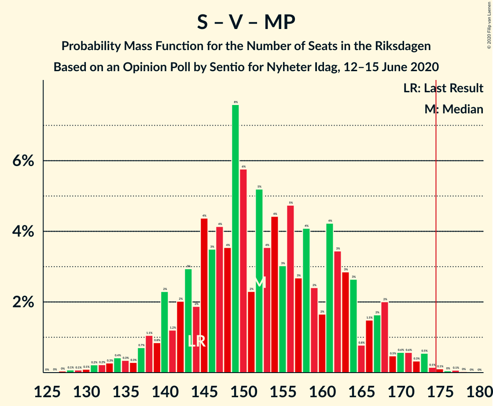
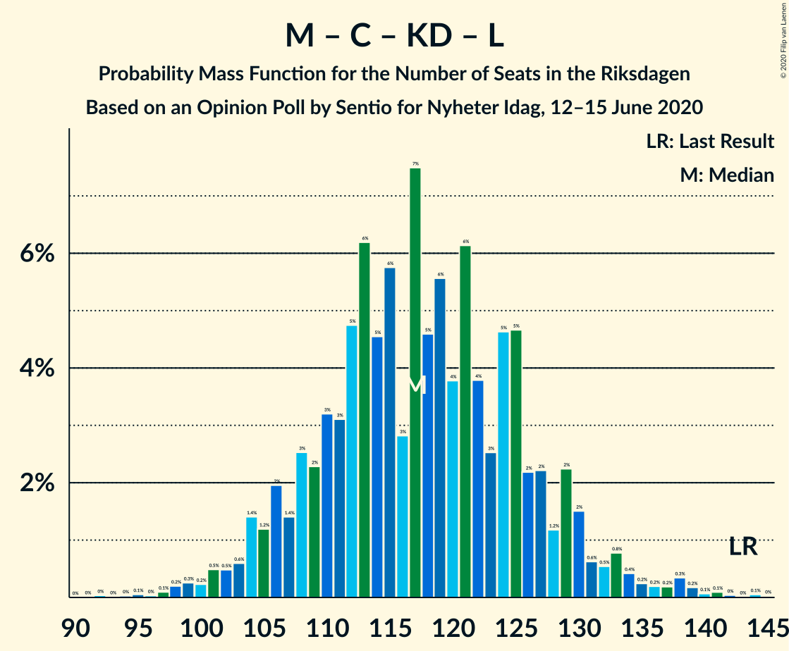
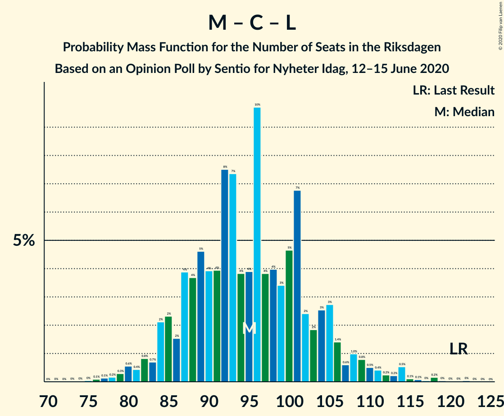

# Opinion Poll by Sentio for Nyheter Idag, 12–15 June 2020

<a href="#voting-intentions">Voting Intentions</a> | <a href="#seats">Seats</a> | <a href="#coalitions">Coalitions</a> | <a href="#technical-information">Technical Information</a>

## Voting Intentions

### Confidence Intervals

| Party | Last Result | Poll Result | 80% Confidence Interval | 90% Confidence Interval | 95% Confidence Interval | 99% Confidence Interval |
|:-----:|:-----------:|:-----------:|:-----------------------:|:-----------------------:|:-----------------------:|:-----------------------:|
| Sveriges socialdemokratiska arbetareparti | 28.3% | 28.8% | 26.8–30.9% |26.2–31.5% |25.7–32.0% |24.8–33.1% |
| Sverigedemokraterna | 17.5% | 20.7% | 18.9–22.6% |18.4–23.2% |18.0–23.6% |17.2–24.6% |
| Moderata samlingspartiet | 19.8% | 18.6% | 16.9–20.5% |16.5–21.0% |16.1–21.5% |15.3–22.4% |
| Vänsterpartiet | 8.0% | 9.8% | 8.5–11.2% |8.2–11.7% |7.9–12.0% |7.3–12.8% |
| Centerpartiet | 8.6% | 6.3% | 5.3–7.6% |5.1–8.0% |4.8–8.3% |4.4–8.9% |
| Kristdemokraterna | 6.3% | 6.0% | 5.0–7.2% |4.7–7.5% |4.5–7.8% |4.1–8.5% |
| Miljöpartiet de gröna | 4.4% | 3.9% | 3.2–5.0% |3.0–5.3% |2.8–5.5% |2.5–6.1% |
| Liberalerna | 5.5% | 2.9% | 2.3–3.8% |2.1–4.1% |2.0–4.3% |1.7–4.8% |

*Note:* The poll result column reflects the actual value used in the calculations. Published results may vary slightly, and in addition be rounded to fewer digits.

## Seats

### Confidence Intervals

| Party | Last Result | Median | 80% Confidence Interval | 90% Confidence Interval | 95% Confidence Interval | 99% Confidence Interval |
|:-----:|:-----------:|:------:|:-----------------------:|:-----------------------:|:-----------------------:|:-----------------------:|
| <a href="#sveriges-socialdemokratiska-arbetareparti">Sveriges socialdemokratiska arbetareparti</a> | 100 | 109 | 100–116 |97–119 |94–120 |91–124 |
| <a href="#sverigedemokraterna">Sverigedemokraterna</a> | 62 | 77 | 70–86 |68–87 |66–89 |63–93 |
| <a href="#moderata-samlingspartiet">Moderata samlingspartiet</a> | 70 | 70 | 63–77 |61–79 |59–81 |56–84 |
| <a href="#vänsterpartiet">Vänsterpartiet</a> | 28 | 37 | 32–42 |30–43 |29–45 |27–48 |
| <a href="#centerpartiet">Centerpartiet</a> | 31 | 24 | 20–29 |19–30 |18–31 |16–33 |
| <a href="#kristdemokraterna">Kristdemokraterna</a> | 22 | 22 | 19–27 |18–28 |17–29 |15–32 |
| <a href="#miljöpartiet-de-gröna">Miljöpartiet de gröna</a> | 16 | 0 | 0–18 |0–19 |0–20 |0–22 |
| <a href="#liberalerna">Liberalerna</a> | 20 | 0 | 0 |0–15 |0–16 |0–17 |

### Sveriges socialdemokratiska arbetareparti

*For a full overview of the results for this party, see the [Sveriges socialdemokratiska arbetareparti](party-sverigessocialdemokratiskaarbetareparti.html) page.*

| Number of Seats | Probability | Accumulated | Special Marks |
|:---------------:|:-----------:|:-----------:|:-------------:|
| 87 | 0% | 100% |  |
| 88 | 0.1% | 99.9% |  |
| 89 | 0.1% | 99.8% |  |
| 90 | 0.2% | 99.7% |  |
| 91 | 0.2% | 99.5% |  |
| 92 | 0.4% | 99.3% |  |
| 93 | 0.5% | 98.9% |  |
| 94 | 1.0% | 98% |  |
| 95 | 0.9% | 97% |  |
| 96 | 1.4% | 96% |  |
| 97 | 1.4% | 95% |  |
| 98 | 2% | 94% |  |
| 99 | 2% | 92% |  |
| 100 | 2% | 90% | Last Result |
| 101 | 4% | 88% |  |
| 102 | 2% | 84% |  |
| 103 | 5% | 82% |  |
| 104 | 2% | 76% |  |
| 105 | 5% | 74% |  |
| 106 | 5% | 69% |  |
| 107 | 8% | 65% |  |
| 108 | 6% | 57% |  |
| 109 | 7% | 51% | Median |
| 110 | 5% | 44% |  |
| 111 | 6% | 38% |  |
| 112 | 3% | 33% |  |
| 113 | 11% | 30% |  |
| 114 | 3% | 19% |  |
| 115 | 6% | 16% |  |
| 116 | 2% | 10% |  |
| 117 | 2% | 8% |  |
| 118 | 1.1% | 6% |  |
| 119 | 2% | 5% |  |
| 120 | 0.9% | 3% |  |
| 121 | 1.3% | 2% |  |
| 122 | 0.5% | 1.2% |  |
| 123 | 0.2% | 0.7% |  |
| 124 | 0.1% | 0.5% |  |
| 125 | 0.1% | 0.4% |  |
| 126 | 0.1% | 0.3% |  |
| 127 | 0.1% | 0.2% |  |
| 128 | 0.1% | 0.1% |  |
| 129 | 0% | 0.1% |  |
| 130 | 0% | 0.1% |  |
| 131 | 0% | 0% |  |

### Sverigedemokraterna

*For a full overview of the results for this party, see the [Sverigedemokraterna](party-sverigedemokraterna.html) page.*

| Number of Seats | Probability | Accumulated | Special Marks |
|:---------------:|:-----------:|:-----------:|:-------------:|
| 60 | 0.1% | 100% |  |
| 61 | 0.1% | 99.9% |  |
| 62 | 0.1% | 99.8% | Last Result |
| 63 | 0.3% | 99.7% |  |
| 64 | 0.4% | 99.4% |  |
| 65 | 0.8% | 98.9% |  |
| 66 | 1.0% | 98% |  |
| 67 | 1.1% | 97% |  |
| 68 | 2% | 96% |  |
| 69 | 2% | 94% |  |
| 70 | 3% | 91% |  |
| 71 | 5% | 88% |  |
| 72 | 4% | 83% |  |
| 73 | 5% | 80% |  |
| 74 | 6% | 74% |  |
| 75 | 8% | 68% |  |
| 76 | 6% | 60% |  |
| 77 | 5% | 54% | Median |
| 78 | 9% | 49% |  |
| 79 | 6% | 39% |  |
| 80 | 5% | 33% |  |
| 81 | 4% | 28% |  |
| 82 | 6% | 24% |  |
| 83 | 3% | 18% |  |
| 84 | 3% | 15% |  |
| 85 | 2% | 13% |  |
| 86 | 4% | 11% |  |
| 87 | 2% | 6% |  |
| 88 | 1.1% | 4% |  |
| 89 | 0.9% | 3% |  |
| 90 | 0.6% | 2% |  |
| 91 | 0.3% | 1.3% |  |
| 92 | 0.5% | 1.1% |  |
| 93 | 0.2% | 0.6% |  |
| 94 | 0.2% | 0.4% |  |
| 95 | 0.1% | 0.2% |  |
| 96 | 0% | 0.1% |  |
| 97 | 0% | 0.1% |  |
| 98 | 0% | 0% |  |

### Moderata samlingspartiet

*For a full overview of the results for this party, see the [Moderata samlingspartiet](party-moderatasamlingspartiet.html) page.*

| Number of Seats | Probability | Accumulated | Special Marks |
|:---------------:|:-----------:|:-----------:|:-------------:|
| 53 | 0.1% | 100% |  |
| 54 | 0% | 99.9% |  |
| 55 | 0.2% | 99.9% |  |
| 56 | 0.2% | 99.7% |  |
| 57 | 0.4% | 99.5% |  |
| 58 | 1.0% | 99.1% |  |
| 59 | 0.9% | 98% |  |
| 60 | 2% | 97% |  |
| 61 | 2% | 95% |  |
| 62 | 1.4% | 93% |  |
| 63 | 5% | 92% |  |
| 64 | 6% | 87% |  |
| 65 | 3% | 81% |  |
| 66 | 8% | 78% |  |
| 67 | 6% | 70% |  |
| 68 | 5% | 64% |  |
| 69 | 9% | 59% |  |
| 70 | 4% | 50% | Last Result, Median |
| 71 | 7% | 46% |  |
| 72 | 10% | 39% |  |
| 73 | 8% | 29% |  |
| 74 | 3% | 21% |  |
| 75 | 5% | 18% |  |
| 76 | 2% | 13% |  |
| 77 | 2% | 10% |  |
| 78 | 2% | 8% |  |
| 79 | 1.1% | 5% |  |
| 80 | 1.3% | 4% |  |
| 81 | 1.4% | 3% |  |
| 82 | 0.3% | 1.5% |  |
| 83 | 0.5% | 1.2% |  |
| 84 | 0.3% | 0.8% |  |
| 85 | 0.1% | 0.4% |  |
| 86 | 0.1% | 0.3% |  |
| 87 | 0.1% | 0.2% |  |
| 88 | 0% | 0.1% |  |
| 89 | 0.1% | 0.1% |  |
| 90 | 0% | 0% |  |

### Vänsterpartiet

*For a full overview of the results for this party, see the [Vänsterpartiet](party-vänsterpartiet.html) page.*

| Number of Seats | Probability | Accumulated | Special Marks |
|:---------------:|:-----------:|:-----------:|:-------------:|
| 25 | 0.1% | 100% |  |
| 26 | 0.2% | 99.9% |  |
| 27 | 0.3% | 99.7% |  |
| 28 | 1.0% | 99.4% | Last Result |
| 29 | 2% | 98% |  |
| 30 | 3% | 97% |  |
| 31 | 3% | 94% |  |
| 32 | 4% | 91% |  |
| 33 | 8% | 87% |  |
| 34 | 8% | 79% |  |
| 35 | 8% | 71% |  |
| 36 | 11% | 63% |  |
| 37 | 11% | 52% | Median |
| 38 | 10% | 42% |  |
| 39 | 8% | 32% |  |
| 40 | 6% | 24% |  |
| 41 | 5% | 17% |  |
| 42 | 4% | 12% |  |
| 43 | 3% | 8% |  |
| 44 | 2% | 5% |  |
| 45 | 1.1% | 3% |  |
| 46 | 0.7% | 2% |  |
| 47 | 0.4% | 1.1% |  |
| 48 | 0.3% | 0.7% |  |
| 49 | 0.2% | 0.3% |  |
| 50 | 0.1% | 0.2% |  |
| 51 | 0% | 0.1% |  |
| 52 | 0% | 0% |  |

### Centerpartiet

*For a full overview of the results for this party, see the [Centerpartiet](party-centerpartiet.html) page.*

| Number of Seats | Probability | Accumulated | Special Marks |
|:---------------:|:-----------:|:-----------:|:-------------:|
| 0 | 0.1% | 100% |  |
| 1 | 0% | 99.9% |  |
| 2 | 0% | 99.9% |  |
| 3 | 0% | 99.9% |  |
| 4 | 0% | 99.9% |  |
| 5 | 0% | 99.9% |  |
| 6 | 0% | 99.9% |  |
| 7 | 0% | 99.9% |  |
| 8 | 0% | 99.9% |  |
| 9 | 0% | 99.9% |  |
| 10 | 0% | 99.9% |  |
| 11 | 0% | 99.9% |  |
| 12 | 0% | 99.9% |  |
| 13 | 0% | 99.9% |  |
| 14 | 0% | 99.9% |  |
| 15 | 0.1% | 99.9% |  |
| 16 | 0.4% | 99.8% |  |
| 17 | 0.7% | 99.5% |  |
| 18 | 2% | 98.8% |  |
| 19 | 3% | 97% |  |
| 20 | 5% | 93% |  |
| 21 | 9% | 88% |  |
| 22 | 9% | 80% |  |
| 23 | 9% | 71% |  |
| 24 | 16% | 62% | Median |
| 25 | 7% | 46% |  |
| 26 | 11% | 39% |  |
| 27 | 10% | 28% |  |
| 28 | 4% | 18% |  |
| 29 | 8% | 13% |  |
| 30 | 1.2% | 6% |  |
| 31 | 3% | 5% | Last Result |
| 32 | 0.8% | 2% |  |
| 33 | 0.6% | 1.0% |  |
| 34 | 0.2% | 0.4% |  |
| 35 | 0.1% | 0.2% |  |
| 36 | 0.1% | 0.1% |  |
| 37 | 0% | 0% |  |

### Kristdemokraterna

*For a full overview of the results for this party, see the [Kristdemokraterna](party-kristdemokraterna.html) page.*

| Number of Seats | Probability | Accumulated | Special Marks |
|:---------------:|:-----------:|:-----------:|:-------------:|
| 0 | 0.3% | 100% |  |
| 1 | 0% | 99.7% |  |
| 2 | 0% | 99.7% |  |
| 3 | 0% | 99.7% |  |
| 4 | 0% | 99.7% |  |
| 5 | 0% | 99.7% |  |
| 6 | 0% | 99.7% |  |
| 7 | 0% | 99.7% |  |
| 8 | 0% | 99.7% |  |
| 9 | 0% | 99.7% |  |
| 10 | 0% | 99.7% |  |
| 11 | 0% | 99.7% |  |
| 12 | 0% | 99.7% |  |
| 13 | 0% | 99.7% |  |
| 14 | 0% | 99.7% |  |
| 15 | 0.4% | 99.7% |  |
| 16 | 1.1% | 99.3% |  |
| 17 | 3% | 98% |  |
| 18 | 5% | 96% |  |
| 19 | 6% | 90% |  |
| 20 | 12% | 84% |  |
| 21 | 13% | 72% |  |
| 22 | 10% | 59% | Last Result, Median |
| 23 | 13% | 49% |  |
| 24 | 12% | 36% |  |
| 25 | 9% | 24% |  |
| 26 | 5% | 15% |  |
| 27 | 3% | 10% |  |
| 28 | 3% | 7% |  |
| 29 | 1.5% | 4% |  |
| 30 | 1.4% | 2% |  |
| 31 | 0.4% | 1.0% |  |
| 32 | 0.2% | 0.5% |  |
| 33 | 0.2% | 0.3% |  |
| 34 | 0% | 0.1% |  |
| 35 | 0.1% | 0.1% |  |
| 36 | 0% | 0% |  |

### Miljöpartiet de gröna

*For a full overview of the results for this party, see the [Miljöpartiet de gröna](party-miljöpartietdegröna.html) page.*

| Number of Seats | Probability | Accumulated | Special Marks |
|:---------------:|:-----------:|:-----------:|:-------------:|
| 0 | 54% | 100% | Median |
| 1 | 0% | 46% |  |
| 2 | 0% | 46% |  |
| 3 | 0% | 46% |  |
| 4 | 0% | 46% |  |
| 5 | 0% | 46% |  |
| 6 | 0% | 46% |  |
| 7 | 0% | 46% |  |
| 8 | 0% | 46% |  |
| 9 | 0% | 46% |  |
| 10 | 0% | 46% |  |
| 11 | 0% | 46% |  |
| 12 | 0% | 46% |  |
| 13 | 0% | 46% |  |
| 14 | 0.5% | 46% |  |
| 15 | 9% | 46% |  |
| 16 | 10% | 36% | Last Result |
| 17 | 13% | 27% |  |
| 18 | 4% | 14% |  |
| 19 | 6% | 10% |  |
| 20 | 2% | 4% |  |
| 21 | 1.3% | 2% |  |
| 22 | 0.6% | 0.9% |  |
| 23 | 0.2% | 0.3% |  |
| 24 | 0.1% | 0.2% |  |
| 25 | 0% | 0% |  |

### Liberalerna

*For a full overview of the results for this party, see the [Liberalerna](party-liberalerna.html) page.*

| Number of Seats | Probability | Accumulated | Special Marks |
|:---------------:|:-----------:|:-----------:|:-------------:|
| 0 | 94% | 100% | Median |
| 1 | 0% | 6% |  |
| 2 | 0% | 6% |  |
| 3 | 0% | 6% |  |
| 4 | 0% | 6% |  |
| 5 | 0% | 6% |  |
| 6 | 0% | 6% |  |
| 7 | 0% | 6% |  |
| 8 | 0% | 6% |  |
| 9 | 0% | 6% |  |
| 10 | 0% | 6% |  |
| 11 | 0% | 6% |  |
| 12 | 0% | 6% |  |
| 13 | 0% | 6% |  |
| 14 | 0.8% | 6% |  |
| 15 | 3% | 6% |  |
| 16 | 2% | 3% |  |
| 17 | 0.6% | 1.1% |  |
| 18 | 0.3% | 0.4% |  |
| 19 | 0.1% | 0.2% |  |
| 20 | 0% | 0.1% | Last Result |
| 21 | 0% | 0% |  |

## Coalitions

### Confidence Intervals

| Coalition | Last Result | Median | Majority? | 80% Confidence Interval | 90% Confidence Interval | 95% Confidence Interval | 99% Confidence Interval |
|:---------:|:-----------:|:------:|:---------:|:-----------------------:|:-----------------------:|:-----------------------:|:-----------------------:|
| Sveriges socialdemokratiska arbetareparti – Moderata samlingspartiet – Centerpartiet | 201 | 202 | 99.9% | 192–214 | 187–215 | 184–216 | 179–223 |
| Sveriges socialdemokratiska arbetareparti – Vänsterpartiet – Centerpartiet – Miljöpartiet de gröna – Liberalerna | 195 | 177 | 70% | 168–189 | 165–192 | 162–194 | 157–198 |
| Sveriges socialdemokratiska arbetareparti – Moderata samlingspartiet | 170 | 178 | 64% | 167–188 | 165–190 | 162–192 | 157–198 |
| Sverigedemokraterna – Moderata samlingspartiet – Kristdemokraterna | 154 | 170 | 24% | 158–180 | 156–183 | 154–184 | 150–189 |
| Sveriges socialdemokratiska arbetareparti – Vänsterpartiet – Miljöpartiet de gröna | 144 | 152 | 0.3% | 142–164 | 140–167 | 137–169 | 131–173 |
| Sverigedemokraterna – Moderata samlingspartiet | 132 | 147 | 0% | 137–157 | 134–160 | 132–162 | 128–166 |
| Sveriges socialdemokratiska arbetareparti – Vänsterpartiet | 128 | 145 | 0% | 135–154 | 132–156 | 130–159 | 126–163 |
| Sveriges socialdemokratiska arbetareparti – Centerpartiet – Miljöpartiet de gröna – Liberalerna | 167 | 141 | 0% | 131–153 | 128–155 | 125–157 | 118–162 |
| Moderata samlingspartiet – Centerpartiet – Kristdemokraterna – Liberalerna | 143 | 117 | 0% | 108–127 | 105–130 | 103–133 | 99–138 |
| Sveriges socialdemokratiska arbetareparti – Miljöpartiet de gröna | 116 | 115 | 0% | 106–128 | 103–130 | 101–133 | 95–135 |
| Moderata samlingspartiet – Centerpartiet – Kristdemokraterna | 123 | 117 | 0% | 107–125 | 105–129 | 103–130 | 98–134 |
| Moderata samlingspartiet – Centerpartiet – Liberalerna | 121 | 95 | 0% | 87–104 | 84–106 | 82–109 | 79–115 |
| Moderata samlingspartiet – Centerpartiet | 101 | 94 | 0% | 86–102 | 84–105 | 82–106 | 78–110 |

### Sveriges socialdemokratiska arbetareparti – Moderata samlingspartiet – Centerpartiet

| Number of Seats | Probability | Accumulated | Special Marks |
|:---------------:|:-----------:|:-----------:|:-------------:|
| 173 | 0% | 100% |  |
| 174 | 0.1% | 99.9% |  |
| 175 | 0.1% | 99.9% | Majority |
| 176 | 0.1% | 99.8% |  |
| 177 | 0.1% | 99.7% |  |
| 178 | 0.1% | 99.6% |  |
| 179 | 0.1% | 99.5% |  |
| 180 | 0.1% | 99.4% |  |
| 181 | 0.2% | 99.4% |  |
| 182 | 0.3% | 99.2% |  |
| 183 | 0.5% | 98.9% |  |
| 184 | 0.9% | 98% |  |
| 185 | 1.0% | 97% |  |
| 186 | 1.3% | 97% |  |
| 187 | 2% | 95% |  |
| 188 | 1.0% | 94% |  |
| 189 | 0.5% | 93% |  |
| 190 | 0.4% | 92% |  |
| 191 | 1.1% | 92% |  |
| 192 | 3% | 91% |  |
| 193 | 3% | 88% |  |
| 194 | 4% | 85% |  |
| 195 | 6% | 81% |  |
| 196 | 4% | 75% |  |
| 197 | 4% | 71% |  |
| 198 | 4% | 67% |  |
| 199 | 2% | 63% |  |
| 200 | 3% | 61% |  |
| 201 | 4% | 57% | Last Result |
| 202 | 4% | 54% |  |
| 203 | 4% | 50% | Median |
| 204 | 3% | 46% |  |
| 205 | 4% | 42% |  |
| 206 | 5% | 39% |  |
| 207 | 3% | 34% |  |
| 208 | 2% | 31% |  |
| 209 | 2% | 29% |  |
| 210 | 1.2% | 27% |  |
| 211 | 6% | 26% |  |
| 212 | 4% | 20% |  |
| 213 | 6% | 16% |  |
| 214 | 4% | 10% |  |
| 215 | 2% | 6% |  |
| 216 | 2% | 5% |  |
| 217 | 1.2% | 2% |  |
| 218 | 0.3% | 1.3% |  |
| 219 | 0.1% | 1.0% |  |
| 220 | 0% | 0.9% |  |
| 221 | 0.1% | 0.8% |  |
| 222 | 0.2% | 0.7% |  |
| 223 | 0.1% | 0.6% |  |
| 224 | 0.1% | 0.4% |  |
| 225 | 0.2% | 0.3% |  |
| 226 | 0.1% | 0.2% |  |
| 227 | 0% | 0.1% |  |
| 228 | 0% | 0.1% |  |
| 229 | 0% | 0% |  |

### Sveriges socialdemokratiska arbetareparti – Vänsterpartiet – Centerpartiet – Miljöpartiet de gröna – Liberalerna

| Number of Seats | Probability | Accumulated | Special Marks |
|:---------------:|:-----------:|:-----------:|:-------------:|
| 149 | 0% | 100% |  |
| 150 | 0% | 99.9% |  |
| 151 | 0% | 99.9% |  |
| 152 | 0% | 99.9% |  |
| 153 | 0% | 99.9% |  |
| 154 | 0% | 99.9% |  |
| 155 | 0.1% | 99.8% |  |
| 156 | 0.2% | 99.8% |  |
| 157 | 0.3% | 99.6% |  |
| 158 | 0.2% | 99.2% |  |
| 159 | 0.2% | 99.0% |  |
| 160 | 0.5% | 98.8% |  |
| 161 | 0.3% | 98% |  |
| 162 | 1.0% | 98% |  |
| 163 | 0.7% | 97% |  |
| 164 | 0.8% | 96% |  |
| 165 | 2% | 95% |  |
| 166 | 1.1% | 94% |  |
| 167 | 1.2% | 92% |  |
| 168 | 2% | 91% |  |
| 169 | 4% | 89% |  |
| 170 | 2% | 84% | Median |
| 171 | 2% | 82% |  |
| 172 | 2% | 80% |  |
| 173 | 5% | 78% |  |
| 174 | 3% | 73% |  |
| 175 | 2% | 70% | Majority |
| 176 | 15% | 68% |  |
| 177 | 4% | 53% |  |
| 178 | 4% | 49% |  |
| 179 | 3% | 45% |  |
| 180 | 3% | 43% |  |
| 181 | 3% | 40% |  |
| 182 | 3% | 37% |  |
| 183 | 5% | 34% |  |
| 184 | 4% | 29% |  |
| 185 | 6% | 25% |  |
| 186 | 5% | 19% |  |
| 187 | 2% | 15% |  |
| 188 | 0.7% | 12% |  |
| 189 | 2% | 12% |  |
| 190 | 2% | 10% |  |
| 191 | 2% | 8% |  |
| 192 | 2% | 6% |  |
| 193 | 1.5% | 4% |  |
| 194 | 1.2% | 3% |  |
| 195 | 0.6% | 2% | Last Result |
| 196 | 0.3% | 1.1% |  |
| 197 | 0.2% | 0.8% |  |
| 198 | 0.2% | 0.6% |  |
| 199 | 0.1% | 0.4% |  |
| 200 | 0.1% | 0.3% |  |
| 201 | 0.1% | 0.2% |  |
| 202 | 0% | 0.1% |  |
| 203 | 0% | 0.1% |  |
| 204 | 0% | 0% |  |

### Sveriges socialdemokratiska arbetareparti – Moderata samlingspartiet

| Number of Seats | Probability | Accumulated | Special Marks |
|:---------------:|:-----------:|:-----------:|:-------------:|
| 150 | 0% | 100% |  |
| 151 | 0% | 99.9% |  |
| 152 | 0.1% | 99.9% |  |
| 153 | 0.1% | 99.9% |  |
| 154 | 0.1% | 99.8% |  |
| 155 | 0.1% | 99.7% |  |
| 156 | 0.1% | 99.6% |  |
| 157 | 0.2% | 99.5% |  |
| 158 | 0.2% | 99.3% |  |
| 159 | 0.3% | 99.1% |  |
| 160 | 0.4% | 98.8% |  |
| 161 | 0.7% | 98% |  |
| 162 | 0.8% | 98% |  |
| 163 | 0.8% | 97% |  |
| 164 | 0.9% | 96% |  |
| 165 | 2% | 95% |  |
| 166 | 2% | 93% |  |
| 167 | 3% | 91% |  |
| 168 | 3% | 88% |  |
| 169 | 3% | 85% |  |
| 170 | 3% | 83% | Last Result |
| 171 | 4% | 80% |  |
| 172 | 4% | 75% |  |
| 173 | 4% | 71% |  |
| 174 | 3% | 67% |  |
| 175 | 3% | 64% | Majority |
| 176 | 6% | 61% |  |
| 177 | 5% | 56% |  |
| 178 | 2% | 51% |  |
| 179 | 3% | 49% | Median |
| 180 | 4% | 46% |  |
| 181 | 4% | 42% |  |
| 182 | 5% | 38% |  |
| 183 | 5% | 33% |  |
| 184 | 3% | 28% |  |
| 185 | 3% | 25% |  |
| 186 | 4% | 22% |  |
| 187 | 6% | 18% |  |
| 188 | 4% | 12% |  |
| 189 | 1.3% | 8% |  |
| 190 | 2% | 6% |  |
| 191 | 1.4% | 4% |  |
| 192 | 0.6% | 3% |  |
| 193 | 1.1% | 2% |  |
| 194 | 0.3% | 1.2% |  |
| 195 | 0.1% | 0.9% |  |
| 196 | 0.1% | 0.8% |  |
| 197 | 0.1% | 0.7% |  |
| 198 | 0.1% | 0.5% |  |
| 199 | 0.1% | 0.4% |  |
| 200 | 0.1% | 0.3% |  |
| 201 | 0.1% | 0.2% |  |
| 202 | 0.1% | 0.1% |  |
| 203 | 0% | 0.1% |  |
| 204 | 0% | 0.1% |  |
| 205 | 0% | 0% |  |

### Sverigedemokraterna – Moderata samlingspartiet – Kristdemokraterna

| Number of Seats | Probability | Accumulated | Special Marks |
|:---------------:|:-----------:|:-----------:|:-------------:|
| 143 | 0% | 100% |  |
| 144 | 0% | 99.9% |  |
| 145 | 0% | 99.9% |  |
| 146 | 0% | 99.9% |  |
| 147 | 0.1% | 99.9% |  |
| 148 | 0.1% | 99.8% |  |
| 149 | 0.1% | 99.6% |  |
| 150 | 0.2% | 99.5% |  |
| 151 | 0.3% | 99.3% |  |
| 152 | 0.3% | 99.1% |  |
| 153 | 0.4% | 98.8% |  |
| 154 | 0.9% | 98% | Last Result |
| 155 | 2% | 97% |  |
| 156 | 2% | 96% |  |
| 157 | 2% | 94% |  |
| 158 | 2% | 92% |  |
| 159 | 2% | 90% |  |
| 160 | 2% | 88% |  |
| 161 | 1.1% | 86% |  |
| 162 | 3% | 85% |  |
| 163 | 5% | 82% |  |
| 164 | 6% | 76% |  |
| 165 | 4% | 71% |  |
| 166 | 5% | 66% |  |
| 167 | 3% | 61% |  |
| 168 | 3% | 57% |  |
| 169 | 3% | 54% | Median |
| 170 | 3% | 51% |  |
| 171 | 4% | 49% |  |
| 172 | 4% | 45% |  |
| 173 | 14% | 41% |  |
| 174 | 2% | 26% |  |
| 175 | 3% | 24% | Majority |
| 176 | 5% | 22% |  |
| 177 | 2% | 17% |  |
| 178 | 1.2% | 15% |  |
| 179 | 2% | 14% |  |
| 180 | 4% | 12% |  |
| 181 | 2% | 8% |  |
| 182 | 0.8% | 6% |  |
| 183 | 0.8% | 5% |  |
| 184 | 2% | 4% |  |
| 185 | 0.5% | 2% |  |
| 186 | 0.2% | 2% |  |
| 187 | 0.7% | 2% |  |
| 188 | 0.2% | 1.1% |  |
| 189 | 0.4% | 0.8% |  |
| 190 | 0.2% | 0.5% |  |
| 191 | 0.1% | 0.3% |  |
| 192 | 0% | 0.2% |  |
| 193 | 0% | 0.1% |  |
| 194 | 0% | 0.1% |  |
| 195 | 0% | 0.1% |  |
| 196 | 0% | 0% |  |

### Sveriges socialdemokratiska arbetareparti – Vänsterpartiet – Miljöpartiet de gröna

| Number of Seats | Probability | Accumulated | Special Marks |
|:---------------:|:-----------:|:-----------:|:-------------:|
| 126 | 0% | 100% |  |
| 127 | 0% | 99.9% |  |
| 128 | 0.1% | 99.9% |  |
| 129 | 0.1% | 99.8% |  |
| 130 | 0.1% | 99.7% |  |
| 131 | 0.2% | 99.7% |  |
| 132 | 0.2% | 99.4% |  |
| 133 | 0.3% | 99.2% |  |
| 134 | 0.4% | 98.9% |  |
| 135 | 0.3% | 98.5% |  |
| 136 | 0.3% | 98% |  |
| 137 | 0.7% | 98% |  |
| 138 | 1.1% | 97% |  |
| 139 | 0.8% | 96% |  |
| 140 | 2% | 95% |  |
| 141 | 1.2% | 93% |  |
| 142 | 2% | 92% |  |
| 143 | 3% | 90% |  |
| 144 | 2% | 87% | Last Result |
| 145 | 4% | 85% |  |
| 146 | 3% | 81% | Median |
| 147 | 4% | 77% |  |
| 148 | 4% | 73% |  |
| 149 | 8% | 69% |  |
| 150 | 6% | 62% |  |
| 151 | 2% | 56% |  |
| 152 | 5% | 54% |  |
| 153 | 4% | 49% |  |
| 154 | 4% | 45% |  |
| 155 | 3% | 41% |  |
| 156 | 5% | 38% |  |
| 157 | 3% | 33% |  |
| 158 | 4% | 30% |  |
| 159 | 2% | 26% |  |
| 160 | 2% | 24% |  |
| 161 | 4% | 22% |  |
| 162 | 3% | 18% |  |
| 163 | 3% | 14% |  |
| 164 | 3% | 11% |  |
| 165 | 0.8% | 9% |  |
| 166 | 1.5% | 8% |  |
| 167 | 2% | 7% |  |
| 168 | 2% | 5% |  |
| 169 | 0.5% | 3% |  |
| 170 | 0.6% | 2% |  |
| 171 | 0.6% | 2% |  |
| 172 | 0.3% | 1.3% |  |
| 173 | 0.5% | 1.0% |  |
| 174 | 0.1% | 0.4% |  |
| 175 | 0.1% | 0.3% | Majority |
| 176 | 0% | 0.2% |  |
| 177 | 0.1% | 0.1% |  |
| 178 | 0% | 0.1% |  |
| 179 | 0% | 0% |  |

### Sverigedemokraterna – Moderata samlingspartiet

| Number of Seats | Probability | Accumulated | Special Marks |
|:---------------:|:-----------:|:-----------:|:-------------:|
| 123 | 0.1% | 100% |  |
| 124 | 0.1% | 99.9% |  |
| 125 | 0.1% | 99.8% |  |
| 126 | 0.1% | 99.8% |  |
| 127 | 0.1% | 99.7% |  |
| 128 | 0.1% | 99.6% |  |
| 129 | 0.2% | 99.5% |  |
| 130 | 0.3% | 99.3% |  |
| 131 | 0.7% | 99.0% |  |
| 132 | 0.8% | 98% | Last Result |
| 133 | 1.2% | 97% |  |
| 134 | 1.3% | 96% |  |
| 135 | 2% | 95% |  |
| 136 | 2% | 93% |  |
| 137 | 3% | 91% |  |
| 138 | 2% | 88% |  |
| 139 | 2% | 86% |  |
| 140 | 4% | 84% |  |
| 141 | 4% | 80% |  |
| 142 | 4% | 76% |  |
| 143 | 5% | 72% |  |
| 144 | 6% | 67% |  |
| 145 | 5% | 61% |  |
| 146 | 3% | 56% |  |
| 147 | 3% | 53% | Median |
| 148 | 6% | 50% |  |
| 149 | 5% | 44% |  |
| 150 | 6% | 39% |  |
| 151 | 6% | 34% |  |
| 152 | 6% | 28% |  |
| 153 | 6% | 22% |  |
| 154 | 3% | 16% |  |
| 155 | 2% | 13% |  |
| 156 | 1.4% | 12% |  |
| 157 | 1.3% | 10% |  |
| 158 | 1.5% | 9% |  |
| 159 | 1.0% | 7% |  |
| 160 | 2% | 6% |  |
| 161 | 1.5% | 4% |  |
| 162 | 1.2% | 3% |  |
| 163 | 0.4% | 2% |  |
| 164 | 0.5% | 1.2% |  |
| 165 | 0.2% | 0.7% |  |
| 166 | 0.1% | 0.5% |  |
| 167 | 0.1% | 0.4% |  |
| 168 | 0.1% | 0.3% |  |
| 169 | 0.1% | 0.2% |  |
| 170 | 0% | 0.1% |  |
| 171 | 0% | 0.1% |  |
| 172 | 0% | 0.1% |  |
| 173 | 0% | 0.1% |  |
| 174 | 0% | 0% |  |

### Sveriges socialdemokratiska arbetareparti – Vänsterpartiet

| Number of Seats | Probability | Accumulated | Special Marks |
|:---------------:|:-----------:|:-----------:|:-------------:|
| 120 | 0% | 100% |  |
| 121 | 0% | 99.9% |  |
| 122 | 0% | 99.9% |  |
| 123 | 0.1% | 99.9% |  |
| 124 | 0.1% | 99.8% |  |
| 125 | 0.1% | 99.6% |  |
| 126 | 0.3% | 99.5% |  |
| 127 | 0.5% | 99.2% |  |
| 128 | 0.3% | 98.8% | Last Result |
| 129 | 0.6% | 98% |  |
| 130 | 1.0% | 98% |  |
| 131 | 1.2% | 97% |  |
| 132 | 1.4% | 96% |  |
| 133 | 2% | 94% |  |
| 134 | 2% | 93% |  |
| 135 | 2% | 91% |  |
| 136 | 2% | 89% |  |
| 137 | 3% | 87% |  |
| 138 | 2% | 84% |  |
| 139 | 3% | 82% |  |
| 140 | 5% | 79% |  |
| 141 | 5% | 74% |  |
| 142 | 5% | 69% |  |
| 143 | 5% | 64% |  |
| 144 | 4% | 60% |  |
| 145 | 6% | 56% |  |
| 146 | 5% | 50% | Median |
| 147 | 5% | 44% |  |
| 148 | 3% | 39% |  |
| 149 | 9% | 36% |  |
| 150 | 6% | 27% |  |
| 151 | 3% | 21% |  |
| 152 | 3% | 18% |  |
| 153 | 4% | 15% |  |
| 154 | 3% | 11% |  |
| 155 | 2% | 8% |  |
| 156 | 2% | 7% |  |
| 157 | 1.0% | 4% |  |
| 158 | 0.8% | 3% |  |
| 159 | 0.6% | 3% |  |
| 160 | 0.2% | 2% |  |
| 161 | 0.8% | 2% |  |
| 162 | 0.5% | 1.0% |  |
| 163 | 0.2% | 0.5% |  |
| 164 | 0.1% | 0.4% |  |
| 165 | 0.1% | 0.3% |  |
| 166 | 0% | 0.2% |  |
| 167 | 0.1% | 0.1% |  |
| 168 | 0% | 0.1% |  |
| 169 | 0% | 0% |  |

### Sveriges socialdemokratiska arbetareparti – Centerpartiet – Miljöpartiet de gröna – Liberalerna

| Number of Seats | Probability | Accumulated | Special Marks |
|:---------------:|:-----------:|:-----------:|:-------------:|
| 114 | 0% | 100% |  |
| 115 | 0% | 99.9% |  |
| 116 | 0% | 99.9% |  |
| 117 | 0% | 99.9% |  |
| 118 | 0.4% | 99.8% |  |
| 119 | 0.1% | 99.4% |  |
| 120 | 0.2% | 99.3% |  |
| 121 | 0.2% | 99.1% |  |
| 122 | 0.3% | 98.9% |  |
| 123 | 0.4% | 98.6% |  |
| 124 | 0.6% | 98% |  |
| 125 | 0.4% | 98% |  |
| 126 | 0.8% | 97% |  |
| 127 | 0.8% | 96% |  |
| 128 | 1.2% | 96% |  |
| 129 | 2% | 94% |  |
| 130 | 2% | 93% |  |
| 131 | 2% | 91% |  |
| 132 | 2% | 89% |  |
| 133 | 3% | 87% | Median |
| 134 | 3% | 83% |  |
| 135 | 5% | 81% |  |
| 136 | 4% | 76% |  |
| 137 | 4% | 72% |  |
| 138 | 3% | 68% |  |
| 139 | 8% | 65% |  |
| 140 | 6% | 56% |  |
| 141 | 3% | 50% |  |
| 142 | 3% | 47% |  |
| 143 | 4% | 44% |  |
| 144 | 3% | 40% |  |
| 145 | 3% | 37% |  |
| 146 | 4% | 34% |  |
| 147 | 2% | 30% |  |
| 148 | 5% | 28% |  |
| 149 | 3% | 23% |  |
| 150 | 3% | 20% |  |
| 151 | 4% | 18% |  |
| 152 | 3% | 14% |  |
| 153 | 4% | 11% |  |
| 154 | 1.5% | 7% |  |
| 155 | 2% | 6% |  |
| 156 | 1.2% | 4% |  |
| 157 | 1.1% | 3% |  |
| 158 | 0.6% | 2% |  |
| 159 | 0.4% | 1.2% |  |
| 160 | 0.2% | 0.9% |  |
| 161 | 0.1% | 0.7% |  |
| 162 | 0.1% | 0.5% |  |
| 163 | 0.1% | 0.4% |  |
| 164 | 0.1% | 0.4% |  |
| 165 | 0% | 0.3% |  |
| 166 | 0% | 0.2% |  |
| 167 | 0% | 0.2% | Last Result |
| 168 | 0.1% | 0.1% |  |
| 169 | 0% | 0.1% |  |
| 170 | 0% | 0% |  |

### Moderata samlingspartiet – Centerpartiet – Kristdemokraterna – Liberalerna

| Number of Seats | Probability | Accumulated | Special Marks |
|:---------------:|:-----------:|:-----------:|:-------------:|
| 92 | 0% | 100% |  |
| 93 | 0% | 99.9% |  |
| 94 | 0% | 99.9% |  |
| 95 | 0.1% | 99.9% |  |
| 96 | 0% | 99.8% |  |
| 97 | 0.1% | 99.8% |  |
| 98 | 0.2% | 99.7% |  |
| 99 | 0.3% | 99.5% |  |
| 100 | 0.2% | 99.3% |  |
| 101 | 0.5% | 99.0% |  |
| 102 | 0.5% | 98.5% |  |
| 103 | 0.6% | 98% |  |
| 104 | 1.4% | 97% |  |
| 105 | 1.2% | 96% |  |
| 106 | 2% | 95% |  |
| 107 | 1.4% | 93% |  |
| 108 | 3% | 92% |  |
| 109 | 2% | 89% |  |
| 110 | 3% | 87% |  |
| 111 | 3% | 83% |  |
| 112 | 5% | 80% |  |
| 113 | 6% | 76% |  |
| 114 | 5% | 69% |  |
| 115 | 6% | 65% |  |
| 116 | 3% | 59% | Median |
| 117 | 7% | 56% |  |
| 118 | 5% | 49% |  |
| 119 | 6% | 44% |  |
| 120 | 4% | 39% |  |
| 121 | 6% | 35% |  |
| 122 | 4% | 29% |  |
| 123 | 3% | 25% |  |
| 124 | 5% | 22% |  |
| 125 | 5% | 18% |  |
| 126 | 2% | 13% |  |
| 127 | 2% | 11% |  |
| 128 | 1.2% | 9% |  |
| 129 | 2% | 8% |  |
| 130 | 2% | 5% |  |
| 131 | 0.6% | 4% |  |
| 132 | 0.5% | 3% |  |
| 133 | 0.8% | 3% |  |
| 134 | 0.4% | 2% |  |
| 135 | 0.2% | 1.5% |  |
| 136 | 0.2% | 1.2% |  |
| 137 | 0.2% | 1.0% |  |
| 138 | 0.3% | 0.8% |  |
| 139 | 0.2% | 0.5% |  |
| 140 | 0.1% | 0.3% |  |
| 141 | 0.1% | 0.2% |  |
| 142 | 0% | 0.1% |  |
| 143 | 0% | 0.1% | Last Result |
| 144 | 0.1% | 0.1% |  |
| 145 | 0% | 0% |  |

### Sveriges socialdemokratiska arbetareparti – Miljöpartiet de gröna

| Number of Seats | Probability | Accumulated | Special Marks |
|:---------------:|:-----------:|:-----------:|:-------------:|
| 90 | 0% | 100% |  |
| 91 | 0% | 99.9% |  |
| 92 | 0.1% | 99.9% |  |
| 93 | 0.1% | 99.9% |  |
| 94 | 0.2% | 99.8% |  |
| 95 | 0.2% | 99.6% |  |
| 96 | 0.3% | 99.4% |  |
| 97 | 0.3% | 99.1% |  |
| 98 | 0.3% | 98.8% |  |
| 99 | 0.5% | 98% |  |
| 100 | 0.4% | 98% |  |
| 101 | 1.0% | 98% |  |
| 102 | 0.9% | 97% |  |
| 103 | 2% | 96% |  |
| 104 | 1.3% | 94% |  |
| 105 | 1.5% | 93% |  |
| 106 | 2% | 91% |  |
| 107 | 3% | 89% |  |
| 108 | 5% | 85% |  |
| 109 | 5% | 80% | Median |
| 110 | 5% | 76% |  |
| 111 | 4% | 70% |  |
| 112 | 3% | 67% |  |
| 113 | 7% | 64% |  |
| 114 | 2% | 57% |  |
| 115 | 6% | 55% |  |
| 116 | 5% | 49% | Last Result |
| 117 | 4% | 44% |  |
| 118 | 3% | 40% |  |
| 119 | 3% | 37% |  |
| 120 | 2% | 34% |  |
| 121 | 3% | 33% |  |
| 122 | 5% | 30% |  |
| 123 | 4% | 25% |  |
| 124 | 3% | 21% |  |
| 125 | 1.0% | 18% |  |
| 126 | 0.9% | 17% |  |
| 127 | 1.2% | 16% |  |
| 128 | 6% | 15% |  |
| 129 | 3% | 9% |  |
| 130 | 1.3% | 5% |  |
| 131 | 0.4% | 4% |  |
| 132 | 0.2% | 3% |  |
| 133 | 0.8% | 3% |  |
| 134 | 1.2% | 2% |  |
| 135 | 0.8% | 1.3% |  |
| 136 | 0.2% | 0.4% |  |
| 137 | 0% | 0.3% |  |
| 138 | 0% | 0.2% |  |
| 139 | 0.1% | 0.2% |  |
| 140 | 0% | 0.1% |  |
| 141 | 0.1% | 0.1% |  |
| 142 | 0% | 0% |  |

### Moderata samlingspartiet – Centerpartiet – Kristdemokraterna

| Number of Seats | Probability | Accumulated | Special Marks |
|:---------------:|:-----------:|:-----------:|:-------------:|
| 92 | 0% | 100% |  |
| 93 | 0% | 99.9% |  |
| 94 | 0% | 99.9% |  |
| 95 | 0.1% | 99.9% |  |
| 96 | 0% | 99.8% |  |
| 97 | 0.1% | 99.8% |  |
| 98 | 0.2% | 99.6% |  |
| 99 | 0.3% | 99.4% |  |
| 100 | 0.3% | 99.1% |  |
| 101 | 0.6% | 98.8% |  |
| 102 | 0.7% | 98% |  |
| 103 | 0.6% | 98% |  |
| 104 | 2% | 97% |  |
| 105 | 2% | 95% |  |
| 106 | 2% | 93% |  |
| 107 | 2% | 91% |  |
| 108 | 3% | 89% |  |
| 109 | 3% | 86% |  |
| 110 | 3% | 84% |  |
| 111 | 3% | 80% |  |
| 112 | 5% | 77% |  |
| 113 | 6% | 72% |  |
| 114 | 5% | 65% |  |
| 115 | 6% | 61% |  |
| 116 | 3% | 55% | Median |
| 117 | 8% | 52% |  |
| 118 | 5% | 44% |  |
| 119 | 5% | 39% |  |
| 120 | 4% | 34% |  |
| 121 | 6% | 31% |  |
| 122 | 3% | 25% |  |
| 123 | 2% | 21% | Last Result |
| 124 | 5% | 19% |  |
| 125 | 4% | 14% |  |
| 126 | 2% | 10% |  |
| 127 | 2% | 8% |  |
| 128 | 1.0% | 6% |  |
| 129 | 2% | 5% |  |
| 130 | 1.1% | 3% |  |
| 131 | 0.5% | 2% |  |
| 132 | 0.3% | 1.4% |  |
| 133 | 0.4% | 1.1% |  |
| 134 | 0.3% | 0.7% |  |
| 135 | 0.1% | 0.4% |  |
| 136 | 0.1% | 0.2% |  |
| 137 | 0.1% | 0.2% |  |
| 138 | 0% | 0.1% |  |
| 139 | 0% | 0.1% |  |
| 140 | 0% | 0% |  |

### Moderata samlingspartiet – Centerpartiet – Liberalerna

| Number of Seats | Probability | Accumulated | Special Marks |
|:---------------:|:-----------:|:-----------:|:-------------:|
| 74 | 0% | 100% |  |
| 75 | 0% | 99.9% |  |
| 76 | 0.1% | 99.9% |  |
| 77 | 0.1% | 99.8% |  |
| 78 | 0.2% | 99.7% |  |
| 79 | 0.3% | 99.5% |  |
| 80 | 0.6% | 99.2% |  |
| 81 | 0.4% | 98.7% |  |
| 82 | 0.8% | 98% |  |
| 83 | 0.7% | 97% |  |
| 84 | 2% | 97% |  |
| 85 | 2% | 95% |  |
| 86 | 2% | 92% |  |
| 87 | 4% | 91% |  |
| 88 | 4% | 87% |  |
| 89 | 5% | 83% |  |
| 90 | 4% | 79% |  |
| 91 | 4% | 75% |  |
| 92 | 8% | 71% |  |
| 93 | 7% | 63% |  |
| 94 | 4% | 56% | Median |
| 95 | 4% | 52% |  |
| 96 | 10% | 48% |  |
| 97 | 4% | 38% |  |
| 98 | 4% | 35% |  |
| 99 | 3% | 31% |  |
| 100 | 5% | 27% |  |
| 101 | 7% | 23% |  |
| 102 | 2% | 16% |  |
| 103 | 2% | 13% |  |
| 104 | 3% | 11% |  |
| 105 | 3% | 9% |  |
| 106 | 1.4% | 6% |  |
| 107 | 0.6% | 5% |  |
| 108 | 1.0% | 4% |  |
| 109 | 0.8% | 3% |  |
| 110 | 0.5% | 2% |  |
| 111 | 0.4% | 2% |  |
| 112 | 0.2% | 2% |  |
| 113 | 0.2% | 1.3% |  |
| 114 | 0.5% | 1.1% |  |
| 115 | 0.1% | 0.5% |  |
| 116 | 0.1% | 0.4% |  |
| 117 | 0% | 0.3% |  |
| 118 | 0.2% | 0.3% |  |
| 119 | 0% | 0.1% |  |
| 120 | 0% | 0.1% |  |
| 121 | 0% | 0.1% | Last Result |
| 122 | 0% | 0.1% |  |
| 123 | 0% | 0% |  |

### Moderata samlingspartiet – Centerpartiet

| Number of Seats | Probability | Accumulated | Special Marks |
|:---------------:|:-----------:|:-----------:|:-------------:|
| 73 | 0% | 100% |  |
| 74 | 0% | 99.9% |  |
| 75 | 0.1% | 99.9% |  |
| 76 | 0.1% | 99.9% |  |
| 77 | 0.2% | 99.7% |  |
| 78 | 0.2% | 99.6% |  |
| 79 | 0.3% | 99.4% |  |
| 80 | 0.7% | 99.0% |  |
| 81 | 0.5% | 98% |  |
| 82 | 1.1% | 98% |  |
| 83 | 0.9% | 97% |  |
| 84 | 3% | 96% |  |
| 85 | 3% | 93% |  |
| 86 | 2% | 90% |  |
| 87 | 4% | 89% |  |
| 88 | 4% | 84% |  |
| 89 | 5% | 80% |  |
| 90 | 4% | 75% |  |
| 91 | 4% | 71% |  |
| 92 | 8% | 66% |  |
| 93 | 8% | 59% |  |
| 94 | 4% | 51% | Median |
| 95 | 4% | 47% |  |
| 96 | 10% | 43% |  |
| 97 | 4% | 33% |  |
| 98 | 3% | 29% |  |
| 99 | 3% | 26% |  |
| 100 | 4% | 23% |  |
| 101 | 7% | 18% | Last Result |
| 102 | 2% | 12% |  |
| 103 | 1.4% | 10% |  |
| 104 | 2% | 8% |  |
| 105 | 2% | 6% |  |
| 106 | 0.9% | 3% |  |
| 107 | 0.5% | 2% |  |
| 108 | 0.7% | 2% |  |
| 109 | 0.4% | 1.2% |  |
| 110 | 0.3% | 0.8% |  |
| 111 | 0.1% | 0.5% |  |
| 112 | 0.1% | 0.4% |  |
| 113 | 0.1% | 0.3% |  |
| 114 | 0.1% | 0.1% |  |
| 115 | 0% | 0.1% |  |
| 116 | 0% | 0.1% |  |
| 117 | 0% | 0% |  |

## Technical Information

### Opinion Poll

+ **Polling firm:** Sentio
+ **Commissioner(s):** Nyheter Idag
+ **Fieldwork period:** 12–15 June 2020

### Calculations

+ **Sample size:** 789
+ **Simulations done:** 1,048,576
+ **Error estimate:** 1.65%

