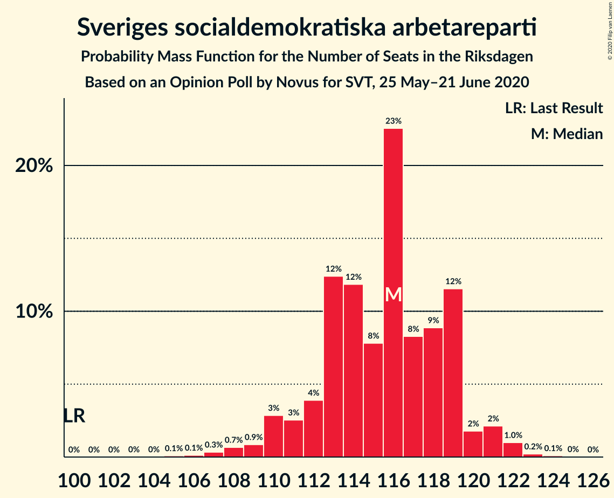
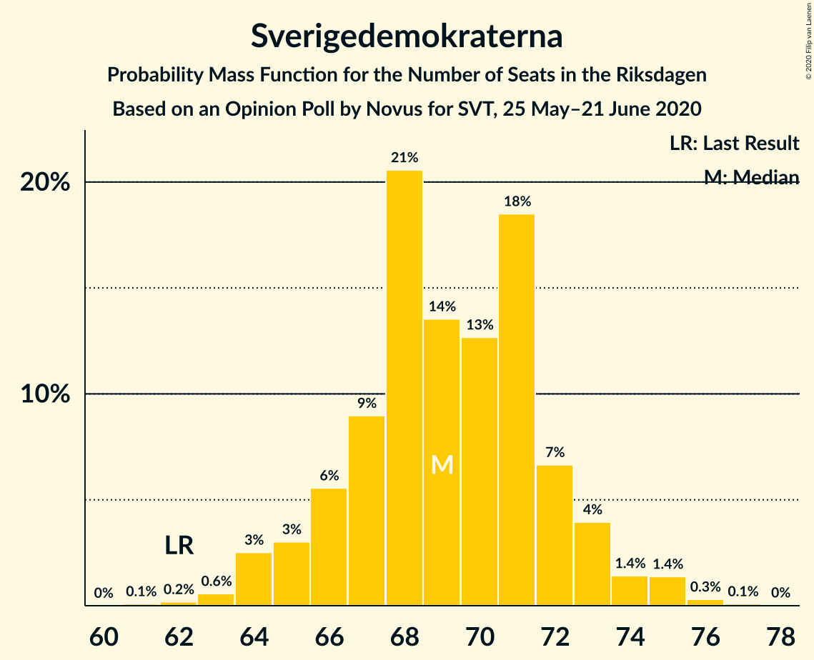
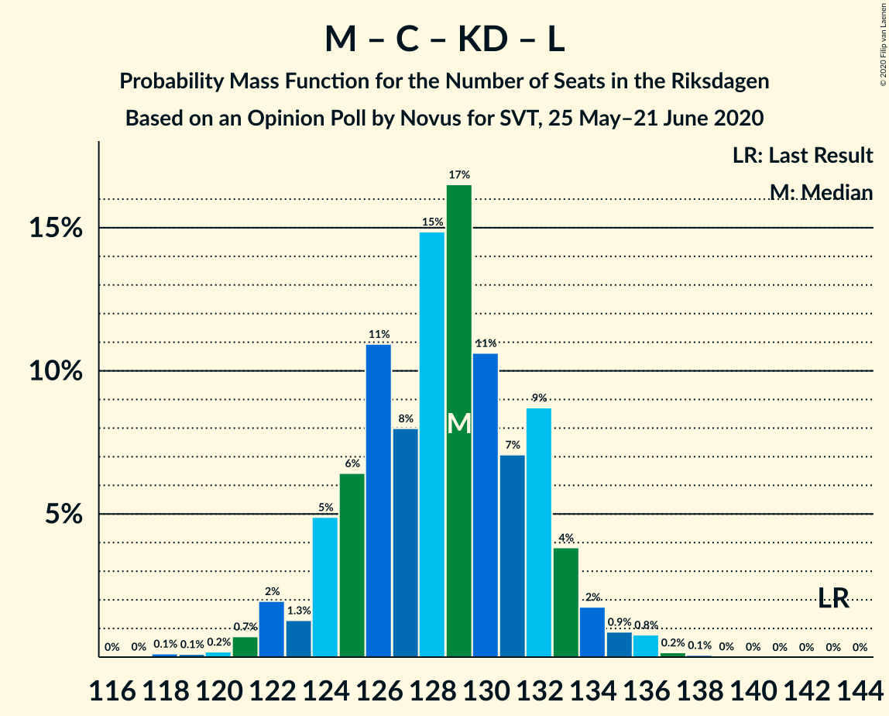
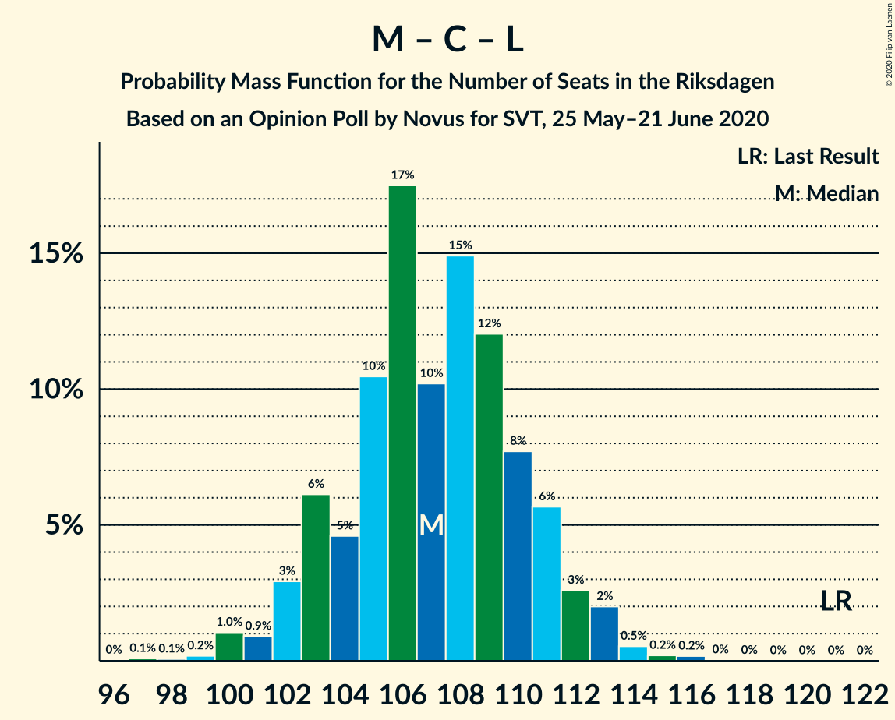

# Opinion Poll by Novus for SVT, 25 May–21 June 2020

<a href="#voting-intentions">Voting Intentions</a> | <a href="#seats">Seats</a> | <a href="#coalitions">Coalitions</a> | <a href="#technical-information">Technical Information</a>

## Voting Intentions

### Confidence Intervals

| Party | Last Result | Poll Result | 80% Confidence Interval | 90% Confidence Interval | 95% Confidence Interval | 99% Confidence Interval |
|:-----:|:-----------:|:-----------:|:-----------------------:|:-----------------------:|:-----------------------:|:-----------------------:|
| Sveriges socialdemokratiska arbetareparti | 28.3% | 30.6% | 29.6–31.6% |29.4–31.8% |29.1–32.1% |28.7–32.6% |
| Moderata samlingspartiet | 19.8% | 20.7% | 19.9–21.6% |19.6–21.8% |19.4–22.0% |19.1–22.5% |
| Sverigedemokraterna | 17.5% | 18.4% | 17.6–19.2% |17.4–19.5% |17.2–19.7% |16.8–20.1% |
| Vänsterpartiet | 8.0% | 9.4% | 8.8–10.0% |8.6–10.2% |8.5–10.4% |8.2–10.7% |
| Centerpartiet | 8.6% | 7.8% | 7.3–8.4% |7.1–8.6% |7.0–8.7% |6.7–9.0% |
| Kristdemokraterna | 6.3% | 5.7% | 5.2–6.2% |5.1–6.4% |5.0–6.5% |4.8–6.7% |
| Miljöpartiet de gröna | 4.4% | 3.4% | 3.0–3.8% |3.0–3.9% |2.9–4.0% |2.7–4.3% |
| Liberalerna | 5.5% | 3.0% | 2.7–3.4% |2.6–3.5% |2.5–3.6% |2.3–3.8% |

*Note:* The poll result column reflects the actual value used in the calculations. Published results may vary slightly, and in addition be rounded to fewer digits.

## Seats

### Confidence Intervals

| Party | Last Result | Median | 80% Confidence Interval | 90% Confidence Interval | 95% Confidence Interval | 99% Confidence Interval |
|:-----:|:-----------:|:------:|:-----------------------:|:-----------------------:|:-----------------------:|:-----------------------:|
| <a href="#sveriges-socialdemokratiska-arbetareparti">Sveriges socialdemokratiska arbetareparti</a> | 100 | 118 | 113–121 |112–121 |109–121 |107–123 |
| <a href="#moderata-samlingspartiet">Moderata samlingspartiet</a> | 70 | 77 | 75–81 |75–81 |73–83 |72–84 |
| <a href="#sverigedemokraterna">Sverigedemokraterna</a> | 62 | 68 | 66–72 |65–72 |64–73 |63–75 |
| <a href="#vänsterpartiet">Vänsterpartiet</a> | 28 | 35 | 33–37 |33–38 |33–39 |32–40 |
| <a href="#centerpartiet">Centerpartiet</a> | 31 | 29 | 27–31 |27–32 |26–32 |25–33 |
| <a href="#kristdemokraterna">Kristdemokraterna</a> | 22 | 20 | 19–22 |19–24 |19–24 |18–26 |
| <a href="#miljöpartiet-de-gröna">Miljöpartiet de gröna</a> | 16 | 0 | 0 |0 |0 |0–15 |
| <a href="#liberalerna">Liberalerna</a> | 20 | 0 | 0 |0 |0 |0 |

### Sveriges socialdemokratiska arbetareparti

*For a full overview of the results for this party, see the [Sveriges socialdemokratiska arbetareparti](party-sverigessocialdemokratiskaarbetareparti.html) page.*

| Number of Seats | Probability | Accumulated | Special Marks |
|:---------------:|:-----------:|:-----------:|:-------------:|
| 100 | 0% | 100% | Last Result |
| 101 | 0% | 100% |  |
| 102 | 0% | 100% |  |
| 103 | 0% | 100% |  |
| 104 | 0% | 100% |  |
| 105 | 0.1% | 100% |  |
| 106 | 0.1% | 99.9% |  |
| 107 | 0.5% | 99.9% |  |
| 108 | 0.1% | 99.4% |  |
| 109 | 2% | 99.3% |  |
| 110 | 1.3% | 97% |  |
| 111 | 0.6% | 96% |  |
| 112 | 4% | 95% |  |
| 113 | 3% | 91% |  |
| 114 | 2% | 88% |  |
| 115 | 13% | 86% |  |
| 116 | 10% | 73% |  |
| 117 | 3% | 63% |  |
| 118 | 42% | 60% | Median |
| 119 | 7% | 19% |  |
| 120 | 1.5% | 12% |  |
| 121 | 9% | 10% |  |
| 122 | 0.1% | 1.1% |  |
| 123 | 0.6% | 1.0% |  |
| 124 | 0.3% | 0.4% |  |
| 125 | 0% | 0% |  |

### Moderata samlingspartiet

*For a full overview of the results for this party, see the [Moderata samlingspartiet](party-moderatasamlingspartiet.html) page.*

| Number of Seats | Probability | Accumulated | Special Marks |
|:---------------:|:-----------:|:-----------:|:-------------:|
| 70 | 0% | 100% | Last Result |
| 71 | 0.1% | 99.9% |  |
| 72 | 0.8% | 99.9% |  |
| 73 | 2% | 99.1% |  |
| 74 | 2% | 97% |  |
| 75 | 8% | 95% |  |
| 76 | 12% | 88% |  |
| 77 | 30% | 76% | Median |
| 78 | 19% | 46% |  |
| 79 | 9% | 27% |  |
| 80 | 6% | 18% |  |
| 81 | 8% | 12% |  |
| 82 | 2% | 4% |  |
| 83 | 1.3% | 3% |  |
| 84 | 1.1% | 1.3% |  |
| 85 | 0.1% | 0.2% |  |
| 86 | 0% | 0.1% |  |
| 87 | 0% | 0% |  |

### Sverigedemokraterna

*For a full overview of the results for this party, see the [Sverigedemokraterna](party-sverigedemokraterna.html) page.*

| Number of Seats | Probability | Accumulated | Special Marks |
|:---------------:|:-----------:|:-----------:|:-------------:|
| 61 | 0.1% | 100% |  |
| 62 | 0.3% | 99.9% | Last Result |
| 63 | 0.8% | 99.6% |  |
| 64 | 1.4% | 98.8% |  |
| 65 | 3% | 97% |  |
| 66 | 9% | 94% |  |
| 67 | 9% | 85% |  |
| 68 | 35% | 76% | Median |
| 69 | 9% | 41% |  |
| 70 | 8% | 31% |  |
| 71 | 9% | 24% |  |
| 72 | 10% | 14% |  |
| 73 | 2% | 4% |  |
| 74 | 1.1% | 2% |  |
| 75 | 0.6% | 0.9% |  |
| 76 | 0.1% | 0.2% |  |
| 77 | 0.1% | 0.1% |  |
| 78 | 0% | 0% |  |

### Vänsterpartiet

*For a full overview of the results for this party, see the [Vänsterpartiet](party-vänsterpartiet.html) page.*

| Number of Seats | Probability | Accumulated | Special Marks |
|:---------------:|:-----------:|:-----------:|:-------------:|
| 28 | 0% | 100% | Last Result |
| 29 | 0% | 100% |  |
| 30 | 0.1% | 100% |  |
| 31 | 0.4% | 99.9% |  |
| 32 | 2% | 99.5% |  |
| 33 | 11% | 98% |  |
| 34 | 11% | 87% |  |
| 35 | 30% | 76% | Median |
| 36 | 27% | 46% |  |
| 37 | 12% | 19% |  |
| 38 | 4% | 7% |  |
| 39 | 2% | 3% |  |
| 40 | 0.7% | 0.9% |  |
| 41 | 0.2% | 0.2% |  |
| 42 | 0.1% | 0.1% |  |
| 43 | 0% | 0% |  |

### Centerpartiet

*For a full overview of the results for this party, see the [Centerpartiet](party-centerpartiet.html) page.*

| Number of Seats | Probability | Accumulated | Special Marks |
|:---------------:|:-----------:|:-----------:|:-------------:|
| 24 | 0.2% | 100% |  |
| 25 | 2% | 99.8% |  |
| 26 | 1.4% | 98% |  |
| 27 | 23% | 97% |  |
| 28 | 4% | 74% |  |
| 29 | 21% | 70% | Median |
| 30 | 8% | 49% |  |
| 31 | 32% | 41% | Last Result |
| 32 | 7% | 8% |  |
| 33 | 1.2% | 1.5% |  |
| 34 | 0.1% | 0.2% |  |
| 35 | 0.1% | 0.1% |  |
| 36 | 0% | 0% |  |

### Kristdemokraterna

*For a full overview of the results for this party, see the [Kristdemokraterna](party-kristdemokraterna.html) page.*

| Number of Seats | Probability | Accumulated | Special Marks |
|:---------------:|:-----------:|:-----------:|:-------------:|
| 17 | 0.2% | 100% |  |
| 18 | 2% | 99.8% |  |
| 19 | 11% | 98% |  |
| 20 | 41% | 86% | Median |
| 21 | 25% | 46% |  |
| 22 | 11% | 21% | Last Result |
| 23 | 2% | 10% |  |
| 24 | 6% | 7% |  |
| 25 | 0.5% | 1.2% |  |
| 26 | 0.5% | 0.6% |  |
| 27 | 0.1% | 0.1% |  |
| 28 | 0% | 0% |  |

### Miljöpartiet de gröna

*For a full overview of the results for this party, see the [Miljöpartiet de gröna](party-miljöpartietdegröna.html) page.*

| Number of Seats | Probability | Accumulated | Special Marks |
|:---------------:|:-----------:|:-----------:|:-------------:|
| 0 | 98% | 100% | Median |
| 1 | 0% | 2% |  |
| 2 | 0% | 2% |  |
| 3 | 0% | 2% |  |
| 4 | 0% | 2% |  |
| 5 | 0% | 2% |  |
| 6 | 0% | 2% |  |
| 7 | 0% | 2% |  |
| 8 | 0% | 2% |  |
| 9 | 0% | 2% |  |
| 10 | 0% | 2% |  |
| 11 | 0% | 2% |  |
| 12 | 0% | 2% |  |
| 13 | 0% | 2% |  |
| 14 | 0% | 2% |  |
| 15 | 2% | 2% |  |
| 16 | 0.5% | 0.5% | Last Result |
| 17 | 0% | 0% |  |

### Liberalerna

*For a full overview of the results for this party, see the [Liberalerna](party-liberalerna.html) page.*

| Number of Seats | Probability | Accumulated | Special Marks |
|:---------------:|:-----------:|:-----------:|:-------------:|
| 0 | 100% | 100% | Median |
| 1 | 0% | 0% |  |
| 2 | 0% | 0% |  |
| 3 | 0% | 0% |  |
| 4 | 0% | 0% |  |
| 5 | 0% | 0% |  |
| 6 | 0% | 0% |  |
| 7 | 0% | 0% |  |
| 8 | 0% | 0% |  |
| 9 | 0% | 0% |  |
| 10 | 0% | 0% |  |
| 11 | 0% | 0% |  |
| 12 | 0% | 0% |  |
| 13 | 0% | 0% |  |
| 14 | 0% | 0% |  |
| 15 | 0% | 0% |  |
| 16 | 0% | 0% |  |
| 17 | 0% | 0% |  |
| 18 | 0% | 0% |  |
| 19 | 0% | 0% |  |
| 20 | 0% | 0% | Last Result |

## Coalitions

### Confidence Intervals

| Coalition | Last Result | Median | Majority? | 80% Confidence Interval | 90% Confidence Interval | 95% Confidence Interval | 99% Confidence Interval |
|:---------:|:-----------:|:------:|:---------:|:-----------------------:|:-----------------------:|:-----------------------:|:-----------------------:|
| Sveriges socialdemokratiska arbetareparti – Moderata samlingspartiet – Centerpartiet | 201 | 224 | 100% | 220–228 | 218–229 | 217–230 | 213–230 |
| Sveriges socialdemokratiska arbetareparti – Moderata samlingspartiet | 170 | 195 | 100% | 191–199 | 188–199 | 187–200 | 184–201 |
| Sveriges socialdemokratiska arbetareparti – Vänsterpartiet – Centerpartiet – Miljöpartiet de gröna – Liberalerna | 195 | 182 | 98% | 178–186 | 176–186 | 175–187 | 173–191 |
| Moderata samlingspartiet – Sverigedemokraterna – Kristdemokraterna | 154 | 167 | 2% | 163–171 | 163–173 | 162–174 | 158–176 |
| Sveriges socialdemokratiska arbetareparti – Vänsterpartiet – Miljöpartiet de gröna | 144 | 153 | 0% | 149–155 | 147–157 | 145–158 | 142–163 |
| Sveriges socialdemokratiska arbetareparti – Vänsterpartiet | 128 | 153 | 0% | 148–155 | 146–156 | 144–157 | 142–159 |
| Moderata samlingspartiet – Sverigedemokraterna | 132 | 146 | 0% | 142–150 | 142–151 | 141–152 | 138–155 |
| Sveriges socialdemokratiska arbetareparti – Centerpartiet – Miljöpartiet de gröna – Liberalerna | 167 | 147 | 0% | 142–150 | 140–152 | 140–152 | 138–156 |
| Moderata samlingspartiet – Centerpartiet – Kristdemokraterna – Liberalerna | 143 | 128 | 0% | 125–132 | 124–133 | 123–134 | 120–136 |
| Moderata samlingspartiet – Centerpartiet – Kristdemokraterna | 123 | 128 | 0% | 125–132 | 124–133 | 123–134 | 120–136 |
| Sveriges socialdemokratiska arbetareparti – Miljöpartiet de gröna | 116 | 118 | 0% | 113–121 | 112–121 | 110–123 | 109–129 |
| Moderata samlingspartiet – Centerpartiet – Liberalerna | 121 | 107 | 0% | 104–111 | 103–111 | 102–112 | 100–114 |
| Moderata samlingspartiet – Centerpartiet | 101 | 107 | 0% | 104–111 | 103–111 | 102–112 | 100–114 |

### Sveriges socialdemokratiska arbetareparti – Moderata samlingspartiet – Centerpartiet

| Number of Seats | Probability | Accumulated | Special Marks |
|:---------------:|:-----------:|:-----------:|:-------------:|
| 201 | 0% | 100% | Last Result |
| 202 | 0% | 100% |  |
| 203 | 0% | 100% |  |
| 204 | 0% | 100% |  |
| 205 | 0% | 100% |  |
| 206 | 0% | 100% |  |
| 207 | 0% | 100% |  |
| 208 | 0% | 99.9% |  |
| 209 | 0.1% | 99.9% |  |
| 210 | 0% | 99.9% |  |
| 211 | 0.1% | 99.8% |  |
| 212 | 0.1% | 99.7% |  |
| 213 | 0.4% | 99.6% |  |
| 214 | 0.5% | 99.2% |  |
| 215 | 0.5% | 98.7% |  |
| 216 | 0.6% | 98% |  |
| 217 | 2% | 98% |  |
| 218 | 2% | 96% |  |
| 219 | 3% | 94% |  |
| 220 | 1.2% | 91% |  |
| 221 | 11% | 90% |  |
| 222 | 11% | 79% |  |
| 223 | 7% | 68% |  |
| 224 | 17% | 60% | Median |
| 225 | 2% | 43% |  |
| 226 | 23% | 41% |  |
| 227 | 3% | 18% |  |
| 228 | 8% | 15% |  |
| 229 | 4% | 7% |  |
| 230 | 2% | 3% |  |
| 231 | 0.1% | 0.2% |  |
| 232 | 0% | 0.1% |  |
| 233 | 0% | 0% |  |

### Sveriges socialdemokratiska arbetareparti – Moderata samlingspartiet

| Number of Seats | Probability | Accumulated | Special Marks |
|:---------------:|:-----------:|:-----------:|:-------------:|
| 170 | 0% | 100% | Last Result |
| 171 | 0% | 100% |  |
| 172 | 0% | 100% |  |
| 173 | 0% | 100% |  |
| 174 | 0% | 100% |  |
| 175 | 0% | 100% | Majority |
| 176 | 0% | 100% |  |
| 177 | 0% | 100% |  |
| 178 | 0% | 100% |  |
| 179 | 0% | 100% |  |
| 180 | 0.1% | 99.9% |  |
| 181 | 0% | 99.9% |  |
| 182 | 0.1% | 99.9% |  |
| 183 | 0.1% | 99.8% |  |
| 184 | 0.3% | 99.7% |  |
| 185 | 0.6% | 99.4% |  |
| 186 | 0.9% | 98.8% |  |
| 187 | 0.6% | 98% |  |
| 188 | 2% | 97% |  |
| 189 | 2% | 95% |  |
| 190 | 3% | 93% |  |
| 191 | 2% | 91% |  |
| 192 | 7% | 88% |  |
| 193 | 7% | 82% |  |
| 194 | 13% | 74% |  |
| 195 | 31% | 61% | Median |
| 196 | 8% | 30% |  |
| 197 | 8% | 22% |  |
| 198 | 3% | 13% |  |
| 199 | 6% | 10% |  |
| 200 | 2% | 4% |  |
| 201 | 2% | 2% |  |
| 202 | 0.2% | 0.3% |  |
| 203 | 0.1% | 0.1% |  |
| 204 | 0% | 0% |  |

### Sveriges socialdemokratiska arbetareparti – Vänsterpartiet – Centerpartiet – Miljöpartiet de gröna – Liberalerna

| Number of Seats | Probability | Accumulated | Special Marks |
|:---------------:|:-----------:|:-----------:|:-------------:|
| 171 | 0.3% | 100% |  |
| 172 | 0.1% | 99.7% |  |
| 173 | 0.6% | 99.6% |  |
| 174 | 0.8% | 99.0% |  |
| 175 | 2% | 98% | Majority |
| 176 | 2% | 96% |  |
| 177 | 0.9% | 94% |  |
| 178 | 5% | 93% |  |
| 179 | 14% | 88% |  |
| 180 | 4% | 74% |  |
| 181 | 12% | 70% |  |
| 182 | 12% | 59% | Median |
| 183 | 4% | 47% |  |
| 184 | 29% | 43% |  |
| 185 | 2% | 14% |  |
| 186 | 8% | 12% |  |
| 187 | 2% | 4% |  |
| 188 | 0.6% | 2% |  |
| 189 | 0.7% | 1.5% |  |
| 190 | 0.2% | 0.8% |  |
| 191 | 0.1% | 0.5% |  |
| 192 | 0.4% | 0.4% |  |
| 193 | 0% | 0.1% |  |
| 194 | 0% | 0% |  |
| 195 | 0% | 0% | Last Result |

### Moderata samlingspartiet – Sverigedemokraterna – Kristdemokraterna

| Number of Seats | Probability | Accumulated | Special Marks |
|:---------------:|:-----------:|:-----------:|:-------------:|
| 154 | 0% | 100% | Last Result |
| 155 | 0% | 100% |  |
| 156 | 0% | 100% |  |
| 157 | 0.4% | 99.9% |  |
| 158 | 0.1% | 99.6% |  |
| 159 | 0.2% | 99.5% |  |
| 160 | 0.7% | 99.2% |  |
| 161 | 0.6% | 98.5% |  |
| 162 | 2% | 98% |  |
| 163 | 8% | 96% |  |
| 164 | 2% | 88% |  |
| 165 | 29% | 86% | Median |
| 166 | 4% | 57% |  |
| 167 | 12% | 53% |  |
| 168 | 12% | 41% |  |
| 169 | 4% | 30% |  |
| 170 | 14% | 26% |  |
| 171 | 5% | 12% |  |
| 172 | 0.9% | 7% |  |
| 173 | 2% | 6% |  |
| 174 | 2% | 4% |  |
| 175 | 0.8% | 2% | Majority |
| 176 | 0.6% | 1.0% |  |
| 177 | 0.1% | 0.4% |  |
| 178 | 0.3% | 0.3% |  |
| 179 | 0% | 0% |  |

### Sveriges socialdemokratiska arbetareparti – Vänsterpartiet – Miljöpartiet de gröna

| Number of Seats | Probability | Accumulated | Special Marks |
|:---------------:|:-----------:|:-----------:|:-------------:|
| 140 | 0% | 100% |  |
| 141 | 0.2% | 99.9% |  |
| 142 | 0.3% | 99.7% |  |
| 143 | 0.2% | 99.4% |  |
| 144 | 1.3% | 99.3% | Last Result |
| 145 | 0.9% | 98% |  |
| 146 | 1.4% | 97% |  |
| 147 | 0.8% | 96% |  |
| 148 | 4% | 95% |  |
| 149 | 5% | 91% |  |
| 150 | 8% | 86% |  |
| 151 | 8% | 78% |  |
| 152 | 10% | 71% |  |
| 153 | 23% | 61% | Median |
| 154 | 10% | 37% |  |
| 155 | 20% | 27% |  |
| 156 | 2% | 7% |  |
| 157 | 2% | 5% |  |
| 158 | 0.9% | 3% |  |
| 159 | 0.9% | 2% |  |
| 160 | 0.1% | 1.3% |  |
| 161 | 0.3% | 1.2% |  |
| 162 | 0.3% | 0.9% |  |
| 163 | 0.2% | 0.6% |  |
| 164 | 0.2% | 0.4% |  |
| 165 | 0.2% | 0.2% |  |
| 166 | 0% | 0% |  |

### Sveriges socialdemokratiska arbetareparti – Vänsterpartiet

| Number of Seats | Probability | Accumulated | Special Marks |
|:---------------:|:-----------:|:-----------:|:-------------:|
| 128 | 0% | 100% | Last Result |
| 129 | 0% | 100% |  |
| 130 | 0% | 100% |  |
| 131 | 0% | 100% |  |
| 132 | 0% | 100% |  |
| 133 | 0% | 100% |  |
| 134 | 0% | 100% |  |
| 135 | 0% | 100% |  |
| 136 | 0% | 100% |  |
| 137 | 0% | 100% |  |
| 138 | 0.1% | 100% |  |
| 139 | 0.1% | 99.9% |  |
| 140 | 0.1% | 99.8% |  |
| 141 | 0.2% | 99.8% |  |
| 142 | 0.7% | 99.5% |  |
| 143 | 0.3% | 98.8% |  |
| 144 | 1.4% | 98.5% |  |
| 145 | 1.0% | 97% |  |
| 146 | 2% | 96% |  |
| 147 | 1.0% | 95% |  |
| 148 | 4% | 94% |  |
| 149 | 5% | 89% |  |
| 150 | 8% | 84% |  |
| 151 | 8% | 76% |  |
| 152 | 10% | 69% |  |
| 153 | 23% | 59% | Median |
| 154 | 10% | 36% |  |
| 155 | 20% | 25% |  |
| 156 | 2% | 5% |  |
| 157 | 2% | 4% |  |
| 158 | 0.8% | 2% |  |
| 159 | 0.8% | 0.8% |  |
| 160 | 0% | 0.1% |  |
| 161 | 0% | 0% |  |

### Moderata samlingspartiet – Sverigedemokraterna

| Number of Seats | Probability | Accumulated | Special Marks |
|:---------------:|:-----------:|:-----------:|:-------------:|
| 132 | 0% | 100% | Last Result |
| 133 | 0% | 100% |  |
| 134 | 0% | 100% |  |
| 135 | 0% | 100% |  |
| 136 | 0.2% | 100% |  |
| 137 | 0.1% | 99.7% |  |
| 138 | 0.3% | 99.7% |  |
| 139 | 0.7% | 99.3% |  |
| 140 | 0.2% | 98.6% |  |
| 141 | 3% | 98% |  |
| 142 | 8% | 95% |  |
| 143 | 0.8% | 88% |  |
| 144 | 1.0% | 87% |  |
| 145 | 28% | 86% | Median |
| 146 | 25% | 58% |  |
| 147 | 1.5% | 33% |  |
| 148 | 2% | 31% |  |
| 149 | 9% | 29% |  |
| 150 | 15% | 20% |  |
| 151 | 2% | 5% |  |
| 152 | 0.5% | 3% |  |
| 153 | 0.8% | 2% |  |
| 154 | 0.9% | 2% |  |
| 155 | 0.7% | 0.7% |  |
| 156 | 0% | 0.1% |  |
| 157 | 0% | 0% |  |

### Sveriges socialdemokratiska arbetareparti – Centerpartiet – Miljöpartiet de gröna – Liberalerna

| Number of Seats | Probability | Accumulated | Special Marks |
|:---------------:|:-----------:|:-----------:|:-------------:|
| 135 | 0% | 100% |  |
| 136 | 0.1% | 99.9% |  |
| 137 | 0.3% | 99.9% |  |
| 138 | 0.4% | 99.6% |  |
| 139 | 0.7% | 99.2% |  |
| 140 | 4% | 98.5% |  |
| 141 | 1.4% | 94% |  |
| 142 | 3% | 93% |  |
| 143 | 10% | 90% |  |
| 144 | 5% | 80% |  |
| 145 | 11% | 75% |  |
| 146 | 8% | 64% |  |
| 147 | 15% | 55% | Median |
| 148 | 5% | 40% |  |
| 149 | 21% | 35% |  |
| 150 | 5% | 14% |  |
| 151 | 1.4% | 9% |  |
| 152 | 5% | 8% |  |
| 153 | 0.5% | 2% |  |
| 154 | 0.6% | 2% |  |
| 155 | 0.3% | 1.0% |  |
| 156 | 0.2% | 0.7% |  |
| 157 | 0.3% | 0.5% |  |
| 158 | 0.2% | 0.2% |  |
| 159 | 0% | 0.1% |  |
| 160 | 0% | 0% |  |
| 161 | 0% | 0% |  |
| 162 | 0% | 0% |  |
| 163 | 0% | 0% |  |
| 164 | 0% | 0% |  |
| 165 | 0% | 0% |  |
| 166 | 0% | 0% |  |
| 167 | 0% | 0% | Last Result |

### Moderata samlingspartiet – Centerpartiet – Kristdemokraterna – Liberalerna

| Number of Seats | Probability | Accumulated | Special Marks |
|:---------------:|:-----------:|:-----------:|:-------------:|
| 117 | 0% | 100% |  |
| 118 | 0.3% | 99.9% |  |
| 119 | 0.1% | 99.6% |  |
| 120 | 0.4% | 99.6% |  |
| 121 | 0.7% | 99.2% |  |
| 122 | 0.9% | 98% |  |
| 123 | 0.6% | 98% |  |
| 124 | 7% | 97% |  |
| 125 | 14% | 90% |  |
| 126 | 11% | 76% | Median |
| 127 | 10% | 65% |  |
| 128 | 25% | 55% |  |
| 129 | 6% | 30% |  |
| 130 | 7% | 24% |  |
| 131 | 5% | 17% |  |
| 132 | 7% | 13% |  |
| 133 | 1.3% | 5% |  |
| 134 | 2% | 4% |  |
| 135 | 1.2% | 2% |  |
| 136 | 0.4% | 0.6% |  |
| 137 | 0.2% | 0.2% |  |
| 138 | 0% | 0.1% |  |
| 139 | 0% | 0% |  |
| 140 | 0% | 0% |  |
| 141 | 0% | 0% |  |
| 142 | 0% | 0% |  |
| 143 | 0% | 0% | Last Result |

### Moderata samlingspartiet – Centerpartiet – Kristdemokraterna

| Number of Seats | Probability | Accumulated | Special Marks |
|:---------------:|:-----------:|:-----------:|:-------------:|
| 117 | 0% | 100% |  |
| 118 | 0.3% | 99.9% |  |
| 119 | 0.1% | 99.6% |  |
| 120 | 0.4% | 99.6% |  |
| 121 | 0.7% | 99.2% |  |
| 122 | 0.9% | 98% |  |
| 123 | 0.6% | 98% | Last Result |
| 124 | 7% | 97% |  |
| 125 | 14% | 90% |  |
| 126 | 11% | 76% | Median |
| 127 | 10% | 65% |  |
| 128 | 25% | 55% |  |
| 129 | 6% | 30% |  |
| 130 | 7% | 24% |  |
| 131 | 5% | 17% |  |
| 132 | 7% | 12% |  |
| 133 | 1.3% | 5% |  |
| 134 | 2% | 4% |  |
| 135 | 1.2% | 2% |  |
| 136 | 0.4% | 0.6% |  |
| 137 | 0.2% | 0.2% |  |
| 138 | 0% | 0.1% |  |
| 139 | 0% | 0% |  |

### Sveriges socialdemokratiska arbetareparti – Miljöpartiet de gröna

| Number of Seats | Probability | Accumulated | Special Marks |
|:---------------:|:-----------:|:-----------:|:-------------:|
| 107 | 0.3% | 100% |  |
| 108 | 0.1% | 99.7% |  |
| 109 | 2% | 99.6% |  |
| 110 | 0.7% | 98% |  |
| 111 | 0.5% | 97% |  |
| 112 | 4% | 97% |  |
| 113 | 3% | 92% |  |
| 114 | 2% | 89% |  |
| 115 | 13% | 88% |  |
| 116 | 10% | 75% | Last Result |
| 117 | 3% | 65% |  |
| 118 | 42% | 62% | Median |
| 119 | 7% | 21% |  |
| 120 | 2% | 14% |  |
| 121 | 9% | 12% |  |
| 122 | 0.3% | 3% |  |
| 123 | 0.6% | 3% |  |
| 124 | 0.4% | 2% |  |
| 125 | 0.5% | 2% |  |
| 126 | 0.2% | 1.1% |  |
| 127 | 0.1% | 0.9% |  |
| 128 | 0.1% | 0.8% |  |
| 129 | 0.3% | 0.7% |  |
| 130 | 0.2% | 0.4% |  |
| 131 | 0.2% | 0.2% |  |
| 132 | 0% | 0% |  |

### Moderata samlingspartiet – Centerpartiet – Liberalerna

| Number of Seats | Probability | Accumulated | Special Marks |
|:---------------:|:-----------:|:-----------:|:-------------:|
| 98 | 0.1% | 100% |  |
| 99 | 0.3% | 99.9% |  |
| 100 | 0.5% | 99.6% |  |
| 101 | 0.8% | 99.0% |  |
| 102 | 0.9% | 98% |  |
| 103 | 7% | 97% |  |
| 104 | 3% | 91% |  |
| 105 | 15% | 87% |  |
| 106 | 17% | 72% | Median |
| 107 | 12% | 55% |  |
| 108 | 19% | 43% |  |
| 109 | 6% | 24% |  |
| 110 | 4% | 18% |  |
| 111 | 10% | 14% |  |
| 112 | 2% | 4% |  |
| 113 | 0.5% | 2% |  |
| 114 | 0.9% | 1.2% |  |
| 115 | 0.2% | 0.3% |  |
| 116 | 0.1% | 0.1% |  |
| 117 | 0% | 0.1% |  |
| 118 | 0% | 0% |  |
| 119 | 0% | 0% |  |
| 120 | 0% | 0% |  |
| 121 | 0% | 0% | Last Result |

### Moderata samlingspartiet – Centerpartiet

| Number of Seats | Probability | Accumulated | Special Marks |
|:---------------:|:-----------:|:-----------:|:-------------:|
| 98 | 0.1% | 100% |  |
| 99 | 0.3% | 99.9% |  |
| 100 | 0.5% | 99.6% |  |
| 101 | 0.8% | 99.0% | Last Result |
| 102 | 0.9% | 98% |  |
| 103 | 7% | 97% |  |
| 104 | 3% | 91% |  |
| 105 | 15% | 87% |  |
| 106 | 17% | 72% | Median |
| 107 | 12% | 55% |  |
| 108 | 19% | 43% |  |
| 109 | 6% | 24% |  |
| 110 | 4% | 17% |  |
| 111 | 10% | 14% |  |
| 112 | 2% | 4% |  |
| 113 | 0.5% | 2% |  |
| 114 | 0.9% | 1.2% |  |
| 115 | 0.2% | 0.3% |  |
| 116 | 0.1% | 0.1% |  |
| 117 | 0% | 0% |  |

## Technical Information

### Opinion Poll

+ **Polling firm:** Novus
+ **Commissioner(s):** SVT
+ **Fieldwork period:** 25 May–21 June 2020

### Calculations

+ **Sample size:** 3811
+ **Simulations done:** 131,072
+ **Error estimate:** 0.62%

