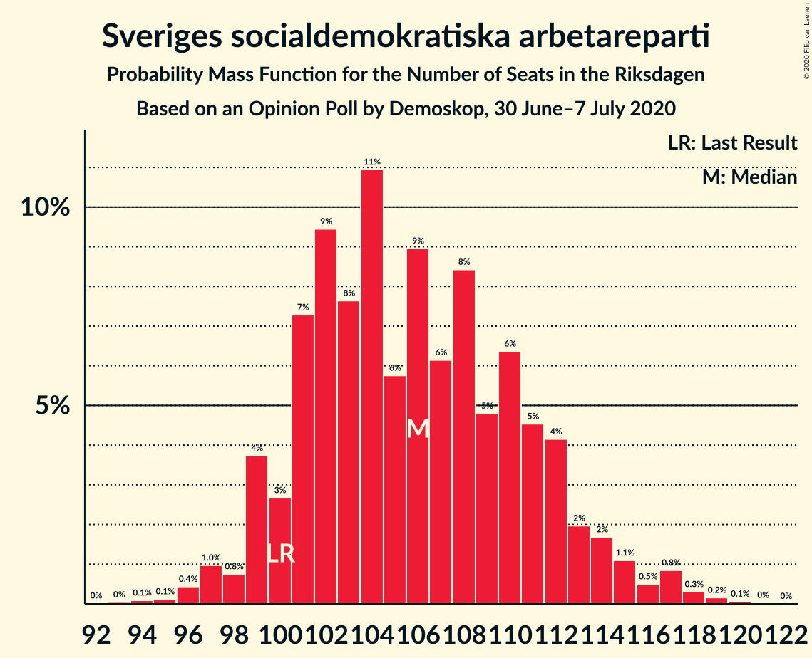
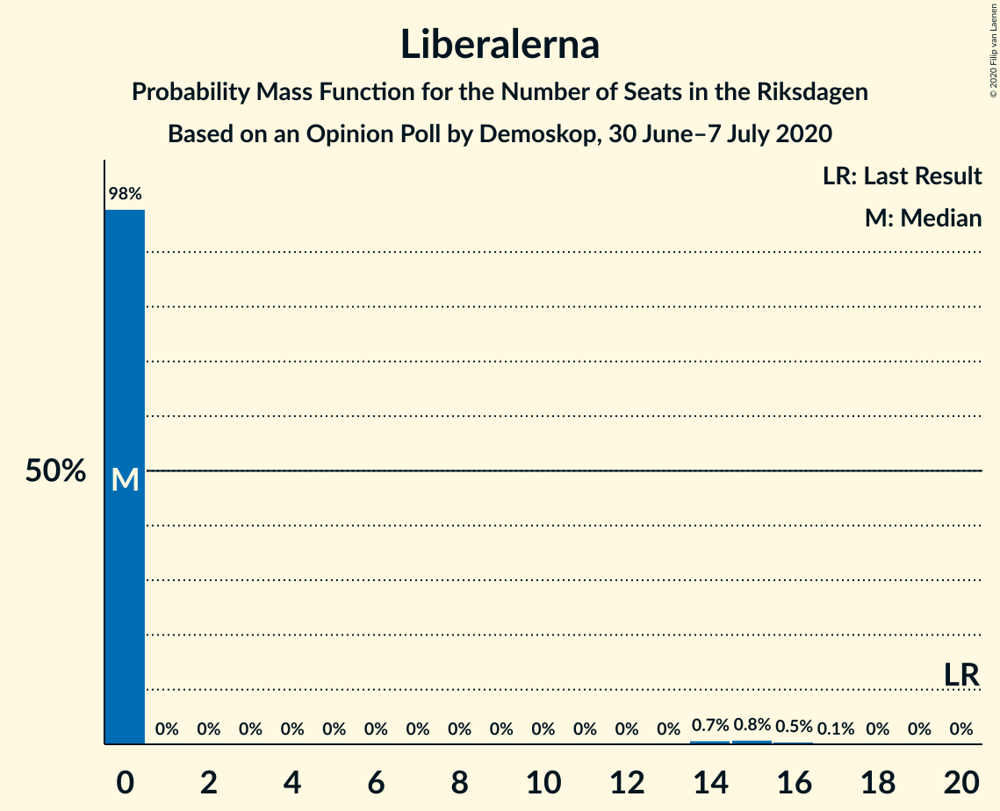
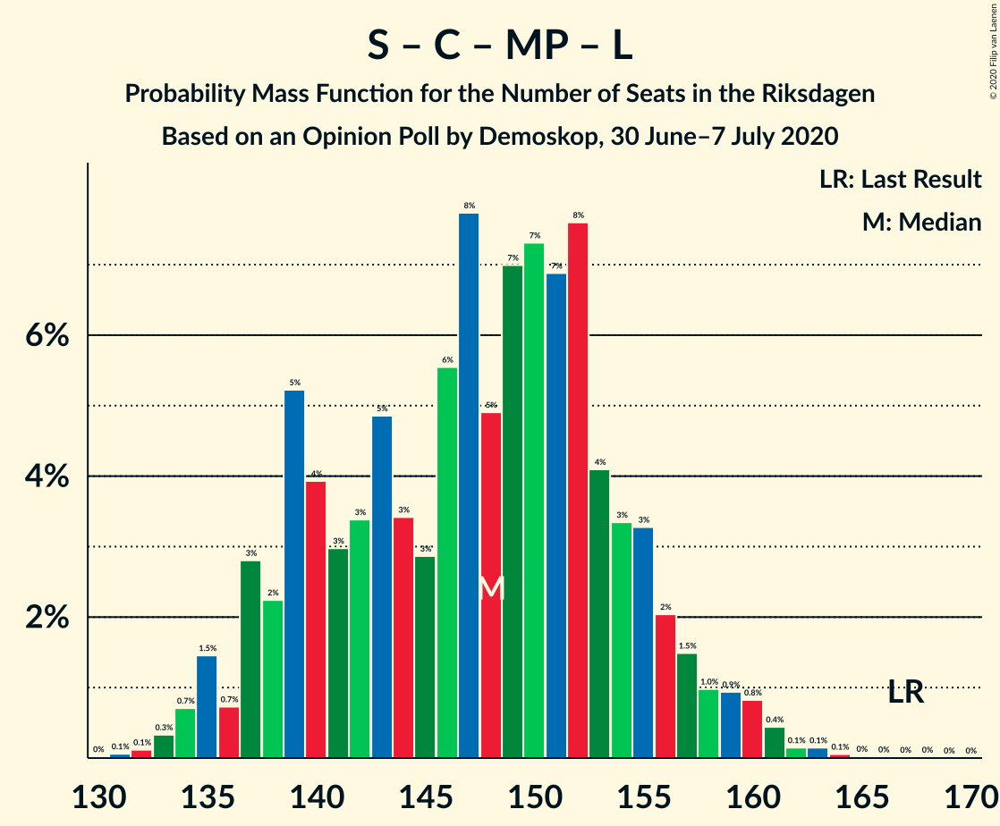
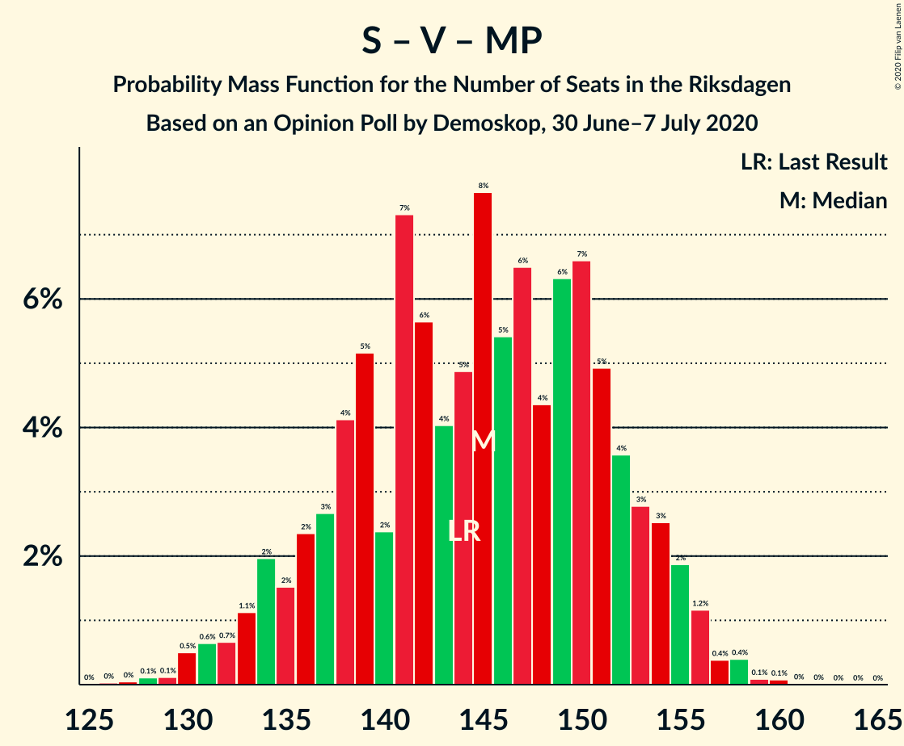
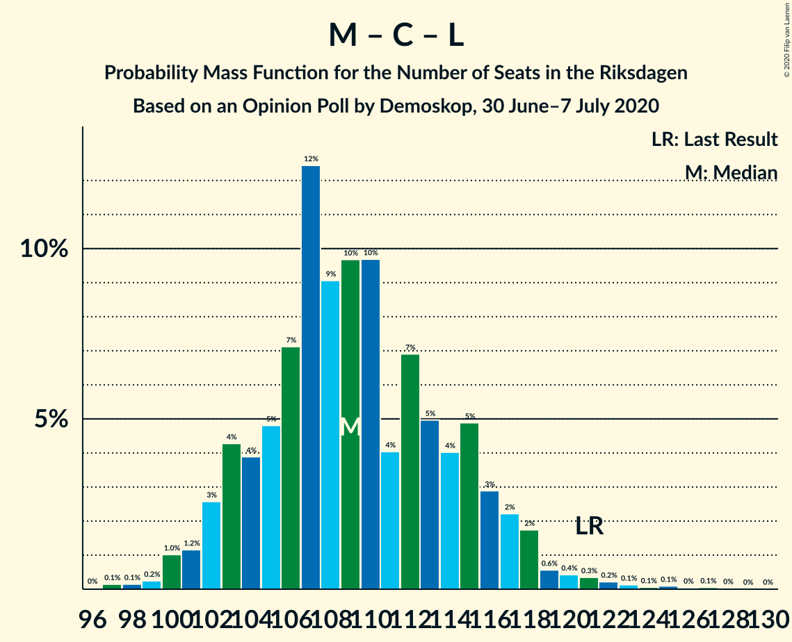

# Opinion Poll by Demoskop, 30 June–7 July 2020

<a href="#voting-intentions">Voting Intentions</a> | <a href="#seats">Seats</a> | <a href="#coalitions">Coalitions</a> | <a href="#technical-information">Technical Information</a>

## Voting Intentions

### Confidence Intervals

| Party | Last Result | Poll Result | 80% Confidence Interval | 90% Confidence Interval | 95% Confidence Interval | 99% Confidence Interval |
|:-----:|:-----------:|:-----------:|:-----------------------:|:-----------------------:|:-----------------------:|:-----------------------:|
| Sveriges socialdemokratiska arbetareparti | 28.3% | 28.5% | 27.3–29.7% |26.9–30.1% |26.6–30.4% |26.1–31.0% |
| Moderata samlingspartiet | 19.8% | 20.8% | 19.7–21.9% |19.4–22.3% |19.2–22.5% |18.7–23.1% |
| Sverigedemokraterna | 17.5% | 19.7% | 18.6–20.8% |18.3–21.1% |18.1–21.4% |17.6–21.9% |
| Centerpartiet | 8.6% | 8.4% | 7.7–9.2% |7.5–9.4% |7.3–9.6% |7.0–10.0% |
| Vänsterpartiet | 8.0% | 7.8% | 7.1–8.6% |6.9–8.8% |6.7–9.0% |6.4–9.4% |
| Kristdemokraterna | 6.3% | 5.7% | 5.1–6.4% |5.0–6.6% |4.8–6.8% |4.5–7.1% |
| Miljöpartiet de gröna | 4.4% | 4.1% | 3.6–4.7% |3.5–4.8% |3.3–5.0% |3.1–5.3% |
| Liberalerna | 5.5% | 3.2% | 2.8–3.7% |2.6–3.9% |2.5–4.0% |2.3–4.3% |

*Note:* The poll result column reflects the actual value used in the calculations. Published results may vary slightly, and in addition be rounded to fewer digits.

## Seats

### Confidence Intervals

| Party | Last Result | Median | 80% Confidence Interval | 90% Confidence Interval | 95% Confidence Interval | 99% Confidence Interval |
|:-----:|:-----------:|:------:|:-----------------------:|:-----------------------:|:-----------------------:|:-----------------------:|
| <a href="#sveriges-socialdemokratiska-arbetareparti">Sveriges socialdemokratiska arbetareparti</a> | 100 | 107 | 101–112 |99–112 |97–114 |96–119 |
| <a href="#moderata-samlingspartiet">Moderata samlingspartiet</a> | 70 | 79 | 72–84 |71–84 |71–84 |69–86 |
| <a href="#sverigedemokraterna">Sverigedemokraterna</a> | 62 | 74 | 71–79 |68–80 |67–80 |65–83 |
| <a href="#centerpartiet">Centerpartiet</a> | 31 | 31 | 29–34 |28–34 |27–36 |26–37 |
| <a href="#vänsterpartiet">Vänsterpartiet</a> | 28 | 30 | 27–32 |26–33 |25–33 |24–34 |
| <a href="#kristdemokraterna">Kristdemokraterna</a> | 22 | 22 | 19–23 |19–25 |19–25 |17–27 |
| <a href="#miljöpartiet-de-gröna">Miljöpartiet de gröna</a> | 16 | 0 | 0–17 |0–18 |0–19 |0–19 |
| <a href="#liberalerna">Liberalerna</a> | 20 | 0 | 0 |0 |0 |0–16 |

### Sveriges socialdemokratiska arbetareparti

*For a full overview of the results for this party, see the [Sveriges socialdemokratiska arbetareparti](party-sverigessocialdemokratiskaarbetareparti.html) page.*

| Number of Seats | Probability | Accumulated | Special Marks |
|:---------------:|:-----------:|:-----------:|:-------------:|
| 93 | 0% | 100% |  |
| 94 | 0.1% | 99.9% |  |
| 95 | 0.1% | 99.8% |  |
| 96 | 0.3% | 99.8% |  |
| 97 | 3% | 99.5% |  |
| 98 | 1.1% | 97% |  |
| 99 | 2% | 96% |  |
| 100 | 3% | 94% | Last Result |
| 101 | 2% | 91% |  |
| 102 | 3% | 90% |  |
| 103 | 4% | 87% |  |
| 104 | 4% | 82% |  |
| 105 | 3% | 78% |  |
| 106 | 15% | 75% |  |
| 107 | 16% | 60% | Median |
| 108 | 17% | 44% |  |
| 109 | 4% | 27% |  |
| 110 | 3% | 23% |  |
| 111 | 6% | 20% |  |
| 112 | 10% | 14% |  |
| 113 | 0.4% | 4% |  |
| 114 | 1.3% | 3% |  |
| 115 | 0.5% | 2% |  |
| 116 | 0.7% | 1.5% |  |
| 117 | 0% | 0.8% |  |
| 118 | 0.1% | 0.7% |  |
| 119 | 0.4% | 0.6% |  |
| 120 | 0.1% | 0.2% |  |
| 121 | 0% | 0.1% |  |
| 122 | 0% | 0.1% |  |
| 123 | 0.1% | 0.1% |  |
| 124 | 0% | 0% |  |

### Moderata samlingspartiet

*For a full overview of the results for this party, see the [Moderata samlingspartiet](party-moderatasamlingspartiet.html) page.*

| Number of Seats | Probability | Accumulated | Special Marks |
|:---------------:|:-----------:|:-----------:|:-------------:|
| 67 | 0.1% | 100% |  |
| 68 | 0.3% | 99.9% |  |
| 69 | 0.6% | 99.6% |  |
| 70 | 1.0% | 98.9% | Last Result |
| 71 | 7% | 98% |  |
| 72 | 12% | 91% |  |
| 73 | 2% | 79% |  |
| 74 | 4% | 76% |  |
| 75 | 4% | 73% |  |
| 76 | 5% | 68% |  |
| 77 | 3% | 63% |  |
| 78 | 4% | 60% |  |
| 79 | 9% | 55% | Median |
| 80 | 14% | 47% |  |
| 81 | 2% | 33% |  |
| 82 | 4% | 31% |  |
| 83 | 10% | 27% |  |
| 84 | 15% | 17% |  |
| 85 | 1.2% | 2% |  |
| 86 | 0.1% | 0.5% |  |
| 87 | 0.2% | 0.4% |  |
| 88 | 0.1% | 0.2% |  |
| 89 | 0% | 0% |  |

### Sverigedemokraterna

*For a full overview of the results for this party, see the [Sverigedemokraterna](party-sverigedemokraterna.html) page.*

| Number of Seats | Probability | Accumulated | Special Marks |
|:---------------:|:-----------:|:-----------:|:-------------:|
| 62 | 0% | 100% | Last Result |
| 63 | 0.1% | 100% |  |
| 64 | 0.3% | 99.9% |  |
| 65 | 0.2% | 99.6% |  |
| 66 | 1.0% | 99.4% |  |
| 67 | 1.3% | 98% |  |
| 68 | 3% | 97% |  |
| 69 | 2% | 94% |  |
| 70 | 1.3% | 92% |  |
| 71 | 7% | 91% |  |
| 72 | 24% | 84% |  |
| 73 | 9% | 60% |  |
| 74 | 14% | 50% | Median |
| 75 | 2% | 36% |  |
| 76 | 3% | 34% |  |
| 77 | 9% | 31% |  |
| 78 | 11% | 22% |  |
| 79 | 4% | 10% |  |
| 80 | 5% | 7% |  |
| 81 | 0.2% | 1.4% |  |
| 82 | 0.5% | 1.1% |  |
| 83 | 0.3% | 0.7% |  |
| 84 | 0.3% | 0.4% |  |
| 85 | 0% | 0% |  |

### Centerpartiet

*For a full overview of the results for this party, see the [Centerpartiet](party-centerpartiet.html) page.*

| Number of Seats | Probability | Accumulated | Special Marks |
|:---------------:|:-----------:|:-----------:|:-------------:|
| 25 | 0.2% | 100% |  |
| 26 | 2% | 99.8% |  |
| 27 | 2% | 98% |  |
| 28 | 3% | 96% |  |
| 29 | 12% | 93% |  |
| 30 | 11% | 80% |  |
| 31 | 33% | 69% | Last Result, Median |
| 32 | 15% | 36% |  |
| 33 | 10% | 21% |  |
| 34 | 6% | 11% |  |
| 35 | 1.2% | 4% |  |
| 36 | 2% | 3% |  |
| 37 | 1.2% | 1.5% |  |
| 38 | 0.2% | 0.3% |  |
| 39 | 0.1% | 0.1% |  |
| 40 | 0% | 0% |  |

### Vänsterpartiet

*For a full overview of the results for this party, see the [Vänsterpartiet](party-vänsterpartiet.html) page.*

| Number of Seats | Probability | Accumulated | Special Marks |
|:---------------:|:-----------:|:-----------:|:-------------:|
| 23 | 0.4% | 100% |  |
| 24 | 0.4% | 99.6% |  |
| 25 | 3% | 99.1% |  |
| 26 | 2% | 96% |  |
| 27 | 11% | 94% |  |
| 28 | 20% | 83% | Last Result |
| 29 | 5% | 63% |  |
| 30 | 26% | 58% | Median |
| 31 | 21% | 31% |  |
| 32 | 5% | 11% |  |
| 33 | 5% | 6% |  |
| 34 | 0.7% | 1.0% |  |
| 35 | 0.2% | 0.3% |  |
| 36 | 0.1% | 0.1% |  |
| 37 | 0% | 0.1% |  |
| 38 | 0% | 0% |  |

### Kristdemokraterna

*For a full overview of the results for this party, see the [Kristdemokraterna](party-kristdemokraterna.html) page.*

| Number of Seats | Probability | Accumulated | Special Marks |
|:---------------:|:-----------:|:-----------:|:-------------:|
| 16 | 0.2% | 100% |  |
| 17 | 0.4% | 99.7% |  |
| 18 | 1.4% | 99.3% |  |
| 19 | 21% | 98% |  |
| 20 | 13% | 77% |  |
| 21 | 9% | 63% |  |
| 22 | 16% | 54% | Last Result, Median |
| 23 | 29% | 37% |  |
| 24 | 3% | 9% |  |
| 25 | 3% | 5% |  |
| 26 | 1.4% | 2% |  |
| 27 | 0.5% | 0.7% |  |
| 28 | 0.1% | 0.1% |  |
| 29 | 0% | 0% |  |

### Miljöpartiet de gröna

*For a full overview of the results for this party, see the [Miljöpartiet de gröna](party-miljöpartietdegröna.html) page.*

| Number of Seats | Probability | Accumulated | Special Marks |
|:---------------:|:-----------:|:-----------:|:-------------:|
| 0 | 53% | 100% | Median |
| 1 | 0% | 47% |  |
| 2 | 0% | 47% |  |
| 3 | 0% | 47% |  |
| 4 | 0% | 47% |  |
| 5 | 0% | 47% |  |
| 6 | 0% | 47% |  |
| 7 | 0% | 47% |  |
| 8 | 0% | 47% |  |
| 9 | 0% | 47% |  |
| 10 | 0% | 47% |  |
| 11 | 0% | 47% |  |
| 12 | 0% | 47% |  |
| 13 | 0% | 47% |  |
| 14 | 0% | 47% |  |
| 15 | 10% | 47% |  |
| 16 | 24% | 37% | Last Result |
| 17 | 7% | 13% |  |
| 18 | 3% | 6% |  |
| 19 | 2% | 3% |  |
| 20 | 0.4% | 0.4% |  |
| 21 | 0% | 0% |  |

### Liberalerna

*For a full overview of the results for this party, see the [Liberalerna](party-liberalerna.html) page.*

| Number of Seats | Probability | Accumulated | Special Marks |
|:---------------:|:-----------:|:-----------:|:-------------:|
| 0 | 98% | 100% | Median |
| 1 | 0% | 2% |  |
| 2 | 0% | 2% |  |
| 3 | 0% | 2% |  |
| 4 | 0% | 2% |  |
| 5 | 0% | 2% |  |
| 6 | 0% | 2% |  |
| 7 | 0% | 2% |  |
| 8 | 0% | 2% |  |
| 9 | 0% | 2% |  |
| 10 | 0% | 2% |  |
| 11 | 0% | 2% |  |
| 12 | 0% | 2% |  |
| 13 | 0% | 2% |  |
| 14 | 0.3% | 2% |  |
| 15 | 0.8% | 1.4% |  |
| 16 | 0.4% | 0.6% |  |
| 17 | 0.2% | 0.2% |  |
| 18 | 0% | 0% |  |
| 19 | 0% | 0% |  |
| 20 | 0% | 0% | Last Result |

## Coalitions

### Confidence Intervals

| Coalition | Last Result | Median | Majority? | 80% Confidence Interval | 90% Confidence Interval | 95% Confidence Interval | 99% Confidence Interval |
|:---------:|:-----------:|:------:|:---------:|:-----------------------:|:-----------------------:|:-----------------------:|:-----------------------:|
| Sveriges socialdemokratiska arbetareparti – Moderata samlingspartiet – Centerpartiet | 201 | 219 | 100% | 208–223 | 207–224 | 206–226 | 200–229 |
| Sveriges socialdemokratiska arbetareparti – Moderata samlingspartiet | 170 | 186 | 95% | 177–192 | 174–192 | 173–193 | 170–198 |
| Sveriges socialdemokratiska arbetareparti – Centerpartiet – Vänsterpartiet – Miljöpartiet de gröna – Liberalerna | 195 | 174 | 49% | 167–183 | 165–187 | 165–187 | 163–190 |
| Moderata samlingspartiet – Sverigedemokraterna – Kristdemokraterna | 154 | 175 | 51% | 166–182 | 162–184 | 162–184 | 159–186 |
| Moderata samlingspartiet – Sverigedemokraterna | 132 | 154 | 0% | 144–161 | 143–161 | 142–161 | 138–163 |
| Sveriges socialdemokratiska arbetareparti – Centerpartiet – Miljöpartiet de gröna – Liberalerna | 167 | 144 | 0% | 138–155 | 137–157 | 137–157 | 135–160 |
| Sveriges socialdemokratiska arbetareparti – Vänsterpartiet – Miljöpartiet de gröna | 144 | 142 | 0% | 135–154 | 134–155 | 134–155 | 130–157 |
| Sveriges socialdemokratiska arbetareparti – Vänsterpartiet | 128 | 137 | 0% | 130–142 | 129–142 | 127–145 | 125–148 |
| Moderata samlingspartiet – Centerpartiet – Kristdemokraterna – Liberalerna | 143 | 132 | 0% | 124–138 | 122–138 | 122–141 | 120–144 |
| Moderata samlingspartiet – Centerpartiet – Kristdemokraterna | 123 | 131 | 0% | 124–138 | 122–138 | 122–141 | 120–142 |
| Sveriges socialdemokratiska arbetareparti – Miljöpartiet de gröna | 116 | 112 | 0% | 106–123 | 106–125 | 105–125 | 102–128 |
| Moderata samlingspartiet – Centerpartiet – Liberalerna | 121 | 110 | 0% | 103–115 | 103–115 | 102–117 | 99–120 |
| Moderata samlingspartiet – Centerpartiet | 101 | 110 | 0% | 103–115 | 102–115 | 102–116 | 99–119 |

### Sveriges socialdemokratiska arbetareparti – Moderata samlingspartiet – Centerpartiet

| Number of Seats | Probability | Accumulated | Special Marks |
|:---------------:|:-----------:|:-----------:|:-------------:|
| 195 | 0% | 100% |  |
| 196 | 0% | 99.9% |  |
| 197 | 0.1% | 99.9% |  |
| 198 | 0% | 99.8% |  |
| 199 | 0.1% | 99.7% |  |
| 200 | 0.2% | 99.6% |  |
| 201 | 0.1% | 99.4% | Last Result |
| 202 | 0.1% | 99.3% |  |
| 203 | 0.4% | 99.3% |  |
| 204 | 0.3% | 98.9% |  |
| 205 | 0.8% | 98.6% |  |
| 206 | 2% | 98% |  |
| 207 | 4% | 96% |  |
| 208 | 5% | 91% |  |
| 209 | 6% | 87% |  |
| 210 | 6% | 81% |  |
| 211 | 11% | 76% |  |
| 212 | 4% | 65% |  |
| 213 | 6% | 61% |  |
| 214 | 1.1% | 56% |  |
| 215 | 1.0% | 55% |  |
| 216 | 0.5% | 54% |  |
| 217 | 0.7% | 53% | Median |
| 218 | 1.3% | 52% |  |
| 219 | 8% | 51% |  |
| 220 | 1.3% | 43% |  |
| 221 | 14% | 41% |  |
| 222 | 7% | 28% |  |
| 223 | 14% | 21% |  |
| 224 | 3% | 7% |  |
| 225 | 0.9% | 4% |  |
| 226 | 2% | 3% |  |
| 227 | 0.2% | 0.9% |  |
| 228 | 0.1% | 0.7% |  |
| 229 | 0.5% | 0.6% |  |
| 230 | 0% | 0.1% |  |
| 231 | 0% | 0.1% |  |
| 232 | 0% | 0.1% |  |
| 233 | 0% | 0.1% |  |
| 234 | 0% | 0% |  |

### Sveriges socialdemokratiska arbetareparti – Moderata samlingspartiet

| Number of Seats | Probability | Accumulated | Special Marks |
|:---------------:|:-----------:|:-----------:|:-------------:|
| 167 | 0% | 100% |  |
| 168 | 0% | 99.9% |  |
| 169 | 0.3% | 99.9% |  |
| 170 | 0.3% | 99.6% | Last Result |
| 171 | 0.1% | 99.4% |  |
| 172 | 0.5% | 99.2% |  |
| 173 | 1.4% | 98.7% |  |
| 174 | 3% | 97% |  |
| 175 | 1.0% | 95% | Majority |
| 176 | 1.3% | 94% |  |
| 177 | 8% | 92% |  |
| 178 | 3% | 85% |  |
| 179 | 15% | 82% |  |
| 180 | 1.0% | 67% |  |
| 181 | 2% | 66% |  |
| 182 | 4% | 64% |  |
| 183 | 3% | 60% |  |
| 184 | 5% | 57% |  |
| 185 | 0.6% | 52% |  |
| 186 | 2% | 51% | Median |
| 187 | 1.2% | 50% |  |
| 188 | 2% | 49% |  |
| 189 | 1.2% | 47% |  |
| 190 | 20% | 46% |  |
| 191 | 1.0% | 25% |  |
| 192 | 21% | 24% |  |
| 193 | 1.0% | 3% |  |
| 194 | 1.0% | 2% |  |
| 195 | 0.6% | 1.4% |  |
| 196 | 0.1% | 0.8% |  |
| 197 | 0.1% | 0.7% |  |
| 198 | 0.5% | 0.6% |  |
| 199 | 0% | 0.1% |  |
| 200 | 0% | 0.1% |  |
| 201 | 0% | 0% |  |

### Sveriges socialdemokratiska arbetareparti – Centerpartiet – Vänsterpartiet – Miljöpartiet de gröna – Liberalerna

| Number of Seats | Probability | Accumulated | Special Marks |
|:---------------:|:-----------:|:-----------:|:-------------:|
| 160 | 0.1% | 100% |  |
| 161 | 0.2% | 99.9% |  |
| 162 | 0% | 99.7% |  |
| 163 | 0.5% | 99.7% |  |
| 164 | 0.2% | 99.2% |  |
| 165 | 6% | 99.0% |  |
| 166 | 0.3% | 93% |  |
| 167 | 3% | 92% |  |
| 168 | 0.6% | 89% | Median |
| 169 | 8% | 89% |  |
| 170 | 14% | 81% |  |
| 171 | 2% | 67% |  |
| 172 | 6% | 65% |  |
| 173 | 5% | 59% |  |
| 174 | 5% | 53% |  |
| 175 | 3% | 49% | Majority |
| 176 | 2% | 45% |  |
| 177 | 2% | 43% |  |
| 178 | 4% | 41% |  |
| 179 | 6% | 38% |  |
| 180 | 5% | 31% |  |
| 181 | 2% | 26% |  |
| 182 | 8% | 24% |  |
| 183 | 6% | 16% |  |
| 184 | 4% | 10% |  |
| 185 | 0.8% | 6% |  |
| 186 | 0.3% | 6% |  |
| 187 | 4% | 5% |  |
| 188 | 0.4% | 2% |  |
| 189 | 0.7% | 1.2% |  |
| 190 | 0.4% | 0.6% |  |
| 191 | 0.1% | 0.2% |  |
| 192 | 0% | 0.1% |  |
| 193 | 0.1% | 0.1% |  |
| 194 | 0% | 0% |  |
| 195 | 0% | 0% | Last Result |

### Moderata samlingspartiet – Sverigedemokraterna – Kristdemokraterna

| Number of Seats | Probability | Accumulated | Special Marks |
|:---------------:|:-----------:|:-----------:|:-------------:|
| 154 | 0% | 100% | Last Result |
| 155 | 0% | 100% |  |
| 156 | 0.1% | 100% |  |
| 157 | 0% | 99.9% |  |
| 158 | 0.1% | 99.9% |  |
| 159 | 0.4% | 99.8% |  |
| 160 | 0.7% | 99.4% |  |
| 161 | 0.4% | 98.8% |  |
| 162 | 4% | 98% |  |
| 163 | 0.3% | 95% |  |
| 164 | 0.8% | 94% |  |
| 165 | 4% | 94% |  |
| 166 | 6% | 90% |  |
| 167 | 8% | 84% |  |
| 168 | 2% | 76% |  |
| 169 | 5% | 74% |  |
| 170 | 6% | 69% |  |
| 171 | 4% | 62% |  |
| 172 | 2% | 59% |  |
| 173 | 2% | 57% |  |
| 174 | 3% | 55% |  |
| 175 | 5% | 51% | Median, Majority |
| 176 | 5% | 47% |  |
| 177 | 6% | 41% |  |
| 178 | 2% | 35% |  |
| 179 | 14% | 33% |  |
| 180 | 8% | 19% |  |
| 181 | 0.6% | 11% |  |
| 182 | 3% | 11% |  |
| 183 | 0.3% | 8% |  |
| 184 | 6% | 7% |  |
| 185 | 0.2% | 1.0% |  |
| 186 | 0.5% | 0.8% |  |
| 187 | 0% | 0.3% |  |
| 188 | 0.2% | 0.3% |  |
| 189 | 0.1% | 0.1% |  |
| 190 | 0% | 0% |  |

### Moderata samlingspartiet – Sverigedemokraterna

| Number of Seats | Probability | Accumulated | Special Marks |
|:---------------:|:-----------:|:-----------:|:-------------:|
| 132 | 0% | 100% | Last Result |
| 133 | 0% | 100% |  |
| 134 | 0% | 100% |  |
| 135 | 0% | 100% |  |
| 136 | 0.2% | 100% |  |
| 137 | 0.2% | 99.8% |  |
| 138 | 0.1% | 99.6% |  |
| 139 | 0.7% | 99.5% |  |
| 140 | 0.3% | 98.8% |  |
| 141 | 0.4% | 98.5% |  |
| 142 | 1.0% | 98% |  |
| 143 | 5% | 97% |  |
| 144 | 7% | 92% |  |
| 145 | 3% | 85% |  |
| 146 | 3% | 82% |  |
| 147 | 5% | 79% |  |
| 148 | 6% | 74% |  |
| 149 | 6% | 68% |  |
| 150 | 3% | 62% |  |
| 151 | 4% | 59% |  |
| 152 | 2% | 55% |  |
| 153 | 1.2% | 53% | Median |
| 154 | 12% | 51% |  |
| 155 | 4% | 39% |  |
| 156 | 10% | 35% |  |
| 157 | 2% | 24% |  |
| 158 | 1.1% | 23% |  |
| 159 | 7% | 21% |  |
| 160 | 0.6% | 15% |  |
| 161 | 13% | 14% |  |
| 162 | 0.3% | 1.2% |  |
| 163 | 0.5% | 0.9% |  |
| 164 | 0.1% | 0.5% |  |
| 165 | 0% | 0.4% |  |
| 166 | 0% | 0.3% |  |
| 167 | 0.3% | 0.3% |  |
| 168 | 0% | 0% |  |

### Sveriges socialdemokratiska arbetareparti – Centerpartiet – Miljöpartiet de gröna – Liberalerna

| Number of Seats | Probability | Accumulated | Special Marks |
|:---------------:|:-----------:|:-----------:|:-------------:|
| 132 | 0.1% | 100% |  |
| 133 | 0.1% | 99.9% |  |
| 134 | 0.3% | 99.8% |  |
| 135 | 0.5% | 99.6% |  |
| 136 | 0.3% | 99.0% |  |
| 137 | 6% | 98.8% |  |
| 138 | 7% | 92% | Median |
| 139 | 12% | 85% |  |
| 140 | 7% | 73% |  |
| 141 | 4% | 67% |  |
| 142 | 5% | 62% |  |
| 143 | 6% | 57% |  |
| 144 | 3% | 51% |  |
| 145 | 2% | 48% |  |
| 146 | 3% | 45% |  |
| 147 | 2% | 42% |  |
| 148 | 1.4% | 40% |  |
| 149 | 2% | 39% |  |
| 150 | 1.1% | 37% |  |
| 151 | 5% | 36% |  |
| 152 | 5% | 31% |  |
| 153 | 5% | 26% |  |
| 154 | 4% | 21% |  |
| 155 | 10% | 17% |  |
| 156 | 1.4% | 7% |  |
| 157 | 4% | 6% |  |
| 158 | 0.3% | 2% |  |
| 159 | 0.9% | 2% |  |
| 160 | 0.3% | 0.7% |  |
| 161 | 0.3% | 0.4% |  |
| 162 | 0% | 0.2% |  |
| 163 | 0% | 0.1% |  |
| 164 | 0% | 0.1% |  |
| 165 | 0% | 0.1% |  |
| 166 | 0% | 0.1% |  |
| 167 | 0% | 0.1% | Last Result |
| 168 | 0.1% | 0.1% |  |
| 169 | 0% | 0% |  |

### Sveriges socialdemokratiska arbetareparti – Vänsterpartiet – Miljöpartiet de gröna

| Number of Seats | Probability | Accumulated | Special Marks |
|:---------------:|:-----------:|:-----------:|:-------------:|
| 127 | 0.1% | 100% |  |
| 128 | 0.1% | 99.9% |  |
| 129 | 0.1% | 99.9% |  |
| 130 | 0.3% | 99.7% |  |
| 131 | 0.8% | 99.5% |  |
| 132 | 0.1% | 98.7% |  |
| 133 | 0.6% | 98.6% |  |
| 134 | 7% | 98% |  |
| 135 | 1.2% | 91% |  |
| 136 | 2% | 90% |  |
| 137 | 0.5% | 88% | Median |
| 138 | 9% | 87% |  |
| 139 | 10% | 78% |  |
| 140 | 1.1% | 68% |  |
| 141 | 6% | 67% |  |
| 142 | 13% | 62% |  |
| 143 | 2% | 48% |  |
| 144 | 2% | 47% | Last Result |
| 145 | 2% | 45% |  |
| 146 | 5% | 43% |  |
| 147 | 4% | 38% |  |
| 148 | 2% | 34% |  |
| 149 | 7% | 32% |  |
| 150 | 11% | 24% |  |
| 151 | 0.8% | 14% |  |
| 152 | 2% | 13% |  |
| 153 | 0.8% | 11% |  |
| 154 | 5% | 11% |  |
| 155 | 4% | 5% |  |
| 156 | 0.1% | 0.9% |  |
| 157 | 0.4% | 0.8% |  |
| 158 | 0.3% | 0.4% |  |
| 159 | 0% | 0.1% |  |
| 160 | 0% | 0.1% |  |
| 161 | 0% | 0.1% |  |
| 162 | 0% | 0% |  |

### Sveriges socialdemokratiska arbetareparti – Vänsterpartiet

| Number of Seats | Probability | Accumulated | Special Marks |
|:---------------:|:-----------:|:-----------:|:-------------:|
| 121 | 0% | 100% |  |
| 122 | 0.1% | 99.9% |  |
| 123 | 0.1% | 99.8% |  |
| 124 | 0.3% | 99.8% |  |
| 125 | 0.8% | 99.5% |  |
| 126 | 0.5% | 98.7% |  |
| 127 | 2% | 98% |  |
| 128 | 0.8% | 96% | Last Result |
| 129 | 2% | 95% |  |
| 130 | 5% | 94% |  |
| 131 | 5% | 88% |  |
| 132 | 2% | 83% |  |
| 133 | 7% | 81% |  |
| 134 | 15% | 74% |  |
| 135 | 6% | 59% |  |
| 136 | 2% | 53% |  |
| 137 | 2% | 51% | Median |
| 138 | 13% | 50% |  |
| 139 | 14% | 36% |  |
| 140 | 0.8% | 22% |  |
| 141 | 5% | 22% |  |
| 142 | 12% | 16% |  |
| 143 | 0.8% | 4% |  |
| 144 | 0.7% | 3% |  |
| 145 | 1.0% | 3% |  |
| 146 | 0.1% | 2% |  |
| 147 | 0.8% | 2% |  |
| 148 | 0.5% | 0.8% |  |
| 149 | 0.1% | 0.3% |  |
| 150 | 0.1% | 0.2% |  |
| 151 | 0.1% | 0.1% |  |
| 152 | 0% | 0% |  |

### Moderata samlingspartiet – Centerpartiet – Kristdemokraterna – Liberalerna

| Number of Seats | Probability | Accumulated | Special Marks |
|:---------------:|:-----------:|:-----------:|:-------------:|
| 117 | 0.1% | 100% |  |
| 118 | 0.1% | 99.9% |  |
| 119 | 0.1% | 99.8% |  |
| 120 | 0.2% | 99.7% |  |
| 121 | 0.3% | 99.5% |  |
| 122 | 7% | 99.2% |  |
| 123 | 1.2% | 92% |  |
| 124 | 5% | 91% |  |
| 125 | 2% | 86% |  |
| 126 | 7% | 84% |  |
| 127 | 11% | 77% |  |
| 128 | 7% | 65% |  |
| 129 | 2% | 58% |  |
| 130 | 2% | 57% |  |
| 131 | 3% | 54% |  |
| 132 | 4% | 51% | Median |
| 133 | 17% | 47% |  |
| 134 | 2% | 30% |  |
| 135 | 3% | 27% |  |
| 136 | 2% | 24% |  |
| 137 | 1.3% | 21% |  |
| 138 | 15% | 20% |  |
| 139 | 0.5% | 5% |  |
| 140 | 0.9% | 4% |  |
| 141 | 2% | 3% |  |
| 142 | 1.0% | 2% |  |
| 143 | 0.1% | 0.6% | Last Result |
| 144 | 0.3% | 0.5% |  |
| 145 | 0% | 0.2% |  |
| 146 | 0% | 0.2% |  |
| 147 | 0% | 0.2% |  |
| 148 | 0.1% | 0.2% |  |
| 149 | 0% | 0.1% |  |
| 150 | 0.1% | 0.1% |  |
| 151 | 0% | 0% |  |

### Moderata samlingspartiet – Centerpartiet – Kristdemokraterna

| Number of Seats | Probability | Accumulated | Special Marks |
|:---------------:|:-----------:|:-----------:|:-------------:|
| 116 | 0% | 100% |  |
| 117 | 0.1% | 99.9% |  |
| 118 | 0.1% | 99.8% |  |
| 119 | 0.2% | 99.7% |  |
| 120 | 0.3% | 99.5% |  |
| 121 | 0.4% | 99.2% |  |
| 122 | 7% | 98.8% |  |
| 123 | 1.3% | 92% | Last Result |
| 124 | 5% | 90% |  |
| 125 | 2% | 85% |  |
| 126 | 7% | 83% |  |
| 127 | 11% | 76% |  |
| 128 | 7% | 64% |  |
| 129 | 2% | 57% |  |
| 130 | 2% | 55% |  |
| 131 | 3% | 53% |  |
| 132 | 4% | 50% | Median |
| 133 | 17% | 46% |  |
| 134 | 2% | 28% |  |
| 135 | 3% | 26% |  |
| 136 | 2% | 22% |  |
| 137 | 1.2% | 20% |  |
| 138 | 15% | 19% |  |
| 139 | 0.4% | 4% |  |
| 140 | 0.8% | 3% |  |
| 141 | 1.4% | 3% |  |
| 142 | 0.9% | 1.1% |  |
| 143 | 0% | 0.3% |  |
| 144 | 0.2% | 0.2% |  |
| 145 | 0% | 0.1% |  |
| 146 | 0% | 0% |  |

### Sveriges socialdemokratiska arbetareparti – Miljöpartiet de gröna

| Number of Seats | Probability | Accumulated | Special Marks |
|:---------------:|:-----------:|:-----------:|:-------------:|
| 99 | 0.1% | 100% |  |
| 100 | 0.2% | 99.9% |  |
| 101 | 0.1% | 99.7% |  |
| 102 | 0.2% | 99.6% |  |
| 103 | 0.6% | 99.4% |  |
| 104 | 1.2% | 98.8% |  |
| 105 | 0.8% | 98% |  |
| 106 | 9% | 97% |  |
| 107 | 7% | 88% | Median |
| 108 | 10% | 81% |  |
| 109 | 3% | 71% |  |
| 110 | 3% | 68% |  |
| 111 | 5% | 65% |  |
| 112 | 13% | 60% |  |
| 113 | 0.8% | 47% |  |
| 114 | 2% | 47% |  |
| 115 | 2% | 45% |  |
| 116 | 3% | 43% | Last Result |
| 117 | 1.4% | 40% |  |
| 118 | 3% | 38% |  |
| 119 | 1.5% | 36% |  |
| 120 | 4% | 34% |  |
| 121 | 3% | 30% |  |
| 122 | 9% | 27% |  |
| 123 | 10% | 18% |  |
| 124 | 1.3% | 8% |  |
| 125 | 4% | 6% |  |
| 126 | 0.4% | 2% |  |
| 127 | 0.7% | 2% |  |
| 128 | 0.4% | 0.9% |  |
| 129 | 0.3% | 0.5% |  |
| 130 | 0.1% | 0.2% |  |
| 131 | 0% | 0.1% |  |
| 132 | 0% | 0.1% |  |
| 133 | 0% | 0% |  |

### Moderata samlingspartiet – Centerpartiet – Liberalerna

| Number of Seats | Probability | Accumulated | Special Marks |
|:---------------:|:-----------:|:-----------:|:-------------:|
| 97 | 0.1% | 100% |  |
| 98 | 0.1% | 99.9% |  |
| 99 | 0.4% | 99.8% |  |
| 100 | 0.4% | 99.4% |  |
| 101 | 0.3% | 99.0% |  |
| 102 | 3% | 98.7% |  |
| 103 | 6% | 95% |  |
| 104 | 12% | 90% |  |
| 105 | 10% | 78% |  |
| 106 | 1.4% | 68% |  |
| 107 | 0.6% | 66% |  |
| 108 | 7% | 66% |  |
| 109 | 4% | 58% |  |
| 110 | 11% | 54% | Median |
| 111 | 8% | 43% |  |
| 112 | 2% | 36% |  |
| 113 | 2% | 34% |  |
| 114 | 8% | 32% |  |
| 115 | 18% | 23% |  |
| 116 | 2% | 5% |  |
| 117 | 1.1% | 3% |  |
| 118 | 0.4% | 2% |  |
| 119 | 0.5% | 1.3% |  |
| 120 | 0.3% | 0.8% |  |
| 121 | 0.1% | 0.5% | Last Result |
| 122 | 0.1% | 0.4% |  |
| 123 | 0% | 0.2% |  |
| 124 | 0% | 0.2% |  |
| 125 | 0% | 0.2% |  |
| 126 | 0% | 0.2% |  |
| 127 | 0% | 0.1% |  |
| 128 | 0% | 0.1% |  |
| 129 | 0% | 0.1% |  |
| 130 | 0.1% | 0.1% |  |
| 131 | 0% | 0% |  |

### Moderata samlingspartiet – Centerpartiet

| Number of Seats | Probability | Accumulated | Special Marks |
|:---------------:|:-----------:|:-----------:|:-------------:|
| 96 | 0% | 100% |  |
| 97 | 0.1% | 99.9% |  |
| 98 | 0.2% | 99.8% |  |
| 99 | 0.5% | 99.7% |  |
| 100 | 0.4% | 99.2% |  |
| 101 | 0.5% | 98.7% | Last Result |
| 102 | 3% | 98% |  |
| 103 | 6% | 95% |  |
| 104 | 12% | 89% |  |
| 105 | 10% | 77% |  |
| 106 | 1.4% | 66% |  |
| 107 | 0.6% | 65% |  |
| 108 | 7% | 64% |  |
| 109 | 4% | 57% |  |
| 110 | 11% | 53% | Median |
| 111 | 8% | 42% |  |
| 112 | 2% | 34% |  |
| 113 | 2% | 32% |  |
| 114 | 8% | 30% |  |
| 115 | 18% | 22% |  |
| 116 | 2% | 4% |  |
| 117 | 1.0% | 2% |  |
| 118 | 0.2% | 0.7% |  |
| 119 | 0.1% | 0.5% |  |
| 120 | 0.2% | 0.4% |  |
| 121 | 0% | 0.2% |  |
| 122 | 0.1% | 0.2% |  |
| 123 | 0% | 0% |  |

## Technical Information

### Opinion Poll

+ **Polling firm:** Demoskop
+ **Commissioner(s):** —
+ **Fieldwork period:** 30 June–7 July 2020

### Calculations

+ **Sample size:** 2226
+ **Simulations done:** 131,072
+ **Error estimate:** 1.57%

