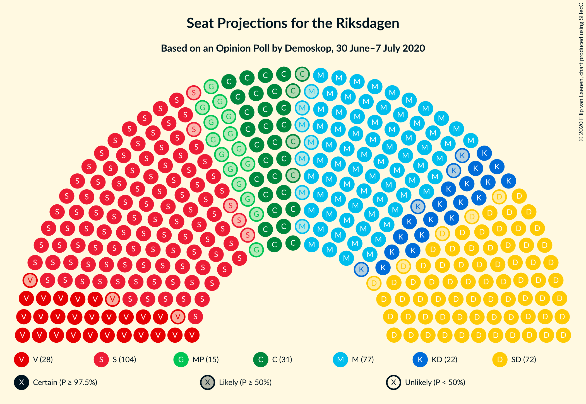
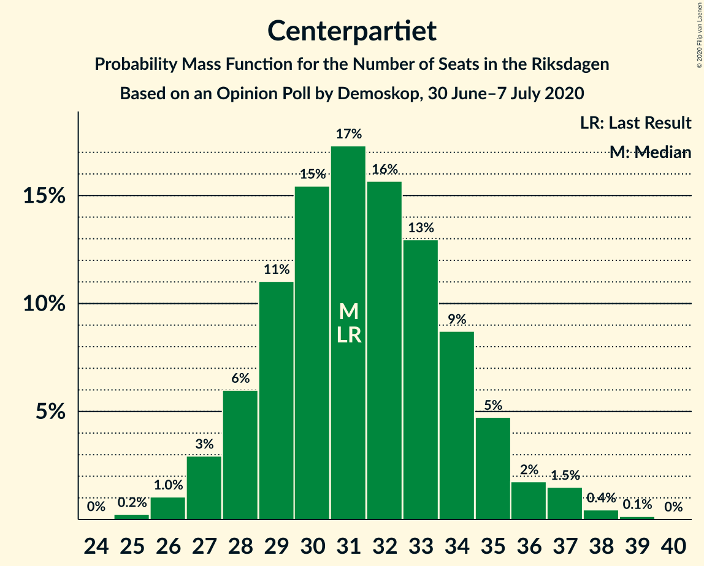
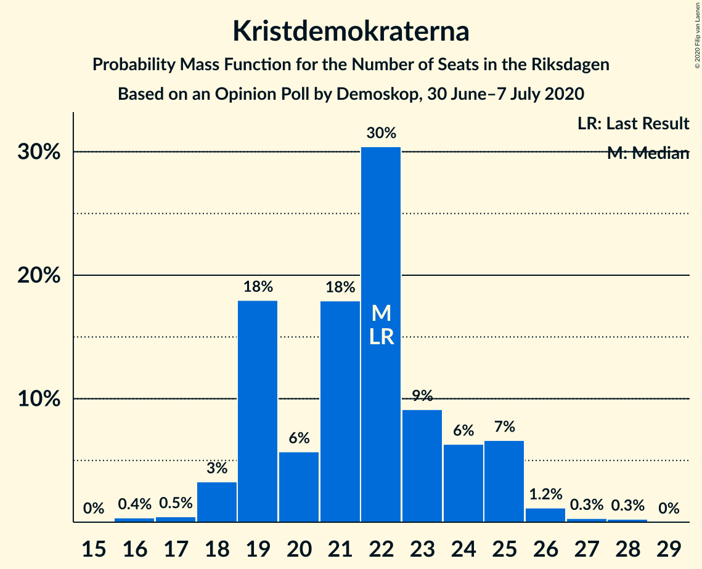
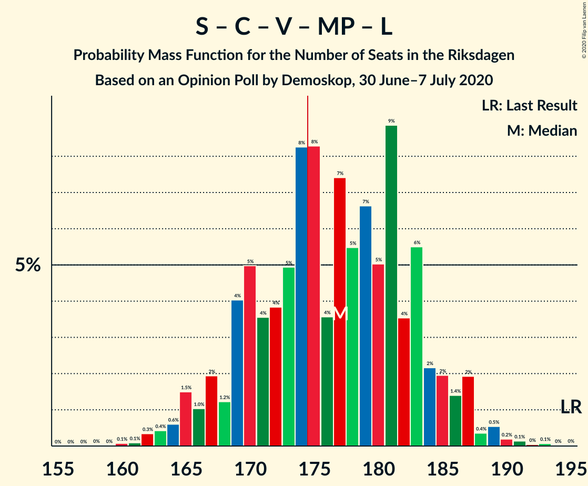
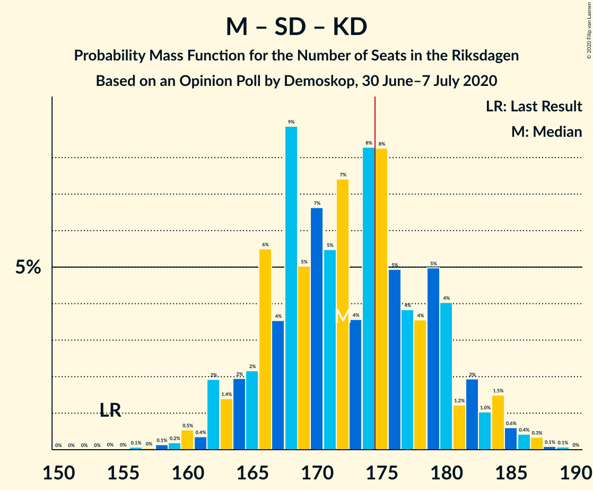
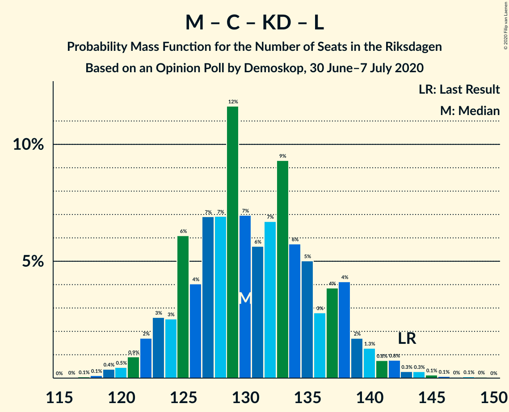

# Opinion Poll by Demoskop, 30 June–7 July 2020

<a href="#voting-intentions">Voting Intentions</a> | <a href="#seats">Seats</a> | <a href="#coalitions">Coalitions</a> | <a href="#technical-information">Technical Information</a>

## Voting Intentions

### Confidence Intervals

| Party | Last Result | Poll Result | 80% Confidence Interval | 90% Confidence Interval | 95% Confidence Interval | 99% Confidence Interval |
|:-----:|:-----------:|:-----------:|:-----------------------:|:-----------------------:|:-----------------------:|:-----------------------:|
| Sveriges socialdemokratiska arbetareparti | 28.3% | 28.5% | 27.3–29.7% |26.9–30.1% |26.6–30.4% |26.1–31.0% |
| Moderata samlingspartiet | 19.8% | 20.8% | 19.7–21.9% |19.4–22.3% |19.2–22.5% |18.7–23.1% |
| Sverigedemokraterna | 17.5% | 19.7% | 18.6–20.8% |18.3–21.1% |18.1–21.4% |17.6–21.9% |
| Centerpartiet | 8.6% | 8.4% | 7.7–9.2% |7.5–9.4% |7.3–9.6% |7.0–10.0% |
| Vänsterpartiet | 8.0% | 7.8% | 7.1–8.6% |6.9–8.8% |6.7–9.0% |6.4–9.4% |
| Kristdemokraterna | 6.3% | 5.7% | 5.1–6.4% |5.0–6.6% |4.8–6.8% |4.5–7.1% |
| Miljöpartiet de gröna | 4.4% | 4.1% | 3.6–4.7% |3.5–4.8% |3.3–5.0% |3.1–5.3% |
| Liberalerna | 5.5% | 3.2% | 2.8–3.7% |2.6–3.9% |2.5–4.0% |2.3–4.3% |

*Note:* The poll result column reflects the actual value used in the calculations. Published results may vary slightly, and in addition be rounded to fewer digits.

## Seats

### Confidence Intervals

| Party | Last Result | Median | 80% Confidence Interval | 90% Confidence Interval | 95% Confidence Interval | 99% Confidence Interval |
|:-----:|:-----------:|:------:|:-----------------------:|:-----------------------:|:-----------------------:|:-----------------------:|
| <a href="#sveriges-socialdemokratiska-arbetareparti">Sveriges socialdemokratiska arbetareparti</a> | 100 | 106 | 101–112 |99–113 |99–115 |96–118 |
| <a href="#moderata-samlingspartiet">Moderata samlingspartiet</a> | 70 | 77 | 73–83 |72–84 |70–85 |69–87 |
| <a href="#sverigedemokraterna">Sverigedemokraterna</a> | 62 | 74 | 69–78 |68–80 |67–81 |65–83 |
| <a href="#centerpartiet">Centerpartiet</a> | 31 | 31 | 28–34 |28–35 |27–36 |26–38 |
| <a href="#vänsterpartiet">Vänsterpartiet</a> | 28 | 29 | 26–32 |26–33 |25–34 |24–35 |
| <a href="#kristdemokraterna">Kristdemokraterna</a> | 22 | 22 | 19–24 |19–25 |18–25 |17–27 |
| <a href="#miljöpartiet-de-gröna">Miljöpartiet de gröna</a> | 16 | 15 | 0–17 |0–18 |0–18 |0–19 |
| <a href="#liberalerna">Liberalerna</a> | 20 | 0 | 0 |0 |0 |0–16 |

### Sveriges socialdemokratiska arbetareparti

*For a full overview of the results for this party, see the [Sveriges socialdemokratiska arbetareparti](party-sverigessocialdemokratiskaarbetareparti.html) page.*

| Number of Seats | Probability | Accumulated | Special Marks |
|:---------------:|:-----------:|:-----------:|:-------------:|
| 93 | 0% | 100% |  |
| 94 | 0.1% | 99.9% |  |
| 95 | 0.1% | 99.8% |  |
| 96 | 0.4% | 99.7% |  |
| 97 | 1.0% | 99.3% |  |
| 98 | 0.8% | 98% |  |
| 99 | 4% | 98% |  |
| 100 | 3% | 94% | Last Result |
| 101 | 7% | 91% |  |
| 102 | 9% | 84% |  |
| 103 | 8% | 74% |  |
| 104 | 11% | 67% |  |
| 105 | 6% | 56% |  |
| 106 | 9% | 50% | Median |
| 107 | 6% | 41% |  |
| 108 | 8% | 35% |  |
| 109 | 5% | 27% |  |
| 110 | 6% | 22% |  |
| 111 | 5% | 15% |  |
| 112 | 4% | 11% |  |
| 113 | 2% | 7% |  |
| 114 | 2% | 5% |  |
| 115 | 1.1% | 3% |  |
| 116 | 0.5% | 2% |  |
| 117 | 0.8% | 1.4% |  |
| 118 | 0.3% | 0.6% |  |
| 119 | 0.2% | 0.3% |  |
| 120 | 0.1% | 0.1% |  |
| 121 | 0% | 0.1% |  |
| 122 | 0% | 0% |  |

### Moderata samlingspartiet

*For a full overview of the results for this party, see the [Moderata samlingspartiet](party-moderatasamlingspartiet.html) page.*

| Number of Seats | Probability | Accumulated | Special Marks |
|:---------------:|:-----------:|:-----------:|:-------------:|
| 66 | 0% | 100% |  |
| 67 | 0.1% | 99.9% |  |
| 68 | 0.3% | 99.9% |  |
| 69 | 0.6% | 99.6% |  |
| 70 | 2% | 99.0% | Last Result |
| 71 | 2% | 97% |  |
| 72 | 4% | 95% |  |
| 73 | 5% | 92% |  |
| 74 | 6% | 86% |  |
| 75 | 8% | 81% |  |
| 76 | 13% | 73% |  |
| 77 | 13% | 60% | Median |
| 78 | 9% | 47% |  |
| 79 | 7% | 39% |  |
| 80 | 11% | 32% |  |
| 81 | 6% | 21% |  |
| 82 | 4% | 14% |  |
| 83 | 3% | 10% |  |
| 84 | 4% | 7% |  |
| 85 | 2% | 3% |  |
| 86 | 0.5% | 1.3% |  |
| 87 | 0.4% | 0.8% |  |
| 88 | 0.2% | 0.4% |  |
| 89 | 0% | 0.1% |  |
| 90 | 0% | 0.1% |  |
| 91 | 0% | 0.1% |  |
| 92 | 0% | 0% |  |

### Sverigedemokraterna

*For a full overview of the results for this party, see the [Sverigedemokraterna](party-sverigedemokraterna.html) page.*

| Number of Seats | Probability | Accumulated | Special Marks |
|:---------------:|:-----------:|:-----------:|:-------------:|
| 62 | 0% | 100% | Last Result |
| 63 | 0.1% | 100% |  |
| 64 | 0.3% | 99.9% |  |
| 65 | 0.4% | 99.5% |  |
| 66 | 1.1% | 99.2% |  |
| 67 | 2% | 98% |  |
| 68 | 5% | 96% |  |
| 69 | 4% | 91% |  |
| 70 | 9% | 87% |  |
| 71 | 6% | 78% |  |
| 72 | 11% | 72% |  |
| 73 | 10% | 61% |  |
| 74 | 10% | 51% | Median |
| 75 | 15% | 40% |  |
| 76 | 7% | 25% |  |
| 77 | 5% | 18% |  |
| 78 | 4% | 12% |  |
| 79 | 3% | 9% |  |
| 80 | 2% | 5% |  |
| 81 | 2% | 4% |  |
| 82 | 0.9% | 2% |  |
| 83 | 0.3% | 0.6% |  |
| 84 | 0.2% | 0.3% |  |
| 85 | 0.1% | 0.1% |  |
| 86 | 0% | 0.1% |  |
| 87 | 0% | 0% |  |

### Centerpartiet

*For a full overview of the results for this party, see the [Centerpartiet](party-centerpartiet.html) page.*

| Number of Seats | Probability | Accumulated | Special Marks |
|:---------------:|:-----------:|:-----------:|:-------------:|
| 24 | 0% | 100% |  |
| 25 | 0.2% | 99.9% |  |
| 26 | 1.0% | 99.7% |  |
| 27 | 3% | 98.7% |  |
| 28 | 6% | 96% |  |
| 29 | 11% | 90% |  |
| 30 | 15% | 79% |  |
| 31 | 17% | 63% | Last Result, Median |
| 32 | 16% | 46% |  |
| 33 | 13% | 30% |  |
| 34 | 9% | 17% |  |
| 35 | 5% | 9% |  |
| 36 | 2% | 4% |  |
| 37 | 1.5% | 2% |  |
| 38 | 0.4% | 0.6% |  |
| 39 | 0.1% | 0.2% |  |
| 40 | 0% | 0% |  |

### Vänsterpartiet

*For a full overview of the results for this party, see the [Vänsterpartiet](party-vänsterpartiet.html) page.*

| Number of Seats | Probability | Accumulated | Special Marks |
|:---------------:|:-----------:|:-----------:|:-------------:|
| 22 | 0.1% | 100% |  |
| 23 | 0.3% | 99.9% |  |
| 24 | 0.9% | 99.7% |  |
| 25 | 3% | 98.7% |  |
| 26 | 6% | 96% |  |
| 27 | 10% | 89% |  |
| 28 | 18% | 79% | Last Result |
| 29 | 18% | 61% | Median |
| 30 | 16% | 43% |  |
| 31 | 13% | 28% |  |
| 32 | 7% | 14% |  |
| 33 | 4% | 7% |  |
| 34 | 3% | 3% |  |
| 35 | 0.4% | 0.7% |  |
| 36 | 0.1% | 0.3% |  |
| 37 | 0.1% | 0.2% |  |
| 38 | 0% | 0% |  |

### Kristdemokraterna

*For a full overview of the results for this party, see the [Kristdemokraterna](party-kristdemokraterna.html) page.*

| Number of Seats | Probability | Accumulated | Special Marks |
|:---------------:|:-----------:|:-----------:|:-------------:|
| 16 | 0.4% | 100% |  |
| 17 | 0.5% | 99.6% |  |
| 18 | 3% | 99.2% |  |
| 19 | 18% | 96% |  |
| 20 | 6% | 78% |  |
| 21 | 18% | 72% |  |
| 22 | 30% | 54% | Last Result, Median |
| 23 | 9% | 24% |  |
| 24 | 6% | 15% |  |
| 25 | 7% | 8% |  |
| 26 | 1.2% | 2% |  |
| 27 | 0.3% | 0.6% |  |
| 28 | 0.3% | 0.3% |  |
| 29 | 0% | 0% |  |

### Miljöpartiet de gröna

*For a full overview of the results for this party, see the [Miljöpartiet de gröna](party-miljöpartietdegröna.html) page.*

| Number of Seats | Probability | Accumulated | Special Marks |
|:---------------:|:-----------:|:-----------:|:-------------:|
| 0 | 39% | 100% |  |
| 1 | 0% | 61% |  |
| 2 | 0% | 61% |  |
| 3 | 0% | 61% |  |
| 4 | 0% | 61% |  |
| 5 | 0% | 61% |  |
| 6 | 0% | 61% |  |
| 7 | 0% | 61% |  |
| 8 | 0% | 61% |  |
| 9 | 0% | 61% |  |
| 10 | 0% | 61% |  |
| 11 | 0% | 61% |  |
| 12 | 0% | 61% |  |
| 13 | 0% | 61% |  |
| 14 | 0.1% | 61% |  |
| 15 | 20% | 60% | Median |
| 16 | 21% | 40% | Last Result |
| 17 | 12% | 19% |  |
| 18 | 5% | 7% |  |
| 19 | 1.3% | 2% |  |
| 20 | 0.4% | 0.5% |  |
| 21 | 0.1% | 0.1% |  |
| 22 | 0% | 0% |  |

### Liberalerna

*For a full overview of the results for this party, see the [Liberalerna](party-liberalerna.html) page.*

| Number of Seats | Probability | Accumulated | Special Marks |
|:---------------:|:-----------:|:-----------:|:-------------:|
| 0 | 98% | 100% | Median |
| 1 | 0% | 2% |  |
| 2 | 0% | 2% |  |
| 3 | 0% | 2% |  |
| 4 | 0% | 2% |  |
| 5 | 0% | 2% |  |
| 6 | 0% | 2% |  |
| 7 | 0% | 2% |  |
| 8 | 0% | 2% |  |
| 9 | 0% | 2% |  |
| 10 | 0% | 2% |  |
| 11 | 0% | 2% |  |
| 12 | 0% | 2% |  |
| 13 | 0% | 2% |  |
| 14 | 0.7% | 2% |  |
| 15 | 0.8% | 1.4% |  |
| 16 | 0.5% | 0.6% |  |
| 17 | 0.1% | 0.1% |  |
| 18 | 0% | 0% |  |
| 19 | 0% | 0% |  |
| 20 | 0% | 0% | Last Result |

## Coalitions

### Confidence Intervals

| Coalition | Last Result | Median | Majority? | 80% Confidence Interval | 90% Confidence Interval | 95% Confidence Interval | 99% Confidence Interval |
|:---------:|:-----------:|:------:|:---------:|:-----------------------:|:-----------------------:|:-----------------------:|:-----------------------:|
| Sveriges socialdemokratiska arbetareparti – Moderata samlingspartiet – Centerpartiet | 201 | 213 | 100% | 207–224 | 206–226 | 205–228 | 201–230 |
| Sveriges socialdemokratiska arbetareparti – Moderata samlingspartiet | 170 | 183 | 95% | 176–192 | 175–194 | 174–195 | 171–198 |
| Sveriges socialdemokratiska arbetareparti – Centerpartiet – Vänsterpartiet – Miljöpartiet de gröna – Liberalerna | 195 | 177 | 63% | 169–183 | 167–185 | 165–187 | 162–189 |
| Moderata samlingspartiet – Sverigedemokraterna – Kristdemokraterna | 154 | 172 | 37% | 166–180 | 164–182 | 162–184 | 160–187 |
| Moderata samlingspartiet – Sverigedemokraterna | 132 | 151 | 0% | 145–158 | 143–160 | 141–161 | 138–164 |
| Sveriges socialdemokratiska arbetareparti – Centerpartiet – Miljöpartiet de gröna – Liberalerna | 167 | 148 | 0% | 139–155 | 137–157 | 135–159 | 133–161 |
| Sveriges socialdemokratiska arbetareparti – Vänsterpartiet – Miljöpartiet de gröna | 144 | 145 | 0% | 137–152 | 134–154 | 133–155 | 130–158 |
| Sveriges socialdemokratiska arbetareparti – Vänsterpartiet | 128 | 134 | 0% | 129–142 | 127–143 | 127–145 | 124–148 |
| Moderata samlingspartiet – Centerpartiet – Kristdemokraterna – Liberalerna | 143 | 130 | 0% | 125–137 | 123–139 | 122–140 | 119–144 |
| Moderata samlingspartiet – Centerpartiet – Kristdemokraterna | 123 | 130 | 0% | 124–137 | 123–138 | 121–140 | 119–143 |
| Sveriges socialdemokratiska arbetareparti – Miljöpartiet de gröna | 116 | 117 | 0% | 107–123 | 105–125 | 104–126 | 101–129 |
| Moderata samlingspartiet – Centerpartiet – Liberalerna | 121 | 109 | 0% | 104–115 | 102–117 | 101–118 | 99–122 |
| Moderata samlingspartiet – Centerpartiet | 101 | 109 | 0% | 103–115 | 102–116 | 101–118 | 98–120 |

### Sveriges socialdemokratiska arbetareparti – Moderata samlingspartiet – Centerpartiet

| Number of Seats | Probability | Accumulated | Special Marks |
|:---------------:|:-----------:|:-----------:|:-------------:|
| 197 | 0.1% | 100% |  |
| 198 | 0.1% | 99.9% |  |
| 199 | 0.1% | 99.8% |  |
| 200 | 0.1% | 99.7% |  |
| 201 | 0.3% | 99.5% | Last Result |
| 202 | 0.4% | 99.2% |  |
| 203 | 0.5% | 98.9% |  |
| 204 | 0.5% | 98% |  |
| 205 | 1.3% | 98% |  |
| 206 | 2% | 97% |  |
| 207 | 5% | 95% |  |
| 208 | 3% | 90% |  |
| 209 | 11% | 87% |  |
| 210 | 5% | 76% |  |
| 211 | 12% | 71% |  |
| 212 | 6% | 60% |  |
| 213 | 5% | 54% |  |
| 214 | 3% | 49% | Median |
| 215 | 4% | 46% |  |
| 216 | 5% | 42% |  |
| 217 | 4% | 37% |  |
| 218 | 4% | 33% |  |
| 219 | 4% | 29% |  |
| 220 | 6% | 26% |  |
| 221 | 4% | 20% |  |
| 222 | 3% | 17% |  |
| 223 | 3% | 14% |  |
| 224 | 1.4% | 10% |  |
| 225 | 3% | 9% |  |
| 226 | 2% | 6% |  |
| 227 | 1.0% | 4% |  |
| 228 | 2% | 3% |  |
| 229 | 0.5% | 1.1% |  |
| 230 | 0.4% | 0.6% |  |
| 231 | 0.1% | 0.3% |  |
| 232 | 0.1% | 0.1% |  |
| 233 | 0% | 0.1% |  |
| 234 | 0% | 0% |  |

### Sveriges socialdemokratiska arbetareparti – Moderata samlingspartiet

| Number of Seats | Probability | Accumulated | Special Marks |
|:---------------:|:-----------:|:-----------:|:-------------:|
| 166 | 0% | 100% |  |
| 167 | 0.1% | 99.9% |  |
| 168 | 0.1% | 99.9% |  |
| 169 | 0.1% | 99.8% |  |
| 170 | 0.2% | 99.7% | Last Result |
| 171 | 0.4% | 99.5% |  |
| 172 | 0.4% | 99.2% |  |
| 173 | 0.9% | 98.7% |  |
| 174 | 2% | 98% |  |
| 175 | 3% | 95% | Majority |
| 176 | 3% | 92% |  |
| 177 | 5% | 90% |  |
| 178 | 4% | 85% |  |
| 179 | 13% | 81% |  |
| 180 | 6% | 68% |  |
| 181 | 5% | 61% |  |
| 182 | 4% | 56% |  |
| 183 | 5% | 52% | Median |
| 184 | 6% | 47% |  |
| 185 | 4% | 41% |  |
| 186 | 8% | 37% |  |
| 187 | 4% | 29% |  |
| 188 | 4% | 25% |  |
| 189 | 3% | 21% |  |
| 190 | 4% | 18% |  |
| 191 | 2% | 14% |  |
| 192 | 5% | 12% |  |
| 193 | 0.9% | 7% |  |
| 194 | 4% | 6% |  |
| 195 | 0.9% | 3% |  |
| 196 | 0.8% | 2% |  |
| 197 | 0.3% | 0.9% |  |
| 198 | 0.2% | 0.6% |  |
| 199 | 0.2% | 0.4% |  |
| 200 | 0.2% | 0.2% |  |
| 201 | 0% | 0% |  |

### Sveriges socialdemokratiska arbetareparti – Centerpartiet – Vänsterpartiet – Miljöpartiet de gröna – Liberalerna

| Number of Seats | Probability | Accumulated | Special Marks |
|:---------------:|:-----------:|:-----------:|:-------------:|
| 160 | 0.1% | 100% |  |
| 161 | 0.1% | 99.9% |  |
| 162 | 0.3% | 99.8% |  |
| 163 | 0.4% | 99.5% |  |
| 164 | 0.6% | 99.0% |  |
| 165 | 1.5% | 98% |  |
| 166 | 1.0% | 97% |  |
| 167 | 2% | 96% |  |
| 168 | 1.2% | 94% |  |
| 169 | 4% | 93% |  |
| 170 | 5% | 89% |  |
| 171 | 4% | 84% |  |
| 172 | 4% | 80% |  |
| 173 | 5% | 76% |  |
| 174 | 8% | 71% |  |
| 175 | 8% | 63% | Majority |
| 176 | 4% | 55% |  |
| 177 | 7% | 51% |  |
| 178 | 5% | 44% |  |
| 179 | 7% | 38% |  |
| 180 | 5% | 32% |  |
| 181 | 9% | 27% | Median |
| 182 | 4% | 18% |  |
| 183 | 6% | 14% |  |
| 184 | 2% | 9% |  |
| 185 | 2% | 7% |  |
| 186 | 1.4% | 5% |  |
| 187 | 2% | 3% |  |
| 188 | 0.4% | 1.4% |  |
| 189 | 0.5% | 1.0% |  |
| 190 | 0.2% | 0.5% |  |
| 191 | 0.1% | 0.3% |  |
| 192 | 0% | 0.2% |  |
| 193 | 0.1% | 0.1% |  |
| 194 | 0% | 0% |  |
| 195 | 0% | 0% | Last Result |

### Moderata samlingspartiet – Sverigedemokraterna – Kristdemokraterna

| Number of Seats | Probability | Accumulated | Special Marks |
|:---------------:|:-----------:|:-----------:|:-------------:|
| 154 | 0% | 100% | Last Result |
| 155 | 0% | 100% |  |
| 156 | 0.1% | 100% |  |
| 157 | 0% | 99.9% |  |
| 158 | 0.1% | 99.8% |  |
| 159 | 0.2% | 99.7% |  |
| 160 | 0.5% | 99.5% |  |
| 161 | 0.4% | 99.0% |  |
| 162 | 2% | 98.6% |  |
| 163 | 1.4% | 97% |  |
| 164 | 2% | 95% |  |
| 165 | 2% | 93% |  |
| 166 | 6% | 91% |  |
| 167 | 4% | 86% |  |
| 168 | 9% | 82% |  |
| 169 | 5% | 73% |  |
| 170 | 7% | 68% |  |
| 171 | 5% | 62% |  |
| 172 | 7% | 56% |  |
| 173 | 4% | 49% | Median |
| 174 | 8% | 45% |  |
| 175 | 8% | 37% | Majority |
| 176 | 5% | 29% |  |
| 177 | 4% | 24% |  |
| 178 | 4% | 20% |  |
| 179 | 5% | 16% |  |
| 180 | 4% | 11% |  |
| 181 | 1.2% | 7% |  |
| 182 | 2% | 6% |  |
| 183 | 1.0% | 4% |  |
| 184 | 1.5% | 3% |  |
| 185 | 0.6% | 2% |  |
| 186 | 0.4% | 1.0% |  |
| 187 | 0.3% | 0.5% |  |
| 188 | 0.1% | 0.2% |  |
| 189 | 0.1% | 0.1% |  |
| 190 | 0% | 0% |  |

### Moderata samlingspartiet – Sverigedemokraterna

| Number of Seats | Probability | Accumulated | Special Marks |
|:---------------:|:-----------:|:-----------:|:-------------:|
| 132 | 0% | 100% | Last Result |
| 133 | 0% | 100% |  |
| 134 | 0% | 100% |  |
| 135 | 0% | 100% |  |
| 136 | 0.1% | 100% |  |
| 137 | 0.1% | 99.9% |  |
| 138 | 0.3% | 99.7% |  |
| 139 | 0.3% | 99.4% |  |
| 140 | 0.6% | 99.1% |  |
| 141 | 1.4% | 98.5% |  |
| 142 | 1.1% | 97% |  |
| 143 | 2% | 96% |  |
| 144 | 3% | 94% |  |
| 145 | 5% | 91% |  |
| 146 | 9% | 86% |  |
| 147 | 5% | 77% |  |
| 148 | 4% | 72% |  |
| 149 | 7% | 68% |  |
| 150 | 4% | 60% |  |
| 151 | 7% | 56% | Median |
| 152 | 12% | 49% |  |
| 153 | 4% | 37% |  |
| 154 | 9% | 33% |  |
| 155 | 5% | 24% |  |
| 156 | 4% | 19% |  |
| 157 | 2% | 14% |  |
| 158 | 4% | 12% |  |
| 159 | 2% | 9% |  |
| 160 | 2% | 7% |  |
| 161 | 3% | 5% |  |
| 162 | 0.7% | 2% |  |
| 163 | 0.7% | 1.3% |  |
| 164 | 0.3% | 0.7% |  |
| 165 | 0.1% | 0.4% |  |
| 166 | 0.1% | 0.3% |  |
| 167 | 0.1% | 0.2% |  |
| 168 | 0% | 0% |  |

### Sveriges socialdemokratiska arbetareparti – Centerpartiet – Miljöpartiet de gröna – Liberalerna

| Number of Seats | Probability | Accumulated | Special Marks |
|:---------------:|:-----------:|:-----------:|:-------------:|
| 131 | 0.1% | 100% |  |
| 132 | 0.1% | 99.9% |  |
| 133 | 0.3% | 99.8% |  |
| 134 | 0.7% | 99.4% |  |
| 135 | 1.5% | 98.7% |  |
| 136 | 0.7% | 97% |  |
| 137 | 3% | 97% |  |
| 138 | 2% | 94% |  |
| 139 | 5% | 92% |  |
| 140 | 4% | 86% |  |
| 141 | 3% | 82% |  |
| 142 | 3% | 79% |  |
| 143 | 5% | 76% |  |
| 144 | 3% | 71% |  |
| 145 | 3% | 68% |  |
| 146 | 6% | 65% |  |
| 147 | 8% | 59% |  |
| 148 | 5% | 52% |  |
| 149 | 7% | 47% |  |
| 150 | 7% | 40% |  |
| 151 | 7% | 32% |  |
| 152 | 8% | 25% | Median |
| 153 | 4% | 18% |  |
| 154 | 3% | 14% |  |
| 155 | 3% | 10% |  |
| 156 | 2% | 7% |  |
| 157 | 1.5% | 5% |  |
| 158 | 1.0% | 4% |  |
| 159 | 0.9% | 3% |  |
| 160 | 0.8% | 2% |  |
| 161 | 0.4% | 0.9% |  |
| 162 | 0.1% | 0.4% |  |
| 163 | 0.1% | 0.3% |  |
| 164 | 0.1% | 0.1% |  |
| 165 | 0% | 0.1% |  |
| 166 | 0% | 0% |  |
| 167 | 0% | 0% | Last Result |

### Sveriges socialdemokratiska arbetareparti – Vänsterpartiet – Miljöpartiet de gröna

| Number of Seats | Probability | Accumulated | Special Marks |
|:---------------:|:-----------:|:-----------:|:-------------:|
| 127 | 0% | 100% |  |
| 128 | 0.1% | 99.9% |  |
| 129 | 0.1% | 99.8% |  |
| 130 | 0.5% | 99.7% |  |
| 131 | 0.6% | 99.2% |  |
| 132 | 0.7% | 98.5% |  |
| 133 | 1.1% | 98% |  |
| 134 | 2% | 97% |  |
| 135 | 2% | 95% |  |
| 136 | 2% | 93% |  |
| 137 | 3% | 91% |  |
| 138 | 4% | 88% |  |
| 139 | 5% | 84% |  |
| 140 | 2% | 79% |  |
| 141 | 7% | 77% |  |
| 142 | 6% | 69% |  |
| 143 | 4% | 64% |  |
| 144 | 5% | 60% | Last Result |
| 145 | 8% | 55% |  |
| 146 | 5% | 47% |  |
| 147 | 6% | 42% |  |
| 148 | 4% | 35% |  |
| 149 | 6% | 31% |  |
| 150 | 7% | 24% | Median |
| 151 | 5% | 18% |  |
| 152 | 4% | 13% |  |
| 153 | 3% | 9% |  |
| 154 | 3% | 7% |  |
| 155 | 2% | 4% |  |
| 156 | 1.2% | 2% |  |
| 157 | 0.4% | 1.0% |  |
| 158 | 0.4% | 0.6% |  |
| 159 | 0.1% | 0.2% |  |
| 160 | 0.1% | 0.1% |  |
| 161 | 0% | 0% |  |

### Sveriges socialdemokratiska arbetareparti – Vänsterpartiet

| Number of Seats | Probability | Accumulated | Special Marks |
|:---------------:|:-----------:|:-----------:|:-------------:|
| 120 | 0% | 100% |  |
| 121 | 0% | 99.9% |  |
| 122 | 0.1% | 99.9% |  |
| 123 | 0.1% | 99.8% |  |
| 124 | 0.4% | 99.6% |  |
| 125 | 0.7% | 99.3% |  |
| 126 | 1.1% | 98.6% |  |
| 127 | 3% | 98% |  |
| 128 | 3% | 94% | Last Result |
| 129 | 5% | 91% |  |
| 130 | 7% | 86% |  |
| 131 | 7% | 79% |  |
| 132 | 6% | 72% |  |
| 133 | 9% | 66% |  |
| 134 | 8% | 58% |  |
| 135 | 6% | 50% | Median |
| 136 | 5% | 43% |  |
| 137 | 4% | 39% |  |
| 138 | 7% | 35% |  |
| 139 | 7% | 28% |  |
| 140 | 3% | 21% |  |
| 141 | 7% | 18% |  |
| 142 | 4% | 10% |  |
| 143 | 3% | 7% |  |
| 144 | 1.0% | 4% |  |
| 145 | 1.1% | 3% |  |
| 146 | 0.3% | 2% |  |
| 147 | 0.9% | 2% |  |
| 148 | 0.3% | 0.6% |  |
| 149 | 0.2% | 0.4% |  |
| 150 | 0.1% | 0.2% |  |
| 151 | 0.1% | 0.1% |  |
| 152 | 0% | 0% |  |

### Moderata samlingspartiet – Centerpartiet – Kristdemokraterna – Liberalerna

| Number of Seats | Probability | Accumulated | Special Marks |
|:---------------:|:-----------:|:-----------:|:-------------:|
| 116 | 0% | 100% |  |
| 117 | 0.1% | 99.9% |  |
| 118 | 0.1% | 99.9% |  |
| 119 | 0.4% | 99.8% |  |
| 120 | 0.5% | 99.4% |  |
| 121 | 0.9% | 98.9% |  |
| 122 | 2% | 98% |  |
| 123 | 3% | 96% |  |
| 124 | 3% | 94% |  |
| 125 | 6% | 91% |  |
| 126 | 4% | 85% |  |
| 127 | 7% | 81% |  |
| 128 | 7% | 74% |  |
| 129 | 12% | 67% |  |
| 130 | 7% | 56% | Median |
| 131 | 6% | 49% |  |
| 132 | 7% | 43% |  |
| 133 | 9% | 36% |  |
| 134 | 6% | 27% |  |
| 135 | 5% | 21% |  |
| 136 | 3% | 16% |  |
| 137 | 4% | 13% |  |
| 138 | 4% | 10% |  |
| 139 | 2% | 5% |  |
| 140 | 1.3% | 4% |  |
| 141 | 0.8% | 2% |  |
| 142 | 0.8% | 2% |  |
| 143 | 0.3% | 0.9% | Last Result |
| 144 | 0.3% | 0.7% |  |
| 145 | 0.1% | 0.4% |  |
| 146 | 0.1% | 0.3% |  |
| 147 | 0% | 0.2% |  |
| 148 | 0.1% | 0.1% |  |
| 149 | 0% | 0.1% |  |
| 150 | 0% | 0% |  |

### Moderata samlingspartiet – Centerpartiet – Kristdemokraterna

| Number of Seats | Probability | Accumulated | Special Marks |
|:---------------:|:-----------:|:-----------:|:-------------:|
| 115 | 0.1% | 100% |  |
| 116 | 0.1% | 99.9% |  |
| 117 | 0.1% | 99.8% |  |
| 118 | 0.2% | 99.8% |  |
| 119 | 0.4% | 99.6% |  |
| 120 | 0.6% | 99.2% |  |
| 121 | 1.0% | 98.5% |  |
| 122 | 2% | 97% |  |
| 123 | 3% | 96% | Last Result |
| 124 | 3% | 93% |  |
| 125 | 6% | 90% |  |
| 126 | 4% | 84% |  |
| 127 | 7% | 79% |  |
| 128 | 7% | 72% |  |
| 129 | 12% | 65% |  |
| 130 | 7% | 54% | Median |
| 131 | 6% | 47% |  |
| 132 | 7% | 41% |  |
| 133 | 9% | 34% |  |
| 134 | 6% | 25% |  |
| 135 | 5% | 20% |  |
| 136 | 3% | 15% |  |
| 137 | 4% | 12% |  |
| 138 | 4% | 8% |  |
| 139 | 2% | 4% |  |
| 140 | 1.1% | 3% |  |
| 141 | 0.6% | 2% |  |
| 142 | 0.6% | 1.1% |  |
| 143 | 0.2% | 0.5% |  |
| 144 | 0.2% | 0.4% |  |
| 145 | 0.1% | 0.2% |  |
| 146 | 0% | 0.1% |  |
| 147 | 0% | 0% |  |

### Sveriges socialdemokratiska arbetareparti – Miljöpartiet de gröna

| Number of Seats | Probability | Accumulated | Special Marks |
|:---------------:|:-----------:|:-----------:|:-------------:|
| 99 | 0.1% | 100% |  |
| 100 | 0.2% | 99.8% |  |
| 101 | 0.3% | 99.7% |  |
| 102 | 0.5% | 99.3% |  |
| 103 | 1.1% | 98.9% |  |
| 104 | 3% | 98% |  |
| 105 | 2% | 95% |  |
| 106 | 3% | 93% |  |
| 107 | 3% | 90% |  |
| 108 | 6% | 87% |  |
| 109 | 3% | 82% |  |
| 110 | 6% | 79% |  |
| 111 | 3% | 73% |  |
| 112 | 4% | 70% |  |
| 113 | 2% | 66% |  |
| 114 | 4% | 63% |  |
| 115 | 3% | 60% |  |
| 116 | 4% | 57% | Last Result |
| 117 | 9% | 52% |  |
| 118 | 6% | 43% |  |
| 119 | 5% | 37% |  |
| 120 | 8% | 32% |  |
| 121 | 5% | 24% | Median |
| 122 | 6% | 19% |  |
| 123 | 4% | 14% |  |
| 124 | 3% | 9% |  |
| 125 | 3% | 7% |  |
| 126 | 2% | 4% |  |
| 127 | 1.0% | 2% |  |
| 128 | 0.3% | 1.1% |  |
| 129 | 0.4% | 0.8% |  |
| 130 | 0.3% | 0.4% |  |
| 131 | 0.1% | 0.1% |  |
| 132 | 0% | 0.1% |  |
| 133 | 0% | 0% |  |

### Moderata samlingspartiet – Centerpartiet – Liberalerna

| Number of Seats | Probability | Accumulated | Special Marks |
|:---------------:|:-----------:|:-----------:|:-------------:|
| 96 | 0% | 100% |  |
| 97 | 0.1% | 99.9% |  |
| 98 | 0.1% | 99.8% |  |
| 99 | 0.2% | 99.6% |  |
| 100 | 1.0% | 99.4% |  |
| 101 | 1.2% | 98% |  |
| 102 | 3% | 97% |  |
| 103 | 4% | 95% |  |
| 104 | 4% | 90% |  |
| 105 | 5% | 86% |  |
| 106 | 7% | 82% |  |
| 107 | 12% | 75% |  |
| 108 | 9% | 62% | Median |
| 109 | 10% | 53% |  |
| 110 | 10% | 43% |  |
| 111 | 4% | 34% |  |
| 112 | 7% | 30% |  |
| 113 | 5% | 23% |  |
| 114 | 4% | 18% |  |
| 115 | 5% | 14% |  |
| 116 | 3% | 9% |  |
| 117 | 2% | 6% |  |
| 118 | 2% | 4% |  |
| 119 | 0.6% | 2% |  |
| 120 | 0.4% | 1.4% |  |
| 121 | 0.3% | 1.0% | Last Result |
| 122 | 0.2% | 0.7% |  |
| 123 | 0.1% | 0.4% |  |
| 124 | 0.1% | 0.3% |  |
| 125 | 0.1% | 0.3% |  |
| 126 | 0% | 0.2% |  |
| 127 | 0.1% | 0.1% |  |
| 128 | 0% | 0.1% |  |
| 129 | 0% | 0% |  |

### Moderata samlingspartiet – Centerpartiet

| Number of Seats | Probability | Accumulated | Special Marks |
|:---------------:|:-----------:|:-----------:|:-------------:|
| 96 | 0.1% | 100% |  |
| 97 | 0.3% | 99.9% |  |
| 98 | 0.3% | 99.6% |  |
| 99 | 0.4% | 99.3% |  |
| 100 | 1.1% | 99.0% |  |
| 101 | 1.3% | 98% | Last Result |
| 102 | 3% | 97% |  |
| 103 | 5% | 94% |  |
| 104 | 4% | 89% |  |
| 105 | 5% | 85% |  |
| 106 | 7% | 80% |  |
| 107 | 12% | 73% |  |
| 108 | 9% | 60% | Median |
| 109 | 10% | 51% |  |
| 110 | 10% | 41% |  |
| 111 | 4% | 32% |  |
| 112 | 7% | 28% |  |
| 113 | 5% | 21% |  |
| 114 | 4% | 16% |  |
| 115 | 5% | 12% |  |
| 116 | 3% | 7% |  |
| 117 | 2% | 4% |  |
| 118 | 1.4% | 3% |  |
| 119 | 0.4% | 1.3% |  |
| 120 | 0.3% | 0.8% |  |
| 121 | 0.2% | 0.5% |  |
| 122 | 0.2% | 0.3% |  |
| 123 | 0.1% | 0.1% |  |
| 124 | 0% | 0% |  |

## Technical Information

### Opinion Poll

+ **Polling firm:** Demoskop
+ **Commissioner(s):** —
+ **Fieldwork period:** 30 June–7 July 2020

### Calculations

+ **Sample size:** 2226
+ **Simulations done:** 1,048,576
+ **Error estimate:** 1.05%

