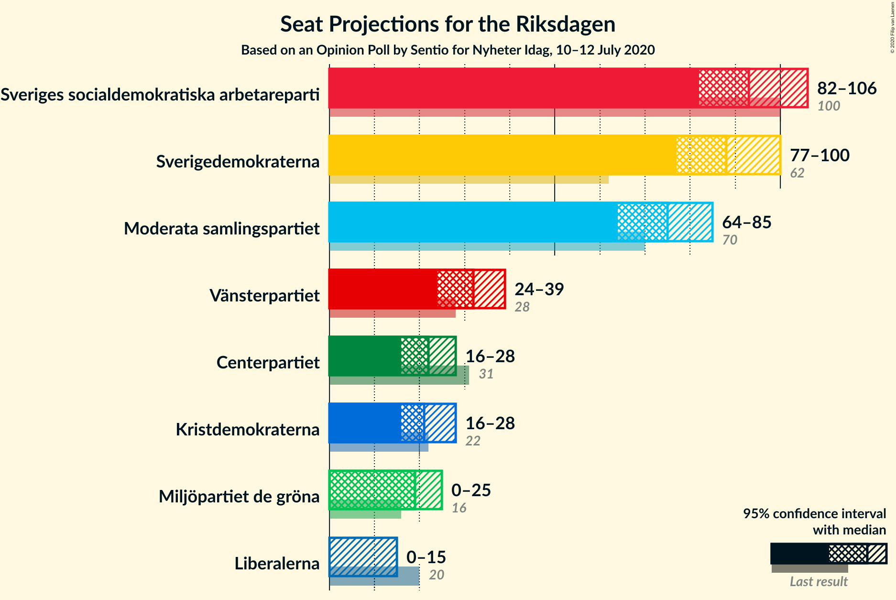
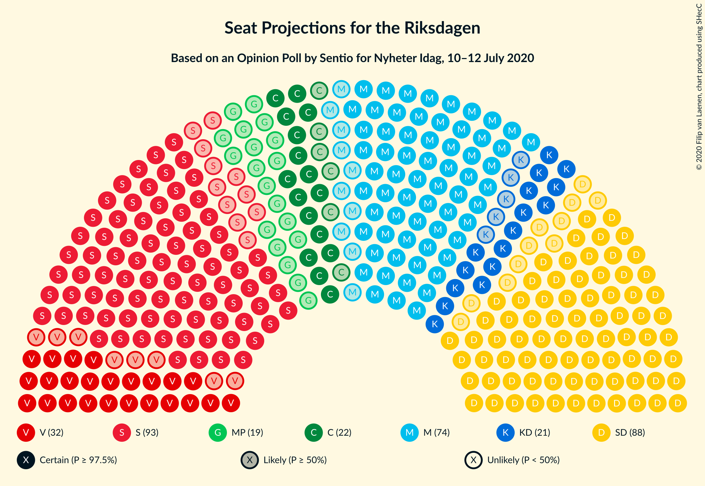
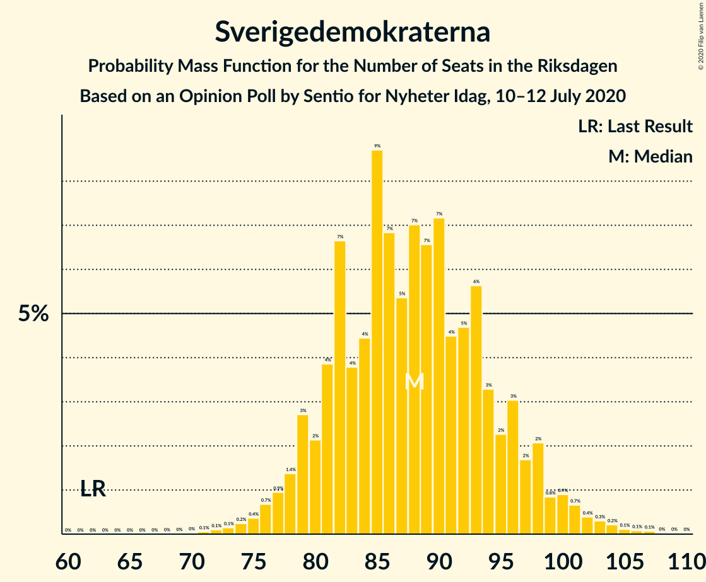
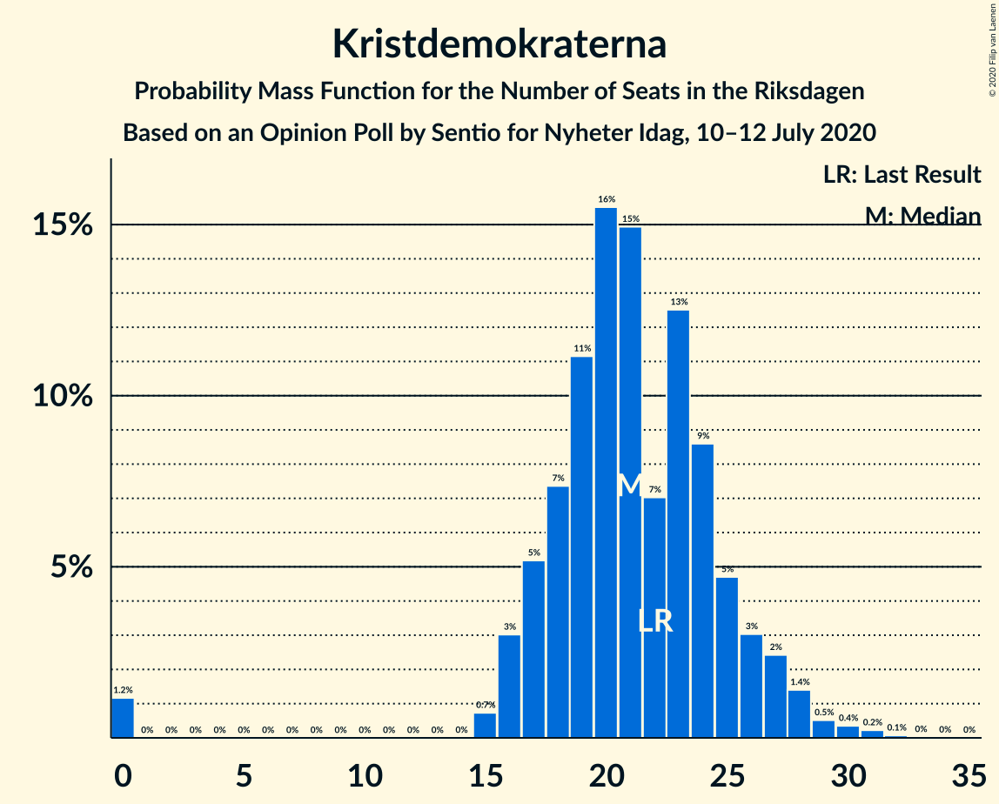
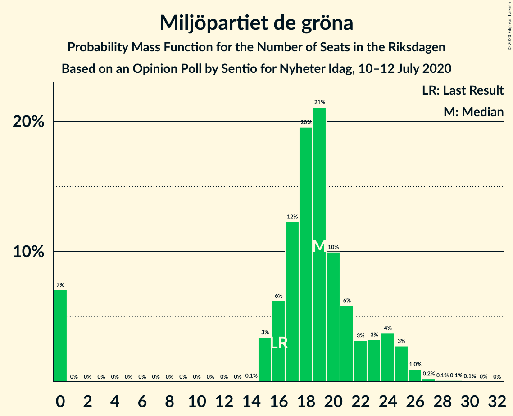
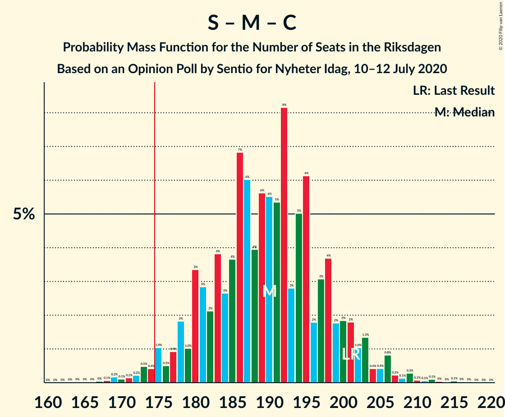
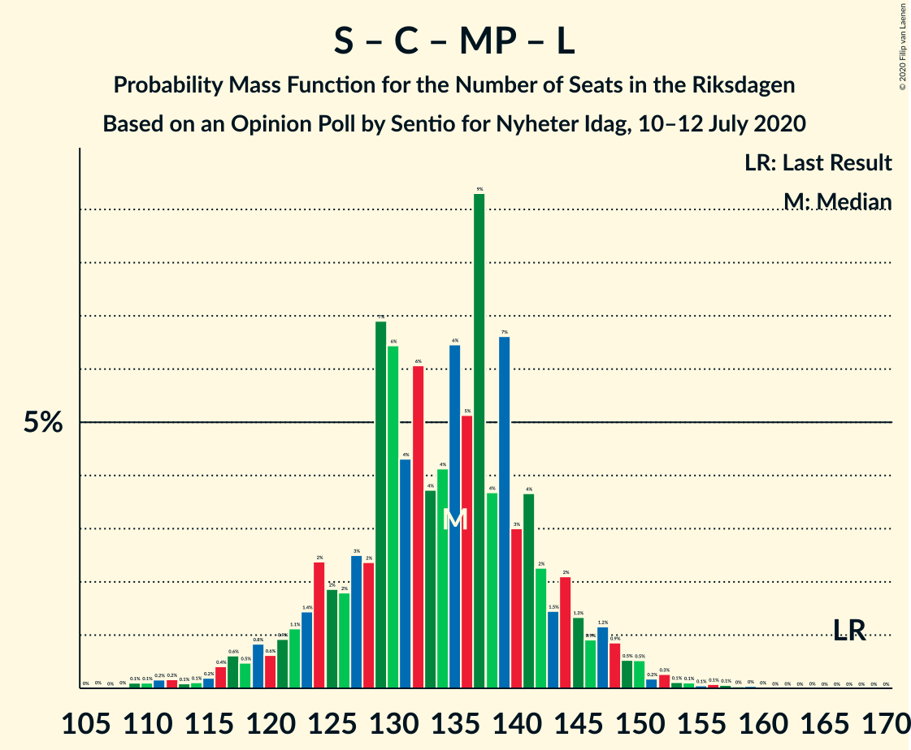
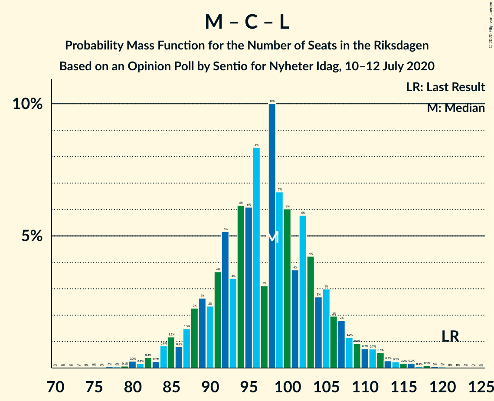

# Opinion Poll by Sentio for Nyheter Idag, 10–12 July 2020

<a href="#voting-intentions">Voting Intentions</a> | <a href="#seats">Seats</a> | <a href="#coalitions">Coalitions</a> | <a href="#technical-information">Technical Information</a>

## Voting Intentions

### Confidence Intervals

| Party | Last Result | Poll Result | 80% Confidence Interval | 90% Confidence Interval | 95% Confidence Interval | 99% Confidence Interval |
|:-----:|:-----------:|:-----------:|:-----------------------:|:-----------------------:|:-----------------------:|:-----------------------:|
| Sveriges socialdemokratiska arbetareparti | 28.3% | 25.5% | 23.6–27.5% |23.0–28.1% |22.6–28.6% |21.7–29.6% |
| Sverigedemokraterna | 17.5% | 24.1% | 22.2–26.1% |21.7–26.7% |21.2–27.2% |20.3–28.2% |
| Moderata samlingspartiet | 19.8% | 20.3% | 18.5–22.2% |18.0–22.8% |17.6–23.2% |16.8–24.2% |
| Vänsterpartiet | 8.0% | 8.5% | 7.3–9.9% |7.0–10.3% |6.7–10.7% |6.2–11.4% |
| Centerpartiet | 8.6% | 5.8% | 4.9–7.0% |4.6–7.4% |4.4–7.7% |4.0–8.3% |
| Kristdemokraterna | 6.3% | 5.7% | 4.8–6.9% |4.5–7.3% |4.3–7.6% |3.9–8.2% |
| Miljöpartiet de gröna | 4.4% | 5.1% | 4.2–6.2% |3.9–6.6% |3.7–6.8% |3.4–7.4% |
| Liberalerna | 5.5% | 2.9% | 2.3–3.8% |2.1–4.1% |2.0–4.3% |1.7–4.8% |

*Note:* The poll result column reflects the actual value used in the calculations. Published results may vary slightly, and in addition be rounded to fewer digits.

## Seats

### Confidence Intervals

| Party | Last Result | Median | 80% Confidence Interval | 90% Confidence Interval | 95% Confidence Interval | 99% Confidence Interval |
|:-----:|:-----------:|:------:|:-----------------------:|:-----------------------:|:-----------------------:|:-----------------------:|
| <a href="#sveriges-socialdemokratiska-arbetareparti">Sveriges socialdemokratiska arbetareparti</a> | 100 | 94 | 85–98 |84–99 |83–104 |80–108 |
| <a href="#sverigedemokraterna">Sverigedemokraterna</a> | 62 | 85 | 79–95 |79–98 |78–100 |74–103 |
| <a href="#moderata-samlingspartiet">Moderata samlingspartiet</a> | 70 | 75 | 69–81 |66–83 |66–84 |62–88 |
| <a href="#vänsterpartiet">Vänsterpartiet</a> | 28 | 32 | 28–36 |27–37 |26–38 |24–41 |
| <a href="#centerpartiet">Centerpartiet</a> | 31 | 22 | 19–25 |18–26 |17–28 |15–31 |
| <a href="#kristdemokraterna">Kristdemokraterna</a> | 22 | 21 | 17–24 |17–25 |16–27 |15–29 |
| <a href="#miljöpartiet-de-gröna">Miljöpartiet de gröna</a> | 16 | 18 | 16–21 |15–25 |0–25 |0–27 |
| <a href="#liberalerna">Liberalerna</a> | 20 | 0 | 0 |0–15 |0–15 |0–16 |

### Sveriges socialdemokratiska arbetareparti

*For a full overview of the results for this party, see the [Sveriges socialdemokratiska arbetareparti](party-sverigessocialdemokratiskaarbetareparti.html) page.*

| Number of Seats | Probability | Accumulated | Special Marks |
|:---------------:|:-----------:|:-----------:|:-------------:|
| 75 | 0% | 100% |  |
| 76 | 0% | 99.9% |  |
| 77 | 0.1% | 99.9% |  |
| 78 | 0% | 99.8% |  |
| 79 | 0.2% | 99.7% |  |
| 80 | 0.1% | 99.5% |  |
| 81 | 0.3% | 99.4% |  |
| 82 | 0.7% | 99.1% |  |
| 83 | 2% | 98% |  |
| 84 | 3% | 97% |  |
| 85 | 6% | 94% |  |
| 86 | 0.6% | 88% |  |
| 87 | 4% | 88% |  |
| 88 | 0.9% | 83% |  |
| 89 | 2% | 82% |  |
| 90 | 0.8% | 81% |  |
| 91 | 5% | 80% |  |
| 92 | 9% | 74% |  |
| 93 | 8% | 66% |  |
| 94 | 25% | 57% | Median |
| 95 | 2% | 32% |  |
| 96 | 17% | 30% |  |
| 97 | 1.2% | 12% |  |
| 98 | 5% | 11% |  |
| 99 | 0.9% | 6% |  |
| 100 | 0.4% | 5% | Last Result |
| 101 | 0.3% | 4% |  |
| 102 | 0.8% | 4% |  |
| 103 | 0.5% | 3% |  |
| 104 | 0.8% | 3% |  |
| 105 | 0.3% | 2% |  |
| 106 | 0.6% | 2% |  |
| 107 | 0.2% | 0.9% |  |
| 108 | 0.3% | 0.7% |  |
| 109 | 0.2% | 0.5% |  |
| 110 | 0.2% | 0.3% |  |
| 111 | 0.1% | 0.1% |  |
| 112 | 0% | 0.1% |  |
| 113 | 0% | 0% |  |

### Sverigedemokraterna

*For a full overview of the results for this party, see the [Sverigedemokraterna](party-sverigedemokraterna.html) page.*

| Number of Seats | Probability | Accumulated | Special Marks |
|:---------------:|:-----------:|:-----------:|:-------------:|
| 62 | 0% | 100% | Last Result |
| 63 | 0% | 100% |  |
| 64 | 0% | 100% |  |
| 65 | 0% | 100% |  |
| 66 | 0% | 100% |  |
| 67 | 0% | 100% |  |
| 68 | 0% | 100% |  |
| 69 | 0% | 100% |  |
| 70 | 0% | 100% |  |
| 71 | 0.1% | 100% |  |
| 72 | 0% | 99.9% |  |
| 73 | 0.1% | 99.9% |  |
| 74 | 0.3% | 99.8% |  |
| 75 | 0.2% | 99.5% |  |
| 76 | 0.6% | 99.3% |  |
| 77 | 0.9% | 98.7% |  |
| 78 | 0.6% | 98% |  |
| 79 | 8% | 97% |  |
| 80 | 0.6% | 90% |  |
| 81 | 7% | 89% |  |
| 82 | 14% | 82% |  |
| 83 | 2% | 69% |  |
| 84 | 5% | 67% |  |
| 85 | 12% | 61% | Median |
| 86 | 7% | 49% |  |
| 87 | 2% | 43% |  |
| 88 | 5% | 40% |  |
| 89 | 8% | 35% |  |
| 90 | 7% | 27% |  |
| 91 | 0.8% | 20% |  |
| 92 | 4% | 19% |  |
| 93 | 3% | 16% |  |
| 94 | 1.1% | 13% |  |
| 95 | 3% | 12% |  |
| 96 | 1.4% | 9% |  |
| 97 | 0.7% | 8% |  |
| 98 | 4% | 7% |  |
| 99 | 0.2% | 3% |  |
| 100 | 2% | 3% |  |
| 101 | 0.3% | 0.9% |  |
| 102 | 0.1% | 0.6% |  |
| 103 | 0.2% | 0.5% |  |
| 104 | 0.2% | 0.3% |  |
| 105 | 0% | 0.1% |  |
| 106 | 0.1% | 0.1% |  |
| 107 | 0% | 0.1% |  |
| 108 | 0% | 0% |  |

### Moderata samlingspartiet

*For a full overview of the results for this party, see the [Moderata samlingspartiet](party-moderatasamlingspartiet.html) page.*

| Number of Seats | Probability | Accumulated | Special Marks |
|:---------------:|:-----------:|:-----------:|:-------------:|
| 59 | 0.1% | 100% |  |
| 60 | 0.2% | 99.9% |  |
| 61 | 0.1% | 99.7% |  |
| 62 | 0.3% | 99.7% |  |
| 63 | 0.3% | 99.4% |  |
| 64 | 1.3% | 99.1% |  |
| 65 | 0.3% | 98% |  |
| 66 | 3% | 98% |  |
| 67 | 1.1% | 94% |  |
| 68 | 0.9% | 93% |  |
| 69 | 2% | 92% |  |
| 70 | 3% | 90% | Last Result |
| 71 | 14% | 87% |  |
| 72 | 5% | 72% |  |
| 73 | 1.3% | 67% |  |
| 74 | 4% | 65% |  |
| 75 | 19% | 62% | Median |
| 76 | 8% | 43% |  |
| 77 | 1.2% | 35% |  |
| 78 | 4% | 33% |  |
| 79 | 11% | 30% |  |
| 80 | 8% | 19% |  |
| 81 | 2% | 11% |  |
| 82 | 2% | 10% |  |
| 83 | 3% | 7% |  |
| 84 | 2% | 4% |  |
| 85 | 0.3% | 2% |  |
| 86 | 0.4% | 2% |  |
| 87 | 0.9% | 1.4% |  |
| 88 | 0.2% | 0.6% |  |
| 89 | 0.1% | 0.3% |  |
| 90 | 0.1% | 0.3% |  |
| 91 | 0.1% | 0.1% |  |
| 92 | 0.1% | 0.1% |  |
| 93 | 0% | 0% |  |

### Vänsterpartiet

*For a full overview of the results for this party, see the [Vänsterpartiet](party-vänsterpartiet.html) page.*

| Number of Seats | Probability | Accumulated | Special Marks |
|:---------------:|:-----------:|:-----------:|:-------------:|
| 21 | 0.1% | 100% |  |
| 22 | 0.1% | 99.9% |  |
| 23 | 0.4% | 99.9% |  |
| 24 | 0.4% | 99.5% |  |
| 25 | 1.2% | 99.1% |  |
| 26 | 2% | 98% |  |
| 27 | 4% | 96% |  |
| 28 | 5% | 92% | Last Result |
| 29 | 9% | 87% |  |
| 30 | 9% | 78% |  |
| 31 | 4% | 69% |  |
| 32 | 19% | 65% | Median |
| 33 | 13% | 46% |  |
| 34 | 11% | 33% |  |
| 35 | 4% | 22% |  |
| 36 | 11% | 18% |  |
| 37 | 3% | 6% |  |
| 38 | 2% | 3% |  |
| 39 | 0.2% | 1.4% |  |
| 40 | 0.6% | 1.1% |  |
| 41 | 0.2% | 0.5% |  |
| 42 | 0.2% | 0.3% |  |
| 43 | 0.1% | 0.1% |  |
| 44 | 0% | 0.1% |  |
| 45 | 0% | 0% |  |

### Centerpartiet

*For a full overview of the results for this party, see the [Centerpartiet](party-centerpartiet.html) page.*

| Number of Seats | Probability | Accumulated | Special Marks |
|:---------------:|:-----------:|:-----------:|:-------------:|
| 0 | 0.3% | 100% |  |
| 1 | 0% | 99.7% |  |
| 2 | 0% | 99.7% |  |
| 3 | 0% | 99.7% |  |
| 4 | 0% | 99.7% |  |
| 5 | 0% | 99.7% |  |
| 6 | 0% | 99.7% |  |
| 7 | 0% | 99.7% |  |
| 8 | 0% | 99.7% |  |
| 9 | 0% | 99.7% |  |
| 10 | 0% | 99.7% |  |
| 11 | 0% | 99.7% |  |
| 12 | 0% | 99.7% |  |
| 13 | 0% | 99.7% |  |
| 14 | 0% | 99.7% |  |
| 15 | 0.5% | 99.7% |  |
| 16 | 0.8% | 99.2% |  |
| 17 | 2% | 98% |  |
| 18 | 3% | 97% |  |
| 19 | 5% | 94% |  |
| 20 | 18% | 89% |  |
| 21 | 14% | 71% |  |
| 22 | 9% | 56% | Median |
| 23 | 9% | 47% |  |
| 24 | 20% | 38% |  |
| 25 | 12% | 19% |  |
| 26 | 3% | 7% |  |
| 27 | 1.2% | 4% |  |
| 28 | 1.1% | 3% |  |
| 29 | 0.7% | 2% |  |
| 30 | 0.3% | 1.0% |  |
| 31 | 0.5% | 0.8% | Last Result |
| 32 | 0.2% | 0.2% |  |
| 33 | 0% | 0% |  |

### Kristdemokraterna

*For a full overview of the results for this party, see the [Kristdemokraterna](party-kristdemokraterna.html) page.*

| Number of Seats | Probability | Accumulated | Special Marks |
|:---------------:|:-----------:|:-----------:|:-------------:|
| 0 | 0.5% | 100% |  |
| 1 | 0% | 99.5% |  |
| 2 | 0% | 99.5% |  |
| 3 | 0% | 99.5% |  |
| 4 | 0% | 99.5% |  |
| 5 | 0% | 99.5% |  |
| 6 | 0% | 99.5% |  |
| 7 | 0% | 99.5% |  |
| 8 | 0% | 99.5% |  |
| 9 | 0% | 99.5% |  |
| 10 | 0% | 99.5% |  |
| 11 | 0% | 99.5% |  |
| 12 | 0% | 99.5% |  |
| 13 | 0% | 99.5% |  |
| 14 | 0% | 99.5% |  |
| 15 | 1.2% | 99.5% |  |
| 16 | 3% | 98% |  |
| 17 | 6% | 95% |  |
| 18 | 10% | 89% |  |
| 19 | 10% | 79% |  |
| 20 | 14% | 69% |  |
| 21 | 20% | 55% | Median |
| 22 | 1.3% | 36% | Last Result |
| 23 | 19% | 34% |  |
| 24 | 9% | 16% |  |
| 25 | 4% | 7% |  |
| 26 | 0.8% | 3% |  |
| 27 | 1.2% | 3% |  |
| 28 | 0.7% | 1.4% |  |
| 29 | 0.3% | 0.7% |  |
| 30 | 0.1% | 0.4% |  |
| 31 | 0.1% | 0.2% |  |
| 32 | 0% | 0.1% |  |
| 33 | 0.1% | 0.1% |  |
| 34 | 0% | 0% |  |

### Miljöpartiet de gröna

*For a full overview of the results for this party, see the [Miljöpartiet de gröna](party-miljöpartietdegröna.html) page.*

| Number of Seats | Probability | Accumulated | Special Marks |
|:---------------:|:-----------:|:-----------:|:-------------:|
| 0 | 4% | 100% |  |
| 1 | 0% | 96% |  |
| 2 | 0% | 96% |  |
| 3 | 0% | 96% |  |
| 4 | 0% | 96% |  |
| 5 | 0% | 96% |  |
| 6 | 0% | 96% |  |
| 7 | 0% | 96% |  |
| 8 | 0% | 96% |  |
| 9 | 0% | 96% |  |
| 10 | 0% | 96% |  |
| 11 | 0% | 96% |  |
| 12 | 0% | 96% |  |
| 13 | 0% | 96% |  |
| 14 | 0% | 96% |  |
| 15 | 2% | 96% |  |
| 16 | 5% | 94% | Last Result |
| 17 | 27% | 89% |  |
| 18 | 27% | 62% | Median |
| 19 | 20% | 35% |  |
| 20 | 3% | 15% |  |
| 21 | 3% | 13% |  |
| 22 | 0.9% | 10% |  |
| 23 | 1.4% | 9% |  |
| 24 | 1.1% | 7% |  |
| 25 | 5% | 6% |  |
| 26 | 0.3% | 0.8% |  |
| 27 | 0.2% | 0.5% |  |
| 28 | 0.2% | 0.3% |  |
| 29 | 0.1% | 0.1% |  |
| 30 | 0.1% | 0.1% |  |
| 31 | 0% | 0% |  |

### Liberalerna

*For a full overview of the results for this party, see the [Liberalerna](party-liberalerna.html) page.*

| Number of Seats | Probability | Accumulated | Special Marks |
|:---------------:|:-----------:|:-----------:|:-------------:|
| 0 | 92% | 100% | Median |
| 1 | 0% | 8% |  |
| 2 | 0% | 8% |  |
| 3 | 0% | 8% |  |
| 4 | 0% | 8% |  |
| 5 | 0% | 8% |  |
| 6 | 0% | 8% |  |
| 7 | 0% | 8% |  |
| 8 | 0% | 8% |  |
| 9 | 0% | 8% |  |
| 10 | 0% | 8% |  |
| 11 | 0% | 8% |  |
| 12 | 0% | 8% |  |
| 13 | 0% | 8% |  |
| 14 | 0% | 8% |  |
| 15 | 7% | 8% |  |
| 16 | 0.4% | 0.8% |  |
| 17 | 0.3% | 0.4% |  |
| 18 | 0.1% | 0.2% |  |
| 19 | 0.1% | 0.1% |  |
| 20 | 0% | 0% | Last Result |

## Coalitions

### Confidence Intervals

| Coalition | Last Result | Median | Majority? | 80% Confidence Interval | 90% Confidence Interval | 95% Confidence Interval | 99% Confidence Interval |
|:---------:|:-----------:|:------:|:---------:|:-----------------------:|:-----------------------:|:-----------------------:|:-----------------------:|
| Sveriges socialdemokratiska arbetareparti – Moderata samlingspartiet – Centerpartiet | 201 | 190 | 99.1% | 183–199 | 181–201 | 177–202 | 172–206 |
| Sverigedemokraterna – Moderata samlingspartiet – Kristdemokraterna | 154 | 182 | 93% | 178–195 | 171–196 | 171–200 | 166–202 |
| Sveriges socialdemokratiska arbetareparti – Moderata samlingspartiet | 170 | 169 | 14% | 160–177 | 158–179 | 155–180 | 151–185 |
| Sveriges socialdemokratiska arbetareparti – Vänsterpartiet – Centerpartiet – Miljöpartiet de gröna – Liberalerna | 195 | 167 | 7% | 153–171 | 153–178 | 149–178 | 147–183 |
| Sverigedemokraterna – Moderata samlingspartiet | 132 | 160 | 9% | 155–174 | 153–176 | 150–177 | 146–180 |
| Sveriges socialdemokratiska arbetareparti – Vänsterpartiet – Miljöpartiet de gröna | 144 | 145 | 0% | 131–147 | 131–148 | 128–155 | 125–159 |
| Sveriges socialdemokratiska arbetareparti – Centerpartiet – Miljöpartiet de gröna – Liberalerna | 167 | 136 | 0% | 124–141 | 123–145 | 120–147 | 115–152 |
| Sveriges socialdemokratiska arbetareparti – Vänsterpartiet | 128 | 128 | 0% | 115–129 | 114–131 | 114–136 | 109–142 |
| Moderata samlingspartiet – Centerpartiet – Kristdemokraterna – Liberalerna | 143 | 120 | 0% | 112–125 | 111–127 | 108–130 | 102–134 |
| Moderata samlingspartiet – Centerpartiet – Kristdemokraterna | 123 | 119 | 0% | 111–124 | 108–126 | 106–128 | 101–132 |
| Sveriges socialdemokratiska arbetareparti – Miljöpartiet de gröna | 116 | 111 | 0% | 102–118 | 100–119 | 98–122 | 95–127 |
| Moderata samlingspartiet – Centerpartiet – Liberalerna | 121 | 99 | 0% | 92–104 | 91–107 | 88–109 | 82–113 |
| Moderata samlingspartiet – Centerpartiet | 101 | 98 | 0% | 92–103 | 89–104 | 85–107 | 81–110 |

### Sveriges socialdemokratiska arbetareparti – Moderata samlingspartiet – Centerpartiet

| Number of Seats | Probability | Accumulated | Special Marks |
|:---------------:|:-----------:|:-----------:|:-------------:|
| 165 | 0% | 100% |  |
| 166 | 0% | 99.9% |  |
| 167 | 0% | 99.9% |  |
| 168 | 0% | 99.9% |  |
| 169 | 0.1% | 99.9% |  |
| 170 | 0.1% | 99.8% |  |
| 171 | 0% | 99.7% |  |
| 172 | 0.3% | 99.7% |  |
| 173 | 0.1% | 99.4% |  |
| 174 | 0.2% | 99.3% |  |
| 175 | 0.7% | 99.1% | Majority |
| 176 | 0.4% | 98% |  |
| 177 | 1.1% | 98% |  |
| 178 | 0.8% | 97% |  |
| 179 | 0.3% | 96% |  |
| 180 | 0.8% | 96% |  |
| 181 | 3% | 95% |  |
| 182 | 1.0% | 92% |  |
| 183 | 6% | 91% |  |
| 184 | 3% | 85% |  |
| 185 | 5% | 82% |  |
| 186 | 5% | 77% |  |
| 187 | 2% | 72% |  |
| 188 | 6% | 70% |  |
| 189 | 7% | 64% |  |
| 190 | 13% | 57% |  |
| 191 | 3% | 44% | Median |
| 192 | 2% | 41% |  |
| 193 | 0.6% | 39% |  |
| 194 | 11% | 39% |  |
| 195 | 14% | 28% |  |
| 196 | 0.3% | 14% |  |
| 197 | 2% | 14% |  |
| 198 | 0.4% | 12% |  |
| 199 | 3% | 12% |  |
| 200 | 1.0% | 8% |  |
| 201 | 5% | 7% | Last Result |
| 202 | 0.6% | 3% |  |
| 203 | 0.4% | 2% |  |
| 204 | 0.3% | 2% |  |
| 205 | 0.5% | 2% |  |
| 206 | 0.5% | 1.0% |  |
| 207 | 0.1% | 0.5% |  |
| 208 | 0.1% | 0.4% |  |
| 209 | 0.1% | 0.3% |  |
| 210 | 0% | 0.3% |  |
| 211 | 0.1% | 0.3% |  |
| 212 | 0.1% | 0.2% |  |
| 213 | 0% | 0.1% |  |
| 214 | 0% | 0.1% |  |
| 215 | 0% | 0% |  |

### Sverigedemokraterna – Moderata samlingspartiet – Kristdemokraterna

| Number of Seats | Probability | Accumulated | Special Marks |
|:---------------:|:-----------:|:-----------:|:-------------:|
| 154 | 0% | 100% | Last Result |
| 155 | 0% | 100% |  |
| 156 | 0% | 100% |  |
| 157 | 0% | 100% |  |
| 158 | 0% | 100% |  |
| 159 | 0% | 100% |  |
| 160 | 0% | 100% |  |
| 161 | 0% | 100% |  |
| 162 | 0% | 99.9% |  |
| 163 | 0.1% | 99.9% |  |
| 164 | 0.1% | 99.8% |  |
| 165 | 0.2% | 99.7% |  |
| 166 | 0.1% | 99.5% |  |
| 167 | 0.3% | 99.4% |  |
| 168 | 0.3% | 99.2% |  |
| 169 | 0.2% | 98.9% |  |
| 170 | 0.3% | 98.7% |  |
| 171 | 4% | 98% |  |
| 172 | 0.6% | 94% |  |
| 173 | 0.6% | 94% |  |
| 174 | 0.8% | 93% |  |
| 175 | 0.6% | 93% | Majority |
| 176 | 0.6% | 92% |  |
| 177 | 0.6% | 91% |  |
| 178 | 21% | 91% |  |
| 179 | 11% | 70% |  |
| 180 | 2% | 59% |  |
| 181 | 6% | 56% | Median |
| 182 | 3% | 51% |  |
| 183 | 25% | 47% |  |
| 184 | 1.5% | 22% |  |
| 185 | 2% | 21% |  |
| 186 | 0.7% | 19% |  |
| 187 | 0.6% | 18% |  |
| 188 | 0.6% | 18% |  |
| 189 | 0.2% | 17% |  |
| 190 | 2% | 17% |  |
| 191 | 0.7% | 15% |  |
| 192 | 1.2% | 14% |  |
| 193 | 0.2% | 13% |  |
| 194 | 0.4% | 13% |  |
| 195 | 3% | 13% |  |
| 196 | 6% | 10% |  |
| 197 | 0.1% | 4% |  |
| 198 | 0.2% | 3% |  |
| 199 | 0.5% | 3% |  |
| 200 | 1.0% | 3% |  |
| 201 | 1.2% | 2% |  |
| 202 | 0.2% | 0.5% |  |
| 203 | 0% | 0.4% |  |
| 204 | 0.1% | 0.4% |  |
| 205 | 0.1% | 0.3% |  |
| 206 | 0% | 0.2% |  |
| 207 | 0% | 0.2% |  |
| 208 | 0.1% | 0.1% |  |
| 209 | 0% | 0% |  |

### Sveriges socialdemokratiska arbetareparti – Moderata samlingspartiet

| Number of Seats | Probability | Accumulated | Special Marks |
|:---------------:|:-----------:|:-----------:|:-------------:|
| 146 | 0% | 100% |  |
| 147 | 0.1% | 99.9% |  |
| 148 | 0% | 99.8% |  |
| 149 | 0.1% | 99.8% |  |
| 150 | 0.2% | 99.7% |  |
| 151 | 0.2% | 99.6% |  |
| 152 | 0.2% | 99.3% |  |
| 153 | 1.0% | 99.1% |  |
| 154 | 0.3% | 98% |  |
| 155 | 0.4% | 98% |  |
| 156 | 1.1% | 97% |  |
| 157 | 0.5% | 96% |  |
| 158 | 4% | 96% |  |
| 159 | 0.3% | 92% |  |
| 160 | 3% | 91% |  |
| 161 | 1.2% | 88% |  |
| 162 | 5% | 87% |  |
| 163 | 5% | 82% |  |
| 164 | 0.7% | 77% |  |
| 165 | 13% | 76% |  |
| 166 | 5% | 64% |  |
| 167 | 6% | 59% |  |
| 168 | 2% | 53% |  |
| 169 | 10% | 51% | Median |
| 170 | 1.4% | 41% | Last Result |
| 171 | 15% | 40% |  |
| 172 | 0.9% | 25% |  |
| 173 | 6% | 24% |  |
| 174 | 4% | 18% |  |
| 175 | 0.3% | 14% | Majority |
| 176 | 1.5% | 13% |  |
| 177 | 5% | 12% |  |
| 178 | 0.7% | 7% |  |
| 179 | 3% | 6% |  |
| 180 | 1.0% | 3% |  |
| 181 | 0.2% | 2% |  |
| 182 | 0.7% | 2% |  |
| 183 | 0.4% | 1.4% |  |
| 184 | 0.2% | 1.0% |  |
| 185 | 0.4% | 0.8% |  |
| 186 | 0.1% | 0.5% |  |
| 187 | 0.1% | 0.4% |  |
| 188 | 0% | 0.2% |  |
| 189 | 0% | 0.2% |  |
| 190 | 0.1% | 0.2% |  |
| 191 | 0% | 0.1% |  |
| 192 | 0% | 0.1% |  |
| 193 | 0% | 0.1% |  |
| 194 | 0.1% | 0.1% |  |
| 195 | 0% | 0% |  |

### Sveriges socialdemokratiska arbetareparti – Vänsterpartiet – Centerpartiet – Miljöpartiet de gröna – Liberalerna

| Number of Seats | Probability | Accumulated | Special Marks |
|:---------------:|:-----------:|:-----------:|:-------------:|
| 141 | 0.1% | 100% |  |
| 142 | 0% | 99.9% |  |
| 143 | 0% | 99.8% |  |
| 144 | 0.1% | 99.8% |  |
| 145 | 0.1% | 99.7% |  |
| 146 | 0% | 99.6% |  |
| 147 | 0.2% | 99.6% |  |
| 148 | 1.2% | 99.5% |  |
| 149 | 1.0% | 98% |  |
| 150 | 0.5% | 97% |  |
| 151 | 0.2% | 97% |  |
| 152 | 0.1% | 97% |  |
| 153 | 6% | 96% |  |
| 154 | 3% | 90% |  |
| 155 | 0.4% | 87% |  |
| 156 | 0.2% | 87% |  |
| 157 | 1.2% | 87% |  |
| 158 | 0.8% | 86% |  |
| 159 | 2% | 85% |  |
| 160 | 0.2% | 83% |  |
| 161 | 0.6% | 83% |  |
| 162 | 0.5% | 82% |  |
| 163 | 0.7% | 82% |  |
| 164 | 2% | 81% |  |
| 165 | 1.5% | 79% |  |
| 166 | 25% | 77% | Median |
| 167 | 3% | 52% |  |
| 168 | 6% | 49% |  |
| 169 | 2% | 43% |  |
| 170 | 11% | 41% |  |
| 171 | 21% | 29% |  |
| 172 | 0.6% | 9% |  |
| 173 | 0.6% | 8% |  |
| 174 | 0.6% | 8% |  |
| 175 | 0.7% | 7% | Majority |
| 176 | 0.6% | 6% |  |
| 177 | 0.6% | 6% |  |
| 178 | 4% | 5% |  |
| 179 | 0.1% | 1.4% |  |
| 180 | 0.2% | 1.3% |  |
| 181 | 0.3% | 1.1% |  |
| 182 | 0.3% | 0.8% |  |
| 183 | 0.1% | 0.5% |  |
| 184 | 0.2% | 0.4% |  |
| 185 | 0.1% | 0.3% |  |
| 186 | 0.1% | 0.2% |  |
| 187 | 0% | 0.1% |  |
| 188 | 0% | 0.1% |  |
| 189 | 0% | 0% |  |
| 190 | 0% | 0% |  |
| 191 | 0% | 0% |  |
| 192 | 0% | 0% |  |
| 193 | 0% | 0% |  |
| 194 | 0% | 0% |  |
| 195 | 0% | 0% | Last Result |

### Sverigedemokraterna – Moderata samlingspartiet

| Number of Seats | Probability | Accumulated | Special Marks |
|:---------------:|:-----------:|:-----------:|:-------------:|
| 132 | 0% | 100% | Last Result |
| 133 | 0% | 100% |  |
| 134 | 0% | 100% |  |
| 135 | 0% | 100% |  |
| 136 | 0% | 100% |  |
| 137 | 0% | 100% |  |
| 138 | 0% | 100% |  |
| 139 | 0% | 100% |  |
| 140 | 0% | 100% |  |
| 141 | 0% | 100% |  |
| 142 | 0% | 100% |  |
| 143 | 0% | 100% |  |
| 144 | 0.2% | 99.9% |  |
| 145 | 0.1% | 99.7% |  |
| 146 | 0.1% | 99.6% |  |
| 147 | 0.5% | 99.5% |  |
| 148 | 0.3% | 99.0% |  |
| 149 | 0.8% | 98.7% |  |
| 150 | 0.5% | 98% |  |
| 151 | 0.8% | 97% |  |
| 152 | 0.6% | 97% |  |
| 153 | 1.2% | 96% |  |
| 154 | 3% | 95% |  |
| 155 | 2% | 91% |  |
| 156 | 12% | 89% |  |
| 157 | 14% | 77% |  |
| 158 | 5% | 63% |  |
| 159 | 5% | 58% |  |
| 160 | 8% | 53% | Median |
| 161 | 1.0% | 45% |  |
| 162 | 8% | 44% |  |
| 163 | 3% | 36% |  |
| 164 | 2% | 33% |  |
| 165 | 8% | 31% |  |
| 166 | 5% | 24% |  |
| 167 | 1.4% | 19% |  |
| 168 | 2% | 18% |  |
| 169 | 0.6% | 16% |  |
| 170 | 0.8% | 15% |  |
| 171 | 1.2% | 15% |  |
| 172 | 0.6% | 13% |  |
| 173 | 1.3% | 13% |  |
| 174 | 2% | 11% |  |
| 175 | 0.5% | 9% | Majority |
| 176 | 4% | 9% |  |
| 177 | 3% | 5% |  |
| 178 | 0.6% | 2% |  |
| 179 | 0.5% | 1.3% |  |
| 180 | 0.5% | 0.9% |  |
| 181 | 0.1% | 0.4% |  |
| 182 | 0.1% | 0.3% |  |
| 183 | 0% | 0.2% |  |
| 184 | 0% | 0.2% |  |
| 185 | 0.1% | 0.2% |  |
| 186 | 0% | 0% |  |

### Sveriges socialdemokratiska arbetareparti – Vänsterpartiet – Miljöpartiet de gröna

| Number of Seats | Probability | Accumulated | Special Marks |
|:---------------:|:-----------:|:-----------:|:-------------:|
| 118 | 0% | 100% |  |
| 119 | 0.1% | 99.9% |  |
| 120 | 0% | 99.9% |  |
| 121 | 0.1% | 99.9% |  |
| 122 | 0% | 99.7% |  |
| 123 | 0% | 99.7% |  |
| 124 | 0.1% | 99.7% |  |
| 125 | 2% | 99.6% |  |
| 126 | 0.1% | 98% |  |
| 127 | 0.2% | 98% |  |
| 128 | 0.2% | 98% |  |
| 129 | 0.1% | 97% |  |
| 130 | 0.1% | 97% |  |
| 131 | 9% | 97% |  |
| 132 | 2% | 89% |  |
| 133 | 0.5% | 86% |  |
| 134 | 0.9% | 86% |  |
| 135 | 3% | 85% |  |
| 136 | 2% | 82% |  |
| 137 | 0.9% | 80% |  |
| 138 | 0.5% | 79% |  |
| 139 | 2% | 79% |  |
| 140 | 3% | 77% |  |
| 141 | 0.4% | 74% |  |
| 142 | 0.9% | 73% |  |
| 143 | 0.6% | 73% |  |
| 144 | 1.4% | 72% | Last Result, Median |
| 145 | 27% | 71% |  |
| 146 | 14% | 43% |  |
| 147 | 19% | 29% |  |
| 148 | 5% | 10% |  |
| 149 | 0.3% | 5% |  |
| 150 | 0.2% | 4% |  |
| 151 | 0.3% | 4% |  |
| 152 | 0.2% | 4% |  |
| 153 | 0.4% | 4% |  |
| 154 | 0.5% | 3% |  |
| 155 | 0.3% | 3% |  |
| 156 | 0.8% | 2% |  |
| 157 | 0.6% | 2% |  |
| 158 | 0.2% | 0.9% |  |
| 159 | 0.3% | 0.7% |  |
| 160 | 0.1% | 0.4% |  |
| 161 | 0.2% | 0.3% |  |
| 162 | 0% | 0.1% |  |
| 163 | 0% | 0.1% |  |
| 164 | 0% | 0.1% |  |
| 165 | 0% | 0.1% |  |
| 166 | 0% | 0.1% |  |
| 167 | 0% | 0% |  |

### Sveriges socialdemokratiska arbetareparti – Centerpartiet – Miljöpartiet de gröna – Liberalerna

| Number of Seats | Probability | Accumulated | Special Marks |
|:---------------:|:-----------:|:-----------:|:-------------:|
| 106 | 0.1% | 100% |  |
| 107 | 0% | 99.9% |  |
| 108 | 0% | 99.9% |  |
| 109 | 0% | 99.9% |  |
| 110 | 0% | 99.9% |  |
| 111 | 0% | 99.8% |  |
| 112 | 0% | 99.8% |  |
| 113 | 0.1% | 99.8% |  |
| 114 | 0.2% | 99.7% |  |
| 115 | 0.2% | 99.5% |  |
| 116 | 0.1% | 99.3% |  |
| 117 | 0.1% | 99.2% |  |
| 118 | 0.5% | 99.1% |  |
| 119 | 0.8% | 98.6% |  |
| 120 | 0.9% | 98% |  |
| 121 | 0.4% | 97% |  |
| 122 | 0.6% | 97% |  |
| 123 | 2% | 96% |  |
| 124 | 5% | 94% |  |
| 125 | 0.7% | 89% |  |
| 126 | 4% | 89% |  |
| 127 | 1.0% | 85% |  |
| 128 | 2% | 84% |  |
| 129 | 4% | 82% |  |
| 130 | 11% | 78% |  |
| 131 | 1.0% | 67% |  |
| 132 | 11% | 66% |  |
| 133 | 1.3% | 56% |  |
| 134 | 3% | 54% | Median |
| 135 | 0.4% | 51% |  |
| 136 | 3% | 51% |  |
| 137 | 11% | 48% |  |
| 138 | 1.0% | 37% |  |
| 139 | 19% | 36% |  |
| 140 | 0.6% | 17% |  |
| 141 | 6% | 16% |  |
| 142 | 2% | 10% |  |
| 143 | 0.6% | 8% |  |
| 144 | 1.1% | 7% |  |
| 145 | 2% | 6% |  |
| 146 | 0.7% | 5% |  |
| 147 | 2% | 4% |  |
| 148 | 1.2% | 2% |  |
| 149 | 0.1% | 0.8% |  |
| 150 | 0.1% | 0.7% |  |
| 151 | 0.1% | 0.6% |  |
| 152 | 0.2% | 0.5% |  |
| 153 | 0% | 0.3% |  |
| 154 | 0% | 0.3% |  |
| 155 | 0.1% | 0.2% |  |
| 156 | 0.1% | 0.2% |  |
| 157 | 0% | 0.1% |  |
| 158 | 0% | 0.1% |  |
| 159 | 0% | 0% |  |
| 160 | 0% | 0% |  |
| 161 | 0% | 0% |  |
| 162 | 0% | 0% |  |
| 163 | 0% | 0% |  |
| 164 | 0% | 0% |  |
| 165 | 0% | 0% |  |
| 166 | 0% | 0% |  |
| 167 | 0% | 0% | Last Result |

### Sveriges socialdemokratiska arbetareparti – Vänsterpartiet

| Number of Seats | Probability | Accumulated | Special Marks |
|:---------------:|:-----------:|:-----------:|:-------------:|
| 103 | 0% | 100% |  |
| 104 | 0% | 99.9% |  |
| 105 | 0% | 99.9% |  |
| 106 | 0% | 99.9% |  |
| 107 | 0.1% | 99.9% |  |
| 108 | 0.1% | 99.8% |  |
| 109 | 0.4% | 99.7% |  |
| 110 | 0.3% | 99.3% |  |
| 111 | 0% | 99.0% |  |
| 112 | 0% | 99.0% |  |
| 113 | 0.7% | 99.0% |  |
| 114 | 7% | 98% |  |
| 115 | 3% | 91% |  |
| 116 | 1.4% | 88% |  |
| 117 | 1.1% | 86% |  |
| 118 | 2% | 85% |  |
| 119 | 1.4% | 84% |  |
| 120 | 2% | 82% |  |
| 121 | 0.7% | 80% |  |
| 122 | 5% | 79% |  |
| 123 | 7% | 75% |  |
| 124 | 0.1% | 68% |  |
| 125 | 2% | 67% |  |
| 126 | 0.6% | 66% | Median |
| 127 | 15% | 65% |  |
| 128 | 37% | 51% | Last Result |
| 129 | 7% | 13% |  |
| 130 | 0.4% | 6% |  |
| 131 | 0.5% | 5% |  |
| 132 | 0.4% | 5% |  |
| 133 | 0.7% | 5% |  |
| 134 | 1.2% | 4% |  |
| 135 | 0.2% | 3% |  |
| 136 | 0.2% | 3% |  |
| 137 | 0.1% | 2% |  |
| 138 | 0.8% | 2% |  |
| 139 | 0.5% | 1.4% |  |
| 140 | 0.1% | 0.9% |  |
| 141 | 0.2% | 0.8% |  |
| 142 | 0.1% | 0.6% |  |
| 143 | 0% | 0.5% |  |
| 144 | 0% | 0.5% |  |
| 145 | 0.4% | 0.5% |  |
| 146 | 0% | 0.1% |  |
| 147 | 0% | 0% |  |

### Moderata samlingspartiet – Centerpartiet – Kristdemokraterna – Liberalerna

| Number of Seats | Probability | Accumulated | Special Marks |
|:---------------:|:-----------:|:-----------:|:-------------:|
| 92 | 0% | 100% |  |
| 93 | 0% | 99.9% |  |
| 94 | 0% | 99.9% |  |
| 95 | 0% | 99.9% |  |
| 96 | 0% | 99.9% |  |
| 97 | 0% | 99.9% |  |
| 98 | 0.1% | 99.8% |  |
| 99 | 0% | 99.8% |  |
| 100 | 0.1% | 99.8% |  |
| 101 | 0.1% | 99.7% |  |
| 102 | 0.2% | 99.6% |  |
| 103 | 0.2% | 99.4% |  |
| 104 | 0.6% | 99.2% |  |
| 105 | 0.2% | 98.6% |  |
| 106 | 0.1% | 98% |  |
| 107 | 0.4% | 98% |  |
| 108 | 0.4% | 98% |  |
| 109 | 0.3% | 97% |  |
| 110 | 0.9% | 97% |  |
| 111 | 4% | 96% |  |
| 112 | 3% | 92% |  |
| 113 | 2% | 89% |  |
| 114 | 7% | 87% |  |
| 115 | 2% | 80% |  |
| 116 | 3% | 79% |  |
| 117 | 6% | 76% |  |
| 118 | 2% | 70% | Median |
| 119 | 12% | 67% |  |
| 120 | 22% | 55% |  |
| 121 | 2% | 33% |  |
| 122 | 0.5% | 31% |  |
| 123 | 15% | 31% |  |
| 124 | 4% | 16% |  |
| 125 | 2% | 11% |  |
| 126 | 3% | 9% |  |
| 127 | 1.3% | 6% |  |
| 128 | 1.5% | 5% |  |
| 129 | 0.5% | 3% |  |
| 130 | 0.6% | 3% |  |
| 131 | 1.0% | 2% |  |
| 132 | 0.4% | 1.3% |  |
| 133 | 0.2% | 0.9% |  |
| 134 | 0.3% | 0.7% |  |
| 135 | 0.2% | 0.4% |  |
| 136 | 0% | 0.2% |  |
| 137 | 0.1% | 0.2% |  |
| 138 | 0% | 0.1% |  |
| 139 | 0% | 0.1% |  |
| 140 | 0% | 0.1% |  |
| 141 | 0% | 0.1% |  |
| 142 | 0% | 0% |  |
| 143 | 0% | 0% | Last Result |

### Moderata samlingspartiet – Centerpartiet – Kristdemokraterna

| Number of Seats | Probability | Accumulated | Special Marks |
|:---------------:|:-----------:|:-----------:|:-------------:|
| 91 | 0% | 100% |  |
| 92 | 0% | 99.9% |  |
| 93 | 0% | 99.9% |  |
| 94 | 0% | 99.9% |  |
| 95 | 0% | 99.9% |  |
| 96 | 0.1% | 99.9% |  |
| 97 | 0% | 99.8% |  |
| 98 | 0.1% | 99.8% |  |
| 99 | 0% | 99.7% |  |
| 100 | 0.1% | 99.7% |  |
| 101 | 0.1% | 99.6% |  |
| 102 | 0.2% | 99.4% |  |
| 103 | 0.4% | 99.3% |  |
| 104 | 0.7% | 98.9% |  |
| 105 | 0.2% | 98% |  |
| 106 | 1.2% | 98% |  |
| 107 | 0.4% | 97% |  |
| 108 | 2% | 96% |  |
| 109 | 1.5% | 94% |  |
| 110 | 1.0% | 93% |  |
| 111 | 6% | 92% |  |
| 112 | 3% | 86% |  |
| 113 | 2% | 83% |  |
| 114 | 7% | 81% |  |
| 115 | 2% | 74% |  |
| 116 | 3% | 72% |  |
| 117 | 6% | 69% |  |
| 118 | 2% | 63% | Median |
| 119 | 12% | 60% |  |
| 120 | 22% | 48% |  |
| 121 | 0.9% | 26% |  |
| 122 | 0.5% | 25% |  |
| 123 | 13% | 25% | Last Result |
| 124 | 3% | 11% |  |
| 125 | 2% | 8% |  |
| 126 | 1.5% | 6% |  |
| 127 | 1.3% | 5% |  |
| 128 | 1.4% | 4% |  |
| 129 | 0.4% | 2% |  |
| 130 | 0.4% | 2% |  |
| 131 | 0.7% | 1.3% |  |
| 132 | 0.2% | 0.6% |  |
| 133 | 0.1% | 0.4% |  |
| 134 | 0.1% | 0.3% |  |
| 135 | 0.1% | 0.2% |  |
| 136 | 0% | 0.1% |  |
| 137 | 0% | 0.1% |  |
| 138 | 0% | 0.1% |  |
| 139 | 0% | 0% |  |

### Sveriges socialdemokratiska arbetareparti – Miljöpartiet de gröna

| Number of Seats | Probability | Accumulated | Special Marks |
|:---------------:|:-----------:|:-----------:|:-------------:|
| 86 | 0.1% | 100% |  |
| 87 | 0% | 99.8% |  |
| 88 | 0% | 99.8% |  |
| 89 | 0% | 99.8% |  |
| 90 | 0% | 99.8% |  |
| 91 | 0% | 99.8% |  |
| 92 | 0% | 99.8% |  |
| 93 | 0.1% | 99.7% |  |
| 94 | 0.1% | 99.6% |  |
| 95 | 0.6% | 99.6% |  |
| 96 | 0.2% | 99.0% |  |
| 97 | 0.9% | 98.7% |  |
| 98 | 0.6% | 98% |  |
| 99 | 1.0% | 97% |  |
| 100 | 2% | 96% |  |
| 101 | 2% | 95% |  |
| 102 | 4% | 93% |  |
| 103 | 1.1% | 89% |  |
| 104 | 4% | 88% |  |
| 105 | 1.2% | 84% |  |
| 106 | 2% | 83% |  |
| 107 | 3% | 81% |  |
| 108 | 4% | 78% |  |
| 109 | 7% | 73% |  |
| 110 | 10% | 66% |  |
| 111 | 7% | 56% |  |
| 112 | 15% | 49% | Median |
| 113 | 0.6% | 34% |  |
| 114 | 4% | 34% |  |
| 115 | 13% | 30% |  |
| 116 | 0.8% | 17% | Last Result |
| 117 | 5% | 16% |  |
| 118 | 1.0% | 11% |  |
| 119 | 5% | 10% |  |
| 120 | 1.3% | 5% |  |
| 121 | 0.7% | 4% |  |
| 122 | 0.6% | 3% |  |
| 123 | 0.2% | 2% |  |
| 124 | 0.8% | 2% |  |
| 125 | 0.3% | 1.2% |  |
| 126 | 0.2% | 1.0% |  |
| 127 | 0.4% | 0.8% |  |
| 128 | 0.1% | 0.4% |  |
| 129 | 0.1% | 0.3% |  |
| 130 | 0.1% | 0.2% |  |
| 131 | 0.1% | 0.1% |  |
| 132 | 0% | 0.1% |  |
| 133 | 0% | 0.1% |  |
| 134 | 0% | 0% |  |

### Moderata samlingspartiet – Centerpartiet – Liberalerna

| Number of Seats | Probability | Accumulated | Special Marks |
|:---------------:|:-----------:|:-----------:|:-------------:|
| 75 | 0% | 100% |  |
| 76 | 0% | 99.9% |  |
| 77 | 0% | 99.9% |  |
| 78 | 0.1% | 99.9% |  |
| 79 | 0% | 99.9% |  |
| 80 | 0.1% | 99.8% |  |
| 81 | 0.2% | 99.7% |  |
| 82 | 0.4% | 99.5% |  |
| 83 | 0% | 99.2% |  |
| 84 | 0.3% | 99.1% |  |
| 85 | 0.9% | 98.8% |  |
| 86 | 0.1% | 98% |  |
| 87 | 0% | 98% |  |
| 88 | 0.8% | 98% |  |
| 89 | 1.3% | 97% |  |
| 90 | 0% | 96% |  |
| 91 | 0.7% | 96% |  |
| 92 | 11% | 95% |  |
| 93 | 0.5% | 84% |  |
| 94 | 0% | 84% |  |
| 95 | 2% | 84% |  |
| 96 | 23% | 82% |  |
| 97 | 2% | 59% | Median |
| 98 | 0.2% | 57% |  |
| 99 | 15% | 57% |  |
| 100 | 16% | 42% |  |
| 101 | 0.3% | 26% |  |
| 102 | 0.4% | 26% |  |
| 103 | 12% | 25% |  |
| 104 | 4% | 13% |  |
| 105 | 0% | 9% |  |
| 106 | 2% | 9% |  |
| 107 | 4% | 7% |  |
| 108 | 0.5% | 3% |  |
| 109 | 0.3% | 3% |  |
| 110 | 0.7% | 2% |  |
| 111 | 1.1% | 2% |  |
| 112 | 0% | 0.6% |  |
| 113 | 0.1% | 0.6% |  |
| 114 | 0.1% | 0.5% |  |
| 115 | 0.1% | 0.4% |  |
| 116 | 0% | 0.3% |  |
| 117 | 0% | 0.2% |  |
| 118 | 0% | 0.2% |  |
| 119 | 0.1% | 0.2% |  |
| 120 | 0% | 0.1% |  |
| 121 | 0% | 0% | Last Result |

### Moderata samlingspartiet – Centerpartiet

| Number of Seats | Probability | Accumulated | Special Marks |
|:---------------:|:-----------:|:-----------:|:-------------:|
| 74 | 0% | 100% |  |
| 75 | 0% | 99.9% |  |
| 76 | 0% | 99.9% |  |
| 77 | 0% | 99.9% |  |
| 78 | 0.1% | 99.9% |  |
| 79 | 0% | 99.8% |  |
| 80 | 0.2% | 99.8% |  |
| 81 | 0.2% | 99.6% |  |
| 82 | 0.4% | 99.5% |  |
| 83 | 0.1% | 99.1% |  |
| 84 | 0.4% | 99.0% |  |
| 85 | 1.4% | 98.6% |  |
| 86 | 0.1% | 97% |  |
| 87 | 0.1% | 97% |  |
| 88 | 2% | 97% |  |
| 89 | 2% | 95% |  |
| 90 | 0% | 93% |  |
| 91 | 1.0% | 93% |  |
| 92 | 13% | 92% |  |
| 93 | 0.5% | 79% |  |
| 94 | 0.3% | 78% |  |
| 95 | 2% | 78% |  |
| 96 | 23% | 76% |  |
| 97 | 2% | 52% | Median |
| 98 | 0.3% | 50% |  |
| 99 | 15% | 50% |  |
| 100 | 16% | 35% |  |
| 101 | 0.3% | 19% | Last Result |
| 102 | 0.4% | 19% |  |
| 103 | 11% | 19% |  |
| 104 | 3% | 7% |  |
| 105 | 0% | 4% |  |
| 106 | 1.4% | 4% |  |
| 107 | 1.5% | 3% |  |
| 108 | 0.4% | 1.3% |  |
| 109 | 0.1% | 0.9% |  |
| 110 | 0.5% | 0.8% |  |
| 111 | 0.1% | 0.3% |  |
| 112 | 0% | 0.2% |  |
| 113 | 0% | 0.1% |  |
| 114 | 0% | 0.1% |  |
| 115 | 0% | 0.1% |  |
| 116 | 0% | 0% |  |

## Technical Information

### Opinion Poll

+ **Polling firm:** Sentio
+ **Commissioner(s):** Nyheter Idag
+ **Fieldwork period:** 10–12 July 2020

### Calculations

+ **Sample size:** 789
+ **Simulations done:** 131,072
+ **Error estimate:** 1.62%

