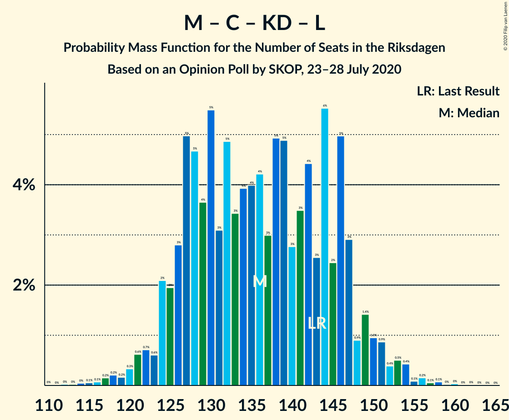

# Opinion Poll by SKOP, 23–28 July 2020

<a href="#voting-intentions">Voting Intentions</a> | <a href="#seats">Seats</a> | <a href="#coalitions">Coalitions</a> | <a href="#technical-information">Technical Information</a>

## Voting Intentions

### Confidence Intervals

| Party | Last Result | Poll Result | 80% Confidence Interval | 90% Confidence Interval | 95% Confidence Interval | 99% Confidence Interval |
|:-----:|:-----------:|:-----------:|:-----------------------:|:-----------------------:|:-----------------------:|:-----------------------:|
| Sveriges socialdemokratiska arbetareparti | 28.3% | 28.2% | 26.4–30.1% |26.0–30.6% |25.5–31.1% |24.7–32.0% |
| Moderata samlingspartiet | 19.8% | 21.1% | 19.5–22.8% |19.1–23.3% |18.7–23.7% |17.9–24.6% |
| Sverigedemokraterna | 17.5% | 17.9% | 16.4–19.6% |16.0–20.0% |15.7–20.4% |15.0–21.2% |
| Vänsterpartiet | 8.0% | 10.4% | 9.3–11.7% |8.9–12.1% |8.7–12.4% |8.1–13.1% |
| Centerpartiet | 8.6% | 8.0% | 7.0–9.2% |6.7–9.6% |6.5–9.9% |6.1–10.5% |
| Kristdemokraterna | 6.3% | 5.9% | 5.1–7.0% |4.8–7.3% |4.6–7.6% |4.3–8.1% |
| Liberalerna | 5.5% | 3.7% | 3.0–4.5% |2.8–4.8% |2.7–5.0% |2.4–5.5% |
| Miljöpartiet de gröna | 4.4% | 3.4% | 2.7–4.2% |2.6–4.5% |2.4–4.7% |2.1–5.1% |

*Note:* The poll result column reflects the actual value used in the calculations. Published results may vary slightly, and in addition be rounded to fewer digits.

## Seats

### Confidence Intervals

| Party | Last Result | Median | 80% Confidence Interval | 90% Confidence Interval | 95% Confidence Interval | 99% Confidence Interval |
|:-----:|:-----------:|:------:|:-----------------------:|:-----------------------:|:-----------------------:|:-----------------------:|
| <a href="#sveriges-socialdemokratiska-arbetareparti">Sveriges socialdemokratiska arbetareparti</a> | 100 | 104 | 97–112 |96–114 |94–116 |90–120 |
| <a href="#moderata-samlingspartiet">Moderata samlingspartiet</a> | 70 | 78 | 72–85 |70–87 |69–89 |66–93 |
| <a href="#sverigedemokraterna">Sverigedemokraterna</a> | 62 | 66 | 60–73 |59–75 |58–77 |55–80 |
| <a href="#vänsterpartiet">Vänsterpartiet</a> | 28 | 39 | 34–44 |33–45 |32–46 |30–49 |
| <a href="#centerpartiet">Centerpartiet</a> | 31 | 30 | 26–34 |25–36 |24–37 |22–40 |
| <a href="#kristdemokraterna">Kristdemokraterna</a> | 22 | 22 | 19–26 |18–27 |17–28 |16–31 |
| <a href="#liberalerna">Liberalerna</a> | 20 | 0 | 0–16 |0–17 |0–18 |0–20 |
| <a href="#miljöpartiet-de-gröna">Miljöpartiet de gröna</a> | 16 | 0 | 0–15 |0–16 |0–17 |0–18 |

### Sveriges socialdemokratiska arbetareparti

*For a full overview of the results for this party, see the [Sveriges socialdemokratiska arbetareparti](party-sverigessocialdemokratiskaarbetareparti.html) page.*

| Number of Seats | Probability | Accumulated | Special Marks |
|:---------------:|:-----------:|:-----------:|:-------------:|
| 86 | 0% | 100% |  |
| 87 | 0.1% | 99.9% |  |
| 88 | 0.2% | 99.9% |  |
| 89 | 0.2% | 99.7% |  |
| 90 | 0.2% | 99.5% |  |
| 91 | 0.4% | 99.3% |  |
| 92 | 0.5% | 98.9% |  |
| 93 | 0.7% | 98% |  |
| 94 | 1.2% | 98% |  |
| 95 | 1.1% | 96% |  |
| 96 | 4% | 95% |  |
| 97 | 3% | 91% |  |
| 98 | 3% | 88% |  |
| 99 | 5% | 85% |  |
| 100 | 7% | 80% | Last Result |
| 101 | 6% | 73% |  |
| 102 | 6% | 67% |  |
| 103 | 7% | 61% |  |
| 104 | 6% | 54% | Median |
| 105 | 5% | 48% |  |
| 106 | 8% | 43% |  |
| 107 | 3% | 35% |  |
| 108 | 5% | 32% |  |
| 109 | 4% | 27% |  |
| 110 | 5% | 22% |  |
| 111 | 5% | 18% |  |
| 112 | 4% | 13% |  |
| 113 | 1.4% | 9% |  |
| 114 | 3% | 8% |  |
| 115 | 1.4% | 5% |  |
| 116 | 0.9% | 3% |  |
| 117 | 0.9% | 2% |  |
| 118 | 0.4% | 2% |  |
| 119 | 0.4% | 1.1% |  |
| 120 | 0.3% | 0.7% |  |
| 121 | 0.2% | 0.4% |  |
| 122 | 0.1% | 0.2% |  |
| 123 | 0.1% | 0.2% |  |
| 124 | 0% | 0.1% |  |
| 125 | 0% | 0% |  |

### Moderata samlingspartiet

*For a full overview of the results for this party, see the [Moderata samlingspartiet](party-moderatasamlingspartiet.html) page.*

| Number of Seats | Probability | Accumulated | Special Marks |
|:---------------:|:-----------:|:-----------:|:-------------:|
| 63 | 0.1% | 100% |  |
| 64 | 0.2% | 99.9% |  |
| 65 | 0.1% | 99.7% |  |
| 66 | 0.7% | 99.6% |  |
| 67 | 0.5% | 99.0% |  |
| 68 | 0.2% | 98% |  |
| 69 | 3% | 98% |  |
| 70 | 1.4% | 95% | Last Result |
| 71 | 1.3% | 94% |  |
| 72 | 6% | 93% |  |
| 73 | 5% | 86% |  |
| 74 | 2% | 81% |  |
| 75 | 16% | 79% |  |
| 76 | 3% | 63% |  |
| 77 | 3% | 60% |  |
| 78 | 13% | 56% | Median |
| 79 | 3% | 44% |  |
| 80 | 3% | 41% |  |
| 81 | 17% | 38% |  |
| 82 | 2% | 22% |  |
| 83 | 2% | 19% |  |
| 84 | 7% | 17% |  |
| 85 | 3% | 10% |  |
| 86 | 0.9% | 7% |  |
| 87 | 3% | 6% |  |
| 88 | 0.9% | 4% |  |
| 89 | 0.2% | 3% |  |
| 90 | 1.1% | 2% |  |
| 91 | 0.6% | 1.4% |  |
| 92 | 0.1% | 0.7% |  |
| 93 | 0.5% | 0.6% |  |
| 94 | 0.1% | 0.2% |  |
| 95 | 0% | 0.1% |  |
| 96 | 0% | 0.1% |  |
| 97 | 0% | 0% |  |

### Sverigedemokraterna

*For a full overview of the results for this party, see the [Sverigedemokraterna](party-sverigedemokraterna.html) page.*

| Number of Seats | Probability | Accumulated | Special Marks |
|:---------------:|:-----------:|:-----------:|:-------------:|
| 52 | 0% | 100% |  |
| 53 | 0.1% | 99.9% |  |
| 54 | 0.2% | 99.8% |  |
| 55 | 0.4% | 99.7% |  |
| 56 | 0.4% | 99.2% |  |
| 57 | 1.2% | 98.8% |  |
| 58 | 1.1% | 98% |  |
| 59 | 4% | 96% |  |
| 60 | 3% | 93% |  |
| 61 | 4% | 90% |  |
| 62 | 7% | 85% | Last Result |
| 63 | 13% | 78% |  |
| 64 | 4% | 65% |  |
| 65 | 10% | 62% |  |
| 66 | 4% | 52% | Median |
| 67 | 8% | 48% |  |
| 68 | 6% | 39% |  |
| 69 | 4% | 33% |  |
| 70 | 7% | 29% |  |
| 71 | 7% | 22% |  |
| 72 | 2% | 15% |  |
| 73 | 4% | 13% |  |
| 74 | 2% | 8% |  |
| 75 | 2% | 6% |  |
| 76 | 2% | 4% |  |
| 77 | 0.9% | 3% |  |
| 78 | 0.8% | 2% |  |
| 79 | 0.4% | 1.0% |  |
| 80 | 0.3% | 0.6% |  |
| 81 | 0.1% | 0.3% |  |
| 82 | 0.1% | 0.2% |  |
| 83 | 0% | 0.1% |  |
| 84 | 0% | 0% |  |

### Vänsterpartiet

*For a full overview of the results for this party, see the [Vänsterpartiet](party-vänsterpartiet.html) page.*

| Number of Seats | Probability | Accumulated | Special Marks |
|:---------------:|:-----------:|:-----------:|:-------------:|
| 28 | 0.1% | 100% | Last Result |
| 29 | 0.2% | 99.9% |  |
| 30 | 0.6% | 99.6% |  |
| 31 | 1.2% | 99.1% |  |
| 32 | 2% | 98% |  |
| 33 | 4% | 96% |  |
| 34 | 5% | 92% |  |
| 35 | 6% | 88% |  |
| 36 | 9% | 82% |  |
| 37 | 11% | 73% |  |
| 38 | 9% | 62% |  |
| 39 | 8% | 53% | Median |
| 40 | 9% | 44% |  |
| 41 | 11% | 36% |  |
| 42 | 7% | 24% |  |
| 43 | 5% | 17% |  |
| 44 | 5% | 12% |  |
| 45 | 3% | 7% |  |
| 46 | 2% | 4% |  |
| 47 | 0.9% | 2% |  |
| 48 | 0.8% | 1.4% |  |
| 49 | 0.3% | 0.7% |  |
| 50 | 0.2% | 0.4% |  |
| 51 | 0.1% | 0.2% |  |
| 52 | 0.1% | 0.1% |  |
| 53 | 0% | 0% |  |

### Centerpartiet

*For a full overview of the results for this party, see the [Centerpartiet](party-centerpartiet.html) page.*

| Number of Seats | Probability | Accumulated | Special Marks |
|:---------------:|:-----------:|:-----------:|:-------------:|
| 20 | 0% | 100% |  |
| 21 | 0.1% | 99.9% |  |
| 22 | 0.6% | 99.8% |  |
| 23 | 1.2% | 99.3% |  |
| 24 | 2% | 98% |  |
| 25 | 4% | 96% |  |
| 26 | 7% | 92% |  |
| 27 | 8% | 85% |  |
| 28 | 10% | 77% |  |
| 29 | 15% | 67% |  |
| 30 | 10% | 52% | Median |
| 31 | 7% | 42% | Last Result |
| 32 | 13% | 34% |  |
| 33 | 8% | 21% |  |
| 34 | 5% | 13% |  |
| 35 | 3% | 9% |  |
| 36 | 3% | 6% |  |
| 37 | 0.9% | 3% |  |
| 38 | 0.7% | 2% |  |
| 39 | 0.8% | 1.3% |  |
| 40 | 0.3% | 0.5% |  |
| 41 | 0.1% | 0.2% |  |
| 42 | 0.1% | 0.1% |  |
| 43 | 0% | 0% |  |

### Kristdemokraterna

*For a full overview of the results for this party, see the [Kristdemokraterna](party-kristdemokraterna.html) page.*

| Number of Seats | Probability | Accumulated | Special Marks |
|:---------------:|:-----------:|:-----------:|:-------------:|
| 0 | 0.2% | 100% |  |
| 1 | 0% | 99.8% |  |
| 2 | 0% | 99.8% |  |
| 3 | 0% | 99.8% |  |
| 4 | 0% | 99.8% |  |
| 5 | 0% | 99.8% |  |
| 6 | 0% | 99.8% |  |
| 7 | 0% | 99.8% |  |
| 8 | 0% | 99.8% |  |
| 9 | 0% | 99.8% |  |
| 10 | 0% | 99.8% |  |
| 11 | 0% | 99.8% |  |
| 12 | 0% | 99.8% |  |
| 13 | 0% | 99.8% |  |
| 14 | 0% | 99.8% |  |
| 15 | 0.2% | 99.8% |  |
| 16 | 1.0% | 99.6% |  |
| 17 | 2% | 98.6% |  |
| 18 | 4% | 96% |  |
| 19 | 9% | 92% |  |
| 20 | 10% | 83% |  |
| 21 | 15% | 73% |  |
| 22 | 13% | 58% | Last Result, Median |
| 23 | 11% | 45% |  |
| 24 | 11% | 34% |  |
| 25 | 8% | 23% |  |
| 26 | 7% | 15% |  |
| 27 | 3% | 8% |  |
| 28 | 2% | 4% |  |
| 29 | 1.1% | 2% |  |
| 30 | 0.6% | 1.1% |  |
| 31 | 0.4% | 0.5% |  |
| 32 | 0.1% | 0.2% |  |
| 33 | 0% | 0.1% |  |
| 34 | 0% | 0% |  |

### Liberalerna

*For a full overview of the results for this party, see the [Liberalerna](party-liberalerna.html) page.*

| Number of Seats | Probability | Accumulated | Special Marks |
|:---------------:|:-----------:|:-----------:|:-------------:|
| 0 | 64% | 100% | Median |
| 1 | 0% | 36% |  |
| 2 | 0% | 36% |  |
| 3 | 0% | 36% |  |
| 4 | 0% | 36% |  |
| 5 | 0% | 36% |  |
| 6 | 0% | 36% |  |
| 7 | 0% | 36% |  |
| 8 | 0% | 36% |  |
| 9 | 0% | 36% |  |
| 10 | 0% | 36% |  |
| 11 | 0% | 36% |  |
| 12 | 0% | 36% |  |
| 13 | 0% | 36% |  |
| 14 | 3% | 36% |  |
| 15 | 16% | 33% |  |
| 16 | 9% | 17% |  |
| 17 | 4% | 8% |  |
| 18 | 3% | 4% |  |
| 19 | 1.1% | 2% |  |
| 20 | 0.4% | 0.7% | Last Result |
| 21 | 0.2% | 0.3% |  |
| 22 | 0% | 0.1% |  |
| 23 | 0% | 0% |  |

### Miljöpartiet de gröna

*For a full overview of the results for this party, see the [Miljöpartiet de gröna](party-miljöpartietdegröna.html) page.*

| Number of Seats | Probability | Accumulated | Special Marks |
|:---------------:|:-----------:|:-----------:|:-------------:|
| 0 | 81% | 100% | Median |
| 1 | 0% | 19% |  |
| 2 | 0% | 19% |  |
| 3 | 0% | 19% |  |
| 4 | 0% | 19% |  |
| 5 | 0% | 19% |  |
| 6 | 0% | 19% |  |
| 7 | 0% | 19% |  |
| 8 | 0% | 19% |  |
| 9 | 0% | 19% |  |
| 10 | 0% | 19% |  |
| 11 | 0% | 19% |  |
| 12 | 0% | 19% |  |
| 13 | 0% | 19% |  |
| 14 | 0.5% | 19% |  |
| 15 | 11% | 19% |  |
| 16 | 4% | 7% | Last Result |
| 17 | 2% | 4% |  |
| 18 | 1.3% | 2% |  |
| 19 | 0.3% | 0.5% |  |
| 20 | 0.1% | 0.2% |  |
| 21 | 0% | 0% |  |

## Coalitions

### Confidence Intervals

| Coalition | Last Result | Median | Majority? | 80% Confidence Interval | 90% Confidence Interval | 95% Confidence Interval | 99% Confidence Interval |
|:---------:|:-----------:|:------:|:---------:|:-----------------------:|:-----------------------:|:-----------------------:|:-----------------------:|
| Sveriges socialdemokratiska arbetareparti – Moderata samlingspartiet – Centerpartiet | 201 | 213 | 100% | 202–223 | 199–225 | 197–227 | 192–231 |
| Sveriges socialdemokratiska arbetareparti – Moderata samlingspartiet | 170 | 183 | 85% | 172–192 | 170–195 | 168–197 | 164–202 |
| Sveriges socialdemokratiska arbetareparti – Vänsterpartiet – Centerpartiet – Liberalerna – Miljöpartiet de gröna | 195 | 183 | 83% | 172–191 | 170–193 | 168–195 | 164–201 |
| Moderata samlingspartiet – Sverigedemokraterna – Kristdemokraterna | 154 | 166 | 17% | 158–177 | 156–179 | 154–181 | 148–185 |
| Sveriges socialdemokratiska arbetareparti – Vänsterpartiet – Miljöpartiet de gröna | 144 | 146 | 0% | 137–157 | 135–159 | 133–161 | 129–165 |
| Moderata samlingspartiet – Sverigedemokraterna | 132 | 144 | 0% | 136–154 | 135–156 | 132–158 | 128–163 |
| Sveriges socialdemokratiska arbetareparti – Centerpartiet – Liberalerna – Miljöpartiet de gröna | 167 | 144 | 0% | 132–153 | 130–156 | 128–158 | 125–164 |
| Sveriges socialdemokratiska arbetareparti – Vänsterpartiet | 128 | 143 | 0% | 134–152 | 132–156 | 131–157 | 126–161 |
| Moderata samlingspartiet – Centerpartiet – Kristdemokraterna – Liberalerna | 143 | 136 | 0% | 127–146 | 124–149 | 123–151 | 118–154 |
| Moderata samlingspartiet – Centerpartiet – Kristdemokraterna | 123 | 130 | 0% | 123–139 | 120–142 | 118–144 | 114–148 |
| Moderata samlingspartiet – Centerpartiet – Liberalerna | 121 | 114 | 0% | 104–125 | 102–127 | 100–129 | 97–133 |
| Sveriges socialdemokratiska arbetareparti – Miljöpartiet de gröna | 116 | 107 | 0% | 99–118 | 97–120 | 96–123 | 91–127 |
| Moderata samlingspartiet – Centerpartiet | 101 | 108 | 0% | 101–116 | 99–118 | 97–120 | 93–124 |

### Sveriges socialdemokratiska arbetareparti – Moderata samlingspartiet – Centerpartiet

| Number of Seats | Probability | Accumulated | Special Marks |
|:---------------:|:-----------:|:-----------:|:-------------:|
| 187 | 0% | 100% |  |
| 188 | 0% | 99.9% |  |
| 189 | 0% | 99.9% |  |
| 190 | 0.1% | 99.9% |  |
| 191 | 0.2% | 99.8% |  |
| 192 | 0.3% | 99.6% |  |
| 193 | 0.2% | 99.3% |  |
| 194 | 0.2% | 99.1% |  |
| 195 | 0.3% | 98.9% |  |
| 196 | 0.4% | 98.6% |  |
| 197 | 0.8% | 98% |  |
| 198 | 0.9% | 97% |  |
| 199 | 3% | 97% |  |
| 200 | 2% | 94% |  |
| 201 | 1.3% | 92% | Last Result |
| 202 | 2% | 91% |  |
| 203 | 1.2% | 88% |  |
| 204 | 3% | 87% |  |
| 205 | 3% | 84% |  |
| 206 | 2% | 81% |  |
| 207 | 4% | 79% |  |
| 208 | 6% | 76% |  |
| 209 | 3% | 70% |  |
| 210 | 7% | 67% |  |
| 211 | 4% | 60% |  |
| 212 | 2% | 56% | Median |
| 213 | 11% | 54% |  |
| 214 | 3% | 43% |  |
| 215 | 4% | 40% |  |
| 216 | 3% | 36% |  |
| 217 | 3% | 33% |  |
| 218 | 3% | 30% |  |
| 219 | 4% | 26% |  |
| 220 | 3% | 22% |  |
| 221 | 6% | 19% |  |
| 222 | 2% | 13% |  |
| 223 | 3% | 11% |  |
| 224 | 1.0% | 8% |  |
| 225 | 2% | 7% |  |
| 226 | 1.4% | 5% |  |
| 227 | 1.2% | 3% |  |
| 228 | 0.7% | 2% |  |
| 229 | 0.5% | 2% |  |
| 230 | 0.1% | 1.0% |  |
| 231 | 0.4% | 0.9% |  |
| 232 | 0.1% | 0.5% |  |
| 233 | 0.2% | 0.4% |  |
| 234 | 0.1% | 0.2% |  |
| 235 | 0% | 0.1% |  |
| 236 | 0% | 0.1% |  |
| 237 | 0% | 0% |  |

### Sveriges socialdemokratiska arbetareparti – Moderata samlingspartiet

| Number of Seats | Probability | Accumulated | Special Marks |
|:---------------:|:-----------:|:-----------:|:-------------:|
| 159 | 0% | 100% |  |
| 160 | 0% | 99.9% |  |
| 161 | 0.1% | 99.9% |  |
| 162 | 0.1% | 99.8% |  |
| 163 | 0.1% | 99.7% |  |
| 164 | 0.1% | 99.6% |  |
| 165 | 0.4% | 99.4% |  |
| 166 | 0.3% | 99.0% |  |
| 167 | 0.7% | 98.7% |  |
| 168 | 0.7% | 98% |  |
| 169 | 1.1% | 97% |  |
| 170 | 1.2% | 96% | Last Result |
| 171 | 4% | 95% |  |
| 172 | 1.3% | 91% |  |
| 173 | 2% | 90% |  |
| 174 | 3% | 88% |  |
| 175 | 3% | 85% | Majority |
| 176 | 4% | 83% |  |
| 177 | 3% | 78% |  |
| 178 | 3% | 75% |  |
| 179 | 6% | 72% |  |
| 180 | 4% | 66% |  |
| 181 | 7% | 62% |  |
| 182 | 4% | 55% | Median |
| 183 | 4% | 51% |  |
| 184 | 6% | 47% |  |
| 185 | 4% | 41% |  |
| 186 | 6% | 38% |  |
| 187 | 5% | 32% |  |
| 188 | 3% | 27% |  |
| 189 | 4% | 24% |  |
| 190 | 6% | 20% |  |
| 191 | 2% | 14% |  |
| 192 | 3% | 12% |  |
| 193 | 2% | 9% |  |
| 194 | 1.2% | 8% |  |
| 195 | 2% | 6% |  |
| 196 | 0.6% | 4% |  |
| 197 | 2% | 4% |  |
| 198 | 0.4% | 2% |  |
| 199 | 0.7% | 2% |  |
| 200 | 0.3% | 1.0% |  |
| 201 | 0.2% | 0.8% |  |
| 202 | 0.3% | 0.6% |  |
| 203 | 0.1% | 0.2% |  |
| 204 | 0.1% | 0.2% |  |
| 205 | 0.1% | 0.1% |  |
| 206 | 0% | 0% |  |

### Sveriges socialdemokratiska arbetareparti – Vänsterpartiet – Centerpartiet – Liberalerna – Miljöpartiet de gröna

| Number of Seats | Probability | Accumulated | Special Marks |
|:---------------:|:-----------:|:-----------:|:-------------:|
| 160 | 0.1% | 100% |  |
| 161 | 0% | 99.9% |  |
| 162 | 0.1% | 99.9% |  |
| 163 | 0.1% | 99.7% |  |
| 164 | 0.2% | 99.6% |  |
| 165 | 0.5% | 99.4% |  |
| 166 | 0.4% | 98.9% |  |
| 167 | 0.5% | 98.5% |  |
| 168 | 1.1% | 98% |  |
| 169 | 1.0% | 97% |  |
| 170 | 1.2% | 96% |  |
| 171 | 2% | 95% |  |
| 172 | 4% | 93% |  |
| 173 | 3% | 89% | Median |
| 174 | 3% | 86% |  |
| 175 | 3% | 83% | Majority |
| 176 | 5% | 79% |  |
| 177 | 4% | 74% |  |
| 178 | 4% | 71% |  |
| 179 | 3% | 67% |  |
| 180 | 6% | 65% |  |
| 181 | 4% | 59% |  |
| 182 | 4% | 55% |  |
| 183 | 3% | 51% |  |
| 184 | 5% | 47% |  |
| 185 | 7% | 42% |  |
| 186 | 4% | 35% |  |
| 187 | 5% | 31% |  |
| 188 | 4% | 26% |  |
| 189 | 8% | 22% |  |
| 190 | 2% | 14% |  |
| 191 | 5% | 12% |  |
| 192 | 1.1% | 7% |  |
| 193 | 1.5% | 6% |  |
| 194 | 1.0% | 4% |  |
| 195 | 0.7% | 3% | Last Result |
| 196 | 0.5% | 2% |  |
| 197 | 0.4% | 2% |  |
| 198 | 0.4% | 2% |  |
| 199 | 0.3% | 1.2% |  |
| 200 | 0.2% | 0.9% |  |
| 201 | 0.2% | 0.6% |  |
| 202 | 0.1% | 0.4% |  |
| 203 | 0.1% | 0.3% |  |
| 204 | 0% | 0.1% |  |
| 205 | 0% | 0.1% |  |
| 206 | 0% | 0% |  |

### Moderata samlingspartiet – Sverigedemokraterna – Kristdemokraterna

| Number of Seats | Probability | Accumulated | Special Marks |
|:---------------:|:-----------:|:-----------:|:-------------:|
| 144 | 0% | 100% |  |
| 145 | 0% | 99.9% |  |
| 146 | 0.1% | 99.9% |  |
| 147 | 0.1% | 99.7% |  |
| 148 | 0.2% | 99.6% |  |
| 149 | 0.2% | 99.4% |  |
| 150 | 0.3% | 99.1% |  |
| 151 | 0.4% | 98.8% |  |
| 152 | 0.4% | 98% |  |
| 153 | 0.5% | 98% |  |
| 154 | 0.7% | 98% | Last Result |
| 155 | 1.0% | 97% |  |
| 156 | 1.5% | 96% |  |
| 157 | 1.1% | 94% |  |
| 158 | 5% | 93% |  |
| 159 | 2% | 88% |  |
| 160 | 8% | 86% |  |
| 161 | 4% | 78% |  |
| 162 | 5% | 74% |  |
| 163 | 4% | 69% |  |
| 164 | 7% | 65% |  |
| 165 | 5% | 58% |  |
| 166 | 3% | 53% | Median |
| 167 | 4% | 49% |  |
| 168 | 4% | 45% |  |
| 169 | 6% | 41% |  |
| 170 | 3% | 35% |  |
| 171 | 4% | 33% |  |
| 172 | 4% | 29% |  |
| 173 | 5% | 26% |  |
| 174 | 3% | 21% |  |
| 175 | 3% | 17% | Majority |
| 176 | 3% | 14% |  |
| 177 | 4% | 11% |  |
| 178 | 2% | 7% |  |
| 179 | 1.2% | 5% |  |
| 180 | 1.0% | 4% |  |
| 181 | 1.1% | 3% |  |
| 182 | 0.5% | 2% |  |
| 183 | 0.4% | 1.5% |  |
| 184 | 0.5% | 1.1% |  |
| 185 | 0.2% | 0.6% |  |
| 186 | 0.1% | 0.4% |  |
| 187 | 0.1% | 0.3% |  |
| 188 | 0% | 0.1% |  |
| 189 | 0.1% | 0.1% |  |
| 190 | 0% | 0% |  |

### Sveriges socialdemokratiska arbetareparti – Vänsterpartiet – Miljöpartiet de gröna

| Number of Seats | Probability | Accumulated | Special Marks |
|:---------------:|:-----------:|:-----------:|:-------------:|
| 124 | 0% | 100% |  |
| 125 | 0% | 99.9% |  |
| 126 | 0.1% | 99.9% |  |
| 127 | 0.1% | 99.9% |  |
| 128 | 0.2% | 99.8% |  |
| 129 | 0.2% | 99.6% |  |
| 130 | 0.3% | 99.4% |  |
| 131 | 0.4% | 99.1% |  |
| 132 | 0.7% | 98.7% |  |
| 133 | 1.1% | 98% |  |
| 134 | 2% | 97% |  |
| 135 | 2% | 95% |  |
| 136 | 1.3% | 94% |  |
| 137 | 3% | 92% |  |
| 138 | 3% | 89% |  |
| 139 | 3% | 87% |  |
| 140 | 3% | 83% |  |
| 141 | 6% | 81% |  |
| 142 | 6% | 74% |  |
| 143 | 6% | 68% | Median |
| 144 | 5% | 62% | Last Result |
| 145 | 5% | 57% |  |
| 146 | 5% | 52% |  |
| 147 | 6% | 47% |  |
| 148 | 5% | 41% |  |
| 149 | 4% | 36% |  |
| 150 | 4% | 32% |  |
| 151 | 4% | 28% |  |
| 152 | 4% | 24% |  |
| 153 | 2% | 21% |  |
| 154 | 2% | 19% |  |
| 155 | 2% | 17% |  |
| 156 | 4% | 15% |  |
| 157 | 2% | 11% |  |
| 158 | 2% | 8% |  |
| 159 | 2% | 6% |  |
| 160 | 0.6% | 4% |  |
| 161 | 2% | 4% |  |
| 162 | 0.2% | 2% |  |
| 163 | 1.0% | 2% |  |
| 164 | 0.3% | 0.8% |  |
| 165 | 0.1% | 0.6% |  |
| 166 | 0.1% | 0.4% |  |
| 167 | 0.1% | 0.3% |  |
| 168 | 0.1% | 0.3% |  |
| 169 | 0.1% | 0.2% |  |
| 170 | 0% | 0.1% |  |
| 171 | 0% | 0.1% |  |
| 172 | 0% | 0% |  |

### Moderata samlingspartiet – Sverigedemokraterna

| Number of Seats | Probability | Accumulated | Special Marks |
|:---------------:|:-----------:|:-----------:|:-------------:|
| 123 | 0% | 100% |  |
| 124 | 0.1% | 99.9% |  |
| 125 | 0% | 99.9% |  |
| 126 | 0.1% | 99.9% |  |
| 127 | 0.2% | 99.7% |  |
| 128 | 0.3% | 99.5% |  |
| 129 | 0.3% | 99.2% |  |
| 130 | 0.4% | 99.0% |  |
| 131 | 0.6% | 98.6% |  |
| 132 | 0.7% | 98% | Last Result |
| 133 | 1.0% | 97% |  |
| 134 | 1.2% | 96% |  |
| 135 | 1.5% | 95% |  |
| 136 | 8% | 94% |  |
| 137 | 3% | 86% |  |
| 138 | 4% | 82% |  |
| 139 | 3% | 79% |  |
| 140 | 6% | 76% |  |
| 141 | 5% | 70% |  |
| 142 | 3% | 65% |  |
| 143 | 10% | 62% |  |
| 144 | 6% | 52% | Median |
| 145 | 4% | 46% |  |
| 146 | 3% | 42% |  |
| 147 | 4% | 38% |  |
| 148 | 5% | 34% |  |
| 149 | 3% | 29% |  |
| 150 | 3% | 26% |  |
| 151 | 4% | 23% |  |
| 152 | 7% | 19% |  |
| 153 | 2% | 12% |  |
| 154 | 3% | 11% |  |
| 155 | 2% | 8% |  |
| 156 | 1.3% | 6% |  |
| 157 | 1.3% | 4% |  |
| 158 | 0.5% | 3% |  |
| 159 | 0.4% | 2% |  |
| 160 | 1.1% | 2% |  |
| 161 | 0.3% | 1.0% |  |
| 162 | 0.2% | 0.7% |  |
| 163 | 0.2% | 0.5% |  |
| 164 | 0.1% | 0.4% |  |
| 165 | 0.1% | 0.2% |  |
| 166 | 0% | 0.1% |  |
| 167 | 0% | 0.1% |  |
| 168 | 0% | 0.1% |  |
| 169 | 0% | 0% |  |

### Sveriges socialdemokratiska arbetareparti – Centerpartiet – Liberalerna – Miljöpartiet de gröna

| Number of Seats | Probability | Accumulated | Special Marks |
|:---------------:|:-----------:|:-----------:|:-------------:|
| 120 | 0.1% | 100% |  |
| 121 | 0% | 99.9% |  |
| 122 | 0% | 99.9% |  |
| 123 | 0.1% | 99.9% |  |
| 124 | 0.2% | 99.8% |  |
| 125 | 0.3% | 99.6% |  |
| 126 | 0.6% | 99.3% |  |
| 127 | 0.7% | 98.7% |  |
| 128 | 1.2% | 98% |  |
| 129 | 0.8% | 97% |  |
| 130 | 1.2% | 96% |  |
| 131 | 2% | 95% |  |
| 132 | 4% | 93% |  |
| 133 | 2% | 89% |  |
| 134 | 3% | 87% | Median |
| 135 | 2% | 84% |  |
| 136 | 3% | 82% |  |
| 137 | 3% | 79% |  |
| 138 | 6% | 76% |  |
| 139 | 4% | 70% |  |
| 140 | 4% | 66% |  |
| 141 | 5% | 62% |  |
| 142 | 2% | 58% |  |
| 143 | 4% | 56% |  |
| 144 | 7% | 51% |  |
| 145 | 5% | 44% |  |
| 146 | 5% | 40% |  |
| 147 | 4% | 34% |  |
| 148 | 3% | 30% |  |
| 149 | 4% | 27% |  |
| 150 | 5% | 23% |  |
| 151 | 2% | 18% |  |
| 152 | 2% | 15% |  |
| 153 | 4% | 13% |  |
| 154 | 2% | 9% |  |
| 155 | 2% | 7% |  |
| 156 | 0.7% | 5% |  |
| 157 | 0.9% | 5% |  |
| 158 | 1.5% | 4% |  |
| 159 | 0.5% | 2% |  |
| 160 | 0.3% | 2% |  |
| 161 | 0.4% | 1.5% |  |
| 162 | 0.3% | 1.1% |  |
| 163 | 0.2% | 0.8% |  |
| 164 | 0.2% | 0.5% |  |
| 165 | 0% | 0.3% |  |
| 166 | 0.1% | 0.3% |  |
| 167 | 0.1% | 0.2% | Last Result |
| 168 | 0% | 0.1% |  |
| 169 | 0% | 0.1% |  |
| 170 | 0% | 0% |  |

### Sveriges socialdemokratiska arbetareparti – Vänsterpartiet

| Number of Seats | Probability | Accumulated | Special Marks |
|:---------------:|:-----------:|:-----------:|:-------------:|
| 121 | 0% | 100% |  |
| 122 | 0% | 99.9% |  |
| 123 | 0.1% | 99.9% |  |
| 124 | 0.1% | 99.8% |  |
| 125 | 0.1% | 99.7% |  |
| 126 | 0.1% | 99.6% |  |
| 127 | 0.2% | 99.4% |  |
| 128 | 0.3% | 99.2% | Last Result |
| 129 | 0.4% | 98.9% |  |
| 130 | 0.6% | 98.5% |  |
| 131 | 1.0% | 98% |  |
| 132 | 3% | 97% |  |
| 133 | 2% | 94% |  |
| 134 | 4% | 92% |  |
| 135 | 2% | 88% |  |
| 136 | 2% | 86% |  |
| 137 | 4% | 84% |  |
| 138 | 3% | 80% |  |
| 139 | 4% | 77% |  |
| 140 | 3% | 73% |  |
| 141 | 8% | 70% |  |
| 142 | 9% | 62% |  |
| 143 | 6% | 54% | Median |
| 144 | 6% | 47% |  |
| 145 | 5% | 41% |  |
| 146 | 5% | 36% |  |
| 147 | 4% | 31% |  |
| 148 | 4% | 27% |  |
| 149 | 3% | 22% |  |
| 150 | 3% | 20% |  |
| 151 | 3% | 16% |  |
| 152 | 3% | 13% |  |
| 153 | 1.5% | 10% |  |
| 154 | 1.4% | 8% |  |
| 155 | 1.2% | 7% |  |
| 156 | 3% | 6% |  |
| 157 | 0.4% | 3% |  |
| 158 | 1.2% | 2% |  |
| 159 | 0.5% | 1.3% |  |
| 160 | 0.3% | 0.9% |  |
| 161 | 0.3% | 0.5% |  |
| 162 | 0.1% | 0.3% |  |
| 163 | 0.1% | 0.2% |  |
| 164 | 0% | 0.1% |  |
| 165 | 0% | 0.1% |  |
| 166 | 0% | 0% |  |

### Moderata samlingspartiet – Centerpartiet – Kristdemokraterna – Liberalerna

| Number of Seats | Probability | Accumulated | Special Marks |
|:---------------:|:-----------:|:-----------:|:-------------:|
| 112 | 0% | 100% |  |
| 113 | 0% | 99.9% |  |
| 114 | 0% | 99.9% |  |
| 115 | 0.1% | 99.9% |  |
| 116 | 0.1% | 99.8% |  |
| 117 | 0.2% | 99.8% |  |
| 118 | 0.2% | 99.6% |  |
| 119 | 0.2% | 99.4% |  |
| 120 | 0.3% | 99.2% |  |
| 121 | 0.6% | 98.9% |  |
| 122 | 0.7% | 98% |  |
| 123 | 0.6% | 98% |  |
| 124 | 2% | 97% |  |
| 125 | 2% | 95% |  |
| 126 | 3% | 93% |  |
| 127 | 5% | 90% |  |
| 128 | 5% | 85% |  |
| 129 | 4% | 80% |  |
| 130 | 5% | 77% | Median |
| 131 | 3% | 71% |  |
| 132 | 5% | 68% |  |
| 133 | 3% | 63% |  |
| 134 | 4% | 60% |  |
| 135 | 4% | 56% |  |
| 136 | 4% | 52% |  |
| 137 | 3% | 48% |  |
| 138 | 5% | 45% |  |
| 139 | 5% | 40% |  |
| 140 | 3% | 35% |  |
| 141 | 3% | 32% |  |
| 142 | 4% | 29% |  |
| 143 | 3% | 24% | Last Result |
| 144 | 6% | 22% |  |
| 145 | 2% | 16% |  |
| 146 | 5% | 14% |  |
| 147 | 3% | 9% |  |
| 148 | 0.9% | 6% |  |
| 149 | 1.4% | 5% |  |
| 150 | 1.0% | 4% |  |
| 151 | 0.9% | 3% |  |
| 152 | 0.4% | 2% |  |
| 153 | 0.5% | 1.4% |  |
| 154 | 0.4% | 0.9% |  |
| 155 | 0.1% | 0.5% |  |
| 156 | 0.2% | 0.4% |  |
| 157 | 0.1% | 0.2% |  |
| 158 | 0.1% | 0.2% |  |
| 159 | 0% | 0.1% |  |
| 160 | 0% | 0.1% |  |
| 161 | 0% | 0% |  |

### Moderata samlingspartiet – Centerpartiet – Kristdemokraterna

| Number of Seats | Probability | Accumulated | Special Marks |
|:---------------:|:-----------:|:-----------:|:-------------:|
| 109 | 0% | 100% |  |
| 110 | 0% | 99.9% |  |
| 111 | 0% | 99.9% |  |
| 112 | 0.1% | 99.9% |  |
| 113 | 0.2% | 99.8% |  |
| 114 | 0.4% | 99.5% |  |
| 115 | 0.2% | 99.1% |  |
| 116 | 0.4% | 98.8% |  |
| 117 | 0.8% | 98% |  |
| 118 | 0.7% | 98% |  |
| 119 | 1.2% | 97% |  |
| 120 | 1.2% | 96% |  |
| 121 | 1.4% | 95% |  |
| 122 | 2% | 93% |  |
| 123 | 3% | 92% | Last Result |
| 124 | 3% | 88% |  |
| 125 | 5% | 85% |  |
| 126 | 5% | 80% |  |
| 127 | 8% | 75% |  |
| 128 | 6% | 68% |  |
| 129 | 8% | 62% |  |
| 130 | 7% | 53% | Median |
| 131 | 7% | 47% |  |
| 132 | 7% | 40% |  |
| 133 | 4% | 33% |  |
| 134 | 5% | 29% |  |
| 135 | 4% | 25% |  |
| 136 | 4% | 21% |  |
| 137 | 2% | 17% |  |
| 138 | 2% | 14% |  |
| 139 | 2% | 12% |  |
| 140 | 2% | 10% |  |
| 141 | 2% | 8% |  |
| 142 | 1.5% | 6% |  |
| 143 | 1.4% | 5% |  |
| 144 | 1.1% | 3% |  |
| 145 | 0.6% | 2% |  |
| 146 | 0.5% | 1.4% |  |
| 147 | 0.4% | 1.0% |  |
| 148 | 0.4% | 0.6% |  |
| 149 | 0.1% | 0.2% |  |
| 150 | 0.1% | 0.1% |  |
| 151 | 0% | 0.1% |  |
| 152 | 0% | 0% |  |

### Moderata samlingspartiet – Centerpartiet – Liberalerna

| Number of Seats | Probability | Accumulated | Special Marks |
|:---------------:|:-----------:|:-----------:|:-------------:|
| 92 | 0% | 100% |  |
| 93 | 0% | 99.9% |  |
| 94 | 0.1% | 99.9% |  |
| 95 | 0.1% | 99.8% |  |
| 96 | 0.2% | 99.7% |  |
| 97 | 0.3% | 99.6% |  |
| 98 | 0.3% | 99.3% |  |
| 99 | 0.8% | 98.9% |  |
| 100 | 0.8% | 98% |  |
| 101 | 2% | 97% |  |
| 102 | 2% | 95% |  |
| 103 | 2% | 93% |  |
| 104 | 3% | 92% |  |
| 105 | 3% | 88% |  |
| 106 | 2% | 85% |  |
| 107 | 8% | 83% |  |
| 108 | 4% | 76% | Median |
| 109 | 5% | 71% |  |
| 110 | 4% | 66% |  |
| 111 | 5% | 62% |  |
| 112 | 3% | 57% |  |
| 113 | 4% | 54% |  |
| 114 | 3% | 50% |  |
| 115 | 4% | 47% |  |
| 116 | 4% | 43% |  |
| 117 | 5% | 39% |  |
| 118 | 6% | 34% |  |
| 119 | 3% | 28% |  |
| 120 | 4% | 25% |  |
| 121 | 3% | 21% | Last Result |
| 122 | 3% | 18% |  |
| 123 | 2% | 15% |  |
| 124 | 2% | 13% |  |
| 125 | 5% | 11% |  |
| 126 | 1.4% | 7% |  |
| 127 | 2% | 5% |  |
| 128 | 0.5% | 3% |  |
| 129 | 0.7% | 3% |  |
| 130 | 0.7% | 2% |  |
| 131 | 0.4% | 1.3% |  |
| 132 | 0.1% | 0.9% |  |
| 133 | 0.4% | 0.8% |  |
| 134 | 0.1% | 0.4% |  |
| 135 | 0.1% | 0.3% |  |
| 136 | 0.1% | 0.1% |  |
| 137 | 0% | 0.1% |  |
| 138 | 0% | 0% |  |

### Sveriges socialdemokratiska arbetareparti – Miljöpartiet de gröna

| Number of Seats | Probability | Accumulated | Special Marks |
|:---------------:|:-----------:|:-----------:|:-------------:|
| 87 | 0% | 100% |  |
| 88 | 0% | 99.9% |  |
| 89 | 0.1% | 99.9% |  |
| 90 | 0.2% | 99.8% |  |
| 91 | 0.2% | 99.7% |  |
| 92 | 0.4% | 99.4% |  |
| 93 | 0.4% | 99.1% |  |
| 94 | 0.5% | 98.7% |  |
| 95 | 0.7% | 98% |  |
| 96 | 2% | 98% |  |
| 97 | 2% | 96% |  |
| 98 | 2% | 94% |  |
| 99 | 4% | 92% |  |
| 100 | 6% | 88% |  |
| 101 | 4% | 82% |  |
| 102 | 5% | 78% |  |
| 103 | 6% | 73% |  |
| 104 | 5% | 66% | Median |
| 105 | 4% | 61% |  |
| 106 | 7% | 58% |  |
| 107 | 3% | 51% |  |
| 108 | 4% | 48% |  |
| 109 | 5% | 44% |  |
| 110 | 5% | 39% |  |
| 111 | 7% | 34% |  |
| 112 | 4% | 27% |  |
| 113 | 2% | 23% |  |
| 114 | 4% | 21% |  |
| 115 | 2% | 16% |  |
| 116 | 3% | 14% | Last Result |
| 117 | 1.5% | 12% |  |
| 118 | 1.5% | 10% |  |
| 119 | 1.1% | 9% |  |
| 120 | 2% | 7% |  |
| 121 | 1.4% | 5% |  |
| 122 | 0.7% | 3% |  |
| 123 | 0.5% | 3% |  |
| 124 | 0.5% | 2% |  |
| 125 | 0.4% | 2% |  |
| 126 | 0.2% | 1.3% |  |
| 127 | 0.7% | 1.1% |  |
| 128 | 0.1% | 0.4% |  |
| 129 | 0.1% | 0.3% |  |
| 130 | 0.1% | 0.2% |  |
| 131 | 0% | 0.1% |  |
| 132 | 0% | 0.1% |  |
| 133 | 0% | 0% |  |

### Moderata samlingspartiet – Centerpartiet

| Number of Seats | Probability | Accumulated | Special Marks |
|:---------------:|:-----------:|:-----------:|:-------------:|
| 89 | 0% | 100% |  |
| 90 | 0% | 99.9% |  |
| 91 | 0.1% | 99.9% |  |
| 92 | 0.2% | 99.8% |  |
| 93 | 0.3% | 99.6% |  |
| 94 | 0.4% | 99.3% |  |
| 95 | 0.4% | 98.9% |  |
| 96 | 0.9% | 98.6% |  |
| 97 | 0.7% | 98% |  |
| 98 | 1.2% | 97% |  |
| 99 | 2% | 96% |  |
| 100 | 2% | 94% |  |
| 101 | 4% | 92% | Last Result |
| 102 | 2% | 88% |  |
| 103 | 7% | 86% |  |
| 104 | 6% | 79% |  |
| 105 | 6% | 72% |  |
| 106 | 4% | 66% |  |
| 107 | 10% | 62% |  |
| 108 | 6% | 52% | Median |
| 109 | 6% | 46% |  |
| 110 | 9% | 40% |  |
| 111 | 6% | 31% |  |
| 112 | 3% | 26% |  |
| 113 | 4% | 22% |  |
| 114 | 3% | 19% |  |
| 115 | 4% | 16% |  |
| 116 | 3% | 12% |  |
| 117 | 2% | 9% |  |
| 118 | 3% | 7% |  |
| 119 | 0.8% | 4% |  |
| 120 | 0.8% | 3% |  |
| 121 | 0.6% | 2% |  |
| 122 | 0.3% | 2% |  |
| 123 | 0.7% | 1.3% |  |
| 124 | 0.2% | 0.7% |  |
| 125 | 0.2% | 0.4% |  |
| 126 | 0.1% | 0.2% |  |
| 127 | 0.1% | 0.1% |  |
| 128 | 0% | 0.1% |  |
| 129 | 0% | 0% |  |

## Technical Information

### Opinion Poll

+ **Polling firm:** SKOP
+ **Commissioner(s):** —
+ **Fieldwork period:** 23–28 July 2020

### Calculations

+ **Sample size:** 1010
+ **Simulations done:** 1,048,576
+ **Error estimate:** 2.36%

