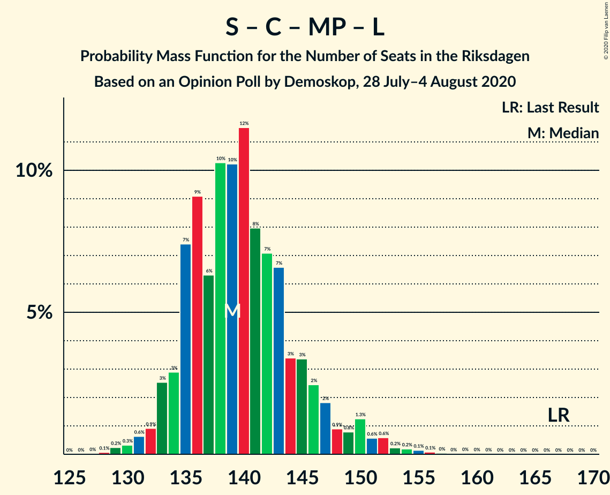

# Opinion Poll by Demoskop, 28 July–4 August 2020

<a href="#voting-intentions">Voting Intentions</a> | <a href="#seats">Seats</a> | <a href="#coalitions">Coalitions</a> | <a href="#technical-information">Technical Information</a>

## Voting Intentions

### Confidence Intervals

| Party | Last Result | Poll Result | 80% Confidence Interval | 90% Confidence Interval | 95% Confidence Interval | 99% Confidence Interval |
|:-----:|:-----------:|:-----------:|:-----------------------:|:-----------------------:|:-----------------------:|:-----------------------:|
| Sveriges socialdemokratiska arbetareparti | 28.3% | 27.3% | 26.2–28.4% |25.9–28.7% |25.6–29.0% |25.1–29.5% |
| Moderata samlingspartiet | 19.8% | 21.6% | 20.6–22.6% |20.3–22.9% |20.1–23.2% |19.6–23.7% |
| Sverigedemokraterna | 17.5% | 20.5% | 19.5–21.6% |19.3–21.8% |19.0–22.1% |18.6–22.6% |
| Centerpartiet | 8.6% | 8.8% | 8.1–9.5% |7.9–9.8% |7.8–9.9% |7.5–10.3% |
| Vänsterpartiet | 8.0% | 6.8% | 6.2–7.5% |6.1–7.7% |5.9–7.8% |5.6–8.2% |
| Kristdemokraterna | 6.3% | 5.6% | 5.0–6.2% |4.9–6.4% |4.8–6.5% |4.5–6.8% |
| Miljöpartiet de gröna | 4.4% | 3.4% | 3.0–3.9% |2.9–4.0% |2.8–4.2% |2.6–4.4% |
| Liberalerna | 5.5% | 3.3% | 2.9–3.8% |2.8–3.9% |2.7–4.0% |2.5–4.3% |

*Note:* The poll result column reflects the actual value used in the calculations. Published results may vary slightly, and in addition be rounded to fewer digits.

## Seats

### Confidence Intervals

| Party | Last Result | Median | 80% Confidence Interval | 90% Confidence Interval | 95% Confidence Interval | 99% Confidence Interval |
|:-----:|:-----------:|:------:|:-----------------------:|:-----------------------:|:-----------------------:|:-----------------------:|
| <a href="#sveriges-socialdemokratiska-arbetareparti">Sveriges socialdemokratiska arbetareparti</a> | 100 | 104 | 100–109 |99–110 |98–111 |95–113 |
| <a href="#moderata-samlingspartiet">Moderata samlingspartiet</a> | 70 | 83 | 79–87 |78–88 |77–89 |74–91 |
| <a href="#sverigedemokraterna">Sverigedemokraterna</a> | 62 | 79 | 75–83 |73–84 |73–85 |71–86 |
| <a href="#centerpartiet">Centerpartiet</a> | 31 | 34 | 31–37 |30–38 |30–38 |29–40 |
| <a href="#vänsterpartiet">Vänsterpartiet</a> | 28 | 26 | 24–29 |23–29 |23–30 |22–31 |
| <a href="#kristdemokraterna">Kristdemokraterna</a> | 22 | 22 | 20–23 |19–24 |18–25 |17–26 |
| <a href="#miljöpartiet-de-gröna">Miljöpartiet de gröna</a> | 16 | 0 | 0 |0–15 |0–15 |0–16 |
| <a href="#liberalerna">Liberalerna</a> | 20 | 0 | 0 |0 |0–15 |0–16 |

### Sveriges socialdemokratiska arbetareparti

*For a full overview of the results for this party, see the [Sveriges socialdemokratiska arbetareparti](party-sverigessocialdemokratiskaarbetareparti.html) page.*

| Number of Seats | Probability | Accumulated | Special Marks |
|:---------------:|:-----------:|:-----------:|:-------------:|
| 93 | 0.1% | 100% |  |
| 94 | 0.2% | 99.9% |  |
| 95 | 0.3% | 99.7% |  |
| 96 | 0.9% | 99.4% |  |
| 97 | 0.9% | 98% |  |
| 98 | 2% | 98% |  |
| 99 | 3% | 96% |  |
| 100 | 5% | 93% | Last Result |
| 101 | 10% | 87% |  |
| 102 | 8% | 77% |  |
| 103 | 10% | 69% |  |
| 104 | 10% | 60% | Median |
| 105 | 10% | 50% |  |
| 106 | 10% | 40% |  |
| 107 | 10% | 30% |  |
| 108 | 8% | 21% |  |
| 109 | 5% | 13% |  |
| 110 | 4% | 7% |  |
| 111 | 1.1% | 3% |  |
| 112 | 1.1% | 2% |  |
| 113 | 0.4% | 0.8% |  |
| 114 | 0.2% | 0.4% |  |
| 115 | 0.1% | 0.2% |  |
| 116 | 0% | 0.1% |  |
| 117 | 0% | 0% |  |

### Moderata samlingspartiet

*For a full overview of the results for this party, see the [Moderata samlingspartiet](party-moderatasamlingspartiet.html) page.*

| Number of Seats | Probability | Accumulated | Special Marks |
|:---------------:|:-----------:|:-----------:|:-------------:|
| 70 | 0% | 100% | Last Result |
| 71 | 0% | 100% |  |
| 72 | 0.1% | 100% |  |
| 73 | 0.2% | 99.9% |  |
| 74 | 0.3% | 99.8% |  |
| 75 | 0.7% | 99.5% |  |
| 76 | 1.0% | 98.8% |  |
| 77 | 2% | 98% |  |
| 78 | 3% | 96% |  |
| 79 | 5% | 93% |  |
| 80 | 9% | 88% |  |
| 81 | 12% | 78% |  |
| 82 | 11% | 66% |  |
| 83 | 14% | 55% | Median |
| 84 | 9% | 41% |  |
| 85 | 14% | 32% |  |
| 86 | 8% | 18% |  |
| 87 | 5% | 10% |  |
| 88 | 2% | 5% |  |
| 89 | 2% | 3% |  |
| 90 | 0.6% | 1.2% |  |
| 91 | 0.3% | 0.6% |  |
| 92 | 0.1% | 0.4% |  |
| 93 | 0.2% | 0.2% |  |
| 94 | 0% | 0.1% |  |
| 95 | 0% | 0% |  |

### Sverigedemokraterna

*For a full overview of the results for this party, see the [Sverigedemokraterna](party-sverigedemokraterna.html) page.*

| Number of Seats | Probability | Accumulated | Special Marks |
|:---------------:|:-----------:|:-----------:|:-------------:|
| 62 | 0% | 100% | Last Result |
| 63 | 0% | 100% |  |
| 64 | 0% | 100% |  |
| 65 | 0% | 100% |  |
| 66 | 0% | 100% |  |
| 67 | 0% | 100% |  |
| 68 | 0% | 100% |  |
| 69 | 0.1% | 99.9% |  |
| 70 | 0.3% | 99.8% |  |
| 71 | 0.6% | 99.6% |  |
| 72 | 1.0% | 99.0% |  |
| 73 | 3% | 98% |  |
| 74 | 4% | 95% |  |
| 75 | 5% | 91% |  |
| 76 | 8% | 86% |  |
| 77 | 11% | 79% |  |
| 78 | 11% | 68% |  |
| 79 | 18% | 57% | Median |
| 80 | 11% | 39% |  |
| 81 | 10% | 28% |  |
| 82 | 7% | 18% |  |
| 83 | 5% | 11% |  |
| 84 | 3% | 5% |  |
| 85 | 1.3% | 3% |  |
| 86 | 0.8% | 1.3% |  |
| 87 | 0.2% | 0.4% |  |
| 88 | 0.2% | 0.3% |  |
| 89 | 0% | 0.1% |  |
| 90 | 0% | 0% |  |

### Centerpartiet

*For a full overview of the results for this party, see the [Centerpartiet](party-centerpartiet.html) page.*

| Number of Seats | Probability | Accumulated | Special Marks |
|:---------------:|:-----------:|:-----------:|:-------------:|
| 27 | 0.1% | 100% |  |
| 28 | 0.3% | 99.9% |  |
| 29 | 1.3% | 99.6% |  |
| 30 | 4% | 98% |  |
| 31 | 7% | 94% | Last Result |
| 32 | 15% | 88% |  |
| 33 | 14% | 73% |  |
| 34 | 16% | 58% | Median |
| 35 | 19% | 42% |  |
| 36 | 10% | 23% |  |
| 37 | 7% | 13% |  |
| 38 | 4% | 6% |  |
| 39 | 0.9% | 1.5% |  |
| 40 | 0.4% | 0.5% |  |
| 41 | 0.1% | 0.1% |  |
| 42 | 0% | 0% |  |

### Vänsterpartiet

*For a full overview of the results for this party, see the [Vänsterpartiet](party-vänsterpartiet.html) page.*

| Number of Seats | Probability | Accumulated | Special Marks |
|:---------------:|:-----------:|:-----------:|:-------------:|
| 21 | 0.4% | 100% |  |
| 22 | 2% | 99.6% |  |
| 23 | 5% | 98% |  |
| 24 | 10% | 93% |  |
| 25 | 21% | 83% |  |
| 26 | 24% | 62% | Median |
| 27 | 18% | 38% |  |
| 28 | 8% | 20% | Last Result |
| 29 | 7% | 12% |  |
| 30 | 4% | 5% |  |
| 31 | 0.8% | 1.0% |  |
| 32 | 0.2% | 0.3% |  |
| 33 | 0% | 0.1% |  |
| 34 | 0% | 0% |  |

### Kristdemokraterna

*For a full overview of the results for this party, see the [Kristdemokraterna](party-kristdemokraterna.html) page.*

| Number of Seats | Probability | Accumulated | Special Marks |
|:---------------:|:-----------:|:-----------:|:-------------:|
| 16 | 0.1% | 100% |  |
| 17 | 0.7% | 99.9% |  |
| 18 | 3% | 99.2% |  |
| 19 | 6% | 96% |  |
| 20 | 16% | 90% |  |
| 21 | 21% | 74% |  |
| 22 | 27% | 54% | Last Result, Median |
| 23 | 19% | 27% |  |
| 24 | 5% | 9% |  |
| 25 | 2% | 3% |  |
| 26 | 1.2% | 1.4% |  |
| 27 | 0.2% | 0.3% |  |
| 28 | 0% | 0.1% |  |
| 29 | 0% | 0% |  |

### Miljöpartiet de gröna

*For a full overview of the results for this party, see the [Miljöpartiet de gröna](party-miljöpartietdegröna.html) page.*

| Number of Seats | Probability | Accumulated | Special Marks |
|:---------------:|:-----------:|:-----------:|:-------------:|
| 0 | 95% | 100% | Median |
| 1 | 0% | 5% |  |
| 2 | 0% | 5% |  |
| 3 | 0% | 5% |  |
| 4 | 0% | 5% |  |
| 5 | 0% | 5% |  |
| 6 | 0% | 5% |  |
| 7 | 0% | 5% |  |
| 8 | 0% | 5% |  |
| 9 | 0% | 5% |  |
| 10 | 0% | 5% |  |
| 11 | 0% | 5% |  |
| 12 | 0% | 5% |  |
| 13 | 0% | 5% |  |
| 14 | 0% | 5% |  |
| 15 | 3% | 5% |  |
| 16 | 2% | 2% | Last Result |
| 17 | 0.3% | 0.3% |  |
| 18 | 0% | 0% |  |

### Liberalerna

*For a full overview of the results for this party, see the [Liberalerna](party-liberalerna.html) page.*

| Number of Seats | Probability | Accumulated | Special Marks |
|:---------------:|:-----------:|:-----------:|:-------------:|
| 0 | 97% | 100% | Median |
| 1 | 0% | 3% |  |
| 2 | 0% | 3% |  |
| 3 | 0% | 3% |  |
| 4 | 0% | 3% |  |
| 5 | 0% | 3% |  |
| 6 | 0% | 3% |  |
| 7 | 0% | 3% |  |
| 8 | 0% | 3% |  |
| 9 | 0% | 3% |  |
| 10 | 0% | 3% |  |
| 11 | 0% | 3% |  |
| 12 | 0% | 3% |  |
| 13 | 0% | 3% |  |
| 14 | 0% | 3% |  |
| 15 | 2% | 3% |  |
| 16 | 0.6% | 0.7% |  |
| 17 | 0.1% | 0.1% |  |
| 18 | 0% | 0% |  |
| 19 | 0% | 0% |  |
| 20 | 0% | 0% | Last Result |

## Coalitions

### Confidence Intervals

| Coalition | Last Result | Median | Majority? | 80% Confidence Interval | 90% Confidence Interval | 95% Confidence Interval | 99% Confidence Interval |
|:---------:|:-----------:|:------:|:---------:|:-----------------------:|:-----------------------:|:-----------------------:|:-----------------------:|
| Sveriges socialdemokratiska arbetareparti – Moderata samlingspartiet – Centerpartiet | 201 | 222 | 100% | 216–226 | 212–227 | 210–229 | 207–231 |
| Sveriges socialdemokratiska arbetareparti – Moderata samlingspartiet | 170 | 187 | 99.4% | 182–192 | 180–194 | 178–195 | 174–197 |
| Moderata samlingspartiet – Sverigedemokraterna – Kristdemokraterna | 154 | 183 | 97% | 178–188 | 176–189 | 174–190 | 170–193 |
| Sveriges socialdemokratiska arbetareparti – Centerpartiet – Vänsterpartiet – Miljöpartiet de gröna – Liberalerna | 195 | 166 | 3% | 161–171 | 160–173 | 159–175 | 156–179 |
| Moderata samlingspartiet – Sverigedemokraterna | 132 | 162 | 0% | 156–167 | 155–168 | 152–169 | 149–171 |
| Sveriges socialdemokratiska arbetareparti – Centerpartiet – Miljöpartiet de gröna – Liberalerna | 167 | 139 | 0% | 135–145 | 134–147 | 133–150 | 130–154 |
| Moderata samlingspartiet – Centerpartiet – Kristdemokraterna – Liberalerna | 143 | 139 | 0% | 134–143 | 133–145 | 131–147 | 128–150 |
| Moderata samlingspartiet – Centerpartiet – Kristdemokraterna | 123 | 138 | 0% | 133–143 | 132–144 | 130–145 | 127–147 |
| Sveriges socialdemokratiska arbetareparti – Vänsterpartiet – Miljöpartiet de gröna | 144 | 131 | 0% | 126–136 | 125–139 | 124–141 | 122–145 |
| Sveriges socialdemokratiska arbetareparti – Vänsterpartiet | 128 | 130 | 0% | 126–135 | 124–137 | 123–138 | 120–140 |
| Moderata samlingspartiet – Centerpartiet – Liberalerna | 121 | 118 | 0% | 113–121 | 112–122 | 109–126 | 107–130 |
| Moderata samlingspartiet – Centerpartiet | 101 | 116 | 0% | 113–121 | 111–122 | 109–122 | 107–126 |
| Sveriges socialdemokratiska arbetareparti – Miljöpartiet de gröna | 116 | 105 | 0% | 100–110 | 99–113 | 99–116 | 96–120 |

### Sveriges socialdemokratiska arbetareparti – Moderata samlingspartiet – Centerpartiet

| Number of Seats | Probability | Accumulated | Special Marks |
|:---------------:|:-----------:|:-----------:|:-------------:|
| 201 | 0% | 100% | Last Result |
| 202 | 0% | 100% |  |
| 203 | 0% | 99.9% |  |
| 204 | 0% | 99.9% |  |
| 205 | 0.1% | 99.9% |  |
| 206 | 0.2% | 99.8% |  |
| 207 | 0.3% | 99.6% |  |
| 208 | 0.2% | 99.3% |  |
| 209 | 1.0% | 99.1% |  |
| 210 | 0.8% | 98% |  |
| 211 | 2% | 97% |  |
| 212 | 1.1% | 96% |  |
| 213 | 0.8% | 95% |  |
| 214 | 2% | 94% |  |
| 215 | 2% | 92% |  |
| 216 | 2% | 91% |  |
| 217 | 4% | 89% |  |
| 218 | 4% | 85% |  |
| 219 | 6% | 81% |  |
| 220 | 10% | 75% |  |
| 221 | 13% | 64% | Median |
| 222 | 14% | 52% |  |
| 223 | 10% | 38% |  |
| 224 | 8% | 28% |  |
| 225 | 8% | 20% |  |
| 226 | 5% | 12% |  |
| 227 | 3% | 8% |  |
| 228 | 1.1% | 4% |  |
| 229 | 2% | 3% |  |
| 230 | 0.7% | 1.5% |  |
| 231 | 0.4% | 0.7% |  |
| 232 | 0.2% | 0.3% |  |
| 233 | 0% | 0.1% |  |
| 234 | 0% | 0% |  |

### Sveriges socialdemokratiska arbetareparti – Moderata samlingspartiet

| Number of Seats | Probability | Accumulated | Special Marks |
|:---------------:|:-----------:|:-----------:|:-------------:|
| 170 | 0% | 100% | Last Result |
| 171 | 0.1% | 99.9% |  |
| 172 | 0.1% | 99.9% |  |
| 173 | 0.2% | 99.8% |  |
| 174 | 0.2% | 99.7% |  |
| 175 | 0.2% | 99.4% | Majority |
| 176 | 0.7% | 99.2% |  |
| 177 | 0.7% | 98.5% |  |
| 178 | 0.7% | 98% |  |
| 179 | 2% | 97% |  |
| 180 | 2% | 95% |  |
| 181 | 2% | 94% |  |
| 182 | 3% | 92% |  |
| 183 | 3% | 89% |  |
| 184 | 3% | 86% |  |
| 185 | 8% | 82% |  |
| 186 | 12% | 74% |  |
| 187 | 14% | 62% | Median |
| 188 | 14% | 49% |  |
| 189 | 9% | 35% |  |
| 190 | 7% | 25% |  |
| 191 | 4% | 18% |  |
| 192 | 5% | 14% |  |
| 193 | 4% | 10% |  |
| 194 | 2% | 5% |  |
| 195 | 2% | 3% |  |
| 196 | 0.5% | 1.2% |  |
| 197 | 0.3% | 0.7% |  |
| 198 | 0.2% | 0.4% |  |
| 199 | 0.2% | 0.2% |  |
| 200 | 0% | 0% |  |

### Moderata samlingspartiet – Sverigedemokraterna – Kristdemokraterna

| Number of Seats | Probability | Accumulated | Special Marks |
|:---------------:|:-----------:|:-----------:|:-------------:|
| 154 | 0% | 100% | Last Result |
| 155 | 0% | 100% |  |
| 156 | 0% | 100% |  |
| 157 | 0% | 100% |  |
| 158 | 0% | 100% |  |
| 159 | 0% | 100% |  |
| 160 | 0% | 100% |  |
| 161 | 0% | 100% |  |
| 162 | 0% | 100% |  |
| 163 | 0% | 100% |  |
| 164 | 0% | 100% |  |
| 165 | 0% | 100% |  |
| 166 | 0% | 100% |  |
| 167 | 0.1% | 99.9% |  |
| 168 | 0.1% | 99.9% |  |
| 169 | 0.2% | 99.8% |  |
| 170 | 0.3% | 99.6% |  |
| 171 | 0.2% | 99.3% |  |
| 172 | 0.6% | 99.1% |  |
| 173 | 0.5% | 98% |  |
| 174 | 1.3% | 98% |  |
| 175 | 1.1% | 97% | Majority |
| 176 | 2% | 96% |  |
| 177 | 2% | 94% |  |
| 178 | 4% | 91% |  |
| 179 | 4% | 87% |  |
| 180 | 5% | 83% |  |
| 181 | 10% | 78% |  |
| 182 | 7% | 68% |  |
| 183 | 12% | 61% |  |
| 184 | 10% | 49% | Median |
| 185 | 9% | 38% |  |
| 186 | 8% | 29% |  |
| 187 | 7% | 21% |  |
| 188 | 5% | 14% |  |
| 189 | 5% | 9% |  |
| 190 | 2% | 4% |  |
| 191 | 1.1% | 2% |  |
| 192 | 0.5% | 1.3% |  |
| 193 | 0.5% | 0.8% |  |
| 194 | 0.1% | 0.3% |  |
| 195 | 0.1% | 0.1% |  |
| 196 | 0% | 0.1% |  |
| 197 | 0% | 0% |  |

### Sveriges socialdemokratiska arbetareparti – Centerpartiet – Vänsterpartiet – Miljöpartiet de gröna – Liberalerna

| Number of Seats | Probability | Accumulated | Special Marks |
|:---------------:|:-----------:|:-----------:|:-------------:|
| 153 | 0.1% | 100% |  |
| 154 | 0.1% | 99.9% |  |
| 155 | 0.1% | 99.9% |  |
| 156 | 0.5% | 99.7% |  |
| 157 | 0.5% | 99.2% |  |
| 158 | 1.2% | 98.7% |  |
| 159 | 2% | 98% |  |
| 160 | 5% | 96% |  |
| 161 | 5% | 91% |  |
| 162 | 7% | 86% |  |
| 163 | 8% | 79% |  |
| 164 | 9% | 71% | Median |
| 165 | 10% | 62% |  |
| 166 | 12% | 51% |  |
| 167 | 7% | 39% |  |
| 168 | 10% | 32% |  |
| 169 | 5% | 22% |  |
| 170 | 4% | 17% |  |
| 171 | 4% | 13% |  |
| 172 | 2% | 9% |  |
| 173 | 2% | 6% |  |
| 174 | 1.1% | 4% |  |
| 175 | 1.3% | 3% | Majority |
| 176 | 0.5% | 2% |  |
| 177 | 0.6% | 2% |  |
| 178 | 0.2% | 0.9% |  |
| 179 | 0.3% | 0.7% |  |
| 180 | 0.2% | 0.4% |  |
| 181 | 0.1% | 0.2% |  |
| 182 | 0.1% | 0.1% |  |
| 183 | 0% | 0.1% |  |
| 184 | 0% | 0% |  |
| 185 | 0% | 0% |  |
| 186 | 0% | 0% |  |
| 187 | 0% | 0% |  |
| 188 | 0% | 0% |  |
| 189 | 0% | 0% |  |
| 190 | 0% | 0% |  |
| 191 | 0% | 0% |  |
| 192 | 0% | 0% |  |
| 193 | 0% | 0% |  |
| 194 | 0% | 0% |  |
| 195 | 0% | 0% | Last Result |

### Moderata samlingspartiet – Sverigedemokraterna

| Number of Seats | Probability | Accumulated | Special Marks |
|:---------------:|:-----------:|:-----------:|:-------------:|
| 132 | 0% | 100% | Last Result |
| 133 | 0% | 100% |  |
| 134 | 0% | 100% |  |
| 135 | 0% | 100% |  |
| 136 | 0% | 100% |  |
| 137 | 0% | 100% |  |
| 138 | 0% | 100% |  |
| 139 | 0% | 100% |  |
| 140 | 0% | 100% |  |
| 141 | 0% | 100% |  |
| 142 | 0% | 100% |  |
| 143 | 0% | 100% |  |
| 144 | 0% | 100% |  |
| 145 | 0% | 100% |  |
| 146 | 0% | 100% |  |
| 147 | 0.1% | 99.9% |  |
| 148 | 0.1% | 99.8% |  |
| 149 | 0.2% | 99.7% |  |
| 150 | 0.4% | 99.5% |  |
| 151 | 0.4% | 99.1% |  |
| 152 | 1.4% | 98.7% |  |
| 153 | 0.6% | 97% |  |
| 154 | 1.5% | 97% |  |
| 155 | 2% | 95% |  |
| 156 | 3% | 93% |  |
| 157 | 5% | 90% |  |
| 158 | 5% | 85% |  |
| 159 | 6% | 80% |  |
| 160 | 14% | 74% |  |
| 161 | 7% | 61% |  |
| 162 | 10% | 53% | Median |
| 163 | 10% | 44% |  |
| 164 | 9% | 34% |  |
| 165 | 8% | 24% |  |
| 166 | 6% | 16% |  |
| 167 | 5% | 10% |  |
| 168 | 3% | 6% |  |
| 169 | 1.2% | 3% |  |
| 170 | 0.9% | 2% |  |
| 171 | 0.5% | 0.8% |  |
| 172 | 0.1% | 0.3% |  |
| 173 | 0.2% | 0.2% |  |
| 174 | 0% | 0.1% |  |
| 175 | 0% | 0% | Majority |

### Sveriges socialdemokratiska arbetareparti – Centerpartiet – Miljöpartiet de gröna – Liberalerna

| Number of Seats | Probability | Accumulated | Special Marks |
|:---------------:|:-----------:|:-----------:|:-------------:|
| 128 | 0.1% | 100% |  |
| 129 | 0.2% | 99.9% |  |
| 130 | 0.3% | 99.7% |  |
| 131 | 0.6% | 99.3% |  |
| 132 | 0.9% | 98.7% |  |
| 133 | 3% | 98% |  |
| 134 | 3% | 95% |  |
| 135 | 7% | 92% |  |
| 136 | 9% | 85% |  |
| 137 | 6% | 76% |  |
| 138 | 10% | 70% | Median |
| 139 | 10% | 59% |  |
| 140 | 12% | 49% |  |
| 141 | 8% | 38% |  |
| 142 | 7% | 30% |  |
| 143 | 7% | 22% |  |
| 144 | 3% | 16% |  |
| 145 | 3% | 12% |  |
| 146 | 2% | 9% |  |
| 147 | 2% | 7% |  |
| 148 | 0.9% | 5% |  |
| 149 | 0.8% | 4% |  |
| 150 | 1.3% | 3% |  |
| 151 | 0.6% | 2% |  |
| 152 | 0.6% | 1.4% |  |
| 153 | 0.2% | 0.8% |  |
| 154 | 0.2% | 0.5% |  |
| 155 | 0.1% | 0.3% |  |
| 156 | 0.1% | 0.2% |  |
| 157 | 0% | 0.1% |  |
| 158 | 0% | 0.1% |  |
| 159 | 0% | 0.1% |  |
| 160 | 0% | 0% |  |
| 161 | 0% | 0% |  |
| 162 | 0% | 0% |  |
| 163 | 0% | 0% |  |
| 164 | 0% | 0% |  |
| 165 | 0% | 0% |  |
| 166 | 0% | 0% |  |
| 167 | 0% | 0% | Last Result |

### Moderata samlingspartiet – Centerpartiet – Kristdemokraterna – Liberalerna

| Number of Seats | Probability | Accumulated | Special Marks |
|:---------------:|:-----------:|:-----------:|:-------------:|
| 125 | 0% | 100% |  |
| 126 | 0.1% | 99.9% |  |
| 127 | 0.2% | 99.8% |  |
| 128 | 0.5% | 99.6% |  |
| 129 | 0.7% | 99.1% |  |
| 130 | 0.5% | 98% |  |
| 131 | 0.9% | 98% |  |
| 132 | 2% | 97% |  |
| 133 | 4% | 95% |  |
| 134 | 5% | 92% |  |
| 135 | 6% | 87% |  |
| 136 | 14% | 81% |  |
| 137 | 8% | 67% |  |
| 138 | 7% | 59% |  |
| 139 | 5% | 52% | Median |
| 140 | 11% | 47% |  |
| 141 | 8% | 36% |  |
| 142 | 9% | 28% |  |
| 143 | 9% | 19% | Last Result |
| 144 | 4% | 10% |  |
| 145 | 2% | 6% |  |
| 146 | 1.2% | 4% |  |
| 147 | 0.4% | 3% |  |
| 148 | 1.3% | 2% |  |
| 149 | 0.5% | 1.1% |  |
| 150 | 0.2% | 0.7% |  |
| 151 | 0.1% | 0.4% |  |
| 152 | 0.1% | 0.3% |  |
| 153 | 0.1% | 0.2% |  |
| 154 | 0.1% | 0.2% |  |
| 155 | 0% | 0.1% |  |
| 156 | 0% | 0% |  |

### Moderata samlingspartiet – Centerpartiet – Kristdemokraterna

| Number of Seats | Probability | Accumulated | Special Marks |
|:---------------:|:-----------:|:-----------:|:-------------:|
| 123 | 0% | 100% | Last Result |
| 124 | 0.1% | 100% |  |
| 125 | 0.1% | 99.9% |  |
| 126 | 0.2% | 99.8% |  |
| 127 | 0.3% | 99.7% |  |
| 128 | 0.5% | 99.3% |  |
| 129 | 0.8% | 98.8% |  |
| 130 | 0.6% | 98% |  |
| 131 | 1.3% | 97% |  |
| 132 | 2% | 96% |  |
| 133 | 5% | 94% |  |
| 134 | 5% | 89% |  |
| 135 | 6% | 84% |  |
| 136 | 14% | 78% |  |
| 137 | 8% | 64% |  |
| 138 | 7% | 56% |  |
| 139 | 5% | 49% | Median |
| 140 | 11% | 44% |  |
| 141 | 8% | 33% |  |
| 142 | 9% | 25% |  |
| 143 | 9% | 16% |  |
| 144 | 4% | 7% |  |
| 145 | 2% | 3% |  |
| 146 | 0.8% | 2% |  |
| 147 | 0.2% | 0.7% |  |
| 148 | 0.2% | 0.5% |  |
| 149 | 0.1% | 0.3% |  |
| 150 | 0.1% | 0.1% |  |
| 151 | 0% | 0% |  |

### Sveriges socialdemokratiska arbetareparti – Vänsterpartiet – Miljöpartiet de gröna

| Number of Seats | Probability | Accumulated | Special Marks |
|:---------------:|:-----------:|:-----------:|:-------------:|
| 118 | 0% | 100% |  |
| 119 | 0% | 99.9% |  |
| 120 | 0.1% | 99.9% |  |
| 121 | 0.2% | 99.8% |  |
| 122 | 0.3% | 99.6% |  |
| 123 | 0.8% | 99.2% |  |
| 124 | 1.4% | 98% |  |
| 125 | 3% | 97% |  |
| 126 | 5% | 94% |  |
| 127 | 8% | 89% |  |
| 128 | 6% | 81% |  |
| 129 | 8% | 75% |  |
| 130 | 13% | 67% | Median |
| 131 | 7% | 54% |  |
| 132 | 10% | 47% |  |
| 133 | 8% | 38% |  |
| 134 | 9% | 30% |  |
| 135 | 6% | 20% |  |
| 136 | 4% | 14% |  |
| 137 | 3% | 10% |  |
| 138 | 2% | 7% |  |
| 139 | 1.0% | 5% |  |
| 140 | 1.3% | 4% |  |
| 141 | 1.0% | 3% |  |
| 142 | 0.7% | 2% |  |
| 143 | 0.3% | 2% |  |
| 144 | 0.4% | 1.2% | Last Result |
| 145 | 0.3% | 0.8% |  |
| 146 | 0.2% | 0.5% |  |
| 147 | 0.2% | 0.3% |  |
| 148 | 0% | 0.1% |  |
| 149 | 0% | 0.1% |  |
| 150 | 0% | 0% |  |

### Sveriges socialdemokratiska arbetareparti – Vänsterpartiet

| Number of Seats | Probability | Accumulated | Special Marks |
|:---------------:|:-----------:|:-----------:|:-------------:|
| 117 | 0% | 100% |  |
| 118 | 0.1% | 99.9% |  |
| 119 | 0.3% | 99.8% |  |
| 120 | 0.3% | 99.5% |  |
| 121 | 0.6% | 99.3% |  |
| 122 | 0.5% | 98.6% |  |
| 123 | 1.4% | 98% |  |
| 124 | 2% | 97% |  |
| 125 | 4% | 95% |  |
| 126 | 6% | 91% |  |
| 127 | 8% | 85% |  |
| 128 | 6% | 77% | Last Result |
| 129 | 9% | 71% |  |
| 130 | 13% | 62% | Median |
| 131 | 7% | 49% |  |
| 132 | 10% | 42% |  |
| 133 | 8% | 32% |  |
| 134 | 9% | 24% |  |
| 135 | 6% | 15% |  |
| 136 | 4% | 9% |  |
| 137 | 2% | 5% |  |
| 138 | 1.5% | 3% |  |
| 139 | 0.7% | 1.4% |  |
| 140 | 0.4% | 0.7% |  |
| 141 | 0.2% | 0.3% |  |
| 142 | 0.1% | 0.1% |  |
| 143 | 0% | 0.1% |  |
| 144 | 0% | 0% |  |

### Moderata samlingspartiet – Centerpartiet – Liberalerna

| Number of Seats | Probability | Accumulated | Special Marks |
|:---------------:|:-----------:|:-----------:|:-------------:|
| 106 | 0.1% | 100% |  |
| 107 | 0.7% | 99.8% |  |
| 108 | 1.1% | 99.2% |  |
| 109 | 0.9% | 98% |  |
| 110 | 0.4% | 97% |  |
| 111 | 0.8% | 97% |  |
| 112 | 2% | 96% |  |
| 113 | 11% | 94% |  |
| 114 | 12% | 83% |  |
| 115 | 14% | 72% |  |
| 116 | 5% | 58% |  |
| 117 | 1.4% | 53% | Median |
| 118 | 7% | 51% |  |
| 119 | 10% | 45% |  |
| 120 | 16% | 35% |  |
| 121 | 11% | 19% | Last Result |
| 122 | 4% | 9% |  |
| 123 | 0.5% | 5% |  |
| 124 | 0.6% | 4% |  |
| 125 | 0.8% | 4% |  |
| 126 | 1.0% | 3% |  |
| 127 | 1.1% | 2% |  |
| 128 | 0.2% | 0.8% |  |
| 129 | 0.1% | 0.6% |  |
| 130 | 0.1% | 0.5% |  |
| 131 | 0.1% | 0.4% |  |
| 132 | 0.2% | 0.3% |  |
| 133 | 0.1% | 0.1% |  |
| 134 | 0% | 0% |  |

### Moderata samlingspartiet – Centerpartiet

| Number of Seats | Probability | Accumulated | Special Marks |
|:---------------:|:-----------:|:-----------:|:-------------:|
| 101 | 0% | 100% | Last Result |
| 102 | 0% | 100% |  |
| 103 | 0% | 100% |  |
| 104 | 0.1% | 100% |  |
| 105 | 0.1% | 99.9% |  |
| 106 | 0.2% | 99.8% |  |
| 107 | 0.7% | 99.6% |  |
| 108 | 1.1% | 99.0% |  |
| 109 | 1.4% | 98% |  |
| 110 | 0.8% | 97% |  |
| 111 | 2% | 96% |  |
| 112 | 3% | 94% |  |
| 113 | 11% | 92% |  |
| 114 | 12% | 81% |  |
| 115 | 14% | 69% |  |
| 116 | 5% | 55% |  |
| 117 | 2% | 50% | Median |
| 118 | 7% | 48% |  |
| 119 | 10% | 42% |  |
| 120 | 16% | 32% |  |
| 121 | 11% | 16% |  |
| 122 | 4% | 6% |  |
| 123 | 0.5% | 2% |  |
| 124 | 0.2% | 1.4% |  |
| 125 | 0.5% | 1.3% |  |
| 126 | 0.4% | 0.8% |  |
| 127 | 0.3% | 0.4% |  |
| 128 | 0.1% | 0.1% |  |
| 129 | 0% | 0% |  |

### Sveriges socialdemokratiska arbetareparti – Miljöpartiet de gröna

| Number of Seats | Probability | Accumulated | Special Marks |
|:---------------:|:-----------:|:-----------:|:-------------:|
| 94 | 0.1% | 100% |  |
| 95 | 0.1% | 99.9% |  |
| 96 | 0.3% | 99.7% |  |
| 97 | 0.5% | 99.4% |  |
| 98 | 1.3% | 98.9% |  |
| 99 | 3% | 98% |  |
| 100 | 5% | 95% |  |
| 101 | 9% | 90% |  |
| 102 | 7% | 81% |  |
| 103 | 9% | 73% |  |
| 104 | 9% | 64% | Median |
| 105 | 10% | 55% |  |
| 106 | 10% | 45% |  |
| 107 | 10% | 36% |  |
| 108 | 8% | 26% |  |
| 109 | 5% | 18% |  |
| 110 | 5% | 13% |  |
| 111 | 1.4% | 8% |  |
| 112 | 2% | 7% |  |
| 113 | 0.7% | 5% |  |
| 114 | 0.5% | 4% |  |
| 115 | 0.9% | 4% |  |
| 116 | 0.7% | 3% | Last Result |
| 117 | 0.7% | 2% |  |
| 118 | 0.6% | 2% |  |
| 119 | 0.4% | 1.1% |  |
| 120 | 0.4% | 0.7% |  |
| 121 | 0.1% | 0.3% |  |
| 122 | 0.1% | 0.1% |  |
| 123 | 0% | 0.1% |  |
| 124 | 0% | 0% |  |

## Technical Information

### Opinion Poll

+ **Polling firm:** Demoskop
+ **Commissioner(s):** —
+ **Fieldwork period:** 28 July–4 August 2020

### Calculations

+ **Sample size:** 2705
+ **Simulations done:** 1,048,576
+ **Error estimate:** 0.88%

