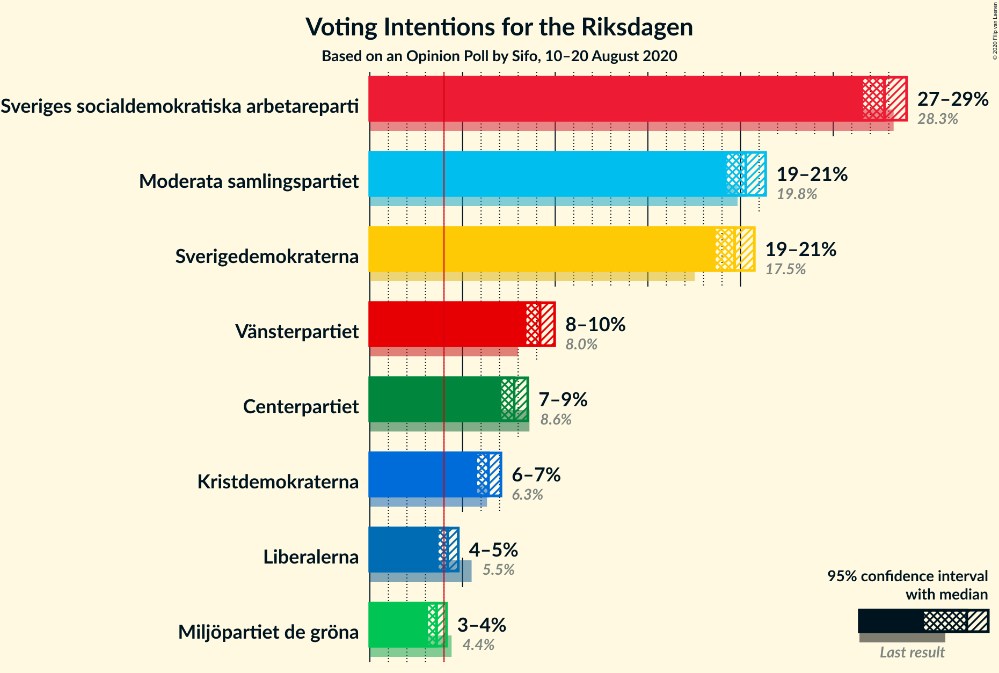

# Opinion Poll by Sifo, 10–20 August 2020

<a href="#voting-intentions">Voting Intentions</a> | <a href="#seats">Seats</a> | <a href="#coalitions">Coalitions</a> | <a href="#technical-information">Technical Information</a>

## Voting Intentions

### Confidence Intervals

| Party | Last Result | Poll Result | 80% Confidence Interval | 90% Confidence Interval | 95% Confidence Interval | 99% Confidence Interval |
|:-----:|:-----------:|:-----------:|:-----------------------:|:-----------------------:|:-----------------------:|:-----------------------:|
| Sveriges socialdemokratiska arbetareparti | 28.3% | 27.8% | 27.0–28.5% |26.8–28.8% |26.6–29.0% |26.2–29.3% |
| Moderata samlingspartiet | 19.8% | 20.3% | 19.6–21.0% |19.4–21.2% |19.3–21.4% |18.9–21.7% |
| Sverigedemokraterna | 17.5% | 19.7% | 19.0–20.4% |18.8–20.6% |18.7–20.7% |18.3–21.1% |
| Vänsterpartiet | 8.0% | 9.2% | 8.7–9.7% |8.6–9.8% |8.4–10.0% |8.2–10.2% |
| Centerpartiet | 8.6% | 7.8% | 7.3–8.3% |7.2–8.4% |7.1–8.5% |6.9–8.7% |
| Kristdemokraterna | 6.3% | 6.4% | 6.0–6.8% |5.9–7.0% |5.8–7.1% |5.6–7.3% |
| Liberalerna | 5.5% | 4.2% | 3.9–4.6% |3.8–4.7% |3.7–4.8% |3.6–4.9% |
| Miljöpartiet de gröna | 4.4% | 3.6% | 3.3–3.9% |3.2–4.0% |3.1–4.1% |3.0–4.3% |

*Note:* The poll result column reflects the actual value used in the calculations. Published results may vary slightly, and in addition be rounded to fewer digits.

## Seats

### Confidence Intervals

| Party | Last Result | Median | 80% Confidence Interval | 90% Confidence Interval | 95% Confidence Interval | 99% Confidence Interval |
|:-----:|:-----------:|:------:|:-----------------------:|:-----------------------:|:-----------------------:|:-----------------------:|
| <a href="#sveriges-socialdemokratiska-arbetareparti">Sveriges socialdemokratiska arbetareparti</a> | 100 | 102 | 99–107 |98–108 |97–109 |95–110 |
| <a href="#moderata-samlingspartiet">Moderata samlingspartiet</a> | 70 | 75 | 72–78 |71–79 |70–80 |68–82 |
| <a href="#sverigedemokraterna">Sverigedemokraterna</a> | 62 | 73 | 69–76 |69–77 |68–78 |66–79 |
| <a href="#vänsterpartiet">Vänsterpartiet</a> | 28 | 34 | 32–36 |31–37 |31–37 |30–38 |
| <a href="#centerpartiet">Centerpartiet</a> | 31 | 29 | 27–31 |26–31 |26–32 |25–33 |
| <a href="#kristdemokraterna">Kristdemokraterna</a> | 22 | 24 | 22–25 |22–26 |21–26 |21–27 |
| <a href="#liberalerna">Liberalerna</a> | 20 | 15 | 0–17 |0–17 |0–18 |0–18 |
| <a href="#miljöpartiet-de-gröna">Miljöpartiet de gröna</a> | 16 | 0 | 0 |0–14 |0–15 |0–15 |

### Sveriges socialdemokratiska arbetareparti

*For a full overview of the results for this party, see the [Sveriges socialdemokratiska arbetareparti](party-sverigessocialdemokratiskaarbetareparti.html) page.*

| Number of Seats | Probability | Accumulated | Special Marks |
|:---------------:|:-----------:|:-----------:|:-------------:|
| 92 | 0% | 100% |  |
| 93 | 0.1% | 99.9% |  |
| 94 | 0.3% | 99.8% |  |
| 95 | 0.5% | 99.6% |  |
| 96 | 1.2% | 99.1% |  |
| 97 | 3% | 98% |  |
| 98 | 5% | 95% |  |
| 99 | 9% | 90% |  |
| 100 | 11% | 82% | Last Result |
| 101 | 10% | 71% |  |
| 102 | 19% | 61% | Median |
| 103 | 9% | 42% |  |
| 104 | 9% | 33% |  |
| 105 | 8% | 24% |  |
| 106 | 4% | 16% |  |
| 107 | 6% | 12% |  |
| 108 | 3% | 6% |  |
| 109 | 2% | 3% |  |
| 110 | 1.0% | 1.4% |  |
| 111 | 0.2% | 0.4% |  |
| 112 | 0.1% | 0.2% |  |
| 113 | 0% | 0.1% |  |
| 114 | 0% | 0% |  |

### Moderata samlingspartiet

*For a full overview of the results for this party, see the [Moderata samlingspartiet](party-moderatasamlingspartiet.html) page.*

| Number of Seats | Probability | Accumulated | Special Marks |
|:---------------:|:-----------:|:-----------:|:-------------:|
| 67 | 0.2% | 100% |  |
| 68 | 0.4% | 99.8% |  |
| 69 | 1.2% | 99.4% |  |
| 70 | 2% | 98% | Last Result |
| 71 | 5% | 96% |  |
| 72 | 11% | 91% |  |
| 73 | 14% | 81% |  |
| 74 | 15% | 67% |  |
| 75 | 18% | 52% | Median |
| 76 | 10% | 34% |  |
| 77 | 8% | 24% |  |
| 78 | 8% | 16% |  |
| 79 | 4% | 9% |  |
| 80 | 3% | 5% |  |
| 81 | 1.3% | 2% |  |
| 82 | 0.5% | 0.6% |  |
| 83 | 0.1% | 0.2% |  |
| 84 | 0% | 0% |  |

### Sverigedemokraterna

*For a full overview of the results for this party, see the [Sverigedemokraterna](party-sverigedemokraterna.html) page.*

| Number of Seats | Probability | Accumulated | Special Marks |
|:---------------:|:-----------:|:-----------:|:-------------:|
| 62 | 0% | 100% | Last Result |
| 63 | 0% | 100% |  |
| 64 | 0% | 100% |  |
| 65 | 0.1% | 100% |  |
| 66 | 0.4% | 99.8% |  |
| 67 | 0.9% | 99.4% |  |
| 68 | 3% | 98% |  |
| 69 | 8% | 95% |  |
| 70 | 13% | 88% |  |
| 71 | 10% | 74% |  |
| 72 | 13% | 64% |  |
| 73 | 17% | 51% | Median |
| 74 | 13% | 34% |  |
| 75 | 9% | 21% |  |
| 76 | 5% | 12% |  |
| 77 | 3% | 7% |  |
| 78 | 2% | 4% |  |
| 79 | 1.2% | 2% |  |
| 80 | 0.3% | 0.4% |  |
| 81 | 0.1% | 0.1% |  |
| 82 | 0% | 0% |  |

### Vänsterpartiet

*For a full overview of the results for this party, see the [Vänsterpartiet](party-vänsterpartiet.html) page.*

| Number of Seats | Probability | Accumulated | Special Marks |
|:---------------:|:-----------:|:-----------:|:-------------:|
| 28 | 0% | 100% | Last Result |
| 29 | 0.3% | 100% |  |
| 30 | 1.0% | 99.7% |  |
| 31 | 7% | 98.7% |  |
| 32 | 8% | 92% |  |
| 33 | 27% | 84% |  |
| 34 | 20% | 56% | Median |
| 35 | 22% | 36% |  |
| 36 | 9% | 14% |  |
| 37 | 4% | 5% |  |
| 38 | 1.1% | 1.3% |  |
| 39 | 0.2% | 0.2% |  |
| 40 | 0% | 0% |  |

### Centerpartiet

*For a full overview of the results for this party, see the [Centerpartiet](party-centerpartiet.html) page.*

| Number of Seats | Probability | Accumulated | Special Marks |
|:---------------:|:-----------:|:-----------:|:-------------:|
| 24 | 0.1% | 100% |  |
| 25 | 1.0% | 99.9% |  |
| 26 | 6% | 99.0% |  |
| 27 | 11% | 93% |  |
| 28 | 25% | 81% |  |
| 29 | 27% | 56% | Median |
| 30 | 17% | 29% |  |
| 31 | 9% | 12% | Last Result |
| 32 | 3% | 3% |  |
| 33 | 0.6% | 0.7% |  |
| 34 | 0% | 0% |  |

### Kristdemokraterna

*For a full overview of the results for this party, see the [Kristdemokraterna](party-kristdemokraterna.html) page.*

| Number of Seats | Probability | Accumulated | Special Marks |
|:---------------:|:-----------:|:-----------:|:-------------:|
| 20 | 0.4% | 100% |  |
| 21 | 2% | 99.5% |  |
| 22 | 22% | 97% | Last Result |
| 23 | 24% | 75% |  |
| 24 | 22% | 51% | Median |
| 25 | 22% | 29% |  |
| 26 | 6% | 8% |  |
| 27 | 1.3% | 2% |  |
| 28 | 0.3% | 0.3% |  |
| 29 | 0% | 0% |  |

### Liberalerna

*For a full overview of the results for this party, see the [Liberalerna](party-liberalerna.html) page.*

| Number of Seats | Probability | Accumulated | Special Marks |
|:---------------:|:-----------:|:-----------:|:-------------:|
| 0 | 23% | 100% |  |
| 1 | 0% | 77% |  |
| 2 | 0% | 77% |  |
| 3 | 0% | 77% |  |
| 4 | 0% | 77% |  |
| 5 | 0% | 77% |  |
| 6 | 0% | 77% |  |
| 7 | 0% | 77% |  |
| 8 | 0% | 77% |  |
| 9 | 0% | 77% |  |
| 10 | 0% | 77% |  |
| 11 | 0% | 77% |  |
| 12 | 0% | 77% |  |
| 13 | 0% | 77% |  |
| 14 | 1.1% | 77% |  |
| 15 | 28% | 76% | Median |
| 16 | 33% | 47% |  |
| 17 | 11% | 14% |  |
| 18 | 2% | 3% |  |
| 19 | 0.2% | 0.2% |  |
| 20 | 0% | 0% | Last Result |

### Miljöpartiet de gröna

*For a full overview of the results for this party, see the [Miljöpartiet de gröna](party-miljöpartietdegröna.html) page.*

| Number of Seats | Probability | Accumulated | Special Marks |
|:---------------:|:-----------:|:-----------:|:-------------:|
| 0 | 93% | 100% | Median |
| 1 | 0% | 7% |  |
| 2 | 0% | 7% |  |
| 3 | 0% | 7% |  |
| 4 | 0% | 7% |  |
| 5 | 0% | 7% |  |
| 6 | 0% | 7% |  |
| 7 | 0% | 7% |  |
| 8 | 0% | 7% |  |
| 9 | 0% | 7% |  |
| 10 | 0% | 7% |  |
| 11 | 0% | 7% |  |
| 12 | 0% | 7% |  |
| 13 | 0% | 7% |  |
| 14 | 4% | 7% |  |
| 15 | 3% | 3% |  |
| 16 | 0.3% | 0.3% | Last Result |
| 17 | 0% | 0% |  |

## Coalitions

### Confidence Intervals

| Coalition | Last Result | Median | Majority? | 80% Confidence Interval | 90% Confidence Interval | 95% Confidence Interval | 99% Confidence Interval |
|:---------:|:-----------:|:------:|:---------:|:-----------------------:|:-----------------------:|:-----------------------:|:-----------------------:|
| Sveriges socialdemokratiska arbetareparti – Moderata samlingspartiet – Centerpartiet | 201 | 205 | 100% | 201–214 | 198–215 | 196–217 | 192–218 |
| Sveriges socialdemokratiska arbetareparti – Vänsterpartiet – Centerpartiet – Liberalerna – Miljöpartiet de gröna | 195 | 179 | 79% | 171–183 | 169–185 | 169–187 | 167–190 |
| Sveriges socialdemokratiska arbetareparti – Moderata samlingspartiet | 170 | 176 | 71% | 172–185 | 170–186 | 169–187 | 166–189 |
| Moderata samlingspartiet – Sverigedemokraterna – Kristdemokraterna | 154 | 170 | 21% | 166–178 | 164–180 | 162–180 | 159–182 |
| Moderata samlingspartiet – Sverigedemokraterna | 132 | 146 | 0% | 143–153 | 141–155 | 140–156 | 137–158 |
| Sveriges socialdemokratiska arbetareparti – Centerpartiet – Liberalerna – Miljöpartiet de gröna | 167 | 146 | 0% | 136–149 | 134–153 | 133–156 | 132–157 |
| Sveriges socialdemokratiska arbetareparti – Vänsterpartiet – Miljöpartiet de gröna | 144 | 136 | 0% | 132–143 | 132–144 | 131–146 | 129–152 |
| Moderata samlingspartiet – Centerpartiet – Kristdemokraterna – Liberalerna | 143 | 141 | 0% | 132–144 | 130–145 | 129–146 | 126–148 |
| Sveriges socialdemokratiska arbetareparti – Vänsterpartiet | 128 | 135 | 0% | 132–142 | 130–143 | 130–144 | 127–146 |
| Moderata samlingspartiet – Centerpartiet – Kristdemokraterna | 123 | 127 | 0% | 123–132 | 121–134 | 120–134 | 118–137 |
| Moderata samlingspartiet – Centerpartiet – Liberalerna | 121 | 118 | 0% | 107–121 | 106–122 | 105–122 | 103–124 |
| Sveriges socialdemokratiska arbetareparti – Miljöpartiet de gröna | 116 | 102 | 0% | 99–108 | 98–112 | 98–113 | 96–118 |
| Moderata samlingspartiet – Centerpartiet | 101 | 103 | 0% | 99–108 | 99–109 | 98–111 | 95–112 |

### Sveriges socialdemokratiska arbetareparti – Moderata samlingspartiet – Centerpartiet

| Number of Seats | Probability | Accumulated | Special Marks |
|:---------------:|:-----------:|:-----------:|:-------------:|
| 190 | 0% | 100% |  |
| 191 | 0.1% | 99.9% |  |
| 192 | 0.4% | 99.8% |  |
| 193 | 0.3% | 99.4% |  |
| 194 | 0.4% | 99.1% |  |
| 195 | 0.4% | 98.7% |  |
| 196 | 0.9% | 98% |  |
| 197 | 0.3% | 97% |  |
| 198 | 3% | 97% |  |
| 199 | 1.2% | 94% |  |
| 200 | 3% | 93% |  |
| 201 | 5% | 90% | Last Result |
| 202 | 9% | 85% |  |
| 203 | 11% | 76% |  |
| 204 | 10% | 65% |  |
| 205 | 12% | 55% |  |
| 206 | 10% | 43% | Median |
| 207 | 6% | 33% |  |
| 208 | 4% | 28% |  |
| 209 | 2% | 24% |  |
| 210 | 1.4% | 22% |  |
| 211 | 2% | 21% |  |
| 212 | 2% | 19% |  |
| 213 | 3% | 16% |  |
| 214 | 5% | 13% |  |
| 215 | 3% | 8% |  |
| 216 | 1.4% | 5% |  |
| 217 | 2% | 3% |  |
| 218 | 0.7% | 1.1% |  |
| 219 | 0.2% | 0.4% |  |
| 220 | 0.2% | 0.2% |  |
| 221 | 0% | 0.1% |  |
| 222 | 0% | 0% |  |

### Sveriges socialdemokratiska arbetareparti – Vänsterpartiet – Centerpartiet – Liberalerna – Miljöpartiet de gröna

| Number of Seats | Probability | Accumulated | Special Marks |
|:---------------:|:-----------:|:-----------:|:-------------:|
| 165 | 0.1% | 100% |  |
| 166 | 0.2% | 99.8% |  |
| 167 | 1.1% | 99.6% |  |
| 168 | 0.8% | 98.5% |  |
| 169 | 3% | 98% |  |
| 170 | 3% | 95% |  |
| 171 | 6% | 92% |  |
| 172 | 2% | 86% |  |
| 173 | 2% | 84% |  |
| 174 | 2% | 82% |  |
| 175 | 6% | 79% | Majority |
| 176 | 4% | 73% |  |
| 177 | 7% | 69% |  |
| 178 | 6% | 62% |  |
| 179 | 10% | 56% |  |
| 180 | 14% | 46% | Median |
| 181 | 10% | 32% |  |
| 182 | 8% | 22% |  |
| 183 | 6% | 14% |  |
| 184 | 2% | 8% |  |
| 185 | 1.4% | 6% |  |
| 186 | 0.9% | 5% |  |
| 187 | 2% | 4% |  |
| 188 | 0.7% | 2% |  |
| 189 | 0.4% | 1.0% |  |
| 190 | 0.4% | 0.5% |  |
| 191 | 0.1% | 0.1% |  |
| 192 | 0% | 0.1% |  |
| 193 | 0% | 0% |  |
| 194 | 0% | 0% |  |
| 195 | 0% | 0% | Last Result |

### Sveriges socialdemokratiska arbetareparti – Moderata samlingspartiet

| Number of Seats | Probability | Accumulated | Special Marks |
|:---------------:|:-----------:|:-----------:|:-------------:|
| 163 | 0% | 100% |  |
| 164 | 0.1% | 99.9% |  |
| 165 | 0.2% | 99.8% |  |
| 166 | 0.5% | 99.6% |  |
| 167 | 0.6% | 99.1% |  |
| 168 | 0.5% | 98.5% |  |
| 169 | 1.0% | 98% |  |
| 170 | 3% | 97% | Last Result |
| 171 | 3% | 94% |  |
| 172 | 4% | 91% |  |
| 173 | 5% | 87% |  |
| 174 | 11% | 82% |  |
| 175 | 12% | 71% | Majority |
| 176 | 11% | 59% |  |
| 177 | 10% | 47% | Median |
| 178 | 7% | 38% |  |
| 179 | 6% | 31% |  |
| 180 | 3% | 25% |  |
| 181 | 2% | 22% |  |
| 182 | 2% | 19% |  |
| 183 | 3% | 17% |  |
| 184 | 3% | 14% |  |
| 185 | 4% | 10% |  |
| 186 | 3% | 6% |  |
| 187 | 0.8% | 3% |  |
| 188 | 2% | 2% |  |
| 189 | 0.4% | 0.5% |  |
| 190 | 0.1% | 0.2% |  |
| 191 | 0% | 0.1% |  |
| 192 | 0% | 0% |  |

### Moderata samlingspartiet – Sverigedemokraterna – Kristdemokraterna

| Number of Seats | Probability | Accumulated | Special Marks |
|:---------------:|:-----------:|:-----------:|:-------------:|
| 154 | 0% | 100% | Last Result |
| 155 | 0% | 100% |  |
| 156 | 0% | 100% |  |
| 157 | 0% | 100% |  |
| 158 | 0.1% | 99.9% |  |
| 159 | 0.4% | 99.9% |  |
| 160 | 0.4% | 99.5% |  |
| 161 | 0.7% | 99.0% |  |
| 162 | 2% | 98% |  |
| 163 | 0.9% | 96% |  |
| 164 | 1.4% | 95% |  |
| 165 | 2% | 94% |  |
| 166 | 6% | 92% |  |
| 167 | 8% | 86% |  |
| 168 | 10% | 78% |  |
| 169 | 14% | 68% |  |
| 170 | 10% | 54% |  |
| 171 | 6% | 44% |  |
| 172 | 7% | 38% | Median |
| 173 | 4% | 31% |  |
| 174 | 6% | 27% |  |
| 175 | 2% | 21% | Majority |
| 176 | 2% | 18% |  |
| 177 | 2% | 16% |  |
| 178 | 6% | 14% |  |
| 179 | 3% | 8% |  |
| 180 | 3% | 5% |  |
| 181 | 0.8% | 2% |  |
| 182 | 1.1% | 1.5% |  |
| 183 | 0.2% | 0.4% |  |
| 184 | 0.1% | 0.2% |  |
| 185 | 0% | 0% |  |

### Moderata samlingspartiet – Sverigedemokraterna

| Number of Seats | Probability | Accumulated | Special Marks |
|:---------------:|:-----------:|:-----------:|:-------------:|
| 132 | 0% | 100% | Last Result |
| 133 | 0% | 100% |  |
| 134 | 0% | 100% |  |
| 135 | 0.1% | 100% |  |
| 136 | 0.1% | 99.9% |  |
| 137 | 0.6% | 99.7% |  |
| 138 | 0.7% | 99.1% |  |
| 139 | 0.5% | 98% |  |
| 140 | 3% | 98% |  |
| 141 | 2% | 95% |  |
| 142 | 3% | 93% |  |
| 143 | 4% | 91% |  |
| 144 | 12% | 87% |  |
| 145 | 12% | 75% |  |
| 146 | 13% | 63% |  |
| 147 | 10% | 50% |  |
| 148 | 5% | 39% | Median |
| 149 | 7% | 34% |  |
| 150 | 5% | 26% |  |
| 151 | 3% | 21% |  |
| 152 | 2% | 18% |  |
| 153 | 7% | 16% |  |
| 154 | 2% | 9% |  |
| 155 | 2% | 7% |  |
| 156 | 3% | 5% |  |
| 157 | 0.7% | 2% |  |
| 158 | 0.5% | 0.8% |  |
| 159 | 0.2% | 0.3% |  |
| 160 | 0.1% | 0.1% |  |
| 161 | 0% | 0% |  |

### Sveriges socialdemokratiska arbetareparti – Centerpartiet – Liberalerna – Miljöpartiet de gröna

| Number of Seats | Probability | Accumulated | Special Marks |
|:---------------:|:-----------:|:-----------:|:-------------:|
| 130 | 0.2% | 100% |  |
| 131 | 0.1% | 99.8% |  |
| 132 | 1.0% | 99.7% |  |
| 133 | 2% | 98.7% |  |
| 134 | 3% | 97% |  |
| 135 | 2% | 94% |  |
| 136 | 6% | 92% |  |
| 137 | 3% | 86% |  |
| 138 | 3% | 84% |  |
| 139 | 1.4% | 81% |  |
| 140 | 2% | 80% |  |
| 141 | 2% | 78% |  |
| 142 | 4% | 76% |  |
| 143 | 6% | 71% |  |
| 144 | 9% | 65% |  |
| 145 | 7% | 57% |  |
| 146 | 12% | 50% | Median |
| 147 | 14% | 38% |  |
| 148 | 8% | 24% |  |
| 149 | 7% | 16% |  |
| 150 | 2% | 9% |  |
| 151 | 2% | 7% |  |
| 152 | 0.6% | 6% |  |
| 153 | 1.1% | 5% |  |
| 154 | 0.7% | 4% |  |
| 155 | 0.6% | 3% |  |
| 156 | 2% | 3% |  |
| 157 | 0.4% | 0.7% |  |
| 158 | 0.2% | 0.4% |  |
| 159 | 0.1% | 0.2% |  |
| 160 | 0% | 0% |  |
| 161 | 0% | 0% |  |
| 162 | 0% | 0% |  |
| 163 | 0% | 0% |  |
| 164 | 0% | 0% |  |
| 165 | 0% | 0% |  |
| 166 | 0% | 0% |  |
| 167 | 0% | 0% | Last Result |

### Sveriges socialdemokratiska arbetareparti – Vänsterpartiet – Miljöpartiet de gröna

| Number of Seats | Probability | Accumulated | Special Marks |
|:---------------:|:-----------:|:-----------:|:-------------:|
| 128 | 0.1% | 100% |  |
| 129 | 0.4% | 99.9% |  |
| 130 | 1.2% | 99.4% |  |
| 131 | 3% | 98% |  |
| 132 | 5% | 95% |  |
| 133 | 8% | 90% |  |
| 134 | 7% | 82% |  |
| 135 | 19% | 75% |  |
| 136 | 8% | 56% | Median |
| 137 | 9% | 48% |  |
| 138 | 4% | 39% |  |
| 139 | 9% | 35% |  |
| 140 | 2% | 26% |  |
| 141 | 7% | 24% |  |
| 142 | 6% | 17% |  |
| 143 | 2% | 12% |  |
| 144 | 4% | 9% | Last Result |
| 145 | 1.4% | 5% |  |
| 146 | 1.0% | 3% |  |
| 147 | 0.6% | 2% |  |
| 148 | 0.5% | 2% |  |
| 149 | 0.3% | 1.2% |  |
| 150 | 0.4% | 1.0% |  |
| 151 | 0.1% | 0.6% |  |
| 152 | 0.1% | 0.5% |  |
| 153 | 0.4% | 0.4% |  |
| 154 | 0% | 0.1% |  |
| 155 | 0% | 0% |  |

### Moderata samlingspartiet – Centerpartiet – Kristdemokraterna – Liberalerna

| Number of Seats | Probability | Accumulated | Special Marks |
|:---------------:|:-----------:|:-----------:|:-------------:|
| 122 | 0% | 100% |  |
| 123 | 0.1% | 99.9% |  |
| 124 | 0% | 99.8% |  |
| 125 | 0.1% | 99.8% |  |
| 126 | 0.3% | 99.7% |  |
| 127 | 0.7% | 99.4% |  |
| 128 | 0.5% | 98.7% |  |
| 129 | 2% | 98% |  |
| 130 | 2% | 96% |  |
| 131 | 3% | 94% |  |
| 132 | 7% | 91% |  |
| 133 | 2% | 85% |  |
| 134 | 4% | 82% |  |
| 135 | 1.5% | 78% |  |
| 136 | 4% | 76% |  |
| 137 | 2% | 73% |  |
| 138 | 5% | 70% |  |
| 139 | 4% | 66% |  |
| 140 | 8% | 61% |  |
| 141 | 14% | 54% |  |
| 142 | 10% | 40% |  |
| 143 | 9% | 30% | Last Result, Median |
| 144 | 12% | 21% |  |
| 145 | 5% | 9% |  |
| 146 | 2% | 4% |  |
| 147 | 0.9% | 2% |  |
| 148 | 0.4% | 0.6% |  |
| 149 | 0.2% | 0.2% |  |
| 150 | 0% | 0% |  |

### Sveriges socialdemokratiska arbetareparti – Vänsterpartiet

| Number of Seats | Probability | Accumulated | Special Marks |
|:---------------:|:-----------:|:-----------:|:-------------:|
| 124 | 0.1% | 100% |  |
| 125 | 0.1% | 99.9% |  |
| 126 | 0.1% | 99.8% |  |
| 127 | 0.6% | 99.8% |  |
| 128 | 0.5% | 99.1% | Last Result |
| 129 | 1.1% | 98.7% |  |
| 130 | 4% | 98% |  |
| 131 | 4% | 94% |  |
| 132 | 6% | 90% |  |
| 133 | 8% | 85% |  |
| 134 | 8% | 77% |  |
| 135 | 19% | 69% |  |
| 136 | 8% | 50% | Median |
| 137 | 9% | 42% |  |
| 138 | 5% | 33% |  |
| 139 | 9% | 28% |  |
| 140 | 2% | 19% |  |
| 141 | 6% | 18% |  |
| 142 | 6% | 11% |  |
| 143 | 2% | 6% |  |
| 144 | 2% | 4% |  |
| 145 | 1.2% | 2% |  |
| 146 | 0.4% | 0.8% |  |
| 147 | 0.2% | 0.4% |  |
| 148 | 0.2% | 0.2% |  |
| 149 | 0% | 0% |  |

### Moderata samlingspartiet – Centerpartiet – Kristdemokraterna

| Number of Seats | Probability | Accumulated | Special Marks |
|:---------------:|:-----------:|:-----------:|:-------------:|
| 116 | 0.1% | 100% |  |
| 117 | 0.2% | 99.8% |  |
| 118 | 0.6% | 99.6% |  |
| 119 | 0.4% | 99.0% |  |
| 120 | 1.2% | 98.5% |  |
| 121 | 3% | 97% |  |
| 122 | 4% | 95% |  |
| 123 | 6% | 91% | Last Result |
| 124 | 7% | 84% |  |
| 125 | 13% | 78% |  |
| 126 | 11% | 64% |  |
| 127 | 10% | 53% |  |
| 128 | 11% | 43% | Median |
| 129 | 8% | 33% |  |
| 130 | 6% | 24% |  |
| 131 | 3% | 18% |  |
| 132 | 7% | 15% |  |
| 133 | 2% | 8% |  |
| 134 | 4% | 6% |  |
| 135 | 1.1% | 2% |  |
| 136 | 0.7% | 1.3% |  |
| 137 | 0.4% | 0.7% |  |
| 138 | 0.2% | 0.3% |  |
| 139 | 0% | 0.1% |  |
| 140 | 0% | 0% |  |

### Moderata samlingspartiet – Centerpartiet – Liberalerna

| Number of Seats | Probability | Accumulated | Special Marks |
|:---------------:|:-----------:|:-----------:|:-------------:|
| 99 | 0% | 100% |  |
| 100 | 0.1% | 99.9% |  |
| 101 | 0.1% | 99.9% |  |
| 102 | 0.2% | 99.8% |  |
| 103 | 0.6% | 99.6% |  |
| 104 | 1.3% | 99.0% |  |
| 105 | 2% | 98% |  |
| 106 | 4% | 96% |  |
| 107 | 5% | 92% |  |
| 108 | 3% | 87% |  |
| 109 | 3% | 84% |  |
| 110 | 1.3% | 81% |  |
| 111 | 3% | 79% |  |
| 112 | 1.3% | 77% |  |
| 113 | 1.3% | 75% |  |
| 114 | 4% | 74% |  |
| 115 | 3% | 70% |  |
| 116 | 8% | 67% |  |
| 117 | 8% | 58% |  |
| 118 | 15% | 50% |  |
| 119 | 9% | 35% | Median |
| 120 | 14% | 26% |  |
| 121 | 6% | 12% | Last Result |
| 122 | 4% | 6% |  |
| 123 | 1.5% | 2% |  |
| 124 | 0.5% | 0.8% |  |
| 125 | 0.2% | 0.3% |  |
| 126 | 0% | 0.1% |  |
| 127 | 0% | 0% |  |

### Sveriges socialdemokratiska arbetareparti – Miljöpartiet de gröna

| Number of Seats | Probability | Accumulated | Special Marks |
|:---------------:|:-----------:|:-----------:|:-------------:|
| 95 | 0.1% | 100% |  |
| 96 | 0.8% | 99.9% |  |
| 97 | 1.4% | 99.1% |  |
| 98 | 4% | 98% |  |
| 99 | 7% | 93% |  |
| 100 | 10% | 87% |  |
| 101 | 9% | 76% |  |
| 102 | 19% | 67% | Median |
| 103 | 8% | 48% |  |
| 104 | 9% | 40% |  |
| 105 | 8% | 31% |  |
| 106 | 4% | 23% |  |
| 107 | 6% | 19% |  |
| 108 | 3% | 13% |  |
| 109 | 2% | 10% |  |
| 110 | 2% | 8% |  |
| 111 | 1.2% | 6% |  |
| 112 | 0.9% | 5% |  |
| 113 | 2% | 4% |  |
| 114 | 0.6% | 2% |  |
| 115 | 0.4% | 2% |  |
| 116 | 0.5% | 1.3% | Last Result |
| 117 | 0.2% | 0.8% |  |
| 118 | 0.4% | 0.7% |  |
| 119 | 0.1% | 0.3% |  |
| 120 | 0.2% | 0.2% |  |
| 121 | 0% | 0% |  |

### Moderata samlingspartiet – Centerpartiet

| Number of Seats | Probability | Accumulated | Special Marks |
|:---------------:|:-----------:|:-----------:|:-------------:|
| 93 | 0.1% | 100% |  |
| 94 | 0.1% | 99.9% |  |
| 95 | 0.4% | 99.7% |  |
| 96 | 0.6% | 99.3% |  |
| 97 | 0.8% | 98.7% |  |
| 98 | 3% | 98% |  |
| 99 | 6% | 95% |  |
| 100 | 5% | 90% |  |
| 101 | 11% | 85% | Last Result |
| 102 | 11% | 73% |  |
| 103 | 15% | 62% |  |
| 104 | 12% | 47% | Median |
| 105 | 9% | 35% |  |
| 106 | 8% | 25% |  |
| 107 | 7% | 17% |  |
| 108 | 4% | 11% |  |
| 109 | 3% | 7% |  |
| 110 | 1.1% | 4% |  |
| 111 | 2% | 3% |  |
| 112 | 0.7% | 1.0% |  |
| 113 | 0.1% | 0.3% |  |
| 114 | 0.1% | 0.2% |  |
| 115 | 0% | 0% |  |

## Technical Information

### Opinion Poll

+ **Polling firm:** Sifo
+ **Commissioner(s):** —
+ **Fieldwork period:** 10–20 August 2020

### Calculations

+ **Sample size:** 5640
+ **Simulations done:** 1,048,576
+ **Error estimate:** 0.81%

