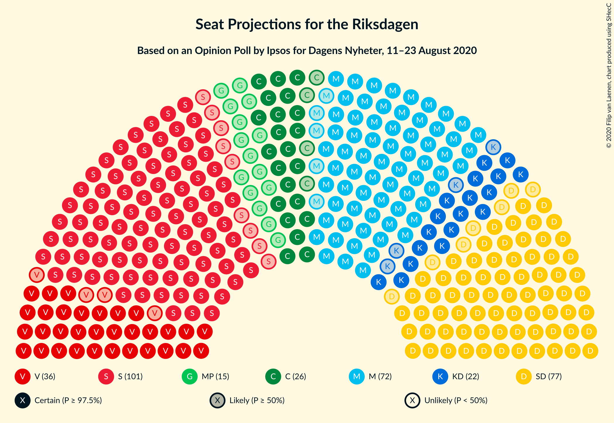
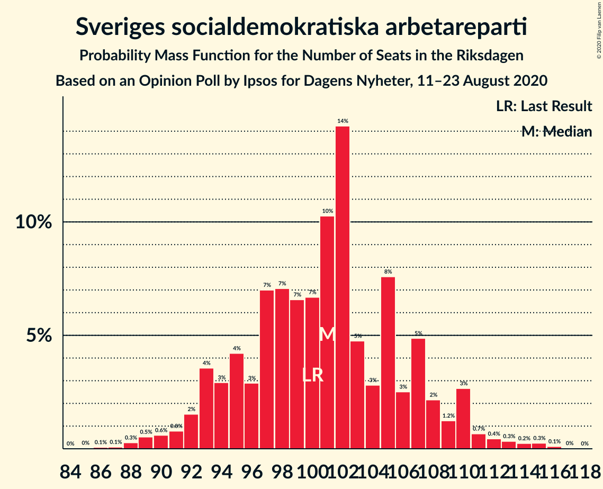
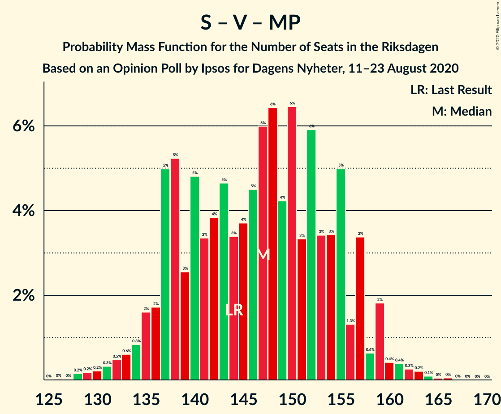
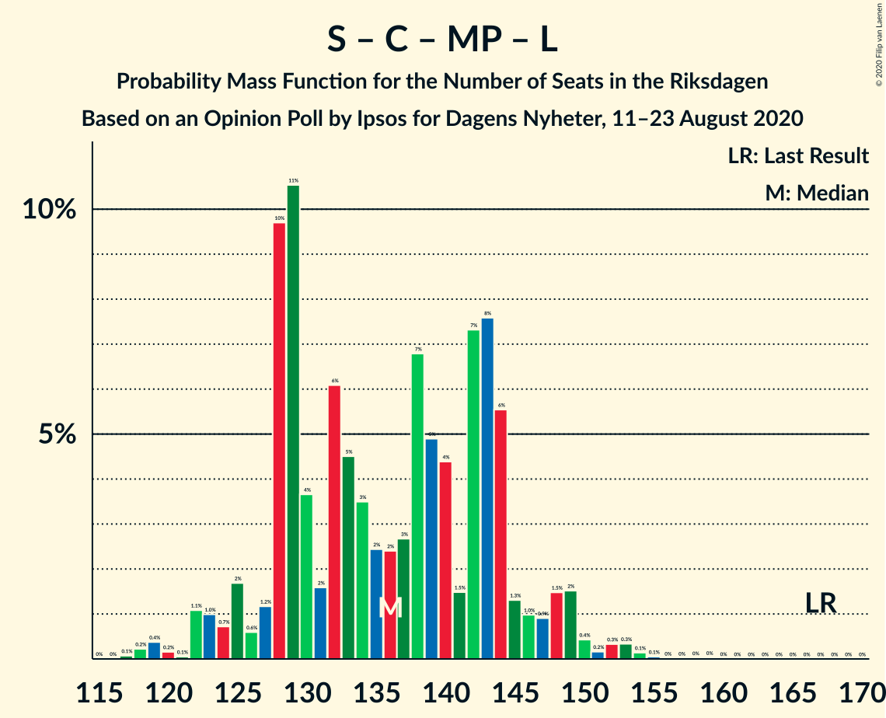
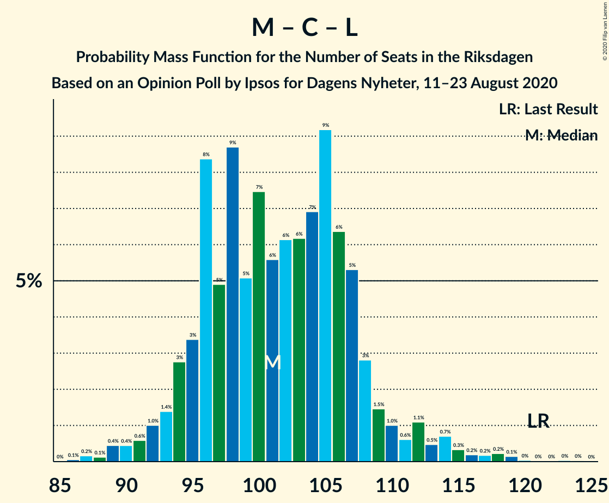

# Opinion Poll by Ipsos for Dagens Nyheter, 11–23 August 2020

<a href="#voting-intentions">Voting Intentions</a> | <a href="#seats">Seats</a> | <a href="#coalitions">Coalitions</a> | <a href="#technical-information">Technical Information</a>

## Voting Intentions

### Confidence Intervals

| Party | Last Result | Poll Result | 80% Confidence Interval | 90% Confidence Interval | 95% Confidence Interval | 99% Confidence Interval |
|:-----:|:-----------:|:-----------:|:-----------------------:|:-----------------------:|:-----------------------:|:-----------------------:|
| Sveriges socialdemokratiska arbetareparti | 28.3% | 27.0% | 25.6–28.5% |25.2–28.9% |24.8–29.3% |24.1–30.0% |
| Sverigedemokraterna | 17.5% | 21.0% | 19.7–22.4% |19.3–22.8% |19.0–23.1% |18.4–23.8% |
| Moderata samlingspartiet | 19.8% | 20.0% | 18.7–21.4% |18.4–21.8% |18.0–22.1% |17.5–22.8% |
| Vänsterpartiet | 8.0% | 10.0% | 9.1–11.1% |8.8–11.4% |8.6–11.6% |8.2–12.2% |
| Centerpartiet | 8.6% | 7.0% | 6.2–7.9% |6.0–8.2% |5.8–8.4% |5.5–8.9% |
| Kristdemokraterna | 6.3% | 6.0% | 5.3–6.9% |5.1–7.1% |4.9–7.3% |4.6–7.8% |
| Miljöpartiet de gröna | 4.4% | 4.0% | 3.4–4.7% |3.2–4.9% |3.1–5.1% |2.9–5.5% |
| Liberalerna | 5.5% | 3.0% | 2.5–3.7% |2.4–3.8% |2.2–4.0% |2.0–4.3% |

*Note:* The poll result column reflects the actual value used in the calculations. Published results may vary slightly, and in addition be rounded to fewer digits.

## Seats

### Confidence Intervals

| Party | Last Result | Median | 80% Confidence Interval | 90% Confidence Interval | 95% Confidence Interval | 99% Confidence Interval |
|:-----:|:-----------:|:------:|:-----------------------:|:-----------------------:|:-----------------------:|:-----------------------:|
| <a href="#sveriges-socialdemokratiska-arbetareparti">Sveriges socialdemokratiska arbetareparti</a> | 100 | 100 | 94–106 |93–110 |91–110 |88–113 |
| <a href="#sverigedemokraterna">Sverigedemokraterna</a> | 62 | 78 | 72–84 |71–86 |70–88 |68–91 |
| <a href="#moderata-samlingspartiet">Moderata samlingspartiet</a> | 70 | 75 | 68–81 |68–82 |67–84 |64–85 |
| <a href="#vänsterpartiet">Vänsterpartiet</a> | 28 | 38 | 34–42 |33–43 |32–43 |30–46 |
| <a href="#centerpartiet">Centerpartiet</a> | 31 | 27 | 24–29 |22–30 |22–31 |20–34 |
| <a href="#kristdemokraterna">Kristdemokraterna</a> | 22 | 22 | 20–25 |19–27 |18–28 |17–30 |
| <a href="#miljöpartiet-de-gröna">Miljöpartiet de gröna</a> | 16 | 15 | 0–18 |0–18 |0–18 |0–20 |
| <a href="#liberalerna">Liberalerna</a> | 20 | 0 | 0 |0 |0–16 |0–16 |

### Sveriges socialdemokratiska arbetareparti

*For a full overview of the results for this party, see the [Sveriges socialdemokratiska arbetareparti](party-sverigessocialdemokratiskaarbetareparti.html) page.*

| Number of Seats | Probability | Accumulated | Special Marks |
|:---------------:|:-----------:|:-----------:|:-------------:|
| 85 | 0% | 100% |  |
| 86 | 0% | 99.9% |  |
| 87 | 0.1% | 99.9% |  |
| 88 | 0.5% | 99.9% |  |
| 89 | 0.4% | 99.3% |  |
| 90 | 0.7% | 99.0% |  |
| 91 | 1.2% | 98% |  |
| 92 | 0.8% | 97% |  |
| 93 | 3% | 96% |  |
| 94 | 4% | 93% |  |
| 95 | 5% | 90% |  |
| 96 | 4% | 85% |  |
| 97 | 7% | 81% |  |
| 98 | 19% | 74% |  |
| 99 | 3% | 55% |  |
| 100 | 3% | 53% | Last Result, Median |
| 101 | 11% | 49% |  |
| 102 | 8% | 38% |  |
| 103 | 2% | 29% |  |
| 104 | 4% | 27% |  |
| 105 | 8% | 23% |  |
| 106 | 6% | 15% |  |
| 107 | 1.2% | 8% |  |
| 108 | 0.6% | 7% |  |
| 109 | 0.5% | 7% |  |
| 110 | 4% | 6% |  |
| 111 | 0.2% | 2% |  |
| 112 | 0.4% | 2% |  |
| 113 | 0.8% | 1.1% |  |
| 114 | 0% | 0.3% |  |
| 115 | 0.2% | 0.2% |  |
| 116 | 0% | 0.1% |  |
| 117 | 0% | 0% |  |

### Sverigedemokraterna

*For a full overview of the results for this party, see the [Sverigedemokraterna](party-sverigedemokraterna.html) page.*

| Number of Seats | Probability | Accumulated | Special Marks |
|:---------------:|:-----------:|:-----------:|:-------------:|
| 62 | 0% | 100% | Last Result |
| 63 | 0% | 100% |  |
| 64 | 0% | 100% |  |
| 65 | 0.1% | 100% |  |
| 66 | 0.2% | 99.9% |  |
| 67 | 0.2% | 99.7% |  |
| 68 | 0.1% | 99.5% |  |
| 69 | 0.7% | 99.4% |  |
| 70 | 2% | 98.7% |  |
| 71 | 5% | 97% |  |
| 72 | 2% | 91% |  |
| 73 | 0.8% | 89% |  |
| 74 | 10% | 89% |  |
| 75 | 4% | 78% |  |
| 76 | 11% | 75% |  |
| 77 | 9% | 64% |  |
| 78 | 6% | 55% | Median |
| 79 | 6% | 49% |  |
| 80 | 13% | 43% |  |
| 81 | 4% | 30% |  |
| 82 | 11% | 26% |  |
| 83 | 3% | 16% |  |
| 84 | 3% | 13% |  |
| 85 | 4% | 10% |  |
| 86 | 1.2% | 5% |  |
| 87 | 0.6% | 4% |  |
| 88 | 3% | 4% |  |
| 89 | 0.1% | 0.8% |  |
| 90 | 0.1% | 0.8% |  |
| 91 | 0.6% | 0.7% |  |
| 92 | 0% | 0.1% |  |
| 93 | 0.1% | 0.1% |  |
| 94 | 0.1% | 0.1% |  |
| 95 | 0% | 0% |  |

### Moderata samlingspartiet

*For a full overview of the results for this party, see the [Moderata samlingspartiet](party-moderatasamlingspartiet.html) page.*

| Number of Seats | Probability | Accumulated | Special Marks |
|:---------------:|:-----------:|:-----------:|:-------------:|
| 61 | 0% | 100% |  |
| 62 | 0% | 99.9% |  |
| 63 | 0.1% | 99.9% |  |
| 64 | 0.3% | 99.8% |  |
| 65 | 0.7% | 99.5% |  |
| 66 | 0.4% | 98.8% |  |
| 67 | 2% | 98% |  |
| 68 | 7% | 97% |  |
| 69 | 3% | 89% |  |
| 70 | 12% | 86% | Last Result |
| 71 | 2% | 74% |  |
| 72 | 10% | 73% |  |
| 73 | 8% | 63% |  |
| 74 | 4% | 55% |  |
| 75 | 9% | 51% | Median |
| 76 | 9% | 42% |  |
| 77 | 3% | 33% |  |
| 78 | 11% | 30% |  |
| 79 | 1.4% | 19% |  |
| 80 | 6% | 17% |  |
| 81 | 1.3% | 11% |  |
| 82 | 5% | 10% |  |
| 83 | 0.4% | 5% |  |
| 84 | 3% | 4% |  |
| 85 | 0.7% | 1.2% |  |
| 86 | 0.2% | 0.4% |  |
| 87 | 0.1% | 0.2% |  |
| 88 | 0.1% | 0.1% |  |
| 89 | 0% | 0% |  |

### Vänsterpartiet

*For a full overview of the results for this party, see the [Vänsterpartiet](party-vänsterpartiet.html) page.*

| Number of Seats | Probability | Accumulated | Special Marks |
|:---------------:|:-----------:|:-----------:|:-------------:|
| 28 | 0.2% | 100% | Last Result |
| 29 | 0.1% | 99.8% |  |
| 30 | 0.9% | 99.7% |  |
| 31 | 0.6% | 98.7% |  |
| 32 | 2% | 98% |  |
| 33 | 4% | 96% |  |
| 34 | 7% | 93% |  |
| 35 | 11% | 85% |  |
| 36 | 12% | 74% |  |
| 37 | 11% | 62% |  |
| 38 | 19% | 51% | Median |
| 39 | 10% | 32% |  |
| 40 | 5% | 22% |  |
| 41 | 7% | 17% |  |
| 42 | 2% | 10% |  |
| 43 | 6% | 8% |  |
| 44 | 0.5% | 2% |  |
| 45 | 0.3% | 2% |  |
| 46 | 1.4% | 2% |  |
| 47 | 0% | 0.2% |  |
| 48 | 0% | 0.1% |  |
| 49 | 0% | 0.1% |  |
| 50 | 0% | 0% |  |

### Centerpartiet

*For a full overview of the results for this party, see the [Centerpartiet](party-centerpartiet.html) page.*

| Number of Seats | Probability | Accumulated | Special Marks |
|:---------------:|:-----------:|:-----------:|:-------------:|
| 18 | 0.1% | 100% |  |
| 19 | 0.1% | 99.9% |  |
| 20 | 0.8% | 99.8% |  |
| 21 | 0.8% | 99.1% |  |
| 22 | 3% | 98% |  |
| 23 | 5% | 95% |  |
| 24 | 15% | 90% |  |
| 25 | 7% | 75% |  |
| 26 | 18% | 69% |  |
| 27 | 16% | 51% | Median |
| 28 | 9% | 35% |  |
| 29 | 21% | 26% |  |
| 30 | 0.7% | 5% |  |
| 31 | 2% | 5% | Last Result |
| 32 | 1.1% | 2% |  |
| 33 | 0.5% | 1.3% |  |
| 34 | 0.6% | 0.8% |  |
| 35 | 0.1% | 0.2% |  |
| 36 | 0% | 0.1% |  |
| 37 | 0% | 0% |  |

### Kristdemokraterna

*For a full overview of the results for this party, see the [Kristdemokraterna](party-kristdemokraterna.html) page.*

| Number of Seats | Probability | Accumulated | Special Marks |
|:---------------:|:-----------:|:-----------:|:-------------:|
| 16 | 0.4% | 100% |  |
| 17 | 1.2% | 99.6% |  |
| 18 | 2% | 98% |  |
| 19 | 3% | 97% |  |
| 20 | 13% | 93% |  |
| 21 | 19% | 81% |  |
| 22 | 21% | 62% | Last Result, Median |
| 23 | 16% | 40% |  |
| 24 | 12% | 24% |  |
| 25 | 5% | 12% |  |
| 26 | 2% | 7% |  |
| 27 | 2% | 5% |  |
| 28 | 2% | 3% |  |
| 29 | 0.5% | 1.3% |  |
| 30 | 0.7% | 0.8% |  |
| 31 | 0.1% | 0.1% |  |
| 32 | 0% | 0% |  |

### Miljöpartiet de gröna

*For a full overview of the results for this party, see the [Miljöpartiet de gröna](party-miljöpartietdegröna.html) page.*

| Number of Seats | Probability | Accumulated | Special Marks |
|:---------------:|:-----------:|:-----------:|:-------------:|
| 0 | 46% | 100% |  |
| 1 | 0% | 54% |  |
| 2 | 0% | 54% |  |
| 3 | 0% | 54% |  |
| 4 | 0% | 54% |  |
| 5 | 0% | 54% |  |
| 6 | 0% | 54% |  |
| 7 | 0% | 54% |  |
| 8 | 0% | 54% |  |
| 9 | 0% | 54% |  |
| 10 | 0% | 54% |  |
| 11 | 0% | 54% |  |
| 12 | 0% | 54% |  |
| 13 | 0% | 54% |  |
| 14 | 0% | 54% |  |
| 15 | 21% | 54% | Median |
| 16 | 12% | 33% | Last Result |
| 17 | 8% | 21% |  |
| 18 | 11% | 13% |  |
| 19 | 0.7% | 2% |  |
| 20 | 1.1% | 1.3% |  |
| 21 | 0.1% | 0.2% |  |
| 22 | 0% | 0.1% |  |
| 23 | 0% | 0% |  |

### Liberalerna

*For a full overview of the results for this party, see the [Liberalerna](party-liberalerna.html) page.*

| Number of Seats | Probability | Accumulated | Special Marks |
|:---------------:|:-----------:|:-----------:|:-------------:|
| 0 | 96% | 100% | Median |
| 1 | 0% | 4% |  |
| 2 | 0% | 4% |  |
| 3 | 0% | 4% |  |
| 4 | 0% | 4% |  |
| 5 | 0% | 4% |  |
| 6 | 0% | 4% |  |
| 7 | 0% | 4% |  |
| 8 | 0% | 4% |  |
| 9 | 0% | 4% |  |
| 10 | 0% | 4% |  |
| 11 | 0% | 4% |  |
| 12 | 0% | 4% |  |
| 13 | 0% | 4% |  |
| 14 | 0.4% | 4% |  |
| 15 | 1.2% | 4% |  |
| 16 | 3% | 3% |  |
| 17 | 0.1% | 0.1% |  |
| 18 | 0% | 0% |  |
| 19 | 0% | 0% |  |
| 20 | 0% | 0% | Last Result |

## Coalitions

### Confidence Intervals

| Coalition | Last Result | Median | Majority? | 80% Confidence Interval | 90% Confidence Interval | 95% Confidence Interval | 99% Confidence Interval |
|:---------:|:-----------:|:------:|:---------:|:-----------------------:|:-----------------------:|:-----------------------:|:-----------------------:|
| Sveriges socialdemokratiska arbetareparti – Moderata samlingspartiet – Centerpartiet | 201 | 201 | 100% | 192–212 | 190–213 | 189–214 | 186–218 |
| Sverigedemokraterna – Moderata samlingspartiet – Kristdemokraterna | 154 | 174 | 48% | 168–183 | 164–187 | 164–188 | 161–190 |
| Sveriges socialdemokratiska arbetareparti – Moderata samlingspartiet | 170 | 174 | 46% | 167–185 | 166–185 | 163–187 | 161–190 |
| Sveriges socialdemokratiska arbetareparti – Vänsterpartiet – Centerpartiet – Miljöpartiet de gröna – Liberalerna | 195 | 175 | 52% | 166–181 | 162–185 | 161–185 | 159–188 |
| Sverigedemokraterna – Moderata samlingspartiet | 132 | 152 | 0% | 146–161 | 142–165 | 141–165 | 138–166 |
| Sveriges socialdemokratiska arbetareparti – Vänsterpartiet – Miljöpartiet de gröna | 144 | 147 | 0% | 138–156 | 135–157 | 134–159 | 129–162 |
| Sveriges socialdemokratiska arbetareparti – Centerpartiet – Miljöpartiet de gröna – Liberalerna | 167 | 138 | 0% | 128–144 | 123–147 | 122–149 | 121–152 |
| Sveriges socialdemokratiska arbetareparti – Vänsterpartiet | 128 | 138 | 0% | 131–146 | 128–147 | 127–148 | 125–153 |
| Moderata samlingspartiet – Centerpartiet – Kristdemokraterna – Liberalerna | 143 | 124 | 0% | 116–131 | 115–135 | 115–136 | 112–139 |
| Moderata samlingspartiet – Centerpartiet – Kristdemokraterna | 123 | 124 | 0% | 116–131 | 115–132 | 115–133 | 111–138 |
| Sveriges socialdemokratiska arbetareparti – Miljöpartiet de gröna | 116 | 110 | 0% | 98–118 | 98–121 | 96–121 | 94–123 |
| Moderata samlingspartiet – Centerpartiet – Liberalerna | 121 | 102 | 0% | 95–108 | 93–112 | 93–114 | 89–117 |
| Moderata samlingspartiet – Centerpartiet | 101 | 102 | 0% | 95–107 | 93–108 | 93–110 | 89–114 |

### Sveriges socialdemokratiska arbetareparti – Moderata samlingspartiet – Centerpartiet

| Number of Seats | Probability | Accumulated | Special Marks |
|:---------------:|:-----------:|:-----------:|:-------------:|
| 180 | 0.1% | 100% |  |
| 181 | 0% | 99.9% |  |
| 182 | 0% | 99.9% |  |
| 183 | 0.1% | 99.9% |  |
| 184 | 0% | 99.8% |  |
| 185 | 0.1% | 99.8% |  |
| 186 | 0.1% | 99.6% |  |
| 187 | 0.2% | 99.5% |  |
| 188 | 2% | 99.3% |  |
| 189 | 0.8% | 98% |  |
| 190 | 3% | 97% |  |
| 191 | 1.0% | 94% |  |
| 192 | 3% | 93% |  |
| 193 | 1.2% | 90% |  |
| 194 | 2% | 89% |  |
| 195 | 1.0% | 87% |  |
| 196 | 11% | 86% |  |
| 197 | 8% | 75% |  |
| 198 | 1.1% | 66% |  |
| 199 | 8% | 65% |  |
| 200 | 6% | 57% |  |
| 201 | 3% | 51% | Last Result |
| 202 | 9% | 48% | Median |
| 203 | 3% | 39% |  |
| 204 | 2% | 37% |  |
| 205 | 6% | 35% |  |
| 206 | 8% | 29% |  |
| 207 | 3% | 21% |  |
| 208 | 3% | 19% |  |
| 209 | 1.3% | 15% |  |
| 210 | 0.8% | 14% |  |
| 211 | 0.4% | 13% |  |
| 212 | 7% | 13% |  |
| 213 | 3% | 5% |  |
| 214 | 0.2% | 3% |  |
| 215 | 0.3% | 2% |  |
| 216 | 1.1% | 2% |  |
| 217 | 0.1% | 1.0% |  |
| 218 | 0.7% | 0.9% |  |
| 219 | 0.1% | 0.2% |  |
| 220 | 0.1% | 0.2% |  |
| 221 | 0% | 0.1% |  |
| 222 | 0% | 0% |  |

### Sverigedemokraterna – Moderata samlingspartiet – Kristdemokraterna

| Number of Seats | Probability | Accumulated | Special Marks |
|:---------------:|:-----------:|:-----------:|:-------------:|
| 154 | 0% | 100% | Last Result |
| 155 | 0% | 100% |  |
| 156 | 0% | 100% |  |
| 157 | 0% | 100% |  |
| 158 | 0.1% | 99.9% |  |
| 159 | 0.1% | 99.9% |  |
| 160 | 0% | 99.8% |  |
| 161 | 1.1% | 99.8% |  |
| 162 | 0.2% | 98.6% |  |
| 163 | 0.5% | 98% |  |
| 164 | 3% | 98% |  |
| 165 | 1.3% | 95% |  |
| 166 | 2% | 93% |  |
| 167 | 0.8% | 91% |  |
| 168 | 3% | 91% |  |
| 169 | 14% | 88% |  |
| 170 | 4% | 74% |  |
| 171 | 6% | 71% |  |
| 172 | 6% | 65% |  |
| 173 | 4% | 59% |  |
| 174 | 7% | 55% |  |
| 175 | 3% | 48% | Median, Majority |
| 176 | 3% | 45% |  |
| 177 | 4% | 42% |  |
| 178 | 3% | 38% |  |
| 179 | 1.2% | 34% |  |
| 180 | 0.8% | 33% |  |
| 181 | 15% | 32% |  |
| 182 | 6% | 18% |  |
| 183 | 1.1% | 11% |  |
| 184 | 1.1% | 10% |  |
| 185 | 0.8% | 9% |  |
| 186 | 2% | 8% |  |
| 187 | 2% | 6% |  |
| 188 | 3% | 4% |  |
| 189 | 0.3% | 0.8% |  |
| 190 | 0.1% | 0.5% |  |
| 191 | 0.1% | 0.4% |  |
| 192 | 0% | 0.2% |  |
| 193 | 0.1% | 0.2% |  |
| 194 | 0% | 0.1% |  |
| 195 | 0% | 0.1% |  |
| 196 | 0% | 0.1% |  |
| 197 | 0% | 0% |  |

### Sveriges socialdemokratiska arbetareparti – Moderata samlingspartiet

| Number of Seats | Probability | Accumulated | Special Marks |
|:---------------:|:-----------:|:-----------:|:-------------:|
| 157 | 0.1% | 100% |  |
| 158 | 0.1% | 99.9% |  |
| 159 | 0.1% | 99.8% |  |
| 160 | 0.1% | 99.7% |  |
| 161 | 0.4% | 99.6% |  |
| 162 | 0.2% | 99.2% |  |
| 163 | 2% | 99.0% |  |
| 164 | 0.5% | 97% |  |
| 165 | 1.2% | 96% |  |
| 166 | 5% | 95% |  |
| 167 | 1.3% | 90% |  |
| 168 | 5% | 89% |  |
| 169 | 8% | 84% |  |
| 170 | 8% | 76% | Last Result |
| 171 | 4% | 68% |  |
| 172 | 2% | 64% |  |
| 173 | 11% | 61% |  |
| 174 | 5% | 51% |  |
| 175 | 2% | 46% | Median, Majority |
| 176 | 6% | 44% |  |
| 177 | 0.7% | 37% |  |
| 178 | 3% | 37% |  |
| 179 | 3% | 34% |  |
| 180 | 10% | 31% |  |
| 181 | 0.8% | 21% |  |
| 182 | 4% | 20% |  |
| 183 | 3% | 16% |  |
| 184 | 2% | 13% |  |
| 185 | 8% | 11% |  |
| 186 | 0.6% | 4% |  |
| 187 | 2% | 3% |  |
| 188 | 0.4% | 1.3% |  |
| 189 | 0.4% | 1.0% |  |
| 190 | 0.2% | 0.5% |  |
| 191 | 0.1% | 0.3% |  |
| 192 | 0.1% | 0.2% |  |
| 193 | 0% | 0.1% |  |
| 194 | 0% | 0.1% |  |
| 195 | 0% | 0.1% |  |
| 196 | 0% | 0.1% |  |
| 197 | 0.1% | 0.1% |  |
| 198 | 0% | 0% |  |

### Sveriges socialdemokratiska arbetareparti – Vänsterpartiet – Centerpartiet – Miljöpartiet de gröna – Liberalerna

| Number of Seats | Probability | Accumulated | Special Marks |
|:---------------:|:-----------:|:-----------:|:-------------:|
| 153 | 0% | 100% |  |
| 154 | 0% | 99.9% |  |
| 155 | 0% | 99.9% |  |
| 156 | 0.1% | 99.9% |  |
| 157 | 0% | 99.8% |  |
| 158 | 0.1% | 99.8% |  |
| 159 | 0.1% | 99.6% |  |
| 160 | 0.3% | 99.5% |  |
| 161 | 3% | 99.2% |  |
| 162 | 2% | 96% |  |
| 163 | 2% | 94% |  |
| 164 | 0.8% | 92% |  |
| 165 | 1.1% | 91% |  |
| 166 | 1.1% | 90% |  |
| 167 | 6% | 89% |  |
| 168 | 15% | 82% |  |
| 169 | 0.8% | 68% |  |
| 170 | 1.2% | 67% |  |
| 171 | 3% | 66% |  |
| 172 | 4% | 62% |  |
| 173 | 3% | 58% |  |
| 174 | 3% | 55% |  |
| 175 | 7% | 52% | Majority |
| 176 | 4% | 45% |  |
| 177 | 6% | 41% |  |
| 178 | 6% | 35% |  |
| 179 | 4% | 29% |  |
| 180 | 14% | 26% | Median |
| 181 | 3% | 12% |  |
| 182 | 0.8% | 9% |  |
| 183 | 2% | 9% |  |
| 184 | 1.3% | 7% |  |
| 185 | 3% | 5% |  |
| 186 | 0.5% | 2% |  |
| 187 | 0.2% | 2% |  |
| 188 | 1.1% | 1.4% |  |
| 189 | 0% | 0.2% |  |
| 190 | 0.1% | 0.2% |  |
| 191 | 0.1% | 0.1% |  |
| 192 | 0% | 0.1% |  |
| 193 | 0% | 0% |  |
| 194 | 0% | 0% |  |
| 195 | 0% | 0% | Last Result |

### Sverigedemokraterna – Moderata samlingspartiet

| Number of Seats | Probability | Accumulated | Special Marks |
|:---------------:|:-----------:|:-----------:|:-------------:|
| 132 | 0% | 100% | Last Result |
| 133 | 0% | 100% |  |
| 134 | 0% | 100% |  |
| 135 | 0% | 100% |  |
| 136 | 0% | 100% |  |
| 137 | 0.1% | 99.9% |  |
| 138 | 0.7% | 99.9% |  |
| 139 | 0.3% | 99.2% |  |
| 140 | 0.3% | 98.9% |  |
| 141 | 4% | 98.6% |  |
| 142 | 0.5% | 95% |  |
| 143 | 2% | 94% |  |
| 144 | 0.8% | 93% |  |
| 145 | 0.6% | 92% |  |
| 146 | 4% | 91% |  |
| 147 | 3% | 87% |  |
| 148 | 10% | 85% |  |
| 149 | 8% | 74% |  |
| 150 | 7% | 67% |  |
| 151 | 9% | 59% |  |
| 152 | 3% | 51% |  |
| 153 | 3% | 47% | Median |
| 154 | 5% | 44% |  |
| 155 | 3% | 40% |  |
| 156 | 5% | 37% |  |
| 157 | 7% | 31% |  |
| 158 | 3% | 24% |  |
| 159 | 0.7% | 21% |  |
| 160 | 7% | 20% |  |
| 161 | 5% | 13% |  |
| 162 | 0.8% | 8% |  |
| 163 | 0.5% | 7% |  |
| 164 | 0.8% | 7% |  |
| 165 | 5% | 6% |  |
| 166 | 0.7% | 1.1% |  |
| 167 | 0.1% | 0.4% |  |
| 168 | 0% | 0.3% |  |
| 169 | 0.1% | 0.2% |  |
| 170 | 0% | 0.1% |  |
| 171 | 0.1% | 0.1% |  |
| 172 | 0% | 0.1% |  |
| 173 | 0% | 0% |  |

### Sveriges socialdemokratiska arbetareparti – Vänsterpartiet – Miljöpartiet de gröna

| Number of Seats | Probability | Accumulated | Special Marks |
|:---------------:|:-----------:|:-----------:|:-------------:|
| 126 | 0% | 100% |  |
| 127 | 0% | 99.9% |  |
| 128 | 0.1% | 99.9% |  |
| 129 | 0.4% | 99.8% |  |
| 130 | 0.2% | 99.4% |  |
| 131 | 0.1% | 99.2% |  |
| 132 | 0.2% | 99.1% |  |
| 133 | 0.2% | 99.0% |  |
| 134 | 3% | 98.7% |  |
| 135 | 0.3% | 95% |  |
| 136 | 3% | 95% |  |
| 137 | 0.9% | 91% |  |
| 138 | 3% | 91% |  |
| 139 | 3% | 87% |  |
| 140 | 1.2% | 84% |  |
| 141 | 11% | 83% |  |
| 142 | 3% | 71% |  |
| 143 | 2% | 68% |  |
| 144 | 5% | 66% | Last Result |
| 145 | 2% | 61% |  |
| 146 | 2% | 59% |  |
| 147 | 8% | 57% |  |
| 148 | 9% | 49% |  |
| 149 | 6% | 40% |  |
| 150 | 1.3% | 34% |  |
| 151 | 9% | 33% |  |
| 152 | 1.3% | 24% |  |
| 153 | 10% | 23% | Median |
| 154 | 0.8% | 13% |  |
| 155 | 2% | 12% |  |
| 156 | 0.7% | 10% |  |
| 157 | 5% | 9% |  |
| 158 | 0.8% | 4% |  |
| 159 | 2% | 3% |  |
| 160 | 0.3% | 1.3% |  |
| 161 | 0.1% | 1.1% |  |
| 162 | 0.7% | 1.0% |  |
| 163 | 0.1% | 0.3% |  |
| 164 | 0.1% | 0.2% |  |
| 165 | 0.1% | 0.1% |  |
| 166 | 0% | 0% |  |

### Sveriges socialdemokratiska arbetareparti – Centerpartiet – Miljöpartiet de gröna – Liberalerna

| Number of Seats | Probability | Accumulated | Special Marks |
|:---------------:|:-----------:|:-----------:|:-------------:|
| 117 | 0.1% | 100% |  |
| 118 | 0.1% | 99.9% |  |
| 119 | 0% | 99.7% |  |
| 120 | 0.2% | 99.7% |  |
| 121 | 0.1% | 99.5% |  |
| 122 | 3% | 99.5% |  |
| 123 | 3% | 96% |  |
| 124 | 0.1% | 93% |  |
| 125 | 2% | 93% |  |
| 126 | 0.5% | 92% |  |
| 127 | 0.9% | 91% |  |
| 128 | 8% | 90% |  |
| 129 | 4% | 83% |  |
| 130 | 5% | 79% |  |
| 131 | 3% | 74% |  |
| 132 | 8% | 71% |  |
| 133 | 2% | 63% |  |
| 134 | 3% | 61% |  |
| 135 | 3% | 58% |  |
| 136 | 1.0% | 56% |  |
| 137 | 4% | 55% |  |
| 138 | 8% | 51% |  |
| 139 | 4% | 43% |  |
| 140 | 4% | 39% |  |
| 141 | 1.2% | 35% |  |
| 142 | 12% | 34% | Median |
| 143 | 7% | 22% |  |
| 144 | 5% | 15% |  |
| 145 | 1.0% | 10% |  |
| 146 | 0.9% | 9% |  |
| 147 | 5% | 8% |  |
| 148 | 0.4% | 3% |  |
| 149 | 0.9% | 3% |  |
| 150 | 0.3% | 2% |  |
| 151 | 0.4% | 2% |  |
| 152 | 0.8% | 1.2% |  |
| 153 | 0.2% | 0.4% |  |
| 154 | 0.1% | 0.2% |  |
| 155 | 0% | 0.1% |  |
| 156 | 0% | 0.1% |  |
| 157 | 0% | 0.1% |  |
| 158 | 0% | 0% |  |
| 159 | 0% | 0% |  |
| 160 | 0% | 0% |  |
| 161 | 0% | 0% |  |
| 162 | 0% | 0% |  |
| 163 | 0% | 0% |  |
| 164 | 0% | 0% |  |
| 165 | 0% | 0% |  |
| 166 | 0% | 0% |  |
| 167 | 0% | 0% | Last Result |

### Sveriges socialdemokratiska arbetareparti – Vänsterpartiet

| Number of Seats | Probability | Accumulated | Special Marks |
|:---------------:|:-----------:|:-----------:|:-------------:|
| 120 | 0.1% | 100% |  |
| 121 | 0% | 99.9% |  |
| 122 | 0% | 99.9% |  |
| 123 | 0.1% | 99.9% |  |
| 124 | 0.1% | 99.8% |  |
| 125 | 0.4% | 99.7% |  |
| 126 | 0.9% | 99.2% |  |
| 127 | 0.9% | 98% |  |
| 128 | 3% | 97% | Last Result |
| 129 | 0.9% | 95% |  |
| 130 | 4% | 94% |  |
| 131 | 1.0% | 90% |  |
| 132 | 11% | 89% |  |
| 133 | 2% | 78% |  |
| 134 | 4% | 76% |  |
| 135 | 5% | 72% |  |
| 136 | 10% | 67% |  |
| 137 | 2% | 57% |  |
| 138 | 10% | 54% | Median |
| 139 | 8% | 45% |  |
| 140 | 3% | 37% |  |
| 141 | 11% | 33% |  |
| 142 | 3% | 22% |  |
| 143 | 1.1% | 19% |  |
| 144 | 5% | 18% |  |
| 145 | 2% | 13% |  |
| 146 | 3% | 12% |  |
| 147 | 6% | 9% |  |
| 148 | 0.8% | 3% |  |
| 149 | 0.2% | 2% |  |
| 150 | 0.3% | 2% |  |
| 151 | 0.7% | 2% |  |
| 152 | 0.6% | 1.1% |  |
| 153 | 0% | 0.5% |  |
| 154 | 0.2% | 0.5% |  |
| 155 | 0.3% | 0.3% |  |
| 156 | 0% | 0% |  |

### Moderata samlingspartiet – Centerpartiet – Kristdemokraterna – Liberalerna

| Number of Seats | Probability | Accumulated | Special Marks |
|:---------------:|:-----------:|:-----------:|:-------------:|
| 108 | 0% | 100% |  |
| 109 | 0.1% | 99.9% |  |
| 110 | 0.1% | 99.8% |  |
| 111 | 0.1% | 99.7% |  |
| 112 | 0.5% | 99.6% |  |
| 113 | 0.3% | 99.0% |  |
| 114 | 0.4% | 98.8% |  |
| 115 | 3% | 98% |  |
| 116 | 10% | 95% |  |
| 117 | 4% | 85% |  |
| 118 | 3% | 82% |  |
| 119 | 3% | 79% |  |
| 120 | 9% | 76% |  |
| 121 | 4% | 67% |  |
| 122 | 2% | 63% |  |
| 123 | 5% | 61% |  |
| 124 | 8% | 56% | Median |
| 125 | 8% | 48% |  |
| 126 | 13% | 40% |  |
| 127 | 1.4% | 27% |  |
| 128 | 2% | 26% |  |
| 129 | 1.1% | 24% |  |
| 130 | 7% | 23% |  |
| 131 | 6% | 16% |  |
| 132 | 2% | 9% |  |
| 133 | 1.1% | 7% |  |
| 134 | 0.4% | 6% |  |
| 135 | 0.6% | 5% |  |
| 136 | 3% | 5% |  |
| 137 | 0.2% | 2% |  |
| 138 | 1.0% | 2% |  |
| 139 | 0.1% | 0.5% |  |
| 140 | 0.2% | 0.4% |  |
| 141 | 0% | 0.2% |  |
| 142 | 0% | 0.1% |  |
| 143 | 0% | 0.1% | Last Result |
| 144 | 0% | 0.1% |  |
| 145 | 0% | 0.1% |  |
| 146 | 0% | 0.1% |  |
| 147 | 0% | 0.1% |  |
| 148 | 0% | 0% |  |

### Moderata samlingspartiet – Centerpartiet – Kristdemokraterna

| Number of Seats | Probability | Accumulated | Special Marks |
|:---------------:|:-----------:|:-----------:|:-------------:|
| 107 | 0% | 100% |  |
| 108 | 0.1% | 99.9% |  |
| 109 | 0.2% | 99.9% |  |
| 110 | 0.1% | 99.7% |  |
| 111 | 0.1% | 99.5% |  |
| 112 | 0.6% | 99.4% |  |
| 113 | 0.3% | 98.8% |  |
| 114 | 0.4% | 98% |  |
| 115 | 3% | 98% |  |
| 116 | 10% | 95% |  |
| 117 | 4% | 85% |  |
| 118 | 3% | 81% |  |
| 119 | 3% | 78% |  |
| 120 | 12% | 76% |  |
| 121 | 4% | 64% |  |
| 122 | 2% | 59% |  |
| 123 | 5% | 57% | Last Result |
| 124 | 8% | 52% | Median |
| 125 | 8% | 44% |  |
| 126 | 13% | 36% |  |
| 127 | 1.4% | 23% |  |
| 128 | 2% | 22% |  |
| 129 | 1.1% | 20% |  |
| 130 | 7% | 19% |  |
| 131 | 6% | 12% |  |
| 132 | 2% | 5% |  |
| 133 | 1.1% | 3% |  |
| 134 | 0.3% | 2% |  |
| 135 | 0.6% | 2% |  |
| 136 | 0.1% | 1.3% |  |
| 137 | 0% | 1.2% |  |
| 138 | 1.0% | 1.1% |  |
| 139 | 0.1% | 0.2% |  |
| 140 | 0% | 0% |  |

### Sveriges socialdemokratiska arbetareparti – Miljöpartiet de gröna

| Number of Seats | Probability | Accumulated | Special Marks |
|:---------------:|:-----------:|:-----------:|:-------------:|
| 90 | 0.1% | 100% |  |
| 91 | 0.1% | 99.9% |  |
| 92 | 0.1% | 99.8% |  |
| 93 | 0.1% | 99.7% |  |
| 94 | 0.3% | 99.6% |  |
| 95 | 0.3% | 99.3% |  |
| 96 | 2% | 99.0% |  |
| 97 | 0.2% | 97% |  |
| 98 | 8% | 97% |  |
| 99 | 0.5% | 89% |  |
| 100 | 3% | 88% |  |
| 101 | 2% | 85% |  |
| 102 | 7% | 84% |  |
| 103 | 0.5% | 76% |  |
| 104 | 3% | 76% |  |
| 105 | 7% | 72% |  |
| 106 | 7% | 66% |  |
| 107 | 1.1% | 59% |  |
| 108 | 2% | 57% |  |
| 109 | 2% | 56% |  |
| 110 | 5% | 53% |  |
| 111 | 3% | 49% |  |
| 112 | 4% | 46% |  |
| 113 | 15% | 42% |  |
| 114 | 3% | 28% |  |
| 115 | 6% | 24% | Median |
| 116 | 7% | 19% | Last Result |
| 117 | 0.8% | 11% |  |
| 118 | 1.4% | 11% |  |
| 119 | 3% | 9% |  |
| 120 | 0.8% | 6% |  |
| 121 | 3% | 5% |  |
| 122 | 0.9% | 2% |  |
| 123 | 0.9% | 1.4% |  |
| 124 | 0.1% | 0.5% |  |
| 125 | 0.1% | 0.4% |  |
| 126 | 0.1% | 0.4% |  |
| 127 | 0.1% | 0.3% |  |
| 128 | 0.1% | 0.2% |  |
| 129 | 0% | 0.1% |  |
| 130 | 0% | 0% |  |

### Moderata samlingspartiet – Centerpartiet – Liberalerna

| Number of Seats | Probability | Accumulated | Special Marks |
|:---------------:|:-----------:|:-----------:|:-------------:|
| 87 | 0.3% | 100% |  |
| 88 | 0.1% | 99.7% |  |
| 89 | 0.3% | 99.6% |  |
| 90 | 0.3% | 99.4% |  |
| 91 | 0.3% | 99.1% |  |
| 92 | 0.6% | 98.7% |  |
| 93 | 3% | 98% |  |
| 94 | 4% | 95% |  |
| 95 | 8% | 91% |  |
| 96 | 3% | 83% |  |
| 97 | 4% | 80% |  |
| 98 | 7% | 76% |  |
| 99 | 8% | 69% |  |
| 100 | 2% | 61% |  |
| 101 | 2% | 58% |  |
| 102 | 11% | 57% | Median |
| 103 | 3% | 46% |  |
| 104 | 15% | 43% |  |
| 105 | 5% | 28% |  |
| 106 | 2% | 22% |  |
| 107 | 8% | 21% |  |
| 108 | 5% | 13% |  |
| 109 | 0.9% | 8% |  |
| 110 | 1.1% | 7% |  |
| 111 | 0.4% | 6% |  |
| 112 | 0.8% | 6% |  |
| 113 | 0.2% | 5% |  |
| 114 | 3% | 5% |  |
| 115 | 0.8% | 1.4% |  |
| 116 | 0.1% | 0.7% |  |
| 117 | 0.3% | 0.5% |  |
| 118 | 0.1% | 0.2% |  |
| 119 | 0% | 0.2% |  |
| 120 | 0% | 0.1% |  |
| 121 | 0% | 0.1% | Last Result |
| 122 | 0% | 0.1% |  |
| 123 | 0% | 0.1% |  |
| 124 | 0% | 0.1% |  |
| 125 | 0% | 0% |  |

### Moderata samlingspartiet – Centerpartiet

| Number of Seats | Probability | Accumulated | Special Marks |
|:---------------:|:-----------:|:-----------:|:-------------:|
| 87 | 0.3% | 100% |  |
| 88 | 0.1% | 99.6% |  |
| 89 | 0.3% | 99.6% |  |
| 90 | 0.3% | 99.2% |  |
| 91 | 0.3% | 98.9% |  |
| 92 | 0.7% | 98.6% |  |
| 93 | 4% | 98% |  |
| 94 | 4% | 94% |  |
| 95 | 8% | 90% |  |
| 96 | 4% | 83% |  |
| 97 | 4% | 79% |  |
| 98 | 9% | 75% |  |
| 99 | 8% | 66% |  |
| 100 | 3% | 58% |  |
| 101 | 2% | 55% | Last Result |
| 102 | 11% | 53% | Median |
| 103 | 3% | 42% |  |
| 104 | 15% | 39% |  |
| 105 | 5% | 24% |  |
| 106 | 2% | 18% |  |
| 107 | 8% | 17% |  |
| 108 | 5% | 9% |  |
| 109 | 0.9% | 4% |  |
| 110 | 1.0% | 3% |  |
| 111 | 0.4% | 2% |  |
| 112 | 0.5% | 2% |  |
| 113 | 0.1% | 1.2% |  |
| 114 | 0.8% | 1.0% |  |
| 115 | 0.1% | 0.3% |  |
| 116 | 0.1% | 0.2% |  |
| 117 | 0% | 0.1% |  |
| 118 | 0% | 0% |  |

## Technical Information

### Opinion Poll

+ **Polling firm:** Ipsos
+ **Commissioner(s):** Dagens Nyheter
+ **Fieldwork period:** 11–23 August 2020

### Calculations

+ **Sample size:** 1500
+ **Simulations done:** 131,072
+ **Error estimate:** 1.37%

