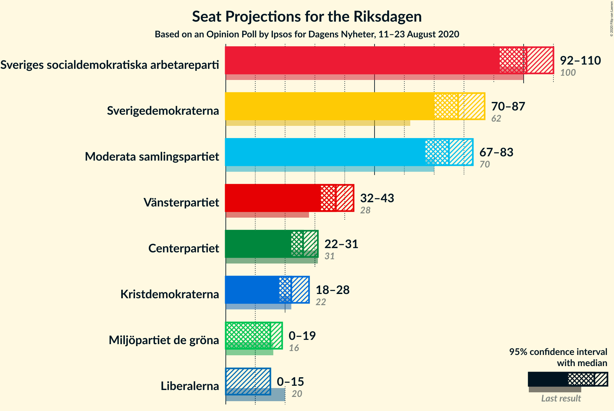
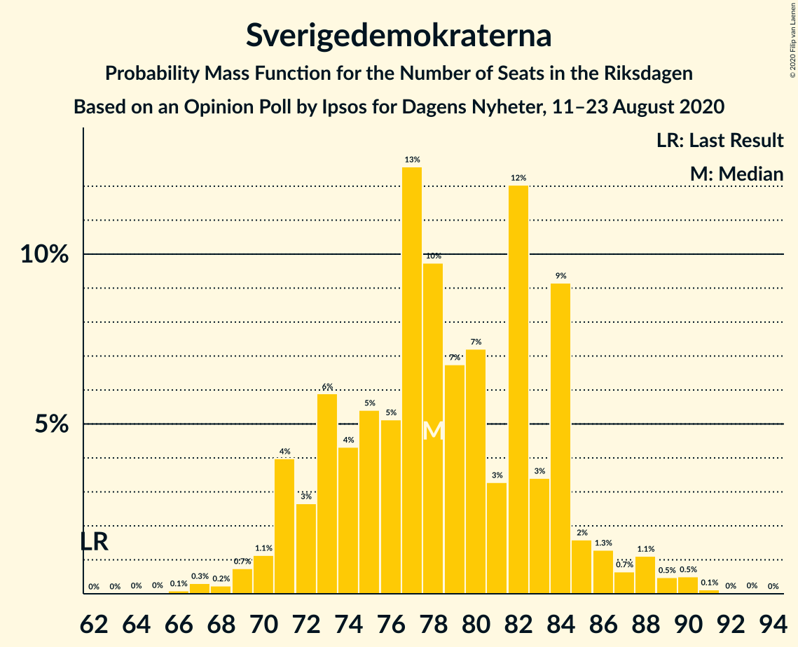
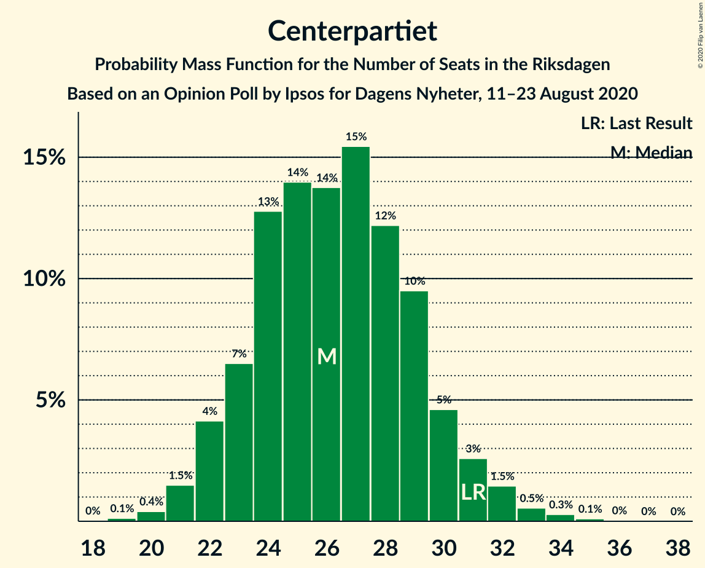
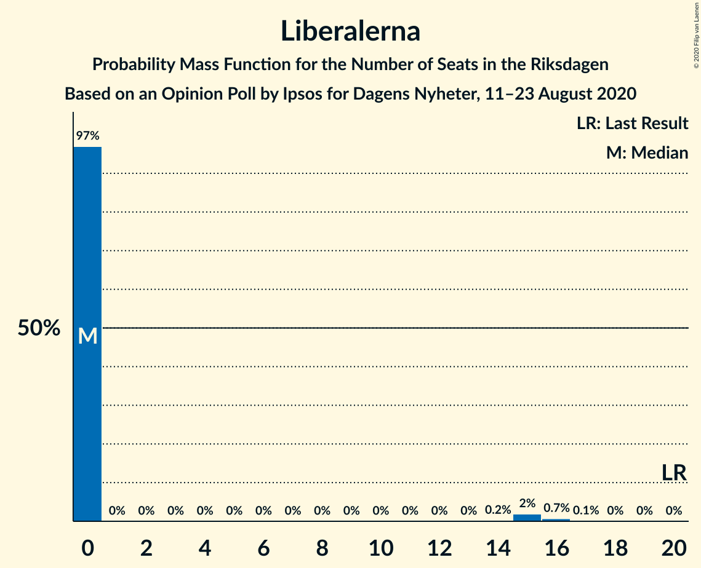
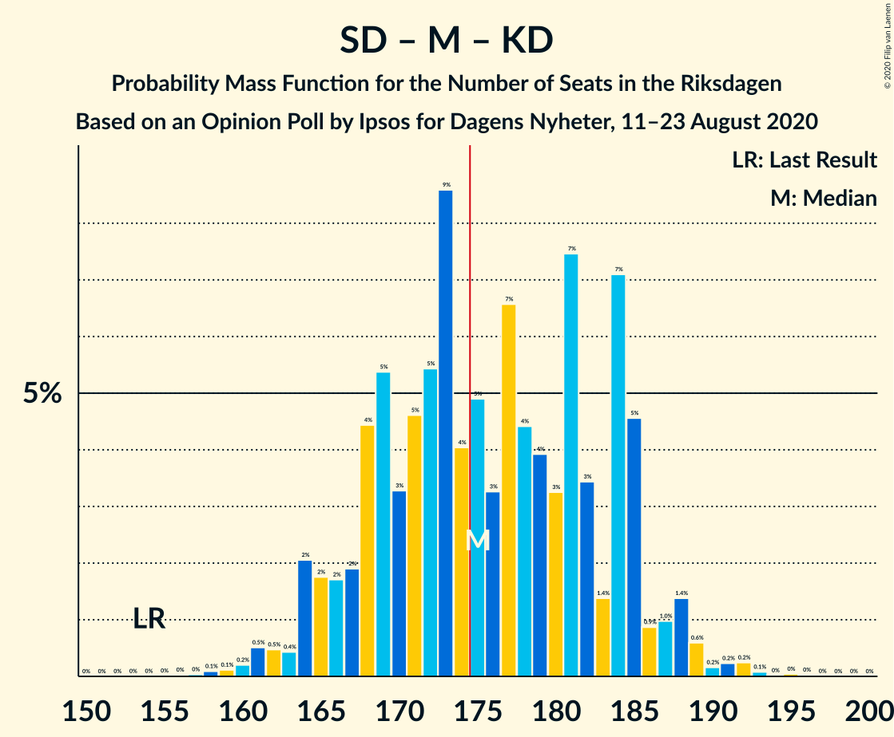
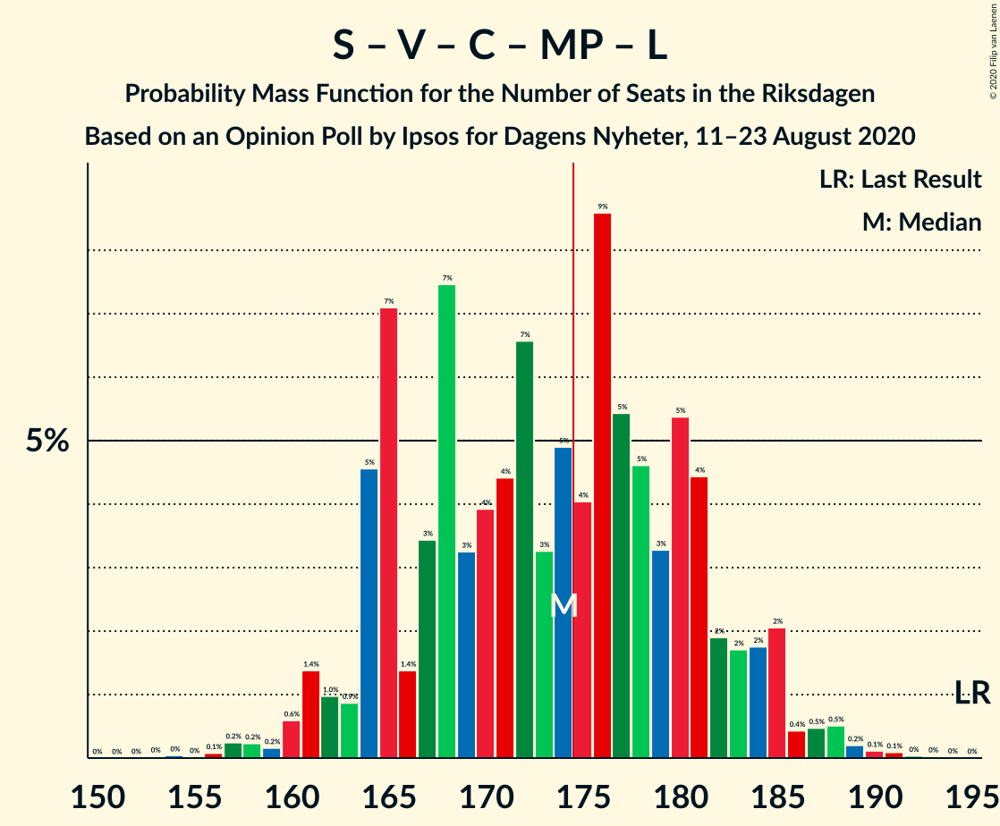

# Opinion Poll by Ipsos for Dagens Nyheter, 11–23 August 2020

<a href="#voting-intentions">Voting Intentions</a> | <a href="#seats">Seats</a> | <a href="#coalitions">Coalitions</a> | <a href="#technical-information">Technical Information</a>

## Voting Intentions

### Confidence Intervals

| Party | Last Result | Poll Result | 80% Confidence Interval | 90% Confidence Interval | 95% Confidence Interval | 99% Confidence Interval |
|:-----:|:-----------:|:-----------:|:-----------------------:|:-----------------------:|:-----------------------:|:-----------------------:|
| Sveriges socialdemokratiska arbetareparti | 28.3% | 27.0% | 25.6–28.5% |25.2–28.9% |24.8–29.3% |24.1–30.0% |
| Sverigedemokraterna | 17.5% | 21.0% | 19.7–22.4% |19.3–22.8% |19.0–23.1% |18.4–23.8% |
| Moderata samlingspartiet | 19.8% | 20.0% | 18.7–21.4% |18.4–21.8% |18.0–22.1% |17.5–22.8% |
| Vänsterpartiet | 8.0% | 10.0% | 9.1–11.1% |8.8–11.4% |8.6–11.6% |8.2–12.2% |
| Centerpartiet | 8.6% | 7.0% | 6.2–7.9% |6.0–8.2% |5.8–8.4% |5.5–8.9% |
| Kristdemokraterna | 6.3% | 6.0% | 5.3–6.9% |5.1–7.1% |4.9–7.3% |4.6–7.8% |
| Miljöpartiet de gröna | 4.4% | 4.0% | 3.4–4.7% |3.2–4.9% |3.1–5.1% |2.9–5.5% |
| Liberalerna | 5.5% | 3.0% | 2.5–3.7% |2.4–3.8% |2.2–4.0% |2.0–4.3% |

*Note:* The poll result column reflects the actual value used in the calculations. Published results may vary slightly, and in addition be rounded to fewer digits.

## Seats

### Confidence Intervals

| Party | Last Result | Median | 80% Confidence Interval | 90% Confidence Interval | 95% Confidence Interval | 99% Confidence Interval |
|:-----:|:-----------:|:------:|:-----------------------:|:-----------------------:|:-----------------------:|:-----------------------:|
| <a href="#sveriges-socialdemokratiska-arbetareparti">Sveriges socialdemokratiska arbetareparti</a> | 100 | 101 | 94–107 |93–109 |92–110 |89–114 |
| <a href="#sverigedemokraterna">Sverigedemokraterna</a> | 62 | 78 | 73–84 |71–85 |70–87 |68–90 |
| <a href="#moderata-samlingspartiet">Moderata samlingspartiet</a> | 70 | 75 | 69–80 |68–82 |67–83 |64–86 |
| <a href="#vänsterpartiet">Vänsterpartiet</a> | 28 | 37 | 34–42 |33–43 |32–43 |30–46 |
| <a href="#centerpartiet">Centerpartiet</a> | 31 | 26 | 23–29 |22–31 |22–31 |20–33 |
| <a href="#kristdemokraterna">Kristdemokraterna</a> | 22 | 22 | 20–26 |19–26 |18–28 |17–29 |
| <a href="#miljöpartiet-de-gröna">Miljöpartiet de gröna</a> | 16 | 15 | 0–17 |0–18 |0–19 |0–20 |
| <a href="#liberalerna">Liberalerna</a> | 20 | 0 | 0 |0 |0–15 |0–16 |

### Sveriges socialdemokratiska arbetareparti

*For a full overview of the results for this party, see the [Sveriges socialdemokratiska arbetareparti](party-sverigessocialdemokratiskaarbetareparti.html) page.*

| Number of Seats | Probability | Accumulated | Special Marks |
|:---------------:|:-----------:|:-----------:|:-------------:|
| 85 | 0% | 100% |  |
| 86 | 0.1% | 99.9% |  |
| 87 | 0.1% | 99.9% |  |
| 88 | 0.3% | 99.8% |  |
| 89 | 0.5% | 99.5% |  |
| 90 | 0.6% | 99.0% |  |
| 91 | 0.8% | 98% |  |
| 92 | 2% | 98% |  |
| 93 | 4% | 96% |  |
| 94 | 3% | 93% |  |
| 95 | 4% | 90% |  |
| 96 | 3% | 85% |  |
| 97 | 7% | 82% |  |
| 98 | 7% | 75% |  |
| 99 | 7% | 68% |  |
| 100 | 7% | 62% | Last Result |
| 101 | 10% | 55% | Median |
| 102 | 14% | 45% |  |
| 103 | 5% | 31% |  |
| 104 | 3% | 26% |  |
| 105 | 8% | 23% |  |
| 106 | 3% | 16% |  |
| 107 | 5% | 13% |  |
| 108 | 2% | 8% |  |
| 109 | 1.2% | 6% |  |
| 110 | 3% | 5% |  |
| 111 | 0.7% | 2% |  |
| 112 | 0.4% | 1.4% |  |
| 113 | 0.3% | 1.0% |  |
| 114 | 0.2% | 0.6% |  |
| 115 | 0.3% | 0.4% |  |
| 116 | 0.1% | 0.2% |  |
| 117 | 0% | 0% |  |

### Sverigedemokraterna

*For a full overview of the results for this party, see the [Sverigedemokraterna](party-sverigedemokraterna.html) page.*

| Number of Seats | Probability | Accumulated | Special Marks |
|:---------------:|:-----------:|:-----------:|:-------------:|
| 62 | 0% | 100% | Last Result |
| 63 | 0% | 100% |  |
| 64 | 0% | 100% |  |
| 65 | 0% | 100% |  |
| 66 | 0.1% | 99.9% |  |
| 67 | 0.3% | 99.8% |  |
| 68 | 0.2% | 99.5% |  |
| 69 | 0.7% | 99.3% |  |
| 70 | 1.1% | 98.5% |  |
| 71 | 4% | 97% |  |
| 72 | 3% | 93% |  |
| 73 | 6% | 91% |  |
| 74 | 4% | 85% |  |
| 75 | 5% | 81% |  |
| 76 | 5% | 75% |  |
| 77 | 13% | 70% |  |
| 78 | 10% | 57% | Median |
| 79 | 7% | 48% |  |
| 80 | 7% | 41% |  |
| 81 | 3% | 34% |  |
| 82 | 12% | 30% |  |
| 83 | 3% | 18% |  |
| 84 | 9% | 15% |  |
| 85 | 2% | 6% |  |
| 86 | 1.3% | 4% |  |
| 87 | 0.7% | 3% |  |
| 88 | 1.1% | 2% |  |
| 89 | 0.5% | 1.2% |  |
| 90 | 0.5% | 0.7% |  |
| 91 | 0.1% | 0.2% |  |
| 92 | 0% | 0.1% |  |
| 93 | 0% | 0.1% |  |
| 94 | 0% | 0% |  |

### Moderata samlingspartiet

*For a full overview of the results for this party, see the [Moderata samlingspartiet](party-moderatasamlingspartiet.html) page.*

| Number of Seats | Probability | Accumulated | Special Marks |
|:---------------:|:-----------:|:-----------:|:-------------:|
| 62 | 0.1% | 100% |  |
| 63 | 0.1% | 99.9% |  |
| 64 | 0.5% | 99.8% |  |
| 65 | 0.6% | 99.3% |  |
| 66 | 0.9% | 98.7% |  |
| 67 | 2% | 98% |  |
| 68 | 3% | 96% |  |
| 69 | 4% | 93% |  |
| 70 | 5% | 89% | Last Result |
| 71 | 5% | 84% |  |
| 72 | 11% | 79% |  |
| 73 | 8% | 68% |  |
| 74 | 7% | 60% |  |
| 75 | 11% | 53% | Median |
| 76 | 9% | 42% |  |
| 77 | 7% | 33% |  |
| 78 | 9% | 26% |  |
| 79 | 5% | 17% |  |
| 80 | 4% | 13% |  |
| 81 | 3% | 9% |  |
| 82 | 3% | 6% |  |
| 83 | 0.9% | 3% |  |
| 84 | 2% | 2% |  |
| 85 | 0.3% | 0.8% |  |
| 86 | 0.3% | 0.5% |  |
| 87 | 0.1% | 0.2% |  |
| 88 | 0.1% | 0.1% |  |
| 89 | 0% | 0.1% |  |
| 90 | 0% | 0% |  |

### Vänsterpartiet

*For a full overview of the results for this party, see the [Vänsterpartiet](party-vänsterpartiet.html) page.*

| Number of Seats | Probability | Accumulated | Special Marks |
|:---------------:|:-----------:|:-----------:|:-------------:|
| 28 | 0.1% | 100% | Last Result |
| 29 | 0.2% | 99.9% |  |
| 30 | 0.4% | 99.8% |  |
| 31 | 1.4% | 99.4% |  |
| 32 | 3% | 98% |  |
| 33 | 4% | 95% |  |
| 34 | 7% | 92% |  |
| 35 | 10% | 85% |  |
| 36 | 15% | 75% |  |
| 37 | 12% | 60% | Median |
| 38 | 16% | 48% |  |
| 39 | 8% | 32% |  |
| 40 | 8% | 24% |  |
| 41 | 5% | 16% |  |
| 42 | 4% | 11% |  |
| 43 | 5% | 7% |  |
| 44 | 1.1% | 2% |  |
| 45 | 0.5% | 1.1% |  |
| 46 | 0.4% | 0.6% |  |
| 47 | 0.1% | 0.2% |  |
| 48 | 0% | 0.1% |  |
| 49 | 0% | 0% |  |

### Centerpartiet

*For a full overview of the results for this party, see the [Centerpartiet](party-centerpartiet.html) page.*

| Number of Seats | Probability | Accumulated | Special Marks |
|:---------------:|:-----------:|:-----------:|:-------------:|
| 19 | 0.1% | 100% |  |
| 20 | 0.4% | 99.8% |  |
| 21 | 1.5% | 99.4% |  |
| 22 | 4% | 98% |  |
| 23 | 7% | 94% |  |
| 24 | 13% | 87% |  |
| 25 | 14% | 75% |  |
| 26 | 14% | 61% | Median |
| 27 | 15% | 47% |  |
| 28 | 12% | 31% |  |
| 29 | 10% | 19% |  |
| 30 | 5% | 10% |  |
| 31 | 3% | 5% | Last Result |
| 32 | 1.5% | 2% |  |
| 33 | 0.5% | 1.0% |  |
| 34 | 0.3% | 0.4% |  |
| 35 | 0.1% | 0.2% |  |
| 36 | 0% | 0.1% |  |
| 37 | 0% | 0% |  |

### Kristdemokraterna

*For a full overview of the results for this party, see the [Kristdemokraterna](party-kristdemokraterna.html) page.*

| Number of Seats | Probability | Accumulated | Special Marks |
|:---------------:|:-----------:|:-----------:|:-------------:|
| 16 | 0.2% | 100% |  |
| 17 | 1.1% | 99.7% |  |
| 18 | 2% | 98.6% |  |
| 19 | 7% | 97% |  |
| 20 | 9% | 90% |  |
| 21 | 13% | 81% |  |
| 22 | 18% | 68% | Last Result, Median |
| 23 | 17% | 50% |  |
| 24 | 12% | 33% |  |
| 25 | 9% | 20% |  |
| 26 | 6% | 11% |  |
| 27 | 2% | 5% |  |
| 28 | 2% | 3% |  |
| 29 | 0.6% | 0.9% |  |
| 30 | 0.2% | 0.3% |  |
| 31 | 0.1% | 0.1% |  |
| 32 | 0% | 0% |  |

### Miljöpartiet de gröna

*For a full overview of the results for this party, see the [Miljöpartiet de gröna](party-miljöpartietdegröna.html) page.*

| Number of Seats | Probability | Accumulated | Special Marks |
|:---------------:|:-----------:|:-----------:|:-------------:|
| 0 | 49% | 100% |  |
| 1 | 0% | 51% |  |
| 2 | 0% | 51% |  |
| 3 | 0% | 51% |  |
| 4 | 0% | 51% |  |
| 5 | 0% | 51% |  |
| 6 | 0% | 51% |  |
| 7 | 0% | 51% |  |
| 8 | 0% | 51% |  |
| 9 | 0% | 51% |  |
| 10 | 0% | 51% |  |
| 11 | 0% | 51% |  |
| 12 | 0% | 51% |  |
| 13 | 0% | 51% |  |
| 14 | 0.1% | 51% |  |
| 15 | 18% | 50% | Median |
| 16 | 14% | 33% | Last Result |
| 17 | 10% | 18% |  |
| 18 | 5% | 8% |  |
| 19 | 2% | 3% |  |
| 20 | 0.7% | 0.9% |  |
| 21 | 0.2% | 0.2% |  |
| 22 | 0.1% | 0.1% |  |
| 23 | 0% | 0% |  |

### Liberalerna

*For a full overview of the results for this party, see the [Liberalerna](party-liberalerna.html) page.*

| Number of Seats | Probability | Accumulated | Special Marks |
|:---------------:|:-----------:|:-----------:|:-------------:|
| 0 | 97% | 100% | Median |
| 1 | 0% | 3% |  |
| 2 | 0% | 3% |  |
| 3 | 0% | 3% |  |
| 4 | 0% | 3% |  |
| 5 | 0% | 3% |  |
| 6 | 0% | 3% |  |
| 7 | 0% | 3% |  |
| 8 | 0% | 3% |  |
| 9 | 0% | 3% |  |
| 10 | 0% | 3% |  |
| 11 | 0% | 3% |  |
| 12 | 0% | 3% |  |
| 13 | 0% | 3% |  |
| 14 | 0.2% | 3% |  |
| 15 | 2% | 3% |  |
| 16 | 0.7% | 0.8% |  |
| 17 | 0.1% | 0.1% |  |
| 18 | 0% | 0% |  |
| 19 | 0% | 0% |  |
| 20 | 0% | 0% | Last Result |

## Coalitions

### Confidence Intervals

| Coalition | Last Result | Median | Majority? | 80% Confidence Interval | 90% Confidence Interval | 95% Confidence Interval | 99% Confidence Interval |
|:---------:|:-----------:|:------:|:---------:|:-----------------------:|:-----------------------:|:-----------------------:|:-----------------------:|
| Sveriges socialdemokratiska arbetareparti – Moderata samlingspartiet – Centerpartiet | 201 | 202 | 100% | 193–211 | 190–213 | 189–214 | 186–217 |
| Sveriges socialdemokratiska arbetareparti – Moderata samlingspartiet | 170 | 176 | 55% | 167–184 | 165–186 | 163–189 | 160–190 |
| Sverigedemokraterna – Moderata samlingspartiet – Kristdemokraterna | 154 | 175 | 55% | 168–184 | 165–185 | 164–188 | 161–191 |
| Sveriges socialdemokratiska arbetareparti – Vänsterpartiet – Centerpartiet – Miljöpartiet de gröna – Liberalerna | 195 | 174 | 45% | 165–181 | 164–184 | 161–185 | 158–188 |
| Sverigedemokraterna – Moderata samlingspartiet | 132 | 153 | 0% | 146–161 | 143–163 | 142–165 | 139–168 |
| Sveriges socialdemokratiska arbetareparti – Vänsterpartiet – Miljöpartiet de gröna | 144 | 147 | 0% | 137–155 | 136–157 | 134–159 | 130–162 |
| Sveriges socialdemokratiska arbetareparti – Vänsterpartiet | 128 | 138 | 0% | 131–146 | 129–148 | 128–149 | 124–153 |
| Sveriges socialdemokratiska arbetareparti – Centerpartiet – Miljöpartiet de gröna – Liberalerna | 167 | 136 | 0% | 128–144 | 125–147 | 123–149 | 119–153 |
| Moderata samlingspartiet – Centerpartiet – Kristdemokraterna – Liberalerna | 143 | 124 | 0% | 117–131 | 115–133 | 114–135 | 111–140 |
| Moderata samlingspartiet – Centerpartiet – Kristdemokraterna | 123 | 124 | 0% | 116–130 | 115–132 | 113–134 | 110–138 |
| Sveriges socialdemokratiska arbetareparti – Miljöpartiet de gröna | 116 | 109 | 0% | 100–118 | 98–120 | 96–122 | 93–125 |
| Moderata samlingspartiet – Centerpartiet – Liberalerna | 121 | 101 | 0% | 95–107 | 94–110 | 92–112 | 89–118 |
| Moderata samlingspartiet – Centerpartiet | 101 | 101 | 0% | 95–107 | 93–108 | 92–110 | 89–114 |

### Sveriges socialdemokratiska arbetareparti – Moderata samlingspartiet – Centerpartiet

| Number of Seats | Probability | Accumulated | Special Marks |
|:---------------:|:-----------:|:-----------:|:-------------:|
| 180 | 0% | 100% |  |
| 181 | 0% | 99.9% |  |
| 182 | 0% | 99.9% |  |
| 183 | 0.1% | 99.9% |  |
| 184 | 0.2% | 99.8% |  |
| 185 | 0.2% | 99.7% |  |
| 186 | 0.4% | 99.5% |  |
| 187 | 0.7% | 99.1% |  |
| 188 | 0.6% | 98% |  |
| 189 | 0.7% | 98% |  |
| 190 | 2% | 97% |  |
| 191 | 2% | 95% |  |
| 192 | 2% | 93% |  |
| 193 | 2% | 91% |  |
| 194 | 2% | 89% |  |
| 195 | 7% | 87% |  |
| 196 | 4% | 80% |  |
| 197 | 4% | 77% |  |
| 198 | 6% | 72% |  |
| 199 | 5% | 66% |  |
| 200 | 3% | 62% |  |
| 201 | 6% | 59% | Last Result |
| 202 | 7% | 53% | Median |
| 203 | 5% | 46% |  |
| 204 | 4% | 41% |  |
| 205 | 6% | 37% |  |
| 206 | 3% | 30% |  |
| 207 | 7% | 27% |  |
| 208 | 5% | 20% |  |
| 209 | 2% | 15% |  |
| 210 | 2% | 13% |  |
| 211 | 1.2% | 11% |  |
| 212 | 4% | 9% |  |
| 213 | 1.2% | 6% |  |
| 214 | 2% | 5% |  |
| 215 | 0.9% | 2% |  |
| 216 | 0.7% | 1.4% |  |
| 217 | 0.3% | 0.7% |  |
| 218 | 0.2% | 0.4% |  |
| 219 | 0.1% | 0.2% |  |
| 220 | 0.1% | 0.1% |  |
| 221 | 0% | 0.1% |  |
| 222 | 0% | 0% |  |

### Sveriges socialdemokratiska arbetareparti – Moderata samlingspartiet

| Number of Seats | Probability | Accumulated | Special Marks |
|:---------------:|:-----------:|:-----------:|:-------------:|
| 156 | 0% | 100% |  |
| 157 | 0% | 99.9% |  |
| 158 | 0.1% | 99.9% |  |
| 159 | 0.2% | 99.8% |  |
| 160 | 0.2% | 99.6% |  |
| 161 | 0.4% | 99.4% |  |
| 162 | 0.4% | 98.9% |  |
| 163 | 2% | 98% |  |
| 164 | 0.8% | 97% |  |
| 165 | 1.4% | 96% |  |
| 166 | 2% | 95% |  |
| 167 | 3% | 92% |  |
| 168 | 4% | 90% |  |
| 169 | 6% | 86% |  |
| 170 | 3% | 80% | Last Result |
| 171 | 5% | 77% |  |
| 172 | 3% | 72% |  |
| 173 | 9% | 69% |  |
| 174 | 5% | 60% |  |
| 175 | 2% | 55% | Majority |
| 176 | 8% | 53% | Median |
| 177 | 8% | 45% |  |
| 178 | 4% | 37% |  |
| 179 | 3% | 33% |  |
| 180 | 10% | 30% |  |
| 181 | 4% | 20% |  |
| 182 | 3% | 16% |  |
| 183 | 3% | 13% |  |
| 184 | 2% | 10% |  |
| 185 | 2% | 8% |  |
| 186 | 2% | 6% |  |
| 187 | 0.7% | 4% |  |
| 188 | 0.5% | 4% |  |
| 189 | 2% | 3% |  |
| 190 | 0.3% | 0.8% |  |
| 191 | 0.2% | 0.5% |  |
| 192 | 0.2% | 0.3% |  |
| 193 | 0.1% | 0.2% |  |
| 194 | 0% | 0.1% |  |
| 195 | 0% | 0.1% |  |
| 196 | 0% | 0% |  |

### Sverigedemokraterna – Moderata samlingspartiet – Kristdemokraterna

| Number of Seats | Probability | Accumulated | Special Marks |
|:---------------:|:-----------:|:-----------:|:-------------:|
| 154 | 0% | 100% | Last Result |
| 155 | 0% | 100% |  |
| 156 | 0% | 100% |  |
| 157 | 0% | 99.9% |  |
| 158 | 0.1% | 99.9% |  |
| 159 | 0.1% | 99.8% |  |
| 160 | 0.2% | 99.7% |  |
| 161 | 0.5% | 99.5% |  |
| 162 | 0.5% | 99.0% |  |
| 163 | 0.4% | 98.5% |  |
| 164 | 2% | 98% |  |
| 165 | 2% | 96% |  |
| 166 | 2% | 94% |  |
| 167 | 2% | 93% |  |
| 168 | 4% | 91% |  |
| 169 | 5% | 86% |  |
| 170 | 3% | 81% |  |
| 171 | 5% | 78% |  |
| 172 | 5% | 73% |  |
| 173 | 9% | 68% |  |
| 174 | 4% | 59% |  |
| 175 | 5% | 55% | Median, Majority |
| 176 | 3% | 50% |  |
| 177 | 7% | 47% |  |
| 178 | 4% | 40% |  |
| 179 | 4% | 36% |  |
| 180 | 3% | 32% |  |
| 181 | 7% | 29% |  |
| 182 | 3% | 21% |  |
| 183 | 1.4% | 18% |  |
| 184 | 7% | 16% |  |
| 185 | 5% | 9% |  |
| 186 | 0.9% | 5% |  |
| 187 | 1.0% | 4% |  |
| 188 | 1.4% | 3% |  |
| 189 | 0.6% | 1.4% |  |
| 190 | 0.2% | 0.8% |  |
| 191 | 0.2% | 0.7% |  |
| 192 | 0.2% | 0.4% |  |
| 193 | 0.1% | 0.2% |  |
| 194 | 0% | 0.1% |  |
| 195 | 0% | 0.1% |  |
| 196 | 0% | 0% |  |

### Sveriges socialdemokratiska arbetareparti – Vänsterpartiet – Centerpartiet – Miljöpartiet de gröna – Liberalerna

| Number of Seats | Probability | Accumulated | Special Marks |
|:---------------:|:-----------:|:-----------:|:-------------:|
| 154 | 0% | 100% |  |
| 155 | 0% | 99.9% |  |
| 156 | 0.1% | 99.9% |  |
| 157 | 0.2% | 99.8% |  |
| 158 | 0.2% | 99.6% |  |
| 159 | 0.2% | 99.3% |  |
| 160 | 0.6% | 99.2% |  |
| 161 | 1.4% | 98.6% |  |
| 162 | 1.0% | 97% |  |
| 163 | 0.9% | 96% |  |
| 164 | 5% | 95% |  |
| 165 | 7% | 91% |  |
| 166 | 1.4% | 84% |  |
| 167 | 3% | 82% |  |
| 168 | 7% | 79% |  |
| 169 | 3% | 71% |  |
| 170 | 4% | 68% |  |
| 171 | 4% | 64% |  |
| 172 | 7% | 60% |  |
| 173 | 3% | 53% |  |
| 174 | 5% | 50% |  |
| 175 | 4% | 45% | Majority |
| 176 | 9% | 41% |  |
| 177 | 5% | 32% |  |
| 178 | 5% | 27% |  |
| 179 | 3% | 22% | Median |
| 180 | 5% | 19% |  |
| 181 | 4% | 14% |  |
| 182 | 2% | 9% |  |
| 183 | 2% | 7% |  |
| 184 | 2% | 6% |  |
| 185 | 2% | 4% |  |
| 186 | 0.4% | 2% |  |
| 187 | 0.5% | 1.5% |  |
| 188 | 0.5% | 1.0% |  |
| 189 | 0.2% | 0.5% |  |
| 190 | 0.1% | 0.3% |  |
| 191 | 0.1% | 0.2% |  |
| 192 | 0% | 0.1% |  |
| 193 | 0% | 0.1% |  |
| 194 | 0% | 0% |  |
| 195 | 0% | 0% | Last Result |

### Sverigedemokraterna – Moderata samlingspartiet

| Number of Seats | Probability | Accumulated | Special Marks |
|:---------------:|:-----------:|:-----------:|:-------------:|
| 132 | 0% | 100% | Last Result |
| 133 | 0% | 100% |  |
| 134 | 0% | 100% |  |
| 135 | 0% | 100% |  |
| 136 | 0.1% | 99.9% |  |
| 137 | 0.1% | 99.9% |  |
| 138 | 0.2% | 99.8% |  |
| 139 | 0.3% | 99.6% |  |
| 140 | 0.4% | 99.2% |  |
| 141 | 1.2% | 98.9% |  |
| 142 | 1.2% | 98% |  |
| 143 | 2% | 97% |  |
| 144 | 1.5% | 95% |  |
| 145 | 3% | 93% |  |
| 146 | 4% | 90% |  |
| 147 | 4% | 86% |  |
| 148 | 6% | 82% |  |
| 149 | 6% | 77% |  |
| 150 | 7% | 70% |  |
| 151 | 6% | 64% |  |
| 152 | 6% | 58% |  |
| 153 | 4% | 52% | Median |
| 154 | 6% | 48% |  |
| 155 | 6% | 42% |  |
| 156 | 5% | 36% |  |
| 157 | 4% | 31% |  |
| 158 | 4% | 27% |  |
| 159 | 6% | 23% |  |
| 160 | 4% | 17% |  |
| 161 | 4% | 14% |  |
| 162 | 4% | 9% |  |
| 163 | 0.9% | 5% |  |
| 164 | 2% | 4% |  |
| 165 | 0.9% | 3% |  |
| 166 | 0.4% | 2% |  |
| 167 | 0.6% | 1.2% |  |
| 168 | 0.2% | 0.6% |  |
| 169 | 0.2% | 0.4% |  |
| 170 | 0.1% | 0.2% |  |
| 171 | 0.1% | 0.1% |  |
| 172 | 0% | 0.1% |  |
| 173 | 0% | 0% |  |

### Sveriges socialdemokratiska arbetareparti – Vänsterpartiet – Miljöpartiet de gröna

| Number of Seats | Probability | Accumulated | Special Marks |
|:---------------:|:-----------:|:-----------:|:-------------:|
| 127 | 0% | 100% |  |
| 128 | 0.2% | 99.9% |  |
| 129 | 0.2% | 99.8% |  |
| 130 | 0.2% | 99.6% |  |
| 131 | 0.3% | 99.4% |  |
| 132 | 0.5% | 99.1% |  |
| 133 | 0.6% | 98.6% |  |
| 134 | 0.8% | 98% |  |
| 135 | 2% | 97% |  |
| 136 | 2% | 96% |  |
| 137 | 5% | 94% |  |
| 138 | 5% | 89% |  |
| 139 | 3% | 84% |  |
| 140 | 5% | 81% |  |
| 141 | 3% | 76% |  |
| 142 | 4% | 73% |  |
| 143 | 5% | 69% |  |
| 144 | 3% | 64% | Last Result |
| 145 | 4% | 61% |  |
| 146 | 5% | 57% |  |
| 147 | 6% | 53% |  |
| 148 | 6% | 47% |  |
| 149 | 4% | 40% |  |
| 150 | 6% | 36% |  |
| 151 | 3% | 30% |  |
| 152 | 6% | 26% |  |
| 153 | 3% | 20% | Median |
| 154 | 3% | 17% |  |
| 155 | 5% | 14% |  |
| 156 | 1.3% | 9% |  |
| 157 | 3% | 7% |  |
| 158 | 0.6% | 4% |  |
| 159 | 2% | 3% |  |
| 160 | 0.4% | 1.5% |  |
| 161 | 0.4% | 1.0% |  |
| 162 | 0.3% | 0.7% |  |
| 163 | 0.2% | 0.4% |  |
| 164 | 0.1% | 0.2% |  |
| 165 | 0% | 0.1% |  |
| 166 | 0% | 0.1% |  |
| 167 | 0% | 0% |  |

### Sveriges socialdemokratiska arbetareparti – Vänsterpartiet

| Number of Seats | Probability | Accumulated | Special Marks |
|:---------------:|:-----------:|:-----------:|:-------------:|
| 121 | 0% | 100% |  |
| 122 | 0.1% | 99.9% |  |
| 123 | 0.1% | 99.8% |  |
| 124 | 0.3% | 99.7% |  |
| 125 | 0.3% | 99.4% |  |
| 126 | 0.6% | 99.0% |  |
| 127 | 0.7% | 98% |  |
| 128 | 1.3% | 98% | Last Result |
| 129 | 2% | 96% |  |
| 130 | 3% | 95% |  |
| 131 | 3% | 91% |  |
| 132 | 4% | 88% |  |
| 133 | 4% | 84% |  |
| 134 | 4% | 80% |  |
| 135 | 8% | 77% |  |
| 136 | 6% | 69% |  |
| 137 | 10% | 63% |  |
| 138 | 7% | 53% | Median |
| 139 | 5% | 45% |  |
| 140 | 8% | 40% |  |
| 141 | 5% | 32% |  |
| 142 | 5% | 27% |  |
| 143 | 5% | 22% |  |
| 144 | 3% | 18% |  |
| 145 | 3% | 15% |  |
| 146 | 2% | 11% |  |
| 147 | 4% | 9% |  |
| 148 | 2% | 6% |  |
| 149 | 0.9% | 3% |  |
| 150 | 1.0% | 2% |  |
| 151 | 0.3% | 1.3% |  |
| 152 | 0.3% | 0.9% |  |
| 153 | 0.3% | 0.7% |  |
| 154 | 0.2% | 0.3% |  |
| 155 | 0.1% | 0.1% |  |
| 156 | 0% | 0.1% |  |
| 157 | 0% | 0% |  |

### Sveriges socialdemokratiska arbetareparti – Centerpartiet – Miljöpartiet de gröna – Liberalerna

| Number of Seats | Probability | Accumulated | Special Marks |
|:---------------:|:-----------:|:-----------:|:-------------:|
| 117 | 0.1% | 100% |  |
| 118 | 0.2% | 99.9% |  |
| 119 | 0.4% | 99.7% |  |
| 120 | 0.2% | 99.3% |  |
| 121 | 0.1% | 99.1% |  |
| 122 | 1.1% | 99.1% |  |
| 123 | 1.0% | 98% |  |
| 124 | 0.7% | 97% |  |
| 125 | 2% | 96% |  |
| 126 | 0.6% | 95% |  |
| 127 | 1.2% | 94% |  |
| 128 | 10% | 93% |  |
| 129 | 11% | 83% |  |
| 130 | 4% | 73% |  |
| 131 | 2% | 69% |  |
| 132 | 6% | 67% |  |
| 133 | 5% | 61% |  |
| 134 | 3% | 57% |  |
| 135 | 2% | 53% |  |
| 136 | 2% | 51% |  |
| 137 | 3% | 48% |  |
| 138 | 7% | 46% |  |
| 139 | 5% | 39% |  |
| 140 | 4% | 34% |  |
| 141 | 1.5% | 30% |  |
| 142 | 7% | 28% | Median |
| 143 | 8% | 21% |  |
| 144 | 6% | 13% |  |
| 145 | 1.3% | 8% |  |
| 146 | 1.0% | 6% |  |
| 147 | 0.9% | 5% |  |
| 148 | 1.5% | 5% |  |
| 149 | 2% | 3% |  |
| 150 | 0.4% | 2% |  |
| 151 | 0.2% | 1.1% |  |
| 152 | 0.3% | 0.9% |  |
| 153 | 0.3% | 0.6% |  |
| 154 | 0.1% | 0.3% |  |
| 155 | 0.1% | 0.1% |  |
| 156 | 0% | 0.1% |  |
| 157 | 0% | 0.1% |  |
| 158 | 0% | 0.1% |  |
| 159 | 0% | 0% |  |
| 160 | 0% | 0% |  |
| 161 | 0% | 0% |  |
| 162 | 0% | 0% |  |
| 163 | 0% | 0% |  |
| 164 | 0% | 0% |  |
| 165 | 0% | 0% |  |
| 166 | 0% | 0% |  |
| 167 | 0% | 0% | Last Result |

### Moderata samlingspartiet – Centerpartiet – Kristdemokraterna – Liberalerna

| Number of Seats | Probability | Accumulated | Special Marks |
|:---------------:|:-----------:|:-----------:|:-------------:|
| 108 | 0.1% | 100% |  |
| 109 | 0.1% | 99.9% |  |
| 110 | 0.2% | 99.8% |  |
| 111 | 0.5% | 99.6% |  |
| 112 | 0.4% | 99.1% |  |
| 113 | 0.8% | 98.7% |  |
| 114 | 2% | 98% |  |
| 115 | 1.3% | 96% |  |
| 116 | 4% | 95% |  |
| 117 | 2% | 91% |  |
| 118 | 5% | 89% |  |
| 119 | 5% | 84% |  |
| 120 | 7% | 79% |  |
| 121 | 8% | 72% |  |
| 122 | 4% | 64% |  |
| 123 | 7% | 59% | Median |
| 124 | 7% | 53% |  |
| 125 | 5% | 46% |  |
| 126 | 5% | 40% |  |
| 127 | 8% | 35% |  |
| 128 | 4% | 28% |  |
| 129 | 7% | 24% |  |
| 130 | 6% | 17% |  |
| 131 | 3% | 11% |  |
| 132 | 2% | 7% |  |
| 133 | 1.1% | 5% |  |
| 134 | 1.1% | 4% |  |
| 135 | 0.6% | 3% |  |
| 136 | 0.8% | 2% |  |
| 137 | 0.4% | 2% |  |
| 138 | 0.4% | 1.1% |  |
| 139 | 0.2% | 0.8% |  |
| 140 | 0.1% | 0.5% |  |
| 141 | 0.1% | 0.4% |  |
| 142 | 0.1% | 0.3% |  |
| 143 | 0.1% | 0.2% | Last Result |
| 144 | 0% | 0.1% |  |
| 145 | 0% | 0.1% |  |
| 146 | 0% | 0.1% |  |
| 147 | 0% | 0% |  |

### Moderata samlingspartiet – Centerpartiet – Kristdemokraterna

| Number of Seats | Probability | Accumulated | Special Marks |
|:---------------:|:-----------:|:-----------:|:-------------:|
| 107 | 0% | 100% |  |
| 108 | 0.1% | 99.9% |  |
| 109 | 0.2% | 99.9% |  |
| 110 | 0.2% | 99.7% |  |
| 111 | 0.6% | 99.5% |  |
| 112 | 0.8% | 98.9% |  |
| 113 | 0.9% | 98% |  |
| 114 | 2% | 97% |  |
| 115 | 1.5% | 95% |  |
| 116 | 4% | 94% |  |
| 117 | 2% | 90% |  |
| 118 | 5% | 88% |  |
| 119 | 5% | 83% |  |
| 120 | 7% | 77% |  |
| 121 | 9% | 70% |  |
| 122 | 5% | 61% |  |
| 123 | 7% | 57% | Last Result, Median |
| 124 | 7% | 50% |  |
| 125 | 5% | 43% |  |
| 126 | 5% | 38% |  |
| 127 | 7% | 33% |  |
| 128 | 4% | 25% |  |
| 129 | 7% | 22% |  |
| 130 | 6% | 15% |  |
| 131 | 3% | 9% |  |
| 132 | 2% | 6% |  |
| 133 | 0.9% | 3% |  |
| 134 | 1.1% | 3% |  |
| 135 | 0.4% | 1.5% |  |
| 136 | 0.4% | 1.1% |  |
| 137 | 0.2% | 0.7% |  |
| 138 | 0.2% | 0.5% |  |
| 139 | 0.2% | 0.3% |  |
| 140 | 0.1% | 0.2% |  |
| 141 | 0% | 0.1% |  |
| 142 | 0% | 0% |  |

### Sveriges socialdemokratiska arbetareparti – Miljöpartiet de gröna

| Number of Seats | Probability | Accumulated | Special Marks |
|:---------------:|:-----------:|:-----------:|:-------------:|
| 90 | 0% | 100% |  |
| 91 | 0.2% | 99.9% |  |
| 92 | 0.2% | 99.8% |  |
| 93 | 0.3% | 99.5% |  |
| 94 | 0.3% | 99.3% |  |
| 95 | 0.5% | 98.9% |  |
| 96 | 1.1% | 98% |  |
| 97 | 0.8% | 97% |  |
| 98 | 2% | 97% |  |
| 99 | 3% | 95% |  |
| 100 | 5% | 91% |  |
| 101 | 7% | 87% |  |
| 102 | 6% | 80% |  |
| 103 | 1.0% | 74% |  |
| 104 | 2% | 73% |  |
| 105 | 7% | 70% |  |
| 106 | 2% | 63% |  |
| 107 | 5% | 61% |  |
| 108 | 4% | 56% |  |
| 109 | 3% | 52% |  |
| 110 | 5% | 49% |  |
| 111 | 4% | 44% |  |
| 112 | 5% | 41% |  |
| 113 | 4% | 36% |  |
| 114 | 4% | 31% |  |
| 115 | 5% | 28% |  |
| 116 | 3% | 23% | Last Result, Median |
| 117 | 5% | 19% |  |
| 118 | 6% | 15% |  |
| 119 | 3% | 9% |  |
| 120 | 2% | 6% |  |
| 121 | 1.1% | 4% |  |
| 122 | 1.2% | 3% |  |
| 123 | 0.7% | 2% |  |
| 124 | 0.2% | 0.8% |  |
| 125 | 0.3% | 0.6% |  |
| 126 | 0.1% | 0.3% |  |
| 127 | 0.1% | 0.2% |  |
| 128 | 0% | 0.1% |  |
| 129 | 0% | 0.1% |  |
| 130 | 0% | 0% |  |

### Moderata samlingspartiet – Centerpartiet – Liberalerna

| Number of Seats | Probability | Accumulated | Special Marks |
|:---------------:|:-----------:|:-----------:|:-------------:|
| 86 | 0.1% | 100% |  |
| 87 | 0.2% | 99.9% |  |
| 88 | 0.1% | 99.8% |  |
| 89 | 0.4% | 99.6% |  |
| 90 | 0.4% | 99.2% |  |
| 91 | 0.6% | 98.7% |  |
| 92 | 1.0% | 98% |  |
| 93 | 1.4% | 97% |  |
| 94 | 3% | 96% |  |
| 95 | 3% | 93% |  |
| 96 | 8% | 90% |  |
| 97 | 5% | 81% |  |
| 98 | 9% | 76% |  |
| 99 | 5% | 68% |  |
| 100 | 7% | 63% |  |
| 101 | 6% | 55% | Median |
| 102 | 6% | 49% |  |
| 103 | 6% | 43% |  |
| 104 | 7% | 37% |  |
| 105 | 9% | 30% |  |
| 106 | 6% | 21% |  |
| 107 | 5% | 15% |  |
| 108 | 3% | 9% |  |
| 109 | 1.5% | 7% |  |
| 110 | 1.0% | 5% |  |
| 111 | 0.6% | 4% |  |
| 112 | 1.1% | 4% |  |
| 113 | 0.5% | 2% |  |
| 114 | 0.7% | 2% |  |
| 115 | 0.3% | 1.2% |  |
| 116 | 0.2% | 0.9% |  |
| 117 | 0.2% | 0.7% |  |
| 118 | 0.2% | 0.5% |  |
| 119 | 0.1% | 0.3% |  |
| 120 | 0% | 0.2% |  |
| 121 | 0% | 0.1% | Last Result |
| 122 | 0% | 0.1% |  |
| 123 | 0% | 0.1% |  |
| 124 | 0% | 0% |  |

### Moderata samlingspartiet – Centerpartiet

| Number of Seats | Probability | Accumulated | Special Marks |
|:---------------:|:-----------:|:-----------:|:-------------:|
| 86 | 0.1% | 100% |  |
| 87 | 0.2% | 99.9% |  |
| 88 | 0.1% | 99.7% |  |
| 89 | 0.5% | 99.6% |  |
| 90 | 0.5% | 99.1% |  |
| 91 | 0.7% | 98.6% |  |
| 92 | 2% | 98% |  |
| 93 | 2% | 96% |  |
| 94 | 3% | 95% |  |
| 95 | 3% | 92% |  |
| 96 | 8% | 88% |  |
| 97 | 5% | 80% |  |
| 98 | 9% | 75% |  |
| 99 | 5% | 66% |  |
| 100 | 8% | 60% |  |
| 101 | 6% | 53% | Last Result, Median |
| 102 | 6% | 47% |  |
| 103 | 6% | 41% |  |
| 104 | 7% | 34% |  |
| 105 | 9% | 27% |  |
| 106 | 6% | 18% |  |
| 107 | 5% | 12% |  |
| 108 | 3% | 7% |  |
| 109 | 1.4% | 5% |  |
| 110 | 0.9% | 3% |  |
| 111 | 0.6% | 2% |  |
| 112 | 0.9% | 2% |  |
| 113 | 0.3% | 0.8% |  |
| 114 | 0.2% | 0.5% |  |
| 115 | 0.2% | 0.3% |  |
| 116 | 0.1% | 0.2% |  |
| 117 | 0% | 0.1% |  |
| 118 | 0% | 0.1% |  |
| 119 | 0% | 0% |  |

## Technical Information

### Opinion Poll

+ **Polling firm:** Ipsos
+ **Commissioner(s):** Dagens Nyheter
+ **Fieldwork period:** 11–23 August 2020

### Calculations

+ **Sample size:** 1500
+ **Simulations done:** 1,048,576
+ **Error estimate:** 1.37%

