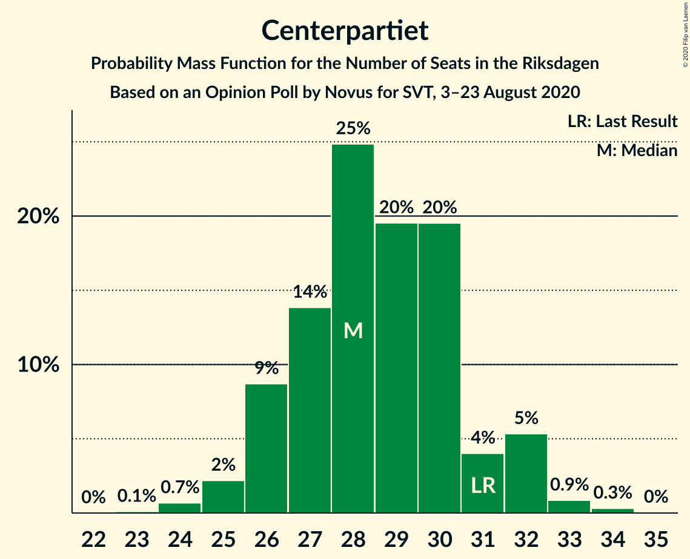
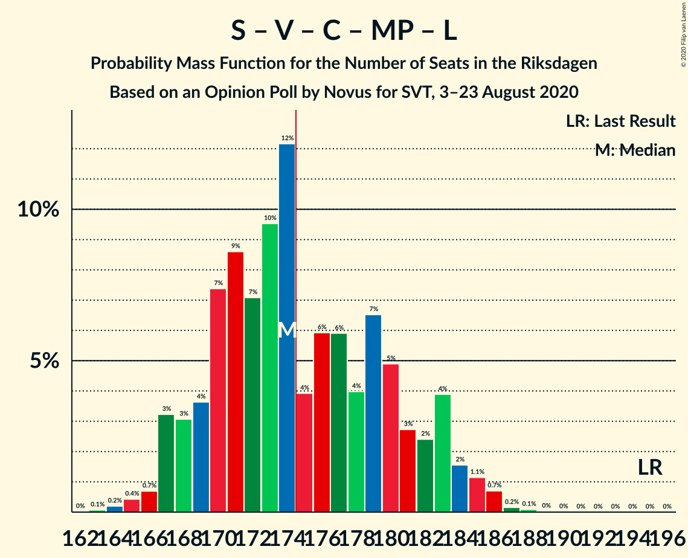
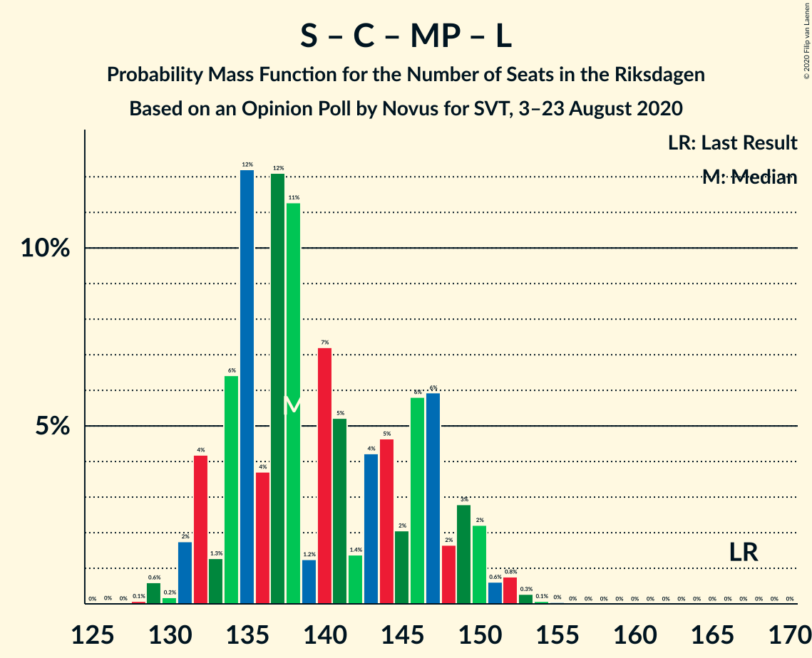
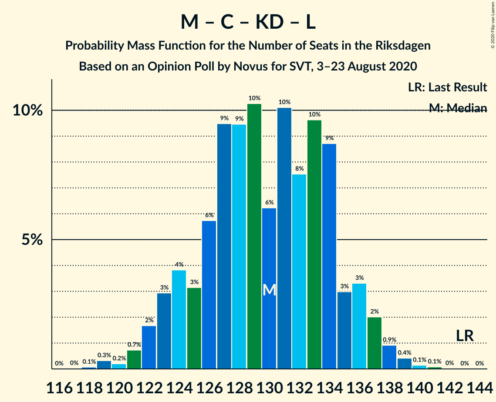

# Opinion Poll by Novus for SVT, 3–23 August 2020

<a href="#voting-intentions">Voting Intentions</a> | <a href="#seats">Seats</a> | <a href="#coalitions">Coalitions</a> | <a href="#technical-information">Technical Information</a>

## Voting Intentions

### Confidence Intervals

| Party | Last Result | Poll Result | 80% Confidence Interval | 90% Confidence Interval | 95% Confidence Interval | 99% Confidence Interval |
|:-----:|:-----------:|:-----------:|:-----------------------:|:-----------------------:|:-----------------------:|:-----------------------:|
| Sveriges socialdemokratiska arbetareparti | 28.3% | 28.3% | 27.4–29.3% |27.1–29.5% |26.9–29.8% |26.5–30.2% |
| Moderata samlingspartiet | 19.8% | 21.2% | 20.3–22.1% |20.1–22.3% |19.9–22.5% |19.5–22.9% |
| Sverigedemokraterna | 17.5% | 19.4% | 18.6–20.3% |18.4–20.5% |18.2–20.7% |17.8–21.1% |
| Vänsterpartiet | 8.0% | 9.3% | 8.7–9.9% |8.6–10.1% |8.4–10.3% |8.1–10.6% |
| Centerpartiet | 8.6% | 7.6% | 7.1–8.2% |6.9–8.4% |6.8–8.5% |6.6–8.8% |
| Kristdemokraterna | 6.3% | 5.8% | 5.3–6.3% |5.2–6.5% |5.1–6.6% |4.9–6.9% |
| Miljöpartiet de gröna | 4.4% | 3.8% | 3.4–4.3% |3.3–4.4% |3.2–4.5% |3.1–4.7% |
| Liberalerna | 5.5% | 2.9% | 2.6–3.3% |2.5–3.4% |2.4–3.5% |2.3–3.7% |

*Note:* The poll result column reflects the actual value used in the calculations. Published results may vary slightly, and in addition be rounded to fewer digits.

## Seats

### Confidence Intervals

| Party | Last Result | Median | 80% Confidence Interval | 90% Confidence Interval | 95% Confidence Interval | 99% Confidence Interval |
|:-----:|:-----------:|:------:|:-----------------------:|:-----------------------:|:-----------------------:|:-----------------------:|
| <a href="#sveriges-socialdemokratiska-arbetareparti">Sveriges socialdemokratiska arbetareparti</a> | 100 | 107 | 103–111 |102–111 |100–112 |99–114 |
| <a href="#moderata-samlingspartiet">Moderata samlingspartiet</a> | 70 | 81 | 76–83 |75–83 |75–85 |73–86 |
| <a href="#sverigedemokraterna">Sverigedemokraterna</a> | 62 | 74 | 71–77 |69–78 |67–79 |66–81 |
| <a href="#vänsterpartiet">Vänsterpartiet</a> | 28 | 36 | 33–38 |32–38 |32–39 |30–40 |
| <a href="#centerpartiet">Centerpartiet</a> | 31 | 29 | 27–31 |26–32 |26–33 |25–33 |
| <a href="#kristdemokraterna">Kristdemokraterna</a> | 22 | 22 | 20–23 |19–24 |19–24 |18–26 |
| <a href="#miljöpartiet-de-gröna">Miljöpartiet de gröna</a> | 16 | 0 | 0–15 |0–17 |0–17 |0–17 |
| <a href="#liberalerna">Liberalerna</a> | 20 | 0 | 0 |0 |0 |0 |

### Sveriges socialdemokratiska arbetareparti

*For a full overview of the results for this party, see the [Sveriges socialdemokratiska arbetareparti](party-sverigessocialdemokratiskaarbetareparti.html) page.*

| Number of Seats | Probability | Accumulated | Special Marks |
|:---------------:|:-----------:|:-----------:|:-------------:|
| 95 | 0.1% | 100% |  |
| 96 | 0% | 99.9% |  |
| 97 | 0.2% | 99.9% |  |
| 98 | 0.2% | 99.7% |  |
| 99 | 0.6% | 99.5% |  |
| 100 | 1.5% | 98.9% | Last Result |
| 101 | 1.4% | 97% |  |
| 102 | 3% | 96% |  |
| 103 | 4% | 93% |  |
| 104 | 6% | 89% |  |
| 105 | 8% | 82% |  |
| 106 | 4% | 75% |  |
| 107 | 33% | 70% | Median |
| 108 | 6% | 37% |  |
| 109 | 15% | 30% |  |
| 110 | 4% | 16% |  |
| 111 | 8% | 12% |  |
| 112 | 2% | 3% |  |
| 113 | 0.5% | 2% |  |
| 114 | 1.0% | 1.4% |  |
| 115 | 0.2% | 0.4% |  |
| 116 | 0.2% | 0.2% |  |
| 117 | 0% | 0.1% |  |
| 118 | 0% | 0% |  |

### Moderata samlingspartiet

*For a full overview of the results for this party, see the [Moderata samlingspartiet](party-moderatasamlingspartiet.html) page.*

| Number of Seats | Probability | Accumulated | Special Marks |
|:---------------:|:-----------:|:-----------:|:-------------:|
| 70 | 0.1% | 100% | Last Result |
| 71 | 0.1% | 99.9% |  |
| 72 | 0.1% | 99.8% |  |
| 73 | 0.4% | 99.6% |  |
| 74 | 1.2% | 99.2% |  |
| 75 | 4% | 98% |  |
| 76 | 4% | 94% |  |
| 77 | 5% | 90% |  |
| 78 | 15% | 84% |  |
| 79 | 3% | 69% |  |
| 80 | 16% | 67% |  |
| 81 | 14% | 50% | Median |
| 82 | 21% | 36% |  |
| 83 | 11% | 15% |  |
| 84 | 2% | 4% |  |
| 85 | 2% | 3% |  |
| 86 | 0.4% | 0.9% |  |
| 87 | 0.2% | 0.4% |  |
| 88 | 0.1% | 0.2% |  |
| 89 | 0.1% | 0.1% |  |
| 90 | 0% | 0% |  |

### Sverigedemokraterna

*For a full overview of the results for this party, see the [Sverigedemokraterna](party-sverigedemokraterna.html) page.*

| Number of Seats | Probability | Accumulated | Special Marks |
|:---------------:|:-----------:|:-----------:|:-------------:|
| 62 | 0% | 100% | Last Result |
| 63 | 0.1% | 100% |  |
| 64 | 0.1% | 99.9% |  |
| 65 | 0.3% | 99.8% |  |
| 66 | 0.8% | 99.5% |  |
| 67 | 1.4% | 98.7% |  |
| 68 | 1.1% | 97% |  |
| 69 | 3% | 96% |  |
| 70 | 2% | 94% |  |
| 71 | 5% | 92% |  |
| 72 | 31% | 86% |  |
| 73 | 5% | 56% |  |
| 74 | 10% | 51% | Median |
| 75 | 12% | 41% |  |
| 76 | 13% | 28% |  |
| 77 | 10% | 16% |  |
| 78 | 2% | 6% |  |
| 79 | 2% | 3% |  |
| 80 | 0.5% | 1.1% |  |
| 81 | 0.4% | 0.6% |  |
| 82 | 0.2% | 0.2% |  |
| 83 | 0.1% | 0.1% |  |
| 84 | 0% | 0% |  |

### Vänsterpartiet

*For a full overview of the results for this party, see the [Vänsterpartiet](party-vänsterpartiet.html) page.*

| Number of Seats | Probability | Accumulated | Special Marks |
|:---------------:|:-----------:|:-----------:|:-------------:|
| 28 | 0% | 100% | Last Result |
| 29 | 0% | 100% |  |
| 30 | 0.7% | 100% |  |
| 31 | 1.3% | 99.2% |  |
| 32 | 4% | 98% |  |
| 33 | 8% | 94% |  |
| 34 | 16% | 86% |  |
| 35 | 8% | 71% |  |
| 36 | 27% | 63% | Median |
| 37 | 19% | 37% |  |
| 38 | 15% | 18% |  |
| 39 | 2% | 3% |  |
| 40 | 0.4% | 0.8% |  |
| 41 | 0.3% | 0.4% |  |
| 42 | 0% | 0% |  |

### Centerpartiet

*For a full overview of the results for this party, see the [Centerpartiet](party-centerpartiet.html) page.*

| Number of Seats | Probability | Accumulated | Special Marks |
|:---------------:|:-----------:|:-----------:|:-------------:|
| 24 | 0.1% | 100% |  |
| 25 | 1.4% | 99.9% |  |
| 26 | 4% | 98% |  |
| 27 | 22% | 94% |  |
| 28 | 19% | 72% |  |
| 29 | 18% | 53% | Median |
| 30 | 22% | 35% |  |
| 31 | 5% | 13% | Last Result |
| 32 | 4% | 7% |  |
| 33 | 3% | 3% |  |
| 34 | 0.2% | 0.2% |  |
| 35 | 0% | 0% |  |

### Kristdemokraterna

*For a full overview of the results for this party, see the [Kristdemokraterna](party-kristdemokraterna.html) page.*

| Number of Seats | Probability | Accumulated | Special Marks |
|:---------------:|:-----------:|:-----------:|:-------------:|
| 17 | 0.2% | 100% |  |
| 18 | 0.6% | 99.8% |  |
| 19 | 5% | 99.2% |  |
| 20 | 11% | 94% |  |
| 21 | 29% | 83% |  |
| 22 | 22% | 54% | Last Result, Median |
| 23 | 23% | 32% |  |
| 24 | 7% | 9% |  |
| 25 | 2% | 2% |  |
| 26 | 0.4% | 0.6% |  |
| 27 | 0.1% | 0.2% |  |
| 28 | 0% | 0% |  |

### Miljöpartiet de gröna

*For a full overview of the results for this party, see the [Miljöpartiet de gröna](party-miljöpartietdegröna.html) page.*

| Number of Seats | Probability | Accumulated | Special Marks |
|:---------------:|:-----------:|:-----------:|:-------------:|
| 0 | 87% | 100% | Median |
| 1 | 0% | 13% |  |
| 2 | 0% | 13% |  |
| 3 | 0% | 13% |  |
| 4 | 0% | 13% |  |
| 5 | 0% | 13% |  |
| 6 | 0% | 13% |  |
| 7 | 0% | 13% |  |
| 8 | 0% | 13% |  |
| 9 | 0% | 13% |  |
| 10 | 0% | 13% |  |
| 11 | 0% | 13% |  |
| 12 | 0% | 13% |  |
| 13 | 0% | 13% |  |
| 14 | 0% | 13% |  |
| 15 | 6% | 13% |  |
| 16 | 2% | 7% | Last Result |
| 17 | 5% | 5% |  |
| 18 | 0.1% | 0.1% |  |
| 19 | 0% | 0% |  |

### Liberalerna

*For a full overview of the results for this party, see the [Liberalerna](party-liberalerna.html) page.*

| Number of Seats | Probability | Accumulated | Special Marks |
|:---------------:|:-----------:|:-----------:|:-------------:|
| 0 | 100% | 100% | Median |
| 1 | 0% | 0% |  |
| 2 | 0% | 0% |  |
| 3 | 0% | 0% |  |
| 4 | 0% | 0% |  |
| 5 | 0% | 0% |  |
| 6 | 0% | 0% |  |
| 7 | 0% | 0% |  |
| 8 | 0% | 0% |  |
| 9 | 0% | 0% |  |
| 10 | 0% | 0% |  |
| 11 | 0% | 0% |  |
| 12 | 0% | 0% |  |
| 13 | 0% | 0% |  |
| 14 | 0% | 0% |  |
| 15 | 0% | 0% |  |
| 16 | 0% | 0% |  |
| 17 | 0% | 0% |  |
| 18 | 0% | 0% |  |
| 19 | 0% | 0% |  |
| 20 | 0% | 0% | Last Result |

## Coalitions

### Confidence Intervals

| Coalition | Last Result | Median | Majority? | 80% Confidence Interval | 90% Confidence Interval | 95% Confidence Interval | 99% Confidence Interval |
|:---------:|:-----------:|:------:|:---------:|:-----------------------:|:-----------------------:|:-----------------------:|:-----------------------:|
| Sveriges socialdemokratiska arbetareparti – Moderata samlingspartiet – Centerpartiet | 201 | 217 | 100% | 211–220 | 207–221 | 206–222 | 202–223 |
| Sveriges socialdemokratiska arbetareparti – Moderata samlingspartiet | 170 | 188 | 99.6% | 182–191 | 180–191 | 178–193 | 175–195 |
| Sveriges socialdemokratiska arbetareparti – Vänsterpartiet – Centerpartiet – Miljöpartiet de gröna – Liberalerna | 195 | 173 | 24% | 170–179 | 168–180 | 167–184 | 165–186 |
| Moderata samlingspartiet – Sverigedemokraterna – Kristdemokraterna | 154 | 176 | 76% | 170–179 | 169–181 | 165–182 | 163–184 |
| Moderata samlingspartiet – Sverigedemokraterna | 132 | 154 | 0% | 149–158 | 147–158 | 145–160 | 143–162 |
| Sveriges socialdemokratiska arbetareparti – Vänsterpartiet – Miljöpartiet de gröna | 144 | 144 | 0% | 140–151 | 140–153 | 138–154 | 137–157 |
| Sveriges socialdemokratiska arbetareparti – Vänsterpartiet | 128 | 143 | 0% | 138–146 | 136–147 | 134–149 | 131–150 |
| Sveriges socialdemokratiska arbetareparti – Centerpartiet – Miljöpartiet de gröna – Liberalerna | 167 | 137 | 0% | 134–145 | 132–148 | 131–149 | 129–152 |
| Moderata samlingspartiet – Centerpartiet – Kristdemokraterna – Liberalerna | 143 | 131 | 0% | 126–135 | 124–135 | 124–136 | 121–138 |
| Moderata samlingspartiet – Centerpartiet – Kristdemokraterna | 123 | 131 | 0% | 126–135 | 124–135 | 124–136 | 121–138 |
| Sveriges socialdemokratiska arbetareparti – Miljöpartiet de gröna | 116 | 107 | 0% | 105–117 | 104–120 | 103–121 | 102–124 |
| Moderata samlingspartiet – Centerpartiet – Liberalerna | 121 | 110 | 0% | 105–112 | 104–113 | 102–114 | 100–116 |
| Moderata samlingspartiet – Centerpartiet | 101 | 110 | 0% | 105–112 | 104–113 | 102–114 | 100–116 |

### Sveriges socialdemokratiska arbetareparti – Moderata samlingspartiet – Centerpartiet

| Number of Seats | Probability | Accumulated | Special Marks |
|:---------------:|:-----------:|:-----------:|:-------------:|
| 200 | 0.1% | 100% |  |
| 201 | 0.3% | 99.9% | Last Result |
| 202 | 0.1% | 99.5% |  |
| 203 | 0.1% | 99.4% |  |
| 204 | 0.4% | 99.4% |  |
| 205 | 1.1% | 98.9% |  |
| 206 | 0.5% | 98% |  |
| 207 | 3% | 97% |  |
| 208 | 0.7% | 95% |  |
| 209 | 2% | 94% |  |
| 210 | 0.4% | 92% |  |
| 211 | 3% | 92% |  |
| 212 | 12% | 89% |  |
| 213 | 4% | 78% |  |
| 214 | 3% | 74% |  |
| 215 | 6% | 71% |  |
| 216 | 6% | 65% |  |
| 217 | 18% | 59% | Median |
| 218 | 15% | 41% |  |
| 219 | 15% | 26% |  |
| 220 | 5% | 11% |  |
| 221 | 3% | 6% |  |
| 222 | 2% | 3% |  |
| 223 | 0.7% | 1.1% |  |
| 224 | 0.1% | 0.3% |  |
| 225 | 0.1% | 0.2% |  |
| 226 | 0.1% | 0.1% |  |
| 227 | 0% | 0% |  |

### Sveriges socialdemokratiska arbetareparti – Moderata samlingspartiet

| Number of Seats | Probability | Accumulated | Special Marks |
|:---------------:|:-----------:|:-----------:|:-------------:|
| 170 | 0% | 100% | Last Result |
| 171 | 0% | 100% |  |
| 172 | 0% | 100% |  |
| 173 | 0.2% | 99.9% |  |
| 174 | 0.1% | 99.8% |  |
| 175 | 0.5% | 99.6% | Majority |
| 176 | 0.4% | 99.1% |  |
| 177 | 0.5% | 98.8% |  |
| 178 | 1.0% | 98% |  |
| 179 | 0.3% | 97% |  |
| 180 | 4% | 97% |  |
| 181 | 2% | 93% |  |
| 182 | 2% | 91% |  |
| 183 | 2% | 89% |  |
| 184 | 3% | 87% |  |
| 185 | 13% | 84% |  |
| 186 | 1.1% | 71% |  |
| 187 | 20% | 70% |  |
| 188 | 18% | 50% | Median |
| 189 | 7% | 32% |  |
| 190 | 3% | 25% |  |
| 191 | 17% | 22% |  |
| 192 | 1.3% | 4% |  |
| 193 | 2% | 3% |  |
| 194 | 0.4% | 1.5% |  |
| 195 | 0.6% | 1.1% |  |
| 196 | 0.1% | 0.5% |  |
| 197 | 0.3% | 0.3% |  |
| 198 | 0% | 0% |  |

### Sveriges socialdemokratiska arbetareparti – Vänsterpartiet – Centerpartiet – Miljöpartiet de gröna – Liberalerna

| Number of Seats | Probability | Accumulated | Special Marks |
|:---------------:|:-----------:|:-----------:|:-------------:|
| 162 | 0% | 100% |  |
| 163 | 0.2% | 99.9% |  |
| 164 | 0% | 99.7% |  |
| 165 | 0.2% | 99.7% |  |
| 166 | 0.5% | 99.5% |  |
| 167 | 3% | 99.0% |  |
| 168 | 2% | 96% |  |
| 169 | 3% | 94% |  |
| 170 | 7% | 91% |  |
| 171 | 12% | 84% |  |
| 172 | 13% | 72% | Median |
| 173 | 16% | 59% |  |
| 174 | 19% | 43% |  |
| 175 | 3% | 24% | Majority |
| 176 | 5% | 21% |  |
| 177 | 3% | 16% |  |
| 178 | 3% | 13% |  |
| 179 | 1.2% | 10% |  |
| 180 | 4% | 9% |  |
| 181 | 0.7% | 5% |  |
| 182 | 0.7% | 4% |  |
| 183 | 0.7% | 3% |  |
| 184 | 2% | 3% |  |
| 185 | 0.2% | 0.7% |  |
| 186 | 0.3% | 0.5% |  |
| 187 | 0.1% | 0.2% |  |
| 188 | 0.1% | 0.1% |  |
| 189 | 0% | 0.1% |  |
| 190 | 0% | 0% |  |
| 191 | 0% | 0% |  |
| 192 | 0% | 0% |  |
| 193 | 0% | 0% |  |
| 194 | 0% | 0% |  |
| 195 | 0% | 0% | Last Result |

### Moderata samlingspartiet – Sverigedemokraterna – Kristdemokraterna

| Number of Seats | Probability | Accumulated | Special Marks |
|:---------------:|:-----------:|:-----------:|:-------------:|
| 154 | 0% | 100% | Last Result |
| 155 | 0% | 100% |  |
| 156 | 0% | 100% |  |
| 157 | 0% | 100% |  |
| 158 | 0% | 100% |  |
| 159 | 0% | 100% |  |
| 160 | 0% | 100% |  |
| 161 | 0.1% | 99.9% |  |
| 162 | 0.1% | 99.9% |  |
| 163 | 0.3% | 99.8% |  |
| 164 | 0.2% | 99.5% |  |
| 165 | 2% | 99.3% |  |
| 166 | 0.7% | 97% |  |
| 167 | 0.7% | 97% |  |
| 168 | 0.7% | 96% |  |
| 169 | 4% | 95% |  |
| 170 | 1.2% | 91% |  |
| 171 | 3% | 90% |  |
| 172 | 3% | 87% |  |
| 173 | 5% | 84% |  |
| 174 | 3% | 79% |  |
| 175 | 19% | 76% | Majority |
| 176 | 16% | 57% |  |
| 177 | 13% | 41% | Median |
| 178 | 12% | 28% |  |
| 179 | 7% | 16% |  |
| 180 | 3% | 9% |  |
| 181 | 2% | 6% |  |
| 182 | 3% | 4% |  |
| 183 | 0.5% | 1.0% |  |
| 184 | 0.2% | 0.5% |  |
| 185 | 0% | 0.3% |  |
| 186 | 0.2% | 0.3% |  |
| 187 | 0% | 0.1% |  |
| 188 | 0% | 0% |  |

### Moderata samlingspartiet – Sverigedemokraterna

| Number of Seats | Probability | Accumulated | Special Marks |
|:---------------:|:-----------:|:-----------:|:-------------:|
| 132 | 0% | 100% | Last Result |
| 133 | 0% | 100% |  |
| 134 | 0% | 100% |  |
| 135 | 0% | 100% |  |
| 136 | 0% | 100% |  |
| 137 | 0% | 100% |  |
| 138 | 0% | 100% |  |
| 139 | 0.1% | 100% |  |
| 140 | 0% | 99.9% |  |
| 141 | 0.2% | 99.9% |  |
| 142 | 0.1% | 99.6% |  |
| 143 | 0.7% | 99.5% |  |
| 144 | 0.8% | 98.8% |  |
| 145 | 0.8% | 98% |  |
| 146 | 1.3% | 97% |  |
| 147 | 2% | 96% |  |
| 148 | 2% | 94% |  |
| 149 | 3% | 92% |  |
| 150 | 4% | 89% |  |
| 151 | 3% | 85% |  |
| 152 | 6% | 82% |  |
| 153 | 12% | 75% |  |
| 154 | 21% | 63% |  |
| 155 | 17% | 43% | Median |
| 156 | 8% | 26% |  |
| 157 | 6% | 17% |  |
| 158 | 7% | 12% |  |
| 159 | 1.3% | 5% |  |
| 160 | 2% | 4% |  |
| 161 | 0.6% | 2% |  |
| 162 | 0.7% | 1.0% |  |
| 163 | 0.1% | 0.3% |  |
| 164 | 0% | 0.1% |  |
| 165 | 0.1% | 0.1% |  |
| 166 | 0% | 0% |  |

### Sveriges socialdemokratiska arbetareparti – Vänsterpartiet – Miljöpartiet de gröna

| Number of Seats | Probability | Accumulated | Special Marks |
|:---------------:|:-----------:|:-----------:|:-------------:|
| 134 | 0.1% | 100% |  |
| 135 | 0.1% | 99.9% |  |
| 136 | 0.2% | 99.8% |  |
| 137 | 0.8% | 99.6% |  |
| 138 | 1.4% | 98.8% |  |
| 139 | 2% | 97% |  |
| 140 | 6% | 95% |  |
| 141 | 12% | 89% |  |
| 142 | 5% | 77% |  |
| 143 | 16% | 72% | Median |
| 144 | 6% | 56% | Last Result |
| 145 | 11% | 50% |  |
| 146 | 18% | 39% |  |
| 147 | 4% | 21% |  |
| 148 | 2% | 16% |  |
| 149 | 3% | 14% |  |
| 150 | 0.4% | 11% |  |
| 151 | 2% | 11% |  |
| 152 | 1.2% | 9% |  |
| 153 | 4% | 8% |  |
| 154 | 0.9% | 3% |  |
| 155 | 0.8% | 2% |  |
| 156 | 1.0% | 2% |  |
| 157 | 0.2% | 0.6% |  |
| 158 | 0.3% | 0.5% |  |
| 159 | 0.1% | 0.2% |  |
| 160 | 0.1% | 0.1% |  |
| 161 | 0% | 0.1% |  |
| 162 | 0% | 0% |  |

### Sveriges socialdemokratiska arbetareparti – Vänsterpartiet

| Number of Seats | Probability | Accumulated | Special Marks |
|:---------------:|:-----------:|:-----------:|:-------------:|
| 128 | 0% | 100% | Last Result |
| 129 | 0.1% | 100% |  |
| 130 | 0.1% | 99.9% |  |
| 131 | 0.3% | 99.8% |  |
| 132 | 0.4% | 99.5% |  |
| 133 | 0.2% | 99.0% |  |
| 134 | 2% | 98.9% |  |
| 135 | 0.9% | 97% |  |
| 136 | 4% | 96% |  |
| 137 | 2% | 92% |  |
| 138 | 3% | 90% |  |
| 139 | 2% | 87% |  |
| 140 | 7% | 85% |  |
| 141 | 12% | 78% |  |
| 142 | 5% | 65% |  |
| 143 | 17% | 60% | Median |
| 144 | 6% | 43% |  |
| 145 | 11% | 37% |  |
| 146 | 18% | 26% |  |
| 147 | 4% | 9% |  |
| 148 | 2% | 5% |  |
| 149 | 2% | 3% |  |
| 150 | 0.2% | 0.7% |  |
| 151 | 0.2% | 0.5% |  |
| 152 | 0.1% | 0.3% |  |
| 153 | 0.1% | 0.1% |  |
| 154 | 0% | 0% |  |

### Sveriges socialdemokratiska arbetareparti – Centerpartiet – Miljöpartiet de gröna – Liberalerna

| Number of Seats | Probability | Accumulated | Special Marks |
|:---------------:|:-----------:|:-----------:|:-------------:|
| 128 | 0.2% | 100% |  |
| 129 | 0.5% | 99.8% |  |
| 130 | 0.1% | 99.3% |  |
| 131 | 2% | 99.2% |  |
| 132 | 3% | 97% |  |
| 133 | 0.7% | 94% |  |
| 134 | 19% | 94% |  |
| 135 | 4% | 74% |  |
| 136 | 4% | 71% | Median |
| 137 | 38% | 67% |  |
| 138 | 2% | 29% |  |
| 139 | 1.2% | 27% |  |
| 140 | 8% | 26% |  |
| 141 | 1.4% | 17% |  |
| 142 | 2% | 16% |  |
| 143 | 2% | 14% |  |
| 144 | 1.1% | 12% |  |
| 145 | 1.3% | 11% |  |
| 146 | 1.1% | 9% |  |
| 147 | 3% | 8% |  |
| 148 | 1.3% | 5% |  |
| 149 | 1.4% | 4% |  |
| 150 | 0.7% | 2% |  |
| 151 | 0.7% | 2% |  |
| 152 | 0.8% | 1.0% |  |
| 153 | 0.1% | 0.2% |  |
| 154 | 0.1% | 0.1% |  |
| 155 | 0% | 0% |  |
| 156 | 0% | 0% |  |
| 157 | 0% | 0% |  |
| 158 | 0% | 0% |  |
| 159 | 0% | 0% |  |
| 160 | 0% | 0% |  |
| 161 | 0% | 0% |  |
| 162 | 0% | 0% |  |
| 163 | 0% | 0% |  |
| 164 | 0% | 0% |  |
| 165 | 0% | 0% |  |
| 166 | 0% | 0% |  |
| 167 | 0% | 0% | Last Result |

### Moderata samlingspartiet – Centerpartiet – Kristdemokraterna – Liberalerna

| Number of Seats | Probability | Accumulated | Special Marks |
|:---------------:|:-----------:|:-----------:|:-------------:|
| 119 | 0.1% | 100% |  |
| 120 | 0.2% | 99.9% |  |
| 121 | 0.2% | 99.7% |  |
| 122 | 0.3% | 99.5% |  |
| 123 | 0.5% | 99.2% |  |
| 124 | 4% | 98.6% |  |
| 125 | 3% | 95% |  |
| 126 | 6% | 92% |  |
| 127 | 12% | 86% |  |
| 128 | 3% | 74% |  |
| 129 | 6% | 72% |  |
| 130 | 6% | 66% |  |
| 131 | 20% | 60% |  |
| 132 | 4% | 39% | Median |
| 133 | 10% | 36% |  |
| 134 | 15% | 26% |  |
| 135 | 9% | 12% |  |
| 136 | 0.6% | 3% |  |
| 137 | 1.1% | 2% |  |
| 138 | 0.9% | 1.1% |  |
| 139 | 0.1% | 0.3% |  |
| 140 | 0% | 0.1% |  |
| 141 | 0.1% | 0.1% |  |
| 142 | 0% | 0% |  |
| 143 | 0% | 0% | Last Result |

### Moderata samlingspartiet – Centerpartiet – Kristdemokraterna

| Number of Seats | Probability | Accumulated | Special Marks |
|:---------------:|:-----------:|:-----------:|:-------------:|
| 119 | 0.1% | 100% |  |
| 120 | 0.2% | 99.9% |  |
| 121 | 0.2% | 99.7% |  |
| 122 | 0.3% | 99.5% |  |
| 123 | 0.5% | 99.1% | Last Result |
| 124 | 4% | 98.6% |  |
| 125 | 3% | 95% |  |
| 126 | 6% | 92% |  |
| 127 | 12% | 86% |  |
| 128 | 3% | 74% |  |
| 129 | 6% | 72% |  |
| 130 | 6% | 66% |  |
| 131 | 20% | 60% |  |
| 132 | 4% | 39% | Median |
| 133 | 10% | 36% |  |
| 134 | 15% | 26% |  |
| 135 | 9% | 12% |  |
| 136 | 0.6% | 3% |  |
| 137 | 1.1% | 2% |  |
| 138 | 0.9% | 1.1% |  |
| 139 | 0.1% | 0.2% |  |
| 140 | 0% | 0.1% |  |
| 141 | 0.1% | 0.1% |  |
| 142 | 0% | 0% |  |

### Sveriges socialdemokratiska arbetareparti – Miljöpartiet de gröna

| Number of Seats | Probability | Accumulated | Special Marks |
|:---------------:|:-----------:|:-----------:|:-------------:|
| 99 | 0.2% | 100% |  |
| 100 | 0.1% | 99.8% |  |
| 101 | 0.2% | 99.7% |  |
| 102 | 2% | 99.5% |  |
| 103 | 1.1% | 98% |  |
| 104 | 6% | 97% |  |
| 105 | 7% | 91% |  |
| 106 | 2% | 84% |  |
| 107 | 33% | 82% | Median |
| 108 | 6% | 48% |  |
| 109 | 14% | 43% |  |
| 110 | 4% | 28% |  |
| 111 | 8% | 24% |  |
| 112 | 2% | 16% |  |
| 113 | 0.7% | 14% |  |
| 114 | 1.2% | 14% |  |
| 115 | 0.7% | 12% |  |
| 116 | 2% | 12% | Last Result |
| 117 | 1.2% | 10% |  |
| 118 | 0.5% | 9% |  |
| 119 | 1.2% | 8% |  |
| 120 | 4% | 7% |  |
| 121 | 2% | 4% |  |
| 122 | 0.4% | 2% |  |
| 123 | 0.8% | 1.4% |  |
| 124 | 0.5% | 0.6% |  |
| 125 | 0.1% | 0.2% |  |
| 126 | 0% | 0.1% |  |
| 127 | 0.1% | 0.1% |  |
| 128 | 0% | 0% |  |

### Moderata samlingspartiet – Centerpartiet – Liberalerna

| Number of Seats | Probability | Accumulated | Special Marks |
|:---------------:|:-----------:|:-----------:|:-------------:|
| 98 | 0.1% | 100% |  |
| 99 | 0.3% | 99.8% |  |
| 100 | 0.1% | 99.6% |  |
| 101 | 0.4% | 99.5% |  |
| 102 | 3% | 99.1% |  |
| 103 | 0.6% | 97% |  |
| 104 | 5% | 96% |  |
| 105 | 15% | 91% |  |
| 106 | 2% | 75% |  |
| 107 | 4% | 73% |  |
| 108 | 3% | 70% |  |
| 109 | 9% | 67% |  |
| 110 | 26% | 58% | Median |
| 111 | 16% | 32% |  |
| 112 | 6% | 16% |  |
| 113 | 6% | 10% |  |
| 114 | 2% | 3% |  |
| 115 | 0.3% | 1.2% |  |
| 116 | 0.5% | 1.0% |  |
| 117 | 0.4% | 0.5% |  |
| 118 | 0.1% | 0.1% |  |
| 119 | 0% | 0% |  |
| 120 | 0% | 0% |  |
| 121 | 0% | 0% | Last Result |

### Moderata samlingspartiet – Centerpartiet

| Number of Seats | Probability | Accumulated | Special Marks |
|:---------------:|:-----------:|:-----------:|:-------------:|
| 98 | 0.1% | 100% |  |
| 99 | 0.3% | 99.8% |  |
| 100 | 0.1% | 99.6% |  |
| 101 | 0.4% | 99.5% | Last Result |
| 102 | 3% | 99.0% |  |
| 103 | 0.6% | 97% |  |
| 104 | 5% | 96% |  |
| 105 | 15% | 91% |  |
| 106 | 2% | 75% |  |
| 107 | 4% | 73% |  |
| 108 | 3% | 70% |  |
| 109 | 9% | 67% |  |
| 110 | 26% | 58% | Median |
| 111 | 16% | 32% |  |
| 112 | 6% | 16% |  |
| 113 | 6% | 10% |  |
| 114 | 2% | 3% |  |
| 115 | 0.3% | 1.2% |  |
| 116 | 0.5% | 0.9% |  |
| 117 | 0.4% | 0.5% |  |
| 118 | 0.1% | 0.1% |  |
| 119 | 0% | 0% |  |

## Technical Information

### Opinion Poll

+ **Polling firm:** Novus
+ **Commissioner(s):** SVT
+ **Fieldwork period:** 3–23 August 2020

### Calculations

+ **Sample size:** 3804
+ **Simulations done:** 131,072
+ **Error estimate:** 1.11%

