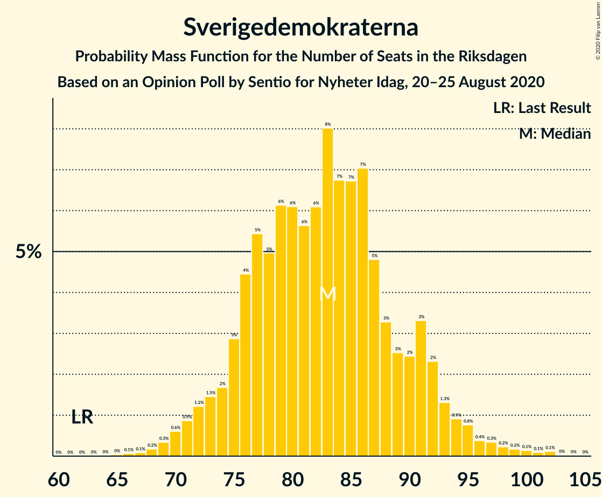

# Opinion Poll by Sentio for Nyheter Idag, 20–25 August 2020

<a href="#voting-intentions">Voting Intentions</a> | <a href="#seats">Seats</a> | <a href="#coalitions">Coalitions</a> | <a href="#technical-information">Technical Information</a>

## Voting Intentions

### Confidence Intervals

| Party | Last Result | Poll Result | 80% Confidence Interval | 90% Confidence Interval | 95% Confidence Interval | 99% Confidence Interval |
|:-----:|:-----------:|:-----------:|:-----------------------:|:-----------------------:|:-----------------------:|:-----------------------:|
| Sveriges socialdemokratiska arbetareparti | 28.3% | 26.7% | 24.8–28.8% |24.2–29.4% |23.8–29.9% |22.9–31.0% |
| Sverigedemokraterna | 17.5% | 22.4% | 20.6–24.4% |20.1–25.0% |19.7–25.5% |18.8–26.5% |
| Moderata samlingspartiet | 19.8% | 20.3% | 18.5–22.2% |18.0–22.8% |17.6–23.2% |16.8–24.2% |
| Vänsterpartiet | 8.0% | 10.0% | 8.7–11.5% |8.4–11.9% |8.1–12.3% |7.5–13.1% |
| Kristdemokraterna | 6.3% | 5.4% | 4.5–6.6% |4.3–7.0% |4.1–7.3% |3.7–7.9% |
| Centerpartiet | 8.6% | 5.1% | 4.2–6.2% |3.9–6.6% |3.7–6.8% |3.4–7.4% |
| Miljöpartiet de gröna | 4.4% | 4.9% | 4.1–6.1% |3.8–6.4% |3.6–6.7% |3.3–7.3% |
| Liberalerna | 5.5% | 2.8% | 2.2–3.7% |2.0–4.0% |1.8–4.2% |1.6–4.7% |

*Note:* The poll result column reflects the actual value used in the calculations. Published results may vary slightly, and in addition be rounded to fewer digits.

## Seats

### Confidence Intervals

| Party | Last Result | Median | 80% Confidence Interval | 90% Confidence Interval | 95% Confidence Interval | 99% Confidence Interval |
|:-----:|:-----------:|:------:|:-----------------------:|:-----------------------:|:-----------------------:|:-----------------------:|
| <a href="#sveriges-socialdemokratiska-arbetareparti">Sveriges socialdemokratiska arbetareparti</a> | 100 | 98 | 91–105 |89–108 |87–110 |84–115 |
| <a href="#sverigedemokraterna">Sverigedemokraterna</a> | 62 | 83 | 76–91 |74–92 |72–94 |69–99 |
| <a href="#moderata-samlingspartiet">Moderata samlingspartiet</a> | 70 | 74 | 67–82 |66–83 |64–85 |62–90 |
| <a href="#vänsterpartiet">Vänsterpartiet</a> | 28 | 36 | 32–42 |30–44 |30–45 |28–48 |
| <a href="#kristdemokraterna">Kristdemokraterna</a> | 22 | 20 | 16–24 |16–25 |15–27 |0–29 |
| <a href="#centerpartiet">Centerpartiet</a> | 31 | 19 | 15–23 |0–24 |0–25 |0–27 |
| <a href="#miljöpartiet-de-gröna">Miljöpartiet de gröna</a> | 16 | 19 | 15–22 |0–23 |0–24 |0–26 |
| <a href="#liberalerna">Liberalerna</a> | 20 | 0 | 0 |0 |0–15 |0–16 |

### Sveriges socialdemokratiska arbetareparti

*For a full overview of the results for this party, see the [Sveriges socialdemokratiska arbetareparti](party-sverigessocialdemokratiskaarbetareparti.html) page.*

| Number of Seats | Probability | Accumulated | Special Marks |
|:---------------:|:-----------:|:-----------:|:-------------:|
| 80 | 0% | 100% |  |
| 81 | 0.1% | 99.9% |  |
| 82 | 0.1% | 99.9% |  |
| 83 | 0.2% | 99.7% |  |
| 84 | 0.3% | 99.5% |  |
| 85 | 0.5% | 99.2% |  |
| 86 | 0.7% | 98.7% |  |
| 87 | 1.1% | 98% |  |
| 88 | 1.2% | 97% |  |
| 89 | 2% | 96% |  |
| 90 | 3% | 94% |  |
| 91 | 4% | 91% |  |
| 92 | 5% | 87% |  |
| 93 | 5% | 82% |  |
| 94 | 4% | 77% |  |
| 95 | 6% | 73% |  |
| 96 | 9% | 67% |  |
| 97 | 7% | 58% |  |
| 98 | 5% | 51% | Median |
| 99 | 9% | 46% |  |
| 100 | 6% | 36% | Last Result |
| 101 | 4% | 30% |  |
| 102 | 6% | 26% |  |
| 103 | 5% | 21% |  |
| 104 | 3% | 16% |  |
| 105 | 3% | 13% |  |
| 106 | 3% | 10% |  |
| 107 | 2% | 7% |  |
| 108 | 1.2% | 5% |  |
| 109 | 1.3% | 4% |  |
| 110 | 0.6% | 3% |  |
| 111 | 0.9% | 2% |  |
| 112 | 0.4% | 1.4% |  |
| 113 | 0.3% | 1.0% |  |
| 114 | 0.2% | 0.7% |  |
| 115 | 0.2% | 0.5% |  |
| 116 | 0.1% | 0.3% |  |
| 117 | 0.1% | 0.2% |  |
| 118 | 0% | 0.2% |  |
| 119 | 0% | 0.1% |  |
| 120 | 0% | 0.1% |  |
| 121 | 0% | 0.1% |  |
| 122 | 0% | 0% |  |

### Sverigedemokraterna

*For a full overview of the results for this party, see the [Sverigedemokraterna](party-sverigedemokraterna.html) page.*

| Number of Seats | Probability | Accumulated | Special Marks |
|:---------------:|:-----------:|:-----------:|:-------------:|
| 62 | 0% | 100% | Last Result |
| 63 | 0% | 100% |  |
| 64 | 0% | 100% |  |
| 65 | 0% | 100% |  |
| 66 | 0.1% | 99.9% |  |
| 67 | 0.1% | 99.9% |  |
| 68 | 0.2% | 99.8% |  |
| 69 | 0.3% | 99.6% |  |
| 70 | 0.6% | 99.3% |  |
| 71 | 0.9% | 98.7% |  |
| 72 | 1.2% | 98% |  |
| 73 | 1.5% | 97% |  |
| 74 | 2% | 95% |  |
| 75 | 3% | 93% |  |
| 76 | 4% | 91% |  |
| 77 | 5% | 86% |  |
| 78 | 5% | 81% |  |
| 79 | 6% | 76% |  |
| 80 | 6% | 70% |  |
| 81 | 6% | 63% |  |
| 82 | 6% | 58% |  |
| 83 | 8% | 52% | Median |
| 84 | 7% | 44% |  |
| 85 | 7% | 37% |  |
| 86 | 7% | 30% |  |
| 87 | 5% | 23% |  |
| 88 | 3% | 18% |  |
| 89 | 3% | 15% |  |
| 90 | 2% | 13% |  |
| 91 | 3% | 10% |  |
| 92 | 2% | 7% |  |
| 93 | 1.3% | 5% |  |
| 94 | 0.9% | 3% |  |
| 95 | 0.8% | 2% |  |
| 96 | 0.4% | 2% |  |
| 97 | 0.3% | 1.2% |  |
| 98 | 0.2% | 0.8% |  |
| 99 | 0.2% | 0.6% |  |
| 100 | 0.1% | 0.4% |  |
| 101 | 0.1% | 0.3% |  |
| 102 | 0.1% | 0.2% |  |
| 103 | 0% | 0.1% |  |
| 104 | 0% | 0% |  |

### Moderata samlingspartiet

*For a full overview of the results for this party, see the [Moderata samlingspartiet](party-moderatasamlingspartiet.html) page.*

| Number of Seats | Probability | Accumulated | Special Marks |
|:---------------:|:-----------:|:-----------:|:-------------:|
| 58 | 0% | 100% |  |
| 59 | 0.1% | 99.9% |  |
| 60 | 0.1% | 99.9% |  |
| 61 | 0.2% | 99.8% |  |
| 62 | 0.2% | 99.6% |  |
| 63 | 0.6% | 99.3% |  |
| 64 | 2% | 98.7% |  |
| 65 | 1.0% | 97% |  |
| 66 | 1.5% | 96% |  |
| 67 | 4% | 94% |  |
| 68 | 2% | 90% |  |
| 69 | 3% | 88% |  |
| 70 | 1.5% | 85% | Last Result |
| 71 | 9% | 83% |  |
| 72 | 8% | 75% |  |
| 73 | 3% | 66% |  |
| 74 | 17% | 63% | Median |
| 75 | 6% | 46% |  |
| 76 | 2% | 40% |  |
| 77 | 8% | 38% |  |
| 78 | 4% | 30% |  |
| 79 | 6% | 25% |  |
| 80 | 2% | 19% |  |
| 81 | 3% | 17% |  |
| 82 | 7% | 14% |  |
| 83 | 2% | 7% |  |
| 84 | 1.3% | 5% |  |
| 85 | 1.1% | 4% |  |
| 86 | 0.4% | 2% |  |
| 87 | 0.5% | 2% |  |
| 88 | 0.5% | 2% |  |
| 89 | 0.5% | 1.0% |  |
| 90 | 0.2% | 0.6% |  |
| 91 | 0.1% | 0.4% |  |
| 92 | 0.1% | 0.3% |  |
| 93 | 0.1% | 0.2% |  |
| 94 | 0% | 0.1% |  |
| 95 | 0% | 0.1% |  |
| 96 | 0% | 0.1% |  |
| 97 | 0% | 0% |  |

### Vänsterpartiet

*For a full overview of the results for this party, see the [Vänsterpartiet](party-vänsterpartiet.html) page.*

| Number of Seats | Probability | Accumulated | Special Marks |
|:---------------:|:-----------:|:-----------:|:-------------:|
| 25 | 0.1% | 100% |  |
| 26 | 0.1% | 99.9% |  |
| 27 | 0.2% | 99.8% |  |
| 28 | 0.5% | 99.6% | Last Result |
| 29 | 1.5% | 99.1% |  |
| 30 | 4% | 98% |  |
| 31 | 2% | 94% |  |
| 32 | 3% | 92% |  |
| 33 | 6% | 89% |  |
| 34 | 11% | 83% |  |
| 35 | 14% | 72% |  |
| 36 | 9% | 58% | Median |
| 37 | 5% | 49% |  |
| 38 | 9% | 44% |  |
| 39 | 10% | 34% |  |
| 40 | 8% | 25% |  |
| 41 | 4% | 16% |  |
| 42 | 3% | 12% |  |
| 43 | 3% | 10% |  |
| 44 | 3% | 6% |  |
| 45 | 1.4% | 3% |  |
| 46 | 0.6% | 2% |  |
| 47 | 0.3% | 1.0% |  |
| 48 | 0.3% | 0.7% |  |
| 49 | 0.2% | 0.3% |  |
| 50 | 0.1% | 0.2% |  |
| 51 | 0% | 0.1% |  |
| 52 | 0% | 0% |  |

### Kristdemokraterna

*For a full overview of the results for this party, see the [Kristdemokraterna](party-kristdemokraterna.html) page.*

| Number of Seats | Probability | Accumulated | Special Marks |
|:---------------:|:-----------:|:-----------:|:-------------:|
| 0 | 2% | 100% |  |
| 1 | 0% | 98% |  |
| 2 | 0% | 98% |  |
| 3 | 0% | 98% |  |
| 4 | 0% | 98% |  |
| 5 | 0% | 98% |  |
| 6 | 0% | 98% |  |
| 7 | 0% | 98% |  |
| 8 | 0% | 98% |  |
| 9 | 0% | 98% |  |
| 10 | 0% | 98% |  |
| 11 | 0% | 98% |  |
| 12 | 0% | 98% |  |
| 13 | 0% | 98% |  |
| 14 | 0% | 98% |  |
| 15 | 1.4% | 98% |  |
| 16 | 6% | 96% |  |
| 17 | 9% | 90% |  |
| 18 | 9% | 81% |  |
| 19 | 13% | 72% |  |
| 20 | 15% | 59% | Median |
| 21 | 10% | 43% |  |
| 22 | 11% | 33% | Last Result |
| 23 | 8% | 23% |  |
| 24 | 6% | 15% |  |
| 25 | 3% | 8% |  |
| 26 | 2% | 5% |  |
| 27 | 1.4% | 3% |  |
| 28 | 0.6% | 1.2% |  |
| 29 | 0.4% | 0.6% |  |
| 30 | 0.2% | 0.3% |  |
| 31 | 0.1% | 0.1% |  |
| 32 | 0% | 0% |  |

### Centerpartiet

*For a full overview of the results for this party, see the [Centerpartiet](party-centerpartiet.html) page.*

| Number of Seats | Probability | Accumulated | Special Marks |
|:---------------:|:-----------:|:-----------:|:-------------:|
| 0 | 6% | 100% |  |
| 1 | 0% | 94% |  |
| 2 | 0% | 94% |  |
| 3 | 0% | 94% |  |
| 4 | 0% | 94% |  |
| 5 | 0% | 94% |  |
| 6 | 0% | 94% |  |
| 7 | 0% | 94% |  |
| 8 | 0% | 94% |  |
| 9 | 0% | 94% |  |
| 10 | 0% | 94% |  |
| 11 | 0% | 94% |  |
| 12 | 0% | 94% |  |
| 13 | 0% | 94% |  |
| 14 | 0.1% | 94% |  |
| 15 | 5% | 94% |  |
| 16 | 10% | 89% |  |
| 17 | 11% | 79% |  |
| 18 | 15% | 68% |  |
| 19 | 14% | 53% | Median |
| 20 | 10% | 39% |  |
| 21 | 9% | 30% |  |
| 22 | 7% | 20% |  |
| 23 | 6% | 13% |  |
| 24 | 3% | 7% |  |
| 25 | 2% | 4% |  |
| 26 | 1.0% | 2% |  |
| 27 | 0.5% | 0.9% |  |
| 28 | 0.3% | 0.5% |  |
| 29 | 0.1% | 0.2% |  |
| 30 | 0% | 0.1% |  |
| 31 | 0% | 0% | Last Result |

### Miljöpartiet de gröna

*For a full overview of the results for this party, see the [Miljöpartiet de gröna](party-miljöpartietdegröna.html) page.*

| Number of Seats | Probability | Accumulated | Special Marks |
|:---------------:|:-----------:|:-----------:|:-------------:|
| 0 | 5% | 100% |  |
| 1 | 0% | 95% |  |
| 2 | 0% | 95% |  |
| 3 | 0% | 95% |  |
| 4 | 0% | 95% |  |
| 5 | 0% | 95% |  |
| 6 | 0% | 95% |  |
| 7 | 0% | 95% |  |
| 8 | 0% | 95% |  |
| 9 | 0% | 95% |  |
| 10 | 0% | 95% |  |
| 11 | 0% | 95% |  |
| 12 | 0% | 95% |  |
| 13 | 0% | 95% |  |
| 14 | 0% | 95% |  |
| 15 | 8% | 95% |  |
| 16 | 9% | 87% | Last Result |
| 17 | 14% | 78% |  |
| 18 | 12% | 65% |  |
| 19 | 16% | 52% | Median |
| 20 | 14% | 36% |  |
| 21 | 7% | 22% |  |
| 22 | 7% | 15% |  |
| 23 | 3% | 8% |  |
| 24 | 3% | 4% |  |
| 25 | 1.0% | 2% |  |
| 26 | 0.5% | 0.8% |  |
| 27 | 0.2% | 0.3% |  |
| 28 | 0.1% | 0.2% |  |
| 29 | 0% | 0.1% |  |
| 30 | 0% | 0% |  |

### Liberalerna

*For a full overview of the results for this party, see the [Liberalerna](party-liberalerna.html) page.*

| Number of Seats | Probability | Accumulated | Special Marks |
|:---------------:|:-----------:|:-----------:|:-------------:|
| 0 | 96% | 100% | Median |
| 1 | 0% | 4% |  |
| 2 | 0% | 4% |  |
| 3 | 0% | 4% |  |
| 4 | 0% | 4% |  |
| 5 | 0% | 4% |  |
| 6 | 0% | 4% |  |
| 7 | 0% | 4% |  |
| 8 | 0% | 4% |  |
| 9 | 0% | 4% |  |
| 10 | 0% | 4% |  |
| 11 | 0% | 4% |  |
| 12 | 0% | 4% |  |
| 13 | 0% | 4% |  |
| 14 | 1.3% | 4% |  |
| 15 | 2% | 3% |  |
| 16 | 0.7% | 1.2% |  |
| 17 | 0.3% | 0.5% |  |
| 18 | 0.1% | 0.2% |  |
| 19 | 0% | 0.1% |  |
| 20 | 0% | 0% | Last Result |

## Coalitions

### Confidence Intervals

| Coalition | Last Result | Median | Majority? | 80% Confidence Interval | 90% Confidence Interval | 95% Confidence Interval | 99% Confidence Interval |
|:---------:|:-----------:|:------:|:---------:|:-----------------------:|:-----------------------:|:-----------------------:|:-----------------------:|
| Sveriges socialdemokratiska arbetareparti – Moderata samlingspartiet – Centerpartiet | 201 | 191 | 98.7% | 181–200 | 178–203 | 176–206 | 172–213 |
| Sverigedemokraterna – Moderata samlingspartiet – Kristdemokraterna | 154 | 177 | 65% | 168–187 | 165–190 | 163–194 | 158–200 |
| Sveriges socialdemokratiska arbetareparti – Moderata samlingspartiet | 170 | 173 | 40% | 163–182 | 161–185 | 159–188 | 155–194 |
| Sveriges socialdemokratiska arbetareparti – Vänsterpartiet – Centerpartiet – Miljöpartiet de gröna – Liberalerna | 195 | 172 | 35% | 162–180 | 159–183 | 155–186 | 149–190 |
| Sverigedemokraterna – Moderata samlingspartiet | 132 | 157 | 2% | 149–166 | 146–170 | 145–173 | 140–179 |
| Sveriges socialdemokratiska arbetareparti – Vänsterpartiet – Miljöpartiet de gröna | 144 | 153 | 0.2% | 144–162 | 141–165 | 137–167 | 130–172 |
| Sveriges socialdemokratiska arbetareparti – Centerpartiet – Miljöpartiet de gröna – Liberalerna | 167 | 135 | 0% | 125–143 | 121–147 | 117–150 | 112–154 |
| Sveriges socialdemokratiska arbetareparti – Vänsterpartiet | 128 | 135 | 0% | 127–143 | 125–146 | 123–149 | 119–154 |
| Sveriges socialdemokratiska arbetareparti – Miljöpartiet de gröna | 116 | 116 | 0% | 108–125 | 104–127 | 100–130 | 93–134 |
| Moderata samlingspartiet – Kristdemokraterna – Centerpartiet – Liberalerna | 143 | 114 | 0% | 105–123 | 100–125 | 96–128 | 91–133 |
| Moderata samlingspartiet – Kristdemokraterna – Centerpartiet | 123 | 113 | 0% | 104–122 | 99–124 | 96–126 | 91–131 |
| Moderata samlingspartiet – Centerpartiet – Liberalerna | 121 | 94 | 0% | 85–102 | 81–105 | 78–108 | 73–113 |
| Moderata samlingspartiet – Centerpartiet | 101 | 94 | 0% | 85–101 | 81–103 | 77–106 | 72–110 |

### Sveriges socialdemokratiska arbetareparti – Moderata samlingspartiet – Centerpartiet

| Number of Seats | Probability | Accumulated | Special Marks |
|:---------------:|:-----------:|:-----------:|:-------------:|
| 164 | 0% | 100% |  |
| 165 | 0% | 99.9% |  |
| 166 | 0% | 99.9% |  |
| 167 | 0.1% | 99.9% |  |
| 168 | 0% | 99.8% |  |
| 169 | 0.1% | 99.8% |  |
| 170 | 0.1% | 99.7% |  |
| 171 | 0.1% | 99.6% |  |
| 172 | 0.2% | 99.5% |  |
| 173 | 0.4% | 99.3% |  |
| 174 | 0.3% | 99.0% |  |
| 175 | 0.7% | 98.7% | Majority |
| 176 | 0.5% | 98% |  |
| 177 | 1.4% | 97% |  |
| 178 | 1.5% | 96% |  |
| 179 | 2% | 95% |  |
| 180 | 1.1% | 92% |  |
| 181 | 2% | 91% |  |
| 182 | 2% | 90% |  |
| 183 | 3% | 87% |  |
| 184 | 3% | 84% |  |
| 185 | 5% | 81% |  |
| 186 | 3% | 75% |  |
| 187 | 5% | 72% |  |
| 188 | 6% | 67% |  |
| 189 | 5% | 62% |  |
| 190 | 3% | 57% |  |
| 191 | 7% | 53% | Median |
| 192 | 4% | 47% |  |
| 193 | 5% | 42% |  |
| 194 | 6% | 38% |  |
| 195 | 5% | 32% |  |
| 196 | 6% | 27% |  |
| 197 | 3% | 21% |  |
| 198 | 4% | 18% |  |
| 199 | 3% | 15% |  |
| 200 | 3% | 12% |  |
| 201 | 2% | 9% | Last Result |
| 202 | 2% | 7% |  |
| 203 | 1.4% | 6% |  |
| 204 | 1.1% | 4% |  |
| 205 | 0.6% | 3% |  |
| 206 | 0.5% | 3% |  |
| 207 | 0.4% | 2% |  |
| 208 | 0.2% | 2% |  |
| 209 | 0.2% | 1.5% |  |
| 210 | 0.5% | 1.3% |  |
| 211 | 0.1% | 0.9% |  |
| 212 | 0.2% | 0.7% |  |
| 213 | 0.2% | 0.6% |  |
| 214 | 0.2% | 0.4% |  |
| 215 | 0.1% | 0.2% |  |
| 216 | 0.1% | 0.2% |  |
| 217 | 0% | 0.1% |  |
| 218 | 0% | 0.1% |  |
| 219 | 0% | 0.1% |  |
| 220 | 0% | 0% |  |

### Sverigedemokraterna – Moderata samlingspartiet – Kristdemokraterna

| Number of Seats | Probability | Accumulated | Special Marks |
|:---------------:|:-----------:|:-----------:|:-------------:|
| 153 | 0% | 100% |  |
| 154 | 0% | 99.9% | Last Result |
| 155 | 0.1% | 99.9% |  |
| 156 | 0.1% | 99.8% |  |
| 157 | 0.1% | 99.7% |  |
| 158 | 0.1% | 99.6% |  |
| 159 | 0.2% | 99.5% |  |
| 160 | 0.6% | 99.3% |  |
| 161 | 0.4% | 98.8% |  |
| 162 | 0.4% | 98% |  |
| 163 | 1.4% | 98% |  |
| 164 | 0.6% | 96% |  |
| 165 | 1.0% | 96% |  |
| 166 | 2% | 95% |  |
| 167 | 1.4% | 93% |  |
| 168 | 2% | 92% |  |
| 169 | 2% | 90% |  |
| 170 | 3% | 88% |  |
| 171 | 4% | 85% |  |
| 172 | 7% | 81% |  |
| 173 | 7% | 74% |  |
| 174 | 3% | 68% |  |
| 175 | 6% | 65% | Majority |
| 176 | 5% | 59% |  |
| 177 | 7% | 54% | Median |
| 178 | 5% | 47% |  |
| 179 | 3% | 43% |  |
| 180 | 4% | 39% |  |
| 181 | 6% | 36% |  |
| 182 | 8% | 30% |  |
| 183 | 3% | 22% |  |
| 184 | 2% | 19% |  |
| 185 | 2% | 17% |  |
| 186 | 3% | 15% |  |
| 187 | 3% | 11% |  |
| 188 | 2% | 8% |  |
| 189 | 1.2% | 6% |  |
| 190 | 0.7% | 5% |  |
| 191 | 0.7% | 4% |  |
| 192 | 0.5% | 4% |  |
| 193 | 0.6% | 3% |  |
| 194 | 0.2% | 3% |  |
| 195 | 0.4% | 2% |  |
| 196 | 0.6% | 2% |  |
| 197 | 0.5% | 1.4% |  |
| 198 | 0.2% | 0.9% |  |
| 199 | 0.2% | 0.7% |  |
| 200 | 0.2% | 0.5% |  |
| 201 | 0% | 0.3% |  |
| 202 | 0.1% | 0.3% |  |
| 203 | 0% | 0.2% |  |
| 204 | 0% | 0.1% |  |
| 205 | 0% | 0.1% |  |
| 206 | 0% | 0.1% |  |
| 207 | 0% | 0.1% |  |
| 208 | 0% | 0.1% |  |
| 209 | 0% | 0% |  |

### Sveriges socialdemokratiska arbetareparti – Moderata samlingspartiet

| Number of Seats | Probability | Accumulated | Special Marks |
|:---------------:|:-----------:|:-----------:|:-------------:|
| 150 | 0% | 100% |  |
| 151 | 0% | 99.9% |  |
| 152 | 0.1% | 99.9% |  |
| 153 | 0.1% | 99.8% |  |
| 154 | 0.2% | 99.7% |  |
| 155 | 0.2% | 99.6% |  |
| 156 | 0.4% | 99.3% |  |
| 157 | 0.5% | 98.9% |  |
| 158 | 0.6% | 98% |  |
| 159 | 1.0% | 98% |  |
| 160 | 2% | 97% |  |
| 161 | 2% | 95% |  |
| 162 | 2% | 94% |  |
| 163 | 3% | 92% |  |
| 164 | 2% | 89% |  |
| 165 | 3% | 88% |  |
| 166 | 5% | 84% |  |
| 167 | 3% | 79% |  |
| 168 | 4% | 76% |  |
| 169 | 5% | 72% |  |
| 170 | 5% | 66% | Last Result |
| 171 | 5% | 61% |  |
| 172 | 4% | 56% | Median |
| 173 | 7% | 51% |  |
| 174 | 5% | 45% |  |
| 175 | 5% | 40% | Majority |
| 176 | 5% | 35% |  |
| 177 | 4% | 29% |  |
| 178 | 4% | 25% |  |
| 179 | 3% | 21% |  |
| 180 | 4% | 18% |  |
| 181 | 2% | 14% |  |
| 182 | 3% | 12% |  |
| 183 | 1.5% | 9% |  |
| 184 | 2% | 8% |  |
| 185 | 1.4% | 6% |  |
| 186 | 1.0% | 4% |  |
| 187 | 0.7% | 4% |  |
| 188 | 0.8% | 3% |  |
| 189 | 0.3% | 2% |  |
| 190 | 0.4% | 2% |  |
| 191 | 0.3% | 1.4% |  |
| 192 | 0.3% | 1.1% |  |
| 193 | 0.2% | 0.8% |  |
| 194 | 0.2% | 0.6% |  |
| 195 | 0.1% | 0.4% |  |
| 196 | 0.1% | 0.3% |  |
| 197 | 0.1% | 0.3% |  |
| 198 | 0% | 0.2% |  |
| 199 | 0% | 0.1% |  |
| 200 | 0% | 0.1% |  |
| 201 | 0% | 0.1% |  |
| 202 | 0% | 0.1% |  |
| 203 | 0% | 0% |  |

### Sveriges socialdemokratiska arbetareparti – Vänsterpartiet – Centerpartiet – Miljöpartiet de gröna – Liberalerna

| Number of Seats | Probability | Accumulated | Special Marks |
|:---------------:|:-----------:|:-----------:|:-------------:|
| 140 | 0% | 100% |  |
| 141 | 0% | 99.9% |  |
| 142 | 0% | 99.9% |  |
| 143 | 0% | 99.9% |  |
| 144 | 0% | 99.9% |  |
| 145 | 0% | 99.9% |  |
| 146 | 0% | 99.8% |  |
| 147 | 0.1% | 99.8% |  |
| 148 | 0% | 99.7% |  |
| 149 | 0.2% | 99.7% |  |
| 150 | 0.2% | 99.5% |  |
| 151 | 0.2% | 99.3% |  |
| 152 | 0.5% | 99.1% |  |
| 153 | 0.6% | 98.6% |  |
| 154 | 0.4% | 98% |  |
| 155 | 0.2% | 98% |  |
| 156 | 0.7% | 97% |  |
| 157 | 0.5% | 97% |  |
| 158 | 0.7% | 96% |  |
| 159 | 0.7% | 95% |  |
| 160 | 1.2% | 95% |  |
| 161 | 2% | 93% |  |
| 162 | 3% | 92% |  |
| 163 | 3% | 89% |  |
| 164 | 2% | 85% |  |
| 165 | 2% | 83% |  |
| 166 | 3% | 81% |  |
| 167 | 8% | 78% |  |
| 168 | 6% | 70% |  |
| 169 | 4% | 64% |  |
| 170 | 3% | 60% |  |
| 171 | 5% | 57% |  |
| 172 | 7% | 52% | Median |
| 173 | 5% | 46% |  |
| 174 | 6% | 41% |  |
| 175 | 3% | 35% | Majority |
| 176 | 6% | 32% |  |
| 177 | 7% | 25% |  |
| 178 | 4% | 19% |  |
| 179 | 3% | 15% |  |
| 180 | 2% | 12% |  |
| 181 | 2% | 10% |  |
| 182 | 1.4% | 8% |  |
| 183 | 1.4% | 6% |  |
| 184 | 1.0% | 5% |  |
| 185 | 0.5% | 4% |  |
| 186 | 1.4% | 3% |  |
| 187 | 0.4% | 2% |  |
| 188 | 0.4% | 2% |  |
| 189 | 0.5% | 1.2% |  |
| 190 | 0.2% | 0.7% |  |
| 191 | 0.1% | 0.5% |  |
| 192 | 0.1% | 0.4% |  |
| 193 | 0.1% | 0.3% |  |
| 194 | 0.1% | 0.2% |  |
| 195 | 0% | 0.1% | Last Result |
| 196 | 0% | 0.1% |  |
| 197 | 0% | 0% |  |

### Sverigedemokraterna – Moderata samlingspartiet

| Number of Seats | Probability | Accumulated | Special Marks |
|:---------------:|:-----------:|:-----------:|:-------------:|
| 132 | 0% | 100% | Last Result |
| 133 | 0% | 100% |  |
| 134 | 0% | 100% |  |
| 135 | 0% | 100% |  |
| 136 | 0% | 99.9% |  |
| 137 | 0.1% | 99.9% |  |
| 138 | 0.1% | 99.9% |  |
| 139 | 0.2% | 99.8% |  |
| 140 | 0.2% | 99.6% |  |
| 141 | 0.3% | 99.4% |  |
| 142 | 0.4% | 99.2% |  |
| 143 | 0.6% | 98.8% |  |
| 144 | 0.7% | 98% |  |
| 145 | 1.5% | 98% |  |
| 146 | 1.4% | 96% |  |
| 147 | 1.5% | 95% |  |
| 148 | 3% | 93% |  |
| 149 | 2% | 90% |  |
| 150 | 3% | 88% |  |
| 151 | 4% | 84% |  |
| 152 | 4% | 81% |  |
| 153 | 6% | 77% |  |
| 154 | 5% | 71% |  |
| 155 | 5% | 66% |  |
| 156 | 6% | 61% |  |
| 157 | 6% | 54% | Median |
| 158 | 6% | 49% |  |
| 159 | 5% | 43% |  |
| 160 | 5% | 37% |  |
| 161 | 3% | 32% |  |
| 162 | 5% | 29% |  |
| 163 | 6% | 24% |  |
| 164 | 3% | 18% |  |
| 165 | 3% | 15% |  |
| 166 | 2% | 12% |  |
| 167 | 1.4% | 10% |  |
| 168 | 2% | 8% |  |
| 169 | 0.7% | 6% |  |
| 170 | 1.4% | 6% |  |
| 171 | 0.9% | 4% |  |
| 172 | 0.5% | 3% |  |
| 173 | 0.7% | 3% |  |
| 174 | 0.3% | 2% |  |
| 175 | 0.6% | 2% | Majority |
| 176 | 0.3% | 1.4% |  |
| 177 | 0.3% | 1.0% |  |
| 178 | 0.1% | 0.7% |  |
| 179 | 0.3% | 0.6% |  |
| 180 | 0.1% | 0.3% |  |
| 181 | 0% | 0.2% |  |
| 182 | 0% | 0.2% |  |
| 183 | 0% | 0.1% |  |
| 184 | 0% | 0.1% |  |
| 185 | 0% | 0.1% |  |
| 186 | 0% | 0.1% |  |
| 187 | 0% | 0.1% |  |
| 188 | 0% | 0% |  |

### Sveriges socialdemokratiska arbetareparti – Vänsterpartiet – Miljöpartiet de gröna

| Number of Seats | Probability | Accumulated | Special Marks |
|:---------------:|:-----------:|:-----------:|:-------------:|
| 125 | 0% | 100% |  |
| 126 | 0% | 99.9% |  |
| 127 | 0.1% | 99.9% |  |
| 128 | 0.1% | 99.8% |  |
| 129 | 0.2% | 99.8% |  |
| 130 | 0.1% | 99.6% |  |
| 131 | 0.1% | 99.5% |  |
| 132 | 0.3% | 99.3% |  |
| 133 | 0.2% | 99.1% |  |
| 134 | 0.2% | 98.9% |  |
| 135 | 0.4% | 98.7% |  |
| 136 | 0.5% | 98% |  |
| 137 | 0.4% | 98% |  |
| 138 | 0.8% | 97% |  |
| 139 | 0.4% | 97% |  |
| 140 | 0.7% | 96% |  |
| 141 | 1.2% | 96% |  |
| 142 | 1.2% | 94% |  |
| 143 | 3% | 93% |  |
| 144 | 3% | 91% | Last Result |
| 145 | 2% | 88% |  |
| 146 | 3% | 86% |  |
| 147 | 4% | 82% |  |
| 148 | 4% | 78% |  |
| 149 | 7% | 74% |  |
| 150 | 4% | 67% |  |
| 151 | 8% | 63% |  |
| 152 | 4% | 55% |  |
| 153 | 6% | 52% | Median |
| 154 | 5% | 45% |  |
| 155 | 8% | 41% |  |
| 156 | 2% | 33% |  |
| 157 | 5% | 31% |  |
| 158 | 8% | 26% |  |
| 159 | 2% | 18% |  |
| 160 | 3% | 16% |  |
| 161 | 3% | 13% |  |
| 162 | 2% | 10% |  |
| 163 | 1.4% | 8% |  |
| 164 | 2% | 7% |  |
| 165 | 0.7% | 5% |  |
| 166 | 1.2% | 4% |  |
| 167 | 0.9% | 3% |  |
| 168 | 0.7% | 2% |  |
| 169 | 0.5% | 2% |  |
| 170 | 0.3% | 1.1% |  |
| 171 | 0.1% | 0.8% |  |
| 172 | 0.2% | 0.7% |  |
| 173 | 0.1% | 0.5% |  |
| 174 | 0.1% | 0.3% |  |
| 175 | 0% | 0.2% | Majority |
| 176 | 0.1% | 0.2% |  |
| 177 | 0% | 0.1% |  |
| 178 | 0% | 0.1% |  |
| 179 | 0% | 0.1% |  |
| 180 | 0% | 0.1% |  |
| 181 | 0% | 0% |  |

### Sveriges socialdemokratiska arbetareparti – Centerpartiet – Miljöpartiet de gröna – Liberalerna

| Number of Seats | Probability | Accumulated | Special Marks |
|:---------------:|:-----------:|:-----------:|:-------------:|
| 102 | 0% | 100% |  |
| 103 | 0% | 99.9% |  |
| 104 | 0% | 99.9% |  |
| 105 | 0% | 99.9% |  |
| 106 | 0% | 99.9% |  |
| 107 | 0.1% | 99.9% |  |
| 108 | 0% | 99.8% |  |
| 109 | 0.1% | 99.8% |  |
| 110 | 0.1% | 99.7% |  |
| 111 | 0.1% | 99.6% |  |
| 112 | 0.2% | 99.5% |  |
| 113 | 0.5% | 99.3% |  |
| 114 | 0.3% | 98.8% |  |
| 115 | 0.3% | 98% |  |
| 116 | 0.6% | 98% |  |
| 117 | 0.3% | 98% |  |
| 118 | 0.8% | 97% |  |
| 119 | 0.5% | 96% |  |
| 120 | 0.4% | 96% |  |
| 121 | 1.0% | 95% |  |
| 122 | 1.4% | 95% |  |
| 123 | 0.6% | 93% |  |
| 124 | 1.4% | 93% |  |
| 125 | 2% | 91% |  |
| 126 | 2% | 89% |  |
| 127 | 3% | 87% |  |
| 128 | 3% | 84% |  |
| 129 | 5% | 81% |  |
| 130 | 4% | 77% |  |
| 131 | 4% | 73% |  |
| 132 | 8% | 69% |  |
| 133 | 5% | 61% |  |
| 134 | 5% | 56% |  |
| 135 | 4% | 51% |  |
| 136 | 5% | 47% | Median |
| 137 | 4% | 42% |  |
| 138 | 4% | 38% |  |
| 139 | 6% | 33% |  |
| 140 | 5% | 27% |  |
| 141 | 6% | 22% |  |
| 142 | 4% | 16% |  |
| 143 | 3% | 12% |  |
| 144 | 2% | 9% |  |
| 145 | 1.4% | 7% |  |
| 146 | 0.9% | 6% |  |
| 147 | 0.9% | 5% |  |
| 148 | 0.9% | 4% |  |
| 149 | 0.9% | 3% |  |
| 150 | 0.5% | 3% |  |
| 151 | 0.8% | 2% |  |
| 152 | 0.5% | 1.2% |  |
| 153 | 0.2% | 0.7% |  |
| 154 | 0.2% | 0.5% |  |
| 155 | 0.1% | 0.4% |  |
| 156 | 0.1% | 0.3% |  |
| 157 | 0% | 0.2% |  |
| 158 | 0.1% | 0.2% |  |
| 159 | 0% | 0.1% |  |
| 160 | 0% | 0% |  |
| 161 | 0% | 0% |  |
| 162 | 0% | 0% |  |
| 163 | 0% | 0% |  |
| 164 | 0% | 0% |  |
| 165 | 0% | 0% |  |
| 166 | 0% | 0% |  |
| 167 | 0% | 0% | Last Result |

### Sveriges socialdemokratiska arbetareparti – Vänsterpartiet

| Number of Seats | Probability | Accumulated | Special Marks |
|:---------------:|:-----------:|:-----------:|:-------------:|
| 115 | 0% | 100% |  |
| 116 | 0.1% | 99.9% |  |
| 117 | 0.1% | 99.9% |  |
| 118 | 0.1% | 99.8% |  |
| 119 | 0.1% | 99.6% |  |
| 120 | 0.4% | 99.5% |  |
| 121 | 0.4% | 99.0% |  |
| 122 | 0.7% | 98.6% |  |
| 123 | 0.7% | 98% |  |
| 124 | 1.0% | 97% |  |
| 125 | 2% | 96% |  |
| 126 | 2% | 94% |  |
| 127 | 3% | 92% |  |
| 128 | 4% | 88% | Last Result |
| 129 | 3% | 85% |  |
| 130 | 6% | 81% |  |
| 131 | 5% | 75% |  |
| 132 | 6% | 70% |  |
| 133 | 5% | 63% |  |
| 134 | 8% | 58% | Median |
| 135 | 8% | 50% |  |
| 136 | 7% | 42% |  |
| 137 | 6% | 35% |  |
| 138 | 3% | 30% |  |
| 139 | 5% | 27% |  |
| 140 | 5% | 22% |  |
| 141 | 4% | 17% |  |
| 142 | 3% | 13% |  |
| 143 | 2% | 10% |  |
| 144 | 1.2% | 8% |  |
| 145 | 1.2% | 7% |  |
| 146 | 1.2% | 5% |  |
| 147 | 0.7% | 4% |  |
| 148 | 0.9% | 3% |  |
| 149 | 0.8% | 3% |  |
| 150 | 0.4% | 2% |  |
| 151 | 0.3% | 1.4% |  |
| 152 | 0.3% | 1.1% |  |
| 153 | 0.2% | 0.8% |  |
| 154 | 0.2% | 0.6% |  |
| 155 | 0.1% | 0.5% |  |
| 156 | 0.1% | 0.3% |  |
| 157 | 0.1% | 0.2% |  |
| 158 | 0% | 0.2% |  |
| 159 | 0% | 0.1% |  |
| 160 | 0% | 0.1% |  |
| 161 | 0% | 0.1% |  |
| 162 | 0% | 0% |  |

### Sveriges socialdemokratiska arbetareparti – Miljöpartiet de gröna

| Number of Seats | Probability | Accumulated | Special Marks |
|:---------------:|:-----------:|:-----------:|:-------------:|
| 88 | 0% | 100% |  |
| 89 | 0% | 99.9% |  |
| 90 | 0% | 99.9% |  |
| 91 | 0.1% | 99.9% |  |
| 92 | 0.2% | 99.7% |  |
| 93 | 0.2% | 99.5% |  |
| 94 | 0.2% | 99.3% |  |
| 95 | 0.5% | 99.1% |  |
| 96 | 0.3% | 98.7% |  |
| 97 | 0.3% | 98% |  |
| 98 | 0.2% | 98% |  |
| 99 | 0.2% | 98% |  |
| 100 | 0.5% | 98% |  |
| 101 | 0.4% | 97% |  |
| 102 | 0.4% | 97% |  |
| 103 | 0.8% | 96% |  |
| 104 | 0.6% | 96% |  |
| 105 | 1.1% | 95% |  |
| 106 | 2% | 94% |  |
| 107 | 2% | 92% |  |
| 108 | 3% | 90% |  |
| 109 | 3% | 88% |  |
| 110 | 5% | 85% |  |
| 111 | 4% | 79% |  |
| 112 | 4% | 75% |  |
| 113 | 6% | 72% |  |
| 114 | 8% | 66% |  |
| 115 | 6% | 58% |  |
| 116 | 5% | 52% | Last Result |
| 117 | 7% | 47% | Median |
| 118 | 5% | 39% |  |
| 119 | 4% | 34% |  |
| 120 | 5% | 30% |  |
| 121 | 3% | 25% |  |
| 122 | 4% | 21% |  |
| 123 | 5% | 17% |  |
| 124 | 2% | 12% |  |
| 125 | 2% | 10% |  |
| 126 | 2% | 8% |  |
| 127 | 2% | 6% |  |
| 128 | 0.9% | 4% |  |
| 129 | 0.7% | 3% |  |
| 130 | 1.2% | 3% |  |
| 131 | 0.4% | 2% |  |
| 132 | 0.4% | 1.2% |  |
| 133 | 0.2% | 0.8% |  |
| 134 | 0.2% | 0.6% |  |
| 135 | 0.2% | 0.4% |  |
| 136 | 0.1% | 0.2% |  |
| 137 | 0% | 0.2% |  |
| 138 | 0% | 0.1% |  |
| 139 | 0% | 0.1% |  |
| 140 | 0% | 0% |  |

### Moderata samlingspartiet – Kristdemokraterna – Centerpartiet – Liberalerna

| Number of Seats | Probability | Accumulated | Special Marks |
|:---------------:|:-----------:|:-----------:|:-------------:|
| 83 | 0% | 100% |  |
| 84 | 0% | 99.9% |  |
| 85 | 0% | 99.9% |  |
| 86 | 0% | 99.9% |  |
| 87 | 0.1% | 99.9% |  |
| 88 | 0.1% | 99.8% |  |
| 89 | 0.1% | 99.7% |  |
| 90 | 0.1% | 99.6% |  |
| 91 | 0.1% | 99.5% |  |
| 92 | 0.2% | 99.5% |  |
| 93 | 0.2% | 99.3% |  |
| 94 | 0.5% | 99.1% |  |
| 95 | 0.4% | 98.6% |  |
| 96 | 0.7% | 98% |  |
| 97 | 0.6% | 97% |  |
| 98 | 0.9% | 97% |  |
| 99 | 0.9% | 96% |  |
| 100 | 0.8% | 95% |  |
| 101 | 0.8% | 94% |  |
| 102 | 0.8% | 93% |  |
| 103 | 2% | 93% |  |
| 104 | 0.9% | 91% |  |
| 105 | 2% | 90% |  |
| 106 | 3% | 88% |  |
| 107 | 3% | 85% |  |
| 108 | 2% | 82% |  |
| 109 | 5% | 80% |  |
| 110 | 5% | 75% |  |
| 111 | 8% | 70% |  |
| 112 | 5% | 61% |  |
| 113 | 5% | 56% | Median |
| 114 | 7% | 51% |  |
| 115 | 5% | 45% |  |
| 116 | 4% | 39% |  |
| 117 | 7% | 35% |  |
| 118 | 4% | 28% |  |
| 119 | 4% | 24% |  |
| 120 | 2% | 20% |  |
| 121 | 4% | 18% |  |
| 122 | 3% | 14% |  |
| 123 | 3% | 11% |  |
| 124 | 2% | 8% |  |
| 125 | 1.0% | 6% |  |
| 126 | 1.0% | 5% |  |
| 127 | 1.3% | 4% |  |
| 128 | 0.4% | 3% |  |
| 129 | 0.5% | 2% |  |
| 130 | 0.4% | 2% |  |
| 131 | 0.4% | 1.3% |  |
| 132 | 0.2% | 0.9% |  |
| 133 | 0.3% | 0.7% |  |
| 134 | 0.1% | 0.4% |  |
| 135 | 0.1% | 0.3% |  |
| 136 | 0.1% | 0.2% |  |
| 137 | 0.1% | 0.1% |  |
| 138 | 0% | 0.1% |  |
| 139 | 0% | 0.1% |  |
| 140 | 0% | 0% |  |
| 141 | 0% | 0% |  |
| 142 | 0% | 0% |  |
| 143 | 0% | 0% | Last Result |

### Moderata samlingspartiet – Kristdemokraterna – Centerpartiet

| Number of Seats | Probability | Accumulated | Special Marks |
|:---------------:|:-----------:|:-----------:|:-------------:|
| 82 | 0% | 100% |  |
| 83 | 0% | 99.9% |  |
| 84 | 0% | 99.9% |  |
| 85 | 0.1% | 99.9% |  |
| 86 | 0% | 99.9% |  |
| 87 | 0.1% | 99.8% |  |
| 88 | 0.1% | 99.8% |  |
| 89 | 0.1% | 99.6% |  |
| 90 | 0.1% | 99.6% |  |
| 91 | 0.1% | 99.5% |  |
| 92 | 0.2% | 99.4% |  |
| 93 | 0.2% | 99.2% |  |
| 94 | 0.6% | 99.0% |  |
| 95 | 0.4% | 98% |  |
| 96 | 0.8% | 98% |  |
| 97 | 0.6% | 97% |  |
| 98 | 1.0% | 97% |  |
| 99 | 1.0% | 96% |  |
| 100 | 0.8% | 95% |  |
| 101 | 0.9% | 94% |  |
| 102 | 0.9% | 93% |  |
| 103 | 2% | 92% |  |
| 104 | 1.0% | 90% |  |
| 105 | 3% | 89% |  |
| 106 | 3% | 87% |  |
| 107 | 4% | 83% |  |
| 108 | 2% | 80% |  |
| 109 | 5% | 77% |  |
| 110 | 5% | 72% |  |
| 111 | 8% | 67% |  |
| 112 | 5% | 59% |  |
| 113 | 5% | 54% | Median |
| 114 | 7% | 48% |  |
| 115 | 5% | 41% |  |
| 116 | 4% | 36% |  |
| 117 | 7% | 32% |  |
| 118 | 4% | 25% |  |
| 119 | 4% | 21% |  |
| 120 | 2% | 16% |  |
| 121 | 4% | 15% |  |
| 122 | 2% | 11% |  |
| 123 | 3% | 9% | Last Result |
| 124 | 2% | 6% |  |
| 125 | 0.9% | 4% |  |
| 126 | 1.0% | 3% |  |
| 127 | 0.7% | 2% |  |
| 128 | 0.3% | 2% |  |
| 129 | 0.5% | 1.4% |  |
| 130 | 0.2% | 0.9% |  |
| 131 | 0.2% | 0.7% |  |
| 132 | 0.2% | 0.4% |  |
| 133 | 0.1% | 0.3% |  |
| 134 | 0% | 0.2% |  |
| 135 | 0% | 0.1% |  |
| 136 | 0% | 0.1% |  |
| 137 | 0% | 0% |  |

### Moderata samlingspartiet – Centerpartiet – Liberalerna

| Number of Seats | Probability | Accumulated | Special Marks |
|:---------------:|:-----------:|:-----------:|:-------------:|
| 67 | 0% | 100% |  |
| 68 | 0.1% | 99.9% |  |
| 69 | 0.1% | 99.8% |  |
| 70 | 0.1% | 99.7% |  |
| 71 | 0.1% | 99.6% |  |
| 72 | 0.1% | 99.6% |  |
| 73 | 0.1% | 99.5% |  |
| 74 | 0.9% | 99.4% |  |
| 75 | 0.2% | 98.5% |  |
| 76 | 0.1% | 98% |  |
| 77 | 0.7% | 98% |  |
| 78 | 1.1% | 98% |  |
| 79 | 0.4% | 96% |  |
| 80 | 0.3% | 96% |  |
| 81 | 0.8% | 96% |  |
| 82 | 0.8% | 95% |  |
| 83 | 2% | 94% |  |
| 84 | 0.8% | 92% |  |
| 85 | 3% | 92% |  |
| 86 | 3% | 89% |  |
| 87 | 3% | 86% |  |
| 88 | 3% | 83% |  |
| 89 | 4% | 81% |  |
| 90 | 7% | 76% |  |
| 91 | 7% | 70% |  |
| 92 | 5% | 63% |  |
| 93 | 4% | 57% | Median |
| 94 | 6% | 53% |  |
| 95 | 9% | 47% |  |
| 96 | 5% | 38% |  |
| 97 | 6% | 33% |  |
| 98 | 4% | 27% |  |
| 99 | 3% | 23% |  |
| 100 | 7% | 20% |  |
| 101 | 3% | 13% |  |
| 102 | 2% | 10% |  |
| 103 | 1.4% | 8% |  |
| 104 | 1.1% | 6% |  |
| 105 | 1.0% | 5% |  |
| 106 | 0.9% | 4% |  |
| 107 | 0.7% | 3% |  |
| 108 | 0.7% | 3% |  |
| 109 | 0.5% | 2% |  |
| 110 | 0.6% | 2% |  |
| 111 | 0.2% | 1.0% |  |
| 112 | 0.2% | 0.7% |  |
| 113 | 0.2% | 0.5% |  |
| 114 | 0.1% | 0.3% |  |
| 115 | 0.1% | 0.2% |  |
| 116 | 0.1% | 0.2% |  |
| 117 | 0% | 0.1% |  |
| 118 | 0% | 0.1% |  |
| 119 | 0% | 0.1% |  |
| 120 | 0% | 0% |  |
| 121 | 0% | 0% | Last Result |

### Moderata samlingspartiet – Centerpartiet

| Number of Seats | Probability | Accumulated | Special Marks |
|:---------------:|:-----------:|:-----------:|:-------------:|
| 67 | 0% | 100% |  |
| 68 | 0.1% | 99.9% |  |
| 69 | 0.1% | 99.8% |  |
| 70 | 0.1% | 99.7% |  |
| 71 | 0.1% | 99.6% |  |
| 72 | 0.1% | 99.5% |  |
| 73 | 0.1% | 99.4% |  |
| 74 | 0.9% | 99.3% |  |
| 75 | 0.2% | 98% |  |
| 76 | 0.1% | 98% |  |
| 77 | 0.8% | 98% |  |
| 78 | 1.2% | 97% |  |
| 79 | 0.4% | 96% |  |
| 80 | 0.4% | 96% |  |
| 81 | 0.8% | 95% |  |
| 82 | 0.9% | 95% |  |
| 83 | 2% | 94% |  |
| 84 | 1.0% | 92% |  |
| 85 | 3% | 91% |  |
| 86 | 3% | 88% |  |
| 87 | 3% | 85% |  |
| 88 | 4% | 82% |  |
| 89 | 4% | 78% |  |
| 90 | 7% | 74% |  |
| 91 | 7% | 67% |  |
| 92 | 5% | 60% |  |
| 93 | 4% | 55% | Median |
| 94 | 6% | 50% |  |
| 95 | 9% | 44% |  |
| 96 | 6% | 35% |  |
| 97 | 6% | 29% |  |
| 98 | 4% | 24% |  |
| 99 | 3% | 20% |  |
| 100 | 7% | 17% |  |
| 101 | 3% | 10% | Last Result |
| 102 | 1.4% | 7% |  |
| 103 | 1.0% | 5% |  |
| 104 | 0.9% | 5% |  |
| 105 | 0.8% | 4% |  |
| 106 | 0.8% | 3% |  |
| 107 | 0.6% | 2% |  |
| 108 | 0.6% | 1.5% |  |
| 109 | 0.3% | 0.9% |  |
| 110 | 0.3% | 0.6% |  |
| 111 | 0.1% | 0.3% |  |
| 112 | 0% | 0.2% |  |
| 113 | 0.1% | 0.2% |  |
| 114 | 0.1% | 0.1% |  |
| 115 | 0% | 0.1% |  |
| 116 | 0% | 0% |  |

## Technical Information

### Opinion Poll

+ **Polling firm:** Sentio
+ **Commissioner(s):** Nyheter Idag
+ **Fieldwork period:** 20–25 August 2020

### Calculations

+ **Sample size:** 789
+ **Simulations done:** 1,048,576
+ **Error estimate:** 1.69%

