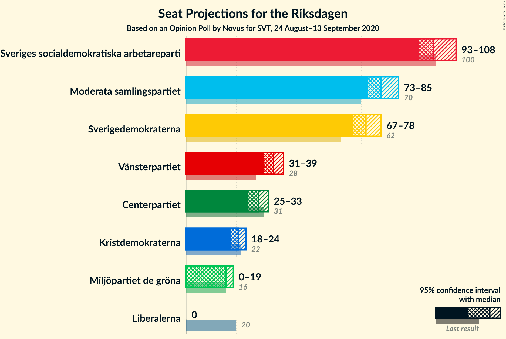
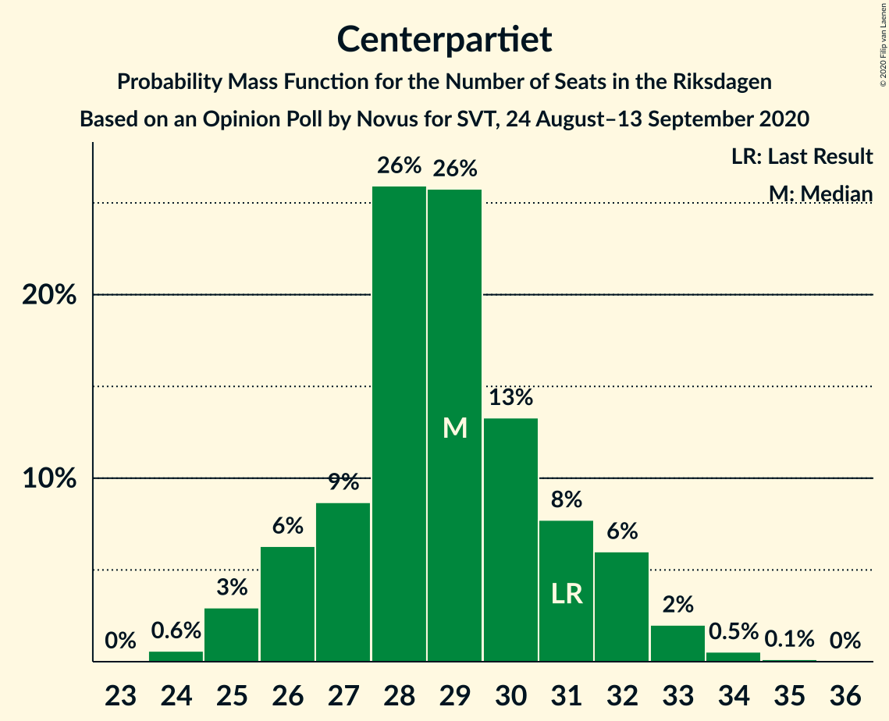
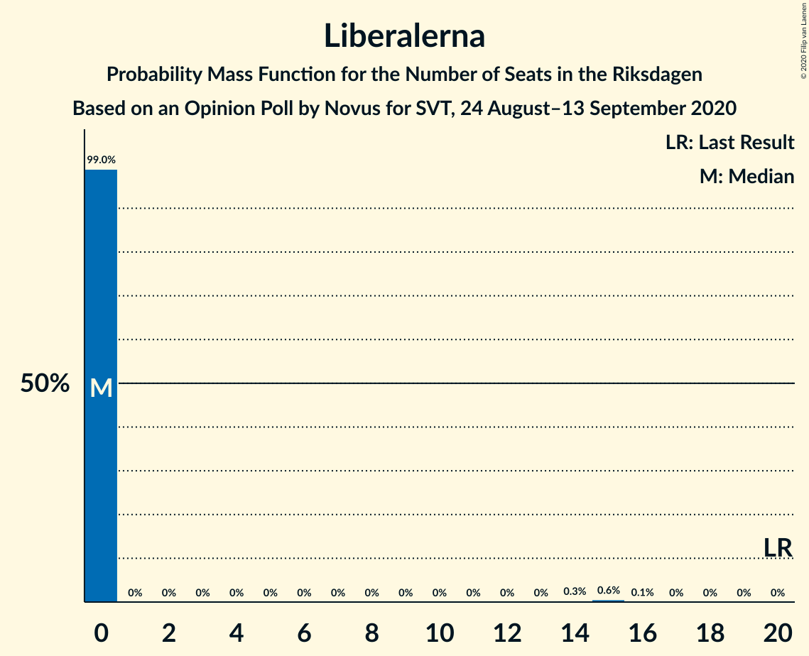
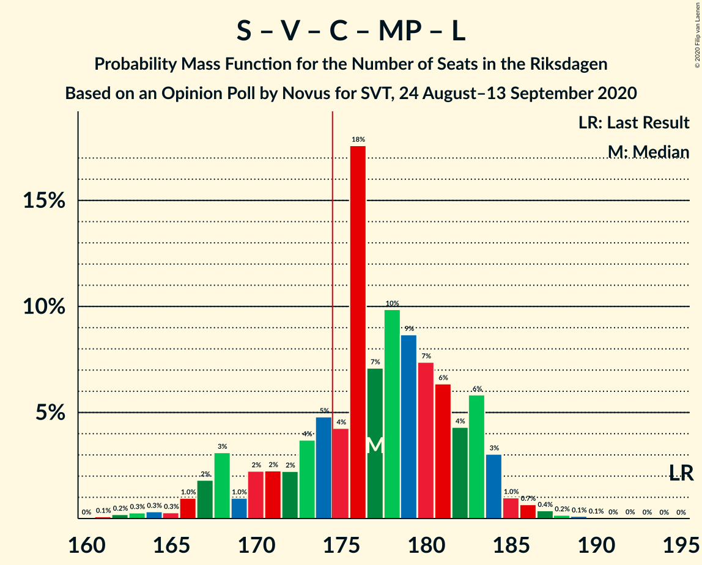
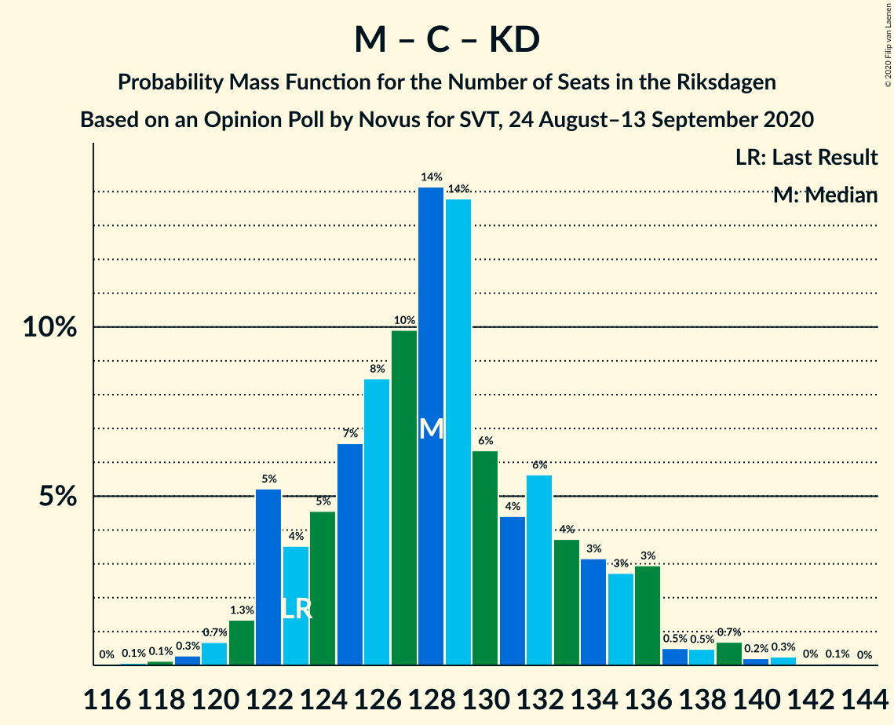

# Opinion Poll by Novus for SVT, 24 August–13 September 2020

<a href="#voting-intentions">Voting Intentions</a> | <a href="#seats">Seats</a> | <a href="#coalitions">Coalitions</a> | <a href="#technical-information">Technical Information</a>

## Voting Intentions

### Confidence Intervals

| Party | Last Result | Poll Result | 80% Confidence Interval | 90% Confidence Interval | 95% Confidence Interval | 99% Confidence Interval |
|:-----:|:-----------:|:-----------:|:-----------------------:|:-----------------------:|:-----------------------:|:-----------------------:|
| Sveriges socialdemokratiska arbetareparti | 28.3% | 27.0% | 26.0–28.0% |25.7–28.3% |25.5–28.6% |25.0–29.1% |
| Moderata samlingspartiet | 19.8% | 21.2% | 20.3–22.2% |20.0–22.4% |19.8–22.7% |19.3–23.1% |
| Sverigedemokraterna | 17.5% | 19.6% | 18.7–20.5% |18.4–20.8% |18.2–21.0% |17.8–21.5% |
| Vänsterpartiet | 8.0% | 9.4% | 8.8–10.1% |8.6–10.3% |8.4–10.5% |8.1–10.9% |
| Centerpartiet | 8.6% | 7.8% | 7.2–8.4% |7.0–8.6% |6.9–8.8% |6.6–9.1% |
| Kristdemokraterna | 6.3% | 5.7% | 5.2–6.3% |5.1–6.4% |4.9–6.6% |4.7–6.9% |
| Miljöpartiet de gröna | 4.4% | 4.3% | 3.9–4.8% |3.7–5.0% |3.6–5.1% |3.4–5.3% |
| Liberalerna | 5.5% | 3.2% | 2.8–3.7% |2.7–3.8% |2.6–3.9% |2.5–4.1% |

*Note:* The poll result column reflects the actual value used in the calculations. Published results may vary slightly, and in addition be rounded to fewer digits.

## Seats

### Confidence Intervals

| Party | Last Result | Median | 80% Confidence Interval | 90% Confidence Interval | 95% Confidence Interval | 99% Confidence Interval |
|:-----:|:-----------:|:------:|:-----------------------:|:-----------------------:|:-----------------------:|:-----------------------:|
| <a href="#sveriges-socialdemokratiska-arbetareparti">Sveriges socialdemokratiska arbetareparti</a> | 100 | 100 | 97–103 |95–105 |94–106 |92–109 |
| <a href="#moderata-samlingspartiet">Moderata samlingspartiet</a> | 70 | 77 | 74–81 |74–82 |73–84 |71–86 |
| <a href="#sverigedemokraterna">Sverigedemokraterna</a> | 62 | 73 | 70–76 |68–77 |67–78 |65–81 |
| <a href="#vänsterpartiet">Vänsterpartiet</a> | 28 | 36 | 31–37 |31–39 |30–40 |30–40 |
| <a href="#centerpartiet">Centerpartiet</a> | 31 | 28 | 26–31 |25–32 |25–32 |24–34 |
| <a href="#kristdemokraterna">Kristdemokraterna</a> | 22 | 21 | 20–24 |19–24 |18–25 |17–26 |
| <a href="#miljöpartiet-de-gröna">Miljöpartiet de gröna</a> | 16 | 16 | 0–18 |0–18 |0–19 |0–19 |
| <a href="#liberalerna">Liberalerna</a> | 20 | 0 | 0 |0 |0 |0–15 |

### Sveriges socialdemokratiska arbetareparti

*For a full overview of the results for this party, see the [Sveriges socialdemokratiska arbetareparti](party-sverigessocialdemokratiskaarbetareparti.html) page.*

| Number of Seats | Probability | Accumulated | Special Marks |
|:---------------:|:-----------:|:-----------:|:-------------:|
| 89 | 0.1% | 100% |  |
| 90 | 0% | 99.9% |  |
| 91 | 0.2% | 99.9% |  |
| 92 | 0.9% | 99.7% |  |
| 93 | 0.9% | 98.8% |  |
| 94 | 2% | 98% |  |
| 95 | 3% | 96% |  |
| 96 | 2% | 93% |  |
| 97 | 13% | 91% |  |
| 98 | 15% | 79% |  |
| 99 | 6% | 64% |  |
| 100 | 8% | 58% | Last Result, Median |
| 101 | 21% | 50% |  |
| 102 | 17% | 29% |  |
| 103 | 5% | 11% |  |
| 104 | 1.5% | 7% |  |
| 105 | 2% | 5% |  |
| 106 | 0.6% | 3% |  |
| 107 | 0.7% | 2% |  |
| 108 | 0.1% | 2% |  |
| 109 | 1.2% | 1.4% |  |
| 110 | 0% | 0.2% |  |
| 111 | 0.2% | 0.2% |  |
| 112 | 0% | 0% |  |

### Moderata samlingspartiet

*For a full overview of the results for this party, see the [Moderata samlingspartiet](party-moderatasamlingspartiet.html) page.*

| Number of Seats | Probability | Accumulated | Special Marks |
|:---------------:|:-----------:|:-----------:|:-------------:|
| 70 | 0.3% | 100% | Last Result |
| 71 | 0.4% | 99.7% |  |
| 72 | 0.6% | 99.3% |  |
| 73 | 2% | 98.7% |  |
| 74 | 18% | 97% |  |
| 75 | 14% | 79% |  |
| 76 | 11% | 66% |  |
| 77 | 17% | 54% | Median |
| 78 | 7% | 37% |  |
| 79 | 8% | 30% |  |
| 80 | 9% | 22% |  |
| 81 | 6% | 13% |  |
| 82 | 3% | 7% |  |
| 83 | 0.8% | 4% |  |
| 84 | 1.0% | 3% |  |
| 85 | 0.8% | 2% |  |
| 86 | 1.2% | 1.5% |  |
| 87 | 0% | 0.3% |  |
| 88 | 0.1% | 0.2% |  |
| 89 | 0% | 0.1% |  |
| 90 | 0.1% | 0.1% |  |
| 91 | 0% | 0% |  |

### Sverigedemokraterna

*For a full overview of the results for this party, see the [Sverigedemokraterna](party-sverigedemokraterna.html) page.*

| Number of Seats | Probability | Accumulated | Special Marks |
|:---------------:|:-----------:|:-----------:|:-------------:|
| 62 | 0% | 100% | Last Result |
| 63 | 0% | 100% |  |
| 64 | 0.1% | 100% |  |
| 65 | 0.9% | 99.9% |  |
| 66 | 0.6% | 99.0% |  |
| 67 | 1.1% | 98% |  |
| 68 | 3% | 97% |  |
| 69 | 4% | 95% |  |
| 70 | 4% | 91% |  |
| 71 | 15% | 87% |  |
| 72 | 22% | 72% |  |
| 73 | 6% | 50% | Median |
| 74 | 8% | 44% |  |
| 75 | 24% | 36% |  |
| 76 | 3% | 12% |  |
| 77 | 5% | 9% |  |
| 78 | 1.4% | 4% |  |
| 79 | 1.0% | 2% |  |
| 80 | 0.7% | 1.4% |  |
| 81 | 0.7% | 0.8% |  |
| 82 | 0.1% | 0.1% |  |
| 83 | 0% | 0% |  |

### Vänsterpartiet

*For a full overview of the results for this party, see the [Vänsterpartiet](party-vänsterpartiet.html) page.*

| Number of Seats | Probability | Accumulated | Special Marks |
|:---------------:|:-----------:|:-----------:|:-------------:|
| 28 | 0% | 100% | Last Result |
| 29 | 0% | 100% |  |
| 30 | 4% | 99.9% |  |
| 31 | 7% | 96% |  |
| 32 | 14% | 89% |  |
| 33 | 8% | 75% |  |
| 34 | 5% | 67% |  |
| 35 | 7% | 62% |  |
| 36 | 22% | 55% | Median |
| 37 | 24% | 33% |  |
| 38 | 4% | 9% |  |
| 39 | 2% | 5% |  |
| 40 | 3% | 3% |  |
| 41 | 0.1% | 0.2% |  |
| 42 | 0.1% | 0.1% |  |
| 43 | 0% | 0% |  |

### Centerpartiet

*For a full overview of the results for this party, see the [Centerpartiet](party-centerpartiet.html) page.*

| Number of Seats | Probability | Accumulated | Special Marks |
|:---------------:|:-----------:|:-----------:|:-------------:|
| 24 | 1.2% | 100% |  |
| 25 | 4% | 98.8% |  |
| 26 | 5% | 95% |  |
| 27 | 15% | 90% |  |
| 28 | 35% | 75% | Median |
| 29 | 14% | 39% |  |
| 30 | 7% | 25% |  |
| 31 | 9% | 18% | Last Result |
| 32 | 7% | 9% |  |
| 33 | 2% | 2% |  |
| 34 | 0.4% | 0.5% |  |
| 35 | 0.1% | 0.2% |  |
| 36 | 0% | 0% |  |

### Kristdemokraterna

*For a full overview of the results for this party, see the [Kristdemokraterna](party-kristdemokraterna.html) page.*

| Number of Seats | Probability | Accumulated | Special Marks |
|:---------------:|:-----------:|:-----------:|:-------------:|
| 16 | 0.1% | 100% |  |
| 17 | 0.8% | 99.9% |  |
| 18 | 2% | 99.1% |  |
| 19 | 5% | 97% |  |
| 20 | 24% | 92% |  |
| 21 | 31% | 68% | Median |
| 22 | 17% | 38% | Last Result |
| 23 | 10% | 20% |  |
| 24 | 8% | 10% |  |
| 25 | 2% | 3% |  |
| 26 | 0.5% | 0.6% |  |
| 27 | 0.1% | 0.1% |  |
| 28 | 0% | 0% |  |

### Miljöpartiet de gröna

*For a full overview of the results for this party, see the [Miljöpartiet de gröna](party-miljöpartietdegröna.html) page.*

| Number of Seats | Probability | Accumulated | Special Marks |
|:---------------:|:-----------:|:-----------:|:-------------:|
| 0 | 12% | 100% |  |
| 1 | 0% | 88% |  |
| 2 | 0% | 88% |  |
| 3 | 0% | 88% |  |
| 4 | 0% | 88% |  |
| 5 | 0% | 88% |  |
| 6 | 0% | 88% |  |
| 7 | 0% | 88% |  |
| 8 | 0% | 88% |  |
| 9 | 0% | 88% |  |
| 10 | 0% | 88% |  |
| 11 | 0% | 88% |  |
| 12 | 0% | 88% |  |
| 13 | 0% | 88% |  |
| 14 | 0.2% | 88% |  |
| 15 | 28% | 87% |  |
| 16 | 36% | 60% | Last Result, Median |
| 17 | 13% | 24% |  |
| 18 | 7% | 10% |  |
| 19 | 3% | 3% |  |
| 20 | 0.3% | 0.3% |  |
| 21 | 0% | 0% |  |

### Liberalerna

*For a full overview of the results for this party, see the [Liberalerna](party-liberalerna.html) page.*

| Number of Seats | Probability | Accumulated | Special Marks |
|:---------------:|:-----------:|:-----------:|:-------------:|
| 0 | 99.1% | 100% | Median |
| 1 | 0% | 0.9% |  |
| 2 | 0% | 0.9% |  |
| 3 | 0% | 0.9% |  |
| 4 | 0% | 0.9% |  |
| 5 | 0% | 0.9% |  |
| 6 | 0% | 0.9% |  |
| 7 | 0% | 0.9% |  |
| 8 | 0% | 0.9% |  |
| 9 | 0% | 0.9% |  |
| 10 | 0% | 0.9% |  |
| 11 | 0% | 0.9% |  |
| 12 | 0% | 0.9% |  |
| 13 | 0% | 0.9% |  |
| 14 | 0.2% | 0.9% |  |
| 15 | 0.6% | 0.7% |  |
| 16 | 0.1% | 0.1% |  |
| 17 | 0% | 0% |  |
| 18 | 0% | 0% |  |
| 19 | 0% | 0% |  |
| 20 | 0% | 0% | Last Result |

## Coalitions

### Confidence Intervals

| Coalition | Last Result | Median | Majority? | 80% Confidence Interval | 90% Confidence Interval | 95% Confidence Interval | 99% Confidence Interval |
|:---------:|:-----------:|:------:|:---------:|:-----------------------:|:-----------------------:|:-----------------------:|:-----------------------:|
| Sveriges socialdemokratiska arbetareparti – Moderata samlingspartiet – Centerpartiet | 201 | 204 | 100% | 200–212 | 200–215 | 199–216 | 196–220 |
| Sveriges socialdemokratiska arbetareparti – Moderata samlingspartiet | 170 | 176 | 74% | 172–182 | 172–184 | 170–187 | 168–190 |
| Sveriges socialdemokratiska arbetareparti – Vänsterpartiet – Centerpartiet – Miljöpartiet de gröna – Liberalerna | 195 | 177 | 82% | 172–183 | 170–183 | 167–184 | 164–186 |
| Moderata samlingspartiet – Sverigedemokraterna – Kristdemokraterna | 154 | 172 | 18% | 166–177 | 166–179 | 165–182 | 163–185 |
| Moderata samlingspartiet – Sverigedemokraterna | 132 | 151 | 0% | 146–155 | 145–157 | 144–160 | 142–162 |
| Sveriges socialdemokratiska arbetareparti – Vänsterpartiet – Miljöpartiet de gröna | 144 | 149 | 0% | 141–155 | 139–155 | 137–156 | 134–157 |
| Sveriges socialdemokratiska arbetareparti – Centerpartiet – Miljöpartiet de gröna – Liberalerna | 167 | 144 | 0% | 136–147 | 132–149 | 130–150 | 127–152 |
| Sveriges socialdemokratiska arbetareparti – Vänsterpartiet | 128 | 134 | 0% | 130–139 | 128–141 | 127–142 | 125–148 |
| Moderata samlingspartiet – Centerpartiet – Kristdemokraterna – Liberalerna | 143 | 126 | 0% | 122–133 | 122–134 | 122–137 | 120–141 |
| Moderata samlingspartiet – Centerpartiet – Kristdemokraterna | 123 | 126 | 0% | 122–132 | 122–134 | 122–135 | 120–141 |
| Sveriges socialdemokratiska arbetareparti – Miljöpartiet de gröna | 116 | 115 | 0% | 105–118 | 101–119 | 100–120 | 97–123 |
| Moderata samlingspartiet – Centerpartiet – Liberalerna | 121 | 105 | 0% | 102–111 | 102–113 | 102–115 | 100–118 |
| Moderata samlingspartiet – Centerpartiet | 101 | 105 | 0% | 102–110 | 102–113 | 101–113 | 100–118 |

### Sveriges socialdemokratiska arbetareparti – Moderata samlingspartiet – Centerpartiet

| Number of Seats | Probability | Accumulated | Special Marks |
|:---------------:|:-----------:|:-----------:|:-------------:|
| 193 | 0.3% | 100% |  |
| 194 | 0% | 99.7% |  |
| 195 | 0.1% | 99.7% |  |
| 196 | 0.2% | 99.6% |  |
| 197 | 0.5% | 99.4% |  |
| 198 | 1.0% | 98.9% |  |
| 199 | 2% | 98% |  |
| 200 | 8% | 96% |  |
| 201 | 10% | 89% | Last Result |
| 202 | 2% | 79% |  |
| 203 | 4% | 76% |  |
| 204 | 22% | 72% |  |
| 205 | 4% | 50% | Median |
| 206 | 14% | 46% |  |
| 207 | 5% | 32% |  |
| 208 | 5% | 27% |  |
| 209 | 2% | 22% |  |
| 210 | 6% | 20% |  |
| 211 | 4% | 14% |  |
| 212 | 2% | 10% |  |
| 213 | 0.4% | 8% |  |
| 214 | 2% | 7% |  |
| 215 | 2% | 5% |  |
| 216 | 2% | 3% |  |
| 217 | 0.4% | 2% |  |
| 218 | 0.5% | 1.2% |  |
| 219 | 0.1% | 0.6% |  |
| 220 | 0.2% | 0.5% |  |
| 221 | 0.1% | 0.3% |  |
| 222 | 0.1% | 0.2% |  |
| 223 | 0.1% | 0.1% |  |
| 224 | 0% | 0% |  |

### Sveriges socialdemokratiska arbetareparti – Moderata samlingspartiet

| Number of Seats | Probability | Accumulated | Special Marks |
|:---------------:|:-----------:|:-----------:|:-------------:|
| 165 | 0% | 100% |  |
| 166 | 0.1% | 99.9% |  |
| 167 | 0.1% | 99.8% |  |
| 168 | 0.3% | 99.6% |  |
| 169 | 0.4% | 99.4% |  |
| 170 | 3% | 99.0% | Last Result |
| 171 | 0.7% | 96% |  |
| 172 | 8% | 96% |  |
| 173 | 4% | 88% |  |
| 174 | 10% | 84% |  |
| 175 | 6% | 74% | Majority |
| 176 | 20% | 68% |  |
| 177 | 6% | 48% | Median |
| 178 | 14% | 42% |  |
| 179 | 5% | 28% |  |
| 180 | 4% | 23% |  |
| 181 | 7% | 19% |  |
| 182 | 3% | 12% |  |
| 183 | 3% | 8% |  |
| 184 | 0.7% | 5% |  |
| 185 | 2% | 4% |  |
| 186 | 0.2% | 3% |  |
| 187 | 1.2% | 3% |  |
| 188 | 0.3% | 1.4% |  |
| 189 | 0.2% | 1.0% |  |
| 190 | 0.6% | 0.9% |  |
| 191 | 0.1% | 0.3% |  |
| 192 | 0.1% | 0.2% |  |
| 193 | 0.1% | 0.2% |  |
| 194 | 0% | 0.1% |  |
| 195 | 0.1% | 0.1% |  |
| 196 | 0% | 0% |  |

### Sveriges socialdemokratiska arbetareparti – Vänsterpartiet – Centerpartiet – Miljöpartiet de gröna – Liberalerna

| Number of Seats | Probability | Accumulated | Special Marks |
|:---------------:|:-----------:|:-----------:|:-------------:|
| 162 | 0.1% | 100% |  |
| 163 | 0.4% | 99.9% |  |
| 164 | 0.1% | 99.5% |  |
| 165 | 0.6% | 99.4% |  |
| 166 | 0.2% | 98.8% |  |
| 167 | 2% | 98.6% |  |
| 168 | 0.1% | 97% |  |
| 169 | 0.9% | 97% |  |
| 170 | 2% | 96% |  |
| 171 | 2% | 94% |  |
| 172 | 2% | 91% |  |
| 173 | 3% | 89% |  |
| 174 | 4% | 86% |  |
| 175 | 4% | 82% | Majority |
| 176 | 18% | 78% |  |
| 177 | 14% | 60% |  |
| 178 | 8% | 46% |  |
| 179 | 7% | 38% |  |
| 180 | 6% | 31% | Median |
| 181 | 3% | 26% |  |
| 182 | 1.1% | 23% |  |
| 183 | 18% | 22% |  |
| 184 | 2% | 4% |  |
| 185 | 0.6% | 2% |  |
| 186 | 0.8% | 1.2% |  |
| 187 | 0.2% | 0.5% |  |
| 188 | 0.1% | 0.3% |  |
| 189 | 0.1% | 0.1% |  |
| 190 | 0% | 0.1% |  |
| 191 | 0% | 0% |  |
| 192 | 0% | 0% |  |
| 193 | 0% | 0% |  |
| 194 | 0% | 0% |  |
| 195 | 0% | 0% | Last Result |

### Moderata samlingspartiet – Sverigedemokraterna – Kristdemokraterna

| Number of Seats | Probability | Accumulated | Special Marks |
|:---------------:|:-----------:|:-----------:|:-------------:|
| 154 | 0% | 100% | Last Result |
| 155 | 0% | 100% |  |
| 156 | 0% | 100% |  |
| 157 | 0% | 100% |  |
| 158 | 0% | 100% |  |
| 159 | 0% | 100% |  |
| 160 | 0.1% | 99.9% |  |
| 161 | 0.1% | 99.9% |  |
| 162 | 0.2% | 99.7% |  |
| 163 | 0.8% | 99.5% |  |
| 164 | 0.6% | 98.8% |  |
| 165 | 2% | 98% |  |
| 166 | 18% | 96% |  |
| 167 | 1.1% | 78% |  |
| 168 | 3% | 77% |  |
| 169 | 6% | 74% |  |
| 170 | 7% | 69% |  |
| 171 | 8% | 62% | Median |
| 172 | 14% | 54% |  |
| 173 | 18% | 40% |  |
| 174 | 4% | 22% |  |
| 175 | 4% | 18% | Majority |
| 176 | 3% | 14% |  |
| 177 | 2% | 11% |  |
| 178 | 2% | 9% |  |
| 179 | 2% | 6% |  |
| 180 | 0.9% | 4% |  |
| 181 | 0.1% | 3% |  |
| 182 | 2% | 3% |  |
| 183 | 0.2% | 1.4% |  |
| 184 | 0.6% | 1.2% |  |
| 185 | 0.1% | 0.6% |  |
| 186 | 0.4% | 0.5% |  |
| 187 | 0.1% | 0.1% |  |
| 188 | 0% | 0% |  |

### Moderata samlingspartiet – Sverigedemokraterna

| Number of Seats | Probability | Accumulated | Special Marks |
|:---------------:|:-----------:|:-----------:|:-------------:|
| 132 | 0% | 100% | Last Result |
| 133 | 0% | 100% |  |
| 134 | 0% | 100% |  |
| 135 | 0% | 100% |  |
| 136 | 0% | 100% |  |
| 137 | 0% | 100% |  |
| 138 | 0% | 100% |  |
| 139 | 0.1% | 100% |  |
| 140 | 0.2% | 99.9% |  |
| 141 | 0.1% | 99.7% |  |
| 142 | 0.9% | 99.6% |  |
| 143 | 1.1% | 98.6% |  |
| 144 | 1.4% | 98% |  |
| 145 | 2% | 96% |  |
| 146 | 23% | 94% |  |
| 147 | 3% | 71% |  |
| 148 | 6% | 68% |  |
| 149 | 4% | 62% |  |
| 150 | 4% | 58% | Median |
| 151 | 17% | 54% |  |
| 152 | 15% | 37% |  |
| 153 | 5% | 21% |  |
| 154 | 4% | 17% |  |
| 155 | 4% | 12% |  |
| 156 | 3% | 9% |  |
| 157 | 1.1% | 5% |  |
| 158 | 0.5% | 4% |  |
| 159 | 1.0% | 4% |  |
| 160 | 1.3% | 3% |  |
| 161 | 0.1% | 1.3% |  |
| 162 | 1.0% | 1.3% |  |
| 163 | 0.1% | 0.2% |  |
| 164 | 0% | 0.1% |  |
| 165 | 0.1% | 0.1% |  |
| 166 | 0% | 0% |  |

### Sveriges socialdemokratiska arbetareparti – Vänsterpartiet – Miljöpartiet de gröna

| Number of Seats | Probability | Accumulated | Special Marks |
|:---------------:|:-----------:|:-----------:|:-------------:|
| 132 | 0.3% | 100% |  |
| 133 | 0.1% | 99.6% |  |
| 134 | 0.5% | 99.6% |  |
| 135 | 0.8% | 99.1% |  |
| 136 | 0.6% | 98% |  |
| 137 | 0.3% | 98% |  |
| 138 | 0.1% | 97% |  |
| 139 | 3% | 97% |  |
| 140 | 0.8% | 94% |  |
| 141 | 3% | 93% |  |
| 142 | 1.2% | 90% |  |
| 143 | 3% | 88% |  |
| 144 | 0.5% | 86% | Last Result |
| 145 | 3% | 85% |  |
| 146 | 4% | 82% |  |
| 147 | 8% | 78% |  |
| 148 | 14% | 70% |  |
| 149 | 8% | 56% |  |
| 150 | 10% | 48% |  |
| 151 | 14% | 38% |  |
| 152 | 1.2% | 24% | Median |
| 153 | 2% | 23% |  |
| 154 | 1.2% | 22% |  |
| 155 | 17% | 20% |  |
| 156 | 2% | 3% |  |
| 157 | 0.8% | 1.0% |  |
| 158 | 0.1% | 0.3% |  |
| 159 | 0% | 0.2% |  |
| 160 | 0.2% | 0.2% |  |
| 161 | 0% | 0% |  |

### Sveriges socialdemokratiska arbetareparti – Centerpartiet – Miljöpartiet de gröna – Liberalerna

| Number of Seats | Probability | Accumulated | Special Marks |
|:---------------:|:-----------:|:-----------:|:-------------:|
| 126 | 0.1% | 100% |  |
| 127 | 0.6% | 99.9% |  |
| 128 | 0.1% | 99.3% |  |
| 129 | 0.7% | 99.2% |  |
| 130 | 1.0% | 98% |  |
| 131 | 0.8% | 97% |  |
| 132 | 2% | 97% |  |
| 133 | 3% | 95% |  |
| 134 | 0.6% | 92% |  |
| 135 | 1.0% | 91% |  |
| 136 | 0.6% | 90% |  |
| 137 | 1.2% | 90% |  |
| 138 | 2% | 88% |  |
| 139 | 3% | 86% |  |
| 140 | 2% | 83% |  |
| 141 | 16% | 81% |  |
| 142 | 9% | 65% |  |
| 143 | 3% | 57% |  |
| 144 | 12% | 54% | Median |
| 145 | 11% | 41% |  |
| 146 | 18% | 30% |  |
| 147 | 5% | 12% |  |
| 148 | 1.5% | 7% |  |
| 149 | 3% | 5% |  |
| 150 | 0.5% | 3% |  |
| 151 | 2% | 2% |  |
| 152 | 0.5% | 0.8% |  |
| 153 | 0.1% | 0.3% |  |
| 154 | 0.1% | 0.2% |  |
| 155 | 0% | 0.1% |  |
| 156 | 0% | 0.1% |  |
| 157 | 0% | 0.1% |  |
| 158 | 0% | 0% |  |
| 159 | 0% | 0% |  |
| 160 | 0% | 0% |  |
| 161 | 0% | 0% |  |
| 162 | 0% | 0% |  |
| 163 | 0% | 0% |  |
| 164 | 0% | 0% |  |
| 165 | 0% | 0% |  |
| 166 | 0% | 0% |  |
| 167 | 0% | 0% | Last Result |

### Sveriges socialdemokratiska arbetareparti – Vänsterpartiet

| Number of Seats | Probability | Accumulated | Special Marks |
|:---------------:|:-----------:|:-----------:|:-------------:|
| 123 | 0.1% | 100% |  |
| 124 | 0.1% | 99.9% |  |
| 125 | 0.3% | 99.8% |  |
| 126 | 0.5% | 99.5% |  |
| 127 | 2% | 99.0% |  |
| 128 | 4% | 97% | Last Result |
| 129 | 2% | 94% |  |
| 130 | 5% | 92% |  |
| 131 | 3% | 87% |  |
| 132 | 11% | 84% |  |
| 133 | 12% | 73% |  |
| 134 | 17% | 61% |  |
| 135 | 5% | 43% |  |
| 136 | 7% | 38% | Median |
| 137 | 2% | 31% |  |
| 138 | 0.9% | 28% |  |
| 139 | 20% | 28% |  |
| 140 | 2% | 8% |  |
| 141 | 3% | 6% |  |
| 142 | 1.0% | 3% |  |
| 143 | 0% | 2% |  |
| 144 | 0.2% | 2% |  |
| 145 | 0.4% | 2% |  |
| 146 | 0.2% | 1.3% |  |
| 147 | 0.1% | 1.0% |  |
| 148 | 0.9% | 0.9% |  |
| 149 | 0% | 0% |  |

### Moderata samlingspartiet – Centerpartiet – Kristdemokraterna – Liberalerna

| Number of Seats | Probability | Accumulated | Special Marks |
|:---------------:|:-----------:|:-----------:|:-------------:|
| 118 | 0.1% | 100% |  |
| 119 | 0.1% | 99.9% |  |
| 120 | 0.4% | 99.8% |  |
| 121 | 1.2% | 99.5% |  |
| 122 | 16% | 98% |  |
| 123 | 3% | 82% |  |
| 124 | 12% | 79% |  |
| 125 | 7% | 67% |  |
| 126 | 11% | 60% | Median |
| 127 | 8% | 49% |  |
| 128 | 7% | 41% |  |
| 129 | 7% | 34% |  |
| 130 | 5% | 27% |  |
| 131 | 7% | 22% |  |
| 132 | 5% | 15% |  |
| 133 | 3% | 11% |  |
| 134 | 4% | 8% |  |
| 135 | 0.5% | 4% |  |
| 136 | 0.6% | 3% |  |
| 137 | 0.6% | 3% |  |
| 138 | 0.2% | 2% |  |
| 139 | 0.6% | 2% |  |
| 140 | 0.2% | 1.2% |  |
| 141 | 0.8% | 1.1% |  |
| 142 | 0% | 0.3% |  |
| 143 | 0% | 0.3% | Last Result |
| 144 | 0% | 0.3% |  |
| 145 | 0% | 0.2% |  |
| 146 | 0% | 0.2% |  |
| 147 | 0.2% | 0.2% |  |
| 148 | 0% | 0% |  |

### Moderata samlingspartiet – Centerpartiet – Kristdemokraterna

| Number of Seats | Probability | Accumulated | Special Marks |
|:---------------:|:-----------:|:-----------:|:-------------:|
| 117 | 0% | 100% |  |
| 118 | 0.2% | 99.9% |  |
| 119 | 0.1% | 99.7% |  |
| 120 | 0.4% | 99.7% |  |
| 121 | 1.2% | 99.3% |  |
| 122 | 16% | 98% |  |
| 123 | 3% | 82% | Last Result |
| 124 | 12% | 79% |  |
| 125 | 7% | 67% |  |
| 126 | 11% | 60% | Median |
| 127 | 8% | 49% |  |
| 128 | 7% | 40% |  |
| 129 | 7% | 33% |  |
| 130 | 5% | 26% |  |
| 131 | 7% | 21% |  |
| 132 | 5% | 15% |  |
| 133 | 3% | 10% |  |
| 134 | 4% | 7% |  |
| 135 | 0.4% | 3% |  |
| 136 | 0.6% | 2% |  |
| 137 | 0.5% | 2% |  |
| 138 | 0.2% | 1.4% |  |
| 139 | 0.5% | 1.3% |  |
| 140 | 0% | 0.8% |  |
| 141 | 0.7% | 0.7% |  |
| 142 | 0% | 0.1% |  |
| 143 | 0% | 0% |  |

### Sveriges socialdemokratiska arbetareparti – Miljöpartiet de gröna

| Number of Seats | Probability | Accumulated | Special Marks |
|:---------------:|:-----------:|:-----------:|:-------------:|
| 95 | 0.1% | 100% |  |
| 96 | 0% | 99.9% |  |
| 97 | 0.7% | 99.9% |  |
| 98 | 0.5% | 99.2% |  |
| 99 | 0.6% | 98.6% |  |
| 100 | 0.8% | 98% |  |
| 101 | 4% | 97% |  |
| 102 | 0.2% | 93% |  |
| 103 | 0.5% | 93% |  |
| 104 | 0.8% | 92% |  |
| 105 | 2% | 91% |  |
| 106 | 0.2% | 90% |  |
| 107 | 1.1% | 89% |  |
| 108 | 0.2% | 88% |  |
| 109 | 2% | 88% |  |
| 110 | 1.4% | 86% |  |
| 111 | 2% | 85% |  |
| 112 | 2% | 83% |  |
| 113 | 7% | 81% |  |
| 114 | 18% | 74% |  |
| 115 | 11% | 56% |  |
| 116 | 18% | 46% | Last Result, Median |
| 117 | 2% | 27% |  |
| 118 | 17% | 25% |  |
| 119 | 4% | 9% |  |
| 120 | 2% | 5% |  |
| 121 | 1.1% | 2% |  |
| 122 | 0.2% | 1.2% |  |
| 123 | 0.6% | 1.0% |  |
| 124 | 0.4% | 0.4% |  |
| 125 | 0% | 0% |  |

### Moderata samlingspartiet – Centerpartiet – Liberalerna

| Number of Seats | Probability | Accumulated | Special Marks |
|:---------------:|:-----------:|:-----------:|:-------------:|
| 98 | 0% | 100% |  |
| 99 | 0.1% | 99.9% |  |
| 100 | 0.5% | 99.8% |  |
| 101 | 2% | 99.3% |  |
| 102 | 17% | 98% |  |
| 103 | 19% | 81% |  |
| 104 | 3% | 62% |  |
| 105 | 15% | 59% | Median |
| 106 | 12% | 44% |  |
| 107 | 3% | 32% |  |
| 108 | 4% | 29% |  |
| 109 | 8% | 25% |  |
| 110 | 7% | 17% |  |
| 111 | 3% | 10% |  |
| 112 | 0.9% | 7% |  |
| 113 | 4% | 7% |  |
| 114 | 0.3% | 3% |  |
| 115 | 0.6% | 3% |  |
| 116 | 0.3% | 2% |  |
| 117 | 0.6% | 2% |  |
| 118 | 0.8% | 1.3% |  |
| 119 | 0.1% | 0.5% |  |
| 120 | 0.1% | 0.4% |  |
| 121 | 0.1% | 0.4% | Last Result |
| 122 | 0% | 0.3% |  |
| 123 | 0.1% | 0.3% |  |
| 124 | 0% | 0.2% |  |
| 125 | 0.2% | 0.2% |  |
| 126 | 0% | 0% |  |

### Moderata samlingspartiet – Centerpartiet

| Number of Seats | Probability | Accumulated | Special Marks |
|:---------------:|:-----------:|:-----------:|:-------------:|
| 97 | 0.1% | 100% |  |
| 98 | 0.2% | 99.9% |  |
| 99 | 0.1% | 99.7% |  |
| 100 | 0.7% | 99.6% |  |
| 101 | 2% | 98.9% | Last Result |
| 102 | 17% | 97% |  |
| 103 | 19% | 80% |  |
| 104 | 3% | 61% |  |
| 105 | 15% | 58% | Median |
| 106 | 12% | 43% |  |
| 107 | 3% | 31% |  |
| 108 | 4% | 28% |  |
| 109 | 8% | 24% |  |
| 110 | 8% | 17% |  |
| 111 | 3% | 9% |  |
| 112 | 0.7% | 7% |  |
| 113 | 4% | 6% |  |
| 114 | 0.3% | 2% |  |
| 115 | 0.4% | 2% |  |
| 116 | 0.3% | 2% |  |
| 117 | 0.6% | 1.3% |  |
| 118 | 0.7% | 0.8% |  |
| 119 | 0% | 0.1% |  |
| 120 | 0% | 0.1% |  |
| 121 | 0% | 0% |  |

## Technical Information

### Opinion Poll

+ **Polling firm:** Novus
+ **Commissioner(s):** SVT
+ **Fieldwork period:** 24 August–13 September 2020

### Calculations

+ **Sample size:** 3082
+ **Simulations done:** 131,072
+ **Error estimate:** 1.27%

