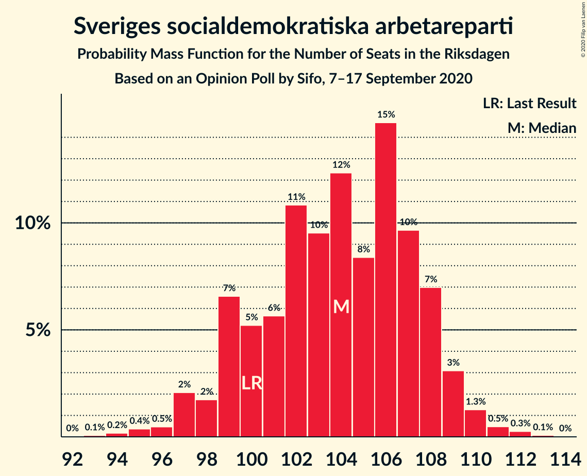
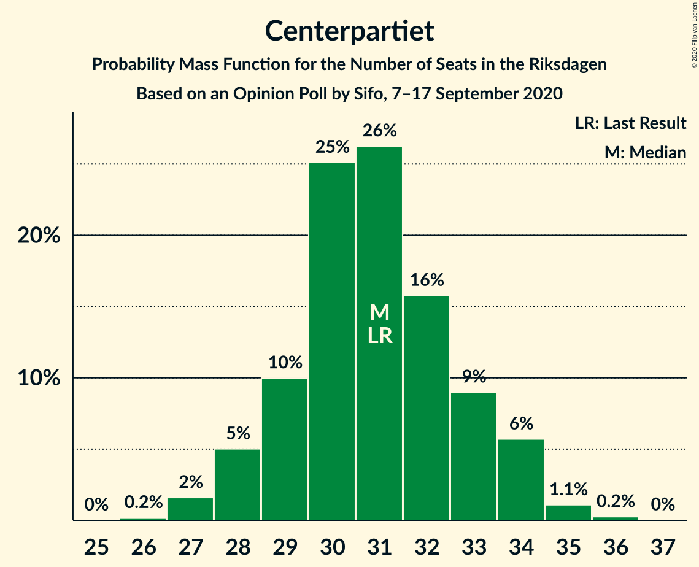
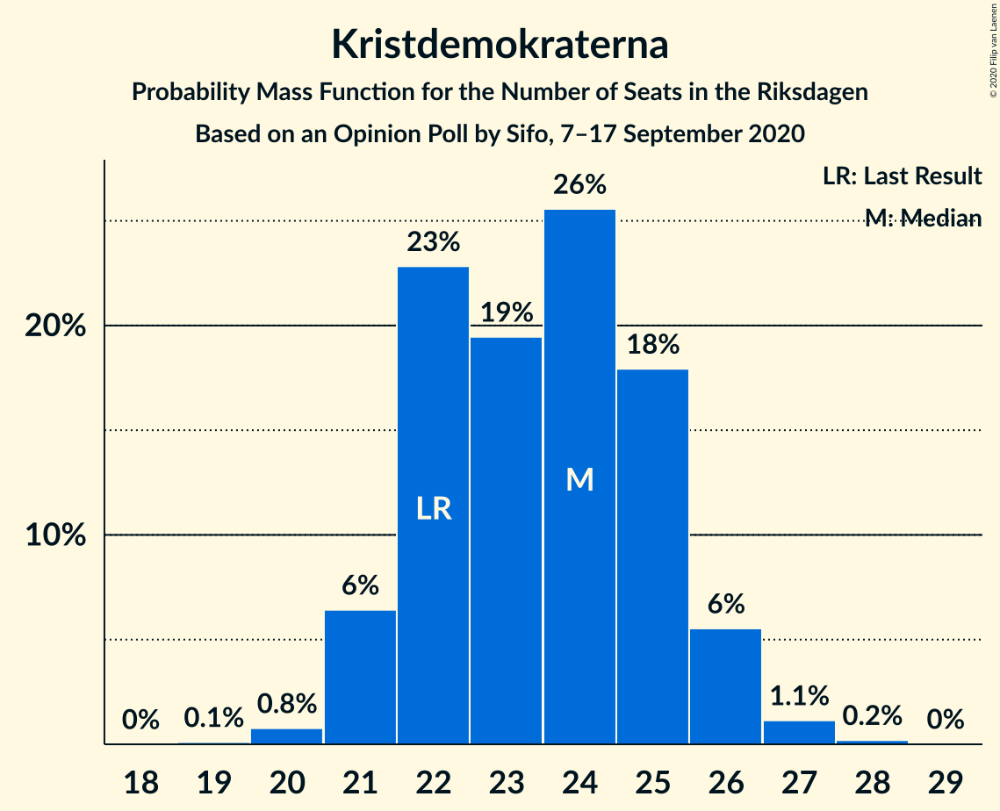

# Opinion Poll by Sifo, 7–17 September 2020

<a href="#voting-intentions">Voting Intentions</a> | <a href="#seats">Seats</a> | <a href="#coalitions">Coalitions</a> | <a href="#technical-information">Technical Information</a>

## Voting Intentions

### Confidence Intervals

| Party | Last Result | Poll Result | 80% Confidence Interval | 90% Confidence Interval | 95% Confidence Interval | 99% Confidence Interval |
|:-----:|:-----------:|:-----------:|:-----------------------:|:-----------------------:|:-----------------------:|:-----------------------:|
| Sveriges socialdemokratiska arbetareparti | 28.3% | 27.5% | 26.7–28.3% |26.5–28.6% |26.3–28.8% |25.9–29.2% |
| Moderata samlingspartiet | 19.8% | 20.6% | 19.9–21.4% |19.7–21.6% |19.5–21.7% |19.2–22.1% |
| Sverigedemokraterna | 17.5% | 19.8% | 19.1–20.5% |18.9–20.8% |18.7–20.9% |18.4–21.3% |
| Vänsterpartiet | 8.0% | 8.9% | 8.4–9.4% |8.3–9.6% |8.1–9.7% |7.9–10.0% |
| Centerpartiet | 8.6% | 8.2% | 7.7–8.7% |7.6–8.9% |7.5–9.0% |7.2–9.2% |
| Kristdemokraterna | 6.3% | 6.2% | 5.8–6.7% |5.7–6.8% |5.6–6.9% |5.4–7.1% |
| Miljöpartiet de gröna | 4.4% | 3.8% | 3.5–4.2% |3.4–4.3% |3.3–4.4% |3.2–4.6% |
| Liberalerna | 5.5% | 3.5% | 3.2–3.9% |3.1–4.0% |3.0–4.1% |2.9–4.2% |

*Note:* The poll result column reflects the actual value used in the calculations. Published results may vary slightly, and in addition be rounded to fewer digits.

## Seats

### Confidence Intervals

| Party | Last Result | Median | 80% Confidence Interval | 90% Confidence Interval | 95% Confidence Interval | 99% Confidence Interval |
|:-----:|:-----------:|:------:|:-----------------------:|:-----------------------:|:-----------------------:|:-----------------------:|
| <a href="#sveriges-socialdemokratiska-arbetareparti">Sveriges socialdemokratiska arbetareparti</a> | 100 | 104 | 99–108 |99–109 |97–109 |95–111 |
| <a href="#moderata-samlingspartiet">Moderata samlingspartiet</a> | 70 | 78 | 74–81 |73–82 |73–83 |70–84 |
| <a href="#sverigedemokraterna">Sverigedemokraterna</a> | 62 | 75 | 71–78 |70–79 |69–80 |68–81 |
| <a href="#vänsterpartiet">Vänsterpartiet</a> | 28 | 34 | 31–36 |31–37 |30–37 |29–38 |
| <a href="#centerpartiet">Centerpartiet</a> | 31 | 31 | 29–33 |28–34 |28–34 |27–35 |
| <a href="#kristdemokraterna">Kristdemokraterna</a> | 22 | 24 | 22–25 |21–26 |21–26 |20–27 |
| <a href="#miljöpartiet-de-gröna">Miljöpartiet de gröna</a> | 16 | 0 | 0–15 |0–16 |0–16 |0–17 |
| <a href="#liberalerna">Liberalerna</a> | 20 | 0 | 0 |0 |0–15 |0–16 |

### Sveriges socialdemokratiska arbetareparti

*For a full overview of the results for this party, see the [Sveriges socialdemokratiska arbetareparti](party-sverigessocialdemokratiskaarbetareparti.html) page.*

| Number of Seats | Probability | Accumulated | Special Marks |
|:---------------:|:-----------:|:-----------:|:-------------:|
| 93 | 0.1% | 100% |  |
| 94 | 0.2% | 99.9% |  |
| 95 | 0.4% | 99.7% |  |
| 96 | 0.5% | 99.3% |  |
| 97 | 2% | 98.9% |  |
| 98 | 2% | 97% |  |
| 99 | 7% | 95% |  |
| 100 | 5% | 88% | Last Result |
| 101 | 6% | 83% |  |
| 102 | 11% | 78% |  |
| 103 | 10% | 67% |  |
| 104 | 12% | 57% | Median |
| 105 | 8% | 45% |  |
| 106 | 15% | 37% |  |
| 107 | 10% | 22% |  |
| 108 | 7% | 12% |  |
| 109 | 3% | 5% |  |
| 110 | 1.3% | 2% |  |
| 111 | 0.5% | 0.8% |  |
| 112 | 0.3% | 0.4% |  |
| 113 | 0.1% | 0.1% |  |
| 114 | 0% | 0% |  |

### Moderata samlingspartiet

*For a full overview of the results for this party, see the [Moderata samlingspartiet](party-moderatasamlingspartiet.html) page.*

| Number of Seats | Probability | Accumulated | Special Marks |
|:---------------:|:-----------:|:-----------:|:-------------:|
| 69 | 0.1% | 100% |  |
| 70 | 0.5% | 99.9% | Last Result |
| 71 | 0.5% | 99.4% |  |
| 72 | 1.3% | 98.9% |  |
| 73 | 3% | 98% |  |
| 74 | 6% | 95% |  |
| 75 | 8% | 89% |  |
| 76 | 14% | 81% |  |
| 77 | 12% | 67% |  |
| 78 | 18% | 55% | Median |
| 79 | 11% | 37% |  |
| 80 | 10% | 26% |  |
| 81 | 7% | 16% |  |
| 82 | 4% | 8% |  |
| 83 | 4% | 4% |  |
| 84 | 0.5% | 0.9% |  |
| 85 | 0.2% | 0.3% |  |
| 86 | 0.1% | 0.1% |  |
| 87 | 0% | 0% |  |

### Sverigedemokraterna

*For a full overview of the results for this party, see the [Sverigedemokraterna](party-sverigedemokraterna.html) page.*

| Number of Seats | Probability | Accumulated | Special Marks |
|:---------------:|:-----------:|:-----------:|:-------------:|
| 62 | 0% | 100% | Last Result |
| 63 | 0% | 100% |  |
| 64 | 0% | 100% |  |
| 65 | 0% | 100% |  |
| 66 | 0% | 100% |  |
| 67 | 0.2% | 99.9% |  |
| 68 | 0.5% | 99.8% |  |
| 69 | 2% | 99.2% |  |
| 70 | 3% | 97% |  |
| 71 | 5% | 94% |  |
| 72 | 9% | 89% |  |
| 73 | 11% | 80% |  |
| 74 | 16% | 69% |  |
| 75 | 13% | 53% | Median |
| 76 | 13% | 40% |  |
| 77 | 11% | 27% |  |
| 78 | 10% | 16% |  |
| 79 | 3% | 6% |  |
| 80 | 2% | 3% |  |
| 81 | 1.0% | 1.3% |  |
| 82 | 0.2% | 0.2% |  |
| 83 | 0% | 0.1% |  |
| 84 | 0% | 0% |  |

### Vänsterpartiet

*For a full overview of the results for this party, see the [Vänsterpartiet](party-vänsterpartiet.html) page.*

| Number of Seats | Probability | Accumulated | Special Marks |
|:---------------:|:-----------:|:-----------:|:-------------:|
| 28 | 0.1% | 100% | Last Result |
| 29 | 0.8% | 99.9% |  |
| 30 | 2% | 99.2% |  |
| 31 | 9% | 97% |  |
| 32 | 11% | 88% |  |
| 33 | 20% | 77% |  |
| 34 | 27% | 57% | Median |
| 35 | 15% | 30% |  |
| 36 | 8% | 15% |  |
| 37 | 6% | 7% |  |
| 38 | 0.9% | 1.1% |  |
| 39 | 0.2% | 0.2% |  |
| 40 | 0% | 0% |  |

### Centerpartiet

*For a full overview of the results for this party, see the [Centerpartiet](party-centerpartiet.html) page.*

| Number of Seats | Probability | Accumulated | Special Marks |
|:---------------:|:-----------:|:-----------:|:-------------:|
| 26 | 0.2% | 100% |  |
| 27 | 2% | 99.8% |  |
| 28 | 5% | 98% |  |
| 29 | 10% | 93% |  |
| 30 | 25% | 83% |  |
| 31 | 26% | 58% | Last Result, Median |
| 32 | 16% | 32% |  |
| 33 | 9% | 16% |  |
| 34 | 6% | 7% |  |
| 35 | 1.1% | 1.4% |  |
| 36 | 0.2% | 0.3% |  |
| 37 | 0% | 0% |  |

### Kristdemokraterna

*For a full overview of the results for this party, see the [Kristdemokraterna](party-kristdemokraterna.html) page.*

| Number of Seats | Probability | Accumulated | Special Marks |
|:---------------:|:-----------:|:-----------:|:-------------:|
| 19 | 0.1% | 100% |  |
| 20 | 0.8% | 99.9% |  |
| 21 | 6% | 99.1% |  |
| 22 | 23% | 93% | Last Result |
| 23 | 19% | 70% |  |
| 24 | 26% | 50% | Median |
| 25 | 18% | 25% |  |
| 26 | 6% | 7% |  |
| 27 | 1.1% | 1.4% |  |
| 28 | 0.2% | 0.2% |  |
| 29 | 0% | 0% |  |

### Miljöpartiet de gröna

*For a full overview of the results for this party, see the [Miljöpartiet de gröna](party-miljöpartietdegröna.html) page.*

| Number of Seats | Probability | Accumulated | Special Marks |
|:---------------:|:-----------:|:-----------:|:-------------:|
| 0 | 74% | 100% | Median |
| 1 | 0% | 26% |  |
| 2 | 0% | 26% |  |
| 3 | 0% | 26% |  |
| 4 | 0% | 26% |  |
| 5 | 0% | 26% |  |
| 6 | 0% | 26% |  |
| 7 | 0% | 26% |  |
| 8 | 0% | 26% |  |
| 9 | 0% | 26% |  |
| 10 | 0% | 26% |  |
| 11 | 0% | 26% |  |
| 12 | 0% | 26% |  |
| 13 | 0% | 26% |  |
| 14 | 0.4% | 26% |  |
| 15 | 18% | 26% |  |
| 16 | 7% | 7% | Last Result |
| 17 | 0.8% | 0.8% |  |
| 18 | 0% | 0% |  |

### Liberalerna

*For a full overview of the results for this party, see the [Liberalerna](party-liberalerna.html) page.*

| Number of Seats | Probability | Accumulated | Special Marks |
|:---------------:|:-----------:|:-----------:|:-------------:|
| 0 | 96% | 100% | Median |
| 1 | 0% | 4% |  |
| 2 | 0% | 4% |  |
| 3 | 0% | 4% |  |
| 4 | 0% | 4% |  |
| 5 | 0% | 4% |  |
| 6 | 0% | 4% |  |
| 7 | 0% | 4% |  |
| 8 | 0% | 4% |  |
| 9 | 0% | 4% |  |
| 10 | 0% | 4% |  |
| 11 | 0% | 4% |  |
| 12 | 0% | 4% |  |
| 13 | 0% | 4% |  |
| 14 | 0.2% | 4% |  |
| 15 | 3% | 4% |  |
| 16 | 0.6% | 0.6% |  |
| 17 | 0% | 0% |  |
| 18 | 0% | 0% |  |
| 19 | 0% | 0% |  |
| 20 | 0% | 0% | Last Result |

## Coalitions

### Confidence Intervals

| Coalition | Last Result | Median | Majority? | 80% Confidence Interval | 90% Confidence Interval | 95% Confidence Interval | 99% Confidence Interval |
|:---------:|:-----------:|:------:|:---------:|:-----------------------:|:-----------------------:|:-----------------------:|:-----------------------:|
| Sveriges socialdemokratiska arbetareparti – Moderata samlingspartiet – Centerpartiet | 201 | 214 | 100% | 205–218 | 204–219 | 202–220 | 198–221 |
| Sveriges socialdemokratiska arbetareparti – Moderata samlingspartiet | 170 | 183 | 91% | 175–187 | 174–188 | 172–189 | 168–190 |
| Moderata samlingspartiet – Sverigedemokraterna – Kristdemokraterna | 154 | 177 | 69% | 170–181 | 168–182 | 167–183 | 164–185 |
| Sveriges socialdemokratiska arbetareparti – Vänsterpartiet – Centerpartiet – Miljöpartiet de gröna – Liberalerna | 195 | 172 | 31% | 168–179 | 167–181 | 166–182 | 164–185 |
| Moderata samlingspartiet – Sverigedemokraterna | 132 | 153 | 0% | 147–157 | 145–159 | 144–159 | 142–161 |
| Sveriges socialdemokratiska arbetareparti – Vänsterpartiet – Miljöpartiet de gröna | 144 | 141 | 0% | 136–149 | 135–151 | 134–151 | 131–153 |
| Sveriges socialdemokratiska arbetareparti – Centerpartiet – Miljöpartiet de gröna – Liberalerna | 167 | 138 | 0% | 134–147 | 133–148 | 132–149 | 130–153 |
| Sveriges socialdemokratiska arbetareparti – Vänsterpartiet | 128 | 138 | 0% | 132–142 | 131–143 | 129–144 | 127–146 |
| Moderata samlingspartiet – Centerpartiet – Kristdemokraterna – Liberalerna | 143 | 133 | 0% | 127–138 | 127–139 | 126–141 | 123–145 |
| Moderata samlingspartiet – Centerpartiet – Kristdemokraterna | 123 | 132 | 0% | 127–137 | 127–138 | 125–139 | 122–140 |
| Sveriges socialdemokratiska arbetareparti – Miljöpartiet de gröna | 116 | 106 | 0% | 102–117 | 101–117 | 100–119 | 98–120 |
| Moderata samlingspartiet – Centerpartiet – Liberalerna | 121 | 109 | 0% | 105–113 | 104–115 | 103–118 | 101–123 |
| Moderata samlingspartiet – Centerpartiet | 101 | 109 | 0% | 105–113 | 103–114 | 102–115 | 100–116 |

### Sveriges socialdemokratiska arbetareparti – Moderata samlingspartiet – Centerpartiet

| Number of Seats | Probability | Accumulated | Special Marks |
|:---------------:|:-----------:|:-----------:|:-------------:|
| 194 | 0% | 100% |  |
| 195 | 0.2% | 99.9% |  |
| 196 | 0.1% | 99.7% |  |
| 197 | 0.1% | 99.6% |  |
| 198 | 0.2% | 99.6% |  |
| 199 | 0.2% | 99.3% |  |
| 200 | 0.2% | 99.2% |  |
| 201 | 0.7% | 99.0% | Last Result |
| 202 | 1.0% | 98% |  |
| 203 | 2% | 97% |  |
| 204 | 5% | 96% |  |
| 205 | 5% | 91% |  |
| 206 | 4% | 86% |  |
| 207 | 5% | 83% |  |
| 208 | 2% | 78% |  |
| 209 | 3% | 76% |  |
| 210 | 3% | 72% |  |
| 211 | 3% | 70% |  |
| 212 | 6% | 67% |  |
| 213 | 7% | 61% | Median |
| 214 | 12% | 54% |  |
| 215 | 10% | 42% |  |
| 216 | 10% | 33% |  |
| 217 | 9% | 23% |  |
| 218 | 7% | 14% |  |
| 219 | 3% | 7% |  |
| 220 | 3% | 4% |  |
| 221 | 0.9% | 1.3% |  |
| 222 | 0.3% | 0.5% |  |
| 223 | 0.1% | 0.1% |  |
| 224 | 0% | 0% |  |

### Sveriges socialdemokratiska arbetareparti – Moderata samlingspartiet

| Number of Seats | Probability | Accumulated | Special Marks |
|:---------------:|:-----------:|:-----------:|:-------------:|
| 165 | 0.1% | 100% |  |
| 166 | 0.1% | 99.9% |  |
| 167 | 0% | 99.8% |  |
| 168 | 0.3% | 99.8% |  |
| 169 | 0.2% | 99.4% |  |
| 170 | 0.2% | 99.2% | Last Result |
| 171 | 0.7% | 99.0% |  |
| 172 | 2% | 98% |  |
| 173 | 1.1% | 96% |  |
| 174 | 5% | 95% |  |
| 175 | 3% | 91% | Majority |
| 176 | 4% | 88% |  |
| 177 | 5% | 84% |  |
| 178 | 4% | 78% |  |
| 179 | 4% | 74% |  |
| 180 | 4% | 70% |  |
| 181 | 6% | 66% |  |
| 182 | 7% | 60% | Median |
| 183 | 16% | 53% |  |
| 184 | 8% | 36% |  |
| 185 | 6% | 28% |  |
| 186 | 11% | 22% |  |
| 187 | 4% | 11% |  |
| 188 | 3% | 7% |  |
| 189 | 1.4% | 4% |  |
| 190 | 2% | 2% |  |
| 191 | 0.2% | 0.3% |  |
| 192 | 0.1% | 0.1% |  |
| 193 | 0% | 0% |  |

### Moderata samlingspartiet – Sverigedemokraterna – Kristdemokraterna

| Number of Seats | Probability | Accumulated | Special Marks |
|:---------------:|:-----------:|:-----------:|:-------------:|
| 154 | 0% | 100% | Last Result |
| 155 | 0% | 100% |  |
| 156 | 0% | 100% |  |
| 157 | 0% | 100% |  |
| 158 | 0% | 100% |  |
| 159 | 0% | 100% |  |
| 160 | 0% | 100% |  |
| 161 | 0.2% | 100% |  |
| 162 | 0.1% | 99.8% |  |
| 163 | 0.1% | 99.7% |  |
| 164 | 0.1% | 99.6% |  |
| 165 | 0.5% | 99.4% |  |
| 166 | 1.1% | 98.9% |  |
| 167 | 3% | 98% |  |
| 168 | 2% | 95% |  |
| 169 | 2% | 93% |  |
| 170 | 5% | 91% |  |
| 171 | 8% | 86% |  |
| 172 | 4% | 78% |  |
| 173 | 3% | 74% |  |
| 174 | 2% | 71% |  |
| 175 | 4% | 69% | Majority |
| 176 | 11% | 65% |  |
| 177 | 13% | 54% | Median |
| 178 | 11% | 41% |  |
| 179 | 9% | 30% |  |
| 180 | 5% | 21% |  |
| 181 | 7% | 16% |  |
| 182 | 6% | 10% |  |
| 183 | 2% | 3% |  |
| 184 | 1.3% | 2% |  |
| 185 | 0.3% | 0.5% |  |
| 186 | 0.2% | 0.2% |  |
| 187 | 0% | 0.1% |  |
| 188 | 0% | 0% |  |

### Sveriges socialdemokratiska arbetareparti – Vänsterpartiet – Centerpartiet – Miljöpartiet de gröna – Liberalerna

| Number of Seats | Probability | Accumulated | Special Marks |
|:---------------:|:-----------:|:-----------:|:-------------:|
| 162 | 0% | 100% |  |
| 163 | 0.2% | 99.9% |  |
| 164 | 0.3% | 99.8% |  |
| 165 | 1.3% | 99.5% |  |
| 166 | 2% | 98% |  |
| 167 | 6% | 97% |  |
| 168 | 7% | 90% |  |
| 169 | 5% | 84% | Median |
| 170 | 9% | 79% |  |
| 171 | 11% | 70% |  |
| 172 | 13% | 59% |  |
| 173 | 11% | 46% |  |
| 174 | 4% | 35% |  |
| 175 | 2% | 31% | Majority |
| 176 | 3% | 29% |  |
| 177 | 4% | 26% |  |
| 178 | 8% | 22% |  |
| 179 | 5% | 14% |  |
| 180 | 2% | 9% |  |
| 181 | 2% | 7% |  |
| 182 | 3% | 5% |  |
| 183 | 1.1% | 2% |  |
| 184 | 0.5% | 1.1% |  |
| 185 | 0.1% | 0.6% |  |
| 186 | 0.1% | 0.4% |  |
| 187 | 0.1% | 0.3% |  |
| 188 | 0.2% | 0.2% |  |
| 189 | 0% | 0% |  |
| 190 | 0% | 0% |  |
| 191 | 0% | 0% |  |
| 192 | 0% | 0% |  |
| 193 | 0% | 0% |  |
| 194 | 0% | 0% |  |
| 195 | 0% | 0% | Last Result |

### Moderata samlingspartiet – Sverigedemokraterna

| Number of Seats | Probability | Accumulated | Special Marks |
|:---------------:|:-----------:|:-----------:|:-------------:|
| 132 | 0% | 100% | Last Result |
| 133 | 0% | 100% |  |
| 134 | 0% | 100% |  |
| 135 | 0% | 100% |  |
| 136 | 0% | 100% |  |
| 137 | 0% | 100% |  |
| 138 | 0% | 100% |  |
| 139 | 0% | 100% |  |
| 140 | 0.3% | 99.9% |  |
| 141 | 0.1% | 99.6% |  |
| 142 | 0.6% | 99.5% |  |
| 143 | 0.7% | 99.0% |  |
| 144 | 1.4% | 98% |  |
| 145 | 3% | 97% |  |
| 146 | 4% | 94% |  |
| 147 | 2% | 90% |  |
| 148 | 7% | 88% |  |
| 149 | 7% | 82% |  |
| 150 | 3% | 75% |  |
| 151 | 4% | 71% |  |
| 152 | 14% | 67% |  |
| 153 | 11% | 53% | Median |
| 154 | 5% | 42% |  |
| 155 | 13% | 37% |  |
| 156 | 9% | 24% |  |
| 157 | 7% | 16% |  |
| 158 | 2% | 8% |  |
| 159 | 4% | 6% |  |
| 160 | 2% | 2% |  |
| 161 | 0.3% | 0.5% |  |
| 162 | 0.2% | 0.3% |  |
| 163 | 0% | 0.1% |  |
| 164 | 0% | 0% |  |

### Sveriges socialdemokratiska arbetareparti – Vänsterpartiet – Miljöpartiet de gröna

| Number of Seats | Probability | Accumulated | Special Marks |
|:---------------:|:-----------:|:-----------:|:-------------:|
| 129 | 0.1% | 100% |  |
| 130 | 0.2% | 99.8% |  |
| 131 | 0.2% | 99.6% |  |
| 132 | 0.7% | 99.4% |  |
| 133 | 1.2% | 98.7% |  |
| 134 | 2% | 98% |  |
| 135 | 3% | 96% |  |
| 136 | 5% | 93% |  |
| 137 | 6% | 88% |  |
| 138 | 10% | 82% | Median |
| 139 | 11% | 72% |  |
| 140 | 9% | 61% |  |
| 141 | 10% | 52% |  |
| 142 | 9% | 42% |  |
| 143 | 4% | 32% |  |
| 144 | 3% | 28% | Last Result |
| 145 | 2% | 25% |  |
| 146 | 2% | 23% |  |
| 147 | 3% | 22% |  |
| 148 | 7% | 19% |  |
| 149 | 3% | 12% |  |
| 150 | 4% | 9% |  |
| 151 | 3% | 5% |  |
| 152 | 0.8% | 2% |  |
| 153 | 0.8% | 1.2% |  |
| 154 | 0.3% | 0.4% |  |
| 155 | 0.1% | 0.1% |  |
| 156 | 0% | 0% |  |

### Sveriges socialdemokratiska arbetareparti – Centerpartiet – Miljöpartiet de gröna – Liberalerna

| Number of Seats | Probability | Accumulated | Special Marks |
|:---------------:|:-----------:|:-----------:|:-------------:|
| 129 | 0.2% | 100% |  |
| 130 | 0.5% | 99.8% |  |
| 131 | 0.7% | 99.3% |  |
| 132 | 2% | 98.7% |  |
| 133 | 5% | 96% |  |
| 134 | 8% | 91% |  |
| 135 | 5% | 83% | Median |
| 136 | 8% | 78% |  |
| 137 | 12% | 69% |  |
| 138 | 16% | 57% |  |
| 139 | 5% | 41% |  |
| 140 | 3% | 36% |  |
| 141 | 2% | 32% |  |
| 142 | 3% | 30% |  |
| 143 | 4% | 28% |  |
| 144 | 5% | 24% |  |
| 145 | 3% | 19% |  |
| 146 | 4% | 16% |  |
| 147 | 3% | 12% |  |
| 148 | 5% | 10% |  |
| 149 | 2% | 4% |  |
| 150 | 0.9% | 2% |  |
| 151 | 0.4% | 1.2% |  |
| 152 | 0.2% | 0.8% |  |
| 153 | 0.2% | 0.7% |  |
| 154 | 0.1% | 0.5% |  |
| 155 | 0.1% | 0.4% |  |
| 156 | 0% | 0.3% |  |
| 157 | 0.2% | 0.3% |  |
| 158 | 0% | 0.1% |  |
| 159 | 0% | 0% |  |
| 160 | 0% | 0% |  |
| 161 | 0% | 0% |  |
| 162 | 0% | 0% |  |
| 163 | 0% | 0% |  |
| 164 | 0% | 0% |  |
| 165 | 0% | 0% |  |
| 166 | 0% | 0% |  |
| 167 | 0% | 0% | Last Result |

### Sveriges socialdemokratiska arbetareparti – Vänsterpartiet

| Number of Seats | Probability | Accumulated | Special Marks |
|:---------------:|:-----------:|:-----------:|:-------------:|
| 124 | 0% | 100% |  |
| 125 | 0.2% | 99.9% |  |
| 126 | 0.1% | 99.8% |  |
| 127 | 0.3% | 99.7% |  |
| 128 | 0.7% | 99.4% | Last Result |
| 129 | 1.5% | 98.7% |  |
| 130 | 2% | 97% |  |
| 131 | 2% | 96% |  |
| 132 | 4% | 94% |  |
| 133 | 7% | 90% |  |
| 134 | 6% | 83% |  |
| 135 | 6% | 77% |  |
| 136 | 8% | 71% |  |
| 137 | 7% | 63% |  |
| 138 | 10% | 56% | Median |
| 139 | 11% | 46% |  |
| 140 | 9% | 35% |  |
| 141 | 10% | 26% |  |
| 142 | 9% | 16% |  |
| 143 | 4% | 7% |  |
| 144 | 1.5% | 3% |  |
| 145 | 1.2% | 2% |  |
| 146 | 0.4% | 0.6% |  |
| 147 | 0.1% | 0.2% |  |
| 148 | 0% | 0.1% |  |
| 149 | 0% | 0% |  |

### Moderata samlingspartiet – Centerpartiet – Kristdemokraterna – Liberalerna

| Number of Seats | Probability | Accumulated | Special Marks |
|:---------------:|:-----------:|:-----------:|:-------------:|
| 121 | 0.1% | 100% |  |
| 122 | 0.3% | 99.9% |  |
| 123 | 0.4% | 99.6% |  |
| 124 | 0.4% | 99.2% |  |
| 125 | 0.9% | 98.8% |  |
| 126 | 0.9% | 98% |  |
| 127 | 9% | 97% |  |
| 128 | 3% | 88% |  |
| 129 | 7% | 84% |  |
| 130 | 5% | 78% |  |
| 131 | 6% | 72% |  |
| 132 | 13% | 66% |  |
| 133 | 17% | 53% | Median |
| 134 | 9% | 36% |  |
| 135 | 5% | 27% |  |
| 136 | 6% | 22% |  |
| 137 | 5% | 15% |  |
| 138 | 4% | 11% |  |
| 139 | 3% | 7% |  |
| 140 | 1.0% | 4% |  |
| 141 | 0.7% | 3% |  |
| 142 | 0.9% | 2% |  |
| 143 | 0.4% | 1.5% | Last Result |
| 144 | 0.4% | 1.0% |  |
| 145 | 0.2% | 0.6% |  |
| 146 | 0.1% | 0.4% |  |
| 147 | 0.1% | 0.2% |  |
| 148 | 0.1% | 0.1% |  |
| 149 | 0% | 0% |  |

### Moderata samlingspartiet – Centerpartiet – Kristdemokraterna

| Number of Seats | Probability | Accumulated | Special Marks |
|:---------------:|:-----------:|:-----------:|:-------------:|
| 119 | 0% | 100% |  |
| 120 | 0.1% | 99.9% |  |
| 121 | 0.3% | 99.9% |  |
| 122 | 0.4% | 99.6% |  |
| 123 | 0.7% | 99.2% | Last Result |
| 124 | 0.5% | 98.5% |  |
| 125 | 1.0% | 98% |  |
| 126 | 2% | 97% |  |
| 127 | 10% | 95% |  |
| 128 | 4% | 85% |  |
| 129 | 7% | 82% |  |
| 130 | 5% | 74% |  |
| 131 | 6% | 69% |  |
| 132 | 14% | 63% |  |
| 133 | 17% | 49% | Median |
| 134 | 9% | 32% |  |
| 135 | 5% | 23% |  |
| 136 | 6% | 18% |  |
| 137 | 4% | 12% |  |
| 138 | 3% | 7% |  |
| 139 | 3% | 4% |  |
| 140 | 0.9% | 1.1% |  |
| 141 | 0.2% | 0.2% |  |
| 142 | 0% | 0% |  |

### Sveriges socialdemokratiska arbetareparti – Miljöpartiet de gröna

| Number of Seats | Probability | Accumulated | Special Marks |
|:---------------:|:-----------:|:-----------:|:-------------:|
| 96 | 0% | 100% |  |
| 97 | 0.2% | 99.9% |  |
| 98 | 0.5% | 99.7% |  |
| 99 | 0.5% | 99.2% |  |
| 100 | 2% | 98.8% |  |
| 101 | 3% | 97% |  |
| 102 | 5% | 94% |  |
| 103 | 7% | 89% |  |
| 104 | 11% | 81% | Median |
| 105 | 8% | 70% |  |
| 106 | 14% | 62% |  |
| 107 | 10% | 48% |  |
| 108 | 7% | 38% |  |
| 109 | 3% | 31% |  |
| 110 | 2% | 28% |  |
| 111 | 0.9% | 26% |  |
| 112 | 2% | 26% |  |
| 113 | 2% | 24% |  |
| 114 | 4% | 22% |  |
| 115 | 4% | 18% |  |
| 116 | 2% | 14% | Last Result |
| 117 | 7% | 12% |  |
| 118 | 2% | 5% |  |
| 119 | 1.5% | 3% |  |
| 120 | 0.8% | 1.2% |  |
| 121 | 0.3% | 0.4% |  |
| 122 | 0.1% | 0.2% |  |
| 123 | 0.1% | 0.1% |  |
| 124 | 0% | 0% |  |

### Moderata samlingspartiet – Centerpartiet – Liberalerna

| Number of Seats | Probability | Accumulated | Special Marks |
|:---------------:|:-----------:|:-----------:|:-------------:|
| 99 | 0.1% | 100% |  |
| 100 | 0.3% | 99.9% |  |
| 101 | 0.7% | 99.5% |  |
| 102 | 0.8% | 98.9% |  |
| 103 | 2% | 98% |  |
| 104 | 3% | 96% |  |
| 105 | 9% | 93% |  |
| 106 | 7% | 84% |  |
| 107 | 13% | 78% |  |
| 108 | 8% | 65% |  |
| 109 | 15% | 57% | Median |
| 110 | 9% | 42% |  |
| 111 | 7% | 33% |  |
| 112 | 10% | 26% |  |
| 113 | 7% | 16% |  |
| 114 | 3% | 9% |  |
| 115 | 2% | 6% |  |
| 116 | 1.0% | 4% |  |
| 117 | 0.2% | 3% |  |
| 118 | 0.6% | 3% |  |
| 119 | 0.7% | 2% |  |
| 120 | 0.4% | 2% |  |
| 121 | 0.3% | 1.2% | Last Result |
| 122 | 0.4% | 0.9% |  |
| 123 | 0.3% | 0.5% |  |
| 124 | 0% | 0.2% |  |
| 125 | 0.1% | 0.1% |  |
| 126 | 0% | 0% |  |

### Moderata samlingspartiet – Centerpartiet

| Number of Seats | Probability | Accumulated | Special Marks |
|:---------------:|:-----------:|:-----------:|:-------------:|
| 97 | 0% | 100% |  |
| 98 | 0% | 99.9% |  |
| 99 | 0.2% | 99.9% |  |
| 100 | 0.7% | 99.7% |  |
| 101 | 0.9% | 99.1% | Last Result |
| 102 | 0.9% | 98% |  |
| 103 | 2% | 97% |  |
| 104 | 4% | 95% |  |
| 105 | 9% | 91% |  |
| 106 | 7% | 82% |  |
| 107 | 14% | 75% |  |
| 108 | 8% | 61% |  |
| 109 | 15% | 53% | Median |
| 110 | 9% | 38% |  |
| 111 | 7% | 29% |  |
| 112 | 10% | 22% |  |
| 113 | 7% | 12% |  |
| 114 | 2% | 5% |  |
| 115 | 2% | 3% |  |
| 116 | 0.8% | 1.0% |  |
| 117 | 0.1% | 0.2% |  |
| 118 | 0.1% | 0.1% |  |
| 119 | 0% | 0% |  |

## Technical Information

### Opinion Poll

+ **Polling firm:** Sifo
+ **Commissioner(s):** —
+ **Fieldwork period:** 7–17 September 2020

### Calculations

+ **Sample size:** 5029
+ **Simulations done:** 1,048,576
+ **Error estimate:** 0.72%

