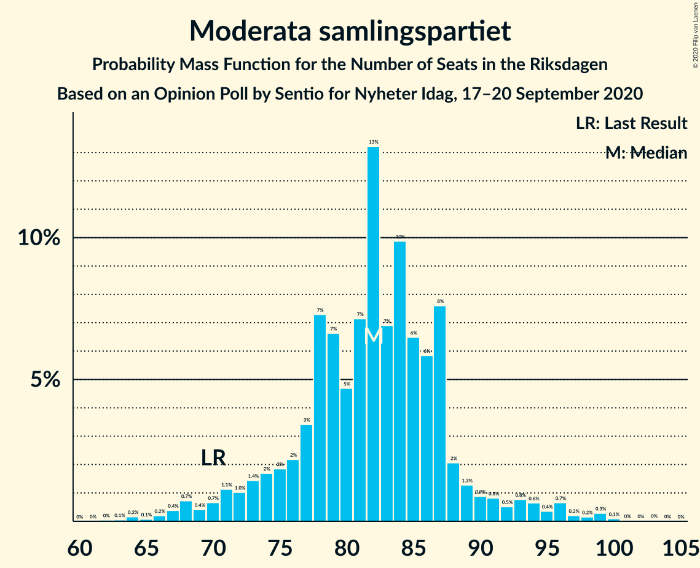
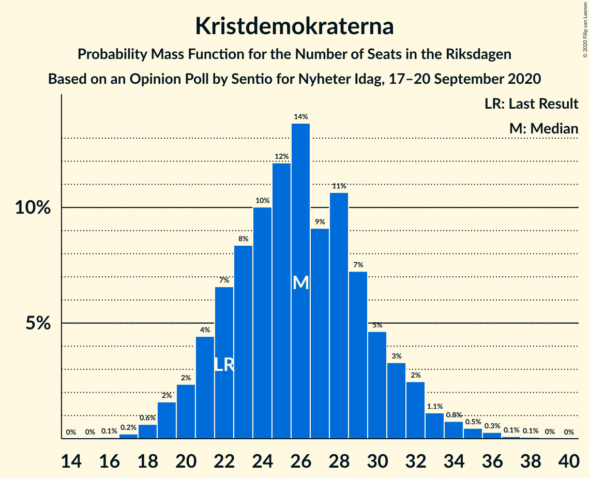
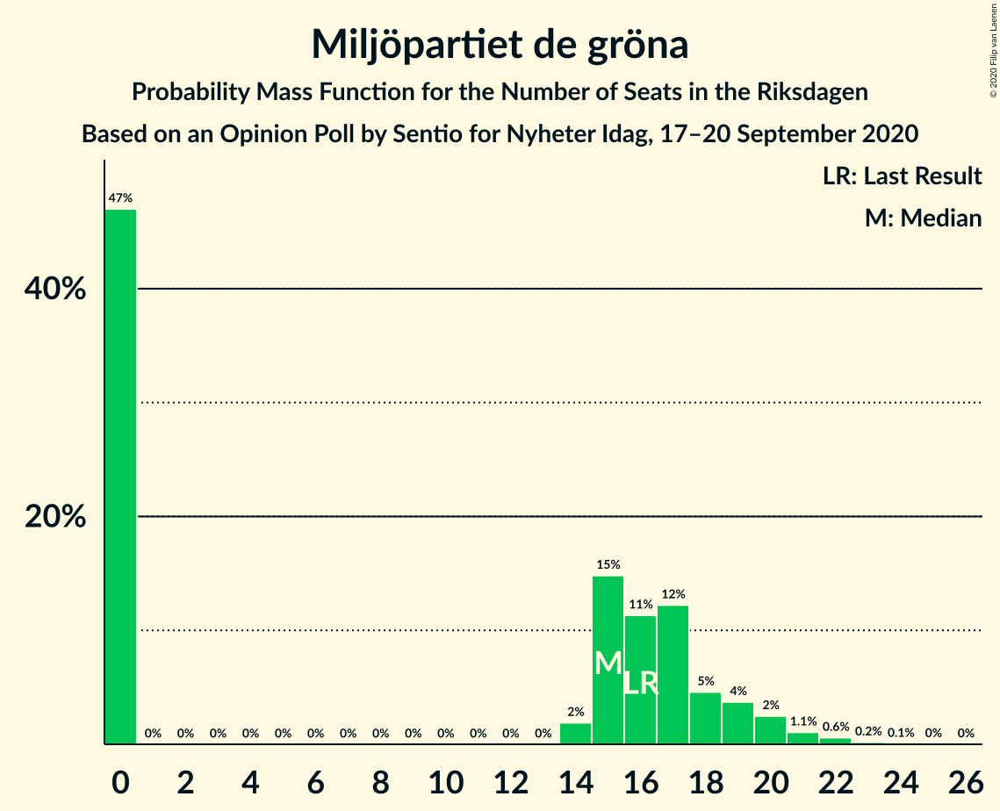
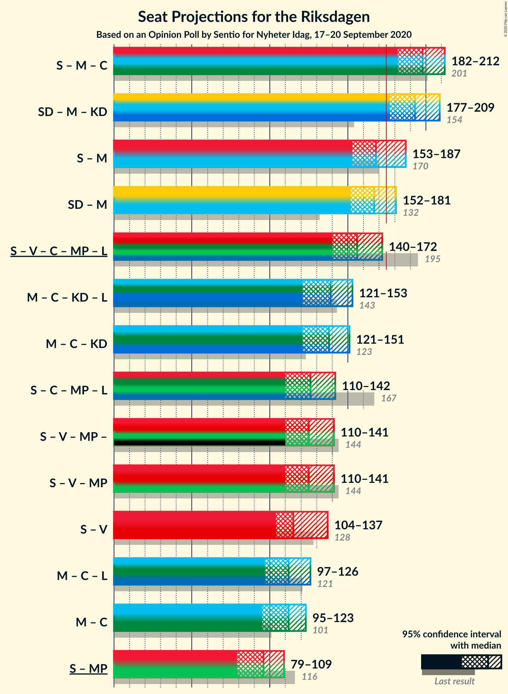
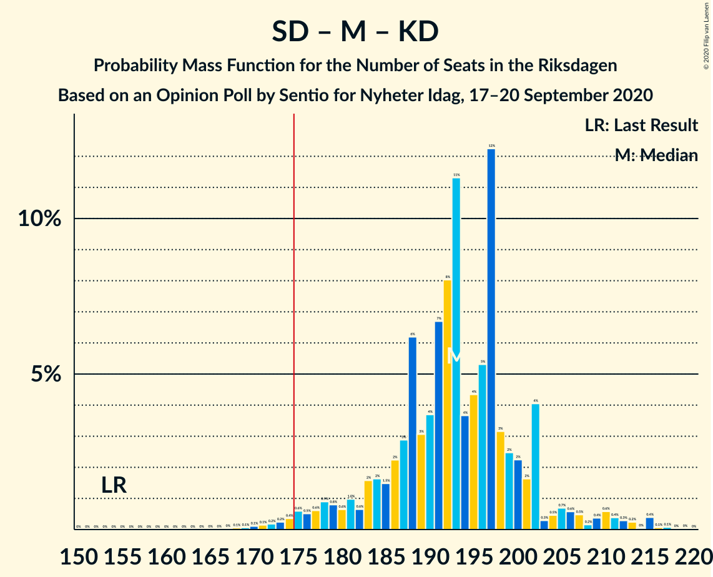
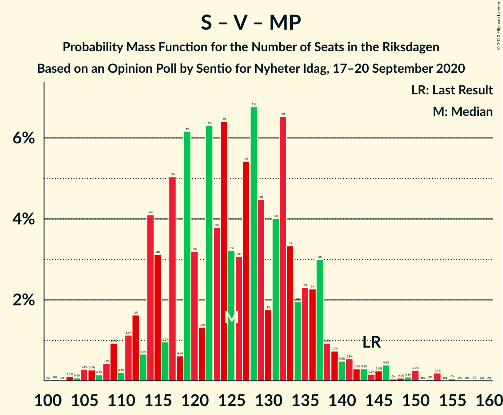

# Opinion Poll by Sentio for Nyheter Idag, 17–20 September 2020

<a href="#voting-intentions">Voting Intentions</a> | <a href="#seats">Seats</a> | <a href="#coalitions">Coalitions</a> | <a href="#technical-information">Technical Information</a>

## Voting Intentions

### Confidence Intervals

| Party | Last Result | Poll Result | 80% Confidence Interval | 90% Confidence Interval | 95% Confidence Interval | 99% Confidence Interval |
|:-----:|:-----------:|:-----------:|:-----------------------:|:-----------------------:|:-----------------------:|:-----------------------:|
| Sveriges socialdemokratiska arbetareparti | 28.3% | 24.7% | 22.8–26.7% |22.3–27.3% |21.8–27.8% |20.9–28.8% |
| Sverigedemokraterna | 17.5% | 23.7% | 21.8–25.7% |21.3–26.2% |20.9–26.7% |20.0–27.7% |
| Moderata samlingspartiet | 19.8% | 22.0% | 20.2–24.0% |19.7–24.6% |19.3–25.0% |18.5–26.0% |
| Vänsterpartiet | 8.0% | 8.5% | 7.3–9.9% |7.0–10.3% |6.7–10.6% |6.2–11.3% |
| Centerpartiet | 8.6% | 7.3% | 6.3–8.7% |6.0–9.0% |5.7–9.4% |5.3–10.0% |
| Kristdemokraterna | 6.3% | 7.0% | 5.9–8.3% |5.7–8.6% |5.4–9.0% |5.0–9.6% |
| Miljöpartiet de gröna | 4.4% | 3.9% | 3.1–4.9% |2.9–5.2% |2.7–5.4% |2.4–6.0% |
| Liberalerna | 5.5% | 3.0% | 2.3–3.9% |2.2–4.2% |2.0–4.4% |1.7–4.9% |

*Note:* The poll result column reflects the actual value used in the calculations. Published results may vary slightly, and in addition be rounded to fewer digits.

## Seats

### Confidence Intervals

| Party | Last Result | Median | 80% Confidence Interval | 90% Confidence Interval | 95% Confidence Interval | 99% Confidence Interval |
|:-----:|:-----------:|:------:|:-----------------------:|:-----------------------:|:-----------------------:|:-----------------------:|
| <a href="#sveriges-socialdemokratiska-arbetareparti">Sveriges socialdemokratiska arbetareparti</a> | 100 | 85 | 79–95 |77–102 |76–105 |73–108 |
| <a href="#sverigedemokraterna">Sverigedemokraterna</a> | 62 | 85 | 78–93 |75–94 |74–97 |71–101 |
| <a href="#moderata-samlingspartiet">Moderata samlingspartiet</a> | 70 | 82 | 76–87 |73–90 |70–93 |66–98 |
| <a href="#vänsterpartiet">Vänsterpartiet</a> | 28 | 30 | 26–35 |25–37 |24–38 |22–41 |
| <a href="#centerpartiet">Centerpartiet</a> | 31 | 30 | 24–35 |21–35 |20–36 |19–38 |
| <a href="#kristdemokraterna">Kristdemokraterna</a> | 22 | 26 | 22–30 |21–32 |20–33 |18–35 |
| <a href="#miljöpartiet-de-gröna">Miljöpartiet de gröna</a> | 16 | 15 | 0–18 |0–19 |0–20 |0–22 |
| <a href="#liberalerna">Liberalerna</a> | 20 | 0 | 0 |0–14 |0–16 |0–17 |

### Sveriges socialdemokratiska arbetareparti

*For a full overview of the results for this party, see the [Sveriges socialdemokratiska arbetareparti](party-sverigessocialdemokratiskaarbetareparti.html) page.*

| Number of Seats | Probability | Accumulated | Special Marks |
|:---------------:|:-----------:|:-----------:|:-------------:|
| 70 | 0.1% | 100% |  |
| 71 | 0.1% | 99.9% |  |
| 72 | 0.2% | 99.8% |  |
| 73 | 0.4% | 99.5% |  |
| 74 | 0.7% | 99.1% |  |
| 75 | 0.7% | 98% |  |
| 76 | 2% | 98% |  |
| 77 | 2% | 96% |  |
| 78 | 3% | 94% |  |
| 79 | 3% | 91% |  |
| 80 | 8% | 88% |  |
| 81 | 5% | 80% |  |
| 82 | 12% | 75% |  |
| 83 | 3% | 63% |  |
| 84 | 8% | 60% |  |
| 85 | 5% | 51% | Median |
| 86 | 5% | 46% |  |
| 87 | 9% | 41% |  |
| 88 | 5% | 32% |  |
| 89 | 7% | 27% |  |
| 90 | 2% | 20% |  |
| 91 | 1.4% | 17% |  |
| 92 | 1.5% | 16% |  |
| 93 | 2% | 14% |  |
| 94 | 1.2% | 12% |  |
| 95 | 2% | 11% |  |
| 96 | 1.2% | 10% |  |
| 97 | 0.7% | 8% |  |
| 98 | 0.6% | 8% |  |
| 99 | 0.3% | 7% |  |
| 100 | 0.8% | 7% | Last Result |
| 101 | 0.3% | 6% |  |
| 102 | 1.2% | 6% |  |
| 103 | 0.9% | 5% |  |
| 104 | 0.2% | 4% |  |
| 105 | 2% | 3% |  |
| 106 | 1.0% | 2% |  |
| 107 | 0.1% | 0.6% |  |
| 108 | 0.2% | 0.5% |  |
| 109 | 0.1% | 0.4% |  |
| 110 | 0% | 0.2% |  |
| 111 | 0.1% | 0.2% |  |
| 112 | 0% | 0.1% |  |
| 113 | 0% | 0.1% |  |
| 114 | 0% | 0.1% |  |
| 115 | 0% | 0.1% |  |
| 116 | 0% | 0% |  |

### Sverigedemokraterna

*For a full overview of the results for this party, see the [Sverigedemokraterna](party-sverigedemokraterna.html) page.*

| Number of Seats | Probability | Accumulated | Special Marks |
|:---------------:|:-----------:|:-----------:|:-------------:|
| 62 | 0% | 100% | Last Result |
| 63 | 0% | 100% |  |
| 64 | 0% | 100% |  |
| 65 | 0% | 100% |  |
| 66 | 0% | 100% |  |
| 67 | 0% | 100% |  |
| 68 | 0.1% | 99.9% |  |
| 69 | 0.1% | 99.9% |  |
| 70 | 0.1% | 99.8% |  |
| 71 | 0.4% | 99.7% |  |
| 72 | 0.3% | 99.3% |  |
| 73 | 1.1% | 99.0% |  |
| 74 | 0.7% | 98% |  |
| 75 | 2% | 97% |  |
| 76 | 1.1% | 95% |  |
| 77 | 2% | 94% |  |
| 78 | 3% | 91% |  |
| 79 | 7% | 89% |  |
| 80 | 3% | 82% |  |
| 81 | 5% | 79% |  |
| 82 | 7% | 73% |  |
| 83 | 6% | 67% |  |
| 84 | 3% | 61% |  |
| 85 | 13% | 58% | Median |
| 86 | 7% | 45% |  |
| 87 | 6% | 38% |  |
| 88 | 5% | 32% |  |
| 89 | 4% | 27% |  |
| 90 | 5% | 23% |  |
| 91 | 4% | 19% |  |
| 92 | 4% | 14% |  |
| 93 | 2% | 10% |  |
| 94 | 3% | 8% |  |
| 95 | 0.8% | 4% |  |
| 96 | 0.6% | 4% |  |
| 97 | 1.1% | 3% |  |
| 98 | 0.8% | 2% |  |
| 99 | 0.3% | 1.1% |  |
| 100 | 0.2% | 0.8% |  |
| 101 | 0.2% | 0.6% |  |
| 102 | 0.1% | 0.4% |  |
| 103 | 0.2% | 0.3% |  |
| 104 | 0% | 0.1% |  |
| 105 | 0% | 0% |  |

### Moderata samlingspartiet

*For a full overview of the results for this party, see the [Moderata samlingspartiet](party-moderatasamlingspartiet.html) page.*

| Number of Seats | Probability | Accumulated | Special Marks |
|:---------------:|:-----------:|:-----------:|:-------------:|
| 62 | 0% | 100% |  |
| 63 | 0.1% | 99.9% |  |
| 64 | 0.2% | 99.9% |  |
| 65 | 0.1% | 99.7% |  |
| 66 | 0.2% | 99.6% |  |
| 67 | 0.4% | 99.4% |  |
| 68 | 0.7% | 99.1% |  |
| 69 | 0.4% | 98% |  |
| 70 | 0.7% | 98% | Last Result |
| 71 | 1.1% | 97% |  |
| 72 | 1.0% | 96% |  |
| 73 | 1.4% | 95% |  |
| 74 | 2% | 94% |  |
| 75 | 2% | 92% |  |
| 76 | 2% | 90% |  |
| 77 | 3% | 88% |  |
| 78 | 7% | 85% |  |
| 79 | 7% | 77% |  |
| 80 | 5% | 71% |  |
| 81 | 7% | 66% |  |
| 82 | 13% | 59% | Median |
| 83 | 7% | 46% |  |
| 84 | 10% | 39% |  |
| 85 | 6% | 29% |  |
| 86 | 6% | 22% |  |
| 87 | 8% | 16% |  |
| 88 | 2% | 9% |  |
| 89 | 1.3% | 7% |  |
| 90 | 0.9% | 5% |  |
| 91 | 0.8% | 5% |  |
| 92 | 0.5% | 4% |  |
| 93 | 0.8% | 3% |  |
| 94 | 0.6% | 2% |  |
| 95 | 0.4% | 2% |  |
| 96 | 0.7% | 1.5% |  |
| 97 | 0.2% | 0.8% |  |
| 98 | 0.2% | 0.6% |  |
| 99 | 0.3% | 0.5% |  |
| 100 | 0.1% | 0.2% |  |
| 101 | 0% | 0.1% |  |
| 102 | 0% | 0.1% |  |
| 103 | 0% | 0% |  |

### Vänsterpartiet

*For a full overview of the results for this party, see the [Vänsterpartiet](party-vänsterpartiet.html) page.*

| Number of Seats | Probability | Accumulated | Special Marks |
|:---------------:|:-----------:|:-----------:|:-------------:|
| 20 | 0% | 100% |  |
| 21 | 0.3% | 99.9% |  |
| 22 | 0.3% | 99.7% |  |
| 23 | 0.9% | 99.3% |  |
| 24 | 2% | 98% |  |
| 25 | 3% | 96% |  |
| 26 | 7% | 93% |  |
| 27 | 6% | 86% |  |
| 28 | 8% | 80% | Last Result |
| 29 | 13% | 71% |  |
| 30 | 11% | 58% | Median |
| 31 | 6% | 47% |  |
| 32 | 11% | 40% |  |
| 33 | 8% | 30% |  |
| 34 | 8% | 22% |  |
| 35 | 5% | 14% |  |
| 36 | 4% | 9% |  |
| 37 | 2% | 6% |  |
| 38 | 2% | 4% |  |
| 39 | 1.1% | 2% |  |
| 40 | 0.3% | 1.0% |  |
| 41 | 0.3% | 0.7% |  |
| 42 | 0.3% | 0.4% |  |
| 43 | 0.1% | 0.1% |  |
| 44 | 0% | 0.1% |  |
| 45 | 0% | 0% |  |

### Centerpartiet

*For a full overview of the results for this party, see the [Centerpartiet](party-centerpartiet.html) page.*

| Number of Seats | Probability | Accumulated | Special Marks |
|:---------------:|:-----------:|:-----------:|:-------------:|
| 17 | 0.1% | 100% |  |
| 18 | 0.3% | 99.8% |  |
| 19 | 0.4% | 99.5% |  |
| 20 | 3% | 99.1% |  |
| 21 | 3% | 97% |  |
| 22 | 1.1% | 94% |  |
| 23 | 2% | 93% |  |
| 24 | 1.3% | 91% |  |
| 25 | 3% | 90% |  |
| 26 | 4% | 87% |  |
| 27 | 7% | 84% |  |
| 28 | 7% | 77% |  |
| 29 | 18% | 70% |  |
| 30 | 6% | 52% | Median |
| 31 | 3% | 46% | Last Result |
| 32 | 13% | 43% |  |
| 33 | 11% | 29% |  |
| 34 | 6% | 18% |  |
| 35 | 9% | 12% |  |
| 36 | 2% | 3% |  |
| 37 | 0.4% | 1.3% |  |
| 38 | 0.5% | 0.9% |  |
| 39 | 0.2% | 0.4% |  |
| 40 | 0.2% | 0.3% |  |
| 41 | 0.1% | 0.1% |  |
| 42 | 0% | 0% |  |

### Kristdemokraterna

*For a full overview of the results for this party, see the [Kristdemokraterna](party-kristdemokraterna.html) page.*

| Number of Seats | Probability | Accumulated | Special Marks |
|:---------------:|:-----------:|:-----------:|:-------------:|
| 16 | 0.1% | 100% |  |
| 17 | 0.2% | 99.9% |  |
| 18 | 0.6% | 99.7% |  |
| 19 | 2% | 99.1% |  |
| 20 | 2% | 98% |  |
| 21 | 4% | 95% |  |
| 22 | 7% | 91% | Last Result |
| 23 | 8% | 84% |  |
| 24 | 10% | 76% |  |
| 25 | 12% | 66% |  |
| 26 | 14% | 54% | Median |
| 27 | 9% | 40% |  |
| 28 | 11% | 31% |  |
| 29 | 7% | 20% |  |
| 30 | 5% | 13% |  |
| 31 | 3% | 9% |  |
| 32 | 2% | 5% |  |
| 33 | 1.1% | 3% |  |
| 34 | 0.8% | 2% |  |
| 35 | 0.5% | 0.9% |  |
| 36 | 0.3% | 0.5% |  |
| 37 | 0.1% | 0.2% |  |
| 38 | 0.1% | 0.1% |  |
| 39 | 0% | 0% |  |

### Miljöpartiet de gröna

*For a full overview of the results for this party, see the [Miljöpartiet de gröna](party-miljöpartietdegröna.html) page.*

| Number of Seats | Probability | Accumulated | Special Marks |
|:---------------:|:-----------:|:-----------:|:-------------:|
| 0 | 47% | 100% |  |
| 1 | 0% | 53% |  |
| 2 | 0% | 53% |  |
| 3 | 0% | 53% |  |
| 4 | 0% | 53% |  |
| 5 | 0% | 53% |  |
| 6 | 0% | 53% |  |
| 7 | 0% | 53% |  |
| 8 | 0% | 53% |  |
| 9 | 0% | 53% |  |
| 10 | 0% | 53% |  |
| 11 | 0% | 53% |  |
| 12 | 0% | 53% |  |
| 13 | 0% | 53% |  |
| 14 | 2% | 53% |  |
| 15 | 15% | 51% | Median |
| 16 | 11% | 36% | Last Result |
| 17 | 12% | 25% |  |
| 18 | 5% | 13% |  |
| 19 | 4% | 8% |  |
| 20 | 2% | 4% |  |
| 21 | 1.1% | 2% |  |
| 22 | 0.6% | 0.9% |  |
| 23 | 0.2% | 0.3% |  |
| 24 | 0.1% | 0.1% |  |
| 25 | 0% | 0.1% |  |
| 26 | 0% | 0% |  |

### Liberalerna

*For a full overview of the results for this party, see the [Liberalerna](party-liberalerna.html) page.*

| Number of Seats | Probability | Accumulated | Special Marks |
|:---------------:|:-----------:|:-----------:|:-------------:|
| 0 | 95% | 100% | Median |
| 1 | 0% | 5% |  |
| 2 | 0% | 5% |  |
| 3 | 0% | 5% |  |
| 4 | 0% | 5% |  |
| 5 | 0% | 5% |  |
| 6 | 0% | 5% |  |
| 7 | 0% | 5% |  |
| 8 | 0% | 5% |  |
| 9 | 0% | 5% |  |
| 10 | 0% | 5% |  |
| 11 | 0% | 5% |  |
| 12 | 0% | 5% |  |
| 13 | 0% | 5% |  |
| 14 | 0.7% | 5% |  |
| 15 | 2% | 4% |  |
| 16 | 2% | 3% |  |
| 17 | 0.7% | 1.0% |  |
| 18 | 0.2% | 0.3% |  |
| 19 | 0.1% | 0.1% |  |
| 20 | 0% | 0% | Last Result |

## Coalitions

### Confidence Intervals

| Coalition | Last Result | Median | Majority? | 80% Confidence Interval | 90% Confidence Interval | 95% Confidence Interval | 99% Confidence Interval |
|:---------:|:-----------:|:------:|:---------:|:-----------------------:|:-----------------------:|:-----------------------:|:-----------------------:|
| Sveriges socialdemokratiska arbetareparti – Moderata samlingspartiet – Centerpartiet | 201 | 198 | 99.9% | 187–209 | 184–210 | 182–212 | 177–216 |
| Sverigedemokraterna – Moderata samlingspartiet – Kristdemokraterna | 154 | 193 | 98.8% | 184–201 | 180–203 | 177–209 | 172–215 |
| Sveriges socialdemokratiska arbetareparti – Moderata samlingspartiet | 170 | 168 | 20% | 158–178 | 155–183 | 153–187 | 149–189 |
| Sverigedemokraterna – Moderata samlingspartiet | 132 | 167 | 12% | 159–175 | 156–178 | 152–181 | 147–188 |
| Sveriges socialdemokratiska arbetareparti – Vänsterpartiet – Centerpartiet – Miljöpartiet de gröna – Liberalerna | 195 | 156 | 1.2% | 148–165 | 146–169 | 140–172 | 134–177 |
| Moderata samlingspartiet – Centerpartiet – Kristdemokraterna – Liberalerna | 143 | 139 | 0% | 128–148 | 124–150 | 121–153 | 113–158 |
| Moderata samlingspartiet – Centerpartiet – Kristdemokraterna | 123 | 138 | 0% | 128–147 | 124–149 | 121–151 | 112–155 |
| Sveriges socialdemokratiska arbetareparti – Centerpartiet – Miljöpartiet de gröna – Liberalerna | 167 | 126 | 0% | 116–134 | 114–138 | 110–142 | 105–147 |
| Sveriges socialdemokratiska arbetareparti – Vänsterpartiet – Miljöpartiet de gröna | 144 | 125 | 0% | 114–136 | 112–137 | 110–141 | 105–150 |
| Sveriges socialdemokratiska arbetareparti – Vänsterpartiet | 128 | 115 | 0% | 108–127 | 106–133 | 104–137 | 101–141 |
| Moderata samlingspartiet – Centerpartiet – Liberalerna | 121 | 112 | 0% | 103–121 | 100–123 | 97–126 | 91–132 |
| Moderata samlingspartiet – Centerpartiet | 101 | 112 | 0% | 103–120 | 99–122 | 95–123 | 89–127 |
| Sveriges socialdemokratiska arbetareparti – Miljöpartiet de gröna | 116 | 96 | 0% | 84–105 | 81–106 | 79–109 | 76–118 |

### Sveriges socialdemokratiska arbetareparti – Moderata samlingspartiet – Centerpartiet

| Number of Seats | Probability | Accumulated | Special Marks |
|:---------------:|:-----------:|:-----------:|:-------------:|
| 172 | 0% | 100% |  |
| 173 | 0% | 99.9% |  |
| 174 | 0% | 99.9% |  |
| 175 | 0% | 99.9% | Majority |
| 176 | 0.2% | 99.8% |  |
| 177 | 0.2% | 99.7% |  |
| 178 | 0.2% | 99.5% |  |
| 179 | 0.2% | 99.3% |  |
| 180 | 0.3% | 99.1% |  |
| 181 | 0.9% | 98.7% |  |
| 182 | 0.9% | 98% |  |
| 183 | 1.1% | 97% |  |
| 184 | 0.9% | 96% |  |
| 185 | 2% | 95% |  |
| 186 | 0.9% | 93% |  |
| 187 | 4% | 92% |  |
| 188 | 2% | 88% |  |
| 189 | 3% | 87% |  |
| 190 | 2% | 83% |  |
| 191 | 6% | 81% |  |
| 192 | 3% | 75% |  |
| 193 | 5% | 72% |  |
| 194 | 5% | 67% |  |
| 195 | 4% | 62% |  |
| 196 | 3% | 58% |  |
| 197 | 6% | 56% | Median |
| 198 | 5% | 50% |  |
| 199 | 3% | 45% |  |
| 200 | 3% | 42% |  |
| 201 | 5% | 39% | Last Result |
| 202 | 3% | 35% |  |
| 203 | 5% | 32% |  |
| 204 | 2% | 27% |  |
| 205 | 3% | 25% |  |
| 206 | 5% | 22% |  |
| 207 | 4% | 17% |  |
| 208 | 2% | 14% |  |
| 209 | 4% | 12% |  |
| 210 | 3% | 7% |  |
| 211 | 0.8% | 5% |  |
| 212 | 2% | 4% |  |
| 213 | 0.9% | 2% |  |
| 214 | 0.2% | 1.2% |  |
| 215 | 0.2% | 1.0% |  |
| 216 | 0.4% | 0.9% |  |
| 217 | 0.1% | 0.4% |  |
| 218 | 0.1% | 0.3% |  |
| 219 | 0.1% | 0.2% |  |
| 220 | 0.1% | 0.2% |  |
| 221 | 0% | 0.1% |  |
| 222 | 0.1% | 0.1% |  |
| 223 | 0% | 0% |  |

### Sverigedemokraterna – Moderata samlingspartiet – Kristdemokraterna

| Number of Seats | Probability | Accumulated | Special Marks |
|:---------------:|:-----------:|:-----------:|:-------------:|
| 154 | 0% | 100% | Last Result |
| 155 | 0% | 100% |  |
| 156 | 0% | 100% |  |
| 157 | 0% | 100% |  |
| 158 | 0% | 100% |  |
| 159 | 0% | 100% |  |
| 160 | 0% | 100% |  |
| 161 | 0% | 100% |  |
| 162 | 0% | 100% |  |
| 163 | 0% | 100% |  |
| 164 | 0% | 100% |  |
| 165 | 0% | 100% |  |
| 166 | 0% | 100% |  |
| 167 | 0% | 100% |  |
| 168 | 0.1% | 99.9% |  |
| 169 | 0.1% | 99.9% |  |
| 170 | 0.1% | 99.8% |  |
| 171 | 0.1% | 99.7% |  |
| 172 | 0.2% | 99.6% |  |
| 173 | 0.2% | 99.4% |  |
| 174 | 0.4% | 99.1% |  |
| 175 | 0.6% | 98.8% | Majority |
| 176 | 0.5% | 98% |  |
| 177 | 0.6% | 98% |  |
| 178 | 0.9% | 97% |  |
| 179 | 0.8% | 96% |  |
| 180 | 0.6% | 95% |  |
| 181 | 1.0% | 95% |  |
| 182 | 0.6% | 94% |  |
| 183 | 2% | 93% |  |
| 184 | 2% | 92% |  |
| 185 | 1.5% | 90% |  |
| 186 | 2% | 88% |  |
| 187 | 3% | 86% |  |
| 188 | 6% | 83% |  |
| 189 | 3% | 77% |  |
| 190 | 4% | 74% |  |
| 191 | 7% | 70% |  |
| 192 | 8% | 64% |  |
| 193 | 11% | 56% | Median |
| 194 | 4% | 44% |  |
| 195 | 4% | 41% |  |
| 196 | 5% | 36% |  |
| 197 | 12% | 31% |  |
| 198 | 3% | 19% |  |
| 199 | 2% | 16% |  |
| 200 | 2% | 13% |  |
| 201 | 2% | 11% |  |
| 202 | 4% | 9% |  |
| 203 | 0.3% | 5% |  |
| 204 | 0.5% | 5% |  |
| 205 | 0.7% | 4% |  |
| 206 | 0.6% | 4% |  |
| 207 | 0.5% | 3% |  |
| 208 | 0.2% | 3% |  |
| 209 | 0.4% | 3% |  |
| 210 | 0.6% | 2% |  |
| 211 | 0.4% | 2% |  |
| 212 | 0.3% | 1.2% |  |
| 213 | 0.2% | 0.9% |  |
| 214 | 0% | 0.6% |  |
| 215 | 0.4% | 0.6% |  |
| 216 | 0.1% | 0.2% |  |
| 217 | 0.1% | 0.1% |  |
| 218 | 0% | 0.1% |  |
| 219 | 0% | 0% |  |

### Sveriges socialdemokratiska arbetareparti – Moderata samlingspartiet

| Number of Seats | Probability | Accumulated | Special Marks |
|:---------------:|:-----------:|:-----------:|:-------------:|
| 144 | 0% | 100% |  |
| 145 | 0% | 99.9% |  |
| 146 | 0% | 99.9% |  |
| 147 | 0.1% | 99.9% |  |
| 148 | 0.2% | 99.8% |  |
| 149 | 0.1% | 99.6% |  |
| 150 | 0.4% | 99.5% |  |
| 151 | 0.3% | 99.1% |  |
| 152 | 0.8% | 98.8% |  |
| 153 | 0.8% | 98% |  |
| 154 | 1.4% | 97% |  |
| 155 | 1.1% | 96% |  |
| 156 | 0.9% | 95% |  |
| 157 | 2% | 94% |  |
| 158 | 3% | 92% |  |
| 159 | 5% | 89% |  |
| 160 | 4% | 84% |  |
| 161 | 2% | 80% |  |
| 162 | 4% | 79% |  |
| 163 | 3% | 74% |  |
| 164 | 7% | 71% |  |
| 165 | 5% | 64% |  |
| 166 | 4% | 58% |  |
| 167 | 4% | 55% | Median |
| 168 | 5% | 51% |  |
| 169 | 4% | 45% |  |
| 170 | 5% | 41% | Last Result |
| 171 | 5% | 36% |  |
| 172 | 3% | 32% |  |
| 173 | 4% | 29% |  |
| 174 | 4% | 25% |  |
| 175 | 2% | 20% | Majority |
| 176 | 5% | 18% |  |
| 177 | 2% | 13% |  |
| 178 | 3% | 11% |  |
| 179 | 0.9% | 8% |  |
| 180 | 1.1% | 7% |  |
| 181 | 0.6% | 6% |  |
| 182 | 0.6% | 6% |  |
| 183 | 1.3% | 5% |  |
| 184 | 0.2% | 4% |  |
| 185 | 0.6% | 4% |  |
| 186 | 0.3% | 3% |  |
| 187 | 1.2% | 3% |  |
| 188 | 0.3% | 1.4% |  |
| 189 | 0.9% | 1.1% |  |
| 190 | 0.1% | 0.2% |  |
| 191 | 0% | 0.2% |  |
| 192 | 0% | 0.1% |  |
| 193 | 0% | 0.1% |  |
| 194 | 0% | 0.1% |  |
| 195 | 0.1% | 0.1% |  |
| 196 | 0% | 0% |  |

### Sverigedemokraterna – Moderata samlingspartiet

| Number of Seats | Probability | Accumulated | Special Marks |
|:---------------:|:-----------:|:-----------:|:-------------:|
| 132 | 0% | 100% | Last Result |
| 133 | 0% | 100% |  |
| 134 | 0% | 100% |  |
| 135 | 0% | 100% |  |
| 136 | 0% | 100% |  |
| 137 | 0% | 100% |  |
| 138 | 0% | 100% |  |
| 139 | 0% | 100% |  |
| 140 | 0% | 100% |  |
| 141 | 0% | 100% |  |
| 142 | 0% | 100% |  |
| 143 | 0% | 99.9% |  |
| 144 | 0.1% | 99.9% |  |
| 145 | 0.1% | 99.9% |  |
| 146 | 0.1% | 99.8% |  |
| 147 | 0.2% | 99.7% |  |
| 148 | 0.2% | 99.4% |  |
| 149 | 0.4% | 99.2% |  |
| 150 | 0.5% | 98.8% |  |
| 151 | 0.6% | 98% |  |
| 152 | 0.5% | 98% |  |
| 153 | 0.7% | 97% |  |
| 154 | 0.5% | 97% |  |
| 155 | 1.0% | 96% |  |
| 156 | 1.2% | 95% |  |
| 157 | 1.2% | 94% |  |
| 158 | 2% | 93% |  |
| 159 | 2% | 91% |  |
| 160 | 2% | 89% |  |
| 161 | 3% | 87% |  |
| 162 | 5% | 84% |  |
| 163 | 4% | 78% |  |
| 164 | 6% | 75% |  |
| 165 | 7% | 69% |  |
| 166 | 7% | 62% |  |
| 167 | 7% | 55% | Median |
| 168 | 7% | 48% |  |
| 169 | 8% | 41% |  |
| 170 | 5% | 33% |  |
| 171 | 5% | 28% |  |
| 172 | 7% | 23% |  |
| 173 | 2% | 16% |  |
| 174 | 2% | 14% |  |
| 175 | 4% | 12% | Majority |
| 176 | 1.5% | 8% |  |
| 177 | 0.8% | 6% |  |
| 178 | 1.5% | 6% |  |
| 179 | 1.0% | 4% |  |
| 180 | 0.3% | 3% |  |
| 181 | 0.5% | 3% |  |
| 182 | 0.4% | 2% |  |
| 183 | 0.5% | 2% |  |
| 184 | 0.2% | 2% |  |
| 185 | 0.5% | 1.4% |  |
| 186 | 0.1% | 0.9% |  |
| 187 | 0.1% | 0.8% |  |
| 188 | 0.3% | 0.7% |  |
| 189 | 0.2% | 0.3% |  |
| 190 | 0% | 0.2% |  |
| 191 | 0.1% | 0.1% |  |
| 192 | 0.1% | 0.1% |  |
| 193 | 0% | 0% |  |

### Sveriges socialdemokratiska arbetareparti – Vänsterpartiet – Centerpartiet – Miljöpartiet de gröna – Liberalerna

| Number of Seats | Probability | Accumulated | Special Marks |
|:---------------:|:-----------:|:-----------:|:-------------:|
| 131 | 0% | 100% |  |
| 132 | 0.1% | 99.9% |  |
| 133 | 0.1% | 99.9% |  |
| 134 | 0.4% | 99.8% |  |
| 135 | 0% | 99.4% |  |
| 136 | 0.2% | 99.4% |  |
| 137 | 0.3% | 99.1% |  |
| 138 | 0.4% | 98.8% |  |
| 139 | 0.6% | 98% |  |
| 140 | 0.4% | 98% |  |
| 141 | 0.2% | 97% |  |
| 142 | 0.5% | 97% |  |
| 143 | 0.6% | 97% |  |
| 144 | 0.7% | 96% |  |
| 145 | 0.5% | 96% |  |
| 146 | 0.3% | 95% |  |
| 147 | 4% | 95% |  |
| 148 | 2% | 91% |  |
| 149 | 2% | 89% |  |
| 150 | 2% | 87% |  |
| 151 | 3% | 84% |  |
| 152 | 12% | 81% |  |
| 153 | 5% | 69% |  |
| 154 | 4% | 64% |  |
| 155 | 4% | 59% |  |
| 156 | 11% | 56% |  |
| 157 | 8% | 44% |  |
| 158 | 7% | 36% |  |
| 159 | 4% | 30% |  |
| 160 | 3% | 26% | Median |
| 161 | 6% | 23% |  |
| 162 | 3% | 17% |  |
| 163 | 2% | 14% |  |
| 164 | 1.5% | 12% |  |
| 165 | 2% | 10% |  |
| 166 | 2% | 8% |  |
| 167 | 0.6% | 7% |  |
| 168 | 1.0% | 6% |  |
| 169 | 0.6% | 5% |  |
| 170 | 0.8% | 5% |  |
| 171 | 0.9% | 4% |  |
| 172 | 0.6% | 3% |  |
| 173 | 0.5% | 2% |  |
| 174 | 0.6% | 2% |  |
| 175 | 0.4% | 1.2% | Majority |
| 176 | 0.2% | 0.9% |  |
| 177 | 0.2% | 0.6% |  |
| 178 | 0.1% | 0.4% |  |
| 179 | 0.1% | 0.3% |  |
| 180 | 0.1% | 0.2% |  |
| 181 | 0.1% | 0.1% |  |
| 182 | 0% | 0.1% |  |
| 183 | 0% | 0% |  |
| 184 | 0% | 0% |  |
| 185 | 0% | 0% |  |
| 186 | 0% | 0% |  |
| 187 | 0% | 0% |  |
| 188 | 0% | 0% |  |
| 189 | 0% | 0% |  |
| 190 | 0% | 0% |  |
| 191 | 0% | 0% |  |
| 192 | 0% | 0% |  |
| 193 | 0% | 0% |  |
| 194 | 0% | 0% |  |
| 195 | 0% | 0% | Last Result |

### Moderata samlingspartiet – Centerpartiet – Kristdemokraterna – Liberalerna

| Number of Seats | Probability | Accumulated | Special Marks |
|:---------------:|:-----------:|:-----------:|:-------------:|
| 109 | 0% | 100% |  |
| 110 | 0.1% | 99.9% |  |
| 111 | 0% | 99.8% |  |
| 112 | 0.2% | 99.8% |  |
| 113 | 0.2% | 99.6% |  |
| 114 | 0% | 99.4% |  |
| 115 | 0% | 99.3% |  |
| 116 | 0% | 99.3% |  |
| 117 | 0.1% | 99.3% |  |
| 118 | 0.2% | 99.1% |  |
| 119 | 0.5% | 98.9% |  |
| 120 | 0.3% | 98% |  |
| 121 | 0.9% | 98% |  |
| 122 | 0.5% | 97% |  |
| 123 | 0.7% | 97% |  |
| 124 | 1.0% | 96% |  |
| 125 | 0.7% | 95% |  |
| 126 | 0.7% | 94% |  |
| 127 | 2% | 94% |  |
| 128 | 2% | 92% |  |
| 129 | 1.5% | 90% |  |
| 130 | 3% | 88% |  |
| 131 | 2% | 85% |  |
| 132 | 4% | 84% |  |
| 133 | 3% | 80% |  |
| 134 | 4% | 77% |  |
| 135 | 6% | 73% |  |
| 136 | 7% | 67% |  |
| 137 | 5% | 60% |  |
| 138 | 3% | 55% | Median |
| 139 | 7% | 53% |  |
| 140 | 5% | 46% |  |
| 141 | 6% | 41% |  |
| 142 | 2% | 35% |  |
| 143 | 4% | 33% | Last Result |
| 144 | 5% | 29% |  |
| 145 | 7% | 24% |  |
| 146 | 3% | 17% |  |
| 147 | 3% | 14% |  |
| 148 | 2% | 11% |  |
| 149 | 3% | 9% |  |
| 150 | 1.3% | 6% |  |
| 151 | 0.5% | 5% |  |
| 152 | 2% | 4% |  |
| 153 | 0.7% | 3% |  |
| 154 | 0.5% | 2% |  |
| 155 | 0.3% | 1.4% |  |
| 156 | 0.4% | 1.2% |  |
| 157 | 0.3% | 0.8% |  |
| 158 | 0.1% | 0.5% |  |
| 159 | 0.1% | 0.4% |  |
| 160 | 0.1% | 0.3% |  |
| 161 | 0% | 0.2% |  |
| 162 | 0.1% | 0.2% |  |
| 163 | 0% | 0.1% |  |
| 164 | 0% | 0% |  |

### Moderata samlingspartiet – Centerpartiet – Kristdemokraterna

| Number of Seats | Probability | Accumulated | Special Marks |
|:---------------:|:-----------:|:-----------:|:-------------:|
| 107 | 0% | 100% |  |
| 108 | 0% | 99.9% |  |
| 109 | 0% | 99.9% |  |
| 110 | 0.1% | 99.9% |  |
| 111 | 0% | 99.8% |  |
| 112 | 0.2% | 99.7% |  |
| 113 | 0.3% | 99.5% |  |
| 114 | 0% | 99.2% |  |
| 115 | 0.1% | 99.1% |  |
| 116 | 0.1% | 99.1% |  |
| 117 | 0.2% | 99.0% |  |
| 118 | 0.3% | 98.8% |  |
| 119 | 0.6% | 98.5% |  |
| 120 | 0.4% | 98% |  |
| 121 | 1.0% | 98% |  |
| 122 | 0.6% | 97% |  |
| 123 | 0.8% | 96% | Last Result |
| 124 | 1.2% | 95% |  |
| 125 | 1.0% | 94% |  |
| 126 | 0.8% | 93% |  |
| 127 | 2% | 92% |  |
| 128 | 2% | 90% |  |
| 129 | 2% | 88% |  |
| 130 | 3% | 86% |  |
| 131 | 2% | 83% |  |
| 132 | 4% | 81% |  |
| 133 | 3% | 78% |  |
| 134 | 4% | 75% |  |
| 135 | 6% | 71% |  |
| 136 | 7% | 64% |  |
| 137 | 5% | 57% |  |
| 138 | 3% | 52% | Median |
| 139 | 7% | 49% |  |
| 140 | 5% | 43% |  |
| 141 | 6% | 38% |  |
| 142 | 2% | 32% |  |
| 143 | 4% | 29% |  |
| 144 | 5% | 26% |  |
| 145 | 7% | 21% |  |
| 146 | 3% | 14% |  |
| 147 | 3% | 11% |  |
| 148 | 2% | 8% |  |
| 149 | 2% | 6% |  |
| 150 | 1.1% | 4% |  |
| 151 | 0.2% | 3% |  |
| 152 | 1.4% | 2% |  |
| 153 | 0.3% | 1.1% |  |
| 154 | 0.3% | 0.8% |  |
| 155 | 0.2% | 0.5% |  |
| 156 | 0.2% | 0.4% |  |
| 157 | 0.1% | 0.1% |  |
| 158 | 0% | 0.1% |  |
| 159 | 0% | 0% |  |

### Sveriges socialdemokratiska arbetareparti – Centerpartiet – Miljöpartiet de gröna – Liberalerna

| Number of Seats | Probability | Accumulated | Special Marks |
|:---------------:|:-----------:|:-----------:|:-------------:|
| 100 | 0.1% | 100% |  |
| 101 | 0% | 99.9% |  |
| 102 | 0.1% | 99.9% |  |
| 103 | 0.2% | 99.8% |  |
| 104 | 0.1% | 99.7% |  |
| 105 | 0.3% | 99.6% |  |
| 106 | 0.5% | 99.3% |  |
| 107 | 0.2% | 98.8% |  |
| 108 | 0.6% | 98.6% |  |
| 109 | 0.3% | 98% |  |
| 110 | 0.3% | 98% |  |
| 111 | 0.5% | 97% |  |
| 112 | 0.3% | 97% |  |
| 113 | 2% | 97% |  |
| 114 | 1.0% | 95% |  |
| 115 | 0.7% | 94% |  |
| 116 | 4% | 93% |  |
| 117 | 2% | 89% |  |
| 118 | 1.4% | 88% |  |
| 119 | 6% | 86% |  |
| 120 | 2% | 81% |  |
| 121 | 6% | 79% |  |
| 122 | 9% | 73% |  |
| 123 | 4% | 64% |  |
| 124 | 6% | 60% |  |
| 125 | 4% | 55% |  |
| 126 | 5% | 51% |  |
| 127 | 7% | 46% |  |
| 128 | 6% | 38% |  |
| 129 | 6% | 32% |  |
| 130 | 7% | 26% | Median |
| 131 | 2% | 19% |  |
| 132 | 4% | 18% |  |
| 133 | 2% | 13% |  |
| 134 | 2% | 12% |  |
| 135 | 1.3% | 10% |  |
| 136 | 2% | 9% |  |
| 137 | 0.9% | 7% |  |
| 138 | 2% | 6% |  |
| 139 | 0.7% | 5% |  |
| 140 | 0.8% | 4% |  |
| 141 | 0.5% | 3% |  |
| 142 | 0.8% | 3% |  |
| 143 | 0.3% | 2% |  |
| 144 | 0.4% | 1.5% |  |
| 145 | 0.4% | 1.1% |  |
| 146 | 0.2% | 0.7% |  |
| 147 | 0.1% | 0.5% |  |
| 148 | 0.1% | 0.4% |  |
| 149 | 0.2% | 0.4% |  |
| 150 | 0% | 0.2% |  |
| 151 | 0.1% | 0.2% |  |
| 152 | 0% | 0.1% |  |
| 153 | 0% | 0% |  |
| 154 | 0% | 0% |  |
| 155 | 0% | 0% |  |
| 156 | 0% | 0% |  |
| 157 | 0% | 0% |  |
| 158 | 0% | 0% |  |
| 159 | 0% | 0% |  |
| 160 | 0% | 0% |  |
| 161 | 0% | 0% |  |
| 162 | 0% | 0% |  |
| 163 | 0% | 0% |  |
| 164 | 0% | 0% |  |
| 165 | 0% | 0% |  |
| 166 | 0% | 0% |  |
| 167 | 0% | 0% | Last Result |

### Sveriges socialdemokratiska arbetareparti – Vänsterpartiet – Miljöpartiet de gröna

| Number of Seats | Probability | Accumulated | Special Marks |
|:---------------:|:-----------:|:-----------:|:-------------:|
| 102 | 0% | 100% |  |
| 103 | 0.1% | 99.9% |  |
| 104 | 0.1% | 99.8% |  |
| 105 | 0.3% | 99.8% |  |
| 106 | 0.3% | 99.5% |  |
| 107 | 0.2% | 99.2% |  |
| 108 | 0.4% | 99.1% |  |
| 109 | 0.9% | 98.6% |  |
| 110 | 0.2% | 98% |  |
| 111 | 1.1% | 97% |  |
| 112 | 2% | 96% |  |
| 113 | 0.7% | 95% |  |
| 114 | 4% | 94% |  |
| 115 | 3% | 90% |  |
| 116 | 1.0% | 87% |  |
| 117 | 5% | 86% |  |
| 118 | 0.6% | 81% |  |
| 119 | 6% | 80% |  |
| 120 | 3% | 74% |  |
| 121 | 1.3% | 71% |  |
| 122 | 6% | 70% |  |
| 123 | 4% | 63% |  |
| 124 | 6% | 59% |  |
| 125 | 3% | 53% |  |
| 126 | 3% | 50% |  |
| 127 | 5% | 47% |  |
| 128 | 7% | 41% |  |
| 129 | 4% | 35% |  |
| 130 | 2% | 30% | Median |
| 131 | 4% | 28% |  |
| 132 | 7% | 24% |  |
| 133 | 3% | 18% |  |
| 134 | 2% | 14% |  |
| 135 | 2% | 12% |  |
| 136 | 2% | 10% |  |
| 137 | 3% | 8% |  |
| 138 | 0.9% | 5% |  |
| 139 | 0.7% | 4% |  |
| 140 | 0.5% | 3% |  |
| 141 | 0.5% | 3% |  |
| 142 | 0.3% | 2% |  |
| 143 | 0.3% | 2% |  |
| 144 | 0.2% | 2% | Last Result |
| 145 | 0.2% | 1.5% |  |
| 146 | 0.4% | 1.2% |  |
| 147 | 0% | 0.8% |  |
| 148 | 0.1% | 0.8% |  |
| 149 | 0.1% | 0.7% |  |
| 150 | 0.3% | 0.6% |  |
| 151 | 0% | 0.3% |  |
| 152 | 0% | 0.3% |  |
| 153 | 0.2% | 0.3% |  |
| 154 | 0% | 0.1% |  |
| 155 | 0% | 0.1% |  |
| 156 | 0% | 0% |  |

### Sveriges socialdemokratiska arbetareparti – Vänsterpartiet

| Number of Seats | Probability | Accumulated | Special Marks |
|:---------------:|:-----------:|:-----------:|:-------------:|
| 97 | 0% | 100% |  |
| 98 | 0% | 99.9% |  |
| 99 | 0.1% | 99.9% |  |
| 100 | 0.1% | 99.8% |  |
| 101 | 0.3% | 99.7% |  |
| 102 | 0.3% | 99.5% |  |
| 103 | 0.5% | 99.2% |  |
| 104 | 1.5% | 98.7% |  |
| 105 | 0.8% | 97% |  |
| 106 | 2% | 96% |  |
| 107 | 3% | 95% |  |
| 108 | 4% | 92% |  |
| 109 | 5% | 88% |  |
| 110 | 2% | 83% |  |
| 111 | 9% | 81% |  |
| 112 | 5% | 72% |  |
| 113 | 3% | 66% |  |
| 114 | 10% | 63% |  |
| 115 | 4% | 53% | Median |
| 116 | 5% | 49% |  |
| 117 | 7% | 44% |  |
| 118 | 2% | 37% |  |
| 119 | 8% | 35% |  |
| 120 | 4% | 27% |  |
| 121 | 2% | 24% |  |
| 122 | 6% | 22% |  |
| 123 | 2% | 16% |  |
| 124 | 2% | 14% |  |
| 125 | 1.0% | 13% |  |
| 126 | 0.9% | 12% |  |
| 127 | 1.0% | 11% |  |
| 128 | 0.9% | 10% | Last Result |
| 129 | 0.3% | 9% |  |
| 130 | 1.0% | 9% |  |
| 131 | 0.6% | 8% |  |
| 132 | 2% | 7% |  |
| 133 | 0.7% | 5% |  |
| 134 | 0.3% | 4% |  |
| 135 | 1.2% | 4% |  |
| 136 | 0.1% | 3% |  |
| 137 | 2% | 3% |  |
| 138 | 0.1% | 1.1% |  |
| 139 | 0.2% | 1.0% |  |
| 140 | 0.2% | 0.8% |  |
| 141 | 0.2% | 0.6% |  |
| 142 | 0% | 0.4% |  |
| 143 | 0.1% | 0.3% |  |
| 144 | 0% | 0.2% |  |
| 145 | 0% | 0.2% |  |
| 146 | 0.1% | 0.2% |  |
| 147 | 0% | 0.1% |  |
| 148 | 0% | 0% |  |

### Moderata samlingspartiet – Centerpartiet – Liberalerna

| Number of Seats | Probability | Accumulated | Special Marks |
|:---------------:|:-----------:|:-----------:|:-------------:|
| 85 | 0% | 100% |  |
| 86 | 0% | 99.9% |  |
| 87 | 0% | 99.9% |  |
| 88 | 0.2% | 99.9% |  |
| 89 | 0.2% | 99.7% |  |
| 90 | 0% | 99.6% |  |
| 91 | 0.1% | 99.5% |  |
| 92 | 0.3% | 99.4% |  |
| 93 | 0.2% | 99.1% |  |
| 94 | 0.6% | 98.9% |  |
| 95 | 0.3% | 98% |  |
| 96 | 0.4% | 98% |  |
| 97 | 0.2% | 98% |  |
| 98 | 0.8% | 97% |  |
| 99 | 1.0% | 97% |  |
| 100 | 0.8% | 96% |  |
| 101 | 1.4% | 95% |  |
| 102 | 1.4% | 93% |  |
| 103 | 3% | 92% |  |
| 104 | 2% | 89% |  |
| 105 | 3% | 88% |  |
| 106 | 5% | 85% |  |
| 107 | 3% | 81% |  |
| 108 | 4% | 77% |  |
| 109 | 5% | 73% |  |
| 110 | 3% | 68% |  |
| 111 | 10% | 65% |  |
| 112 | 5% | 54% | Median |
| 113 | 4% | 50% |  |
| 114 | 4% | 46% |  |
| 115 | 5% | 42% |  |
| 116 | 4% | 37% |  |
| 117 | 5% | 33% |  |
| 118 | 3% | 28% |  |
| 119 | 7% | 25% |  |
| 120 | 7% | 18% |  |
| 121 | 2% | 11% | Last Result |
| 122 | 2% | 9% |  |
| 123 | 3% | 7% |  |
| 124 | 0.8% | 5% |  |
| 125 | 0.8% | 4% |  |
| 126 | 0.5% | 3% |  |
| 127 | 0.3% | 2% |  |
| 128 | 0.6% | 2% |  |
| 129 | 0.4% | 2% |  |
| 130 | 0.2% | 1.1% |  |
| 131 | 0.3% | 0.9% |  |
| 132 | 0.1% | 0.6% |  |
| 133 | 0.3% | 0.5% |  |
| 134 | 0.1% | 0.2% |  |
| 135 | 0% | 0.2% |  |
| 136 | 0% | 0.1% |  |
| 137 | 0% | 0.1% |  |
| 138 | 0% | 0.1% |  |
| 139 | 0% | 0% |  |

### Moderata samlingspartiet – Centerpartiet

| Number of Seats | Probability | Accumulated | Special Marks |
|:---------------:|:-----------:|:-----------:|:-------------:|
| 85 | 0% | 100% |  |
| 86 | 0.1% | 99.9% |  |
| 87 | 0% | 99.9% |  |
| 88 | 0.2% | 99.8% |  |
| 89 | 0.2% | 99.6% |  |
| 90 | 0% | 99.4% |  |
| 91 | 0.1% | 99.4% |  |
| 92 | 0.3% | 99.2% |  |
| 93 | 0.2% | 98.9% |  |
| 94 | 0.8% | 98.7% |  |
| 95 | 0.4% | 98% |  |
| 96 | 0.5% | 97% |  |
| 97 | 0.3% | 97% |  |
| 98 | 0.9% | 97% |  |
| 99 | 1.1% | 96% |  |
| 100 | 0.9% | 95% |  |
| 101 | 2% | 94% | Last Result |
| 102 | 2% | 92% |  |
| 103 | 3% | 90% |  |
| 104 | 2% | 88% |  |
| 105 | 3% | 86% |  |
| 106 | 5% | 83% |  |
| 107 | 3% | 78% |  |
| 108 | 4% | 75% |  |
| 109 | 6% | 71% |  |
| 110 | 4% | 65% |  |
| 111 | 10% | 62% |  |
| 112 | 5% | 51% | Median |
| 113 | 4% | 47% |  |
| 114 | 4% | 43% |  |
| 115 | 5% | 38% |  |
| 116 | 4% | 33% |  |
| 117 | 5% | 30% |  |
| 118 | 3% | 24% |  |
| 119 | 7% | 21% |  |
| 120 | 7% | 14% |  |
| 121 | 2% | 8% |  |
| 122 | 1.2% | 6% |  |
| 123 | 2% | 4% |  |
| 124 | 0.4% | 2% |  |
| 125 | 0.5% | 1.5% |  |
| 126 | 0.4% | 1.0% |  |
| 127 | 0.2% | 0.7% |  |
| 128 | 0.3% | 0.5% |  |
| 129 | 0.1% | 0.2% |  |
| 130 | 0.1% | 0.2% |  |
| 131 | 0.1% | 0.1% |  |
| 132 | 0% | 0% |  |

### Sveriges socialdemokratiska arbetareparti – Miljöpartiet de gröna

| Number of Seats | Probability | Accumulated | Special Marks |
|:---------------:|:-----------:|:-----------:|:-------------:|
| 72 | 0% | 100% |  |
| 73 | 0.1% | 99.9% |  |
| 74 | 0.1% | 99.8% |  |
| 75 | 0.1% | 99.8% |  |
| 76 | 0.4% | 99.6% |  |
| 77 | 0.2% | 99.2% |  |
| 78 | 1.0% | 99.0% |  |
| 79 | 1.3% | 98% |  |
| 80 | 0.5% | 97% |  |
| 81 | 3% | 96% |  |
| 82 | 1.0% | 93% |  |
| 83 | 1.0% | 92% |  |
| 84 | 3% | 91% |  |
| 85 | 1.4% | 88% |  |
| 86 | 3% | 87% |  |
| 87 | 7% | 84% |  |
| 88 | 3% | 77% |  |
| 89 | 7% | 74% |  |
| 90 | 2% | 68% |  |
| 91 | 2% | 66% |  |
| 92 | 3% | 64% |  |
| 93 | 2% | 61% |  |
| 94 | 2% | 60% |  |
| 95 | 7% | 58% |  |
| 96 | 4% | 50% |  |
| 97 | 4% | 46% |  |
| 98 | 5% | 42% |  |
| 99 | 7% | 37% |  |
| 100 | 6% | 31% | Median |
| 101 | 4% | 25% |  |
| 102 | 4% | 21% |  |
| 103 | 5% | 17% |  |
| 104 | 2% | 12% |  |
| 105 | 3% | 10% |  |
| 106 | 2% | 7% |  |
| 107 | 0.9% | 5% |  |
| 108 | 0.7% | 4% |  |
| 109 | 0.8% | 3% |  |
| 110 | 0.4% | 2% |  |
| 111 | 0.3% | 2% |  |
| 112 | 0.2% | 2% |  |
| 113 | 0.2% | 2% |  |
| 114 | 0.1% | 1.4% |  |
| 115 | 0.2% | 1.3% |  |
| 116 | 0.3% | 1.1% | Last Result |
| 117 | 0.1% | 0.8% |  |
| 118 | 0.5% | 0.7% |  |
| 119 | 0% | 0.3% |  |
| 120 | 0% | 0.2% |  |
| 121 | 0.1% | 0.2% |  |
| 122 | 0% | 0.1% |  |
| 123 | 0% | 0.1% |  |
| 124 | 0% | 0.1% |  |
| 125 | 0% | 0% |  |

## Technical Information

### Opinion Poll

+ **Polling firm:** Sentio
+ **Commissioner(s):** Nyheter Idag
+ **Fieldwork period:** 17–20 September 2020

### Calculations

+ **Sample size:** 803
+ **Simulations done:** 1,048,576
+ **Error estimate:** 1.33%

