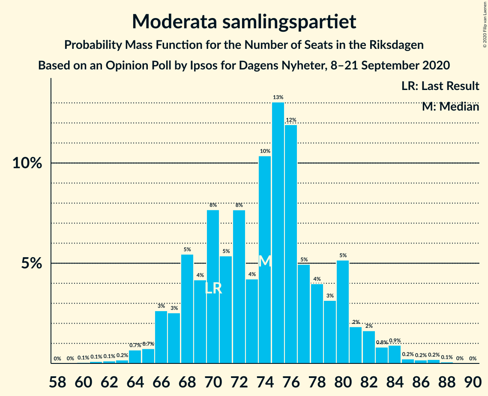
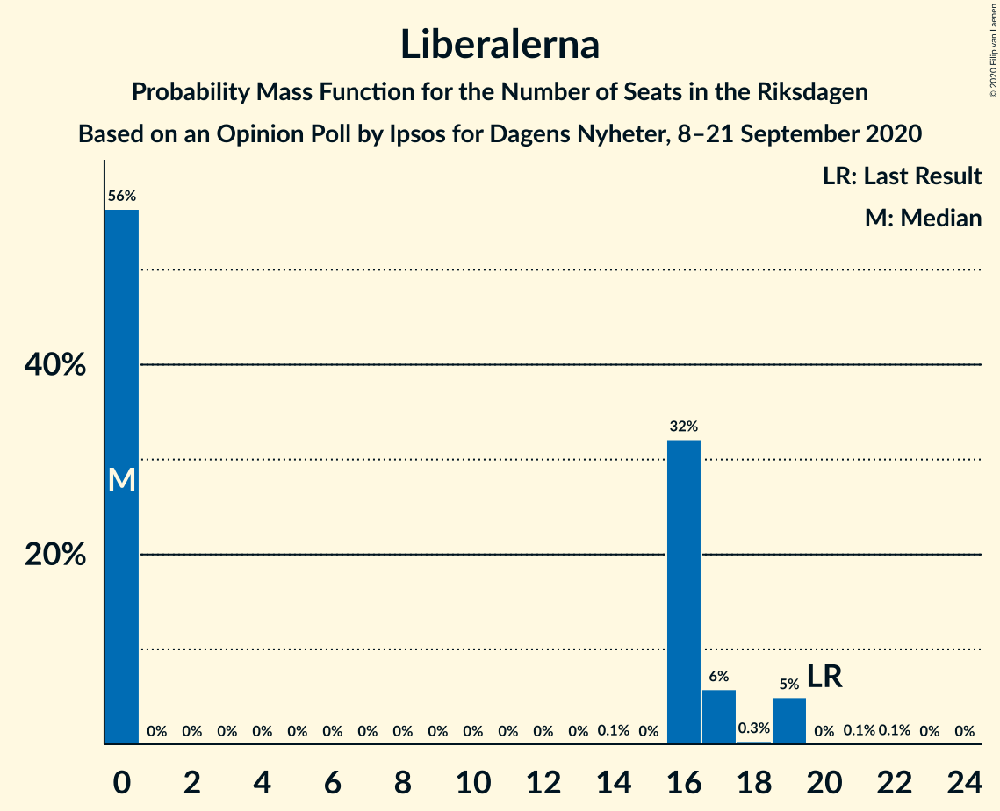
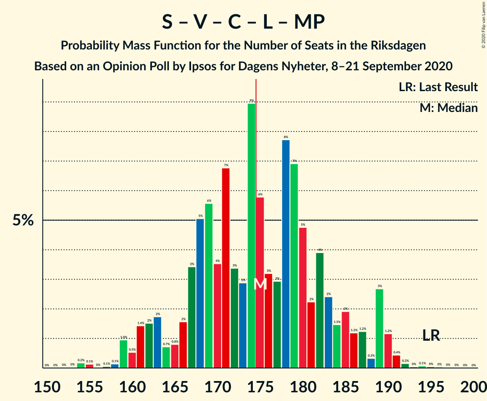
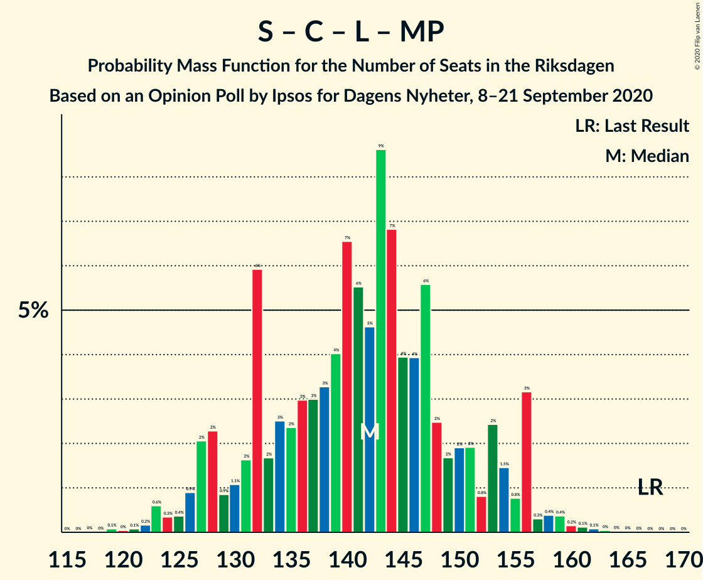
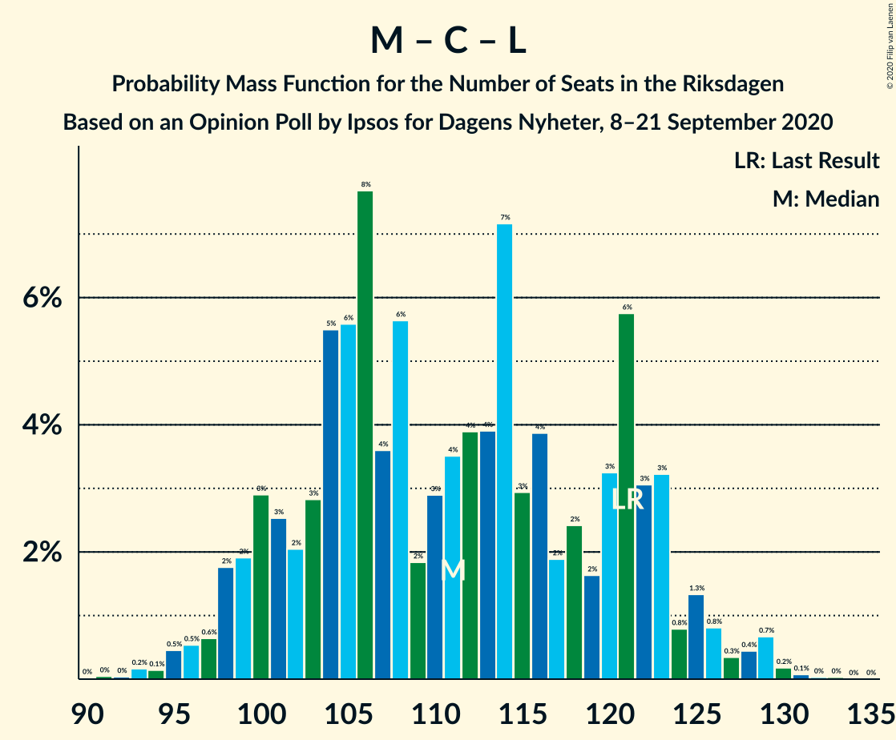

# Opinion Poll by Ipsos for Dagens Nyheter, 8–21 September 2020

<a href="#voting-intentions">Voting Intentions</a> | <a href="#seats">Seats</a> | <a href="#coalitions">Coalitions</a> | <a href="#technical-information">Technical Information</a>

## Voting Intentions

### Confidence Intervals

| Party | Last Result | Poll Result | 80% Confidence Interval | 90% Confidence Interval | 95% Confidence Interval | 99% Confidence Interval |
|:-----:|:-----------:|:-----------:|:-----------------------:|:-----------------------:|:-----------------------:|:-----------------------:|
| Sveriges socialdemokratiska arbetareparti | 28.3% | 26.0% | 24.6–27.5% |24.2–27.9% |23.8–28.2% |23.2–29.0% |
| Moderata samlingspartiet | 19.8% | 20.0% | 18.7–21.4% |18.4–21.7% |18.0–22.1% |17.5–22.7% |
| Sverigedemokraterna | 17.5% | 20.0% | 18.7–21.4% |18.4–21.7% |18.0–22.1% |17.5–22.7% |
| Vänsterpartiet | 8.0% | 9.0% | 8.1–10.0% |7.9–10.3% |7.7–10.6% |7.3–11.1% |
| Centerpartiet | 8.6% | 8.0% | 7.2–9.0% |7.0–9.3% |6.8–9.5% |6.4–10.0% |
| Kristdemokraterna | 6.3% | 7.0% | 6.2–7.9% |6.0–8.1% |5.8–8.4% |5.4–8.8% |
| Liberalerna | 5.5% | 4.0% | 3.4–4.7% |3.3–4.9% |3.1–5.1% |2.9–5.5% |
| Miljöpartiet de gröna | 4.4% | 4.0% | 3.4–4.7% |3.3–4.9% |3.1–5.1% |2.9–5.5% |

*Note:* The poll result column reflects the actual value used in the calculations. Published results may vary slightly, and in addition be rounded to fewer digits.

## Seats

### Confidence Intervals

| Party | Last Result | Median | 80% Confidence Interval | 90% Confidence Interval | 95% Confidence Interval | 99% Confidence Interval |
|:-----:|:-----------:|:------:|:-----------------------:|:-----------------------:|:-----------------------:|:-----------------------:|
| <a href="#sveriges-socialdemokratiska-arbetareparti">Sveriges socialdemokratiska arbetareparti</a> | 100 | 96 | 90–103 |89–106 |87–106 |83–109 |
| <a href="#moderata-samlingspartiet">Moderata samlingspartiet</a> | 70 | 74 | 68–80 |66–82 |66–82 |64–85 |
| <a href="#sverigedemokraterna">Sverigedemokraterna</a> | 62 | 74 | 68–77 |65–80 |65–82 |65–84 |
| <a href="#vänsterpartiet">Vänsterpartiet</a> | 28 | 33 | 30–37 |29–38 |28–39 |27–41 |
| <a href="#centerpartiet">Centerpartiet</a> | 31 | 31 | 27–33 |26–33 |26–35 |24–37 |
| <a href="#kristdemokraterna">Kristdemokraterna</a> | 22 | 26 | 23–29 |22–30 |21–31 |20–33 |
| <a href="#liberalerna">Liberalerna</a> | 20 | 0 | 0–17 |0–19 |0–19 |0–19 |
| <a href="#miljöpartiet-de-gröna">Miljöpartiet de gröna</a> | 16 | 15 | 0–17 |0–17 |0–18 |0–20 |

### Sveriges socialdemokratiska arbetareparti

*For a full overview of the results for this party, see the [Sveriges socialdemokratiska arbetareparti](party-sverigessocialdemokratiskaarbetareparti.html) page.*

| Number of Seats | Probability | Accumulated | Special Marks |
|:---------------:|:-----------:|:-----------:|:-------------:|
| 82 | 0.1% | 100% |  |
| 83 | 0.6% | 99.9% |  |
| 84 | 0.2% | 99.3% |  |
| 85 | 1.3% | 99.1% |  |
| 86 | 0.2% | 98% |  |
| 87 | 2% | 98% |  |
| 88 | 0.3% | 96% |  |
| 89 | 1.1% | 95% |  |
| 90 | 7% | 94% |  |
| 91 | 10% | 88% |  |
| 92 | 6% | 77% |  |
| 93 | 2% | 71% |  |
| 94 | 8% | 69% |  |
| 95 | 3% | 61% |  |
| 96 | 15% | 58% | Median |
| 97 | 5% | 43% |  |
| 98 | 2% | 37% |  |
| 99 | 16% | 36% |  |
| 100 | 3% | 19% | Last Result |
| 101 | 4% | 16% |  |
| 102 | 2% | 12% |  |
| 103 | 0.5% | 10% |  |
| 104 | 4% | 10% |  |
| 105 | 0.6% | 6% |  |
| 106 | 4% | 5% |  |
| 107 | 0.1% | 1.1% |  |
| 108 | 0% | 0.9% |  |
| 109 | 0.8% | 0.9% |  |
| 110 | 0% | 0.1% |  |
| 111 | 0% | 0.1% |  |
| 112 | 0% | 0.1% |  |
| 113 | 0% | 0.1% |  |
| 114 | 0% | 0% |  |

### Moderata samlingspartiet

*For a full overview of the results for this party, see the [Moderata samlingspartiet](party-moderatasamlingspartiet.html) page.*

| Number of Seats | Probability | Accumulated | Special Marks |
|:---------------:|:-----------:|:-----------:|:-------------:|
| 61 | 0.1% | 100% |  |
| 62 | 0.1% | 99.9% |  |
| 63 | 0.1% | 99.8% |  |
| 64 | 0.6% | 99.7% |  |
| 65 | 0.4% | 99.1% |  |
| 66 | 7% | 98.8% |  |
| 67 | 1.2% | 92% |  |
| 68 | 4% | 91% |  |
| 69 | 0.9% | 87% |  |
| 70 | 10% | 86% | Last Result |
| 71 | 11% | 76% |  |
| 72 | 5% | 65% |  |
| 73 | 7% | 60% |  |
| 74 | 4% | 52% | Median |
| 75 | 12% | 49% |  |
| 76 | 15% | 37% |  |
| 77 | 4% | 22% |  |
| 78 | 3% | 17% |  |
| 79 | 2% | 15% |  |
| 80 | 5% | 13% |  |
| 81 | 2% | 8% |  |
| 82 | 4% | 6% |  |
| 83 | 0.1% | 2% |  |
| 84 | 1.0% | 2% |  |
| 85 | 0.6% | 0.8% |  |
| 86 | 0.1% | 0.3% |  |
| 87 | 0.2% | 0.2% |  |
| 88 | 0% | 0% |  |

### Sverigedemokraterna

*For a full overview of the results for this party, see the [Sverigedemokraterna](party-sverigedemokraterna.html) page.*

| Number of Seats | Probability | Accumulated | Special Marks |
|:---------------:|:-----------:|:-----------:|:-------------:|
| 62 | 0% | 100% | Last Result |
| 63 | 0.1% | 99.9% |  |
| 64 | 0.2% | 99.8% |  |
| 65 | 5% | 99.7% |  |
| 66 | 1.3% | 95% |  |
| 67 | 1.1% | 94% |  |
| 68 | 6% | 92% |  |
| 69 | 1.4% | 87% |  |
| 70 | 0.8% | 85% |  |
| 71 | 3% | 84% |  |
| 72 | 13% | 81% |  |
| 73 | 16% | 68% |  |
| 74 | 15% | 52% | Median |
| 75 | 7% | 37% |  |
| 76 | 20% | 30% |  |
| 77 | 1.0% | 10% |  |
| 78 | 3% | 9% |  |
| 79 | 1.3% | 7% |  |
| 80 | 0.8% | 6% |  |
| 81 | 2% | 5% |  |
| 82 | 1.1% | 3% |  |
| 83 | 0.5% | 1.4% |  |
| 84 | 0.6% | 0.9% |  |
| 85 | 0.1% | 0.3% |  |
| 86 | 0% | 0.2% |  |
| 87 | 0% | 0.2% |  |
| 88 | 0% | 0.2% |  |
| 89 | 0% | 0.1% |  |
| 90 | 0.1% | 0.1% |  |
| 91 | 0% | 0% |  |

### Vänsterpartiet

*For a full overview of the results for this party, see the [Vänsterpartiet](party-vänsterpartiet.html) page.*

| Number of Seats | Probability | Accumulated | Special Marks |
|:---------------:|:-----------:|:-----------:|:-------------:|
| 25 | 0.1% | 100% |  |
| 26 | 0.1% | 99.9% |  |
| 27 | 0.9% | 99.8% |  |
| 28 | 2% | 98.9% | Last Result |
| 29 | 3% | 97% |  |
| 30 | 5% | 94% |  |
| 31 | 22% | 89% |  |
| 32 | 8% | 67% |  |
| 33 | 12% | 58% | Median |
| 34 | 11% | 46% |  |
| 35 | 16% | 35% |  |
| 36 | 6% | 19% |  |
| 37 | 6% | 12% |  |
| 38 | 4% | 6% |  |
| 39 | 1.1% | 3% |  |
| 40 | 0.8% | 2% |  |
| 41 | 0.6% | 0.8% |  |
| 42 | 0.1% | 0.2% |  |
| 43 | 0.1% | 0.1% |  |
| 44 | 0% | 0% |  |

### Centerpartiet

*For a full overview of the results for this party, see the [Centerpartiet](party-centerpartiet.html) page.*

| Number of Seats | Probability | Accumulated | Special Marks |
|:---------------:|:-----------:|:-----------:|:-------------:|
| 22 | 0.1% | 100% |  |
| 23 | 0.3% | 99.9% |  |
| 24 | 0.4% | 99.6% |  |
| 25 | 1.4% | 99.2% |  |
| 26 | 4% | 98% |  |
| 27 | 10% | 94% |  |
| 28 | 14% | 83% |  |
| 29 | 8% | 69% |  |
| 30 | 11% | 62% |  |
| 31 | 19% | 51% | Last Result, Median |
| 32 | 12% | 32% |  |
| 33 | 16% | 20% |  |
| 34 | 1.0% | 5% |  |
| 35 | 2% | 4% |  |
| 36 | 1.2% | 2% |  |
| 37 | 0.5% | 0.6% |  |
| 38 | 0% | 0.1% |  |
| 39 | 0% | 0.1% |  |
| 40 | 0% | 0% |  |

### Kristdemokraterna

*For a full overview of the results for this party, see the [Kristdemokraterna](party-kristdemokraterna.html) page.*

| Number of Seats | Probability | Accumulated | Special Marks |
|:---------------:|:-----------:|:-----------:|:-------------:|
| 18 | 0.1% | 100% |  |
| 19 | 0.1% | 99.9% |  |
| 20 | 0.5% | 99.9% |  |
| 21 | 2% | 99.4% |  |
| 22 | 7% | 97% | Last Result |
| 23 | 15% | 90% |  |
| 24 | 7% | 76% |  |
| 25 | 13% | 69% |  |
| 26 | 16% | 56% | Median |
| 27 | 16% | 40% |  |
| 28 | 14% | 25% |  |
| 29 | 5% | 10% |  |
| 30 | 3% | 6% |  |
| 31 | 1.4% | 3% |  |
| 32 | 0.6% | 1.2% |  |
| 33 | 0.3% | 0.6% |  |
| 34 | 0.2% | 0.3% |  |
| 35 | 0% | 0.1% |  |
| 36 | 0% | 0% |  |

### Liberalerna

*For a full overview of the results for this party, see the [Liberalerna](party-liberalerna.html) page.*

| Number of Seats | Probability | Accumulated | Special Marks |
|:---------------:|:-----------:|:-----------:|:-------------:|
| 0 | 53% | 100% | Median |
| 1 | 0% | 47% |  |
| 2 | 0% | 47% |  |
| 3 | 0% | 47% |  |
| 4 | 0% | 47% |  |
| 5 | 0% | 47% |  |
| 6 | 0% | 47% |  |
| 7 | 0% | 47% |  |
| 8 | 0% | 47% |  |
| 9 | 0% | 47% |  |
| 10 | 0% | 47% |  |
| 11 | 0% | 47% |  |
| 12 | 0% | 47% |  |
| 13 | 0% | 47% |  |
| 14 | 0.1% | 47% |  |
| 15 | 0% | 47% |  |
| 16 | 22% | 47% |  |
| 17 | 19% | 25% |  |
| 18 | 0.1% | 6% |  |
| 19 | 6% | 6% |  |
| 20 | 0% | 0.2% | Last Result |
| 21 | 0.1% | 0.2% |  |
| 22 | 0.1% | 0.1% |  |
| 23 | 0% | 0% |  |

### Miljöpartiet de gröna

*For a full overview of the results for this party, see the [Miljöpartiet de gröna](party-miljöpartietdegröna.html) page.*

| Number of Seats | Probability | Accumulated | Special Marks |
|:---------------:|:-----------:|:-----------:|:-------------:|
| 0 | 46% | 100% |  |
| 1 | 0% | 54% |  |
| 2 | 0% | 54% |  |
| 3 | 0% | 54% |  |
| 4 | 0% | 54% |  |
| 5 | 0% | 54% |  |
| 6 | 0% | 54% |  |
| 7 | 0% | 54% |  |
| 8 | 0% | 54% |  |
| 9 | 0% | 54% |  |
| 10 | 0% | 54% |  |
| 11 | 0% | 54% |  |
| 12 | 0% | 54% |  |
| 13 | 0% | 54% |  |
| 14 | 0.1% | 54% |  |
| 15 | 25% | 54% | Median |
| 16 | 14% | 29% | Last Result |
| 17 | 11% | 15% |  |
| 18 | 3% | 5% |  |
| 19 | 1.1% | 2% |  |
| 20 | 0.4% | 0.7% |  |
| 21 | 0.2% | 0.3% |  |
| 22 | 0.1% | 0.1% |  |
| 23 | 0% | 0% |  |

## Coalitions

### Confidence Intervals

| Coalition | Last Result | Median | Majority? | 80% Confidence Interval | 90% Confidence Interval | 95% Confidence Interval | 99% Confidence Interval |
|:---------:|:-----------:|:------:|:---------:|:-----------------------:|:-----------------------:|:-----------------------:|:-----------------------:|
| Sveriges socialdemokratiska arbetareparti – Moderata samlingspartiet – Centerpartiet | 201 | 200 | 100% | 190–208 | 187–214 | 187–216 | 185–218 |
| Sveriges socialdemokratiska arbetareparti – Vänsterpartiet – Centerpartiet – Liberalerna – Miljöpartiet de gröna | 195 | 175 | 64% | 167–185 | 165–189 | 161–189 | 158–192 |
| Moderata samlingspartiet – Sverigedemokraterna – Kristdemokraterna | 154 | 174 | 36% | 164–182 | 160–184 | 160–188 | 157–191 |
| Sveriges socialdemokratiska arbetareparti – Moderata samlingspartiet | 170 | 170 | 19% | 160–177 | 156–185 | 156–186 | 156–187 |
| Moderata samlingspartiet – Sverigedemokraterna | 132 | 148 | 0% | 139–156 | 136–158 | 133–160 | 133–164 |
| Sveriges socialdemokratiska arbetareparti – Centerpartiet – Liberalerna – Miljöpartiet de gröna | 167 | 143 | 0% | 132–153 | 130–156 | 123–156 | 123–161 |
| Moderata samlingspartiet – Centerpartiet – Kristdemokraterna – Liberalerna | 143 | 138 | 0% | 130–146 | 127–149 | 125–151 | 119–155 |
| Sveriges socialdemokratiska arbetareparti – Vänsterpartiet – Miljöpartiet de gröna | 144 | 139 | 0% | 128–146 | 125–148 | 123–149 | 119–155 |
| Moderata samlingspartiet – Centerpartiet – Kristdemokraterna | 123 | 131 | 0% | 122–137 | 121–140 | 120–141 | 117–143 |
| Sveriges socialdemokratiska arbetareparti – Vänsterpartiet | 128 | 130 | 0% | 122–137 | 122–140 | 117–140 | 115–143 |
| Moderata samlingspartiet – Centerpartiet – Liberalerna | 121 | 113 | 0% | 103–121 | 100–122 | 100–125 | 95–126 |
| Sveriges socialdemokratiska arbetareparti – Miljöpartiet de gröna | 116 | 106 | 0% | 94–114 | 92–116 | 91–120 | 87–120 |
| Moderata samlingspartiet – Centerpartiet | 101 | 103 | 0% | 97–109 | 97–113 | 96–113 | 92–114 |

### Sveriges socialdemokratiska arbetareparti – Moderata samlingspartiet – Centerpartiet

| Number of Seats | Probability | Accumulated | Special Marks |
|:---------------:|:-----------:|:-----------:|:-------------:|
| 177 | 0% | 100% |  |
| 178 | 0% | 99.9% |  |
| 179 | 0% | 99.9% |  |
| 180 | 0.1% | 99.9% |  |
| 181 | 0% | 99.8% |  |
| 182 | 0% | 99.8% |  |
| 183 | 0.1% | 99.8% |  |
| 184 | 0.1% | 99.6% |  |
| 185 | 0.1% | 99.6% |  |
| 186 | 0.8% | 99.4% |  |
| 187 | 8% | 98.7% |  |
| 188 | 0.3% | 91% |  |
| 189 | 0.3% | 91% |  |
| 190 | 1.1% | 90% |  |
| 191 | 0.7% | 89% |  |
| 192 | 0.6% | 89% |  |
| 193 | 8% | 88% |  |
| 194 | 3% | 80% |  |
| 195 | 3% | 77% |  |
| 196 | 1.4% | 74% |  |
| 197 | 1.5% | 73% |  |
| 198 | 12% | 72% |  |
| 199 | 8% | 60% |  |
| 200 | 4% | 52% |  |
| 201 | 5% | 48% | Last Result, Median |
| 202 | 6% | 42% |  |
| 203 | 3% | 36% |  |
| 204 | 12% | 34% |  |
| 205 | 4% | 21% |  |
| 206 | 2% | 17% |  |
| 207 | 4% | 15% |  |
| 208 | 2% | 11% |  |
| 209 | 0.7% | 9% |  |
| 210 | 0.9% | 8% |  |
| 211 | 0.7% | 7% |  |
| 212 | 0.6% | 6% |  |
| 213 | 0.1% | 6% |  |
| 214 | 3% | 6% |  |
| 215 | 0.1% | 3% |  |
| 216 | 1.0% | 3% |  |
| 217 | 0% | 2% |  |
| 218 | 1.5% | 2% |  |
| 219 | 0% | 0.1% |  |
| 220 | 0% | 0.1% |  |
| 221 | 0% | 0% |  |

### Sveriges socialdemokratiska arbetareparti – Vänsterpartiet – Centerpartiet – Liberalerna – Miljöpartiet de gröna

| Number of Seats | Probability | Accumulated | Special Marks |
|:---------------:|:-----------:|:-----------:|:-------------:|
| 153 | 0.1% | 100% |  |
| 154 | 0.3% | 99.9% |  |
| 155 | 0% | 99.6% |  |
| 156 | 0% | 99.6% |  |
| 157 | 0% | 99.6% |  |
| 158 | 0.1% | 99.5% |  |
| 159 | 0.1% | 99.4% |  |
| 160 | 0.4% | 99.3% |  |
| 161 | 2% | 98.9% |  |
| 162 | 0.4% | 96% |  |
| 163 | 0.8% | 96% |  |
| 164 | 0.1% | 95% |  |
| 165 | 1.2% | 95% |  |
| 166 | 1.1% | 94% |  |
| 167 | 5% | 93% |  |
| 168 | 4% | 88% |  |
| 169 | 1.2% | 84% |  |
| 170 | 0.6% | 83% |  |
| 171 | 4% | 82% |  |
| 172 | 3% | 78% |  |
| 173 | 1.1% | 75% |  |
| 174 | 10% | 74% |  |
| 175 | 16% | 64% | Median, Majority |
| 176 | 0.8% | 48% |  |
| 177 | 1.2% | 47% |  |
| 178 | 19% | 46% |  |
| 179 | 3% | 27% |  |
| 180 | 2% | 23% |  |
| 181 | 1.1% | 21% |  |
| 182 | 3% | 20% |  |
| 183 | 0.6% | 17% |  |
| 184 | 0.7% | 16% |  |
| 185 | 6% | 15% |  |
| 186 | 3% | 9% |  |
| 187 | 0.2% | 6% |  |
| 188 | 0.1% | 6% |  |
| 189 | 5% | 6% |  |
| 190 | 0.5% | 1.1% |  |
| 191 | 0.1% | 0.6% |  |
| 192 | 0.2% | 0.6% |  |
| 193 | 0.1% | 0.3% |  |
| 194 | 0.1% | 0.3% |  |
| 195 | 0.1% | 0.2% | Last Result |
| 196 | 0.1% | 0.1% |  |
| 197 | 0% | 0% |  |

### Moderata samlingspartiet – Sverigedemokraterna – Kristdemokraterna

| Number of Seats | Probability | Accumulated | Special Marks |
|:---------------:|:-----------:|:-----------:|:-------------:|
| 153 | 0.1% | 100% |  |
| 154 | 0.1% | 99.9% | Last Result |
| 155 | 0.1% | 99.8% |  |
| 156 | 0.1% | 99.7% |  |
| 157 | 0.2% | 99.7% |  |
| 158 | 0.1% | 99.4% |  |
| 159 | 0.5% | 99.4% |  |
| 160 | 5% | 98.9% |  |
| 161 | 0.1% | 94% |  |
| 162 | 0.2% | 94% |  |
| 163 | 3% | 94% |  |
| 164 | 6% | 91% |  |
| 165 | 0.7% | 85% |  |
| 166 | 0.6% | 84% |  |
| 167 | 3% | 83% |  |
| 168 | 1.1% | 80% |  |
| 169 | 2% | 79% |  |
| 170 | 3% | 77% |  |
| 171 | 19% | 73% |  |
| 172 | 1.2% | 54% |  |
| 173 | 0.8% | 53% |  |
| 174 | 16% | 52% | Median |
| 175 | 10% | 36% | Majority |
| 176 | 1.1% | 26% |  |
| 177 | 3% | 25% |  |
| 178 | 4% | 22% |  |
| 179 | 0.6% | 18% |  |
| 180 | 1.2% | 17% |  |
| 181 | 4% | 16% |  |
| 182 | 5% | 12% |  |
| 183 | 1.1% | 7% |  |
| 184 | 1.2% | 6% |  |
| 185 | 0.1% | 5% |  |
| 186 | 0.8% | 5% |  |
| 187 | 0.4% | 4% |  |
| 188 | 2% | 4% |  |
| 189 | 0.4% | 1.1% |  |
| 190 | 0.1% | 0.7% |  |
| 191 | 0.1% | 0.6% |  |
| 192 | 0% | 0.5% |  |
| 193 | 0% | 0.4% |  |
| 194 | 0% | 0.4% |  |
| 195 | 0.3% | 0.4% |  |
| 196 | 0.1% | 0.1% |  |
| 197 | 0% | 0% |  |

### Sveriges socialdemokratiska arbetareparti – Moderata samlingspartiet

| Number of Seats | Probability | Accumulated | Special Marks |
|:---------------:|:-----------:|:-----------:|:-------------:|
| 150 | 0% | 100% |  |
| 151 | 0.1% | 99.9% |  |
| 152 | 0% | 99.9% |  |
| 153 | 0% | 99.8% |  |
| 154 | 0.1% | 99.8% |  |
| 155 | 0.2% | 99.7% |  |
| 156 | 6% | 99.5% |  |
| 157 | 1.4% | 93% |  |
| 158 | 0.4% | 92% |  |
| 159 | 0.5% | 92% |  |
| 160 | 1.2% | 91% |  |
| 161 | 1.2% | 90% |  |
| 162 | 4% | 89% |  |
| 163 | 0.3% | 85% |  |
| 164 | 6% | 85% |  |
| 165 | 3% | 79% |  |
| 166 | 7% | 76% |  |
| 167 | 3% | 69% |  |
| 168 | 1.2% | 66% |  |
| 169 | 6% | 65% |  |
| 170 | 15% | 59% | Last Result, Median |
| 171 | 6% | 44% |  |
| 172 | 10% | 38% |  |
| 173 | 2% | 27% |  |
| 174 | 6% | 25% |  |
| 175 | 0.5% | 19% | Majority |
| 176 | 4% | 18% |  |
| 177 | 5% | 14% |  |
| 178 | 0.2% | 9% |  |
| 179 | 0.7% | 9% |  |
| 180 | 1.4% | 9% |  |
| 181 | 1.2% | 7% |  |
| 182 | 0% | 6% |  |
| 183 | 0.8% | 6% |  |
| 184 | 0% | 5% |  |
| 185 | 0.5% | 5% |  |
| 186 | 4% | 5% |  |
| 187 | 0.5% | 0.7% |  |
| 188 | 0% | 0.2% |  |
| 189 | 0% | 0.2% |  |
| 190 | 0.1% | 0.2% |  |
| 191 | 0% | 0.1% |  |
| 192 | 0% | 0.1% |  |
| 193 | 0% | 0% |  |

### Moderata samlingspartiet – Sverigedemokraterna

| Number of Seats | Probability | Accumulated | Special Marks |
|:---------------:|:-----------:|:-----------:|:-------------:|
| 129 | 0.1% | 100% |  |
| 130 | 0% | 99.9% |  |
| 131 | 0.2% | 99.9% |  |
| 132 | 0.1% | 99.7% | Last Result |
| 133 | 3% | 99.6% |  |
| 134 | 0.1% | 96% |  |
| 135 | 0.8% | 96% |  |
| 136 | 0.7% | 96% |  |
| 137 | 0.2% | 95% |  |
| 138 | 2% | 95% |  |
| 139 | 6% | 93% |  |
| 140 | 0.4% | 86% |  |
| 141 | 1.3% | 86% |  |
| 142 | 3% | 84% |  |
| 143 | 8% | 81% |  |
| 144 | 4% | 73% |  |
| 145 | 3% | 69% |  |
| 146 | 5% | 66% |  |
| 147 | 10% | 61% |  |
| 148 | 13% | 51% | Median |
| 149 | 10% | 37% |  |
| 150 | 1.2% | 27% |  |
| 151 | 2% | 26% |  |
| 152 | 7% | 24% |  |
| 153 | 1.3% | 17% |  |
| 154 | 1.3% | 15% |  |
| 155 | 0.6% | 14% |  |
| 156 | 8% | 13% |  |
| 157 | 0.4% | 5% |  |
| 158 | 0.5% | 5% |  |
| 159 | 0.6% | 5% |  |
| 160 | 3% | 4% |  |
| 161 | 0% | 1.1% |  |
| 162 | 0.1% | 1.1% |  |
| 163 | 0.3% | 1.0% |  |
| 164 | 0.2% | 0.6% |  |
| 165 | 0% | 0.4% |  |
| 166 | 0% | 0.4% |  |
| 167 | 0.3% | 0.4% |  |
| 168 | 0% | 0% |  |

### Sveriges socialdemokratiska arbetareparti – Centerpartiet – Liberalerna – Miljöpartiet de gröna

| Number of Seats | Probability | Accumulated | Special Marks |
|:---------------:|:-----------:|:-----------:|:-------------:|
| 119 | 0% | 100% |  |
| 120 | 0% | 99.9% |  |
| 121 | 0.1% | 99.9% |  |
| 122 | 0% | 99.9% |  |
| 123 | 2% | 99.8% |  |
| 124 | 0.1% | 97% |  |
| 125 | 0.1% | 97% |  |
| 126 | 0.4% | 97% |  |
| 127 | 0.9% | 97% |  |
| 128 | 0.7% | 96% |  |
| 129 | 0.1% | 95% |  |
| 130 | 0.4% | 95% |  |
| 131 | 2% | 95% |  |
| 132 | 3% | 93% |  |
| 133 | 0.9% | 90% |  |
| 134 | 3% | 89% |  |
| 135 | 2% | 86% |  |
| 136 | 4% | 84% |  |
| 137 | 1.0% | 80% |  |
| 138 | 5% | 79% |  |
| 139 | 1.3% | 74% |  |
| 140 | 2% | 73% |  |
| 141 | 13% | 71% |  |
| 142 | 0.8% | 58% | Median |
| 143 | 11% | 57% |  |
| 144 | 14% | 46% |  |
| 145 | 1.1% | 32% |  |
| 146 | 0.4% | 31% |  |
| 147 | 7% | 31% |  |
| 148 | 3% | 24% |  |
| 149 | 2% | 21% |  |
| 150 | 2% | 19% |  |
| 151 | 2% | 17% |  |
| 152 | 0.3% | 14% |  |
| 153 | 7% | 14% |  |
| 154 | 0.5% | 7% |  |
| 155 | 0.1% | 7% |  |
| 156 | 5% | 6% |  |
| 157 | 0.2% | 1.3% |  |
| 158 | 0.1% | 1.2% |  |
| 159 | 0.4% | 1.1% |  |
| 160 | 0.1% | 0.7% |  |
| 161 | 0.1% | 0.6% |  |
| 162 | 0.2% | 0.5% |  |
| 163 | 0.2% | 0.3% |  |
| 164 | 0.1% | 0.1% |  |
| 165 | 0.1% | 0.1% |  |
| 166 | 0% | 0% |  |
| 167 | 0% | 0% | Last Result |

### Moderata samlingspartiet – Centerpartiet – Kristdemokraterna – Liberalerna

| Number of Seats | Probability | Accumulated | Special Marks |
|:---------------:|:-----------:|:-----------:|:-------------:|
| 117 | 0.2% | 100% |  |
| 118 | 0% | 99.8% |  |
| 119 | 0.4% | 99.7% |  |
| 120 | 0.5% | 99.4% |  |
| 121 | 0.3% | 98.9% |  |
| 122 | 0.2% | 98.6% |  |
| 123 | 0.2% | 98% |  |
| 124 | 0.5% | 98% |  |
| 125 | 0.4% | 98% |  |
| 126 | 0.4% | 97% |  |
| 127 | 2% | 97% |  |
| 128 | 0.9% | 95% |  |
| 129 | 2% | 94% |  |
| 130 | 2% | 92% |  |
| 131 | 18% | 90% | Median |
| 132 | 1.3% | 72% |  |
| 133 | 4% | 71% |  |
| 134 | 7% | 67% |  |
| 135 | 1.4% | 59% |  |
| 136 | 4% | 58% |  |
| 137 | 3% | 54% |  |
| 138 | 8% | 51% |  |
| 139 | 1.0% | 43% |  |
| 140 | 1.5% | 42% |  |
| 141 | 6% | 41% |  |
| 142 | 4% | 35% |  |
| 143 | 14% | 30% | Last Result |
| 144 | 2% | 17% |  |
| 145 | 2% | 15% |  |
| 146 | 3% | 13% |  |
| 147 | 1.1% | 10% |  |
| 148 | 4% | 9% |  |
| 149 | 0.3% | 5% |  |
| 150 | 0.6% | 5% |  |
| 151 | 2% | 4% |  |
| 152 | 0.1% | 2% |  |
| 153 | 0.7% | 2% |  |
| 154 | 0.3% | 1.3% |  |
| 155 | 0.7% | 0.9% |  |
| 156 | 0.1% | 0.2% |  |
| 157 | 0.1% | 0.2% |  |
| 158 | 0% | 0% |  |

### Sveriges socialdemokratiska arbetareparti – Vänsterpartiet – Miljöpartiet de gröna

| Number of Seats | Probability | Accumulated | Special Marks |
|:---------------:|:-----------:|:-----------:|:-------------:|
| 119 | 0.6% | 100% |  |
| 120 | 0.1% | 99.3% |  |
| 121 | 0.5% | 99.2% |  |
| 122 | 0.1% | 98.7% |  |
| 123 | 2% | 98.5% |  |
| 124 | 0.2% | 97% |  |
| 125 | 2% | 96% |  |
| 126 | 0.1% | 94% |  |
| 127 | 3% | 94% |  |
| 128 | 1.3% | 91% |  |
| 129 | 0.3% | 90% |  |
| 130 | 12% | 89% |  |
| 131 | 6% | 77% |  |
| 132 | 0.8% | 71% |  |
| 133 | 3% | 70% |  |
| 134 | 3% | 67% |  |
| 135 | 1.0% | 65% |  |
| 136 | 3% | 64% |  |
| 137 | 3% | 60% |  |
| 138 | 7% | 58% |  |
| 139 | 2% | 51% |  |
| 140 | 4% | 49% |  |
| 141 | 9% | 45% |  |
| 142 | 5% | 36% |  |
| 143 | 3% | 31% |  |
| 144 | 2% | 28% | Last Result, Median |
| 145 | 7% | 26% |  |
| 146 | 12% | 19% |  |
| 147 | 2% | 7% |  |
| 148 | 0.4% | 5% |  |
| 149 | 2% | 5% |  |
| 150 | 0.4% | 2% |  |
| 151 | 0.2% | 2% |  |
| 152 | 0.3% | 2% |  |
| 153 | 0.3% | 1.5% |  |
| 154 | 0.5% | 1.2% |  |
| 155 | 0.3% | 0.7% |  |
| 156 | 0.1% | 0.4% |  |
| 157 | 0.2% | 0.3% |  |
| 158 | 0% | 0.1% |  |
| 159 | 0.1% | 0.1% |  |
| 160 | 0% | 0% |  |

### Moderata samlingspartiet – Centerpartiet – Kristdemokraterna

| Number of Seats | Probability | Accumulated | Special Marks |
|:---------------:|:-----------:|:-----------:|:-------------:|
| 113 | 0% | 100% |  |
| 114 | 0.1% | 99.9% |  |
| 115 | 0.1% | 99.9% |  |
| 116 | 0% | 99.8% |  |
| 117 | 0.6% | 99.7% |  |
| 118 | 0.3% | 99.2% |  |
| 119 | 0.8% | 98.9% |  |
| 120 | 3% | 98% |  |
| 121 | 0.7% | 96% |  |
| 122 | 7% | 95% |  |
| 123 | 0.8% | 88% | Last Result |
| 124 | 3% | 87% |  |
| 125 | 2% | 84% |  |
| 126 | 17% | 82% |  |
| 127 | 3% | 65% |  |
| 128 | 2% | 62% |  |
| 129 | 7% | 60% |  |
| 130 | 2% | 53% |  |
| 131 | 19% | 50% | Median |
| 132 | 4% | 31% |  |
| 133 | 4% | 28% |  |
| 134 | 10% | 24% |  |
| 135 | 1.2% | 14% |  |
| 136 | 2% | 13% |  |
| 137 | 2% | 11% |  |
| 138 | 2% | 9% |  |
| 139 | 1.2% | 7% |  |
| 140 | 1.0% | 6% |  |
| 141 | 3% | 5% |  |
| 142 | 0.2% | 2% |  |
| 143 | 1.2% | 2% |  |
| 144 | 0.1% | 0.4% |  |
| 145 | 0% | 0.3% |  |
| 146 | 0.1% | 0.3% |  |
| 147 | 0% | 0.2% |  |
| 148 | 0% | 0.2% |  |
| 149 | 0.1% | 0.1% |  |
| 150 | 0% | 0% |  |

### Sveriges socialdemokratiska arbetareparti – Vänsterpartiet

| Number of Seats | Probability | Accumulated | Special Marks |
|:---------------:|:-----------:|:-----------:|:-------------:|
| 112 | 0.1% | 100% |  |
| 113 | 0% | 99.9% |  |
| 114 | 0.1% | 99.8% |  |
| 115 | 0.6% | 99.7% |  |
| 116 | 1.3% | 99.2% |  |
| 117 | 0.5% | 98% |  |
| 118 | 0.1% | 97% |  |
| 119 | 1.1% | 97% |  |
| 120 | 0.3% | 96% |  |
| 121 | 0.9% | 96% |  |
| 122 | 6% | 95% |  |
| 123 | 3% | 89% |  |
| 124 | 9% | 86% |  |
| 125 | 3% | 77% |  |
| 126 | 0.3% | 74% |  |
| 127 | 9% | 74% |  |
| 128 | 3% | 64% | Last Result |
| 129 | 3% | 61% | Median |
| 130 | 21% | 58% |  |
| 131 | 14% | 37% |  |
| 132 | 1.0% | 24% |  |
| 133 | 5% | 23% |  |
| 134 | 3% | 18% |  |
| 135 | 1.1% | 15% |  |
| 136 | 3% | 14% |  |
| 137 | 3% | 10% |  |
| 138 | 0.8% | 7% |  |
| 139 | 1.4% | 7% |  |
| 140 | 3% | 5% |  |
| 141 | 0.2% | 2% |  |
| 142 | 0.6% | 2% |  |
| 143 | 1.0% | 1.3% |  |
| 144 | 0.1% | 0.3% |  |
| 145 | 0% | 0.3% |  |
| 146 | 0.1% | 0.2% |  |
| 147 | 0% | 0.1% |  |
| 148 | 0% | 0.1% |  |
| 149 | 0% | 0% |  |

### Moderata samlingspartiet – Centerpartiet – Liberalerna

| Number of Seats | Probability | Accumulated | Special Marks |
|:---------------:|:-----------:|:-----------:|:-------------:|
| 91 | 0.2% | 100% |  |
| 92 | 0.2% | 99.8% |  |
| 93 | 0% | 99.6% |  |
| 94 | 0.1% | 99.6% |  |
| 95 | 0.5% | 99.5% |  |
| 96 | 0.9% | 99.0% |  |
| 97 | 0.3% | 98% |  |
| 98 | 0.1% | 98% |  |
| 99 | 0.2% | 98% |  |
| 100 | 3% | 98% |  |
| 101 | 0.4% | 95% |  |
| 102 | 0.3% | 94% |  |
| 103 | 8% | 94% |  |
| 104 | 0.3% | 86% |  |
| 105 | 0.9% | 86% | Median |
| 106 | 2% | 85% |  |
| 107 | 4% | 83% |  |
| 108 | 22% | 79% |  |
| 109 | 2% | 57% |  |
| 110 | 0.7% | 56% |  |
| 111 | 1.4% | 55% |  |
| 112 | 3% | 54% |  |
| 113 | 10% | 51% |  |
| 114 | 2% | 41% |  |
| 115 | 6% | 39% |  |
| 116 | 11% | 33% |  |
| 117 | 0.9% | 23% |  |
| 118 | 2% | 22% |  |
| 119 | 3% | 19% |  |
| 120 | 6% | 17% |  |
| 121 | 4% | 11% | Last Result |
| 122 | 2% | 7% |  |
| 123 | 0.8% | 5% |  |
| 124 | 0.8% | 4% |  |
| 125 | 2% | 3% |  |
| 126 | 0.7% | 1.1% |  |
| 127 | 0.1% | 0.5% |  |
| 128 | 0.1% | 0.4% |  |
| 129 | 0.1% | 0.3% |  |
| 130 | 0.1% | 0.3% |  |
| 131 | 0% | 0.1% |  |
| 132 | 0% | 0.1% |  |
| 133 | 0.1% | 0.1% |  |
| 134 | 0% | 0% |  |

### Sveriges socialdemokratiska arbetareparti – Miljöpartiet de gröna

| Number of Seats | Probability | Accumulated | Special Marks |
|:---------------:|:-----------:|:-----------:|:-------------:|
| 84 | 0.1% | 100% |  |
| 85 | 0% | 99.9% |  |
| 86 | 0% | 99.9% |  |
| 87 | 0.7% | 99.9% |  |
| 88 | 0.1% | 99.1% |  |
| 89 | 0.6% | 99.1% |  |
| 90 | 0.5% | 98.5% |  |
| 91 | 3% | 98% |  |
| 92 | 5% | 95% |  |
| 93 | 0.1% | 91% |  |
| 94 | 1.0% | 90% |  |
| 95 | 3% | 89% |  |
| 96 | 2% | 87% |  |
| 97 | 5% | 84% |  |
| 98 | 0.3% | 80% |  |
| 99 | 11% | 80% |  |
| 100 | 4% | 69% |  |
| 101 | 4% | 65% |  |
| 102 | 2% | 61% |  |
| 103 | 1.0% | 59% |  |
| 104 | 2% | 58% |  |
| 105 | 0.9% | 56% |  |
| 106 | 10% | 55% |  |
| 107 | 1.4% | 45% |  |
| 108 | 7% | 44% |  |
| 109 | 8% | 36% |  |
| 110 | 0.4% | 29% |  |
| 111 | 14% | 28% | Median |
| 112 | 0.8% | 15% |  |
| 113 | 1.1% | 14% |  |
| 114 | 7% | 13% |  |
| 115 | 0.8% | 6% |  |
| 116 | 1.5% | 5% | Last Result |
| 117 | 0.4% | 4% |  |
| 118 | 0.7% | 3% |  |
| 119 | 0.2% | 3% |  |
| 120 | 2% | 3% |  |
| 121 | 0.2% | 0.5% |  |
| 122 | 0.2% | 0.3% |  |
| 123 | 0% | 0.1% |  |
| 124 | 0% | 0.1% |  |
| 125 | 0% | 0% |  |

### Moderata samlingspartiet – Centerpartiet

| Number of Seats | Probability | Accumulated | Special Marks |
|:---------------:|:-----------:|:-----------:|:-------------:|
| 87 | 0% | 100% |  |
| 88 | 0% | 99.9% |  |
| 89 | 0% | 99.9% |  |
| 90 | 0% | 99.9% |  |
| 91 | 0.2% | 99.9% |  |
| 92 | 0.3% | 99.6% |  |
| 93 | 0.1% | 99.3% |  |
| 94 | 0.5% | 99.2% |  |
| 95 | 0.7% | 98.7% |  |
| 96 | 2% | 98% |  |
| 97 | 7% | 96% |  |
| 98 | 0.7% | 89% |  |
| 99 | 15% | 88% |  |
| 100 | 3% | 73% |  |
| 101 | 3% | 70% | Last Result |
| 102 | 2% | 66% |  |
| 103 | 15% | 65% |  |
| 104 | 6% | 49% |  |
| 105 | 1.0% | 43% | Median |
| 106 | 2% | 42% |  |
| 107 | 5% | 40% |  |
| 108 | 24% | 35% |  |
| 109 | 2% | 11% |  |
| 110 | 0.4% | 9% |  |
| 111 | 1.1% | 9% |  |
| 112 | 3% | 8% |  |
| 113 | 3% | 5% |  |
| 114 | 1.3% | 2% |  |
| 115 | 0.1% | 0.4% |  |
| 116 | 0.1% | 0.3% |  |
| 117 | 0.1% | 0.2% |  |
| 118 | 0% | 0.1% |  |
| 119 | 0% | 0% |  |

## Technical Information

### Opinion Poll

+ **Polling firm:** Ipsos
+ **Commissioner(s):** Dagens Nyheter
+ **Fieldwork period:** 8–21 September 2020

### Calculations

+ **Sample size:** 1521
+ **Simulations done:** 131,072
+ **Error estimate:** 1.25%

