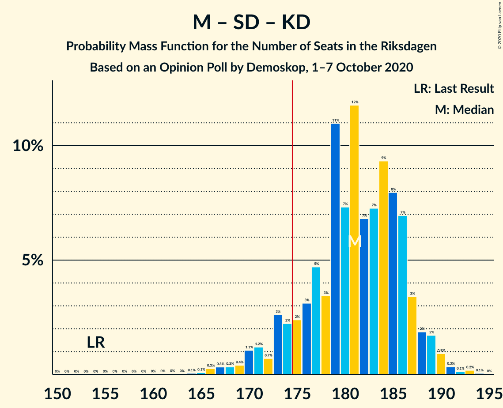
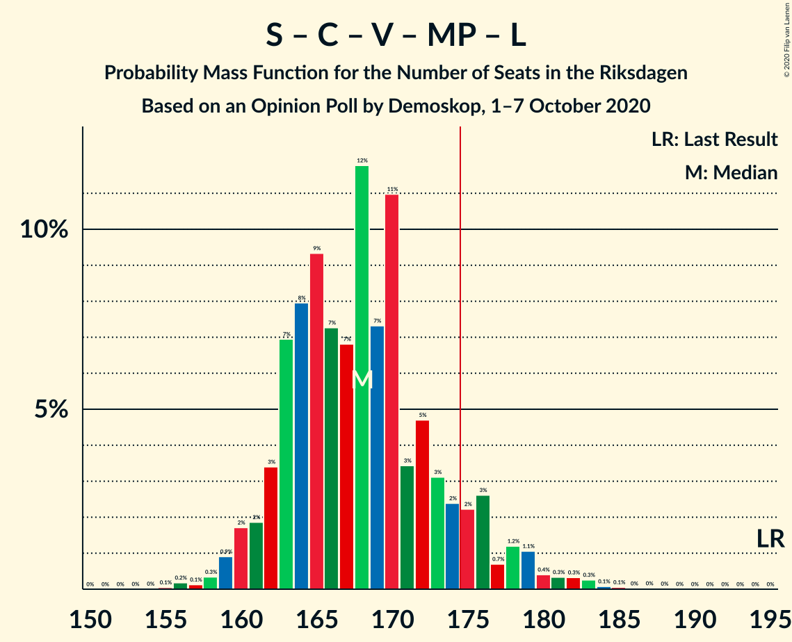
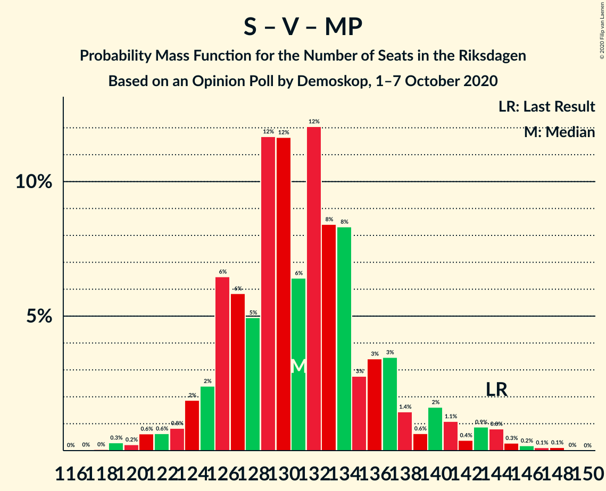

# Opinion Poll by Demoskop, 1–7 October 2020

<a href="#voting-intentions">Voting Intentions</a> | <a href="#seats">Seats</a> | <a href="#coalitions">Coalitions</a> | <a href="#technical-information">Technical Information</a>

## Voting Intentions

### Confidence Intervals

| Party | Last Result | Poll Result | 80% Confidence Interval | 90% Confidence Interval | 95% Confidence Interval | 99% Confidence Interval |
|:-----:|:-----------:|:-----------:|:-----------------------:|:-----------------------:|:-----------------------:|:-----------------------:|
| Sveriges socialdemokratiska arbetareparti | 28.3% | 25.0% | 23.9–26.1% |23.6–26.4% |23.4–26.7% |22.9–27.2% |
| Moderata samlingspartiet | 19.8% | 21.1% | 20.1–22.1% |19.8–22.4% |19.6–22.7% |19.1–23.2% |
| Sverigedemokraterna | 17.5% | 19.9% | 18.9–20.9% |18.7–21.2% |18.4–21.5% |18.0–21.9% |
| Centerpartiet | 8.6% | 9.4% | 8.7–10.2% |8.5–10.4% |8.4–10.6% |8.0–10.9% |
| Vänsterpartiet | 8.0% | 9.2% | 8.5–9.9% |8.3–10.2% |8.2–10.3% |7.8–10.7% |
| Kristdemokraterna | 6.3% | 6.7% | 6.1–7.3% |5.9–7.5% |5.8–7.7% |5.5–8.0% |
| Miljöpartiet de gröna | 4.4% | 3.5% | 3.1–4.0% |3.0–4.1% |2.9–4.3% |2.7–4.5% |
| Liberalerna | 5.5% | 3.4% | 3.0–3.9% |2.9–4.1% |2.8–4.2% |2.6–4.4% |

*Note:* The poll result column reflects the actual value used in the calculations. Published results may vary slightly, and in addition be rounded to fewer digits.

## Seats

### Confidence Intervals

| Party | Last Result | Median | 80% Confidence Interval | 90% Confidence Interval | 95% Confidence Interval | 99% Confidence Interval |
|:-----:|:-----------:|:------:|:-----------------------:|:-----------------------:|:-----------------------:|:-----------------------:|
| <a href="#sveriges-socialdemokratiska-arbetareparti">Sveriges socialdemokratiska arbetareparti</a> | 100 | 95 | 90–99 |89–100 |88–101 |86–104 |
| <a href="#moderata-samlingspartiet">Moderata samlingspartiet</a> | 70 | 80 | 76–84 |75–85 |74–86 |71–88 |
| <a href="#sverigedemokraterna">Sverigedemokraterna</a> | 62 | 76 | 72–80 |70–81 |69–82 |68–84 |
| <a href="#centerpartiet">Centerpartiet</a> | 31 | 36 | 33–39 |32–39 |32–40 |30–42 |
| <a href="#vänsterpartiet">Vänsterpartiet</a> | 28 | 35 | 32–38 |31–39 |31–40 |29–40 |
| <a href="#kristdemokraterna">Kristdemokraterna</a> | 22 | 25 | 23–28 |22–29 |22–29 |21–31 |
| <a href="#miljöpartiet-de-gröna">Miljöpartiet de gröna</a> | 16 | 0 | 0 |0–15 |0–16 |0–17 |
| <a href="#liberalerna">Liberalerna</a> | 20 | 0 | 0 |0–15 |0–15 |0–16 |

### Sveriges socialdemokratiska arbetareparti

*For a full overview of the results for this party, see the [Sveriges socialdemokratiska arbetareparti](party-sverigessocialdemokratiskaarbetareparti.html) page.*

| Number of Seats | Probability | Accumulated | Special Marks |
|:---------------:|:-----------:|:-----------:|:-------------:|
| 83 | 0.1% | 100% |  |
| 84 | 0.1% | 99.9% |  |
| 85 | 0.2% | 99.7% |  |
| 86 | 0.7% | 99.5% |  |
| 87 | 0.8% | 98.9% |  |
| 88 | 2% | 98% |  |
| 89 | 2% | 96% |  |
| 90 | 5% | 94% |  |
| 91 | 5% | 89% |  |
| 92 | 6% | 84% |  |
| 93 | 13% | 78% |  |
| 94 | 9% | 65% |  |
| 95 | 11% | 56% | Median |
| 96 | 13% | 45% |  |
| 97 | 13% | 32% |  |
| 98 | 7% | 19% |  |
| 99 | 5% | 12% |  |
| 100 | 3% | 7% | Last Result |
| 101 | 2% | 4% |  |
| 102 | 0.9% | 2% |  |
| 103 | 0.6% | 1.2% |  |
| 104 | 0.3% | 0.5% |  |
| 105 | 0.2% | 0.2% |  |
| 106 | 0% | 0% |  |

### Moderata samlingspartiet

*For a full overview of the results for this party, see the [Moderata samlingspartiet](party-moderatasamlingspartiet.html) page.*

| Number of Seats | Probability | Accumulated | Special Marks |
|:---------------:|:-----------:|:-----------:|:-------------:|
| 69 | 0% | 100% |  |
| 70 | 0.2% | 99.9% | Last Result |
| 71 | 0.2% | 99.7% |  |
| 72 | 0.6% | 99.5% |  |
| 73 | 1.3% | 98.9% |  |
| 74 | 2% | 98% |  |
| 75 | 5% | 96% |  |
| 76 | 6% | 91% |  |
| 77 | 6% | 85% |  |
| 78 | 15% | 79% |  |
| 79 | 5% | 64% |  |
| 80 | 11% | 59% | Median |
| 81 | 15% | 49% |  |
| 82 | 11% | 34% |  |
| 83 | 5% | 22% |  |
| 84 | 10% | 17% |  |
| 85 | 3% | 7% |  |
| 86 | 3% | 4% |  |
| 87 | 0.8% | 2% |  |
| 88 | 0.4% | 0.7% |  |
| 89 | 0.3% | 0.4% |  |
| 90 | 0.1% | 0.1% |  |
| 91 | 0% | 0% |  |

### Sverigedemokraterna

*For a full overview of the results for this party, see the [Sverigedemokraterna](party-sverigedemokraterna.html) page.*

| Number of Seats | Probability | Accumulated | Special Marks |
|:---------------:|:-----------:|:-----------:|:-------------:|
| 62 | 0% | 100% | Last Result |
| 63 | 0% | 100% |  |
| 64 | 0% | 100% |  |
| 65 | 0.1% | 100% |  |
| 66 | 0.1% | 99.9% |  |
| 67 | 0.2% | 99.8% |  |
| 68 | 1.2% | 99.6% |  |
| 69 | 2% | 98% |  |
| 70 | 2% | 97% |  |
| 71 | 3% | 94% |  |
| 72 | 6% | 92% |  |
| 73 | 11% | 86% |  |
| 74 | 10% | 74% |  |
| 75 | 9% | 65% |  |
| 76 | 24% | 55% | Median |
| 77 | 7% | 32% |  |
| 78 | 7% | 24% |  |
| 79 | 6% | 17% |  |
| 80 | 4% | 11% |  |
| 81 | 3% | 6% |  |
| 82 | 2% | 3% |  |
| 83 | 0.5% | 1.0% |  |
| 84 | 0.3% | 0.5% |  |
| 85 | 0.1% | 0.2% |  |
| 86 | 0.1% | 0.1% |  |
| 87 | 0% | 0% |  |

### Centerpartiet

*For a full overview of the results for this party, see the [Centerpartiet](party-centerpartiet.html) page.*

| Number of Seats | Probability | Accumulated | Special Marks |
|:---------------:|:-----------:|:-----------:|:-------------:|
| 29 | 0.1% | 100% |  |
| 30 | 0.4% | 99.8% |  |
| 31 | 1.4% | 99.4% | Last Result |
| 32 | 6% | 98% |  |
| 33 | 7% | 92% |  |
| 34 | 11% | 86% |  |
| 35 | 21% | 74% |  |
| 36 | 15% | 54% | Median |
| 37 | 14% | 39% |  |
| 38 | 13% | 25% |  |
| 39 | 8% | 12% |  |
| 40 | 2% | 4% |  |
| 41 | 0.9% | 2% |  |
| 42 | 0.4% | 0.6% |  |
| 43 | 0.1% | 0.2% |  |
| 44 | 0% | 0% |  |

### Vänsterpartiet

*For a full overview of the results for this party, see the [Vänsterpartiet](party-vänsterpartiet.html) page.*

| Number of Seats | Probability | Accumulated | Special Marks |
|:---------------:|:-----------:|:-----------:|:-------------:|
| 28 | 0.1% | 100% | Last Result |
| 29 | 0.5% | 99.9% |  |
| 30 | 1.4% | 99.4% |  |
| 31 | 5% | 98% |  |
| 32 | 7% | 94% |  |
| 33 | 14% | 86% |  |
| 34 | 12% | 72% |  |
| 35 | 17% | 60% | Median |
| 36 | 17% | 43% |  |
| 37 | 11% | 26% |  |
| 38 | 10% | 15% |  |
| 39 | 3% | 5% |  |
| 40 | 2% | 3% |  |
| 41 | 0.3% | 0.5% |  |
| 42 | 0.1% | 0.2% |  |
| 43 | 0% | 0% |  |

### Kristdemokraterna

*For a full overview of the results for this party, see the [Kristdemokraterna](party-kristdemokraterna.html) page.*

| Number of Seats | Probability | Accumulated | Special Marks |
|:---------------:|:-----------:|:-----------:|:-------------:|
| 20 | 0.2% | 100% |  |
| 21 | 0.9% | 99.7% |  |
| 22 | 4% | 98.8% | Last Result |
| 23 | 10% | 95% |  |
| 24 | 15% | 85% |  |
| 25 | 25% | 70% | Median |
| 26 | 21% | 45% |  |
| 27 | 10% | 24% |  |
| 28 | 8% | 14% |  |
| 29 | 5% | 7% |  |
| 30 | 0.9% | 1.4% |  |
| 31 | 0.4% | 0.5% |  |
| 32 | 0.1% | 0.1% |  |
| 33 | 0% | 0% |  |

### Miljöpartiet de gröna

*For a full overview of the results for this party, see the [Miljöpartiet de gröna](party-miljöpartietdegröna.html) page.*

| Number of Seats | Probability | Accumulated | Special Marks |
|:---------------:|:-----------:|:-----------:|:-------------:|
| 0 | 91% | 100% | Median |
| 1 | 0% | 9% |  |
| 2 | 0% | 9% |  |
| 3 | 0% | 9% |  |
| 4 | 0% | 9% |  |
| 5 | 0% | 9% |  |
| 6 | 0% | 9% |  |
| 7 | 0% | 9% |  |
| 8 | 0% | 9% |  |
| 9 | 0% | 9% |  |
| 10 | 0% | 9% |  |
| 11 | 0% | 9% |  |
| 12 | 0% | 9% |  |
| 13 | 0% | 9% |  |
| 14 | 0.1% | 9% |  |
| 15 | 6% | 9% |  |
| 16 | 2% | 3% | Last Result |
| 17 | 0.5% | 0.5% |  |
| 18 | 0.1% | 0.1% |  |
| 19 | 0% | 0% |  |

### Liberalerna

*For a full overview of the results for this party, see the [Liberalerna](party-liberalerna.html) page.*

| Number of Seats | Probability | Accumulated | Special Marks |
|:---------------:|:-----------:|:-----------:|:-------------:|
| 0 | 94% | 100% | Median |
| 1 | 0% | 6% |  |
| 2 | 0% | 6% |  |
| 3 | 0% | 6% |  |
| 4 | 0% | 6% |  |
| 5 | 0% | 6% |  |
| 6 | 0% | 6% |  |
| 7 | 0% | 6% |  |
| 8 | 0% | 6% |  |
| 9 | 0% | 6% |  |
| 10 | 0% | 6% |  |
| 11 | 0% | 6% |  |
| 12 | 0% | 6% |  |
| 13 | 0% | 6% |  |
| 14 | 0.1% | 6% |  |
| 15 | 4% | 6% |  |
| 16 | 1.5% | 2% |  |
| 17 | 0.2% | 0.2% |  |
| 18 | 0% | 0% |  |
| 19 | 0% | 0% |  |
| 20 | 0% | 0% | Last Result |

## Coalitions

### Confidence Intervals

| Coalition | Last Result | Median | Majority? | 80% Confidence Interval | 90% Confidence Interval | 95% Confidence Interval | 99% Confidence Interval |
|:---------:|:-----------:|:------:|:---------:|:-----------------------:|:-----------------------:|:-----------------------:|:-----------------------:|
| Sveriges socialdemokratiska arbetareparti – Moderata samlingspartiet – Centerpartiet | 201 | 212 | 100% | 204–216 | 201–217 | 200–219 | 195–220 |
| Moderata samlingspartiet – Sverigedemokraterna – Kristdemokraterna | 154 | 181 | 91% | 175–186 | 173–188 | 170–189 | 167–191 |
| Sveriges socialdemokratiska arbetareparti – Moderata samlingspartiet | 170 | 175 | 62% | 169–180 | 166–181 | 165–183 | 161–185 |
| Sveriges socialdemokratiska arbetareparti – Centerpartiet – Vänsterpartiet – Miljöpartiet de gröna – Liberalerna | 195 | 168 | 9% | 163–174 | 161–176 | 160–179 | 158–182 |
| Moderata samlingspartiet – Sverigedemokraterna | 132 | 156 | 0% | 150–161 | 148–162 | 146–163 | 143–165 |
| Moderata samlingspartiet – Centerpartiet – Kristdemokraterna – Liberalerna | 143 | 142 | 0% | 137–147 | 135–149 | 133–152 | 130–155 |
| Moderata samlingspartiet – Centerpartiet – Kristdemokraterna | 123 | 142 | 0% | 136–147 | 134–147 | 132–149 | 130–151 |
| Sveriges socialdemokratiska arbetareparti – Centerpartiet – Miljöpartiet de gröna – Liberalerna | 167 | 132 | 0% | 128–140 | 126–142 | 125–144 | 123–148 |
| Sveriges socialdemokratiska arbetareparti – Vänsterpartiet – Miljöpartiet de gröna | 144 | 131 | 0% | 126–137 | 125–140 | 123–142 | 120–145 |
| Sveriges socialdemokratiska arbetareparti – Vänsterpartiet | 128 | 130 | 0% | 125–134 | 122–136 | 121–137 | 119–139 |
| Moderata samlingspartiet – Centerpartiet – Liberalerna | 121 | 117 | 0% | 112–122 | 110–124 | 109–127 | 107–131 |
| Moderata samlingspartiet – Centerpartiet | 101 | 116 | 0% | 111–121 | 109–122 | 108–123 | 106–125 |
| Sveriges socialdemokratiska arbetareparti – Miljöpartiet de gröna | 116 | 96 | 0% | 91–102 | 90–106 | 89–108 | 87–111 |

### Sveriges socialdemokratiska arbetareparti – Moderata samlingspartiet – Centerpartiet

| Number of Seats | Probability | Accumulated | Special Marks |
|:---------------:|:-----------:|:-----------:|:-------------:|
| 191 | 0% | 100% |  |
| 192 | 0% | 99.9% |  |
| 193 | 0.1% | 99.9% |  |
| 194 | 0.2% | 99.8% |  |
| 195 | 0.3% | 99.7% |  |
| 196 | 0.2% | 99.4% |  |
| 197 | 0.4% | 99.2% |  |
| 198 | 0.5% | 98.8% |  |
| 199 | 0.8% | 98% |  |
| 200 | 2% | 98% |  |
| 201 | 2% | 96% | Last Result |
| 202 | 2% | 94% |  |
| 203 | 2% | 92% |  |
| 204 | 2% | 90% |  |
| 205 | 3% | 89% |  |
| 206 | 3% | 86% |  |
| 207 | 6% | 83% |  |
| 208 | 3% | 77% |  |
| 209 | 6% | 74% |  |
| 210 | 5% | 68% |  |
| 211 | 8% | 62% | Median |
| 212 | 13% | 54% |  |
| 213 | 15% | 41% |  |
| 214 | 7% | 27% |  |
| 215 | 8% | 20% |  |
| 216 | 5% | 12% |  |
| 217 | 3% | 7% |  |
| 218 | 2% | 5% |  |
| 219 | 1.2% | 3% |  |
| 220 | 1.0% | 1.4% |  |
| 221 | 0.3% | 0.5% |  |
| 222 | 0.1% | 0.2% |  |
| 223 | 0% | 0.1% |  |
| 224 | 0% | 0% |  |

### Moderata samlingspartiet – Sverigedemokraterna – Kristdemokraterna

| Number of Seats | Probability | Accumulated | Special Marks |
|:---------------:|:-----------:|:-----------:|:-------------:|
| 154 | 0% | 100% | Last Result |
| 155 | 0% | 100% |  |
| 156 | 0% | 100% |  |
| 157 | 0% | 100% |  |
| 158 | 0% | 100% |  |
| 159 | 0% | 100% |  |
| 160 | 0% | 100% |  |
| 161 | 0% | 100% |  |
| 162 | 0% | 100% |  |
| 163 | 0% | 100% |  |
| 164 | 0.1% | 99.9% |  |
| 165 | 0.1% | 99.9% |  |
| 166 | 0.3% | 99.8% |  |
| 167 | 0.3% | 99.5% |  |
| 168 | 0.3% | 99.2% |  |
| 169 | 0.4% | 98.9% |  |
| 170 | 1.1% | 98% |  |
| 171 | 1.2% | 97% |  |
| 172 | 0.7% | 96% |  |
| 173 | 3% | 96% |  |
| 174 | 2% | 93% |  |
| 175 | 2% | 91% | Majority |
| 176 | 3% | 88% |  |
| 177 | 5% | 85% |  |
| 178 | 3% | 80% |  |
| 179 | 11% | 77% |  |
| 180 | 7% | 66% |  |
| 181 | 12% | 59% | Median |
| 182 | 7% | 47% |  |
| 183 | 7% | 40% |  |
| 184 | 9% | 33% |  |
| 185 | 8% | 24% |  |
| 186 | 7% | 16% |  |
| 187 | 3% | 9% |  |
| 188 | 2% | 5% |  |
| 189 | 2% | 3% |  |
| 190 | 0.9% | 2% |  |
| 191 | 0.3% | 0.7% |  |
| 192 | 0.1% | 0.4% |  |
| 193 | 0.2% | 0.3% |  |
| 194 | 0.1% | 0.1% |  |
| 195 | 0% | 0% |  |

### Sveriges socialdemokratiska arbetareparti – Moderata samlingspartiet

| Number of Seats | Probability | Accumulated | Special Marks |
|:---------------:|:-----------:|:-----------:|:-------------:|
| 158 | 0% | 100% |  |
| 159 | 0.1% | 99.9% |  |
| 160 | 0.1% | 99.9% |  |
| 161 | 0.3% | 99.8% |  |
| 162 | 0.5% | 99.5% |  |
| 163 | 0.5% | 99.0% |  |
| 164 | 0.6% | 98.5% |  |
| 165 | 1.2% | 98% |  |
| 166 | 3% | 97% |  |
| 167 | 2% | 94% |  |
| 168 | 2% | 92% |  |
| 169 | 3% | 90% |  |
| 170 | 3% | 87% | Last Result |
| 171 | 5% | 84% |  |
| 172 | 6% | 79% |  |
| 173 | 5% | 73% |  |
| 174 | 6% | 68% |  |
| 175 | 12% | 62% | Median, Majority |
| 176 | 12% | 50% |  |
| 177 | 11% | 38% |  |
| 178 | 7% | 27% |  |
| 179 | 6% | 20% |  |
| 180 | 7% | 14% |  |
| 181 | 3% | 7% |  |
| 182 | 2% | 4% |  |
| 183 | 1.0% | 3% |  |
| 184 | 1.0% | 2% |  |
| 185 | 0.4% | 0.6% |  |
| 186 | 0.1% | 0.2% |  |
| 187 | 0.1% | 0.1% |  |
| 188 | 0% | 0% |  |

### Sveriges socialdemokratiska arbetareparti – Centerpartiet – Vänsterpartiet – Miljöpartiet de gröna – Liberalerna

| Number of Seats | Probability | Accumulated | Special Marks |
|:---------------:|:-----------:|:-----------:|:-------------:|
| 155 | 0.1% | 100% |  |
| 156 | 0.2% | 99.9% |  |
| 157 | 0.1% | 99.7% |  |
| 158 | 0.3% | 99.6% |  |
| 159 | 0.9% | 99.3% |  |
| 160 | 2% | 98% |  |
| 161 | 2% | 97% |  |
| 162 | 3% | 95% |  |
| 163 | 7% | 91% |  |
| 164 | 8% | 84% |  |
| 165 | 9% | 76% |  |
| 166 | 7% | 67% | Median |
| 167 | 7% | 60% |  |
| 168 | 12% | 53% |  |
| 169 | 7% | 41% |  |
| 170 | 11% | 34% |  |
| 171 | 3% | 23% |  |
| 172 | 5% | 20% |  |
| 173 | 3% | 15% |  |
| 174 | 2% | 12% |  |
| 175 | 2% | 9% | Majority |
| 176 | 3% | 7% |  |
| 177 | 0.7% | 4% |  |
| 178 | 1.2% | 4% |  |
| 179 | 1.1% | 3% |  |
| 180 | 0.4% | 2% |  |
| 181 | 0.3% | 1.1% |  |
| 182 | 0.3% | 0.8% |  |
| 183 | 0.3% | 0.5% |  |
| 184 | 0.1% | 0.2% |  |
| 185 | 0.1% | 0.1% |  |
| 186 | 0% | 0.1% |  |
| 187 | 0% | 0% |  |
| 188 | 0% | 0% |  |
| 189 | 0% | 0% |  |
| 190 | 0% | 0% |  |
| 191 | 0% | 0% |  |
| 192 | 0% | 0% |  |
| 193 | 0% | 0% |  |
| 194 | 0% | 0% |  |
| 195 | 0% | 0% | Last Result |

### Moderata samlingspartiet – Sverigedemokraterna

| Number of Seats | Probability | Accumulated | Special Marks |
|:---------------:|:-----------:|:-----------:|:-------------:|
| 132 | 0% | 100% | Last Result |
| 133 | 0% | 100% |  |
| 134 | 0% | 100% |  |
| 135 | 0% | 100% |  |
| 136 | 0% | 100% |  |
| 137 | 0% | 100% |  |
| 138 | 0% | 100% |  |
| 139 | 0% | 100% |  |
| 140 | 0% | 99.9% |  |
| 141 | 0.1% | 99.9% |  |
| 142 | 0.3% | 99.8% |  |
| 143 | 0.3% | 99.5% |  |
| 144 | 0.5% | 99.2% |  |
| 145 | 0.8% | 98.8% |  |
| 146 | 0.9% | 98% |  |
| 147 | 2% | 97% |  |
| 148 | 2% | 95% |  |
| 149 | 3% | 93% |  |
| 150 | 3% | 90% |  |
| 151 | 4% | 87% |  |
| 152 | 4% | 83% |  |
| 153 | 4% | 79% |  |
| 154 | 15% | 75% |  |
| 155 | 6% | 60% |  |
| 156 | 11% | 54% | Median |
| 157 | 11% | 44% |  |
| 158 | 5% | 33% |  |
| 159 | 7% | 28% |  |
| 160 | 9% | 21% |  |
| 161 | 5% | 11% |  |
| 162 | 3% | 7% |  |
| 163 | 1.3% | 3% |  |
| 164 | 1.0% | 2% |  |
| 165 | 0.7% | 1.1% |  |
| 166 | 0.2% | 0.5% |  |
| 167 | 0.2% | 0.2% |  |
| 168 | 0% | 0.1% |  |
| 169 | 0% | 0% |  |

### Moderata samlingspartiet – Centerpartiet – Kristdemokraterna – Liberalerna

| Number of Seats | Probability | Accumulated | Special Marks |
|:---------------:|:-----------:|:-----------:|:-------------:|
| 128 | 0.1% | 100% |  |
| 129 | 0.1% | 99.9% |  |
| 130 | 0.4% | 99.8% |  |
| 131 | 0.3% | 99.5% |  |
| 132 | 0.4% | 99.2% |  |
| 133 | 1.4% | 98.8% |  |
| 134 | 1.3% | 97% |  |
| 135 | 1.1% | 96% |  |
| 136 | 2% | 95% |  |
| 137 | 5% | 93% |  |
| 138 | 3% | 88% |  |
| 139 | 11% | 84% |  |
| 140 | 5% | 73% |  |
| 141 | 13% | 69% | Median |
| 142 | 12% | 56% |  |
| 143 | 10% | 44% | Last Result |
| 144 | 9% | 35% |  |
| 145 | 5% | 26% |  |
| 146 | 5% | 21% |  |
| 147 | 7% | 16% |  |
| 148 | 2% | 9% |  |
| 149 | 2% | 7% |  |
| 150 | 1.2% | 5% |  |
| 151 | 0.9% | 4% |  |
| 152 | 0.9% | 3% |  |
| 153 | 0.3% | 2% |  |
| 154 | 0.3% | 1.5% |  |
| 155 | 0.8% | 1.1% |  |
| 156 | 0.1% | 0.4% |  |
| 157 | 0.1% | 0.2% |  |
| 158 | 0% | 0.2% |  |
| 159 | 0% | 0.1% |  |
| 160 | 0.1% | 0.1% |  |
| 161 | 0% | 0% |  |

### Moderata samlingspartiet – Centerpartiet – Kristdemokraterna

| Number of Seats | Probability | Accumulated | Special Marks |
|:---------------:|:-----------:|:-----------:|:-------------:|
| 123 | 0% | 100% | Last Result |
| 124 | 0% | 100% |  |
| 125 | 0% | 100% |  |
| 126 | 0% | 100% |  |
| 127 | 0.1% | 99.9% |  |
| 128 | 0.1% | 99.8% |  |
| 129 | 0.1% | 99.7% |  |
| 130 | 0.5% | 99.6% |  |
| 131 | 0.6% | 99.1% |  |
| 132 | 1.5% | 98% |  |
| 133 | 2% | 97% |  |
| 134 | 2% | 95% |  |
| 135 | 1.4% | 93% |  |
| 136 | 2% | 92% |  |
| 137 | 6% | 89% |  |
| 138 | 4% | 83% |  |
| 139 | 11% | 80% |  |
| 140 | 5% | 68% |  |
| 141 | 13% | 63% | Median |
| 142 | 12% | 50% |  |
| 143 | 10% | 39% |  |
| 144 | 9% | 29% |  |
| 145 | 5% | 20% |  |
| 146 | 5% | 16% |  |
| 147 | 6% | 10% |  |
| 148 | 2% | 5% |  |
| 149 | 2% | 3% |  |
| 150 | 0.6% | 1.4% |  |
| 151 | 0.4% | 0.8% |  |
| 152 | 0.2% | 0.3% |  |
| 153 | 0.1% | 0.1% |  |
| 154 | 0% | 0.1% |  |
| 155 | 0% | 0% |  |

### Sveriges socialdemokratiska arbetareparti – Centerpartiet – Miljöpartiet de gröna – Liberalerna

| Number of Seats | Probability | Accumulated | Special Marks |
|:---------------:|:-----------:|:-----------:|:-------------:|
| 121 | 0.1% | 100% |  |
| 122 | 0.2% | 99.9% |  |
| 123 | 0.4% | 99.6% |  |
| 124 | 1.0% | 99.2% |  |
| 125 | 3% | 98% |  |
| 126 | 2% | 96% |  |
| 127 | 3% | 94% |  |
| 128 | 4% | 91% |  |
| 129 | 6% | 86% |  |
| 130 | 13% | 80% |  |
| 131 | 13% | 67% | Median |
| 132 | 9% | 55% |  |
| 133 | 8% | 46% |  |
| 134 | 7% | 38% |  |
| 135 | 8% | 31% |  |
| 136 | 3% | 23% |  |
| 137 | 3% | 20% |  |
| 138 | 3% | 17% |  |
| 139 | 2% | 14% |  |
| 140 | 3% | 11% |  |
| 141 | 1.5% | 9% |  |
| 142 | 3% | 7% |  |
| 143 | 1.2% | 4% |  |
| 144 | 0.8% | 3% |  |
| 145 | 0.4% | 2% |  |
| 146 | 0.8% | 2% |  |
| 147 | 0.4% | 1.2% |  |
| 148 | 0.2% | 0.7% |  |
| 149 | 0.1% | 0.5% |  |
| 150 | 0.1% | 0.4% |  |
| 151 | 0% | 0.2% |  |
| 152 | 0.1% | 0.2% |  |
| 153 | 0.1% | 0.1% |  |
| 154 | 0% | 0% |  |
| 155 | 0% | 0% |  |
| 156 | 0% | 0% |  |
| 157 | 0% | 0% |  |
| 158 | 0% | 0% |  |
| 159 | 0% | 0% |  |
| 160 | 0% | 0% |  |
| 161 | 0% | 0% |  |
| 162 | 0% | 0% |  |
| 163 | 0% | 0% |  |
| 164 | 0% | 0% |  |
| 165 | 0% | 0% |  |
| 166 | 0% | 0% |  |
| 167 | 0% | 0% | Last Result |

### Sveriges socialdemokratiska arbetareparti – Vänsterpartiet – Miljöpartiet de gröna

| Number of Seats | Probability | Accumulated | Special Marks |
|:---------------:|:-----------:|:-----------:|:-------------:|
| 117 | 0% | 100% |  |
| 118 | 0% | 99.9% |  |
| 119 | 0.3% | 99.9% |  |
| 120 | 0.2% | 99.6% |  |
| 121 | 0.6% | 99.4% |  |
| 122 | 0.6% | 98.7% |  |
| 123 | 0.8% | 98% |  |
| 124 | 2% | 97% |  |
| 125 | 2% | 95% |  |
| 126 | 6% | 93% |  |
| 127 | 6% | 87% |  |
| 128 | 5% | 81% |  |
| 129 | 12% | 76% |  |
| 130 | 12% | 64% | Median |
| 131 | 6% | 52% |  |
| 132 | 12% | 46% |  |
| 133 | 8% | 34% |  |
| 134 | 8% | 26% |  |
| 135 | 3% | 17% |  |
| 136 | 3% | 14% |  |
| 137 | 3% | 11% |  |
| 138 | 1.4% | 8% |  |
| 139 | 0.6% | 6% |  |
| 140 | 2% | 6% |  |
| 141 | 1.1% | 4% |  |
| 142 | 0.4% | 3% |  |
| 143 | 0.9% | 2% |  |
| 144 | 0.8% | 2% | Last Result |
| 145 | 0.3% | 0.7% |  |
| 146 | 0.2% | 0.5% |  |
| 147 | 0.1% | 0.3% |  |
| 148 | 0.1% | 0.2% |  |
| 149 | 0% | 0% |  |

### Sveriges socialdemokratiska arbetareparti – Vänsterpartiet

| Number of Seats | Probability | Accumulated | Special Marks |
|:---------------:|:-----------:|:-----------:|:-------------:|
| 115 | 0% | 100% |  |
| 116 | 0.1% | 99.9% |  |
| 117 | 0.1% | 99.9% |  |
| 118 | 0.3% | 99.8% |  |
| 119 | 0.5% | 99.5% |  |
| 120 | 0.5% | 99.0% |  |
| 121 | 2% | 98.5% |  |
| 122 | 2% | 97% |  |
| 123 | 1.3% | 95% |  |
| 124 | 2% | 93% |  |
| 125 | 4% | 91% |  |
| 126 | 7% | 87% |  |
| 127 | 7% | 80% |  |
| 128 | 5% | 74% | Last Result |
| 129 | 12% | 68% |  |
| 130 | 12% | 56% | Median |
| 131 | 7% | 44% |  |
| 132 | 12% | 37% |  |
| 133 | 8% | 25% |  |
| 134 | 8% | 17% |  |
| 135 | 2% | 9% |  |
| 136 | 3% | 6% |  |
| 137 | 2% | 4% |  |
| 138 | 1.1% | 2% |  |
| 139 | 0.3% | 0.8% |  |
| 140 | 0.3% | 0.5% |  |
| 141 | 0.1% | 0.2% |  |
| 142 | 0% | 0.1% |  |
| 143 | 0% | 0% |  |

### Moderata samlingspartiet – Centerpartiet – Liberalerna

| Number of Seats | Probability | Accumulated | Special Marks |
|:---------------:|:-----------:|:-----------:|:-------------:|
| 104 | 0.1% | 100% |  |
| 105 | 0.1% | 99.9% |  |
| 106 | 0.2% | 99.8% |  |
| 107 | 0.8% | 99.6% |  |
| 108 | 1.0% | 98.8% |  |
| 109 | 1.0% | 98% |  |
| 110 | 2% | 97% |  |
| 111 | 3% | 94% |  |
| 112 | 4% | 91% |  |
| 113 | 7% | 87% |  |
| 114 | 8% | 80% |  |
| 115 | 9% | 72% |  |
| 116 | 12% | 62% | Median |
| 117 | 11% | 50% |  |
| 118 | 7% | 39% |  |
| 119 | 8% | 31% |  |
| 120 | 6% | 23% |  |
| 121 | 5% | 17% | Last Result |
| 122 | 4% | 12% |  |
| 123 | 2% | 8% |  |
| 124 | 2% | 6% |  |
| 125 | 1.1% | 4% |  |
| 126 | 0.7% | 3% |  |
| 127 | 0.5% | 3% |  |
| 128 | 0.6% | 2% |  |
| 129 | 0.5% | 2% |  |
| 130 | 0.4% | 1.1% |  |
| 131 | 0.3% | 0.7% |  |
| 132 | 0.2% | 0.4% |  |
| 133 | 0.1% | 0.2% |  |
| 134 | 0.1% | 0.1% |  |
| 135 | 0% | 0% |  |

### Moderata samlingspartiet – Centerpartiet

| Number of Seats | Probability | Accumulated | Special Marks |
|:---------------:|:-----------:|:-----------:|:-------------:|
| 101 | 0% | 100% | Last Result |
| 102 | 0% | 100% |  |
| 103 | 0.1% | 99.9% |  |
| 104 | 0.1% | 99.9% |  |
| 105 | 0.3% | 99.8% |  |
| 106 | 0.3% | 99.5% |  |
| 107 | 2% | 99.2% |  |
| 108 | 2% | 98% |  |
| 109 | 2% | 96% |  |
| 110 | 3% | 94% |  |
| 111 | 4% | 91% |  |
| 112 | 5% | 88% |  |
| 113 | 8% | 83% |  |
| 114 | 9% | 75% |  |
| 115 | 10% | 67% |  |
| 116 | 13% | 57% | Median |
| 117 | 11% | 44% |  |
| 118 | 7% | 33% |  |
| 119 | 8% | 26% |  |
| 120 | 6% | 18% |  |
| 121 | 5% | 12% |  |
| 122 | 3% | 6% |  |
| 123 | 2% | 4% |  |
| 124 | 0.9% | 2% |  |
| 125 | 0.5% | 0.8% |  |
| 126 | 0.2% | 0.3% |  |
| 127 | 0.1% | 0.1% |  |
| 128 | 0% | 0% |  |

### Sveriges socialdemokratiska arbetareparti – Miljöpartiet de gröna

| Number of Seats | Probability | Accumulated | Special Marks |
|:---------------:|:-----------:|:-----------:|:-------------:|
| 84 | 0% | 100% |  |
| 85 | 0.1% | 99.9% |  |
| 86 | 0.3% | 99.8% |  |
| 87 | 0.6% | 99.5% |  |
| 88 | 0.9% | 98.9% |  |
| 89 | 2% | 98% |  |
| 90 | 4% | 97% |  |
| 91 | 4% | 93% |  |
| 92 | 5% | 89% |  |
| 93 | 12% | 84% |  |
| 94 | 8% | 72% |  |
| 95 | 11% | 64% | Median |
| 96 | 12% | 53% |  |
| 97 | 13% | 41% |  |
| 98 | 7% | 28% |  |
| 99 | 5% | 21% |  |
| 100 | 3% | 16% |  |
| 101 | 2% | 13% |  |
| 102 | 1.2% | 11% |  |
| 103 | 2% | 9% |  |
| 104 | 0.6% | 8% |  |
| 105 | 2% | 7% |  |
| 106 | 1.1% | 5% |  |
| 107 | 0.6% | 4% |  |
| 108 | 2% | 4% |  |
| 109 | 0.7% | 2% |  |
| 110 | 0.4% | 1.4% |  |
| 111 | 0.6% | 1.0% |  |
| 112 | 0.2% | 0.4% |  |
| 113 | 0.1% | 0.2% |  |
| 114 | 0.1% | 0.1% |  |
| 115 | 0% | 0% |  |
| 116 | 0% | 0% | Last Result |

## Technical Information

### Opinion Poll

+ **Polling firm:** Demoskop
+ **Commissioner(s):** —
+ **Fieldwork period:** 1–7 October 2020

### Calculations

+ **Sample size:** 2722
+ **Simulations done:** 1,048,576
+ **Error estimate:** 0.96%

