# Opinion Poll by Novus for SVT, 14 September–11 October 2020

<a href="#voting-intentions">Voting Intentions</a> | <a href="#seats">Seats</a> | <a href="#coalitions">Coalitions</a> | <a href="#technical-information">Technical Information</a>

## Voting Intentions

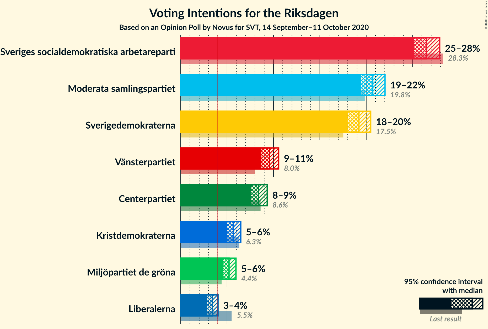

### Confidence Intervals

| Party | Last Result | Poll Result | 80% Confidence Interval | 90% Confidence Interval | 95% Confidence Interval | 99% Confidence Interval |
|:-----:|:-----------:|:-----------:|:-----------------------:|:-----------------------:|:-----------------------:|:-----------------------:|
| Sveriges socialdemokratiska arbetareparti | 28.3% | 26.5% | 25.6–27.4% |25.4–27.7% |25.1–27.9% |24.7–28.4% |
| Moderata samlingspartiet | 19.8% | 20.7% | 19.9–21.6% |19.6–21.8% |19.4–22.0% |19.1–22.4% |
| Sverigedemokraterna | 17.5% | 19.2% | 18.4–20.0% |18.2–20.3% |18.0–20.5% |17.6–20.9% |
| Vänsterpartiet | 8.0% | 9.6% | 9.0–10.2% |8.8–10.4% |8.7–10.6% |8.4–10.9% |
| Centerpartiet | 8.6% | 8.4% | 7.8–9.0% |7.7–9.2% |7.6–9.3% |7.3–9.6% |
| Kristdemokraterna | 6.3% | 5.7% | 5.2–6.2% |5.1–6.4% |5.0–6.5% |4.8–6.7% |
| Miljöpartiet de gröna | 4.4% | 5.2% | 4.8–5.7% |4.6–5.8% |4.5–6.0% |4.3–6.2% |
| Liberalerna | 5.5% | 3.4% | 3.0–3.8% |3.0–3.9% |2.9–4.0% |2.7–4.2% |

*Note:* The poll result column reflects the actual value used in the calculations. Published results may vary slightly, and in addition be rounded to fewer digits.

## Seats

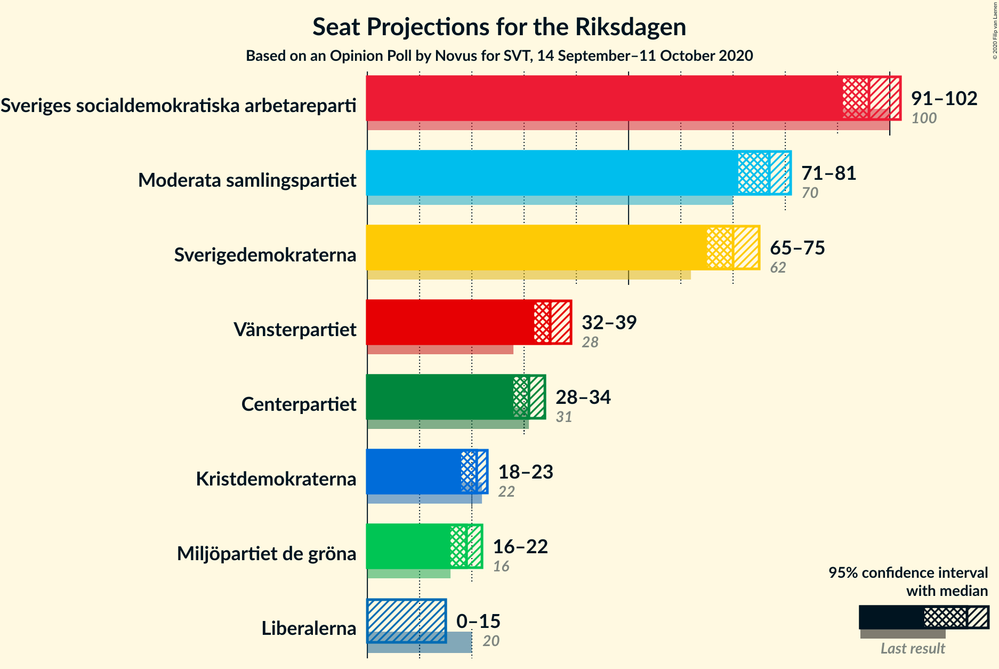

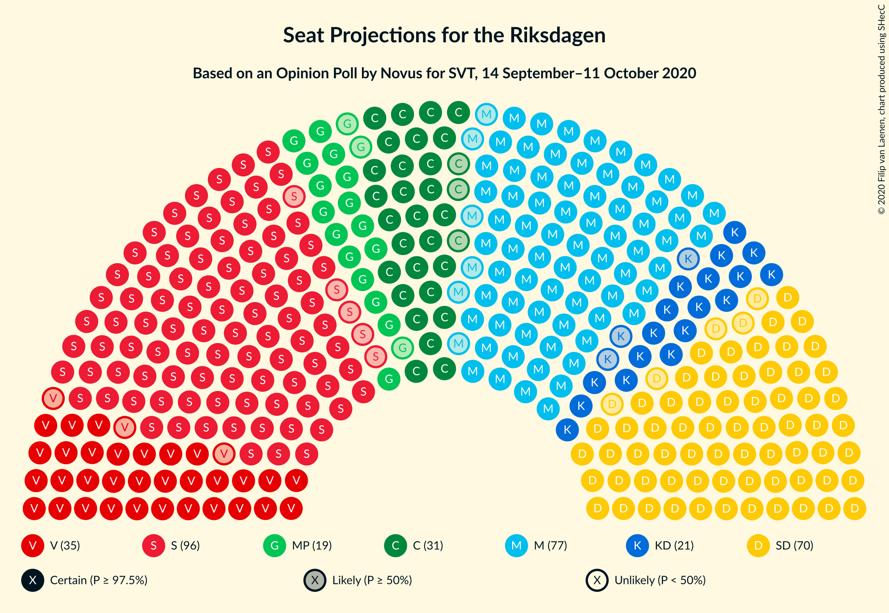

### Confidence Intervals

| Party | Last Result | Median | 80% Confidence Interval | 90% Confidence Interval | 95% Confidence Interval | 99% Confidence Interval |
|:-----:|:-----------:|:------:|:-----------------------:|:-----------------------:|:-----------------------:|:-----------------------:|
| <a href="#sveriges-socialdemokratiska-arbetareparti">Sveriges socialdemokratiska arbetareparti</a> | 100 | 96 | 93–100 |92–101 |91–102 |89–103 |
| <a href="#moderata-samlingspartiet">Moderata samlingspartiet</a> | 70 | 77 | 72–80 |71–80 |71–81 |69–82 |
| <a href="#sverigedemokraterna">Sverigedemokraterna</a> | 62 | 70 | 67–73 |66–74 |65–75 |64–76 |
| <a href="#vänsterpartiet">Vänsterpartiet</a> | 28 | 35 | 33–37 |32–38 |32–39 |31–40 |
| <a href="#centerpartiet">Centerpartiet</a> | 31 | 31 | 29–33 |28–34 |28–34 |27–35 |
| <a href="#kristdemokraterna">Kristdemokraterna</a> | 22 | 21 | 19–23 |19–23 |18–23 |17–25 |
| <a href="#miljöpartiet-de-gröna">Miljöpartiet de gröna</a> | 16 | 19 | 17–21 |17–21 |16–22 |16–22 |
| <a href="#liberalerna">Liberalerna</a> | 20 | 0 | 0 |0–14 |0–15 |0–15 |

### Sveriges socialdemokratiska arbetareparti

*For a full overview of the results for this party, see the [Sveriges socialdemokratiska arbetareparti](party-sverigessocialdemokratiskaarbetareparti.html) page.*

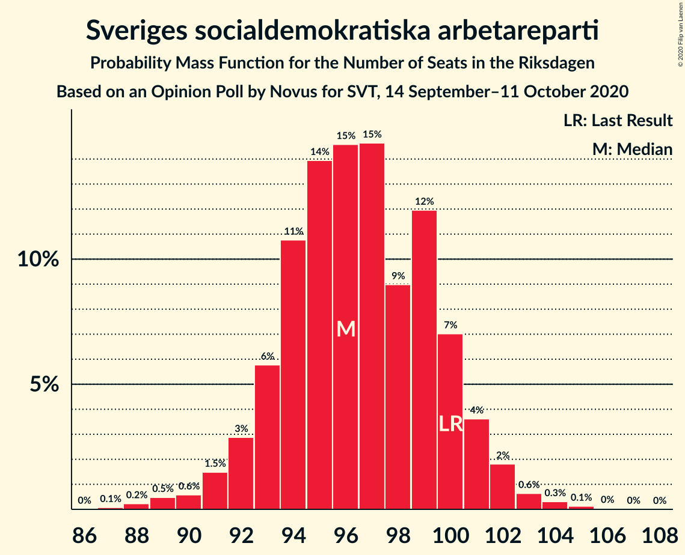

| Number of Seats | Probability | Accumulated | Special Marks |
|:---------------:|:-----------:|:-----------:|:-------------:|
| 87 | 0.1% | 100% |  |
| 88 | 0.2% | 99.9% |  |
| 89 | 0.5% | 99.7% |  |
| 90 | 0.6% | 99.2% |  |
| 91 | 1.5% | 98.6% |  |
| 92 | 3% | 97% |  |
| 93 | 6% | 94% |  |
| 94 | 11% | 88% |  |
| 95 | 14% | 78% |  |
| 96 | 15% | 64% | Median |
| 97 | 15% | 49% |  |
| 98 | 9% | 35% |  |
| 99 | 12% | 26% |  |
| 100 | 7% | 14% | Last Result |
| 101 | 4% | 7% |  |
| 102 | 2% | 3% |  |
| 103 | 0.6% | 1.1% |  |
| 104 | 0.3% | 0.5% |  |
| 105 | 0.1% | 0.2% |  |
| 106 | 0% | 0.1% |  |
| 107 | 0% | 0% |  |

### Moderata samlingspartiet

*For a full overview of the results for this party, see the [Moderata samlingspartiet](party-moderatasamlingspartiet.html) page.*

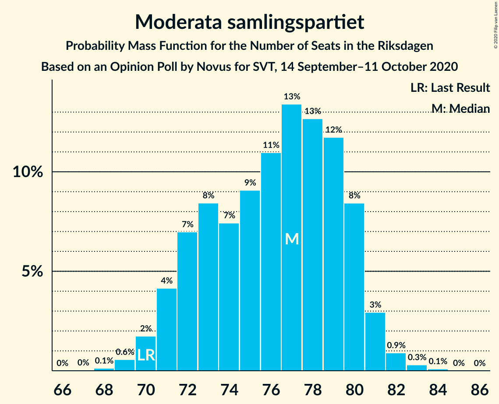

| Number of Seats | Probability | Accumulated | Special Marks |
|:---------------:|:-----------:|:-----------:|:-------------:|
| 68 | 0.1% | 100% |  |
| 69 | 0.6% | 99.8% |  |
| 70 | 2% | 99.3% | Last Result |
| 71 | 4% | 98% |  |
| 72 | 7% | 93% |  |
| 73 | 8% | 86% |  |
| 74 | 7% | 78% |  |
| 75 | 9% | 71% |  |
| 76 | 11% | 61% |  |
| 77 | 13% | 50% | Median |
| 78 | 13% | 37% |  |
| 79 | 12% | 24% |  |
| 80 | 8% | 13% |  |
| 81 | 3% | 4% |  |
| 82 | 0.9% | 1.3% |  |
| 83 | 0.3% | 0.4% |  |
| 84 | 0.1% | 0.1% |  |
| 85 | 0% | 0% |  |

### Sverigedemokraterna

*For a full overview of the results for this party, see the [Sverigedemokraterna](party-sverigedemokraterna.html) page.*

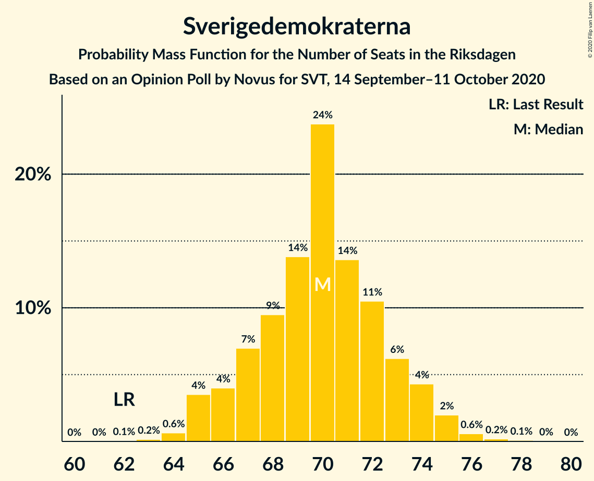

| Number of Seats | Probability | Accumulated | Special Marks |
|:---------------:|:-----------:|:-----------:|:-------------:|
| 62 | 0.1% | 100% | Last Result |
| 63 | 0.2% | 99.9% |  |
| 64 | 0.6% | 99.8% |  |
| 65 | 4% | 99.1% |  |
| 66 | 4% | 96% |  |
| 67 | 7% | 92% |  |
| 68 | 9% | 85% |  |
| 69 | 14% | 75% |  |
| 70 | 24% | 61% | Median |
| 71 | 14% | 38% |  |
| 72 | 11% | 24% |  |
| 73 | 6% | 13% |  |
| 74 | 4% | 7% |  |
| 75 | 2% | 3% |  |
| 76 | 0.6% | 0.9% |  |
| 77 | 0.2% | 0.3% |  |
| 78 | 0.1% | 0.1% |  |
| 79 | 0% | 0% |  |

### Vänsterpartiet

*For a full overview of the results for this party, see the [Vänsterpartiet](party-vänsterpartiet.html) page.*

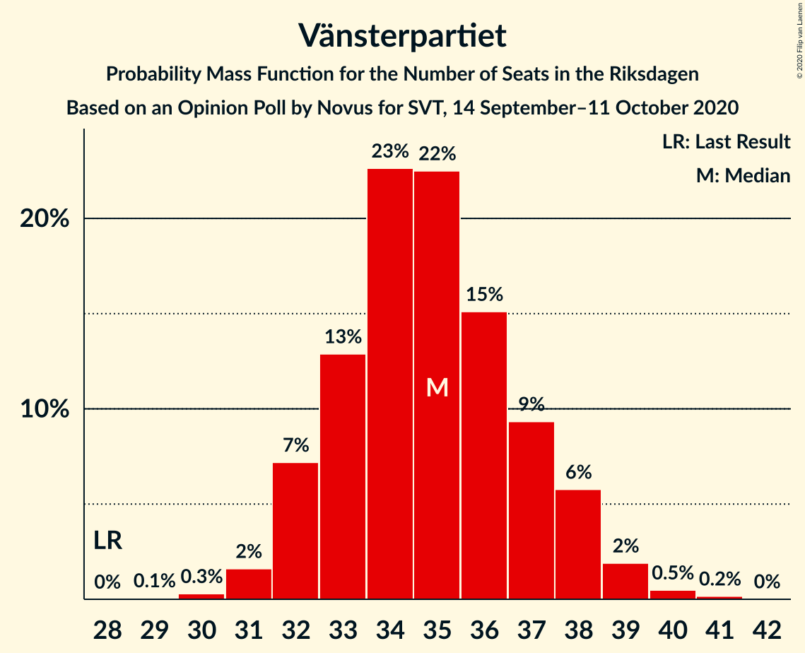

| Number of Seats | Probability | Accumulated | Special Marks |
|:---------------:|:-----------:|:-----------:|:-------------:|
| 28 | 0% | 100% | Last Result |
| 29 | 0.1% | 100% |  |
| 30 | 0.3% | 99.9% |  |
| 31 | 2% | 99.6% |  |
| 32 | 7% | 98% |  |
| 33 | 13% | 91% |  |
| 34 | 23% | 78% |  |
| 35 | 22% | 55% | Median |
| 36 | 15% | 33% |  |
| 37 | 9% | 18% |  |
| 38 | 6% | 8% |  |
| 39 | 2% | 3% |  |
| 40 | 0.5% | 0.7% |  |
| 41 | 0.2% | 0.2% |  |
| 42 | 0% | 0% |  |

### Centerpartiet

*For a full overview of the results for this party, see the [Centerpartiet](party-centerpartiet.html) page.*

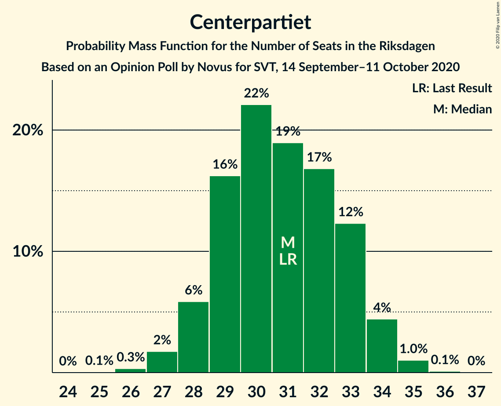

| Number of Seats | Probability | Accumulated | Special Marks |
|:---------------:|:-----------:|:-----------:|:-------------:|
| 25 | 0.1% | 100% |  |
| 26 | 0.3% | 99.9% |  |
| 27 | 2% | 99.6% |  |
| 28 | 6% | 98% |  |
| 29 | 16% | 92% |  |
| 30 | 22% | 76% |  |
| 31 | 19% | 54% | Last Result, Median |
| 32 | 17% | 35% |  |
| 33 | 12% | 18% |  |
| 34 | 4% | 6% |  |
| 35 | 1.0% | 1.2% |  |
| 36 | 0.1% | 0.1% |  |
| 37 | 0% | 0% |  |

### Kristdemokraterna

*For a full overview of the results for this party, see the [Kristdemokraterna](party-kristdemokraterna.html) page.*

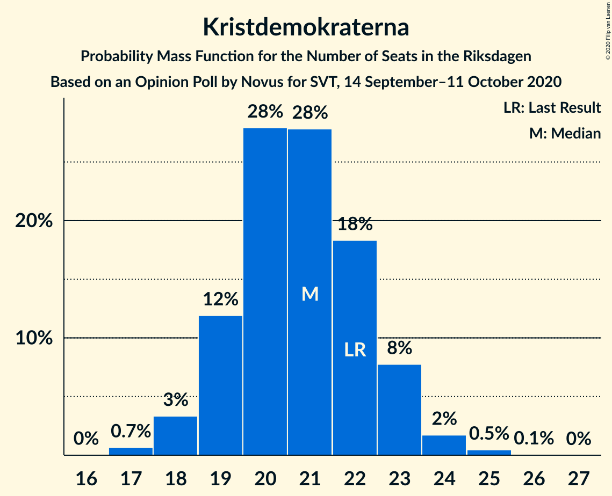

| Number of Seats | Probability | Accumulated | Special Marks |
|:---------------:|:-----------:|:-----------:|:-------------:|
| 17 | 0.7% | 100% |  |
| 18 | 3% | 99.3% |  |
| 19 | 12% | 96% |  |
| 20 | 28% | 84% |  |
| 21 | 28% | 56% | Median |
| 22 | 18% | 28% | Last Result |
| 23 | 8% | 10% |  |
| 24 | 2% | 2% |  |
| 25 | 0.5% | 0.5% |  |
| 26 | 0.1% | 0.1% |  |
| 27 | 0% | 0% |  |

### Miljöpartiet de gröna

*For a full overview of the results for this party, see the [Miljöpartiet de gröna](party-miljöpartietdegröna.html) page.*

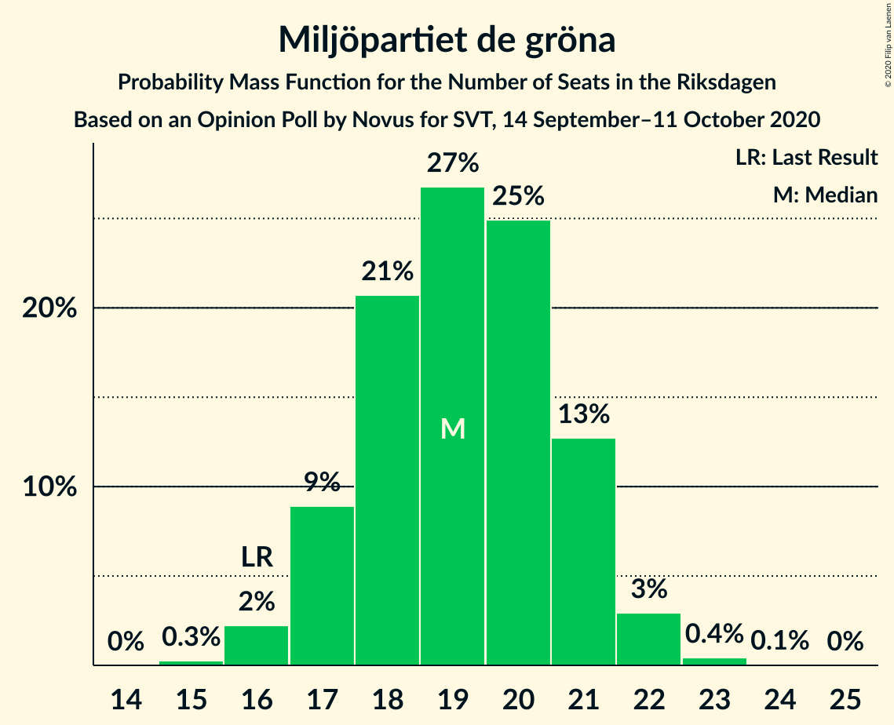

| Number of Seats | Probability | Accumulated | Special Marks |
|:---------------:|:-----------:|:-----------:|:-------------:|
| 15 | 0.3% | 100% |  |
| 16 | 2% | 99.7% | Last Result |
| 17 | 9% | 97% |  |
| 18 | 21% | 89% |  |
| 19 | 27% | 68% | Median |
| 20 | 25% | 41% |  |
| 21 | 13% | 16% |  |
| 22 | 3% | 3% |  |
| 23 | 0.4% | 0.5% |  |
| 24 | 0.1% | 0.1% |  |
| 25 | 0% | 0% |  |

### Liberalerna

*For a full overview of the results for this party, see the [Liberalerna](party-liberalerna.html) page.*

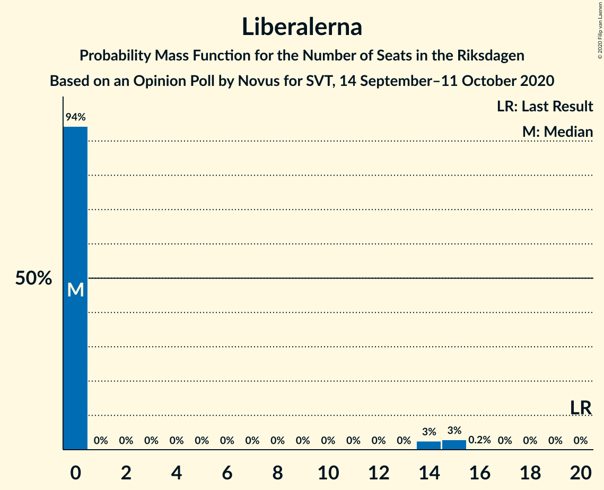

| Number of Seats | Probability | Accumulated | Special Marks |
|:---------------:|:-----------:|:-----------:|:-------------:|
| 0 | 94% | 100% | Median |
| 1 | 0% | 6% |  |
| 2 | 0% | 6% |  |
| 3 | 0% | 6% |  |
| 4 | 0% | 6% |  |
| 5 | 0% | 6% |  |
| 6 | 0% | 6% |  |
| 7 | 0% | 6% |  |
| 8 | 0% | 6% |  |
| 9 | 0% | 6% |  |
| 10 | 0% | 6% |  |
| 11 | 0% | 6% |  |
| 12 | 0% | 6% |  |
| 13 | 0% | 6% |  |
| 14 | 3% | 6% |  |
| 15 | 3% | 3% |  |
| 16 | 0.2% | 0.2% |  |
| 17 | 0% | 0% |  |
| 18 | 0% | 0% |  |
| 19 | 0% | 0% |  |
| 20 | 0% | 0% | Last Result |

## Coalitions

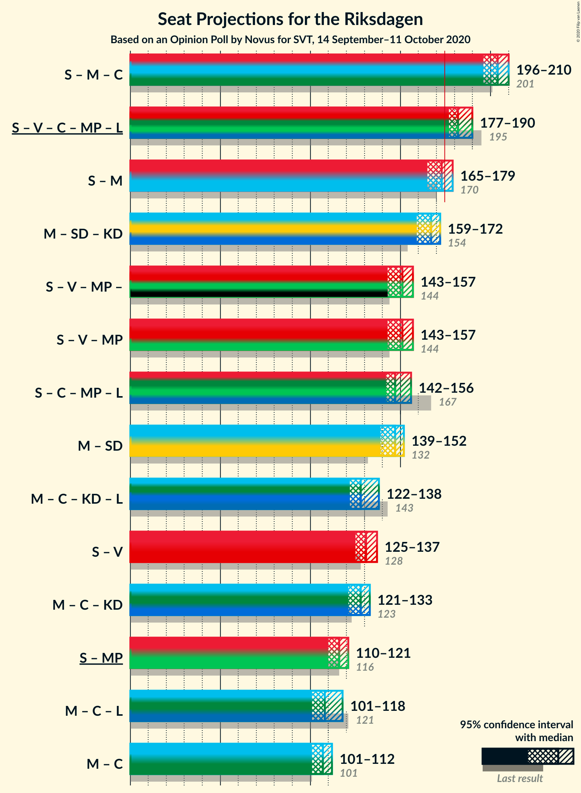

### Confidence Intervals

| Coalition | Last Result | Median | Majority? | 80% Confidence Interval | 90% Confidence Interval | 95% Confidence Interval | 99% Confidence Interval |
|:---------:|:-----------:|:------:|:---------:|:-----------------------:|:-----------------------:|:-----------------------:|:-----------------------:|
| Sveriges socialdemokratiska arbetareparti – Moderata samlingspartiet – Centerpartiet | 201 | 204 | 100% | 198–208 | 197–209 | 196–210 | 192–211 |
| Sveriges socialdemokratiska arbetareparti – Vänsterpartiet – Centerpartiet – Miljöpartiet de gröna – Liberalerna | 195 | 182 | 99.4% | 179–187 | 178–188 | 177–190 | 174–192 |
| Sveriges socialdemokratiska arbetareparti – Moderata samlingspartiet | 170 | 173 | 32% | 167–177 | 166–178 | 165–179 | 162–181 |
| Moderata samlingspartiet – Sverigedemokraterna – Kristdemokraterna | 154 | 167 | 0.6% | 162–170 | 161–171 | 159–172 | 157–175 |
| Sveriges socialdemokratiska arbetareparti – Vänsterpartiet – Miljöpartiet de gröna | 144 | 151 | 0% | 147–153 | 144–155 | 143–157 | 142–159 |
| Sveriges socialdemokratiska arbetareparti – Centerpartiet – Miljöpartiet de gröna – Liberalerna | 167 | 147 | 0% | 144–152 | 142–154 | 142–156 | 140–159 |
| Moderata samlingspartiet – Sverigedemokraterna | 132 | 147 | 0% | 142–150 | 140–151 | 139–152 | 137–154 |
| Moderata samlingspartiet – Centerpartiet – Kristdemokraterna – Liberalerna | 143 | 128 | 0% | 124–132 | 123–135 | 122–138 | 120–141 |
| Sveriges socialdemokratiska arbetareparti – Vänsterpartiet | 128 | 131 | 0% | 128–135 | 126–136 | 125–137 | 123–139 |
| Moderata samlingspartiet – Centerpartiet – Kristdemokraterna | 123 | 128 | 0% | 123–132 | 122–132 | 121–133 | 119–135 |
| Sveriges socialdemokratiska arbetareparti – Miljöpartiet de gröna | 116 | 116 | 0% | 112–119 | 111–120 | 110–121 | 108–123 |
| Moderata samlingspartiet – Centerpartiet – Liberalerna | 121 | 108 | 0% | 103–112 | 102–115 | 101–118 | 99–119 |
| Moderata samlingspartiet – Centerpartiet | 101 | 107 | 0% | 103–111 | 101–112 | 101–112 | 99–114 |

### Sveriges socialdemokratiska arbetareparti – Moderata samlingspartiet – Centerpartiet

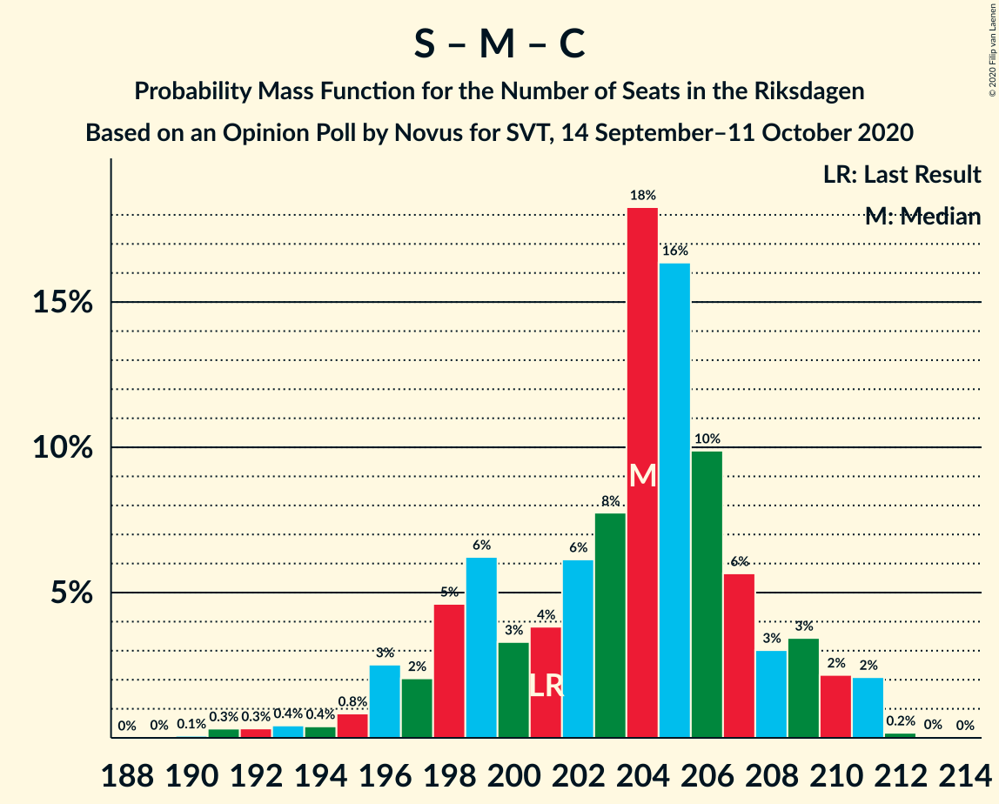

| Number of Seats | Probability | Accumulated | Special Marks |
|:---------------:|:-----------:|:-----------:|:-------------:|
| 190 | 0.1% | 100% |  |
| 191 | 0.3% | 99.9% |  |
| 192 | 0.3% | 99.6% |  |
| 193 | 0.4% | 99.2% |  |
| 194 | 0.4% | 98.8% |  |
| 195 | 0.8% | 98% |  |
| 196 | 3% | 98% |  |
| 197 | 2% | 95% |  |
| 198 | 5% | 93% |  |
| 199 | 6% | 88% |  |
| 200 | 3% | 82% |  |
| 201 | 4% | 79% | Last Result |
| 202 | 6% | 75% |  |
| 203 | 8% | 69% |  |
| 204 | 18% | 61% | Median |
| 205 | 16% | 43% |  |
| 206 | 10% | 27% |  |
| 207 | 6% | 17% |  |
| 208 | 3% | 11% |  |
| 209 | 3% | 8% |  |
| 210 | 2% | 5% |  |
| 211 | 2% | 2% |  |
| 212 | 0.2% | 0.3% |  |
| 213 | 0% | 0.1% |  |
| 214 | 0% | 0% |  |

### Sveriges socialdemokratiska arbetareparti – Vänsterpartiet – Centerpartiet – Miljöpartiet de gröna – Liberalerna

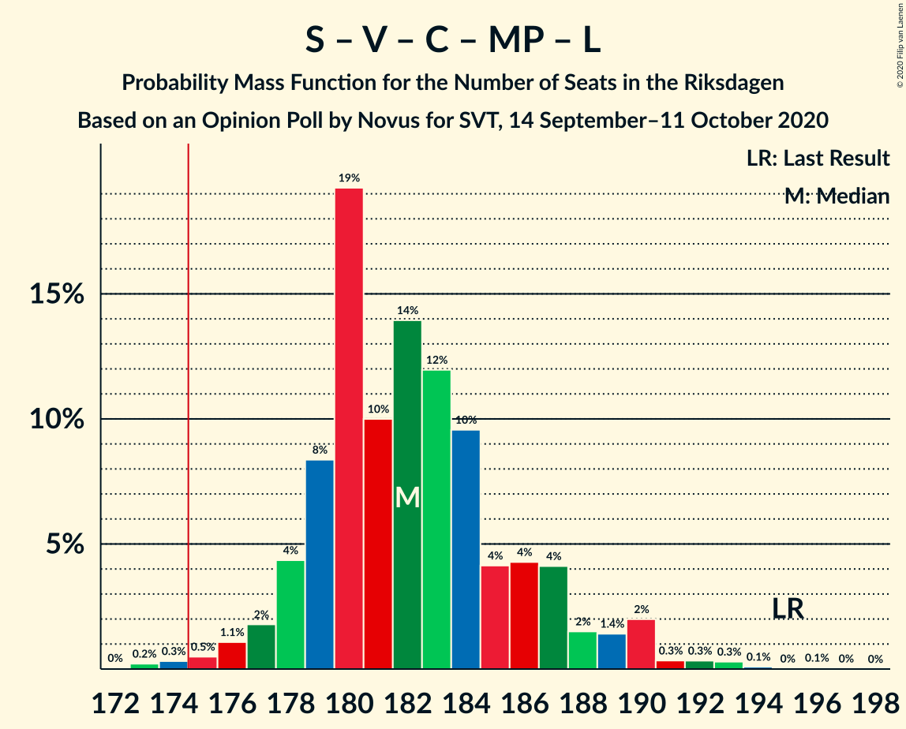

| Number of Seats | Probability | Accumulated | Special Marks |
|:---------------:|:-----------:|:-----------:|:-------------:|
| 172 | 0% | 100% |  |
| 173 | 0.2% | 99.9% |  |
| 174 | 0.3% | 99.7% |  |
| 175 | 0.5% | 99.4% | Majority |
| 176 | 1.1% | 98.9% |  |
| 177 | 2% | 98% |  |
| 178 | 4% | 96% |  |
| 179 | 8% | 92% |  |
| 180 | 19% | 83% |  |
| 181 | 10% | 64% | Median |
| 182 | 14% | 54% |  |
| 183 | 12% | 40% |  |
| 184 | 10% | 28% |  |
| 185 | 4% | 19% |  |
| 186 | 4% | 14% |  |
| 187 | 4% | 10% |  |
| 188 | 2% | 6% |  |
| 189 | 1.4% | 5% |  |
| 190 | 2% | 3% |  |
| 191 | 0.3% | 1.2% |  |
| 192 | 0.3% | 0.8% |  |
| 193 | 0.3% | 0.5% |  |
| 194 | 0.1% | 0.2% |  |
| 195 | 0% | 0.1% | Last Result |
| 196 | 0.1% | 0.1% |  |
| 197 | 0% | 0% |  |

### Sveriges socialdemokratiska arbetareparti – Moderata samlingspartiet

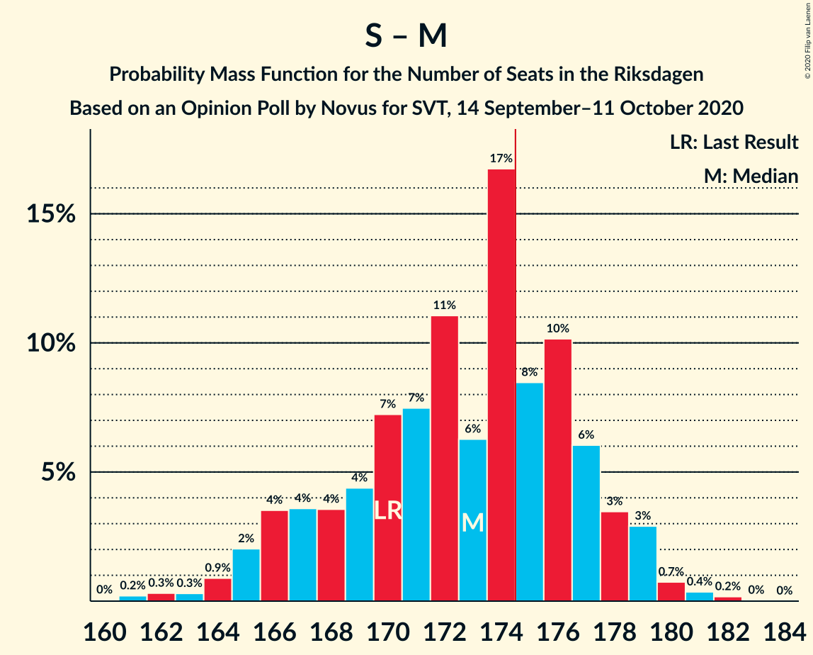

| Number of Seats | Probability | Accumulated | Special Marks |
|:---------------:|:-----------:|:-----------:|:-------------:|
| 160 | 0% | 100% |  |
| 161 | 0.2% | 99.9% |  |
| 162 | 0.3% | 99.7% |  |
| 163 | 0.3% | 99.4% |  |
| 164 | 0.9% | 99.1% |  |
| 165 | 2% | 98% |  |
| 166 | 4% | 96% |  |
| 167 | 4% | 93% |  |
| 168 | 4% | 89% |  |
| 169 | 4% | 86% |  |
| 170 | 7% | 81% | Last Result |
| 171 | 7% | 74% |  |
| 172 | 11% | 66% |  |
| 173 | 6% | 55% | Median |
| 174 | 17% | 49% |  |
| 175 | 8% | 32% | Majority |
| 176 | 10% | 24% |  |
| 177 | 6% | 14% |  |
| 178 | 3% | 8% |  |
| 179 | 3% | 4% |  |
| 180 | 0.7% | 1.3% |  |
| 181 | 0.4% | 0.6% |  |
| 182 | 0.2% | 0.2% |  |
| 183 | 0% | 0% |  |

### Moderata samlingspartiet – Sverigedemokraterna – Kristdemokraterna

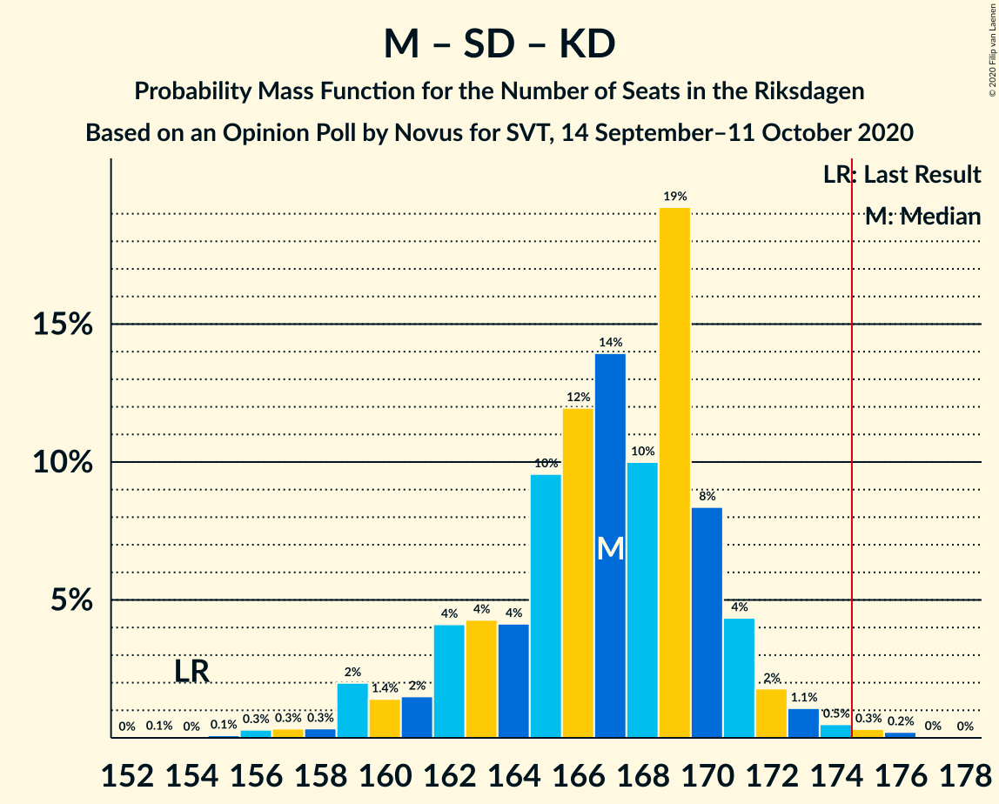

| Number of Seats | Probability | Accumulated | Special Marks |
|:---------------:|:-----------:|:-----------:|:-------------:|
| 153 | 0.1% | 100% |  |
| 154 | 0% | 99.9% | Last Result |
| 155 | 0.1% | 99.9% |  |
| 156 | 0.3% | 99.8% |  |
| 157 | 0.3% | 99.5% |  |
| 158 | 0.3% | 99.2% |  |
| 159 | 2% | 98.8% |  |
| 160 | 1.4% | 97% |  |
| 161 | 2% | 95% |  |
| 162 | 4% | 94% |  |
| 163 | 4% | 90% |  |
| 164 | 4% | 86% |  |
| 165 | 10% | 81% |  |
| 166 | 12% | 72% |  |
| 167 | 14% | 60% |  |
| 168 | 10% | 46% | Median |
| 169 | 19% | 36% |  |
| 170 | 8% | 17% |  |
| 171 | 4% | 8% |  |
| 172 | 2% | 4% |  |
| 173 | 1.1% | 2% |  |
| 174 | 0.5% | 1.1% |  |
| 175 | 0.3% | 0.6% | Majority |
| 176 | 0.2% | 0.3% |  |
| 177 | 0% | 0.1% |  |
| 178 | 0% | 0% |  |

### Sveriges socialdemokratiska arbetareparti – Vänsterpartiet – Miljöpartiet de gröna

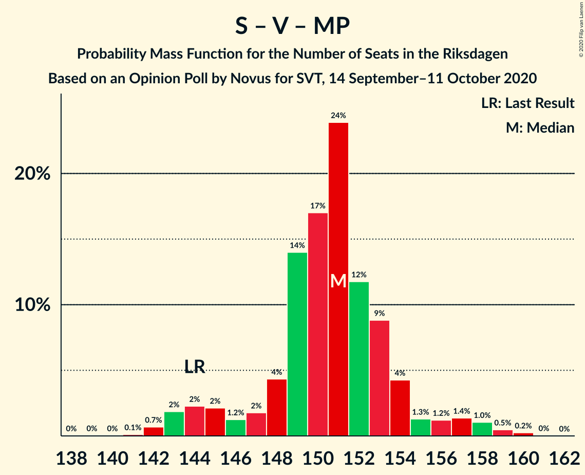

| Number of Seats | Probability | Accumulated | Special Marks |
|:---------------:|:-----------:|:-----------:|:-------------:|
| 138 | 0% | 100% |  |
| 139 | 0% | 99.9% |  |
| 140 | 0% | 99.9% |  |
| 141 | 0.1% | 99.9% |  |
| 142 | 0.7% | 99.8% |  |
| 143 | 2% | 99.1% |  |
| 144 | 2% | 97% | Last Result |
| 145 | 2% | 95% |  |
| 146 | 1.2% | 93% |  |
| 147 | 2% | 92% |  |
| 148 | 4% | 90% |  |
| 149 | 14% | 85% |  |
| 150 | 17% | 71% | Median |
| 151 | 24% | 54% |  |
| 152 | 12% | 31% |  |
| 153 | 9% | 19% |  |
| 154 | 4% | 10% |  |
| 155 | 1.3% | 6% |  |
| 156 | 1.2% | 4% |  |
| 157 | 1.4% | 3% |  |
| 158 | 1.0% | 2% |  |
| 159 | 0.5% | 0.8% |  |
| 160 | 0.2% | 0.3% |  |
| 161 | 0% | 0.1% |  |
| 162 | 0% | 0% |  |

### Sveriges socialdemokratiska arbetareparti – Centerpartiet – Miljöpartiet de gröna – Liberalerna

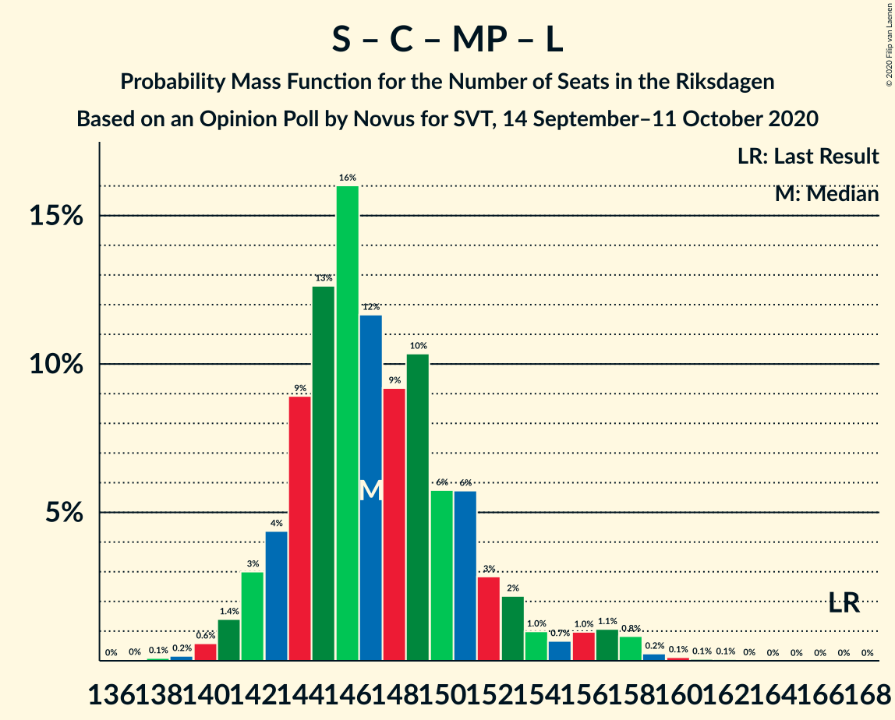

| Number of Seats | Probability | Accumulated | Special Marks |
|:---------------:|:-----------:|:-----------:|:-------------:|
| 137 | 0% | 100% |  |
| 138 | 0.1% | 99.9% |  |
| 139 | 0.2% | 99.9% |  |
| 140 | 0.6% | 99.7% |  |
| 141 | 1.4% | 99.1% |  |
| 142 | 3% | 98% |  |
| 143 | 4% | 95% |  |
| 144 | 9% | 90% |  |
| 145 | 13% | 81% |  |
| 146 | 16% | 69% | Median |
| 147 | 12% | 53% |  |
| 148 | 9% | 41% |  |
| 149 | 10% | 32% |  |
| 150 | 6% | 22% |  |
| 151 | 6% | 16% |  |
| 152 | 3% | 10% |  |
| 153 | 2% | 7% |  |
| 154 | 1.0% | 5% |  |
| 155 | 0.7% | 4% |  |
| 156 | 1.0% | 3% |  |
| 157 | 1.1% | 2% |  |
| 158 | 0.8% | 1.3% |  |
| 159 | 0.2% | 0.5% |  |
| 160 | 0.1% | 0.3% |  |
| 161 | 0.1% | 0.1% |  |
| 162 | 0.1% | 0.1% |  |
| 163 | 0% | 0% |  |
| 164 | 0% | 0% |  |
| 165 | 0% | 0% |  |
| 166 | 0% | 0% |  |
| 167 | 0% | 0% | Last Result |

### Moderata samlingspartiet – Sverigedemokraterna

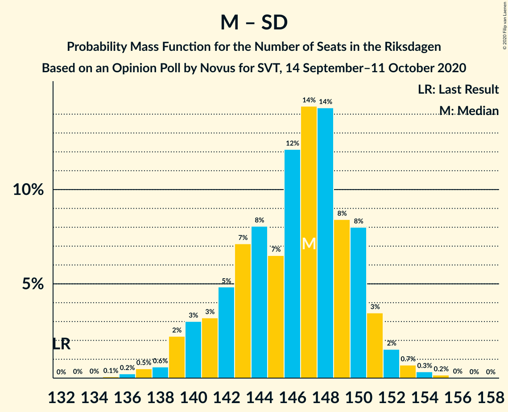

| Number of Seats | Probability | Accumulated | Special Marks |
|:---------------:|:-----------:|:-----------:|:-------------:|
| 132 | 0% | 100% | Last Result |
| 133 | 0% | 100% |  |
| 134 | 0% | 100% |  |
| 135 | 0.1% | 99.9% |  |
| 136 | 0.2% | 99.8% |  |
| 137 | 0.5% | 99.6% |  |
| 138 | 0.6% | 99.1% |  |
| 139 | 2% | 98.5% |  |
| 140 | 3% | 96% |  |
| 141 | 3% | 93% |  |
| 142 | 5% | 90% |  |
| 143 | 7% | 85% |  |
| 144 | 8% | 78% |  |
| 145 | 7% | 70% |  |
| 146 | 12% | 64% |  |
| 147 | 14% | 51% | Median |
| 148 | 14% | 37% |  |
| 149 | 8% | 23% |  |
| 150 | 8% | 14% |  |
| 151 | 3% | 6% |  |
| 152 | 2% | 3% |  |
| 153 | 0.7% | 1.3% |  |
| 154 | 0.3% | 0.6% |  |
| 155 | 0.2% | 0.2% |  |
| 156 | 0% | 0.1% |  |
| 157 | 0% | 0% |  |

### Moderata samlingspartiet – Centerpartiet – Kristdemokraterna – Liberalerna

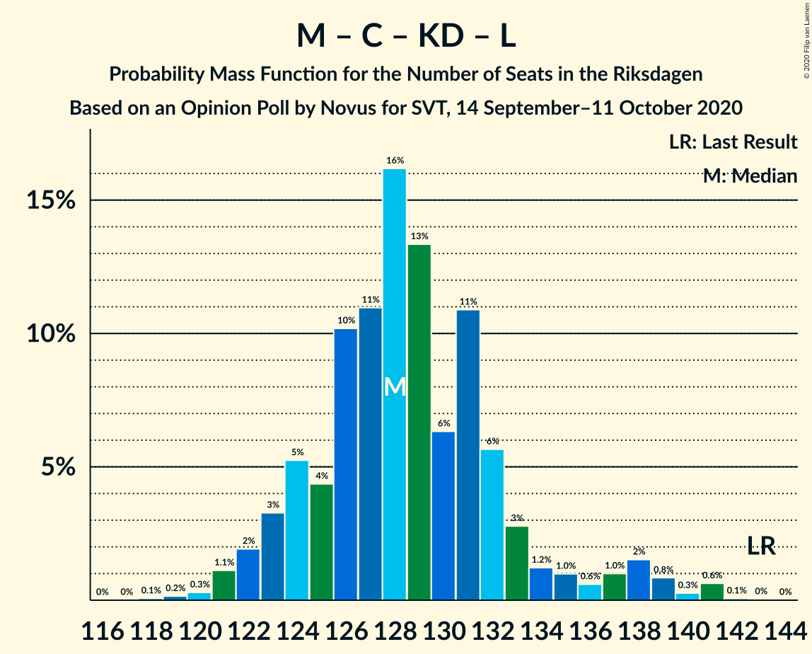

| Number of Seats | Probability | Accumulated | Special Marks |
|:---------------:|:-----------:|:-----------:|:-------------:|
| 118 | 0.1% | 100% |  |
| 119 | 0.2% | 99.9% |  |
| 120 | 0.3% | 99.8% |  |
| 121 | 1.1% | 99.5% |  |
| 122 | 2% | 98% |  |
| 123 | 3% | 96% |  |
| 124 | 5% | 93% |  |
| 125 | 4% | 88% |  |
| 126 | 10% | 84% |  |
| 127 | 11% | 73% |  |
| 128 | 16% | 62% |  |
| 129 | 13% | 46% | Median |
| 130 | 6% | 33% |  |
| 131 | 11% | 27% |  |
| 132 | 6% | 16% |  |
| 133 | 3% | 10% |  |
| 134 | 1.2% | 7% |  |
| 135 | 1.0% | 6% |  |
| 136 | 0.6% | 5% |  |
| 137 | 1.0% | 4% |  |
| 138 | 2% | 3% |  |
| 139 | 0.8% | 2% |  |
| 140 | 0.3% | 1.0% |  |
| 141 | 0.6% | 0.7% |  |
| 142 | 0.1% | 0.1% |  |
| 143 | 0% | 0.1% | Last Result |
| 144 | 0% | 0% |  |

### Sveriges socialdemokratiska arbetareparti – Vänsterpartiet

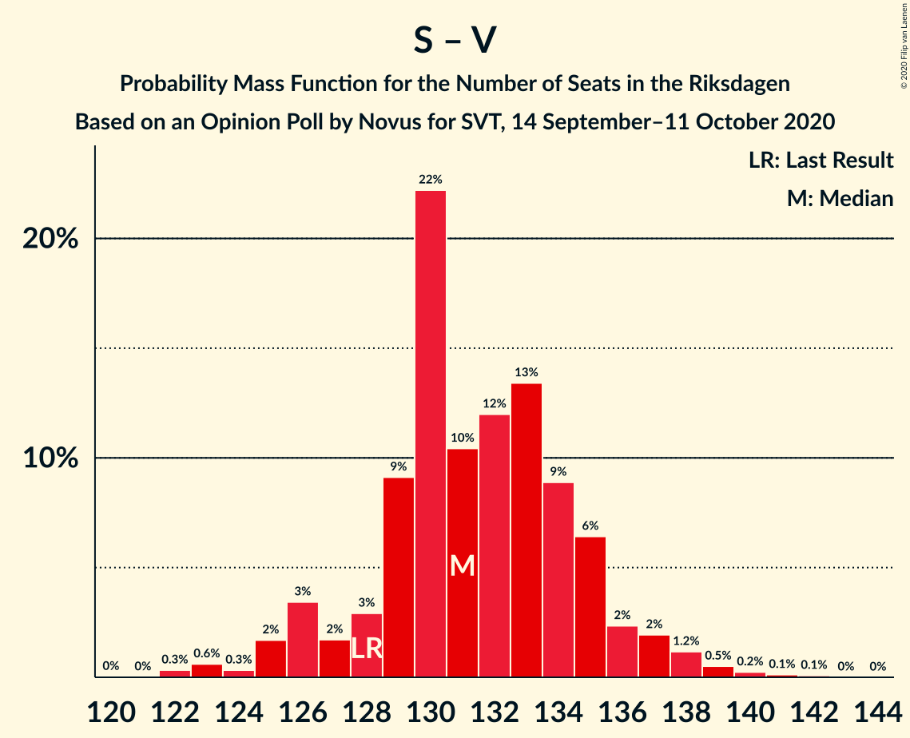

| Number of Seats | Probability | Accumulated | Special Marks |
|:---------------:|:-----------:|:-----------:|:-------------:|
| 120 | 0% | 100% |  |
| 121 | 0% | 99.9% |  |
| 122 | 0.3% | 99.9% |  |
| 123 | 0.6% | 99.6% |  |
| 124 | 0.3% | 99.0% |  |
| 125 | 2% | 98.7% |  |
| 126 | 3% | 97% |  |
| 127 | 2% | 94% |  |
| 128 | 3% | 92% | Last Result |
| 129 | 9% | 89% |  |
| 130 | 22% | 80% |  |
| 131 | 10% | 58% | Median |
| 132 | 12% | 47% |  |
| 133 | 13% | 35% |  |
| 134 | 9% | 22% |  |
| 135 | 6% | 13% |  |
| 136 | 2% | 6% |  |
| 137 | 2% | 4% |  |
| 138 | 1.2% | 2% |  |
| 139 | 0.5% | 1.0% |  |
| 140 | 0.2% | 0.5% |  |
| 141 | 0.1% | 0.2% |  |
| 142 | 0.1% | 0.1% |  |
| 143 | 0% | 0% |  |

### Moderata samlingspartiet – Centerpartiet – Kristdemokraterna

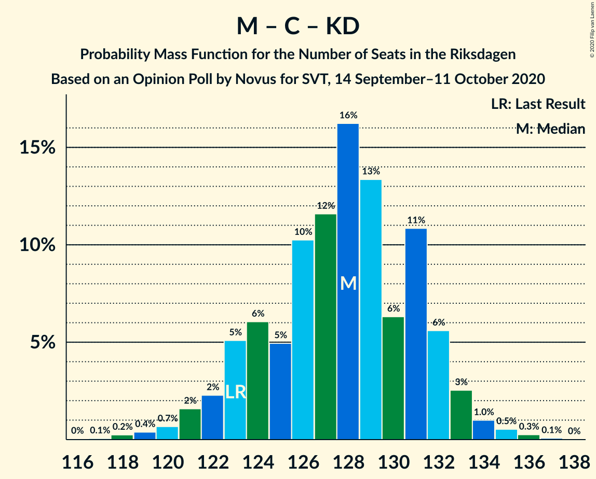

| Number of Seats | Probability | Accumulated | Special Marks |
|:---------------:|:-----------:|:-----------:|:-------------:|
| 116 | 0% | 100% |  |
| 117 | 0.1% | 99.9% |  |
| 118 | 0.2% | 99.9% |  |
| 119 | 0.4% | 99.6% |  |
| 120 | 0.7% | 99.2% |  |
| 121 | 2% | 98.6% |  |
| 122 | 2% | 97% |  |
| 123 | 5% | 95% | Last Result |
| 124 | 6% | 90% |  |
| 125 | 5% | 84% |  |
| 126 | 10% | 79% |  |
| 127 | 12% | 68% |  |
| 128 | 16% | 57% |  |
| 129 | 13% | 41% | Median |
| 130 | 6% | 27% |  |
| 131 | 11% | 21% |  |
| 132 | 6% | 10% |  |
| 133 | 3% | 4% |  |
| 134 | 1.0% | 2% |  |
| 135 | 0.5% | 0.9% |  |
| 136 | 0.3% | 0.4% |  |
| 137 | 0.1% | 0.1% |  |
| 138 | 0% | 0% |  |

### Sveriges socialdemokratiska arbetareparti – Miljöpartiet de gröna

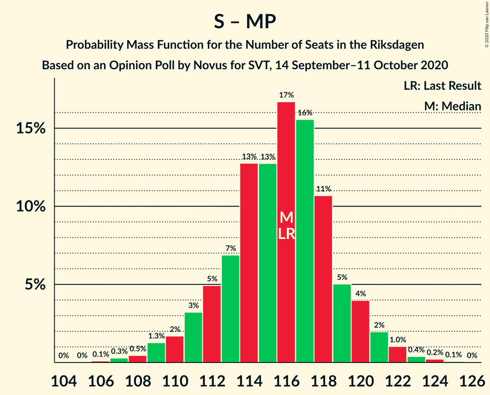

| Number of Seats | Probability | Accumulated | Special Marks |
|:---------------:|:-----------:|:-----------:|:-------------:|
| 105 | 0% | 100% |  |
| 106 | 0.1% | 99.9% |  |
| 107 | 0.3% | 99.9% |  |
| 108 | 0.5% | 99.6% |  |
| 109 | 1.3% | 99.1% |  |
| 110 | 2% | 98% |  |
| 111 | 3% | 96% |  |
| 112 | 5% | 93% |  |
| 113 | 7% | 88% |  |
| 114 | 13% | 81% |  |
| 115 | 13% | 68% | Median |
| 116 | 17% | 56% | Last Result |
| 117 | 16% | 39% |  |
| 118 | 11% | 23% |  |
| 119 | 5% | 13% |  |
| 120 | 4% | 8% |  |
| 121 | 2% | 4% |  |
| 122 | 1.0% | 2% |  |
| 123 | 0.4% | 0.7% |  |
| 124 | 0.2% | 0.3% |  |
| 125 | 0.1% | 0.1% |  |
| 126 | 0% | 0% |  |

### Moderata samlingspartiet – Centerpartiet – Liberalerna

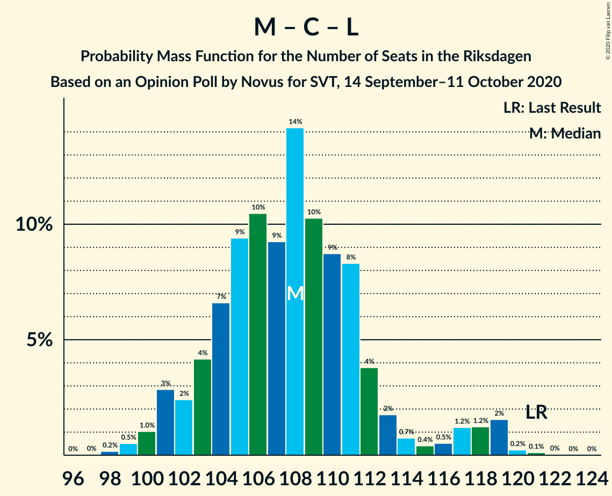

| Number of Seats | Probability | Accumulated | Special Marks |
|:---------------:|:-----------:|:-----------:|:-------------:|
| 98 | 0.2% | 100% |  |
| 99 | 0.5% | 99.8% |  |
| 100 | 1.0% | 99.3% |  |
| 101 | 3% | 98% |  |
| 102 | 2% | 95% |  |
| 103 | 4% | 93% |  |
| 104 | 7% | 89% |  |
| 105 | 9% | 82% |  |
| 106 | 10% | 73% |  |
| 107 | 9% | 62% |  |
| 108 | 14% | 53% | Median |
| 109 | 10% | 39% |  |
| 110 | 9% | 29% |  |
| 111 | 8% | 20% |  |
| 112 | 4% | 12% |  |
| 113 | 2% | 8% |  |
| 114 | 0.7% | 6% |  |
| 115 | 0.4% | 5% |  |
| 116 | 0.5% | 5% |  |
| 117 | 1.2% | 4% |  |
| 118 | 1.2% | 3% |  |
| 119 | 2% | 2% |  |
| 120 | 0.2% | 0.4% |  |
| 121 | 0.1% | 0.2% | Last Result |
| 122 | 0% | 0.1% |  |
| 123 | 0% | 0% |  |

### Moderata samlingspartiet – Centerpartiet

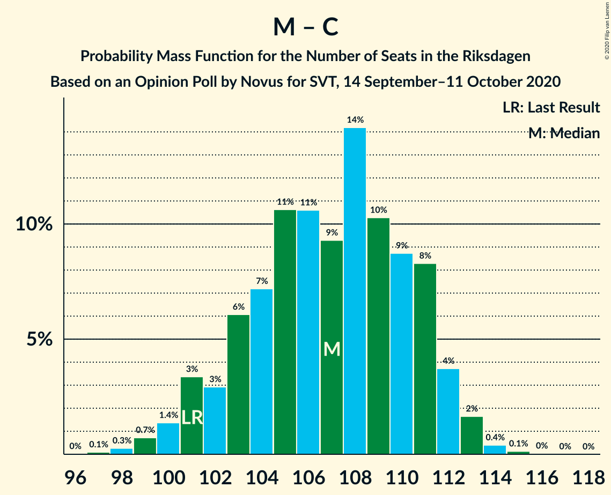

| Number of Seats | Probability | Accumulated | Special Marks |
|:---------------:|:-----------:|:-----------:|:-------------:|
| 97 | 0.1% | 100% |  |
| 98 | 0.3% | 99.9% |  |
| 99 | 0.7% | 99.6% |  |
| 100 | 1.4% | 98.9% |  |
| 101 | 3% | 98% | Last Result |
| 102 | 3% | 94% |  |
| 103 | 6% | 91% |  |
| 104 | 7% | 85% |  |
| 105 | 11% | 78% |  |
| 106 | 11% | 67% |  |
| 107 | 9% | 57% |  |
| 108 | 14% | 47% | Median |
| 109 | 10% | 33% |  |
| 110 | 9% | 23% |  |
| 111 | 8% | 14% |  |
| 112 | 4% | 6% |  |
| 113 | 2% | 2% |  |
| 114 | 0.4% | 0.6% |  |
| 115 | 0.1% | 0.2% |  |
| 116 | 0% | 0.1% |  |
| 117 | 0% | 0% |  |

## Technical Information

### Opinion Poll

+ **Polling firm:** Novus
+ **Commissioner(s):** SVT
+ **Fieldwork period:** 14 September–11 October 2020

### Calculations

+ **Sample size:** 3878
+ **Simulations done:** 1,048,576
+ **Error estimate:** 0.55%

