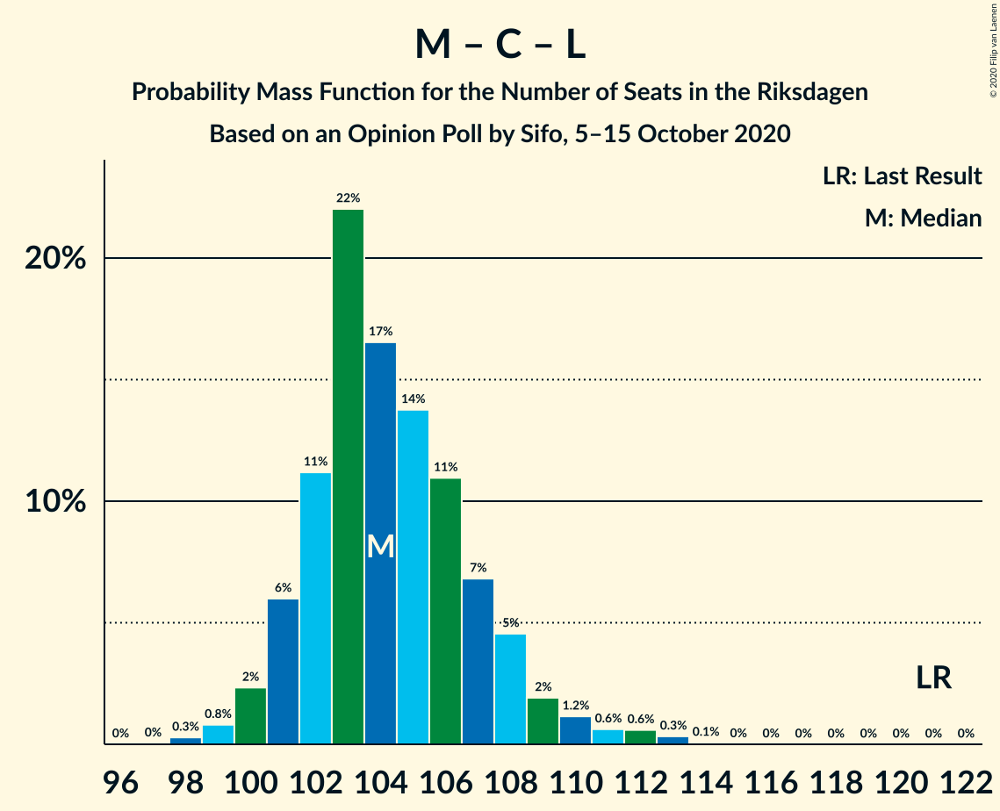

# Opinion Poll by Sifo, 5–15 October 2020

<a href="#voting-intentions">Voting Intentions</a> | <a href="#seats">Seats</a> | <a href="#coalitions">Coalitions</a> | <a href="#technical-information">Technical Information</a>

## Voting Intentions

### Confidence Intervals

| Party | Last Result | Poll Result | 80% Confidence Interval | 90% Confidence Interval | 95% Confidence Interval | 99% Confidence Interval |
|:-----:|:-----------:|:-----------:|:-----------------------:|:-----------------------:|:-----------------------:|:-----------------------:|
| Sveriges socialdemokratiska arbetareparti | 28.3% | 26.4% | 25.7–27.1% |25.6–27.3% |25.4–27.4% |25.1–27.8% |
| Moderata samlingspartiet | 19.8% | 20.6% | 20.0–21.2% |19.8–21.4% |19.7–21.6% |19.4–21.9% |
| Sverigedemokraterna | 17.5% | 20.2% | 19.6–20.8% |19.4–21.0% |19.3–21.1% |19.0–21.4% |
| Vänsterpartiet | 8.0% | 10.0% | 9.6–10.5% |9.4–10.6% |9.3–10.7% |9.1–10.9% |
| Centerpartiet | 8.6% | 7.7% | 7.3–8.1% |7.2–8.2% |7.1–8.3% |6.9–8.6% |
| Kristdemokraterna | 6.3% | 5.9% | 5.6–6.3% |5.5–6.4% |5.4–6.5% |5.2–6.7% |
| Miljöpartiet de gröna | 4.4% | 4.3% | 4.0–4.6% |3.9–4.7% |3.9–4.8% |3.7–5.0% |
| Liberalerna | 5.5% | 3.2% | 3.0–3.5% |2.9–3.6% |2.8–3.6% |2.7–3.8% |

*Note:* The poll result column reflects the actual value used in the calculations. Published results may vary slightly, and in addition be rounded to fewer digits.

## Seats

### Confidence Intervals

| Party | Last Result | Median | 80% Confidence Interval | 90% Confidence Interval | 95% Confidence Interval | 99% Confidence Interval |
|:-----:|:-----------:|:------:|:-----------------------:|:-----------------------:|:-----------------------:|:-----------------------:|
| <a href="#sveriges-socialdemokratiska-arbetareparti">Sveriges socialdemokratiska arbetareparti</a> | 100 | 97 | 94–100 |94–102 |93–103 |92–105 |
| <a href="#moderata-samlingspartiet">Moderata samlingspartiet</a> | 70 | 76 | 74–78 |73–80 |72–80 |71–82 |
| <a href="#sverigedemokraterna">Sverigedemokraterna</a> | 62 | 74 | 72–77 |71–78 |71–79 |70–81 |
| <a href="#vänsterpartiet">Vänsterpartiet</a> | 28 | 37 | 35–39 |35–39 |34–40 |33–41 |
| <a href="#centerpartiet">Centerpartiet</a> | 31 | 28 | 27–30 |27–30 |26–31 |25–32 |
| <a href="#kristdemokraterna">Kristdemokraterna</a> | 22 | 22 | 20–23 |20–24 |20–24 |19–25 |
| <a href="#miljöpartiet-de-gröna">Miljöpartiet de gröna</a> | 16 | 16 | 15–17 |0–17 |0–18 |0–18 |
| <a href="#liberalerna">Liberalerna</a> | 20 | 0 | 0 |0 |0 |0 |

### Sveriges socialdemokratiska arbetareparti

*For a full overview of the results for this party, see the [Sveriges socialdemokratiska arbetareparti](party-sverigessocialdemokratiskaarbetareparti.html) page.*

| Number of Seats | Probability | Accumulated | Special Marks |
|:---------------:|:-----------:|:-----------:|:-------------:|
| 91 | 0.2% | 100% |  |
| 92 | 0.6% | 99.7% |  |
| 93 | 3% | 99.1% |  |
| 94 | 8% | 96% |  |
| 95 | 13% | 88% |  |
| 96 | 19% | 75% |  |
| 97 | 19% | 57% | Median |
| 98 | 16% | 38% |  |
| 99 | 9% | 23% |  |
| 100 | 4% | 14% | Last Result |
| 101 | 3% | 9% |  |
| 102 | 3% | 6% |  |
| 103 | 2% | 4% |  |
| 104 | 0.5% | 1.2% |  |
| 105 | 0.3% | 0.7% |  |
| 106 | 0.3% | 0.4% |  |
| 107 | 0% | 0% |  |

### Moderata samlingspartiet

*For a full overview of the results for this party, see the [Moderata samlingspartiet](party-moderatasamlingspartiet.html) page.*

| Number of Seats | Probability | Accumulated | Special Marks |
|:---------------:|:-----------:|:-----------:|:-------------:|
| 70 | 0.1% | 100% | Last Result |
| 71 | 1.0% | 99.9% |  |
| 72 | 1.4% | 98.8% |  |
| 73 | 7% | 97% |  |
| 74 | 15% | 90% |  |
| 75 | 17% | 75% |  |
| 76 | 20% | 58% | Median |
| 77 | 21% | 37% |  |
| 78 | 7% | 16% |  |
| 79 | 4% | 9% |  |
| 80 | 4% | 5% |  |
| 81 | 0.9% | 2% |  |
| 82 | 0.5% | 0.8% |  |
| 83 | 0.3% | 0.3% |  |
| 84 | 0.1% | 0.1% |  |
| 85 | 0% | 0% |  |

### Sverigedemokraterna

*For a full overview of the results for this party, see the [Sverigedemokraterna](party-sverigedemokraterna.html) page.*

| Number of Seats | Probability | Accumulated | Special Marks |
|:---------------:|:-----------:|:-----------:|:-------------:|
| 62 | 0% | 100% | Last Result |
| 63 | 0% | 100% |  |
| 64 | 0% | 100% |  |
| 65 | 0% | 100% |  |
| 66 | 0% | 100% |  |
| 67 | 0% | 100% |  |
| 68 | 0% | 100% |  |
| 69 | 0.4% | 100% |  |
| 70 | 2% | 99.5% |  |
| 71 | 6% | 98% |  |
| 72 | 9% | 92% |  |
| 73 | 15% | 83% |  |
| 74 | 20% | 68% | Median |
| 75 | 17% | 48% |  |
| 76 | 18% | 31% |  |
| 77 | 6% | 13% |  |
| 78 | 4% | 7% |  |
| 79 | 1.4% | 3% |  |
| 80 | 1.2% | 2% |  |
| 81 | 0.5% | 0.6% |  |
| 82 | 0.1% | 0.1% |  |
| 83 | 0% | 0% |  |

### Vänsterpartiet

*For a full overview of the results for this party, see the [Vänsterpartiet](party-vänsterpartiet.html) page.*

| Number of Seats | Probability | Accumulated | Special Marks |
|:---------------:|:-----------:|:-----------:|:-------------:|
| 28 | 0% | 100% | Last Result |
| 29 | 0% | 100% |  |
| 30 | 0% | 100% |  |
| 31 | 0% | 100% |  |
| 32 | 0% | 100% |  |
| 33 | 0.6% | 100% |  |
| 34 | 2% | 99.3% |  |
| 35 | 8% | 97% |  |
| 36 | 29% | 89% |  |
| 37 | 36% | 60% | Median |
| 38 | 13% | 24% |  |
| 39 | 7% | 11% |  |
| 40 | 3% | 4% |  |
| 41 | 1.2% | 1.3% |  |
| 42 | 0.1% | 0.1% |  |
| 43 | 0% | 0% |  |

### Centerpartiet

*For a full overview of the results for this party, see the [Centerpartiet](party-centerpartiet.html) page.*

| Number of Seats | Probability | Accumulated | Special Marks |
|:---------------:|:-----------:|:-----------:|:-------------:|
| 25 | 1.2% | 100% |  |
| 26 | 3% | 98.8% |  |
| 27 | 21% | 95% |  |
| 28 | 32% | 75% | Median |
| 29 | 23% | 43% |  |
| 30 | 16% | 20% |  |
| 31 | 3% | 4% | Last Result |
| 32 | 0.8% | 0.8% |  |
| 33 | 0.1% | 0.1% |  |
| 34 | 0% | 0% |  |

### Kristdemokraterna

*For a full overview of the results for this party, see the [Kristdemokraterna](party-kristdemokraterna.html) page.*

| Number of Seats | Probability | Accumulated | Special Marks |
|:---------------:|:-----------:|:-----------:|:-------------:|
| 19 | 2% | 100% |  |
| 20 | 9% | 98% |  |
| 21 | 31% | 89% |  |
| 22 | 35% | 59% | Last Result, Median |
| 23 | 18% | 24% |  |
| 24 | 6% | 6% |  |
| 25 | 0.5% | 0.6% |  |
| 26 | 0.1% | 0.1% |  |
| 27 | 0% | 0% |  |

### Miljöpartiet de gröna

*For a full overview of the results for this party, see the [Miljöpartiet de gröna](party-miljöpartietdegröna.html) page.*

| Number of Seats | Probability | Accumulated | Special Marks |
|:---------------:|:-----------:|:-----------:|:-------------:|
| 0 | 9% | 100% |  |
| 1 | 0% | 91% |  |
| 2 | 0% | 91% |  |
| 3 | 0% | 91% |  |
| 4 | 0% | 91% |  |
| 5 | 0% | 91% |  |
| 6 | 0% | 91% |  |
| 7 | 0% | 91% |  |
| 8 | 0% | 91% |  |
| 9 | 0% | 91% |  |
| 10 | 0% | 91% |  |
| 11 | 0% | 91% |  |
| 12 | 0% | 91% |  |
| 13 | 0% | 91% |  |
| 14 | 0% | 91% |  |
| 15 | 27% | 91% |  |
| 16 | 42% | 64% | Last Result, Median |
| 17 | 20% | 23% |  |
| 18 | 2% | 3% |  |
| 19 | 0.2% | 0.2% |  |
| 20 | 0% | 0% |  |

### Liberalerna

*For a full overview of the results for this party, see the [Liberalerna](party-liberalerna.html) page.*

| Number of Seats | Probability | Accumulated | Special Marks |
|:---------------:|:-----------:|:-----------:|:-------------:|
| 0 | 100% | 100% | Median |
| 1 | 0% | 0% |  |
| 2 | 0% | 0% |  |
| 3 | 0% | 0% |  |
| 4 | 0% | 0% |  |
| 5 | 0% | 0% |  |
| 6 | 0% | 0% |  |
| 7 | 0% | 0% |  |
| 8 | 0% | 0% |  |
| 9 | 0% | 0% |  |
| 10 | 0% | 0% |  |
| 11 | 0% | 0% |  |
| 12 | 0% | 0% |  |
| 13 | 0% | 0% |  |
| 14 | 0% | 0% |  |
| 15 | 0% | 0% |  |
| 16 | 0% | 0% |  |
| 17 | 0% | 0% |  |
| 18 | 0% | 0% |  |
| 19 | 0% | 0% |  |
| 20 | 0% | 0% | Last Result |

## Coalitions

### Confidence Intervals

| Coalition | Last Result | Median | Majority? | 80% Confidence Interval | 90% Confidence Interval | 95% Confidence Interval | 99% Confidence Interval |
|:---------:|:-----------:|:------:|:---------:|:-----------------------:|:-----------------------:|:-----------------------:|:-----------------------:|
| Sveriges socialdemokratiska arbetareparti – Moderata samlingspartiet – Centerpartiet | 201 | 201 | 100% | 198–205 | 197–210 | 197–212 | 195–214 |
| Sveriges socialdemokratiska arbetareparti – Moderata samlingspartiet | 170 | 173 | 20% | 170–177 | 169–181 | 168–183 | 167–184 |
| Sveriges socialdemokratiska arbetareparti – Vänsterpartiet – Centerpartiet – Miljöpartiet de gröna – Liberalerna | 195 | 177 | 83% | 173–180 | 170–181 | 168–182 | 166–183 |
| Moderata samlingspartiet – Sverigedemokraterna – Kristdemokraterna | 154 | 172 | 17% | 169–176 | 168–179 | 167–181 | 166–183 |
| Moderata samlingspartiet – Sverigedemokraterna | 132 | 150 | 0% | 147–154 | 146–156 | 146–158 | 144–160 |
| Sveriges socialdemokratiska arbetareparti – Vänsterpartiet – Miljöpartiet de gröna | 144 | 149 | 0% | 145–152 | 141–153 | 139–153 | 137–155 |
| Sveriges socialdemokratiska arbetareparti – Centerpartiet – Miljöpartiet de gröna – Liberalerna | 167 | 140 | 0% | 136–144 | 131–144 | 130–145 | 128–146 |
| Sveriges socialdemokratiska arbetareparti – Vänsterpartiet | 128 | 134 | 0% | 131–138 | 130–140 | 130–142 | 128–144 |
| Moderata samlingspartiet – Centerpartiet – Kristdemokraterna – Liberalerna | 143 | 126 | 0% | 123–129 | 122–131 | 122–133 | 120–135 |
| Moderata samlingspartiet – Centerpartiet – Kristdemokraterna | 123 | 126 | 0% | 123–129 | 122–131 | 122–133 | 120–135 |
| Sveriges socialdemokratiska arbetareparti – Miljöpartiet de gröna | 116 | 112 | 0% | 108–115 | 102–116 | 101–117 | 99–118 |
| Moderata samlingspartiet – Centerpartiet – Liberalerna | 121 | 104 | 0% | 102–107 | 101–108 | 100–110 | 99–112 |
| Moderata samlingspartiet – Centerpartiet | 101 | 104 | 0% | 102–107 | 101–108 | 100–110 | 99–112 |

### Sveriges socialdemokratiska arbetareparti – Moderata samlingspartiet – Centerpartiet

| Number of Seats | Probability | Accumulated | Special Marks |
|:---------------:|:-----------:|:-----------:|:-------------:|
| 194 | 0.2% | 100% |  |
| 195 | 0.5% | 99.8% |  |
| 196 | 2% | 99.3% |  |
| 197 | 5% | 98% |  |
| 198 | 9% | 92% |  |
| 199 | 16% | 84% |  |
| 200 | 17% | 68% |  |
| 201 | 11% | 51% | Last Result, Median |
| 202 | 15% | 40% |  |
| 203 | 9% | 25% |  |
| 204 | 5% | 16% |  |
| 205 | 2% | 11% |  |
| 206 | 1.0% | 10% |  |
| 207 | 0.6% | 9% |  |
| 208 | 1.1% | 8% |  |
| 209 | 0.7% | 7% |  |
| 210 | 2% | 7% |  |
| 211 | 2% | 5% |  |
| 212 | 1.5% | 3% |  |
| 213 | 0.7% | 1.4% |  |
| 214 | 0.4% | 0.7% |  |
| 215 | 0.3% | 0.3% |  |
| 216 | 0.1% | 0.1% |  |
| 217 | 0% | 0% |  |

### Sveriges socialdemokratiska arbetareparti – Moderata samlingspartiet

| Number of Seats | Probability | Accumulated | Special Marks |
|:---------------:|:-----------:|:-----------:|:-------------:|
| 165 | 0% | 100% |  |
| 166 | 0.3% | 99.9% |  |
| 167 | 0.7% | 99.7% |  |
| 168 | 2% | 99.0% |  |
| 169 | 4% | 97% |  |
| 170 | 13% | 92% | Last Result |
| 171 | 13% | 79% |  |
| 172 | 14% | 66% |  |
| 173 | 18% | 52% | Median |
| 174 | 14% | 34% |  |
| 175 | 6% | 20% | Majority |
| 176 | 3% | 14% |  |
| 177 | 2% | 11% |  |
| 178 | 1.1% | 9% |  |
| 179 | 1.1% | 8% |  |
| 180 | 2% | 7% |  |
| 181 | 2% | 5% |  |
| 182 | 1.1% | 4% |  |
| 183 | 2% | 3% |  |
| 184 | 0.6% | 0.9% |  |
| 185 | 0.3% | 0.3% |  |
| 186 | 0.1% | 0.1% |  |
| 187 | 0% | 0% |  |

### Sveriges socialdemokratiska arbetareparti – Vänsterpartiet – Centerpartiet – Miljöpartiet de gröna – Liberalerna

| Number of Seats | Probability | Accumulated | Special Marks |
|:---------------:|:-----------:|:-----------:|:-------------:|
| 164 | 0.1% | 100% |  |
| 165 | 0.1% | 99.9% |  |
| 166 | 0.5% | 99.8% |  |
| 167 | 0.7% | 99.2% |  |
| 168 | 1.3% | 98.6% |  |
| 169 | 1.3% | 97% |  |
| 170 | 2% | 96% |  |
| 171 | 2% | 94% |  |
| 172 | 1.4% | 92% |  |
| 173 | 2% | 91% |  |
| 174 | 6% | 89% |  |
| 175 | 6% | 83% | Majority |
| 176 | 15% | 77% |  |
| 177 | 18% | 62% |  |
| 178 | 11% | 44% | Median |
| 179 | 15% | 33% |  |
| 180 | 8% | 18% |  |
| 181 | 6% | 10% |  |
| 182 | 3% | 4% |  |
| 183 | 0.5% | 0.9% |  |
| 184 | 0.3% | 0.4% |  |
| 185 | 0% | 0.1% |  |
| 186 | 0% | 0% |  |
| 187 | 0% | 0% |  |
| 188 | 0% | 0% |  |
| 189 | 0% | 0% |  |
| 190 | 0% | 0% |  |
| 191 | 0% | 0% |  |
| 192 | 0% | 0% |  |
| 193 | 0% | 0% |  |
| 194 | 0% | 0% |  |
| 195 | 0% | 0% | Last Result |

### Moderata samlingspartiet – Sverigedemokraterna – Kristdemokraterna

| Number of Seats | Probability | Accumulated | Special Marks |
|:---------------:|:-----------:|:-----------:|:-------------:|
| 154 | 0% | 100% | Last Result |
| 155 | 0% | 100% |  |
| 156 | 0% | 100% |  |
| 157 | 0% | 100% |  |
| 158 | 0% | 100% |  |
| 159 | 0% | 100% |  |
| 160 | 0% | 100% |  |
| 161 | 0% | 100% |  |
| 162 | 0% | 100% |  |
| 163 | 0% | 100% |  |
| 164 | 0% | 100% |  |
| 165 | 0.3% | 99.9% |  |
| 166 | 0.5% | 99.6% |  |
| 167 | 3% | 99.1% |  |
| 168 | 6% | 96% |  |
| 169 | 8% | 90% |  |
| 170 | 15% | 82% |  |
| 171 | 11% | 67% |  |
| 172 | 18% | 56% | Median |
| 173 | 15% | 38% |  |
| 174 | 6% | 23% |  |
| 175 | 6% | 17% | Majority |
| 176 | 2% | 11% |  |
| 177 | 1.4% | 9% |  |
| 178 | 2% | 8% |  |
| 179 | 2% | 6% |  |
| 180 | 1.3% | 4% |  |
| 181 | 1.3% | 3% |  |
| 182 | 0.7% | 1.4% |  |
| 183 | 0.5% | 0.8% |  |
| 184 | 0.1% | 0.2% |  |
| 185 | 0.1% | 0.1% |  |
| 186 | 0% | 0% |  |

### Moderata samlingspartiet – Sverigedemokraterna

| Number of Seats | Probability | Accumulated | Special Marks |
|:---------------:|:-----------:|:-----------:|:-------------:|
| 132 | 0% | 100% | Last Result |
| 133 | 0% | 100% |  |
| 134 | 0% | 100% |  |
| 135 | 0% | 100% |  |
| 136 | 0% | 100% |  |
| 137 | 0% | 100% |  |
| 138 | 0% | 100% |  |
| 139 | 0% | 100% |  |
| 140 | 0% | 100% |  |
| 141 | 0% | 100% |  |
| 142 | 0% | 100% |  |
| 143 | 0.1% | 99.9% |  |
| 144 | 0.6% | 99.8% |  |
| 145 | 2% | 99.3% |  |
| 146 | 4% | 98% |  |
| 147 | 9% | 93% |  |
| 148 | 11% | 84% |  |
| 149 | 15% | 73% |  |
| 150 | 15% | 58% | Median |
| 151 | 13% | 43% |  |
| 152 | 12% | 30% |  |
| 153 | 8% | 18% |  |
| 154 | 2% | 11% |  |
| 155 | 2% | 9% |  |
| 156 | 2% | 7% |  |
| 157 | 1.5% | 4% |  |
| 158 | 0.6% | 3% |  |
| 159 | 2% | 2% |  |
| 160 | 0.4% | 0.7% |  |
| 161 | 0.1% | 0.3% |  |
| 162 | 0.2% | 0.2% |  |
| 163 | 0% | 0% |  |

### Sveriges socialdemokratiska arbetareparti – Vänsterpartiet – Miljöpartiet de gröna

| Number of Seats | Probability | Accumulated | Special Marks |
|:---------------:|:-----------:|:-----------:|:-------------:|
| 134 | 0% | 100% |  |
| 135 | 0.2% | 99.9% |  |
| 136 | 0.2% | 99.8% |  |
| 137 | 0.6% | 99.6% |  |
| 138 | 0.8% | 99.0% |  |
| 139 | 2% | 98% |  |
| 140 | 0.8% | 96% |  |
| 141 | 2% | 95% |  |
| 142 | 2% | 93% |  |
| 143 | 0.5% | 92% |  |
| 144 | 0.9% | 91% | Last Result |
| 145 | 2% | 90% |  |
| 146 | 5% | 88% |  |
| 147 | 9% | 83% |  |
| 148 | 15% | 74% |  |
| 149 | 18% | 59% |  |
| 150 | 15% | 42% | Median |
| 151 | 12% | 26% |  |
| 152 | 9% | 15% |  |
| 153 | 4% | 6% |  |
| 154 | 1.2% | 2% |  |
| 155 | 0.7% | 0.8% |  |
| 156 | 0.1% | 0.1% |  |
| 157 | 0% | 0% |  |

### Sveriges socialdemokratiska arbetareparti – Centerpartiet – Miljöpartiet de gröna – Liberalerna

| Number of Seats | Probability | Accumulated | Special Marks |
|:---------------:|:-----------:|:-----------:|:-------------:|
| 126 | 0.1% | 100% |  |
| 127 | 0.3% | 99.9% |  |
| 128 | 0.4% | 99.6% |  |
| 129 | 0.6% | 99.2% |  |
| 130 | 1.4% | 98.6% |  |
| 131 | 2% | 97% |  |
| 132 | 1.4% | 95% |  |
| 133 | 0.8% | 93% |  |
| 134 | 1.1% | 93% |  |
| 135 | 0.7% | 91% |  |
| 136 | 1.4% | 91% |  |
| 137 | 3% | 89% |  |
| 138 | 8% | 87% |  |
| 139 | 13% | 78% |  |
| 140 | 16% | 65% |  |
| 141 | 14% | 50% | Median |
| 142 | 14% | 36% |  |
| 143 | 11% | 21% |  |
| 144 | 6% | 10% |  |
| 145 | 3% | 4% |  |
| 146 | 1.0% | 1.5% |  |
| 147 | 0.4% | 0.5% |  |
| 148 | 0.1% | 0.1% |  |
| 149 | 0% | 0% |  |
| 150 | 0% | 0% |  |
| 151 | 0% | 0% |  |
| 152 | 0% | 0% |  |
| 153 | 0% | 0% |  |
| 154 | 0% | 0% |  |
| 155 | 0% | 0% |  |
| 156 | 0% | 0% |  |
| 157 | 0% | 0% |  |
| 158 | 0% | 0% |  |
| 159 | 0% | 0% |  |
| 160 | 0% | 0% |  |
| 161 | 0% | 0% |  |
| 162 | 0% | 0% |  |
| 163 | 0% | 0% |  |
| 164 | 0% | 0% |  |
| 165 | 0% | 0% |  |
| 166 | 0% | 0% |  |
| 167 | 0% | 0% | Last Result |

### Sveriges socialdemokratiska arbetareparti – Vänsterpartiet

| Number of Seats | Probability | Accumulated | Special Marks |
|:---------------:|:-----------:|:-----------:|:-------------:|
| 127 | 0.1% | 100% |  |
| 128 | 0.7% | 99.8% | Last Result |
| 129 | 1.5% | 99.2% |  |
| 130 | 6% | 98% |  |
| 131 | 8% | 92% |  |
| 132 | 13% | 84% |  |
| 133 | 19% | 70% |  |
| 134 | 14% | 51% | Median |
| 135 | 17% | 37% |  |
| 136 | 6% | 20% |  |
| 137 | 4% | 14% |  |
| 138 | 2% | 10% |  |
| 139 | 2% | 8% |  |
| 140 | 1.0% | 5% |  |
| 141 | 2% | 4% |  |
| 142 | 2% | 3% |  |
| 143 | 0.3% | 0.9% |  |
| 144 | 0.5% | 0.6% |  |
| 145 | 0.1% | 0.1% |  |
| 146 | 0% | 0% |  |

### Moderata samlingspartiet – Centerpartiet – Kristdemokraterna – Liberalerna

| Number of Seats | Probability | Accumulated | Special Marks |
|:---------------:|:-----------:|:-----------:|:-------------:|
| 119 | 0.1% | 100% |  |
| 120 | 0.5% | 99.9% |  |
| 121 | 2% | 99.4% |  |
| 122 | 4% | 98% |  |
| 123 | 11% | 94% |  |
| 124 | 10% | 83% |  |
| 125 | 17% | 74% |  |
| 126 | 20% | 57% | Median |
| 127 | 15% | 37% |  |
| 128 | 7% | 22% |  |
| 129 | 6% | 15% |  |
| 130 | 3% | 9% |  |
| 131 | 3% | 6% |  |
| 132 | 0.9% | 4% |  |
| 133 | 0.8% | 3% |  |
| 134 | 0.8% | 2% |  |
| 135 | 0.8% | 1.0% |  |
| 136 | 0.1% | 0.2% |  |
| 137 | 0.1% | 0.1% |  |
| 138 | 0% | 0% |  |
| 139 | 0% | 0% |  |
| 140 | 0% | 0% |  |
| 141 | 0% | 0% |  |
| 142 | 0% | 0% |  |
| 143 | 0% | 0% | Last Result |

### Moderata samlingspartiet – Centerpartiet – Kristdemokraterna

| Number of Seats | Probability | Accumulated | Special Marks |
|:---------------:|:-----------:|:-----------:|:-------------:|
| 119 | 0.1% | 100% |  |
| 120 | 0.5% | 99.8% |  |
| 121 | 2% | 99.4% |  |
| 122 | 4% | 98% |  |
| 123 | 11% | 94% | Last Result |
| 124 | 10% | 83% |  |
| 125 | 17% | 74% |  |
| 126 | 20% | 57% | Median |
| 127 | 15% | 37% |  |
| 128 | 7% | 22% |  |
| 129 | 6% | 15% |  |
| 130 | 3% | 9% |  |
| 131 | 3% | 6% |  |
| 132 | 0.9% | 4% |  |
| 133 | 0.8% | 3% |  |
| 134 | 0.8% | 2% |  |
| 135 | 0.8% | 1.0% |  |
| 136 | 0.1% | 0.2% |  |
| 137 | 0.1% | 0.1% |  |
| 138 | 0% | 0% |  |

### Sveriges socialdemokratiska arbetareparti – Miljöpartiet de gröna

| Number of Seats | Probability | Accumulated | Special Marks |
|:---------------:|:-----------:|:-----------:|:-------------:|
| 96 | 0.1% | 100% |  |
| 97 | 0.2% | 99.9% |  |
| 98 | 0.2% | 99.7% |  |
| 99 | 0.6% | 99.5% |  |
| 100 | 0.9% | 98.9% |  |
| 101 | 1.3% | 98% |  |
| 102 | 2% | 97% |  |
| 103 | 2% | 95% |  |
| 104 | 0.4% | 92% |  |
| 105 | 0.3% | 92% |  |
| 106 | 0.4% | 91% |  |
| 107 | 0.3% | 91% |  |
| 108 | 2% | 91% |  |
| 109 | 2% | 89% |  |
| 110 | 9% | 87% |  |
| 111 | 12% | 79% |  |
| 112 | 20% | 67% |  |
| 113 | 19% | 47% | Median |
| 114 | 13% | 28% |  |
| 115 | 9% | 15% |  |
| 116 | 3% | 6% | Last Result |
| 117 | 2% | 3% |  |
| 118 | 0.5% | 0.7% |  |
| 119 | 0.2% | 0.3% |  |
| 120 | 0% | 0% |  |

### Moderata samlingspartiet – Centerpartiet – Liberalerna

| Number of Seats | Probability | Accumulated | Special Marks |
|:---------------:|:-----------:|:-----------:|:-------------:|
| 97 | 0% | 100% |  |
| 98 | 0.3% | 99.9% |  |
| 99 | 0.8% | 99.7% |  |
| 100 | 2% | 98.9% |  |
| 101 | 6% | 97% |  |
| 102 | 11% | 91% |  |
| 103 | 22% | 79% |  |
| 104 | 17% | 57% | Median |
| 105 | 14% | 41% |  |
| 106 | 11% | 27% |  |
| 107 | 7% | 16% |  |
| 108 | 5% | 9% |  |
| 109 | 2% | 5% |  |
| 110 | 1.2% | 3% |  |
| 111 | 0.6% | 2% |  |
| 112 | 0.6% | 1.0% |  |
| 113 | 0.3% | 0.4% |  |
| 114 | 0.1% | 0.1% |  |
| 115 | 0% | 0% |  |
| 116 | 0% | 0% |  |
| 117 | 0% | 0% |  |
| 118 | 0% | 0% |  |
| 119 | 0% | 0% |  |
| 120 | 0% | 0% |  |
| 121 | 0% | 0% | Last Result |

### Moderata samlingspartiet – Centerpartiet

| Number of Seats | Probability | Accumulated | Special Marks |
|:---------------:|:-----------:|:-----------:|:-------------:|
| 97 | 0% | 100% |  |
| 98 | 0.3% | 99.9% |  |
| 99 | 0.8% | 99.7% |  |
| 100 | 2% | 98.9% |  |
| 101 | 6% | 97% | Last Result |
| 102 | 11% | 91% |  |
| 103 | 22% | 79% |  |
| 104 | 17% | 57% | Median |
| 105 | 14% | 41% |  |
| 106 | 11% | 27% |  |
| 107 | 7% | 16% |  |
| 108 | 5% | 9% |  |
| 109 | 2% | 5% |  |
| 110 | 1.2% | 3% |  |
| 111 | 0.6% | 2% |  |
| 112 | 0.6% | 1.0% |  |
| 113 | 0.3% | 0.4% |  |
| 114 | 0.1% | 0.1% |  |
| 115 | 0% | 0% |  |

## Technical Information

### Opinion Poll

+ **Polling firm:** Sifo
+ **Commissioner(s):** —
+ **Fieldwork period:** 5–15 October 2020

### Calculations

+ **Sample size:** 7299
+ **Simulations done:** 1,048,576
+ **Error estimate:** 0.78%

