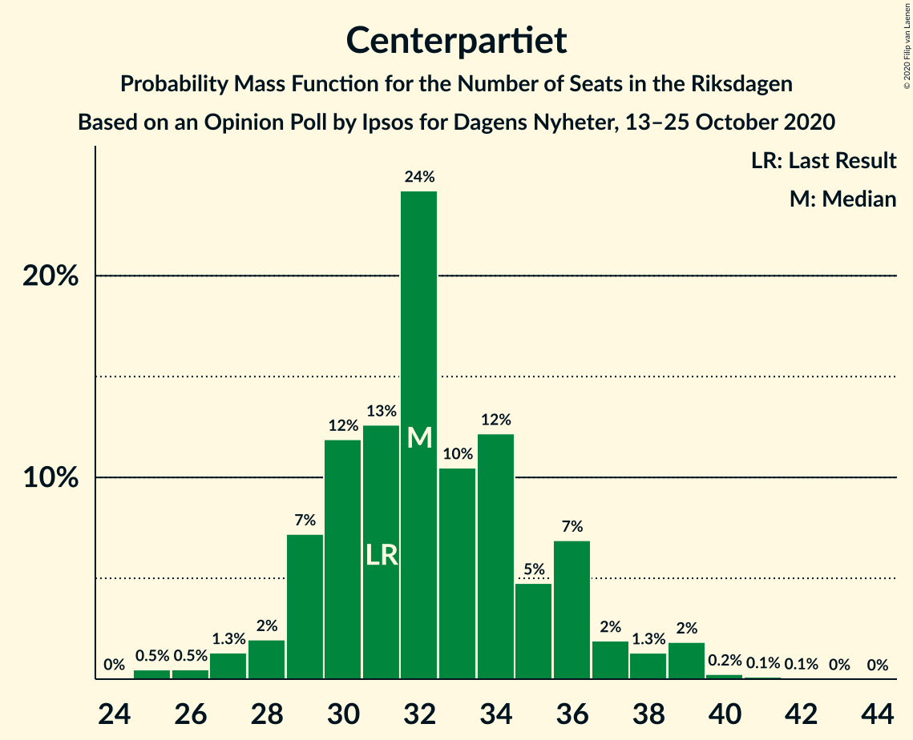
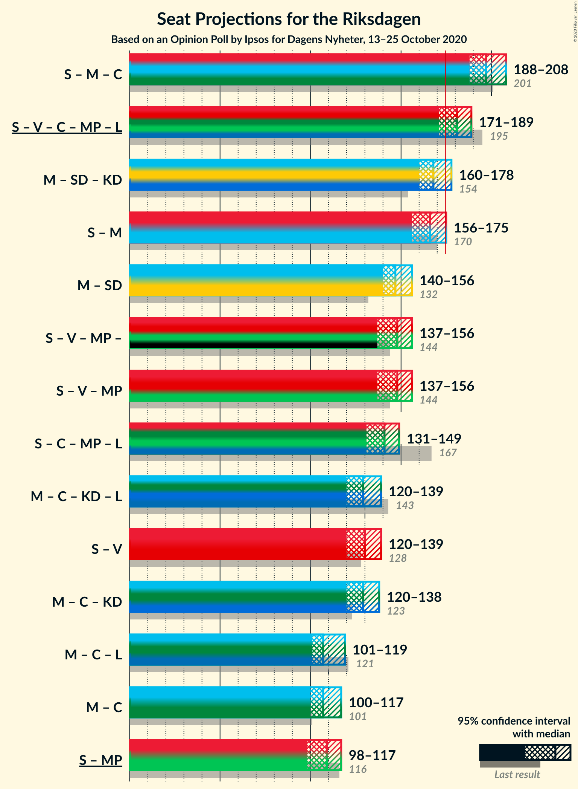

# Opinion Poll by Ipsos for Dagens Nyheter, 13–25 October 2020

<a href="#voting-intentions">Voting Intentions</a> | <a href="#seats">Seats</a> | <a href="#coalitions">Coalitions</a> | <a href="#technical-information">Technical Information</a>

## Voting Intentions

### Confidence Intervals

| Party | Last Result | Poll Result | 80% Confidence Interval | 90% Confidence Interval | 95% Confidence Interval | 99% Confidence Interval |
|:-----:|:-----------:|:-----------:|:-----------------------:|:-----------------------:|:-----------------------:|:-----------------------:|
| Sveriges socialdemokratiska arbetareparti | 28.3% | 25.0% | 23.6–26.5% |23.2–26.9% |22.9–27.3% |22.2–28.0% |
| Moderata samlingspartiet | 19.8% | 21.0% | 19.7–22.4% |19.3–22.8% |19.0–23.2% |18.4–23.8% |
| Sverigedemokraterna | 17.5% | 20.0% | 18.7–21.4% |18.3–21.8% |18.0–22.1% |17.4–22.8% |
| Vänsterpartiet | 8.0% | 11.0% | 10.0–12.1% |9.7–12.4% |9.5–12.7% |9.0–13.2% |
| Centerpartiet | 8.6% | 9.0% | 8.1–10.0% |7.9–10.3% |7.7–10.6% |7.3–11.1% |
| Kristdemokraterna | 6.3% | 6.0% | 5.3–6.9% |5.1–7.1% |4.9–7.3% |4.6–7.8% |
| Miljöpartiet de gröna | 4.4% | 5.0% | 4.3–5.8% |4.1–6.0% |4.0–6.2% |3.7–6.6% |
| Liberalerna | 5.5% | 3.0% | 2.5–3.7% |2.4–3.9% |2.3–4.0% |2.0–4.4% |

*Note:* The poll result column reflects the actual value used in the calculations. Published results may vary slightly, and in addition be rounded to fewer digits.

## Seats

### Confidence Intervals

| Party | Last Result | Median | 80% Confidence Interval | 90% Confidence Interval | 95% Confidence Interval | 99% Confidence Interval |
|:-----:|:-----------:|:------:|:-----------------------:|:-----------------------:|:-----------------------:|:-----------------------:|
| <a href="#sveriges-socialdemokratiska-arbetareparti">Sveriges socialdemokratiska arbetareparti</a> | 100 | 91 | 85–95 |83–97 |82–99 |80–101 |
| <a href="#moderata-samlingspartiet">Moderata samlingspartiet</a> | 70 | 75 | 71–81 |70–83 |68–83 |66–86 |
| <a href="#sverigedemokraterna">Sverigedemokraterna</a> | 62 | 71 | 66–78 |65–78 |64–79 |61–82 |
| <a href="#vänsterpartiet">Vänsterpartiet</a> | 28 | 40 | 36–43 |34–44 |34–45 |33–47 |
| <a href="#centerpartiet">Centerpartiet</a> | 31 | 32 | 29–36 |29–37 |28–38 |25–39 |
| <a href="#kristdemokraterna">Kristdemokraterna</a> | 22 | 21 | 19–25 |18–26 |17–26 |17–27 |
| <a href="#miljöpartiet-de-gröna">Miljöpartiet de gröna</a> | 16 | 18 | 16–20 |15–21 |14–22 |0–24 |
| <a href="#liberalerna">Liberalerna</a> | 20 | 0 | 0 |0 |0 |0–15 |

### Sveriges socialdemokratiska arbetareparti

*For a full overview of the results for this party, see the [Sveriges socialdemokratiska arbetareparti](party-sverigessocialdemokratiskaarbetareparti.html) page.*

| Number of Seats | Probability | Accumulated | Special Marks |
|:---------------:|:-----------:|:-----------:|:-------------:|
| 76 | 0.1% | 100% |  |
| 77 | 0% | 99.9% |  |
| 78 | 0.1% | 99.9% |  |
| 79 | 0.1% | 99.8% |  |
| 80 | 0.3% | 99.7% |  |
| 81 | 0.3% | 99.4% |  |
| 82 | 2% | 99.0% |  |
| 83 | 2% | 97% |  |
| 84 | 4% | 95% |  |
| 85 | 6% | 90% |  |
| 86 | 5% | 85% |  |
| 87 | 6% | 79% |  |
| 88 | 3% | 73% |  |
| 89 | 9% | 70% |  |
| 90 | 10% | 62% |  |
| 91 | 3% | 51% | Median |
| 92 | 19% | 48% |  |
| 93 | 6% | 30% |  |
| 94 | 10% | 24% |  |
| 95 | 6% | 14% |  |
| 96 | 2% | 8% |  |
| 97 | 4% | 7% |  |
| 98 | 0.5% | 3% |  |
| 99 | 1.2% | 3% |  |
| 100 | 0.5% | 1.3% | Last Result |
| 101 | 0.3% | 0.8% |  |
| 102 | 0.2% | 0.5% |  |
| 103 | 0% | 0.2% |  |
| 104 | 0% | 0.2% |  |
| 105 | 0.1% | 0.1% |  |
| 106 | 0% | 0% |  |

### Moderata samlingspartiet

*For a full overview of the results for this party, see the [Moderata samlingspartiet](party-moderatasamlingspartiet.html) page.*

| Number of Seats | Probability | Accumulated | Special Marks |
|:---------------:|:-----------:|:-----------:|:-------------:|
| 63 | 0.1% | 100% |  |
| 64 | 0% | 99.9% |  |
| 65 | 0.4% | 99.9% |  |
| 66 | 0.4% | 99.5% |  |
| 67 | 0.4% | 99.1% |  |
| 68 | 2% | 98.7% |  |
| 69 | 0.9% | 97% |  |
| 70 | 2% | 96% | Last Result |
| 71 | 8% | 94% |  |
| 72 | 18% | 86% |  |
| 73 | 4% | 68% |  |
| 74 | 13% | 64% |  |
| 75 | 7% | 52% | Median |
| 76 | 4% | 44% |  |
| 77 | 15% | 40% |  |
| 78 | 5% | 25% |  |
| 79 | 3% | 20% |  |
| 80 | 6% | 17% |  |
| 81 | 3% | 11% |  |
| 82 | 2% | 7% |  |
| 83 | 4% | 6% |  |
| 84 | 0.6% | 2% |  |
| 85 | 0.2% | 1.3% |  |
| 86 | 0.8% | 1.1% |  |
| 87 | 0.1% | 0.3% |  |
| 88 | 0.2% | 0.2% |  |
| 89 | 0% | 0% |  |

### Sverigedemokraterna

*For a full overview of the results for this party, see the [Sverigedemokraterna](party-sverigedemokraterna.html) page.*

| Number of Seats | Probability | Accumulated | Special Marks |
|:---------------:|:-----------:|:-----------:|:-------------:|
| 60 | 0.1% | 100% |  |
| 61 | 0.6% | 99.9% |  |
| 62 | 0.3% | 99.3% | Last Result |
| 63 | 0.4% | 99.0% |  |
| 64 | 2% | 98.6% |  |
| 65 | 7% | 97% |  |
| 66 | 1.5% | 90% |  |
| 67 | 3% | 89% |  |
| 68 | 4% | 85% |  |
| 69 | 5% | 81% |  |
| 70 | 17% | 76% |  |
| 71 | 13% | 60% | Median |
| 72 | 6% | 47% |  |
| 73 | 6% | 42% |  |
| 74 | 2% | 35% |  |
| 75 | 13% | 33% |  |
| 76 | 4% | 20% |  |
| 77 | 6% | 16% |  |
| 78 | 7% | 10% |  |
| 79 | 2% | 4% |  |
| 80 | 0.6% | 2% |  |
| 81 | 0.3% | 1.0% |  |
| 82 | 0.4% | 0.7% |  |
| 83 | 0.1% | 0.3% |  |
| 84 | 0.1% | 0.2% |  |
| 85 | 0% | 0.1% |  |
| 86 | 0.1% | 0.1% |  |
| 87 | 0% | 0% |  |

### Vänsterpartiet

*For a full overview of the results for this party, see the [Vänsterpartiet](party-vänsterpartiet.html) page.*

| Number of Seats | Probability | Accumulated | Special Marks |
|:---------------:|:-----------:|:-----------:|:-------------:|
| 28 | 0% | 100% | Last Result |
| 29 | 0% | 100% |  |
| 30 | 0% | 100% |  |
| 31 | 0.1% | 100% |  |
| 32 | 0.2% | 99.8% |  |
| 33 | 2% | 99.6% |  |
| 34 | 3% | 98% |  |
| 35 | 3% | 95% |  |
| 36 | 12% | 92% |  |
| 37 | 9% | 81% |  |
| 38 | 6% | 72% |  |
| 39 | 3% | 65% |  |
| 40 | 25% | 63% | Median |
| 41 | 20% | 38% |  |
| 42 | 4% | 18% |  |
| 43 | 7% | 14% |  |
| 44 | 3% | 6% |  |
| 45 | 1.2% | 3% |  |
| 46 | 0.4% | 2% |  |
| 47 | 1.4% | 2% |  |
| 48 | 0.1% | 0.3% |  |
| 49 | 0.1% | 0.2% |  |
| 50 | 0% | 0% |  |

### Centerpartiet

*For a full overview of the results for this party, see the [Centerpartiet](party-centerpartiet.html) page.*

| Number of Seats | Probability | Accumulated | Special Marks |
|:---------------:|:-----------:|:-----------:|:-------------:|
| 25 | 0.5% | 100% |  |
| 26 | 0.5% | 99.5% |  |
| 27 | 1.3% | 99.0% |  |
| 28 | 2% | 98% |  |
| 29 | 7% | 96% |  |
| 30 | 12% | 89% |  |
| 31 | 13% | 77% | Last Result |
| 32 | 24% | 64% | Median |
| 33 | 10% | 40% |  |
| 34 | 12% | 29% |  |
| 35 | 5% | 17% |  |
| 36 | 7% | 12% |  |
| 37 | 2% | 6% |  |
| 38 | 1.3% | 4% |  |
| 39 | 2% | 2% |  |
| 40 | 0.2% | 0.5% |  |
| 41 | 0.1% | 0.2% |  |
| 42 | 0.1% | 0.1% |  |
| 43 | 0% | 0% |  |

### Kristdemokraterna

*For a full overview of the results for this party, see the [Kristdemokraterna](party-kristdemokraterna.html) page.*

| Number of Seats | Probability | Accumulated | Special Marks |
|:---------------:|:-----------:|:-----------:|:-------------:|
| 15 | 0.1% | 100% |  |
| 16 | 0.3% | 99.9% |  |
| 17 | 3% | 99.7% |  |
| 18 | 5% | 97% |  |
| 19 | 10% | 92% |  |
| 20 | 11% | 82% |  |
| 21 | 23% | 71% | Median |
| 22 | 10% | 49% | Last Result |
| 23 | 10% | 38% |  |
| 24 | 15% | 28% |  |
| 25 | 7% | 13% |  |
| 26 | 5% | 6% |  |
| 27 | 0.7% | 1.1% |  |
| 28 | 0.2% | 0.4% |  |
| 29 | 0.1% | 0.2% |  |
| 30 | 0.1% | 0.1% |  |
| 31 | 0% | 0% |  |

### Miljöpartiet de gröna

*For a full overview of the results for this party, see the [Miljöpartiet de gröna](party-miljöpartietdegröna.html) page.*

| Number of Seats | Probability | Accumulated | Special Marks |
|:---------------:|:-----------:|:-----------:|:-------------:|
| 0 | 2% | 100% |  |
| 1 | 0% | 98% |  |
| 2 | 0% | 98% |  |
| 3 | 0% | 98% |  |
| 4 | 0% | 98% |  |
| 5 | 0% | 98% |  |
| 6 | 0% | 98% |  |
| 7 | 0% | 98% |  |
| 8 | 0% | 98% |  |
| 9 | 0% | 98% |  |
| 10 | 0% | 98% |  |
| 11 | 0% | 98% |  |
| 12 | 0% | 98% |  |
| 13 | 0% | 98% |  |
| 14 | 0.1% | 98% |  |
| 15 | 5% | 97% |  |
| 16 | 16% | 93% | Last Result |
| 17 | 18% | 77% |  |
| 18 | 24% | 59% | Median |
| 19 | 19% | 34% |  |
| 20 | 6% | 15% |  |
| 21 | 5% | 10% |  |
| 22 | 3% | 5% |  |
| 23 | 0.6% | 1.4% |  |
| 24 | 0.6% | 0.7% |  |
| 25 | 0.1% | 0.2% |  |
| 26 | 0% | 0% |  |

### Liberalerna

*For a full overview of the results for this party, see the [Liberalerna](party-liberalerna.html) page.*

| Number of Seats | Probability | Accumulated | Special Marks |
|:---------------:|:-----------:|:-----------:|:-------------:|
| 0 | 98% | 100% | Median |
| 1 | 0% | 2% |  |
| 2 | 0% | 2% |  |
| 3 | 0% | 2% |  |
| 4 | 0% | 2% |  |
| 5 | 0% | 2% |  |
| 6 | 0% | 2% |  |
| 7 | 0% | 2% |  |
| 8 | 0% | 2% |  |
| 9 | 0% | 2% |  |
| 10 | 0% | 2% |  |
| 11 | 0% | 2% |  |
| 12 | 0% | 2% |  |
| 13 | 0% | 2% |  |
| 14 | 0.7% | 2% |  |
| 15 | 0.9% | 1.2% |  |
| 16 | 0.2% | 0.3% |  |
| 17 | 0% | 0% |  |
| 18 | 0% | 0% |  |
| 19 | 0% | 0% |  |
| 20 | 0% | 0% | Last Result |

## Coalitions

### Confidence Intervals

| Coalition | Last Result | Median | Majority? | 80% Confidence Interval | 90% Confidence Interval | 95% Confidence Interval | 99% Confidence Interval |
|:---------:|:-----------:|:------:|:---------:|:-----------------------:|:-----------------------:|:-----------------------:|:-----------------------:|
| Sveriges socialdemokratiska arbetareparti – Moderata samlingspartiet – Centerpartiet | 201 | 197 | 100% | 193–206 | 191–207 | 188–208 | 184–211 |
| Sveriges socialdemokratiska arbetareparti – Vänsterpartiet – Centerpartiet – Miljöpartiet de gröna – Liberalerna | 195 | 181 | 88% | 173–186 | 172–188 | 171–189 | 165–192 |
| Moderata samlingspartiet – Sverigedemokraterna – Kristdemokraterna | 154 | 168 | 12% | 163–176 | 161–177 | 160–178 | 157–184 |
| Sveriges socialdemokratiska arbetareparti – Moderata samlingspartiet | 170 | 166 | 6% | 161–173 | 158–175 | 156–175 | 152–178 |
| Moderata samlingspartiet – Sverigedemokraterna | 132 | 147 | 0% | 142–154 | 140–155 | 140–156 | 136–160 |
| Sveriges socialdemokratiska arbetareparti – Vänsterpartiet – Miljöpartiet de gröna | 144 | 148 | 0% | 141–154 | 138–155 | 137–156 | 133–159 |
| Sveriges socialdemokratiska arbetareparti – Centerpartiet – Miljöpartiet de gröna – Liberalerna | 167 | 141 | 0% | 134–148 | 132–149 | 131–149 | 125–153 |
| Moderata samlingspartiet – Centerpartiet – Kristdemokraterna – Liberalerna | 143 | 129 | 0% | 123–136 | 122–138 | 120–139 | 118–145 |
| Sveriges socialdemokratiska arbetareparti – Vänsterpartiet | 128 | 130 | 0% | 123–135 | 122–137 | 120–139 | 118–143 |
| Moderata samlingspartiet – Centerpartiet – Kristdemokraterna | 123 | 129 | 0% | 123–136 | 122–137 | 120–138 | 118–142 |
| Moderata samlingspartiet – Centerpartiet – Liberalerna | 121 | 107 | 0% | 103–113 | 102–115 | 101–119 | 96–121 |
| Moderata samlingspartiet – Centerpartiet | 101 | 107 | 0% | 103–113 | 102–114 | 100–117 | 96–119 |
| Sveriges socialdemokratiska arbetareparti – Miljöpartiet de gröna | 116 | 109 | 0% | 102–114 | 100–116 | 98–117 | 91–120 |

### Sveriges socialdemokratiska arbetareparti – Moderata samlingspartiet – Centerpartiet

| Number of Seats | Probability | Accumulated | Special Marks |
|:---------------:|:-----------:|:-----------:|:-------------:|
| 181 | 0.1% | 100% |  |
| 182 | 0.1% | 99.9% |  |
| 183 | 0.2% | 99.8% |  |
| 184 | 0.2% | 99.6% |  |
| 185 | 0.3% | 99.5% |  |
| 186 | 0.8% | 99.2% |  |
| 187 | 0.7% | 98% |  |
| 188 | 0.3% | 98% |  |
| 189 | 0.6% | 97% |  |
| 190 | 0.7% | 97% |  |
| 191 | 2% | 96% |  |
| 192 | 2% | 94% |  |
| 193 | 3% | 92% |  |
| 194 | 6% | 89% |  |
| 195 | 8% | 84% |  |
| 196 | 18% | 76% |  |
| 197 | 17% | 58% |  |
| 198 | 5% | 40% | Median |
| 199 | 7% | 35% |  |
| 200 | 3% | 28% |  |
| 201 | 5% | 25% | Last Result |
| 202 | 1.4% | 20% |  |
| 203 | 2% | 19% |  |
| 204 | 5% | 17% |  |
| 205 | 1.3% | 12% |  |
| 206 | 3% | 11% |  |
| 207 | 3% | 7% |  |
| 208 | 3% | 5% |  |
| 209 | 1.0% | 2% |  |
| 210 | 0.3% | 1.1% |  |
| 211 | 0.7% | 0.8% |  |
| 212 | 0% | 0.2% |  |
| 213 | 0% | 0.1% |  |
| 214 | 0% | 0.1% |  |
| 215 | 0% | 0.1% |  |
| 216 | 0% | 0.1% |  |
| 217 | 0% | 0.1% |  |
| 218 | 0% | 0% |  |

### Sveriges socialdemokratiska arbetareparti – Vänsterpartiet – Centerpartiet – Miljöpartiet de gröna – Liberalerna

| Number of Seats | Probability | Accumulated | Special Marks |
|:---------------:|:-----------:|:-----------:|:-------------:|
| 162 | 0% | 100% |  |
| 163 | 0.1% | 99.9% |  |
| 164 | 0.2% | 99.9% |  |
| 165 | 0.2% | 99.7% |  |
| 166 | 0.1% | 99.5% |  |
| 167 | 0.3% | 99.4% |  |
| 168 | 0.7% | 99.1% |  |
| 169 | 0.5% | 98% |  |
| 170 | 0.3% | 98% |  |
| 171 | 0.7% | 98% |  |
| 172 | 5% | 97% |  |
| 173 | 3% | 92% |  |
| 174 | 1.4% | 89% |  |
| 175 | 3% | 88% | Majority |
| 176 | 9% | 85% |  |
| 177 | 8% | 76% |  |
| 178 | 7% | 69% |  |
| 179 | 8% | 62% |  |
| 180 | 3% | 54% |  |
| 181 | 8% | 51% | Median |
| 182 | 7% | 43% |  |
| 183 | 15% | 36% |  |
| 184 | 5% | 21% |  |
| 185 | 4% | 16% |  |
| 186 | 2% | 11% |  |
| 187 | 2% | 9% |  |
| 188 | 4% | 8% |  |
| 189 | 1.5% | 3% |  |
| 190 | 0.6% | 2% |  |
| 191 | 0.4% | 1.2% |  |
| 192 | 0.3% | 0.8% |  |
| 193 | 0.2% | 0.5% |  |
| 194 | 0.1% | 0.2% |  |
| 195 | 0.1% | 0.2% | Last Result |
| 196 | 0% | 0.1% |  |
| 197 | 0% | 0% |  |

### Moderata samlingspartiet – Sverigedemokraterna – Kristdemokraterna

| Number of Seats | Probability | Accumulated | Special Marks |
|:---------------:|:-----------:|:-----------:|:-------------:|
| 153 | 0% | 100% |  |
| 154 | 0.1% | 99.9% | Last Result |
| 155 | 0.1% | 99.8% |  |
| 156 | 0.2% | 99.8% |  |
| 157 | 0.3% | 99.5% |  |
| 158 | 0.4% | 99.2% |  |
| 159 | 0.6% | 98.8% |  |
| 160 | 1.5% | 98% |  |
| 161 | 4% | 97% |  |
| 162 | 2% | 92% |  |
| 163 | 2% | 91% |  |
| 164 | 4% | 89% |  |
| 165 | 5% | 84% |  |
| 166 | 15% | 79% |  |
| 167 | 7% | 64% | Median |
| 168 | 8% | 57% |  |
| 169 | 3% | 49% |  |
| 170 | 8% | 46% |  |
| 171 | 7% | 38% |  |
| 172 | 8% | 31% |  |
| 173 | 9% | 24% |  |
| 174 | 3% | 15% |  |
| 175 | 1.4% | 12% | Majority |
| 176 | 3% | 11% |  |
| 177 | 5% | 8% |  |
| 178 | 0.7% | 3% |  |
| 179 | 0.3% | 2% |  |
| 180 | 0.5% | 2% |  |
| 181 | 0.7% | 2% |  |
| 182 | 0.3% | 0.9% |  |
| 183 | 0.1% | 0.6% |  |
| 184 | 0.2% | 0.5% |  |
| 185 | 0.2% | 0.3% |  |
| 186 | 0.1% | 0.1% |  |
| 187 | 0% | 0.1% |  |
| 188 | 0% | 0% |  |

### Sveriges socialdemokratiska arbetareparti – Moderata samlingspartiet

| Number of Seats | Probability | Accumulated | Special Marks |
|:---------------:|:-----------:|:-----------:|:-------------:|
| 149 | 0% | 100% |  |
| 150 | 0.2% | 99.9% |  |
| 151 | 0.1% | 99.7% |  |
| 152 | 0.3% | 99.7% |  |
| 153 | 0.6% | 99.4% |  |
| 154 | 0.6% | 98.8% |  |
| 155 | 0.2% | 98% |  |
| 156 | 0.6% | 98% |  |
| 157 | 1.3% | 97% |  |
| 158 | 2% | 96% |  |
| 159 | 1.2% | 94% |  |
| 160 | 3% | 93% |  |
| 161 | 8% | 90% |  |
| 162 | 4% | 82% |  |
| 163 | 8% | 78% |  |
| 164 | 15% | 71% |  |
| 165 | 5% | 56% |  |
| 166 | 11% | 50% | Median |
| 167 | 12% | 40% |  |
| 168 | 5% | 27% |  |
| 169 | 2% | 22% |  |
| 170 | 5% | 20% | Last Result |
| 171 | 3% | 15% |  |
| 172 | 1.4% | 12% |  |
| 173 | 0.8% | 10% |  |
| 174 | 4% | 9% |  |
| 175 | 3% | 6% | Majority |
| 176 | 0.4% | 2% |  |
| 177 | 1.0% | 2% |  |
| 178 | 0.7% | 1.1% |  |
| 179 | 0.2% | 0.4% |  |
| 180 | 0.1% | 0.2% |  |
| 181 | 0% | 0.1% |  |
| 182 | 0% | 0% |  |

### Moderata samlingspartiet – Sverigedemokraterna

| Number of Seats | Probability | Accumulated | Special Marks |
|:---------------:|:-----------:|:-----------:|:-------------:|
| 132 | 0% | 100% | Last Result |
| 133 | 0.1% | 99.9% |  |
| 134 | 0.1% | 99.8% |  |
| 135 | 0.1% | 99.7% |  |
| 136 | 0.3% | 99.5% |  |
| 137 | 0.2% | 99.2% |  |
| 138 | 0.5% | 99.0% |  |
| 139 | 0.7% | 98% |  |
| 140 | 4% | 98% |  |
| 141 | 3% | 93% |  |
| 142 | 16% | 91% |  |
| 143 | 7% | 75% |  |
| 144 | 4% | 68% |  |
| 145 | 10% | 64% |  |
| 146 | 3% | 54% | Median |
| 147 | 3% | 51% |  |
| 148 | 2% | 48% |  |
| 149 | 9% | 46% |  |
| 150 | 8% | 37% |  |
| 151 | 3% | 29% |  |
| 152 | 13% | 26% |  |
| 153 | 2% | 13% |  |
| 154 | 5% | 11% |  |
| 155 | 4% | 7% |  |
| 156 | 0.6% | 3% |  |
| 157 | 0.5% | 2% |  |
| 158 | 1.0% | 2% |  |
| 159 | 0.3% | 0.9% |  |
| 160 | 0.3% | 0.7% |  |
| 161 | 0.1% | 0.3% |  |
| 162 | 0.1% | 0.2% |  |
| 163 | 0% | 0.1% |  |
| 164 | 0.1% | 0.1% |  |
| 165 | 0% | 0% |  |

### Sveriges socialdemokratiska arbetareparti – Vänsterpartiet – Miljöpartiet de gröna

| Number of Seats | Probability | Accumulated | Special Marks |
|:---------------:|:-----------:|:-----------:|:-------------:|
| 127 | 0% | 100% |  |
| 128 | 0% | 99.9% |  |
| 129 | 0% | 99.9% |  |
| 130 | 0% | 99.9% |  |
| 131 | 0.1% | 99.8% |  |
| 132 | 0.2% | 99.7% |  |
| 133 | 0.3% | 99.5% |  |
| 134 | 0.1% | 99.2% |  |
| 135 | 0.3% | 99.1% |  |
| 136 | 0.2% | 98.8% |  |
| 137 | 1.1% | 98.6% |  |
| 138 | 3% | 97% |  |
| 139 | 2% | 95% |  |
| 140 | 2% | 93% |  |
| 141 | 6% | 91% |  |
| 142 | 4% | 85% |  |
| 143 | 3% | 80% |  |
| 144 | 5% | 77% | Last Result |
| 145 | 7% | 72% |  |
| 146 | 3% | 65% |  |
| 147 | 8% | 62% |  |
| 148 | 6% | 54% |  |
| 149 | 6% | 48% | Median |
| 150 | 9% | 43% |  |
| 151 | 15% | 33% |  |
| 152 | 5% | 19% |  |
| 153 | 3% | 13% |  |
| 154 | 5% | 10% |  |
| 155 | 2% | 5% |  |
| 156 | 2% | 3% |  |
| 157 | 0.5% | 2% |  |
| 158 | 0.6% | 1.3% |  |
| 159 | 0.3% | 0.7% |  |
| 160 | 0.2% | 0.4% |  |
| 161 | 0% | 0.2% |  |
| 162 | 0.1% | 0.2% |  |
| 163 | 0.1% | 0.1% |  |
| 164 | 0% | 0% |  |

### Sveriges socialdemokratiska arbetareparti – Centerpartiet – Miljöpartiet de gröna – Liberalerna

| Number of Seats | Probability | Accumulated | Special Marks |
|:---------------:|:-----------:|:-----------:|:-------------:|
| 121 | 0.2% | 100% |  |
| 122 | 0% | 99.7% |  |
| 123 | 0.2% | 99.7% |  |
| 124 | 0% | 99.5% |  |
| 125 | 0.1% | 99.5% |  |
| 126 | 0.1% | 99.4% |  |
| 127 | 0.7% | 99.3% |  |
| 128 | 0.1% | 98.6% |  |
| 129 | 0.2% | 98.6% |  |
| 130 | 0.2% | 98% |  |
| 131 | 0.7% | 98% |  |
| 132 | 4% | 97% |  |
| 133 | 2% | 93% |  |
| 134 | 1.4% | 91% |  |
| 135 | 0.8% | 89% |  |
| 136 | 11% | 89% |  |
| 137 | 7% | 77% |  |
| 138 | 3% | 70% |  |
| 139 | 3% | 68% |  |
| 140 | 3% | 64% |  |
| 141 | 16% | 61% | Median |
| 142 | 18% | 45% |  |
| 143 | 5% | 27% |  |
| 144 | 4% | 23% |  |
| 145 | 3% | 19% |  |
| 146 | 3% | 16% |  |
| 147 | 2% | 12% |  |
| 148 | 4% | 10% |  |
| 149 | 3% | 6% |  |
| 150 | 0.6% | 2% |  |
| 151 | 0.2% | 2% |  |
| 152 | 0.8% | 2% |  |
| 153 | 0.5% | 0.8% |  |
| 154 | 0.2% | 0.4% |  |
| 155 | 0.1% | 0.2% |  |
| 156 | 0% | 0.1% |  |
| 157 | 0% | 0.1% |  |
| 158 | 0% | 0% |  |
| 159 | 0% | 0% |  |
| 160 | 0% | 0% |  |
| 161 | 0% | 0% |  |
| 162 | 0% | 0% |  |
| 163 | 0% | 0% |  |
| 164 | 0% | 0% |  |
| 165 | 0% | 0% |  |
| 166 | 0% | 0% |  |
| 167 | 0% | 0% | Last Result |

### Moderata samlingspartiet – Centerpartiet – Kristdemokraterna – Liberalerna

| Number of Seats | Probability | Accumulated | Special Marks |
|:---------------:|:-----------:|:-----------:|:-------------:|
| 116 | 0% | 100% |  |
| 117 | 0.1% | 99.9% |  |
| 118 | 0.4% | 99.8% |  |
| 119 | 0.5% | 99.5% |  |
| 120 | 2% | 99.0% |  |
| 121 | 1.1% | 97% |  |
| 122 | 5% | 96% |  |
| 123 | 2% | 91% |  |
| 124 | 1.4% | 89% |  |
| 125 | 4% | 88% |  |
| 126 | 5% | 83% |  |
| 127 | 8% | 78% |  |
| 128 | 15% | 70% | Median |
| 129 | 6% | 55% |  |
| 130 | 10% | 49% |  |
| 131 | 7% | 39% |  |
| 132 | 5% | 31% |  |
| 133 | 4% | 27% |  |
| 134 | 7% | 23% |  |
| 135 | 3% | 16% |  |
| 136 | 6% | 13% |  |
| 137 | 2% | 8% |  |
| 138 | 2% | 5% |  |
| 139 | 0.9% | 3% |  |
| 140 | 0.5% | 2% |  |
| 141 | 0.4% | 2% |  |
| 142 | 0.5% | 1.4% |  |
| 143 | 0.1% | 0.9% | Last Result |
| 144 | 0.2% | 0.7% |  |
| 145 | 0.3% | 0.5% |  |
| 146 | 0.1% | 0.3% |  |
| 147 | 0.1% | 0.2% |  |
| 148 | 0% | 0.1% |  |
| 149 | 0% | 0.1% |  |
| 150 | 0% | 0% |  |

### Sveriges socialdemokratiska arbetareparti – Vänsterpartiet

| Number of Seats | Probability | Accumulated | Special Marks |
|:---------------:|:-----------:|:-----------:|:-------------:|
| 114 | 0% | 100% |  |
| 115 | 0.1% | 99.9% |  |
| 116 | 0.1% | 99.9% |  |
| 117 | 0.1% | 99.8% |  |
| 118 | 0.6% | 99.7% |  |
| 119 | 0.2% | 99.1% |  |
| 120 | 3% | 99.0% |  |
| 121 | 0.2% | 96% |  |
| 122 | 3% | 96% |  |
| 123 | 6% | 92% |  |
| 124 | 3% | 87% |  |
| 125 | 6% | 84% |  |
| 126 | 4% | 78% |  |
| 127 | 3% | 74% |  |
| 128 | 7% | 71% | Last Result |
| 129 | 2% | 64% |  |
| 130 | 13% | 62% |  |
| 131 | 5% | 49% | Median |
| 132 | 8% | 44% |  |
| 133 | 15% | 36% |  |
| 134 | 7% | 20% |  |
| 135 | 7% | 14% |  |
| 136 | 1.5% | 7% |  |
| 137 | 1.0% | 5% |  |
| 138 | 1.5% | 4% |  |
| 139 | 1.5% | 3% |  |
| 140 | 0.6% | 2% |  |
| 141 | 0.4% | 1.0% |  |
| 142 | 0.1% | 0.6% |  |
| 143 | 0.2% | 0.6% |  |
| 144 | 0.1% | 0.4% |  |
| 145 | 0.3% | 0.3% |  |
| 146 | 0% | 0% |  |

### Moderata samlingspartiet – Centerpartiet – Kristdemokraterna

| Number of Seats | Probability | Accumulated | Special Marks |
|:---------------:|:-----------:|:-----------:|:-------------:|
| 115 | 0% | 100% |  |
| 116 | 0.1% | 99.9% |  |
| 117 | 0.2% | 99.9% |  |
| 118 | 0.4% | 99.6% |  |
| 119 | 0.5% | 99.2% |  |
| 120 | 2% | 98.7% |  |
| 121 | 1.2% | 97% |  |
| 122 | 5% | 95% |  |
| 123 | 2% | 90% | Last Result |
| 124 | 2% | 88% |  |
| 125 | 4% | 87% |  |
| 126 | 5% | 82% |  |
| 127 | 8% | 77% |  |
| 128 | 15% | 69% | Median |
| 129 | 7% | 54% |  |
| 130 | 10% | 47% |  |
| 131 | 7% | 37% |  |
| 132 | 5% | 30% |  |
| 133 | 4% | 25% |  |
| 134 | 7% | 22% |  |
| 135 | 3% | 15% |  |
| 136 | 6% | 12% |  |
| 137 | 2% | 6% |  |
| 138 | 2% | 4% |  |
| 139 | 0.9% | 2% |  |
| 140 | 0.5% | 1.3% |  |
| 141 | 0.3% | 0.8% |  |
| 142 | 0.1% | 0.5% |  |
| 143 | 0.1% | 0.4% |  |
| 144 | 0% | 0.3% |  |
| 145 | 0.2% | 0.3% |  |
| 146 | 0% | 0.1% |  |
| 147 | 0.1% | 0.1% |  |
| 148 | 0% | 0% |  |

### Moderata samlingspartiet – Centerpartiet – Liberalerna

| Number of Seats | Probability | Accumulated | Special Marks |
|:---------------:|:-----------:|:-----------:|:-------------:|
| 95 | 0.1% | 100% |  |
| 96 | 0.3% | 99.8% |  |
| 97 | 0.3% | 99.5% |  |
| 98 | 0.1% | 99.2% |  |
| 99 | 0.5% | 99.1% |  |
| 100 | 0.7% | 98.6% |  |
| 101 | 0.9% | 98% |  |
| 102 | 3% | 97% |  |
| 103 | 10% | 94% |  |
| 104 | 18% | 84% |  |
| 105 | 2% | 66% |  |
| 106 | 12% | 64% |  |
| 107 | 3% | 52% | Median |
| 108 | 3% | 49% |  |
| 109 | 5% | 46% |  |
| 110 | 12% | 41% |  |
| 111 | 4% | 29% |  |
| 112 | 8% | 25% |  |
| 113 | 8% | 17% |  |
| 114 | 3% | 9% |  |
| 115 | 0.6% | 6% |  |
| 116 | 0.6% | 5% |  |
| 117 | 1.0% | 4% |  |
| 118 | 0.8% | 3% |  |
| 119 | 2% | 3% |  |
| 120 | 0.3% | 0.9% |  |
| 121 | 0.2% | 0.6% | Last Result |
| 122 | 0.1% | 0.4% |  |
| 123 | 0% | 0.3% |  |
| 124 | 0.1% | 0.3% |  |
| 125 | 0% | 0.2% |  |
| 126 | 0.1% | 0.2% |  |
| 127 | 0% | 0.1% |  |
| 128 | 0% | 0.1% |  |
| 129 | 0% | 0% |  |

### Moderata samlingspartiet – Centerpartiet

| Number of Seats | Probability | Accumulated | Special Marks |
|:---------------:|:-----------:|:-----------:|:-------------:|
| 94 | 0% | 100% |  |
| 95 | 0.2% | 99.9% |  |
| 96 | 0.5% | 99.8% |  |
| 97 | 0.3% | 99.3% |  |
| 98 | 0.2% | 99.0% |  |
| 99 | 0.6% | 98.8% |  |
| 100 | 0.8% | 98% |  |
| 101 | 0.9% | 97% | Last Result |
| 102 | 3% | 97% |  |
| 103 | 11% | 94% |  |
| 104 | 18% | 83% |  |
| 105 | 2% | 65% |  |
| 106 | 12% | 63% |  |
| 107 | 3% | 50% | Median |
| 108 | 3% | 47% |  |
| 109 | 5% | 44% |  |
| 110 | 12% | 39% |  |
| 111 | 4% | 27% |  |
| 112 | 7% | 23% |  |
| 113 | 8% | 15% |  |
| 114 | 3% | 7% |  |
| 115 | 0.6% | 4% |  |
| 116 | 0.5% | 3% |  |
| 117 | 0.9% | 3% |  |
| 118 | 0.5% | 2% |  |
| 119 | 1.1% | 2% |  |
| 120 | 0.2% | 0.5% |  |
| 121 | 0.1% | 0.2% |  |
| 122 | 0.1% | 0.2% |  |
| 123 | 0% | 0% |  |

### Sveriges socialdemokratiska arbetareparti – Miljöpartiet de gröna

| Number of Seats | Probability | Accumulated | Special Marks |
|:---------------:|:-----------:|:-----------:|:-------------:|
| 87 | 0% | 100% |  |
| 88 | 0% | 99.9% |  |
| 89 | 0.2% | 99.9% |  |
| 90 | 0.1% | 99.7% |  |
| 91 | 0.2% | 99.6% |  |
| 92 | 0% | 99.4% |  |
| 93 | 0.1% | 99.3% |  |
| 94 | 0.3% | 99.2% |  |
| 95 | 0% | 99.0% |  |
| 96 | 0.1% | 98.9% |  |
| 97 | 0.8% | 98.8% |  |
| 98 | 0.7% | 98% |  |
| 99 | 0.7% | 97% |  |
| 100 | 2% | 97% |  |
| 101 | 1.4% | 94% |  |
| 102 | 7% | 93% |  |
| 103 | 4% | 85% |  |
| 104 | 5% | 81% |  |
| 105 | 8% | 76% |  |
| 106 | 4% | 68% |  |
| 107 | 10% | 65% |  |
| 108 | 2% | 55% |  |
| 109 | 5% | 52% | Median |
| 110 | 19% | 48% |  |
| 111 | 8% | 28% |  |
| 112 | 7% | 21% |  |
| 113 | 2% | 14% |  |
| 114 | 5% | 12% |  |
| 115 | 2% | 7% |  |
| 116 | 2% | 5% | Last Result |
| 117 | 2% | 3% |  |
| 118 | 0.4% | 1.1% |  |
| 119 | 0.1% | 0.7% |  |
| 120 | 0.2% | 0.5% |  |
| 121 | 0% | 0.4% |  |
| 122 | 0.3% | 0.3% |  |
| 123 | 0% | 0% |  |

## Technical Information

### Opinion Poll

+ **Polling firm:** Ipsos
+ **Commissioner(s):** Dagens Nyheter
+ **Fieldwork period:** 13–25 October 2020

### Calculations

+ **Sample size:** 1486
+ **Simulations done:** 1,048,576
+ **Error estimate:** 1.28%

