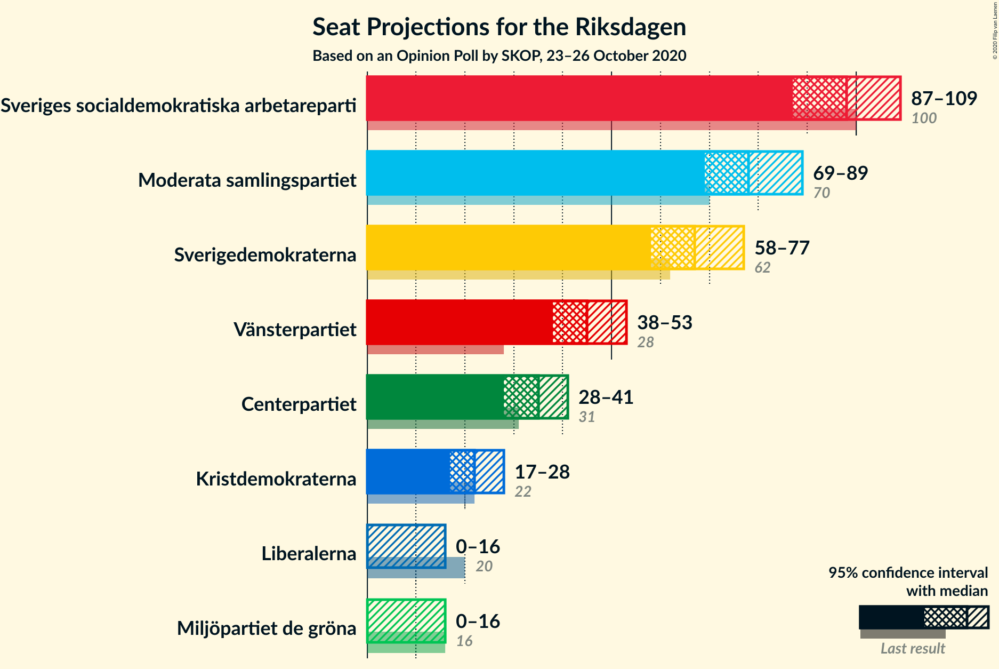

# Opinion Poll by SKOP, 23–26 October 2020

<a href="#voting-intentions">Voting Intentions</a> | <a href="#seats">Seats</a> | <a href="#coalitions">Coalitions</a> | <a href="#technical-information">Technical Information</a>

## Voting Intentions

### Confidence Intervals

| Party | Last Result | Poll Result | 80% Confidence Interval | 90% Confidence Interval | 95% Confidence Interval | 99% Confidence Interval |
|:-----:|:-----------:|:-----------:|:-----------------------:|:-----------------------:|:-----------------------:|:-----------------------:|
| Sveriges socialdemokratiska arbetareparti | 28.3% | 26.0% | 24.3–27.8% |23.8–28.4% |23.4–28.8% |22.6–29.7% |
| Moderata samlingspartiet | 19.8% | 21.1% | 19.5–22.8% |19.1–23.3% |18.7–23.7% |17.9–24.6% |
| Sverigedemokraterna | 17.5% | 17.8% | 16.3–19.4% |15.9–19.9% |15.5–20.3% |14.9–21.1% |
| Vänsterpartiet | 8.0% | 12.1% | 10.9–13.5% |10.5–13.9% |10.2–14.3% |9.6–15.0% |
| Centerpartiet | 8.6% | 9.1% | 8.0–10.4% |7.7–10.7% |7.5–11.1% |7.0–11.7% |
| Kristdemokraterna | 6.3% | 5.9% | 5.0–7.0% |4.8–7.3% |4.6–7.5% |4.2–8.1% |
| Liberalerna | 5.5% | 3.3% | 2.7–4.1% |2.5–4.4% |2.4–4.6% |2.1–5.0% |
| Miljöpartiet de gröna | 4.4% | 3.1% | 2.5–3.9% |2.3–4.2% |2.2–4.4% |1.9–4.8% |

*Note:* The poll result column reflects the actual value used in the calculations. Published results may vary slightly, and in addition be rounded to fewer digits.

## Seats

### Confidence Intervals

| Party | Last Result | Median | 80% Confidence Interval | 90% Confidence Interval | 95% Confidence Interval | 99% Confidence Interval |
|:-----:|:-----------:|:------:|:-----------------------:|:-----------------------:|:-----------------------:|:-----------------------:|
| <a href="#sveriges-socialdemokratiska-arbetareparti">Sveriges socialdemokratiska arbetareparti</a> | 100 | 98 | 91–105 |89–107 |87–109 |84–112 |
| <a href="#moderata-samlingspartiet">Moderata samlingspartiet</a> | 70 | 78 | 73–85 |71–87 |69–89 |67–92 |
| <a href="#sverigedemokraterna">Sverigedemokraterna</a> | 62 | 67 | 61–72 |60–75 |58–77 |55–79 |
| <a href="#vänsterpartiet">Vänsterpartiet</a> | 28 | 45 | 41–51 |39–52 |38–53 |36–56 |
| <a href="#centerpartiet">Centerpartiet</a> | 31 | 35 | 30–39 |29–40 |28–41 |26–43 |
| <a href="#kristdemokraterna">Kristdemokraterna</a> | 22 | 22 | 19–26 |18–27 |17–28 |16–30 |
| <a href="#liberalerna">Liberalerna</a> | 20 | 0 | 0–15 |0–16 |0–16 |0–18 |
| <a href="#miljöpartiet-de-gröna">Miljöpartiet de gröna</a> | 16 | 0 | 0 |0–15 |0–16 |0–17 |

### Sveriges socialdemokratiska arbetareparti

*For a full overview of the results for this party, see the [Sveriges socialdemokratiska arbetareparti](party-sverigessocialdemokratiskaarbetareparti.html) page.*

| Number of Seats | Probability | Accumulated | Special Marks |
|:---------------:|:-----------:|:-----------:|:-------------:|
| 80 | 0% | 100% |  |
| 81 | 0.1% | 99.9% |  |
| 82 | 0.1% | 99.9% |  |
| 83 | 0.2% | 99.8% |  |
| 84 | 0.3% | 99.6% |  |
| 85 | 0.6% | 99.3% |  |
| 86 | 0.6% | 98.7% |  |
| 87 | 0.9% | 98% |  |
| 88 | 1.4% | 97% |  |
| 89 | 3% | 96% |  |
| 90 | 2% | 93% |  |
| 91 | 3% | 91% |  |
| 92 | 3% | 87% |  |
| 93 | 5% | 84% |  |
| 94 | 7% | 80% |  |
| 95 | 7% | 73% |  |
| 96 | 9% | 66% |  |
| 97 | 4% | 57% |  |
| 98 | 7% | 52% | Median |
| 99 | 4% | 46% |  |
| 100 | 11% | 42% | Last Result |
| 101 | 4% | 31% |  |
| 102 | 5% | 27% |  |
| 103 | 8% | 22% |  |
| 104 | 4% | 14% |  |
| 105 | 3% | 10% |  |
| 106 | 2% | 7% |  |
| 107 | 2% | 5% |  |
| 108 | 0.5% | 3% |  |
| 109 | 1.4% | 3% |  |
| 110 | 0.4% | 1.3% |  |
| 111 | 0.2% | 0.9% |  |
| 112 | 0.3% | 0.7% |  |
| 113 | 0.2% | 0.4% |  |
| 114 | 0.2% | 0.2% |  |
| 115 | 0% | 0.1% |  |
| 116 | 0% | 0.1% |  |
| 117 | 0% | 0% |  |

### Moderata samlingspartiet

*For a full overview of the results for this party, see the [Moderata samlingspartiet](party-moderatasamlingspartiet.html) page.*

| Number of Seats | Probability | Accumulated | Special Marks |
|:---------------:|:-----------:|:-----------:|:-------------:|
| 63 | 0% | 100% |  |
| 64 | 0.1% | 99.9% |  |
| 65 | 0.1% | 99.9% |  |
| 66 | 0.2% | 99.8% |  |
| 67 | 0.3% | 99.6% |  |
| 68 | 0.7% | 99.2% |  |
| 69 | 1.3% | 98.5% |  |
| 70 | 2% | 97% | Last Result |
| 71 | 2% | 95% |  |
| 72 | 3% | 93% |  |
| 73 | 2% | 91% |  |
| 74 | 4% | 88% |  |
| 75 | 7% | 84% |  |
| 76 | 9% | 77% |  |
| 77 | 10% | 68% |  |
| 78 | 10% | 58% | Median |
| 79 | 5% | 48% |  |
| 80 | 5% | 43% |  |
| 81 | 6% | 38% |  |
| 82 | 7% | 32% |  |
| 83 | 7% | 25% |  |
| 84 | 6% | 17% |  |
| 85 | 3% | 11% |  |
| 86 | 2% | 8% |  |
| 87 | 2% | 6% |  |
| 88 | 1.3% | 5% |  |
| 89 | 1.2% | 3% |  |
| 90 | 0.7% | 2% |  |
| 91 | 0.7% | 1.5% |  |
| 92 | 0.4% | 0.8% |  |
| 93 | 0.1% | 0.4% |  |
| 94 | 0.1% | 0.3% |  |
| 95 | 0.1% | 0.2% |  |
| 96 | 0.1% | 0.1% |  |
| 97 | 0% | 0% |  |

### Sverigedemokraterna

*For a full overview of the results for this party, see the [Sverigedemokraterna](party-sverigedemokraterna.html) page.*

| Number of Seats | Probability | Accumulated | Special Marks |
|:---------------:|:-----------:|:-----------:|:-------------:|
| 52 | 0% | 100% |  |
| 53 | 0.1% | 99.9% |  |
| 54 | 0.2% | 99.9% |  |
| 55 | 0.3% | 99.7% |  |
| 56 | 0.6% | 99.4% |  |
| 57 | 0.8% | 98.9% |  |
| 58 | 1.2% | 98% |  |
| 59 | 1.3% | 97% |  |
| 60 | 3% | 96% |  |
| 61 | 4% | 93% |  |
| 62 | 6% | 89% | Last Result |
| 63 | 4% | 84% |  |
| 64 | 5% | 80% |  |
| 65 | 7% | 74% |  |
| 66 | 11% | 68% |  |
| 67 | 12% | 57% | Median |
| 68 | 9% | 45% |  |
| 69 | 3% | 36% |  |
| 70 | 6% | 33% |  |
| 71 | 9% | 27% |  |
| 72 | 8% | 18% |  |
| 73 | 3% | 10% |  |
| 74 | 1.4% | 7% |  |
| 75 | 2% | 6% |  |
| 76 | 1.4% | 4% |  |
| 77 | 1.1% | 3% |  |
| 78 | 0.7% | 1.5% |  |
| 79 | 0.3% | 0.7% |  |
| 80 | 0.1% | 0.4% |  |
| 81 | 0.1% | 0.3% |  |
| 82 | 0.1% | 0.2% |  |
| 83 | 0% | 0.1% |  |
| 84 | 0% | 0% |  |

### Vänsterpartiet

*For a full overview of the results for this party, see the [Vänsterpartiet](party-vänsterpartiet.html) page.*

| Number of Seats | Probability | Accumulated | Special Marks |
|:---------------:|:-----------:|:-----------:|:-------------:|
| 28 | 0% | 100% | Last Result |
| 29 | 0% | 100% |  |
| 30 | 0% | 100% |  |
| 31 | 0% | 100% |  |
| 32 | 0% | 100% |  |
| 33 | 0% | 100% |  |
| 34 | 0.1% | 100% |  |
| 35 | 0.1% | 99.8% |  |
| 36 | 0.7% | 99.7% |  |
| 37 | 0.5% | 99.0% |  |
| 38 | 2% | 98% |  |
| 39 | 3% | 96% |  |
| 40 | 2% | 93% |  |
| 41 | 9% | 91% |  |
| 42 | 5% | 82% |  |
| 43 | 11% | 77% |  |
| 44 | 11% | 66% |  |
| 45 | 7% | 56% | Median |
| 46 | 13% | 49% |  |
| 47 | 6% | 37% |  |
| 48 | 7% | 30% |  |
| 49 | 8% | 23% |  |
| 50 | 4% | 15% |  |
| 51 | 5% | 11% |  |
| 52 | 1.4% | 6% |  |
| 53 | 2% | 4% |  |
| 54 | 0.9% | 2% |  |
| 55 | 0.7% | 1.5% |  |
| 56 | 0.4% | 0.8% |  |
| 57 | 0.1% | 0.4% |  |
| 58 | 0.2% | 0.3% |  |
| 59 | 0% | 0.1% |  |
| 60 | 0% | 0.1% |  |
| 61 | 0% | 0% |  |

### Centerpartiet

*For a full overview of the results for this party, see the [Centerpartiet](party-centerpartiet.html) page.*

| Number of Seats | Probability | Accumulated | Special Marks |
|:---------------:|:-----------:|:-----------:|:-------------:|
| 24 | 0.1% | 100% |  |
| 25 | 0.2% | 99.9% |  |
| 26 | 0.6% | 99.7% |  |
| 27 | 1.2% | 99.1% |  |
| 28 | 2% | 98% |  |
| 29 | 2% | 96% |  |
| 30 | 4% | 94% |  |
| 31 | 7% | 89% | Last Result |
| 32 | 10% | 82% |  |
| 33 | 11% | 73% |  |
| 34 | 8% | 62% |  |
| 35 | 14% | 54% | Median |
| 36 | 11% | 40% |  |
| 37 | 10% | 30% |  |
| 38 | 7% | 19% |  |
| 39 | 4% | 12% |  |
| 40 | 4% | 8% |  |
| 41 | 2% | 4% |  |
| 42 | 1.2% | 2% |  |
| 43 | 0.5% | 0.9% |  |
| 44 | 0.2% | 0.5% |  |
| 45 | 0.1% | 0.2% |  |
| 46 | 0% | 0.1% |  |
| 47 | 0% | 0.1% |  |
| 48 | 0% | 0% |  |

### Kristdemokraterna

*For a full overview of the results for this party, see the [Kristdemokraterna](party-kristdemokraterna.html) page.*

| Number of Seats | Probability | Accumulated | Special Marks |
|:---------------:|:-----------:|:-----------:|:-------------:|
| 0 | 0.2% | 100% |  |
| 1 | 0% | 99.8% |  |
| 2 | 0% | 99.8% |  |
| 3 | 0% | 99.8% |  |
| 4 | 0% | 99.8% |  |
| 5 | 0% | 99.8% |  |
| 6 | 0% | 99.8% |  |
| 7 | 0% | 99.8% |  |
| 8 | 0% | 99.8% |  |
| 9 | 0% | 99.8% |  |
| 10 | 0% | 99.8% |  |
| 11 | 0% | 99.8% |  |
| 12 | 0% | 99.8% |  |
| 13 | 0% | 99.8% |  |
| 14 | 0% | 99.8% |  |
| 15 | 0.2% | 99.8% |  |
| 16 | 0.8% | 99.6% |  |
| 17 | 2% | 98.9% |  |
| 18 | 5% | 97% |  |
| 19 | 9% | 92% |  |
| 20 | 10% | 82% |  |
| 21 | 15% | 72% |  |
| 22 | 15% | 57% | Last Result, Median |
| 23 | 11% | 42% |  |
| 24 | 9% | 31% |  |
| 25 | 8% | 22% |  |
| 26 | 5% | 14% |  |
| 27 | 4% | 9% |  |
| 28 | 3% | 5% |  |
| 29 | 1.2% | 2% |  |
| 30 | 0.6% | 1.1% |  |
| 31 | 0.3% | 0.4% |  |
| 32 | 0.1% | 0.2% |  |
| 33 | 0% | 0% |  |

### Liberalerna

*For a full overview of the results for this party, see the [Liberalerna](party-liberalerna.html) page.*

| Number of Seats | Probability | Accumulated | Special Marks |
|:---------------:|:-----------:|:-----------:|:-------------:|
| 0 | 89% | 100% | Median |
| 1 | 0% | 11% |  |
| 2 | 0% | 11% |  |
| 3 | 0% | 11% |  |
| 4 | 0% | 11% |  |
| 5 | 0% | 11% |  |
| 6 | 0% | 11% |  |
| 7 | 0% | 11% |  |
| 8 | 0% | 11% |  |
| 9 | 0% | 11% |  |
| 10 | 0% | 11% |  |
| 11 | 0% | 11% |  |
| 12 | 0% | 11% |  |
| 13 | 0% | 11% |  |
| 14 | 0.1% | 11% |  |
| 15 | 5% | 11% |  |
| 16 | 3% | 6% |  |
| 17 | 1.4% | 2% |  |
| 18 | 0.8% | 1.1% |  |
| 19 | 0.2% | 0.3% |  |
| 20 | 0.1% | 0.1% | Last Result |
| 21 | 0% | 0% |  |

### Miljöpartiet de gröna

*For a full overview of the results for this party, see the [Miljöpartiet de gröna](party-miljöpartietdegröna.html) page.*

| Number of Seats | Probability | Accumulated | Special Marks |
|:---------------:|:-----------:|:-----------:|:-------------:|
| 0 | 94% | 100% | Median |
| 1 | 0% | 6% |  |
| 2 | 0% | 6% |  |
| 3 | 0% | 6% |  |
| 4 | 0% | 6% |  |
| 5 | 0% | 6% |  |
| 6 | 0% | 6% |  |
| 7 | 0% | 6% |  |
| 8 | 0% | 6% |  |
| 9 | 0% | 6% |  |
| 10 | 0% | 6% |  |
| 11 | 0% | 6% |  |
| 12 | 0% | 6% |  |
| 13 | 0% | 6% |  |
| 14 | 0.1% | 6% |  |
| 15 | 3% | 6% |  |
| 16 | 2% | 3% | Last Result |
| 17 | 0.9% | 1.3% |  |
| 18 | 0.3% | 0.4% |  |
| 19 | 0.1% | 0.1% |  |
| 20 | 0% | 0% |  |

## Coalitions

### Confidence Intervals

| Coalition | Last Result | Median | Majority? | 80% Confidence Interval | 90% Confidence Interval | 95% Confidence Interval | 99% Confidence Interval |
|:---------:|:-----------:|:------:|:---------:|:-----------------------:|:-----------------------:|:-----------------------:|:-----------------------:|
| Sveriges socialdemokratiska arbetareparti – Moderata samlingspartiet – Centerpartiet | 201 | 212 | 100% | 203–220 | 199–222 | 197–223 | 192–227 |
| Sveriges socialdemokratiska arbetareparti – Vänsterpartiet – Centerpartiet – Liberalerna – Miljöpartiet de gröna | 195 | 180 | 83% | 172–189 | 170–191 | 169–194 | 165–198 |
| Sveriges socialdemokratiska arbetareparti – Moderata samlingspartiet | 170 | 177 | 64% | 168–185 | 166–187 | 163–189 | 159–193 |
| Moderata samlingspartiet – Sverigedemokraterna – Kristdemokraterna | 154 | 169 | 17% | 160–177 | 158–179 | 155–180 | 151–184 |
| Moderata samlingspartiet – Sverigedemokraterna | 132 | 147 | 0% | 138–154 | 136–156 | 134–158 | 130–162 |
| Sveriges socialdemokratiska arbetareparti – Vänsterpartiet – Miljöpartiet de gröna | 144 | 144 | 0% | 136–153 | 134–155 | 132–157 | 128–162 |
| Sveriges socialdemokratiska arbetareparti – Vänsterpartiet | 128 | 143 | 0% | 135–151 | 133–153 | 131–155 | 126–159 |
| Moderata samlingspartiet – Centerpartiet – Kristdemokraterna – Liberalerna | 143 | 137 | 0% | 130–146 | 127–149 | 125–152 | 121–157 |
| Sveriges socialdemokratiska arbetareparti – Centerpartiet – Liberalerna – Miljöpartiet de gröna | 167 | 135 | 0% | 127–144 | 125–146 | 123–149 | 120–155 |
| Moderata samlingspartiet – Centerpartiet – Kristdemokraterna | 123 | 136 | 0% | 128–144 | 125–146 | 123–147 | 119–152 |
| Moderata samlingspartiet – Centerpartiet – Liberalerna | 121 | 115 | 0% | 108–124 | 105–127 | 104–129 | 100–135 |
| Moderata samlingspartiet – Centerpartiet | 101 | 114 | 0% | 106–120 | 104–123 | 102–125 | 99–129 |
| Sveriges socialdemokratiska arbetareparti – Miljöpartiet de gröna | 116 | 99 | 0% | 91–106 | 89–109 | 88–112 | 85–117 |

### Sveriges socialdemokratiska arbetareparti – Moderata samlingspartiet – Centerpartiet

| Number of Seats | Probability | Accumulated | Special Marks |
|:---------------:|:-----------:|:-----------:|:-------------:|
| 186 | 0% | 100% |  |
| 187 | 0.1% | 99.9% |  |
| 188 | 0% | 99.8% |  |
| 189 | 0.1% | 99.8% |  |
| 190 | 0.1% | 99.7% |  |
| 191 | 0.1% | 99.7% |  |
| 192 | 0.3% | 99.5% |  |
| 193 | 0.2% | 99.3% |  |
| 194 | 0.3% | 99.1% |  |
| 195 | 0.3% | 98.8% |  |
| 196 | 0.5% | 98% |  |
| 197 | 0.6% | 98% |  |
| 198 | 2% | 97% |  |
| 199 | 1.0% | 96% |  |
| 200 | 1.3% | 95% |  |
| 201 | 2% | 94% | Last Result |
| 202 | 2% | 92% |  |
| 203 | 3% | 90% |  |
| 204 | 3% | 88% |  |
| 205 | 4% | 85% |  |
| 206 | 5% | 81% |  |
| 207 | 3% | 76% |  |
| 208 | 4% | 73% |  |
| 209 | 5% | 69% |  |
| 210 | 6% | 64% |  |
| 211 | 6% | 58% | Median |
| 212 | 5% | 53% |  |
| 213 | 6% | 48% |  |
| 214 | 11% | 42% |  |
| 215 | 4% | 31% |  |
| 216 | 7% | 27% |  |
| 217 | 4% | 20% |  |
| 218 | 2% | 17% |  |
| 219 | 4% | 14% |  |
| 220 | 3% | 11% |  |
| 221 | 1.4% | 8% |  |
| 222 | 3% | 6% |  |
| 223 | 1.0% | 3% |  |
| 224 | 0.8% | 2% |  |
| 225 | 0.6% | 2% |  |
| 226 | 0.4% | 1.0% |  |
| 227 | 0.3% | 0.7% |  |
| 228 | 0.1% | 0.4% |  |
| 229 | 0.1% | 0.3% |  |
| 230 | 0.1% | 0.2% |  |
| 231 | 0% | 0.1% |  |
| 232 | 0% | 0.1% |  |
| 233 | 0% | 0% |  |

### Sveriges socialdemokratiska arbetareparti – Vänsterpartiet – Centerpartiet – Liberalerna – Miljöpartiet de gröna

| Number of Seats | Probability | Accumulated | Special Marks |
|:---------------:|:-----------:|:-----------:|:-------------:|
| 161 | 0% | 100% |  |
| 162 | 0.1% | 99.9% |  |
| 163 | 0.2% | 99.8% |  |
| 164 | 0.2% | 99.7% |  |
| 165 | 0.3% | 99.5% |  |
| 166 | 0.2% | 99.2% |  |
| 167 | 0.4% | 99.0% |  |
| 168 | 1.0% | 98.6% |  |
| 169 | 1.3% | 98% |  |
| 170 | 1.4% | 96% |  |
| 171 | 2% | 95% |  |
| 172 | 4% | 93% |  |
| 173 | 3% | 88% |  |
| 174 | 3% | 85% |  |
| 175 | 4% | 83% | Majority |
| 176 | 3% | 78% |  |
| 177 | 5% | 75% |  |
| 178 | 8% | 70% | Median |
| 179 | 6% | 62% |  |
| 180 | 8% | 57% |  |
| 181 | 6% | 49% |  |
| 182 | 7% | 43% |  |
| 183 | 4% | 36% |  |
| 184 | 5% | 32% |  |
| 185 | 6% | 27% |  |
| 186 | 5% | 22% |  |
| 187 | 3% | 17% |  |
| 188 | 3% | 14% |  |
| 189 | 3% | 12% |  |
| 190 | 3% | 9% |  |
| 191 | 1.1% | 6% |  |
| 192 | 1.4% | 5% |  |
| 193 | 0.8% | 3% |  |
| 194 | 0.7% | 3% |  |
| 195 | 0.3% | 2% | Last Result |
| 196 | 0.4% | 2% |  |
| 197 | 0.3% | 1.1% |  |
| 198 | 0.4% | 0.9% |  |
| 199 | 0.1% | 0.5% |  |
| 200 | 0.2% | 0.4% |  |
| 201 | 0.1% | 0.2% |  |
| 202 | 0% | 0.1% |  |
| 203 | 0% | 0.1% |  |
| 204 | 0% | 0.1% |  |
| 205 | 0% | 0% |  |

### Sveriges socialdemokratiska arbetareparti – Moderata samlingspartiet

| Number of Seats | Probability | Accumulated | Special Marks |
|:---------------:|:-----------:|:-----------:|:-------------:|
| 153 | 0% | 100% |  |
| 154 | 0% | 99.9% |  |
| 155 | 0% | 99.9% |  |
| 156 | 0% | 99.9% |  |
| 157 | 0.1% | 99.8% |  |
| 158 | 0.1% | 99.7% |  |
| 159 | 0.2% | 99.6% |  |
| 160 | 0.3% | 99.4% |  |
| 161 | 0.3% | 99.1% |  |
| 162 | 0.8% | 98.7% |  |
| 163 | 0.8% | 98% |  |
| 164 | 0.7% | 97% |  |
| 165 | 1.4% | 96% |  |
| 166 | 2% | 95% |  |
| 167 | 2% | 94% |  |
| 168 | 3% | 92% |  |
| 169 | 2% | 88% |  |
| 170 | 3% | 86% | Last Result |
| 171 | 4% | 83% |  |
| 172 | 3% | 79% |  |
| 173 | 7% | 76% |  |
| 174 | 5% | 69% |  |
| 175 | 4% | 64% | Majority |
| 176 | 7% | 60% | Median |
| 177 | 5% | 53% |  |
| 178 | 7% | 48% |  |
| 179 | 8% | 42% |  |
| 180 | 8% | 34% |  |
| 181 | 3% | 26% |  |
| 182 | 4% | 23% |  |
| 183 | 5% | 19% |  |
| 184 | 2% | 15% |  |
| 185 | 4% | 12% |  |
| 186 | 2% | 8% |  |
| 187 | 2% | 6% |  |
| 188 | 1.2% | 4% |  |
| 189 | 0.7% | 3% |  |
| 190 | 0.8% | 2% |  |
| 191 | 0.6% | 2% |  |
| 192 | 0.2% | 0.9% |  |
| 193 | 0.3% | 0.6% |  |
| 194 | 0.1% | 0.4% |  |
| 195 | 0.1% | 0.2% |  |
| 196 | 0.1% | 0.1% |  |
| 197 | 0% | 0.1% |  |
| 198 | 0% | 0% |  |

### Moderata samlingspartiet – Sverigedemokraterna – Kristdemokraterna

| Number of Seats | Probability | Accumulated | Special Marks |
|:---------------:|:-----------:|:-----------:|:-------------:|
| 145 | 0% | 100% |  |
| 146 | 0% | 99.9% |  |
| 147 | 0% | 99.9% |  |
| 148 | 0.1% | 99.9% |  |
| 149 | 0.2% | 99.8% |  |
| 150 | 0.1% | 99.6% |  |
| 151 | 0.4% | 99.5% |  |
| 152 | 0.3% | 99.1% |  |
| 153 | 0.4% | 98.9% |  |
| 154 | 0.3% | 98% | Last Result |
| 155 | 0.7% | 98% |  |
| 156 | 0.8% | 97% |  |
| 157 | 1.4% | 97% |  |
| 158 | 1.1% | 95% |  |
| 159 | 3% | 94% |  |
| 160 | 3% | 91% |  |
| 161 | 3% | 88% |  |
| 162 | 3% | 86% |  |
| 163 | 5% | 83% |  |
| 164 | 6% | 78% |  |
| 165 | 5% | 73% |  |
| 166 | 4% | 68% |  |
| 167 | 7% | 64% | Median |
| 168 | 6% | 57% |  |
| 169 | 8% | 51% |  |
| 170 | 6% | 43% |  |
| 171 | 8% | 38% |  |
| 172 | 5% | 30% |  |
| 173 | 3% | 25% |  |
| 174 | 4% | 22% |  |
| 175 | 3% | 17% | Majority |
| 176 | 3% | 15% |  |
| 177 | 4% | 12% |  |
| 178 | 2% | 7% |  |
| 179 | 1.4% | 5% |  |
| 180 | 1.3% | 4% |  |
| 181 | 1.0% | 2% |  |
| 182 | 0.4% | 1.4% |  |
| 183 | 0.2% | 1.0% |  |
| 184 | 0.3% | 0.8% |  |
| 185 | 0.2% | 0.5% |  |
| 186 | 0.2% | 0.3% |  |
| 187 | 0.1% | 0.2% |  |
| 188 | 0% | 0.1% |  |
| 189 | 0% | 0% |  |

### Moderata samlingspartiet – Sverigedemokraterna

| Number of Seats | Probability | Accumulated | Special Marks |
|:---------------:|:-----------:|:-----------:|:-------------:|
| 124 | 0% | 100% |  |
| 125 | 0% | 99.9% |  |
| 126 | 0% | 99.9% |  |
| 127 | 0.1% | 99.9% |  |
| 128 | 0.1% | 99.8% |  |
| 129 | 0.2% | 99.7% |  |
| 130 | 0.4% | 99.5% |  |
| 131 | 0.5% | 99.1% |  |
| 132 | 0.4% | 98.6% | Last Result |
| 133 | 0.7% | 98% |  |
| 134 | 0.8% | 98% |  |
| 135 | 1.3% | 97% |  |
| 136 | 2% | 95% |  |
| 137 | 2% | 94% |  |
| 138 | 2% | 92% |  |
| 139 | 2% | 89% |  |
| 140 | 3% | 87% |  |
| 141 | 5% | 84% |  |
| 142 | 7% | 79% |  |
| 143 | 8% | 72% |  |
| 144 | 6% | 65% |  |
| 145 | 4% | 59% | Median |
| 146 | 5% | 55% |  |
| 147 | 5% | 50% |  |
| 148 | 7% | 45% |  |
| 149 | 7% | 37% |  |
| 150 | 7% | 31% |  |
| 151 | 7% | 24% |  |
| 152 | 4% | 17% |  |
| 153 | 2% | 12% |  |
| 154 | 1.4% | 11% |  |
| 155 | 3% | 9% |  |
| 156 | 3% | 7% |  |
| 157 | 1.0% | 4% |  |
| 158 | 0.9% | 3% |  |
| 159 | 0.7% | 2% |  |
| 160 | 0.8% | 2% |  |
| 161 | 0.2% | 0.7% |  |
| 162 | 0.1% | 0.5% |  |
| 163 | 0.1% | 0.4% |  |
| 164 | 0.1% | 0.3% |  |
| 165 | 0.1% | 0.1% |  |
| 166 | 0% | 0.1% |  |
| 167 | 0% | 0% |  |

### Sveriges socialdemokratiska arbetareparti – Vänsterpartiet – Miljöpartiet de gröna

| Number of Seats | Probability | Accumulated | Special Marks |
|:---------------:|:-----------:|:-----------:|:-------------:|
| 123 | 0% | 100% |  |
| 124 | 0% | 99.9% |  |
| 125 | 0% | 99.9% |  |
| 126 | 0.2% | 99.9% |  |
| 127 | 0.1% | 99.7% |  |
| 128 | 0.7% | 99.6% |  |
| 129 | 0.2% | 98.9% |  |
| 130 | 0.5% | 98.7% |  |
| 131 | 0.5% | 98% |  |
| 132 | 0.9% | 98% |  |
| 133 | 1.2% | 97% |  |
| 134 | 2% | 96% |  |
| 135 | 2% | 94% |  |
| 136 | 3% | 92% |  |
| 137 | 4% | 89% |  |
| 138 | 4% | 85% |  |
| 139 | 4% | 81% |  |
| 140 | 5% | 77% |  |
| 141 | 4% | 72% |  |
| 142 | 6% | 69% |  |
| 143 | 7% | 62% | Median |
| 144 | 9% | 55% | Last Result |
| 145 | 5% | 46% |  |
| 146 | 7% | 41% |  |
| 147 | 6% | 34% |  |
| 148 | 4% | 28% |  |
| 149 | 4% | 24% |  |
| 150 | 3% | 20% |  |
| 151 | 4% | 17% |  |
| 152 | 2% | 13% |  |
| 153 | 3% | 11% |  |
| 154 | 2% | 7% |  |
| 155 | 1.3% | 6% |  |
| 156 | 1.4% | 4% |  |
| 157 | 0.4% | 3% |  |
| 158 | 0.8% | 2% |  |
| 159 | 0.3% | 2% |  |
| 160 | 0.5% | 1.3% |  |
| 161 | 0.3% | 0.8% |  |
| 162 | 0.2% | 0.5% |  |
| 163 | 0.1% | 0.3% |  |
| 164 | 0.1% | 0.3% |  |
| 165 | 0.1% | 0.2% |  |
| 166 | 0% | 0.1% |  |
| 167 | 0% | 0.1% |  |
| 168 | 0% | 0% |  |

### Sveriges socialdemokratiska arbetareparti – Vänsterpartiet

| Number of Seats | Probability | Accumulated | Special Marks |
|:---------------:|:-----------:|:-----------:|:-------------:|
| 122 | 0% | 100% |  |
| 123 | 0% | 99.9% |  |
| 124 | 0.1% | 99.9% |  |
| 125 | 0.1% | 99.8% |  |
| 126 | 0.2% | 99.7% |  |
| 127 | 0.2% | 99.5% |  |
| 128 | 0.8% | 99.3% | Last Result |
| 129 | 0.3% | 98.5% |  |
| 130 | 0.7% | 98% |  |
| 131 | 1.0% | 98% |  |
| 132 | 1.2% | 97% |  |
| 133 | 2% | 95% |  |
| 134 | 2% | 94% |  |
| 135 | 3% | 92% |  |
| 136 | 3% | 89% |  |
| 137 | 4% | 86% |  |
| 138 | 4% | 82% |  |
| 139 | 4% | 77% |  |
| 140 | 5% | 73% |  |
| 141 | 4% | 68% |  |
| 142 | 7% | 64% |  |
| 143 | 7% | 57% | Median |
| 144 | 9% | 50% |  |
| 145 | 5% | 41% |  |
| 146 | 7% | 36% |  |
| 147 | 6% | 29% |  |
| 148 | 4% | 23% |  |
| 149 | 3% | 19% |  |
| 150 | 2% | 16% |  |
| 151 | 4% | 14% |  |
| 152 | 2% | 10% |  |
| 153 | 3% | 7% |  |
| 154 | 1.5% | 4% |  |
| 155 | 0.9% | 3% |  |
| 156 | 0.9% | 2% |  |
| 157 | 0.2% | 1.2% |  |
| 158 | 0.4% | 1.0% |  |
| 159 | 0.2% | 0.6% |  |
| 160 | 0.2% | 0.4% |  |
| 161 | 0.1% | 0.2% |  |
| 162 | 0.1% | 0.1% |  |
| 163 | 0% | 0.1% |  |
| 164 | 0% | 0% |  |

### Moderata samlingspartiet – Centerpartiet – Kristdemokraterna – Liberalerna

| Number of Seats | Probability | Accumulated | Special Marks |
|:---------------:|:-----------:|:-----------:|:-------------:|
| 117 | 0% | 100% |  |
| 118 | 0% | 99.9% |  |
| 119 | 0.1% | 99.9% |  |
| 120 | 0.1% | 99.8% |  |
| 121 | 0.2% | 99.6% |  |
| 122 | 0.3% | 99.5% |  |
| 123 | 0.6% | 99.2% |  |
| 124 | 0.8% | 98.6% |  |
| 125 | 0.6% | 98% |  |
| 126 | 0.7% | 97% |  |
| 127 | 2% | 96% |  |
| 128 | 1.4% | 94% |  |
| 129 | 2% | 93% |  |
| 130 | 5% | 91% |  |
| 131 | 2% | 86% |  |
| 132 | 5% | 83% |  |
| 133 | 8% | 79% |  |
| 134 | 2% | 70% |  |
| 135 | 7% | 69% | Median |
| 136 | 9% | 61% |  |
| 137 | 5% | 53% |  |
| 138 | 6% | 48% |  |
| 139 | 9% | 42% |  |
| 140 | 3% | 34% |  |
| 141 | 5% | 30% |  |
| 142 | 5% | 25% |  |
| 143 | 2% | 20% | Last Result |
| 144 | 3% | 18% |  |
| 145 | 4% | 15% |  |
| 146 | 2% | 12% |  |
| 147 | 3% | 10% |  |
| 148 | 1.4% | 7% |  |
| 149 | 0.7% | 5% |  |
| 150 | 1.0% | 5% |  |
| 151 | 0.9% | 4% |  |
| 152 | 0.7% | 3% |  |
| 153 | 0.8% | 2% |  |
| 154 | 0.4% | 1.4% |  |
| 155 | 0.2% | 1.0% |  |
| 156 | 0.2% | 0.8% |  |
| 157 | 0.2% | 0.5% |  |
| 158 | 0.2% | 0.3% |  |
| 159 | 0.1% | 0.2% |  |
| 160 | 0% | 0.1% |  |
| 161 | 0% | 0.1% |  |
| 162 | 0% | 0.1% |  |
| 163 | 0% | 0% |  |

### Sveriges socialdemokratiska arbetareparti – Centerpartiet – Liberalerna – Miljöpartiet de gröna

| Number of Seats | Probability | Accumulated | Special Marks |
|:---------------:|:-----------:|:-----------:|:-------------:|
| 116 | 0% | 100% |  |
| 117 | 0.1% | 99.9% |  |
| 118 | 0.1% | 99.8% |  |
| 119 | 0.2% | 99.7% |  |
| 120 | 0.2% | 99.5% |  |
| 121 | 0.5% | 99.3% |  |
| 122 | 0.9% | 98.8% |  |
| 123 | 0.9% | 98% |  |
| 124 | 1.2% | 97% |  |
| 125 | 2% | 96% |  |
| 126 | 1.5% | 94% |  |
| 127 | 3% | 93% |  |
| 128 | 5% | 89% |  |
| 129 | 6% | 85% |  |
| 130 | 4% | 79% |  |
| 131 | 4% | 75% |  |
| 132 | 6% | 70% |  |
| 133 | 6% | 64% | Median |
| 134 | 4% | 58% |  |
| 135 | 8% | 54% |  |
| 136 | 5% | 46% |  |
| 137 | 6% | 41% |  |
| 138 | 7% | 35% |  |
| 139 | 5% | 28% |  |
| 140 | 3% | 23% |  |
| 141 | 5% | 20% |  |
| 142 | 1.2% | 15% |  |
| 143 | 3% | 14% |  |
| 144 | 2% | 11% |  |
| 145 | 2% | 9% |  |
| 146 | 2% | 7% |  |
| 147 | 1.2% | 5% |  |
| 148 | 0.7% | 4% |  |
| 149 | 0.7% | 3% |  |
| 150 | 0.5% | 2% |  |
| 151 | 0.3% | 2% |  |
| 152 | 0.5% | 2% |  |
| 153 | 0.2% | 1.1% |  |
| 154 | 0.2% | 0.8% |  |
| 155 | 0.2% | 0.6% |  |
| 156 | 0.1% | 0.4% |  |
| 157 | 0.2% | 0.4% |  |
| 158 | 0.1% | 0.2% |  |
| 159 | 0% | 0.1% |  |
| 160 | 0% | 0.1% |  |
| 161 | 0% | 0.1% |  |
| 162 | 0% | 0% |  |
| 163 | 0% | 0% |  |
| 164 | 0% | 0% |  |
| 165 | 0% | 0% |  |
| 166 | 0% | 0% |  |
| 167 | 0% | 0% | Last Result |

### Moderata samlingspartiet – Centerpartiet – Kristdemokraterna

| Number of Seats | Probability | Accumulated | Special Marks |
|:---------------:|:-----------:|:-----------:|:-------------:|
| 115 | 0% | 100% |  |
| 116 | 0% | 99.9% |  |
| 117 | 0.1% | 99.9% |  |
| 118 | 0.2% | 99.8% |  |
| 119 | 0.2% | 99.6% |  |
| 120 | 0.2% | 99.4% |  |
| 121 | 0.5% | 99.2% |  |
| 122 | 0.5% | 98.7% |  |
| 123 | 0.9% | 98% | Last Result |
| 124 | 1.3% | 97% |  |
| 125 | 1.2% | 96% |  |
| 126 | 1.1% | 95% |  |
| 127 | 3% | 94% |  |
| 128 | 2% | 91% |  |
| 129 | 3% | 89% |  |
| 130 | 5% | 86% |  |
| 131 | 3% | 81% |  |
| 132 | 6% | 78% |  |
| 133 | 9% | 72% |  |
| 134 | 2% | 63% |  |
| 135 | 8% | 61% | Median |
| 136 | 9% | 53% |  |
| 137 | 5% | 44% |  |
| 138 | 6% | 39% |  |
| 139 | 9% | 33% |  |
| 140 | 3% | 25% |  |
| 141 | 5% | 22% |  |
| 142 | 4% | 17% |  |
| 143 | 2% | 12% |  |
| 144 | 3% | 10% |  |
| 145 | 3% | 8% |  |
| 146 | 1.2% | 5% |  |
| 147 | 1.5% | 4% |  |
| 148 | 0.7% | 2% |  |
| 149 | 0.3% | 2% |  |
| 150 | 0.4% | 1.3% |  |
| 151 | 0.4% | 0.9% |  |
| 152 | 0.1% | 0.5% |  |
| 153 | 0.2% | 0.4% |  |
| 154 | 0.1% | 0.2% |  |
| 155 | 0% | 0.1% |  |
| 156 | 0% | 0.1% |  |
| 157 | 0% | 0% |  |

### Moderata samlingspartiet – Centerpartiet – Liberalerna

| Number of Seats | Probability | Accumulated | Special Marks |
|:---------------:|:-----------:|:-----------:|:-------------:|
| 96 | 0% | 100% |  |
| 97 | 0% | 99.9% |  |
| 98 | 0.1% | 99.9% |  |
| 99 | 0.1% | 99.8% |  |
| 100 | 0.2% | 99.7% |  |
| 101 | 0.4% | 99.4% |  |
| 102 | 0.7% | 99.1% |  |
| 103 | 0.9% | 98% |  |
| 104 | 1.3% | 98% |  |
| 105 | 1.4% | 96% |  |
| 106 | 2% | 95% |  |
| 107 | 3% | 93% |  |
| 108 | 3% | 91% |  |
| 109 | 3% | 87% |  |
| 110 | 6% | 84% |  |
| 111 | 9% | 78% |  |
| 112 | 4% | 70% |  |
| 113 | 6% | 66% | Median |
| 114 | 8% | 59% |  |
| 115 | 7% | 52% |  |
| 116 | 5% | 45% |  |
| 117 | 9% | 40% |  |
| 118 | 4% | 32% |  |
| 119 | 3% | 27% |  |
| 120 | 6% | 24% |  |
| 121 | 3% | 18% | Last Result |
| 122 | 2% | 16% |  |
| 123 | 3% | 13% |  |
| 124 | 2% | 11% |  |
| 125 | 1.4% | 9% |  |
| 126 | 2% | 7% |  |
| 127 | 0.9% | 5% |  |
| 128 | 0.7% | 4% |  |
| 129 | 1.1% | 4% |  |
| 130 | 0.5% | 2% |  |
| 131 | 0.6% | 2% |  |
| 132 | 0.5% | 1.4% |  |
| 133 | 0.3% | 0.9% |  |
| 134 | 0.1% | 0.6% |  |
| 135 | 0.2% | 0.5% |  |
| 136 | 0.2% | 0.3% |  |
| 137 | 0% | 0.2% |  |
| 138 | 0.1% | 0.1% |  |
| 139 | 0% | 0.1% |  |
| 140 | 0% | 0% |  |

### Moderata samlingspartiet – Centerpartiet

| Number of Seats | Probability | Accumulated | Special Marks |
|:---------------:|:-----------:|:-----------:|:-------------:|
| 95 | 0% | 100% |  |
| 96 | 0% | 99.9% |  |
| 97 | 0.1% | 99.9% |  |
| 98 | 0.2% | 99.8% |  |
| 99 | 0.2% | 99.6% |  |
| 100 | 0.6% | 99.3% |  |
| 101 | 0.6% | 98.8% | Last Result |
| 102 | 1.0% | 98% |  |
| 103 | 1.3% | 97% |  |
| 104 | 2% | 96% |  |
| 105 | 2% | 94% |  |
| 106 | 2% | 92% |  |
| 107 | 3% | 90% |  |
| 108 | 4% | 86% |  |
| 109 | 4% | 82% |  |
| 110 | 6% | 78% |  |
| 111 | 10% | 72% |  |
| 112 | 5% | 62% |  |
| 113 | 7% | 58% | Median |
| 114 | 8% | 51% |  |
| 115 | 7% | 43% |  |
| 116 | 5% | 36% |  |
| 117 | 9% | 31% |  |
| 118 | 4% | 22% |  |
| 119 | 3% | 18% |  |
| 120 | 6% | 15% |  |
| 121 | 2% | 9% |  |
| 122 | 2% | 8% |  |
| 123 | 2% | 6% |  |
| 124 | 1.2% | 4% |  |
| 125 | 0.7% | 3% |  |
| 126 | 0.6% | 2% |  |
| 127 | 0.4% | 1.2% |  |
| 128 | 0.2% | 0.8% |  |
| 129 | 0.3% | 0.5% |  |
| 130 | 0.1% | 0.3% |  |
| 131 | 0.1% | 0.2% |  |
| 132 | 0% | 0.1% |  |
| 133 | 0% | 0% |  |

### Sveriges socialdemokratiska arbetareparti – Miljöpartiet de gröna

| Number of Seats | Probability | Accumulated | Special Marks |
|:---------------:|:-----------:|:-----------:|:-------------:|
| 80 | 0% | 100% |  |
| 81 | 0% | 99.9% |  |
| 82 | 0% | 99.9% |  |
| 83 | 0.1% | 99.9% |  |
| 84 | 0.2% | 99.7% |  |
| 85 | 0.5% | 99.5% |  |
| 86 | 0.5% | 99.0% |  |
| 87 | 0.6% | 98.5% |  |
| 88 | 0.9% | 98% |  |
| 89 | 3% | 97% |  |
| 90 | 2% | 94% |  |
| 91 | 3% | 92% |  |
| 92 | 2% | 90% |  |
| 93 | 4% | 87% |  |
| 94 | 7% | 83% |  |
| 95 | 6% | 77% |  |
| 96 | 9% | 70% |  |
| 97 | 4% | 61% |  |
| 98 | 6% | 57% | Median |
| 99 | 4% | 51% |  |
| 100 | 11% | 47% |  |
| 101 | 4% | 36% |  |
| 102 | 5% | 32% |  |
| 103 | 8% | 27% |  |
| 104 | 4% | 19% |  |
| 105 | 4% | 15% |  |
| 106 | 2% | 12% |  |
| 107 | 3% | 10% |  |
| 108 | 1.2% | 7% |  |
| 109 | 2% | 6% |  |
| 110 | 0.8% | 4% |  |
| 111 | 0.4% | 3% |  |
| 112 | 0.6% | 3% |  |
| 113 | 0.5% | 2% |  |
| 114 | 0.4% | 2% |  |
| 115 | 0.2% | 1.2% |  |
| 116 | 0.2% | 1.0% | Last Result |
| 117 | 0.3% | 0.7% |  |
| 118 | 0.2% | 0.4% |  |
| 119 | 0.1% | 0.2% |  |
| 120 | 0% | 0.2% |  |
| 121 | 0.1% | 0.1% |  |
| 122 | 0% | 0.1% |  |
| 123 | 0% | 0% |  |

## Technical Information

### Opinion Poll

+ **Polling firm:** SKOP
+ **Commissioner(s):** —
+ **Fieldwork period:** 23–26 October 2020

### Calculations

+ **Sample size:** 1000
+ **Simulations done:** 1,048,576
+ **Error estimate:** 2.10%

