# Opinion Poll by Demoskop, 27 October–4 November 2020

<a href="#voting-intentions">Voting Intentions</a> | <a href="#seats">Seats</a> | <a href="#coalitions">Coalitions</a> | <a href="#technical-information">Technical Information</a>

## Voting Intentions

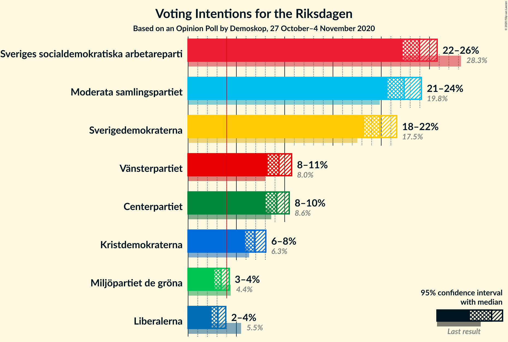

### Confidence Intervals

| Party | Last Result | Poll Result | 80% Confidence Interval | 90% Confidence Interval | 95% Confidence Interval | 99% Confidence Interval |
|:-----:|:-----------:|:-----------:|:-----------------------:|:-----------------------:|:-----------------------:|:-----------------------:|
| Sveriges socialdemokratiska arbetareparti | 28.3% | 24.0% | 22.8–25.2% |22.5–25.5% |22.2–25.8% |21.7–26.4% |
| Moderata samlingspartiet | 19.8% | 22.4% | 21.2–23.5% |20.9–23.9% |20.7–24.2% |20.1–24.7% |
| Sverigedemokraterna | 17.5% | 19.9% | 18.8–21.0% |18.5–21.3% |18.2–21.6% |17.7–22.1% |
| Vänsterpartiet | 8.0% | 9.4% | 8.6–10.3% |8.4–10.5% |8.2–10.7% |7.9–11.1% |
| Centerpartiet | 8.6% | 9.2% | 8.4–10.0% |8.2–10.3% |8.0–10.5% |7.7–10.9% |
| Kristdemokraterna | 6.3% | 6.9% | 6.2–7.7% |6.1–7.9% |5.9–8.0% |5.6–8.4% |
| Miljöpartiet de gröna | 4.4% | 3.4% | 3.0–4.0% |2.8–4.1% |2.7–4.3% |2.5–4.5% |
| Liberalerna | 5.5% | 3.1% | 2.7–3.6% |2.5–3.8% |2.4–3.9% |2.3–4.2% |

*Note:* The poll result column reflects the actual value used in the calculations. Published results may vary slightly, and in addition be rounded to fewer digits.

## Seats

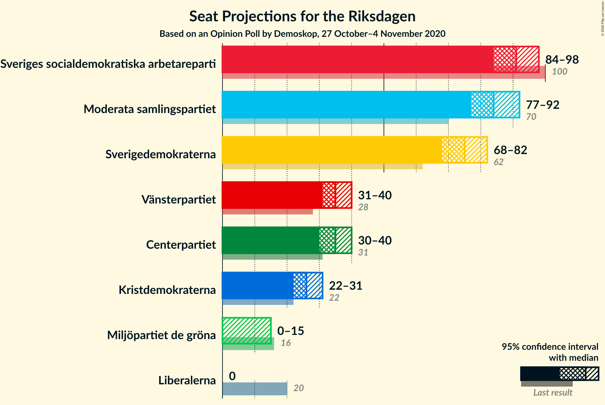

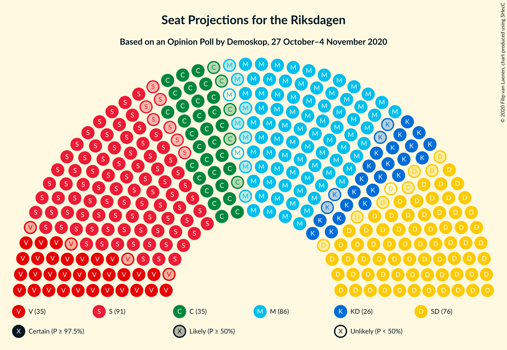

### Confidence Intervals

| Party | Last Result | Median | 80% Confidence Interval | 90% Confidence Interval | 95% Confidence Interval | 99% Confidence Interval |
|:-----:|:-----------:|:------:|:-----------------------:|:-----------------------:|:-----------------------:|:-----------------------:|
| <a href="#sveriges-socialdemokratiska-arbetareparti">Sveriges socialdemokratiska arbetareparti</a> | 100 | 91 | 86–95 |85–96 |84–98 |81–100 |
| <a href="#moderata-samlingspartiet">Moderata samlingspartiet</a> | 70 | 84 | 80–89 |79–90 |77–92 |76–94 |
| <a href="#sverigedemokraterna">Sverigedemokraterna</a> | 62 | 75 | 71–79 |69–81 |68–82 |66–84 |
| <a href="#vänsterpartiet">Vänsterpartiet</a> | 28 | 35 | 33–39 |32–40 |31–40 |30–42 |
| <a href="#centerpartiet">Centerpartiet</a> | 31 | 35 | 32–38 |31–39 |30–40 |29–41 |
| <a href="#kristdemokraterna">Kristdemokraterna</a> | 22 | 26 | 23–29 |23–30 |22–31 |21–32 |
| <a href="#miljöpartiet-de-gröna">Miljöpartiet de gröna</a> | 16 | 0 | 0–15 |0–15 |0–15 |0–17 |
| <a href="#liberalerna">Liberalerna</a> | 20 | 0 | 0 |0 |0 |0–15 |

### Sveriges socialdemokratiska arbetareparti

*For a full overview of the results for this party, see the [Sveriges socialdemokratiska arbetareparti](party-sverigessocialdemokratiskaarbetareparti.html) page.*

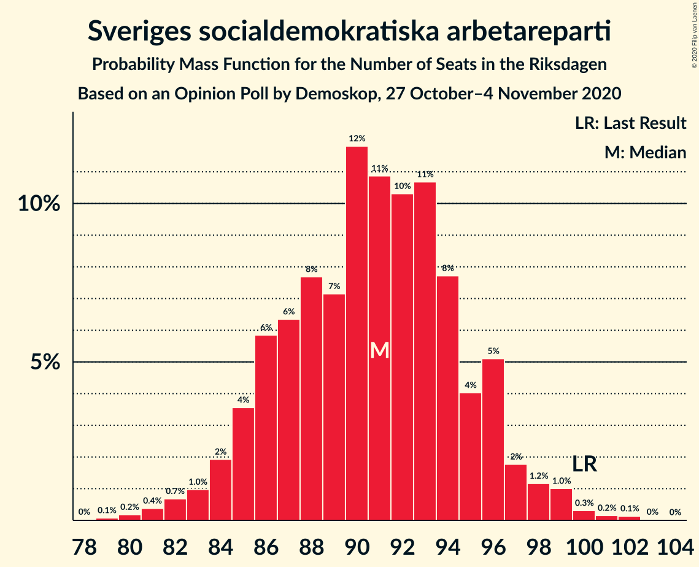

| Number of Seats | Probability | Accumulated | Special Marks |
|:---------------:|:-----------:|:-----------:|:-------------:|
| 79 | 0.1% | 100% |  |
| 80 | 0.2% | 99.9% |  |
| 81 | 0.4% | 99.7% |  |
| 82 | 0.7% | 99.3% |  |
| 83 | 1.0% | 98.6% |  |
| 84 | 2% | 98% |  |
| 85 | 4% | 96% |  |
| 86 | 6% | 92% |  |
| 87 | 6% | 86% |  |
| 88 | 8% | 80% |  |
| 89 | 7% | 72% |  |
| 90 | 12% | 65% |  |
| 91 | 11% | 53% | Median |
| 92 | 10% | 42% |  |
| 93 | 11% | 32% |  |
| 94 | 8% | 21% |  |
| 95 | 4% | 14% |  |
| 96 | 5% | 10% |  |
| 97 | 2% | 5% |  |
| 98 | 1.2% | 3% |  |
| 99 | 1.0% | 2% |  |
| 100 | 0.3% | 0.6% | Last Result |
| 101 | 0.2% | 0.3% |  |
| 102 | 0.1% | 0.2% |  |
| 103 | 0% | 0% |  |

### Moderata samlingspartiet

*For a full overview of the results for this party, see the [Moderata samlingspartiet](party-moderatasamlingspartiet.html) page.*

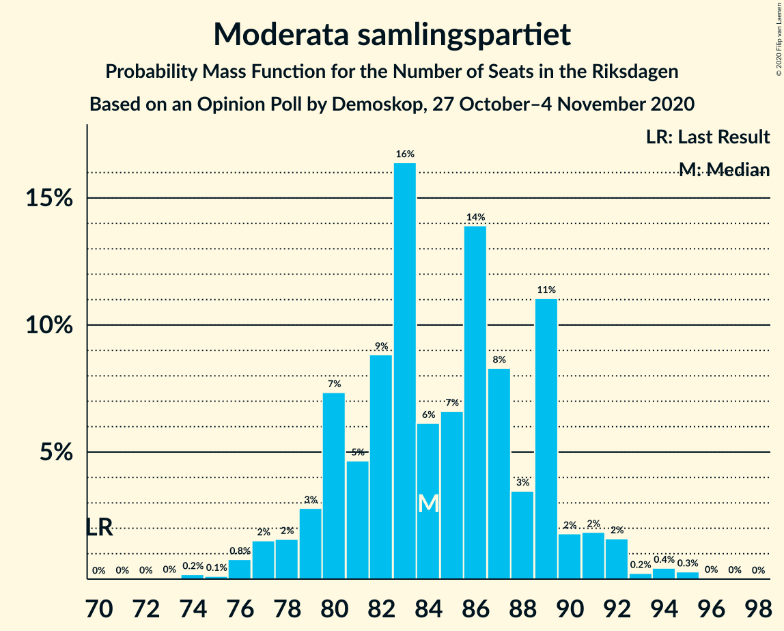

| Number of Seats | Probability | Accumulated | Special Marks |
|:---------------:|:-----------:|:-----------:|:-------------:|
| 70 | 0% | 100% | Last Result |
| 71 | 0% | 100% |  |
| 72 | 0% | 100% |  |
| 73 | 0% | 100% |  |
| 74 | 0.2% | 99.9% |  |
| 75 | 0.1% | 99.7% |  |
| 76 | 0.8% | 99.6% |  |
| 77 | 2% | 98.9% |  |
| 78 | 2% | 97% |  |
| 79 | 3% | 96% |  |
| 80 | 7% | 93% |  |
| 81 | 5% | 86% |  |
| 82 | 9% | 81% |  |
| 83 | 16% | 72% |  |
| 84 | 6% | 56% | Median |
| 85 | 7% | 50% |  |
| 86 | 14% | 43% |  |
| 87 | 8% | 29% |  |
| 88 | 3% | 21% |  |
| 89 | 11% | 17% |  |
| 90 | 2% | 6% |  |
| 91 | 2% | 4% |  |
| 92 | 2% | 3% |  |
| 93 | 0.2% | 1.0% |  |
| 94 | 0.4% | 0.8% |  |
| 95 | 0.3% | 0.4% |  |
| 96 | 0% | 0.1% |  |
| 97 | 0% | 0% |  |

### Sverigedemokraterna

*For a full overview of the results for this party, see the [Sverigedemokraterna](party-sverigedemokraterna.html) page.*

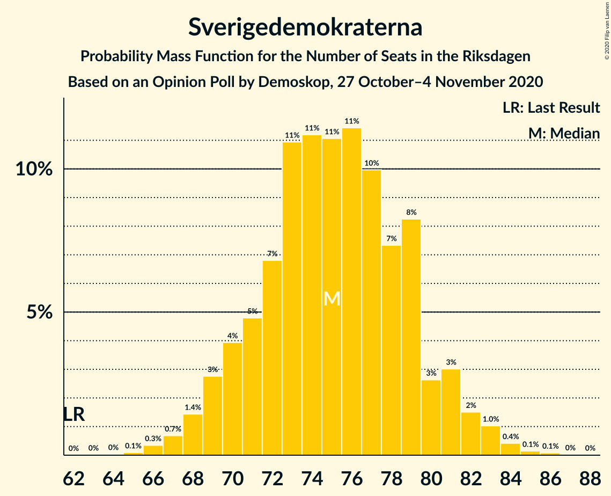

| Number of Seats | Probability | Accumulated | Special Marks |
|:---------------:|:-----------:|:-----------:|:-------------:|
| 62 | 0% | 100% | Last Result |
| 63 | 0% | 100% |  |
| 64 | 0% | 100% |  |
| 65 | 0.1% | 99.9% |  |
| 66 | 0.3% | 99.8% |  |
| 67 | 0.7% | 99.5% |  |
| 68 | 1.4% | 98.8% |  |
| 69 | 3% | 97% |  |
| 70 | 4% | 95% |  |
| 71 | 5% | 91% |  |
| 72 | 7% | 86% |  |
| 73 | 11% | 79% |  |
| 74 | 11% | 68% |  |
| 75 | 11% | 57% | Median |
| 76 | 11% | 46% |  |
| 77 | 10% | 34% |  |
| 78 | 7% | 24% |  |
| 79 | 8% | 17% |  |
| 80 | 3% | 9% |  |
| 81 | 3% | 6% |  |
| 82 | 2% | 3% |  |
| 83 | 1.0% | 2% |  |
| 84 | 0.4% | 0.7% |  |
| 85 | 0.1% | 0.3% |  |
| 86 | 0.1% | 0.1% |  |
| 87 | 0% | 0% |  |

### Vänsterpartiet

*For a full overview of the results for this party, see the [Vänsterpartiet](party-vänsterpartiet.html) page.*

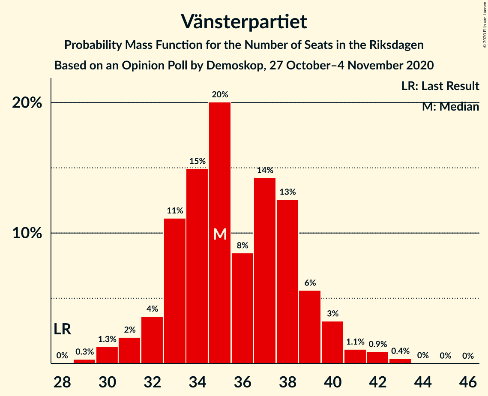

| Number of Seats | Probability | Accumulated | Special Marks |
|:---------------:|:-----------:|:-----------:|:-------------:|
| 28 | 0% | 100% | Last Result |
| 29 | 0.3% | 100% |  |
| 30 | 1.3% | 99.6% |  |
| 31 | 2% | 98% |  |
| 32 | 4% | 96% |  |
| 33 | 11% | 93% |  |
| 34 | 15% | 82% |  |
| 35 | 20% | 67% | Median |
| 36 | 8% | 47% |  |
| 37 | 14% | 38% |  |
| 38 | 13% | 24% |  |
| 39 | 6% | 11% |  |
| 40 | 3% | 6% |  |
| 41 | 1.1% | 2% |  |
| 42 | 0.9% | 1.4% |  |
| 43 | 0.4% | 0.4% |  |
| 44 | 0% | 0.1% |  |
| 45 | 0% | 0% |  |

### Centerpartiet

*For a full overview of the results for this party, see the [Centerpartiet](party-centerpartiet.html) page.*

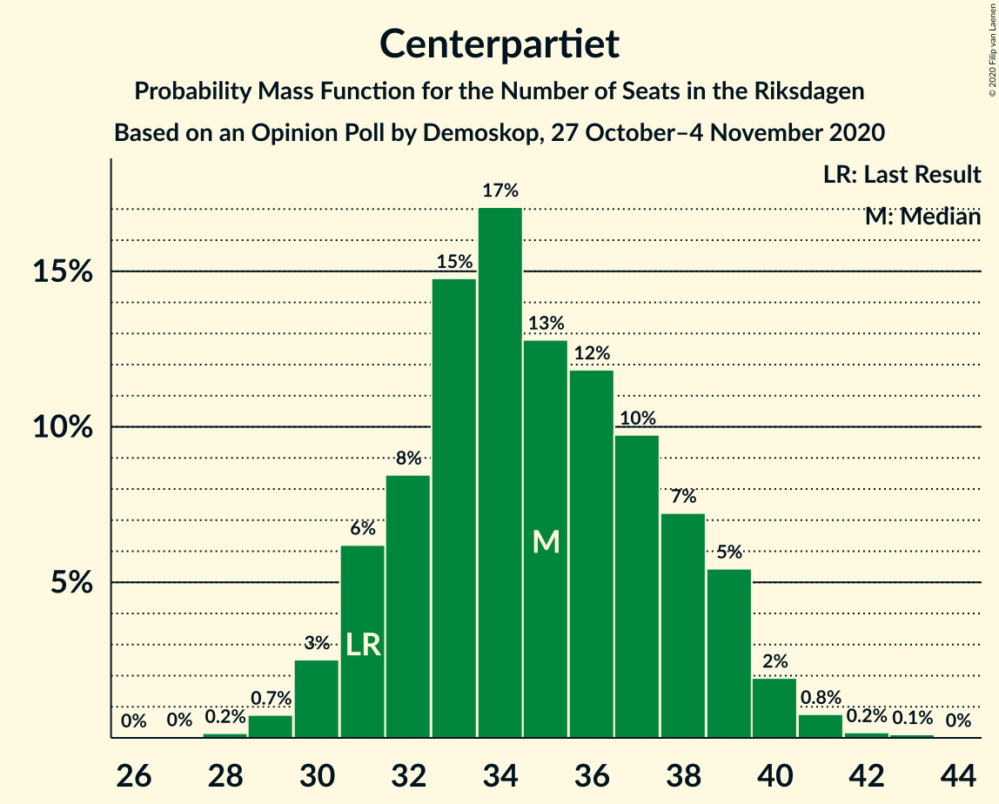

| Number of Seats | Probability | Accumulated | Special Marks |
|:---------------:|:-----------:|:-----------:|:-------------:|
| 27 | 0% | 100% |  |
| 28 | 0.2% | 99.9% |  |
| 29 | 0.7% | 99.8% |  |
| 30 | 3% | 99.1% |  |
| 31 | 6% | 97% | Last Result |
| 32 | 8% | 90% |  |
| 33 | 15% | 82% |  |
| 34 | 17% | 67% |  |
| 35 | 13% | 50% | Median |
| 36 | 12% | 37% |  |
| 37 | 10% | 25% |  |
| 38 | 7% | 16% |  |
| 39 | 5% | 8% |  |
| 40 | 2% | 3% |  |
| 41 | 0.8% | 1.1% |  |
| 42 | 0.2% | 0.3% |  |
| 43 | 0.1% | 0.1% |  |
| 44 | 0% | 0% |  |

### Kristdemokraterna

*For a full overview of the results for this party, see the [Kristdemokraterna](party-kristdemokraterna.html) page.*

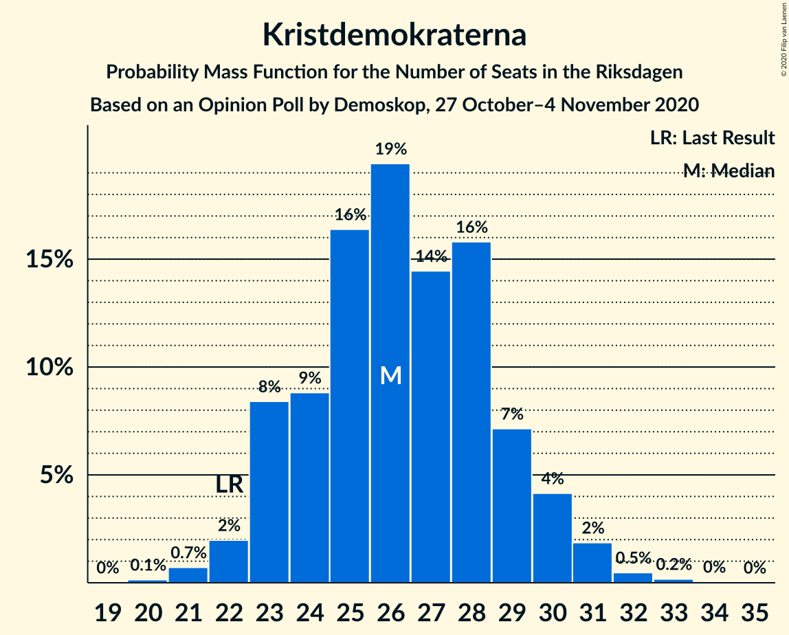

| Number of Seats | Probability | Accumulated | Special Marks |
|:---------------:|:-----------:|:-----------:|:-------------:|
| 20 | 0.1% | 100% |  |
| 21 | 0.7% | 99.8% |  |
| 22 | 2% | 99.1% | Last Result |
| 23 | 8% | 97% |  |
| 24 | 9% | 89% |  |
| 25 | 16% | 80% |  |
| 26 | 19% | 64% | Median |
| 27 | 14% | 44% |  |
| 28 | 16% | 30% |  |
| 29 | 7% | 14% |  |
| 30 | 4% | 7% |  |
| 31 | 2% | 3% |  |
| 32 | 0.5% | 0.7% |  |
| 33 | 0.2% | 0.2% |  |
| 34 | 0% | 0.1% |  |
| 35 | 0% | 0% |  |

### Miljöpartiet de gröna

*For a full overview of the results for this party, see the [Miljöpartiet de gröna](party-miljöpartietdegröna.html) page.*

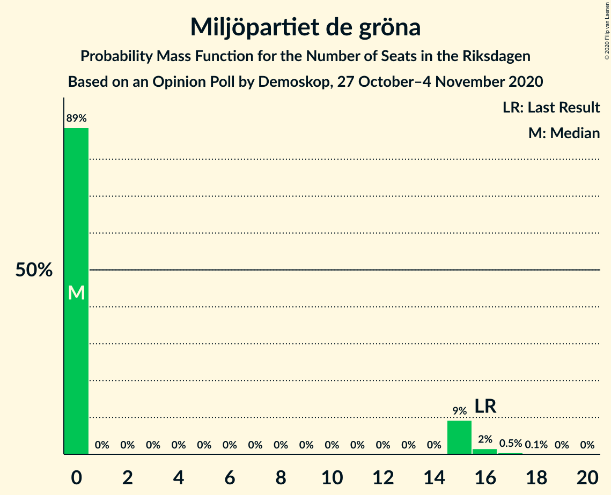

| Number of Seats | Probability | Accumulated | Special Marks |
|:---------------:|:-----------:|:-----------:|:-------------:|
| 0 | 89% | 100% | Median |
| 1 | 0% | 11% |  |
| 2 | 0% | 11% |  |
| 3 | 0% | 11% |  |
| 4 | 0% | 11% |  |
| 5 | 0% | 11% |  |
| 6 | 0% | 11% |  |
| 7 | 0% | 11% |  |
| 8 | 0% | 11% |  |
| 9 | 0% | 11% |  |
| 10 | 0% | 11% |  |
| 11 | 0% | 11% |  |
| 12 | 0% | 11% |  |
| 13 | 0% | 11% |  |
| 14 | 0% | 11% |  |
| 15 | 9% | 11% |  |
| 16 | 2% | 2% | Last Result |
| 17 | 0.5% | 0.6% |  |
| 18 | 0.1% | 0.1% |  |
| 19 | 0% | 0% |  |

### Liberalerna

*For a full overview of the results for this party, see the [Liberalerna](party-liberalerna.html) page.*

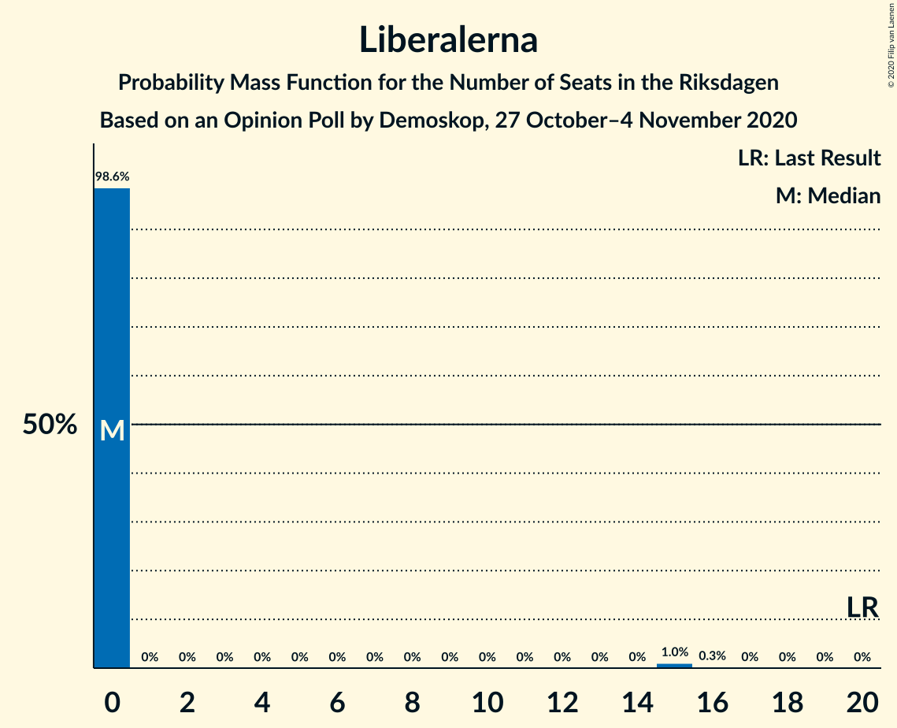

| Number of Seats | Probability | Accumulated | Special Marks |
|:---------------:|:-----------:|:-----------:|:-------------:|
| 0 | 98.6% | 100% | Median |
| 1 | 0% | 1.4% |  |
| 2 | 0% | 1.4% |  |
| 3 | 0% | 1.4% |  |
| 4 | 0% | 1.4% |  |
| 5 | 0% | 1.4% |  |
| 6 | 0% | 1.4% |  |
| 7 | 0% | 1.4% |  |
| 8 | 0% | 1.4% |  |
| 9 | 0% | 1.4% |  |
| 10 | 0% | 1.4% |  |
| 11 | 0% | 1.4% |  |
| 12 | 0% | 1.4% |  |
| 13 | 0% | 1.4% |  |
| 14 | 0% | 1.4% |  |
| 15 | 1.0% | 1.4% |  |
| 16 | 0.3% | 0.3% |  |
| 17 | 0% | 0% |  |
| 18 | 0% | 0% |  |
| 19 | 0% | 0% |  |
| 20 | 0% | 0% | Last Result |

## Coalitions

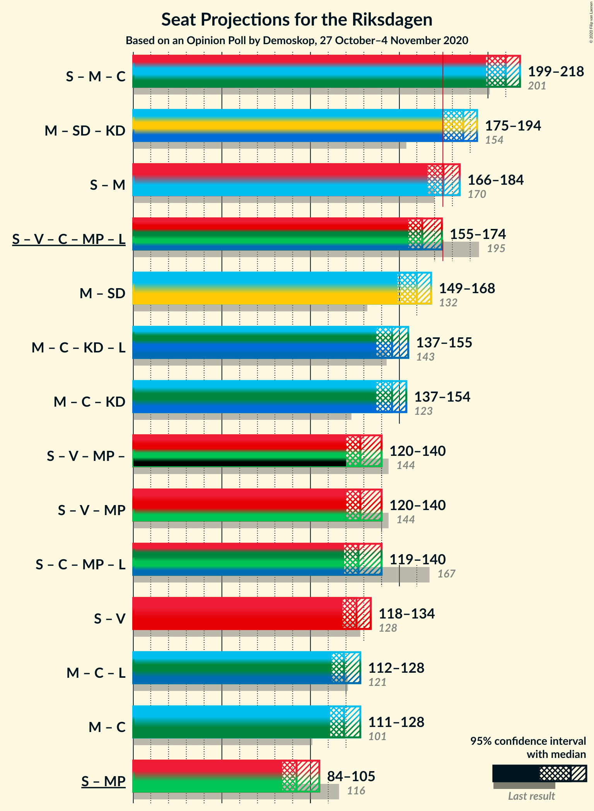

### Confidence Intervals

| Coalition | Last Result | Median | Majority? | 80% Confidence Interval | 90% Confidence Interval | 95% Confidence Interval | 99% Confidence Interval |
|:---------:|:-----------:|:------:|:---------:|:-----------------------:|:-----------------------:|:-----------------------:|:-----------------------:|
| Sveriges socialdemokratiska arbetareparti – Moderata samlingspartiet – Centerpartiet | 201 | 210 | 100% | 204–216 | 201–217 | 199–218 | 196–221 |
| Moderata samlingspartiet – Sverigedemokraterna – Kristdemokraterna | 154 | 186 | 98% | 179–192 | 177–193 | 175–194 | 172–197 |
| Sveriges socialdemokratiska arbetareparti – Moderata samlingspartiet | 170 | 175 | 59% | 169–181 | 167–182 | 166–184 | 162–186 |
| Sveriges socialdemokratiska arbetareparti – Vänsterpartiet – Centerpartiet – Miljöpartiet de gröna – Liberalerna | 195 | 163 | 2% | 157–170 | 156–172 | 155–174 | 152–177 |
| Moderata samlingspartiet – Sverigedemokraterna | 132 | 160 | 0% | 154–165 | 152–167 | 149–168 | 147–171 |
| Moderata samlingspartiet – Centerpartiet – Kristdemokraterna – Liberalerna | 143 | 146 | 0% | 140–151 | 138–153 | 137–155 | 134–157 |
| Moderata samlingspartiet – Centerpartiet – Kristdemokraterna | 123 | 146 | 0% | 140–151 | 138–153 | 137–154 | 134–156 |
| Sveriges socialdemokratiska arbetareparti – Vänsterpartiet – Miljöpartiet de gröna | 144 | 128 | 0% | 122–135 | 121–138 | 120–140 | 117–143 |
| Sveriges socialdemokratiska arbetareparti – Centerpartiet – Miljöpartiet de gröna – Liberalerna | 167 | 127 | 0% | 121–134 | 120–137 | 119–140 | 116–143 |
| Sveriges socialdemokratiska arbetareparti – Vänsterpartiet | 128 | 126 | 0% | 121–131 | 119–133 | 118–134 | 115–137 |
| Moderata samlingspartiet – Centerpartiet – Liberalerna | 121 | 119 | 0% | 114–125 | 113–127 | 112–128 | 110–132 |
| Moderata samlingspartiet – Centerpartiet | 101 | 119 | 0% | 114–125 | 112–126 | 111–128 | 109–129 |
| Sveriges socialdemokratiska arbetareparti – Miljöpartiet de gröna | 116 | 92 | 0% | 87–100 | 85–103 | 84–105 | 82–108 |

### Sveriges socialdemokratiska arbetareparti – Moderata samlingspartiet – Centerpartiet

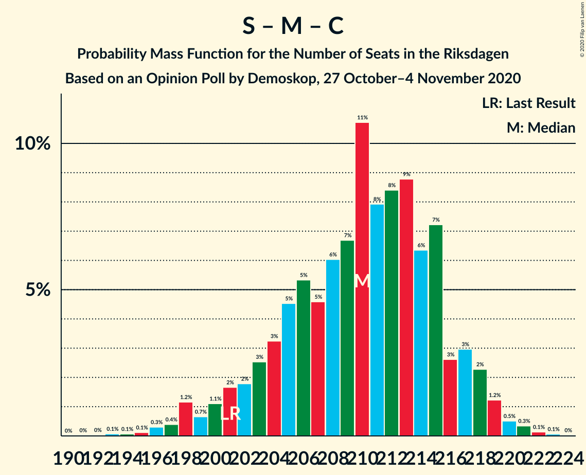

| Number of Seats | Probability | Accumulated | Special Marks |
|:---------------:|:-----------:|:-----------:|:-------------:|
| 191 | 0% | 100% |  |
| 192 | 0% | 99.9% |  |
| 193 | 0.1% | 99.9% |  |
| 194 | 0.1% | 99.8% |  |
| 195 | 0.1% | 99.8% |  |
| 196 | 0.3% | 99.6% |  |
| 197 | 0.4% | 99.3% |  |
| 198 | 1.2% | 98.9% |  |
| 199 | 0.7% | 98% |  |
| 200 | 1.1% | 97% |  |
| 201 | 2% | 96% | Last Result |
| 202 | 2% | 94% |  |
| 203 | 3% | 93% |  |
| 204 | 3% | 90% |  |
| 205 | 5% | 87% |  |
| 206 | 5% | 82% |  |
| 207 | 5% | 77% |  |
| 208 | 6% | 72% |  |
| 209 | 7% | 66% |  |
| 210 | 11% | 60% | Median |
| 211 | 8% | 49% |  |
| 212 | 8% | 41% |  |
| 213 | 9% | 33% |  |
| 214 | 6% | 24% |  |
| 215 | 7% | 17% |  |
| 216 | 3% | 10% |  |
| 217 | 3% | 8% |  |
| 218 | 2% | 5% |  |
| 219 | 1.2% | 2% |  |
| 220 | 0.5% | 1.1% |  |
| 221 | 0.3% | 0.6% |  |
| 222 | 0.1% | 0.3% |  |
| 223 | 0.1% | 0.1% |  |
| 224 | 0% | 0% |  |

### Moderata samlingspartiet – Sverigedemokraterna – Kristdemokraterna

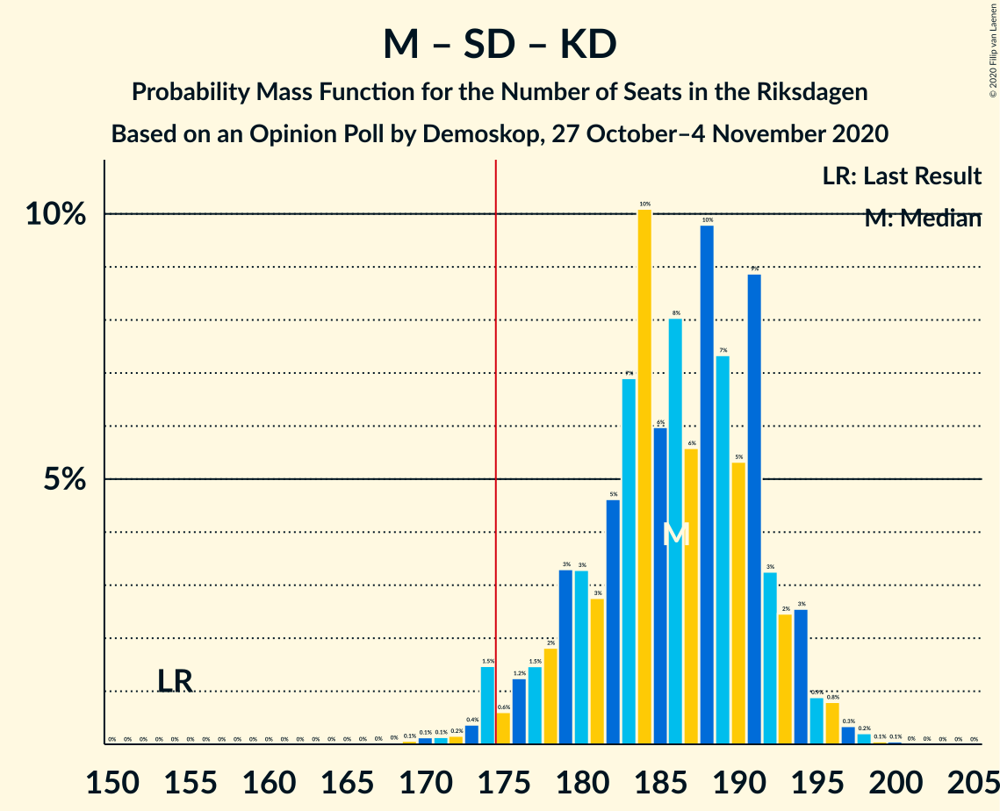

| Number of Seats | Probability | Accumulated | Special Marks |
|:---------------:|:-----------:|:-----------:|:-------------:|
| 154 | 0% | 100% | Last Result |
| 155 | 0% | 100% |  |
| 156 | 0% | 100% |  |
| 157 | 0% | 100% |  |
| 158 | 0% | 100% |  |
| 159 | 0% | 100% |  |
| 160 | 0% | 100% |  |
| 161 | 0% | 100% |  |
| 162 | 0% | 100% |  |
| 163 | 0% | 100% |  |
| 164 | 0% | 100% |  |
| 165 | 0% | 100% |  |
| 166 | 0% | 100% |  |
| 167 | 0% | 100% |  |
| 168 | 0% | 100% |  |
| 169 | 0.1% | 99.9% |  |
| 170 | 0.1% | 99.9% |  |
| 171 | 0.1% | 99.8% |  |
| 172 | 0.2% | 99.6% |  |
| 173 | 0.4% | 99.5% |  |
| 174 | 1.5% | 99.1% |  |
| 175 | 0.6% | 98% | Majority |
| 176 | 1.2% | 97% |  |
| 177 | 1.5% | 96% |  |
| 178 | 2% | 94% |  |
| 179 | 3% | 92% |  |
| 180 | 3% | 89% |  |
| 181 | 3% | 86% |  |
| 182 | 5% | 83% |  |
| 183 | 7% | 79% |  |
| 184 | 10% | 72% |  |
| 185 | 6% | 62% | Median |
| 186 | 8% | 56% |  |
| 187 | 6% | 48% |  |
| 188 | 10% | 42% |  |
| 189 | 7% | 32% |  |
| 190 | 5% | 25% |  |
| 191 | 9% | 19% |  |
| 192 | 3% | 11% |  |
| 193 | 2% | 7% |  |
| 194 | 3% | 5% |  |
| 195 | 0.9% | 2% |  |
| 196 | 0.8% | 1.5% |  |
| 197 | 0.3% | 0.7% |  |
| 198 | 0.2% | 0.3% |  |
| 199 | 0.1% | 0.1% |  |
| 200 | 0.1% | 0.1% |  |
| 201 | 0% | 0% |  |

### Sveriges socialdemokratiska arbetareparti – Moderata samlingspartiet

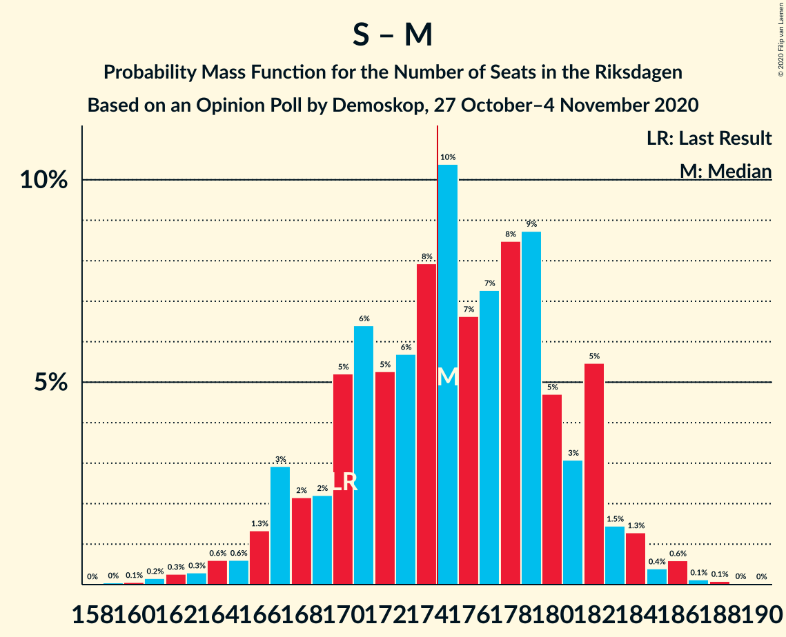

| Number of Seats | Probability | Accumulated | Special Marks |
|:---------------:|:-----------:|:-----------:|:-------------:|
| 158 | 0% | 100% |  |
| 159 | 0% | 99.9% |  |
| 160 | 0.1% | 99.9% |  |
| 161 | 0.2% | 99.8% |  |
| 162 | 0.3% | 99.7% |  |
| 163 | 0.3% | 99.4% |  |
| 164 | 0.6% | 99.1% |  |
| 165 | 0.6% | 98.5% |  |
| 166 | 1.3% | 98% |  |
| 167 | 3% | 97% |  |
| 168 | 2% | 94% |  |
| 169 | 2% | 91% |  |
| 170 | 5% | 89% | Last Result |
| 171 | 6% | 84% |  |
| 172 | 5% | 78% |  |
| 173 | 6% | 72% |  |
| 174 | 8% | 67% |  |
| 175 | 10% | 59% | Median, Majority |
| 176 | 7% | 48% |  |
| 177 | 7% | 42% |  |
| 178 | 8% | 34% |  |
| 179 | 9% | 26% |  |
| 180 | 5% | 17% |  |
| 181 | 3% | 13% |  |
| 182 | 5% | 9% |  |
| 183 | 1.5% | 4% |  |
| 184 | 1.3% | 3% |  |
| 185 | 0.4% | 1.3% |  |
| 186 | 0.6% | 0.9% |  |
| 187 | 0.1% | 0.3% |  |
| 188 | 0.1% | 0.2% |  |
| 189 | 0% | 0.1% |  |
| 190 | 0% | 0% |  |

### Sveriges socialdemokratiska arbetareparti – Vänsterpartiet – Centerpartiet – Miljöpartiet de gröna – Liberalerna

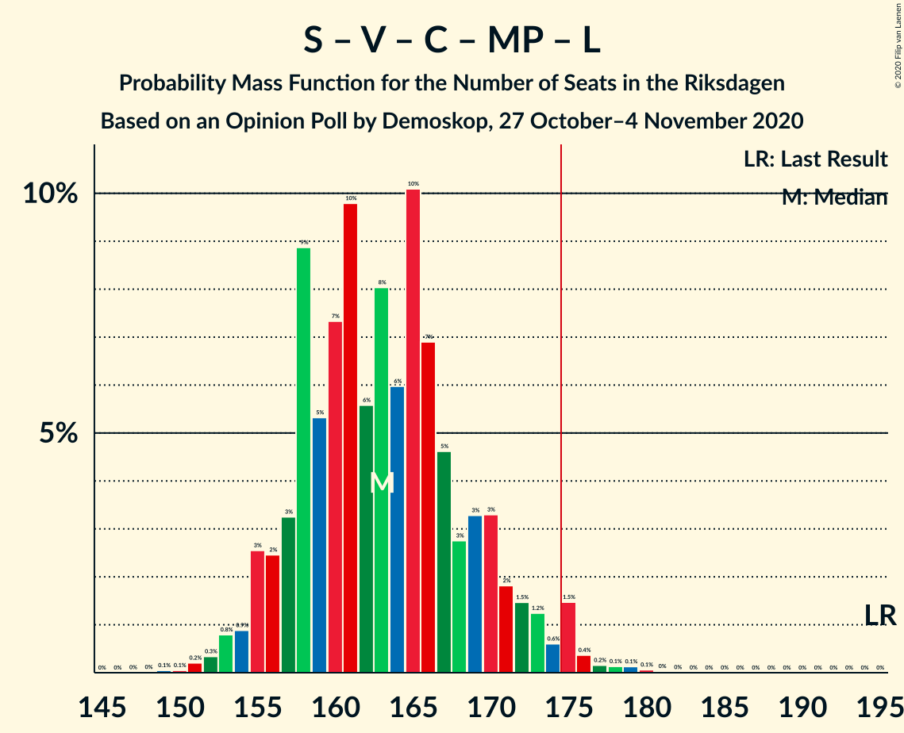

| Number of Seats | Probability | Accumulated | Special Marks |
|:---------------:|:-----------:|:-----------:|:-------------:|
| 149 | 0.1% | 100% |  |
| 150 | 0.1% | 99.9% |  |
| 151 | 0.2% | 99.9% |  |
| 152 | 0.3% | 99.7% |  |
| 153 | 0.8% | 99.3% |  |
| 154 | 0.9% | 98.5% |  |
| 155 | 3% | 98% |  |
| 156 | 2% | 95% |  |
| 157 | 3% | 93% |  |
| 158 | 9% | 89% |  |
| 159 | 5% | 81% |  |
| 160 | 7% | 75% |  |
| 161 | 10% | 68% | Median |
| 162 | 6% | 58% |  |
| 163 | 8% | 52% |  |
| 164 | 6% | 44% |  |
| 165 | 10% | 38% |  |
| 166 | 7% | 28% |  |
| 167 | 5% | 21% |  |
| 168 | 3% | 17% |  |
| 169 | 3% | 14% |  |
| 170 | 3% | 11% |  |
| 171 | 2% | 8% |  |
| 172 | 1.5% | 6% |  |
| 173 | 1.2% | 4% |  |
| 174 | 0.6% | 3% |  |
| 175 | 1.5% | 2% | Majority |
| 176 | 0.4% | 0.9% |  |
| 177 | 0.2% | 0.5% |  |
| 178 | 0.1% | 0.4% |  |
| 179 | 0.1% | 0.2% |  |
| 180 | 0.1% | 0.1% |  |
| 181 | 0% | 0.1% |  |
| 182 | 0% | 0% |  |
| 183 | 0% | 0% |  |
| 184 | 0% | 0% |  |
| 185 | 0% | 0% |  |
| 186 | 0% | 0% |  |
| 187 | 0% | 0% |  |
| 188 | 0% | 0% |  |
| 189 | 0% | 0% |  |
| 190 | 0% | 0% |  |
| 191 | 0% | 0% |  |
| 192 | 0% | 0% |  |
| 193 | 0% | 0% |  |
| 194 | 0% | 0% |  |
| 195 | 0% | 0% | Last Result |

### Moderata samlingspartiet – Sverigedemokraterna

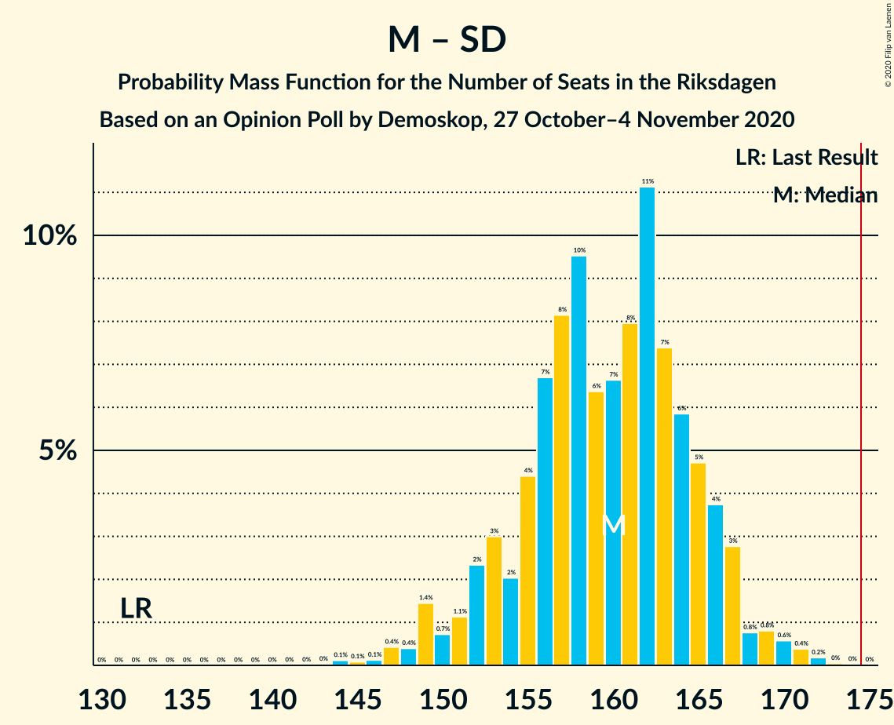

| Number of Seats | Probability | Accumulated | Special Marks |
|:---------------:|:-----------:|:-----------:|:-------------:|
| 132 | 0% | 100% | Last Result |
| 133 | 0% | 100% |  |
| 134 | 0% | 100% |  |
| 135 | 0% | 100% |  |
| 136 | 0% | 100% |  |
| 137 | 0% | 100% |  |
| 138 | 0% | 100% |  |
| 139 | 0% | 100% |  |
| 140 | 0% | 100% |  |
| 141 | 0% | 100% |  |
| 142 | 0% | 100% |  |
| 143 | 0% | 100% |  |
| 144 | 0.1% | 100% |  |
| 145 | 0.1% | 99.8% |  |
| 146 | 0.1% | 99.8% |  |
| 147 | 0.4% | 99.6% |  |
| 148 | 0.4% | 99.2% |  |
| 149 | 1.4% | 98.8% |  |
| 150 | 0.7% | 97% |  |
| 151 | 1.1% | 97% |  |
| 152 | 2% | 96% |  |
| 153 | 3% | 93% |  |
| 154 | 2% | 90% |  |
| 155 | 4% | 88% |  |
| 156 | 7% | 84% |  |
| 157 | 8% | 77% |  |
| 158 | 10% | 69% |  |
| 159 | 6% | 59% | Median |
| 160 | 7% | 53% |  |
| 161 | 8% | 46% |  |
| 162 | 11% | 38% |  |
| 163 | 7% | 27% |  |
| 164 | 6% | 20% |  |
| 165 | 5% | 14% |  |
| 166 | 4% | 9% |  |
| 167 | 3% | 6% |  |
| 168 | 0.8% | 3% |  |
| 169 | 0.8% | 2% |  |
| 170 | 0.6% | 1.2% |  |
| 171 | 0.4% | 0.7% |  |
| 172 | 0.2% | 0.3% |  |
| 173 | 0% | 0.1% |  |
| 174 | 0% | 0% |  |

### Moderata samlingspartiet – Centerpartiet – Kristdemokraterna – Liberalerna

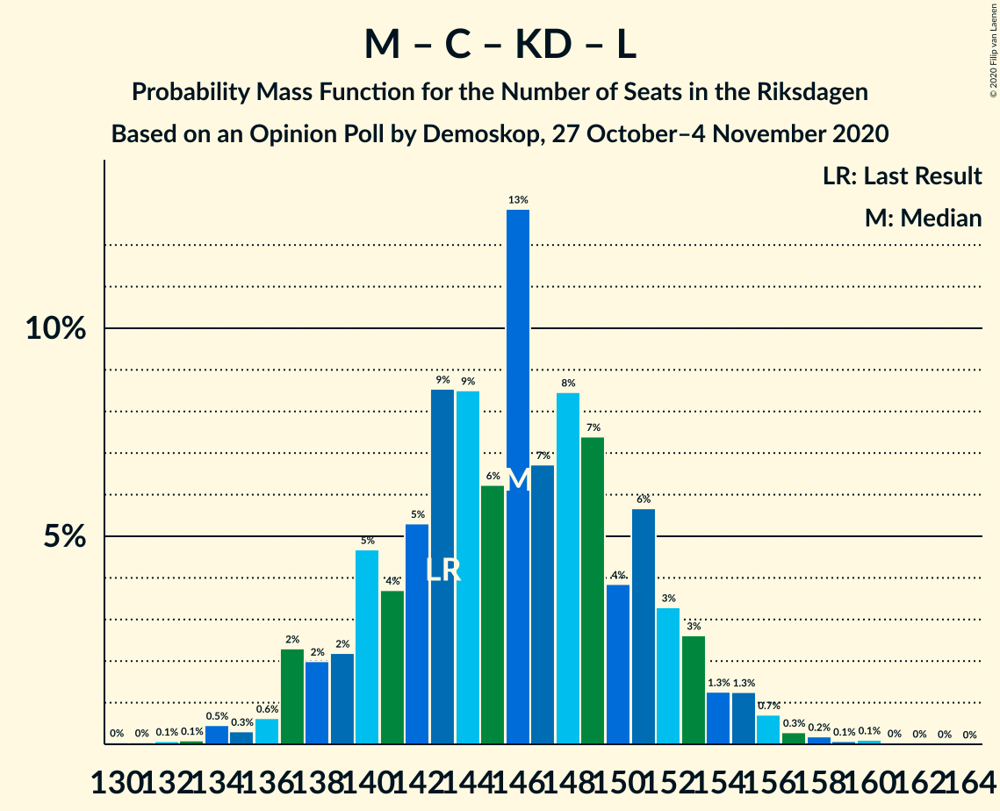

| Number of Seats | Probability | Accumulated | Special Marks |
|:---------------:|:-----------:|:-----------:|:-------------:|
| 130 | 0% | 100% |  |
| 131 | 0% | 99.9% |  |
| 132 | 0.1% | 99.9% |  |
| 133 | 0.1% | 99.8% |  |
| 134 | 0.5% | 99.7% |  |
| 135 | 0.3% | 99.3% |  |
| 136 | 0.6% | 99.0% |  |
| 137 | 2% | 98% |  |
| 138 | 2% | 96% |  |
| 139 | 2% | 94% |  |
| 140 | 5% | 92% |  |
| 141 | 4% | 87% |  |
| 142 | 5% | 83% |  |
| 143 | 9% | 78% | Last Result |
| 144 | 9% | 70% |  |
| 145 | 6% | 61% | Median |
| 146 | 13% | 55% |  |
| 147 | 7% | 42% |  |
| 148 | 8% | 35% |  |
| 149 | 7% | 27% |  |
| 150 | 4% | 19% |  |
| 151 | 6% | 16% |  |
| 152 | 3% | 10% |  |
| 153 | 3% | 7% |  |
| 154 | 1.3% | 4% |  |
| 155 | 1.3% | 3% |  |
| 156 | 0.7% | 1.5% |  |
| 157 | 0.3% | 0.8% |  |
| 158 | 0.2% | 0.5% |  |
| 159 | 0.1% | 0.3% |  |
| 160 | 0.1% | 0.2% |  |
| 161 | 0% | 0.1% |  |
| 162 | 0% | 0.1% |  |
| 163 | 0% | 0% |  |

### Moderata samlingspartiet – Centerpartiet – Kristdemokraterna

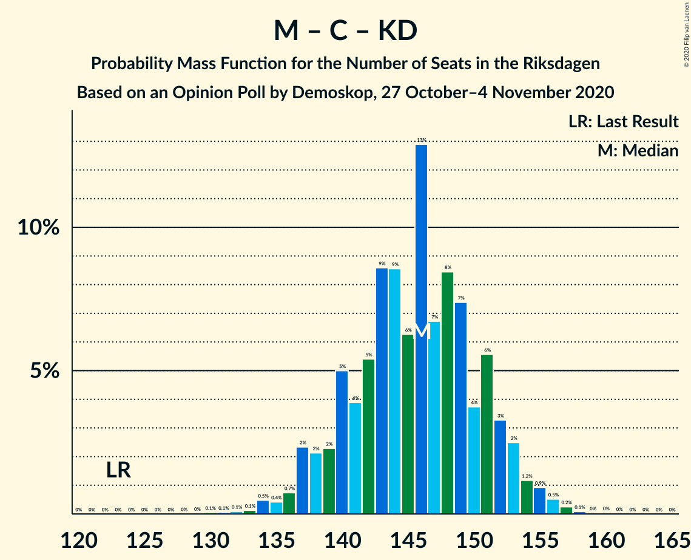

| Number of Seats | Probability | Accumulated | Special Marks |
|:---------------:|:-----------:|:-----------:|:-------------:|
| 123 | 0% | 100% | Last Result |
| 124 | 0% | 100% |  |
| 125 | 0% | 100% |  |
| 126 | 0% | 100% |  |
| 127 | 0% | 100% |  |
| 128 | 0% | 100% |  |
| 129 | 0% | 100% |  |
| 130 | 0.1% | 100% |  |
| 131 | 0.1% | 99.9% |  |
| 132 | 0.1% | 99.9% |  |
| 133 | 0.1% | 99.8% |  |
| 134 | 0.5% | 99.7% |  |
| 135 | 0.4% | 99.2% |  |
| 136 | 0.7% | 98.8% |  |
| 137 | 2% | 98% |  |
| 138 | 2% | 96% |  |
| 139 | 2% | 94% |  |
| 140 | 5% | 91% |  |
| 141 | 4% | 86% |  |
| 142 | 5% | 82% |  |
| 143 | 9% | 77% |  |
| 144 | 9% | 68% |  |
| 145 | 6% | 60% | Median |
| 146 | 13% | 54% |  |
| 147 | 7% | 41% |  |
| 148 | 8% | 34% |  |
| 149 | 7% | 25% |  |
| 150 | 4% | 18% |  |
| 151 | 6% | 14% |  |
| 152 | 3% | 9% |  |
| 153 | 2% | 6% |  |
| 154 | 1.2% | 3% |  |
| 155 | 0.9% | 2% |  |
| 156 | 0.5% | 0.9% |  |
| 157 | 0.2% | 0.4% |  |
| 158 | 0.1% | 0.2% |  |
| 159 | 0% | 0.1% |  |
| 160 | 0% | 0.1% |  |
| 161 | 0% | 0% |  |

### Sveriges socialdemokratiska arbetareparti – Vänsterpartiet – Miljöpartiet de gröna

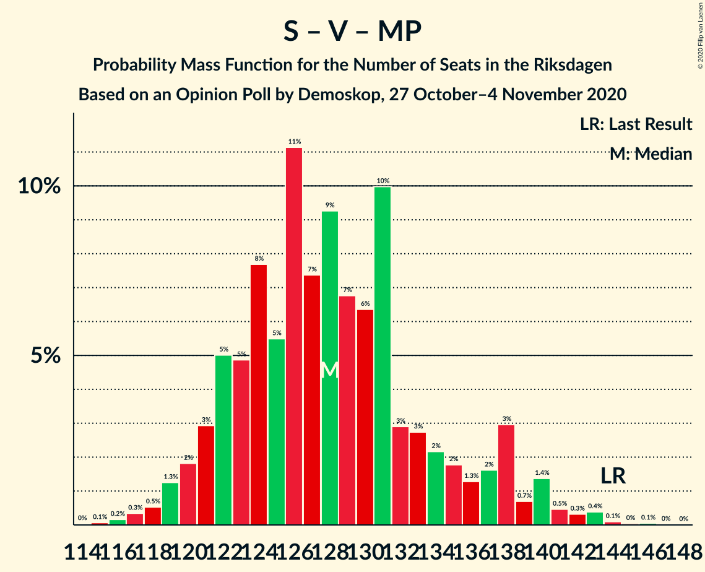

| Number of Seats | Probability | Accumulated | Special Marks |
|:---------------:|:-----------:|:-----------:|:-------------:|
| 114 | 0% | 100% |  |
| 115 | 0.1% | 99.9% |  |
| 116 | 0.2% | 99.9% |  |
| 117 | 0.3% | 99.7% |  |
| 118 | 0.5% | 99.4% |  |
| 119 | 1.3% | 98.8% |  |
| 120 | 2% | 98% |  |
| 121 | 3% | 96% |  |
| 122 | 5% | 93% |  |
| 123 | 5% | 88% |  |
| 124 | 8% | 83% |  |
| 125 | 5% | 75% |  |
| 126 | 11% | 70% | Median |
| 127 | 7% | 59% |  |
| 128 | 9% | 51% |  |
| 129 | 7% | 42% |  |
| 130 | 6% | 35% |  |
| 131 | 10% | 29% |  |
| 132 | 3% | 19% |  |
| 133 | 3% | 16% |  |
| 134 | 2% | 13% |  |
| 135 | 2% | 11% |  |
| 136 | 1.3% | 9% |  |
| 137 | 2% | 8% |  |
| 138 | 3% | 6% |  |
| 139 | 0.7% | 3% |  |
| 140 | 1.4% | 3% |  |
| 141 | 0.5% | 1.4% |  |
| 142 | 0.3% | 0.9% |  |
| 143 | 0.4% | 0.6% |  |
| 144 | 0.1% | 0.2% | Last Result |
| 145 | 0% | 0.1% |  |
| 146 | 0.1% | 0.1% |  |
| 147 | 0% | 0% |  |

### Sveriges socialdemokratiska arbetareparti – Centerpartiet – Miljöpartiet de gröna – Liberalerna

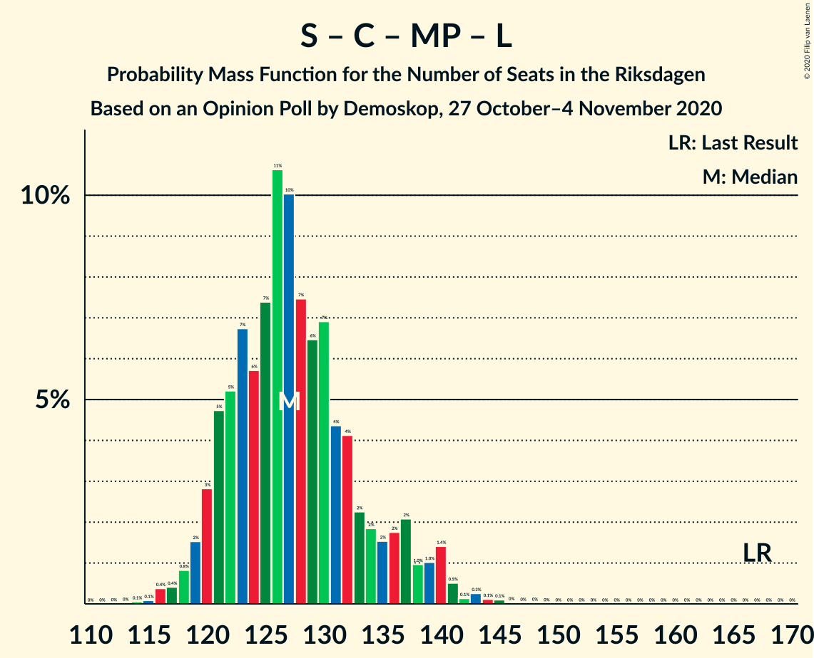

| Number of Seats | Probability | Accumulated | Special Marks |
|:---------------:|:-----------:|:-----------:|:-------------:|
| 114 | 0.1% | 100% |  |
| 115 | 0.1% | 99.9% |  |
| 116 | 0.4% | 99.8% |  |
| 117 | 0.4% | 99.5% |  |
| 118 | 0.8% | 99.0% |  |
| 119 | 2% | 98% |  |
| 120 | 3% | 97% |  |
| 121 | 5% | 94% |  |
| 122 | 5% | 89% |  |
| 123 | 7% | 84% |  |
| 124 | 6% | 77% |  |
| 125 | 7% | 71% |  |
| 126 | 11% | 64% | Median |
| 127 | 10% | 53% |  |
| 128 | 7% | 43% |  |
| 129 | 6% | 36% |  |
| 130 | 7% | 29% |  |
| 131 | 4% | 23% |  |
| 132 | 4% | 18% |  |
| 133 | 2% | 14% |  |
| 134 | 2% | 12% |  |
| 135 | 2% | 10% |  |
| 136 | 2% | 8% |  |
| 137 | 2% | 7% |  |
| 138 | 1.0% | 5% |  |
| 139 | 1.0% | 4% |  |
| 140 | 1.4% | 3% |  |
| 141 | 0.5% | 1.2% |  |
| 142 | 0.1% | 0.7% |  |
| 143 | 0.3% | 0.6% |  |
| 144 | 0.1% | 0.3% |  |
| 145 | 0.1% | 0.2% |  |
| 146 | 0% | 0.1% |  |
| 147 | 0% | 0% |  |
| 148 | 0% | 0% |  |
| 149 | 0% | 0% |  |
| 150 | 0% | 0% |  |
| 151 | 0% | 0% |  |
| 152 | 0% | 0% |  |
| 153 | 0% | 0% |  |
| 154 | 0% | 0% |  |
| 155 | 0% | 0% |  |
| 156 | 0% | 0% |  |
| 157 | 0% | 0% |  |
| 158 | 0% | 0% |  |
| 159 | 0% | 0% |  |
| 160 | 0% | 0% |  |
| 161 | 0% | 0% |  |
| 162 | 0% | 0% |  |
| 163 | 0% | 0% |  |
| 164 | 0% | 0% |  |
| 165 | 0% | 0% |  |
| 166 | 0% | 0% |  |
| 167 | 0% | 0% | Last Result |

### Sveriges socialdemokratiska arbetareparti – Vänsterpartiet

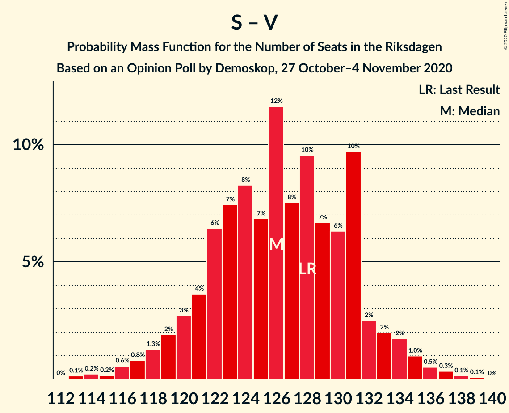

| Number of Seats | Probability | Accumulated | Special Marks |
|:---------------:|:-----------:|:-----------:|:-------------:|
| 112 | 0% | 100% |  |
| 113 | 0.1% | 99.9% |  |
| 114 | 0.2% | 99.8% |  |
| 115 | 0.2% | 99.6% |  |
| 116 | 0.6% | 99.4% |  |
| 117 | 0.8% | 98.9% |  |
| 118 | 1.3% | 98% |  |
| 119 | 2% | 97% |  |
| 120 | 3% | 95% |  |
| 121 | 4% | 92% |  |
| 122 | 6% | 89% |  |
| 123 | 7% | 82% |  |
| 124 | 8% | 75% |  |
| 125 | 7% | 66% |  |
| 126 | 12% | 60% | Median |
| 127 | 8% | 48% |  |
| 128 | 10% | 40% | Last Result |
| 129 | 7% | 31% |  |
| 130 | 6% | 24% |  |
| 131 | 10% | 18% |  |
| 132 | 2% | 8% |  |
| 133 | 2% | 6% |  |
| 134 | 2% | 4% |  |
| 135 | 1.0% | 2% |  |
| 136 | 0.5% | 1.1% |  |
| 137 | 0.3% | 0.6% |  |
| 138 | 0.1% | 0.2% |  |
| 139 | 0.1% | 0.1% |  |
| 140 | 0% | 0% |  |

### Moderata samlingspartiet – Centerpartiet – Liberalerna

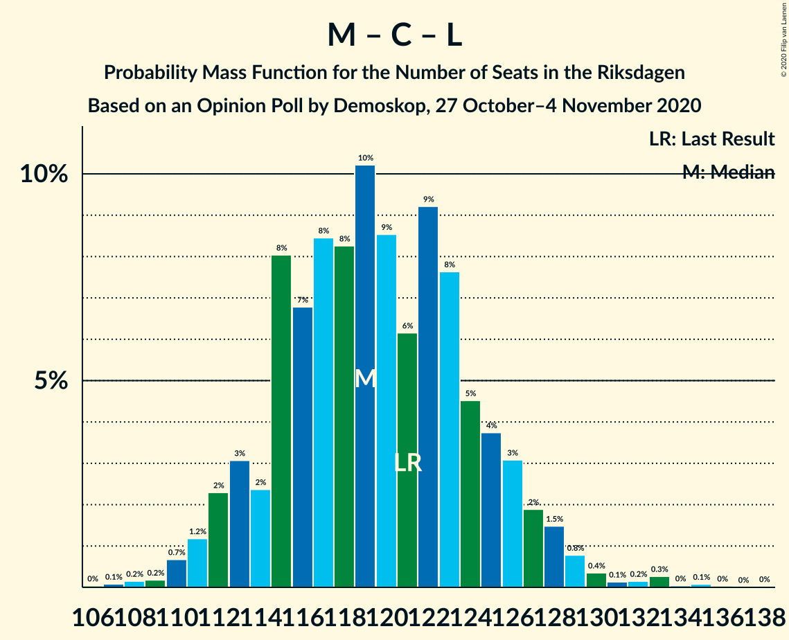

| Number of Seats | Probability | Accumulated | Special Marks |
|:---------------:|:-----------:|:-----------:|:-------------:|
| 106 | 0% | 100% |  |
| 107 | 0.1% | 99.9% |  |
| 108 | 0.2% | 99.8% |  |
| 109 | 0.2% | 99.7% |  |
| 110 | 0.7% | 99.5% |  |
| 111 | 1.2% | 98.8% |  |
| 112 | 2% | 98% |  |
| 113 | 3% | 95% |  |
| 114 | 2% | 92% |  |
| 115 | 8% | 90% |  |
| 116 | 7% | 82% |  |
| 117 | 8% | 75% |  |
| 118 | 8% | 67% |  |
| 119 | 10% | 58% | Median |
| 120 | 9% | 48% |  |
| 121 | 6% | 40% | Last Result |
| 122 | 9% | 33% |  |
| 123 | 8% | 24% |  |
| 124 | 5% | 17% |  |
| 125 | 4% | 12% |  |
| 126 | 3% | 8% |  |
| 127 | 2% | 5% |  |
| 128 | 1.5% | 3% |  |
| 129 | 0.8% | 2% |  |
| 130 | 0.4% | 1.1% |  |
| 131 | 0.1% | 0.8% |  |
| 132 | 0.2% | 0.6% |  |
| 133 | 0.3% | 0.5% |  |
| 134 | 0% | 0.2% |  |
| 135 | 0.1% | 0.2% |  |
| 136 | 0% | 0.1% |  |
| 137 | 0% | 0% |  |

### Moderata samlingspartiet – Centerpartiet

| Number of Seats | Probability | Accumulated | Special Marks |
|:---------------:|:-----------:|:-----------:|:-------------:|
| 101 | 0% | 100% | Last Result |
| 102 | 0% | 100% |  |
| 103 | 0% | 100% |  |
| 104 | 0% | 100% |  |
| 105 | 0% | 100% |  |
| 106 | 0% | 100% |  |
| 107 | 0.1% | 99.9% |  |
| 108 | 0.2% | 99.8% |  |
| 109 | 0.2% | 99.6% |  |
| 110 | 0.7% | 99.4% |  |
| 111 | 1.3% | 98.7% |  |
| 112 | 3% | 97% |  |
| 113 | 3% | 95% |  |
| 114 | 3% | 92% |  |
| 115 | 8% | 89% |  |
| 116 | 7% | 81% |  |
| 117 | 9% | 74% |  |
| 118 | 8% | 66% |  |
| 119 | 10% | 57% | Median |
| 120 | 9% | 47% |  |
| 121 | 6% | 38% |  |
| 122 | 9% | 32% |  |
| 123 | 8% | 23% |  |
| 124 | 4% | 15% |  |
| 125 | 4% | 11% |  |
| 126 | 3% | 7% |  |
| 127 | 2% | 4% |  |
| 128 | 1.4% | 3% |  |
| 129 | 0.6% | 1.1% |  |
| 130 | 0.2% | 0.5% |  |
| 131 | 0.1% | 0.3% |  |
| 132 | 0.1% | 0.1% |  |
| 133 | 0% | 0.1% |  |
| 134 | 0% | 0% |  |

### Sveriges socialdemokratiska arbetareparti – Miljöpartiet de gröna

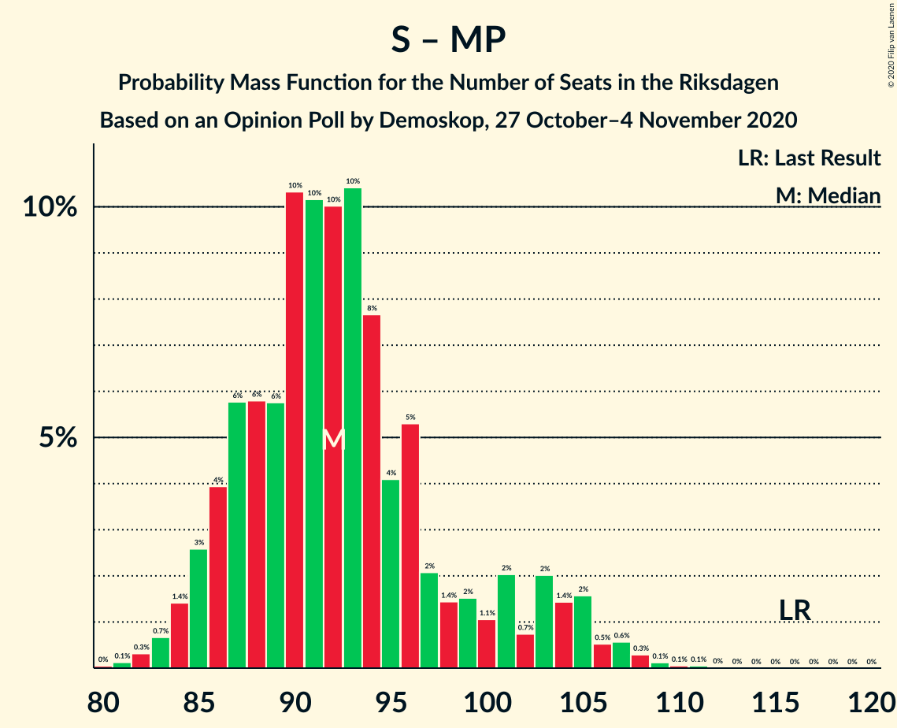

| Number of Seats | Probability | Accumulated | Special Marks |
|:---------------:|:-----------:|:-----------:|:-------------:|
| 80 | 0% | 100% |  |
| 81 | 0.1% | 99.9% |  |
| 82 | 0.3% | 99.8% |  |
| 83 | 0.7% | 99.5% |  |
| 84 | 1.4% | 98.8% |  |
| 85 | 3% | 97% |  |
| 86 | 4% | 95% |  |
| 87 | 6% | 91% |  |
| 88 | 6% | 85% |  |
| 89 | 6% | 79% |  |
| 90 | 10% | 74% |  |
| 91 | 10% | 63% | Median |
| 92 | 10% | 53% |  |
| 93 | 10% | 43% |  |
| 94 | 8% | 33% |  |
| 95 | 4% | 25% |  |
| 96 | 5% | 21% |  |
| 97 | 2% | 16% |  |
| 98 | 1.4% | 13% |  |
| 99 | 2% | 12% |  |
| 100 | 1.1% | 11% |  |
| 101 | 2% | 9% |  |
| 102 | 0.7% | 7% |  |
| 103 | 2% | 7% |  |
| 104 | 1.4% | 5% |  |
| 105 | 2% | 3% |  |
| 106 | 0.5% | 2% |  |
| 107 | 0.6% | 1.1% |  |
| 108 | 0.3% | 0.5% |  |
| 109 | 0.1% | 0.3% |  |
| 110 | 0.1% | 0.1% |  |
| 111 | 0.1% | 0.1% |  |
| 112 | 0% | 0% |  |
| 113 | 0% | 0% |  |
| 114 | 0% | 0% |  |
| 115 | 0% | 0% |  |
| 116 | 0% | 0% | Last Result |

## Technical Information

### Opinion Poll

+ **Polling firm:** Demoskop
+ **Commissioner(s):** —
+ **Fieldwork period:** 27 October–4 November 2020

### Calculations

+ **Sample size:** 2200
+ **Simulations done:** 1,048,576
+ **Error estimate:** 1.01%

