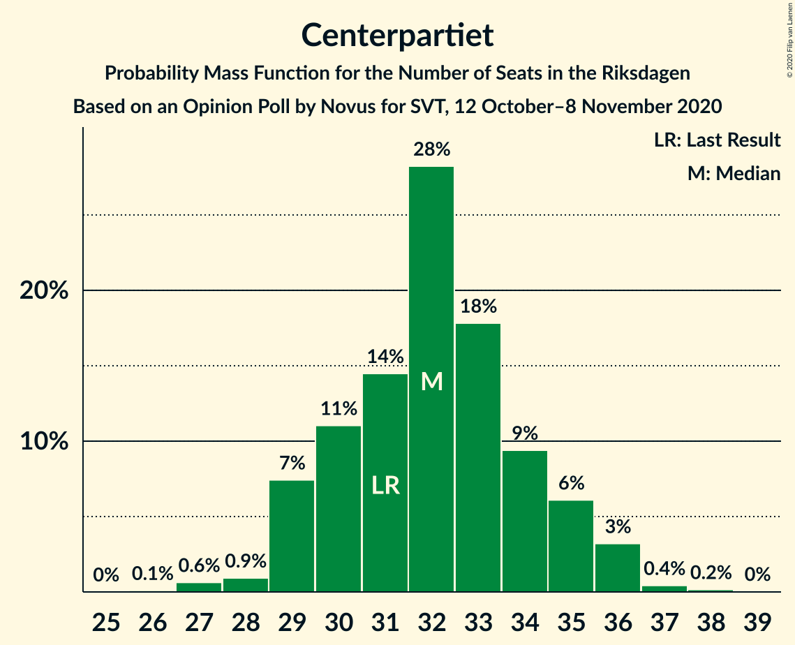
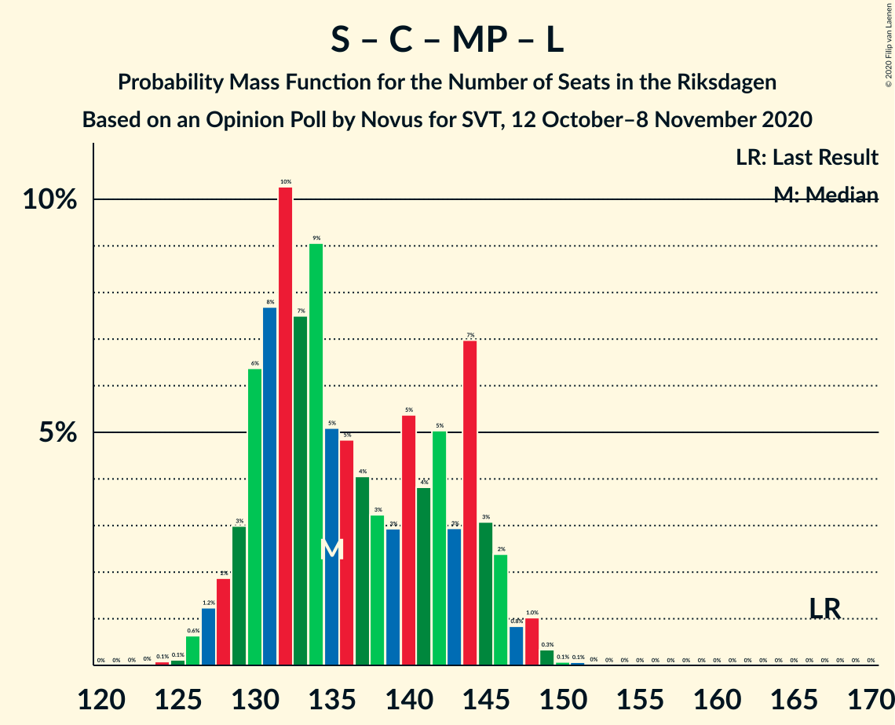

# Opinion Poll by Novus for SVT, 12 October–8 November 2020

<a href="#voting-intentions">Voting Intentions</a> | <a href="#seats">Seats</a> | <a href="#coalitions">Coalitions</a> | <a href="#technical-information">Technical Information</a>

## Voting Intentions

### Confidence Intervals

| Party | Last Result | Poll Result | 80% Confidence Interval | 90% Confidence Interval | 95% Confidence Interval | 99% Confidence Interval |
|:-----:|:-----------:|:-----------:|:-----------------------:|:-----------------------:|:-----------------------:|:-----------------------:|
| Sveriges socialdemokratiska arbetareparti | 28.3% | 26.4% | 25.5–27.3% |25.2–27.6% |25.0–27.8% |24.6–28.3% |
| Moderata samlingspartiet | 19.8% | 22.0% | 21.1–22.9% |20.9–23.1% |20.7–23.4% |20.3–23.8% |
| Sverigedemokraterna | 17.5% | 19.4% | 18.6–20.3% |18.4–20.5% |18.2–20.7% |17.8–21.1% |
| Vänsterpartiet | 8.0% | 10.6% | 10.0–11.3% |9.8–11.5% |9.6–11.6% |9.4–11.9% |
| Centerpartiet | 8.6% | 8.6% | 8.0–9.2% |7.9–9.4% |7.7–9.5% |7.5–9.8% |
| Kristdemokraterna | 6.3% | 5.0% | 4.6–5.5% |4.4–5.6% |4.3–5.7% |4.1–6.0% |
| Miljöpartiet de gröna | 4.4% | 3.9% | 3.5–4.4% |3.4–4.5% |3.3–4.6% |3.2–4.8% |
| Liberalerna | 5.5% | 2.7% | 2.4–3.1% |2.3–3.2% |2.2–3.3% |2.1–3.5% |

*Note:* The poll result column reflects the actual value used in the calculations. Published results may vary slightly, and in addition be rounded to fewer digits.

## Seats

### Confidence Intervals

| Party | Last Result | Median | 80% Confidence Interval | 90% Confidence Interval | 95% Confidence Interval | 99% Confidence Interval |
|:-----:|:-----------:|:------:|:-----------------------:|:-----------------------:|:-----------------------:|:-----------------------:|
| <a href="#sveriges-socialdemokratiska-arbetareparti">Sveriges socialdemokratiska arbetareparti</a> | 100 | 99 | 94–103 |93–105 |92–106 |90–107 |
| <a href="#moderata-samlingspartiet">Moderata samlingspartiet</a> | 70 | 81 | 78–86 |77–86 |75–87 |74–90 |
| <a href="#sverigedemokraterna">Sverigedemokraterna</a> | 62 | 72 | 68–76 |67–77 |66–78 |64–80 |
| <a href="#vänsterpartiet">Vänsterpartiet</a> | 28 | 40 | 37–42 |36–44 |35–44 |34–45 |
| <a href="#centerpartiet">Centerpartiet</a> | 31 | 32 | 29–35 |29–35 |28–36 |27–37 |
| <a href="#kristdemokraterna">Kristdemokraterna</a> | 22 | 19 | 17–20 |16–21 |16–21 |16–23 |
| <a href="#miljöpartiet-de-gröna">Miljöpartiet de gröna</a> | 16 | 0 | 0–16 |0–16 |0–17 |0–17 |
| <a href="#liberalerna">Liberalerna</a> | 20 | 0 | 0 |0 |0 |0 |

### Sveriges socialdemokratiska arbetareparti

*For a full overview of the results for this party, see the [Sveriges socialdemokratiska arbetareparti](party-sverigessocialdemokratiskaarbetareparti.html) page.*

| Number of Seats | Probability | Accumulated | Special Marks |
|:---------------:|:-----------:|:-----------:|:-------------:|
| 88 | 0.1% | 100% |  |
| 89 | 0.1% | 99.9% |  |
| 90 | 0.6% | 99.8% |  |
| 91 | 1.1% | 99.2% |  |
| 92 | 1.3% | 98% |  |
| 93 | 3% | 97% |  |
| 94 | 4% | 94% |  |
| 95 | 10% | 90% |  |
| 96 | 8% | 80% |  |
| 97 | 4% | 72% |  |
| 98 | 14% | 68% |  |
| 99 | 10% | 54% | Median |
| 100 | 8% | 45% | Last Result |
| 101 | 15% | 37% |  |
| 102 | 10% | 22% |  |
| 103 | 4% | 12% |  |
| 104 | 2% | 8% |  |
| 105 | 2% | 6% |  |
| 106 | 3% | 4% |  |
| 107 | 0.5% | 0.8% |  |
| 108 | 0.3% | 0.3% |  |
| 109 | 0% | 0% |  |

### Moderata samlingspartiet

*For a full overview of the results for this party, see the [Moderata samlingspartiet](party-moderatasamlingspartiet.html) page.*

| Number of Seats | Probability | Accumulated | Special Marks |
|:---------------:|:-----------:|:-----------:|:-------------:|
| 70 | 0% | 100% | Last Result |
| 71 | 0% | 100% |  |
| 72 | 0% | 100% |  |
| 73 | 0.1% | 100% |  |
| 74 | 0.8% | 99.8% |  |
| 75 | 2% | 99.0% |  |
| 76 | 2% | 97% |  |
| 77 | 4% | 95% |  |
| 78 | 3% | 91% |  |
| 79 | 11% | 88% |  |
| 80 | 8% | 77% |  |
| 81 | 22% | 69% | Median |
| 82 | 7% | 47% |  |
| 83 | 13% | 40% |  |
| 84 | 7% | 27% |  |
| 85 | 10% | 20% |  |
| 86 | 6% | 10% |  |
| 87 | 2% | 4% |  |
| 88 | 0.9% | 2% |  |
| 89 | 0.5% | 1.1% |  |
| 90 | 0.5% | 0.6% |  |
| 91 | 0.1% | 0.2% |  |
| 92 | 0% | 0% |  |

### Sverigedemokraterna

*For a full overview of the results for this party, see the [Sverigedemokraterna](party-sverigedemokraterna.html) page.*

| Number of Seats | Probability | Accumulated | Special Marks |
|:---------------:|:-----------:|:-----------:|:-------------:|
| 62 | 0% | 100% | Last Result |
| 63 | 0.4% | 100% |  |
| 64 | 0.2% | 99.6% |  |
| 65 | 0.5% | 99.4% |  |
| 66 | 3% | 98.9% |  |
| 67 | 4% | 96% |  |
| 68 | 3% | 92% |  |
| 69 | 5% | 88% |  |
| 70 | 9% | 83% |  |
| 71 | 7% | 74% |  |
| 72 | 22% | 67% | Median |
| 73 | 11% | 45% |  |
| 74 | 9% | 34% |  |
| 75 | 6% | 24% |  |
| 76 | 12% | 19% |  |
| 77 | 3% | 7% |  |
| 78 | 2% | 4% |  |
| 79 | 1.0% | 2% |  |
| 80 | 0.5% | 0.8% |  |
| 81 | 0.2% | 0.3% |  |
| 82 | 0% | 0.1% |  |
| 83 | 0% | 0% |  |

### Vänsterpartiet

*For a full overview of the results for this party, see the [Vänsterpartiet](party-vänsterpartiet.html) page.*

| Number of Seats | Probability | Accumulated | Special Marks |
|:---------------:|:-----------:|:-----------:|:-------------:|
| 28 | 0% | 100% | Last Result |
| 29 | 0% | 100% |  |
| 30 | 0% | 100% |  |
| 31 | 0% | 100% |  |
| 32 | 0% | 100% |  |
| 33 | 0.1% | 100% |  |
| 34 | 0.7% | 99.9% |  |
| 35 | 2% | 99.2% |  |
| 36 | 3% | 97% |  |
| 37 | 9% | 94% |  |
| 38 | 9% | 85% |  |
| 39 | 13% | 76% |  |
| 40 | 22% | 63% | Median |
| 41 | 21% | 41% |  |
| 42 | 10% | 20% |  |
| 43 | 5% | 10% |  |
| 44 | 4% | 5% |  |
| 45 | 1.3% | 2% |  |
| 46 | 0.2% | 0.2% |  |
| 47 | 0% | 0% |  |

### Centerpartiet

*For a full overview of the results for this party, see the [Centerpartiet](party-centerpartiet.html) page.*

| Number of Seats | Probability | Accumulated | Special Marks |
|:---------------:|:-----------:|:-----------:|:-------------:|
| 26 | 0.2% | 100% |  |
| 27 | 2% | 99.8% |  |
| 28 | 1.1% | 98% |  |
| 29 | 9% | 97% |  |
| 30 | 10% | 88% |  |
| 31 | 7% | 78% | Last Result |
| 32 | 25% | 71% | Median |
| 33 | 18% | 46% |  |
| 34 | 11% | 28% |  |
| 35 | 12% | 17% |  |
| 36 | 4% | 5% |  |
| 37 | 0.3% | 0.6% |  |
| 38 | 0.3% | 0.3% |  |
| 39 | 0% | 0% |  |

### Kristdemokraterna

*For a full overview of the results for this party, see the [Kristdemokraterna](party-kristdemokraterna.html) page.*

| Number of Seats | Probability | Accumulated | Special Marks |
|:---------------:|:-----------:|:-----------:|:-------------:|
| 0 | 0.1% | 100% |  |
| 1 | 0% | 99.9% |  |
| 2 | 0% | 99.9% |  |
| 3 | 0% | 99.9% |  |
| 4 | 0% | 99.9% |  |
| 5 | 0% | 99.9% |  |
| 6 | 0% | 99.9% |  |
| 7 | 0% | 99.9% |  |
| 8 | 0% | 99.9% |  |
| 9 | 0% | 99.9% |  |
| 10 | 0% | 99.9% |  |
| 11 | 0% | 99.9% |  |
| 12 | 0% | 99.9% |  |
| 13 | 0% | 99.9% |  |
| 14 | 0% | 99.9% |  |
| 15 | 0.3% | 99.9% |  |
| 16 | 8% | 99.6% |  |
| 17 | 20% | 91% |  |
| 18 | 11% | 71% |  |
| 19 | 26% | 60% | Median |
| 20 | 27% | 34% |  |
| 21 | 5% | 7% |  |
| 22 | 2% | 2% | Last Result |
| 23 | 0.5% | 0.6% |  |
| 24 | 0.1% | 0.1% |  |
| 25 | 0% | 0% |  |

### Miljöpartiet de gröna

*For a full overview of the results for this party, see the [Miljöpartiet de gröna](party-miljöpartietdegröna.html) page.*

| Number of Seats | Probability | Accumulated | Special Marks |
|:---------------:|:-----------:|:-----------:|:-------------:|
| 0 | 66% | 100% | Median |
| 1 | 0% | 34% |  |
| 2 | 0% | 34% |  |
| 3 | 0% | 34% |  |
| 4 | 0% | 34% |  |
| 5 | 0% | 34% |  |
| 6 | 0% | 34% |  |
| 7 | 0% | 34% |  |
| 8 | 0% | 34% |  |
| 9 | 0% | 34% |  |
| 10 | 0% | 34% |  |
| 11 | 0% | 34% |  |
| 12 | 0% | 34% |  |
| 13 | 0% | 34% |  |
| 14 | 0.1% | 34% |  |
| 15 | 22% | 34% |  |
| 16 | 9% | 12% | Last Result |
| 17 | 3% | 3% |  |
| 18 | 0.4% | 0.4% |  |
| 19 | 0% | 0% |  |

### Liberalerna

*For a full overview of the results for this party, see the [Liberalerna](party-liberalerna.html) page.*

| Number of Seats | Probability | Accumulated | Special Marks |
|:---------------:|:-----------:|:-----------:|:-------------:|
| 0 | 100% | 100% | Median |
| 1 | 0% | 0% |  |
| 2 | 0% | 0% |  |
| 3 | 0% | 0% |  |
| 4 | 0% | 0% |  |
| 5 | 0% | 0% |  |
| 6 | 0% | 0% |  |
| 7 | 0% | 0% |  |
| 8 | 0% | 0% |  |
| 9 | 0% | 0% |  |
| 10 | 0% | 0% |  |
| 11 | 0% | 0% |  |
| 12 | 0% | 0% |  |
| 13 | 0% | 0% |  |
| 14 | 0% | 0% |  |
| 15 | 0% | 0% |  |
| 16 | 0% | 0% |  |
| 17 | 0% | 0% |  |
| 18 | 0% | 0% |  |
| 19 | 0% | 0% |  |
| 20 | 0% | 0% | Last Result |

## Coalitions

### Confidence Intervals

| Coalition | Last Result | Median | Majority? | 80% Confidence Interval | 90% Confidence Interval | 95% Confidence Interval | 99% Confidence Interval |
|:---------:|:-----------:|:------:|:---------:|:-----------------------:|:-----------------------:|:-----------------------:|:-----------------------:|
| Sveriges socialdemokratiska arbetareparti – Moderata samlingspartiet – Centerpartiet | 201 | 213 | 100% | 205–219 | 204–220 | 202–220 | 201–224 |
| Sveriges socialdemokratiska arbetareparti – Moderata samlingspartiet | 170 | 180 | 86% | 174–186 | 173–188 | 171–188 | 169–191 |
| Sveriges socialdemokratiska arbetareparti – Vänsterpartiet – Centerpartiet – Miljöpartiet de gröna – Liberalerna | 195 | 176 | 67% | 170–183 | 170–186 | 168–186 | 164–188 |
| Moderata samlingspartiet – Sverigedemokraterna – Kristdemokraterna | 154 | 173 | 33% | 166–179 | 163–179 | 163–181 | 161–185 |
| Moderata samlingspartiet – Sverigedemokraterna | 132 | 155 | 0% | 148–159 | 145–161 | 144–162 | 143–166 |
| Sveriges socialdemokratiska arbetareparti – Vänsterpartiet – Miljöpartiet de gröna | 144 | 144 | 0% | 138–151 | 136–153 | 135–154 | 133–157 |
| Sveriges socialdemokratiska arbetareparti – Centerpartiet – Miljöpartiet de gröna – Liberalerna | 167 | 135 | 0% | 131–144 | 130–147 | 128–148 | 126–149 |
| Sveriges socialdemokratiska arbetareparti – Vänsterpartiet | 128 | 139 | 0% | 133–145 | 132–145 | 130–146 | 127–147 |
| Moderata samlingspartiet – Centerpartiet – Kristdemokraterna – Liberalerna | 143 | 134 | 0% | 127–137 | 126–139 | 125–140 | 122–142 |
| Moderata samlingspartiet – Centerpartiet – Kristdemokraterna | 123 | 134 | 0% | 127–137 | 126–139 | 125–140 | 122–142 |
| Moderata samlingspartiet – Centerpartiet – Liberalerna | 121 | 114 | 0% | 109–119 | 107–119 | 107–121 | 105–122 |
| Moderata samlingspartiet – Centerpartiet | 101 | 114 | 0% | 109–119 | 107–119 | 107–121 | 105–122 |
| Sveriges socialdemokratiska arbetareparti – Miljöpartiet de gröna | 116 | 102 | 0% | 98–113 | 97–114 | 96–115 | 93–118 |

### Sveriges socialdemokratiska arbetareparti – Moderata samlingspartiet – Centerpartiet

| Number of Seats | Probability | Accumulated | Special Marks |
|:---------------:|:-----------:|:-----------:|:-------------:|
| 197 | 0% | 100% |  |
| 198 | 0.1% | 99.9% |  |
| 199 | 0% | 99.9% |  |
| 200 | 0.3% | 99.8% |  |
| 201 | 1.4% | 99.5% | Last Result |
| 202 | 0.7% | 98% |  |
| 203 | 2% | 97% |  |
| 204 | 4% | 95% |  |
| 205 | 2% | 91% |  |
| 206 | 7% | 89% |  |
| 207 | 5% | 82% |  |
| 208 | 4% | 77% |  |
| 209 | 4% | 74% |  |
| 210 | 2% | 69% |  |
| 211 | 2% | 67% |  |
| 212 | 14% | 65% | Median |
| 213 | 3% | 51% |  |
| 214 | 2% | 48% |  |
| 215 | 0.9% | 46% |  |
| 216 | 12% | 45% |  |
| 217 | 7% | 33% |  |
| 218 | 11% | 27% |  |
| 219 | 9% | 16% |  |
| 220 | 5% | 7% |  |
| 221 | 0.3% | 2% |  |
| 222 | 0.5% | 2% |  |
| 223 | 0.6% | 1.2% |  |
| 224 | 0.3% | 0.6% |  |
| 225 | 0.1% | 0.2% |  |
| 226 | 0% | 0.1% |  |
| 227 | 0% | 0.1% |  |
| 228 | 0% | 0.1% |  |
| 229 | 0.1% | 0.1% |  |
| 230 | 0% | 0% |  |

### Sveriges socialdemokratiska arbetareparti – Moderata samlingspartiet

| Number of Seats | Probability | Accumulated | Special Marks |
|:---------------:|:-----------:|:-----------:|:-------------:|
| 166 | 0% | 100% |  |
| 167 | 0.1% | 99.9% |  |
| 168 | 0.1% | 99.8% |  |
| 169 | 1.3% | 99.8% |  |
| 170 | 0.9% | 98% | Last Result |
| 171 | 0.5% | 98% |  |
| 172 | 2% | 97% |  |
| 173 | 1.0% | 95% |  |
| 174 | 8% | 94% |  |
| 175 | 5% | 86% | Majority |
| 176 | 8% | 81% |  |
| 177 | 2% | 73% |  |
| 178 | 5% | 71% |  |
| 179 | 10% | 66% |  |
| 180 | 7% | 56% | Median |
| 181 | 5% | 49% |  |
| 182 | 5% | 44% |  |
| 183 | 2% | 39% |  |
| 184 | 11% | 38% |  |
| 185 | 4% | 26% |  |
| 186 | 12% | 22% |  |
| 187 | 0.8% | 9% |  |
| 188 | 7% | 9% |  |
| 189 | 0.3% | 2% |  |
| 190 | 0.7% | 1.4% |  |
| 191 | 0.3% | 0.7% |  |
| 192 | 0.3% | 0.4% |  |
| 193 | 0.1% | 0.1% |  |
| 194 | 0% | 0.1% |  |
| 195 | 0% | 0.1% |  |
| 196 | 0% | 0.1% |  |
| 197 | 0% | 0.1% |  |
| 198 | 0.1% | 0.1% |  |
| 199 | 0% | 0% |  |

### Sveriges socialdemokratiska arbetareparti – Vänsterpartiet – Centerpartiet – Miljöpartiet de gröna – Liberalerna

| Number of Seats | Probability | Accumulated | Special Marks |
|:---------------:|:-----------:|:-----------:|:-------------:|
| 163 | 0.2% | 100% |  |
| 164 | 0.4% | 99.8% |  |
| 165 | 0.2% | 99.3% |  |
| 166 | 0.3% | 99.2% |  |
| 167 | 0.4% | 98.8% |  |
| 168 | 2% | 98% |  |
| 169 | 1.0% | 96% |  |
| 170 | 6% | 95% |  |
| 171 | 1.4% | 89% | Median |
| 172 | 11% | 88% |  |
| 173 | 6% | 77% |  |
| 174 | 3% | 70% |  |
| 175 | 13% | 67% | Majority |
| 176 | 7% | 54% |  |
| 177 | 15% | 47% |  |
| 178 | 5% | 32% |  |
| 179 | 2% | 26% |  |
| 180 | 5% | 24% |  |
| 181 | 2% | 19% |  |
| 182 | 6% | 17% |  |
| 183 | 2% | 11% |  |
| 184 | 1.0% | 9% |  |
| 185 | 3% | 8% |  |
| 186 | 3% | 5% |  |
| 187 | 2% | 2% |  |
| 188 | 0.4% | 0.7% |  |
| 189 | 0.2% | 0.3% |  |
| 190 | 0% | 0.1% |  |
| 191 | 0% | 0% |  |
| 192 | 0% | 0% |  |
| 193 | 0% | 0% |  |
| 194 | 0% | 0% |  |
| 195 | 0% | 0% | Last Result |

### Moderata samlingspartiet – Sverigedemokraterna – Kristdemokraterna

| Number of Seats | Probability | Accumulated | Special Marks |
|:---------------:|:-----------:|:-----------:|:-------------:|
| 154 | 0% | 100% | Last Result |
| 155 | 0% | 100% |  |
| 156 | 0% | 100% |  |
| 157 | 0% | 100% |  |
| 158 | 0% | 100% |  |
| 159 | 0% | 100% |  |
| 160 | 0.2% | 99.9% |  |
| 161 | 0.4% | 99.7% |  |
| 162 | 2% | 99.3% |  |
| 163 | 3% | 98% |  |
| 164 | 3% | 95% |  |
| 165 | 1.0% | 92% |  |
| 166 | 2% | 91% |  |
| 167 | 6% | 89% |  |
| 168 | 2% | 83% |  |
| 169 | 5% | 81% |  |
| 170 | 2% | 76% |  |
| 171 | 5% | 74% |  |
| 172 | 15% | 68% | Median |
| 173 | 7% | 53% |  |
| 174 | 13% | 46% |  |
| 175 | 3% | 33% | Majority |
| 176 | 6% | 30% |  |
| 177 | 11% | 23% |  |
| 178 | 1.4% | 12% |  |
| 179 | 6% | 11% |  |
| 180 | 1.0% | 5% |  |
| 181 | 2% | 4% |  |
| 182 | 0.4% | 2% |  |
| 183 | 0.3% | 1.2% |  |
| 184 | 0.2% | 0.8% |  |
| 185 | 0.4% | 0.7% |  |
| 186 | 0.2% | 0.2% |  |
| 187 | 0% | 0% |  |

### Moderata samlingspartiet – Sverigedemokraterna

| Number of Seats | Probability | Accumulated | Special Marks |
|:---------------:|:-----------:|:-----------:|:-------------:|
| 132 | 0% | 100% | Last Result |
| 133 | 0% | 100% |  |
| 134 | 0% | 100% |  |
| 135 | 0% | 100% |  |
| 136 | 0% | 100% |  |
| 137 | 0% | 100% |  |
| 138 | 0% | 100% |  |
| 139 | 0% | 100% |  |
| 140 | 0% | 100% |  |
| 141 | 0% | 100% |  |
| 142 | 0.1% | 100% |  |
| 143 | 0.9% | 99.9% |  |
| 144 | 4% | 99.0% |  |
| 145 | 1.0% | 95% |  |
| 146 | 1.3% | 94% |  |
| 147 | 3% | 93% |  |
| 148 | 2% | 90% |  |
| 149 | 3% | 88% |  |
| 150 | 3% | 85% |  |
| 151 | 6% | 81% |  |
| 152 | 6% | 75% |  |
| 153 | 10% | 69% | Median |
| 154 | 7% | 59% |  |
| 155 | 11% | 52% |  |
| 156 | 9% | 41% |  |
| 157 | 16% | 32% |  |
| 158 | 2% | 16% |  |
| 159 | 5% | 13% |  |
| 160 | 3% | 8% |  |
| 161 | 2% | 5% |  |
| 162 | 0.9% | 3% |  |
| 163 | 0.9% | 2% |  |
| 164 | 0.4% | 1.4% |  |
| 165 | 0.4% | 1.0% |  |
| 166 | 0.5% | 0.6% |  |
| 167 | 0% | 0.1% |  |
| 168 | 0% | 0.1% |  |
| 169 | 0.1% | 0.1% |  |
| 170 | 0% | 0% |  |

### Sveriges socialdemokratiska arbetareparti – Vänsterpartiet – Miljöpartiet de gröna

| Number of Seats | Probability | Accumulated | Special Marks |
|:---------------:|:-----------:|:-----------:|:-------------:|
| 131 | 0.1% | 100% |  |
| 132 | 0.2% | 99.9% |  |
| 133 | 0.5% | 99.7% |  |
| 134 | 0.7% | 99.2% |  |
| 135 | 1.1% | 98% |  |
| 136 | 3% | 97% |  |
| 137 | 1.1% | 94% |  |
| 138 | 4% | 93% |  |
| 139 | 12% | 89% | Median |
| 140 | 5% | 77% |  |
| 141 | 9% | 72% |  |
| 142 | 9% | 63% |  |
| 143 | 3% | 53% |  |
| 144 | 7% | 51% | Last Result |
| 145 | 8% | 44% |  |
| 146 | 5% | 36% |  |
| 147 | 3% | 31% |  |
| 148 | 4% | 28% |  |
| 149 | 2% | 24% |  |
| 150 | 9% | 22% |  |
| 151 | 3% | 13% |  |
| 152 | 4% | 10% |  |
| 153 | 2% | 6% |  |
| 154 | 2% | 4% |  |
| 155 | 0.6% | 1.4% |  |
| 156 | 0.2% | 0.8% |  |
| 157 | 0.1% | 0.5% |  |
| 158 | 0.4% | 0.5% |  |
| 159 | 0% | 0.1% |  |
| 160 | 0% | 0% |  |

### Sveriges socialdemokratiska arbetareparti – Centerpartiet – Miljöpartiet de gröna – Liberalerna

| Number of Seats | Probability | Accumulated | Special Marks |
|:---------------:|:-----------:|:-----------:|:-------------:|
| 123 | 0.1% | 100% |  |
| 124 | 0.1% | 99.9% |  |
| 125 | 0.1% | 99.7% |  |
| 126 | 0.8% | 99.6% |  |
| 127 | 0.9% | 98.7% |  |
| 128 | 0.8% | 98% |  |
| 129 | 2% | 97% |  |
| 130 | 0.7% | 95% |  |
| 131 | 15% | 95% | Median |
| 132 | 6% | 80% |  |
| 133 | 7% | 74% |  |
| 134 | 6% | 66% |  |
| 135 | 11% | 60% |  |
| 136 | 10% | 49% |  |
| 137 | 1.2% | 39% |  |
| 138 | 7% | 37% |  |
| 139 | 4% | 30% |  |
| 140 | 2% | 26% |  |
| 141 | 3% | 24% |  |
| 142 | 5% | 20% |  |
| 143 | 4% | 15% |  |
| 144 | 2% | 11% |  |
| 145 | 1.1% | 9% |  |
| 146 | 3% | 8% |  |
| 147 | 2% | 5% |  |
| 148 | 3% | 3% |  |
| 149 | 0.4% | 0.6% |  |
| 150 | 0.1% | 0.2% |  |
| 151 | 0.1% | 0.1% |  |
| 152 | 0% | 0% |  |
| 153 | 0% | 0% |  |
| 154 | 0% | 0% |  |
| 155 | 0% | 0% |  |
| 156 | 0% | 0% |  |
| 157 | 0% | 0% |  |
| 158 | 0% | 0% |  |
| 159 | 0% | 0% |  |
| 160 | 0% | 0% |  |
| 161 | 0% | 0% |  |
| 162 | 0% | 0% |  |
| 163 | 0% | 0% |  |
| 164 | 0% | 0% |  |
| 165 | 0% | 0% |  |
| 166 | 0% | 0% |  |
| 167 | 0% | 0% | Last Result |

### Sveriges socialdemokratiska arbetareparti – Vänsterpartiet

| Number of Seats | Probability | Accumulated | Special Marks |
|:---------------:|:-----------:|:-----------:|:-------------:|
| 126 | 0.1% | 100% |  |
| 127 | 0.4% | 99.9% |  |
| 128 | 0.1% | 99.4% | Last Result |
| 129 | 1.0% | 99.3% |  |
| 130 | 1.1% | 98% |  |
| 131 | 2% | 97% |  |
| 132 | 3% | 95% |  |
| 133 | 5% | 92% |  |
| 134 | 2% | 87% |  |
| 135 | 12% | 85% |  |
| 136 | 5% | 73% |  |
| 137 | 4% | 68% |  |
| 138 | 8% | 64% |  |
| 139 | 13% | 56% | Median |
| 140 | 5% | 44% |  |
| 141 | 9% | 38% |  |
| 142 | 9% | 29% |  |
| 143 | 2% | 20% |  |
| 144 | 6% | 17% |  |
| 145 | 7% | 11% |  |
| 146 | 3% | 4% |  |
| 147 | 0.1% | 0.5% |  |
| 148 | 0.1% | 0.4% |  |
| 149 | 0.1% | 0.3% |  |
| 150 | 0.2% | 0.2% |  |
| 151 | 0% | 0% |  |

### Moderata samlingspartiet – Centerpartiet – Kristdemokraterna – Liberalerna

| Number of Seats | Probability | Accumulated | Special Marks |
|:---------------:|:-----------:|:-----------:|:-------------:|
| 120 | 0% | 100% |  |
| 121 | 0.3% | 99.9% |  |
| 122 | 0.7% | 99.6% |  |
| 123 | 0.2% | 98.8% |  |
| 124 | 1.0% | 98.7% |  |
| 125 | 0.7% | 98% |  |
| 126 | 3% | 97% |  |
| 127 | 8% | 94% |  |
| 128 | 1.4% | 86% |  |
| 129 | 8% | 85% |  |
| 130 | 10% | 77% |  |
| 131 | 4% | 66% |  |
| 132 | 8% | 62% | Median |
| 133 | 4% | 55% |  |
| 134 | 10% | 51% |  |
| 135 | 18% | 40% |  |
| 136 | 7% | 22% |  |
| 137 | 8% | 15% |  |
| 138 | 2% | 7% |  |
| 139 | 2% | 5% |  |
| 140 | 2% | 3% |  |
| 141 | 0.2% | 0.9% |  |
| 142 | 0.4% | 0.7% |  |
| 143 | 0.1% | 0.3% | Last Result |
| 144 | 0.1% | 0.2% |  |
| 145 | 0% | 0% |  |

### Moderata samlingspartiet – Centerpartiet – Kristdemokraterna

| Number of Seats | Probability | Accumulated | Special Marks |
|:---------------:|:-----------:|:-----------:|:-------------:|
| 120 | 0% | 100% |  |
| 121 | 0.3% | 99.9% |  |
| 122 | 0.7% | 99.6% |  |
| 123 | 0.2% | 98.8% | Last Result |
| 124 | 1.0% | 98.7% |  |
| 125 | 0.7% | 98% |  |
| 126 | 3% | 97% |  |
| 127 | 8% | 94% |  |
| 128 | 1.4% | 86% |  |
| 129 | 8% | 85% |  |
| 130 | 10% | 77% |  |
| 131 | 4% | 66% |  |
| 132 | 8% | 62% | Median |
| 133 | 4% | 55% |  |
| 134 | 10% | 51% |  |
| 135 | 18% | 40% |  |
| 136 | 7% | 22% |  |
| 137 | 8% | 15% |  |
| 138 | 2% | 7% |  |
| 139 | 2% | 5% |  |
| 140 | 2% | 3% |  |
| 141 | 0.2% | 0.9% |  |
| 142 | 0.4% | 0.7% |  |
| 143 | 0.1% | 0.3% |  |
| 144 | 0.1% | 0.2% |  |
| 145 | 0% | 0% |  |

### Moderata samlingspartiet – Centerpartiet – Liberalerna

| Number of Seats | Probability | Accumulated | Special Marks |
|:---------------:|:-----------:|:-----------:|:-------------:|
| 102 | 0.1% | 100% |  |
| 103 | 0% | 99.9% |  |
| 104 | 0.4% | 99.9% |  |
| 105 | 1.3% | 99.5% |  |
| 106 | 0.2% | 98% |  |
| 107 | 4% | 98% |  |
| 108 | 1.3% | 94% |  |
| 109 | 4% | 93% |  |
| 110 | 5% | 89% |  |
| 111 | 10% | 84% |  |
| 112 | 10% | 74% |  |
| 113 | 8% | 64% | Median |
| 114 | 11% | 56% |  |
| 115 | 7% | 45% |  |
| 116 | 11% | 38% |  |
| 117 | 8% | 27% |  |
| 118 | 8% | 19% |  |
| 119 | 7% | 10% |  |
| 120 | 1.0% | 4% |  |
| 121 | 2% | 3% | Last Result |
| 122 | 0.2% | 0.6% |  |
| 123 | 0.2% | 0.5% |  |
| 124 | 0.1% | 0.2% |  |
| 125 | 0.1% | 0.2% |  |
| 126 | 0% | 0% |  |

### Moderata samlingspartiet – Centerpartiet

| Number of Seats | Probability | Accumulated | Special Marks |
|:---------------:|:-----------:|:-----------:|:-------------:|
| 101 | 0% | 100% | Last Result |
| 102 | 0.1% | 100% |  |
| 103 | 0% | 99.9% |  |
| 104 | 0.4% | 99.9% |  |
| 105 | 1.3% | 99.5% |  |
| 106 | 0.2% | 98% |  |
| 107 | 4% | 98% |  |
| 108 | 1.3% | 94% |  |
| 109 | 4% | 93% |  |
| 110 | 5% | 89% |  |
| 111 | 10% | 84% |  |
| 112 | 10% | 74% |  |
| 113 | 8% | 64% | Median |
| 114 | 11% | 56% |  |
| 115 | 7% | 45% |  |
| 116 | 11% | 38% |  |
| 117 | 8% | 27% |  |
| 118 | 8% | 19% |  |
| 119 | 7% | 10% |  |
| 120 | 1.0% | 4% |  |
| 121 | 2% | 3% |  |
| 122 | 0.2% | 0.6% |  |
| 123 | 0.2% | 0.4% |  |
| 124 | 0.1% | 0.2% |  |
| 125 | 0.1% | 0.2% |  |
| 126 | 0% | 0% |  |

### Sveriges socialdemokratiska arbetareparti – Miljöpartiet de gröna

| Number of Seats | Probability | Accumulated | Special Marks |
|:---------------:|:-----------:|:-----------:|:-------------:|
| 91 | 0.1% | 100% |  |
| 92 | 0.2% | 99.8% |  |
| 93 | 0.2% | 99.7% |  |
| 94 | 0.7% | 99.5% |  |
| 95 | 0.5% | 98.8% |  |
| 96 | 3% | 98% |  |
| 97 | 2% | 95% |  |
| 98 | 10% | 93% |  |
| 99 | 7% | 83% | Median |
| 100 | 6% | 75% |  |
| 101 | 14% | 70% |  |
| 102 | 9% | 55% |  |
| 103 | 4% | 46% |  |
| 104 | 2% | 42% |  |
| 105 | 3% | 40% |  |
| 106 | 4% | 38% |  |
| 107 | 1.1% | 33% |  |
| 108 | 3% | 32% |  |
| 109 | 3% | 30% |  |
| 110 | 10% | 27% |  |
| 111 | 3% | 17% |  |
| 112 | 2% | 14% |  |
| 113 | 3% | 11% |  |
| 114 | 5% | 9% |  |
| 115 | 2% | 4% |  |
| 116 | 0.6% | 2% | Last Result |
| 117 | 0.3% | 1.0% |  |
| 118 | 0.7% | 0.8% |  |
| 119 | 0% | 0.1% |  |
| 120 | 0% | 0% |  |

## Technical Information

### Opinion Poll

+ **Polling firm:** Novus
+ **Commissioner(s):** SVT
+ **Fieldwork period:** 12 October–8 November 2020

### Calculations

+ **Sample size:** 3783
+ **Simulations done:** 131,072
+ **Error estimate:** 1.23%

