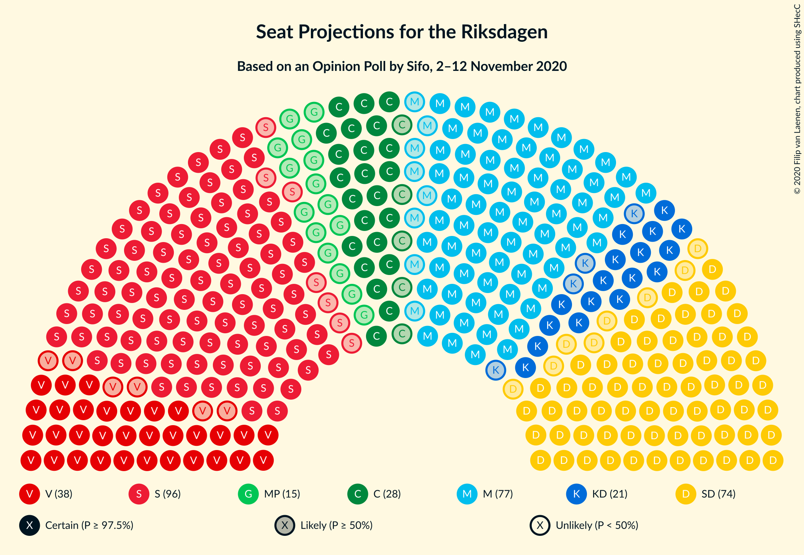

# Opinion Poll by Sifo, 2–12 November 2020

<a href="#voting-intentions">Voting Intentions</a> | <a href="#seats">Seats</a> | <a href="#coalitions">Coalitions</a> | <a href="#technical-information">Technical Information</a>

## Voting Intentions

### Confidence Intervals

| Party | Last Result | Poll Result | 80% Confidence Interval | 90% Confidence Interval | 95% Confidence Interval | 99% Confidence Interval |
|:-----:|:-----------:|:-----------:|:-----------------------:|:-----------------------:|:-----------------------:|:-----------------------:|
| Sveriges socialdemokratiska arbetareparti | 28.3% | 27.0% | 25.6–28.5% |25.2–28.9% |24.8–29.3% |24.2–30.0% |
| Moderata samlingspartiet | 19.8% | 20.8% | 19.5–22.2% |19.2–22.6% |18.9–22.9% |18.3–23.6% |
| Sverigedemokraterna | 17.5% | 19.9% | 18.6–21.3% |18.3–21.7% |18.0–22.0% |17.4–22.6% |
| Vänsterpartiet | 8.0% | 10.2% | 9.3–11.3% |9.0–11.6% |8.8–11.8% |8.4–12.4% |
| Centerpartiet | 8.6% | 7.6% | 6.8–8.6% |6.6–8.8% |6.4–9.1% |6.0–9.5% |
| Kristdemokraterna | 6.3% | 5.7% | 5.0–6.6% |4.8–6.8% |4.7–7.0% |4.4–7.4% |
| Miljöpartiet de gröna | 4.4% | 4.2% | 3.6–5.0% |3.5–5.2% |3.3–5.4% |3.1–5.7% |
| Liberalerna | 5.5% | 3.2% | 2.7–3.8% |2.5–4.0% |2.4–4.2% |2.2–4.5% |

*Note:* The poll result column reflects the actual value used in the calculations. Published results may vary slightly, and in addition be rounded to fewer digits.

## Seats

### Confidence Intervals

| Party | Last Result | Median | 80% Confidence Interval | 90% Confidence Interval | 95% Confidence Interval | 99% Confidence Interval |
|:-----:|:-----------:|:------:|:-----------------------:|:-----------------------:|:-----------------------:|:-----------------------:|
| <a href="#sveriges-socialdemokratiska-arbetareparti">Sveriges socialdemokratiska arbetareparti</a> | 100 | 101 | 92–108 |90–109 |89–111 |87–112 |
| <a href="#moderata-samlingspartiet">Moderata samlingspartiet</a> | 70 | 77 | 71–82 |70–84 |69–85 |66–88 |
| <a href="#sverigedemokraterna">Sverigedemokraterna</a> | 62 | 74 | 68–79 |67–80 |66–81 |64–84 |
| <a href="#vänsterpartiet">Vänsterpartiet</a> | 28 | 38 | 34–41 |33–43 |32–44 |31–46 |
| <a href="#centerpartiet">Centerpartiet</a> | 31 | 28 | 25–32 |24–33 |23–33 |22–35 |
| <a href="#kristdemokraterna">Kristdemokraterna</a> | 22 | 21 | 19–24 |18–25 |17–26 |16–27 |
| <a href="#miljöpartiet-de-gröna">Miljöpartiet de gröna</a> | 16 | 15 | 0–19 |0–19 |0–20 |0–21 |
| <a href="#liberalerna">Liberalerna</a> | 20 | 0 | 0 |0–14 |0–15 |0–16 |

### Sveriges socialdemokratiska arbetareparti

*For a full overview of the results for this party, see the [Sveriges socialdemokratiska arbetareparti](party-sverigessocialdemokratiskaarbetareparti.html) page.*

| Number of Seats | Probability | Accumulated | Special Marks |
|:---------------:|:-----------:|:-----------:|:-------------:|
| 84 | 0% | 100% |  |
| 85 | 0.1% | 99.9% |  |
| 86 | 0.1% | 99.9% |  |
| 87 | 0.3% | 99.7% |  |
| 88 | 0.8% | 99.5% |  |
| 89 | 2% | 98.7% |  |
| 90 | 2% | 97% |  |
| 91 | 3% | 95% |  |
| 92 | 4% | 91% |  |
| 93 | 7% | 87% |  |
| 94 | 6% | 80% |  |
| 95 | 7% | 74% |  |
| 96 | 6% | 67% |  |
| 97 | 4% | 62% |  |
| 98 | 2% | 58% |  |
| 99 | 2% | 55% |  |
| 100 | 2% | 53% | Last Result |
| 101 | 3% | 51% | Median |
| 102 | 3% | 48% |  |
| 103 | 6% | 45% |  |
| 104 | 6% | 39% |  |
| 105 | 8% | 33% |  |
| 106 | 6% | 25% |  |
| 107 | 8% | 19% |  |
| 108 | 4% | 10% |  |
| 109 | 2% | 6% |  |
| 110 | 1.4% | 4% |  |
| 111 | 2% | 3% |  |
| 112 | 0.2% | 0.6% |  |
| 113 | 0.2% | 0.3% |  |
| 114 | 0.1% | 0.1% |  |
| 115 | 0% | 0% |  |

### Moderata samlingspartiet

*For a full overview of the results for this party, see the [Moderata samlingspartiet](party-moderatasamlingspartiet.html) page.*

| Number of Seats | Probability | Accumulated | Special Marks |
|:---------------:|:-----------:|:-----------:|:-------------:|
| 64 | 0.1% | 100% |  |
| 65 | 0.1% | 99.9% |  |
| 66 | 0.3% | 99.8% |  |
| 67 | 0.4% | 99.5% |  |
| 68 | 0.9% | 99.1% |  |
| 69 | 2% | 98% |  |
| 70 | 2% | 97% | Last Result |
| 71 | 5% | 95% |  |
| 72 | 4% | 90% |  |
| 73 | 6% | 85% |  |
| 74 | 7% | 79% |  |
| 75 | 11% | 72% |  |
| 76 | 8% | 61% |  |
| 77 | 11% | 53% | Median |
| 78 | 5% | 42% |  |
| 79 | 7% | 36% |  |
| 80 | 10% | 30% |  |
| 81 | 6% | 20% |  |
| 82 | 5% | 14% |  |
| 83 | 3% | 9% |  |
| 84 | 2% | 6% |  |
| 85 | 2% | 4% |  |
| 86 | 0.8% | 2% |  |
| 87 | 0.3% | 1.0% |  |
| 88 | 0.3% | 0.7% |  |
| 89 | 0.3% | 0.4% |  |
| 90 | 0.1% | 0.1% |  |
| 91 | 0.1% | 0.1% |  |
| 92 | 0% | 0% |  |

### Sverigedemokraterna

*For a full overview of the results for this party, see the [Sverigedemokraterna](party-sverigedemokraterna.html) page.*

| Number of Seats | Probability | Accumulated | Special Marks |
|:---------------:|:-----------:|:-----------:|:-------------:|
| 60 | 0% | 100% |  |
| 61 | 0% | 99.9% |  |
| 62 | 0.2% | 99.9% | Last Result |
| 63 | 0.2% | 99.7% |  |
| 64 | 0.6% | 99.5% |  |
| 65 | 0.8% | 98.9% |  |
| 66 | 2% | 98% |  |
| 67 | 2% | 96% |  |
| 68 | 4% | 94% |  |
| 69 | 4% | 90% |  |
| 70 | 9% | 86% |  |
| 71 | 7% | 76% |  |
| 72 | 10% | 69% |  |
| 73 | 6% | 60% |  |
| 74 | 10% | 54% | Median |
| 75 | 9% | 43% |  |
| 76 | 9% | 34% |  |
| 77 | 9% | 25% |  |
| 78 | 5% | 16% |  |
| 79 | 5% | 12% |  |
| 80 | 3% | 7% |  |
| 81 | 1.4% | 4% |  |
| 82 | 1.1% | 2% |  |
| 83 | 0.4% | 1.2% |  |
| 84 | 0.4% | 0.7% |  |
| 85 | 0.2% | 0.4% |  |
| 86 | 0.1% | 0.2% |  |
| 87 | 0% | 0.1% |  |
| 88 | 0% | 0.1% |  |
| 89 | 0% | 0% |  |

### Vänsterpartiet

*For a full overview of the results for this party, see the [Vänsterpartiet](party-vänsterpartiet.html) page.*

| Number of Seats | Probability | Accumulated | Special Marks |
|:---------------:|:-----------:|:-----------:|:-------------:|
| 28 | 0% | 100% | Last Result |
| 29 | 0.1% | 100% |  |
| 30 | 0.3% | 99.8% |  |
| 31 | 1.1% | 99.5% |  |
| 32 | 1.2% | 98% |  |
| 33 | 5% | 97% |  |
| 34 | 5% | 93% |  |
| 35 | 10% | 88% |  |
| 36 | 14% | 77% |  |
| 37 | 8% | 63% |  |
| 38 | 14% | 55% | Median |
| 39 | 9% | 40% |  |
| 40 | 13% | 31% |  |
| 41 | 9% | 19% |  |
| 42 | 4% | 10% |  |
| 43 | 4% | 6% |  |
| 44 | 0.7% | 3% |  |
| 45 | 1.2% | 2% |  |
| 46 | 0.4% | 0.6% |  |
| 47 | 0.2% | 0.2% |  |
| 48 | 0.1% | 0.1% |  |
| 49 | 0% | 0% |  |

### Centerpartiet

*For a full overview of the results for this party, see the [Centerpartiet](party-centerpartiet.html) page.*

| Number of Seats | Probability | Accumulated | Special Marks |
|:---------------:|:-----------:|:-----------:|:-------------:|
| 20 | 0.1% | 100% |  |
| 21 | 0.2% | 99.9% |  |
| 22 | 0.7% | 99.7% |  |
| 23 | 2% | 99.0% |  |
| 24 | 4% | 97% |  |
| 25 | 7% | 93% |  |
| 26 | 9% | 85% |  |
| 27 | 16% | 77% |  |
| 28 | 15% | 61% | Median |
| 29 | 15% | 46% |  |
| 30 | 11% | 31% |  |
| 31 | 8% | 20% | Last Result |
| 32 | 6% | 12% |  |
| 33 | 4% | 6% |  |
| 34 | 1.2% | 2% |  |
| 35 | 0.6% | 1.0% |  |
| 36 | 0.3% | 0.5% |  |
| 37 | 0.1% | 0.2% |  |
| 38 | 0.1% | 0.1% |  |
| 39 | 0% | 0% |  |

### Kristdemokraterna

*For a full overview of the results for this party, see the [Kristdemokraterna](party-kristdemokraterna.html) page.*

| Number of Seats | Probability | Accumulated | Special Marks |
|:---------------:|:-----------:|:-----------:|:-------------:|
| 15 | 0.2% | 100% |  |
| 16 | 0.9% | 99.8% |  |
| 17 | 2% | 98.8% |  |
| 18 | 6% | 97% |  |
| 19 | 12% | 90% |  |
| 20 | 13% | 79% |  |
| 21 | 19% | 66% | Median |
| 22 | 17% | 47% | Last Result |
| 23 | 12% | 30% |  |
| 24 | 8% | 18% |  |
| 25 | 6% | 10% |  |
| 26 | 2% | 4% |  |
| 27 | 1.1% | 2% |  |
| 28 | 0.3% | 0.5% |  |
| 29 | 0.1% | 0.2% |  |
| 30 | 0% | 0% |  |

### Miljöpartiet de gröna

*For a full overview of the results for this party, see the [Miljöpartiet de gröna](party-miljöpartietdegröna.html) page.*

| Number of Seats | Probability | Accumulated | Special Marks |
|:---------------:|:-----------:|:-----------:|:-------------:|
| 0 | 41% | 100% |  |
| 1 | 0% | 59% |  |
| 2 | 0% | 59% |  |
| 3 | 0% | 59% |  |
| 4 | 0% | 59% |  |
| 5 | 0% | 59% |  |
| 6 | 0% | 59% |  |
| 7 | 0% | 59% |  |
| 8 | 0% | 59% |  |
| 9 | 0% | 59% |  |
| 10 | 0% | 59% |  |
| 11 | 0% | 59% |  |
| 12 | 0% | 59% |  |
| 13 | 0% | 59% |  |
| 14 | 0.2% | 59% |  |
| 15 | 12% | 59% | Median |
| 16 | 14% | 47% | Last Result |
| 17 | 11% | 33% |  |
| 18 | 11% | 22% |  |
| 19 | 7% | 11% |  |
| 20 | 4% | 5% |  |
| 21 | 0.9% | 1.0% |  |
| 22 | 0.1% | 0.2% |  |
| 23 | 0% | 0% |  |

### Liberalerna

*For a full overview of the results for this party, see the [Liberalerna](party-liberalerna.html) page.*

| Number of Seats | Probability | Accumulated | Special Marks |
|:---------------:|:-----------:|:-----------:|:-------------:|
| 0 | 95% | 100% | Median |
| 1 | 0% | 5% |  |
| 2 | 0% | 5% |  |
| 3 | 0% | 5% |  |
| 4 | 0% | 5% |  |
| 5 | 0% | 5% |  |
| 6 | 0% | 5% |  |
| 7 | 0% | 5% |  |
| 8 | 0% | 5% |  |
| 9 | 0% | 5% |  |
| 10 | 0% | 5% |  |
| 11 | 0% | 5% |  |
| 12 | 0% | 5% |  |
| 13 | 0% | 5% |  |
| 14 | 1.5% | 5% |  |
| 15 | 3% | 4% |  |
| 16 | 0.9% | 1.2% |  |
| 17 | 0.3% | 0.3% |  |
| 18 | 0% | 0.1% |  |
| 19 | 0% | 0% |  |
| 20 | 0% | 0% | Last Result |

## Coalitions

### Confidence Intervals

| Coalition | Last Result | Median | Majority? | 80% Confidence Interval | 90% Confidence Interval | 95% Confidence Interval | 99% Confidence Interval |
|:---------:|:-----------:|:------:|:---------:|:-----------------------:|:-----------------------:|:-----------------------:|:-----------------------:|
| Sveriges socialdemokratiska arbetareparti – Moderata samlingspartiet – Centerpartiet | 201 | 205 | 100% | 196–215 | 194–217 | 192–219 | 187–223 |
| Sveriges socialdemokratiska arbetareparti – Moderata samlingspartiet | 170 | 177 | 57% | 167–187 | 165–189 | 163–191 | 160–193 |
| Sveriges socialdemokratiska arbetareparti – Vänsterpartiet – Centerpartiet – Miljöpartiet de gröna – Liberalerna | 195 | 177 | 63% | 169–185 | 168–187 | 167–188 | 163–192 |
| Moderata samlingspartiet – Sverigedemokraterna – Kristdemokraterna | 154 | 172 | 37% | 164–180 | 162–181 | 161–182 | 157–186 |
| Moderata samlingspartiet – Sverigedemokraterna | 132 | 150 | 0% | 143–158 | 142–160 | 140–161 | 136–164 |
| Sveriges socialdemokratiska arbetareparti – Vänsterpartiet – Miljöpartiet de gröna | 144 | 147 | 0% | 141–156 | 139–159 | 136–161 | 132–163 |
| Sveriges socialdemokratiska arbetareparti – Centerpartiet – Miljöpartiet de gröna – Liberalerna | 167 | 139 | 0% | 130–148 | 129–150 | 127–152 | 123–156 |
| Sveriges socialdemokratiska arbetareparti – Vänsterpartiet | 128 | 138 | 0% | 129–146 | 127–148 | 125–151 | 123–153 |
| Moderata samlingspartiet – Centerpartiet – Kristdemokraterna – Liberalerna | 143 | 127 | 0% | 120–134 | 119–136 | 116–139 | 114–144 |
| Moderata samlingspartiet – Centerpartiet – Kristdemokraterna | 123 | 127 | 0% | 119–133 | 118–135 | 116–136 | 113–139 |
| Sveriges socialdemokratiska arbetareparti – Miljöpartiet de gröna | 116 | 110 | 0% | 103–120 | 101–121 | 98–123 | 93–126 |
| Moderata samlingspartiet – Centerpartiet – Liberalerna | 121 | 106 | 0% | 99–113 | 98–115 | 96–117 | 93–122 |
| Moderata samlingspartiet – Centerpartiet | 101 | 105 | 0% | 99–111 | 97–113 | 96–114 | 93–117 |

### Sveriges socialdemokratiska arbetareparti – Moderata samlingspartiet – Centerpartiet

| Number of Seats | Probability | Accumulated | Special Marks |
|:---------------:|:-----------:|:-----------:|:-------------:|
| 183 | 0% | 100% |  |
| 184 | 0.1% | 99.9% |  |
| 185 | 0.1% | 99.8% |  |
| 186 | 0.2% | 99.7% |  |
| 187 | 0.1% | 99.5% |  |
| 188 | 0.3% | 99.4% |  |
| 189 | 0.4% | 99.1% |  |
| 190 | 0.4% | 98.7% |  |
| 191 | 0.5% | 98% |  |
| 192 | 1.4% | 98% |  |
| 193 | 0.9% | 96% |  |
| 194 | 2% | 95% |  |
| 195 | 2% | 93% |  |
| 196 | 2% | 91% |  |
| 197 | 4% | 89% |  |
| 198 | 4% | 85% |  |
| 199 | 7% | 81% |  |
| 200 | 3% | 74% |  |
| 201 | 7% | 72% | Last Result |
| 202 | 4% | 65% |  |
| 203 | 4% | 61% |  |
| 204 | 6% | 56% |  |
| 205 | 3% | 51% |  |
| 206 | 4% | 48% | Median |
| 207 | 3% | 44% |  |
| 208 | 5% | 40% |  |
| 209 | 4% | 36% |  |
| 210 | 7% | 32% |  |
| 211 | 2% | 25% |  |
| 212 | 6% | 23% |  |
| 213 | 2% | 17% |  |
| 214 | 3% | 16% |  |
| 215 | 4% | 12% |  |
| 216 | 2% | 8% |  |
| 217 | 1.0% | 6% |  |
| 218 | 1.4% | 5% |  |
| 219 | 1.2% | 3% |  |
| 220 | 0.8% | 2% |  |
| 221 | 0.4% | 1.4% |  |
| 222 | 0.5% | 1.0% |  |
| 223 | 0.3% | 0.5% |  |
| 224 | 0.1% | 0.2% |  |
| 225 | 0.1% | 0.1% |  |
| 226 | 0% | 0.1% |  |
| 227 | 0% | 0% |  |

### Sveriges socialdemokratiska arbetareparti – Moderata samlingspartiet

| Number of Seats | Probability | Accumulated | Special Marks |
|:---------------:|:-----------:|:-----------:|:-------------:|
| 156 | 0% | 100% |  |
| 157 | 0% | 99.9% |  |
| 158 | 0.2% | 99.9% |  |
| 159 | 0.1% | 99.7% |  |
| 160 | 0.3% | 99.6% |  |
| 161 | 0.4% | 99.3% |  |
| 162 | 0.3% | 98.9% |  |
| 163 | 1.2% | 98.6% |  |
| 164 | 2% | 97% |  |
| 165 | 1.0% | 96% |  |
| 166 | 3% | 95% |  |
| 167 | 3% | 92% |  |
| 168 | 6% | 89% |  |
| 169 | 2% | 83% |  |
| 170 | 6% | 81% | Last Result |
| 171 | 3% | 75% |  |
| 172 | 6% | 73% |  |
| 173 | 5% | 66% |  |
| 174 | 4% | 61% |  |
| 175 | 3% | 57% | Majority |
| 176 | 4% | 54% |  |
| 177 | 3% | 50% |  |
| 178 | 3% | 47% | Median |
| 179 | 3% | 44% |  |
| 180 | 5% | 41% |  |
| 181 | 3% | 36% |  |
| 182 | 3% | 33% |  |
| 183 | 4% | 30% |  |
| 184 | 8% | 26% |  |
| 185 | 4% | 18% |  |
| 186 | 3% | 14% |  |
| 187 | 2% | 11% |  |
| 188 | 4% | 9% |  |
| 189 | 2% | 5% |  |
| 190 | 0.7% | 4% |  |
| 191 | 1.2% | 3% |  |
| 192 | 0.9% | 2% |  |
| 193 | 0.4% | 0.8% |  |
| 194 | 0.2% | 0.4% |  |
| 195 | 0.1% | 0.3% |  |
| 196 | 0.1% | 0.1% |  |
| 197 | 0% | 0.1% |  |
| 198 | 0% | 0% |  |

### Sveriges socialdemokratiska arbetareparti – Vänsterpartiet – Centerpartiet – Miljöpartiet de gröna – Liberalerna

| Number of Seats | Probability | Accumulated | Special Marks |
|:---------------:|:-----------:|:-----------:|:-------------:|
| 159 | 0% | 100% |  |
| 160 | 0.1% | 99.9% |  |
| 161 | 0.1% | 99.8% |  |
| 162 | 0.1% | 99.7% |  |
| 163 | 0.3% | 99.6% |  |
| 164 | 0.3% | 99.3% |  |
| 165 | 0.8% | 99.0% |  |
| 166 | 0.7% | 98% |  |
| 167 | 2% | 98% |  |
| 168 | 2% | 96% |  |
| 169 | 6% | 94% |  |
| 170 | 5% | 88% |  |
| 171 | 3% | 83% |  |
| 172 | 7% | 80% |  |
| 173 | 7% | 74% |  |
| 174 | 5% | 67% |  |
| 175 | 5% | 63% | Majority |
| 176 | 4% | 58% |  |
| 177 | 8% | 54% |  |
| 178 | 5% | 46% |  |
| 179 | 6% | 41% |  |
| 180 | 4% | 35% |  |
| 181 | 4% | 31% |  |
| 182 | 6% | 27% | Median |
| 183 | 6% | 21% |  |
| 184 | 4% | 15% |  |
| 185 | 3% | 11% |  |
| 186 | 2% | 8% |  |
| 187 | 2% | 6% |  |
| 188 | 1.1% | 3% |  |
| 189 | 0.6% | 2% |  |
| 190 | 0.4% | 2% |  |
| 191 | 0.4% | 1.2% |  |
| 192 | 0.4% | 0.8% |  |
| 193 | 0.1% | 0.4% |  |
| 194 | 0.1% | 0.3% |  |
| 195 | 0.1% | 0.2% | Last Result |
| 196 | 0.1% | 0.1% |  |
| 197 | 0% | 0.1% |  |
| 198 | 0% | 0% |  |

### Moderata samlingspartiet – Sverigedemokraterna – Kristdemokraterna

| Number of Seats | Probability | Accumulated | Special Marks |
|:---------------:|:-----------:|:-----------:|:-------------:|
| 152 | 0% | 100% |  |
| 153 | 0.1% | 99.9% |  |
| 154 | 0.1% | 99.9% | Last Result |
| 155 | 0.1% | 99.8% |  |
| 156 | 0.1% | 99.7% |  |
| 157 | 0.4% | 99.6% |  |
| 158 | 0.4% | 99.2% |  |
| 159 | 0.4% | 98.8% |  |
| 160 | 0.6% | 98% |  |
| 161 | 1.1% | 98% |  |
| 162 | 2% | 97% |  |
| 163 | 2% | 94% |  |
| 164 | 3% | 92% |  |
| 165 | 4% | 89% |  |
| 166 | 6% | 85% |  |
| 167 | 6% | 79% |  |
| 168 | 4% | 73% |  |
| 169 | 4% | 69% |  |
| 170 | 6% | 65% |  |
| 171 | 5% | 59% |  |
| 172 | 8% | 54% | Median |
| 173 | 4% | 46% |  |
| 174 | 5% | 42% |  |
| 175 | 5% | 37% | Majority |
| 176 | 7% | 33% |  |
| 177 | 7% | 26% |  |
| 178 | 3% | 20% |  |
| 179 | 5% | 17% |  |
| 180 | 6% | 12% |  |
| 181 | 2% | 6% |  |
| 182 | 2% | 4% |  |
| 183 | 0.7% | 2% |  |
| 184 | 0.8% | 2% |  |
| 185 | 0.3% | 1.0% |  |
| 186 | 0.3% | 0.7% |  |
| 187 | 0.1% | 0.4% |  |
| 188 | 0.1% | 0.3% |  |
| 189 | 0.1% | 0.2% |  |
| 190 | 0% | 0.1% |  |
| 191 | 0% | 0% |  |

### Moderata samlingspartiet – Sverigedemokraterna

| Number of Seats | Probability | Accumulated | Special Marks |
|:---------------:|:-----------:|:-----------:|:-------------:|
| 132 | 0% | 100% | Last Result |
| 133 | 0.1% | 99.9% |  |
| 134 | 0.1% | 99.9% |  |
| 135 | 0.1% | 99.8% |  |
| 136 | 0.2% | 99.6% |  |
| 137 | 0.3% | 99.4% |  |
| 138 | 0.5% | 99.1% |  |
| 139 | 0.8% | 98.6% |  |
| 140 | 1.1% | 98% |  |
| 141 | 2% | 97% |  |
| 142 | 2% | 95% |  |
| 143 | 4% | 93% |  |
| 144 | 3% | 89% |  |
| 145 | 4% | 86% |  |
| 146 | 8% | 82% |  |
| 147 | 6% | 74% |  |
| 148 | 4% | 69% |  |
| 149 | 6% | 65% |  |
| 150 | 11% | 59% |  |
| 151 | 5% | 48% | Median |
| 152 | 4% | 43% |  |
| 153 | 7% | 39% |  |
| 154 | 9% | 33% |  |
| 155 | 2% | 23% |  |
| 156 | 5% | 21% |  |
| 157 | 6% | 17% |  |
| 158 | 2% | 10% |  |
| 159 | 3% | 9% |  |
| 160 | 2% | 6% |  |
| 161 | 2% | 4% |  |
| 162 | 0.4% | 2% |  |
| 163 | 0.4% | 1.3% |  |
| 164 | 0.5% | 0.9% |  |
| 165 | 0.1% | 0.4% |  |
| 166 | 0.1% | 0.3% |  |
| 167 | 0.1% | 0.2% |  |
| 168 | 0% | 0.1% |  |
| 169 | 0% | 0% |  |

### Sveriges socialdemokratiska arbetareparti – Vänsterpartiet – Miljöpartiet de gröna

| Number of Seats | Probability | Accumulated | Special Marks |
|:---------------:|:-----------:|:-----------:|:-------------:|
| 127 | 0% | 100% |  |
| 128 | 0% | 99.9% |  |
| 129 | 0.1% | 99.9% |  |
| 130 | 0% | 99.8% |  |
| 131 | 0.2% | 99.8% |  |
| 132 | 0.1% | 99.6% |  |
| 133 | 0.2% | 99.5% |  |
| 134 | 0.2% | 99.3% |  |
| 135 | 0.5% | 99.1% |  |
| 136 | 2% | 98.6% |  |
| 137 | 0.8% | 97% |  |
| 138 | 0.6% | 96% |  |
| 139 | 2% | 96% |  |
| 140 | 2% | 94% |  |
| 141 | 3% | 91% |  |
| 142 | 5% | 89% |  |
| 143 | 9% | 83% |  |
| 144 | 6% | 75% | Last Result |
| 145 | 8% | 69% |  |
| 146 | 7% | 61% |  |
| 147 | 5% | 53% |  |
| 148 | 6% | 48% |  |
| 149 | 4% | 42% |  |
| 150 | 7% | 38% |  |
| 151 | 4% | 31% |  |
| 152 | 4% | 27% |  |
| 153 | 4% | 23% |  |
| 154 | 3% | 19% | Median |
| 155 | 3% | 16% |  |
| 156 | 4% | 13% |  |
| 157 | 2% | 9% |  |
| 158 | 2% | 7% |  |
| 159 | 1.0% | 5% |  |
| 160 | 1.2% | 4% |  |
| 161 | 1.1% | 3% |  |
| 162 | 0.7% | 2% |  |
| 163 | 0.6% | 1.1% |  |
| 164 | 0.3% | 0.5% |  |
| 165 | 0.1% | 0.2% |  |
| 166 | 0.1% | 0.1% |  |
| 167 | 0% | 0.1% |  |
| 168 | 0% | 0% |  |

### Sveriges socialdemokratiska arbetareparti – Centerpartiet – Miljöpartiet de gröna – Liberalerna

| Number of Seats | Probability | Accumulated | Special Marks |
|:---------------:|:-----------:|:-----------:|:-------------:|
| 120 | 0% | 100% |  |
| 121 | 0.1% | 99.9% |  |
| 122 | 0.1% | 99.8% |  |
| 123 | 0.2% | 99.7% |  |
| 124 | 0.2% | 99.5% |  |
| 125 | 0.8% | 99.3% |  |
| 126 | 0.6% | 98% |  |
| 127 | 0.5% | 98% |  |
| 128 | 2% | 97% |  |
| 129 | 3% | 96% |  |
| 130 | 4% | 93% |  |
| 131 | 2% | 89% |  |
| 132 | 3% | 87% |  |
| 133 | 5% | 83% |  |
| 134 | 4% | 78% |  |
| 135 | 7% | 74% |  |
| 136 | 3% | 67% |  |
| 137 | 5% | 64% |  |
| 138 | 4% | 59% |  |
| 139 | 7% | 55% |  |
| 140 | 5% | 49% |  |
| 141 | 6% | 43% |  |
| 142 | 5% | 38% |  |
| 143 | 6% | 33% |  |
| 144 | 4% | 27% | Median |
| 145 | 4% | 23% |  |
| 146 | 4% | 19% |  |
| 147 | 4% | 15% |  |
| 148 | 3% | 11% |  |
| 149 | 2% | 8% |  |
| 150 | 2% | 5% |  |
| 151 | 1.2% | 4% |  |
| 152 | 0.8% | 3% |  |
| 153 | 0.7% | 2% |  |
| 154 | 0.4% | 1.1% |  |
| 155 | 0.2% | 0.7% |  |
| 156 | 0.1% | 0.5% |  |
| 157 | 0.1% | 0.4% |  |
| 158 | 0.1% | 0.3% |  |
| 159 | 0.1% | 0.2% |  |
| 160 | 0% | 0.1% |  |
| 161 | 0% | 0% |  |
| 162 | 0% | 0% |  |
| 163 | 0% | 0% |  |
| 164 | 0% | 0% |  |
| 165 | 0% | 0% |  |
| 166 | 0% | 0% |  |
| 167 | 0% | 0% | Last Result |

### Sveriges socialdemokratiska arbetareparti – Vänsterpartiet

| Number of Seats | Probability | Accumulated | Special Marks |
|:---------------:|:-----------:|:-----------:|:-------------:|
| 119 | 0% | 100% |  |
| 120 | 0.1% | 99.9% |  |
| 121 | 0.2% | 99.9% |  |
| 122 | 0.2% | 99.7% |  |
| 123 | 0.2% | 99.5% |  |
| 124 | 1.1% | 99.3% |  |
| 125 | 0.9% | 98% |  |
| 126 | 1.2% | 97% |  |
| 127 | 3% | 96% |  |
| 128 | 3% | 93% | Last Result |
| 129 | 4% | 90% |  |
| 130 | 6% | 87% |  |
| 131 | 4% | 81% |  |
| 132 | 6% | 77% |  |
| 133 | 4% | 71% |  |
| 134 | 4% | 67% |  |
| 135 | 3% | 63% |  |
| 136 | 4% | 60% |  |
| 137 | 5% | 56% |  |
| 138 | 2% | 51% |  |
| 139 | 4% | 49% | Median |
| 140 | 3% | 45% |  |
| 141 | 4% | 42% |  |
| 142 | 5% | 38% |  |
| 143 | 9% | 33% |  |
| 144 | 4% | 24% |  |
| 145 | 7% | 20% |  |
| 146 | 4% | 13% |  |
| 147 | 2% | 9% |  |
| 148 | 2% | 7% |  |
| 149 | 0.8% | 5% |  |
| 150 | 1.1% | 4% |  |
| 151 | 2% | 3% |  |
| 152 | 0.2% | 1.0% |  |
| 153 | 0.4% | 0.8% |  |
| 154 | 0.2% | 0.3% |  |
| 155 | 0.1% | 0.1% |  |
| 156 | 0% | 0% |  |

### Moderata samlingspartiet – Centerpartiet – Kristdemokraterna – Liberalerna

| Number of Seats | Probability | Accumulated | Special Marks |
|:---------------:|:-----------:|:-----------:|:-------------:|
| 110 | 0% | 100% |  |
| 111 | 0.1% | 99.9% |  |
| 112 | 0.2% | 99.9% |  |
| 113 | 0.2% | 99.7% |  |
| 114 | 0.3% | 99.6% |  |
| 115 | 0.6% | 99.3% |  |
| 116 | 1.3% | 98.7% |  |
| 117 | 0.7% | 97% |  |
| 118 | 2% | 97% |  |
| 119 | 4% | 95% |  |
| 120 | 2% | 91% |  |
| 121 | 2% | 90% |  |
| 122 | 7% | 87% |  |
| 123 | 6% | 81% |  |
| 124 | 4% | 75% |  |
| 125 | 7% | 71% |  |
| 126 | 6% | 64% | Median |
| 127 | 11% | 58% |  |
| 128 | 6% | 48% |  |
| 129 | 7% | 42% |  |
| 130 | 6% | 35% |  |
| 131 | 3% | 29% |  |
| 132 | 11% | 27% |  |
| 133 | 3% | 16% |  |
| 134 | 4% | 13% |  |
| 135 | 3% | 9% |  |
| 136 | 1.1% | 6% |  |
| 137 | 1.1% | 5% |  |
| 138 | 1.2% | 4% |  |
| 139 | 0.9% | 3% |  |
| 140 | 0.4% | 2% |  |
| 141 | 0.4% | 1.2% |  |
| 142 | 0.3% | 0.9% |  |
| 143 | 0.1% | 0.6% | Last Result |
| 144 | 0.1% | 0.5% |  |
| 145 | 0.2% | 0.4% |  |
| 146 | 0.1% | 0.2% |  |
| 147 | 0% | 0.1% |  |
| 148 | 0% | 0.1% |  |
| 149 | 0% | 0% |  |

### Moderata samlingspartiet – Centerpartiet – Kristdemokraterna

| Number of Seats | Probability | Accumulated | Special Marks |
|:---------------:|:-----------:|:-----------:|:-------------:|
| 109 | 0% | 100% |  |
| 110 | 0% | 99.9% |  |
| 111 | 0.1% | 99.9% |  |
| 112 | 0.2% | 99.8% |  |
| 113 | 0.3% | 99.6% |  |
| 114 | 0.4% | 99.3% |  |
| 115 | 0.7% | 98.8% |  |
| 116 | 1.4% | 98% |  |
| 117 | 0.9% | 97% |  |
| 118 | 2% | 96% |  |
| 119 | 4% | 94% |  |
| 120 | 2% | 90% |  |
| 121 | 3% | 88% |  |
| 122 | 7% | 85% |  |
| 123 | 6% | 78% | Last Result |
| 124 | 5% | 72% |  |
| 125 | 7% | 66% |  |
| 126 | 6% | 60% | Median |
| 127 | 11% | 54% |  |
| 128 | 6% | 43% |  |
| 129 | 7% | 37% |  |
| 130 | 6% | 30% |  |
| 131 | 2% | 24% |  |
| 132 | 10% | 22% |  |
| 133 | 3% | 11% |  |
| 134 | 3% | 9% |  |
| 135 | 3% | 5% |  |
| 136 | 0.8% | 3% |  |
| 137 | 0.8% | 2% |  |
| 138 | 0.2% | 1.0% |  |
| 139 | 0.3% | 0.8% |  |
| 140 | 0.2% | 0.4% |  |
| 141 | 0.1% | 0.3% |  |
| 142 | 0.1% | 0.2% |  |
| 143 | 0% | 0.1% |  |
| 144 | 0% | 0.1% |  |
| 145 | 0% | 0% |  |

### Sveriges socialdemokratiska arbetareparti – Miljöpartiet de gröna

| Number of Seats | Probability | Accumulated | Special Marks |
|:---------------:|:-----------:|:-----------:|:-------------:|
| 89 | 0% | 100% |  |
| 90 | 0.1% | 99.9% |  |
| 91 | 0.1% | 99.8% |  |
| 92 | 0.1% | 99.7% |  |
| 93 | 0.3% | 99.6% |  |
| 94 | 0.3% | 99.3% |  |
| 95 | 0.1% | 99.0% |  |
| 96 | 1.2% | 98.9% |  |
| 97 | 0.1% | 98% |  |
| 98 | 0.3% | 98% |  |
| 99 | 0.4% | 97% |  |
| 100 | 1.2% | 97% |  |
| 101 | 2% | 96% |  |
| 102 | 2% | 94% |  |
| 103 | 6% | 92% |  |
| 104 | 3% | 86% |  |
| 105 | 7% | 83% |  |
| 106 | 7% | 76% |  |
| 107 | 9% | 69% |  |
| 108 | 6% | 60% |  |
| 109 | 4% | 54% |  |
| 110 | 9% | 50% |  |
| 111 | 6% | 42% |  |
| 112 | 3% | 36% |  |
| 113 | 4% | 33% |  |
| 114 | 6% | 29% |  |
| 115 | 2% | 23% |  |
| 116 | 2% | 21% | Last Result, Median |
| 117 | 4% | 19% |  |
| 118 | 1.1% | 15% |  |
| 119 | 3% | 13% |  |
| 120 | 4% | 10% |  |
| 121 | 2% | 6% |  |
| 122 | 0.7% | 4% |  |
| 123 | 2% | 4% |  |
| 124 | 1.0% | 2% |  |
| 125 | 0.2% | 0.9% |  |
| 126 | 0.3% | 0.7% |  |
| 127 | 0.3% | 0.4% |  |
| 128 | 0% | 0.1% |  |
| 129 | 0% | 0.1% |  |
| 130 | 0% | 0% |  |

### Moderata samlingspartiet – Centerpartiet – Liberalerna

| Number of Seats | Probability | Accumulated | Special Marks |
|:---------------:|:-----------:|:-----------:|:-------------:|
| 91 | 0.1% | 100% |  |
| 92 | 0.1% | 99.8% |  |
| 93 | 0.3% | 99.8% |  |
| 94 | 0.3% | 99.4% |  |
| 95 | 0.7% | 99.1% |  |
| 96 | 1.1% | 98% |  |
| 97 | 1.2% | 97% |  |
| 98 | 2% | 96% |  |
| 99 | 4% | 94% |  |
| 100 | 3% | 90% |  |
| 101 | 6% | 87% |  |
| 102 | 4% | 81% |  |
| 103 | 9% | 76% |  |
| 104 | 5% | 67% |  |
| 105 | 10% | 63% | Median |
| 106 | 8% | 53% |  |
| 107 | 9% | 45% |  |
| 108 | 5% | 36% |  |
| 109 | 9% | 31% |  |
| 110 | 4% | 22% |  |
| 111 | 4% | 18% |  |
| 112 | 2% | 13% |  |
| 113 | 4% | 11% |  |
| 114 | 2% | 7% |  |
| 115 | 1.1% | 6% |  |
| 116 | 1.2% | 5% |  |
| 117 | 1.0% | 3% |  |
| 118 | 0.8% | 2% |  |
| 119 | 0.4% | 2% |  |
| 120 | 0.3% | 1.2% |  |
| 121 | 0.2% | 0.9% | Last Result |
| 122 | 0.2% | 0.7% |  |
| 123 | 0.2% | 0.5% |  |
| 124 | 0.1% | 0.3% |  |
| 125 | 0% | 0.1% |  |
| 126 | 0% | 0.1% |  |
| 127 | 0% | 0.1% |  |
| 128 | 0% | 0% |  |

### Moderata samlingspartiet – Centerpartiet

| Number of Seats | Probability | Accumulated | Special Marks |
|:---------------:|:-----------:|:-----------:|:-------------:|
| 90 | 0% | 100% |  |
| 91 | 0.1% | 99.9% |  |
| 92 | 0.1% | 99.8% |  |
| 93 | 0.5% | 99.6% |  |
| 94 | 0.4% | 99.2% |  |
| 95 | 1.0% | 98.8% |  |
| 96 | 1.2% | 98% |  |
| 97 | 2% | 97% |  |
| 98 | 2% | 95% |  |
| 99 | 4% | 93% |  |
| 100 | 3% | 88% |  |
| 101 | 7% | 85% | Last Result |
| 102 | 5% | 78% |  |
| 103 | 10% | 73% |  |
| 104 | 5% | 63% |  |
| 105 | 10% | 58% | Median |
| 106 | 8% | 48% |  |
| 107 | 9% | 40% |  |
| 108 | 5% | 31% |  |
| 109 | 9% | 26% |  |
| 110 | 4% | 17% |  |
| 111 | 4% | 13% |  |
| 112 | 2% | 9% |  |
| 113 | 4% | 7% |  |
| 114 | 1.3% | 3% |  |
| 115 | 0.8% | 2% |  |
| 116 | 0.5% | 1.2% |  |
| 117 | 0.3% | 0.7% |  |
| 118 | 0.2% | 0.4% |  |
| 119 | 0.1% | 0.2% |  |
| 120 | 0.1% | 0.2% |  |
| 121 | 0% | 0.1% |  |
| 122 | 0% | 0% |  |

## Technical Information

### Opinion Poll

+ **Polling firm:** Sifo
+ **Commissioner(s):** —
+ **Fieldwork period:** 2–12 November 2020

### Calculations

+ **Sample size:** 1537
+ **Simulations done:** 1,048,576
+ **Error estimate:** 1.63%

