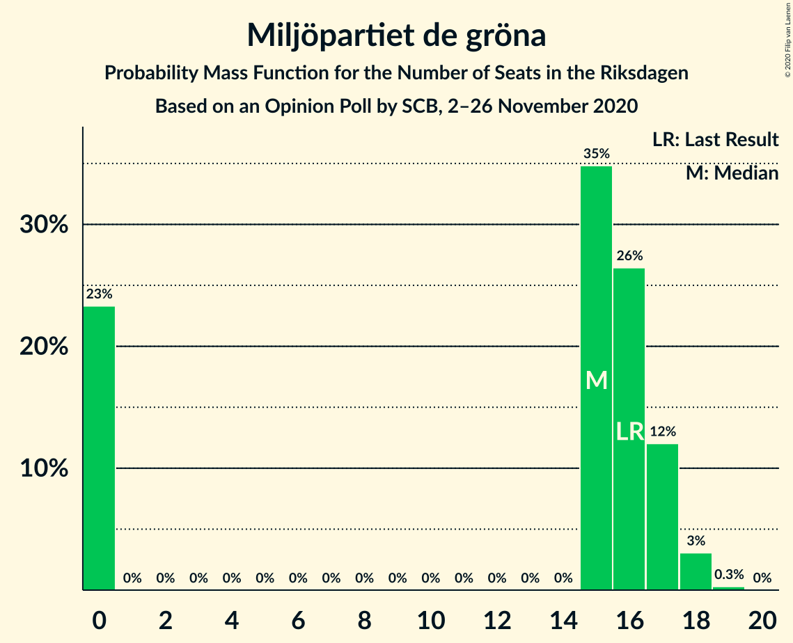

# Opinion Poll by SCB, 2–26 November 2020

<a href="#voting-intentions">Voting Intentions</a> | <a href="#seats">Seats</a> | <a href="#coalitions">Coalitions</a> | <a href="#technical-information">Technical Information</a>

## Voting Intentions

### Confidence Intervals

| Party | Last Result | Poll Result | 80% Confidence Interval | 90% Confidence Interval | 95% Confidence Interval | 99% Confidence Interval |
|:-----:|:-----------:|:-----------:|:-----------------------:|:-----------------------:|:-----------------------:|:-----------------------:|
| Sveriges socialdemokratiska arbetareparti | 28.3% | 29.4% | 28.5–30.2% |28.3–30.5% |28.1–30.7% |27.7–31.1% |
| Moderata samlingspartiet | 19.8% | 22.1% | 21.3–22.9% |21.1–23.1% |20.9–23.3% |20.5–23.7% |
| Sverigedemokraterna | 17.5% | 17.6% | 16.9–18.3% |16.7–18.5% |16.5–18.7% |16.2–19.1% |
| Vänsterpartiet | 8.0% | 9.3% | 8.8–9.9% |8.6–10.0% |8.5–10.2% |8.2–10.4% |
| Centerpartiet | 8.6% | 7.6% | 7.1–8.1% |7.0–8.3% |6.9–8.4% |6.6–8.6% |
| Kristdemokraterna | 6.3% | 5.4% | 5.0–5.9% |4.9–6.0% |4.8–6.1% |4.6–6.3% |
| Miljöpartiet de gröna | 4.4% | 4.2% | 3.8–4.6% |3.7–4.7% |3.7–4.8% |3.5–5.0% |
| Liberalerna | 5.5% | 3.0% | 2.7–3.4% |2.6–3.5% |2.5–3.5% |2.4–3.7% |

*Note:* The poll result column reflects the actual value used in the calculations. Published results may vary slightly, and in addition be rounded to fewer digits.

## Seats

### Confidence Intervals

| Party | Last Result | Median | 80% Confidence Interval | 90% Confidence Interval | 95% Confidence Interval | 99% Confidence Interval |
|:-----:|:-----------:|:------:|:-----------------------:|:-----------------------:|:-----------------------:|:-----------------------:|
| <a href="#sveriges-socialdemokratiska-arbetareparti">Sveriges socialdemokratiska arbetareparti</a> | 100 | 108 | 104–113 |103–114 |103–115 |101–117 |
| <a href="#moderata-samlingspartiet">Moderata samlingspartiet</a> | 70 | 81 | 78–86 |77–86 |77–87 |75–88 |
| <a href="#sverigedemokraterna">Sverigedemokraterna</a> | 62 | 65 | 62–68 |61–69 |61–69 |59–71 |
| <a href="#vänsterpartiet">Vänsterpartiet</a> | 28 | 34 | 32–37 |32–37 |31–38 |30–39 |
| <a href="#centerpartiet">Centerpartiet</a> | 31 | 28 | 26–30 |26–31 |25–31 |24–32 |
| <a href="#kristdemokraterna">Kristdemokraterna</a> | 22 | 20 | 18–22 |18–22 |18–22 |17–23 |
| <a href="#miljöpartiet-de-gröna">Miljöpartiet de gröna</a> | 16 | 15 | 0–17 |0–17 |0–18 |0–18 |
| <a href="#liberalerna">Liberalerna</a> | 20 | 0 | 0 |0 |0 |0 |

### Sveriges socialdemokratiska arbetareparti

*For a full overview of the results for this party, see the [Sveriges socialdemokratiska arbetareparti](party-sverigessocialdemokratiskaarbetareparti.html) page.*

| Number of Seats | Probability | Accumulated | Special Marks |
|:---------------:|:-----------:|:-----------:|:-------------:|
| 99 | 0% | 100% |  |
| 100 | 0.1% | 99.9% | Last Result |
| 101 | 0.4% | 99.8% |  |
| 102 | 1.3% | 99.4% |  |
| 103 | 4% | 98% |  |
| 104 | 5% | 94% |  |
| 105 | 7% | 89% |  |
| 106 | 11% | 82% |  |
| 107 | 17% | 71% |  |
| 108 | 12% | 54% | Median |
| 109 | 11% | 42% |  |
| 110 | 7% | 31% |  |
| 111 | 8% | 24% |  |
| 112 | 5% | 17% |  |
| 113 | 4% | 12% |  |
| 114 | 3% | 8% |  |
| 115 | 3% | 5% |  |
| 116 | 1.1% | 2% |  |
| 117 | 0.8% | 1.1% |  |
| 118 | 0.2% | 0.3% |  |
| 119 | 0.1% | 0.1% |  |
| 120 | 0% | 0% |  |

### Moderata samlingspartiet

*For a full overview of the results for this party, see the [Moderata samlingspartiet](party-moderatasamlingspartiet.html) page.*

| Number of Seats | Probability | Accumulated | Special Marks |
|:---------------:|:-----------:|:-----------:|:-------------:|
| 70 | 0% | 100% | Last Result |
| 71 | 0% | 100% |  |
| 72 | 0% | 100% |  |
| 73 | 0% | 100% |  |
| 74 | 0.1% | 100% |  |
| 75 | 0.6% | 99.9% |  |
| 76 | 1.3% | 99.3% |  |
| 77 | 4% | 98% |  |
| 78 | 10% | 94% |  |
| 79 | 7% | 84% |  |
| 80 | 17% | 77% |  |
| 81 | 20% | 60% | Median |
| 82 | 8% | 40% |  |
| 83 | 10% | 32% |  |
| 84 | 6% | 23% |  |
| 85 | 7% | 17% |  |
| 86 | 6% | 10% |  |
| 87 | 2% | 4% |  |
| 88 | 1.4% | 2% |  |
| 89 | 0.3% | 0.4% |  |
| 90 | 0% | 0.1% |  |
| 91 | 0.1% | 0.1% |  |
| 92 | 0% | 0% |  |

### Sverigedemokraterna

*For a full overview of the results for this party, see the [Sverigedemokraterna](party-sverigedemokraterna.html) page.*

| Number of Seats | Probability | Accumulated | Special Marks |
|:---------------:|:-----------:|:-----------:|:-------------:|
| 58 | 0.1% | 100% |  |
| 59 | 0.7% | 99.9% |  |
| 60 | 1.1% | 99.1% |  |
| 61 | 4% | 98% |  |
| 62 | 12% | 94% | Last Result |
| 63 | 9% | 82% |  |
| 64 | 14% | 73% |  |
| 65 | 23% | 59% | Median |
| 66 | 12% | 36% |  |
| 67 | 10% | 24% |  |
| 68 | 7% | 14% |  |
| 69 | 4% | 7% |  |
| 70 | 1.5% | 2% |  |
| 71 | 0.5% | 1.0% |  |
| 72 | 0.4% | 0.5% |  |
| 73 | 0.1% | 0.1% |  |
| 74 | 0% | 0% |  |

### Vänsterpartiet

*For a full overview of the results for this party, see the [Vänsterpartiet](party-vänsterpartiet.html) page.*

| Number of Seats | Probability | Accumulated | Special Marks |
|:---------------:|:-----------:|:-----------:|:-------------:|
| 28 | 0% | 100% | Last Result |
| 29 | 0.2% | 100% |  |
| 30 | 0.4% | 99.8% |  |
| 31 | 2% | 99.4% |  |
| 32 | 15% | 97% |  |
| 33 | 24% | 82% |  |
| 34 | 16% | 58% | Median |
| 35 | 19% | 42% |  |
| 36 | 12% | 23% |  |
| 37 | 6% | 11% |  |
| 38 | 4% | 5% |  |
| 39 | 0.4% | 0.7% |  |
| 40 | 0.2% | 0.3% |  |
| 41 | 0% | 0% |  |

### Centerpartiet

*For a full overview of the results for this party, see the [Centerpartiet](party-centerpartiet.html) page.*

| Number of Seats | Probability | Accumulated | Special Marks |
|:---------------:|:-----------:|:-----------:|:-------------:|
| 23 | 0.1% | 100% |  |
| 24 | 0.6% | 99.9% |  |
| 25 | 3% | 99.3% |  |
| 26 | 13% | 97% |  |
| 27 | 17% | 84% |  |
| 28 | 29% | 67% | Median |
| 29 | 19% | 38% |  |
| 30 | 14% | 19% |  |
| 31 | 3% | 5% | Last Result |
| 32 | 2% | 2% |  |
| 33 | 0.3% | 0.3% |  |
| 34 | 0% | 0% |  |

### Kristdemokraterna

*For a full overview of the results for this party, see the [Kristdemokraterna](party-kristdemokraterna.html) page.*

| Number of Seats | Probability | Accumulated | Special Marks |
|:---------------:|:-----------:|:-----------:|:-------------:|
| 16 | 0.2% | 100% |  |
| 17 | 2% | 99.8% |  |
| 18 | 9% | 98% |  |
| 19 | 24% | 89% |  |
| 20 | 33% | 66% | Median |
| 21 | 22% | 33% |  |
| 22 | 9% | 11% | Last Result |
| 23 | 2% | 2% |  |
| 24 | 0.4% | 0.4% |  |
| 25 | 0% | 0.1% |  |
| 26 | 0% | 0% |  |

### Miljöpartiet de gröna

*For a full overview of the results for this party, see the [Miljöpartiet de gröna](party-miljöpartietdegröna.html) page.*

| Number of Seats | Probability | Accumulated | Special Marks |
|:---------------:|:-----------:|:-----------:|:-------------:|
| 0 | 23% | 100% |  |
| 1 | 0% | 77% |  |
| 2 | 0% | 77% |  |
| 3 | 0% | 77% |  |
| 4 | 0% | 77% |  |
| 5 | 0% | 77% |  |
| 6 | 0% | 77% |  |
| 7 | 0% | 77% |  |
| 8 | 0% | 77% |  |
| 9 | 0% | 77% |  |
| 10 | 0% | 77% |  |
| 11 | 0% | 77% |  |
| 12 | 0% | 77% |  |
| 13 | 0% | 77% |  |
| 14 | 0% | 77% |  |
| 15 | 35% | 77% | Median |
| 16 | 26% | 42% | Last Result |
| 17 | 12% | 15% |  |
| 18 | 3% | 3% |  |
| 19 | 0.3% | 0.3% |  |
| 20 | 0% | 0% |  |

### Liberalerna

*For a full overview of the results for this party, see the [Liberalerna](party-liberalerna.html) page.*

| Number of Seats | Probability | Accumulated | Special Marks |
|:---------------:|:-----------:|:-----------:|:-------------:|
| 0 | 100% | 100% | Median |
| 1 | 0% | 0% |  |
| 2 | 0% | 0% |  |
| 3 | 0% | 0% |  |
| 4 | 0% | 0% |  |
| 5 | 0% | 0% |  |
| 6 | 0% | 0% |  |
| 7 | 0% | 0% |  |
| 8 | 0% | 0% |  |
| 9 | 0% | 0% |  |
| 10 | 0% | 0% |  |
| 11 | 0% | 0% |  |
| 12 | 0% | 0% |  |
| 13 | 0% | 0% |  |
| 14 | 0% | 0% |  |
| 15 | 0% | 0% |  |
| 16 | 0% | 0% |  |
| 17 | 0% | 0% |  |
| 18 | 0% | 0% |  |
| 19 | 0% | 0% |  |
| 20 | 0% | 0% | Last Result |

## Coalitions

### Confidence Intervals

| Coalition | Last Result | Median | Majority? | 80% Confidence Interval | 90% Confidence Interval | 95% Confidence Interval | 99% Confidence Interval |
|:---------:|:-----------:|:------:|:---------:|:-----------------------:|:-----------------------:|:-----------------------:|:-----------------------:|
| Sveriges socialdemokratiska arbetareparti – Moderata samlingspartiet – Centerpartiet | 201 | 216 | 100% | 212–227 | 211–228 | 211–230 | 209–231 |
| Sveriges socialdemokratiska arbetareparti – Moderata samlingspartiet | 170 | 188 | 100% | 185–197 | 183–199 | 183–200 | 181–202 |
| Sveriges socialdemokratiska arbetareparti – Vänsterpartiet – Centerpartiet – Miljöpartiet de gröna – Liberalerna | 195 | 183 | 95% | 177–187 | 174–188 | 173–189 | 172–191 |
| Moderata samlingspartiet – Sverigedemokraterna – Kristdemokraterna | 154 | 166 | 5% | 162–172 | 161–175 | 160–176 | 158–177 |
| Sveriges socialdemokratiska arbetareparti – Vänsterpartiet – Miljöpartiet de gröna | 144 | 155 | 0% | 147–159 | 146–160 | 145–161 | 142–163 |
| Moderata samlingspartiet – Sverigedemokraterna | 132 | 146 | 0% | 142–152 | 141–154 | 140–155 | 138–157 |
| Sveriges socialdemokratiska arbetareparti – Centerpartiet – Miljöpartiet de gröna – Liberalerna | 167 | 150 | 0% | 141–154 | 139–155 | 138–155 | 136–157 |
| Sveriges socialdemokratiska arbetareparti – Vänsterpartiet | 128 | 142 | 0% | 138–149 | 138–150 | 137–151 | 135–153 |
| Moderata samlingspartiet – Centerpartiet – Kristdemokraterna – Liberalerna | 143 | 129 | 0% | 125–135 | 124–136 | 124–137 | 122–139 |
| Moderata samlingspartiet – Centerpartiet – Kristdemokraterna | 123 | 129 | 0% | 125–135 | 124–136 | 124–137 | 122–139 |
| Sveriges socialdemokratiska arbetareparti – Miljöpartiet de gröna | 116 | 122 | 0% | 112–126 | 110–127 | 109–127 | 107–129 |
| Moderata samlingspartiet – Centerpartiet – Liberalerna | 121 | 109 | 0% | 106–114 | 105–116 | 104–116 | 103–118 |
| Moderata samlingspartiet – Centerpartiet | 101 | 109 | 0% | 106–114 | 105–116 | 104–116 | 103–118 |

### Sveriges socialdemokratiska arbetareparti – Moderata samlingspartiet – Centerpartiet

| Number of Seats | Probability | Accumulated | Special Marks |
|:---------------:|:-----------:|:-----------:|:-------------:|
| 201 | 0% | 100% | Last Result |
| 202 | 0% | 100% |  |
| 203 | 0% | 100% |  |
| 204 | 0% | 100% |  |
| 205 | 0% | 100% |  |
| 206 | 0% | 100% |  |
| 207 | 0.1% | 100% |  |
| 208 | 0.2% | 99.9% |  |
| 209 | 0.7% | 99.7% |  |
| 210 | 1.2% | 99.0% |  |
| 211 | 3% | 98% |  |
| 212 | 5% | 95% |  |
| 213 | 7% | 90% |  |
| 214 | 9% | 83% |  |
| 215 | 12% | 74% |  |
| 216 | 15% | 62% |  |
| 217 | 10% | 46% | Median |
| 218 | 7% | 36% |  |
| 219 | 2% | 29% |  |
| 220 | 3% | 27% |  |
| 221 | 1.4% | 24% |  |
| 222 | 1.1% | 23% |  |
| 223 | 3% | 22% |  |
| 224 | 3% | 19% |  |
| 225 | 3% | 16% |  |
| 226 | 3% | 14% |  |
| 227 | 3% | 10% |  |
| 228 | 3% | 7% |  |
| 229 | 2% | 4% |  |
| 230 | 2% | 3% |  |
| 231 | 0.3% | 0.6% |  |
| 232 | 0.2% | 0.2% |  |
| 233 | 0% | 0% |  |

### Sveriges socialdemokratiska arbetareparti – Moderata samlingspartiet

| Number of Seats | Probability | Accumulated | Special Marks |
|:---------------:|:-----------:|:-----------:|:-------------:|
| 170 | 0% | 100% | Last Result |
| 171 | 0% | 100% |  |
| 172 | 0% | 100% |  |
| 173 | 0% | 100% |  |
| 174 | 0% | 100% |  |
| 175 | 0% | 100% | Majority |
| 176 | 0% | 100% |  |
| 177 | 0% | 100% |  |
| 178 | 0% | 100% |  |
| 179 | 0% | 100% |  |
| 180 | 0.2% | 99.9% |  |
| 181 | 0.4% | 99.7% |  |
| 182 | 2% | 99.3% |  |
| 183 | 3% | 98% |  |
| 184 | 4% | 95% |  |
| 185 | 6% | 91% |  |
| 186 | 11% | 85% |  |
| 187 | 10% | 74% |  |
| 188 | 17% | 64% |  |
| 189 | 9% | 47% | Median |
| 190 | 6% | 39% |  |
| 191 | 5% | 32% |  |
| 192 | 4% | 28% |  |
| 193 | 2% | 24% |  |
| 194 | 3% | 21% |  |
| 195 | 2% | 18% |  |
| 196 | 4% | 17% |  |
| 197 | 4% | 13% |  |
| 198 | 3% | 9% |  |
| 199 | 2% | 6% |  |
| 200 | 2% | 5% |  |
| 201 | 1.1% | 2% |  |
| 202 | 0.9% | 1.1% |  |
| 203 | 0.2% | 0.3% |  |
| 204 | 0.1% | 0.1% |  |
| 205 | 0% | 0% |  |

### Sveriges socialdemokratiska arbetareparti – Vänsterpartiet – Centerpartiet – Miljöpartiet de gröna – Liberalerna

| Number of Seats | Probability | Accumulated | Special Marks |
|:---------------:|:-----------:|:-----------:|:-------------:|
| 169 | 0.1% | 100% |  |
| 170 | 0.1% | 99.9% |  |
| 171 | 0.3% | 99.8% |  |
| 172 | 0.5% | 99.5% |  |
| 173 | 2% | 99.0% |  |
| 174 | 3% | 97% |  |
| 175 | 1.3% | 95% | Majority |
| 176 | 3% | 93% |  |
| 177 | 3% | 90% |  |
| 178 | 3% | 87% |  |
| 179 | 5% | 84% |  |
| 180 | 4% | 78% |  |
| 181 | 5% | 74% |  |
| 182 | 8% | 69% |  |
| 183 | 15% | 62% |  |
| 184 | 13% | 47% |  |
| 185 | 7% | 34% | Median |
| 186 | 8% | 27% |  |
| 187 | 10% | 19% |  |
| 188 | 5% | 9% |  |
| 189 | 2% | 4% |  |
| 190 | 1.0% | 2% |  |
| 191 | 0.5% | 0.8% |  |
| 192 | 0.2% | 0.3% |  |
| 193 | 0.1% | 0.1% |  |
| 194 | 0% | 0% |  |
| 195 | 0% | 0% | Last Result |

### Moderata samlingspartiet – Sverigedemokraterna – Kristdemokraterna

| Number of Seats | Probability | Accumulated | Special Marks |
|:---------------:|:-----------:|:-----------:|:-------------:|
| 154 | 0% | 100% | Last Result |
| 155 | 0% | 100% |  |
| 156 | 0.1% | 100% |  |
| 157 | 0.2% | 99.9% |  |
| 158 | 0.5% | 99.7% |  |
| 159 | 1.0% | 99.2% |  |
| 160 | 2% | 98% |  |
| 161 | 5% | 96% |  |
| 162 | 10% | 91% |  |
| 163 | 8% | 81% |  |
| 164 | 7% | 73% |  |
| 165 | 13% | 66% |  |
| 166 | 15% | 53% | Median |
| 167 | 8% | 38% |  |
| 168 | 5% | 31% |  |
| 169 | 4% | 26% |  |
| 170 | 5% | 22% |  |
| 171 | 3% | 16% |  |
| 172 | 3% | 13% |  |
| 173 | 3% | 10% |  |
| 174 | 1.3% | 7% |  |
| 175 | 3% | 5% | Majority |
| 176 | 2% | 3% |  |
| 177 | 0.5% | 1.0% |  |
| 178 | 0.3% | 0.5% |  |
| 179 | 0.1% | 0.2% |  |
| 180 | 0.1% | 0.1% |  |
| 181 | 0% | 0% |  |

### Sveriges socialdemokratiska arbetareparti – Vänsterpartiet – Miljöpartiet de gröna

| Number of Seats | Probability | Accumulated | Special Marks |
|:---------------:|:-----------:|:-----------:|:-------------:|
| 140 | 0% | 100% |  |
| 141 | 0.3% | 99.9% |  |
| 142 | 0.4% | 99.7% |  |
| 143 | 1.1% | 99.3% |  |
| 144 | 0.4% | 98% | Last Result |
| 145 | 2% | 98% |  |
| 146 | 4% | 96% |  |
| 147 | 3% | 92% |  |
| 148 | 3% | 89% |  |
| 149 | 3% | 87% |  |
| 150 | 4% | 83% |  |
| 151 | 3% | 79% |  |
| 152 | 1.2% | 77% |  |
| 153 | 2% | 75% |  |
| 154 | 15% | 73% |  |
| 155 | 15% | 58% |  |
| 156 | 6% | 44% |  |
| 157 | 6% | 38% | Median |
| 158 | 8% | 32% |  |
| 159 | 16% | 24% |  |
| 160 | 4% | 8% |  |
| 161 | 2% | 4% |  |
| 162 | 1.2% | 2% |  |
| 163 | 0.8% | 1.3% |  |
| 164 | 0.3% | 0.4% |  |
| 165 | 0.1% | 0.1% |  |
| 166 | 0% | 0% |  |

### Moderata samlingspartiet – Sverigedemokraterna

| Number of Seats | Probability | Accumulated | Special Marks |
|:---------------:|:-----------:|:-----------:|:-------------:|
| 132 | 0% | 100% | Last Result |
| 133 | 0% | 100% |  |
| 134 | 0% | 100% |  |
| 135 | 0% | 100% |  |
| 136 | 0% | 100% |  |
| 137 | 0.2% | 100% |  |
| 138 | 0.4% | 99.8% |  |
| 139 | 0.9% | 99.4% |  |
| 140 | 2% | 98.5% |  |
| 141 | 4% | 96% |  |
| 142 | 8% | 93% |  |
| 143 | 9% | 84% |  |
| 144 | 12% | 75% |  |
| 145 | 7% | 63% |  |
| 146 | 17% | 56% | Median |
| 147 | 8% | 39% |  |
| 148 | 4% | 31% |  |
| 149 | 6% | 26% |  |
| 150 | 5% | 20% |  |
| 151 | 3% | 15% |  |
| 152 | 3% | 12% |  |
| 153 | 3% | 9% |  |
| 154 | 3% | 6% |  |
| 155 | 1.1% | 3% |  |
| 156 | 1.0% | 2% |  |
| 157 | 0.3% | 0.6% |  |
| 158 | 0.2% | 0.3% |  |
| 159 | 0.1% | 0.1% |  |
| 160 | 0% | 0% |  |

### Sveriges socialdemokratiska arbetareparti – Centerpartiet – Miljöpartiet de gröna – Liberalerna

| Number of Seats | Probability | Accumulated | Special Marks |
|:---------------:|:-----------:|:-----------:|:-------------:|
| 133 | 0% | 100% |  |
| 134 | 0.1% | 99.9% |  |
| 135 | 0.2% | 99.9% |  |
| 136 | 0.4% | 99.7% |  |
| 137 | 0.8% | 99.3% |  |
| 138 | 2% | 98% |  |
| 139 | 3% | 97% |  |
| 140 | 2% | 93% |  |
| 141 | 3% | 91% |  |
| 142 | 3% | 88% |  |
| 143 | 2% | 85% |  |
| 144 | 3% | 83% |  |
| 145 | 4% | 79% |  |
| 146 | 3% | 76% |  |
| 147 | 4% | 73% |  |
| 148 | 6% | 69% |  |
| 149 | 7% | 62% |  |
| 150 | 19% | 55% |  |
| 151 | 6% | 36% | Median |
| 152 | 12% | 30% |  |
| 153 | 6% | 17% |  |
| 154 | 5% | 12% |  |
| 155 | 4% | 6% |  |
| 156 | 1.2% | 2% |  |
| 157 | 0.8% | 1.1% |  |
| 158 | 0.2% | 0.3% |  |
| 159 | 0.1% | 0.1% |  |
| 160 | 0% | 0% |  |
| 161 | 0% | 0% |  |
| 162 | 0% | 0% |  |
| 163 | 0% | 0% |  |
| 164 | 0% | 0% |  |
| 165 | 0% | 0% |  |
| 166 | 0% | 0% |  |
| 167 | 0% | 0% | Last Result |

### Sveriges socialdemokratiska arbetareparti – Vänsterpartiet

| Number of Seats | Probability | Accumulated | Special Marks |
|:---------------:|:-----------:|:-----------:|:-------------:|
| 128 | 0% | 100% | Last Result |
| 129 | 0% | 100% |  |
| 130 | 0% | 100% |  |
| 131 | 0% | 100% |  |
| 132 | 0% | 100% |  |
| 133 | 0.1% | 100% |  |
| 134 | 0.3% | 99.9% |  |
| 135 | 0.8% | 99.6% |  |
| 136 | 1.0% | 98.8% |  |
| 137 | 3% | 98% |  |
| 138 | 8% | 95% |  |
| 139 | 12% | 87% |  |
| 140 | 13% | 75% |  |
| 141 | 7% | 62% |  |
| 142 | 12% | 55% | Median |
| 143 | 9% | 43% |  |
| 144 | 8% | 34% |  |
| 145 | 5% | 26% |  |
| 146 | 5% | 22% |  |
| 147 | 4% | 17% |  |
| 148 | 3% | 13% |  |
| 149 | 3% | 10% |  |
| 150 | 3% | 7% |  |
| 151 | 2% | 4% |  |
| 152 | 0.6% | 1.4% |  |
| 153 | 0.3% | 0.8% |  |
| 154 | 0.2% | 0.4% |  |
| 155 | 0.2% | 0.2% |  |
| 156 | 0% | 0% |  |

### Moderata samlingspartiet – Centerpartiet – Kristdemokraterna – Liberalerna

| Number of Seats | Probability | Accumulated | Special Marks |
|:---------------:|:-----------:|:-----------:|:-------------:|
| 120 | 0.1% | 100% |  |
| 121 | 0.3% | 99.9% |  |
| 122 | 0.6% | 99.6% |  |
| 123 | 2% | 99.1% |  |
| 124 | 3% | 98% |  |
| 125 | 7% | 94% |  |
| 126 | 8% | 88% |  |
| 127 | 10% | 80% |  |
| 128 | 14% | 70% |  |
| 129 | 12% | 56% | Median |
| 130 | 10% | 44% |  |
| 131 | 8% | 34% |  |
| 132 | 5% | 26% |  |
| 133 | 5% | 21% |  |
| 134 | 5% | 16% |  |
| 135 | 4% | 11% |  |
| 136 | 2% | 7% |  |
| 137 | 3% | 5% |  |
| 138 | 0.7% | 2% |  |
| 139 | 0.9% | 1.3% |  |
| 140 | 0.2% | 0.4% |  |
| 141 | 0.1% | 0.2% |  |
| 142 | 0.1% | 0.1% |  |
| 143 | 0% | 0% | Last Result |

### Moderata samlingspartiet – Centerpartiet – Kristdemokraterna

| Number of Seats | Probability | Accumulated | Special Marks |
|:---------------:|:-----------:|:-----------:|:-------------:|
| 120 | 0.1% | 100% |  |
| 121 | 0.3% | 99.9% |  |
| 122 | 0.6% | 99.6% |  |
| 123 | 2% | 99.1% | Last Result |
| 124 | 3% | 98% |  |
| 125 | 7% | 94% |  |
| 126 | 8% | 88% |  |
| 127 | 10% | 80% |  |
| 128 | 14% | 70% |  |
| 129 | 12% | 56% | Median |
| 130 | 10% | 44% |  |
| 131 | 8% | 34% |  |
| 132 | 5% | 26% |  |
| 133 | 5% | 21% |  |
| 134 | 5% | 16% |  |
| 135 | 4% | 11% |  |
| 136 | 2% | 7% |  |
| 137 | 3% | 5% |  |
| 138 | 0.7% | 2% |  |
| 139 | 0.9% | 1.3% |  |
| 140 | 0.2% | 0.4% |  |
| 141 | 0.1% | 0.1% |  |
| 142 | 0.1% | 0.1% |  |
| 143 | 0% | 0% |  |

### Sveriges socialdemokratiska arbetareparti – Miljöpartiet de gröna

| Number of Seats | Probability | Accumulated | Special Marks |
|:---------------:|:-----------:|:-----------:|:-------------:|
| 105 | 0.1% | 100% |  |
| 106 | 0.2% | 99.9% |  |
| 107 | 0.5% | 99.7% |  |
| 108 | 0.6% | 99.2% |  |
| 109 | 3% | 98.7% |  |
| 110 | 1.0% | 96% |  |
| 111 | 5% | 95% |  |
| 112 | 2% | 90% |  |
| 113 | 4% | 88% |  |
| 114 | 3% | 84% |  |
| 115 | 3% | 81% |  |
| 116 | 1.2% | 79% | Last Result |
| 117 | 1.4% | 78% |  |
| 118 | 1.3% | 76% |  |
| 119 | 5% | 75% |  |
| 120 | 6% | 70% |  |
| 121 | 8% | 64% |  |
| 122 | 16% | 56% |  |
| 123 | 8% | 40% | Median |
| 124 | 13% | 32% |  |
| 125 | 7% | 19% |  |
| 126 | 7% | 12% |  |
| 127 | 3% | 6% |  |
| 128 | 1.4% | 2% |  |
| 129 | 0.6% | 0.9% |  |
| 130 | 0.2% | 0.3% |  |
| 131 | 0.1% | 0.1% |  |
| 132 | 0% | 0% |  |

### Moderata samlingspartiet – Centerpartiet – Liberalerna

| Number of Seats | Probability | Accumulated | Special Marks |
|:---------------:|:-----------:|:-----------:|:-------------:|
| 101 | 0.1% | 100% |  |
| 102 | 0.2% | 99.8% |  |
| 103 | 0.9% | 99.6% |  |
| 104 | 3% | 98.7% |  |
| 105 | 5% | 96% |  |
| 106 | 8% | 91% |  |
| 107 | 11% | 82% |  |
| 108 | 13% | 72% |  |
| 109 | 18% | 58% | Median |
| 110 | 8% | 40% |  |
| 111 | 5% | 32% |  |
| 112 | 6% | 28% |  |
| 113 | 6% | 21% |  |
| 114 | 6% | 15% |  |
| 115 | 4% | 9% |  |
| 116 | 4% | 6% |  |
| 117 | 1.4% | 2% |  |
| 118 | 0.5% | 0.8% |  |
| 119 | 0.2% | 0.3% |  |
| 120 | 0.1% | 0.1% |  |
| 121 | 0% | 0% | Last Result |

### Moderata samlingspartiet – Centerpartiet

| Number of Seats | Probability | Accumulated | Special Marks |
|:---------------:|:-----------:|:-----------:|:-------------:|
| 100 | 0% | 100% |  |
| 101 | 0.1% | 99.9% | Last Result |
| 102 | 0.2% | 99.8% |  |
| 103 | 0.9% | 99.6% |  |
| 104 | 3% | 98.6% |  |
| 105 | 5% | 96% |  |
| 106 | 8% | 91% |  |
| 107 | 11% | 82% |  |
| 108 | 13% | 72% |  |
| 109 | 18% | 58% | Median |
| 110 | 8% | 40% |  |
| 111 | 5% | 32% |  |
| 112 | 6% | 28% |  |
| 113 | 6% | 21% |  |
| 114 | 6% | 15% |  |
| 115 | 4% | 9% |  |
| 116 | 4% | 6% |  |
| 117 | 1.4% | 2% |  |
| 118 | 0.5% | 0.7% |  |
| 119 | 0.2% | 0.3% |  |
| 120 | 0.1% | 0.1% |  |
| 121 | 0% | 0% |  |

## Technical Information

### Opinion Poll

+ **Polling firm:** SCB
+ **Commissioner(s):** —
+ **Fieldwork period:** 2–26 November 2020

### Calculations

+ **Sample size:** 4692
+ **Simulations done:** 1,048,576
+ **Error estimate:** 0.59%

