# Opinion Poll by Demoskop, 26 November–2 December 2020

<a href="#voting-intentions">Voting Intentions</a> | <a href="#seats">Seats</a> | <a href="#coalitions">Coalitions</a> | <a href="#technical-information">Technical Information</a>

## Voting Intentions

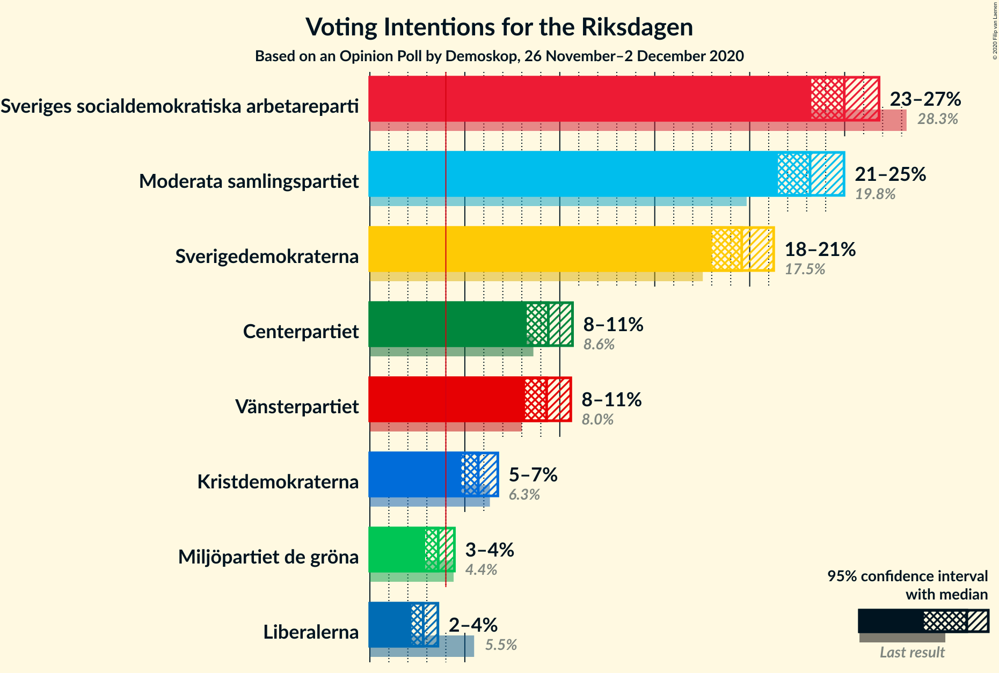

### Confidence Intervals

| Party | Last Result | Poll Result | 80% Confidence Interval | 90% Confidence Interval | 95% Confidence Interval | 99% Confidence Interval |
|:-----:|:-----------:|:-----------:|:-----------------------:|:-----------------------:|:-----------------------:|:-----------------------:|
| Sveriges socialdemokratiska arbetareparti | 28.3% | 25.0% | 23.8–26.2% |23.5–26.5% |23.2–26.8% |22.7–27.4% |
| Moderata samlingspartiet | 19.8% | 23.2% | 22.1–24.3% |21.7–24.7% |21.5–25.0% |21.0–25.5% |
| Sverigedemokraterna | 17.5% | 19.6% | 18.5–20.7% |18.2–21.0% |18.0–21.3% |17.5–21.8% |
| Centerpartiet | 8.6% | 9.4% | 8.6–10.2% |8.4–10.5% |8.3–10.7% |7.9–11.1% |
| Vänsterpartiet | 8.0% | 9.3% | 8.6–10.1% |8.4–10.4% |8.2–10.6% |7.8–11.0% |
| Kristdemokraterna | 6.3% | 5.7% | 5.1–6.4% |5.0–6.6% |4.8–6.7% |4.6–7.1% |
| Miljöpartiet de gröna | 4.4% | 3.6% | 3.1–4.2% |3.0–4.3% |2.9–4.5% |2.7–4.7% |
| Liberalerna | 5.5% | 2.8% | 2.4–3.3% |2.3–3.5% |2.2–3.6% |2.0–3.8% |

*Note:* The poll result column reflects the actual value used in the calculations. Published results may vary slightly, and in addition be rounded to fewer digits.

## Seats

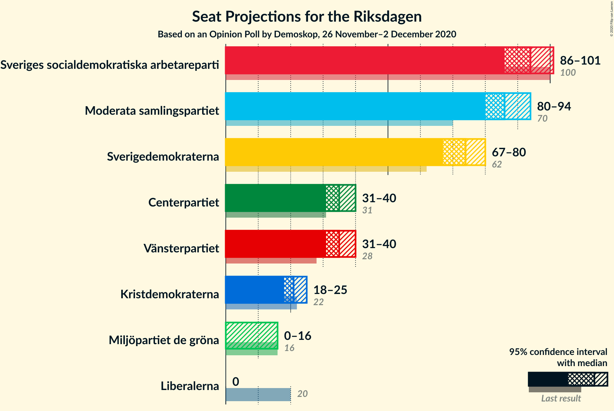

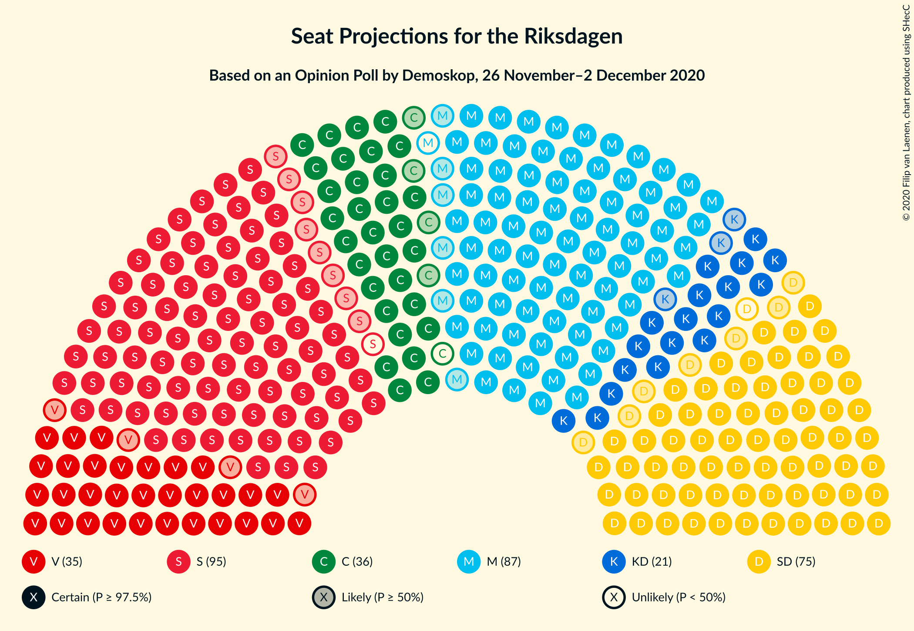

### Confidence Intervals

| Party | Last Result | Median | 80% Confidence Interval | 90% Confidence Interval | 95% Confidence Interval | 99% Confidence Interval |
|:-----:|:-----------:|:------:|:-----------------------:|:-----------------------:|:-----------------------:|:-----------------------:|
| <a href="#sveriges-socialdemokratiska-arbetareparti">Sveriges socialdemokratiska arbetareparti</a> | 100 | 94 | 89–99 |88–100 |86–101 |84–103 |
| <a href="#moderata-samlingspartiet">Moderata samlingspartiet</a> | 70 | 86 | 82–91 |81–93 |80–94 |78–96 |
| <a href="#sverigedemokraterna">Sverigedemokraterna</a> | 62 | 74 | 70–78 |68–79 |67–80 |65–82 |
| <a href="#centerpartiet">Centerpartiet</a> | 31 | 35 | 33–38 |31–39 |31–40 |30–42 |
| <a href="#vänsterpartiet">Vänsterpartiet</a> | 28 | 35 | 32–38 |31–39 |31–40 |29–41 |
| <a href="#kristdemokraterna">Kristdemokraterna</a> | 22 | 21 | 19–23 |19–24 |18–25 |17–26 |
| <a href="#miljöpartiet-de-gröna">Miljöpartiet de gröna</a> | 16 | 0 | 0–15 |0–16 |0–16 |0–17 |
| <a href="#liberalerna">Liberalerna</a> | 20 | 0 | 0 |0 |0 |0 |

### Sveriges socialdemokratiska arbetareparti

*For a full overview of the results for this party, see the [Sveriges socialdemokratiska arbetareparti](party-sverigessocialdemokratiskaarbetareparti.html) page.*

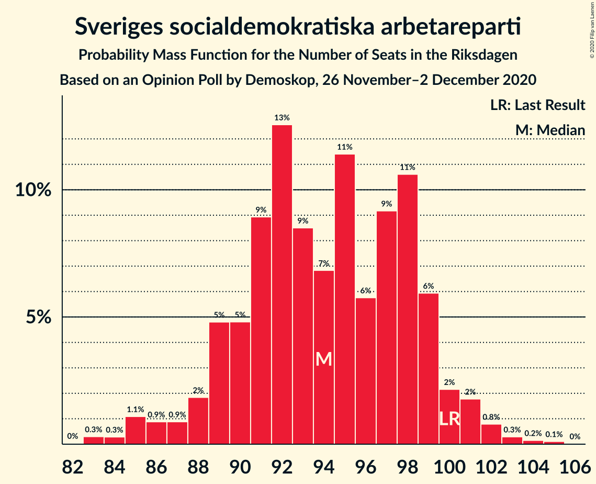

| Number of Seats | Probability | Accumulated | Special Marks |
|:---------------:|:-----------:|:-----------:|:-------------:|
| 82 | 0% | 100% |  |
| 83 | 0.3% | 99.9% |  |
| 84 | 0.3% | 99.6% |  |
| 85 | 1.1% | 99.3% |  |
| 86 | 0.9% | 98% |  |
| 87 | 0.9% | 97% |  |
| 88 | 2% | 96% |  |
| 89 | 5% | 95% |  |
| 90 | 5% | 90% |  |
| 91 | 9% | 85% |  |
| 92 | 13% | 76% |  |
| 93 | 9% | 64% |  |
| 94 | 7% | 55% | Median |
| 95 | 11% | 48% |  |
| 96 | 6% | 37% |  |
| 97 | 9% | 31% |  |
| 98 | 11% | 22% |  |
| 99 | 6% | 11% |  |
| 100 | 2% | 5% | Last Result |
| 101 | 2% | 3% |  |
| 102 | 0.8% | 1.4% |  |
| 103 | 0.3% | 0.6% |  |
| 104 | 0.2% | 0.3% |  |
| 105 | 0.1% | 0.1% |  |
| 106 | 0% | 0% |  |

### Moderata samlingspartiet

*For a full overview of the results for this party, see the [Moderata samlingspartiet](party-moderatasamlingspartiet.html) page.*

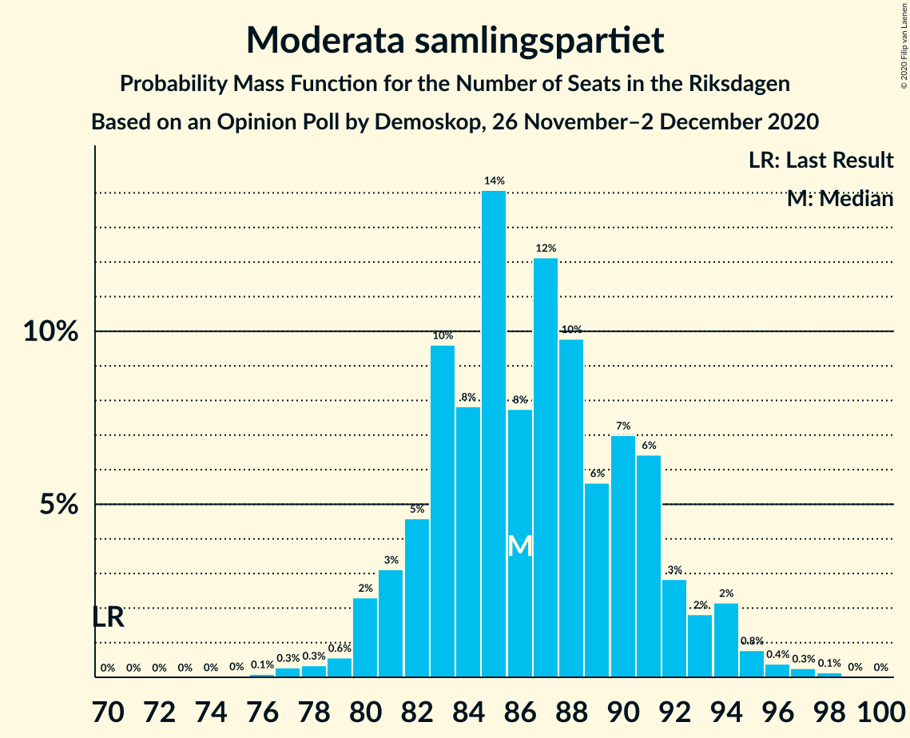

| Number of Seats | Probability | Accumulated | Special Marks |
|:---------------:|:-----------:|:-----------:|:-------------:|
| 70 | 0% | 100% | Last Result |
| 71 | 0% | 100% |  |
| 72 | 0% | 100% |  |
| 73 | 0% | 100% |  |
| 74 | 0% | 100% |  |
| 75 | 0% | 100% |  |
| 76 | 0.1% | 99.9% |  |
| 77 | 0.3% | 99.9% |  |
| 78 | 0.3% | 99.6% |  |
| 79 | 0.6% | 99.2% |  |
| 80 | 2% | 98.7% |  |
| 81 | 3% | 96% |  |
| 82 | 5% | 93% |  |
| 83 | 10% | 89% |  |
| 84 | 8% | 79% |  |
| 85 | 14% | 71% |  |
| 86 | 8% | 57% | Median |
| 87 | 12% | 49% |  |
| 88 | 10% | 37% |  |
| 89 | 6% | 27% |  |
| 90 | 7% | 22% |  |
| 91 | 6% | 15% |  |
| 92 | 3% | 8% |  |
| 93 | 2% | 6% |  |
| 94 | 2% | 4% |  |
| 95 | 0.8% | 2% |  |
| 96 | 0.4% | 0.8% |  |
| 97 | 0.3% | 0.4% |  |
| 98 | 0.1% | 0.2% |  |
| 99 | 0% | 0% |  |

### Sverigedemokraterna

*For a full overview of the results for this party, see the [Sverigedemokraterna](party-sverigedemokraterna.html) page.*

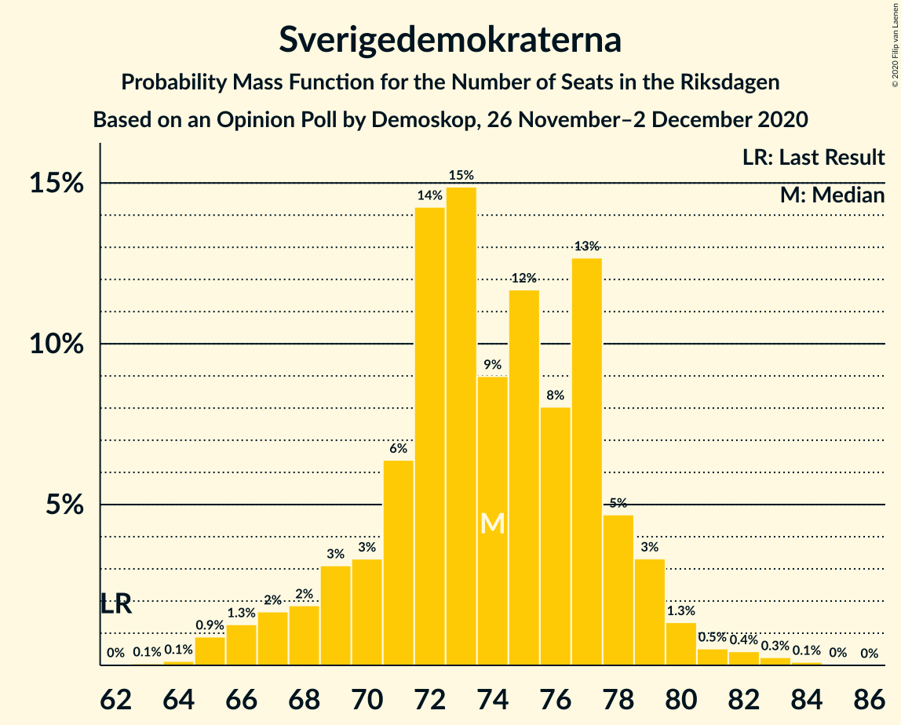

| Number of Seats | Probability | Accumulated | Special Marks |
|:---------------:|:-----------:|:-----------:|:-------------:|
| 62 | 0% | 100% | Last Result |
| 63 | 0.1% | 100% |  |
| 64 | 0.1% | 99.9% |  |
| 65 | 0.9% | 99.8% |  |
| 66 | 1.3% | 98.9% |  |
| 67 | 2% | 98% |  |
| 68 | 2% | 96% |  |
| 69 | 3% | 94% |  |
| 70 | 3% | 91% |  |
| 71 | 6% | 88% |  |
| 72 | 14% | 81% |  |
| 73 | 15% | 67% |  |
| 74 | 9% | 52% | Median |
| 75 | 12% | 43% |  |
| 76 | 8% | 31% |  |
| 77 | 13% | 23% |  |
| 78 | 5% | 11% |  |
| 79 | 3% | 6% |  |
| 80 | 1.3% | 3% |  |
| 81 | 0.5% | 1.4% |  |
| 82 | 0.4% | 0.8% |  |
| 83 | 0.3% | 0.4% |  |
| 84 | 0.1% | 0.2% |  |
| 85 | 0% | 0.1% |  |
| 86 | 0% | 0% |  |

### Centerpartiet

*For a full overview of the results for this party, see the [Centerpartiet](party-centerpartiet.html) page.*

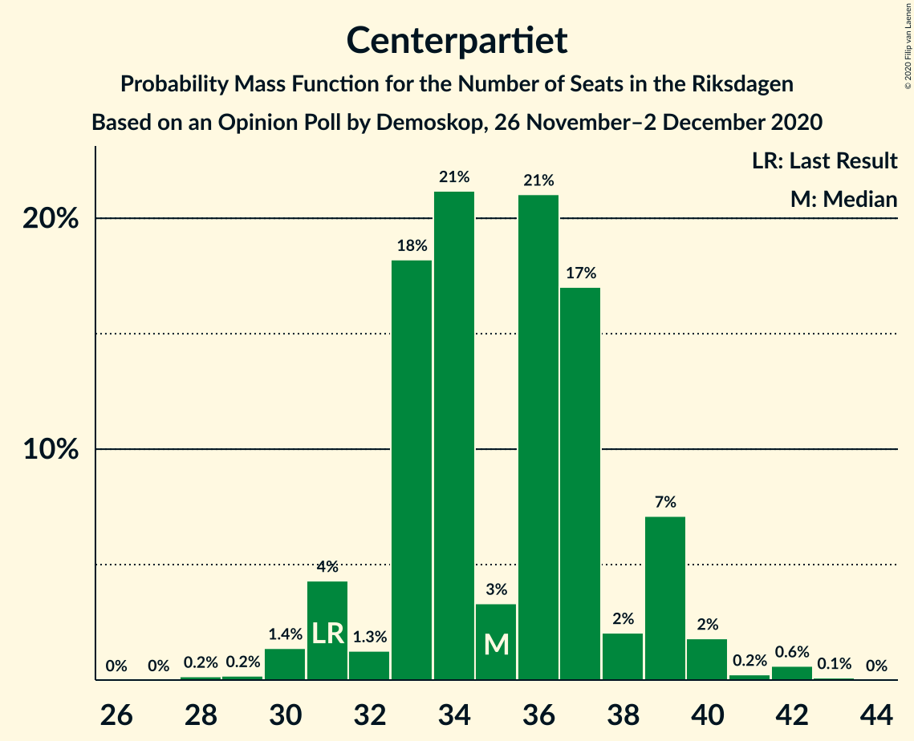

| Number of Seats | Probability | Accumulated | Special Marks |
|:---------------:|:-----------:|:-----------:|:-------------:|
| 28 | 0.2% | 100% |  |
| 29 | 0.2% | 99.8% |  |
| 30 | 1.4% | 99.6% |  |
| 31 | 4% | 98% | Last Result |
| 32 | 1.3% | 94% |  |
| 33 | 18% | 93% |  |
| 34 | 21% | 74% |  |
| 35 | 3% | 53% | Median |
| 36 | 21% | 50% |  |
| 37 | 17% | 29% |  |
| 38 | 2% | 12% |  |
| 39 | 7% | 10% |  |
| 40 | 2% | 3% |  |
| 41 | 0.2% | 1.0% |  |
| 42 | 0.6% | 0.7% |  |
| 43 | 0.1% | 0.1% |  |
| 44 | 0% | 0% |  |

### Vänsterpartiet

*For a full overview of the results for this party, see the [Vänsterpartiet](party-vänsterpartiet.html) page.*

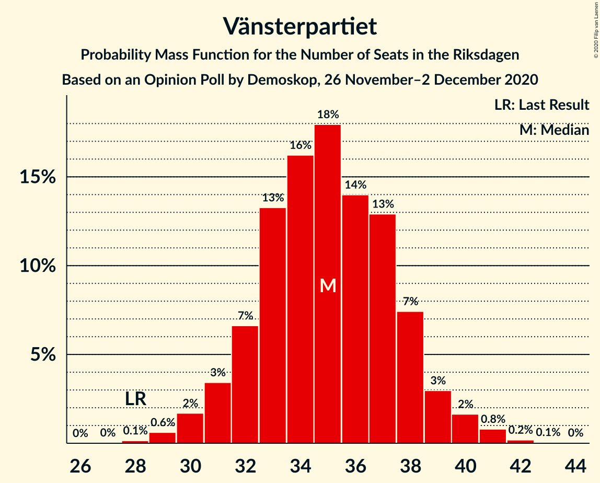

| Number of Seats | Probability | Accumulated | Special Marks |
|:---------------:|:-----------:|:-----------:|:-------------:|
| 28 | 0.1% | 100% | Last Result |
| 29 | 0.6% | 99.8% |  |
| 30 | 2% | 99.2% |  |
| 31 | 3% | 98% |  |
| 32 | 7% | 94% |  |
| 33 | 13% | 87% |  |
| 34 | 16% | 74% |  |
| 35 | 18% | 58% | Median |
| 36 | 14% | 40% |  |
| 37 | 13% | 26% |  |
| 38 | 7% | 13% |  |
| 39 | 3% | 6% |  |
| 40 | 2% | 3% |  |
| 41 | 0.8% | 1.1% |  |
| 42 | 0.2% | 0.3% |  |
| 43 | 0.1% | 0.1% |  |
| 44 | 0% | 0% |  |

### Kristdemokraterna

*For a full overview of the results for this party, see the [Kristdemokraterna](party-kristdemokraterna.html) page.*

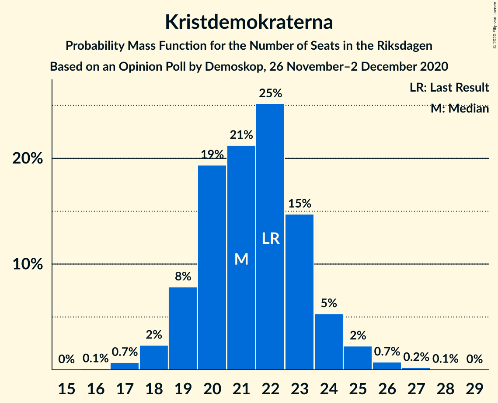

| Number of Seats | Probability | Accumulated | Special Marks |
|:---------------:|:-----------:|:-----------:|:-------------:|
| 16 | 0.1% | 100% |  |
| 17 | 0.7% | 99.9% |  |
| 18 | 2% | 99.2% |  |
| 19 | 8% | 97% |  |
| 20 | 19% | 89% |  |
| 21 | 21% | 70% | Median |
| 22 | 25% | 48% | Last Result |
| 23 | 15% | 23% |  |
| 24 | 5% | 9% |  |
| 25 | 2% | 3% |  |
| 26 | 0.7% | 1.0% |  |
| 27 | 0.2% | 0.3% |  |
| 28 | 0.1% | 0.1% |  |
| 29 | 0% | 0% |  |

### Miljöpartiet de gröna

*For a full overview of the results for this party, see the [Miljöpartiet de gröna](party-miljöpartietdegröna.html) page.*

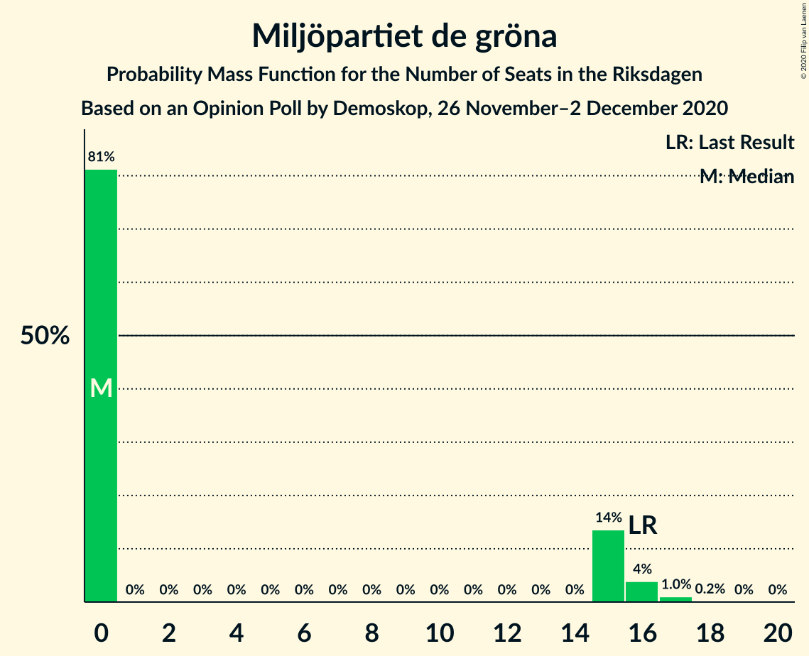

| Number of Seats | Probability | Accumulated | Special Marks |
|:---------------:|:-----------:|:-----------:|:-------------:|
| 0 | 81% | 100% | Median |
| 1 | 0% | 19% |  |
| 2 | 0% | 19% |  |
| 3 | 0% | 19% |  |
| 4 | 0% | 19% |  |
| 5 | 0% | 19% |  |
| 6 | 0% | 19% |  |
| 7 | 0% | 19% |  |
| 8 | 0% | 19% |  |
| 9 | 0% | 19% |  |
| 10 | 0% | 19% |  |
| 11 | 0% | 19% |  |
| 12 | 0% | 19% |  |
| 13 | 0% | 19% |  |
| 14 | 0% | 19% |  |
| 15 | 14% | 19% |  |
| 16 | 4% | 5% | Last Result |
| 17 | 1.0% | 1.2% |  |
| 18 | 0.2% | 0.2% |  |
| 19 | 0% | 0% |  |

### Liberalerna

*For a full overview of the results for this party, see the [Liberalerna](party-liberalerna.html) page.*

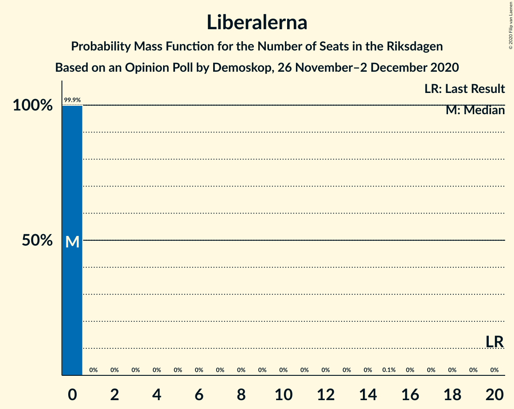

| Number of Seats | Probability | Accumulated | Special Marks |
|:---------------:|:-----------:|:-----------:|:-------------:|
| 0 | 99.9% | 100% | Median |
| 1 | 0% | 0.1% |  |
| 2 | 0% | 0.1% |  |
| 3 | 0% | 0.1% |  |
| 4 | 0% | 0.1% |  |
| 5 | 0% | 0.1% |  |
| 6 | 0% | 0.1% |  |
| 7 | 0% | 0.1% |  |
| 8 | 0% | 0.1% |  |
| 9 | 0% | 0.1% |  |
| 10 | 0% | 0.1% |  |
| 11 | 0% | 0.1% |  |
| 12 | 0% | 0.1% |  |
| 13 | 0% | 0.1% |  |
| 14 | 0% | 0.1% |  |
| 15 | 0.1% | 0.1% |  |
| 16 | 0% | 0% |  |
| 17 | 0% | 0% |  |
| 18 | 0% | 0% |  |
| 19 | 0% | 0% |  |
| 20 | 0% | 0% | Last Result |

## Coalitions

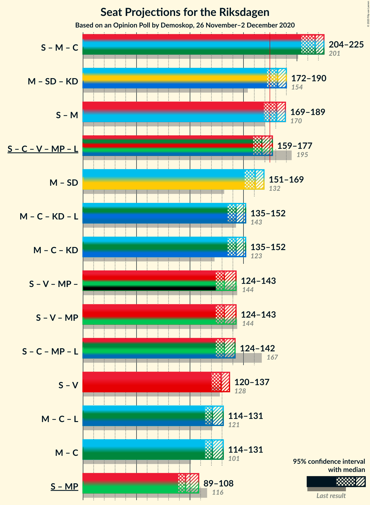

### Confidence Intervals

| Coalition | Last Result | Median | Majority? | 80% Confidence Interval | 90% Confidence Interval | 95% Confidence Interval | 99% Confidence Interval |
|:---------:|:-----------:|:------:|:---------:|:-----------------------:|:-----------------------:|:-----------------------:|:-----------------------:|
| Sveriges socialdemokratiska arbetareparti – Moderata samlingspartiet – Centerpartiet | 201 | 217 | 100% | 209–222 | 206–223 | 204–225 | 201–227 |
| Moderata samlingspartiet – Sverigedemokraterna – Kristdemokraterna | 154 | 182 | 93% | 175–188 | 174–189 | 172–190 | 169–192 |
| Sveriges socialdemokratiska arbetareparti – Moderata samlingspartiet | 170 | 181 | 89% | 174–187 | 172–188 | 169–189 | 167–191 |
| Sveriges socialdemokratiska arbetareparti – Centerpartiet – Vänsterpartiet – Miljöpartiet de gröna – Liberalerna | 195 | 167 | 7% | 161–174 | 160–175 | 159–177 | 157–180 |
| Moderata samlingspartiet – Sverigedemokraterna | 132 | 161 | 0% | 154–167 | 152–168 | 151–169 | 148–171 |
| Moderata samlingspartiet – Centerpartiet – Kristdemokraterna – Liberalerna | 143 | 143 | 0% | 137–148 | 137–150 | 135–152 | 133–154 |
| Moderata samlingspartiet – Centerpartiet – Kristdemokraterna | 123 | 143 | 0% | 137–148 | 137–150 | 135–152 | 133–154 |
| Sveriges socialdemokratiska arbetareparti – Vänsterpartiet – Miljöpartiet de gröna | 144 | 132 | 0% | 126–140 | 125–141 | 124–143 | 121–146 |
| Sveriges socialdemokratiska arbetareparti – Centerpartiet – Miljöpartiet de gröna – Liberalerna | 167 | 132 | 0% | 126–141 | 125–141 | 124–142 | 122–147 |
| Sveriges socialdemokratiska arbetareparti – Vänsterpartiet | 128 | 129 | 0% | 124–134 | 122–136 | 120–137 | 118–139 |
| Moderata samlingspartiet – Centerpartiet – Liberalerna | 121 | 121 | 0% | 117–127 | 115–129 | 114–131 | 112–133 |
| Moderata samlingspartiet – Centerpartiet | 101 | 121 | 0% | 117–127 | 115–129 | 114–131 | 112–132 |
| Sveriges socialdemokratiska arbetareparti – Miljöpartiet de gröna | 116 | 96 | 0% | 91–106 | 90–107 | 89–108 | 87–111 |

### Sveriges socialdemokratiska arbetareparti – Moderata samlingspartiet – Centerpartiet

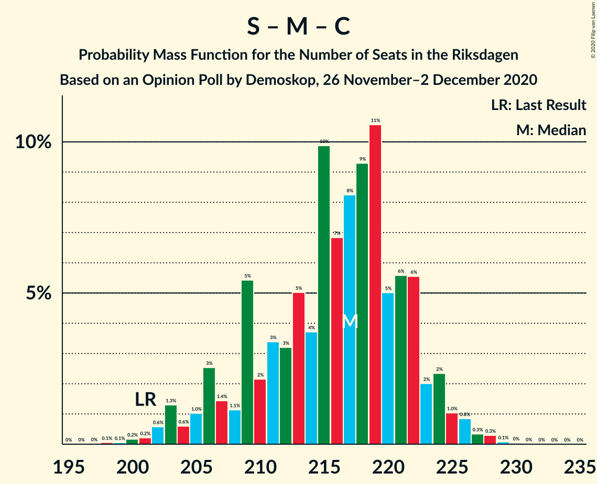

| Number of Seats | Probability | Accumulated | Special Marks |
|:---------------:|:-----------:|:-----------:|:-------------:|
| 198 | 0.1% | 100% |  |
| 199 | 0.1% | 99.9% |  |
| 200 | 0.2% | 99.9% |  |
| 201 | 0.2% | 99.7% | Last Result |
| 202 | 0.6% | 99.5% |  |
| 203 | 1.3% | 98.9% |  |
| 204 | 0.6% | 98% |  |
| 205 | 1.0% | 97% |  |
| 206 | 3% | 96% |  |
| 207 | 1.4% | 93% |  |
| 208 | 1.1% | 92% |  |
| 209 | 5% | 91% |  |
| 210 | 2% | 85% |  |
| 211 | 3% | 83% |  |
| 212 | 3% | 80% |  |
| 213 | 5% | 77% |  |
| 214 | 4% | 72% |  |
| 215 | 10% | 68% | Median |
| 216 | 7% | 58% |  |
| 217 | 8% | 51% |  |
| 218 | 9% | 43% |  |
| 219 | 11% | 34% |  |
| 220 | 5% | 23% |  |
| 221 | 6% | 18% |  |
| 222 | 6% | 13% |  |
| 223 | 2% | 7% |  |
| 224 | 2% | 5% |  |
| 225 | 1.0% | 3% |  |
| 226 | 0.8% | 2% |  |
| 227 | 0.3% | 0.8% |  |
| 228 | 0.3% | 0.4% |  |
| 229 | 0.1% | 0.1% |  |
| 230 | 0% | 0.1% |  |
| 231 | 0% | 0% |  |

### Moderata samlingspartiet – Sverigedemokraterna – Kristdemokraterna

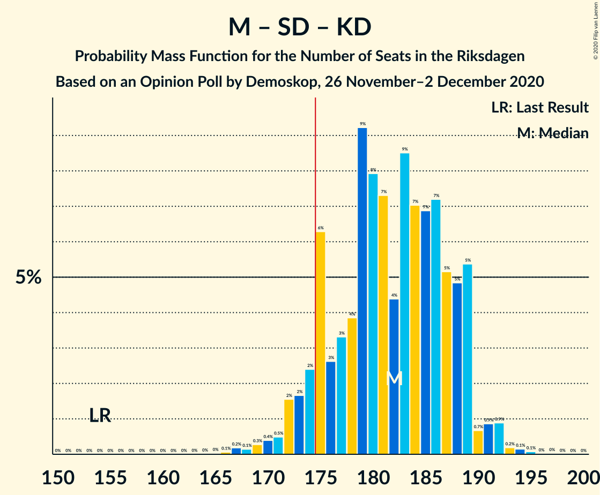

| Number of Seats | Probability | Accumulated | Special Marks |
|:---------------:|:-----------:|:-----------:|:-------------:|
| 154 | 0% | 100% | Last Result |
| 155 | 0% | 100% |  |
| 156 | 0% | 100% |  |
| 157 | 0% | 100% |  |
| 158 | 0% | 100% |  |
| 159 | 0% | 100% |  |
| 160 | 0% | 100% |  |
| 161 | 0% | 100% |  |
| 162 | 0% | 100% |  |
| 163 | 0% | 100% |  |
| 164 | 0% | 100% |  |
| 165 | 0% | 100% |  |
| 166 | 0.1% | 100% |  |
| 167 | 0.2% | 99.9% |  |
| 168 | 0.1% | 99.7% |  |
| 169 | 0.3% | 99.6% |  |
| 170 | 0.4% | 99.3% |  |
| 171 | 0.5% | 98.9% |  |
| 172 | 2% | 98% |  |
| 173 | 2% | 97% |  |
| 174 | 2% | 95% |  |
| 175 | 6% | 93% | Majority |
| 176 | 3% | 87% |  |
| 177 | 3% | 84% |  |
| 178 | 4% | 81% |  |
| 179 | 9% | 77% |  |
| 180 | 8% | 67% |  |
| 181 | 7% | 60% | Median |
| 182 | 4% | 52% |  |
| 183 | 9% | 48% |  |
| 184 | 7% | 39% |  |
| 185 | 7% | 32% |  |
| 186 | 7% | 25% |  |
| 187 | 5% | 18% |  |
| 188 | 5% | 13% |  |
| 189 | 5% | 8% |  |
| 190 | 0.7% | 3% |  |
| 191 | 0.9% | 2% |  |
| 192 | 0.9% | 1.3% |  |
| 193 | 0.2% | 0.5% |  |
| 194 | 0.1% | 0.3% |  |
| 195 | 0.1% | 0.1% |  |
| 196 | 0% | 0% |  |

### Sveriges socialdemokratiska arbetareparti – Moderata samlingspartiet

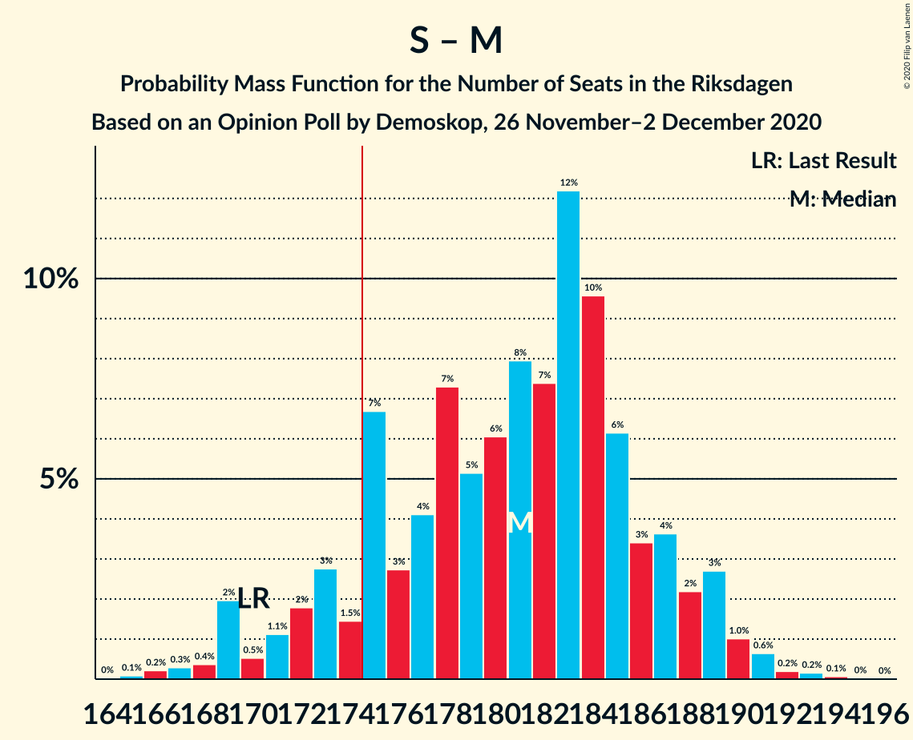

| Number of Seats | Probability | Accumulated | Special Marks |
|:---------------:|:-----------:|:-----------:|:-------------:|
| 164 | 0% | 100% |  |
| 165 | 0.1% | 99.9% |  |
| 166 | 0.2% | 99.8% |  |
| 167 | 0.3% | 99.6% |  |
| 168 | 0.4% | 99.3% |  |
| 169 | 2% | 99.0% |  |
| 170 | 0.5% | 97% | Last Result |
| 171 | 1.1% | 96% |  |
| 172 | 2% | 95% |  |
| 173 | 3% | 94% |  |
| 174 | 1.5% | 91% |  |
| 175 | 7% | 89% | Majority |
| 176 | 3% | 83% |  |
| 177 | 4% | 80% |  |
| 178 | 7% | 76% |  |
| 179 | 5% | 69% |  |
| 180 | 6% | 63% | Median |
| 181 | 8% | 57% |  |
| 182 | 7% | 49% |  |
| 183 | 12% | 42% |  |
| 184 | 10% | 30% |  |
| 185 | 6% | 20% |  |
| 186 | 3% | 14% |  |
| 187 | 4% | 11% |  |
| 188 | 2% | 7% |  |
| 189 | 3% | 5% |  |
| 190 | 1.0% | 2% |  |
| 191 | 0.6% | 1.1% |  |
| 192 | 0.2% | 0.5% |  |
| 193 | 0.2% | 0.3% |  |
| 194 | 0.1% | 0.1% |  |
| 195 | 0% | 0% |  |

### Sveriges socialdemokratiska arbetareparti – Centerpartiet – Vänsterpartiet – Miljöpartiet de gröna – Liberalerna

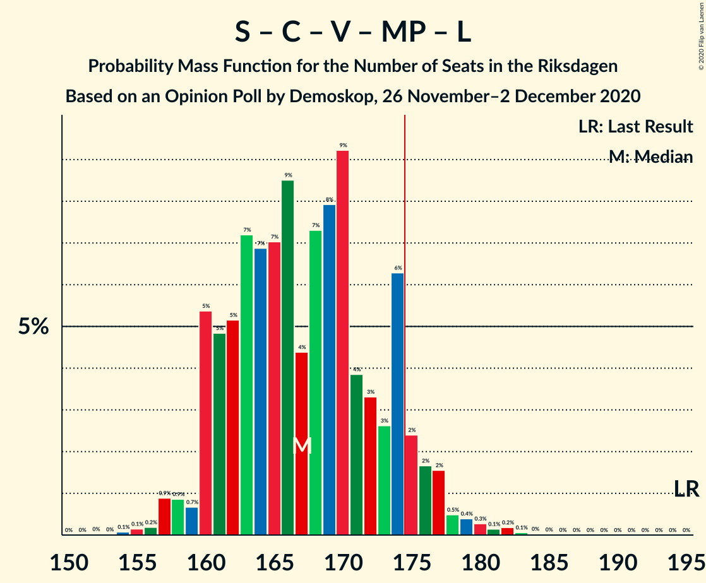

| Number of Seats | Probability | Accumulated | Special Marks |
|:---------------:|:-----------:|:-----------:|:-------------:|
| 154 | 0.1% | 100% |  |
| 155 | 0.1% | 99.9% |  |
| 156 | 0.2% | 99.7% |  |
| 157 | 0.9% | 99.5% |  |
| 158 | 0.9% | 98.7% |  |
| 159 | 0.7% | 98% |  |
| 160 | 5% | 97% |  |
| 161 | 5% | 92% |  |
| 162 | 5% | 87% |  |
| 163 | 7% | 82% |  |
| 164 | 7% | 75% | Median |
| 165 | 7% | 68% |  |
| 166 | 9% | 61% |  |
| 167 | 4% | 52% |  |
| 168 | 7% | 48% |  |
| 169 | 8% | 40% |  |
| 170 | 9% | 33% |  |
| 171 | 4% | 23% |  |
| 172 | 3% | 19% |  |
| 173 | 3% | 16% |  |
| 174 | 6% | 13% |  |
| 175 | 2% | 7% | Majority |
| 176 | 2% | 5% |  |
| 177 | 2% | 3% |  |
| 178 | 0.5% | 2% |  |
| 179 | 0.4% | 1.1% |  |
| 180 | 0.3% | 0.7% |  |
| 181 | 0.1% | 0.4% |  |
| 182 | 0.2% | 0.3% |  |
| 183 | 0.1% | 0.1% |  |
| 184 | 0% | 0% |  |
| 185 | 0% | 0% |  |
| 186 | 0% | 0% |  |
| 187 | 0% | 0% |  |
| 188 | 0% | 0% |  |
| 189 | 0% | 0% |  |
| 190 | 0% | 0% |  |
| 191 | 0% | 0% |  |
| 192 | 0% | 0% |  |
| 193 | 0% | 0% |  |
| 194 | 0% | 0% |  |
| 195 | 0% | 0% | Last Result |

### Moderata samlingspartiet – Sverigedemokraterna

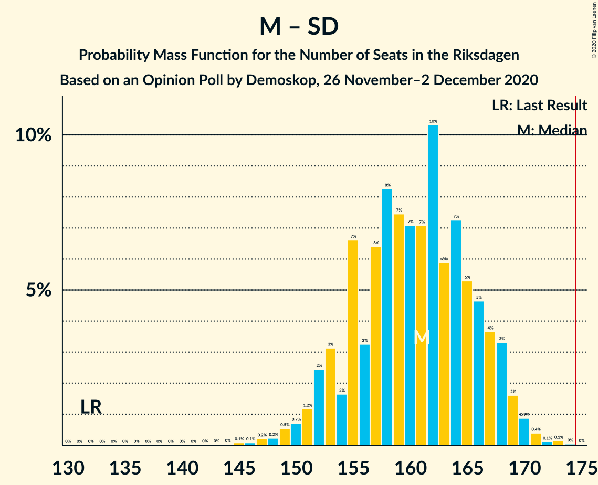

| Number of Seats | Probability | Accumulated | Special Marks |
|:---------------:|:-----------:|:-----------:|:-------------:|
| 132 | 0% | 100% | Last Result |
| 133 | 0% | 100% |  |
| 134 | 0% | 100% |  |
| 135 | 0% | 100% |  |
| 136 | 0% | 100% |  |
| 137 | 0% | 100% |  |
| 138 | 0% | 100% |  |
| 139 | 0% | 100% |  |
| 140 | 0% | 100% |  |
| 141 | 0% | 100% |  |
| 142 | 0% | 100% |  |
| 143 | 0% | 100% |  |
| 144 | 0% | 100% |  |
| 145 | 0.1% | 100% |  |
| 146 | 0.1% | 99.9% |  |
| 147 | 0.2% | 99.8% |  |
| 148 | 0.2% | 99.6% |  |
| 149 | 0.5% | 99.4% |  |
| 150 | 0.7% | 98.8% |  |
| 151 | 1.2% | 98% |  |
| 152 | 2% | 97% |  |
| 153 | 3% | 94% |  |
| 154 | 2% | 91% |  |
| 155 | 7% | 90% |  |
| 156 | 3% | 83% |  |
| 157 | 6% | 80% |  |
| 158 | 8% | 73% |  |
| 159 | 7% | 65% |  |
| 160 | 7% | 58% | Median |
| 161 | 7% | 51% |  |
| 162 | 10% | 44% |  |
| 163 | 6% | 33% |  |
| 164 | 7% | 27% |  |
| 165 | 5% | 20% |  |
| 166 | 5% | 15% |  |
| 167 | 4% | 10% |  |
| 168 | 3% | 7% |  |
| 169 | 2% | 3% |  |
| 170 | 0.9% | 2% |  |
| 171 | 0.4% | 0.7% |  |
| 172 | 0.1% | 0.3% |  |
| 173 | 0.1% | 0.2% |  |
| 174 | 0% | 0.1% |  |
| 175 | 0% | 0% | Majority |

### Moderata samlingspartiet – Centerpartiet – Kristdemokraterna – Liberalerna

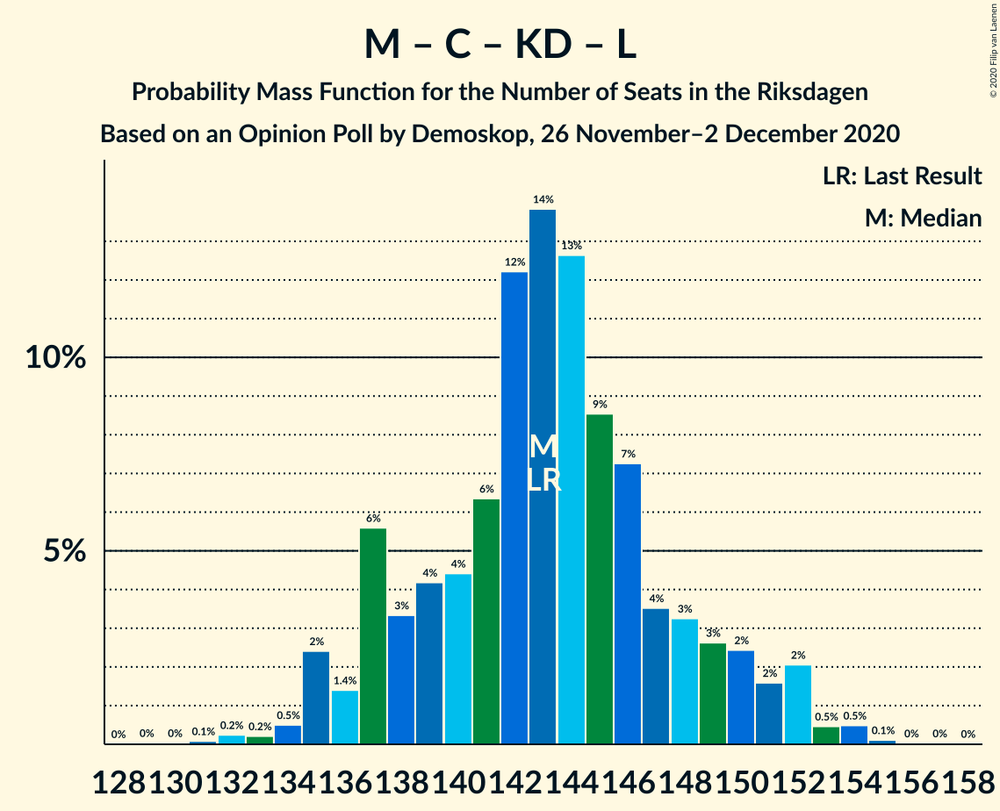

| Number of Seats | Probability | Accumulated | Special Marks |
|:---------------:|:-----------:|:-----------:|:-------------:|
| 129 | 0% | 100% |  |
| 130 | 0% | 99.9% |  |
| 131 | 0.1% | 99.9% |  |
| 132 | 0.2% | 99.8% |  |
| 133 | 0.2% | 99.6% |  |
| 134 | 0.5% | 99.4% |  |
| 135 | 2% | 98.9% |  |
| 136 | 1.4% | 96% |  |
| 137 | 6% | 95% |  |
| 138 | 3% | 89% |  |
| 139 | 4% | 86% |  |
| 140 | 4% | 82% |  |
| 141 | 6% | 78% |  |
| 142 | 12% | 71% | Median |
| 143 | 14% | 59% | Last Result |
| 144 | 13% | 45% |  |
| 145 | 9% | 32% |  |
| 146 | 7% | 24% |  |
| 147 | 4% | 17% |  |
| 148 | 3% | 13% |  |
| 149 | 3% | 10% |  |
| 150 | 2% | 7% |  |
| 151 | 2% | 5% |  |
| 152 | 2% | 3% |  |
| 153 | 0.5% | 1.2% |  |
| 154 | 0.5% | 0.7% |  |
| 155 | 0.1% | 0.2% |  |
| 156 | 0% | 0.1% |  |
| 157 | 0% | 0.1% |  |
| 158 | 0% | 0% |  |

### Moderata samlingspartiet – Centerpartiet – Kristdemokraterna

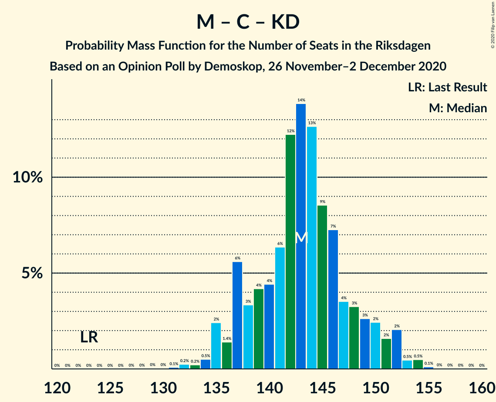

| Number of Seats | Probability | Accumulated | Special Marks |
|:---------------:|:-----------:|:-----------:|:-------------:|
| 123 | 0% | 100% | Last Result |
| 124 | 0% | 100% |  |
| 125 | 0% | 100% |  |
| 126 | 0% | 100% |  |
| 127 | 0% | 100% |  |
| 128 | 0% | 100% |  |
| 129 | 0% | 100% |  |
| 130 | 0% | 99.9% |  |
| 131 | 0.1% | 99.9% |  |
| 132 | 0.2% | 99.8% |  |
| 133 | 0.2% | 99.6% |  |
| 134 | 0.5% | 99.4% |  |
| 135 | 2% | 98.8% |  |
| 136 | 1.4% | 96% |  |
| 137 | 6% | 95% |  |
| 138 | 3% | 89% |  |
| 139 | 4% | 86% |  |
| 140 | 4% | 82% |  |
| 141 | 6% | 77% |  |
| 142 | 12% | 71% | Median |
| 143 | 14% | 59% |  |
| 144 | 13% | 45% |  |
| 145 | 9% | 32% |  |
| 146 | 7% | 24% |  |
| 147 | 4% | 17% |  |
| 148 | 3% | 13% |  |
| 149 | 3% | 10% |  |
| 150 | 2% | 7% |  |
| 151 | 2% | 5% |  |
| 152 | 2% | 3% |  |
| 153 | 0.5% | 1.1% |  |
| 154 | 0.5% | 0.7% |  |
| 155 | 0.1% | 0.2% |  |
| 156 | 0% | 0.1% |  |
| 157 | 0% | 0% |  |

### Sveriges socialdemokratiska arbetareparti – Vänsterpartiet – Miljöpartiet de gröna

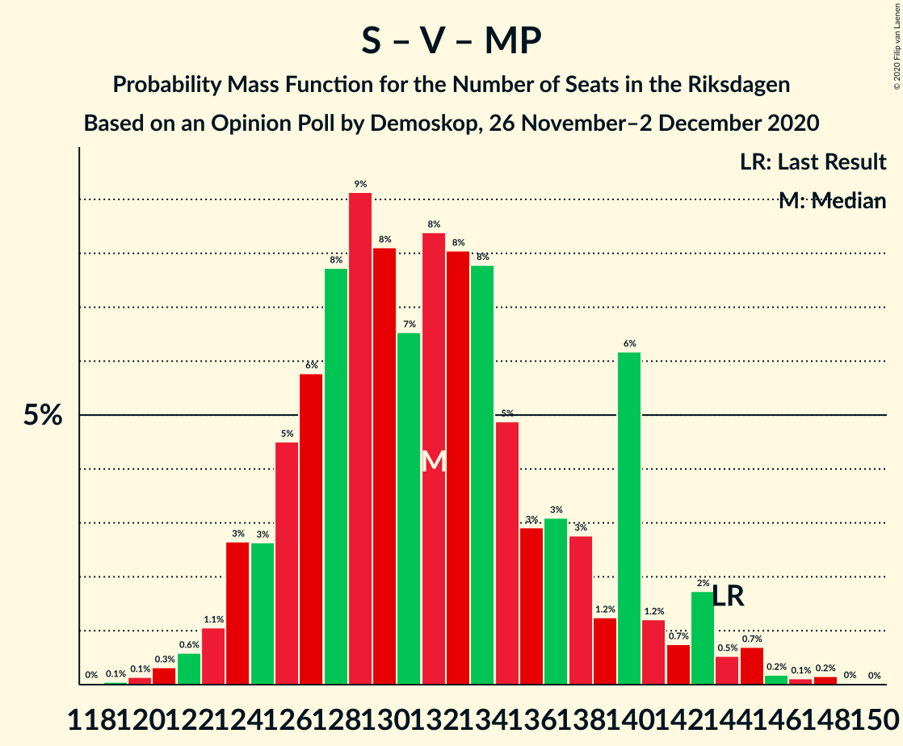

| Number of Seats | Probability | Accumulated | Special Marks |
|:---------------:|:-----------:|:-----------:|:-------------:|
| 118 | 0% | 100% |  |
| 119 | 0.1% | 99.9% |  |
| 120 | 0.1% | 99.9% |  |
| 121 | 0.3% | 99.8% |  |
| 122 | 0.6% | 99.4% |  |
| 123 | 1.1% | 98.8% |  |
| 124 | 3% | 98% |  |
| 125 | 3% | 95% |  |
| 126 | 5% | 93% |  |
| 127 | 6% | 88% |  |
| 128 | 8% | 82% |  |
| 129 | 9% | 74% | Median |
| 130 | 8% | 65% |  |
| 131 | 7% | 57% |  |
| 132 | 8% | 51% |  |
| 133 | 8% | 42% |  |
| 134 | 8% | 34% |  |
| 135 | 5% | 26% |  |
| 136 | 3% | 22% |  |
| 137 | 3% | 19% |  |
| 138 | 3% | 16% |  |
| 139 | 1.2% | 13% |  |
| 140 | 6% | 12% |  |
| 141 | 1.2% | 5% |  |
| 142 | 0.7% | 4% |  |
| 143 | 2% | 3% |  |
| 144 | 0.5% | 2% | Last Result |
| 145 | 0.7% | 1.2% |  |
| 146 | 0.2% | 0.5% |  |
| 147 | 0.1% | 0.3% |  |
| 148 | 0.2% | 0.2% |  |
| 149 | 0% | 0.1% |  |
| 150 | 0% | 0% |  |

### Sveriges socialdemokratiska arbetareparti – Centerpartiet – Miljöpartiet de gröna – Liberalerna

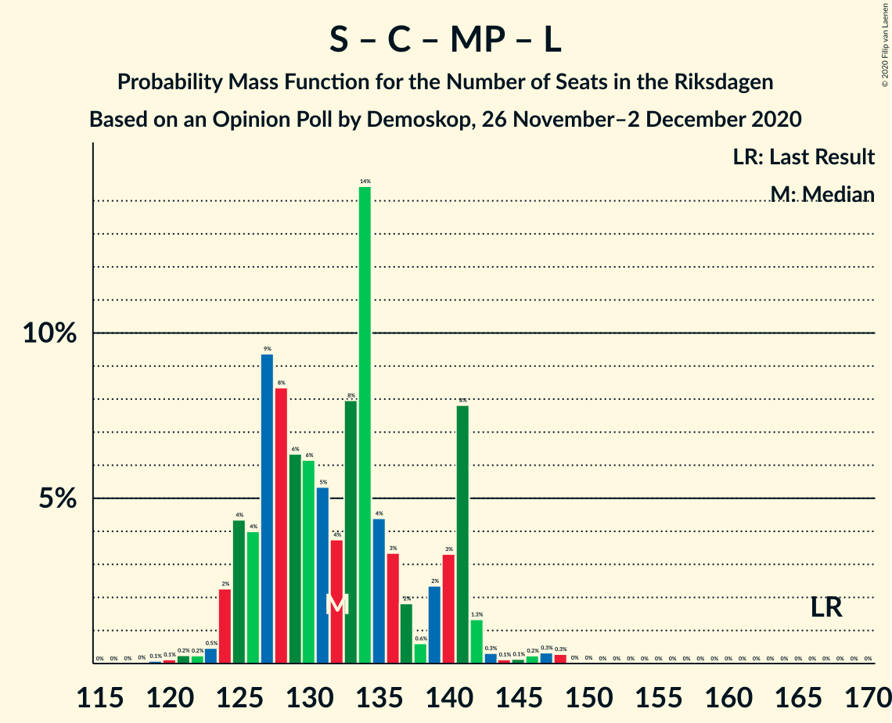

| Number of Seats | Probability | Accumulated | Special Marks |
|:---------------:|:-----------:|:-----------:|:-------------:|
| 119 | 0.1% | 100% |  |
| 120 | 0.1% | 99.9% |  |
| 121 | 0.2% | 99.8% |  |
| 122 | 0.2% | 99.5% |  |
| 123 | 0.5% | 99.3% |  |
| 124 | 2% | 98.8% |  |
| 125 | 4% | 97% |  |
| 126 | 4% | 92% |  |
| 127 | 9% | 88% |  |
| 128 | 8% | 79% |  |
| 129 | 6% | 70% | Median |
| 130 | 6% | 64% |  |
| 131 | 5% | 58% |  |
| 132 | 4% | 53% |  |
| 133 | 8% | 49% |  |
| 134 | 14% | 41% |  |
| 135 | 4% | 26% |  |
| 136 | 3% | 22% |  |
| 137 | 2% | 19% |  |
| 138 | 0.6% | 17% |  |
| 139 | 2% | 16% |  |
| 140 | 3% | 14% |  |
| 141 | 8% | 11% |  |
| 142 | 1.3% | 3% |  |
| 143 | 0.3% | 1.5% |  |
| 144 | 0.1% | 1.2% |  |
| 145 | 0.1% | 1.0% |  |
| 146 | 0.2% | 0.9% |  |
| 147 | 0.3% | 0.7% |  |
| 148 | 0.3% | 0.3% |  |
| 149 | 0% | 0.1% |  |
| 150 | 0% | 0% |  |
| 151 | 0% | 0% |  |
| 152 | 0% | 0% |  |
| 153 | 0% | 0% |  |
| 154 | 0% | 0% |  |
| 155 | 0% | 0% |  |
| 156 | 0% | 0% |  |
| 157 | 0% | 0% |  |
| 158 | 0% | 0% |  |
| 159 | 0% | 0% |  |
| 160 | 0% | 0% |  |
| 161 | 0% | 0% |  |
| 162 | 0% | 0% |  |
| 163 | 0% | 0% |  |
| 164 | 0% | 0% |  |
| 165 | 0% | 0% |  |
| 166 | 0% | 0% |  |
| 167 | 0% | 0% | Last Result |

### Sveriges socialdemokratiska arbetareparti – Vänsterpartiet

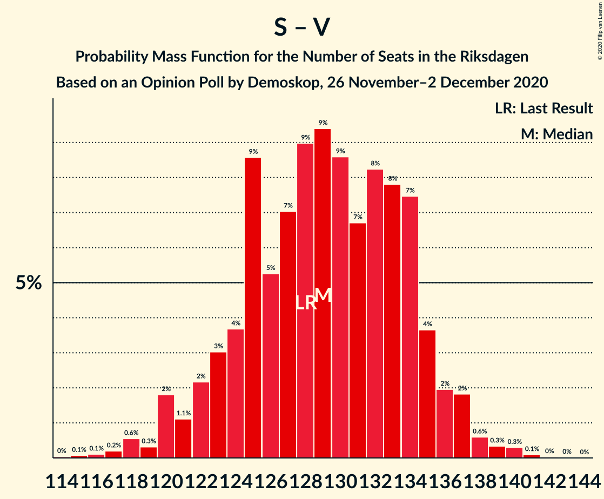

| Number of Seats | Probability | Accumulated | Special Marks |
|:---------------:|:-----------:|:-----------:|:-------------:|
| 114 | 0% | 100% |  |
| 115 | 0.1% | 99.9% |  |
| 116 | 0.1% | 99.9% |  |
| 117 | 0.2% | 99.8% |  |
| 118 | 0.6% | 99.6% |  |
| 119 | 0.3% | 99.0% |  |
| 120 | 2% | 98.7% |  |
| 121 | 1.1% | 97% |  |
| 122 | 2% | 96% |  |
| 123 | 3% | 94% |  |
| 124 | 4% | 91% |  |
| 125 | 9% | 87% |  |
| 126 | 5% | 78% |  |
| 127 | 7% | 73% |  |
| 128 | 9% | 66% | Last Result |
| 129 | 9% | 57% | Median |
| 130 | 9% | 48% |  |
| 131 | 7% | 39% |  |
| 132 | 8% | 32% |  |
| 133 | 8% | 24% |  |
| 134 | 7% | 16% |  |
| 135 | 4% | 9% |  |
| 136 | 2% | 5% |  |
| 137 | 2% | 3% |  |
| 138 | 0.6% | 1.4% |  |
| 139 | 0.3% | 0.8% |  |
| 140 | 0.3% | 0.4% |  |
| 141 | 0.1% | 0.1% |  |
| 142 | 0% | 0.1% |  |
| 143 | 0% | 0% |  |

### Moderata samlingspartiet – Centerpartiet – Liberalerna

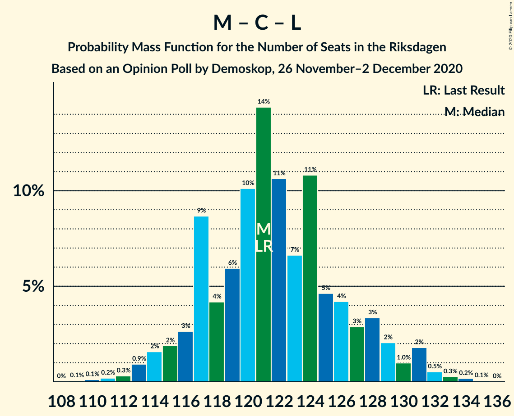

| Number of Seats | Probability | Accumulated | Special Marks |
|:---------------:|:-----------:|:-----------:|:-------------:|
| 109 | 0.1% | 100% |  |
| 110 | 0.1% | 99.9% |  |
| 111 | 0.2% | 99.8% |  |
| 112 | 0.3% | 99.6% |  |
| 113 | 0.9% | 99.3% |  |
| 114 | 2% | 98% |  |
| 115 | 2% | 97% |  |
| 116 | 3% | 95% |  |
| 117 | 9% | 92% |  |
| 118 | 4% | 84% |  |
| 119 | 6% | 79% |  |
| 120 | 10% | 73% |  |
| 121 | 14% | 63% | Last Result, Median |
| 122 | 11% | 49% |  |
| 123 | 7% | 38% |  |
| 124 | 11% | 32% |  |
| 125 | 5% | 21% |  |
| 126 | 4% | 16% |  |
| 127 | 3% | 12% |  |
| 128 | 3% | 9% |  |
| 129 | 2% | 6% |  |
| 130 | 1.0% | 4% |  |
| 131 | 2% | 3% |  |
| 132 | 0.5% | 1.1% |  |
| 133 | 0.3% | 0.5% |  |
| 134 | 0.2% | 0.3% |  |
| 135 | 0.1% | 0.1% |  |
| 136 | 0% | 0% |  |

### Moderata samlingspartiet – Centerpartiet

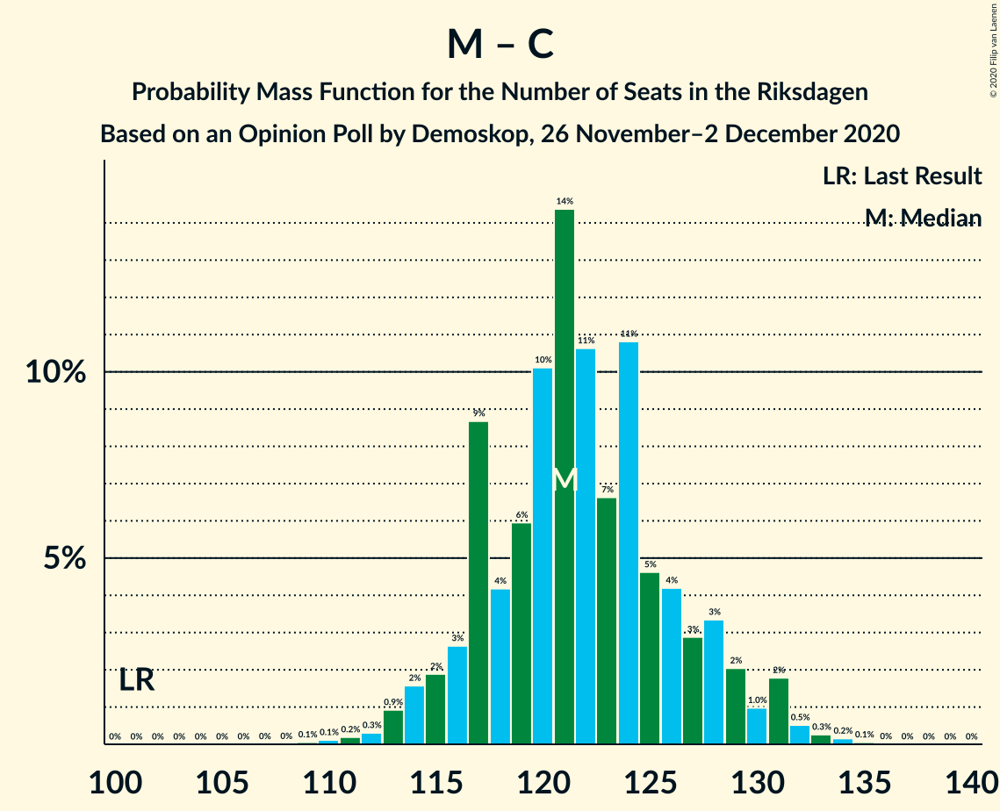

| Number of Seats | Probability | Accumulated | Special Marks |
|:---------------:|:-----------:|:-----------:|:-------------:|
| 101 | 0% | 100% | Last Result |
| 102 | 0% | 100% |  |
| 103 | 0% | 100% |  |
| 104 | 0% | 100% |  |
| 105 | 0% | 100% |  |
| 106 | 0% | 100% |  |
| 107 | 0% | 100% |  |
| 108 | 0% | 100% |  |
| 109 | 0.1% | 100% |  |
| 110 | 0.1% | 99.9% |  |
| 111 | 0.2% | 99.8% |  |
| 112 | 0.3% | 99.6% |  |
| 113 | 0.9% | 99.3% |  |
| 114 | 2% | 98% |  |
| 115 | 2% | 97% |  |
| 116 | 3% | 95% |  |
| 117 | 9% | 92% |  |
| 118 | 4% | 84% |  |
| 119 | 6% | 79% |  |
| 120 | 10% | 73% |  |
| 121 | 14% | 63% | Median |
| 122 | 11% | 49% |  |
| 123 | 7% | 38% |  |
| 124 | 11% | 32% |  |
| 125 | 5% | 21% |  |
| 126 | 4% | 16% |  |
| 127 | 3% | 12% |  |
| 128 | 3% | 9% |  |
| 129 | 2% | 6% |  |
| 130 | 1.0% | 4% |  |
| 131 | 2% | 3% |  |
| 132 | 0.5% | 1.0% |  |
| 133 | 0.3% | 0.5% |  |
| 134 | 0.2% | 0.2% |  |
| 135 | 0.1% | 0.1% |  |
| 136 | 0% | 0% |  |

### Sveriges socialdemokratiska arbetareparti – Miljöpartiet de gröna

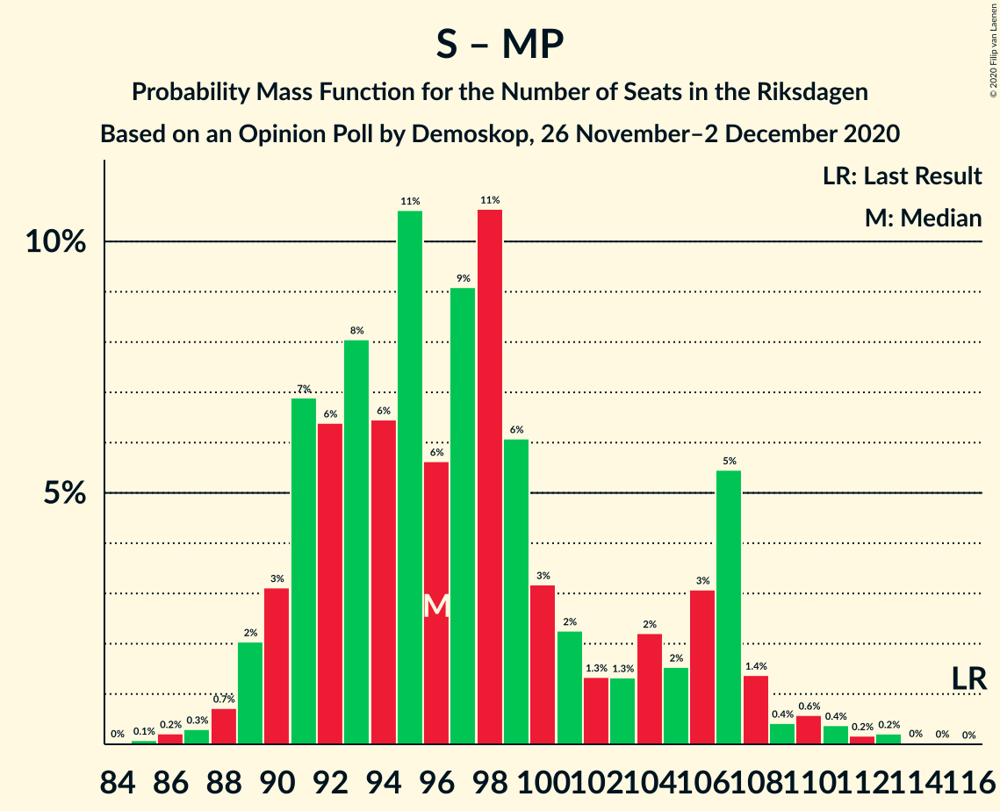

| Number of Seats | Probability | Accumulated | Special Marks |
|:---------------:|:-----------:|:-----------:|:-------------:|
| 84 | 0% | 100% |  |
| 85 | 0.1% | 99.9% |  |
| 86 | 0.2% | 99.9% |  |
| 87 | 0.3% | 99.7% |  |
| 88 | 0.7% | 99.3% |  |
| 89 | 2% | 98.6% |  |
| 90 | 3% | 97% |  |
| 91 | 7% | 93% |  |
| 92 | 6% | 87% |  |
| 93 | 8% | 80% |  |
| 94 | 6% | 72% | Median |
| 95 | 11% | 66% |  |
| 96 | 6% | 55% |  |
| 97 | 9% | 49% |  |
| 98 | 11% | 40% |  |
| 99 | 6% | 30% |  |
| 100 | 3% | 24% |  |
| 101 | 2% | 20% |  |
| 102 | 1.3% | 18% |  |
| 103 | 1.3% | 17% |  |
| 104 | 2% | 15% |  |
| 105 | 2% | 13% |  |
| 106 | 3% | 12% |  |
| 107 | 5% | 9% |  |
| 108 | 1.4% | 3% |  |
| 109 | 0.4% | 2% |  |
| 110 | 0.6% | 1.4% |  |
| 111 | 0.4% | 0.8% |  |
| 112 | 0.2% | 0.5% |  |
| 113 | 0.2% | 0.3% |  |
| 114 | 0% | 0.1% |  |
| 115 | 0% | 0% |  |
| 116 | 0% | 0% | Last Result |

## Technical Information

### Opinion Poll

+ **Polling firm:** Demoskop
+ **Commissioner(s):** —
+ **Fieldwork period:** 26 November–2 December 2020

### Calculations

+ **Sample size:** 2278
+ **Simulations done:** 1,048,576
+ **Error estimate:** 0.58%

