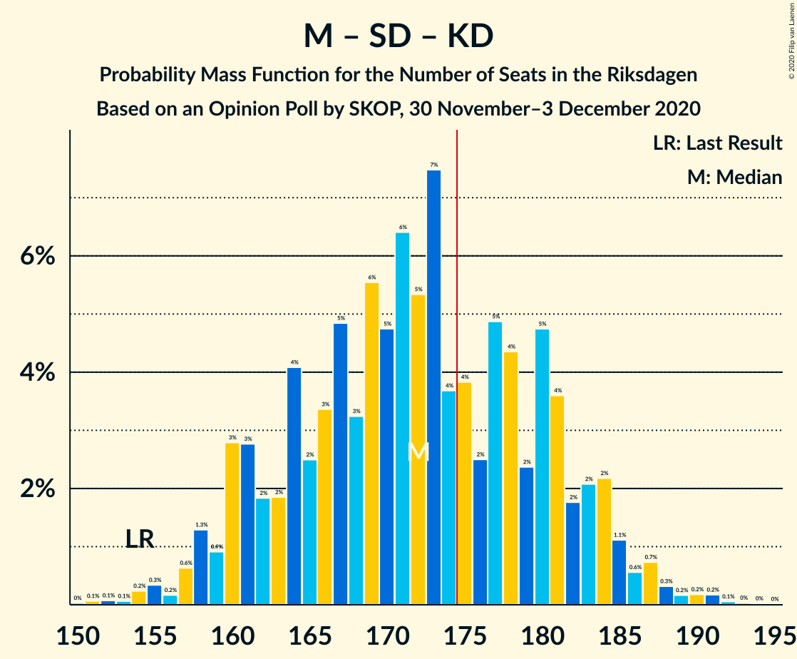

# Opinion Poll by SKOP, 30 November–3 December 2020

<a href="#voting-intentions">Voting Intentions</a> | <a href="#seats">Seats</a> | <a href="#coalitions">Coalitions</a> | <a href="#technical-information">Technical Information</a>

## Voting Intentions

### Confidence Intervals

| Party | Last Result | Poll Result | 80% Confidence Interval | 90% Confidence Interval | 95% Confidence Interval | 99% Confidence Interval |
|:-----:|:-----------:|:-----------:|:-----------------------:|:-----------------------:|:-----------------------:|:-----------------------:|
| Sveriges socialdemokratiska arbetareparti | 28.3% | 26.1% | 24.4–27.9% |23.9–28.5% |23.5–28.9% |22.7–29.8% |
| Moderata samlingspartiet | 19.8% | 21.8% | 20.2–23.6% |19.8–24.1% |19.4–24.5% |18.6–25.3% |
| Sverigedemokraterna | 17.5% | 18.2% | 16.7–19.9% |16.3–20.3% |16.0–20.7% |15.3–21.6% |
| Vänsterpartiet | 8.0% | 11.2% | 10.0–12.5% |9.6–12.9% |9.3–13.3% |8.8–13.9% |
| Centerpartiet | 8.6% | 8.5% | 7.4–9.7% |7.1–10.0% |6.9–10.4% |6.4–11.0% |
| Kristdemokraterna | 6.3% | 6.5% | 5.6–7.6% |5.3–7.9% |5.1–8.2% |4.7–8.7% |
| Miljöpartiet de gröna | 4.4% | 4.0% | 3.3–4.9% |3.1–5.2% |2.9–5.4% |2.6–5.9% |
| Liberalerna | 5.5% | 2.7% | 2.1–3.5% |2.0–3.7% |1.8–3.9% |1.6–4.3% |

*Note:* The poll result column reflects the actual value used in the calculations. Published results may vary slightly, and in addition be rounded to fewer digits.

## Seats

### Confidence Intervals

| Party | Last Result | Median | 80% Confidence Interval | 90% Confidence Interval | 95% Confidence Interval | 99% Confidence Interval |
|:-----:|:-----------:|:------:|:-----------------------:|:-----------------------:|:-----------------------:|:-----------------------:|
| <a href="#sveriges-socialdemokratiska-arbetareparti">Sveriges socialdemokratiska arbetareparti</a> | 100 | 97 | 89–103 |87–106 |85–108 |82–111 |
| <a href="#moderata-samlingspartiet">Moderata samlingspartiet</a> | 70 | 81 | 73–88 |72–89 |71–91 |68–94 |
| <a href="#sverigedemokraterna">Sverigedemokraterna</a> | 62 | 67 | 61–74 |60–75 |58–77 |56–79 |
| <a href="#vänsterpartiet">Vänsterpartiet</a> | 28 | 41 | 37–46 |35–47 |34–49 |32–52 |
| <a href="#centerpartiet">Centerpartiet</a> | 31 | 32 | 27–36 |26–37 |25–38 |23–41 |
| <a href="#kristdemokraterna">Kristdemokraterna</a> | 22 | 24 | 21–28 |20–29 |18–30 |17–32 |
| <a href="#miljöpartiet-de-gröna">Miljöpartiet de gröna</a> | 16 | 0 | 0–18 |0–19 |0–20 |0–21 |
| <a href="#liberalerna">Liberalerna</a> | 20 | 0 | 0 |0 |0 |0–15 |

### Sveriges socialdemokratiska arbetareparti

*For a full overview of the results for this party, see the [Sveriges socialdemokratiska arbetareparti](party-sverigessocialdemokratiskaarbetareparti.html) page.*

| Number of Seats | Probability | Accumulated | Special Marks |
|:---------------:|:-----------:|:-----------:|:-------------:|
| 79 | 0% | 100% |  |
| 80 | 0.1% | 99.9% |  |
| 81 | 0.2% | 99.8% |  |
| 82 | 0.3% | 99.7% |  |
| 83 | 0.4% | 99.4% |  |
| 84 | 0.8% | 99.0% |  |
| 85 | 1.2% | 98% |  |
| 86 | 1.4% | 97% |  |
| 87 | 2% | 96% |  |
| 88 | 3% | 94% |  |
| 89 | 2% | 91% |  |
| 90 | 4% | 89% |  |
| 91 | 3% | 85% |  |
| 92 | 6% | 82% |  |
| 93 | 4% | 76% |  |
| 94 | 7% | 71% |  |
| 95 | 6% | 64% |  |
| 96 | 7% | 58% |  |
| 97 | 8% | 51% | Median |
| 98 | 10% | 43% |  |
| 99 | 8% | 33% |  |
| 100 | 3% | 25% | Last Result |
| 101 | 7% | 22% |  |
| 102 | 3% | 15% |  |
| 103 | 3% | 12% |  |
| 104 | 2% | 9% |  |
| 105 | 2% | 7% |  |
| 106 | 2% | 5% |  |
| 107 | 0.7% | 3% |  |
| 108 | 0.7% | 3% |  |
| 109 | 0.7% | 2% |  |
| 110 | 0.5% | 1.4% |  |
| 111 | 0.4% | 0.9% |  |
| 112 | 0.3% | 0.5% |  |
| 113 | 0.1% | 0.2% |  |
| 114 | 0% | 0.1% |  |
| 115 | 0% | 0.1% |  |
| 116 | 0% | 0% |  |

### Moderata samlingspartiet

*For a full overview of the results for this party, see the [Moderata samlingspartiet](party-moderatasamlingspartiet.html) page.*

| Number of Seats | Probability | Accumulated | Special Marks |
|:---------------:|:-----------:|:-----------:|:-------------:|
| 64 | 0% | 100% |  |
| 65 | 0.1% | 99.9% |  |
| 66 | 0.2% | 99.9% |  |
| 67 | 0.1% | 99.7% |  |
| 68 | 0.3% | 99.6% |  |
| 69 | 0.6% | 99.3% |  |
| 70 | 0.9% | 98.7% | Last Result |
| 71 | 2% | 98% |  |
| 72 | 3% | 95% |  |
| 73 | 3% | 93% |  |
| 74 | 4% | 89% |  |
| 75 | 3% | 85% |  |
| 76 | 3% | 82% |  |
| 77 | 4% | 79% |  |
| 78 | 7% | 75% |  |
| 79 | 7% | 69% |  |
| 80 | 12% | 62% |  |
| 81 | 10% | 50% | Median |
| 82 | 4% | 40% |  |
| 83 | 10% | 36% |  |
| 84 | 5% | 26% |  |
| 85 | 4% | 21% |  |
| 86 | 2% | 18% |  |
| 87 | 5% | 15% |  |
| 88 | 3% | 10% |  |
| 89 | 3% | 7% |  |
| 90 | 1.0% | 4% |  |
| 91 | 1.5% | 3% |  |
| 92 | 0.4% | 2% |  |
| 93 | 0.5% | 1.1% |  |
| 94 | 0.1% | 0.6% |  |
| 95 | 0.1% | 0.4% |  |
| 96 | 0.2% | 0.3% |  |
| 97 | 0% | 0.1% |  |
| 98 | 0.1% | 0.1% |  |
| 99 | 0% | 0% |  |

### Sverigedemokraterna

*For a full overview of the results for this party, see the [Sverigedemokraterna](party-sverigedemokraterna.html) page.*

| Number of Seats | Probability | Accumulated | Special Marks |
|:---------------:|:-----------:|:-----------:|:-------------:|
| 53 | 0.1% | 100% |  |
| 54 | 0.1% | 99.9% |  |
| 55 | 0.3% | 99.8% |  |
| 56 | 0.6% | 99.5% |  |
| 57 | 0.6% | 98.9% |  |
| 58 | 2% | 98% |  |
| 59 | 1.2% | 97% |  |
| 60 | 2% | 95% |  |
| 61 | 4% | 93% |  |
| 62 | 5% | 89% | Last Result |
| 63 | 7% | 84% |  |
| 64 | 7% | 77% |  |
| 65 | 13% | 70% |  |
| 66 | 6% | 57% |  |
| 67 | 4% | 51% | Median |
| 68 | 6% | 47% |  |
| 69 | 7% | 41% |  |
| 70 | 10% | 34% |  |
| 71 | 7% | 25% |  |
| 72 | 4% | 17% |  |
| 73 | 3% | 13% |  |
| 74 | 3% | 10% |  |
| 75 | 3% | 8% |  |
| 76 | 2% | 5% |  |
| 77 | 0.9% | 3% |  |
| 78 | 0.9% | 2% |  |
| 79 | 0.7% | 1.2% |  |
| 80 | 0.2% | 0.5% |  |
| 81 | 0.1% | 0.3% |  |
| 82 | 0.1% | 0.2% |  |
| 83 | 0% | 0.1% |  |
| 84 | 0.1% | 0.1% |  |
| 85 | 0% | 0% |  |

### Vänsterpartiet

*For a full overview of the results for this party, see the [Vänsterpartiet](party-vänsterpartiet.html) page.*

| Number of Seats | Probability | Accumulated | Special Marks |
|:---------------:|:-----------:|:-----------:|:-------------:|
| 28 | 0% | 100% | Last Result |
| 29 | 0% | 100% |  |
| 30 | 0.1% | 100% |  |
| 31 | 0.2% | 99.9% |  |
| 32 | 0.6% | 99.7% |  |
| 33 | 0.7% | 99.2% |  |
| 34 | 2% | 98% |  |
| 35 | 2% | 97% |  |
| 36 | 5% | 95% |  |
| 37 | 5% | 90% |  |
| 38 | 5% | 85% |  |
| 39 | 12% | 80% |  |
| 40 | 11% | 68% |  |
| 41 | 14% | 56% | Median |
| 42 | 9% | 42% |  |
| 43 | 6% | 33% |  |
| 44 | 9% | 27% |  |
| 45 | 6% | 19% |  |
| 46 | 3% | 13% |  |
| 47 | 5% | 10% |  |
| 48 | 2% | 5% |  |
| 49 | 1.0% | 3% |  |
| 50 | 0.9% | 2% |  |
| 51 | 0.5% | 1.0% |  |
| 52 | 0.3% | 0.6% |  |
| 53 | 0.1% | 0.2% |  |
| 54 | 0.1% | 0.1% |  |
| 55 | 0% | 0% |  |

### Centerpartiet

*For a full overview of the results for this party, see the [Centerpartiet](party-centerpartiet.html) page.*

| Number of Seats | Probability | Accumulated | Special Marks |
|:---------------:|:-----------:|:-----------:|:-------------:|
| 22 | 0.1% | 100% |  |
| 23 | 0.4% | 99.9% |  |
| 24 | 0.9% | 99.5% |  |
| 25 | 2% | 98.6% |  |
| 26 | 4% | 96% |  |
| 27 | 7% | 93% |  |
| 28 | 6% | 86% |  |
| 29 | 9% | 80% |  |
| 30 | 9% | 70% |  |
| 31 | 9% | 61% | Last Result |
| 32 | 12% | 52% | Median |
| 33 | 6% | 40% |  |
| 34 | 15% | 34% |  |
| 35 | 7% | 19% |  |
| 36 | 7% | 12% |  |
| 37 | 2% | 5% |  |
| 38 | 2% | 3% |  |
| 39 | 0.7% | 2% |  |
| 40 | 0.5% | 1.0% |  |
| 41 | 0.3% | 0.5% |  |
| 42 | 0.1% | 0.2% |  |
| 43 | 0.1% | 0.1% |  |
| 44 | 0% | 0% |  |

### Kristdemokraterna

*For a full overview of the results for this party, see the [Kristdemokraterna](party-kristdemokraterna.html) page.*

| Number of Seats | Probability | Accumulated | Special Marks |
|:---------------:|:-----------:|:-----------:|:-------------:|
| 16 | 0.1% | 100% |  |
| 17 | 0.5% | 99.8% |  |
| 18 | 2% | 99.3% |  |
| 19 | 2% | 97% |  |
| 20 | 5% | 95% |  |
| 21 | 10% | 91% |  |
| 22 | 12% | 80% | Last Result |
| 23 | 9% | 68% |  |
| 24 | 12% | 59% | Median |
| 25 | 19% | 47% |  |
| 26 | 6% | 28% |  |
| 27 | 6% | 22% |  |
| 28 | 9% | 16% |  |
| 29 | 3% | 6% |  |
| 30 | 1.3% | 4% |  |
| 31 | 1.2% | 2% |  |
| 32 | 0.8% | 1.2% |  |
| 33 | 0.3% | 0.4% |  |
| 34 | 0.1% | 0.2% |  |
| 35 | 0.1% | 0.1% |  |
| 36 | 0% | 0% |  |

### Miljöpartiet de gröna

*For a full overview of the results for this party, see the [Miljöpartiet de gröna](party-miljöpartietdegröna.html) page.*

| Number of Seats | Probability | Accumulated | Special Marks |
|:---------------:|:-----------:|:-----------:|:-------------:|
| 0 | 53% | 100% | Median |
| 1 | 0% | 47% |  |
| 2 | 0% | 47% |  |
| 3 | 0% | 47% |  |
| 4 | 0% | 47% |  |
| 5 | 0% | 47% |  |
| 6 | 0% | 47% |  |
| 7 | 0% | 47% |  |
| 8 | 0% | 47% |  |
| 9 | 0% | 47% |  |
| 10 | 0% | 47% |  |
| 11 | 0% | 47% |  |
| 12 | 0% | 47% |  |
| 13 | 0% | 47% |  |
| 14 | 0.5% | 47% |  |
| 15 | 13% | 46% |  |
| 16 | 13% | 34% | Last Result |
| 17 | 9% | 21% |  |
| 18 | 6% | 12% |  |
| 19 | 3% | 5% |  |
| 20 | 2% | 3% |  |
| 21 | 0.4% | 0.8% |  |
| 22 | 0.2% | 0.4% |  |
| 23 | 0.1% | 0.1% |  |
| 24 | 0% | 0% |  |

### Liberalerna

*For a full overview of the results for this party, see the [Liberalerna](party-liberalerna.html) page.*

| Number of Seats | Probability | Accumulated | Special Marks |
|:---------------:|:-----------:|:-----------:|:-------------:|
| 0 | 98% | 100% | Median |
| 1 | 0% | 2% |  |
| 2 | 0% | 2% |  |
| 3 | 0% | 2% |  |
| 4 | 0% | 2% |  |
| 5 | 0% | 2% |  |
| 6 | 0% | 2% |  |
| 7 | 0% | 2% |  |
| 8 | 0% | 2% |  |
| 9 | 0% | 2% |  |
| 10 | 0% | 2% |  |
| 11 | 0% | 2% |  |
| 12 | 0% | 2% |  |
| 13 | 0% | 2% |  |
| 14 | 0.5% | 2% |  |
| 15 | 0.7% | 1.1% |  |
| 16 | 0.3% | 0.4% |  |
| 17 | 0.1% | 0.2% |  |
| 18 | 0% | 0% |  |
| 19 | 0% | 0% |  |
| 20 | 0% | 0% | Last Result |

## Coalitions

### Confidence Intervals

| Coalition | Last Result | Median | Majority? | 80% Confidence Interval | 90% Confidence Interval | 95% Confidence Interval | 99% Confidence Interval |
|:---------:|:-----------:|:------:|:---------:|:-----------------------:|:-----------------------:|:-----------------------:|:-----------------------:|
| Sveriges socialdemokratiska arbetareparti – Moderata samlingspartiet – Centerpartiet | 201 | 208 | 100% | 198–219 | 196–221 | 194–222 | 189–225 |
| Sveriges socialdemokratiska arbetareparti – Vänsterpartiet – Centerpartiet – Miljöpartiet de gröna – Liberalerna | 195 | 177 | 64% | 168–187 | 165–189 | 164–191 | 160–195 |
| Sveriges socialdemokratiska arbetareparti – Moderata samlingspartiet | 170 | 177 | 64% | 167–186 | 165–188 | 163–190 | 159–194 |
| Moderata samlingspartiet – Sverigedemokraterna – Kristdemokraterna | 154 | 172 | 36% | 162–181 | 160–184 | 158–185 | 154–189 |
| Moderata samlingspartiet – Sverigedemokraterna | 132 | 148 | 0% | 139–156 | 136–159 | 135–161 | 131–165 |
| Sveriges socialdemokratiska arbetareparti – Vänsterpartiet – Miljöpartiet de gröna | 144 | 144 | 0% | 136–155 | 135–157 | 132–160 | 126–164 |
| Sveriges socialdemokratiska arbetareparti – Vänsterpartiet | 128 | 138 | 0% | 129–146 | 126–149 | 125–151 | 122–153 |
| Sveriges socialdemokratiska arbetareparti – Centerpartiet – Miljöpartiet de gröna – Liberalerna | 167 | 135 | 0% | 125–146 | 123–148 | 121–150 | 118–154 |
| Moderata samlingspartiet – Centerpartiet – Kristdemokraterna – Liberalerna | 143 | 137 | 0% | 128–145 | 126–147 | 124–149 | 120–153 |
| Moderata samlingspartiet – Centerpartiet – Kristdemokraterna | 123 | 137 | 0% | 128–145 | 125–147 | 124–148 | 120–153 |
| Moderata samlingspartiet – Centerpartiet – Liberalerna | 121 | 113 | 0% | 104–120 | 102–122 | 101–124 | 97–128 |
| Moderata samlingspartiet – Centerpartiet | 101 | 112 | 0% | 104–120 | 102–122 | 101–123 | 97–127 |
| Sveriges socialdemokratiska arbetareparti – Miljöpartiet de gröna | 116 | 104 | 0% | 94–115 | 92–117 | 90–119 | 86–122 |

### Sveriges socialdemokratiska arbetareparti – Moderata samlingspartiet – Centerpartiet

| Number of Seats | Probability | Accumulated | Special Marks |
|:---------------:|:-----------:|:-----------:|:-------------:|
| 185 | 0% | 100% |  |
| 186 | 0% | 99.9% |  |
| 187 | 0.1% | 99.9% |  |
| 188 | 0.1% | 99.8% |  |
| 189 | 0.2% | 99.7% |  |
| 190 | 0.1% | 99.5% |  |
| 191 | 0.4% | 99.4% |  |
| 192 | 0.6% | 98.9% |  |
| 193 | 0.7% | 98% |  |
| 194 | 0.7% | 98% |  |
| 195 | 2% | 97% |  |
| 196 | 2% | 95% |  |
| 197 | 2% | 93% |  |
| 198 | 2% | 91% |  |
| 199 | 3% | 89% |  |
| 200 | 2% | 86% |  |
| 201 | 3% | 83% | Last Result |
| 202 | 5% | 81% |  |
| 203 | 5% | 76% |  |
| 204 | 4% | 71% |  |
| 205 | 4% | 67% |  |
| 206 | 5% | 62% |  |
| 207 | 6% | 58% |  |
| 208 | 3% | 52% |  |
| 209 | 4% | 49% |  |
| 210 | 4% | 45% | Median |
| 211 | 5% | 40% |  |
| 212 | 3% | 36% |  |
| 213 | 4% | 33% |  |
| 214 | 4% | 28% |  |
| 215 | 3% | 25% |  |
| 216 | 3% | 22% |  |
| 217 | 2% | 19% |  |
| 218 | 6% | 17% |  |
| 219 | 2% | 11% |  |
| 220 | 4% | 9% |  |
| 221 | 1.3% | 5% |  |
| 222 | 2% | 4% |  |
| 223 | 0.8% | 2% |  |
| 224 | 0.9% | 2% |  |
| 225 | 0.3% | 0.8% |  |
| 226 | 0.2% | 0.5% |  |
| 227 | 0.1% | 0.3% |  |
| 228 | 0.1% | 0.2% |  |
| 229 | 0% | 0.1% |  |
| 230 | 0% | 0.1% |  |
| 231 | 0% | 0.1% |  |
| 232 | 0% | 0% |  |

### Sveriges socialdemokratiska arbetareparti – Vänsterpartiet – Centerpartiet – Miljöpartiet de gröna – Liberalerna

| Number of Seats | Probability | Accumulated | Special Marks |
|:---------------:|:-----------:|:-----------:|:-------------:|
| 155 | 0% | 100% |  |
| 156 | 0% | 99.9% |  |
| 157 | 0.1% | 99.9% |  |
| 158 | 0.2% | 99.9% |  |
| 159 | 0.2% | 99.7% |  |
| 160 | 0.2% | 99.5% |  |
| 161 | 0.3% | 99.3% |  |
| 162 | 0.7% | 99.0% |  |
| 163 | 0.6% | 98% |  |
| 164 | 1.1% | 98% |  |
| 165 | 2% | 97% |  |
| 166 | 2% | 94% |  |
| 167 | 2% | 92% |  |
| 168 | 4% | 91% |  |
| 169 | 5% | 87% |  |
| 170 | 2% | 82% | Median |
| 171 | 4% | 80% |  |
| 172 | 5% | 76% |  |
| 173 | 2% | 71% |  |
| 174 | 4% | 68% |  |
| 175 | 4% | 64% | Majority |
| 176 | 7% | 61% |  |
| 177 | 5% | 53% |  |
| 178 | 6% | 48% |  |
| 179 | 5% | 41% |  |
| 180 | 6% | 37% |  |
| 181 | 3% | 31% |  |
| 182 | 5% | 28% |  |
| 183 | 3% | 23% |  |
| 184 | 2% | 20% |  |
| 185 | 4% | 17% |  |
| 186 | 2% | 13% |  |
| 187 | 2% | 11% |  |
| 188 | 3% | 9% |  |
| 189 | 3% | 7% |  |
| 190 | 0.9% | 4% |  |
| 191 | 1.3% | 3% |  |
| 192 | 0.6% | 2% |  |
| 193 | 0.2% | 1.0% |  |
| 194 | 0.3% | 0.8% |  |
| 195 | 0.2% | 0.5% | Last Result |
| 196 | 0.1% | 0.3% |  |
| 197 | 0.1% | 0.2% |  |
| 198 | 0.1% | 0.1% |  |
| 199 | 0% | 0.1% |  |
| 200 | 0% | 0% |  |

### Sveriges socialdemokratiska arbetareparti – Moderata samlingspartiet

| Number of Seats | Probability | Accumulated | Special Marks |
|:---------------:|:-----------:|:-----------:|:-------------:|
| 155 | 0% | 100% |  |
| 156 | 0.1% | 99.9% |  |
| 157 | 0.1% | 99.8% |  |
| 158 | 0.1% | 99.8% |  |
| 159 | 0.3% | 99.6% |  |
| 160 | 0.4% | 99.3% |  |
| 161 | 0.4% | 98.9% |  |
| 162 | 0.8% | 98.6% |  |
| 163 | 0.6% | 98% |  |
| 164 | 2% | 97% |  |
| 165 | 2% | 96% |  |
| 166 | 1.2% | 94% |  |
| 167 | 3% | 92% |  |
| 168 | 3% | 89% |  |
| 169 | 4% | 86% |  |
| 170 | 3% | 83% | Last Result |
| 171 | 4% | 79% |  |
| 172 | 5% | 75% |  |
| 173 | 3% | 70% |  |
| 174 | 3% | 67% |  |
| 175 | 8% | 64% | Majority |
| 176 | 4% | 56% |  |
| 177 | 4% | 52% |  |
| 178 | 4% | 48% | Median |
| 179 | 7% | 44% |  |
| 180 | 4% | 37% |  |
| 181 | 3% | 32% |  |
| 182 | 3% | 29% |  |
| 183 | 4% | 26% |  |
| 184 | 6% | 22% |  |
| 185 | 2% | 16% |  |
| 186 | 5% | 14% |  |
| 187 | 2% | 8% |  |
| 188 | 2% | 6% |  |
| 189 | 0.6% | 4% |  |
| 190 | 2% | 3% |  |
| 191 | 0.5% | 2% |  |
| 192 | 0.5% | 1.3% |  |
| 193 | 0.2% | 0.8% |  |
| 194 | 0.1% | 0.6% |  |
| 195 | 0.1% | 0.5% |  |
| 196 | 0.2% | 0.4% |  |
| 197 | 0.1% | 0.2% |  |
| 198 | 0% | 0.1% |  |
| 199 | 0% | 0.1% |  |
| 200 | 0% | 0% |  |

### Moderata samlingspartiet – Sverigedemokraterna – Kristdemokraterna

| Number of Seats | Probability | Accumulated | Special Marks |
|:---------------:|:-----------:|:-----------:|:-------------:|
| 150 | 0% | 100% |  |
| 151 | 0.1% | 99.9% |  |
| 152 | 0.1% | 99.9% |  |
| 153 | 0.1% | 99.8% |  |
| 154 | 0.2% | 99.7% | Last Result |
| 155 | 0.3% | 99.5% |  |
| 156 | 0.2% | 99.2% |  |
| 157 | 0.6% | 99.0% |  |
| 158 | 1.3% | 98% |  |
| 159 | 0.9% | 97% |  |
| 160 | 3% | 96% |  |
| 161 | 3% | 93% |  |
| 162 | 2% | 91% |  |
| 163 | 2% | 89% |  |
| 164 | 4% | 87% |  |
| 165 | 2% | 83% |  |
| 166 | 3% | 80% |  |
| 167 | 5% | 77% |  |
| 168 | 3% | 72% |  |
| 169 | 6% | 69% |  |
| 170 | 5% | 63% |  |
| 171 | 6% | 59% |  |
| 172 | 5% | 52% | Median |
| 173 | 7% | 47% |  |
| 174 | 4% | 39% |  |
| 175 | 4% | 36% | Majority |
| 176 | 2% | 32% |  |
| 177 | 5% | 29% |  |
| 178 | 4% | 24% |  |
| 179 | 2% | 20% |  |
| 180 | 5% | 18% |  |
| 181 | 4% | 13% |  |
| 182 | 2% | 9% |  |
| 183 | 2% | 8% |  |
| 184 | 2% | 6% |  |
| 185 | 1.1% | 3% |  |
| 186 | 0.6% | 2% |  |
| 187 | 0.7% | 2% |  |
| 188 | 0.3% | 1.0% |  |
| 189 | 0.2% | 0.7% |  |
| 190 | 0.2% | 0.5% |  |
| 191 | 0.2% | 0.3% |  |
| 192 | 0.1% | 0.1% |  |
| 193 | 0% | 0.1% |  |
| 194 | 0% | 0.1% |  |
| 195 | 0% | 0% |  |

### Moderata samlingspartiet – Sverigedemokraterna

| Number of Seats | Probability | Accumulated | Special Marks |
|:---------------:|:-----------:|:-----------:|:-------------:|
| 127 | 0% | 100% |  |
| 128 | 0.1% | 99.9% |  |
| 129 | 0.1% | 99.9% |  |
| 130 | 0.1% | 99.8% |  |
| 131 | 0.3% | 99.7% |  |
| 132 | 0.2% | 99.4% | Last Result |
| 133 | 0.5% | 99.2% |  |
| 134 | 1.1% | 98.7% |  |
| 135 | 0.6% | 98% |  |
| 136 | 3% | 97% |  |
| 137 | 2% | 94% |  |
| 138 | 1.2% | 92% |  |
| 139 | 5% | 91% |  |
| 140 | 3% | 86% |  |
| 141 | 3% | 83% |  |
| 142 | 5% | 81% |  |
| 143 | 3% | 76% |  |
| 144 | 3% | 73% |  |
| 145 | 6% | 70% |  |
| 146 | 2% | 64% |  |
| 147 | 5% | 61% |  |
| 148 | 10% | 57% | Median |
| 149 | 3% | 47% |  |
| 150 | 10% | 44% |  |
| 151 | 1.3% | 34% |  |
| 152 | 10% | 33% |  |
| 153 | 5% | 23% |  |
| 154 | 4% | 18% |  |
| 155 | 4% | 15% |  |
| 156 | 1.4% | 11% |  |
| 157 | 3% | 9% |  |
| 158 | 1.0% | 7% |  |
| 159 | 2% | 5% |  |
| 160 | 0.8% | 4% |  |
| 161 | 0.9% | 3% |  |
| 162 | 1.1% | 2% |  |
| 163 | 0.1% | 1.1% |  |
| 164 | 0.5% | 1.0% |  |
| 165 | 0.1% | 0.5% |  |
| 166 | 0.2% | 0.4% |  |
| 167 | 0.1% | 0.2% |  |
| 168 | 0% | 0.1% |  |
| 169 | 0% | 0.1% |  |
| 170 | 0% | 0% |  |

### Sveriges socialdemokratiska arbetareparti – Vänsterpartiet – Miljöpartiet de gröna

| Number of Seats | Probability | Accumulated | Special Marks |
|:---------------:|:-----------:|:-----------:|:-------------:|
| 124 | 0.1% | 100% |  |
| 125 | 0.2% | 99.9% |  |
| 126 | 0.3% | 99.7% |  |
| 127 | 0.2% | 99.5% |  |
| 128 | 0.4% | 99.3% |  |
| 129 | 0.2% | 98.9% |  |
| 130 | 0.4% | 98.8% |  |
| 131 | 0.5% | 98% |  |
| 132 | 1.2% | 98% |  |
| 133 | 0.6% | 97% |  |
| 134 | 0.9% | 96% |  |
| 135 | 3% | 95% |  |
| 136 | 3% | 92% |  |
| 137 | 6% | 89% |  |
| 138 | 6% | 83% | Median |
| 139 | 5% | 77% |  |
| 140 | 4% | 72% |  |
| 141 | 3% | 68% |  |
| 142 | 10% | 65% |  |
| 143 | 2% | 56% |  |
| 144 | 4% | 54% | Last Result |
| 145 | 2% | 50% |  |
| 146 | 3% | 48% |  |
| 147 | 2% | 45% |  |
| 148 | 4% | 42% |  |
| 149 | 5% | 38% |  |
| 150 | 4% | 33% |  |
| 151 | 4% | 29% |  |
| 152 | 4% | 25% |  |
| 153 | 3% | 21% |  |
| 154 | 4% | 18% |  |
| 155 | 5% | 14% |  |
| 156 | 3% | 9% |  |
| 157 | 1.2% | 5% |  |
| 158 | 0.9% | 4% |  |
| 159 | 0.7% | 3% |  |
| 160 | 1.4% | 3% |  |
| 161 | 0.3% | 1.3% |  |
| 162 | 0.2% | 1.0% |  |
| 163 | 0.2% | 0.8% |  |
| 164 | 0.3% | 0.6% |  |
| 165 | 0.1% | 0.3% |  |
| 166 | 0% | 0.2% |  |
| 167 | 0% | 0.1% |  |
| 168 | 0% | 0.1% |  |
| 169 | 0% | 0.1% |  |
| 170 | 0% | 0% |  |

### Sveriges socialdemokratiska arbetareparti – Vänsterpartiet

| Number of Seats | Probability | Accumulated | Special Marks |
|:---------------:|:-----------:|:-----------:|:-------------:|
| 117 | 0% | 100% |  |
| 118 | 0% | 99.9% |  |
| 119 | 0.1% | 99.9% |  |
| 120 | 0.1% | 99.8% |  |
| 121 | 0.1% | 99.7% |  |
| 122 | 0.3% | 99.6% |  |
| 123 | 0.6% | 99.3% |  |
| 124 | 1.0% | 98.7% |  |
| 125 | 2% | 98% |  |
| 126 | 1.2% | 95% |  |
| 127 | 2% | 94% |  |
| 128 | 2% | 92% | Last Result |
| 129 | 2% | 90% |  |
| 130 | 2% | 88% |  |
| 131 | 2% | 86% |  |
| 132 | 3% | 85% |  |
| 133 | 2% | 82% |  |
| 134 | 5% | 80% |  |
| 135 | 8% | 75% |  |
| 136 | 6% | 68% |  |
| 137 | 10% | 61% |  |
| 138 | 8% | 51% | Median |
| 139 | 12% | 44% |  |
| 140 | 5% | 32% |  |
| 141 | 4% | 27% |  |
| 142 | 8% | 24% |  |
| 143 | 1.3% | 15% |  |
| 144 | 3% | 14% |  |
| 145 | 1.2% | 11% |  |
| 146 | 1.5% | 10% |  |
| 147 | 1.2% | 9% |  |
| 148 | 2% | 7% |  |
| 149 | 1.0% | 6% |  |
| 150 | 2% | 5% |  |
| 151 | 0.7% | 3% |  |
| 152 | 0.9% | 2% |  |
| 153 | 0.5% | 1.0% |  |
| 154 | 0.3% | 0.5% |  |
| 155 | 0.1% | 0.2% |  |
| 156 | 0% | 0.1% |  |
| 157 | 0% | 0.1% |  |
| 158 | 0% | 0% |  |

### Sveriges socialdemokratiska arbetareparti – Centerpartiet – Miljöpartiet de gröna – Liberalerna

| Number of Seats | Probability | Accumulated | Special Marks |
|:---------------:|:-----------:|:-----------:|:-------------:|
| 114 | 0% | 100% |  |
| 115 | 0.1% | 99.9% |  |
| 116 | 0.1% | 99.9% |  |
| 117 | 0.1% | 99.7% |  |
| 118 | 0.2% | 99.6% |  |
| 119 | 0.3% | 99.4% |  |
| 120 | 0.9% | 99.0% |  |
| 121 | 2% | 98% |  |
| 122 | 0.7% | 97% |  |
| 123 | 1.3% | 96% |  |
| 124 | 2% | 95% |  |
| 125 | 3% | 93% |  |
| 126 | 2% | 90% |  |
| 127 | 3% | 87% |  |
| 128 | 2% | 85% |  |
| 129 | 3% | 83% | Median |
| 130 | 6% | 80% |  |
| 131 | 2% | 73% |  |
| 132 | 4% | 71% |  |
| 133 | 5% | 67% |  |
| 134 | 5% | 62% |  |
| 135 | 9% | 57% |  |
| 136 | 3% | 48% |  |
| 137 | 4% | 46% |  |
| 138 | 5% | 42% |  |
| 139 | 4% | 36% |  |
| 140 | 5% | 32% |  |
| 141 | 4% | 28% |  |
| 142 | 3% | 23% |  |
| 143 | 2% | 20% |  |
| 144 | 4% | 18% |  |
| 145 | 3% | 14% |  |
| 146 | 3% | 11% |  |
| 147 | 2% | 9% |  |
| 148 | 2% | 7% |  |
| 149 | 2% | 5% |  |
| 150 | 1.0% | 3% |  |
| 151 | 0.7% | 2% |  |
| 152 | 0.4% | 2% |  |
| 153 | 0.4% | 1.1% |  |
| 154 | 0.3% | 0.7% |  |
| 155 | 0.1% | 0.5% |  |
| 156 | 0.1% | 0.3% |  |
| 157 | 0.1% | 0.2% |  |
| 158 | 0.1% | 0.1% |  |
| 159 | 0% | 0.1% |  |
| 160 | 0% | 0% |  |
| 161 | 0% | 0% |  |
| 162 | 0% | 0% |  |
| 163 | 0% | 0% |  |
| 164 | 0% | 0% |  |
| 165 | 0% | 0% |  |
| 166 | 0% | 0% |  |
| 167 | 0% | 0% | Last Result |

### Moderata samlingspartiet – Centerpartiet – Kristdemokraterna – Liberalerna

| Number of Seats | Probability | Accumulated | Special Marks |
|:---------------:|:-----------:|:-----------:|:-------------:|
| 116 | 0% | 100% |  |
| 117 | 0% | 99.9% |  |
| 118 | 0.1% | 99.9% |  |
| 119 | 0.2% | 99.8% |  |
| 120 | 0.3% | 99.6% |  |
| 121 | 0.2% | 99.4% |  |
| 122 | 0.5% | 99.1% |  |
| 123 | 0.7% | 98.6% |  |
| 124 | 1.1% | 98% |  |
| 125 | 2% | 97% |  |
| 126 | 2% | 95% |  |
| 127 | 1.5% | 93% |  |
| 128 | 2% | 91% |  |
| 129 | 5% | 89% |  |
| 130 | 7% | 84% |  |
| 131 | 4% | 77% |  |
| 132 | 4% | 73% |  |
| 133 | 4% | 69% |  |
| 134 | 2% | 65% |  |
| 135 | 4% | 62% |  |
| 136 | 5% | 58% |  |
| 137 | 9% | 53% | Median |
| 138 | 3% | 44% |  |
| 139 | 5% | 41% |  |
| 140 | 4% | 36% |  |
| 141 | 6% | 32% |  |
| 142 | 8% | 26% |  |
| 143 | 3% | 18% | Last Result |
| 144 | 3% | 15% |  |
| 145 | 2% | 12% |  |
| 146 | 4% | 9% |  |
| 147 | 2% | 6% |  |
| 148 | 1.1% | 4% |  |
| 149 | 0.9% | 3% |  |
| 150 | 0.4% | 2% |  |
| 151 | 0.4% | 1.4% |  |
| 152 | 0.3% | 1.0% |  |
| 153 | 0.3% | 0.7% |  |
| 154 | 0.1% | 0.4% |  |
| 155 | 0.1% | 0.3% |  |
| 156 | 0.1% | 0.2% |  |
| 157 | 0% | 0.1% |  |
| 158 | 0% | 0.1% |  |
| 159 | 0% | 0.1% |  |
| 160 | 0% | 0% |  |

### Moderata samlingspartiet – Centerpartiet – Kristdemokraterna

| Number of Seats | Probability | Accumulated | Special Marks |
|:---------------:|:-----------:|:-----------:|:-------------:|
| 116 | 0% | 100% |  |
| 117 | 0% | 99.9% |  |
| 118 | 0.1% | 99.9% |  |
| 119 | 0.2% | 99.8% |  |
| 120 | 0.3% | 99.6% |  |
| 121 | 0.3% | 99.3% |  |
| 122 | 0.5% | 99.0% |  |
| 123 | 0.8% | 98.5% | Last Result |
| 124 | 1.1% | 98% |  |
| 125 | 2% | 97% |  |
| 126 | 2% | 95% |  |
| 127 | 2% | 92% |  |
| 128 | 2% | 90% |  |
| 129 | 5% | 88% |  |
| 130 | 7% | 83% |  |
| 131 | 4% | 76% |  |
| 132 | 5% | 72% |  |
| 133 | 4% | 68% |  |
| 134 | 2% | 64% |  |
| 135 | 4% | 61% |  |
| 136 | 5% | 57% |  |
| 137 | 9% | 52% | Median |
| 138 | 3% | 43% |  |
| 139 | 5% | 40% |  |
| 140 | 4% | 35% |  |
| 141 | 6% | 31% |  |
| 142 | 8% | 25% |  |
| 143 | 3% | 17% |  |
| 144 | 3% | 14% |  |
| 145 | 2% | 11% |  |
| 146 | 4% | 9% |  |
| 147 | 2% | 5% |  |
| 148 | 1.0% | 3% |  |
| 149 | 0.8% | 2% |  |
| 150 | 0.4% | 1.5% |  |
| 151 | 0.3% | 1.1% |  |
| 152 | 0.2% | 0.8% |  |
| 153 | 0.2% | 0.5% |  |
| 154 | 0.1% | 0.3% |  |
| 155 | 0.1% | 0.2% |  |
| 156 | 0.1% | 0.1% |  |
| 157 | 0% | 0.1% |  |
| 158 | 0% | 0% |  |

### Moderata samlingspartiet – Centerpartiet – Liberalerna

| Number of Seats | Probability | Accumulated | Special Marks |
|:---------------:|:-----------:|:-----------:|:-------------:|
| 94 | 0% | 100% |  |
| 95 | 0.1% | 99.9% |  |
| 96 | 0.2% | 99.8% |  |
| 97 | 0.2% | 99.7% |  |
| 98 | 0.3% | 99.4% |  |
| 99 | 0.3% | 99.1% |  |
| 100 | 0.6% | 98.7% |  |
| 101 | 2% | 98% |  |
| 102 | 2% | 96% |  |
| 103 | 2% | 94% |  |
| 104 | 2% | 92% |  |
| 105 | 5% | 90% |  |
| 106 | 3% | 85% |  |
| 107 | 6% | 83% |  |
| 108 | 6% | 77% |  |
| 109 | 4% | 70% |  |
| 110 | 6% | 67% |  |
| 111 | 5% | 60% |  |
| 112 | 5% | 55% |  |
| 113 | 8% | 50% | Median |
| 114 | 6% | 42% |  |
| 115 | 3% | 37% |  |
| 116 | 6% | 34% |  |
| 117 | 8% | 28% |  |
| 118 | 2% | 19% |  |
| 119 | 4% | 18% |  |
| 120 | 4% | 14% |  |
| 121 | 3% | 10% | Last Result |
| 122 | 2% | 6% |  |
| 123 | 2% | 5% |  |
| 124 | 0.7% | 3% |  |
| 125 | 0.5% | 2% |  |
| 126 | 0.4% | 1.4% |  |
| 127 | 0.3% | 1.0% |  |
| 128 | 0.3% | 0.7% |  |
| 129 | 0.1% | 0.4% |  |
| 130 | 0.1% | 0.3% |  |
| 131 | 0.1% | 0.2% |  |
| 132 | 0.1% | 0.1% |  |
| 133 | 0% | 0.1% |  |
| 134 | 0% | 0% |  |

### Moderata samlingspartiet – Centerpartiet

| Number of Seats | Probability | Accumulated | Special Marks |
|:---------------:|:-----------:|:-----------:|:-------------:|
| 94 | 0% | 100% |  |
| 95 | 0.1% | 99.9% |  |
| 96 | 0.2% | 99.8% |  |
| 97 | 0.3% | 99.6% |  |
| 98 | 0.3% | 99.3% |  |
| 99 | 0.4% | 99.0% |  |
| 100 | 0.7% | 98.6% |  |
| 101 | 2% | 98% | Last Result |
| 102 | 2% | 96% |  |
| 103 | 2% | 94% |  |
| 104 | 2% | 92% |  |
| 105 | 5% | 89% |  |
| 106 | 3% | 85% |  |
| 107 | 6% | 82% |  |
| 108 | 6% | 76% |  |
| 109 | 4% | 69% |  |
| 110 | 6% | 66% |  |
| 111 | 5% | 59% |  |
| 112 | 5% | 54% |  |
| 113 | 8% | 49% | Median |
| 114 | 6% | 41% |  |
| 115 | 3% | 35% |  |
| 116 | 6% | 33% |  |
| 117 | 8% | 27% |  |
| 118 | 2% | 18% |  |
| 119 | 4% | 17% |  |
| 120 | 4% | 13% |  |
| 121 | 3% | 9% |  |
| 122 | 1.5% | 6% |  |
| 123 | 2% | 4% |  |
| 124 | 0.7% | 2% |  |
| 125 | 0.4% | 1.5% |  |
| 126 | 0.4% | 1.1% |  |
| 127 | 0.2% | 0.7% |  |
| 128 | 0.3% | 0.5% |  |
| 129 | 0% | 0.2% |  |
| 130 | 0% | 0.2% |  |
| 131 | 0% | 0.1% |  |
| 132 | 0% | 0.1% |  |
| 133 | 0% | 0% |  |

### Sveriges socialdemokratiska arbetareparti – Miljöpartiet de gröna

| Number of Seats | Probability | Accumulated | Special Marks |
|:---------------:|:-----------:|:-----------:|:-------------:|
| 83 | 0% | 100% |  |
| 84 | 0.1% | 99.9% |  |
| 85 | 0.1% | 99.9% |  |
| 86 | 0.4% | 99.7% |  |
| 87 | 0.3% | 99.3% |  |
| 88 | 0.5% | 99.1% |  |
| 89 | 0.4% | 98.6% |  |
| 90 | 1.0% | 98% |  |
| 91 | 1.0% | 97% |  |
| 92 | 2% | 96% |  |
| 93 | 2% | 94% |  |
| 94 | 3% | 92% |  |
| 95 | 3% | 89% |  |
| 96 | 4% | 86% |  |
| 97 | 4% | 81% | Median |
| 98 | 7% | 77% |  |
| 99 | 5% | 71% |  |
| 100 | 2% | 66% |  |
| 101 | 6% | 64% |  |
| 102 | 3% | 57% |  |
| 103 | 3% | 54% |  |
| 104 | 3% | 50% |  |
| 105 | 4% | 47% |  |
| 106 | 3% | 43% |  |
| 107 | 4% | 41% |  |
| 108 | 4% | 36% |  |
| 109 | 5% | 32% |  |
| 110 | 3% | 27% |  |
| 111 | 4% | 25% |  |
| 112 | 4% | 21% |  |
| 113 | 2% | 17% |  |
| 114 | 4% | 15% |  |
| 115 | 3% | 10% |  |
| 116 | 2% | 7% | Last Result |
| 117 | 2% | 5% |  |
| 118 | 0.9% | 4% |  |
| 119 | 1.1% | 3% |  |
| 120 | 0.6% | 2% |  |
| 121 | 0.3% | 0.9% |  |
| 122 | 0.3% | 0.7% |  |
| 123 | 0.2% | 0.4% |  |
| 124 | 0.1% | 0.2% |  |
| 125 | 0% | 0.1% |  |
| 126 | 0% | 0.1% |  |
| 127 | 0% | 0% |  |

## Technical Information

### Opinion Poll

+ **Polling firm:** SKOP
+ **Commissioner(s):** —
+ **Fieldwork period:** 30 November–3 December 2020

### Calculations

+ **Sample size:** 1004
+ **Simulations done:** 1,048,576
+ **Error estimate:** 1.77%

