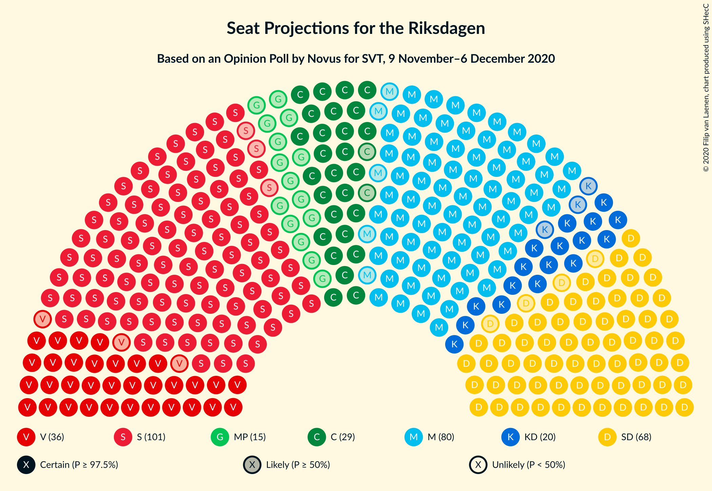
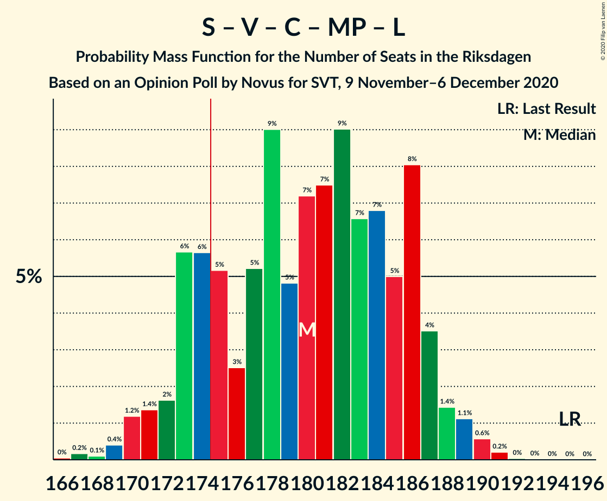
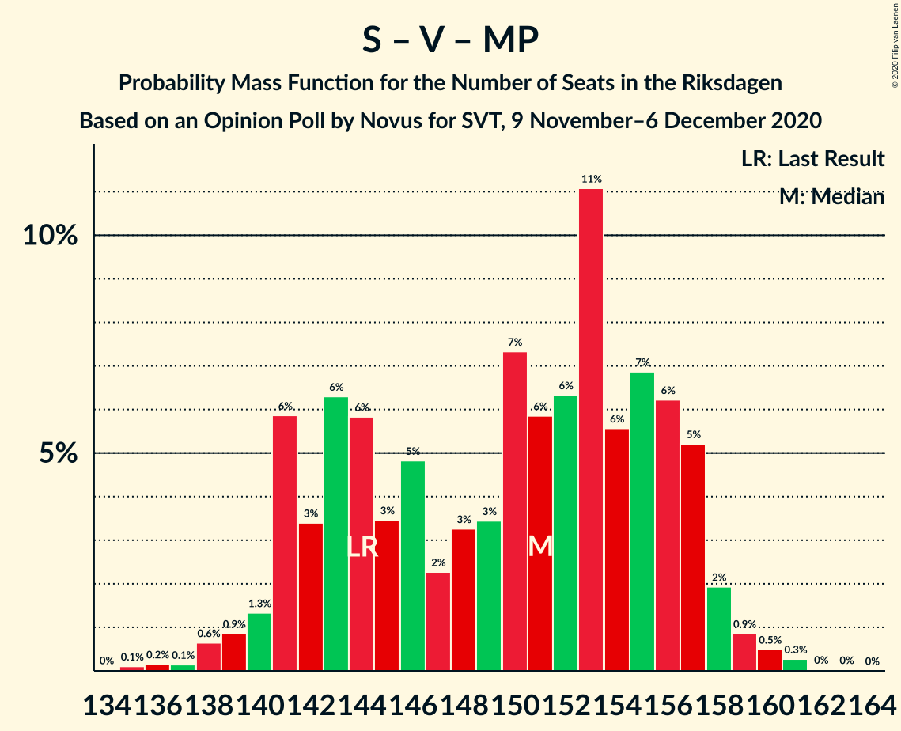
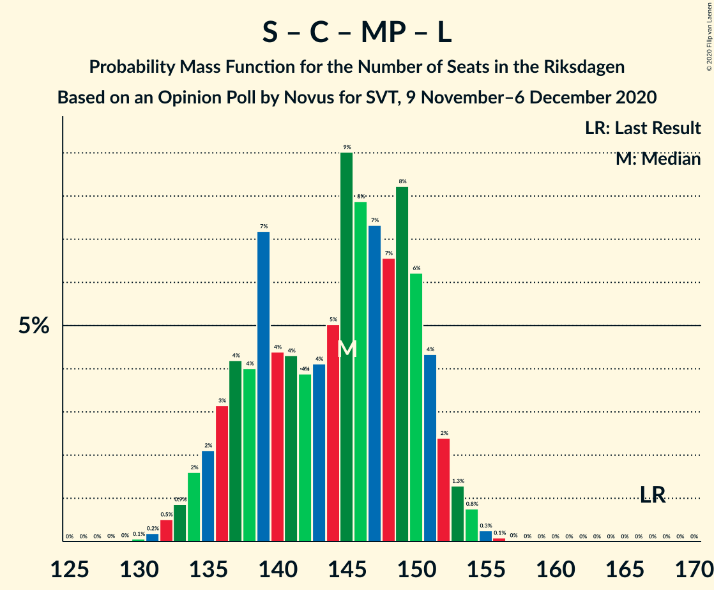
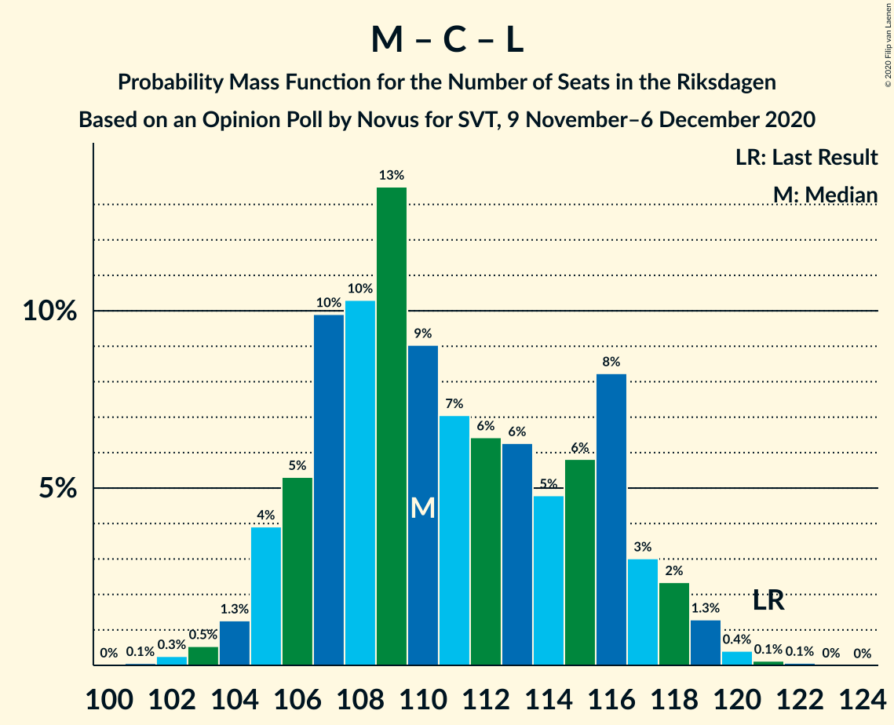

# Opinion Poll by Novus for SVT, 9 November–6 December 2020

<a href="#voting-intentions">Voting Intentions</a> | <a href="#seats">Seats</a> | <a href="#coalitions">Coalitions</a> | <a href="#technical-information">Technical Information</a>

## Voting Intentions

### Confidence Intervals

| Party | Last Result | Poll Result | 80% Confidence Interval | 90% Confidence Interval | 95% Confidence Interval | 99% Confidence Interval |
|:-----:|:-----------:|:-----------:|:-----------------------:|:-----------------------:|:-----------------------:|:-----------------------:|
| Sveriges socialdemokratiska arbetareparti | 28.3% | 28.0% | 27.1–29.0% |26.8–29.2% |26.6–29.5% |26.2–29.9% |
| Moderata samlingspartiet | 19.8% | 21.7% | 20.9–22.6% |20.6–22.8% |20.4–23.0% |20.0–23.5% |
| Sverigedemokraterna | 17.5% | 18.5% | 17.7–19.3% |17.5–19.6% |17.3–19.8% |16.9–20.2% |
| Vänsterpartiet | 8.0% | 9.7% | 9.1–10.3% |8.9–10.5% |8.8–10.7% |8.5–11.0% |
| Centerpartiet | 8.6% | 8.2% | 7.7–8.8% |7.5–9.0% |7.4–9.1% |7.1–9.4% |
| Kristdemokraterna | 6.3% | 5.4% | 5.0–5.9% |4.8–6.1% |4.7–6.2% |4.5–6.4% |
| Miljöpartiet de gröna | 4.4% | 4.1% | 3.7–4.5% |3.6–4.7% |3.5–4.8% |3.3–5.0% |
| Liberalerna | 5.5% | 2.7% | 2.4–3.1% |2.3–3.2% |2.2–3.3% |2.1–3.5% |

*Note:* The poll result column reflects the actual value used in the calculations. Published results may vary slightly, and in addition be rounded to fewer digits.

## Seats

### Confidence Intervals

| Party | Last Result | Median | 80% Confidence Interval | 90% Confidence Interval | 95% Confidence Interval | 99% Confidence Interval |
|:-----:|:-----------:|:------:|:-----------------------:|:-----------------------:|:-----------------------:|:-----------------------:|
| <a href="#sveriges-socialdemokratiska-arbetareparti">Sveriges socialdemokratiska arbetareparti</a> | 100 | 104 | 100–108 |99–109 |98–110 |96–113 |
| <a href="#moderata-samlingspartiet">Moderata samlingspartiet</a> | 70 | 80 | 76–84 |76–86 |75–86 |74–89 |
| <a href="#sverigedemokraterna">Sverigedemokraterna</a> | 62 | 68 | 66–72 |65–73 |64–74 |62–76 |
| <a href="#vänsterpartiet">Vänsterpartiet</a> | 28 | 36 | 34–39 |33–39 |33–40 |31–41 |
| <a href="#centerpartiet">Centerpartiet</a> | 31 | 30 | 28–33 |28–34 |27–34 |26–35 |
| <a href="#kristdemokraterna">Kristdemokraterna</a> | 22 | 20 | 18–22 |18–22 |17–23 |17–24 |
| <a href="#miljöpartiet-de-gröna">Miljöpartiet de gröna</a> | 16 | 15 | 0–16 |0–17 |0–17 |0–18 |
| <a href="#liberalerna">Liberalerna</a> | 20 | 0 | 0 |0 |0 |0 |

### Sveriges socialdemokratiska arbetareparti

*For a full overview of the results for this party, see the [Sveriges socialdemokratiska arbetareparti](party-sverigessocialdemokratiskaarbetareparti.html) page.*

| Number of Seats | Probability | Accumulated | Special Marks |
|:---------------:|:-----------:|:-----------:|:-------------:|
| 93 | 0% | 100% |  |
| 94 | 0.1% | 99.9% |  |
| 95 | 0.3% | 99.9% |  |
| 96 | 0.6% | 99.5% |  |
| 97 | 1.3% | 99.0% |  |
| 98 | 2% | 98% |  |
| 99 | 4% | 95% |  |
| 100 | 9% | 92% | Last Result |
| 101 | 13% | 83% |  |
| 102 | 10% | 70% |  |
| 103 | 9% | 61% |  |
| 104 | 10% | 52% | Median |
| 105 | 10% | 42% |  |
| 106 | 9% | 31% |  |
| 107 | 9% | 22% |  |
| 108 | 4% | 13% |  |
| 109 | 5% | 9% |  |
| 110 | 3% | 5% |  |
| 111 | 1.1% | 2% |  |
| 112 | 0.6% | 1.2% |  |
| 113 | 0.4% | 0.6% |  |
| 114 | 0.1% | 0.2% |  |
| 115 | 0% | 0.1% |  |
| 116 | 0% | 0% |  |

### Moderata samlingspartiet

*For a full overview of the results for this party, see the [Moderata samlingspartiet](party-moderatasamlingspartiet.html) page.*

| Number of Seats | Probability | Accumulated | Special Marks |
|:---------------:|:-----------:|:-----------:|:-------------:|
| 70 | 0% | 100% | Last Result |
| 71 | 0% | 100% |  |
| 72 | 0.1% | 100% |  |
| 73 | 0.3% | 99.8% |  |
| 74 | 1.1% | 99.6% |  |
| 75 | 3% | 98.5% |  |
| 76 | 6% | 96% |  |
| 77 | 7% | 89% |  |
| 78 | 12% | 82% |  |
| 79 | 10% | 70% |  |
| 80 | 18% | 60% | Median |
| 81 | 8% | 42% |  |
| 82 | 10% | 34% |  |
| 83 | 6% | 24% |  |
| 84 | 10% | 19% |  |
| 85 | 3% | 9% |  |
| 86 | 3% | 6% |  |
| 87 | 0.8% | 2% |  |
| 88 | 0.8% | 1.4% |  |
| 89 | 0.5% | 0.6% |  |
| 90 | 0.1% | 0.1% |  |
| 91 | 0% | 0% |  |

### Sverigedemokraterna

*For a full overview of the results for this party, see the [Sverigedemokraterna](party-sverigedemokraterna.html) page.*

| Number of Seats | Probability | Accumulated | Special Marks |
|:---------------:|:-----------:|:-----------:|:-------------:|
| 61 | 0.1% | 100% |  |
| 62 | 0.7% | 99.9% | Last Result |
| 63 | 2% | 99.2% |  |
| 64 | 1.5% | 98% |  |
| 65 | 5% | 96% |  |
| 66 | 17% | 91% |  |
| 67 | 12% | 74% |  |
| 68 | 16% | 62% | Median |
| 69 | 18% | 46% |  |
| 70 | 7% | 28% |  |
| 71 | 6% | 21% |  |
| 72 | 9% | 15% |  |
| 73 | 3% | 6% |  |
| 74 | 1.1% | 3% |  |
| 75 | 0.7% | 2% |  |
| 76 | 0.6% | 0.8% |  |
| 77 | 0.2% | 0.2% |  |
| 78 | 0% | 0% |  |

### Vänsterpartiet

*For a full overview of the results for this party, see the [Vänsterpartiet](party-vänsterpartiet.html) page.*

| Number of Seats | Probability | Accumulated | Special Marks |
|:---------------:|:-----------:|:-----------:|:-------------:|
| 28 | 0% | 100% | Last Result |
| 29 | 0% | 100% |  |
| 30 | 0.1% | 100% |  |
| 31 | 0.8% | 99.9% |  |
| 32 | 1.2% | 99.1% |  |
| 33 | 7% | 98% |  |
| 34 | 21% | 91% |  |
| 35 | 9% | 70% |  |
| 36 | 20% | 60% | Median |
| 37 | 22% | 41% |  |
| 38 | 6% | 18% |  |
| 39 | 9% | 12% |  |
| 40 | 2% | 3% |  |
| 41 | 0.7% | 0.9% |  |
| 42 | 0.2% | 0.2% |  |
| 43 | 0% | 0% |  |

### Centerpartiet

*For a full overview of the results for this party, see the [Centerpartiet](party-centerpartiet.html) page.*

| Number of Seats | Probability | Accumulated | Special Marks |
|:---------------:|:-----------:|:-----------:|:-------------:|
| 25 | 0.1% | 100% |  |
| 26 | 0.7% | 99.9% |  |
| 27 | 3% | 99.2% |  |
| 28 | 9% | 96% |  |
| 29 | 21% | 87% |  |
| 30 | 21% | 66% | Median |
| 31 | 16% | 44% | Last Result |
| 32 | 14% | 28% |  |
| 33 | 9% | 14% |  |
| 34 | 4% | 5% |  |
| 35 | 1.0% | 1.2% |  |
| 36 | 0.2% | 0.3% |  |
| 37 | 0% | 0.1% |  |
| 38 | 0% | 0% |  |

### Kristdemokraterna

*For a full overview of the results for this party, see the [Kristdemokraterna](party-kristdemokraterna.html) page.*

| Number of Seats | Probability | Accumulated | Special Marks |
|:---------------:|:-----------:|:-----------:|:-------------:|
| 16 | 0.3% | 100% |  |
| 17 | 4% | 99.7% |  |
| 18 | 11% | 96% |  |
| 19 | 15% | 85% |  |
| 20 | 24% | 70% | Median |
| 21 | 31% | 46% |  |
| 22 | 11% | 15% | Last Result |
| 23 | 2% | 4% |  |
| 24 | 0.8% | 1.1% |  |
| 25 | 0.4% | 0.4% |  |
| 26 | 0% | 0% |  |

### Miljöpartiet de gröna

*For a full overview of the results for this party, see the [Miljöpartiet de gröna](party-miljöpartietdegröna.html) page.*

| Number of Seats | Probability | Accumulated | Special Marks |
|:---------------:|:-----------:|:-----------:|:-------------:|
| 0 | 36% | 100% |  |
| 1 | 0% | 64% |  |
| 2 | 0% | 64% |  |
| 3 | 0% | 64% |  |
| 4 | 0% | 64% |  |
| 5 | 0% | 64% |  |
| 6 | 0% | 64% |  |
| 7 | 0% | 64% |  |
| 8 | 0% | 64% |  |
| 9 | 0% | 64% |  |
| 10 | 0% | 64% |  |
| 11 | 0% | 64% |  |
| 12 | 0% | 64% |  |
| 13 | 0% | 64% |  |
| 14 | 0% | 64% |  |
| 15 | 33% | 64% | Median |
| 16 | 21% | 31% | Last Result |
| 17 | 8% | 9% |  |
| 18 | 1.1% | 1.2% |  |
| 19 | 0.1% | 0.2% |  |
| 20 | 0% | 0% |  |

### Liberalerna

*For a full overview of the results for this party, see the [Liberalerna](party-liberalerna.html) page.*

| Number of Seats | Probability | Accumulated | Special Marks |
|:---------------:|:-----------:|:-----------:|:-------------:|
| 0 | 100% | 100% | Median |
| 1 | 0% | 0% |  |
| 2 | 0% | 0% |  |
| 3 | 0% | 0% |  |
| 4 | 0% | 0% |  |
| 5 | 0% | 0% |  |
| 6 | 0% | 0% |  |
| 7 | 0% | 0% |  |
| 8 | 0% | 0% |  |
| 9 | 0% | 0% |  |
| 10 | 0% | 0% |  |
| 11 | 0% | 0% |  |
| 12 | 0% | 0% |  |
| 13 | 0% | 0% |  |
| 14 | 0% | 0% |  |
| 15 | 0% | 0% |  |
| 16 | 0% | 0% |  |
| 17 | 0% | 0% |  |
| 18 | 0% | 0% |  |
| 19 | 0% | 0% |  |
| 20 | 0% | 0% | Last Result |

## Coalitions

### Confidence Intervals

| Coalition | Last Result | Median | Majority? | 80% Confidence Interval | 90% Confidence Interval | 95% Confidence Interval | 99% Confidence Interval |
|:---------:|:-----------:|:------:|:---------:|:-----------------------:|:-----------------------:|:-----------------------:|:-----------------------:|
| Sveriges socialdemokratiska arbetareparti – Moderata samlingspartiet – Centerpartiet | 201 | 212 | 100% | 208–223 | 207–224 | 206–225 | 204–227 |
| Sveriges socialdemokratiska arbetareparti – Moderata samlingspartiet | 170 | 183 | 99.1% | 179–191 | 177–193 | 176–194 | 174–196 |
| Sveriges socialdemokratiska arbetareparti – Vänsterpartiet – Centerpartiet – Miljöpartiet de gröna – Liberalerna | 195 | 180 | 84% | 173–186 | 173–187 | 171–188 | 169–190 |
| Moderata samlingspartiet – Sverigedemokraterna – Kristdemokraterna | 154 | 169 | 16% | 163–176 | 162–176 | 161–178 | 159–180 |
| Sveriges socialdemokratiska arbetareparti – Vänsterpartiet – Miljöpartiet de gröna | 144 | 151 | 0% | 142–156 | 141–157 | 140–158 | 138–160 |
| Moderata samlingspartiet – Sverigedemokraterna | 132 | 148 | 0% | 143–155 | 142–156 | 142–157 | 140–160 |
| Sveriges socialdemokratiska arbetareparti – Centerpartiet – Miljöpartiet de gröna – Liberalerna | 167 | 145 | 0% | 137–150 | 135–151 | 134–152 | 132–154 |
| Sveriges socialdemokratiska arbetareparti – Vänsterpartiet | 128 | 140 | 0% | 135–145 | 133–146 | 132–148 | 131–150 |
| Moderata samlingspartiet – Centerpartiet – Kristdemokraterna – Liberalerna | 143 | 130 | 0% | 125–137 | 125–138 | 124–139 | 123–141 |
| Moderata samlingspartiet – Centerpartiet – Kristdemokraterna | 123 | 130 | 0% | 125–137 | 125–138 | 124–139 | 123–141 |
| Sveriges socialdemokratiska arbetareparti – Miljöpartiet de gröna | 116 | 116 | 0% | 105–121 | 104–121 | 103–122 | 101–124 |
| Moderata samlingspartiet – Centerpartiet – Liberalerna | 121 | 110 | 0% | 106–116 | 105–117 | 105–118 | 103–120 |
| Moderata samlingspartiet – Centerpartiet | 101 | 110 | 0% | 106–116 | 105–117 | 105–118 | 103–120 |

### Sveriges socialdemokratiska arbetareparti – Moderata samlingspartiet – Centerpartiet

| Number of Seats | Probability | Accumulated | Special Marks |
|:---------------:|:-----------:|:-----------:|:-------------:|
| 201 | 0% | 100% | Last Result |
| 202 | 0.1% | 100% |  |
| 203 | 0.1% | 99.9% |  |
| 204 | 0.4% | 99.8% |  |
| 205 | 0.6% | 99.5% |  |
| 206 | 3% | 98.9% |  |
| 207 | 2% | 96% |  |
| 208 | 4% | 94% |  |
| 209 | 7% | 90% |  |
| 210 | 15% | 83% |  |
| 211 | 13% | 67% |  |
| 212 | 6% | 55% |  |
| 213 | 5% | 49% |  |
| 214 | 2% | 44% | Median |
| 215 | 4% | 42% |  |
| 216 | 2% | 38% |  |
| 217 | 2% | 36% |  |
| 218 | 2% | 34% |  |
| 219 | 2% | 32% |  |
| 220 | 4% | 30% |  |
| 221 | 11% | 26% |  |
| 222 | 4% | 15% |  |
| 223 | 4% | 11% |  |
| 224 | 5% | 7% |  |
| 225 | 0.7% | 3% |  |
| 226 | 1.5% | 2% |  |
| 227 | 0.4% | 0.6% |  |
| 228 | 0.1% | 0.2% |  |
| 229 | 0.1% | 0.1% |  |
| 230 | 0% | 0% |  |

### Sveriges socialdemokratiska arbetareparti – Moderata samlingspartiet

| Number of Seats | Probability | Accumulated | Special Marks |
|:---------------:|:-----------:|:-----------:|:-------------:|
| 170 | 0% | 100% | Last Result |
| 171 | 0% | 100% |  |
| 172 | 0.1% | 100% |  |
| 173 | 0.2% | 99.9% |  |
| 174 | 0.6% | 99.7% |  |
| 175 | 1.0% | 99.1% | Majority |
| 176 | 1.3% | 98% |  |
| 177 | 4% | 97% |  |
| 178 | 3% | 93% |  |
| 179 | 7% | 90% |  |
| 180 | 8% | 83% |  |
| 181 | 15% | 75% |  |
| 182 | 7% | 60% |  |
| 183 | 8% | 53% |  |
| 184 | 3% | 45% | Median |
| 185 | 4% | 42% |  |
| 186 | 3% | 37% |  |
| 187 | 7% | 34% |  |
| 188 | 2% | 27% |  |
| 189 | 6% | 25% |  |
| 190 | 5% | 19% |  |
| 191 | 6% | 14% |  |
| 192 | 3% | 8% |  |
| 193 | 2% | 5% |  |
| 194 | 2% | 3% |  |
| 195 | 0.8% | 1.3% |  |
| 196 | 0.3% | 0.6% |  |
| 197 | 0.2% | 0.3% |  |
| 198 | 0.1% | 0.1% |  |
| 199 | 0% | 0% |  |

### Sveriges socialdemokratiska arbetareparti – Vänsterpartiet – Centerpartiet – Miljöpartiet de gröna – Liberalerna

| Number of Seats | Probability | Accumulated | Special Marks |
|:---------------:|:-----------:|:-----------:|:-------------:|
| 166 | 0% | 100% |  |
| 167 | 0.2% | 99.9% |  |
| 168 | 0.1% | 99.8% |  |
| 169 | 0.4% | 99.7% |  |
| 170 | 1.2% | 99.3% |  |
| 171 | 1.4% | 98% |  |
| 172 | 2% | 97% |  |
| 173 | 6% | 95% |  |
| 174 | 6% | 89% |  |
| 175 | 5% | 84% | Majority |
| 176 | 3% | 79% |  |
| 177 | 5% | 76% |  |
| 178 | 9% | 71% |  |
| 179 | 5% | 62% |  |
| 180 | 7% | 57% |  |
| 181 | 7% | 50% |  |
| 182 | 9% | 42% |  |
| 183 | 7% | 33% |  |
| 184 | 7% | 27% |  |
| 185 | 5% | 20% | Median |
| 186 | 8% | 15% |  |
| 187 | 4% | 7% |  |
| 188 | 1.4% | 3% |  |
| 189 | 1.1% | 2% |  |
| 190 | 0.6% | 0.8% |  |
| 191 | 0.2% | 0.3% |  |
| 192 | 0% | 0.1% |  |
| 193 | 0% | 0% |  |
| 194 | 0% | 0% |  |
| 195 | 0% | 0% | Last Result |

### Moderata samlingspartiet – Sverigedemokraterna – Kristdemokraterna

| Number of Seats | Probability | Accumulated | Special Marks |
|:---------------:|:-----------:|:-----------:|:-------------:|
| 154 | 0% | 100% | Last Result |
| 155 | 0% | 100% |  |
| 156 | 0% | 100% |  |
| 157 | 0% | 100% |  |
| 158 | 0.2% | 99.9% |  |
| 159 | 0.6% | 99.7% |  |
| 160 | 1.1% | 99.2% |  |
| 161 | 1.4% | 98% |  |
| 162 | 4% | 97% |  |
| 163 | 8% | 93% |  |
| 164 | 5% | 85% |  |
| 165 | 7% | 80% |  |
| 166 | 7% | 73% |  |
| 167 | 9% | 67% |  |
| 168 | 7% | 58% | Median |
| 169 | 7% | 50% |  |
| 170 | 5% | 43% |  |
| 171 | 9% | 38% |  |
| 172 | 5% | 29% |  |
| 173 | 3% | 24% |  |
| 174 | 5% | 21% |  |
| 175 | 6% | 16% | Majority |
| 176 | 6% | 11% |  |
| 177 | 2% | 5% |  |
| 178 | 1.4% | 3% |  |
| 179 | 1.2% | 2% |  |
| 180 | 0.4% | 0.7% |  |
| 181 | 0.1% | 0.3% |  |
| 182 | 0.2% | 0.2% |  |
| 183 | 0% | 0.1% |  |
| 184 | 0% | 0% |  |

### Sveriges socialdemokratiska arbetareparti – Vänsterpartiet – Miljöpartiet de gröna

| Number of Seats | Probability | Accumulated | Special Marks |
|:---------------:|:-----------:|:-----------:|:-------------:|
| 135 | 0.1% | 100% |  |
| 136 | 0.2% | 99.9% |  |
| 137 | 0.1% | 99.7% |  |
| 138 | 0.6% | 99.6% |  |
| 139 | 0.9% | 98.9% |  |
| 140 | 1.3% | 98% |  |
| 141 | 6% | 97% |  |
| 142 | 3% | 91% |  |
| 143 | 6% | 87% |  |
| 144 | 6% | 81% | Last Result |
| 145 | 3% | 75% |  |
| 146 | 5% | 72% |  |
| 147 | 2% | 67% |  |
| 148 | 3% | 65% |  |
| 149 | 3% | 62% |  |
| 150 | 7% | 58% |  |
| 151 | 6% | 51% |  |
| 152 | 6% | 45% |  |
| 153 | 11% | 39% |  |
| 154 | 6% | 27% |  |
| 155 | 7% | 22% | Median |
| 156 | 6% | 15% |  |
| 157 | 5% | 9% |  |
| 158 | 2% | 4% |  |
| 159 | 0.9% | 2% |  |
| 160 | 0.5% | 0.8% |  |
| 161 | 0.3% | 0.3% |  |
| 162 | 0% | 0.1% |  |
| 163 | 0% | 0% |  |

### Moderata samlingspartiet – Sverigedemokraterna

| Number of Seats | Probability | Accumulated | Special Marks |
|:---------------:|:-----------:|:-----------:|:-------------:|
| 132 | 0% | 100% | Last Result |
| 133 | 0% | 100% |  |
| 134 | 0% | 100% |  |
| 135 | 0% | 100% |  |
| 136 | 0% | 100% |  |
| 137 | 0% | 100% |  |
| 138 | 0.1% | 99.9% |  |
| 139 | 0.3% | 99.8% |  |
| 140 | 0.6% | 99.5% |  |
| 141 | 1.0% | 98.9% |  |
| 142 | 4% | 98% |  |
| 143 | 5% | 94% |  |
| 144 | 5% | 89% |  |
| 145 | 9% | 84% |  |
| 146 | 12% | 75% |  |
| 147 | 6% | 63% |  |
| 148 | 10% | 57% | Median |
| 149 | 7% | 47% |  |
| 150 | 8% | 41% |  |
| 151 | 6% | 33% |  |
| 152 | 6% | 28% |  |
| 153 | 4% | 22% |  |
| 154 | 5% | 18% |  |
| 155 | 4% | 13% |  |
| 156 | 5% | 9% |  |
| 157 | 2% | 4% |  |
| 158 | 1.3% | 2% |  |
| 159 | 0.3% | 1.0% |  |
| 160 | 0.3% | 0.6% |  |
| 161 | 0.2% | 0.3% |  |
| 162 | 0.1% | 0.1% |  |
| 163 | 0% | 0% |  |

### Sveriges socialdemokratiska arbetareparti – Centerpartiet – Miljöpartiet de gröna – Liberalerna

| Number of Seats | Probability | Accumulated | Special Marks |
|:---------------:|:-----------:|:-----------:|:-------------:|
| 130 | 0.1% | 100% |  |
| 131 | 0.2% | 99.9% |  |
| 132 | 0.5% | 99.7% |  |
| 133 | 0.9% | 99.2% |  |
| 134 | 2% | 98% |  |
| 135 | 2% | 97% |  |
| 136 | 3% | 95% |  |
| 137 | 4% | 91% |  |
| 138 | 4% | 87% |  |
| 139 | 7% | 83% |  |
| 140 | 4% | 76% |  |
| 141 | 4% | 72% |  |
| 142 | 4% | 67% |  |
| 143 | 4% | 64% |  |
| 144 | 5% | 59% |  |
| 145 | 9% | 54% |  |
| 146 | 8% | 45% |  |
| 147 | 7% | 37% |  |
| 148 | 7% | 30% |  |
| 149 | 8% | 24% | Median |
| 150 | 6% | 15% |  |
| 151 | 4% | 9% |  |
| 152 | 2% | 5% |  |
| 153 | 1.3% | 2% |  |
| 154 | 0.8% | 1.1% |  |
| 155 | 0.3% | 0.4% |  |
| 156 | 0.1% | 0.1% |  |
| 157 | 0% | 0% |  |
| 158 | 0% | 0% |  |
| 159 | 0% | 0% |  |
| 160 | 0% | 0% |  |
| 161 | 0% | 0% |  |
| 162 | 0% | 0% |  |
| 163 | 0% | 0% |  |
| 164 | 0% | 0% |  |
| 165 | 0% | 0% |  |
| 166 | 0% | 0% |  |
| 167 | 0% | 0% | Last Result |

### Sveriges socialdemokratiska arbetareparti – Vänsterpartiet

| Number of Seats | Probability | Accumulated | Special Marks |
|:---------------:|:-----------:|:-----------:|:-------------:|
| 128 | 0% | 100% | Last Result |
| 129 | 0.1% | 99.9% |  |
| 130 | 0.2% | 99.8% |  |
| 131 | 1.0% | 99.6% |  |
| 132 | 2% | 98.5% |  |
| 133 | 2% | 97% |  |
| 134 | 4% | 95% |  |
| 135 | 6% | 90% |  |
| 136 | 7% | 84% |  |
| 137 | 7% | 77% |  |
| 138 | 12% | 70% |  |
| 139 | 8% | 58% |  |
| 140 | 8% | 51% | Median |
| 141 | 13% | 43% |  |
| 142 | 4% | 31% |  |
| 143 | 8% | 26% |  |
| 144 | 6% | 19% |  |
| 145 | 4% | 12% |  |
| 146 | 4% | 9% |  |
| 147 | 1.4% | 4% |  |
| 148 | 1.3% | 3% |  |
| 149 | 0.9% | 2% |  |
| 150 | 0.6% | 1.0% |  |
| 151 | 0.2% | 0.4% |  |
| 152 | 0.1% | 0.2% |  |
| 153 | 0% | 0% |  |

### Moderata samlingspartiet – Centerpartiet – Kristdemokraterna – Liberalerna

| Number of Seats | Probability | Accumulated | Special Marks |
|:---------------:|:-----------:|:-----------:|:-------------:|
| 120 | 0% | 100% |  |
| 121 | 0.1% | 99.9% |  |
| 122 | 0.3% | 99.8% |  |
| 123 | 0.9% | 99.5% |  |
| 124 | 3% | 98.6% |  |
| 125 | 6% | 96% |  |
| 126 | 4% | 90% |  |
| 127 | 9% | 85% |  |
| 128 | 9% | 76% |  |
| 129 | 8% | 68% |  |
| 130 | 11% | 60% | Median |
| 131 | 9% | 49% |  |
| 132 | 4% | 39% |  |
| 133 | 5% | 35% |  |
| 134 | 6% | 30% |  |
| 135 | 5% | 24% |  |
| 136 | 8% | 18% |  |
| 137 | 2% | 10% |  |
| 138 | 5% | 8% |  |
| 139 | 2% | 3% |  |
| 140 | 0.9% | 1.5% |  |
| 141 | 0.4% | 0.6% |  |
| 142 | 0.1% | 0.2% |  |
| 143 | 0% | 0.1% | Last Result |
| 144 | 0% | 0% |  |

### Moderata samlingspartiet – Centerpartiet – Kristdemokraterna

| Number of Seats | Probability | Accumulated | Special Marks |
|:---------------:|:-----------:|:-----------:|:-------------:|
| 120 | 0% | 100% |  |
| 121 | 0.1% | 99.9% |  |
| 122 | 0.3% | 99.8% |  |
| 123 | 0.9% | 99.5% | Last Result |
| 124 | 3% | 98.6% |  |
| 125 | 6% | 96% |  |
| 126 | 4% | 90% |  |
| 127 | 9% | 85% |  |
| 128 | 9% | 76% |  |
| 129 | 8% | 68% |  |
| 130 | 11% | 60% | Median |
| 131 | 9% | 49% |  |
| 132 | 4% | 39% |  |
| 133 | 5% | 35% |  |
| 134 | 6% | 30% |  |
| 135 | 5% | 24% |  |
| 136 | 8% | 18% |  |
| 137 | 2% | 10% |  |
| 138 | 5% | 8% |  |
| 139 | 2% | 3% |  |
| 140 | 0.9% | 1.5% |  |
| 141 | 0.4% | 0.6% |  |
| 142 | 0.1% | 0.2% |  |
| 143 | 0% | 0.1% |  |
| 144 | 0% | 0% |  |

### Sveriges socialdemokratiska arbetareparti – Miljöpartiet de gröna

| Number of Seats | Probability | Accumulated | Special Marks |
|:---------------:|:-----------:|:-----------:|:-------------:|
| 99 | 0.1% | 100% |  |
| 100 | 0.2% | 99.9% |  |
| 101 | 0.6% | 99.7% |  |
| 102 | 1.0% | 99.1% |  |
| 103 | 1.4% | 98% |  |
| 104 | 2% | 97% |  |
| 105 | 6% | 94% |  |
| 106 | 5% | 88% |  |
| 107 | 8% | 84% |  |
| 108 | 3% | 76% |  |
| 109 | 4% | 73% |  |
| 110 | 3% | 68% |  |
| 111 | 1.5% | 66% |  |
| 112 | 1.4% | 64% |  |
| 113 | 2% | 63% |  |
| 114 | 3% | 61% |  |
| 115 | 6% | 58% |  |
| 116 | 13% | 52% | Last Result |
| 117 | 7% | 39% |  |
| 118 | 7% | 32% |  |
| 119 | 8% | 25% | Median |
| 120 | 6% | 17% |  |
| 121 | 6% | 11% |  |
| 122 | 3% | 5% |  |
| 123 | 1.1% | 2% |  |
| 124 | 0.5% | 0.8% |  |
| 125 | 0.2% | 0.2% |  |
| 126 | 0.1% | 0.1% |  |
| 127 | 0% | 0% |  |

### Moderata samlingspartiet – Centerpartiet – Liberalerna

| Number of Seats | Probability | Accumulated | Special Marks |
|:---------------:|:-----------:|:-----------:|:-------------:|
| 101 | 0.1% | 100% |  |
| 102 | 0.3% | 99.9% |  |
| 103 | 0.5% | 99.6% |  |
| 104 | 1.3% | 99.1% |  |
| 105 | 4% | 98% |  |
| 106 | 5% | 94% |  |
| 107 | 10% | 89% |  |
| 108 | 10% | 79% |  |
| 109 | 13% | 68% |  |
| 110 | 9% | 55% | Median |
| 111 | 7% | 46% |  |
| 112 | 6% | 39% |  |
| 113 | 6% | 32% |  |
| 114 | 5% | 26% |  |
| 115 | 6% | 21% |  |
| 116 | 8% | 16% |  |
| 117 | 3% | 7% |  |
| 118 | 2% | 4% |  |
| 119 | 1.3% | 2% |  |
| 120 | 0.4% | 0.6% |  |
| 121 | 0.1% | 0.2% | Last Result |
| 122 | 0.1% | 0.1% |  |
| 123 | 0% | 0% |  |

### Moderata samlingspartiet – Centerpartiet

| Number of Seats | Probability | Accumulated | Special Marks |
|:---------------:|:-----------:|:-----------:|:-------------:|
| 101 | 0.1% | 100% | Last Result |
| 102 | 0.3% | 99.9% |  |
| 103 | 0.5% | 99.6% |  |
| 104 | 1.3% | 99.1% |  |
| 105 | 4% | 98% |  |
| 106 | 5% | 94% |  |
| 107 | 10% | 89% |  |
| 108 | 10% | 79% |  |
| 109 | 13% | 68% |  |
| 110 | 9% | 55% | Median |
| 111 | 7% | 46% |  |
| 112 | 6% | 39% |  |
| 113 | 6% | 32% |  |
| 114 | 5% | 26% |  |
| 115 | 6% | 21% |  |
| 116 | 8% | 16% |  |
| 117 | 3% | 7% |  |
| 118 | 2% | 4% |  |
| 119 | 1.3% | 2% |  |
| 120 | 0.4% | 0.6% |  |
| 121 | 0.1% | 0.2% |  |
| 122 | 0.1% | 0.1% |  |
| 123 | 0% | 0% |  |

## Technical Information

### Opinion Poll

+ **Polling firm:** Novus
+ **Commissioner(s):** SVT
+ **Fieldwork period:** 9 November–6 December 2020

### Calculations

+ **Sample size:** 3813
+ **Simulations done:** 1,048,576
+ **Error estimate:** 0.75%

