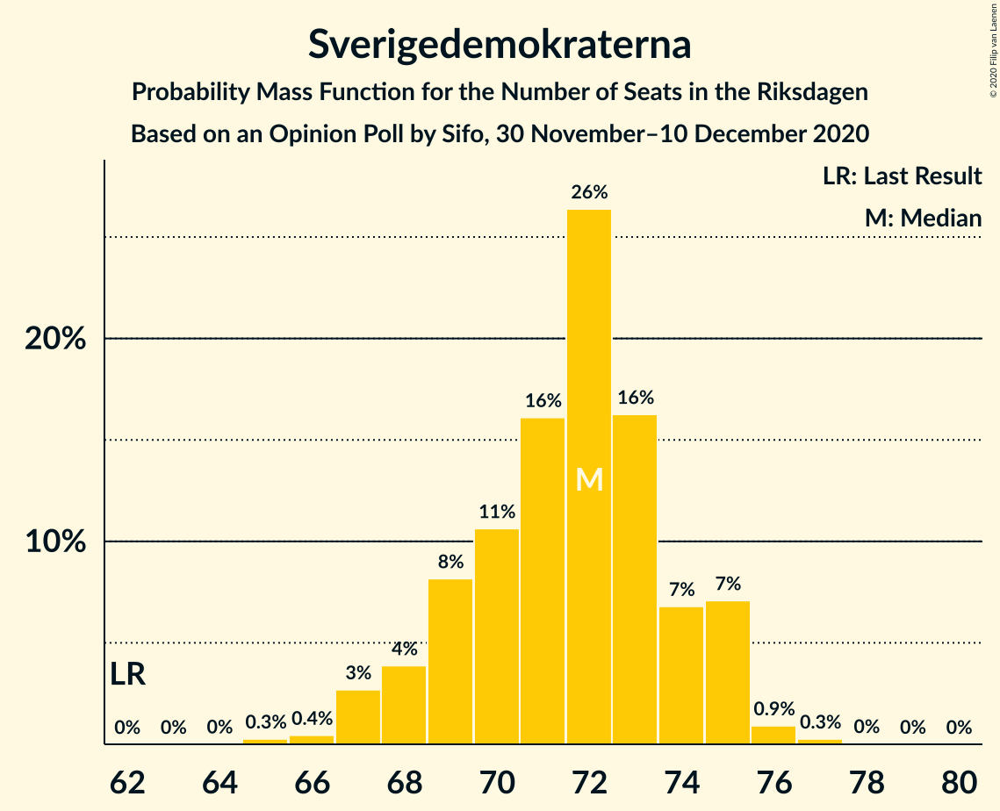

# Opinion Poll by Sifo, 30 November–10 December 2020

<a href="#voting-intentions">Voting Intentions</a> | <a href="#seats">Seats</a> | <a href="#coalitions">Coalitions</a> | <a href="#technical-information">Technical Information</a>

## Voting Intentions

### Confidence Intervals

| Party | Last Result | Poll Result | 80% Confidence Interval | 90% Confidence Interval | 95% Confidence Interval | 99% Confidence Interval |
|:-----:|:-----------:|:-----------:|:-----------------------:|:-----------------------:|:-----------------------:|:-----------------------:|
| Sveriges socialdemokratiska arbetareparti | 28.3% | 27.8% | 27.1–28.5% |26.9–28.7% |26.7–28.8% |26.4–29.1% |
| Moderata samlingspartiet | 19.8% | 21.7% | 21.1–22.3% |20.9–22.5% |20.7–22.6% |20.5–22.9% |
| Sverigedemokraterna | 17.5% | 18.9% | 18.3–19.5% |18.1–19.7% |18.0–19.8% |17.7–20.1% |
| Vänsterpartiet | 8.0% | 10.3% | 9.8–10.8% |9.7–10.9% |9.6–11.0% |9.4–11.2% |
| Centerpartiet | 8.6% | 7.7% | 7.3–8.1% |7.2–8.2% |7.1–8.3% |6.9–8.5% |
| Kristdemokraterna | 6.3% | 5.4% | 5.1–5.7% |5.0–5.9% |4.9–5.9% |4.7–6.1% |
| Miljöpartiet de gröna | 4.4% | 3.7% | 3.4–4.0% |3.4–4.1% |3.3–4.2% |3.2–4.3% |
| Liberalerna | 5.5% | 3.0% | 2.7–3.3% |2.7–3.4% |2.6–3.4% |2.5–3.6% |

*Note:* The poll result column reflects the actual value used in the calculations. Published results may vary slightly, and in addition be rounded to fewer digits.

## Seats

### Confidence Intervals

| Party | Last Result | Median | 80% Confidence Interval | 90% Confidence Interval | 95% Confidence Interval | 99% Confidence Interval |
|:-----:|:-----------:|:------:|:-----------------------:|:-----------------------:|:-----------------------:|:-----------------------:|
| <a href="#sveriges-socialdemokratiska-arbetareparti">Sveriges socialdemokratiska arbetareparti</a> | 100 | 106 | 102–108 |101–109 |100–109 |98–111 |
| <a href="#moderata-samlingspartiet">Moderata samlingspartiet</a> | 70 | 82 | 79–85 |78–85 |77–86 |76–87 |
| <a href="#sverigedemokraterna">Sverigedemokraterna</a> | 62 | 72 | 69–74 |68–75 |67–75 |66–76 |
| <a href="#vänsterpartiet">Vänsterpartiet</a> | 28 | 39 | 37–41 |37–41 |36–42 |35–43 |
| <a href="#centerpartiet">Centerpartiet</a> | 31 | 29 | 28–31 |27–31 |27–32 |26–32 |
| <a href="#kristdemokraterna">Kristdemokraterna</a> | 22 | 21 | 19–22 |19–22 |18–22 |18–23 |
| <a href="#miljöpartiet-de-gröna">Miljöpartiet de gröna</a> | 16 | 0 | 0 |0–15 |0–15 |0–16 |
| <a href="#liberalerna">Liberalerna</a> | 20 | 0 | 0 |0 |0 |0 |

### Sveriges socialdemokratiska arbetareparti

*For a full overview of the results for this party, see the [Sveriges socialdemokratiska arbetareparti](party-sverigessocialdemokratiskaarbetareparti.html) page.*

| Number of Seats | Probability | Accumulated | Special Marks |
|:---------------:|:-----------:|:-----------:|:-------------:|
| 96 | 0% | 100% |  |
| 97 | 0.2% | 99.9% |  |
| 98 | 0.8% | 99.8% |  |
| 99 | 0.8% | 99.0% |  |
| 100 | 1.4% | 98% | Last Result |
| 101 | 4% | 97% |  |
| 102 | 4% | 92% |  |
| 103 | 13% | 88% |  |
| 104 | 8% | 75% |  |
| 105 | 15% | 67% |  |
| 106 | 19% | 52% | Median |
| 107 | 19% | 32% |  |
| 108 | 7% | 13% |  |
| 109 | 4% | 6% |  |
| 110 | 1.4% | 2% |  |
| 111 | 0.7% | 0.8% |  |
| 112 | 0.1% | 0.1% |  |
| 113 | 0% | 0% |  |

### Moderata samlingspartiet

*For a full overview of the results for this party, see the [Moderata samlingspartiet](party-moderatasamlingspartiet.html) page.*

| Number of Seats | Probability | Accumulated | Special Marks |
|:---------------:|:-----------:|:-----------:|:-------------:|
| 70 | 0% | 100% | Last Result |
| 71 | 0% | 100% |  |
| 72 | 0% | 100% |  |
| 73 | 0% | 100% |  |
| 74 | 0% | 100% |  |
| 75 | 0.3% | 100% |  |
| 76 | 0.5% | 99.6% |  |
| 77 | 2% | 99.1% |  |
| 78 | 3% | 97% |  |
| 79 | 5% | 94% |  |
| 80 | 12% | 90% |  |
| 81 | 17% | 78% |  |
| 82 | 16% | 61% | Median |
| 83 | 17% | 45% |  |
| 84 | 18% | 28% |  |
| 85 | 6% | 10% |  |
| 86 | 3% | 4% |  |
| 87 | 1.0% | 1.3% |  |
| 88 | 0.2% | 0.3% |  |
| 89 | 0.1% | 0.1% |  |
| 90 | 0% | 0% |  |

### Sverigedemokraterna

*For a full overview of the results for this party, see the [Sverigedemokraterna](party-sverigedemokraterna.html) page.*

| Number of Seats | Probability | Accumulated | Special Marks |
|:---------------:|:-----------:|:-----------:|:-------------:|
| 62 | 0% | 100% | Last Result |
| 63 | 0% | 100% |  |
| 64 | 0% | 100% |  |
| 65 | 0.3% | 100% |  |
| 66 | 0.4% | 99.7% |  |
| 67 | 3% | 99.3% |  |
| 68 | 4% | 97% |  |
| 69 | 8% | 93% |  |
| 70 | 11% | 85% |  |
| 71 | 16% | 74% |  |
| 72 | 26% | 58% | Median |
| 73 | 16% | 31% |  |
| 74 | 7% | 15% |  |
| 75 | 7% | 8% |  |
| 76 | 0.9% | 1.2% |  |
| 77 | 0.3% | 0.3% |  |
| 78 | 0% | 0.1% |  |
| 79 | 0% | 0% |  |

### Vänsterpartiet

*For a full overview of the results for this party, see the [Vänsterpartiet](party-vänsterpartiet.html) page.*

| Number of Seats | Probability | Accumulated | Special Marks |
|:---------------:|:-----------:|:-----------:|:-------------:|
| 28 | 0% | 100% | Last Result |
| 29 | 0% | 100% |  |
| 30 | 0% | 100% |  |
| 31 | 0% | 100% |  |
| 32 | 0% | 100% |  |
| 33 | 0% | 100% |  |
| 34 | 0.1% | 100% |  |
| 35 | 0.6% | 99.9% |  |
| 36 | 3% | 99.3% |  |
| 37 | 13% | 97% |  |
| 38 | 18% | 84% |  |
| 39 | 27% | 66% | Median |
| 40 | 25% | 38% |  |
| 41 | 9% | 14% |  |
| 42 | 4% | 4% |  |
| 43 | 0.5% | 0.6% |  |
| 44 | 0.1% | 0.1% |  |
| 45 | 0% | 0% |  |

### Centerpartiet

*For a full overview of the results for this party, see the [Centerpartiet](party-centerpartiet.html) page.*

| Number of Seats | Probability | Accumulated | Special Marks |
|:---------------:|:-----------:|:-----------:|:-------------:|
| 25 | 0.1% | 100% |  |
| 26 | 2% | 99.8% |  |
| 27 | 8% | 98% |  |
| 28 | 21% | 90% |  |
| 29 | 31% | 69% | Median |
| 30 | 23% | 38% |  |
| 31 | 12% | 15% | Last Result |
| 32 | 3% | 3% |  |
| 33 | 0.3% | 0.3% |  |
| 34 | 0% | 0% |  |

### Kristdemokraterna

*For a full overview of the results for this party, see the [Kristdemokraterna](party-kristdemokraterna.html) page.*

| Number of Seats | Probability | Accumulated | Special Marks |
|:---------------:|:-----------:|:-----------:|:-------------:|
| 17 | 0.1% | 100% |  |
| 18 | 3% | 99.9% |  |
| 19 | 15% | 97% |  |
| 20 | 30% | 83% |  |
| 21 | 36% | 53% | Median |
| 22 | 14% | 16% | Last Result |
| 23 | 2% | 2% |  |
| 24 | 0.3% | 0.3% |  |
| 25 | 0% | 0% |  |

### Miljöpartiet de gröna

*For a full overview of the results for this party, see the [Miljöpartiet de gröna](party-miljöpartietdegröna.html) page.*

| Number of Seats | Probability | Accumulated | Special Marks |
|:---------------:|:-----------:|:-----------:|:-------------:|
| 0 | 91% | 100% | Median |
| 1 | 0% | 9% |  |
| 2 | 0% | 9% |  |
| 3 | 0% | 9% |  |
| 4 | 0% | 9% |  |
| 5 | 0% | 9% |  |
| 6 | 0% | 9% |  |
| 7 | 0% | 9% |  |
| 8 | 0% | 9% |  |
| 9 | 0% | 9% |  |
| 10 | 0% | 9% |  |
| 11 | 0% | 9% |  |
| 12 | 0% | 9% |  |
| 13 | 0% | 9% |  |
| 14 | 0% | 9% |  |
| 15 | 8% | 9% |  |
| 16 | 1.0% | 1.1% | Last Result |
| 17 | 0% | 0% |  |

### Liberalerna

*For a full overview of the results for this party, see the [Liberalerna](party-liberalerna.html) page.*

| Number of Seats | Probability | Accumulated | Special Marks |
|:---------------:|:-----------:|:-----------:|:-------------:|
| 0 | 100% | 100% | Median |
| 1 | 0% | 0% |  |
| 2 | 0% | 0% |  |
| 3 | 0% | 0% |  |
| 4 | 0% | 0% |  |
| 5 | 0% | 0% |  |
| 6 | 0% | 0% |  |
| 7 | 0% | 0% |  |
| 8 | 0% | 0% |  |
| 9 | 0% | 0% |  |
| 10 | 0% | 0% |  |
| 11 | 0% | 0% |  |
| 12 | 0% | 0% |  |
| 13 | 0% | 0% |  |
| 14 | 0% | 0% |  |
| 15 | 0% | 0% |  |
| 16 | 0% | 0% |  |
| 17 | 0% | 0% |  |
| 18 | 0% | 0% |  |
| 19 | 0% | 0% |  |
| 20 | 0% | 0% | Last Result |

## Coalitions

### Confidence Intervals

| Coalition | Last Result | Median | Majority? | 80% Confidence Interval | 90% Confidence Interval | 95% Confidence Interval | 99% Confidence Interval |
|:---------:|:-----------:|:------:|:---------:|:-----------------------:|:-----------------------:|:-----------------------:|:-----------------------:|
| Sveriges socialdemokratiska arbetareparti – Moderata samlingspartiet – Centerpartiet | 201 | 217 | 100% | 212–219 | 209–221 | 206–221 | 204–223 |
| Sveriges socialdemokratiska arbetareparti – Moderata samlingspartiet | 170 | 188 | 100% | 183–191 | 180–191 | 179–192 | 176–193 |
| Sveriges socialdemokratiska arbetareparti – Vänsterpartiet – Centerpartiet – Miljöpartiet de gröna – Liberalerna | 195 | 174 | 49% | 171–179 | 171–182 | 170–183 | 169–185 |
| Moderata samlingspartiet – Sverigedemokraterna – Kristdemokraterna | 154 | 175 | 51% | 170–178 | 167–178 | 166–179 | 164–180 |
| Moderata samlingspartiet – Sverigedemokraterna | 132 | 154 | 0% | 150–157 | 148–158 | 146–158 | 144–160 |
| Sveriges socialdemokratiska arbetareparti – Vänsterpartiet – Miljöpartiet de gröna | 144 | 145 | 0% | 142–150 | 142–154 | 141–155 | 140–157 |
| Sveriges socialdemokratiska arbetareparti – Vänsterpartiet | 128 | 145 | 0% | 141–147 | 139–148 | 137–149 | 135–150 |
| Sveriges socialdemokratiska arbetareparti – Centerpartiet – Miljöpartiet de gröna – Liberalerna | 167 | 135 | 0% | 132–140 | 131–144 | 131–146 | 130–147 |
| Moderata samlingspartiet – Centerpartiet – Kristdemokraterna – Liberalerna | 143 | 132 | 0% | 128–135 | 127–136 | 125–136 | 123–138 |
| Moderata samlingspartiet – Centerpartiet – Kristdemokraterna | 123 | 132 | 0% | 128–135 | 127–136 | 125–136 | 123–138 |
| Sveriges socialdemokratiska arbetareparti – Miljöpartiet de gröna | 116 | 106 | 0% | 103–111 | 102–116 | 102–118 | 101–119 |
| Moderata samlingspartiet – Centerpartiet – Liberalerna | 121 | 111 | 0% | 108–114 | 107–115 | 106–115 | 103–117 |
| Moderata samlingspartiet – Centerpartiet | 101 | 111 | 0% | 108–114 | 107–115 | 106–115 | 103–117 |

### Sveriges socialdemokratiska arbetareparti – Moderata samlingspartiet – Centerpartiet

| Number of Seats | Probability | Accumulated | Special Marks |
|:---------------:|:-----------:|:-----------:|:-------------:|
| 201 | 0% | 100% | Last Result |
| 202 | 0% | 100% |  |
| 203 | 0% | 100% |  |
| 204 | 0.8% | 99.9% |  |
| 205 | 0.2% | 99.1% |  |
| 206 | 2% | 98.9% |  |
| 207 | 0.8% | 97% |  |
| 208 | 0.4% | 96% |  |
| 209 | 3% | 96% |  |
| 210 | 0.6% | 92% |  |
| 211 | 1.2% | 92% |  |
| 212 | 0.6% | 91% |  |
| 213 | 1.1% | 90% |  |
| 214 | 7% | 89% |  |
| 215 | 0.9% | 82% |  |
| 216 | 30% | 81% |  |
| 217 | 9% | 51% | Median |
| 218 | 15% | 42% |  |
| 219 | 18% | 27% |  |
| 220 | 2% | 9% |  |
| 221 | 5% | 7% |  |
| 222 | 2% | 2% |  |
| 223 | 0.2% | 0.5% |  |
| 224 | 0.3% | 0.3% |  |
| 225 | 0% | 0% |  |

### Sveriges socialdemokratiska arbetareparti – Moderata samlingspartiet

| Number of Seats | Probability | Accumulated | Special Marks |
|:---------------:|:-----------:|:-----------:|:-------------:|
| 170 | 0% | 100% | Last Result |
| 171 | 0% | 100% |  |
| 172 | 0% | 100% |  |
| 173 | 0% | 100% |  |
| 174 | 0% | 100% |  |
| 175 | 0.1% | 100% | Majority |
| 176 | 0.4% | 99.8% |  |
| 177 | 0.8% | 99.5% |  |
| 178 | 0.9% | 98.7% |  |
| 179 | 2% | 98% |  |
| 180 | 1.3% | 96% |  |
| 181 | 2% | 95% |  |
| 182 | 1.1% | 93% |  |
| 183 | 2% | 91% |  |
| 184 | 2% | 90% |  |
| 185 | 6% | 88% |  |
| 186 | 11% | 81% |  |
| 187 | 19% | 70% |  |
| 188 | 13% | 52% | Median |
| 189 | 16% | 38% |  |
| 190 | 10% | 22% |  |
| 191 | 8% | 12% |  |
| 192 | 2% | 4% |  |
| 193 | 1.5% | 2% |  |
| 194 | 0.3% | 0.5% |  |
| 195 | 0.1% | 0.1% |  |
| 196 | 0% | 0% |  |

### Sveriges socialdemokratiska arbetareparti – Vänsterpartiet – Centerpartiet – Miljöpartiet de gröna – Liberalerna

| Number of Seats | Probability | Accumulated | Special Marks |
|:---------------:|:-----------:|:-----------:|:-------------:|
| 167 | 0.1% | 100% |  |
| 168 | 0.3% | 99.9% |  |
| 169 | 2% | 99.6% |  |
| 170 | 2% | 98% |  |
| 171 | 7% | 96% |  |
| 172 | 13% | 89% |  |
| 173 | 12% | 76% |  |
| 174 | 15% | 64% | Median |
| 175 | 15% | 49% | Majority |
| 176 | 13% | 34% |  |
| 177 | 8% | 21% |  |
| 178 | 3% | 13% |  |
| 179 | 2% | 11% |  |
| 180 | 1.1% | 9% |  |
| 181 | 2% | 7% |  |
| 182 | 2% | 5% |  |
| 183 | 1.4% | 4% |  |
| 184 | 0.5% | 2% |  |
| 185 | 1.2% | 2% |  |
| 186 | 0.3% | 0.4% |  |
| 187 | 0.1% | 0.1% |  |
| 188 | 0% | 0% |  |
| 189 | 0% | 0% |  |
| 190 | 0% | 0% |  |
| 191 | 0% | 0% |  |
| 192 | 0% | 0% |  |
| 193 | 0% | 0% |  |
| 194 | 0% | 0% |  |
| 195 | 0% | 0% | Last Result |

### Moderata samlingspartiet – Sverigedemokraterna – Kristdemokraterna

| Number of Seats | Probability | Accumulated | Special Marks |
|:---------------:|:-----------:|:-----------:|:-------------:|
| 154 | 0% | 100% | Last Result |
| 155 | 0% | 100% |  |
| 156 | 0% | 100% |  |
| 157 | 0% | 100% |  |
| 158 | 0% | 100% |  |
| 159 | 0% | 100% |  |
| 160 | 0% | 100% |  |
| 161 | 0% | 100% |  |
| 162 | 0.1% | 100% |  |
| 163 | 0.3% | 99.9% |  |
| 164 | 1.2% | 99.6% |  |
| 165 | 0.5% | 98% |  |
| 166 | 1.4% | 98% |  |
| 167 | 2% | 96% |  |
| 168 | 2% | 95% |  |
| 169 | 1.1% | 93% |  |
| 170 | 2% | 91% |  |
| 171 | 3% | 89% |  |
| 172 | 8% | 87% |  |
| 173 | 13% | 79% |  |
| 174 | 15% | 66% |  |
| 175 | 15% | 51% | Median, Majority |
| 176 | 12% | 36% |  |
| 177 | 13% | 24% |  |
| 178 | 7% | 11% |  |
| 179 | 2% | 4% |  |
| 180 | 2% | 2% |  |
| 181 | 0.3% | 0.4% |  |
| 182 | 0.1% | 0.1% |  |
| 183 | 0% | 0% |  |

### Moderata samlingspartiet – Sverigedemokraterna

| Number of Seats | Probability | Accumulated | Special Marks |
|:---------------:|:-----------:|:-----------:|:-------------:|
| 132 | 0% | 100% | Last Result |
| 133 | 0% | 100% |  |
| 134 | 0% | 100% |  |
| 135 | 0% | 100% |  |
| 136 | 0% | 100% |  |
| 137 | 0% | 100% |  |
| 138 | 0% | 100% |  |
| 139 | 0% | 100% |  |
| 140 | 0% | 100% |  |
| 141 | 0% | 100% |  |
| 142 | 0% | 100% |  |
| 143 | 0.1% | 100% |  |
| 144 | 1.0% | 99.8% |  |
| 145 | 0.4% | 98.9% |  |
| 146 | 2% | 98% |  |
| 147 | 1.3% | 97% |  |
| 148 | 2% | 95% |  |
| 149 | 2% | 93% |  |
| 150 | 3% | 91% |  |
| 151 | 6% | 88% |  |
| 152 | 10% | 82% |  |
| 153 | 17% | 73% |  |
| 154 | 15% | 56% | Median |
| 155 | 12% | 42% |  |
| 156 | 13% | 29% |  |
| 157 | 10% | 16% |  |
| 158 | 4% | 6% |  |
| 159 | 1.2% | 2% |  |
| 160 | 0.7% | 0.8% |  |
| 161 | 0.2% | 0.2% |  |
| 162 | 0% | 0% |  |

### Sveriges socialdemokratiska arbetareparti – Vänsterpartiet – Miljöpartiet de gröna

| Number of Seats | Probability | Accumulated | Special Marks |
|:---------------:|:-----------:|:-----------:|:-------------:|
| 138 | 0.1% | 100% |  |
| 139 | 0.4% | 99.9% |  |
| 140 | 2% | 99.5% |  |
| 141 | 3% | 98% |  |
| 142 | 9% | 95% |  |
| 143 | 13% | 87% |  |
| 144 | 13% | 74% | Last Result |
| 145 | 14% | 61% | Median |
| 146 | 17% | 46% |  |
| 147 | 12% | 29% |  |
| 148 | 4% | 17% |  |
| 149 | 3% | 14% |  |
| 150 | 1.0% | 10% |  |
| 151 | 0.9% | 9% |  |
| 152 | 1.4% | 8% |  |
| 153 | 2% | 7% |  |
| 154 | 1.4% | 5% |  |
| 155 | 1.5% | 4% |  |
| 156 | 2% | 2% |  |
| 157 | 0.4% | 0.8% |  |
| 158 | 0.3% | 0.4% |  |
| 159 | 0.1% | 0.1% |  |
| 160 | 0% | 0% |  |

### Sveriges socialdemokratiska arbetareparti – Vänsterpartiet

| Number of Seats | Probability | Accumulated | Special Marks |
|:---------------:|:-----------:|:-----------:|:-------------:|
| 128 | 0% | 100% | Last Result |
| 129 | 0% | 100% |  |
| 130 | 0% | 100% |  |
| 131 | 0% | 100% |  |
| 132 | 0% | 100% |  |
| 133 | 0% | 100% |  |
| 134 | 0.1% | 100% |  |
| 135 | 0.4% | 99.8% |  |
| 136 | 0.7% | 99.4% |  |
| 137 | 1.3% | 98.7% |  |
| 138 | 2% | 97% |  |
| 139 | 2% | 95% |  |
| 140 | 3% | 94% |  |
| 141 | 4% | 91% |  |
| 142 | 9% | 87% |  |
| 143 | 13% | 77% |  |
| 144 | 13% | 65% |  |
| 145 | 14% | 51% | Median |
| 146 | 17% | 37% |  |
| 147 | 12% | 19% |  |
| 148 | 4% | 8% |  |
| 149 | 3% | 4% |  |
| 150 | 0.5% | 1.0% |  |
| 151 | 0.4% | 0.4% |  |
| 152 | 0% | 0.1% |  |
| 153 | 0% | 0% |  |

### Sveriges socialdemokratiska arbetareparti – Centerpartiet – Miljöpartiet de gröna – Liberalerna

| Number of Seats | Probability | Accumulated | Special Marks |
|:---------------:|:-----------:|:-----------:|:-------------:|
| 128 | 0.1% | 100% |  |
| 129 | 0.2% | 99.9% |  |
| 130 | 1.4% | 99.7% |  |
| 131 | 4% | 98% |  |
| 132 | 9% | 95% |  |
| 133 | 8% | 86% |  |
| 134 | 17% | 78% |  |
| 135 | 16% | 61% | Median |
| 136 | 15% | 46% |  |
| 137 | 12% | 31% |  |
| 138 | 6% | 19% |  |
| 139 | 2% | 13% |  |
| 140 | 1.2% | 11% |  |
| 141 | 1.0% | 10% |  |
| 142 | 0.7% | 9% |  |
| 143 | 2% | 8% |  |
| 144 | 2% | 6% |  |
| 145 | 1.1% | 4% |  |
| 146 | 2% | 3% |  |
| 147 | 1.1% | 1.5% |  |
| 148 | 0.2% | 0.4% |  |
| 149 | 0.1% | 0.2% |  |
| 150 | 0.1% | 0.1% |  |
| 151 | 0% | 0% |  |
| 152 | 0% | 0% |  |
| 153 | 0% | 0% |  |
| 154 | 0% | 0% |  |
| 155 | 0% | 0% |  |
| 156 | 0% | 0% |  |
| 157 | 0% | 0% |  |
| 158 | 0% | 0% |  |
| 159 | 0% | 0% |  |
| 160 | 0% | 0% |  |
| 161 | 0% | 0% |  |
| 162 | 0% | 0% |  |
| 163 | 0% | 0% |  |
| 164 | 0% | 0% |  |
| 165 | 0% | 0% |  |
| 166 | 0% | 0% |  |
| 167 | 0% | 0% | Last Result |

### Moderata samlingspartiet – Centerpartiet – Kristdemokraterna – Liberalerna

| Number of Seats | Probability | Accumulated | Special Marks |
|:---------------:|:-----------:|:-----------:|:-------------:|
| 121 | 0.2% | 100% |  |
| 122 | 0.2% | 99.8% |  |
| 123 | 0.3% | 99.7% |  |
| 124 | 1.3% | 99.4% |  |
| 125 | 0.9% | 98% |  |
| 126 | 2% | 97% |  |
| 127 | 2% | 95% |  |
| 128 | 4% | 93% |  |
| 129 | 6% | 89% |  |
| 130 | 12% | 83% |  |
| 131 | 12% | 71% |  |
| 132 | 19% | 59% | Median |
| 133 | 13% | 40% |  |
| 134 | 14% | 27% |  |
| 135 | 8% | 13% |  |
| 136 | 3% | 5% |  |
| 137 | 1.5% | 2% |  |
| 138 | 0.4% | 0.6% |  |
| 139 | 0.1% | 0.1% |  |
| 140 | 0% | 0% |  |
| 141 | 0% | 0% |  |
| 142 | 0% | 0% |  |
| 143 | 0% | 0% | Last Result |

### Moderata samlingspartiet – Centerpartiet – Kristdemokraterna

| Number of Seats | Probability | Accumulated | Special Marks |
|:---------------:|:-----------:|:-----------:|:-------------:|
| 121 | 0.2% | 100% |  |
| 122 | 0.2% | 99.8% |  |
| 123 | 0.3% | 99.7% | Last Result |
| 124 | 1.3% | 99.4% |  |
| 125 | 0.9% | 98% |  |
| 126 | 2% | 97% |  |
| 127 | 2% | 95% |  |
| 128 | 4% | 93% |  |
| 129 | 6% | 89% |  |
| 130 | 12% | 83% |  |
| 131 | 12% | 71% |  |
| 132 | 19% | 59% | Median |
| 133 | 13% | 40% |  |
| 134 | 14% | 27% |  |
| 135 | 8% | 13% |  |
| 136 | 3% | 5% |  |
| 137 | 1.5% | 2% |  |
| 138 | 0.4% | 0.6% |  |
| 139 | 0.1% | 0.1% |  |
| 140 | 0% | 0% |  |

### Sveriges socialdemokratiska arbetareparti – Miljöpartiet de gröna

| Number of Seats | Probability | Accumulated | Special Marks |
|:---------------:|:-----------:|:-----------:|:-------------:|
| 99 | 0.1% | 100% |  |
| 100 | 0.2% | 99.9% |  |
| 101 | 1.3% | 99.7% |  |
| 102 | 3% | 98% |  |
| 103 | 11% | 95% |  |
| 104 | 8% | 84% |  |
| 105 | 15% | 76% |  |
| 106 | 19% | 61% | Median |
| 107 | 19% | 42% |  |
| 108 | 7% | 23% |  |
| 109 | 4% | 16% |  |
| 110 | 1.4% | 12% |  |
| 111 | 0.7% | 10% |  |
| 112 | 0.3% | 10% |  |
| 113 | 0.7% | 9% |  |
| 114 | 0.5% | 9% |  |
| 115 | 1.4% | 8% |  |
| 116 | 3% | 7% | Last Result |
| 117 | 1.0% | 4% |  |
| 118 | 2% | 3% |  |
| 119 | 0.8% | 1.1% |  |
| 120 | 0.1% | 0.3% |  |
| 121 | 0.1% | 0.2% |  |
| 122 | 0.1% | 0.1% |  |
| 123 | 0% | 0% |  |

### Moderata samlingspartiet – Centerpartiet – Liberalerna

| Number of Seats | Probability | Accumulated | Special Marks |
|:---------------:|:-----------:|:-----------:|:-------------:|
| 102 | 0.1% | 100% |  |
| 103 | 0.5% | 99.9% |  |
| 104 | 0.5% | 99.4% |  |
| 105 | 1.3% | 99.0% |  |
| 106 | 3% | 98% |  |
| 107 | 2% | 95% |  |
| 108 | 5% | 93% |  |
| 109 | 10% | 88% |  |
| 110 | 12% | 79% |  |
| 111 | 21% | 66% | Median |
| 112 | 15% | 46% |  |
| 113 | 13% | 30% |  |
| 114 | 8% | 17% |  |
| 115 | 6% | 8% |  |
| 116 | 1.2% | 2% |  |
| 117 | 0.6% | 0.9% |  |
| 118 | 0.2% | 0.2% |  |
| 119 | 0% | 0% |  |
| 120 | 0% | 0% |  |
| 121 | 0% | 0% | Last Result |

### Moderata samlingspartiet – Centerpartiet

| Number of Seats | Probability | Accumulated | Special Marks |
|:---------------:|:-----------:|:-----------:|:-------------:|
| 101 | 0% | 100% | Last Result |
| 102 | 0.1% | 100% |  |
| 103 | 0.5% | 99.9% |  |
| 104 | 0.5% | 99.4% |  |
| 105 | 1.3% | 99.0% |  |
| 106 | 3% | 98% |  |
| 107 | 2% | 95% |  |
| 108 | 5% | 93% |  |
| 109 | 10% | 88% |  |
| 110 | 12% | 79% |  |
| 111 | 21% | 66% | Median |
| 112 | 15% | 46% |  |
| 113 | 13% | 30% |  |
| 114 | 8% | 17% |  |
| 115 | 6% | 8% |  |
| 116 | 1.2% | 2% |  |
| 117 | 0.6% | 0.9% |  |
| 118 | 0.2% | 0.2% |  |
| 119 | 0% | 0% |  |

## Technical Information

### Opinion Poll

+ **Polling firm:** Sifo
+ **Commissioner(s):** —
+ **Fieldwork period:** 30 November–10 December 2020

### Calculations

+ **Sample size:** 7349
+ **Simulations done:** 1,048,576
+ **Error estimate:** 0.85%

