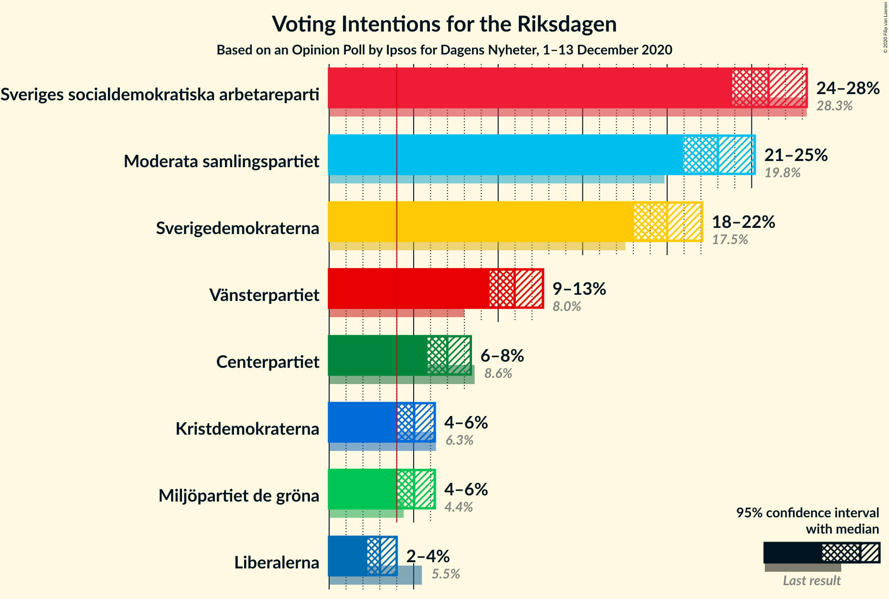
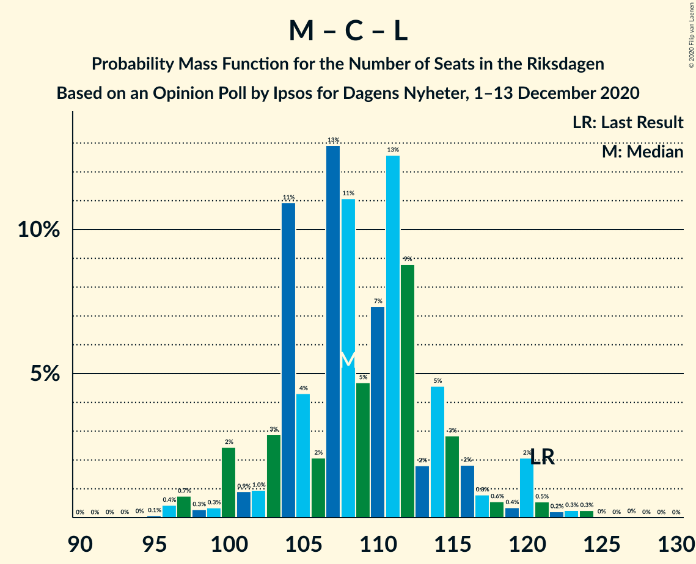

# Opinion Poll by Ipsos for Dagens Nyheter, 1–13 December 2020

<a href="#voting-intentions">Voting Intentions</a> | <a href="#seats">Seats</a> | <a href="#coalitions">Coalitions</a> | <a href="#technical-information">Technical Information</a>

## Voting Intentions

### Confidence Intervals

| Party | Last Result | Poll Result | 80% Confidence Interval | 90% Confidence Interval | 95% Confidence Interval | 99% Confidence Interval |
|:-----:|:-----------:|:-----------:|:-----------------------:|:-----------------------:|:-----------------------:|:-----------------------:|
| Sveriges socialdemokratiska arbetareparti | 28.3% | 26.0% | 24.6–27.5% |24.2–27.9% |23.9–28.3% |23.2–29.0% |
| Moderata samlingspartiet | 19.8% | 23.0% | 21.6–24.4% |21.3–24.8% |20.9–25.2% |20.3–25.9% |
| Sverigedemokraterna | 17.5% | 20.0% | 18.7–21.4% |18.4–21.7% |18.0–22.1% |17.5–22.7% |
| Vänsterpartiet | 8.0% | 11.0% | 10.0–12.1% |9.7–12.4% |9.5–12.7% |9.1–13.2% |
| Centerpartiet | 8.6% | 7.0% | 6.2–7.9% |6.0–8.2% |5.8–8.4% |5.5–8.8% |
| Kristdemokraterna | 6.3% | 5.0% | 4.4–5.8% |4.2–6.1% |4.0–6.2% |3.7–6.6% |
| Miljöpartiet de gröna | 4.4% | 5.0% | 4.4–5.8% |4.2–6.1% |4.0–6.2% |3.7–6.6% |
| Liberalerna | 5.5% | 3.0% | 2.5–3.6% |2.4–3.8% |2.3–4.0% |2.0–4.3% |

*Note:* The poll result column reflects the actual value used in the calculations. Published results may vary slightly, and in addition be rounded to fewer digits.

## Seats

### Confidence Intervals

| Party | Last Result | Median | 80% Confidence Interval | 90% Confidence Interval | 95% Confidence Interval | 99% Confidence Interval |
|:-----:|:-----------:|:------:|:-----------------------:|:-----------------------:|:-----------------------:|:-----------------------:|
| <a href="#sveriges-socialdemokratiska-arbetareparti">Sveriges socialdemokratiska arbetareparti</a> | 100 | 94 | 89–100 |87–101 |86–101 |83–105 |
| <a href="#moderata-samlingspartiet">Moderata samlingspartiet</a> | 70 | 84 | 79–87 |77–89 |75–91 |72–94 |
| <a href="#sverigedemokraterna">Sverigedemokraterna</a> | 62 | 70 | 67–77 |67–79 |66–80 |65–82 |
| <a href="#vänsterpartiet">Vänsterpartiet</a> | 28 | 40 | 36–44 |34–45 |34–46 |33–47 |
| <a href="#centerpartiet">Centerpartiet</a> | 31 | 25 | 22–28 |21–29 |21–31 |19–32 |
| <a href="#kristdemokraterna">Kristdemokraterna</a> | 22 | 19 | 15–21 |15–21 |0–22 |0–24 |
| <a href="#miljöpartiet-de-gröna">Miljöpartiet de gröna</a> | 16 | 17 | 16–21 |16–21 |15–22 |0–23 |
| <a href="#liberalerna">Liberalerna</a> | 20 | 0 | 0 |0 |0–14 |0–15 |

### Sveriges socialdemokratiska arbetareparti

*For a full overview of the results for this party, see the [Sveriges socialdemokratiska arbetareparti](party-sverigessocialdemokratiskaarbetareparti.html) page.*

| Number of Seats | Probability | Accumulated | Special Marks |
|:---------------:|:-----------:|:-----------:|:-------------:|
| 81 | 0.2% | 100% |  |
| 82 | 0.3% | 99.8% |  |
| 83 | 0.3% | 99.5% |  |
| 84 | 0.3% | 99.2% |  |
| 85 | 0.9% | 98.9% |  |
| 86 | 1.0% | 98% |  |
| 87 | 5% | 97% |  |
| 88 | 1.2% | 92% |  |
| 89 | 3% | 91% |  |
| 90 | 12% | 87% |  |
| 91 | 6% | 75% |  |
| 92 | 6% | 70% |  |
| 93 | 9% | 64% |  |
| 94 | 11% | 55% | Median |
| 95 | 15% | 45% |  |
| 96 | 10% | 30% |  |
| 97 | 3% | 19% |  |
| 98 | 2% | 16% |  |
| 99 | 4% | 14% |  |
| 100 | 3% | 10% | Last Result |
| 101 | 6% | 8% |  |
| 102 | 0.7% | 2% |  |
| 103 | 0.2% | 1.5% |  |
| 104 | 0.7% | 1.3% |  |
| 105 | 0.4% | 0.6% |  |
| 106 | 0.1% | 0.2% |  |
| 107 | 0.1% | 0.1% |  |
| 108 | 0% | 0.1% |  |
| 109 | 0% | 0% |  |

### Moderata samlingspartiet

*For a full overview of the results for this party, see the [Moderata samlingspartiet](party-moderatasamlingspartiet.html) page.*

| Number of Seats | Probability | Accumulated | Special Marks |
|:---------------:|:-----------:|:-----------:|:-------------:|
| 70 | 0% | 100% | Last Result |
| 71 | 0.1% | 99.9% |  |
| 72 | 0.7% | 99.8% |  |
| 73 | 0.3% | 99.1% |  |
| 74 | 0.9% | 98.8% |  |
| 75 | 0.6% | 98% |  |
| 76 | 2% | 97% |  |
| 77 | 2% | 96% |  |
| 78 | 3% | 94% |  |
| 79 | 8% | 91% |  |
| 80 | 7% | 82% |  |
| 81 | 13% | 76% |  |
| 82 | 2% | 63% |  |
| 83 | 10% | 60% |  |
| 84 | 5% | 51% | Median |
| 85 | 17% | 45% |  |
| 86 | 11% | 28% |  |
| 87 | 7% | 17% |  |
| 88 | 4% | 10% |  |
| 89 | 3% | 6% |  |
| 90 | 0.7% | 3% |  |
| 91 | 2% | 3% |  |
| 92 | 0.3% | 1.1% |  |
| 93 | 0.3% | 0.8% |  |
| 94 | 0.3% | 0.6% |  |
| 95 | 0.1% | 0.3% |  |
| 96 | 0.1% | 0.2% |  |
| 97 | 0.1% | 0.2% |  |
| 98 | 0.1% | 0.1% |  |
| 99 | 0% | 0% |  |

### Sverigedemokraterna

*For a full overview of the results for this party, see the [Sverigedemokraterna](party-sverigedemokraterna.html) page.*

| Number of Seats | Probability | Accumulated | Special Marks |
|:---------------:|:-----------:|:-----------:|:-------------:|
| 60 | 0% | 100% |  |
| 61 | 0.1% | 99.9% |  |
| 62 | 0.1% | 99.9% | Last Result |
| 63 | 0.1% | 99.8% |  |
| 64 | 0.1% | 99.8% |  |
| 65 | 1.1% | 99.7% |  |
| 66 | 2% | 98.5% |  |
| 67 | 11% | 97% |  |
| 68 | 14% | 86% |  |
| 69 | 20% | 72% |  |
| 70 | 17% | 52% | Median |
| 71 | 13% | 35% |  |
| 72 | 5% | 22% |  |
| 73 | 2% | 17% |  |
| 74 | 2% | 16% |  |
| 75 | 2% | 14% |  |
| 76 | 2% | 12% |  |
| 77 | 1.3% | 11% |  |
| 78 | 4% | 9% |  |
| 79 | 2% | 5% |  |
| 80 | 2% | 3% |  |
| 81 | 0.9% | 2% |  |
| 82 | 0.5% | 0.8% |  |
| 83 | 0.2% | 0.4% |  |
| 84 | 0% | 0.2% |  |
| 85 | 0.1% | 0.1% |  |
| 86 | 0% | 0% |  |

### Vänsterpartiet

*For a full overview of the results for this party, see the [Vänsterpartiet](party-vänsterpartiet.html) page.*

| Number of Seats | Probability | Accumulated | Special Marks |
|:---------------:|:-----------:|:-----------:|:-------------:|
| 28 | 0% | 100% | Last Result |
| 29 | 0% | 100% |  |
| 30 | 0% | 100% |  |
| 31 | 0.1% | 100% |  |
| 32 | 0.4% | 99.9% |  |
| 33 | 1.1% | 99.5% |  |
| 34 | 4% | 98% |  |
| 35 | 3% | 94% |  |
| 36 | 9% | 92% |  |
| 37 | 6% | 83% |  |
| 38 | 6% | 77% |  |
| 39 | 11% | 72% |  |
| 40 | 16% | 60% | Median |
| 41 | 15% | 44% |  |
| 42 | 6% | 29% |  |
| 43 | 7% | 23% |  |
| 44 | 8% | 15% |  |
| 45 | 3% | 7% |  |
| 46 | 3% | 4% |  |
| 47 | 0.8% | 1.3% |  |
| 48 | 0.4% | 0.5% |  |
| 49 | 0.1% | 0.1% |  |
| 50 | 0% | 0.1% |  |
| 51 | 0% | 0% |  |

### Centerpartiet

*For a full overview of the results for this party, see the [Centerpartiet](party-centerpartiet.html) page.*

| Number of Seats | Probability | Accumulated | Special Marks |
|:---------------:|:-----------:|:-----------:|:-------------:|
| 18 | 0.1% | 100% |  |
| 19 | 1.2% | 99.9% |  |
| 20 | 0.7% | 98.6% |  |
| 21 | 3% | 98% |  |
| 22 | 10% | 95% |  |
| 23 | 7% | 85% |  |
| 24 | 18% | 78% |  |
| 25 | 19% | 61% | Median |
| 26 | 13% | 42% |  |
| 27 | 14% | 29% |  |
| 28 | 8% | 16% |  |
| 29 | 3% | 8% |  |
| 30 | 2% | 5% |  |
| 31 | 2% | 3% | Last Result |
| 32 | 0.6% | 0.8% |  |
| 33 | 0.2% | 0.3% |  |
| 34 | 0% | 0.1% |  |
| 35 | 0% | 0% |  |

### Kristdemokraterna

*For a full overview of the results for this party, see the [Kristdemokraterna](party-kristdemokraterna.html) page.*

| Number of Seats | Probability | Accumulated | Special Marks |
|:---------------:|:-----------:|:-----------:|:-------------:|
| 0 | 3% | 100% |  |
| 1 | 0% | 97% |  |
| 2 | 0% | 97% |  |
| 3 | 0% | 97% |  |
| 4 | 0% | 97% |  |
| 5 | 0% | 97% |  |
| 6 | 0% | 97% |  |
| 7 | 0% | 97% |  |
| 8 | 0% | 97% |  |
| 9 | 0% | 97% |  |
| 10 | 0% | 97% |  |
| 11 | 0% | 97% |  |
| 12 | 0% | 97% |  |
| 13 | 0% | 97% |  |
| 14 | 0% | 97% |  |
| 15 | 9% | 97% |  |
| 16 | 4% | 88% |  |
| 17 | 3% | 84% |  |
| 18 | 19% | 81% |  |
| 19 | 14% | 62% | Median |
| 20 | 36% | 48% |  |
| 21 | 10% | 12% |  |
| 22 | 1.0% | 3% | Last Result |
| 23 | 1.0% | 2% |  |
| 24 | 0.8% | 1.0% |  |
| 25 | 0.1% | 0.1% |  |
| 26 | 0% | 0% |  |

### Miljöpartiet de gröna

*For a full overview of the results for this party, see the [Miljöpartiet de gröna](party-miljöpartietdegröna.html) page.*

| Number of Seats | Probability | Accumulated | Special Marks |
|:---------------:|:-----------:|:-----------:|:-------------:|
| 0 | 1.2% | 100% |  |
| 1 | 0% | 98.8% |  |
| 2 | 0% | 98.8% |  |
| 3 | 0% | 98.8% |  |
| 4 | 0% | 98.8% |  |
| 5 | 0% | 98.8% |  |
| 6 | 0% | 98.8% |  |
| 7 | 0% | 98.8% |  |
| 8 | 0% | 98.8% |  |
| 9 | 0% | 98.8% |  |
| 10 | 0% | 98.8% |  |
| 11 | 0% | 98.8% |  |
| 12 | 0% | 98.8% |  |
| 13 | 0% | 98.8% |  |
| 14 | 0.4% | 98.8% |  |
| 15 | 3% | 98% |  |
| 16 | 27% | 95% | Last Result |
| 17 | 26% | 68% | Median |
| 18 | 16% | 42% |  |
| 19 | 8% | 26% |  |
| 20 | 7% | 18% |  |
| 21 | 7% | 11% |  |
| 22 | 3% | 3% |  |
| 23 | 0.2% | 0.7% |  |
| 24 | 0.3% | 0.5% |  |
| 25 | 0.1% | 0.2% |  |
| 26 | 0% | 0% |  |

### Liberalerna

*For a full overview of the results for this party, see the [Liberalerna](party-liberalerna.html) page.*

| Number of Seats | Probability | Accumulated | Special Marks |
|:---------------:|:-----------:|:-----------:|:-------------:|
| 0 | 97% | 100% | Median |
| 1 | 0% | 3% |  |
| 2 | 0% | 3% |  |
| 3 | 0% | 3% |  |
| 4 | 0% | 3% |  |
| 5 | 0% | 3% |  |
| 6 | 0% | 3% |  |
| 7 | 0% | 3% |  |
| 8 | 0% | 3% |  |
| 9 | 0% | 3% |  |
| 10 | 0% | 3% |  |
| 11 | 0% | 3% |  |
| 12 | 0% | 3% |  |
| 13 | 0% | 3% |  |
| 14 | 2% | 3% |  |
| 15 | 0.7% | 1.0% |  |
| 16 | 0.3% | 0.3% |  |
| 17 | 0% | 0% |  |
| 18 | 0% | 0% |  |
| 19 | 0% | 0% |  |
| 20 | 0% | 0% | Last Result |

## Coalitions

### Confidence Intervals

| Coalition | Last Result | Median | Majority? | 80% Confidence Interval | 90% Confidence Interval | 95% Confidence Interval | 99% Confidence Interval |
|:---------:|:-----------:|:------:|:---------:|:-----------------------:|:-----------------------:|:-----------------------:|:-----------------------:|
| Sveriges socialdemokratiska arbetareparti – Moderata samlingspartiet – Centerpartiet | 201 | 203 | 100% | 194–206 | 193–208 | 190–212 | 189–216 |
| Sveriges socialdemokratiska arbetareparti – Vänsterpartiet – Centerpartiet – Miljöpartiet de gröna – Liberalerna | 195 | 177 | 68% | 171–183 | 169–185 | 168–186 | 163–191 |
| Sveriges socialdemokratiska arbetareparti – Moderata samlingspartiet | 170 | 178 | 78% | 170–182 | 168–182 | 166–186 | 164–191 |
| Moderata samlingspartiet – Sverigedemokraterna – Kristdemokraterna | 154 | 172 | 32% | 166–178 | 164–180 | 163–181 | 158–186 |
| Moderata samlingspartiet – Sverigedemokraterna | 132 | 154 | 0.1% | 147–160 | 146–162 | 144–164 | 142–169 |
| Sveriges socialdemokratiska arbetareparti – Vänsterpartiet – Miljöpartiet de gröna | 144 | 152 | 0% | 146–157 | 144–158 | 142–161 | 135–163 |
| Sveriges socialdemokratiska arbetareparti – Centerpartiet – Miljöpartiet de gröna – Liberalerna | 167 | 136 | 0% | 130–143 | 130–146 | 128–147 | 122–150 |
| Sveriges socialdemokratiska arbetareparti – Vänsterpartiet | 128 | 134 | 0% | 127–140 | 126–141 | 124–142 | 121–145 |
| Moderata samlingspartiet – Centerpartiet – Kristdemokraterna – Liberalerna | 143 | 128 | 0% | 121–132 | 118–134 | 116–138 | 113–140 |
| Moderata samlingspartiet – Centerpartiet – Kristdemokraterna | 123 | 127 | 0% | 121–132 | 118–133 | 116–134 | 111–139 |
| Sveriges socialdemokratiska arbetareparti – Miljöpartiet de gröna | 116 | 112 | 0% | 106–118 | 105–118 | 103–120 | 95–123 |
| Moderata samlingspartiet – Centerpartiet – Liberalerna | 121 | 108 | 0% | 104–114 | 101–117 | 100–120 | 96–123 |
| Moderata samlingspartiet – Centerpartiet | 101 | 108 | 0% | 104–114 | 101–115 | 100–117 | 96–120 |

### Sveriges socialdemokratiska arbetareparti – Moderata samlingspartiet – Centerpartiet

| Number of Seats | Probability | Accumulated | Special Marks |
|:---------------:|:-----------:|:-----------:|:-------------:|
| 182 | 0% | 100% |  |
| 183 | 0% | 99.9% |  |
| 184 | 0% | 99.9% |  |
| 185 | 0% | 99.9% |  |
| 186 | 0.1% | 99.9% |  |
| 187 | 0.1% | 99.8% |  |
| 188 | 0.1% | 99.8% |  |
| 189 | 0.5% | 99.6% |  |
| 190 | 2% | 99.2% |  |
| 191 | 0.6% | 97% |  |
| 192 | 1.3% | 96% |  |
| 193 | 3% | 95% |  |
| 194 | 4% | 92% |  |
| 195 | 0.6% | 87% |  |
| 196 | 0.8% | 87% |  |
| 197 | 1.0% | 86% |  |
| 198 | 1.4% | 85% |  |
| 199 | 1.4% | 84% |  |
| 200 | 3% | 82% |  |
| 201 | 11% | 79% | Last Result |
| 202 | 16% | 69% |  |
| 203 | 11% | 52% | Median |
| 204 | 12% | 41% |  |
| 205 | 10% | 29% |  |
| 206 | 10% | 18% |  |
| 207 | 3% | 9% |  |
| 208 | 2% | 6% |  |
| 209 | 0.3% | 4% |  |
| 210 | 0.2% | 4% |  |
| 211 | 0.2% | 4% |  |
| 212 | 0.9% | 3% |  |
| 213 | 0.3% | 2% |  |
| 214 | 0.3% | 2% |  |
| 215 | 0.5% | 2% |  |
| 216 | 0.9% | 1.4% |  |
| 217 | 0.2% | 0.5% |  |
| 218 | 0.1% | 0.3% |  |
| 219 | 0.1% | 0.2% |  |
| 220 | 0% | 0.1% |  |
| 221 | 0% | 0.1% |  |
| 222 | 0% | 0.1% |  |
| 223 | 0% | 0.1% |  |
| 224 | 0% | 0% |  |

### Sveriges socialdemokratiska arbetareparti – Vänsterpartiet – Centerpartiet – Miljöpartiet de gröna – Liberalerna

| Number of Seats | Probability | Accumulated | Special Marks |
|:---------------:|:-----------:|:-----------:|:-------------:|
| 155 | 0.1% | 100% |  |
| 156 | 0.1% | 99.9% |  |
| 157 | 0% | 99.9% |  |
| 158 | 0.1% | 99.8% |  |
| 159 | 0% | 99.8% |  |
| 160 | 0.1% | 99.8% |  |
| 161 | 0.1% | 99.7% |  |
| 162 | 0.1% | 99.7% |  |
| 163 | 0.2% | 99.6% |  |
| 164 | 0.2% | 99.4% |  |
| 165 | 0.3% | 99.1% |  |
| 166 | 0.6% | 98.8% |  |
| 167 | 0.6% | 98% |  |
| 168 | 2% | 98% |  |
| 169 | 1.0% | 95% |  |
| 170 | 3% | 94% |  |
| 171 | 6% | 91% |  |
| 172 | 4% | 85% |  |
| 173 | 3% | 81% |  |
| 174 | 10% | 78% |  |
| 175 | 11% | 68% | Majority |
| 176 | 5% | 56% | Median |
| 177 | 1.4% | 51% |  |
| 178 | 9% | 50% |  |
| 179 | 14% | 40% |  |
| 180 | 2% | 26% |  |
| 181 | 4% | 24% |  |
| 182 | 8% | 20% |  |
| 183 | 4% | 12% |  |
| 184 | 2% | 8% |  |
| 185 | 2% | 6% |  |
| 186 | 1.3% | 4% |  |
| 187 | 1.0% | 2% |  |
| 188 | 0.4% | 1.4% |  |
| 189 | 0.4% | 1.0% |  |
| 190 | 0.1% | 0.6% |  |
| 191 | 0% | 0.5% |  |
| 192 | 0.2% | 0.5% |  |
| 193 | 0% | 0.3% |  |
| 194 | 0.1% | 0.2% |  |
| 195 | 0% | 0.1% | Last Result |
| 196 | 0% | 0.1% |  |
| 197 | 0% | 0% |  |

### Sveriges socialdemokratiska arbetareparti – Moderata samlingspartiet

| Number of Seats | Probability | Accumulated | Special Marks |
|:---------------:|:-----------:|:-----------:|:-------------:|
| 159 | 0.1% | 100% |  |
| 160 | 0% | 99.9% |  |
| 161 | 0% | 99.9% |  |
| 162 | 0.1% | 99.8% |  |
| 163 | 0.3% | 99.8% |  |
| 164 | 0.3% | 99.5% |  |
| 165 | 0.3% | 99.3% |  |
| 166 | 2% | 99.0% |  |
| 167 | 2% | 97% |  |
| 168 | 3% | 95% |  |
| 169 | 1.3% | 92% |  |
| 170 | 4% | 91% | Last Result |
| 171 | 1.4% | 87% |  |
| 172 | 3% | 86% |  |
| 173 | 4% | 83% |  |
| 174 | 1.4% | 79% |  |
| 175 | 5% | 78% | Majority |
| 176 | 3% | 72% |  |
| 177 | 15% | 69% |  |
| 178 | 16% | 55% | Median |
| 179 | 6% | 38% |  |
| 180 | 20% | 32% |  |
| 181 | 2% | 12% |  |
| 182 | 6% | 10% |  |
| 183 | 0.7% | 5% |  |
| 184 | 0.5% | 4% |  |
| 185 | 1.0% | 4% |  |
| 186 | 0.6% | 3% |  |
| 187 | 0.5% | 2% |  |
| 188 | 0.4% | 2% |  |
| 189 | 0.3% | 1.1% |  |
| 190 | 0.1% | 0.9% |  |
| 191 | 0.4% | 0.7% |  |
| 192 | 0.2% | 0.4% |  |
| 193 | 0% | 0.2% |  |
| 194 | 0.1% | 0.1% |  |
| 195 | 0% | 0.1% |  |
| 196 | 0% | 0.1% |  |
| 197 | 0% | 0% |  |

### Moderata samlingspartiet – Sverigedemokraterna – Kristdemokraterna

| Number of Seats | Probability | Accumulated | Special Marks |
|:---------------:|:-----------:|:-----------:|:-------------:|
| 153 | 0% | 100% |  |
| 154 | 0% | 99.9% | Last Result |
| 155 | 0.1% | 99.9% |  |
| 156 | 0% | 99.8% |  |
| 157 | 0.2% | 99.7% |  |
| 158 | 0% | 99.5% |  |
| 159 | 0.1% | 99.5% |  |
| 160 | 0.4% | 99.4% |  |
| 161 | 0.4% | 99.0% |  |
| 162 | 1.0% | 98.6% |  |
| 163 | 1.3% | 98% |  |
| 164 | 2% | 96% |  |
| 165 | 2% | 94% |  |
| 166 | 4% | 92% |  |
| 167 | 8% | 88% |  |
| 168 | 4% | 80% |  |
| 169 | 2% | 76% |  |
| 170 | 14% | 74% |  |
| 171 | 9% | 60% |  |
| 172 | 1.4% | 50% |  |
| 173 | 5% | 49% | Median |
| 174 | 11% | 44% |  |
| 175 | 10% | 32% | Majority |
| 176 | 3% | 22% |  |
| 177 | 4% | 19% |  |
| 178 | 6% | 15% |  |
| 179 | 3% | 9% |  |
| 180 | 1.0% | 6% |  |
| 181 | 2% | 5% |  |
| 182 | 0.6% | 2% |  |
| 183 | 0.6% | 2% |  |
| 184 | 0.3% | 1.2% |  |
| 185 | 0.2% | 0.9% |  |
| 186 | 0.2% | 0.6% |  |
| 187 | 0.1% | 0.4% |  |
| 188 | 0.1% | 0.3% |  |
| 189 | 0.1% | 0.3% |  |
| 190 | 0% | 0.2% |  |
| 191 | 0.1% | 0.2% |  |
| 192 | 0% | 0.2% |  |
| 193 | 0.1% | 0.1% |  |
| 194 | 0.1% | 0.1% |  |
| 195 | 0% | 0% |  |

### Moderata samlingspartiet – Sverigedemokraterna

| Number of Seats | Probability | Accumulated | Special Marks |
|:---------------:|:-----------:|:-----------:|:-------------:|
| 132 | 0% | 100% | Last Result |
| 133 | 0% | 100% |  |
| 134 | 0% | 100% |  |
| 135 | 0% | 100% |  |
| 136 | 0% | 100% |  |
| 137 | 0% | 100% |  |
| 138 | 0% | 100% |  |
| 139 | 0% | 99.9% |  |
| 140 | 0.1% | 99.9% |  |
| 141 | 0.2% | 99.8% |  |
| 142 | 0.4% | 99.7% |  |
| 143 | 0.4% | 99.3% |  |
| 144 | 2% | 98.9% |  |
| 145 | 1.2% | 97% |  |
| 146 | 2% | 96% |  |
| 147 | 5% | 94% |  |
| 148 | 6% | 89% |  |
| 149 | 3% | 83% |  |
| 150 | 13% | 80% |  |
| 151 | 4% | 68% |  |
| 152 | 4% | 64% |  |
| 153 | 3% | 60% |  |
| 154 | 9% | 57% | Median |
| 155 | 12% | 48% |  |
| 156 | 11% | 37% |  |
| 157 | 5% | 26% |  |
| 158 | 9% | 22% |  |
| 159 | 2% | 13% |  |
| 160 | 2% | 11% |  |
| 161 | 2% | 9% |  |
| 162 | 2% | 7% |  |
| 163 | 1.5% | 4% |  |
| 164 | 0.9% | 3% |  |
| 165 | 0.6% | 2% |  |
| 166 | 0.3% | 1.4% |  |
| 167 | 0.1% | 1.1% |  |
| 168 | 0.2% | 0.9% |  |
| 169 | 0.3% | 0.7% |  |
| 170 | 0.1% | 0.4% |  |
| 171 | 0.1% | 0.3% |  |
| 172 | 0% | 0.3% |  |
| 173 | 0.1% | 0.2% |  |
| 174 | 0% | 0.1% |  |
| 175 | 0% | 0.1% | Majority |
| 176 | 0% | 0.1% |  |
| 177 | 0.1% | 0.1% |  |
| 178 | 0% | 0% |  |

### Sveriges socialdemokratiska arbetareparti – Vänsterpartiet – Miljöpartiet de gröna

| Number of Seats | Probability | Accumulated | Special Marks |
|:---------------:|:-----------:|:-----------:|:-------------:|
| 131 | 0.1% | 100% |  |
| 132 | 0.1% | 99.9% |  |
| 133 | 0% | 99.8% |  |
| 134 | 0.2% | 99.7% |  |
| 135 | 0.2% | 99.6% |  |
| 136 | 0.1% | 99.3% |  |
| 137 | 0.1% | 99.2% |  |
| 138 | 0.2% | 99.2% |  |
| 139 | 0.1% | 99.0% |  |
| 140 | 0.5% | 98.9% |  |
| 141 | 0.8% | 98% |  |
| 142 | 0.5% | 98% |  |
| 143 | 2% | 97% |  |
| 144 | 2% | 95% | Last Result |
| 145 | 3% | 93% |  |
| 146 | 6% | 90% |  |
| 147 | 5% | 84% |  |
| 148 | 13% | 79% |  |
| 149 | 2% | 66% |  |
| 150 | 8% | 65% |  |
| 151 | 2% | 57% | Median |
| 152 | 10% | 54% |  |
| 153 | 11% | 45% |  |
| 154 | 11% | 33% |  |
| 155 | 7% | 23% |  |
| 156 | 1.3% | 15% |  |
| 157 | 8% | 14% |  |
| 158 | 2% | 6% |  |
| 159 | 1.2% | 5% |  |
| 160 | 0.7% | 3% |  |
| 161 | 2% | 3% |  |
| 162 | 0.3% | 1.3% |  |
| 163 | 0.6% | 1.0% |  |
| 164 | 0.2% | 0.4% |  |
| 165 | 0% | 0.2% |  |
| 166 | 0.1% | 0.2% |  |
| 167 | 0.1% | 0.1% |  |
| 168 | 0% | 0.1% |  |
| 169 | 0% | 0% |  |

### Sveriges socialdemokratiska arbetareparti – Centerpartiet – Miljöpartiet de gröna – Liberalerna

| Number of Seats | Probability | Accumulated | Special Marks |
|:---------------:|:-----------:|:-----------:|:-------------:|
| 115 | 0.1% | 100% |  |
| 116 | 0% | 99.9% |  |
| 117 | 0% | 99.9% |  |
| 118 | 0.1% | 99.9% |  |
| 119 | 0.1% | 99.8% |  |
| 120 | 0.1% | 99.7% |  |
| 121 | 0.1% | 99.7% |  |
| 122 | 0.3% | 99.6% |  |
| 123 | 0.1% | 99.3% |  |
| 124 | 0.1% | 99.3% |  |
| 125 | 0.2% | 99.2% |  |
| 126 | 0.5% | 99.0% |  |
| 127 | 0.4% | 98.5% |  |
| 128 | 1.0% | 98% |  |
| 129 | 0.9% | 97% |  |
| 130 | 9% | 96% |  |
| 131 | 2% | 87% |  |
| 132 | 3% | 85% |  |
| 133 | 4% | 82% |  |
| 134 | 9% | 78% |  |
| 135 | 13% | 69% |  |
| 136 | 8% | 56% | Median |
| 137 | 4% | 49% |  |
| 138 | 10% | 45% |  |
| 139 | 9% | 36% |  |
| 140 | 6% | 27% |  |
| 141 | 3% | 21% |  |
| 142 | 1.4% | 18% |  |
| 143 | 7% | 17% |  |
| 144 | 3% | 9% |  |
| 145 | 0.8% | 7% |  |
| 146 | 3% | 6% |  |
| 147 | 0.7% | 3% |  |
| 148 | 1.2% | 2% |  |
| 149 | 0.3% | 1.0% |  |
| 150 | 0.3% | 0.7% |  |
| 151 | 0.1% | 0.5% |  |
| 152 | 0.1% | 0.3% |  |
| 153 | 0.1% | 0.3% |  |
| 154 | 0% | 0.1% |  |
| 155 | 0% | 0.1% |  |
| 156 | 0% | 0.1% |  |
| 157 | 0% | 0.1% |  |
| 158 | 0% | 0% |  |
| 159 | 0% | 0% |  |
| 160 | 0% | 0% |  |
| 161 | 0% | 0% |  |
| 162 | 0% | 0% |  |
| 163 | 0% | 0% |  |
| 164 | 0% | 0% |  |
| 165 | 0% | 0% |  |
| 166 | 0% | 0% |  |
| 167 | 0% | 0% | Last Result |

### Sveriges socialdemokratiska arbetareparti – Vänsterpartiet

| Number of Seats | Probability | Accumulated | Special Marks |
|:---------------:|:-----------:|:-----------:|:-------------:|
| 118 | 0.1% | 100% |  |
| 119 | 0% | 99.9% |  |
| 120 | 0.2% | 99.9% |  |
| 121 | 0.3% | 99.7% |  |
| 122 | 0.2% | 99.3% |  |
| 123 | 0.4% | 99.1% |  |
| 124 | 2% | 98.7% |  |
| 125 | 1.3% | 97% |  |
| 126 | 2% | 95% |  |
| 127 | 5% | 94% |  |
| 128 | 3% | 89% | Last Result |
| 129 | 5% | 85% |  |
| 130 | 11% | 80% |  |
| 131 | 7% | 70% |  |
| 132 | 3% | 63% |  |
| 133 | 3% | 60% |  |
| 134 | 7% | 57% | Median |
| 135 | 4% | 50% |  |
| 136 | 15% | 46% |  |
| 137 | 8% | 31% |  |
| 138 | 9% | 23% |  |
| 139 | 3% | 15% |  |
| 140 | 6% | 12% |  |
| 141 | 3% | 6% |  |
| 142 | 0.9% | 3% |  |
| 143 | 0.8% | 2% |  |
| 144 | 0.5% | 1.0% |  |
| 145 | 0.2% | 0.5% |  |
| 146 | 0.1% | 0.3% |  |
| 147 | 0% | 0.2% |  |
| 148 | 0% | 0.1% |  |
| 149 | 0% | 0.1% |  |
| 150 | 0% | 0.1% |  |
| 151 | 0% | 0.1% |  |
| 152 | 0% | 0% |  |

### Moderata samlingspartiet – Centerpartiet – Kristdemokraterna – Liberalerna

| Number of Seats | Probability | Accumulated | Special Marks |
|:---------------:|:-----------:|:-----------:|:-------------:|
| 107 | 0% | 100% |  |
| 108 | 0% | 99.9% |  |
| 109 | 0% | 99.9% |  |
| 110 | 0% | 99.9% |  |
| 111 | 0.3% | 99.9% |  |
| 112 | 0.1% | 99.6% |  |
| 113 | 0.1% | 99.5% |  |
| 114 | 0.6% | 99.4% |  |
| 115 | 0.8% | 98.8% |  |
| 116 | 0.8% | 98% |  |
| 117 | 0.8% | 97% |  |
| 118 | 2% | 96% |  |
| 119 | 1.4% | 95% |  |
| 120 | 2% | 93% |  |
| 121 | 2% | 92% |  |
| 122 | 1.0% | 89% |  |
| 123 | 3% | 88% |  |
| 124 | 8% | 85% |  |
| 125 | 12% | 77% |  |
| 126 | 5% | 65% |  |
| 127 | 10% | 60% |  |
| 128 | 14% | 50% | Median |
| 129 | 6% | 36% |  |
| 130 | 2% | 30% |  |
| 131 | 14% | 28% |  |
| 132 | 4% | 14% |  |
| 133 | 3% | 10% |  |
| 134 | 3% | 7% |  |
| 135 | 0.5% | 4% |  |
| 136 | 0.5% | 4% |  |
| 137 | 0.3% | 4% |  |
| 138 | 2% | 3% |  |
| 139 | 0.8% | 2% |  |
| 140 | 0.3% | 0.8% |  |
| 141 | 0.2% | 0.5% |  |
| 142 | 0.2% | 0.3% |  |
| 143 | 0% | 0.1% | Last Result |
| 144 | 0% | 0.1% |  |
| 145 | 0% | 0% |  |

### Moderata samlingspartiet – Centerpartiet – Kristdemokraterna

| Number of Seats | Probability | Accumulated | Special Marks |
|:---------------:|:-----------:|:-----------:|:-------------:|
| 106 | 0% | 100% |  |
| 107 | 0% | 99.9% |  |
| 108 | 0.1% | 99.9% |  |
| 109 | 0% | 99.8% |  |
| 110 | 0% | 99.8% |  |
| 111 | 0.3% | 99.8% |  |
| 112 | 0.1% | 99.5% |  |
| 113 | 0.2% | 99.3% |  |
| 114 | 0.7% | 99.2% |  |
| 115 | 0.8% | 98% |  |
| 116 | 0.9% | 98% |  |
| 117 | 0.8% | 97% |  |
| 118 | 2% | 96% |  |
| 119 | 1.5% | 94% |  |
| 120 | 2% | 93% |  |
| 121 | 2% | 91% |  |
| 122 | 1.1% | 89% |  |
| 123 | 3% | 87% | Last Result |
| 124 | 10% | 84% |  |
| 125 | 12% | 74% |  |
| 126 | 5% | 62% |  |
| 127 | 10% | 57% |  |
| 128 | 14% | 47% | Median |
| 129 | 6% | 33% |  |
| 130 | 2% | 27% |  |
| 131 | 14% | 25% |  |
| 132 | 4% | 11% |  |
| 133 | 3% | 7% |  |
| 134 | 2% | 4% |  |
| 135 | 0.4% | 2% |  |
| 136 | 0.4% | 2% |  |
| 137 | 0.3% | 1.2% |  |
| 138 | 0.1% | 0.9% |  |
| 139 | 0.3% | 0.8% |  |
| 140 | 0.2% | 0.5% |  |
| 141 | 0.2% | 0.3% |  |
| 142 | 0.1% | 0.1% |  |
| 143 | 0% | 0% |  |

### Sveriges socialdemokratiska arbetareparti – Miljöpartiet de gröna

| Number of Seats | Probability | Accumulated | Special Marks |
|:---------------:|:-----------:|:-----------:|:-------------:|
| 89 | 0% | 100% |  |
| 90 | 0.1% | 99.9% |  |
| 91 | 0.1% | 99.9% |  |
| 92 | 0.2% | 99.8% |  |
| 93 | 0% | 99.6% |  |
| 94 | 0.1% | 99.6% |  |
| 95 | 0.2% | 99.6% |  |
| 96 | 0% | 99.4% |  |
| 97 | 0.1% | 99.4% |  |
| 98 | 0.1% | 99.3% |  |
| 99 | 0.1% | 99.3% |  |
| 100 | 0.6% | 99.1% |  |
| 101 | 0.4% | 98.6% |  |
| 102 | 0.4% | 98% |  |
| 103 | 1.0% | 98% |  |
| 104 | 0.9% | 97% |  |
| 105 | 1.4% | 96% |  |
| 106 | 9% | 95% |  |
| 107 | 3% | 85% |  |
| 108 | 9% | 82% |  |
| 109 | 6% | 73% |  |
| 110 | 9% | 66% |  |
| 111 | 6% | 58% | Median |
| 112 | 20% | 52% |  |
| 113 | 5% | 32% |  |
| 114 | 6% | 27% |  |
| 115 | 4% | 21% |  |
| 116 | 5% | 16% | Last Result |
| 117 | 2% | 12% |  |
| 118 | 6% | 10% |  |
| 119 | 1.2% | 4% |  |
| 120 | 1.2% | 3% |  |
| 121 | 0.8% | 2% |  |
| 122 | 0.3% | 1.1% |  |
| 123 | 0.5% | 0.8% |  |
| 124 | 0.1% | 0.4% |  |
| 125 | 0.1% | 0.3% |  |
| 126 | 0.1% | 0.2% |  |
| 127 | 0% | 0.1% |  |
| 128 | 0% | 0% |  |

### Moderata samlingspartiet – Centerpartiet – Liberalerna

| Number of Seats | Probability | Accumulated | Special Marks |
|:---------------:|:-----------:|:-----------:|:-------------:|
| 94 | 0% | 100% |  |
| 95 | 0.1% | 99.9% |  |
| 96 | 0.4% | 99.9% |  |
| 97 | 0.7% | 99.4% |  |
| 98 | 0.3% | 98.7% |  |
| 99 | 0.3% | 98% |  |
| 100 | 2% | 98% |  |
| 101 | 0.9% | 96% |  |
| 102 | 1.0% | 95% |  |
| 103 | 3% | 94% |  |
| 104 | 11% | 91% |  |
| 105 | 4% | 80% |  |
| 106 | 2% | 76% |  |
| 107 | 13% | 74% |  |
| 108 | 11% | 61% |  |
| 109 | 5% | 50% | Median |
| 110 | 7% | 45% |  |
| 111 | 13% | 38% |  |
| 112 | 9% | 25% |  |
| 113 | 2% | 16% |  |
| 114 | 5% | 14% |  |
| 115 | 3% | 10% |  |
| 116 | 2% | 7% |  |
| 117 | 0.8% | 5% |  |
| 118 | 0.6% | 4% |  |
| 119 | 0.4% | 4% |  |
| 120 | 2% | 3% |  |
| 121 | 0.5% | 1.4% | Last Result |
| 122 | 0.2% | 0.8% |  |
| 123 | 0.3% | 0.6% |  |
| 124 | 0.3% | 0.4% |  |
| 125 | 0% | 0.1% |  |
| 126 | 0% | 0.1% |  |
| 127 | 0% | 0.1% |  |
| 128 | 0% | 0% |  |

### Moderata samlingspartiet – Centerpartiet

| Number of Seats | Probability | Accumulated | Special Marks |
|:---------------:|:-----------:|:-----------:|:-------------:|
| 94 | 0.1% | 100% |  |
| 95 | 0.1% | 99.9% |  |
| 96 | 0.5% | 99.8% |  |
| 97 | 0.8% | 99.3% |  |
| 98 | 0.3% | 98.5% |  |
| 99 | 0.4% | 98% |  |
| 100 | 3% | 98% |  |
| 101 | 1.0% | 95% | Last Result |
| 102 | 1.1% | 94% |  |
| 103 | 3% | 93% |  |
| 104 | 11% | 90% |  |
| 105 | 4% | 79% |  |
| 106 | 4% | 75% |  |
| 107 | 13% | 71% |  |
| 108 | 11% | 58% |  |
| 109 | 5% | 47% | Median |
| 110 | 7% | 42% |  |
| 111 | 13% | 35% |  |
| 112 | 9% | 22% |  |
| 113 | 2% | 13% |  |
| 114 | 4% | 12% |  |
| 115 | 3% | 7% |  |
| 116 | 2% | 4% |  |
| 117 | 0.7% | 3% |  |
| 118 | 0.5% | 2% |  |
| 119 | 0.3% | 1.3% |  |
| 120 | 0.6% | 1.0% |  |
| 121 | 0.1% | 0.4% |  |
| 122 | 0.1% | 0.4% |  |
| 123 | 0.2% | 0.3% |  |
| 124 | 0% | 0.1% |  |
| 125 | 0% | 0% |  |

## Technical Information

### Opinion Poll

+ **Polling firm:** Ipsos
+ **Commissioner(s):** Dagens Nyheter
+ **Fieldwork period:** 1–13 December 2020

### Calculations

+ **Sample size:** 1531
+ **Simulations done:** 1,048,576
+ **Error estimate:** 1.34%

