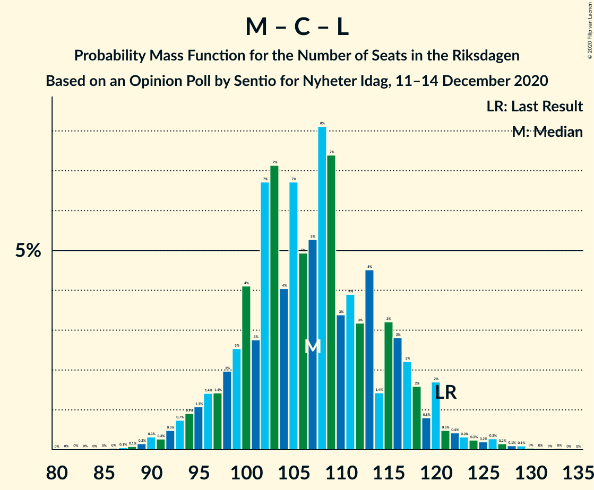

# Opinion Poll by Sentio for Nyheter Idag, 11–14 December 2020

<a href="#voting-intentions">Voting Intentions</a> | <a href="#seats">Seats</a> | <a href="#coalitions">Coalitions</a> | <a href="#technical-information">Technical Information</a>

## Voting Intentions

### Confidence Intervals

| Party | Last Result | Poll Result | 80% Confidence Interval | 90% Confidence Interval | 95% Confidence Interval | 99% Confidence Interval |
|:-----:|:-----------:|:-----------:|:-----------------------:|:-----------------------:|:-----------------------:|:-----------------------:|
| Sveriges socialdemokratiska arbetareparti | 28.3% | 24.1% | 22.2–26.1% |21.7–26.7% |21.2–27.2% |20.3–28.2% |
| Sverigedemokraterna | 17.5% | 23.2% | 21.3–25.2% |20.8–25.8% |20.4–26.3% |19.5–27.3% |
| Moderata samlingspartiet | 19.8% | 22.1% | 20.2–24.0% |19.7–24.6% |19.3–25.1% |18.5–26.1% |
| Vänsterpartiet | 8.0% | 11.3% | 10.0–12.8% |9.6–13.3% |9.3–13.7% |8.7–14.5% |
| Centerpartiet | 8.6% | 6.0% | 5.0–7.2% |4.7–7.5% |4.5–7.8% |4.1–8.5% |
| Kristdemokraterna | 6.3% | 4.8% | 4.0–5.9% |3.7–6.3% |3.5–6.6% |3.2–7.1% |
| Miljöpartiet de gröna | 4.4% | 3.2% | 2.5–4.1% |2.3–4.4% |2.1–4.6% |1.9–5.2% |
| Liberalerna | 5.5% | 2.7% | 2.1–3.6% |1.9–3.8% |1.8–4.0% |1.5–4.5% |

*Note:* The poll result column reflects the actual value used in the calculations. Published results may vary slightly, and in addition be rounded to fewer digits.

## Seats

### Confidence Intervals

| Party | Last Result | Median | 80% Confidence Interval | 90% Confidence Interval | 95% Confidence Interval | 99% Confidence Interval |
|:-----:|:-----------:|:------:|:-----------------------:|:-----------------------:|:-----------------------:|:-----------------------:|
| <a href="#sveriges-socialdemokratiska-arbetareparti">Sveriges socialdemokratiska arbetareparti</a> | 100 | 91 | 84–99 |81–102 |80–103 |76–108 |
| <a href="#sverigedemokraterna">Sverigedemokraterna</a> | 62 | 88 | 80–96 |78–98 |76–100 |73–104 |
| <a href="#moderata-samlingspartiet">Moderata samlingspartiet</a> | 70 | 84 | 76–91 |74–94 |72–96 |69–100 |
| <a href="#vänsterpartiet">Vänsterpartiet</a> | 28 | 43 | 38–49 |36–50 |35–52 |33–55 |
| <a href="#centerpartiet">Centerpartiet</a> | 31 | 23 | 19–27 |18–28 |17–30 |15–32 |
| <a href="#kristdemokraterna">Kristdemokraterna</a> | 22 | 18 | 0–22 |0–24 |0–25 |0–27 |
| <a href="#miljöpartiet-de-gröna">Miljöpartiet de gröna</a> | 16 | 0 | 0–15 |0–16 |0–17 |0–19 |
| <a href="#liberalerna">Liberalerna</a> | 20 | 0 | 0 |0 |0–15 |0–16 |

### Sveriges socialdemokratiska arbetareparti

*For a full overview of the results for this party, see the [Sveriges socialdemokratiska arbetareparti](party-sverigessocialdemokratiskaarbetareparti.html) page.*

| Number of Seats | Probability | Accumulated | Special Marks |
|:---------------:|:-----------:|:-----------:|:-------------:|
| 72 | 0% | 100% |  |
| 73 | 0.1% | 99.9% |  |
| 74 | 0.1% | 99.9% |  |
| 75 | 0.1% | 99.8% |  |
| 76 | 0.2% | 99.6% |  |
| 77 | 0.3% | 99.4% |  |
| 78 | 0.7% | 99.1% |  |
| 79 | 0.7% | 98% |  |
| 80 | 2% | 98% |  |
| 81 | 1.4% | 96% |  |
| 82 | 2% | 95% |  |
| 83 | 3% | 93% |  |
| 84 | 3% | 90% |  |
| 85 | 3% | 87% |  |
| 86 | 4% | 84% |  |
| 87 | 4% | 80% |  |
| 88 | 6% | 76% |  |
| 89 | 8% | 70% |  |
| 90 | 8% | 62% |  |
| 91 | 8% | 54% | Median |
| 92 | 7% | 45% |  |
| 93 | 5% | 39% |  |
| 94 | 3% | 34% |  |
| 95 | 6% | 31% |  |
| 96 | 6% | 25% |  |
| 97 | 6% | 20% |  |
| 98 | 3% | 14% |  |
| 99 | 2% | 11% |  |
| 100 | 2% | 9% | Last Result |
| 101 | 1.1% | 6% |  |
| 102 | 1.5% | 5% |  |
| 103 | 2% | 4% |  |
| 104 | 0.6% | 2% |  |
| 105 | 0.3% | 2% |  |
| 106 | 0.4% | 1.2% |  |
| 107 | 0.2% | 0.8% |  |
| 108 | 0.2% | 0.6% |  |
| 109 | 0.1% | 0.5% |  |
| 110 | 0.1% | 0.3% |  |
| 111 | 0.1% | 0.2% |  |
| 112 | 0.1% | 0.1% |  |
| 113 | 0% | 0.1% |  |
| 114 | 0% | 0.1% |  |
| 115 | 0% | 0% |  |

### Sverigedemokraterna

*For a full overview of the results for this party, see the [Sverigedemokraterna](party-sverigedemokraterna.html) page.*

| Number of Seats | Probability | Accumulated | Special Marks |
|:---------------:|:-----------:|:-----------:|:-------------:|
| 62 | 0% | 100% | Last Result |
| 63 | 0% | 100% |  |
| 64 | 0% | 100% |  |
| 65 | 0% | 100% |  |
| 66 | 0% | 100% |  |
| 67 | 0% | 100% |  |
| 68 | 0% | 100% |  |
| 69 | 0% | 100% |  |
| 70 | 0% | 99.9% |  |
| 71 | 0.1% | 99.9% |  |
| 72 | 0.2% | 99.8% |  |
| 73 | 0.3% | 99.6% |  |
| 74 | 0.5% | 99.3% |  |
| 75 | 0.5% | 98.8% |  |
| 76 | 1.0% | 98% |  |
| 77 | 1.4% | 97% |  |
| 78 | 2% | 96% |  |
| 79 | 2% | 94% |  |
| 80 | 2% | 92% |  |
| 81 | 3% | 89% |  |
| 82 | 5% | 87% |  |
| 83 | 4% | 82% |  |
| 84 | 6% | 78% |  |
| 85 | 4% | 72% |  |
| 86 | 7% | 68% |  |
| 87 | 7% | 61% |  |
| 88 | 9% | 54% | Median |
| 89 | 5% | 45% |  |
| 90 | 6% | 40% |  |
| 91 | 6% | 34% |  |
| 92 | 3% | 28% |  |
| 93 | 8% | 24% |  |
| 94 | 2% | 17% |  |
| 95 | 3% | 14% |  |
| 96 | 3% | 11% |  |
| 97 | 2% | 8% |  |
| 98 | 2% | 7% |  |
| 99 | 0.9% | 5% |  |
| 100 | 1.3% | 4% |  |
| 101 | 0.7% | 2% |  |
| 102 | 0.6% | 2% |  |
| 103 | 0.5% | 1.0% |  |
| 104 | 0.1% | 0.6% |  |
| 105 | 0.2% | 0.5% |  |
| 106 | 0.1% | 0.2% |  |
| 107 | 0.1% | 0.2% |  |
| 108 | 0% | 0.1% |  |
| 109 | 0% | 0.1% |  |
| 110 | 0% | 0% |  |

### Moderata samlingspartiet

*For a full overview of the results for this party, see the [Moderata samlingspartiet](party-moderatasamlingspartiet.html) page.*

| Number of Seats | Probability | Accumulated | Special Marks |
|:---------------:|:-----------:|:-----------:|:-------------:|
| 66 | 0.1% | 100% |  |
| 67 | 0% | 99.9% |  |
| 68 | 0.2% | 99.8% |  |
| 69 | 0.4% | 99.7% |  |
| 70 | 0.3% | 99.3% | Last Result |
| 71 | 0.6% | 98.9% |  |
| 72 | 0.9% | 98% |  |
| 73 | 0.9% | 97% |  |
| 74 | 3% | 97% |  |
| 75 | 2% | 93% |  |
| 76 | 1.3% | 91% |  |
| 77 | 4% | 90% |  |
| 78 | 3% | 86% |  |
| 79 | 4% | 83% |  |
| 80 | 11% | 79% |  |
| 81 | 4% | 67% |  |
| 82 | 6% | 64% |  |
| 83 | 6% | 57% |  |
| 84 | 6% | 51% | Median |
| 85 | 10% | 44% |  |
| 86 | 5% | 35% |  |
| 87 | 2% | 29% |  |
| 88 | 6% | 27% |  |
| 89 | 5% | 21% |  |
| 90 | 3% | 15% |  |
| 91 | 3% | 13% |  |
| 92 | 1.3% | 9% |  |
| 93 | 2% | 8% |  |
| 94 | 2% | 6% |  |
| 95 | 2% | 4% |  |
| 96 | 1.1% | 3% |  |
| 97 | 0.3% | 2% |  |
| 98 | 0.3% | 1.2% |  |
| 99 | 0.2% | 0.9% |  |
| 100 | 0.4% | 0.7% |  |
| 101 | 0.1% | 0.3% |  |
| 102 | 0% | 0.2% |  |
| 103 | 0% | 0.1% |  |
| 104 | 0% | 0.1% |  |
| 105 | 0% | 0.1% |  |
| 106 | 0% | 0% |  |

### Vänsterpartiet

*For a full overview of the results for this party, see the [Vänsterpartiet](party-vänsterpartiet.html) page.*

| Number of Seats | Probability | Accumulated | Special Marks |
|:---------------:|:-----------:|:-----------:|:-------------:|
| 28 | 0% | 100% | Last Result |
| 29 | 0% | 100% |  |
| 30 | 0% | 100% |  |
| 31 | 0.2% | 99.9% |  |
| 32 | 0.3% | 99.8% |  |
| 33 | 0.7% | 99.5% |  |
| 34 | 1.0% | 98.8% |  |
| 35 | 2% | 98% |  |
| 36 | 2% | 96% |  |
| 37 | 4% | 94% |  |
| 38 | 3% | 90% |  |
| 39 | 7% | 87% |  |
| 40 | 8% | 80% |  |
| 41 | 15% | 73% |  |
| 42 | 7% | 57% |  |
| 43 | 10% | 50% | Median |
| 44 | 7% | 40% |  |
| 45 | 5% | 34% |  |
| 46 | 5% | 29% |  |
| 47 | 7% | 24% |  |
| 48 | 7% | 17% |  |
| 49 | 3% | 10% |  |
| 50 | 3% | 7% |  |
| 51 | 2% | 5% |  |
| 52 | 1.1% | 3% |  |
| 53 | 0.6% | 2% |  |
| 54 | 0.6% | 1.3% |  |
| 55 | 0.3% | 0.7% |  |
| 56 | 0.3% | 0.4% |  |
| 57 | 0.1% | 0.2% |  |
| 58 | 0% | 0.1% |  |
| 59 | 0% | 0% |  |

### Centerpartiet

*For a full overview of the results for this party, see the [Centerpartiet](party-centerpartiet.html) page.*

| Number of Seats | Probability | Accumulated | Special Marks |
|:---------------:|:-----------:|:-----------:|:-------------:|
| 0 | 0.4% | 100% |  |
| 1 | 0% | 99.6% |  |
| 2 | 0% | 99.6% |  |
| 3 | 0% | 99.6% |  |
| 4 | 0% | 99.6% |  |
| 5 | 0% | 99.6% |  |
| 6 | 0% | 99.6% |  |
| 7 | 0% | 99.6% |  |
| 8 | 0% | 99.6% |  |
| 9 | 0% | 99.6% |  |
| 10 | 0% | 99.6% |  |
| 11 | 0% | 99.6% |  |
| 12 | 0% | 99.6% |  |
| 13 | 0% | 99.6% |  |
| 14 | 0% | 99.6% |  |
| 15 | 0.2% | 99.6% |  |
| 16 | 0.9% | 99.4% |  |
| 17 | 2% | 98% |  |
| 18 | 5% | 97% |  |
| 19 | 9% | 92% |  |
| 20 | 8% | 83% |  |
| 21 | 7% | 75% |  |
| 22 | 10% | 69% |  |
| 23 | 18% | 58% | Median |
| 24 | 15% | 40% |  |
| 25 | 6% | 25% |  |
| 26 | 6% | 20% |  |
| 27 | 6% | 14% |  |
| 28 | 3% | 8% |  |
| 29 | 2% | 5% |  |
| 30 | 2% | 3% |  |
| 31 | 0.9% | 2% | Last Result |
| 32 | 0.3% | 0.6% |  |
| 33 | 0.1% | 0.3% |  |
| 34 | 0.1% | 0.2% |  |
| 35 | 0.1% | 0.1% |  |
| 36 | 0% | 0% |  |

### Kristdemokraterna

*For a full overview of the results for this party, see the [Kristdemokraterna](party-kristdemokraterna.html) page.*

| Number of Seats | Probability | Accumulated | Special Marks |
|:---------------:|:-----------:|:-----------:|:-------------:|
| 0 | 11% | 100% |  |
| 1 | 0% | 89% |  |
| 2 | 0% | 89% |  |
| 3 | 0% | 89% |  |
| 4 | 0% | 89% |  |
| 5 | 0% | 89% |  |
| 6 | 0% | 89% |  |
| 7 | 0% | 89% |  |
| 8 | 0% | 89% |  |
| 9 | 0% | 89% |  |
| 10 | 0% | 89% |  |
| 11 | 0% | 89% |  |
| 12 | 0% | 89% |  |
| 13 | 0% | 89% |  |
| 14 | 0% | 89% |  |
| 15 | 2% | 89% |  |
| 16 | 11% | 87% |  |
| 17 | 14% | 77% |  |
| 18 | 15% | 63% | Median |
| 19 | 14% | 49% |  |
| 20 | 8% | 34% |  |
| 21 | 10% | 26% |  |
| 22 | 7% | 16% | Last Result |
| 23 | 4% | 9% |  |
| 24 | 3% | 5% |  |
| 25 | 1.3% | 3% |  |
| 26 | 0.6% | 1.3% |  |
| 27 | 0.4% | 0.7% |  |
| 28 | 0.1% | 0.2% |  |
| 29 | 0.1% | 0.1% |  |
| 30 | 0% | 0.1% |  |
| 31 | 0% | 0% |  |

### Miljöpartiet de gröna

*For a full overview of the results for this party, see the [Miljöpartiet de gröna](party-miljöpartietdegröna.html) page.*

| Number of Seats | Probability | Accumulated | Special Marks |
|:---------------:|:-----------:|:-----------:|:-------------:|
| 0 | 88% | 100% | Median |
| 1 | 0% | 12% |  |
| 2 | 0% | 12% |  |
| 3 | 0% | 12% |  |
| 4 | 0% | 12% |  |
| 5 | 0% | 12% |  |
| 6 | 0% | 12% |  |
| 7 | 0% | 12% |  |
| 8 | 0% | 12% |  |
| 9 | 0% | 12% |  |
| 10 | 0% | 12% |  |
| 11 | 0% | 12% |  |
| 12 | 0% | 12% |  |
| 13 | 0% | 12% |  |
| 14 | 0.1% | 12% |  |
| 15 | 4% | 12% |  |
| 16 | 4% | 8% | Last Result |
| 17 | 2% | 4% |  |
| 18 | 1.1% | 2% |  |
| 19 | 0.5% | 0.8% |  |
| 20 | 0.2% | 0.3% |  |
| 21 | 0.1% | 0.1% |  |
| 22 | 0% | 0% |  |

### Liberalerna

*For a full overview of the results for this party, see the [Liberalerna](party-liberalerna.html) page.*

| Number of Seats | Probability | Accumulated | Special Marks |
|:---------------:|:-----------:|:-----------:|:-------------:|
| 0 | 97% | 100% | Median |
| 1 | 0% | 3% |  |
| 2 | 0% | 3% |  |
| 3 | 0% | 3% |  |
| 4 | 0% | 3% |  |
| 5 | 0% | 3% |  |
| 6 | 0% | 3% |  |
| 7 | 0% | 3% |  |
| 8 | 0% | 3% |  |
| 9 | 0% | 3% |  |
| 10 | 0% | 3% |  |
| 11 | 0% | 3% |  |
| 12 | 0% | 3% |  |
| 13 | 0% | 3% |  |
| 14 | 0.1% | 3% |  |
| 15 | 1.5% | 3% |  |
| 16 | 0.8% | 1.3% |  |
| 17 | 0.3% | 0.5% |  |
| 18 | 0.1% | 0.2% |  |
| 19 | 0% | 0.1% |  |
| 20 | 0% | 0% | Last Result |

## Coalitions

### Confidence Intervals

| Coalition | Last Result | Median | Majority? | 80% Confidence Interval | 90% Confidence Interval | 95% Confidence Interval | 99% Confidence Interval |
|:---------:|:-----------:|:------:|:---------:|:-----------------------:|:-----------------------:|:-----------------------:|:-----------------------:|
| Sveriges socialdemokratiska arbetareparti – Moderata samlingspartiet – Centerpartiet | 201 | 198 | 99.7% | 188–208 | 185–211 | 182–214 | 176–220 |
| Sverigedemokraterna – Moderata samlingspartiet – Kristdemokraterna | 154 | 190 | 95% | 178–198 | 175–202 | 172–203 | 166–208 |
| Sveriges socialdemokratiska arbetareparti – Moderata samlingspartiet | 170 | 175 | 55% | 165–184 | 162–188 | 160–190 | 155–196 |
| Sverigedemokraterna – Moderata samlingspartiet | 132 | 172 | 36% | 161–181 | 159–185 | 156–188 | 151–193 |
| Sveriges socialdemokratiska arbetareparti – Vänsterpartiet – Centerpartiet – Miljöpartiet de gröna – Liberalerna | 195 | 159 | 4% | 150–170 | 147–173 | 145–176 | 140–182 |
| Sveriges socialdemokratiska arbetareparti – Vänsterpartiet – Miljöpartiet de gröna | 144 | 136 | 0% | 127–146 | 125–150 | 122–152 | 118–158 |
| Sveriges socialdemokratiska arbetareparti – Vänsterpartiet | 128 | 134 | 0% | 126–144 | 123–146 | 120–149 | 117–153 |
| Moderata samlingspartiet – Centerpartiet – Kristdemokraterna – Liberalerna | 143 | 124 | 0% | 114–134 | 110–136 | 107–139 | 100–143 |
| Moderata samlingspartiet – Centerpartiet – Kristdemokraterna | 123 | 124 | 0% | 114–133 | 109–136 | 106–138 | 100–141 |
| Sveriges socialdemokratiska arbetareparti – Centerpartiet – Miljöpartiet de gröna – Liberalerna | 167 | 116 | 0% | 107–127 | 105–130 | 103–133 | 98–140 |
| Moderata samlingspartiet – Centerpartiet – Liberalerna | 121 | 107 | 0% | 99–116 | 96–118 | 94–120 | 90–126 |
| Moderata samlingspartiet – Centerpartiet | 101 | 106 | 0% | 99–115 | 96–118 | 94–120 | 90–125 |
| Sveriges socialdemokratiska arbetareparti – Miljöpartiet de gröna | 116 | 92 | 0% | 85–103 | 83–106 | 81–109 | 77–114 |

### Sveriges socialdemokratiska arbetareparti – Moderata samlingspartiet – Centerpartiet

| Number of Seats | Probability | Accumulated | Special Marks |
|:---------------:|:-----------:|:-----------:|:-------------:|
| 170 | 0% | 100% |  |
| 171 | 0% | 99.9% |  |
| 172 | 0% | 99.9% |  |
| 173 | 0.1% | 99.9% |  |
| 174 | 0.1% | 99.8% |  |
| 175 | 0.1% | 99.7% | Majority |
| 176 | 0.1% | 99.6% |  |
| 177 | 0.3% | 99.5% |  |
| 178 | 0.2% | 99.2% |  |
| 179 | 0.3% | 98.9% |  |
| 180 | 0.4% | 98.7% |  |
| 181 | 0.5% | 98% |  |
| 182 | 0.7% | 98% |  |
| 183 | 0.8% | 97% |  |
| 184 | 1.1% | 96% |  |
| 185 | 2% | 95% |  |
| 186 | 1.4% | 94% |  |
| 187 | 2% | 92% |  |
| 188 | 3% | 90% |  |
| 189 | 3% | 88% |  |
| 190 | 2% | 85% |  |
| 191 | 4% | 83% |  |
| 192 | 4% | 78% |  |
| 193 | 3% | 74% |  |
| 194 | 3% | 71% |  |
| 195 | 6% | 68% |  |
| 196 | 4% | 62% |  |
| 197 | 4% | 58% |  |
| 198 | 5% | 54% | Median |
| 199 | 9% | 49% |  |
| 200 | 3% | 39% |  |
| 201 | 5% | 36% | Last Result |
| 202 | 2% | 31% |  |
| 203 | 5% | 29% |  |
| 204 | 2% | 24% |  |
| 205 | 6% | 22% |  |
| 206 | 3% | 16% |  |
| 207 | 2% | 13% |  |
| 208 | 3% | 11% |  |
| 209 | 1.1% | 8% |  |
| 210 | 1.1% | 7% |  |
| 211 | 1.2% | 6% |  |
| 212 | 0.6% | 4% |  |
| 213 | 1.1% | 4% |  |
| 214 | 0.4% | 3% |  |
| 215 | 0.4% | 2% |  |
| 216 | 0.5% | 2% |  |
| 217 | 0.3% | 1.3% |  |
| 218 | 0.1% | 1.0% |  |
| 219 | 0.3% | 0.9% |  |
| 220 | 0.2% | 0.6% |  |
| 221 | 0.1% | 0.4% |  |
| 222 | 0.1% | 0.3% |  |
| 223 | 0% | 0.3% |  |
| 224 | 0.1% | 0.2% |  |
| 225 | 0.1% | 0.1% |  |
| 226 | 0% | 0.1% |  |
| 227 | 0% | 0.1% |  |
| 228 | 0% | 0% |  |

### Sverigedemokraterna – Moderata samlingspartiet – Kristdemokraterna

| Number of Seats | Probability | Accumulated | Special Marks |
|:---------------:|:-----------:|:-----------:|:-------------:|
| 154 | 0% | 100% | Last Result |
| 155 | 0% | 100% |  |
| 156 | 0% | 100% |  |
| 157 | 0% | 100% |  |
| 158 | 0% | 100% |  |
| 159 | 0% | 100% |  |
| 160 | 0% | 99.9% |  |
| 161 | 0% | 99.9% |  |
| 162 | 0% | 99.9% |  |
| 163 | 0% | 99.8% |  |
| 164 | 0.1% | 99.8% |  |
| 165 | 0.2% | 99.7% |  |
| 166 | 0.1% | 99.5% |  |
| 167 | 0.2% | 99.4% |  |
| 168 | 0.3% | 99.2% |  |
| 169 | 0.4% | 98.9% |  |
| 170 | 0.3% | 98% |  |
| 171 | 0.6% | 98% |  |
| 172 | 0.4% | 98% |  |
| 173 | 0.8% | 97% |  |
| 174 | 1.0% | 96% |  |
| 175 | 2% | 95% | Majority |
| 176 | 2% | 94% |  |
| 177 | 2% | 92% |  |
| 178 | 1.2% | 91% |  |
| 179 | 2% | 89% |  |
| 180 | 2% | 87% |  |
| 181 | 3% | 86% |  |
| 182 | 5% | 83% |  |
| 183 | 3% | 78% |  |
| 184 | 3% | 75% |  |
| 185 | 3% | 72% |  |
| 186 | 4% | 69% |  |
| 187 | 5% | 65% |  |
| 188 | 5% | 60% |  |
| 189 | 5% | 55% |  |
| 190 | 7% | 50% | Median |
| 191 | 4% | 43% |  |
| 192 | 4% | 40% |  |
| 193 | 4% | 36% |  |
| 194 | 5% | 32% |  |
| 195 | 9% | 27% |  |
| 196 | 3% | 17% |  |
| 197 | 3% | 14% |  |
| 198 | 2% | 11% |  |
| 199 | 2% | 9% |  |
| 200 | 2% | 8% |  |
| 201 | 0.8% | 6% |  |
| 202 | 2% | 6% |  |
| 203 | 1.1% | 3% |  |
| 204 | 0.9% | 2% |  |
| 205 | 0.2% | 1.3% |  |
| 206 | 0.2% | 1.1% |  |
| 207 | 0.4% | 0.9% |  |
| 208 | 0.1% | 0.5% |  |
| 209 | 0.1% | 0.4% |  |
| 210 | 0.1% | 0.3% |  |
| 211 | 0% | 0.2% |  |
| 212 | 0.1% | 0.1% |  |
| 213 | 0% | 0.1% |  |
| 214 | 0% | 0% |  |

### Sveriges socialdemokratiska arbetareparti – Moderata samlingspartiet

| Number of Seats | Probability | Accumulated | Special Marks |
|:---------------:|:-----------:|:-----------:|:-------------:|
| 149 | 0% | 100% |  |
| 150 | 0% | 99.9% |  |
| 151 | 0% | 99.9% |  |
| 152 | 0.1% | 99.9% |  |
| 153 | 0.1% | 99.8% |  |
| 154 | 0.2% | 99.7% |  |
| 155 | 0.2% | 99.5% |  |
| 156 | 0.2% | 99.3% |  |
| 157 | 0.3% | 99.1% |  |
| 158 | 0.4% | 98.8% |  |
| 159 | 0.7% | 98% |  |
| 160 | 1.0% | 98% |  |
| 161 | 0.7% | 97% |  |
| 162 | 2% | 96% |  |
| 163 | 1.1% | 94% |  |
| 164 | 2% | 93% |  |
| 165 | 2% | 91% |  |
| 166 | 1.4% | 89% |  |
| 167 | 4% | 88% |  |
| 168 | 2% | 84% |  |
| 169 | 6% | 81% |  |
| 170 | 4% | 75% | Last Result |
| 171 | 4% | 72% |  |
| 172 | 5% | 68% |  |
| 173 | 2% | 62% |  |
| 174 | 5% | 60% |  |
| 175 | 9% | 55% | Median, Majority |
| 176 | 4% | 46% |  |
| 177 | 6% | 41% |  |
| 178 | 2% | 36% |  |
| 179 | 5% | 34% |  |
| 180 | 4% | 29% |  |
| 181 | 4% | 24% |  |
| 182 | 5% | 20% |  |
| 183 | 2% | 16% |  |
| 184 | 4% | 13% |  |
| 185 | 2% | 10% |  |
| 186 | 1.1% | 8% |  |
| 187 | 2% | 7% |  |
| 188 | 1.3% | 5% |  |
| 189 | 0.9% | 4% |  |
| 190 | 0.9% | 3% |  |
| 191 | 0.4% | 2% |  |
| 192 | 0.3% | 2% |  |
| 193 | 0.4% | 2% |  |
| 194 | 0.2% | 1.1% |  |
| 195 | 0.3% | 0.9% |  |
| 196 | 0.1% | 0.6% |  |
| 197 | 0.1% | 0.5% |  |
| 198 | 0.1% | 0.3% |  |
| 199 | 0.1% | 0.2% |  |
| 200 | 0% | 0.2% |  |
| 201 | 0% | 0.1% |  |
| 202 | 0% | 0.1% |  |
| 203 | 0% | 0.1% |  |
| 204 | 0% | 0% |  |

### Sverigedemokraterna – Moderata samlingspartiet

| Number of Seats | Probability | Accumulated | Special Marks |
|:---------------:|:-----------:|:-----------:|:-------------:|
| 132 | 0% | 100% | Last Result |
| 133 | 0% | 100% |  |
| 134 | 0% | 100% |  |
| 135 | 0% | 100% |  |
| 136 | 0% | 100% |  |
| 137 | 0% | 100% |  |
| 138 | 0% | 100% |  |
| 139 | 0% | 100% |  |
| 140 | 0% | 100% |  |
| 141 | 0% | 100% |  |
| 142 | 0% | 100% |  |
| 143 | 0% | 100% |  |
| 144 | 0% | 100% |  |
| 145 | 0% | 100% |  |
| 146 | 0% | 100% |  |
| 147 | 0% | 99.9% |  |
| 148 | 0.1% | 99.9% |  |
| 149 | 0.1% | 99.9% |  |
| 150 | 0.1% | 99.8% |  |
| 151 | 0.2% | 99.6% |  |
| 152 | 0.1% | 99.4% |  |
| 153 | 0.5% | 99.3% |  |
| 154 | 0.3% | 98.8% |  |
| 155 | 0.7% | 98.5% |  |
| 156 | 0.7% | 98% |  |
| 157 | 0.6% | 97% |  |
| 158 | 1.1% | 96% |  |
| 159 | 2% | 95% |  |
| 160 | 2% | 93% |  |
| 161 | 1.5% | 91% |  |
| 162 | 1.5% | 90% |  |
| 163 | 2% | 88% |  |
| 164 | 4% | 86% |  |
| 165 | 4% | 83% |  |
| 166 | 4% | 79% |  |
| 167 | 4% | 75% |  |
| 168 | 4% | 72% |  |
| 169 | 5% | 68% |  |
| 170 | 5% | 63% |  |
| 171 | 6% | 58% |  |
| 172 | 6% | 52% | Median |
| 173 | 4% | 45% |  |
| 174 | 6% | 42% |  |
| 175 | 3% | 36% | Majority |
| 176 | 5% | 33% |  |
| 177 | 4% | 27% |  |
| 178 | 5% | 24% |  |
| 179 | 3% | 19% |  |
| 180 | 3% | 15% |  |
| 181 | 2% | 12% |  |
| 182 | 2% | 10% |  |
| 183 | 0.7% | 8% |  |
| 184 | 2% | 7% |  |
| 185 | 1.3% | 6% |  |
| 186 | 0.9% | 4% |  |
| 187 | 0.7% | 3% |  |
| 188 | 0.7% | 3% |  |
| 189 | 0.5% | 2% |  |
| 190 | 0.3% | 1.5% |  |
| 191 | 0.2% | 1.2% |  |
| 192 | 0.2% | 1.0% |  |
| 193 | 0.3% | 0.7% |  |
| 194 | 0.1% | 0.4% |  |
| 195 | 0.1% | 0.3% |  |
| 196 | 0% | 0.2% |  |
| 197 | 0.1% | 0.2% |  |
| 198 | 0% | 0.1% |  |
| 199 | 0% | 0.1% |  |
| 200 | 0% | 0.1% |  |
| 201 | 0% | 0% |  |

### Sveriges socialdemokratiska arbetareparti – Vänsterpartiet – Centerpartiet – Miljöpartiet de gröna – Liberalerna

| Number of Seats | Probability | Accumulated | Special Marks |
|:---------------:|:-----------:|:-----------:|:-------------:|
| 135 | 0% | 100% |  |
| 136 | 0% | 99.9% |  |
| 137 | 0.1% | 99.9% |  |
| 138 | 0.2% | 99.8% |  |
| 139 | 0.2% | 99.7% |  |
| 140 | 0.1% | 99.5% |  |
| 141 | 0.2% | 99.4% |  |
| 142 | 0.4% | 99.2% |  |
| 143 | 0.3% | 98.8% |  |
| 144 | 0.4% | 98.5% |  |
| 145 | 1.1% | 98% |  |
| 146 | 1.2% | 97% |  |
| 147 | 2% | 96% |  |
| 148 | 0.9% | 94% |  |
| 149 | 2% | 93% |  |
| 150 | 2% | 91% |  |
| 151 | 2% | 89% |  |
| 152 | 4% | 88% |  |
| 153 | 3% | 84% |  |
| 154 | 9% | 81% |  |
| 155 | 5% | 72% |  |
| 156 | 4% | 67% |  |
| 157 | 4% | 62% | Median |
| 158 | 4% | 58% |  |
| 159 | 7% | 54% |  |
| 160 | 5% | 47% |  |
| 161 | 5% | 42% |  |
| 162 | 5% | 37% |  |
| 163 | 5% | 33% |  |
| 164 | 3% | 28% |  |
| 165 | 3% | 25% |  |
| 166 | 3% | 22% |  |
| 167 | 4% | 19% |  |
| 168 | 2% | 15% |  |
| 169 | 1.5% | 12% |  |
| 170 | 2% | 11% |  |
| 171 | 1.2% | 9% |  |
| 172 | 1.0% | 7% |  |
| 173 | 2% | 6% |  |
| 174 | 1.1% | 5% |  |
| 175 | 1.0% | 4% | Majority |
| 176 | 0.8% | 3% |  |
| 177 | 0.4% | 2% |  |
| 178 | 0.4% | 2% |  |
| 179 | 0.2% | 1.3% |  |
| 180 | 0.2% | 1.1% |  |
| 181 | 0.2% | 0.8% |  |
| 182 | 0.1% | 0.6% |  |
| 183 | 0.1% | 0.5% |  |
| 184 | 0.2% | 0.4% |  |
| 185 | 0.1% | 0.2% |  |
| 186 | 0% | 0.2% |  |
| 187 | 0% | 0.1% |  |
| 188 | 0% | 0.1% |  |
| 189 | 0% | 0.1% |  |
| 190 | 0% | 0.1% |  |
| 191 | 0% | 0% |  |
| 192 | 0% | 0% |  |
| 193 | 0% | 0% |  |
| 194 | 0% | 0% |  |
| 195 | 0% | 0% | Last Result |

### Sveriges socialdemokratiska arbetareparti – Vänsterpartiet – Miljöpartiet de gröna

| Number of Seats | Probability | Accumulated | Special Marks |
|:---------------:|:-----------:|:-----------:|:-------------:|
| 113 | 0% | 100% |  |
| 114 | 0% | 99.9% |  |
| 115 | 0% | 99.9% |  |
| 116 | 0.1% | 99.9% |  |
| 117 | 0.1% | 99.8% |  |
| 118 | 0.2% | 99.6% |  |
| 119 | 0.4% | 99.4% |  |
| 120 | 0.4% | 99.1% |  |
| 121 | 0.4% | 98.7% |  |
| 122 | 1.1% | 98% |  |
| 123 | 0.9% | 97% |  |
| 124 | 0.9% | 96% |  |
| 125 | 2% | 95% |  |
| 126 | 2% | 94% |  |
| 127 | 2% | 91% |  |
| 128 | 3% | 89% |  |
| 129 | 2% | 86% |  |
| 130 | 7% | 84% |  |
| 131 | 7% | 77% |  |
| 132 | 2% | 70% |  |
| 133 | 6% | 68% |  |
| 134 | 5% | 62% | Median |
| 135 | 4% | 57% |  |
| 136 | 7% | 54% |  |
| 137 | 5% | 47% |  |
| 138 | 6% | 41% |  |
| 139 | 7% | 35% |  |
| 140 | 4% | 29% |  |
| 141 | 3% | 25% |  |
| 142 | 3% | 22% |  |
| 143 | 2% | 19% |  |
| 144 | 3% | 17% | Last Result |
| 145 | 3% | 14% |  |
| 146 | 2% | 11% |  |
| 147 | 0.8% | 8% |  |
| 148 | 1.0% | 8% |  |
| 149 | 1.1% | 7% |  |
| 150 | 1.0% | 6% |  |
| 151 | 1.2% | 5% |  |
| 152 | 1.0% | 3% |  |
| 153 | 0.5% | 2% |  |
| 154 | 0.3% | 2% |  |
| 155 | 0.4% | 1.5% |  |
| 156 | 0.2% | 1.1% |  |
| 157 | 0.2% | 0.9% |  |
| 158 | 0.3% | 0.7% |  |
| 159 | 0.1% | 0.4% |  |
| 160 | 0.1% | 0.3% |  |
| 161 | 0% | 0.2% |  |
| 162 | 0% | 0.1% |  |
| 163 | 0% | 0.1% |  |
| 164 | 0% | 0.1% |  |
| 165 | 0% | 0.1% |  |
| 166 | 0% | 0.1% |  |
| 167 | 0% | 0% |  |

### Sveriges socialdemokratiska arbetareparti – Vänsterpartiet

| Number of Seats | Probability | Accumulated | Special Marks |
|:---------------:|:-----------:|:-----------:|:-------------:|
| 111 | 0% | 100% |  |
| 112 | 0% | 99.9% |  |
| 113 | 0% | 99.9% |  |
| 114 | 0.1% | 99.9% |  |
| 115 | 0.1% | 99.8% |  |
| 116 | 0.2% | 99.7% |  |
| 117 | 0.3% | 99.5% |  |
| 118 | 0.4% | 99.2% |  |
| 119 | 0.7% | 98.9% |  |
| 120 | 1.1% | 98% |  |
| 121 | 0.7% | 97% |  |
| 122 | 1.3% | 96% |  |
| 123 | 1.3% | 95% |  |
| 124 | 2% | 94% |  |
| 125 | 2% | 92% |  |
| 126 | 3% | 90% |  |
| 127 | 4% | 87% |  |
| 128 | 3% | 83% | Last Result |
| 129 | 3% | 80% |  |
| 130 | 7% | 77% |  |
| 131 | 8% | 70% |  |
| 132 | 3% | 63% |  |
| 133 | 6% | 60% |  |
| 134 | 6% | 54% | Median |
| 135 | 3% | 49% |  |
| 136 | 7% | 45% |  |
| 137 | 6% | 38% |  |
| 138 | 6% | 33% |  |
| 139 | 6% | 27% |  |
| 140 | 4% | 21% |  |
| 141 | 3% | 17% |  |
| 142 | 2% | 14% |  |
| 143 | 1.0% | 12% |  |
| 144 | 3% | 11% |  |
| 145 | 3% | 8% |  |
| 146 | 1.5% | 5% |  |
| 147 | 0.5% | 4% |  |
| 148 | 0.7% | 3% |  |
| 149 | 0.7% | 3% |  |
| 150 | 0.4% | 2% |  |
| 151 | 0.5% | 2% |  |
| 152 | 0.5% | 1.1% |  |
| 153 | 0.1% | 0.6% |  |
| 154 | 0.1% | 0.5% |  |
| 155 | 0.1% | 0.4% |  |
| 156 | 0.1% | 0.3% |  |
| 157 | 0.1% | 0.2% |  |
| 158 | 0.1% | 0.1% |  |
| 159 | 0% | 0.1% |  |
| 160 | 0% | 0% |  |

### Moderata samlingspartiet – Centerpartiet – Kristdemokraterna – Liberalerna

| Number of Seats | Probability | Accumulated | Special Marks |
|:---------------:|:-----------:|:-----------:|:-------------:|
| 94 | 0% | 100% |  |
| 95 | 0% | 99.9% |  |
| 96 | 0% | 99.9% |  |
| 97 | 0% | 99.9% |  |
| 98 | 0.1% | 99.8% |  |
| 99 | 0% | 99.8% |  |
| 100 | 0.3% | 99.7% |  |
| 101 | 0.1% | 99.5% |  |
| 102 | 0.3% | 99.4% |  |
| 103 | 0.1% | 99.1% |  |
| 104 | 0.4% | 98.9% |  |
| 105 | 0.6% | 98.5% |  |
| 106 | 0.3% | 98% |  |
| 107 | 0.8% | 98% |  |
| 108 | 0.4% | 97% |  |
| 109 | 1.3% | 97% |  |
| 110 | 0.6% | 95% |  |
| 111 | 1.1% | 95% |  |
| 112 | 1.2% | 94% |  |
| 113 | 1.5% | 92% |  |
| 114 | 1.5% | 91% |  |
| 115 | 2% | 89% |  |
| 116 | 3% | 87% |  |
| 117 | 2% | 85% |  |
| 118 | 3% | 82% |  |
| 119 | 4% | 79% |  |
| 120 | 3% | 75% |  |
| 121 | 5% | 71% |  |
| 122 | 4% | 66% |  |
| 123 | 7% | 62% |  |
| 124 | 6% | 55% |  |
| 125 | 5% | 49% | Median |
| 126 | 7% | 44% |  |
| 127 | 4% | 37% |  |
| 128 | 4% | 32% |  |
| 129 | 3% | 28% |  |
| 130 | 7% | 25% |  |
| 131 | 3% | 19% |  |
| 132 | 3% | 16% |  |
| 133 | 2% | 13% |  |
| 134 | 3% | 10% |  |
| 135 | 0.8% | 7% |  |
| 136 | 2% | 6% |  |
| 137 | 0.7% | 4% |  |
| 138 | 0.9% | 4% |  |
| 139 | 1.1% | 3% |  |
| 140 | 0.5% | 2% |  |
| 141 | 0.4% | 1.3% |  |
| 142 | 0.2% | 0.9% |  |
| 143 | 0.2% | 0.7% | Last Result |
| 144 | 0.2% | 0.5% |  |
| 145 | 0.1% | 0.3% |  |
| 146 | 0.1% | 0.2% |  |
| 147 | 0% | 0.1% |  |
| 148 | 0% | 0.1% |  |
| 149 | 0% | 0.1% |  |
| 150 | 0% | 0% |  |

### Moderata samlingspartiet – Centerpartiet – Kristdemokraterna

| Number of Seats | Probability | Accumulated | Special Marks |
|:---------------:|:-----------:|:-----------:|:-------------:|
| 94 | 0% | 100% |  |
| 95 | 0% | 99.9% |  |
| 96 | 0% | 99.9% |  |
| 97 | 0% | 99.9% |  |
| 98 | 0.1% | 99.8% |  |
| 99 | 0% | 99.7% |  |
| 100 | 0.3% | 99.7% |  |
| 101 | 0.1% | 99.4% |  |
| 102 | 0.3% | 99.3% |  |
| 103 | 0.1% | 99.0% |  |
| 104 | 0.4% | 98.8% |  |
| 105 | 0.6% | 98% |  |
| 106 | 0.3% | 98% |  |
| 107 | 0.8% | 97% |  |
| 108 | 0.4% | 97% |  |
| 109 | 1.3% | 96% |  |
| 110 | 0.6% | 95% |  |
| 111 | 1.3% | 94% |  |
| 112 | 1.3% | 93% |  |
| 113 | 2% | 92% |  |
| 114 | 2% | 90% |  |
| 115 | 2% | 89% |  |
| 116 | 3% | 87% |  |
| 117 | 3% | 84% |  |
| 118 | 3% | 81% |  |
| 119 | 5% | 78% |  |
| 120 | 4% | 73% |  |
| 121 | 5% | 70% |  |
| 122 | 4% | 64% |  |
| 123 | 7% | 60% | Last Result |
| 124 | 7% | 53% |  |
| 125 | 4% | 46% | Median |
| 126 | 7% | 42% |  |
| 127 | 4% | 35% |  |
| 128 | 4% | 30% |  |
| 129 | 3% | 26% |  |
| 130 | 7% | 23% |  |
| 131 | 3% | 17% |  |
| 132 | 3% | 14% |  |
| 133 | 2% | 11% |  |
| 134 | 3% | 9% |  |
| 135 | 0.7% | 6% |  |
| 136 | 2% | 5% |  |
| 137 | 0.7% | 4% |  |
| 138 | 0.8% | 3% |  |
| 139 | 0.9% | 2% |  |
| 140 | 0.4% | 1.2% |  |
| 141 | 0.3% | 0.8% |  |
| 142 | 0.2% | 0.5% |  |
| 143 | 0.1% | 0.3% |  |
| 144 | 0.1% | 0.2% |  |
| 145 | 0% | 0.1% |  |
| 146 | 0% | 0.1% |  |
| 147 | 0% | 0% |  |

### Sveriges socialdemokratiska arbetareparti – Centerpartiet – Miljöpartiet de gröna – Liberalerna

| Number of Seats | Probability | Accumulated | Special Marks |
|:---------------:|:-----------:|:-----------:|:-------------:|
| 90 | 0% | 100% |  |
| 91 | 0% | 99.9% |  |
| 92 | 0% | 99.9% |  |
| 93 | 0% | 99.9% |  |
| 94 | 0% | 99.9% |  |
| 95 | 0% | 99.9% |  |
| 96 | 0.1% | 99.8% |  |
| 97 | 0.1% | 99.8% |  |
| 98 | 0.3% | 99.7% |  |
| 99 | 0.1% | 99.4% |  |
| 100 | 0.5% | 99.3% |  |
| 101 | 0.6% | 98.8% |  |
| 102 | 0.6% | 98% |  |
| 103 | 0.8% | 98% |  |
| 104 | 1.4% | 97% |  |
| 105 | 1.0% | 95% |  |
| 106 | 2% | 94% |  |
| 107 | 3% | 93% |  |
| 108 | 2% | 90% |  |
| 109 | 4% | 88% |  |
| 110 | 3% | 84% |  |
| 111 | 6% | 80% |  |
| 112 | 6% | 75% |  |
| 113 | 4% | 69% |  |
| 114 | 8% | 65% | Median |
| 115 | 5% | 57% |  |
| 116 | 6% | 52% |  |
| 117 | 4% | 46% |  |
| 118 | 6% | 42% |  |
| 119 | 5% | 37% |  |
| 120 | 4% | 32% |  |
| 121 | 4% | 28% |  |
| 122 | 3% | 24% |  |
| 123 | 2% | 20% |  |
| 124 | 3% | 18% |  |
| 125 | 3% | 15% |  |
| 126 | 2% | 12% |  |
| 127 | 2% | 10% |  |
| 128 | 1.4% | 8% |  |
| 129 | 2% | 7% |  |
| 130 | 0.8% | 5% |  |
| 131 | 1.0% | 4% |  |
| 132 | 0.6% | 3% |  |
| 133 | 0.6% | 3% |  |
| 134 | 0.5% | 2% |  |
| 135 | 0.3% | 2% |  |
| 136 | 0.3% | 1.4% |  |
| 137 | 0.2% | 1.1% |  |
| 138 | 0.2% | 0.8% |  |
| 139 | 0.1% | 0.6% |  |
| 140 | 0.2% | 0.5% |  |
| 141 | 0.1% | 0.3% |  |
| 142 | 0.1% | 0.2% |  |
| 143 | 0% | 0.2% |  |
| 144 | 0% | 0.1% |  |
| 145 | 0% | 0.1% |  |
| 146 | 0% | 0% |  |
| 147 | 0% | 0% |  |
| 148 | 0% | 0% |  |
| 149 | 0% | 0% |  |
| 150 | 0% | 0% |  |
| 151 | 0% | 0% |  |
| 152 | 0% | 0% |  |
| 153 | 0% | 0% |  |
| 154 | 0% | 0% |  |
| 155 | 0% | 0% |  |
| 156 | 0% | 0% |  |
| 157 | 0% | 0% |  |
| 158 | 0% | 0% |  |
| 159 | 0% | 0% |  |
| 160 | 0% | 0% |  |
| 161 | 0% | 0% |  |
| 162 | 0% | 0% |  |
| 163 | 0% | 0% |  |
| 164 | 0% | 0% |  |
| 165 | 0% | 0% |  |
| 166 | 0% | 0% |  |
| 167 | 0% | 0% | Last Result |

### Moderata samlingspartiet – Centerpartiet – Liberalerna

| Number of Seats | Probability | Accumulated | Special Marks |
|:---------------:|:-----------:|:-----------:|:-------------:|
| 82 | 0% | 100% |  |
| 83 | 0% | 99.9% |  |
| 84 | 0% | 99.9% |  |
| 85 | 0% | 99.9% |  |
| 86 | 0% | 99.9% |  |
| 87 | 0.1% | 99.8% |  |
| 88 | 0.1% | 99.8% |  |
| 89 | 0.2% | 99.7% |  |
| 90 | 0.3% | 99.6% |  |
| 91 | 0.3% | 99.2% |  |
| 92 | 0.5% | 99.0% |  |
| 93 | 0.7% | 98% |  |
| 94 | 0.9% | 98% |  |
| 95 | 1.1% | 97% |  |
| 96 | 1.4% | 96% |  |
| 97 | 1.4% | 94% |  |
| 98 | 2% | 93% |  |
| 99 | 3% | 91% |  |
| 100 | 4% | 88% |  |
| 101 | 3% | 84% |  |
| 102 | 7% | 82% |  |
| 103 | 7% | 75% |  |
| 104 | 4% | 68% |  |
| 105 | 7% | 64% |  |
| 106 | 5% | 57% |  |
| 107 | 5% | 52% | Median |
| 108 | 8% | 47% |  |
| 109 | 7% | 39% |  |
| 110 | 3% | 31% |  |
| 111 | 4% | 28% |  |
| 112 | 3% | 24% |  |
| 113 | 5% | 21% |  |
| 114 | 1.4% | 16% |  |
| 115 | 3% | 15% |  |
| 116 | 3% | 12% |  |
| 117 | 2% | 9% |  |
| 118 | 2% | 7% |  |
| 119 | 0.8% | 5% |  |
| 120 | 2% | 4% |  |
| 121 | 0.5% | 2% | Last Result |
| 122 | 0.4% | 2% |  |
| 123 | 0.3% | 2% |  |
| 124 | 0.2% | 1.2% |  |
| 125 | 0.2% | 1.0% |  |
| 126 | 0.3% | 0.8% |  |
| 127 | 0.2% | 0.5% |  |
| 128 | 0.1% | 0.3% |  |
| 129 | 0.1% | 0.2% |  |
| 130 | 0% | 0.1% |  |
| 131 | 0% | 0.1% |  |
| 132 | 0% | 0.1% |  |
| 133 | 0% | 0.1% |  |
| 134 | 0% | 0% |  |

### Moderata samlingspartiet – Centerpartiet

| Number of Seats | Probability | Accumulated | Special Marks |
|:---------------:|:-----------:|:-----------:|:-------------:|
| 82 | 0% | 100% |  |
| 83 | 0% | 99.9% |  |
| 84 | 0% | 99.9% |  |
| 85 | 0% | 99.9% |  |
| 86 | 0% | 99.9% |  |
| 87 | 0.1% | 99.8% |  |
| 88 | 0.1% | 99.8% |  |
| 89 | 0.2% | 99.7% |  |
| 90 | 0.3% | 99.5% |  |
| 91 | 0.3% | 99.2% |  |
| 92 | 0.5% | 98.9% |  |
| 93 | 0.8% | 98% |  |
| 94 | 1.0% | 98% |  |
| 95 | 1.3% | 97% |  |
| 96 | 2% | 95% |  |
| 97 | 2% | 94% |  |
| 98 | 2% | 92% |  |
| 99 | 3% | 90% |  |
| 100 | 5% | 88% |  |
| 101 | 3% | 83% | Last Result |
| 102 | 7% | 80% |  |
| 103 | 7% | 73% |  |
| 104 | 4% | 66% |  |
| 105 | 7% | 62% |  |
| 106 | 5% | 55% |  |
| 107 | 5% | 50% | Median |
| 108 | 8% | 44% |  |
| 109 | 7% | 36% |  |
| 110 | 3% | 29% |  |
| 111 | 4% | 26% |  |
| 112 | 3% | 22% |  |
| 113 | 5% | 19% |  |
| 114 | 1.4% | 14% |  |
| 115 | 3% | 13% |  |
| 116 | 3% | 10% |  |
| 117 | 2% | 7% |  |
| 118 | 2% | 5% |  |
| 119 | 0.7% | 4% |  |
| 120 | 2% | 3% |  |
| 121 | 0.3% | 2% |  |
| 122 | 0.4% | 1.2% |  |
| 123 | 0.1% | 0.9% |  |
| 124 | 0.2% | 0.7% |  |
| 125 | 0.1% | 0.5% |  |
| 126 | 0.2% | 0.4% |  |
| 127 | 0.1% | 0.2% |  |
| 128 | 0% | 0.1% |  |
| 129 | 0% | 0.1% |  |
| 130 | 0% | 0% |  |

### Sveriges socialdemokratiska arbetareparti – Miljöpartiet de gröna

| Number of Seats | Probability | Accumulated | Special Marks |
|:---------------:|:-----------:|:-----------:|:-------------:|
| 73 | 0% | 100% |  |
| 74 | 0% | 99.9% |  |
| 75 | 0.1% | 99.9% |  |
| 76 | 0.2% | 99.8% |  |
| 77 | 0.2% | 99.7% |  |
| 78 | 0.6% | 99.5% |  |
| 79 | 0.4% | 98.9% |  |
| 80 | 1.0% | 98% |  |
| 81 | 0.9% | 98% |  |
| 82 | 1.2% | 97% |  |
| 83 | 2% | 95% |  |
| 84 | 2% | 93% |  |
| 85 | 3% | 91% |  |
| 86 | 3% | 88% |  |
| 87 | 3% | 85% |  |
| 88 | 6% | 82% |  |
| 89 | 7% | 76% |  |
| 90 | 7% | 70% |  |
| 91 | 8% | 63% | Median |
| 92 | 6% | 54% |  |
| 93 | 4% | 48% |  |
| 94 | 3% | 44% |  |
| 95 | 6% | 41% |  |
| 96 | 5% | 35% |  |
| 97 | 6% | 29% |  |
| 98 | 3% | 23% |  |
| 99 | 3% | 20% |  |
| 100 | 3% | 17% |  |
| 101 | 2% | 14% |  |
| 102 | 2% | 13% |  |
| 103 | 3% | 11% |  |
| 104 | 2% | 8% |  |
| 105 | 0.9% | 7% |  |
| 106 | 1.3% | 6% |  |
| 107 | 0.9% | 4% |  |
| 108 | 0.6% | 4% |  |
| 109 | 0.7% | 3% |  |
| 110 | 0.4% | 2% |  |
| 111 | 0.4% | 2% |  |
| 112 | 0.4% | 1.4% |  |
| 113 | 0.3% | 1.0% |  |
| 114 | 0.2% | 0.7% |  |
| 115 | 0.2% | 0.5% |  |
| 116 | 0% | 0.3% | Last Result |
| 117 | 0.1% | 0.3% |  |
| 118 | 0% | 0.2% |  |
| 119 | 0% | 0.1% |  |
| 120 | 0% | 0.1% |  |
| 121 | 0% | 0% |  |

## Technical Information

### Opinion Poll

+ **Polling firm:** Sentio
+ **Commissioner(s):** Nyheter Idag
+ **Fieldwork period:** 11–14 December 2020

### Calculations

+ **Sample size:** 789
+ **Simulations done:** 1,048,576
+ **Error estimate:** 1.75%

