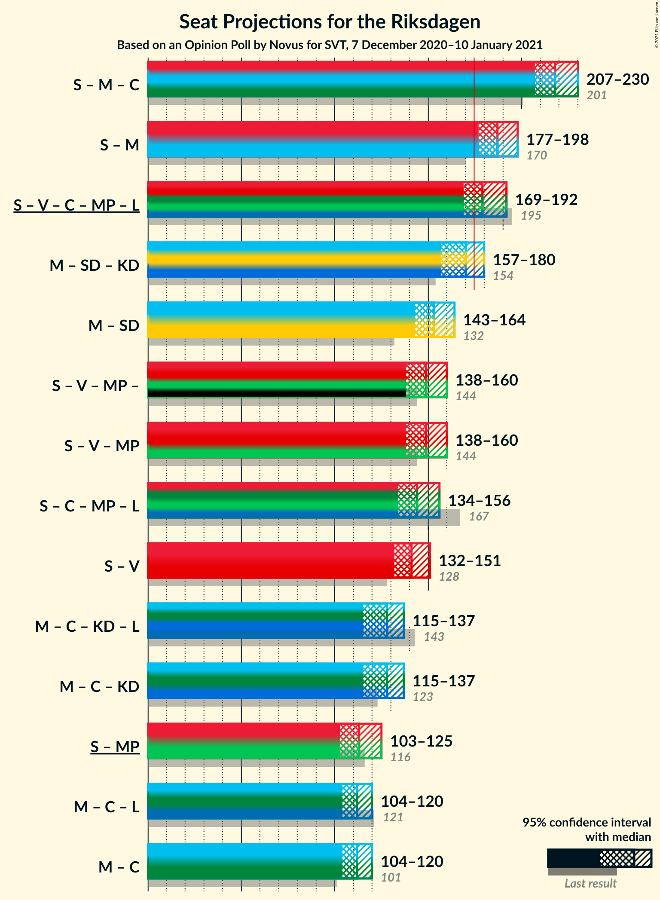

# Opinion Poll by Novus for SVT, 7 December 2020–10 January 2021

<a href="#voting-intentions">Voting Intentions</a> | <a href="#seats">Seats</a> | <a href="#coalitions">Coalitions</a> | <a href="#technical-information">Technical Information</a>

## Voting Intentions

### Confidence Intervals

| Party | Last Result | Poll Result | 80% Confidence Interval | 90% Confidence Interval | 95% Confidence Interval | 99% Confidence Interval |
|:-----:|:-----------:|:-----------:|:-----------------------:|:-----------------------:|:-----------------------:|:-----------------------:|
| Sveriges socialdemokratiska arbetareparti | 28.3% | 28.5% | 27.4–29.6% |27.1–30.0% |26.8–30.2% |26.3–30.8% |
| Moderata samlingspartiet | 19.8% | 21.8% | 20.8–22.8% |20.5–23.2% |20.3–23.4% |19.8–23.9% |
| Sverigedemokraterna | 17.5% | 19.4% | 18.5–20.4% |18.2–20.7% |18.0–20.9% |17.5–21.4% |
| Vänsterpartiet | 8.0% | 9.5% | 8.8–10.3% |8.6–10.5% |8.4–10.7% |8.1–11.1% |
| Centerpartiet | 8.6% | 8.3% | 7.6–9.0% |7.5–9.2% |7.3–9.4% |7.0–9.7% |
| Kristdemokraterna | 6.3% | 4.6% | 4.1–5.2% |4.0–5.3% |3.9–5.5% |3.7–5.7% |
| Miljöpartiet de gröna | 4.4% | 4.0% | 3.6–4.5% |3.4–4.7% |3.3–4.8% |3.1–5.1% |
| Liberalerna | 5.5% | 2.6% | 2.3–3.1% |2.1–3.2% |2.1–3.3% |1.9–3.5% |

*Note:* The poll result column reflects the actual value used in the calculations. Published results may vary slightly, and in addition be rounded to fewer digits.

## Seats

### Confidence Intervals

| Party | Last Result | Median | 80% Confidence Interval | 90% Confidence Interval | 95% Confidence Interval | 99% Confidence Interval |
|:-----:|:-----------:|:------:|:-----------------------:|:-----------------------:|:-----------------------:|:-----------------------:|
| <a href="#sveriges-socialdemokratiska-arbetareparti">Sveriges socialdemokratiska arbetareparti</a> | 100 | 106 | 101–111 |99–113 |98–114 |96–116 |
| <a href="#moderata-samlingspartiet">Moderata samlingspartiet</a> | 70 | 81 | 77–85 |76–87 |74–88 |72–91 |
| <a href="#sverigedemokraterna">Sverigedemokraterna</a> | 62 | 72 | 68–77 |67–78 |66–78 |64–81 |
| <a href="#vänsterpartiet">Vänsterpartiet</a> | 28 | 35 | 33–38 |32–39 |31–40 |30–42 |
| <a href="#centerpartiet">Centerpartiet</a> | 31 | 31 | 28–33 |27–34 |27–35 |26–36 |
| <a href="#kristdemokraterna">Kristdemokraterna</a> | 22 | 17 | 15–19 |0–20 |0–20 |0–21 |
| <a href="#miljöpartiet-de-gröna">Miljöpartiet de gröna</a> | 16 | 0 | 0–17 |0–17 |0–18 |0–18 |
| <a href="#liberalerna">Liberalerna</a> | 20 | 0 | 0 |0 |0 |0 |

### Sveriges socialdemokratiska arbetareparti

*For a full overview of the results for this party, see the [Sveriges socialdemokratiska arbetareparti](party-sverigessocialdemokratiskaarbetareparti.html) page.*

| Number of Seats | Probability | Accumulated | Special Marks |
|:---------------:|:-----------:|:-----------:|:-------------:|
| 94 | 0.1% | 100% |  |
| 95 | 0.2% | 99.8% |  |
| 96 | 0.3% | 99.7% |  |
| 97 | 1.1% | 99.4% |  |
| 98 | 2% | 98% |  |
| 99 | 2% | 97% |  |
| 100 | 2% | 95% | Last Result |
| 101 | 9% | 92% |  |
| 102 | 10% | 84% |  |
| 103 | 5% | 74% |  |
| 104 | 9% | 69% |  |
| 105 | 8% | 61% |  |
| 106 | 7% | 53% | Median |
| 107 | 12% | 45% |  |
| 108 | 10% | 33% |  |
| 109 | 3% | 24% |  |
| 110 | 9% | 21% |  |
| 111 | 2% | 12% |  |
| 112 | 4% | 9% |  |
| 113 | 3% | 6% |  |
| 114 | 2% | 3% |  |
| 115 | 0.5% | 1.3% |  |
| 116 | 0.3% | 0.8% |  |
| 117 | 0.2% | 0.4% |  |
| 118 | 0.1% | 0.3% |  |
| 119 | 0% | 0.1% |  |
| 120 | 0% | 0.1% |  |
| 121 | 0% | 0% |  |

### Moderata samlingspartiet

*For a full overview of the results for this party, see the [Moderata samlingspartiet](party-moderatasamlingspartiet.html) page.*

| Number of Seats | Probability | Accumulated | Special Marks |
|:---------------:|:-----------:|:-----------:|:-------------:|
| 70 | 0% | 100% | Last Result |
| 71 | 0.1% | 99.9% |  |
| 72 | 0.5% | 99.8% |  |
| 73 | 0.6% | 99.4% |  |
| 74 | 1.5% | 98.7% |  |
| 75 | 2% | 97% |  |
| 76 | 5% | 95% |  |
| 77 | 5% | 91% |  |
| 78 | 10% | 85% |  |
| 79 | 9% | 75% |  |
| 80 | 11% | 67% |  |
| 81 | 12% | 56% | Median |
| 82 | 12% | 44% |  |
| 83 | 10% | 32% |  |
| 84 | 8% | 22% |  |
| 85 | 5% | 14% |  |
| 86 | 3% | 9% |  |
| 87 | 3% | 6% |  |
| 88 | 1.1% | 3% |  |
| 89 | 0.8% | 2% |  |
| 90 | 0.4% | 1.3% |  |
| 91 | 0.6% | 0.8% |  |
| 92 | 0.2% | 0.2% |  |
| 93 | 0% | 0.1% |  |
| 94 | 0% | 0% |  |

### Sverigedemokraterna

*For a full overview of the results for this party, see the [Sverigedemokraterna](party-sverigedemokraterna.html) page.*

| Number of Seats | Probability | Accumulated | Special Marks |
|:---------------:|:-----------:|:-----------:|:-------------:|
| 62 | 0.1% | 100% | Last Result |
| 63 | 0.2% | 99.9% |  |
| 64 | 0.7% | 99.7% |  |
| 65 | 1.1% | 99.0% |  |
| 66 | 2% | 98% |  |
| 67 | 4% | 96% |  |
| 68 | 5% | 91% |  |
| 69 | 8% | 86% |  |
| 70 | 9% | 78% |  |
| 71 | 12% | 69% |  |
| 72 | 14% | 57% | Median |
| 73 | 7% | 43% |  |
| 74 | 14% | 35% |  |
| 75 | 7% | 22% |  |
| 76 | 4% | 15% |  |
| 77 | 5% | 10% |  |
| 78 | 3% | 5% |  |
| 79 | 1.1% | 2% |  |
| 80 | 0.5% | 1.1% |  |
| 81 | 0.4% | 0.6% |  |
| 82 | 0.1% | 0.2% |  |
| 83 | 0.1% | 0.1% |  |
| 84 | 0% | 0% |  |

### Vänsterpartiet

*For a full overview of the results for this party, see the [Vänsterpartiet](party-vänsterpartiet.html) page.*

| Number of Seats | Probability | Accumulated | Special Marks |
|:---------------:|:-----------:|:-----------:|:-------------:|
| 28 | 0% | 100% | Last Result |
| 29 | 0.2% | 99.9% |  |
| 30 | 0.8% | 99.7% |  |
| 31 | 2% | 99.0% |  |
| 32 | 5% | 97% |  |
| 33 | 10% | 93% |  |
| 34 | 15% | 83% |  |
| 35 | 24% | 68% | Median |
| 36 | 17% | 44% |  |
| 37 | 15% | 27% |  |
| 38 | 5% | 11% |  |
| 39 | 4% | 7% |  |
| 40 | 2% | 3% |  |
| 41 | 0.7% | 1.3% |  |
| 42 | 0.4% | 0.6% |  |
| 43 | 0.2% | 0.3% |  |
| 44 | 0% | 0% |  |

### Centerpartiet

*For a full overview of the results for this party, see the [Centerpartiet](party-centerpartiet.html) page.*

| Number of Seats | Probability | Accumulated | Special Marks |
|:---------------:|:-----------:|:-----------:|:-------------:|
| 24 | 0.1% | 100% |  |
| 25 | 0.2% | 99.9% |  |
| 26 | 1.1% | 99.8% |  |
| 27 | 4% | 98.6% |  |
| 28 | 10% | 95% |  |
| 29 | 10% | 85% |  |
| 30 | 18% | 74% |  |
| 31 | 22% | 56% | Last Result, Median |
| 32 | 15% | 35% |  |
| 33 | 10% | 20% |  |
| 34 | 7% | 9% |  |
| 35 | 1.4% | 3% |  |
| 36 | 0.8% | 1.3% |  |
| 37 | 0.4% | 0.5% |  |
| 38 | 0.1% | 0.1% |  |
| 39 | 0% | 0% |  |

### Kristdemokraterna

*For a full overview of the results for this party, see the [Kristdemokraterna](party-kristdemokraterna.html) page.*

| Number of Seats | Probability | Accumulated | Special Marks |
|:---------------:|:-----------:|:-----------:|:-------------:|
| 0 | 6% | 100% |  |
| 1 | 0% | 94% |  |
| 2 | 0% | 94% |  |
| 3 | 0% | 94% |  |
| 4 | 0% | 94% |  |
| 5 | 0% | 94% |  |
| 6 | 0% | 94% |  |
| 7 | 0% | 94% |  |
| 8 | 0% | 94% |  |
| 9 | 0% | 94% |  |
| 10 | 0% | 94% |  |
| 11 | 0% | 94% |  |
| 12 | 0% | 94% |  |
| 13 | 0% | 94% |  |
| 14 | 0% | 94% |  |
| 15 | 10% | 94% |  |
| 16 | 17% | 84% |  |
| 17 | 26% | 67% | Median |
| 18 | 21% | 41% |  |
| 19 | 14% | 20% |  |
| 20 | 4% | 6% |  |
| 21 | 2% | 2% |  |
| 22 | 0.3% | 0.4% | Last Result |
| 23 | 0% | 0% |  |

### Miljöpartiet de gröna

*For a full overview of the results for this party, see the [Miljöpartiet de gröna](party-miljöpartietdegröna.html) page.*

| Number of Seats | Probability | Accumulated | Special Marks |
|:---------------:|:-----------:|:-----------:|:-------------:|
| 0 | 51% | 100% | Median |
| 1 | 0% | 49% |  |
| 2 | 0% | 49% |  |
| 3 | 0% | 49% |  |
| 4 | 0% | 49% |  |
| 5 | 0% | 49% |  |
| 6 | 0% | 49% |  |
| 7 | 0% | 49% |  |
| 8 | 0% | 49% |  |
| 9 | 0% | 49% |  |
| 10 | 0% | 49% |  |
| 11 | 0% | 49% |  |
| 12 | 0% | 49% |  |
| 13 | 0% | 49% |  |
| 14 | 0.2% | 49% |  |
| 15 | 24% | 49% |  |
| 16 | 13% | 25% | Last Result |
| 17 | 9% | 12% |  |
| 18 | 3% | 3% |  |
| 19 | 0.4% | 0.5% |  |
| 20 | 0.1% | 0.1% |  |
| 21 | 0% | 0% |  |

### Liberalerna

*For a full overview of the results for this party, see the [Liberalerna](party-liberalerna.html) page.*

| Number of Seats | Probability | Accumulated | Special Marks |
|:---------------:|:-----------:|:-----------:|:-------------:|
| 0 | 100% | 100% | Median |
| 1 | 0% | 0% |  |
| 2 | 0% | 0% |  |
| 3 | 0% | 0% |  |
| 4 | 0% | 0% |  |
| 5 | 0% | 0% |  |
| 6 | 0% | 0% |  |
| 7 | 0% | 0% |  |
| 8 | 0% | 0% |  |
| 9 | 0% | 0% |  |
| 10 | 0% | 0% |  |
| 11 | 0% | 0% |  |
| 12 | 0% | 0% |  |
| 13 | 0% | 0% |  |
| 14 | 0% | 0% |  |
| 15 | 0% | 0% |  |
| 16 | 0% | 0% |  |
| 17 | 0% | 0% |  |
| 18 | 0% | 0% |  |
| 19 | 0% | 0% |  |
| 20 | 0% | 0% | Last Result |

## Coalitions

### Confidence Intervals

| Coalition | Last Result | Median | Majority? | 80% Confidence Interval | 90% Confidence Interval | 95% Confidence Interval | 99% Confidence Interval |
|:---------:|:-----------:|:------:|:---------:|:-----------------------:|:-----------------------:|:-----------------------:|:-----------------------:|
| Sveriges socialdemokratiska arbetareparti – Moderata samlingspartiet – Centerpartiet | 201 | 218 | 100% | 210–225 | 208–227 | 207–230 | 205–237 |
| Sveriges socialdemokratiska arbetareparti – Moderata samlingspartiet | 170 | 187 | 99.3% | 179–193 | 178–195 | 177–198 | 174–204 |
| Sveriges socialdemokratiska arbetareparti – Vänsterpartiet – Centerpartiet – Miljöpartiet de gröna – Liberalerna | 195 | 179 | 78% | 173–187 | 171–189 | 169–192 | 167–195 |
| Moderata samlingspartiet – Sverigedemokraterna – Kristdemokraterna | 154 | 170 | 22% | 162–176 | 160–178 | 157–180 | 154–182 |
| Moderata samlingspartiet – Sverigedemokraterna | 132 | 153 | 0% | 147–160 | 145–162 | 143–164 | 141–167 |
| Sveriges socialdemokratiska arbetareparti – Vänsterpartiet – Miljöpartiet de gröna | 144 | 149 | 0% | 141–156 | 140–159 | 138–160 | 135–164 |
| Sveriges socialdemokratiska arbetareparti – Centerpartiet – Miljöpartiet de gröna – Liberalerna | 167 | 144 | 0% | 136–153 | 135–154 | 134–156 | 132–160 |
| Sveriges socialdemokratiska arbetareparti – Vänsterpartiet | 128 | 141 | 0% | 135–147 | 134–149 | 132–151 | 130–154 |
| Moderata samlingspartiet – Centerpartiet – Kristdemokraterna – Liberalerna | 143 | 128 | 0% | 122–134 | 120–135 | 115–137 | 111–139 |
| Moderata samlingspartiet – Centerpartiet – Kristdemokraterna | 123 | 128 | 0% | 122–134 | 120–135 | 115–137 | 111–139 |
| Sveriges socialdemokratiska arbetareparti – Miljöpartiet de gröna | 116 | 113 | 0% | 105–122 | 104–124 | 103–125 | 100–128 |
| Moderata samlingspartiet – Centerpartiet – Liberalerna | 121 | 112 | 0% | 106–117 | 105–119 | 104–120 | 102–124 |
| Moderata samlingspartiet – Centerpartiet | 101 | 112 | 0% | 106–117 | 105–119 | 104–120 | 102–124 |

### Sveriges socialdemokratiska arbetareparti – Moderata samlingspartiet – Centerpartiet

| Number of Seats | Probability | Accumulated | Special Marks |
|:---------------:|:-----------:|:-----------:|:-------------:|
| 201 | 0% | 100% | Last Result |
| 202 | 0.1% | 99.9% |  |
| 203 | 0.1% | 99.8% |  |
| 204 | 0.2% | 99.7% |  |
| 205 | 0.5% | 99.5% |  |
| 206 | 1.0% | 99.0% |  |
| 207 | 1.5% | 98% |  |
| 208 | 2% | 96% |  |
| 209 | 3% | 95% |  |
| 210 | 6% | 92% |  |
| 211 | 8% | 86% |  |
| 212 | 3% | 78% |  |
| 213 | 5% | 75% |  |
| 214 | 6% | 70% |  |
| 215 | 7% | 64% |  |
| 216 | 3% | 57% |  |
| 217 | 3% | 54% |  |
| 218 | 3% | 52% | Median |
| 219 | 5% | 49% |  |
| 220 | 2% | 44% |  |
| 221 | 14% | 42% |  |
| 222 | 10% | 28% |  |
| 223 | 5% | 18% |  |
| 224 | 3% | 13% |  |
| 225 | 1.5% | 10% |  |
| 226 | 3% | 9% |  |
| 227 | 2% | 6% |  |
| 228 | 0.6% | 4% |  |
| 229 | 0.5% | 3% |  |
| 230 | 0.4% | 3% |  |
| 231 | 0.2% | 2% |  |
| 232 | 0.3% | 2% |  |
| 233 | 0.1% | 2% |  |
| 234 | 0.6% | 2% |  |
| 235 | 0.2% | 1.0% |  |
| 236 | 0.1% | 0.9% |  |
| 237 | 0.5% | 0.7% |  |
| 238 | 0.2% | 0.3% |  |
| 239 | 0% | 0.1% |  |
| 240 | 0% | 0% |  |

### Sveriges socialdemokratiska arbetareparti – Moderata samlingspartiet

| Number of Seats | Probability | Accumulated | Special Marks |
|:---------------:|:-----------:|:-----------:|:-------------:|
| 170 | 0% | 100% | Last Result |
| 171 | 0% | 100% |  |
| 172 | 0.1% | 99.9% |  |
| 173 | 0.2% | 99.9% |  |
| 174 | 0.5% | 99.7% |  |
| 175 | 0.6% | 99.3% | Majority |
| 176 | 1.0% | 98.7% |  |
| 177 | 2% | 98% |  |
| 178 | 1.3% | 96% |  |
| 179 | 5% | 94% |  |
| 180 | 3% | 89% |  |
| 181 | 5% | 86% |  |
| 182 | 3% | 81% |  |
| 183 | 12% | 78% |  |
| 184 | 5% | 66% |  |
| 185 | 4% | 61% |  |
| 186 | 7% | 58% |  |
| 187 | 3% | 51% | Median |
| 188 | 6% | 48% |  |
| 189 | 8% | 42% |  |
| 190 | 6% | 34% |  |
| 191 | 9% | 28% |  |
| 192 | 3% | 19% |  |
| 193 | 7% | 16% |  |
| 194 | 2% | 9% |  |
| 195 | 3% | 7% |  |
| 196 | 0.9% | 4% |  |
| 197 | 0.5% | 3% |  |
| 198 | 0.7% | 3% |  |
| 199 | 0.2% | 2% |  |
| 200 | 0.2% | 2% |  |
| 201 | 0.7% | 2% |  |
| 202 | 0.1% | 1.0% |  |
| 203 | 0.2% | 0.9% |  |
| 204 | 0.4% | 0.7% |  |
| 205 | 0.1% | 0.3% |  |
| 206 | 0.1% | 0.2% |  |
| 207 | 0% | 0.1% |  |
| 208 | 0% | 0% |  |

### Sveriges socialdemokratiska arbetareparti – Vänsterpartiet – Centerpartiet – Miljöpartiet de gröna – Liberalerna

| Number of Seats | Probability | Accumulated | Special Marks |
|:---------------:|:-----------:|:-----------:|:-------------:|
| 164 | 0.1% | 100% |  |
| 165 | 0% | 99.9% |  |
| 166 | 0.2% | 99.9% |  |
| 167 | 0.3% | 99.7% |  |
| 168 | 0.5% | 99.4% |  |
| 169 | 2% | 98.9% |  |
| 170 | 2% | 97% |  |
| 171 | 3% | 96% |  |
| 172 | 3% | 93% | Median |
| 173 | 5% | 90% |  |
| 174 | 6% | 85% |  |
| 175 | 3% | 78% | Majority |
| 176 | 3% | 75% |  |
| 177 | 12% | 72% |  |
| 178 | 4% | 60% |  |
| 179 | 6% | 55% |  |
| 180 | 6% | 50% |  |
| 181 | 6% | 43% |  |
| 182 | 7% | 38% |  |
| 183 | 4% | 30% |  |
| 184 | 6% | 26% |  |
| 185 | 5% | 20% |  |
| 186 | 2% | 15% |  |
| 187 | 5% | 13% |  |
| 188 | 3% | 8% |  |
| 189 | 1.5% | 5% |  |
| 190 | 1.0% | 4% |  |
| 191 | 0.4% | 3% |  |
| 192 | 0.8% | 3% |  |
| 193 | 0.3% | 2% |  |
| 194 | 0.7% | 1.4% |  |
| 195 | 0.3% | 0.7% | Last Result |
| 196 | 0.1% | 0.4% |  |
| 197 | 0.1% | 0.3% |  |
| 198 | 0.1% | 0.2% |  |
| 199 | 0.1% | 0.1% |  |
| 200 | 0% | 0.1% |  |
| 201 | 0% | 0% |  |

### Moderata samlingspartiet – Sverigedemokraterna – Kristdemokraterna

| Number of Seats | Probability | Accumulated | Special Marks |
|:---------------:|:-----------:|:-----------:|:-------------:|
| 149 | 0% | 100% |  |
| 150 | 0.1% | 99.9% |  |
| 151 | 0.1% | 99.9% |  |
| 152 | 0.1% | 99.8% |  |
| 153 | 0.1% | 99.7% |  |
| 154 | 0.3% | 99.6% | Last Result |
| 155 | 0.7% | 99.3% |  |
| 156 | 0.3% | 98.6% |  |
| 157 | 0.8% | 98% |  |
| 158 | 0.4% | 97% |  |
| 159 | 1.0% | 97% |  |
| 160 | 1.5% | 96% |  |
| 161 | 3% | 95% |  |
| 162 | 5% | 92% |  |
| 163 | 2% | 87% |  |
| 164 | 5% | 85% |  |
| 165 | 6% | 80% |  |
| 166 | 4% | 74% |  |
| 167 | 7% | 70% |  |
| 168 | 6% | 62% |  |
| 169 | 6% | 57% |  |
| 170 | 6% | 50% | Median |
| 171 | 4% | 45% |  |
| 172 | 12% | 40% |  |
| 173 | 3% | 28% |  |
| 174 | 3% | 25% |  |
| 175 | 6% | 22% | Majority |
| 176 | 5% | 15% |  |
| 177 | 3% | 10% |  |
| 178 | 3% | 7% |  |
| 179 | 2% | 4% |  |
| 180 | 2% | 3% |  |
| 181 | 0.5% | 1.1% |  |
| 182 | 0.3% | 0.6% |  |
| 183 | 0.2% | 0.3% |  |
| 184 | 0% | 0.1% |  |
| 185 | 0.1% | 0.1% |  |
| 186 | 0% | 0% |  |

### Moderata samlingspartiet – Sverigedemokraterna

| Number of Seats | Probability | Accumulated | Special Marks |
|:---------------:|:-----------:|:-----------:|:-------------:|
| 132 | 0% | 100% | Last Result |
| 133 | 0% | 100% |  |
| 134 | 0% | 100% |  |
| 135 | 0% | 100% |  |
| 136 | 0% | 100% |  |
| 137 | 0% | 100% |  |
| 138 | 0% | 100% |  |
| 139 | 0.1% | 100% |  |
| 140 | 0.2% | 99.9% |  |
| 141 | 0.3% | 99.7% |  |
| 142 | 0.7% | 99.4% |  |
| 143 | 1.3% | 98.7% |  |
| 144 | 2% | 97% |  |
| 145 | 3% | 96% |  |
| 146 | 3% | 93% |  |
| 147 | 5% | 90% |  |
| 148 | 5% | 85% |  |
| 149 | 5% | 80% |  |
| 150 | 9% | 75% |  |
| 151 | 4% | 66% |  |
| 152 | 6% | 62% |  |
| 153 | 10% | 56% | Median |
| 154 | 10% | 46% |  |
| 155 | 5% | 36% |  |
| 156 | 5% | 31% |  |
| 157 | 4% | 26% |  |
| 158 | 7% | 21% |  |
| 159 | 2% | 14% |  |
| 160 | 5% | 12% |  |
| 161 | 2% | 7% |  |
| 162 | 2% | 5% |  |
| 163 | 0.9% | 4% |  |
| 164 | 0.7% | 3% |  |
| 165 | 0.8% | 2% |  |
| 166 | 0.6% | 1.2% |  |
| 167 | 0.3% | 0.6% |  |
| 168 | 0.1% | 0.3% |  |
| 169 | 0.1% | 0.2% |  |
| 170 | 0.1% | 0.2% |  |
| 171 | 0% | 0% |  |

### Sveriges socialdemokratiska arbetareparti – Vänsterpartiet – Miljöpartiet de gröna

| Number of Seats | Probability | Accumulated | Special Marks |
|:---------------:|:-----------:|:-----------:|:-------------:|
| 134 | 0.2% | 100% |  |
| 135 | 0.4% | 99.8% |  |
| 136 | 0.1% | 99.4% |  |
| 137 | 0.8% | 99.3% |  |
| 138 | 2% | 98.5% |  |
| 139 | 2% | 97% |  |
| 140 | 4% | 95% |  |
| 141 | 3% | 92% | Median |
| 142 | 5% | 89% |  |
| 143 | 7% | 84% |  |
| 144 | 4% | 77% | Last Result |
| 145 | 5% | 73% |  |
| 146 | 5% | 68% |  |
| 147 | 8% | 63% |  |
| 148 | 4% | 55% |  |
| 149 | 2% | 51% |  |
| 150 | 4% | 49% |  |
| 151 | 11% | 45% |  |
| 152 | 7% | 34% |  |
| 153 | 2% | 27% |  |
| 154 | 3% | 25% |  |
| 155 | 6% | 22% |  |
| 156 | 6% | 16% |  |
| 157 | 2% | 9% |  |
| 158 | 2% | 7% |  |
| 159 | 2% | 5% |  |
| 160 | 2% | 3% |  |
| 161 | 0.6% | 2% |  |
| 162 | 0.2% | 1.2% |  |
| 163 | 0.4% | 1.0% |  |
| 164 | 0.3% | 0.6% |  |
| 165 | 0.1% | 0.4% |  |
| 166 | 0.1% | 0.2% |  |
| 167 | 0.1% | 0.1% |  |
| 168 | 0% | 0% |  |

### Sveriges socialdemokratiska arbetareparti – Centerpartiet – Miljöpartiet de gröna – Liberalerna

| Number of Seats | Probability | Accumulated | Special Marks |
|:---------------:|:-----------:|:-----------:|:-------------:|
| 129 | 0.1% | 100% |  |
| 130 | 0.2% | 99.9% |  |
| 131 | 0.2% | 99.7% |  |
| 132 | 0.4% | 99.5% |  |
| 133 | 1.3% | 99.1% |  |
| 134 | 2% | 98% |  |
| 135 | 1.1% | 95% |  |
| 136 | 5% | 94% |  |
| 137 | 4% | 90% | Median |
| 138 | 7% | 86% |  |
| 139 | 3% | 78% |  |
| 140 | 8% | 75% |  |
| 141 | 6% | 67% |  |
| 142 | 4% | 61% |  |
| 143 | 3% | 58% |  |
| 144 | 6% | 54% |  |
| 145 | 4% | 48% |  |
| 146 | 4% | 45% |  |
| 147 | 7% | 41% |  |
| 148 | 7% | 33% |  |
| 149 | 6% | 26% |  |
| 150 | 3% | 21% |  |
| 151 | 4% | 18% |  |
| 152 | 3% | 13% |  |
| 153 | 5% | 11% |  |
| 154 | 2% | 6% |  |
| 155 | 0.8% | 4% |  |
| 156 | 1.1% | 3% |  |
| 157 | 0.5% | 2% |  |
| 158 | 1.1% | 2% |  |
| 159 | 0.1% | 0.7% |  |
| 160 | 0.2% | 0.5% |  |
| 161 | 0.2% | 0.3% |  |
| 162 | 0.1% | 0.1% |  |
| 163 | 0% | 0.1% |  |
| 164 | 0% | 0% |  |
| 165 | 0% | 0% |  |
| 166 | 0% | 0% |  |
| 167 | 0% | 0% | Last Result |

### Sveriges socialdemokratiska arbetareparti – Vänsterpartiet

| Number of Seats | Probability | Accumulated | Special Marks |
|:---------------:|:-----------:|:-----------:|:-------------:|
| 127 | 0% | 100% |  |
| 128 | 0.1% | 99.9% | Last Result |
| 129 | 0.1% | 99.9% |  |
| 130 | 0.4% | 99.7% |  |
| 131 | 1.3% | 99.3% |  |
| 132 | 1.2% | 98% |  |
| 133 | 1.4% | 97% |  |
| 134 | 2% | 95% |  |
| 135 | 6% | 94% |  |
| 136 | 8% | 88% |  |
| 137 | 7% | 80% |  |
| 138 | 4% | 72% |  |
| 139 | 5% | 68% |  |
| 140 | 10% | 63% |  |
| 141 | 7% | 53% | Median |
| 142 | 6% | 46% |  |
| 143 | 9% | 40% |  |
| 144 | 5% | 31% |  |
| 145 | 5% | 25% |  |
| 146 | 5% | 20% |  |
| 147 | 7% | 16% |  |
| 148 | 3% | 8% |  |
| 149 | 2% | 6% |  |
| 150 | 0.9% | 4% |  |
| 151 | 2% | 3% |  |
| 152 | 0.5% | 1.4% |  |
| 153 | 0.3% | 0.9% |  |
| 154 | 0.2% | 0.7% |  |
| 155 | 0.2% | 0.5% |  |
| 156 | 0.1% | 0.3% |  |
| 157 | 0.1% | 0.2% |  |
| 158 | 0% | 0.1% |  |
| 159 | 0% | 0% |  |

### Moderata samlingspartiet – Centerpartiet – Kristdemokraterna – Liberalerna

| Number of Seats | Probability | Accumulated | Special Marks |
|:---------------:|:-----------:|:-----------:|:-------------:|
| 107 | 0% | 100% |  |
| 108 | 0.1% | 99.9% |  |
| 109 | 0.2% | 99.9% |  |
| 110 | 0.1% | 99.6% |  |
| 111 | 0.2% | 99.5% |  |
| 112 | 0.2% | 99.3% |  |
| 113 | 0.6% | 99.1% |  |
| 114 | 0.4% | 98.5% |  |
| 115 | 0.6% | 98% |  |
| 116 | 0.5% | 97% |  |
| 117 | 0.5% | 97% |  |
| 118 | 0.8% | 96% |  |
| 119 | 0.6% | 96% |  |
| 120 | 2% | 95% |  |
| 121 | 2% | 94% |  |
| 122 | 4% | 92% |  |
| 123 | 5% | 88% |  |
| 124 | 5% | 83% |  |
| 125 | 5% | 78% |  |
| 126 | 9% | 73% |  |
| 127 | 5% | 63% |  |
| 128 | 9% | 58% |  |
| 129 | 9% | 49% | Median |
| 130 | 6% | 40% |  |
| 131 | 5% | 34% |  |
| 132 | 12% | 29% |  |
| 133 | 4% | 17% |  |
| 134 | 5% | 13% |  |
| 135 | 4% | 8% |  |
| 136 | 2% | 5% |  |
| 137 | 1.3% | 3% |  |
| 138 | 1.1% | 2% |  |
| 139 | 0.2% | 0.6% |  |
| 140 | 0.2% | 0.4% |  |
| 141 | 0.1% | 0.2% |  |
| 142 | 0% | 0.1% |  |
| 143 | 0% | 0% | Last Result |

### Moderata samlingspartiet – Centerpartiet – Kristdemokraterna

| Number of Seats | Probability | Accumulated | Special Marks |
|:---------------:|:-----------:|:-----------:|:-------------:|
| 107 | 0% | 100% |  |
| 108 | 0.1% | 99.9% |  |
| 109 | 0.2% | 99.9% |  |
| 110 | 0.1% | 99.6% |  |
| 111 | 0.2% | 99.5% |  |
| 112 | 0.2% | 99.3% |  |
| 113 | 0.6% | 99.1% |  |
| 114 | 0.4% | 98.5% |  |
| 115 | 0.6% | 98% |  |
| 116 | 0.5% | 97% |  |
| 117 | 0.5% | 97% |  |
| 118 | 0.8% | 96% |  |
| 119 | 0.6% | 96% |  |
| 120 | 2% | 95% |  |
| 121 | 2% | 94% |  |
| 122 | 4% | 92% |  |
| 123 | 5% | 88% | Last Result |
| 124 | 5% | 83% |  |
| 125 | 5% | 78% |  |
| 126 | 9% | 73% |  |
| 127 | 5% | 63% |  |
| 128 | 9% | 58% |  |
| 129 | 9% | 49% | Median |
| 130 | 6% | 40% |  |
| 131 | 5% | 34% |  |
| 132 | 12% | 29% |  |
| 133 | 4% | 17% |  |
| 134 | 5% | 13% |  |
| 135 | 4% | 8% |  |
| 136 | 2% | 5% |  |
| 137 | 1.3% | 3% |  |
| 138 | 1.1% | 2% |  |
| 139 | 0.2% | 0.6% |  |
| 140 | 0.2% | 0.4% |  |
| 141 | 0.1% | 0.2% |  |
| 142 | 0% | 0.1% |  |
| 143 | 0% | 0% |  |

### Sveriges socialdemokratiska arbetareparti – Miljöpartiet de gröna

| Number of Seats | Probability | Accumulated | Special Marks |
|:---------------:|:-----------:|:-----------:|:-------------:|
| 98 | 0.1% | 100% |  |
| 99 | 0.1% | 99.9% |  |
| 100 | 0.6% | 99.8% |  |
| 101 | 0.8% | 99.3% |  |
| 102 | 0.6% | 98% |  |
| 103 | 2% | 98% |  |
| 104 | 6% | 96% |  |
| 105 | 2% | 90% |  |
| 106 | 2% | 88% | Median |
| 107 | 8% | 86% |  |
| 108 | 8% | 78% |  |
| 109 | 2% | 70% |  |
| 110 | 8% | 68% |  |
| 111 | 2% | 60% |  |
| 112 | 4% | 57% |  |
| 113 | 3% | 53% |  |
| 114 | 3% | 50% |  |
| 115 | 2% | 47% |  |
| 116 | 8% | 45% | Last Result |
| 117 | 5% | 37% |  |
| 118 | 5% | 32% |  |
| 119 | 5% | 27% |  |
| 120 | 4% | 22% |  |
| 121 | 5% | 17% |  |
| 122 | 3% | 13% |  |
| 123 | 4% | 9% |  |
| 124 | 2% | 6% |  |
| 125 | 2% | 4% |  |
| 126 | 0.6% | 2% |  |
| 127 | 0.4% | 1.0% |  |
| 128 | 0.2% | 0.6% |  |
| 129 | 0.2% | 0.5% |  |
| 130 | 0.2% | 0.3% |  |
| 131 | 0% | 0.1% |  |
| 132 | 0% | 0% |  |

### Moderata samlingspartiet – Centerpartiet – Liberalerna

| Number of Seats | Probability | Accumulated | Special Marks |
|:---------------:|:-----------:|:-----------:|:-------------:|
| 100 | 0.1% | 100% |  |
| 101 | 0.2% | 99.9% |  |
| 102 | 0.7% | 99.7% |  |
| 103 | 0.7% | 99.0% |  |
| 104 | 1.2% | 98% |  |
| 105 | 2% | 97% |  |
| 106 | 5% | 95% |  |
| 107 | 6% | 90% |  |
| 108 | 6% | 84% |  |
| 109 | 9% | 78% |  |
| 110 | 8% | 69% |  |
| 111 | 10% | 61% |  |
| 112 | 5% | 51% | Median |
| 113 | 14% | 46% |  |
| 114 | 5% | 31% |  |
| 115 | 10% | 26% |  |
| 116 | 5% | 16% |  |
| 117 | 5% | 12% |  |
| 118 | 2% | 7% |  |
| 119 | 2% | 5% |  |
| 120 | 2% | 4% |  |
| 121 | 0.7% | 2% | Last Result |
| 122 | 0.3% | 1.3% |  |
| 123 | 0.2% | 1.0% |  |
| 124 | 0.4% | 0.8% |  |
| 125 | 0.1% | 0.4% |  |
| 126 | 0.1% | 0.2% |  |
| 127 | 0% | 0.1% |  |
| 128 | 0.1% | 0.1% |  |
| 129 | 0% | 0% |  |

### Moderata samlingspartiet – Centerpartiet

| Number of Seats | Probability | Accumulated | Special Marks |
|:---------------:|:-----------:|:-----------:|:-------------:|
| 100 | 0.1% | 100% |  |
| 101 | 0.2% | 99.9% | Last Result |
| 102 | 0.7% | 99.7% |  |
| 103 | 0.7% | 99.0% |  |
| 104 | 1.2% | 98% |  |
| 105 | 2% | 97% |  |
| 106 | 5% | 95% |  |
| 107 | 6% | 90% |  |
| 108 | 6% | 84% |  |
| 109 | 9% | 78% |  |
| 110 | 8% | 69% |  |
| 111 | 10% | 61% |  |
| 112 | 5% | 51% | Median |
| 113 | 14% | 46% |  |
| 114 | 5% | 31% |  |
| 115 | 10% | 26% |  |
| 116 | 5% | 16% |  |
| 117 | 5% | 12% |  |
| 118 | 2% | 7% |  |
| 119 | 2% | 5% |  |
| 120 | 2% | 4% |  |
| 121 | 0.7% | 2% |  |
| 122 | 0.3% | 1.3% |  |
| 123 | 0.2% | 1.0% |  |
| 124 | 0.4% | 0.8% |  |
| 125 | 0.1% | 0.4% |  |
| 126 | 0.1% | 0.2% |  |
| 127 | 0% | 0.1% |  |
| 128 | 0.1% | 0.1% |  |
| 129 | 0% | 0% |  |

## Technical Information

### Opinion Poll

+ **Polling firm:** Novus
+ **Commissioner(s):** SVT
+ **Fieldwork period:** 7 December 2020–10 January 2021

### Calculations

+ **Sample size:** 2715
+ **Simulations done:** 1,048,576
+ **Error estimate:** 0.99%

