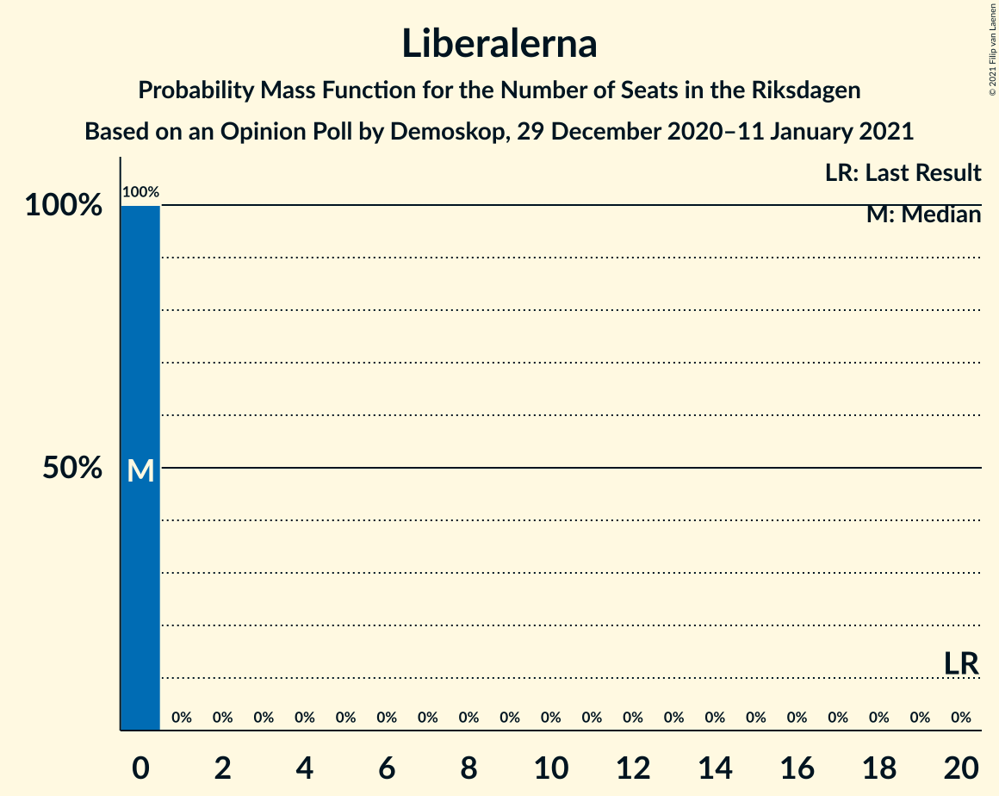

# Opinion Poll by Demoskop, 29 December 2020–11 January 2021

<a href="#voting-intentions">Voting Intentions</a> | <a href="#seats">Seats</a> | <a href="#coalitions">Coalitions</a> | <a href="#technical-information">Technical Information</a>

## Voting Intentions

### Confidence Intervals

| Party | Last Result | Poll Result | 80% Confidence Interval | 90% Confidence Interval | 95% Confidence Interval | 99% Confidence Interval |
|:-----:|:-----------:|:-----------:|:-----------------------:|:-----------------------:|:-----------------------:|:-----------------------:|
| Moderata samlingspartiet | 19.8% | 23.2% | 22.0–24.4% |21.7–24.8% |21.4–25.1% |20.9–25.7% |
| Sveriges socialdemokratiska arbetareparti | 28.3% | 23.0% | 21.8–24.2% |21.5–24.5% |21.2–24.8% |20.7–25.4% |
| Sverigedemokraterna | 17.5% | 19.5% | 18.4–20.6% |18.1–21.0% |17.8–21.2% |17.3–21.8% |
| Vänsterpartiet | 8.0% | 9.9% | 9.1–10.8% |8.9–11.0% |8.7–11.2% |8.3–11.7% |
| Centerpartiet | 8.6% | 9.2% | 8.4–10.1% |8.2–10.3% |8.0–10.5% |7.7–11.0% |
| Kristdemokraterna | 6.3% | 5.9% | 5.3–6.6% |5.1–6.8% |4.9–7.0% |4.7–7.3% |
| Miljöpartiet de gröna | 4.4% | 5.0% | 4.5–5.7% |4.3–5.9% |4.1–6.0% |3.9–6.4% |
| Liberalerna | 5.5% | 2.3% | 1.9–2.8% |1.8–2.9% |1.7–3.0% |1.6–3.3% |

*Note:* The poll result column reflects the actual value used in the calculations. Published results may vary slightly, and in addition be rounded to fewer digits.

## Seats

### Confidence Intervals

| Party | Last Result | Median | 80% Confidence Interval | 90% Confidence Interval | 95% Confidence Interval | 99% Confidence Interval |
|:-----:|:-----------:|:------:|:-----------------------:|:-----------------------:|:-----------------------:|:-----------------------:|
| <a href="#moderata-samlingspartiet">Moderata samlingspartiet</a> | 70 | 85 | 80–89 |79–90 |78–92 |76–94 |
| <a href="#sveriges-socialdemokratiska-arbetareparti">Sveriges socialdemokratiska arbetareparti</a> | 100 | 84 | 79–88 |78–89 |77–90 |75–93 |
| <a href="#sverigedemokraterna">Sverigedemokraterna</a> | 62 | 71 | 67–75 |66–76 |65–77 |63–79 |
| <a href="#vänsterpartiet">Vänsterpartiet</a> | 28 | 36 | 33–39 |32–40 |32–41 |30–43 |
| <a href="#centerpartiet">Centerpartiet</a> | 31 | 33 | 31–37 |30–38 |29–38 |28–40 |
| <a href="#kristdemokraterna">Kristdemokraterna</a> | 22 | 21 | 19–24 |19–25 |18–25 |17–27 |
| <a href="#miljöpartiet-de-gröna">Miljöpartiet de gröna</a> | 16 | 18 | 16–21 |16–22 |15–22 |0–23 |
| <a href="#liberalerna">Liberalerna</a> | 20 | 0 | 0 |0 |0 |0 |

### Moderata samlingspartiet

*For a full overview of the results for this party, see the [Moderata samlingspartiet](party-moderatasamlingspartiet.html) page.*

| Number of Seats | Probability | Accumulated | Special Marks |
|:---------------:|:-----------:|:-----------:|:-------------:|
| 70 | 0% | 100% | Last Result |
| 71 | 0% | 100% |  |
| 72 | 0% | 100% |  |
| 73 | 0% | 100% |  |
| 74 | 0% | 100% |  |
| 75 | 0.2% | 99.9% |  |
| 76 | 0.5% | 99.7% |  |
| 77 | 0.8% | 99.2% |  |
| 78 | 1.3% | 98% |  |
| 79 | 4% | 97% |  |
| 80 | 7% | 94% |  |
| 81 | 6% | 87% |  |
| 82 | 7% | 81% |  |
| 83 | 9% | 74% |  |
| 84 | 13% | 65% |  |
| 85 | 13% | 52% | Median |
| 86 | 8% | 39% |  |
| 87 | 8% | 31% |  |
| 88 | 11% | 24% |  |
| 89 | 6% | 13% |  |
| 90 | 2% | 7% |  |
| 91 | 2% | 5% |  |
| 92 | 1.4% | 3% |  |
| 93 | 0.9% | 1.4% |  |
| 94 | 0.3% | 0.6% |  |
| 95 | 0.1% | 0.3% |  |
| 96 | 0.1% | 0.2% |  |
| 97 | 0% | 0.1% |  |
| 98 | 0% | 0% |  |

### Sveriges socialdemokratiska arbetareparti

*For a full overview of the results for this party, see the [Sveriges socialdemokratiska arbetareparti](party-sverigessocialdemokratiskaarbetareparti.html) page.*

| Number of Seats | Probability | Accumulated | Special Marks |
|:---------------:|:-----------:|:-----------:|:-------------:|
| 73 | 0.1% | 100% |  |
| 74 | 0.2% | 99.9% |  |
| 75 | 0.4% | 99.7% |  |
| 76 | 0.8% | 99.4% |  |
| 77 | 1.3% | 98.6% |  |
| 78 | 3% | 97% |  |
| 79 | 5% | 95% |  |
| 80 | 6% | 89% |  |
| 81 | 8% | 84% |  |
| 82 | 16% | 76% |  |
| 83 | 8% | 59% |  |
| 84 | 10% | 51% | Median |
| 85 | 11% | 41% |  |
| 86 | 9% | 30% |  |
| 87 | 9% | 20% |  |
| 88 | 5% | 12% |  |
| 89 | 2% | 7% |  |
| 90 | 2% | 5% |  |
| 91 | 1.0% | 2% |  |
| 92 | 0.6% | 1.2% |  |
| 93 | 0.3% | 0.6% |  |
| 94 | 0.1% | 0.3% |  |
| 95 | 0.1% | 0.1% |  |
| 96 | 0% | 0% |  |
| 97 | 0% | 0% |  |
| 98 | 0% | 0% |  |
| 99 | 0% | 0% |  |
| 100 | 0% | 0% | Last Result |

### Sverigedemokraterna

*For a full overview of the results for this party, see the [Sverigedemokraterna](party-sverigedemokraterna.html) page.*

| Number of Seats | Probability | Accumulated | Special Marks |
|:---------------:|:-----------:|:-----------:|:-------------:|
| 61 | 0.1% | 100% |  |
| 62 | 0.2% | 99.9% | Last Result |
| 63 | 0.4% | 99.7% |  |
| 64 | 1.1% | 99.3% |  |
| 65 | 2% | 98% |  |
| 66 | 4% | 96% |  |
| 67 | 6% | 92% |  |
| 68 | 5% | 86% |  |
| 69 | 10% | 81% |  |
| 70 | 13% | 71% |  |
| 71 | 15% | 57% | Median |
| 72 | 10% | 42% |  |
| 73 | 9% | 32% |  |
| 74 | 9% | 23% |  |
| 75 | 6% | 14% |  |
| 76 | 4% | 9% |  |
| 77 | 2% | 4% |  |
| 78 | 1.0% | 2% |  |
| 79 | 0.8% | 1.3% |  |
| 80 | 0.3% | 0.5% |  |
| 81 | 0.1% | 0.2% |  |
| 82 | 0% | 0.1% |  |
| 83 | 0% | 0% |  |

### Vänsterpartiet

*For a full overview of the results for this party, see the [Vänsterpartiet](party-vänsterpartiet.html) page.*

| Number of Seats | Probability | Accumulated | Special Marks |
|:---------------:|:-----------:|:-----------:|:-------------:|
| 28 | 0% | 100% | Last Result |
| 29 | 0.2% | 100% |  |
| 30 | 0.6% | 99.8% |  |
| 31 | 1.4% | 99.3% |  |
| 32 | 4% | 98% |  |
| 33 | 6% | 94% |  |
| 34 | 10% | 88% |  |
| 35 | 18% | 78% |  |
| 36 | 18% | 60% | Median |
| 37 | 16% | 43% |  |
| 38 | 12% | 26% |  |
| 39 | 7% | 14% |  |
| 40 | 4% | 8% |  |
| 41 | 2% | 4% |  |
| 42 | 1.0% | 2% |  |
| 43 | 0.4% | 0.6% |  |
| 44 | 0.1% | 0.2% |  |
| 45 | 0% | 0% |  |

### Centerpartiet

*For a full overview of the results for this party, see the [Centerpartiet](party-centerpartiet.html) page.*

| Number of Seats | Probability | Accumulated | Special Marks |
|:---------------:|:-----------:|:-----------:|:-------------:|
| 27 | 0.2% | 100% |  |
| 28 | 0.6% | 99.8% |  |
| 29 | 2% | 99.2% |  |
| 30 | 6% | 97% |  |
| 31 | 13% | 92% | Last Result |
| 32 | 17% | 79% |  |
| 33 | 13% | 62% | Median |
| 34 | 13% | 49% |  |
| 35 | 14% | 36% |  |
| 36 | 10% | 23% |  |
| 37 | 6% | 13% |  |
| 38 | 4% | 6% |  |
| 39 | 2% | 2% |  |
| 40 | 0.5% | 0.8% |  |
| 41 | 0.2% | 0.3% |  |
| 42 | 0.1% | 0.1% |  |
| 43 | 0% | 0% |  |

### Kristdemokraterna

*For a full overview of the results for this party, see the [Kristdemokraterna](party-kristdemokraterna.html) page.*

| Number of Seats | Probability | Accumulated | Special Marks |
|:---------------:|:-----------:|:-----------:|:-------------:|
| 16 | 0.2% | 100% |  |
| 17 | 0.9% | 99.8% |  |
| 18 | 3% | 98.9% |  |
| 19 | 9% | 95% |  |
| 20 | 14% | 87% |  |
| 21 | 26% | 73% | Median |
| 22 | 18% | 47% | Last Result |
| 23 | 15% | 29% |  |
| 24 | 9% | 15% |  |
| 25 | 3% | 6% |  |
| 26 | 2% | 2% |  |
| 27 | 0.4% | 0.6% |  |
| 28 | 0.1% | 0.1% |  |
| 29 | 0% | 0% |  |

### Miljöpartiet de gröna

*For a full overview of the results for this party, see the [Miljöpartiet de gröna](party-miljöpartietdegröna.html) page.*

| Number of Seats | Probability | Accumulated | Special Marks |
|:---------------:|:-----------:|:-----------:|:-------------:|
| 0 | 0.9% | 100% |  |
| 1 | 0% | 99.1% |  |
| 2 | 0% | 99.1% |  |
| 3 | 0% | 99.1% |  |
| 4 | 0% | 99.1% |  |
| 5 | 0% | 99.1% |  |
| 6 | 0% | 99.1% |  |
| 7 | 0% | 99.1% |  |
| 8 | 0% | 99.1% |  |
| 9 | 0% | 99.1% |  |
| 10 | 0% | 99.1% |  |
| 11 | 0% | 99.1% |  |
| 12 | 0% | 99.1% |  |
| 13 | 0% | 99.1% |  |
| 14 | 0% | 99.1% |  |
| 15 | 4% | 99.1% |  |
| 16 | 12% | 95% | Last Result |
| 17 | 18% | 83% |  |
| 18 | 19% | 65% | Median |
| 19 | 19% | 46% |  |
| 20 | 13% | 27% |  |
| 21 | 9% | 14% |  |
| 22 | 5% | 6% |  |
| 23 | 0.8% | 1.1% |  |
| 24 | 0.2% | 0.3% |  |
| 25 | 0.1% | 0.1% |  |
| 26 | 0% | 0% |  |

### Liberalerna

*For a full overview of the results for this party, see the [Liberalerna](party-liberalerna.html) page.*

| Number of Seats | Probability | Accumulated | Special Marks |
|:---------------:|:-----------:|:-----------:|:-------------:|
| 0 | 100% | 100% | Median |
| 1 | 0% | 0% |  |
| 2 | 0% | 0% |  |
| 3 | 0% | 0% |  |
| 4 | 0% | 0% |  |
| 5 | 0% | 0% |  |
| 6 | 0% | 0% |  |
| 7 | 0% | 0% |  |
| 8 | 0% | 0% |  |
| 9 | 0% | 0% |  |
| 10 | 0% | 0% |  |
| 11 | 0% | 0% |  |
| 12 | 0% | 0% |  |
| 13 | 0% | 0% |  |
| 14 | 0% | 0% |  |
| 15 | 0% | 0% |  |
| 16 | 0% | 0% |  |
| 17 | 0% | 0% |  |
| 18 | 0% | 0% |  |
| 19 | 0% | 0% |  |
| 20 | 0% | 0% | Last Result |

## Coalitions

### Confidence Intervals

| Coalition | Last Result | Median | Majority? | 80% Confidence Interval | 90% Confidence Interval | 95% Confidence Interval | 99% Confidence Interval |
|:---------:|:-----------:|:------:|:---------:|:-----------------------:|:-----------------------:|:-----------------------:|:-----------------------:|
| Moderata samlingspartiet – Sveriges socialdemokratiska arbetareparti – Centerpartiet | 201 | 202 | 100% | 197–207 | 196–209 | 194–210 | 192–214 |
| Moderata samlingspartiet – Sverigedemokraterna – Kristdemokraterna | 154 | 177 | 77% | 172–182 | 171–184 | 169–186 | 167–189 |
| Sveriges socialdemokratiska arbetareparti – Vänsterpartiet – Centerpartiet – Miljöpartiet de gröna – Liberalerna | 195 | 172 | 23% | 167–177 | 165–178 | 163–180 | 160–182 |
| Moderata samlingspartiet – Sveriges socialdemokratiska arbetareparti | 170 | 168 | 6% | 163–173 | 162–175 | 161–176 | 158–180 |
| Moderata samlingspartiet – Sverigedemokraterna | 132 | 156 | 0% | 151–161 | 149–163 | 148–164 | 146–167 |
| Moderata samlingspartiet – Centerpartiet – Kristdemokraterna – Liberalerna | 143 | 140 | 0% | 135–145 | 134–146 | 132–148 | 130–151 |
| Moderata samlingspartiet – Centerpartiet – Kristdemokraterna | 123 | 140 | 0% | 135–145 | 134–146 | 132–148 | 130–151 |
| Sveriges socialdemokratiska arbetareparti – Vänsterpartiet – Miljöpartiet de gröna | 144 | 138 | 0% | 133–143 | 132–144 | 130–146 | 126–148 |
| Sveriges socialdemokratiska arbetareparti – Centerpartiet – Miljöpartiet de gröna – Liberalerna | 167 | 135 | 0% | 131–141 | 129–142 | 128–143 | 122–146 |
| Sveriges socialdemokratiska arbetareparti – Vänsterpartiet | 128 | 120 | 0% | 115–125 | 114–126 | 113–127 | 110–130 |
| Moderata samlingspartiet – Centerpartiet – Liberalerna | 121 | 118 | 0% | 114–123 | 113–125 | 111–126 | 109–128 |
| Moderata samlingspartiet – Centerpartiet | 101 | 118 | 0% | 114–123 | 113–125 | 111–126 | 109–128 |
| Sveriges socialdemokratiska arbetareparti – Miljöpartiet de gröna | 116 | 102 | 0% | 97–107 | 96–108 | 94–109 | 88–111 |

### Moderata samlingspartiet – Sveriges socialdemokratiska arbetareparti – Centerpartiet

| Number of Seats | Probability | Accumulated | Special Marks |
|:---------------:|:-----------:|:-----------:|:-------------:|
| 189 | 0% | 100% |  |
| 190 | 0.1% | 99.9% |  |
| 191 | 0.2% | 99.9% |  |
| 192 | 0.4% | 99.6% |  |
| 193 | 0.7% | 99.3% |  |
| 194 | 1.2% | 98.6% |  |
| 195 | 1.4% | 97% |  |
| 196 | 4% | 96% |  |
| 197 | 5% | 92% |  |
| 198 | 6% | 87% |  |
| 199 | 8% | 81% |  |
| 200 | 11% | 73% |  |
| 201 | 7% | 62% | Last Result |
| 202 | 12% | 55% | Median |
| 203 | 9% | 43% |  |
| 204 | 8% | 34% |  |
| 205 | 6% | 26% |  |
| 206 | 9% | 20% |  |
| 207 | 3% | 12% |  |
| 208 | 3% | 9% |  |
| 209 | 2% | 5% |  |
| 210 | 0.9% | 3% |  |
| 211 | 0.8% | 2% |  |
| 212 | 0.4% | 1.2% |  |
| 213 | 0.2% | 0.8% |  |
| 214 | 0.1% | 0.6% |  |
| 215 | 0.1% | 0.4% |  |
| 216 | 0% | 0.3% |  |
| 217 | 0.1% | 0.2% |  |
| 218 | 0.1% | 0.2% |  |
| 219 | 0.1% | 0.1% |  |
| 220 | 0% | 0% |  |

### Moderata samlingspartiet – Sverigedemokraterna – Kristdemokraterna

| Number of Seats | Probability | Accumulated | Special Marks |
|:---------------:|:-----------:|:-----------:|:-------------:|
| 154 | 0% | 100% | Last Result |
| 155 | 0% | 100% |  |
| 156 | 0% | 100% |  |
| 157 | 0% | 100% |  |
| 158 | 0% | 100% |  |
| 159 | 0% | 100% |  |
| 160 | 0% | 100% |  |
| 161 | 0% | 100% |  |
| 162 | 0% | 100% |  |
| 163 | 0% | 100% |  |
| 164 | 0% | 100% |  |
| 165 | 0.1% | 99.9% |  |
| 166 | 0.2% | 99.9% |  |
| 167 | 0.3% | 99.7% |  |
| 168 | 0.8% | 99.3% |  |
| 169 | 1.2% | 98.5% |  |
| 170 | 2% | 97% |  |
| 171 | 3% | 95% |  |
| 172 | 4% | 92% |  |
| 173 | 6% | 89% |  |
| 174 | 6% | 82% |  |
| 175 | 9% | 77% | Majority |
| 176 | 10% | 68% |  |
| 177 | 11% | 58% | Median |
| 178 | 8% | 47% |  |
| 179 | 8% | 39% |  |
| 180 | 11% | 31% |  |
| 181 | 6% | 21% |  |
| 182 | 5% | 15% |  |
| 183 | 2% | 9% |  |
| 184 | 3% | 7% |  |
| 185 | 1.2% | 4% |  |
| 186 | 0.9% | 3% |  |
| 187 | 0.8% | 2% |  |
| 188 | 0.3% | 0.9% |  |
| 189 | 0.2% | 0.7% |  |
| 190 | 0.2% | 0.5% |  |
| 191 | 0.1% | 0.2% |  |
| 192 | 0.1% | 0.2% |  |
| 193 | 0% | 0.1% |  |
| 194 | 0% | 0.1% |  |
| 195 | 0% | 0% |  |

### Sveriges socialdemokratiska arbetareparti – Vänsterpartiet – Centerpartiet – Miljöpartiet de gröna – Liberalerna

| Number of Seats | Probability | Accumulated | Special Marks |
|:---------------:|:-----------:|:-----------:|:-------------:|
| 155 | 0% | 100% |  |
| 156 | 0% | 99.9% |  |
| 157 | 0.1% | 99.9% |  |
| 158 | 0.1% | 99.8% |  |
| 159 | 0.2% | 99.8% |  |
| 160 | 0.2% | 99.5% |  |
| 161 | 0.3% | 99.3% |  |
| 162 | 0.8% | 99.1% |  |
| 163 | 0.9% | 98% |  |
| 164 | 1.2% | 97% |  |
| 165 | 3% | 96% |  |
| 166 | 2% | 93% |  |
| 167 | 5% | 91% |  |
| 168 | 6% | 85% |  |
| 169 | 11% | 79% |  |
| 170 | 8% | 69% |  |
| 171 | 8% | 61% | Median |
| 172 | 11% | 53% |  |
| 173 | 10% | 42% |  |
| 174 | 9% | 32% |  |
| 175 | 6% | 23% | Majority |
| 176 | 6% | 18% |  |
| 177 | 4% | 11% |  |
| 178 | 3% | 8% |  |
| 179 | 2% | 5% |  |
| 180 | 1.2% | 3% |  |
| 181 | 0.8% | 1.5% |  |
| 182 | 0.3% | 0.7% |  |
| 183 | 0.2% | 0.3% |  |
| 184 | 0.1% | 0.1% |  |
| 185 | 0% | 0.1% |  |
| 186 | 0% | 0% |  |
| 187 | 0% | 0% |  |
| 188 | 0% | 0% |  |
| 189 | 0% | 0% |  |
| 190 | 0% | 0% |  |
| 191 | 0% | 0% |  |
| 192 | 0% | 0% |  |
| 193 | 0% | 0% |  |
| 194 | 0% | 0% |  |
| 195 | 0% | 0% | Last Result |

### Moderata samlingspartiet – Sveriges socialdemokratiska arbetareparti

| Number of Seats | Probability | Accumulated | Special Marks |
|:---------------:|:-----------:|:-----------:|:-------------:|
| 155 | 0% | 100% |  |
| 156 | 0.1% | 99.9% |  |
| 157 | 0.1% | 99.9% |  |
| 158 | 0.4% | 99.7% |  |
| 159 | 0.5% | 99.3% |  |
| 160 | 0.8% | 98.9% |  |
| 161 | 2% | 98% |  |
| 162 | 4% | 96% |  |
| 163 | 3% | 92% |  |
| 164 | 5% | 89% |  |
| 165 | 7% | 84% |  |
| 166 | 11% | 77% |  |
| 167 | 7% | 66% |  |
| 168 | 10% | 59% |  |
| 169 | 8% | 49% | Median |
| 170 | 11% | 41% | Last Result |
| 171 | 9% | 29% |  |
| 172 | 5% | 20% |  |
| 173 | 5% | 15% |  |
| 174 | 3% | 9% |  |
| 175 | 3% | 6% | Majority |
| 176 | 1.3% | 3% |  |
| 177 | 0.8% | 2% |  |
| 178 | 0.4% | 1.3% |  |
| 179 | 0.3% | 0.9% |  |
| 180 | 0.2% | 0.6% |  |
| 181 | 0.2% | 0.4% |  |
| 182 | 0% | 0.2% |  |
| 183 | 0% | 0.1% |  |
| 184 | 0% | 0.1% |  |
| 185 | 0% | 0.1% |  |
| 186 | 0% | 0.1% |  |
| 187 | 0% | 0% |  |

### Moderata samlingspartiet – Sverigedemokraterna

| Number of Seats | Probability | Accumulated | Special Marks |
|:---------------:|:-----------:|:-----------:|:-------------:|
| 132 | 0% | 100% | Last Result |
| 133 | 0% | 100% |  |
| 134 | 0% | 100% |  |
| 135 | 0% | 100% |  |
| 136 | 0% | 100% |  |
| 137 | 0% | 100% |  |
| 138 | 0% | 100% |  |
| 139 | 0% | 100% |  |
| 140 | 0% | 100% |  |
| 141 | 0% | 100% |  |
| 142 | 0% | 100% |  |
| 143 | 0.1% | 100% |  |
| 144 | 0.1% | 99.9% |  |
| 145 | 0.2% | 99.8% |  |
| 146 | 0.7% | 99.6% |  |
| 147 | 1.1% | 98.9% |  |
| 148 | 0.8% | 98% |  |
| 149 | 2% | 97% |  |
| 150 | 3% | 95% |  |
| 151 | 5% | 91% |  |
| 152 | 6% | 86% |  |
| 153 | 7% | 79% |  |
| 154 | 9% | 72% |  |
| 155 | 12% | 63% |  |
| 156 | 9% | 51% | Median |
| 157 | 10% | 42% |  |
| 158 | 5% | 33% |  |
| 159 | 12% | 28% |  |
| 160 | 5% | 17% |  |
| 161 | 4% | 11% |  |
| 162 | 2% | 8% |  |
| 163 | 3% | 6% |  |
| 164 | 0.9% | 3% |  |
| 165 | 0.5% | 2% |  |
| 166 | 0.6% | 1.2% |  |
| 167 | 0.2% | 0.6% |  |
| 168 | 0.1% | 0.4% |  |
| 169 | 0.1% | 0.3% |  |
| 170 | 0.1% | 0.2% |  |
| 171 | 0% | 0.1% |  |
| 172 | 0% | 0% |  |

### Moderata samlingspartiet – Centerpartiet – Kristdemokraterna – Liberalerna

| Number of Seats | Probability | Accumulated | Special Marks |
|:---------------:|:-----------:|:-----------:|:-------------:|
| 127 | 0% | 100% |  |
| 128 | 0.1% | 99.9% |  |
| 129 | 0.2% | 99.9% |  |
| 130 | 0.5% | 99.7% |  |
| 131 | 0.8% | 99.2% |  |
| 132 | 1.4% | 98% |  |
| 133 | 2% | 97% |  |
| 134 | 4% | 95% |  |
| 135 | 4% | 91% |  |
| 136 | 8% | 88% |  |
| 137 | 7% | 80% |  |
| 138 | 9% | 73% |  |
| 139 | 12% | 64% | Median |
| 140 | 6% | 52% |  |
| 141 | 15% | 46% |  |
| 142 | 8% | 31% |  |
| 143 | 6% | 24% | Last Result |
| 144 | 6% | 18% |  |
| 145 | 5% | 12% |  |
| 146 | 2% | 7% |  |
| 147 | 2% | 4% |  |
| 148 | 1.4% | 3% |  |
| 149 | 0.5% | 1.5% |  |
| 150 | 0.5% | 1.0% |  |
| 151 | 0.3% | 0.5% |  |
| 152 | 0.1% | 0.3% |  |
| 153 | 0.1% | 0.1% |  |
| 154 | 0% | 0.1% |  |
| 155 | 0% | 0.1% |  |
| 156 | 0% | 0% |  |

### Moderata samlingspartiet – Centerpartiet – Kristdemokraterna

| Number of Seats | Probability | Accumulated | Special Marks |
|:---------------:|:-----------:|:-----------:|:-------------:|
| 123 | 0% | 100% | Last Result |
| 124 | 0% | 100% |  |
| 125 | 0% | 100% |  |
| 126 | 0% | 100% |  |
| 127 | 0% | 100% |  |
| 128 | 0.1% | 99.9% |  |
| 129 | 0.2% | 99.9% |  |
| 130 | 0.5% | 99.7% |  |
| 131 | 0.8% | 99.2% |  |
| 132 | 1.4% | 98% |  |
| 133 | 2% | 97% |  |
| 134 | 4% | 95% |  |
| 135 | 4% | 91% |  |
| 136 | 8% | 88% |  |
| 137 | 7% | 80% |  |
| 138 | 9% | 73% |  |
| 139 | 12% | 64% | Median |
| 140 | 6% | 52% |  |
| 141 | 15% | 46% |  |
| 142 | 8% | 31% |  |
| 143 | 6% | 24% |  |
| 144 | 6% | 18% |  |
| 145 | 5% | 12% |  |
| 146 | 2% | 7% |  |
| 147 | 2% | 4% |  |
| 148 | 1.4% | 3% |  |
| 149 | 0.5% | 1.5% |  |
| 150 | 0.5% | 1.0% |  |
| 151 | 0.3% | 0.5% |  |
| 152 | 0.1% | 0.3% |  |
| 153 | 0.1% | 0.1% |  |
| 154 | 0% | 0.1% |  |
| 155 | 0% | 0.1% |  |
| 156 | 0% | 0% |  |

### Sveriges socialdemokratiska arbetareparti – Vänsterpartiet – Miljöpartiet de gröna

| Number of Seats | Probability | Accumulated | Special Marks |
|:---------------:|:-----------:|:-----------:|:-------------:|
| 120 | 0% | 100% |  |
| 121 | 0% | 99.9% |  |
| 122 | 0% | 99.9% |  |
| 123 | 0.1% | 99.9% |  |
| 124 | 0.2% | 99.8% |  |
| 125 | 0.1% | 99.6% |  |
| 126 | 0.2% | 99.6% |  |
| 127 | 0.3% | 99.4% |  |
| 128 | 0.3% | 99.2% |  |
| 129 | 0.7% | 98.8% |  |
| 130 | 0.8% | 98% |  |
| 131 | 2% | 97% |  |
| 132 | 3% | 95% |  |
| 133 | 3% | 93% |  |
| 134 | 7% | 89% |  |
| 135 | 7% | 82% |  |
| 136 | 8% | 75% |  |
| 137 | 13% | 66% |  |
| 138 | 9% | 54% | Median |
| 139 | 9% | 45% |  |
| 140 | 7% | 35% |  |
| 141 | 11% | 29% |  |
| 142 | 5% | 18% |  |
| 143 | 5% | 13% |  |
| 144 | 3% | 8% | Last Result |
| 145 | 2% | 5% |  |
| 146 | 0.9% | 3% |  |
| 147 | 0.8% | 2% |  |
| 148 | 0.6% | 1.0% |  |
| 149 | 0.2% | 0.4% |  |
| 150 | 0.1% | 0.2% |  |
| 151 | 0.1% | 0.1% |  |
| 152 | 0% | 0% |  |

### Sveriges socialdemokratiska arbetareparti – Centerpartiet – Miljöpartiet de gröna – Liberalerna

| Number of Seats | Probability | Accumulated | Special Marks |
|:---------------:|:-----------:|:-----------:|:-------------:|
| 117 | 0.1% | 100% |  |
| 118 | 0% | 99.9% |  |
| 119 | 0.1% | 99.9% |  |
| 120 | 0.1% | 99.8% |  |
| 121 | 0.1% | 99.8% |  |
| 122 | 0.2% | 99.7% |  |
| 123 | 0% | 99.5% |  |
| 124 | 0.2% | 99.4% |  |
| 125 | 0.2% | 99.3% |  |
| 126 | 0.5% | 99.0% |  |
| 127 | 1.0% | 98.5% |  |
| 128 | 1.3% | 98% |  |
| 129 | 1.4% | 96% |  |
| 130 | 5% | 95% |  |
| 131 | 5% | 90% |  |
| 132 | 7% | 86% |  |
| 133 | 10% | 79% |  |
| 134 | 7% | 68% |  |
| 135 | 12% | 62% | Median |
| 136 | 10% | 49% |  |
| 137 | 7% | 39% |  |
| 138 | 11% | 32% |  |
| 139 | 7% | 22% |  |
| 140 | 5% | 15% |  |
| 141 | 3% | 10% |  |
| 142 | 4% | 7% |  |
| 143 | 1.0% | 3% |  |
| 144 | 0.8% | 2% |  |
| 145 | 0.7% | 1.3% |  |
| 146 | 0.3% | 0.6% |  |
| 147 | 0.1% | 0.3% |  |
| 148 | 0.1% | 0.1% |  |
| 149 | 0% | 0.1% |  |
| 150 | 0% | 0% |  |
| 151 | 0% | 0% |  |
| 152 | 0% | 0% |  |
| 153 | 0% | 0% |  |
| 154 | 0% | 0% |  |
| 155 | 0% | 0% |  |
| 156 | 0% | 0% |  |
| 157 | 0% | 0% |  |
| 158 | 0% | 0% |  |
| 159 | 0% | 0% |  |
| 160 | 0% | 0% |  |
| 161 | 0% | 0% |  |
| 162 | 0% | 0% |  |
| 163 | 0% | 0% |  |
| 164 | 0% | 0% |  |
| 165 | 0% | 0% |  |
| 166 | 0% | 0% |  |
| 167 | 0% | 0% | Last Result |

### Sveriges socialdemokratiska arbetareparti – Vänsterpartiet

| Number of Seats | Probability | Accumulated | Special Marks |
|:---------------:|:-----------:|:-----------:|:-------------:|
| 108 | 0.1% | 100% |  |
| 109 | 0.1% | 99.9% |  |
| 110 | 0.3% | 99.8% |  |
| 111 | 0.4% | 99.4% |  |
| 112 | 1.4% | 99.0% |  |
| 113 | 1.5% | 98% |  |
| 114 | 5% | 96% |  |
| 115 | 3% | 91% |  |
| 116 | 6% | 88% |  |
| 117 | 7% | 81% |  |
| 118 | 11% | 74% |  |
| 119 | 12% | 63% |  |
| 120 | 8% | 51% | Median |
| 121 | 13% | 44% |  |
| 122 | 8% | 31% |  |
| 123 | 8% | 23% |  |
| 124 | 4% | 15% |  |
| 125 | 5% | 11% |  |
| 126 | 3% | 7% |  |
| 127 | 2% | 4% |  |
| 128 | 1.0% | 2% | Last Result |
| 129 | 0.4% | 1.3% |  |
| 130 | 0.5% | 0.8% |  |
| 131 | 0.1% | 0.3% |  |
| 132 | 0.1% | 0.2% |  |
| 133 | 0% | 0.1% |  |
| 134 | 0% | 0% |  |

### Moderata samlingspartiet – Centerpartiet – Liberalerna

| Number of Seats | Probability | Accumulated | Special Marks |
|:---------------:|:-----------:|:-----------:|:-------------:|
| 106 | 0% | 100% |  |
| 107 | 0.1% | 99.9% |  |
| 108 | 0.3% | 99.9% |  |
| 109 | 0.4% | 99.6% |  |
| 110 | 1.0% | 99.2% |  |
| 111 | 1.1% | 98% |  |
| 112 | 2% | 97% |  |
| 113 | 5% | 95% |  |
| 114 | 6% | 90% |  |
| 115 | 11% | 84% |  |
| 116 | 6% | 73% |  |
| 117 | 8% | 67% |  |
| 118 | 10% | 59% | Median |
| 119 | 8% | 49% |  |
| 120 | 15% | 41% |  |
| 121 | 9% | 26% | Last Result |
| 122 | 4% | 17% |  |
| 123 | 3% | 13% |  |
| 124 | 4% | 9% |  |
| 125 | 2% | 5% |  |
| 126 | 2% | 3% |  |
| 127 | 0.4% | 1.3% |  |
| 128 | 0.4% | 0.9% |  |
| 129 | 0.2% | 0.4% |  |
| 130 | 0.1% | 0.3% |  |
| 131 | 0.1% | 0.2% |  |
| 132 | 0% | 0.1% |  |
| 133 | 0% | 0% |  |

### Moderata samlingspartiet – Centerpartiet

| Number of Seats | Probability | Accumulated | Special Marks |
|:---------------:|:-----------:|:-----------:|:-------------:|
| 101 | 0% | 100% | Last Result |
| 102 | 0% | 100% |  |
| 103 | 0% | 100% |  |
| 104 | 0% | 100% |  |
| 105 | 0% | 100% |  |
| 106 | 0% | 100% |  |
| 107 | 0.1% | 99.9% |  |
| 108 | 0.3% | 99.9% |  |
| 109 | 0.4% | 99.6% |  |
| 110 | 1.0% | 99.2% |  |
| 111 | 1.1% | 98% |  |
| 112 | 2% | 97% |  |
| 113 | 5% | 95% |  |
| 114 | 6% | 90% |  |
| 115 | 11% | 84% |  |
| 116 | 6% | 73% |  |
| 117 | 8% | 67% |  |
| 118 | 10% | 59% | Median |
| 119 | 8% | 49% |  |
| 120 | 15% | 41% |  |
| 121 | 9% | 26% |  |
| 122 | 4% | 17% |  |
| 123 | 3% | 13% |  |
| 124 | 4% | 9% |  |
| 125 | 2% | 5% |  |
| 126 | 2% | 3% |  |
| 127 | 0.4% | 1.3% |  |
| 128 | 0.4% | 0.9% |  |
| 129 | 0.2% | 0.4% |  |
| 130 | 0.1% | 0.3% |  |
| 131 | 0.1% | 0.2% |  |
| 132 | 0% | 0.1% |  |
| 133 | 0% | 0% |  |

### Sveriges socialdemokratiska arbetareparti – Miljöpartiet de gröna

| Number of Seats | Probability | Accumulated | Special Marks |
|:---------------:|:-----------:|:-----------:|:-------------:|
| 83 | 0.1% | 100% |  |
| 84 | 0% | 99.9% |  |
| 85 | 0.1% | 99.9% |  |
| 86 | 0% | 99.8% |  |
| 87 | 0.3% | 99.8% |  |
| 88 | 0.1% | 99.5% |  |
| 89 | 0% | 99.5% |  |
| 90 | 0.1% | 99.4% |  |
| 91 | 0.1% | 99.3% |  |
| 92 | 0.3% | 99.2% |  |
| 93 | 0.4% | 98.9% |  |
| 94 | 1.2% | 98.5% |  |
| 95 | 0.8% | 97% |  |
| 96 | 3% | 97% |  |
| 97 | 4% | 93% |  |
| 98 | 4% | 89% |  |
| 99 | 9% | 85% |  |
| 100 | 9% | 76% |  |
| 101 | 15% | 67% |  |
| 102 | 8% | 52% | Median |
| 103 | 9% | 43% |  |
| 104 | 10% | 34% |  |
| 105 | 8% | 24% |  |
| 106 | 5% | 16% |  |
| 107 | 5% | 11% |  |
| 108 | 3% | 6% |  |
| 109 | 1.2% | 3% |  |
| 110 | 1.0% | 2% |  |
| 111 | 0.7% | 1.1% |  |
| 112 | 0.3% | 0.5% |  |
| 113 | 0.1% | 0.2% |  |
| 114 | 0.1% | 0.1% |  |
| 115 | 0% | 0% |  |
| 116 | 0% | 0% | Last Result |

## Technical Information

### Opinion Poll

+ **Polling firm:** Demoskop
+ **Commissioner(s):** —
+ **Fieldwork period:** 29 December 2020–11 January 2021

### Calculations

+ **Sample size:** 2095
+ **Simulations done:** 1,048,576
+ **Error estimate:** 1.04%

