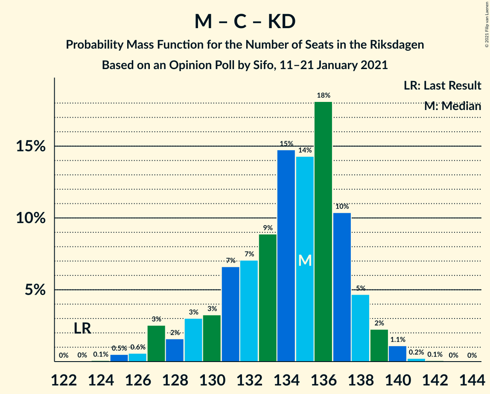

# Opinion Poll by Sifo, 11–21 January 2021

<a href="#voting-intentions">Voting Intentions</a> | <a href="#seats">Seats</a> | <a href="#coalitions">Coalitions</a> | <a href="#technical-information">Technical Information</a>

## Voting Intentions

### Confidence Intervals

| Party | Last Result | Poll Result | 80% Confidence Interval | 90% Confidence Interval | 95% Confidence Interval | 99% Confidence Interval |
|:-----:|:-----------:|:-----------:|:-----------------------:|:-----------------------:|:-----------------------:|:-----------------------:|
| Sveriges socialdemokratiska arbetareparti | 28.3% | 27.6% | 26.9–28.3% |26.7–28.5% |26.5–28.6% |26.2–29.0% |
| Moderata samlingspartiet | 19.8% | 22.4% | 21.7–23.0% |21.6–23.2% |21.4–23.4% |21.1–23.7% |
| Sverigedemokraterna | 17.5% | 18.6% | 18.0–19.2% |17.8–19.4% |17.7–19.5% |17.4–19.8% |
| Vänsterpartiet | 8.0% | 10.0% | 9.5–10.5% |9.4–10.6% |9.3–10.7% |9.1–11.0% |
| Centerpartiet | 8.6% | 8.1% | 7.7–8.5% |7.6–8.7% |7.5–8.8% |7.3–9.0% |
| Kristdemokraterna | 6.3% | 4.9% | 4.6–5.2% |4.5–5.3% |4.4–5.4% |4.3–5.6% |
| Miljöpartiet de gröna | 4.4% | 3.7% | 3.4–4.0% |3.3–4.1% |3.3–4.2% |3.1–4.3% |
| Liberalerna | 5.5% | 3.2% | 2.9–3.5% |2.9–3.6% |2.8–3.6% |2.7–3.8% |

*Note:* The poll result column reflects the actual value used in the calculations. Published results may vary slightly, and in addition be rounded to fewer digits.

## Seats

### Confidence Intervals

| Party | Last Result | Median | 80% Confidence Interval | 90% Confidence Interval | 95% Confidence Interval | 99% Confidence Interval |
|:-----:|:-----------:|:------:|:-----------------------:|:-----------------------:|:-----------------------:|:-----------------------:|
| <a href="#sveriges-socialdemokratiska-arbetareparti">Sveriges socialdemokratiska arbetareparti</a> | 100 | 105 | 101–108 |100–109 |99–109 |97–110 |
| <a href="#moderata-samlingspartiet">Moderata samlingspartiet</a> | 70 | 85 | 82–87 |81–88 |80–89 |79–90 |
| <a href="#sverigedemokraterna">Sverigedemokraterna</a> | 62 | 70 | 68–73 |67–74 |66–74 |65–75 |
| <a href="#vänsterpartiet">Vänsterpartiet</a> | 28 | 38 | 36–40 |35–40 |35–41 |34–42 |
| <a href="#centerpartiet">Centerpartiet</a> | 31 | 31 | 29–33 |28–33 |28–33 |27–34 |
| <a href="#kristdemokraterna">Kristdemokraterna</a> | 22 | 18 | 17–20 |17–20 |17–21 |16–21 |
| <a href="#miljöpartiet-de-gröna">Miljöpartiet de gröna</a> | 16 | 0 | 0–15 |0–15 |0–15 |0–16 |
| <a href="#liberalerna">Liberalerna</a> | 20 | 0 | 0 |0 |0 |0 |

### Sveriges socialdemokratiska arbetareparti

*For a full overview of the results for this party, see the [Sveriges socialdemokratiska arbetareparti](party-sverigessocialdemokratiskaarbetareparti.html) page.*

| Number of Seats | Probability | Accumulated | Special Marks |
|:---------------:|:-----------:|:-----------:|:-------------:|
| 96 | 0.2% | 100% |  |
| 97 | 0.5% | 99.8% |  |
| 98 | 0.7% | 99.3% |  |
| 99 | 3% | 98.7% |  |
| 100 | 4% | 96% | Last Result |
| 101 | 5% | 92% |  |
| 102 | 6% | 87% |  |
| 103 | 6% | 81% |  |
| 104 | 9% | 76% |  |
| 105 | 28% | 66% | Median |
| 106 | 14% | 38% |  |
| 107 | 11% | 24% |  |
| 108 | 8% | 13% |  |
| 109 | 3% | 5% |  |
| 110 | 2% | 2% |  |
| 111 | 0.3% | 0.4% |  |
| 112 | 0.1% | 0.1% |  |
| 113 | 0% | 0% |  |

### Moderata samlingspartiet

*For a full overview of the results for this party, see the [Moderata samlingspartiet](party-moderatasamlingspartiet.html) page.*

| Number of Seats | Probability | Accumulated | Special Marks |
|:---------------:|:-----------:|:-----------:|:-------------:|
| 70 | 0% | 100% | Last Result |
| 71 | 0% | 100% |  |
| 72 | 0% | 100% |  |
| 73 | 0% | 100% |  |
| 74 | 0% | 100% |  |
| 75 | 0% | 100% |  |
| 76 | 0% | 100% |  |
| 77 | 0.1% | 100% |  |
| 78 | 0.3% | 99.9% |  |
| 79 | 0.9% | 99.7% |  |
| 80 | 2% | 98.8% |  |
| 81 | 6% | 97% |  |
| 82 | 8% | 91% |  |
| 83 | 13% | 83% |  |
| 84 | 14% | 70% |  |
| 85 | 17% | 56% | Median |
| 86 | 18% | 39% |  |
| 87 | 11% | 20% |  |
| 88 | 5% | 10% |  |
| 89 | 4% | 5% |  |
| 90 | 0.9% | 1.3% |  |
| 91 | 0.3% | 0.4% |  |
| 92 | 0.1% | 0.1% |  |
| 93 | 0% | 0% |  |

### Sverigedemokraterna

*For a full overview of the results for this party, see the [Sverigedemokraterna](party-sverigedemokraterna.html) page.*

| Number of Seats | Probability | Accumulated | Special Marks |
|:---------------:|:-----------:|:-----------:|:-------------:|
| 62 | 0% | 100% | Last Result |
| 63 | 0% | 100% |  |
| 64 | 0.3% | 100% |  |
| 65 | 0.8% | 99.7% |  |
| 66 | 2% | 98.8% |  |
| 67 | 6% | 97% |  |
| 68 | 8% | 91% |  |
| 69 | 16% | 83% |  |
| 70 | 18% | 67% | Median |
| 71 | 21% | 49% |  |
| 72 | 16% | 28% |  |
| 73 | 8% | 13% |  |
| 74 | 3% | 5% |  |
| 75 | 1.4% | 2% |  |
| 76 | 0.4% | 0.4% |  |
| 77 | 0% | 0.1% |  |
| 78 | 0% | 0% |  |

### Vänsterpartiet

*For a full overview of the results for this party, see the [Vänsterpartiet](party-vänsterpartiet.html) page.*

| Number of Seats | Probability | Accumulated | Special Marks |
|:---------------:|:-----------:|:-----------:|:-------------:|
| 28 | 0% | 100% | Last Result |
| 29 | 0% | 100% |  |
| 30 | 0% | 100% |  |
| 31 | 0% | 100% |  |
| 32 | 0% | 100% |  |
| 33 | 0.1% | 100% |  |
| 34 | 0.8% | 99.9% |  |
| 35 | 5% | 99.1% |  |
| 36 | 13% | 95% |  |
| 37 | 23% | 82% |  |
| 38 | 26% | 59% | Median |
| 39 | 21% | 32% |  |
| 40 | 8% | 11% |  |
| 41 | 3% | 3% |  |
| 42 | 0.6% | 0.7% |  |
| 43 | 0.1% | 0.1% |  |
| 44 | 0% | 0% |  |

### Centerpartiet

*For a full overview of the results for this party, see the [Centerpartiet](party-centerpartiet.html) page.*

| Number of Seats | Probability | Accumulated | Special Marks |
|:---------------:|:-----------:|:-----------:|:-------------:|
| 27 | 1.3% | 100% |  |
| 28 | 4% | 98.7% |  |
| 29 | 11% | 95% |  |
| 30 | 22% | 83% |  |
| 31 | 27% | 61% | Last Result, Median |
| 32 | 24% | 34% |  |
| 33 | 8% | 10% |  |
| 34 | 2% | 2% |  |
| 35 | 0.2% | 0.2% |  |
| 36 | 0% | 0% |  |

### Kristdemokraterna

*For a full overview of the results for this party, see the [Kristdemokraterna](party-kristdemokraterna.html) page.*

| Number of Seats | Probability | Accumulated | Special Marks |
|:---------------:|:-----------:|:-----------:|:-------------:|
| 15 | 0.1% | 100% |  |
| 16 | 2% | 99.9% |  |
| 17 | 11% | 98% |  |
| 18 | 37% | 87% | Median |
| 19 | 31% | 50% |  |
| 20 | 15% | 19% |  |
| 21 | 3% | 3% |  |
| 22 | 0.3% | 0.3% | Last Result |
| 23 | 0% | 0% |  |

### Miljöpartiet de gröna

*For a full overview of the results for this party, see the [Miljöpartiet de gröna](party-miljöpartietdegröna.html) page.*

| Number of Seats | Probability | Accumulated | Special Marks |
|:---------------:|:-----------:|:-----------:|:-------------:|
| 0 | 87% | 100% | Median |
| 1 | 0% | 13% |  |
| 2 | 0% | 13% |  |
| 3 | 0% | 13% |  |
| 4 | 0% | 13% |  |
| 5 | 0% | 13% |  |
| 6 | 0% | 13% |  |
| 7 | 0% | 13% |  |
| 8 | 0% | 13% |  |
| 9 | 0% | 13% |  |
| 10 | 0% | 13% |  |
| 11 | 0% | 13% |  |
| 12 | 0% | 13% |  |
| 13 | 0% | 13% |  |
| 14 | 0% | 13% |  |
| 15 | 10% | 13% |  |
| 16 | 2% | 2% | Last Result |
| 17 | 0% | 0% |  |

### Liberalerna

*For a full overview of the results for this party, see the [Liberalerna](party-liberalerna.html) page.*

| Number of Seats | Probability | Accumulated | Special Marks |
|:---------------:|:-----------:|:-----------:|:-------------:|
| 0 | 100% | 100% | Median |
| 1 | 0% | 0% |  |
| 2 | 0% | 0% |  |
| 3 | 0% | 0% |  |
| 4 | 0% | 0% |  |
| 5 | 0% | 0% |  |
| 6 | 0% | 0% |  |
| 7 | 0% | 0% |  |
| 8 | 0% | 0% |  |
| 9 | 0% | 0% |  |
| 10 | 0% | 0% |  |
| 11 | 0% | 0% |  |
| 12 | 0% | 0% |  |
| 13 | 0% | 0% |  |
| 14 | 0% | 0% |  |
| 15 | 0% | 0% |  |
| 16 | 0% | 0% |  |
| 17 | 0% | 0% |  |
| 18 | 0% | 0% |  |
| 19 | 0% | 0% |  |
| 20 | 0% | 0% | Last Result |

## Coalitions

### Confidence Intervals

| Coalition | Last Result | Median | Majority? | 80% Confidence Interval | 90% Confidence Interval | 95% Confidence Interval | 99% Confidence Interval |
|:---------:|:-----------:|:------:|:---------:|:-----------------------:|:-----------------------:|:-----------------------:|:-----------------------:|
| Sveriges socialdemokratiska arbetareparti – Moderata samlingspartiet – Centerpartiet | 201 | 221 | 100% | 213–224 | 211–225 | 210–226 | 208–227 |
| Sveriges socialdemokratiska arbetareparti – Moderata samlingspartiet | 170 | 190 | 100% | 184–193 | 181–194 | 180–194 | 178–196 |
| Sveriges socialdemokratiska arbetareparti – Vänsterpartiet – Centerpartiet – Miljöpartiet de gröna – Liberalerna | 195 | 175 | 55% | 172–180 | 171–182 | 170–183 | 168–185 |
| Moderata samlingspartiet – Sverigedemokraterna – Kristdemokraterna | 154 | 174 | 45% | 169–177 | 167–178 | 166–179 | 164–181 |
| Moderata samlingspartiet – Sverigedemokraterna | 132 | 156 | 0% | 150–159 | 149–160 | 148–160 | 146–162 |
| Sveriges socialdemokratiska arbetareparti – Vänsterpartiet – Miljöpartiet de gröna | 144 | 144 | 0% | 141–150 | 140–153 | 139–155 | 138–156 |
| Sveriges socialdemokratiska arbetareparti – Vänsterpartiet | 128 | 143 | 0% | 138–146 | 136–147 | 135–148 | 133–149 |
| Sveriges socialdemokratiska arbetareparti – Centerpartiet – Miljöpartiet de gröna – Liberalerna | 167 | 137 | 0% | 133–144 | 132–145 | 131–146 | 130–148 |
| Moderata samlingspartiet – Centerpartiet – Kristdemokraterna – Liberalerna | 143 | 135 | 0% | 130–137 | 128–138 | 127–139 | 125–140 |
| Moderata samlingspartiet – Centerpartiet – Kristdemokraterna | 123 | 135 | 0% | 130–137 | 128–138 | 127–139 | 125–140 |
| Moderata samlingspartiet – Centerpartiet – Liberalerna | 121 | 116 | 0% | 112–118 | 110–119 | 109–120 | 107–121 |
| Moderata samlingspartiet – Centerpartiet | 101 | 116 | 0% | 112–118 | 110–119 | 109–120 | 107–121 |
| Sveriges socialdemokratiska arbetareparti – Miljöpartiet de gröna | 116 | 106 | 0% | 103–114 | 102–116 | 101–117 | 100–118 |

### Sveriges socialdemokratiska arbetareparti – Moderata samlingspartiet – Centerpartiet

| Number of Seats | Probability | Accumulated | Special Marks |
|:---------------:|:-----------:|:-----------:|:-------------:|
| 201 | 0% | 100% | Last Result |
| 202 | 0% | 100% |  |
| 203 | 0% | 100% |  |
| 204 | 0% | 100% |  |
| 205 | 0% | 100% |  |
| 206 | 0% | 100% |  |
| 207 | 0.1% | 100% |  |
| 208 | 0.5% | 99.9% |  |
| 209 | 1.2% | 99.4% |  |
| 210 | 2% | 98% |  |
| 211 | 4% | 96% |  |
| 212 | 2% | 92% |  |
| 213 | 0.5% | 90% |  |
| 214 | 2% | 90% |  |
| 215 | 1.0% | 88% |  |
| 216 | 0.9% | 87% |  |
| 217 | 2% | 86% |  |
| 218 | 3% | 85% |  |
| 219 | 9% | 82% |  |
| 220 | 11% | 73% |  |
| 221 | 14% | 62% | Median |
| 222 | 15% | 48% |  |
| 223 | 19% | 33% |  |
| 224 | 8% | 14% |  |
| 225 | 4% | 6% |  |
| 226 | 2% | 3% |  |
| 227 | 0.4% | 0.6% |  |
| 228 | 0.1% | 0.2% |  |
| 229 | 0% | 0% |  |

### Sveriges socialdemokratiska arbetareparti – Moderata samlingspartiet

| Number of Seats | Probability | Accumulated | Special Marks |
|:---------------:|:-----------:|:-----------:|:-------------:|
| 170 | 0% | 100% | Last Result |
| 171 | 0% | 100% |  |
| 172 | 0% | 100% |  |
| 173 | 0% | 100% |  |
| 174 | 0% | 100% |  |
| 175 | 0% | 100% | Majority |
| 176 | 0% | 100% |  |
| 177 | 0.1% | 99.9% |  |
| 178 | 0.4% | 99.9% |  |
| 179 | 0.8% | 99.5% |  |
| 180 | 2% | 98.7% |  |
| 181 | 2% | 97% |  |
| 182 | 2% | 95% |  |
| 183 | 3% | 93% |  |
| 184 | 0.9% | 90% |  |
| 185 | 2% | 89% |  |
| 186 | 3% | 87% |  |
| 187 | 4% | 84% |  |
| 188 | 8% | 81% |  |
| 189 | 9% | 73% |  |
| 190 | 16% | 63% | Median |
| 191 | 19% | 47% |  |
| 192 | 14% | 28% |  |
| 193 | 5% | 13% |  |
| 194 | 6% | 9% |  |
| 195 | 1.1% | 2% |  |
| 196 | 0.9% | 1.2% |  |
| 197 | 0.2% | 0.3% |  |
| 198 | 0.1% | 0.1% |  |
| 199 | 0% | 0% |  |

### Sveriges socialdemokratiska arbetareparti – Vänsterpartiet – Centerpartiet – Miljöpartiet de gröna – Liberalerna

| Number of Seats | Probability | Accumulated | Special Marks |
|:---------------:|:-----------:|:-----------:|:-------------:|
| 167 | 0.1% | 100% |  |
| 168 | 0.4% | 99.8% |  |
| 169 | 1.1% | 99.4% |  |
| 170 | 3% | 98% |  |
| 171 | 4% | 96% |  |
| 172 | 7% | 92% |  |
| 173 | 13% | 85% |  |
| 174 | 16% | 71% | Median |
| 175 | 12% | 55% | Majority |
| 176 | 13% | 43% |  |
| 177 | 10% | 30% |  |
| 178 | 5% | 19% |  |
| 179 | 2% | 14% |  |
| 180 | 2% | 12% |  |
| 181 | 3% | 9% |  |
| 182 | 2% | 6% |  |
| 183 | 2% | 4% |  |
| 184 | 1.4% | 2% |  |
| 185 | 0.5% | 0.8% |  |
| 186 | 0.2% | 0.3% |  |
| 187 | 0.1% | 0.1% |  |
| 188 | 0% | 0% |  |
| 189 | 0% | 0% |  |
| 190 | 0% | 0% |  |
| 191 | 0% | 0% |  |
| 192 | 0% | 0% |  |
| 193 | 0% | 0% |  |
| 194 | 0% | 0% |  |
| 195 | 0% | 0% | Last Result |

### Moderata samlingspartiet – Sverigedemokraterna – Kristdemokraterna

| Number of Seats | Probability | Accumulated | Special Marks |
|:---------------:|:-----------:|:-----------:|:-------------:|
| 154 | 0% | 100% | Last Result |
| 155 | 0% | 100% |  |
| 156 | 0% | 100% |  |
| 157 | 0% | 100% |  |
| 158 | 0% | 100% |  |
| 159 | 0% | 100% |  |
| 160 | 0% | 100% |  |
| 161 | 0% | 100% |  |
| 162 | 0.1% | 100% |  |
| 163 | 0.2% | 99.9% |  |
| 164 | 0.5% | 99.7% |  |
| 165 | 1.4% | 99.2% |  |
| 166 | 2% | 98% |  |
| 167 | 2% | 96% |  |
| 168 | 3% | 94% |  |
| 169 | 2% | 91% |  |
| 170 | 2% | 88% |  |
| 171 | 5% | 86% |  |
| 172 | 10% | 81% |  |
| 173 | 13% | 70% | Median |
| 174 | 12% | 57% |  |
| 175 | 16% | 45% | Majority |
| 176 | 13% | 29% |  |
| 177 | 7% | 15% |  |
| 178 | 4% | 8% |  |
| 179 | 3% | 4% |  |
| 180 | 1.1% | 2% |  |
| 181 | 0.4% | 0.6% |  |
| 182 | 0.1% | 0.2% |  |
| 183 | 0% | 0% |  |

### Moderata samlingspartiet – Sverigedemokraterna

| Number of Seats | Probability | Accumulated | Special Marks |
|:---------------:|:-----------:|:-----------:|:-------------:|
| 132 | 0% | 100% | Last Result |
| 133 | 0% | 100% |  |
| 134 | 0% | 100% |  |
| 135 | 0% | 100% |  |
| 136 | 0% | 100% |  |
| 137 | 0% | 100% |  |
| 138 | 0% | 100% |  |
| 139 | 0% | 100% |  |
| 140 | 0% | 100% |  |
| 141 | 0% | 100% |  |
| 142 | 0% | 100% |  |
| 143 | 0% | 100% |  |
| 144 | 0.1% | 100% |  |
| 145 | 0.2% | 99.9% |  |
| 146 | 0.3% | 99.7% |  |
| 147 | 1.2% | 99.3% |  |
| 148 | 2% | 98% |  |
| 149 | 3% | 96% |  |
| 150 | 3% | 93% |  |
| 151 | 2% | 90% |  |
| 152 | 4% | 88% |  |
| 153 | 10% | 83% |  |
| 154 | 10% | 73% |  |
| 155 | 13% | 63% | Median |
| 156 | 18% | 51% |  |
| 157 | 13% | 33% |  |
| 158 | 9% | 20% |  |
| 159 | 6% | 11% |  |
| 160 | 3% | 5% |  |
| 161 | 1.4% | 2% |  |
| 162 | 0.4% | 0.7% |  |
| 163 | 0.2% | 0.2% |  |
| 164 | 0.1% | 0.1% |  |
| 165 | 0% | 0% |  |

### Sveriges socialdemokratiska arbetareparti – Vänsterpartiet – Miljöpartiet de gröna

| Number of Seats | Probability | Accumulated | Special Marks |
|:---------------:|:-----------:|:-----------:|:-------------:|
| 136 | 0.1% | 100% |  |
| 137 | 0.2% | 99.9% |  |
| 138 | 0.8% | 99.7% |  |
| 139 | 2% | 98.9% |  |
| 140 | 4% | 96% |  |
| 141 | 7% | 92% |  |
| 142 | 15% | 86% |  |
| 143 | 17% | 71% | Median |
| 144 | 17% | 54% | Last Result |
| 145 | 9% | 37% |  |
| 146 | 9% | 28% |  |
| 147 | 4% | 19% |  |
| 148 | 2% | 15% |  |
| 149 | 2% | 13% |  |
| 150 | 2% | 11% |  |
| 151 | 1.5% | 9% |  |
| 152 | 2% | 8% |  |
| 153 | 2% | 6% |  |
| 154 | 1.0% | 4% |  |
| 155 | 2% | 3% |  |
| 156 | 0.6% | 0.7% |  |
| 157 | 0.1% | 0.1% |  |
| 158 | 0% | 0% |  |

### Sveriges socialdemokratiska arbetareparti – Vänsterpartiet

| Number of Seats | Probability | Accumulated | Special Marks |
|:---------------:|:-----------:|:-----------:|:-------------:|
| 128 | 0% | 100% | Last Result |
| 129 | 0% | 100% |  |
| 130 | 0% | 100% |  |
| 131 | 0% | 100% |  |
| 132 | 0.1% | 100% |  |
| 133 | 0.3% | 99.8% |  |
| 134 | 2% | 99.5% |  |
| 135 | 1.4% | 98% |  |
| 136 | 2% | 97% |  |
| 137 | 3% | 95% |  |
| 138 | 2% | 92% |  |
| 139 | 3% | 90% |  |
| 140 | 6% | 87% |  |
| 141 | 7% | 80% |  |
| 142 | 15% | 73% |  |
| 143 | 17% | 58% | Median |
| 144 | 17% | 42% |  |
| 145 | 9% | 25% |  |
| 146 | 9% | 15% |  |
| 147 | 4% | 7% |  |
| 148 | 2% | 3% |  |
| 149 | 0.6% | 0.9% |  |
| 150 | 0.1% | 0.2% |  |
| 151 | 0.1% | 0.1% |  |
| 152 | 0% | 0% |  |

### Sveriges socialdemokratiska arbetareparti – Centerpartiet – Miljöpartiet de gröna – Liberalerna

| Number of Seats | Probability | Accumulated | Special Marks |
|:---------------:|:-----------:|:-----------:|:-------------:|
| 129 | 0.1% | 100% |  |
| 130 | 0.5% | 99.9% |  |
| 131 | 2% | 99.4% |  |
| 132 | 3% | 97% |  |
| 133 | 5% | 94% |  |
| 134 | 4% | 89% |  |
| 135 | 11% | 85% |  |
| 136 | 14% | 75% | Median |
| 137 | 19% | 61% |  |
| 138 | 15% | 42% |  |
| 139 | 9% | 28% |  |
| 140 | 5% | 19% |  |
| 141 | 1.5% | 14% |  |
| 142 | 0.4% | 13% |  |
| 143 | 2% | 12% |  |
| 144 | 2% | 11% |  |
| 145 | 5% | 9% |  |
| 146 | 2% | 4% |  |
| 147 | 1.0% | 2% |  |
| 148 | 0.9% | 1.2% |  |
| 149 | 0.2% | 0.3% |  |
| 150 | 0% | 0.1% |  |
| 151 | 0% | 0.1% |  |
| 152 | 0% | 0% |  |
| 153 | 0% | 0% |  |
| 154 | 0% | 0% |  |
| 155 | 0% | 0% |  |
| 156 | 0% | 0% |  |
| 157 | 0% | 0% |  |
| 158 | 0% | 0% |  |
| 159 | 0% | 0% |  |
| 160 | 0% | 0% |  |
| 161 | 0% | 0% |  |
| 162 | 0% | 0% |  |
| 163 | 0% | 0% |  |
| 164 | 0% | 0% |  |
| 165 | 0% | 0% |  |
| 166 | 0% | 0% |  |
| 167 | 0% | 0% | Last Result |

### Moderata samlingspartiet – Centerpartiet – Kristdemokraterna – Liberalerna

| Number of Seats | Probability | Accumulated | Special Marks |
|:---------------:|:-----------:|:-----------:|:-------------:|
| 124 | 0.1% | 100% |  |
| 125 | 0.5% | 99.9% |  |
| 126 | 0.6% | 99.4% |  |
| 127 | 3% | 98.8% |  |
| 128 | 2% | 96% |  |
| 129 | 3% | 95% |  |
| 130 | 3% | 92% |  |
| 131 | 7% | 88% |  |
| 132 | 7% | 82% |  |
| 133 | 9% | 75% |  |
| 134 | 15% | 66% | Median |
| 135 | 14% | 51% |  |
| 136 | 18% | 37% |  |
| 137 | 10% | 19% |  |
| 138 | 5% | 8% |  |
| 139 | 2% | 4% |  |
| 140 | 1.1% | 1.4% |  |
| 141 | 0.2% | 0.3% |  |
| 142 | 0.1% | 0.1% |  |
| 143 | 0% | 0% | Last Result |

### Moderata samlingspartiet – Centerpartiet – Kristdemokraterna

| Number of Seats | Probability | Accumulated | Special Marks |
|:---------------:|:-----------:|:-----------:|:-------------:|
| 123 | 0% | 100% | Last Result |
| 124 | 0.1% | 100% |  |
| 125 | 0.5% | 99.9% |  |
| 126 | 0.6% | 99.4% |  |
| 127 | 3% | 98.8% |  |
| 128 | 2% | 96% |  |
| 129 | 3% | 95% |  |
| 130 | 3% | 92% |  |
| 131 | 7% | 88% |  |
| 132 | 7% | 82% |  |
| 133 | 9% | 75% |  |
| 134 | 15% | 66% | Median |
| 135 | 14% | 51% |  |
| 136 | 18% | 37% |  |
| 137 | 10% | 19% |  |
| 138 | 5% | 8% |  |
| 139 | 2% | 4% |  |
| 140 | 1.1% | 1.4% |  |
| 141 | 0.2% | 0.3% |  |
| 142 | 0.1% | 0.1% |  |
| 143 | 0% | 0% |  |

### Moderata samlingspartiet – Centerpartiet – Liberalerna

| Number of Seats | Probability | Accumulated | Special Marks |
|:---------------:|:-----------:|:-----------:|:-------------:|
| 106 | 0% | 100% |  |
| 107 | 0.5% | 99.9% |  |
| 108 | 0.6% | 99.5% |  |
| 109 | 2% | 98.8% |  |
| 110 | 2% | 97% |  |
| 111 | 4% | 94% |  |
| 112 | 4% | 91% |  |
| 113 | 7% | 87% |  |
| 114 | 9% | 79% |  |
| 115 | 13% | 70% |  |
| 116 | 18% | 58% | Median |
| 117 | 14% | 40% |  |
| 118 | 16% | 26% |  |
| 119 | 5% | 9% |  |
| 120 | 2% | 4% |  |
| 121 | 1.3% | 2% | Last Result |
| 122 | 0.4% | 0.5% |  |
| 123 | 0.1% | 0.1% |  |
| 124 | 0% | 0% |  |

### Moderata samlingspartiet – Centerpartiet

| Number of Seats | Probability | Accumulated | Special Marks |
|:---------------:|:-----------:|:-----------:|:-------------:|
| 101 | 0% | 100% | Last Result |
| 102 | 0% | 100% |  |
| 103 | 0% | 100% |  |
| 104 | 0% | 100% |  |
| 105 | 0% | 100% |  |
| 106 | 0% | 100% |  |
| 107 | 0.5% | 99.9% |  |
| 108 | 0.6% | 99.5% |  |
| 109 | 2% | 98.8% |  |
| 110 | 2% | 97% |  |
| 111 | 4% | 94% |  |
| 112 | 4% | 91% |  |
| 113 | 7% | 87% |  |
| 114 | 9% | 79% |  |
| 115 | 13% | 70% |  |
| 116 | 18% | 58% | Median |
| 117 | 14% | 40% |  |
| 118 | 16% | 26% |  |
| 119 | 5% | 9% |  |
| 120 | 2% | 4% |  |
| 121 | 1.3% | 2% |  |
| 122 | 0.4% | 0.5% |  |
| 123 | 0.1% | 0.1% |  |
| 124 | 0% | 0% |  |

### Sveriges socialdemokratiska arbetareparti – Miljöpartiet de gröna

| Number of Seats | Probability | Accumulated | Special Marks |
|:---------------:|:-----------:|:-----------:|:-------------:|
| 98 | 0% | 100% |  |
| 99 | 0.2% | 99.9% |  |
| 100 | 2% | 99.8% |  |
| 101 | 2% | 98% |  |
| 102 | 3% | 96% |  |
| 103 | 4% | 92% |  |
| 104 | 9% | 88% |  |
| 105 | 28% | 79% | Median |
| 106 | 14% | 51% |  |
| 107 | 11% | 37% |  |
| 108 | 8% | 25% |  |
| 109 | 3% | 18% |  |
| 110 | 2% | 15% |  |
| 111 | 0.5% | 13% |  |
| 112 | 0.5% | 13% |  |
| 113 | 0.5% | 12% |  |
| 114 | 3% | 12% |  |
| 115 | 2% | 9% |  |
| 116 | 2% | 7% | Last Result |
| 117 | 3% | 5% |  |
| 118 | 1.3% | 2% |  |
| 119 | 0.2% | 0.5% |  |
| 120 | 0.1% | 0.2% |  |
| 121 | 0.1% | 0.1% |  |
| 122 | 0% | 0% |  |

## Technical Information

### Opinion Poll

+ **Polling firm:** Sifo
+ **Commissioner(s):** —
+ **Fieldwork period:** 11–21 January 2021

### Calculations

+ **Sample size:** 6947
+ **Simulations done:** 1,048,576
+ **Error estimate:** 0.37%

