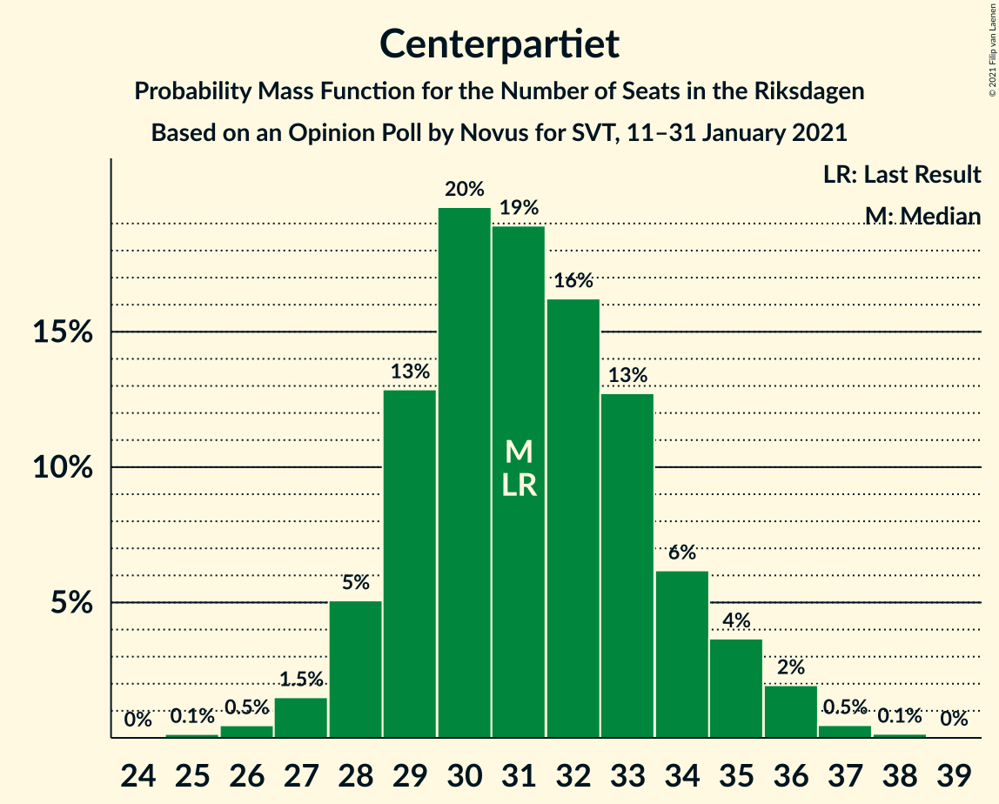
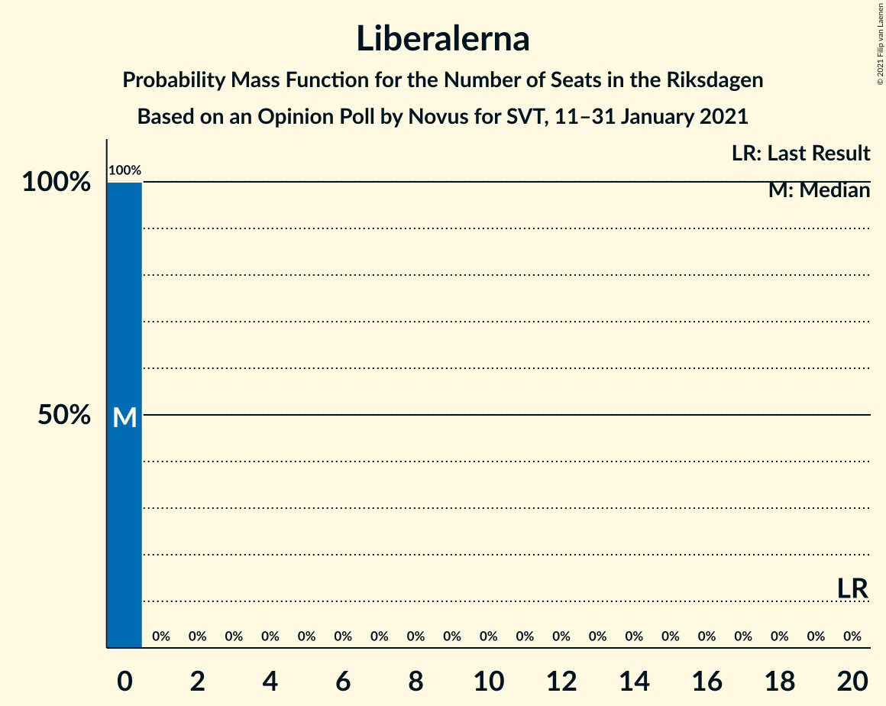
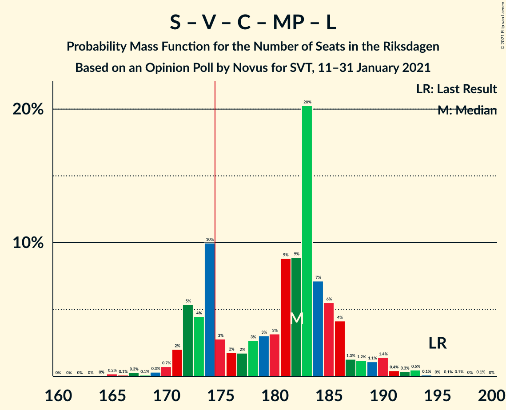
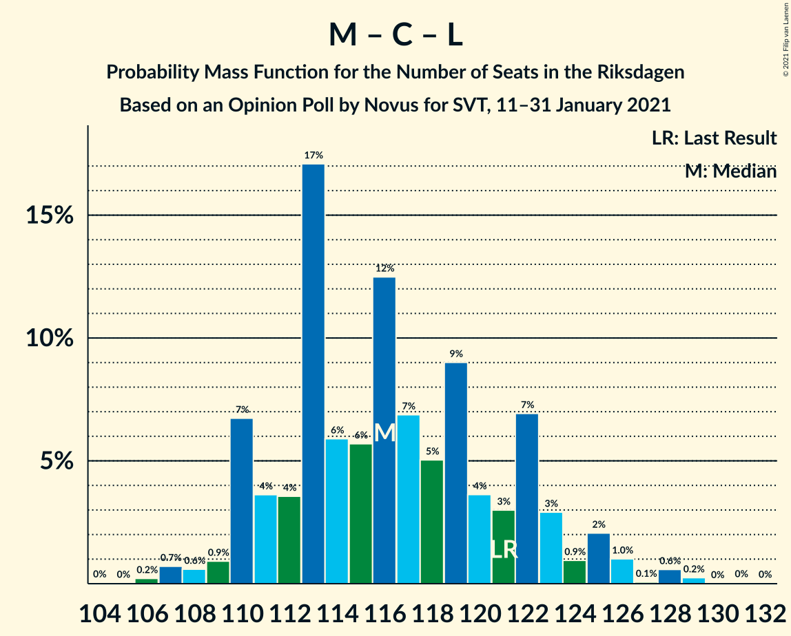

# Opinion Poll by Novus for SVT, 11–31 January 2021

<a href="#voting-intentions">Voting Intentions</a> | <a href="#seats">Seats</a> | <a href="#coalitions">Coalitions</a> | <a href="#technical-information">Technical Information</a>

## Voting Intentions

### Confidence Intervals

| Party | Last Result | Poll Result | 80% Confidence Interval | 90% Confidence Interval | 95% Confidence Interval | 99% Confidence Interval |
|:-----:|:-----------:|:-----------:|:-----------------------:|:-----------------------:|:-----------------------:|:-----------------------:|
| Sveriges socialdemokratiska arbetareparti | 28.3% | 26.9% | 25.9–28.0% |25.6–28.3% |25.3–28.6% |24.8–29.1% |
| Moderata samlingspartiet | 19.8% | 23.1% | 22.1–24.1% |21.8–24.4% |21.6–24.7% |21.1–25.2% |
| Sverigedemokraterna | 17.5% | 18.1% | 17.2–19.1% |17.0–19.3% |16.8–19.6% |16.3–20.0% |
| Vänsterpartiet | 8.0% | 10.8% | 10.1–11.6% |9.9–11.8% |9.7–12.0% |9.4–12.4% |
| Centerpartiet | 8.6% | 8.5% | 7.8–9.2% |7.7–9.4% |7.5–9.6% |7.2–9.9% |
| Kristdemokraterna | 6.3% | 4.7% | 4.2–5.3% |4.1–5.4% |4.0–5.5% |3.8–5.8% |
| Miljöpartiet de gröna | 4.4% | 4.1% | 3.6–4.6% |3.5–4.8% |3.4–4.9% |3.2–5.1% |
| Liberalerna | 5.5% | 2.7% | 2.3–3.1% |2.2–3.3% |2.2–3.4% |2.0–3.6% |

*Note:* The poll result column reflects the actual value used in the calculations. Published results may vary slightly, and in addition be rounded to fewer digits.

## Seats

### Confidence Intervals

| Party | Last Result | Median | 80% Confidence Interval | 90% Confidence Interval | 95% Confidence Interval | 99% Confidence Interval |
|:-----:|:-----------:|:------:|:-----------------------:|:-----------------------:|:-----------------------:|:-----------------------:|
| <a href="#sveriges-socialdemokratiska-arbetareparti">Sveriges socialdemokratiska arbetareparti</a> | 100 | 98 | 94–104 |93–105 |92–107 |91–109 |
| <a href="#moderata-samlingspartiet">Moderata samlingspartiet</a> | 70 | 85 | 81–90 |80–91 |79–92 |77–94 |
| <a href="#sverigedemokraterna">Sverigedemokraterna</a> | 62 | 66 | 63–71 |62–72 |61–73 |59–75 |
| <a href="#vänsterpartiet">Vänsterpartiet</a> | 28 | 40 | 37–43 |36–44 |36–44 |34–46 |
| <a href="#centerpartiet">Centerpartiet</a> | 31 | 31 | 29–34 |28–35 |28–36 |26–37 |
| <a href="#kristdemokraterna">Kristdemokraterna</a> | 22 | 17 | 16–19 |15–20 |15–20 |0–22 |
| <a href="#miljöpartiet-de-gröna">Miljöpartiet de gröna</a> | 16 | 15 | 0–17 |0–17 |0–18 |0–19 |
| <a href="#liberalerna">Liberalerna</a> | 20 | 0 | 0 |0 |0 |0 |

### Sveriges socialdemokratiska arbetareparti

*For a full overview of the results for this party, see the [Sveriges socialdemokratiska arbetareparti](party-sverigessocialdemokratiskaarbetareparti.html) page.*

| Number of Seats | Probability | Accumulated | Special Marks |
|:---------------:|:-----------:|:-----------:|:-------------:|
| 88 | 0.1% | 100% |  |
| 89 | 0.2% | 99.9% |  |
| 90 | 0.2% | 99.8% |  |
| 91 | 0.8% | 99.5% |  |
| 92 | 2% | 98.8% |  |
| 93 | 4% | 97% |  |
| 94 | 3% | 92% |  |
| 95 | 6% | 90% |  |
| 96 | 8% | 84% |  |
| 97 | 8% | 76% |  |
| 98 | 19% | 67% | Median |
| 99 | 9% | 49% |  |
| 100 | 9% | 40% | Last Result |
| 101 | 9% | 31% |  |
| 102 | 5% | 22% |  |
| 103 | 5% | 17% |  |
| 104 | 5% | 12% |  |
| 105 | 2% | 7% |  |
| 106 | 2% | 5% |  |
| 107 | 2% | 3% |  |
| 108 | 0.7% | 2% |  |
| 109 | 0.5% | 1.0% |  |
| 110 | 0.3% | 0.5% |  |
| 111 | 0.1% | 0.2% |  |
| 112 | 0% | 0.1% |  |
| 113 | 0% | 0.1% |  |
| 114 | 0% | 0% |  |

### Moderata samlingspartiet

*For a full overview of the results for this party, see the [Moderata samlingspartiet](party-moderatasamlingspartiet.html) page.*

| Number of Seats | Probability | Accumulated | Special Marks |
|:---------------:|:-----------:|:-----------:|:-------------:|
| 70 | 0% | 100% | Last Result |
| 71 | 0% | 100% |  |
| 72 | 0% | 100% |  |
| 73 | 0% | 100% |  |
| 74 | 0% | 100% |  |
| 75 | 0.1% | 100% |  |
| 76 | 0.2% | 99.9% |  |
| 77 | 0.5% | 99.7% |  |
| 78 | 1.2% | 99.1% |  |
| 79 | 2% | 98% |  |
| 80 | 5% | 96% |  |
| 81 | 7% | 90% |  |
| 82 | 4% | 83% |  |
| 83 | 15% | 79% |  |
| 84 | 13% | 64% |  |
| 85 | 8% | 51% | Median |
| 86 | 12% | 43% |  |
| 87 | 8% | 32% |  |
| 88 | 6% | 24% |  |
| 89 | 7% | 18% |  |
| 90 | 3% | 11% |  |
| 91 | 4% | 8% |  |
| 92 | 2% | 4% |  |
| 93 | 0.8% | 2% |  |
| 94 | 0.7% | 1.2% |  |
| 95 | 0.2% | 0.5% |  |
| 96 | 0.1% | 0.2% |  |
| 97 | 0% | 0.1% |  |
| 98 | 0% | 0% |  |

### Sverigedemokraterna

*For a full overview of the results for this party, see the [Sverigedemokraterna](party-sverigedemokraterna.html) page.*

| Number of Seats | Probability | Accumulated | Special Marks |
|:---------------:|:-----------:|:-----------:|:-------------:|
| 58 | 0.1% | 100% |  |
| 59 | 0.4% | 99.9% |  |
| 60 | 0.7% | 99.5% |  |
| 61 | 2% | 98.7% |  |
| 62 | 3% | 97% | Last Result |
| 63 | 7% | 94% |  |
| 64 | 11% | 86% |  |
| 65 | 12% | 75% |  |
| 66 | 16% | 63% | Median |
| 67 | 11% | 48% |  |
| 68 | 8% | 37% |  |
| 69 | 11% | 28% |  |
| 70 | 6% | 17% |  |
| 71 | 4% | 11% |  |
| 72 | 3% | 6% |  |
| 73 | 0.9% | 3% |  |
| 74 | 0.9% | 2% |  |
| 75 | 0.6% | 0.9% |  |
| 76 | 0.1% | 0.3% |  |
| 77 | 0.1% | 0.2% |  |
| 78 | 0% | 0% |  |

### Vänsterpartiet

*For a full overview of the results for this party, see the [Vänsterpartiet](party-vänsterpartiet.html) page.*

| Number of Seats | Probability | Accumulated | Special Marks |
|:---------------:|:-----------:|:-----------:|:-------------:|
| 28 | 0% | 100% | Last Result |
| 29 | 0% | 100% |  |
| 30 | 0% | 100% |  |
| 31 | 0% | 100% |  |
| 32 | 0% | 100% |  |
| 33 | 0.1% | 100% |  |
| 34 | 0.6% | 99.9% |  |
| 35 | 1.3% | 99.3% |  |
| 36 | 3% | 98% |  |
| 37 | 9% | 95% |  |
| 38 | 12% | 86% |  |
| 39 | 18% | 73% |  |
| 40 | 16% | 55% | Median |
| 41 | 19% | 39% |  |
| 42 | 8% | 20% |  |
| 43 | 7% | 12% |  |
| 44 | 3% | 5% |  |
| 45 | 1.3% | 2% |  |
| 46 | 0.7% | 0.9% |  |
| 47 | 0.1% | 0.2% |  |
| 48 | 0.1% | 0.1% |  |
| 49 | 0% | 0% |  |

### Centerpartiet

*For a full overview of the results for this party, see the [Centerpartiet](party-centerpartiet.html) page.*

| Number of Seats | Probability | Accumulated | Special Marks |
|:---------------:|:-----------:|:-----------:|:-------------:|
| 25 | 0.1% | 100% |  |
| 26 | 0.5% | 99.8% |  |
| 27 | 1.5% | 99.4% |  |
| 28 | 5% | 98% |  |
| 29 | 13% | 93% |  |
| 30 | 20% | 80% |  |
| 31 | 19% | 60% | Last Result, Median |
| 32 | 16% | 41% |  |
| 33 | 13% | 25% |  |
| 34 | 6% | 12% |  |
| 35 | 4% | 6% |  |
| 36 | 2% | 3% |  |
| 37 | 0.5% | 0.7% |  |
| 38 | 0.1% | 0.2% |  |
| 39 | 0% | 0% |  |

### Kristdemokraterna

*For a full overview of the results for this party, see the [Kristdemokraterna](party-kristdemokraterna.html) page.*

| Number of Seats | Probability | Accumulated | Special Marks |
|:---------------:|:-----------:|:-----------:|:-------------:|
| 0 | 2% | 100% |  |
| 1 | 0% | 98% |  |
| 2 | 0% | 98% |  |
| 3 | 0% | 98% |  |
| 4 | 0% | 98% |  |
| 5 | 0% | 98% |  |
| 6 | 0% | 98% |  |
| 7 | 0% | 98% |  |
| 8 | 0% | 98% |  |
| 9 | 0% | 98% |  |
| 10 | 0% | 98% |  |
| 11 | 0% | 98% |  |
| 12 | 0% | 98% |  |
| 13 | 0% | 98% |  |
| 14 | 0% | 98% |  |
| 15 | 7% | 98% |  |
| 16 | 18% | 91% |  |
| 17 | 25% | 73% | Median |
| 18 | 28% | 48% |  |
| 19 | 11% | 21% |  |
| 20 | 7% | 9% |  |
| 21 | 1.4% | 2% |  |
| 22 | 0.5% | 0.5% | Last Result |
| 23 | 0% | 0.1% |  |
| 24 | 0% | 0% |  |

### Miljöpartiet de gröna

*For a full overview of the results for this party, see the [Miljöpartiet de gröna](party-miljöpartietdegröna.html) page.*

| Number of Seats | Probability | Accumulated | Special Marks |
|:---------------:|:-----------:|:-----------:|:-------------:|
| 0 | 35% | 100% |  |
| 1 | 0% | 65% |  |
| 2 | 0% | 65% |  |
| 3 | 0% | 65% |  |
| 4 | 0% | 65% |  |
| 5 | 0% | 65% |  |
| 6 | 0% | 65% |  |
| 7 | 0% | 65% |  |
| 8 | 0% | 65% |  |
| 9 | 0% | 65% |  |
| 10 | 0% | 65% |  |
| 11 | 0% | 65% |  |
| 12 | 0% | 65% |  |
| 13 | 0% | 65% |  |
| 14 | 1.1% | 65% |  |
| 15 | 29% | 64% | Median |
| 16 | 25% | 35% | Last Result |
| 17 | 7% | 11% |  |
| 18 | 3% | 3% |  |
| 19 | 0.4% | 0.5% |  |
| 20 | 0.1% | 0.1% |  |
| 21 | 0% | 0% |  |

### Liberalerna

*For a full overview of the results for this party, see the [Liberalerna](party-liberalerna.html) page.*

| Number of Seats | Probability | Accumulated | Special Marks |
|:---------------:|:-----------:|:-----------:|:-------------:|
| 0 | 100% | 100% | Median |
| 1 | 0% | 0% |  |
| 2 | 0% | 0% |  |
| 3 | 0% | 0% |  |
| 4 | 0% | 0% |  |
| 5 | 0% | 0% |  |
| 6 | 0% | 0% |  |
| 7 | 0% | 0% |  |
| 8 | 0% | 0% |  |
| 9 | 0% | 0% |  |
| 10 | 0% | 0% |  |
| 11 | 0% | 0% |  |
| 12 | 0% | 0% |  |
| 13 | 0% | 0% |  |
| 14 | 0% | 0% |  |
| 15 | 0% | 0% |  |
| 16 | 0% | 0% |  |
| 17 | 0% | 0% |  |
| 18 | 0% | 0% |  |
| 19 | 0% | 0% |  |
| 20 | 0% | 0% | Last Result |

## Coalitions

### Confidence Intervals

| Coalition | Last Result | Median | Majority? | 80% Confidence Interval | 90% Confidence Interval | 95% Confidence Interval | 99% Confidence Interval |
|:---------:|:-----------:|:------:|:---------:|:-----------------------:|:-----------------------:|:-----------------------:|:-----------------------:|
| Sveriges socialdemokratiska arbetareparti – Moderata samlingspartiet – Centerpartiet | 201 | 213 | 100% | 208–224 | 208–226 | 206–227 | 204–234 |
| Sveriges socialdemokratiska arbetareparti – Moderata samlingspartiet | 170 | 183 | 98.6% | 177–192 | 176–194 | 175–195 | 173–200 |
| Sveriges socialdemokratiska arbetareparti – Vänsterpartiet – Centerpartiet – Miljöpartiet de gröna – Liberalerna | 195 | 182 | 76% | 173–186 | 172–188 | 171–190 | 167–193 |
| Moderata samlingspartiet – Sverigedemokraterna – Kristdemokraterna | 154 | 167 | 24% | 163–176 | 161–177 | 159–178 | 156–182 |
| Moderata samlingspartiet – Sverigedemokraterna | 132 | 151 | 0% | 146–159 | 145–160 | 144–161 | 141–166 |
| Sveriges socialdemokratiska arbetareparti – Vänsterpartiet – Miljöpartiet de gröna | 144 | 150 | 0% | 140–155 | 140–157 | 138–158 | 136–162 |
| Sveriges socialdemokratiska arbetareparti – Centerpartiet – Miljöpartiet de gröna – Liberalerna | 167 | 142 | 0% | 132–147 | 131–148 | 129–150 | 128–153 |
| Sveriges socialdemokratiska arbetareparti – Vänsterpartiet | 128 | 138 | 0% | 134–145 | 132–147 | 131–148 | 129–153 |
| Moderata samlingspartiet – Centerpartiet – Kristdemokraterna – Liberalerna | 143 | 133 | 0% | 127–140 | 127–141 | 125–142 | 119–145 |
| Moderata samlingspartiet – Centerpartiet – Kristdemokraterna | 123 | 133 | 0% | 127–140 | 127–141 | 125–142 | 119–145 |
| Moderata samlingspartiet – Centerpartiet – Liberalerna | 121 | 116 | 0% | 111–122 | 110–124 | 109–125 | 107–128 |
| Moderata samlingspartiet – Centerpartiet | 101 | 116 | 0% | 111–122 | 110–124 | 109–125 | 107–128 |
| Sveriges socialdemokratiska arbetareparti – Miljöpartiet de gröna | 116 | 111 | 0% | 100–116 | 98–117 | 97–118 | 96–122 |

### Sveriges socialdemokratiska arbetareparti – Moderata samlingspartiet – Centerpartiet

| Number of Seats | Probability | Accumulated | Special Marks |
|:---------------:|:-----------:|:-----------:|:-------------:|
| 201 | 0% | 100% | Last Result |
| 202 | 0.1% | 99.9% |  |
| 203 | 0.2% | 99.9% |  |
| 204 | 0.3% | 99.7% |  |
| 205 | 0.7% | 99.4% |  |
| 206 | 2% | 98.6% |  |
| 207 | 1.3% | 97% |  |
| 208 | 6% | 95% |  |
| 209 | 7% | 89% |  |
| 210 | 3% | 82% |  |
| 211 | 18% | 79% |  |
| 212 | 3% | 60% |  |
| 213 | 9% | 58% |  |
| 214 | 5% | 49% | Median |
| 215 | 4% | 44% |  |
| 216 | 3% | 40% |  |
| 217 | 2% | 37% |  |
| 218 | 3% | 34% |  |
| 219 | 5% | 31% |  |
| 220 | 4% | 27% |  |
| 221 | 3% | 23% |  |
| 222 | 3% | 20% |  |
| 223 | 5% | 17% |  |
| 224 | 4% | 12% |  |
| 225 | 2% | 8% |  |
| 226 | 2% | 5% |  |
| 227 | 1.2% | 3% |  |
| 228 | 0.9% | 2% |  |
| 229 | 0.3% | 1.3% |  |
| 230 | 0.1% | 1.0% |  |
| 231 | 0.1% | 0.9% |  |
| 232 | 0% | 0.8% |  |
| 233 | 0.2% | 0.7% |  |
| 234 | 0.2% | 0.5% |  |
| 235 | 0% | 0.3% |  |
| 236 | 0.2% | 0.3% |  |
| 237 | 0% | 0.1% |  |
| 238 | 0% | 0.1% |  |
| 239 | 0% | 0% |  |

### Sveriges socialdemokratiska arbetareparti – Moderata samlingspartiet

| Number of Seats | Probability | Accumulated | Special Marks |
|:---------------:|:-----------:|:-----------:|:-------------:|
| 170 | 0% | 100% | Last Result |
| 171 | 0.1% | 100% |  |
| 172 | 0.2% | 99.9% |  |
| 173 | 0.3% | 99.7% |  |
| 174 | 0.8% | 99.4% |  |
| 175 | 2% | 98.6% | Majority |
| 176 | 2% | 97% |  |
| 177 | 6% | 95% |  |
| 178 | 6% | 89% |  |
| 179 | 4% | 83% |  |
| 180 | 9% | 80% |  |
| 181 | 8% | 71% |  |
| 182 | 10% | 62% |  |
| 183 | 8% | 53% | Median |
| 184 | 5% | 45% |  |
| 185 | 4% | 40% |  |
| 186 | 4% | 36% |  |
| 187 | 5% | 32% |  |
| 188 | 4% | 27% |  |
| 189 | 2% | 23% |  |
| 190 | 7% | 21% |  |
| 191 | 2% | 14% |  |
| 192 | 3% | 12% |  |
| 193 | 4% | 9% |  |
| 194 | 1.3% | 5% |  |
| 195 | 2% | 4% |  |
| 196 | 0.4% | 2% |  |
| 197 | 0.4% | 1.4% |  |
| 198 | 0.2% | 1.0% |  |
| 199 | 0.1% | 0.8% |  |
| 200 | 0.5% | 0.7% |  |
| 201 | 0% | 0.1% |  |
| 202 | 0% | 0.1% |  |
| 203 | 0% | 0.1% |  |
| 204 | 0% | 0.1% |  |
| 205 | 0% | 0% |  |

### Sveriges socialdemokratiska arbetareparti – Vänsterpartiet – Centerpartiet – Miljöpartiet de gröna – Liberalerna

| Number of Seats | Probability | Accumulated | Special Marks |
|:---------------:|:-----------:|:-----------:|:-------------:|
| 164 | 0% | 100% |  |
| 165 | 0.2% | 99.9% |  |
| 166 | 0.1% | 99.8% |  |
| 167 | 0.3% | 99.7% |  |
| 168 | 0.1% | 99.4% |  |
| 169 | 0.3% | 99.3% |  |
| 170 | 0.7% | 99.0% |  |
| 171 | 2% | 98% |  |
| 172 | 5% | 96% |  |
| 173 | 4% | 91% |  |
| 174 | 10% | 86% |  |
| 175 | 3% | 76% | Majority |
| 176 | 2% | 74% |  |
| 177 | 2% | 72% |  |
| 178 | 3% | 70% |  |
| 179 | 3% | 68% |  |
| 180 | 3% | 64% |  |
| 181 | 9% | 61% |  |
| 182 | 9% | 52% |  |
| 183 | 20% | 44% |  |
| 184 | 7% | 23% | Median |
| 185 | 6% | 16% |  |
| 186 | 4% | 11% |  |
| 187 | 1.3% | 7% |  |
| 188 | 1.2% | 5% |  |
| 189 | 1.1% | 4% |  |
| 190 | 1.4% | 3% |  |
| 191 | 0.4% | 2% |  |
| 192 | 0.3% | 1.2% |  |
| 193 | 0.5% | 0.8% |  |
| 194 | 0.1% | 0.4% |  |
| 195 | 0% | 0.3% | Last Result |
| 196 | 0.1% | 0.2% |  |
| 197 | 0.1% | 0.2% |  |
| 198 | 0% | 0.1% |  |
| 199 | 0.1% | 0.1% |  |
| 200 | 0% | 0% |  |

### Moderata samlingspartiet – Sverigedemokraterna – Kristdemokraterna

| Number of Seats | Probability | Accumulated | Special Marks |
|:---------------:|:-----------:|:-----------:|:-------------:|
| 150 | 0.1% | 100% |  |
| 151 | 0% | 99.9% |  |
| 152 | 0.1% | 99.9% |  |
| 153 | 0.1% | 99.8% |  |
| 154 | 0% | 99.8% | Last Result |
| 155 | 0.1% | 99.7% |  |
| 156 | 0.5% | 99.6% |  |
| 157 | 0.3% | 99.2% |  |
| 158 | 0.4% | 98.8% |  |
| 159 | 1.4% | 98% |  |
| 160 | 1.1% | 97% |  |
| 161 | 1.2% | 96% |  |
| 162 | 1.3% | 95% |  |
| 163 | 4% | 93% |  |
| 164 | 6% | 89% |  |
| 165 | 7% | 84% |  |
| 166 | 20% | 77% |  |
| 167 | 9% | 56% |  |
| 168 | 9% | 48% | Median |
| 169 | 3% | 39% |  |
| 170 | 3% | 36% |  |
| 171 | 3% | 32% |  |
| 172 | 2% | 30% |  |
| 173 | 2% | 28% |  |
| 174 | 3% | 26% |  |
| 175 | 10% | 24% | Majority |
| 176 | 4% | 14% |  |
| 177 | 5% | 9% |  |
| 178 | 2% | 4% |  |
| 179 | 0.7% | 2% |  |
| 180 | 0.3% | 1.0% |  |
| 181 | 0.1% | 0.7% |  |
| 182 | 0.3% | 0.6% |  |
| 183 | 0.1% | 0.3% |  |
| 184 | 0.2% | 0.2% |  |
| 185 | 0% | 0.1% |  |
| 186 | 0% | 0% |  |

### Moderata samlingspartiet – Sverigedemokraterna

| Number of Seats | Probability | Accumulated | Special Marks |
|:---------------:|:-----------:|:-----------:|:-------------:|
| 132 | 0% | 100% | Last Result |
| 133 | 0% | 100% |  |
| 134 | 0% | 100% |  |
| 135 | 0% | 100% |  |
| 136 | 0% | 100% |  |
| 137 | 0% | 100% |  |
| 138 | 0% | 100% |  |
| 139 | 0.1% | 100% |  |
| 140 | 0.2% | 99.9% |  |
| 141 | 0.3% | 99.7% |  |
| 142 | 0.9% | 99.4% |  |
| 143 | 0.9% | 98% |  |
| 144 | 2% | 98% |  |
| 145 | 2% | 96% |  |
| 146 | 4% | 94% |  |
| 147 | 9% | 90% |  |
| 148 | 10% | 81% |  |
| 149 | 14% | 71% |  |
| 150 | 6% | 57% |  |
| 151 | 9% | 51% | Median |
| 152 | 5% | 41% |  |
| 153 | 3% | 36% |  |
| 154 | 3% | 34% |  |
| 155 | 4% | 31% |  |
| 156 | 4% | 26% |  |
| 157 | 6% | 22% |  |
| 158 | 5% | 16% |  |
| 159 | 5% | 11% |  |
| 160 | 2% | 6% |  |
| 161 | 2% | 4% |  |
| 162 | 0.8% | 2% |  |
| 163 | 0.3% | 1.2% |  |
| 164 | 0.3% | 0.9% |  |
| 165 | 0.1% | 0.7% |  |
| 166 | 0.1% | 0.6% |  |
| 167 | 0.1% | 0.4% |  |
| 168 | 0.1% | 0.3% |  |
| 169 | 0.2% | 0.2% |  |
| 170 | 0% | 0.1% |  |
| 171 | 0% | 0% |  |

### Sveriges socialdemokratiska arbetareparti – Vänsterpartiet – Miljöpartiet de gröna

| Number of Seats | Probability | Accumulated | Special Marks |
|:---------------:|:-----------:|:-----------:|:-------------:|
| 133 | 0.1% | 100% |  |
| 134 | 0.1% | 99.9% |  |
| 135 | 0.2% | 99.8% |  |
| 136 | 1.0% | 99.6% |  |
| 137 | 0.3% | 98.6% |  |
| 138 | 1.4% | 98% |  |
| 139 | 0.8% | 97% |  |
| 140 | 7% | 96% |  |
| 141 | 4% | 89% |  |
| 142 | 4% | 85% |  |
| 143 | 4% | 81% |  |
| 144 | 3% | 77% | Last Result |
| 145 | 4% | 74% |  |
| 146 | 2% | 71% |  |
| 147 | 5% | 68% |  |
| 148 | 2% | 63% |  |
| 149 | 6% | 61% |  |
| 150 | 6% | 55% |  |
| 151 | 7% | 49% |  |
| 152 | 4% | 42% |  |
| 153 | 15% | 38% | Median |
| 154 | 8% | 23% |  |
| 155 | 7% | 15% |  |
| 156 | 2% | 8% |  |
| 157 | 3% | 6% |  |
| 158 | 0.6% | 3% |  |
| 159 | 0.9% | 2% |  |
| 160 | 0.4% | 1.4% |  |
| 161 | 0.3% | 1.1% |  |
| 162 | 0.4% | 0.7% |  |
| 163 | 0.1% | 0.3% |  |
| 164 | 0.1% | 0.2% |  |
| 165 | 0.1% | 0.1% |  |
| 166 | 0% | 0.1% |  |
| 167 | 0% | 0% |  |

### Sveriges socialdemokratiska arbetareparti – Centerpartiet – Miljöpartiet de gröna – Liberalerna

| Number of Seats | Probability | Accumulated | Special Marks |
|:---------------:|:-----------:|:-----------:|:-------------:|
| 124 | 0.1% | 100% |  |
| 125 | 0% | 99.9% |  |
| 126 | 0.2% | 99.9% |  |
| 127 | 0.2% | 99.7% |  |
| 128 | 0.5% | 99.5% |  |
| 129 | 2% | 99.0% |  |
| 130 | 1.4% | 97% |  |
| 131 | 3% | 96% |  |
| 132 | 4% | 92% |  |
| 133 | 5% | 88% |  |
| 134 | 6% | 83% |  |
| 135 | 2% | 77% |  |
| 136 | 2% | 75% |  |
| 137 | 3% | 73% |  |
| 138 | 3% | 70% |  |
| 139 | 3% | 66% |  |
| 140 | 5% | 63% |  |
| 141 | 6% | 59% |  |
| 142 | 8% | 53% |  |
| 143 | 11% | 45% |  |
| 144 | 12% | 35% | Median |
| 145 | 8% | 23% |  |
| 146 | 4% | 15% |  |
| 147 | 4% | 11% |  |
| 148 | 2% | 7% |  |
| 149 | 2% | 4% |  |
| 150 | 1.0% | 3% |  |
| 151 | 0.4% | 2% |  |
| 152 | 0.5% | 1.4% |  |
| 153 | 0.6% | 0.9% |  |
| 154 | 0.1% | 0.3% |  |
| 155 | 0.1% | 0.2% |  |
| 156 | 0% | 0.1% |  |
| 157 | 0% | 0.1% |  |
| 158 | 0% | 0% |  |
| 159 | 0% | 0% |  |
| 160 | 0% | 0% |  |
| 161 | 0% | 0% |  |
| 162 | 0% | 0% |  |
| 163 | 0% | 0% |  |
| 164 | 0% | 0% |  |
| 165 | 0% | 0% |  |
| 166 | 0% | 0% |  |
| 167 | 0% | 0% | Last Result |

### Sveriges socialdemokratiska arbetareparti – Vänsterpartiet

| Number of Seats | Probability | Accumulated | Special Marks |
|:---------------:|:-----------:|:-----------:|:-------------:|
| 127 | 0.3% | 100% |  |
| 128 | 0.2% | 99.7% | Last Result |
| 129 | 0.5% | 99.5% |  |
| 130 | 0.9% | 99.1% |  |
| 131 | 3% | 98% |  |
| 132 | 2% | 95% |  |
| 133 | 3% | 94% |  |
| 134 | 5% | 90% |  |
| 135 | 6% | 85% |  |
| 136 | 6% | 80% |  |
| 137 | 15% | 73% |  |
| 138 | 8% | 58% | Median |
| 139 | 10% | 50% |  |
| 140 | 11% | 40% |  |
| 141 | 5% | 29% |  |
| 142 | 6% | 24% |  |
| 143 | 4% | 18% |  |
| 144 | 3% | 14% |  |
| 145 | 4% | 11% |  |
| 146 | 2% | 7% |  |
| 147 | 2% | 5% |  |
| 148 | 1.1% | 3% |  |
| 149 | 1.0% | 2% |  |
| 150 | 0.2% | 1.3% |  |
| 151 | 0.5% | 1.1% |  |
| 152 | 0.1% | 0.6% |  |
| 153 | 0.3% | 0.5% |  |
| 154 | 0.2% | 0.2% |  |
| 155 | 0% | 0.1% |  |
| 156 | 0% | 0.1% |  |
| 157 | 0% | 0% |  |

### Moderata samlingspartiet – Centerpartiet – Kristdemokraterna – Liberalerna

| Number of Seats | Probability | Accumulated | Special Marks |
|:---------------:|:-----------:|:-----------:|:-------------:|
| 115 | 0.1% | 100% |  |
| 116 | 0.1% | 99.9% |  |
| 117 | 0% | 99.8% |  |
| 118 | 0.1% | 99.8% |  |
| 119 | 0.5% | 99.7% |  |
| 120 | 0.1% | 99.2% |  |
| 121 | 0.2% | 99.2% |  |
| 122 | 0.4% | 99.0% |  |
| 123 | 0.3% | 98.6% |  |
| 124 | 0.7% | 98% |  |
| 125 | 0.8% | 98% |  |
| 126 | 2% | 97% |  |
| 127 | 6% | 95% |  |
| 128 | 2% | 89% |  |
| 129 | 5% | 87% |  |
| 130 | 12% | 82% |  |
| 131 | 11% | 69% |  |
| 132 | 4% | 59% |  |
| 133 | 11% | 55% | Median |
| 134 | 6% | 44% |  |
| 135 | 5% | 38% |  |
| 136 | 7% | 33% |  |
| 137 | 6% | 26% |  |
| 138 | 3% | 20% |  |
| 139 | 5% | 17% |  |
| 140 | 5% | 12% |  |
| 141 | 3% | 7% |  |
| 142 | 2% | 4% |  |
| 143 | 1.0% | 2% | Last Result |
| 144 | 0.8% | 2% |  |
| 145 | 0.3% | 0.7% |  |
| 146 | 0.2% | 0.4% |  |
| 147 | 0.2% | 0.2% |  |
| 148 | 0% | 0% |  |

### Moderata samlingspartiet – Centerpartiet – Kristdemokraterna

| Number of Seats | Probability | Accumulated | Special Marks |
|:---------------:|:-----------:|:-----------:|:-------------:|
| 115 | 0.1% | 100% |  |
| 116 | 0.1% | 99.9% |  |
| 117 | 0% | 99.8% |  |
| 118 | 0.1% | 99.8% |  |
| 119 | 0.5% | 99.7% |  |
| 120 | 0.1% | 99.2% |  |
| 121 | 0.2% | 99.2% |  |
| 122 | 0.4% | 99.0% |  |
| 123 | 0.3% | 98.6% | Last Result |
| 124 | 0.7% | 98% |  |
| 125 | 0.8% | 98% |  |
| 126 | 2% | 97% |  |
| 127 | 6% | 95% |  |
| 128 | 2% | 89% |  |
| 129 | 5% | 87% |  |
| 130 | 12% | 82% |  |
| 131 | 11% | 69% |  |
| 132 | 4% | 59% |  |
| 133 | 11% | 54% | Median |
| 134 | 6% | 44% |  |
| 135 | 5% | 38% |  |
| 136 | 7% | 33% |  |
| 137 | 6% | 26% |  |
| 138 | 3% | 20% |  |
| 139 | 5% | 17% |  |
| 140 | 5% | 12% |  |
| 141 | 3% | 7% |  |
| 142 | 2% | 4% |  |
| 143 | 1.0% | 2% |  |
| 144 | 0.8% | 1.5% |  |
| 145 | 0.3% | 0.7% |  |
| 146 | 0.2% | 0.4% |  |
| 147 | 0.2% | 0.2% |  |
| 148 | 0% | 0% |  |

### Moderata samlingspartiet – Centerpartiet – Liberalerna

| Number of Seats | Probability | Accumulated | Special Marks |
|:---------------:|:-----------:|:-----------:|:-------------:|
| 104 | 0% | 100% |  |
| 105 | 0% | 99.9% |  |
| 106 | 0.2% | 99.9% |  |
| 107 | 0.7% | 99.7% |  |
| 108 | 0.6% | 99.0% |  |
| 109 | 0.9% | 98% |  |
| 110 | 7% | 97% |  |
| 111 | 4% | 91% |  |
| 112 | 4% | 87% |  |
| 113 | 17% | 84% |  |
| 114 | 6% | 66% |  |
| 115 | 6% | 61% |  |
| 116 | 12% | 55% | Median |
| 117 | 7% | 42% |  |
| 118 | 5% | 36% |  |
| 119 | 9% | 30% |  |
| 120 | 4% | 21% |  |
| 121 | 3% | 18% | Last Result |
| 122 | 7% | 15% |  |
| 123 | 3% | 8% |  |
| 124 | 0.9% | 5% |  |
| 125 | 2% | 4% |  |
| 126 | 1.0% | 2% |  |
| 127 | 0.1% | 1.0% |  |
| 128 | 0.6% | 0.9% |  |
| 129 | 0.2% | 0.3% |  |
| 130 | 0% | 0.1% |  |
| 131 | 0% | 0.1% |  |
| 132 | 0% | 0% |  |

### Moderata samlingspartiet – Centerpartiet

| Number of Seats | Probability | Accumulated | Special Marks |
|:---------------:|:-----------:|:-----------:|:-------------:|
| 101 | 0% | 100% | Last Result |
| 102 | 0% | 100% |  |
| 103 | 0% | 100% |  |
| 104 | 0% | 100% |  |
| 105 | 0% | 99.9% |  |
| 106 | 0.2% | 99.9% |  |
| 107 | 0.7% | 99.7% |  |
| 108 | 0.6% | 99.0% |  |
| 109 | 0.9% | 98% |  |
| 110 | 7% | 97% |  |
| 111 | 4% | 91% |  |
| 112 | 4% | 87% |  |
| 113 | 17% | 84% |  |
| 114 | 6% | 66% |  |
| 115 | 6% | 61% |  |
| 116 | 12% | 55% | Median |
| 117 | 7% | 42% |  |
| 118 | 5% | 36% |  |
| 119 | 9% | 30% |  |
| 120 | 4% | 21% |  |
| 121 | 3% | 18% |  |
| 122 | 7% | 15% |  |
| 123 | 3% | 8% |  |
| 124 | 0.9% | 5% |  |
| 125 | 2% | 4% |  |
| 126 | 1.0% | 2% |  |
| 127 | 0.1% | 1.0% |  |
| 128 | 0.6% | 0.9% |  |
| 129 | 0.2% | 0.3% |  |
| 130 | 0% | 0.1% |  |
| 131 | 0% | 0.1% |  |
| 132 | 0% | 0% |  |

### Sveriges socialdemokratiska arbetareparti – Miljöpartiet de gröna

| Number of Seats | Probability | Accumulated | Special Marks |
|:---------------:|:-----------:|:-----------:|:-------------:|
| 92 | 0% | 100% |  |
| 93 | 0% | 99.9% |  |
| 94 | 0.1% | 99.9% |  |
| 95 | 0.3% | 99.8% |  |
| 96 | 0.6% | 99.5% |  |
| 97 | 2% | 99.0% |  |
| 98 | 2% | 97% |  |
| 99 | 3% | 95% |  |
| 100 | 4% | 92% |  |
| 101 | 6% | 88% |  |
| 102 | 3% | 83% |  |
| 103 | 4% | 79% |  |
| 104 | 5% | 76% |  |
| 105 | 2% | 71% |  |
| 106 | 2% | 69% |  |
| 107 | 3% | 67% |  |
| 108 | 4% | 65% |  |
| 109 | 3% | 61% |  |
| 110 | 4% | 58% |  |
| 111 | 5% | 54% |  |
| 112 | 9% | 48% |  |
| 113 | 10% | 39% | Median |
| 114 | 11% | 29% |  |
| 115 | 7% | 19% |  |
| 116 | 4% | 12% | Last Result |
| 117 | 4% | 8% |  |
| 118 | 2% | 4% |  |
| 119 | 0.7% | 2% |  |
| 120 | 0.7% | 2% |  |
| 121 | 0.3% | 1.0% |  |
| 122 | 0.5% | 0.7% |  |
| 123 | 0.1% | 0.2% |  |
| 124 | 0% | 0.1% |  |
| 125 | 0% | 0.1% |  |
| 126 | 0% | 0% |  |

## Technical Information

### Opinion Poll

+ **Polling firm:** Novus
+ **Commissioner(s):** SVT
+ **Fieldwork period:** 11–31 January 2021

### Calculations

+ **Sample size:** 2887
+ **Simulations done:** 1,048,576
+ **Error estimate:** 0.59%

