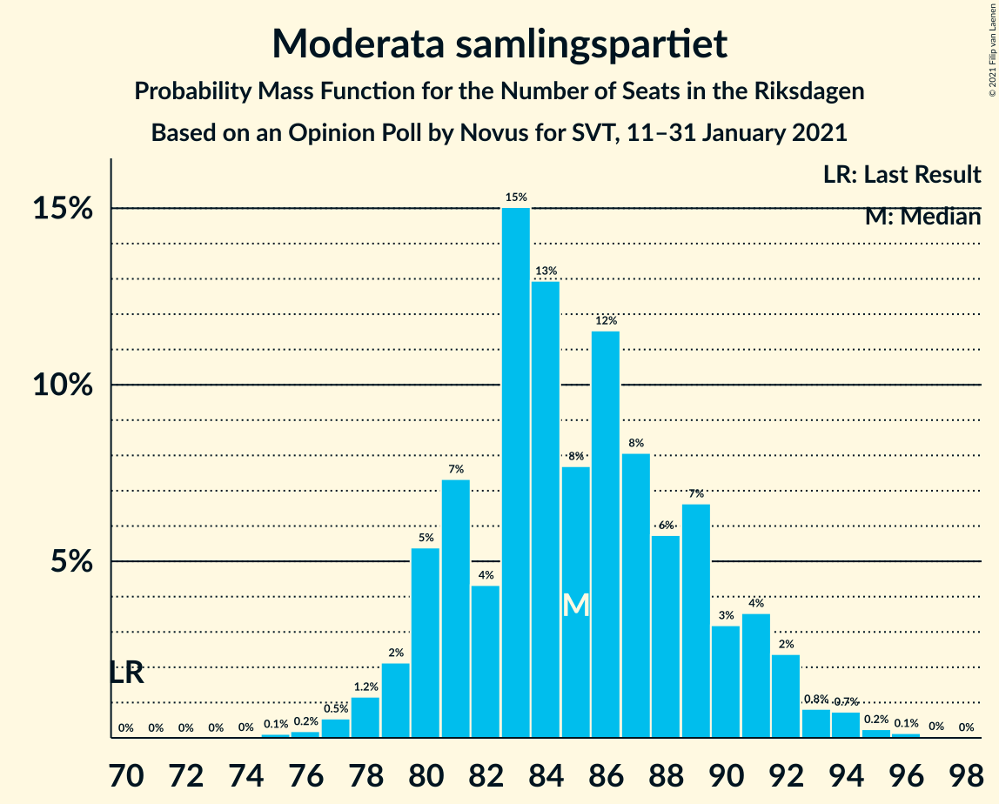
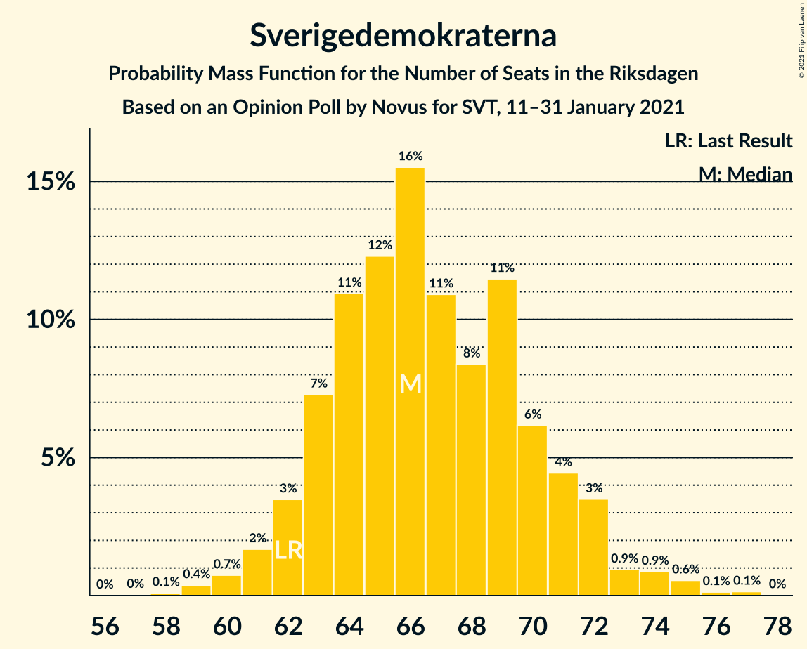
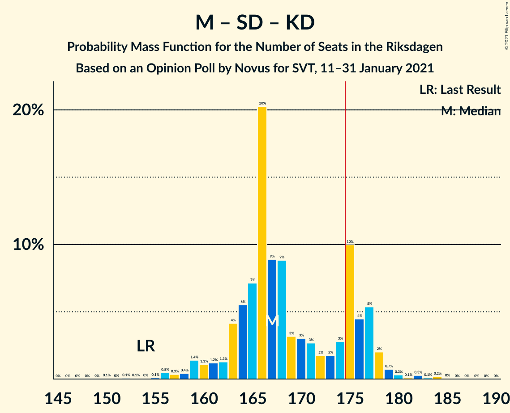
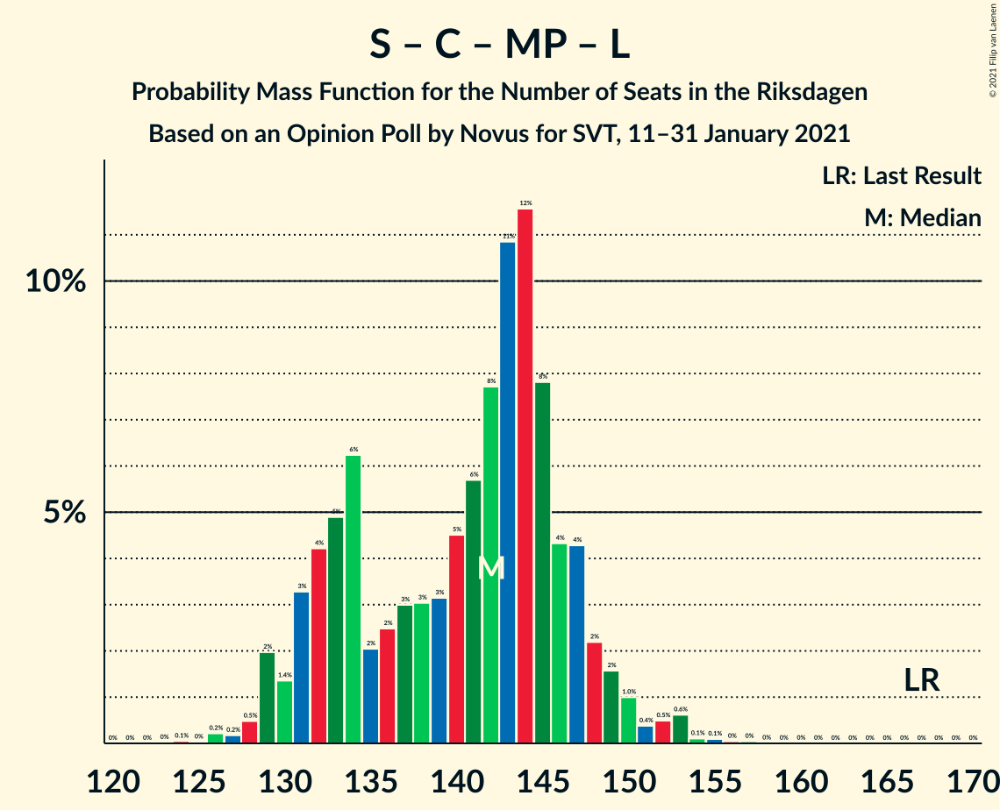

# Opinion Poll by Novus for SVT, 11–31 January 2021

<a href="#voting-intentions">Voting Intentions</a> | <a href="#seats">Seats</a> | <a href="#coalitions">Coalitions</a> | <a href="#technical-information">Technical Information</a>

## Voting Intentions

### Confidence Intervals

| Party | Last Result | Poll Result | 80% Confidence Interval | 90% Confidence Interval | 95% Confidence Interval | 99% Confidence Interval |
|:-----:|:-----------:|:-----------:|:-----------------------:|:-----------------------:|:-----------------------:|:-----------------------:|
| Sveriges socialdemokratiska arbetareparti | 28.3% | 26.9% | 25.9–28.0% |25.6–28.3% |25.3–28.6% |24.8–29.1% |
| Moderata samlingspartiet | 19.8% | 23.1% | 22.1–24.1% |21.8–24.4% |21.6–24.7% |21.1–25.2% |
| Sverigedemokraterna | 17.5% | 18.1% | 17.2–19.1% |17.0–19.3% |16.8–19.6% |16.3–20.0% |
| Vänsterpartiet | 8.0% | 10.8% | 10.1–11.6% |9.9–11.8% |9.7–12.0% |9.4–12.4% |
| Centerpartiet | 8.6% | 8.5% | 7.8–9.2% |7.7–9.4% |7.5–9.6% |7.2–9.9% |
| Kristdemokraterna | 6.3% | 4.7% | 4.2–5.3% |4.1–5.4% |4.0–5.5% |3.8–5.8% |
| Miljöpartiet de gröna | 4.4% | 4.1% | 3.6–4.6% |3.5–4.8% |3.4–4.9% |3.2–5.1% |
| Liberalerna | 5.5% | 2.7% | 2.3–3.1% |2.2–3.3% |2.2–3.4% |2.0–3.6% |

*Note:* The poll result column reflects the actual value used in the calculations. Published results may vary slightly, and in addition be rounded to fewer digits.

## Seats

### Confidence Intervals

| Party | Last Result | Median | 80% Confidence Interval | 90% Confidence Interval | 95% Confidence Interval | 99% Confidence Interval |
|:-----:|:-----------:|:------:|:-----------------------:|:-----------------------:|:-----------------------:|:-----------------------:|
| <a href="#sveriges-socialdemokratiska-arbetareparti">Sveriges socialdemokratiska arbetareparti</a> | 100 | 98 | 95–104 |93–105 |93–105 |91–109 |
| <a href="#moderata-samlingspartiet">Moderata samlingspartiet</a> | 70 | 84 | 83–90 |81–91 |79–92 |77–93 |
| <a href="#sverigedemokraterna">Sverigedemokraterna</a> | 62 | 66 | 63–71 |62–71 |62–71 |59–76 |
| <a href="#vänsterpartiet">Vänsterpartiet</a> | 28 | 41 | 38–43 |37–43 |36–44 |34–46 |
| <a href="#centerpartiet">Centerpartiet</a> | 31 | 30 | 28–34 |28–35 |28–35 |27–36 |
| <a href="#kristdemokraterna">Kristdemokraterna</a> | 22 | 18 | 16–19 |15–19 |0–20 |0–21 |
| <a href="#miljöpartiet-de-gröna">Miljöpartiet de gröna</a> | 16 | 15 | 0–17 |0–17 |0–18 |0–18 |
| <a href="#liberalerna">Liberalerna</a> | 20 | 0 | 0 |0 |0 |0 |

### Sveriges socialdemokratiska arbetareparti

*For a full overview of the results for this party, see the [Sveriges socialdemokratiska arbetareparti](party-sverigessocialdemokratiskaarbetareparti.html) page.*

| Number of Seats | Probability | Accumulated | Special Marks |
|:---------------:|:-----------:|:-----------:|:-------------:|
| 88 | 0.1% | 100% |  |
| 89 | 0% | 99.9% |  |
| 90 | 0% | 99.9% |  |
| 91 | 0.7% | 99.9% |  |
| 92 | 0.7% | 99.1% |  |
| 93 | 8% | 98% |  |
| 94 | 0.7% | 91% |  |
| 95 | 2% | 90% |  |
| 96 | 2% | 89% |  |
| 97 | 3% | 86% |  |
| 98 | 39% | 83% | Median |
| 99 | 8% | 44% |  |
| 100 | 14% | 37% | Last Result |
| 101 | 6% | 23% |  |
| 102 | 2% | 17% |  |
| 103 | 5% | 15% |  |
| 104 | 4% | 10% |  |
| 105 | 4% | 6% |  |
| 106 | 0.7% | 2% |  |
| 107 | 0.9% | 2% |  |
| 108 | 0.1% | 0.9% |  |
| 109 | 0.6% | 0.7% |  |
| 110 | 0% | 0.1% |  |
| 111 | 0.1% | 0.1% |  |
| 112 | 0% | 0% |  |

### Moderata samlingspartiet

*For a full overview of the results for this party, see the [Moderata samlingspartiet](party-moderatasamlingspartiet.html) page.*

| Number of Seats | Probability | Accumulated | Special Marks |
|:---------------:|:-----------:|:-----------:|:-------------:|
| 70 | 0% | 100% | Last Result |
| 71 | 0% | 100% |  |
| 72 | 0% | 100% |  |
| 73 | 0% | 100% |  |
| 74 | 0% | 100% |  |
| 75 | 0.1% | 100% |  |
| 76 | 0.3% | 99.9% |  |
| 77 | 0.3% | 99.6% |  |
| 78 | 1.1% | 99.3% |  |
| 79 | 2% | 98% |  |
| 80 | 0.7% | 96% |  |
| 81 | 3% | 96% |  |
| 82 | 2% | 93% |  |
| 83 | 11% | 91% |  |
| 84 | 35% | 80% | Median |
| 85 | 6% | 45% |  |
| 86 | 8% | 38% |  |
| 87 | 6% | 30% |  |
| 88 | 7% | 24% |  |
| 89 | 6% | 17% |  |
| 90 | 5% | 11% |  |
| 91 | 1.1% | 6% |  |
| 92 | 3% | 5% |  |
| 93 | 0.8% | 1.1% |  |
| 94 | 0.2% | 0.3% |  |
| 95 | 0.1% | 0.1% |  |
| 96 | 0% | 0.1% |  |
| 97 | 0% | 0.1% |  |
| 98 | 0% | 0% |  |

### Sverigedemokraterna

*For a full overview of the results for this party, see the [Sverigedemokraterna](party-sverigedemokraterna.html) page.*

| Number of Seats | Probability | Accumulated | Special Marks |
|:---------------:|:-----------:|:-----------:|:-------------:|
| 58 | 0.1% | 100% |  |
| 59 | 0.5% | 99.9% |  |
| 60 | 0.8% | 99.4% |  |
| 61 | 0.2% | 98.6% |  |
| 62 | 5% | 98% | Last Result |
| 63 | 6% | 94% |  |
| 64 | 32% | 88% |  |
| 65 | 3% | 56% |  |
| 66 | 12% | 53% | Median |
| 67 | 15% | 41% |  |
| 68 | 4% | 26% |  |
| 69 | 0.5% | 22% |  |
| 70 | 5% | 21% |  |
| 71 | 15% | 16% |  |
| 72 | 0.3% | 2% |  |
| 73 | 0.1% | 2% |  |
| 74 | 0.6% | 1.4% |  |
| 75 | 0.2% | 0.8% |  |
| 76 | 0.2% | 0.6% |  |
| 77 | 0.3% | 0.4% |  |
| 78 | 0.1% | 0.1% |  |
| 79 | 0% | 0% |  |

### Vänsterpartiet

*For a full overview of the results for this party, see the [Vänsterpartiet](party-vänsterpartiet.html) page.*

| Number of Seats | Probability | Accumulated | Special Marks |
|:---------------:|:-----------:|:-----------:|:-------------:|
| 28 | 0% | 100% | Last Result |
| 29 | 0% | 100% |  |
| 30 | 0% | 100% |  |
| 31 | 0% | 100% |  |
| 32 | 0% | 100% |  |
| 33 | 0.1% | 100% |  |
| 34 | 1.3% | 99.9% |  |
| 35 | 0.1% | 98.6% |  |
| 36 | 3% | 98.5% |  |
| 37 | 5% | 96% |  |
| 38 | 7% | 91% |  |
| 39 | 11% | 84% |  |
| 40 | 22% | 73% |  |
| 41 | 35% | 51% | Median |
| 42 | 2% | 16% |  |
| 43 | 11% | 14% |  |
| 44 | 3% | 4% |  |
| 45 | 0.3% | 0.9% |  |
| 46 | 0.5% | 0.6% |  |
| 47 | 0% | 0.1% |  |
| 48 | 0% | 0% |  |

### Centerpartiet

*For a full overview of the results for this party, see the [Centerpartiet](party-centerpartiet.html) page.*

| Number of Seats | Probability | Accumulated | Special Marks |
|:---------------:|:-----------:|:-----------:|:-------------:|
| 25 | 0.1% | 100% |  |
| 26 | 0.2% | 99.9% |  |
| 27 | 0.4% | 99.7% |  |
| 28 | 11% | 99.3% |  |
| 29 | 30% | 88% |  |
| 30 | 14% | 58% | Median |
| 31 | 15% | 44% | Last Result |
| 32 | 8% | 29% |  |
| 33 | 11% | 22% |  |
| 34 | 5% | 11% |  |
| 35 | 3% | 5% |  |
| 36 | 2% | 2% |  |
| 37 | 0.2% | 0.2% |  |
| 38 | 0% | 0.1% |  |
| 39 | 0% | 0% |  |

### Kristdemokraterna

*For a full overview of the results for this party, see the [Kristdemokraterna](party-kristdemokraterna.html) page.*

| Number of Seats | Probability | Accumulated | Special Marks |
|:---------------:|:-----------:|:-----------:|:-------------:|
| 0 | 5% | 100% |  |
| 1 | 0% | 95% |  |
| 2 | 0% | 95% |  |
| 3 | 0% | 95% |  |
| 4 | 0% | 95% |  |
| 5 | 0% | 95% |  |
| 6 | 0% | 95% |  |
| 7 | 0% | 95% |  |
| 8 | 0% | 95% |  |
| 9 | 0% | 95% |  |
| 10 | 0% | 95% |  |
| 11 | 0% | 95% |  |
| 12 | 0% | 95% |  |
| 13 | 0% | 95% |  |
| 14 | 0% | 95% |  |
| 15 | 2% | 95% |  |
| 16 | 29% | 93% |  |
| 17 | 11% | 65% |  |
| 18 | 42% | 54% | Median |
| 19 | 7% | 12% |  |
| 20 | 4% | 5% |  |
| 21 | 1.2% | 1.5% |  |
| 22 | 0.3% | 0.3% | Last Result |
| 23 | 0% | 0% |  |

### Miljöpartiet de gröna

*For a full overview of the results for this party, see the [Miljöpartiet de gröna](party-miljöpartietdegröna.html) page.*

| Number of Seats | Probability | Accumulated | Special Marks |
|:---------------:|:-----------:|:-----------:|:-------------:|
| 0 | 28% | 100% |  |
| 1 | 0% | 72% |  |
| 2 | 0% | 72% |  |
| 3 | 0% | 72% |  |
| 4 | 0% | 72% |  |
| 5 | 0% | 72% |  |
| 6 | 0% | 72% |  |
| 7 | 0% | 72% |  |
| 8 | 0% | 72% |  |
| 9 | 0% | 72% |  |
| 10 | 0% | 72% |  |
| 11 | 0% | 72% |  |
| 12 | 0% | 72% |  |
| 13 | 0% | 72% |  |
| 14 | 4% | 72% |  |
| 15 | 44% | 68% | Median |
| 16 | 12% | 23% | Last Result |
| 17 | 8% | 11% |  |
| 18 | 3% | 3% |  |
| 19 | 0.4% | 0.5% |  |
| 20 | 0% | 0% |  |

### Liberalerna

*For a full overview of the results for this party, see the [Liberalerna](party-liberalerna.html) page.*

| Number of Seats | Probability | Accumulated | Special Marks |
|:---------------:|:-----------:|:-----------:|:-------------:|
| 0 | 100% | 100% | Median |
| 1 | 0% | 0% |  |
| 2 | 0% | 0% |  |
| 3 | 0% | 0% |  |
| 4 | 0% | 0% |  |
| 5 | 0% | 0% |  |
| 6 | 0% | 0% |  |
| 7 | 0% | 0% |  |
| 8 | 0% | 0% |  |
| 9 | 0% | 0% |  |
| 10 | 0% | 0% |  |
| 11 | 0% | 0% |  |
| 12 | 0% | 0% |  |
| 13 | 0% | 0% |  |
| 14 | 0% | 0% |  |
| 15 | 0% | 0% |  |
| 16 | 0% | 0% |  |
| 17 | 0% | 0% |  |
| 18 | 0% | 0% |  |
| 19 | 0% | 0% |  |
| 20 | 0% | 0% | Last Result |

## Coalitions

### Confidence Intervals

| Coalition | Last Result | Median | Majority? | 80% Confidence Interval | 90% Confidence Interval | 95% Confidence Interval | 99% Confidence Interval |
|:---------:|:-----------:|:------:|:---------:|:-----------------------:|:-----------------------:|:-----------------------:|:-----------------------:|
| Sveriges socialdemokratiska arbetareparti – Moderata samlingspartiet – Centerpartiet | 201 | 213 | 100% | 211–224 | 209–225 | 207–227 | 206–229 |
| Sveriges socialdemokratiska arbetareparti – Moderata samlingspartiet | 170 | 183 | 99.2% | 180–193 | 178–195 | 177–195 | 174–196 |
| Sveriges socialdemokratiska arbetareparti – Vänsterpartiet – Centerpartiet – Miljöpartiet de gröna – Liberalerna | 195 | 183 | 81% | 174–186 | 172–190 | 171–192 | 165–193 |
| Moderata samlingspartiet – Sverigedemokraterna – Kristdemokraterna | 154 | 166 | 19% | 163–175 | 159–177 | 157–178 | 156–184 |
| Moderata samlingspartiet – Sverigedemokraterna | 132 | 150 | 0% | 147–159 | 146–160 | 144–161 | 142–166 |
| Sveriges socialdemokratiska arbetareparti – Vänsterpartiet – Miljöpartiet de gröna | 144 | 154 | 0% | 142–155 | 140–157 | 138–160 | 135–162 |
| Sveriges socialdemokratiska arbetareparti – Centerpartiet – Miljöpartiet de gröna – Liberalerna | 167 | 142 | 0% | 131–146 | 131–149 | 130–152 | 128–153 |
| Sveriges socialdemokratiska arbetareparti – Vänsterpartiet | 128 | 139 | 0% | 132–144 | 131–145 | 131–147 | 129–151 |
| Moderata samlingspartiet – Centerpartiet – Kristdemokraterna – Liberalerna | 143 | 131 | 0% | 127–140 | 125–141 | 122–143 | 119–143 |
| Moderata samlingspartiet – Centerpartiet – Kristdemokraterna | 123 | 131 | 0% | 127–140 | 125–141 | 122–143 | 119–143 |
| Moderata samlingspartiet – Centerpartiet – Liberalerna | 121 | 115 | 0% | 111–122 | 111–123 | 110–125 | 108–126 |
| Moderata samlingspartiet – Centerpartiet | 101 | 115 | 0% | 111–122 | 111–123 | 110–125 | 108–126 |
| Sveriges socialdemokratiska arbetareparti – Miljöpartiet de gröna | 116 | 113 | 0% | 99–115 | 99–117 | 97–120 | 96–122 |

### Sveriges socialdemokratiska arbetareparti – Moderata samlingspartiet – Centerpartiet

| Number of Seats | Probability | Accumulated | Special Marks |
|:---------------:|:-----------:|:-----------:|:-------------:|
| 201 | 0% | 100% | Last Result |
| 202 | 0% | 100% |  |
| 203 | 0% | 99.9% |  |
| 204 | 0% | 99.9% |  |
| 205 | 0.2% | 99.9% |  |
| 206 | 0.2% | 99.7% |  |
| 207 | 2% | 99.5% |  |
| 208 | 0.9% | 97% |  |
| 209 | 3% | 96% |  |
| 210 | 0.8% | 93% |  |
| 211 | 40% | 92% |  |
| 212 | 1.4% | 52% | Median |
| 213 | 10% | 51% |  |
| 214 | 5% | 41% |  |
| 215 | 2% | 36% |  |
| 216 | 1.4% | 34% |  |
| 217 | 5% | 33% |  |
| 218 | 2% | 28% |  |
| 219 | 6% | 26% |  |
| 220 | 1.3% | 20% |  |
| 221 | 1.0% | 19% |  |
| 222 | 4% | 18% |  |
| 223 | 2% | 14% |  |
| 224 | 3% | 12% |  |
| 225 | 5% | 9% |  |
| 226 | 0.5% | 5% |  |
| 227 | 3% | 4% |  |
| 228 | 0.1% | 0.9% |  |
| 229 | 0.4% | 0.8% |  |
| 230 | 0% | 0.4% |  |
| 231 | 0.2% | 0.4% |  |
| 232 | 0% | 0.2% |  |
| 233 | 0.1% | 0.1% |  |
| 234 | 0% | 0% |  |

### Sveriges socialdemokratiska arbetareparti – Moderata samlingspartiet

| Number of Seats | Probability | Accumulated | Special Marks |
|:---------------:|:-----------:|:-----------:|:-------------:|
| 170 | 0% | 100% | Last Result |
| 171 | 0% | 99.9% |  |
| 172 | 0.1% | 99.9% |  |
| 173 | 0.1% | 99.9% |  |
| 174 | 0.5% | 99.7% |  |
| 175 | 0.2% | 99.2% | Majority |
| 176 | 0.9% | 99.0% |  |
| 177 | 3% | 98% |  |
| 178 | 0.8% | 95% |  |
| 179 | 3% | 94% |  |
| 180 | 6% | 92% |  |
| 181 | 3% | 86% |  |
| 182 | 32% | 83% | Median |
| 183 | 15% | 51% |  |
| 184 | 2% | 36% |  |
| 185 | 2% | 34% |  |
| 186 | 3% | 31% |  |
| 187 | 10% | 28% |  |
| 188 | 0.7% | 18% |  |
| 189 | 4% | 18% |  |
| 190 | 0.6% | 14% |  |
| 191 | 2% | 13% |  |
| 192 | 1.3% | 11% |  |
| 193 | 5% | 10% |  |
| 194 | 0.4% | 5% |  |
| 195 | 4% | 5% |  |
| 196 | 0.6% | 1.1% |  |
| 197 | 0.1% | 0.5% |  |
| 198 | 0% | 0.4% |  |
| 199 | 0.3% | 0.3% |  |
| 200 | 0% | 0.1% |  |
| 201 | 0% | 0% |  |

### Sveriges socialdemokratiska arbetareparti – Vänsterpartiet – Centerpartiet – Miljöpartiet de gröna – Liberalerna

| Number of Seats | Probability | Accumulated | Special Marks |
|:---------------:|:-----------:|:-----------:|:-------------:|
| 165 | 0.6% | 100% |  |
| 166 | 0.1% | 99.4% |  |
| 167 | 0.1% | 99.3% |  |
| 168 | 0.1% | 99.2% |  |
| 169 | 0% | 99.2% |  |
| 170 | 0.7% | 99.1% |  |
| 171 | 2% | 98% |  |
| 172 | 5% | 96% |  |
| 173 | 0.7% | 91% |  |
| 174 | 10% | 91% |  |
| 175 | 0.9% | 81% | Majority |
| 176 | 0.5% | 80% |  |
| 177 | 4% | 79% |  |
| 178 | 1.1% | 76% |  |
| 179 | 6% | 74% |  |
| 180 | 4% | 69% |  |
| 181 | 3% | 64% |  |
| 182 | 2% | 61% |  |
| 183 | 43% | 59% |  |
| 184 | 1.5% | 16% | Median |
| 185 | 2% | 14% |  |
| 186 | 6% | 12% |  |
| 187 | 0.5% | 7% |  |
| 188 | 0.6% | 6% |  |
| 189 | 0.1% | 6% |  |
| 190 | 3% | 5% |  |
| 191 | 0.3% | 3% |  |
| 192 | 0.2% | 3% |  |
| 193 | 2% | 2% |  |
| 194 | 0.1% | 0.2% |  |
| 195 | 0.1% | 0.2% | Last Result |
| 196 | 0.1% | 0.1% |  |
| 197 | 0% | 0.1% |  |
| 198 | 0% | 0% |  |

### Moderata samlingspartiet – Sverigedemokraterna – Kristdemokraterna

| Number of Seats | Probability | Accumulated | Special Marks |
|:---------------:|:-----------:|:-----------:|:-------------:|
| 152 | 0% | 100% |  |
| 153 | 0.1% | 99.9% |  |
| 154 | 0.1% | 99.9% | Last Result |
| 155 | 0.1% | 99.8% |  |
| 156 | 2% | 99.8% |  |
| 157 | 0.2% | 98% |  |
| 158 | 0.3% | 97% |  |
| 159 | 3% | 97% |  |
| 160 | 0.1% | 95% |  |
| 161 | 0.6% | 94% |  |
| 162 | 0.5% | 94% |  |
| 163 | 6% | 93% |  |
| 164 | 2% | 88% |  |
| 165 | 1.5% | 86% |  |
| 166 | 43% | 84% |  |
| 167 | 2% | 41% |  |
| 168 | 3% | 39% | Median |
| 169 | 4% | 36% |  |
| 170 | 6% | 31% |  |
| 171 | 1.1% | 26% |  |
| 172 | 4% | 24% |  |
| 173 | 0.5% | 21% |  |
| 174 | 0.9% | 20% |  |
| 175 | 10% | 19% | Majority |
| 176 | 0.7% | 9% |  |
| 177 | 5% | 9% |  |
| 178 | 2% | 4% |  |
| 179 | 0.7% | 2% |  |
| 180 | 0% | 0.9% |  |
| 181 | 0.1% | 0.8% |  |
| 182 | 0.1% | 0.8% |  |
| 183 | 0.1% | 0.7% |  |
| 184 | 0.6% | 0.6% |  |
| 185 | 0% | 0% |  |

### Moderata samlingspartiet – Sverigedemokraterna

| Number of Seats | Probability | Accumulated | Special Marks |
|:---------------:|:-----------:|:-----------:|:-------------:|
| 132 | 0% | 100% | Last Result |
| 133 | 0% | 100% |  |
| 134 | 0% | 100% |  |
| 135 | 0% | 100% |  |
| 136 | 0% | 100% |  |
| 137 | 0% | 100% |  |
| 138 | 0% | 100% |  |
| 139 | 0.1% | 100% |  |
| 140 | 0.1% | 99.9% |  |
| 141 | 0.1% | 99.8% |  |
| 142 | 0.5% | 99.6% |  |
| 143 | 0.5% | 99.2% |  |
| 144 | 1.4% | 98.7% |  |
| 145 | 2% | 97% |  |
| 146 | 0.7% | 95% |  |
| 147 | 5% | 94% |  |
| 148 | 30% | 90% |  |
| 149 | 4% | 60% |  |
| 150 | 15% | 56% | Median |
| 151 | 4% | 41% |  |
| 152 | 2% | 37% |  |
| 153 | 4% | 35% |  |
| 154 | 4% | 31% |  |
| 155 | 3% | 27% |  |
| 156 | 3% | 23% |  |
| 157 | 5% | 21% |  |
| 158 | 4% | 15% |  |
| 159 | 6% | 12% |  |
| 160 | 2% | 6% |  |
| 161 | 2% | 4% |  |
| 162 | 0.2% | 2% |  |
| 163 | 0.1% | 1.4% |  |
| 164 | 0.6% | 1.3% |  |
| 165 | 0% | 0.7% |  |
| 166 | 0.3% | 0.7% |  |
| 167 | 0% | 0.4% |  |
| 168 | 0.3% | 0.4% |  |
| 169 | 0% | 0.1% |  |
| 170 | 0.1% | 0.1% |  |
| 171 | 0% | 0% |  |

### Sveriges socialdemokratiska arbetareparti – Vänsterpartiet – Miljöpartiet de gröna

| Number of Seats | Probability | Accumulated | Special Marks |
|:---------------:|:-----------:|:-----------:|:-------------:|
| 133 | 0.1% | 100% |  |
| 134 | 0.1% | 99.9% |  |
| 135 | 0.6% | 99.8% |  |
| 136 | 2% | 99.2% |  |
| 137 | 0% | 98% |  |
| 138 | 2% | 98% |  |
| 139 | 0.3% | 96% |  |
| 140 | 1.0% | 95% |  |
| 141 | 2% | 94% |  |
| 142 | 8% | 93% |  |
| 143 | 0.7% | 85% |  |
| 144 | 5% | 84% | Last Result |
| 145 | 4% | 79% |  |
| 146 | 3% | 75% |  |
| 147 | 6% | 72% |  |
| 148 | 2% | 66% |  |
| 149 | 3% | 64% |  |
| 150 | 2% | 61% |  |
| 151 | 2% | 60% |  |
| 152 | 5% | 57% |  |
| 153 | 1.2% | 52% |  |
| 154 | 28% | 51% | Median |
| 155 | 15% | 23% |  |
| 156 | 0.4% | 8% |  |
| 157 | 4% | 7% |  |
| 158 | 0.3% | 3% |  |
| 159 | 0.4% | 3% |  |
| 160 | 0.2% | 3% |  |
| 161 | 0% | 2% |  |
| 162 | 2% | 2% |  |
| 163 | 0.1% | 0.3% |  |
| 164 | 0.1% | 0.2% |  |
| 165 | 0% | 0.1% |  |
| 166 | 0% | 0.1% |  |
| 167 | 0% | 0% |  |

### Sveriges socialdemokratiska arbetareparti – Centerpartiet – Miljöpartiet de gröna – Liberalerna

| Number of Seats | Probability | Accumulated | Special Marks |
|:---------------:|:-----------:|:-----------:|:-------------:|
| 126 | 0.2% | 100% |  |
| 127 | 0.1% | 99.8% |  |
| 128 | 0.5% | 99.7% |  |
| 129 | 0.5% | 99.2% |  |
| 130 | 2% | 98.7% |  |
| 131 | 9% | 97% |  |
| 132 | 2% | 88% |  |
| 133 | 4% | 86% |  |
| 134 | 0.8% | 82% |  |
| 135 | 0.8% | 81% |  |
| 136 | 2% | 80% |  |
| 137 | 2% | 78% |  |
| 138 | 3% | 76% |  |
| 139 | 4% | 73% |  |
| 140 | 0.8% | 70% |  |
| 141 | 6% | 69% |  |
| 142 | 28% | 63% |  |
| 143 | 16% | 35% | Median |
| 144 | 1.1% | 19% |  |
| 145 | 4% | 18% |  |
| 146 | 4% | 14% |  |
| 147 | 2% | 10% |  |
| 148 | 2% | 8% |  |
| 149 | 2% | 6% |  |
| 150 | 0.4% | 3% |  |
| 151 | 0.4% | 3% |  |
| 152 | 0.3% | 3% |  |
| 153 | 2% | 2% |  |
| 154 | 0.1% | 0.2% |  |
| 155 | 0.1% | 0.1% |  |
| 156 | 0% | 0.1% |  |
| 157 | 0% | 0% |  |
| 158 | 0% | 0% |  |
| 159 | 0% | 0% |  |
| 160 | 0% | 0% |  |
| 161 | 0% | 0% |  |
| 162 | 0% | 0% |  |
| 163 | 0% | 0% |  |
| 164 | 0% | 0% |  |
| 165 | 0% | 0% |  |
| 166 | 0% | 0% |  |
| 167 | 0% | 0% | Last Result |

### Sveriges socialdemokratiska arbetareparti – Vänsterpartiet

| Number of Seats | Probability | Accumulated | Special Marks |
|:---------------:|:-----------:|:-----------:|:-------------:|
| 127 | 0.1% | 100% |  |
| 128 | 0.1% | 99.9% | Last Result |
| 129 | 0.3% | 99.8% |  |
| 130 | 1.3% | 99.5% |  |
| 131 | 5% | 98% |  |
| 132 | 4% | 93% |  |
| 133 | 0.8% | 90% |  |
| 134 | 2% | 89% |  |
| 135 | 3% | 87% |  |
| 136 | 2% | 84% |  |
| 137 | 1.1% | 82% |  |
| 138 | 10% | 81% |  |
| 139 | 30% | 71% | Median |
| 140 | 13% | 41% |  |
| 141 | 3% | 29% |  |
| 142 | 9% | 25% |  |
| 143 | 1.0% | 16% |  |
| 144 | 5% | 15% |  |
| 145 | 6% | 10% |  |
| 146 | 2% | 4% |  |
| 147 | 0.6% | 3% |  |
| 148 | 1.0% | 2% |  |
| 149 | 0.1% | 1.0% |  |
| 150 | 0.1% | 0.8% |  |
| 151 | 0.3% | 0.7% |  |
| 152 | 0.3% | 0.4% |  |
| 153 | 0.1% | 0.1% |  |
| 154 | 0% | 0% |  |

### Moderata samlingspartiet – Centerpartiet – Kristdemokraterna – Liberalerna

| Number of Seats | Probability | Accumulated | Special Marks |
|:---------------:|:-----------:|:-----------:|:-------------:|
| 115 | 0.1% | 100% |  |
| 116 | 0% | 99.9% |  |
| 117 | 0% | 99.9% |  |
| 118 | 0% | 99.8% |  |
| 119 | 2% | 99.8% |  |
| 120 | 0.1% | 98% |  |
| 121 | 0.1% | 98% |  |
| 122 | 2% | 98% |  |
| 123 | 0.1% | 96% |  |
| 124 | 0.6% | 96% |  |
| 125 | 0.6% | 95% |  |
| 126 | 0.7% | 95% |  |
| 127 | 10% | 94% |  |
| 128 | 2% | 84% |  |
| 129 | 3% | 82% |  |
| 130 | 0.5% | 79% |  |
| 131 | 34% | 79% |  |
| 132 | 5% | 44% | Median |
| 133 | 4% | 39% |  |
| 134 | 4% | 35% |  |
| 135 | 4% | 31% |  |
| 136 | 6% | 27% |  |
| 137 | 2% | 21% |  |
| 138 | 4% | 19% |  |
| 139 | 4% | 15% |  |
| 140 | 4% | 11% |  |
| 141 | 4% | 7% |  |
| 142 | 0.9% | 4% |  |
| 143 | 2% | 3% | Last Result |
| 144 | 0.1% | 0.4% |  |
| 145 | 0.1% | 0.4% |  |
| 146 | 0.2% | 0.3% |  |
| 147 | 0% | 0.1% |  |
| 148 | 0.1% | 0.1% |  |
| 149 | 0% | 0% |  |

### Moderata samlingspartiet – Centerpartiet – Kristdemokraterna

| Number of Seats | Probability | Accumulated | Special Marks |
|:---------------:|:-----------:|:-----------:|:-------------:|
| 115 | 0.1% | 100% |  |
| 116 | 0% | 99.9% |  |
| 117 | 0% | 99.9% |  |
| 118 | 0% | 99.8% |  |
| 119 | 2% | 99.8% |  |
| 120 | 0.1% | 98% |  |
| 121 | 0.1% | 98% |  |
| 122 | 2% | 98% |  |
| 123 | 0.1% | 96% | Last Result |
| 124 | 0.6% | 96% |  |
| 125 | 0.6% | 95% |  |
| 126 | 0.7% | 95% |  |
| 127 | 10% | 94% |  |
| 128 | 2% | 84% |  |
| 129 | 3% | 82% |  |
| 130 | 0.5% | 79% |  |
| 131 | 34% | 79% |  |
| 132 | 5% | 44% | Median |
| 133 | 4% | 39% |  |
| 134 | 4% | 35% |  |
| 135 | 4% | 31% |  |
| 136 | 6% | 27% |  |
| 137 | 2% | 21% |  |
| 138 | 4% | 19% |  |
| 139 | 4% | 15% |  |
| 140 | 4% | 11% |  |
| 141 | 4% | 7% |  |
| 142 | 0.9% | 4% |  |
| 143 | 2% | 3% |  |
| 144 | 0.1% | 0.4% |  |
| 145 | 0.1% | 0.4% |  |
| 146 | 0.2% | 0.3% |  |
| 147 | 0% | 0.1% |  |
| 148 | 0.1% | 0.1% |  |
| 149 | 0% | 0% |  |

### Moderata samlingspartiet – Centerpartiet – Liberalerna

| Number of Seats | Probability | Accumulated | Special Marks |
|:---------------:|:-----------:|:-----------:|:-------------:|
| 105 | 0% | 100% |  |
| 106 | 0% | 99.9% |  |
| 107 | 0.4% | 99.9% |  |
| 108 | 0.6% | 99.5% |  |
| 109 | 0.3% | 99.0% |  |
| 110 | 2% | 98.7% |  |
| 111 | 10% | 96% |  |
| 112 | 0.9% | 86% |  |
| 113 | 30% | 85% |  |
| 114 | 5% | 56% | Median |
| 115 | 5% | 51% |  |
| 116 | 11% | 46% |  |
| 117 | 4% | 35% |  |
| 118 | 1.3% | 31% |  |
| 119 | 5% | 30% |  |
| 120 | 9% | 25% |  |
| 121 | 0.5% | 16% | Last Result |
| 122 | 6% | 16% |  |
| 123 | 6% | 9% |  |
| 124 | 0% | 3% |  |
| 125 | 1.4% | 3% |  |
| 126 | 1.3% | 2% |  |
| 127 | 0% | 0.2% |  |
| 128 | 0% | 0.2% |  |
| 129 | 0.2% | 0.2% |  |
| 130 | 0% | 0% |  |

### Moderata samlingspartiet – Centerpartiet

| Number of Seats | Probability | Accumulated | Special Marks |
|:---------------:|:-----------:|:-----------:|:-------------:|
| 101 | 0% | 100% | Last Result |
| 102 | 0% | 100% |  |
| 103 | 0% | 100% |  |
| 104 | 0% | 100% |  |
| 105 | 0% | 100% |  |
| 106 | 0% | 99.9% |  |
| 107 | 0.4% | 99.9% |  |
| 108 | 0.6% | 99.5% |  |
| 109 | 0.3% | 99.0% |  |
| 110 | 2% | 98.7% |  |
| 111 | 10% | 96% |  |
| 112 | 0.9% | 86% |  |
| 113 | 30% | 85% |  |
| 114 | 5% | 56% | Median |
| 115 | 5% | 51% |  |
| 116 | 11% | 46% |  |
| 117 | 4% | 35% |  |
| 118 | 1.3% | 31% |  |
| 119 | 5% | 30% |  |
| 120 | 9% | 25% |  |
| 121 | 0.5% | 16% |  |
| 122 | 6% | 16% |  |
| 123 | 6% | 9% |  |
| 124 | 0% | 3% |  |
| 125 | 1.4% | 3% |  |
| 126 | 1.3% | 2% |  |
| 127 | 0% | 0.2% |  |
| 128 | 0% | 0.2% |  |
| 129 | 0.2% | 0.2% |  |
| 130 | 0% | 0% |  |

### Sveriges socialdemokratiska arbetareparti – Miljöpartiet de gröna

| Number of Seats | Probability | Accumulated | Special Marks |
|:---------------:|:-----------:|:-----------:|:-------------:|
| 93 | 0.1% | 100% |  |
| 94 | 0.1% | 99.9% |  |
| 95 | 0.1% | 99.9% |  |
| 96 | 0.9% | 99.8% |  |
| 97 | 3% | 98.9% |  |
| 98 | 0.8% | 96% |  |
| 99 | 6% | 95% |  |
| 100 | 0.7% | 89% |  |
| 101 | 4% | 88% |  |
| 102 | 1.2% | 84% |  |
| 103 | 4% | 83% |  |
| 104 | 4% | 79% |  |
| 105 | 1.4% | 75% |  |
| 106 | 0.7% | 74% |  |
| 107 | 1.4% | 73% |  |
| 108 | 3% | 72% |  |
| 109 | 4% | 68% |  |
| 110 | 1.0% | 65% |  |
| 111 | 3% | 64% |  |
| 112 | 5% | 60% |  |
| 113 | 28% | 55% | Median |
| 114 | 3% | 27% |  |
| 115 | 14% | 24% |  |
| 116 | 3% | 10% | Last Result |
| 117 | 3% | 7% |  |
| 118 | 0.6% | 4% |  |
| 119 | 0.6% | 3% |  |
| 120 | 0.3% | 3% |  |
| 121 | 0.1% | 2% |  |
| 122 | 2% | 2% |  |
| 123 | 0.1% | 0.2% |  |
| 124 | 0% | 0.1% |  |
| 125 | 0% | 0% |  |

## Technical Information

### Opinion Poll

+ **Polling firm:** Novus
+ **Commissioner(s):** SVT
+ **Fieldwork period:** 11–31 January 2021

### Calculations

+ **Sample size:** 2887
+ **Simulations done:** 131,072
+ **Error estimate:** 0.85%

