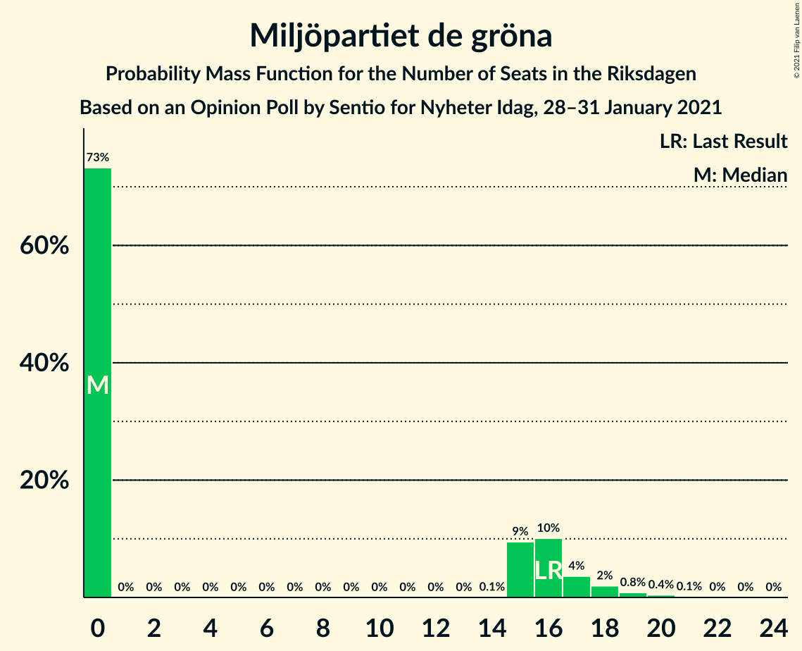

# Opinion Poll by Sentio for Nyheter Idag, 28–31 January 2021

<a href="#voting-intentions">Voting Intentions</a> | <a href="#seats">Seats</a> | <a href="#coalitions">Coalitions</a> | <a href="#technical-information">Technical Information</a>

## Voting Intentions

### Confidence Intervals

| Party | Last Result | Poll Result | 80% Confidence Interval | 90% Confidence Interval | 95% Confidence Interval | 99% Confidence Interval |
|:-----:|:-----------:|:-----------:|:-----------------------:|:-----------------------:|:-----------------------:|:-----------------------:|
| Sveriges socialdemokratiska arbetareparti | 28.3% | 26.3% | 24.6–28.2% |24.1–28.7% |23.7–29.1% |22.8–30.0% |
| Sverigedemokraterna | 17.5% | 23.3% | 21.6–25.1% |21.2–25.6% |20.8–26.0% |20.0–26.9% |
| Moderata samlingspartiet | 19.8% | 20.7% | 19.1–22.4% |18.7–22.9% |18.3–23.3% |17.6–24.2% |
| Vänsterpartiet | 8.0% | 10.7% | 9.5–12.1% |9.2–12.4% |8.9–12.8% |8.4–13.5% |
| Centerpartiet | 8.6% | 5.8% | 5.0–6.9% |4.7–7.2% |4.5–7.4% |4.1–8.0% |
| Kristdemokraterna | 6.3% | 5.2% | 4.4–6.2% |4.2–6.5% |4.0–6.8% |3.6–7.3% |
| Miljöpartiet de gröna | 4.4% | 3.6% | 2.9–4.5% |2.8–4.7% |2.6–5.0% |2.3–5.4% |
| Liberalerna | 5.5% | 2.2% | 1.7–2.9% |1.6–3.1% |1.4–3.3% |1.2–3.7% |

*Note:* The poll result column reflects the actual value used in the calculations. Published results may vary slightly, and in addition be rounded to fewer digits.

## Seats

### Confidence Intervals

| Party | Last Result | Median | 80% Confidence Interval | 90% Confidence Interval | 95% Confidence Interval | 99% Confidence Interval |
|:-----:|:-----------:|:------:|:-----------------------:|:-----------------------:|:-----------------------:|:-----------------------:|
| <a href="#sveriges-socialdemokratiska-arbetareparti">Sveriges socialdemokratiska arbetareparti</a> | 100 | 98 | 91–105 |89–107 |87–109 |84–113 |
| <a href="#sverigedemokraterna">Sverigedemokraterna</a> | 62 | 87 | 80–94 |78–96 |77–98 |74–101 |
| <a href="#moderata-samlingspartiet">Moderata samlingspartiet</a> | 70 | 77 | 71–84 |70–86 |68–87 |65–91 |
| <a href="#vänsterpartiet">Vänsterpartiet</a> | 28 | 41 | 35–45 |34–46 |33–47 |31–50 |
| <a href="#centerpartiet">Centerpartiet</a> | 31 | 22 | 19–25 |18–27 |17–28 |15–30 |
| <a href="#kristdemokraterna">Kristdemokraterna</a> | 22 | 19 | 17–23 |16–24 |15–25 |0–27 |
| <a href="#miljöpartiet-de-gröna">Miljöpartiet de gröna</a> | 16 | 0 | 0–16 |0–17 |0–18 |0–20 |
| <a href="#liberalerna">Liberalerna</a> | 20 | 0 | 0 |0 |0 |0 |

### Sveriges socialdemokratiska arbetareparti

*For a full overview of the results for this party, see the [Sveriges socialdemokratiska arbetareparti](party-sverigessocialdemokratiskaarbetareparti.html) page.*

| Number of Seats | Probability | Accumulated | Special Marks |
|:---------------:|:-----------:|:-----------:|:-------------:|
| 81 | 0.1% | 100% |  |
| 82 | 0.1% | 99.9% |  |
| 83 | 0.2% | 99.8% |  |
| 84 | 0.3% | 99.7% |  |
| 85 | 0.4% | 99.4% |  |
| 86 | 0.6% | 99.0% |  |
| 87 | 1.2% | 98% |  |
| 88 | 2% | 97% |  |
| 89 | 2% | 96% |  |
| 90 | 2% | 93% |  |
| 91 | 3% | 91% |  |
| 92 | 3% | 89% |  |
| 93 | 6% | 86% |  |
| 94 | 6% | 80% |  |
| 95 | 7% | 74% |  |
| 96 | 8% | 67% |  |
| 97 | 6% | 59% |  |
| 98 | 5% | 54% | Median |
| 99 | 6% | 49% |  |
| 100 | 9% | 42% | Last Result |
| 101 | 4% | 33% |  |
| 102 | 6% | 29% |  |
| 103 | 7% | 23% |  |
| 104 | 4% | 16% |  |
| 105 | 4% | 12% |  |
| 106 | 2% | 8% |  |
| 107 | 2% | 6% |  |
| 108 | 1.3% | 5% |  |
| 109 | 1.3% | 3% |  |
| 110 | 0.6% | 2% |  |
| 111 | 0.4% | 1.4% |  |
| 112 | 0.2% | 1.0% |  |
| 113 | 0.4% | 0.8% |  |
| 114 | 0.1% | 0.4% |  |
| 115 | 0.1% | 0.3% |  |
| 116 | 0% | 0.2% |  |
| 117 | 0.1% | 0.1% |  |
| 118 | 0% | 0% |  |

### Sverigedemokraterna

*For a full overview of the results for this party, see the [Sverigedemokraterna](party-sverigedemokraterna.html) page.*

| Number of Seats | Probability | Accumulated | Special Marks |
|:---------------:|:-----------:|:-----------:|:-------------:|
| 62 | 0% | 100% | Last Result |
| 63 | 0% | 100% |  |
| 64 | 0% | 100% |  |
| 65 | 0% | 100% |  |
| 66 | 0% | 100% |  |
| 67 | 0% | 100% |  |
| 68 | 0% | 100% |  |
| 69 | 0% | 100% |  |
| 70 | 0% | 100% |  |
| 71 | 0% | 100% |  |
| 72 | 0.1% | 99.9% |  |
| 73 | 0.2% | 99.8% |  |
| 74 | 0.2% | 99.6% |  |
| 75 | 0.4% | 99.4% |  |
| 76 | 0.7% | 99.0% |  |
| 77 | 2% | 98% |  |
| 78 | 1.5% | 96% |  |
| 79 | 2% | 95% |  |
| 80 | 4% | 93% |  |
| 81 | 3% | 89% |  |
| 82 | 6% | 86% |  |
| 83 | 6% | 80% |  |
| 84 | 6% | 74% |  |
| 85 | 7% | 68% |  |
| 86 | 9% | 61% |  |
| 87 | 6% | 53% | Median |
| 88 | 8% | 47% |  |
| 89 | 8% | 38% |  |
| 90 | 5% | 30% |  |
| 91 | 4% | 25% |  |
| 92 | 6% | 21% |  |
| 93 | 3% | 14% |  |
| 94 | 3% | 11% |  |
| 95 | 2% | 8% |  |
| 96 | 2% | 6% |  |
| 97 | 2% | 4% |  |
| 98 | 0.8% | 3% |  |
| 99 | 0.5% | 2% |  |
| 100 | 0.4% | 1.2% |  |
| 101 | 0.4% | 0.8% |  |
| 102 | 0.2% | 0.5% |  |
| 103 | 0.1% | 0.3% |  |
| 104 | 0.1% | 0.2% |  |
| 105 | 0% | 0.1% |  |
| 106 | 0% | 0.1% |  |
| 107 | 0% | 0% |  |

### Moderata samlingspartiet

*For a full overview of the results for this party, see the [Moderata samlingspartiet](party-moderatasamlingspartiet.html) page.*

| Number of Seats | Probability | Accumulated | Special Marks |
|:---------------:|:-----------:|:-----------:|:-------------:|
| 62 | 0% | 100% |  |
| 63 | 0.1% | 99.9% |  |
| 64 | 0.2% | 99.8% |  |
| 65 | 0.5% | 99.6% |  |
| 66 | 0.6% | 99.1% |  |
| 67 | 0.8% | 98.5% |  |
| 68 | 1.0% | 98% |  |
| 69 | 2% | 97% |  |
| 70 | 3% | 95% | Last Result |
| 71 | 3% | 92% |  |
| 72 | 6% | 89% |  |
| 73 | 5% | 83% |  |
| 74 | 6% | 78% |  |
| 75 | 7% | 72% |  |
| 76 | 6% | 65% |  |
| 77 | 13% | 58% | Median |
| 78 | 6% | 45% |  |
| 79 | 5% | 40% |  |
| 80 | 7% | 34% |  |
| 81 | 5% | 27% |  |
| 82 | 7% | 22% |  |
| 83 | 5% | 16% |  |
| 84 | 2% | 11% |  |
| 85 | 3% | 9% |  |
| 86 | 3% | 6% |  |
| 87 | 1.0% | 3% |  |
| 88 | 0.8% | 2% |  |
| 89 | 0.4% | 1.3% |  |
| 90 | 0.3% | 0.9% |  |
| 91 | 0.2% | 0.6% |  |
| 92 | 0.1% | 0.3% |  |
| 93 | 0.1% | 0.2% |  |
| 94 | 0.1% | 0.1% |  |
| 95 | 0% | 0.1% |  |
| 96 | 0% | 0% |  |

### Vänsterpartiet

*For a full overview of the results for this party, see the [Vänsterpartiet](party-vänsterpartiet.html) page.*

| Number of Seats | Probability | Accumulated | Special Marks |
|:---------------:|:-----------:|:-----------:|:-------------:|
| 28 | 0% | 100% | Last Result |
| 29 | 0% | 100% |  |
| 30 | 0.4% | 99.9% |  |
| 31 | 0.8% | 99.5% |  |
| 32 | 0.7% | 98.7% |  |
| 33 | 0.8% | 98% |  |
| 34 | 4% | 97% |  |
| 35 | 4% | 94% |  |
| 36 | 5% | 89% |  |
| 37 | 5% | 84% |  |
| 38 | 6% | 79% |  |
| 39 | 4% | 73% |  |
| 40 | 11% | 69% |  |
| 41 | 14% | 59% | Median |
| 42 | 9% | 44% |  |
| 43 | 5% | 35% |  |
| 44 | 16% | 30% |  |
| 45 | 7% | 14% |  |
| 46 | 3% | 6% |  |
| 47 | 1.1% | 3% |  |
| 48 | 1.2% | 2% |  |
| 49 | 0.5% | 1.0% |  |
| 50 | 0.2% | 0.6% |  |
| 51 | 0.1% | 0.3% |  |
| 52 | 0.1% | 0.2% |  |
| 53 | 0% | 0.2% |  |
| 54 | 0.1% | 0.1% |  |
| 55 | 0% | 0% |  |

### Centerpartiet

*For a full overview of the results for this party, see the [Centerpartiet](party-centerpartiet.html) page.*

| Number of Seats | Probability | Accumulated | Special Marks |
|:---------------:|:-----------:|:-----------:|:-------------:|
| 0 | 0.3% | 100% |  |
| 1 | 0% | 99.7% |  |
| 2 | 0% | 99.7% |  |
| 3 | 0% | 99.7% |  |
| 4 | 0% | 99.7% |  |
| 5 | 0% | 99.7% |  |
| 6 | 0% | 99.7% |  |
| 7 | 0% | 99.7% |  |
| 8 | 0% | 99.7% |  |
| 9 | 0% | 99.7% |  |
| 10 | 0% | 99.7% |  |
| 11 | 0% | 99.7% |  |
| 12 | 0% | 99.7% |  |
| 13 | 0% | 99.7% |  |
| 14 | 0% | 99.7% |  |
| 15 | 0.3% | 99.7% |  |
| 16 | 1.1% | 99.5% |  |
| 17 | 3% | 98% |  |
| 18 | 5% | 95% |  |
| 19 | 10% | 91% |  |
| 20 | 11% | 80% |  |
| 21 | 13% | 69% |  |
| 22 | 15% | 56% | Median |
| 23 | 13% | 41% |  |
| 24 | 13% | 29% |  |
| 25 | 6% | 16% |  |
| 26 | 4% | 10% |  |
| 27 | 3% | 6% |  |
| 28 | 2% | 3% |  |
| 29 | 0.9% | 1.5% |  |
| 30 | 0.3% | 0.6% |  |
| 31 | 0.2% | 0.3% | Last Result |
| 32 | 0.1% | 0.1% |  |
| 33 | 0% | 0% |  |

### Kristdemokraterna

*For a full overview of the results for this party, see the [Kristdemokraterna](party-kristdemokraterna.html) page.*

| Number of Seats | Probability | Accumulated | Special Marks |
|:---------------:|:-----------:|:-----------:|:-------------:|
| 0 | 2% | 100% |  |
| 1 | 0% | 98% |  |
| 2 | 0% | 98% |  |
| 3 | 0% | 98% |  |
| 4 | 0% | 98% |  |
| 5 | 0% | 98% |  |
| 6 | 0% | 98% |  |
| 7 | 0% | 98% |  |
| 8 | 0% | 98% |  |
| 9 | 0% | 98% |  |
| 10 | 0% | 98% |  |
| 11 | 0% | 98% |  |
| 12 | 0% | 98% |  |
| 13 | 0% | 98% |  |
| 14 | 0% | 98% |  |
| 15 | 2% | 98% |  |
| 16 | 6% | 96% |  |
| 17 | 9% | 90% |  |
| 18 | 16% | 82% |  |
| 19 | 17% | 66% | Median |
| 20 | 13% | 49% |  |
| 21 | 12% | 36% |  |
| 22 | 10% | 24% | Last Result |
| 23 | 5% | 14% |  |
| 24 | 5% | 9% |  |
| 25 | 2% | 4% |  |
| 26 | 0.9% | 2% |  |
| 27 | 0.7% | 1.0% |  |
| 28 | 0.2% | 0.3% |  |
| 29 | 0.1% | 0.1% |  |
| 30 | 0% | 0% |  |

### Miljöpartiet de gröna

*For a full overview of the results for this party, see the [Miljöpartiet de gröna](party-miljöpartietdegröna.html) page.*

| Number of Seats | Probability | Accumulated | Special Marks |
|:---------------:|:-----------:|:-----------:|:-------------:|
| 0 | 73% | 100% | Median |
| 1 | 0% | 27% |  |
| 2 | 0% | 27% |  |
| 3 | 0% | 27% |  |
| 4 | 0% | 27% |  |
| 5 | 0% | 27% |  |
| 6 | 0% | 27% |  |
| 7 | 0% | 27% |  |
| 8 | 0% | 27% |  |
| 9 | 0% | 27% |  |
| 10 | 0% | 27% |  |
| 11 | 0% | 27% |  |
| 12 | 0% | 27% |  |
| 13 | 0% | 27% |  |
| 14 | 0.1% | 27% |  |
| 15 | 9% | 27% |  |
| 16 | 10% | 17% | Last Result |
| 17 | 4% | 7% |  |
| 18 | 2% | 3% |  |
| 19 | 0.8% | 1.5% |  |
| 20 | 0.4% | 0.6% |  |
| 21 | 0.1% | 0.2% |  |
| 22 | 0% | 0.1% |  |
| 23 | 0% | 0% |  |

### Liberalerna

*For a full overview of the results for this party, see the [Liberalerna](party-liberalerna.html) page.*

| Number of Seats | Probability | Accumulated | Special Marks |
|:---------------:|:-----------:|:-----------:|:-------------:|
| 0 | 99.9% | 100% | Median |
| 1 | 0% | 0.1% |  |
| 2 | 0% | 0.1% |  |
| 3 | 0% | 0.1% |  |
| 4 | 0% | 0.1% |  |
| 5 | 0% | 0.1% |  |
| 6 | 0% | 0.1% |  |
| 7 | 0% | 0.1% |  |
| 8 | 0% | 0.1% |  |
| 9 | 0% | 0.1% |  |
| 10 | 0% | 0.1% |  |
| 11 | 0% | 0.1% |  |
| 12 | 0% | 0.1% |  |
| 13 | 0% | 0.1% |  |
| 14 | 0% | 0.1% |  |
| 15 | 0% | 0.1% |  |
| 16 | 0% | 0% |  |
| 17 | 0% | 0% |  |
| 18 | 0% | 0% |  |
| 19 | 0% | 0% |  |
| 20 | 0% | 0% | Last Result |

## Coalitions

### Confidence Intervals

| Coalition | Last Result | Median | Majority? | 80% Confidence Interval | 90% Confidence Interval | 95% Confidence Interval | 99% Confidence Interval |
|:---------:|:-----------:|:------:|:---------:|:-----------------------:|:-----------------------:|:-----------------------:|:-----------------------:|
| Sveriges socialdemokratiska arbetareparti – Moderata samlingspartiet – Centerpartiet | 201 | 198 | 99.9% | 187–206 | 185–208 | 183–210 | 179–216 |
| Sverigedemokraterna – Moderata samlingspartiet – Kristdemokraterna | 154 | 184 | 90% | 175–193 | 172–195 | 170–197 | 165–201 |
| Sveriges socialdemokratiska arbetareparti – Moderata samlingspartiet | 170 | 177 | 58% | 166–184 | 164–186 | 162–188 | 158–194 |
| Sveriges socialdemokratiska arbetareparti – Vänsterpartiet – Centerpartiet – Miljöpartiet de gröna – Liberalerna | 195 | 165 | 10% | 156–174 | 154–177 | 152–179 | 148–184 |
| Sverigedemokraterna – Moderata samlingspartiet | 132 | 165 | 6% | 156–173 | 153–175 | 152–177 | 147–183 |
| Sveriges socialdemokratiska arbetareparti – Vänsterpartiet – Miljöpartiet de gröna | 144 | 144 | 0% | 134–152 | 132–155 | 130–158 | 126–162 |
| Sveriges socialdemokratiska arbetareparti – Vänsterpartiet | 128 | 139 | 0% | 130–147 | 128–149 | 126–151 | 122–155 |
| Sveriges socialdemokratiska arbetareparti – Centerpartiet – Miljöpartiet de gröna – Liberalerna | 167 | 124 | 0% | 116–134 | 114–137 | 112–140 | 108–144 |
| Moderata samlingspartiet – Centerpartiet – Kristdemokraterna – Liberalerna | 143 | 118 | 0% | 111–126 | 108–129 | 106–131 | 100–134 |
| Moderata samlingspartiet – Centerpartiet – Kristdemokraterna | 123 | 118 | 0% | 111–126 | 108–129 | 106–131 | 100–134 |
| Sveriges socialdemokratiska arbetareparti – Miljöpartiet de gröna | 116 | 102 | 0% | 94–112 | 92–115 | 90–118 | 87–122 |
| Moderata samlingspartiet – Centerpartiet – Liberalerna | 121 | 99 | 0% | 93–107 | 91–109 | 88–110 | 84–114 |
| Moderata samlingspartiet – Centerpartiet | 101 | 99 | 0% | 93–107 | 91–108 | 88–110 | 84–114 |

### Sveriges socialdemokratiska arbetareparti – Moderata samlingspartiet – Centerpartiet

| Number of Seats | Probability | Accumulated | Special Marks |
|:---------------:|:-----------:|:-----------:|:-------------:|
| 174 | 0% | 100% |  |
| 175 | 0% | 99.9% | Majority |
| 176 | 0.1% | 99.9% |  |
| 177 | 0.1% | 99.8% |  |
| 178 | 0.1% | 99.7% |  |
| 179 | 0.2% | 99.6% |  |
| 180 | 0.4% | 99.4% |  |
| 181 | 0.5% | 99.0% |  |
| 182 | 0.7% | 98.5% |  |
| 183 | 1.0% | 98% |  |
| 184 | 0.6% | 97% |  |
| 185 | 2% | 96% |  |
| 186 | 1.1% | 94% |  |
| 187 | 4% | 93% |  |
| 188 | 2% | 89% |  |
| 189 | 4% | 87% |  |
| 190 | 2% | 83% |  |
| 191 | 2% | 81% |  |
| 192 | 4% | 79% |  |
| 193 | 2% | 75% |  |
| 194 | 3% | 73% |  |
| 195 | 5% | 69% |  |
| 196 | 5% | 64% |  |
| 197 | 6% | 59% | Median |
| 198 | 4% | 53% |  |
| 199 | 6% | 49% |  |
| 200 | 6% | 42% |  |
| 201 | 7% | 37% | Last Result |
| 202 | 5% | 30% |  |
| 203 | 4% | 24% |  |
| 204 | 4% | 20% |  |
| 205 | 3% | 17% |  |
| 206 | 4% | 13% |  |
| 207 | 2% | 9% |  |
| 208 | 2% | 6% |  |
| 209 | 0.8% | 4% |  |
| 210 | 1.2% | 4% |  |
| 211 | 0.4% | 2% |  |
| 212 | 0.4% | 2% |  |
| 213 | 0.5% | 2% |  |
| 214 | 0.3% | 1.1% |  |
| 215 | 0.1% | 0.8% |  |
| 216 | 0.3% | 0.7% |  |
| 217 | 0.1% | 0.4% |  |
| 218 | 0.1% | 0.3% |  |
| 219 | 0% | 0.2% |  |
| 220 | 0% | 0.2% |  |
| 221 | 0% | 0.2% |  |
| 222 | 0% | 0.1% |  |
| 223 | 0% | 0.1% |  |
| 224 | 0% | 0.1% |  |
| 225 | 0% | 0% |  |

### Sverigedemokraterna – Moderata samlingspartiet – Kristdemokraterna

| Number of Seats | Probability | Accumulated | Special Marks |
|:---------------:|:-----------:|:-----------:|:-------------:|
| 154 | 0% | 100% | Last Result |
| 155 | 0% | 100% |  |
| 156 | 0% | 100% |  |
| 157 | 0% | 100% |  |
| 158 | 0% | 100% |  |
| 159 | 0% | 99.9% |  |
| 160 | 0% | 99.9% |  |
| 161 | 0% | 99.9% |  |
| 162 | 0.1% | 99.9% |  |
| 163 | 0.1% | 99.8% |  |
| 164 | 0.1% | 99.7% |  |
| 165 | 0.4% | 99.6% |  |
| 166 | 0.2% | 99.3% |  |
| 167 | 0.4% | 99.1% |  |
| 168 | 0.3% | 98.8% |  |
| 169 | 0.7% | 98% |  |
| 170 | 0.7% | 98% |  |
| 171 | 1.0% | 97% |  |
| 172 | 1.2% | 96% |  |
| 173 | 2% | 95% |  |
| 174 | 3% | 93% |  |
| 175 | 1.4% | 90% | Majority |
| 176 | 3% | 89% |  |
| 177 | 2% | 86% |  |
| 178 | 6% | 83% |  |
| 179 | 5% | 77% |  |
| 180 | 5% | 73% |  |
| 181 | 6% | 68% |  |
| 182 | 5% | 62% |  |
| 183 | 5% | 58% | Median |
| 184 | 4% | 53% |  |
| 185 | 6% | 49% |  |
| 186 | 5% | 42% |  |
| 187 | 7% | 38% |  |
| 188 | 5% | 31% |  |
| 189 | 5% | 25% |  |
| 190 | 5% | 20% |  |
| 191 | 3% | 16% |  |
| 192 | 2% | 12% |  |
| 193 | 3% | 10% |  |
| 194 | 2% | 7% |  |
| 195 | 2% | 6% |  |
| 196 | 1.2% | 4% |  |
| 197 | 1.1% | 3% |  |
| 198 | 0.5% | 2% |  |
| 199 | 0.4% | 1.2% |  |
| 200 | 0.3% | 0.8% |  |
| 201 | 0.2% | 0.6% |  |
| 202 | 0.2% | 0.4% |  |
| 203 | 0.1% | 0.2% |  |
| 204 | 0% | 0.2% |  |
| 205 | 0% | 0.1% |  |
| 206 | 0% | 0.1% |  |
| 207 | 0% | 0% |  |

### Sveriges socialdemokratiska arbetareparti – Moderata samlingspartiet

| Number of Seats | Probability | Accumulated | Special Marks |
|:---------------:|:-----------:|:-----------:|:-------------:|
| 153 | 0% | 100% |  |
| 154 | 0% | 99.9% |  |
| 155 | 0% | 99.9% |  |
| 156 | 0.1% | 99.9% |  |
| 157 | 0.1% | 99.7% |  |
| 158 | 0.3% | 99.6% |  |
| 159 | 0.3% | 99.3% |  |
| 160 | 0.6% | 99.0% |  |
| 161 | 0.6% | 98% |  |
| 162 | 1.1% | 98% |  |
| 163 | 1.3% | 97% |  |
| 164 | 2% | 95% |  |
| 165 | 3% | 94% |  |
| 166 | 3% | 91% |  |
| 167 | 1.3% | 87% |  |
| 168 | 3% | 86% |  |
| 169 | 3% | 82% |  |
| 170 | 3% | 79% | Last Result |
| 171 | 2% | 76% |  |
| 172 | 4% | 73% |  |
| 173 | 8% | 70% |  |
| 174 | 4% | 62% |  |
| 175 | 3% | 58% | Median, Majority |
| 176 | 4% | 54% |  |
| 177 | 11% | 50% |  |
| 178 | 4% | 39% |  |
| 179 | 4% | 35% |  |
| 180 | 4% | 31% |  |
| 181 | 7% | 27% |  |
| 182 | 5% | 20% |  |
| 183 | 2% | 14% |  |
| 184 | 3% | 12% |  |
| 185 | 4% | 9% |  |
| 186 | 1.3% | 6% |  |
| 187 | 0.9% | 4% |  |
| 188 | 0.9% | 3% |  |
| 189 | 0.5% | 2% |  |
| 190 | 0.5% | 2% |  |
| 191 | 0.6% | 1.5% |  |
| 192 | 0.2% | 0.9% |  |
| 193 | 0.1% | 0.7% |  |
| 194 | 0.1% | 0.5% |  |
| 195 | 0.1% | 0.4% |  |
| 196 | 0.1% | 0.3% |  |
| 197 | 0% | 0.2% |  |
| 198 | 0% | 0.2% |  |
| 199 | 0% | 0.1% |  |
| 200 | 0% | 0.1% |  |
| 201 | 0% | 0.1% |  |
| 202 | 0% | 0% |  |

### Sveriges socialdemokratiska arbetareparti – Vänsterpartiet – Centerpartiet – Miljöpartiet de gröna – Liberalerna

| Number of Seats | Probability | Accumulated | Special Marks |
|:---------------:|:-----------:|:-----------:|:-------------:|
| 143 | 0% | 100% |  |
| 144 | 0% | 99.9% |  |
| 145 | 0% | 99.9% |  |
| 146 | 0.1% | 99.8% |  |
| 147 | 0.2% | 99.8% |  |
| 148 | 0.2% | 99.6% |  |
| 149 | 0.3% | 99.4% |  |
| 150 | 0.4% | 99.2% |  |
| 151 | 0.5% | 98.7% |  |
| 152 | 1.1% | 98% |  |
| 153 | 1.2% | 97% |  |
| 154 | 2% | 96% |  |
| 155 | 2% | 94% |  |
| 156 | 3% | 93% |  |
| 157 | 2% | 90% |  |
| 158 | 3% | 88% |  |
| 159 | 5% | 84% |  |
| 160 | 5% | 80% |  |
| 161 | 5% | 75% | Median |
| 162 | 7% | 69% |  |
| 163 | 5% | 62% |  |
| 164 | 6% | 58% |  |
| 165 | 4% | 51% |  |
| 166 | 5% | 47% |  |
| 167 | 5% | 42% |  |
| 168 | 6% | 38% |  |
| 169 | 5% | 32% |  |
| 170 | 5% | 27% |  |
| 171 | 6% | 23% |  |
| 172 | 2% | 17% |  |
| 173 | 3% | 14% |  |
| 174 | 1.4% | 11% |  |
| 175 | 3% | 10% | Majority |
| 176 | 2% | 7% |  |
| 177 | 1.2% | 5% |  |
| 178 | 1.0% | 4% |  |
| 179 | 0.7% | 3% |  |
| 180 | 0.7% | 2% |  |
| 181 | 0.3% | 2% |  |
| 182 | 0.4% | 1.2% |  |
| 183 | 0.2% | 0.9% |  |
| 184 | 0.4% | 0.7% |  |
| 185 | 0.1% | 0.3% |  |
| 186 | 0.1% | 0.3% |  |
| 187 | 0.1% | 0.2% |  |
| 188 | 0% | 0.1% |  |
| 189 | 0% | 0.1% |  |
| 190 | 0% | 0.1% |  |
| 191 | 0% | 0.1% |  |
| 192 | 0% | 0% |  |
| 193 | 0% | 0% |  |
| 194 | 0% | 0% |  |
| 195 | 0% | 0% | Last Result |

### Sverigedemokraterna – Moderata samlingspartiet

| Number of Seats | Probability | Accumulated | Special Marks |
|:---------------:|:-----------:|:-----------:|:-------------:|
| 132 | 0% | 100% | Last Result |
| 133 | 0% | 100% |  |
| 134 | 0% | 100% |  |
| 135 | 0% | 100% |  |
| 136 | 0% | 100% |  |
| 137 | 0% | 100% |  |
| 138 | 0% | 100% |  |
| 139 | 0% | 100% |  |
| 140 | 0% | 100% |  |
| 141 | 0% | 100% |  |
| 142 | 0% | 100% |  |
| 143 | 0% | 100% |  |
| 144 | 0% | 99.9% |  |
| 145 | 0.1% | 99.9% |  |
| 146 | 0.2% | 99.8% |  |
| 147 | 0.2% | 99.6% |  |
| 148 | 0.5% | 99.3% |  |
| 149 | 0.3% | 98.9% |  |
| 150 | 0.6% | 98.6% |  |
| 151 | 0.5% | 98% |  |
| 152 | 1.0% | 98% |  |
| 153 | 3% | 97% |  |
| 154 | 1.2% | 94% |  |
| 155 | 2% | 93% |  |
| 156 | 2% | 91% |  |
| 157 | 3% | 88% |  |
| 158 | 4% | 86% |  |
| 159 | 4% | 81% |  |
| 160 | 6% | 77% |  |
| 161 | 6% | 72% |  |
| 162 | 5% | 66% |  |
| 163 | 5% | 61% |  |
| 164 | 5% | 56% | Median |
| 165 | 4% | 50% |  |
| 166 | 8% | 46% |  |
| 167 | 4% | 38% |  |
| 168 | 4% | 34% |  |
| 169 | 7% | 29% |  |
| 170 | 4% | 23% |  |
| 171 | 6% | 19% |  |
| 172 | 3% | 13% |  |
| 173 | 3% | 10% |  |
| 174 | 2% | 8% |  |
| 175 | 1.3% | 6% | Majority |
| 176 | 1.5% | 4% |  |
| 177 | 0.5% | 3% |  |
| 178 | 0.8% | 2% |  |
| 179 | 0.4% | 2% |  |
| 180 | 0.3% | 1.3% |  |
| 181 | 0.4% | 1.0% |  |
| 182 | 0.1% | 0.6% |  |
| 183 | 0.2% | 0.5% |  |
| 184 | 0% | 0.3% |  |
| 185 | 0.1% | 0.3% |  |
| 186 | 0.1% | 0.2% |  |
| 187 | 0% | 0.1% |  |
| 188 | 0% | 0.1% |  |
| 189 | 0% | 0.1% |  |
| 190 | 0% | 0% |  |

### Sveriges socialdemokratiska arbetareparti – Vänsterpartiet – Miljöpartiet de gröna

| Number of Seats | Probability | Accumulated | Special Marks |
|:---------------:|:-----------:|:-----------:|:-------------:|
| 122 | 0% | 100% |  |
| 123 | 0% | 99.9% |  |
| 124 | 0.1% | 99.9% |  |
| 125 | 0.1% | 99.8% |  |
| 126 | 0.2% | 99.7% |  |
| 127 | 0.3% | 99.5% |  |
| 128 | 0.4% | 99.2% |  |
| 129 | 0.8% | 98.8% |  |
| 130 | 1.1% | 98% |  |
| 131 | 1.1% | 97% |  |
| 132 | 1.4% | 96% |  |
| 133 | 2% | 94% |  |
| 134 | 3% | 92% |  |
| 135 | 2% | 89% |  |
| 136 | 2% | 87% |  |
| 137 | 6% | 84% |  |
| 138 | 5% | 78% |  |
| 139 | 4% | 74% | Median |
| 140 | 7% | 70% |  |
| 141 | 6% | 63% |  |
| 142 | 3% | 58% |  |
| 143 | 4% | 54% |  |
| 144 | 11% | 50% | Last Result |
| 145 | 4% | 39% |  |
| 146 | 4% | 36% |  |
| 147 | 7% | 32% |  |
| 148 | 2% | 25% |  |
| 149 | 2% | 23% |  |
| 150 | 6% | 21% |  |
| 151 | 3% | 15% |  |
| 152 | 3% | 12% |  |
| 153 | 2% | 9% |  |
| 154 | 2% | 8% |  |
| 155 | 1.4% | 6% |  |
| 156 | 1.3% | 5% |  |
| 157 | 0.7% | 3% |  |
| 158 | 0.7% | 3% |  |
| 159 | 0.4% | 2% |  |
| 160 | 0.5% | 1.5% |  |
| 161 | 0.3% | 1.0% |  |
| 162 | 0.2% | 0.6% |  |
| 163 | 0.1% | 0.4% |  |
| 164 | 0.1% | 0.3% |  |
| 165 | 0.1% | 0.2% |  |
| 166 | 0% | 0.1% |  |
| 167 | 0.1% | 0.1% |  |
| 168 | 0% | 0.1% |  |
| 169 | 0% | 0% |  |

### Sveriges socialdemokratiska arbetareparti – Vänsterpartiet

| Number of Seats | Probability | Accumulated | Special Marks |
|:---------------:|:-----------:|:-----------:|:-------------:|
| 118 | 0% | 100% |  |
| 119 | 0% | 99.9% |  |
| 120 | 0.1% | 99.9% |  |
| 121 | 0.1% | 99.8% |  |
| 122 | 0.2% | 99.7% |  |
| 123 | 0.2% | 99.5% |  |
| 124 | 0.6% | 99.3% |  |
| 125 | 0.5% | 98.7% |  |
| 126 | 0.7% | 98% |  |
| 127 | 1.3% | 97% |  |
| 128 | 2% | 96% | Last Result |
| 129 | 2% | 94% |  |
| 130 | 3% | 93% |  |
| 131 | 3% | 90% |  |
| 132 | 3% | 87% |  |
| 133 | 3% | 84% |  |
| 134 | 7% | 81% |  |
| 135 | 4% | 74% |  |
| 136 | 4% | 71% |  |
| 137 | 8% | 66% |  |
| 138 | 5% | 58% |  |
| 139 | 5% | 52% | Median |
| 140 | 7% | 47% |  |
| 141 | 6% | 40% |  |
| 142 | 3% | 34% |  |
| 143 | 3% | 31% |  |
| 144 | 10% | 28% |  |
| 145 | 3% | 18% |  |
| 146 | 3% | 15% |  |
| 147 | 5% | 12% |  |
| 148 | 1.1% | 7% |  |
| 149 | 1.1% | 6% |  |
| 150 | 2% | 5% |  |
| 151 | 1.0% | 3% |  |
| 152 | 0.4% | 2% |  |
| 153 | 0.4% | 2% |  |
| 154 | 0.7% | 1.4% |  |
| 155 | 0.2% | 0.7% |  |
| 156 | 0.2% | 0.5% |  |
| 157 | 0.1% | 0.3% |  |
| 158 | 0.1% | 0.3% |  |
| 159 | 0% | 0.1% |  |
| 160 | 0% | 0.1% |  |
| 161 | 0% | 0.1% |  |
| 162 | 0% | 0% |  |

### Sveriges socialdemokratiska arbetareparti – Centerpartiet – Miljöpartiet de gröna – Liberalerna

| Number of Seats | Probability | Accumulated | Special Marks |
|:---------------:|:-----------:|:-----------:|:-------------:|
| 102 | 0% | 100% |  |
| 103 | 0% | 99.9% |  |
| 104 | 0% | 99.9% |  |
| 105 | 0% | 99.9% |  |
| 106 | 0.1% | 99.8% |  |
| 107 | 0.1% | 99.7% |  |
| 108 | 0.1% | 99.6% |  |
| 109 | 0.4% | 99.5% |  |
| 110 | 0.3% | 99.1% |  |
| 111 | 1.0% | 98.7% |  |
| 112 | 0.6% | 98% |  |
| 113 | 1.4% | 97% |  |
| 114 | 1.4% | 96% |  |
| 115 | 3% | 94% |  |
| 116 | 3% | 91% |  |
| 117 | 5% | 89% |  |
| 118 | 5% | 83% |  |
| 119 | 4% | 78% |  |
| 120 | 8% | 75% | Median |
| 121 | 5% | 67% |  |
| 122 | 4% | 62% |  |
| 123 | 6% | 58% |  |
| 124 | 4% | 52% |  |
| 125 | 4% | 47% |  |
| 126 | 8% | 43% |  |
| 127 | 4% | 36% |  |
| 128 | 5% | 32% |  |
| 129 | 3% | 27% |  |
| 130 | 2% | 23% |  |
| 131 | 5% | 21% |  |
| 132 | 2% | 16% |  |
| 133 | 2% | 13% |  |
| 134 | 3% | 11% |  |
| 135 | 1.4% | 8% |  |
| 136 | 1.3% | 7% |  |
| 137 | 1.2% | 5% |  |
| 138 | 1.0% | 4% |  |
| 139 | 0.6% | 3% |  |
| 140 | 0.9% | 3% |  |
| 141 | 0.4% | 2% |  |
| 142 | 0.4% | 1.3% |  |
| 143 | 0.3% | 0.9% |  |
| 144 | 0.2% | 0.6% |  |
| 145 | 0.1% | 0.4% |  |
| 146 | 0.1% | 0.3% |  |
| 147 | 0.1% | 0.2% |  |
| 148 | 0.1% | 0.2% |  |
| 149 | 0% | 0.1% |  |
| 150 | 0% | 0.1% |  |
| 151 | 0% | 0% |  |
| 152 | 0% | 0% |  |
| 153 | 0% | 0% |  |
| 154 | 0% | 0% |  |
| 155 | 0% | 0% |  |
| 156 | 0% | 0% |  |
| 157 | 0% | 0% |  |
| 158 | 0% | 0% |  |
| 159 | 0% | 0% |  |
| 160 | 0% | 0% |  |
| 161 | 0% | 0% |  |
| 162 | 0% | 0% |  |
| 163 | 0% | 0% |  |
| 164 | 0% | 0% |  |
| 165 | 0% | 0% |  |
| 166 | 0% | 0% |  |
| 167 | 0% | 0% | Last Result |

### Moderata samlingspartiet – Centerpartiet – Kristdemokraterna – Liberalerna

| Number of Seats | Probability | Accumulated | Special Marks |
|:---------------:|:-----------:|:-----------:|:-------------:|
| 93 | 0% | 100% |  |
| 94 | 0% | 99.9% |  |
| 95 | 0% | 99.9% |  |
| 96 | 0.1% | 99.9% |  |
| 97 | 0.1% | 99.8% |  |
| 98 | 0.1% | 99.8% |  |
| 99 | 0.1% | 99.7% |  |
| 100 | 0.1% | 99.6% |  |
| 101 | 0.6% | 99.5% |  |
| 102 | 0.3% | 98.9% |  |
| 103 | 0.2% | 98.6% |  |
| 104 | 0.2% | 98% |  |
| 105 | 0.4% | 98% |  |
| 106 | 0.6% | 98% |  |
| 107 | 0.8% | 97% |  |
| 108 | 2% | 96% |  |
| 109 | 2% | 95% |  |
| 110 | 1.2% | 93% |  |
| 111 | 4% | 92% |  |
| 112 | 3% | 87% |  |
| 113 | 3% | 84% |  |
| 114 | 2% | 81% |  |
| 115 | 6% | 79% |  |
| 116 | 9% | 72% |  |
| 117 | 9% | 63% |  |
| 118 | 5% | 54% | Median |
| 119 | 4% | 49% |  |
| 120 | 3% | 46% |  |
| 121 | 6% | 42% |  |
| 122 | 5% | 36% |  |
| 123 | 8% | 31% |  |
| 124 | 7% | 23% |  |
| 125 | 4% | 16% |  |
| 126 | 2% | 12% |  |
| 127 | 2% | 10% |  |
| 128 | 2% | 8% |  |
| 129 | 2% | 6% |  |
| 130 | 1.5% | 4% |  |
| 131 | 1.0% | 3% |  |
| 132 | 0.7% | 2% |  |
| 133 | 0.3% | 0.9% |  |
| 134 | 0.2% | 0.7% |  |
| 135 | 0.1% | 0.5% |  |
| 136 | 0.2% | 0.3% |  |
| 137 | 0.1% | 0.2% |  |
| 138 | 0% | 0.1% |  |
| 139 | 0% | 0.1% |  |
| 140 | 0% | 0% |  |
| 141 | 0% | 0% |  |
| 142 | 0% | 0% |  |
| 143 | 0% | 0% | Last Result |

### Moderata samlingspartiet – Centerpartiet – Kristdemokraterna

| Number of Seats | Probability | Accumulated | Special Marks |
|:---------------:|:-----------:|:-----------:|:-------------:|
| 93 | 0% | 100% |  |
| 94 | 0% | 99.9% |  |
| 95 | 0% | 99.9% |  |
| 96 | 0.1% | 99.9% |  |
| 97 | 0.1% | 99.8% |  |
| 98 | 0.1% | 99.8% |  |
| 99 | 0.1% | 99.7% |  |
| 100 | 0.1% | 99.6% |  |
| 101 | 0.6% | 99.5% |  |
| 102 | 0.3% | 98.9% |  |
| 103 | 0.2% | 98.5% |  |
| 104 | 0.2% | 98% |  |
| 105 | 0.5% | 98% |  |
| 106 | 0.6% | 98% |  |
| 107 | 0.8% | 97% |  |
| 108 | 2% | 96% |  |
| 109 | 2% | 95% |  |
| 110 | 1.2% | 93% |  |
| 111 | 4% | 92% |  |
| 112 | 3% | 87% |  |
| 113 | 3% | 84% |  |
| 114 | 2% | 81% |  |
| 115 | 6% | 79% |  |
| 116 | 9% | 72% |  |
| 117 | 9% | 63% |  |
| 118 | 5% | 54% | Median |
| 119 | 4% | 49% |  |
| 120 | 3% | 45% |  |
| 121 | 6% | 42% |  |
| 122 | 5% | 36% |  |
| 123 | 8% | 31% | Last Result |
| 124 | 7% | 23% |  |
| 125 | 4% | 16% |  |
| 126 | 2% | 12% |  |
| 127 | 2% | 10% |  |
| 128 | 2% | 8% |  |
| 129 | 2% | 6% |  |
| 130 | 1.5% | 4% |  |
| 131 | 1.0% | 3% |  |
| 132 | 0.7% | 2% |  |
| 133 | 0.3% | 0.9% |  |
| 134 | 0.2% | 0.6% |  |
| 135 | 0.1% | 0.4% |  |
| 136 | 0.1% | 0.3% |  |
| 137 | 0.1% | 0.2% |  |
| 138 | 0% | 0.1% |  |
| 139 | 0% | 0.1% |  |
| 140 | 0% | 0% |  |

### Sveriges socialdemokratiska arbetareparti – Miljöpartiet de gröna

| Number of Seats | Probability | Accumulated | Special Marks |
|:---------------:|:-----------:|:-----------:|:-------------:|
| 83 | 0% | 100% |  |
| 84 | 0% | 99.9% |  |
| 85 | 0.1% | 99.9% |  |
| 86 | 0.2% | 99.8% |  |
| 87 | 0.2% | 99.6% |  |
| 88 | 0.6% | 99.4% |  |
| 89 | 0.8% | 98.8% |  |
| 90 | 1.0% | 98% |  |
| 91 | 1.2% | 97% |  |
| 92 | 1.5% | 96% |  |
| 93 | 3% | 94% |  |
| 94 | 3% | 91% |  |
| 95 | 5% | 88% |  |
| 96 | 6% | 84% |  |
| 97 | 3% | 77% |  |
| 98 | 4% | 74% | Median |
| 99 | 5% | 70% |  |
| 100 | 9% | 65% |  |
| 101 | 4% | 56% |  |
| 102 | 6% | 52% |  |
| 103 | 7% | 46% |  |
| 104 | 5% | 39% |  |
| 105 | 5% | 34% |  |
| 106 | 3% | 30% |  |
| 107 | 3% | 27% |  |
| 108 | 2% | 24% |  |
| 109 | 4% | 22% |  |
| 110 | 5% | 18% |  |
| 111 | 2% | 14% |  |
| 112 | 3% | 12% |  |
| 113 | 1.2% | 8% |  |
| 114 | 1.0% | 7% |  |
| 115 | 1.2% | 6% |  |
| 116 | 1.1% | 5% | Last Result |
| 117 | 1.0% | 4% |  |
| 118 | 0.9% | 3% |  |
| 119 | 0.4% | 2% |  |
| 120 | 0.6% | 2% |  |
| 121 | 0.4% | 1.0% |  |
| 122 | 0.1% | 0.6% |  |
| 123 | 0.1% | 0.4% |  |
| 124 | 0.1% | 0.3% |  |
| 125 | 0.1% | 0.2% |  |
| 126 | 0.1% | 0.1% |  |
| 127 | 0% | 0.1% |  |
| 128 | 0% | 0% |  |

### Moderata samlingspartiet – Centerpartiet – Liberalerna

| Number of Seats | Probability | Accumulated | Special Marks |
|:---------------:|:-----------:|:-----------:|:-------------:|
| 77 | 0% | 100% |  |
| 78 | 0% | 99.9% |  |
| 79 | 0% | 99.9% |  |
| 80 | 0% | 99.9% |  |
| 81 | 0% | 99.9% |  |
| 82 | 0.1% | 99.8% |  |
| 83 | 0.2% | 99.7% |  |
| 84 | 0.1% | 99.5% |  |
| 85 | 0.2% | 99.4% |  |
| 86 | 0.4% | 99.2% |  |
| 87 | 0.5% | 98.8% |  |
| 88 | 0.9% | 98% |  |
| 89 | 0.7% | 97% |  |
| 90 | 1.1% | 97% |  |
| 91 | 3% | 96% |  |
| 92 | 3% | 93% |  |
| 93 | 5% | 90% |  |
| 94 | 7% | 86% |  |
| 95 | 3% | 79% |  |
| 96 | 8% | 76% |  |
| 97 | 7% | 68% |  |
| 98 | 5% | 61% |  |
| 99 | 9% | 56% | Median |
| 100 | 5% | 46% |  |
| 101 | 6% | 42% |  |
| 102 | 6% | 36% |  |
| 103 | 6% | 30% |  |
| 104 | 6% | 24% |  |
| 105 | 4% | 18% |  |
| 106 | 4% | 14% |  |
| 107 | 3% | 10% |  |
| 108 | 2% | 7% |  |
| 109 | 1.4% | 5% |  |
| 110 | 1.4% | 4% |  |
| 111 | 0.8% | 2% |  |
| 112 | 0.5% | 1.4% |  |
| 113 | 0.2% | 0.9% |  |
| 114 | 0.3% | 0.7% |  |
| 115 | 0.2% | 0.4% |  |
| 116 | 0.1% | 0.2% |  |
| 117 | 0.1% | 0.2% |  |
| 118 | 0% | 0.1% |  |
| 119 | 0% | 0.1% |  |
| 120 | 0% | 0% |  |
| 121 | 0% | 0% | Last Result |

### Moderata samlingspartiet – Centerpartiet

| Number of Seats | Probability | Accumulated | Special Marks |
|:---------------:|:-----------:|:-----------:|:-------------:|
| 77 | 0% | 100% |  |
| 78 | 0% | 99.9% |  |
| 79 | 0% | 99.9% |  |
| 80 | 0% | 99.9% |  |
| 81 | 0% | 99.9% |  |
| 82 | 0.1% | 99.8% |  |
| 83 | 0.2% | 99.7% |  |
| 84 | 0.1% | 99.5% |  |
| 85 | 0.2% | 99.4% |  |
| 86 | 0.4% | 99.2% |  |
| 87 | 0.5% | 98.8% |  |
| 88 | 0.9% | 98% |  |
| 89 | 0.7% | 97% |  |
| 90 | 1.1% | 97% |  |
| 91 | 3% | 96% |  |
| 92 | 3% | 93% |  |
| 93 | 5% | 90% |  |
| 94 | 7% | 85% |  |
| 95 | 3% | 79% |  |
| 96 | 8% | 76% |  |
| 97 | 7% | 68% |  |
| 98 | 5% | 61% |  |
| 99 | 9% | 56% | Median |
| 100 | 5% | 46% |  |
| 101 | 6% | 42% | Last Result |
| 102 | 6% | 36% |  |
| 103 | 6% | 30% |  |
| 104 | 6% | 24% |  |
| 105 | 4% | 18% |  |
| 106 | 4% | 14% |  |
| 107 | 3% | 10% |  |
| 108 | 2% | 7% |  |
| 109 | 1.4% | 5% |  |
| 110 | 1.4% | 4% |  |
| 111 | 0.8% | 2% |  |
| 112 | 0.5% | 1.4% |  |
| 113 | 0.2% | 0.9% |  |
| 114 | 0.3% | 0.7% |  |
| 115 | 0.2% | 0.4% |  |
| 116 | 0.1% | 0.2% |  |
| 117 | 0.1% | 0.2% |  |
| 118 | 0% | 0.1% |  |
| 119 | 0% | 0.1% |  |
| 120 | 0% | 0% |  |

## Technical Information

### Opinion Poll

+ **Polling firm:** Sentio
+ **Commissioner(s):** Nyheter Idag
+ **Fieldwork period:** 28–31 January 2021

### Calculations

+ **Sample size:** 1000
+ **Simulations done:** 1,048,576
+ **Error estimate:** 2.68%

