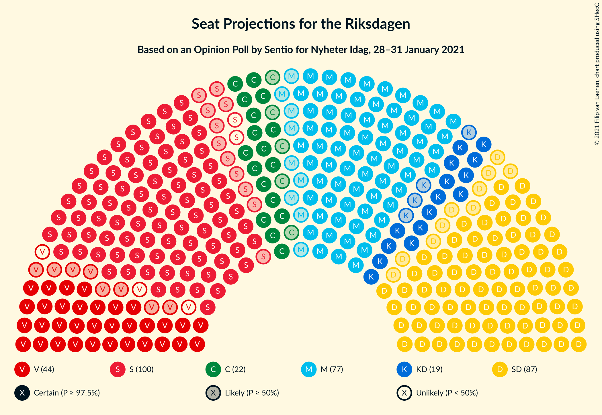
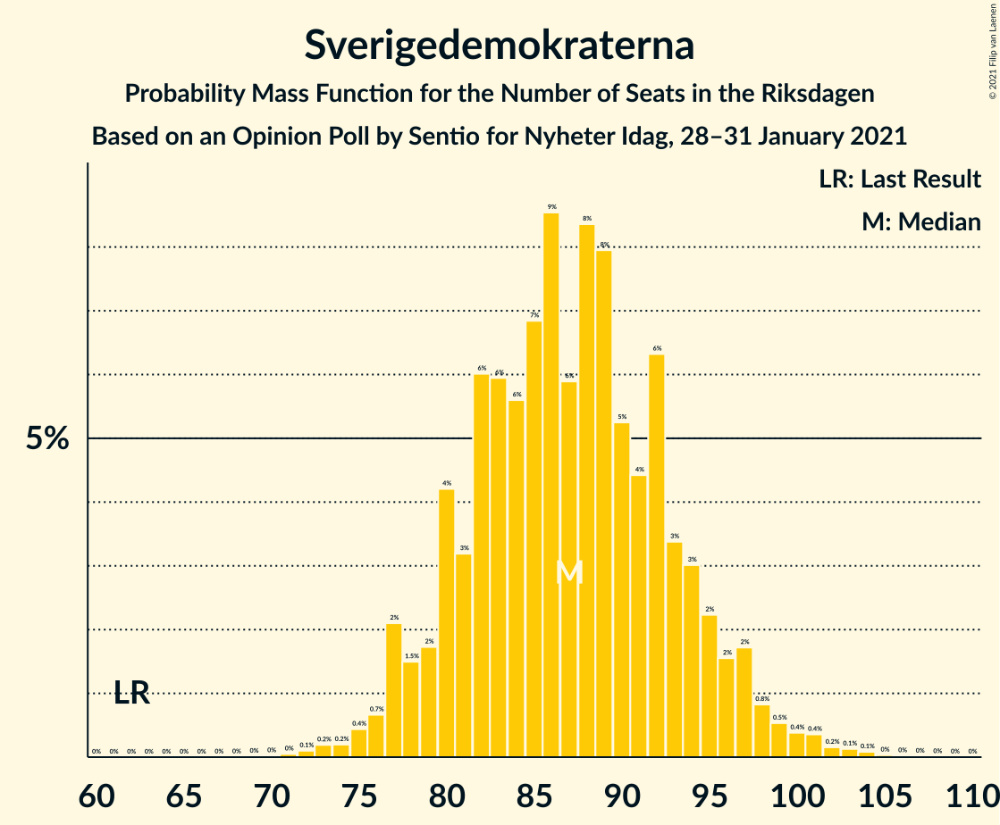
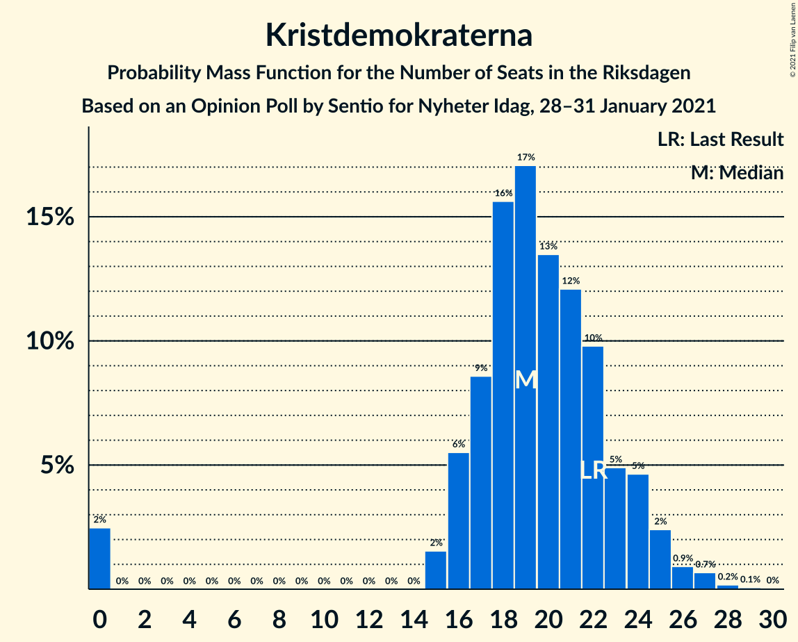
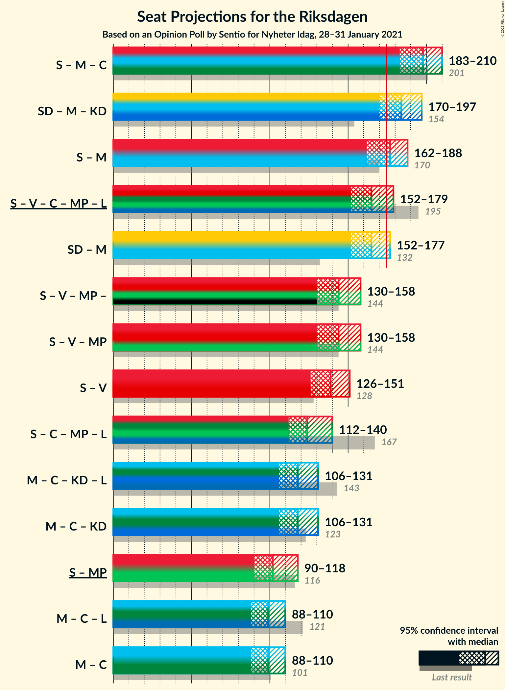
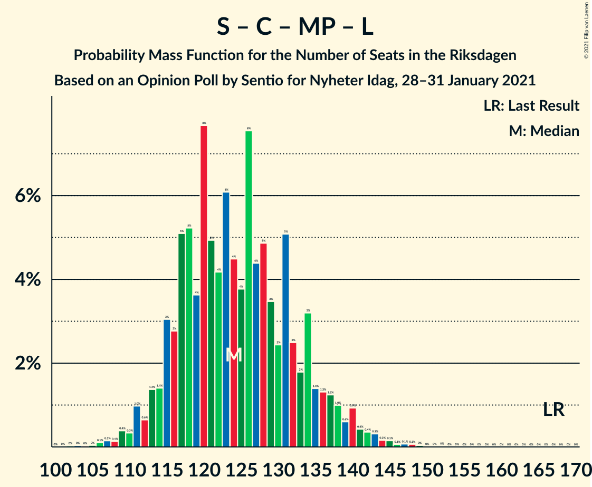

# Opinion Poll by Sentio for Nyheter Idag, 28–31 January 2021

<a href="#voting-intentions">Voting Intentions</a> | <a href="#seats">Seats</a> | <a href="#coalitions">Coalitions</a> | <a href="#technical-information">Technical Information</a>

## Voting Intentions

### Confidence Intervals

| Party | Last Result | Poll Result | 80% Confidence Interval | 90% Confidence Interval | 95% Confidence Interval | 99% Confidence Interval |
|:-----:|:-----------:|:-----------:|:-----------------------:|:-----------------------:|:-----------------------:|:-----------------------:|
| Sveriges socialdemokratiska arbetareparti | 28.3% | 26.3% | 24.6–28.2% |24.1–28.7% |23.7–29.1% |22.8–30.0% |
| Sverigedemokraterna | 17.5% | 23.3% | 21.6–25.1% |21.2–25.6% |20.8–26.0% |20.0–26.9% |
| Moderata samlingspartiet | 19.8% | 20.7% | 19.1–22.4% |18.7–22.9% |18.3–23.3% |17.6–24.2% |
| Vänsterpartiet | 8.0% | 10.7% | 9.5–12.1% |9.2–12.4% |8.9–12.8% |8.4–13.5% |
| Centerpartiet | 8.6% | 5.8% | 5.0–6.9% |4.7–7.2% |4.5–7.4% |4.1–8.0% |
| Kristdemokraterna | 6.3% | 5.2% | 4.4–6.2% |4.2–6.5% |4.0–6.8% |3.6–7.3% |
| Miljöpartiet de gröna | 4.4% | 3.6% | 2.9–4.5% |2.8–4.7% |2.6–5.0% |2.3–5.4% |
| Liberalerna | 5.5% | 2.2% | 1.7–2.9% |1.6–3.1% |1.4–3.3% |1.2–3.7% |

*Note:* The poll result column reflects the actual value used in the calculations. Published results may vary slightly, and in addition be rounded to fewer digits.

## Seats

### Confidence Intervals

| Party | Last Result | Median | 80% Confidence Interval | 90% Confidence Interval | 95% Confidence Interval | 99% Confidence Interval |
|:-----:|:-----------:|:------:|:-----------------------:|:-----------------------:|:-----------------------:|:-----------------------:|
| <a href="#sveriges-socialdemokratiska-arbetareparti">Sveriges socialdemokratiska arbetareparti</a> | 100 | 99 | 92–104 |88–108 |88–110 |85–114 |
| <a href="#sverigedemokraterna">Sverigedemokraterna</a> | 62 | 86 | 80–94 |79–97 |77–98 |74–101 |
| <a href="#moderata-samlingspartiet">Moderata samlingspartiet</a> | 70 | 78 | 72–85 |70–86 |68–86 |65–91 |
| <a href="#vänsterpartiet">Vänsterpartiet</a> | 28 | 42 | 35–45 |34–46 |33–48 |31–49 |
| <a href="#centerpartiet">Centerpartiet</a> | 31 | 22 | 19–26 |18–28 |17–28 |15–29 |
| <a href="#kristdemokraterna">Kristdemokraterna</a> | 22 | 20 | 17–24 |15–24 |0–26 |0–27 |
| <a href="#miljöpartiet-de-gröna">Miljöpartiet de gröna</a> | 16 | 0 | 0–17 |0–18 |0–18 |0–20 |
| <a href="#liberalerna">Liberalerna</a> | 20 | 0 | 0 |0 |0 |0 |

### Sveriges socialdemokratiska arbetareparti

*For a full overview of the results for this party, see the [Sveriges socialdemokratiska arbetareparti](party-sverigessocialdemokratiskaarbetareparti.html) page.*

| Number of Seats | Probability | Accumulated | Special Marks |
|:---------------:|:-----------:|:-----------:|:-------------:|
| 80 | 0.1% | 100% |  |
| 81 | 0% | 99.9% |  |
| 82 | 0% | 99.9% |  |
| 83 | 0.1% | 99.9% |  |
| 84 | 0.2% | 99.8% |  |
| 85 | 0.7% | 99.6% |  |
| 86 | 0.8% | 98.9% |  |
| 87 | 0.4% | 98% |  |
| 88 | 4% | 98% |  |
| 89 | 1.1% | 94% |  |
| 90 | 1.5% | 93% |  |
| 91 | 1.1% | 91% |  |
| 92 | 1.2% | 90% |  |
| 93 | 9% | 89% |  |
| 94 | 4% | 80% |  |
| 95 | 7% | 75% |  |
| 96 | 4% | 68% |  |
| 97 | 7% | 64% |  |
| 98 | 3% | 57% |  |
| 99 | 9% | 55% | Median |
| 100 | 1.5% | 45% | Last Result |
| 101 | 1.4% | 44% |  |
| 102 | 3% | 42% |  |
| 103 | 20% | 40% |  |
| 104 | 10% | 19% |  |
| 105 | 2% | 10% |  |
| 106 | 0.9% | 8% |  |
| 107 | 1.1% | 7% |  |
| 108 | 2% | 6% |  |
| 109 | 1.0% | 4% |  |
| 110 | 0.4% | 3% |  |
| 111 | 0.1% | 2% |  |
| 112 | 0.2% | 2% |  |
| 113 | 1.4% | 2% |  |
| 114 | 0.3% | 0.5% |  |
| 115 | 0.1% | 0.2% |  |
| 116 | 0% | 0.1% |  |
| 117 | 0.1% | 0.1% |  |
| 118 | 0% | 0% |  |

### Sverigedemokraterna

*For a full overview of the results for this party, see the [Sverigedemokraterna](party-sverigedemokraterna.html) page.*

| Number of Seats | Probability | Accumulated | Special Marks |
|:---------------:|:-----------:|:-----------:|:-------------:|
| 62 | 0% | 100% | Last Result |
| 63 | 0% | 100% |  |
| 64 | 0% | 100% |  |
| 65 | 0% | 100% |  |
| 66 | 0% | 100% |  |
| 67 | 0% | 100% |  |
| 68 | 0% | 100% |  |
| 69 | 0% | 100% |  |
| 70 | 0% | 100% |  |
| 71 | 0.1% | 100% |  |
| 72 | 0% | 99.9% |  |
| 73 | 0.3% | 99.8% |  |
| 74 | 0.2% | 99.5% |  |
| 75 | 0.5% | 99.3% |  |
| 76 | 0.3% | 98.8% |  |
| 77 | 2% | 98.5% |  |
| 78 | 1.0% | 96% |  |
| 79 | 2% | 95% |  |
| 80 | 3% | 93% |  |
| 81 | 6% | 90% |  |
| 82 | 3% | 84% |  |
| 83 | 6% | 81% |  |
| 84 | 14% | 76% |  |
| 85 | 5% | 62% |  |
| 86 | 10% | 57% | Median |
| 87 | 5% | 46% |  |
| 88 | 11% | 41% |  |
| 89 | 2% | 30% |  |
| 90 | 4% | 28% |  |
| 91 | 5% | 24% |  |
| 92 | 5% | 19% |  |
| 93 | 4% | 14% |  |
| 94 | 2% | 11% |  |
| 95 | 2% | 9% |  |
| 96 | 0.8% | 6% |  |
| 97 | 2% | 6% |  |
| 98 | 1.5% | 3% |  |
| 99 | 0.3% | 2% |  |
| 100 | 0.2% | 1.4% |  |
| 101 | 0.8% | 1.2% |  |
| 102 | 0.2% | 0.4% |  |
| 103 | 0.2% | 0.3% |  |
| 104 | 0% | 0.1% |  |
| 105 | 0% | 0.1% |  |
| 106 | 0% | 0% |  |

### Moderata samlingspartiet

*For a full overview of the results for this party, see the [Moderata samlingspartiet](party-moderatasamlingspartiet.html) page.*

| Number of Seats | Probability | Accumulated | Special Marks |
|:---------------:|:-----------:|:-----------:|:-------------:|
| 61 | 0% | 100% |  |
| 62 | 0.1% | 99.9% |  |
| 63 | 0.1% | 99.9% |  |
| 64 | 0.2% | 99.7% |  |
| 65 | 0.2% | 99.6% |  |
| 66 | 0.4% | 99.3% |  |
| 67 | 1.2% | 98.9% |  |
| 68 | 0.8% | 98% |  |
| 69 | 1.3% | 97% |  |
| 70 | 2% | 96% | Last Result |
| 71 | 3% | 94% |  |
| 72 | 1.3% | 91% |  |
| 73 | 5% | 90% |  |
| 74 | 18% | 85% |  |
| 75 | 2% | 67% |  |
| 76 | 7% | 65% |  |
| 77 | 3% | 58% |  |
| 78 | 12% | 55% | Median |
| 79 | 8% | 43% |  |
| 80 | 1.3% | 35% |  |
| 81 | 3% | 34% |  |
| 82 | 7% | 31% |  |
| 83 | 9% | 24% |  |
| 84 | 3% | 15% |  |
| 85 | 6% | 12% |  |
| 86 | 4% | 6% |  |
| 87 | 0.6% | 2% |  |
| 88 | 0.4% | 1.4% |  |
| 89 | 0.2% | 1.1% |  |
| 90 | 0.3% | 0.9% |  |
| 91 | 0.1% | 0.6% |  |
| 92 | 0.1% | 0.5% |  |
| 93 | 0.2% | 0.4% |  |
| 94 | 0.1% | 0.2% |  |
| 95 | 0% | 0% |  |

### Vänsterpartiet

*For a full overview of the results for this party, see the [Vänsterpartiet](party-vänsterpartiet.html) page.*

| Number of Seats | Probability | Accumulated | Special Marks |
|:---------------:|:-----------:|:-----------:|:-------------:|
| 28 | 0% | 100% | Last Result |
| 29 | 0% | 100% |  |
| 30 | 0.1% | 99.9% |  |
| 31 | 1.1% | 99.8% |  |
| 32 | 1.0% | 98.8% |  |
| 33 | 0.7% | 98% |  |
| 34 | 6% | 97% |  |
| 35 | 5% | 91% |  |
| 36 | 4% | 86% |  |
| 37 | 4% | 81% |  |
| 38 | 4% | 78% |  |
| 39 | 4% | 74% |  |
| 40 | 8% | 70% |  |
| 41 | 6% | 62% |  |
| 42 | 19% | 57% | Median |
| 43 | 3% | 38% |  |
| 44 | 15% | 34% |  |
| 45 | 10% | 19% |  |
| 46 | 5% | 9% |  |
| 47 | 1.2% | 4% |  |
| 48 | 2% | 3% |  |
| 49 | 0.8% | 1.3% |  |
| 50 | 0.2% | 0.5% |  |
| 51 | 0.1% | 0.3% |  |
| 52 | 0% | 0.2% |  |
| 53 | 0% | 0.1% |  |
| 54 | 0% | 0.1% |  |
| 55 | 0% | 0.1% |  |
| 56 | 0% | 0% |  |

### Centerpartiet

*For a full overview of the results for this party, see the [Centerpartiet](party-centerpartiet.html) page.*

| Number of Seats | Probability | Accumulated | Special Marks |
|:---------------:|:-----------:|:-----------:|:-------------:|
| 0 | 0.3% | 100% |  |
| 1 | 0% | 99.7% |  |
| 2 | 0% | 99.7% |  |
| 3 | 0% | 99.7% |  |
| 4 | 0% | 99.7% |  |
| 5 | 0% | 99.7% |  |
| 6 | 0% | 99.7% |  |
| 7 | 0% | 99.7% |  |
| 8 | 0% | 99.7% |  |
| 9 | 0% | 99.7% |  |
| 10 | 0% | 99.7% |  |
| 11 | 0% | 99.7% |  |
| 12 | 0% | 99.7% |  |
| 13 | 0% | 99.7% |  |
| 14 | 0% | 99.7% |  |
| 15 | 0.4% | 99.7% |  |
| 16 | 1.0% | 99.3% |  |
| 17 | 2% | 98% |  |
| 18 | 3% | 96% |  |
| 19 | 15% | 93% |  |
| 20 | 14% | 78% |  |
| 21 | 7% | 64% |  |
| 22 | 12% | 58% | Median |
| 23 | 14% | 46% |  |
| 24 | 18% | 31% |  |
| 25 | 2% | 13% |  |
| 26 | 2% | 11% |  |
| 27 | 4% | 9% |  |
| 28 | 4% | 5% |  |
| 29 | 0.5% | 1.0% |  |
| 30 | 0.2% | 0.5% |  |
| 31 | 0.2% | 0.3% | Last Result |
| 32 | 0.1% | 0.1% |  |
| 33 | 0% | 0% |  |

### Kristdemokraterna

*For a full overview of the results for this party, see the [Kristdemokraterna](party-kristdemokraterna.html) page.*

| Number of Seats | Probability | Accumulated | Special Marks |
|:---------------:|:-----------:|:-----------:|:-------------:|
| 0 | 4% | 100% |  |
| 1 | 0% | 96% |  |
| 2 | 0% | 96% |  |
| 3 | 0% | 96% |  |
| 4 | 0% | 96% |  |
| 5 | 0% | 96% |  |
| 6 | 0% | 96% |  |
| 7 | 0% | 96% |  |
| 8 | 0% | 96% |  |
| 9 | 0% | 96% |  |
| 10 | 0% | 96% |  |
| 11 | 0% | 96% |  |
| 12 | 0% | 96% |  |
| 13 | 0% | 96% |  |
| 14 | 0% | 96% |  |
| 15 | 2% | 96% |  |
| 16 | 4% | 94% |  |
| 17 | 11% | 91% |  |
| 18 | 6% | 79% |  |
| 19 | 20% | 73% |  |
| 20 | 11% | 53% | Median |
| 21 | 8% | 42% |  |
| 22 | 15% | 34% | Last Result |
| 23 | 8% | 18% |  |
| 24 | 6% | 11% |  |
| 25 | 2% | 4% |  |
| 26 | 0.9% | 3% |  |
| 27 | 2% | 2% |  |
| 28 | 0.2% | 0.3% |  |
| 29 | 0.1% | 0.1% |  |
| 30 | 0% | 0% |  |

### Miljöpartiet de gröna

*For a full overview of the results for this party, see the [Miljöpartiet de gröna](party-miljöpartietdegröna.html) page.*

| Number of Seats | Probability | Accumulated | Special Marks |
|:---------------:|:-----------:|:-----------:|:-------------:|
| 0 | 83% | 100% | Median |
| 1 | 0% | 17% |  |
| 2 | 0% | 17% |  |
| 3 | 0% | 17% |  |
| 4 | 0% | 17% |  |
| 5 | 0% | 17% |  |
| 6 | 0% | 17% |  |
| 7 | 0% | 17% |  |
| 8 | 0% | 17% |  |
| 9 | 0% | 17% |  |
| 10 | 0% | 17% |  |
| 11 | 0% | 17% |  |
| 12 | 0% | 17% |  |
| 13 | 0% | 17% |  |
| 14 | 0% | 17% |  |
| 15 | 3% | 17% |  |
| 16 | 4% | 14% | Last Result |
| 17 | 5% | 11% |  |
| 18 | 4% | 6% |  |
| 19 | 0.4% | 2% |  |
| 20 | 1.3% | 1.4% |  |
| 21 | 0% | 0.1% |  |
| 22 | 0% | 0.1% |  |
| 23 | 0% | 0% |  |

### Liberalerna

*For a full overview of the results for this party, see the [Liberalerna](party-liberalerna.html) page.*

| Number of Seats | Probability | Accumulated | Special Marks |
|:---------------:|:-----------:|:-----------:|:-------------:|
| 0 | 99.9% | 100% | Median |
| 1 | 0% | 0.1% |  |
| 2 | 0% | 0.1% |  |
| 3 | 0% | 0.1% |  |
| 4 | 0% | 0.1% |  |
| 5 | 0% | 0.1% |  |
| 6 | 0% | 0.1% |  |
| 7 | 0% | 0.1% |  |
| 8 | 0% | 0.1% |  |
| 9 | 0% | 0.1% |  |
| 10 | 0% | 0.1% |  |
| 11 | 0% | 0.1% |  |
| 12 | 0% | 0.1% |  |
| 13 | 0% | 0.1% |  |
| 14 | 0% | 0.1% |  |
| 15 | 0.1% | 0.1% |  |
| 16 | 0% | 0% |  |
| 17 | 0% | 0% |  |
| 18 | 0% | 0% |  |
| 19 | 0% | 0% |  |
| 20 | 0% | 0% | Last Result |

## Coalitions

### Confidence Intervals

| Coalition | Last Result | Median | Majority? | 80% Confidence Interval | 90% Confidence Interval | 95% Confidence Interval | 99% Confidence Interval |
|:---------:|:-----------:|:------:|:---------:|:-----------------------:|:-----------------------:|:-----------------------:|:-----------------------:|
| Sveriges socialdemokratiska arbetareparti – Moderata samlingspartiet – Centerpartiet | 201 | 200 | 100% | 190–207 | 188–210 | 184–213 | 178–215 |
| Sverigedemokraterna – Moderata samlingspartiet – Kristdemokraterna | 154 | 185 | 92% | 175–193 | 173–194 | 169–196 | 162–201 |
| Sveriges socialdemokratiska arbetareparti – Moderata samlingspartiet | 170 | 177 | 67% | 167–186 | 165–187 | 162–191 | 156–194 |
| Sveriges socialdemokratiska arbetareparti – Vänsterpartiet – Centerpartiet – Miljöpartiet de gröna – Liberalerna | 195 | 164 | 8% | 156–174 | 155–176 | 153–180 | 148–187 |
| Sverigedemokraterna – Moderata samlingspartiet | 132 | 165 | 6% | 157–172 | 154–175 | 152–177 | 147–182 |
| Sveriges socialdemokratiska arbetareparti – Vänsterpartiet – Miljöpartiet de gröna | 144 | 143 | 0% | 135–152 | 133–155 | 131–160 | 127–163 |
| Sveriges socialdemokratiska arbetareparti – Vänsterpartiet | 128 | 139 | 0% | 132–148 | 129–150 | 127–151 | 122–154 |
| Sveriges socialdemokratiska arbetareparti – Centerpartiet – Miljöpartiet de gröna – Liberalerna | 167 | 123 | 0% | 115–134 | 112–137 | 111–140 | 107–146 |
| Moderata samlingspartiet – Centerpartiet – Kristdemokraterna – Liberalerna | 143 | 120 | 0% | 111–129 | 108–130 | 103–130 | 100–136 |
| Moderata samlingspartiet – Centerpartiet – Kristdemokraterna | 123 | 120 | 0% | 111–129 | 108–130 | 103–130 | 100–136 |
| Sveriges socialdemokratiska arbetareparti – Miljöpartiet de gröna | 116 | 103 | 0% | 93–112 | 92–116 | 88–120 | 88–122 |
| Moderata samlingspartiet – Centerpartiet – Liberalerna | 121 | 99 | 0% | 94–106 | 91–108 | 88–110 | 85–114 |
| Moderata samlingspartiet – Centerpartiet | 101 | 99 | 0% | 94–106 | 91–108 | 88–110 | 85–114 |

### Sveriges socialdemokratiska arbetareparti – Moderata samlingspartiet – Centerpartiet

| Number of Seats | Probability | Accumulated | Special Marks |
|:---------------:|:-----------:|:-----------:|:-------------:|
| 175 | 0.2% | 100% | Majority |
| 176 | 0.2% | 99.8% |  |
| 177 | 0.1% | 99.6% |  |
| 178 | 0% | 99.5% |  |
| 179 | 0.1% | 99.5% |  |
| 180 | 0.2% | 99.4% |  |
| 181 | 0.1% | 99.2% |  |
| 182 | 0.6% | 99.2% |  |
| 183 | 0.8% | 98.6% |  |
| 184 | 0.8% | 98% |  |
| 185 | 0.7% | 97% |  |
| 186 | 1.2% | 96% |  |
| 187 | 0.1% | 95% |  |
| 188 | 2% | 95% |  |
| 189 | 2% | 93% |  |
| 190 | 4% | 91% |  |
| 191 | 3% | 87% |  |
| 192 | 2% | 84% |  |
| 193 | 6% | 82% |  |
| 194 | 2% | 76% |  |
| 195 | 4% | 74% |  |
| 196 | 2% | 70% |  |
| 197 | 3% | 68% |  |
| 198 | 8% | 65% |  |
| 199 | 2% | 57% | Median |
| 200 | 11% | 54% |  |
| 201 | 14% | 43% | Last Result |
| 202 | 1.1% | 29% |  |
| 203 | 4% | 28% |  |
| 204 | 7% | 24% |  |
| 205 | 2% | 18% |  |
| 206 | 5% | 15% |  |
| 207 | 3% | 10% |  |
| 208 | 0.3% | 8% |  |
| 209 | 0.4% | 7% |  |
| 210 | 3% | 7% |  |
| 211 | 0.4% | 4% |  |
| 212 | 0.8% | 3% |  |
| 213 | 2% | 3% |  |
| 214 | 0.5% | 1.1% |  |
| 215 | 0.2% | 0.6% |  |
| 216 | 0% | 0.4% |  |
| 217 | 0.1% | 0.4% |  |
| 218 | 0.1% | 0.3% |  |
| 219 | 0.1% | 0.3% |  |
| 220 | 0.1% | 0.2% |  |
| 221 | 0.1% | 0.1% |  |
| 222 | 0% | 0% |  |

### Sverigedemokraterna – Moderata samlingspartiet – Kristdemokraterna

| Number of Seats | Probability | Accumulated | Special Marks |
|:---------------:|:-----------:|:-----------:|:-------------:|
| 154 | 0% | 100% | Last Result |
| 155 | 0% | 100% |  |
| 156 | 0.2% | 100% |  |
| 157 | 0% | 99.8% |  |
| 158 | 0% | 99.8% |  |
| 159 | 0.1% | 99.8% |  |
| 160 | 0% | 99.7% |  |
| 161 | 0% | 99.7% |  |
| 162 | 0.2% | 99.7% |  |
| 163 | 0% | 99.5% |  |
| 164 | 0% | 99.4% |  |
| 165 | 0.3% | 99.4% |  |
| 166 | 0.2% | 99.1% |  |
| 167 | 0.2% | 98.9% |  |
| 168 | 0.2% | 98.7% |  |
| 169 | 2% | 98.5% |  |
| 170 | 0.2% | 97% |  |
| 171 | 0.8% | 96% |  |
| 172 | 0.3% | 96% |  |
| 173 | 3% | 95% |  |
| 174 | 0.9% | 92% |  |
| 175 | 2% | 92% | Majority |
| 176 | 4% | 90% |  |
| 177 | 1.3% | 85% |  |
| 178 | 1.2% | 84% |  |
| 179 | 3% | 83% |  |
| 180 | 12% | 80% |  |
| 181 | 4% | 68% |  |
| 182 | 3% | 64% |  |
| 183 | 9% | 61% |  |
| 184 | 0.9% | 52% | Median |
| 185 | 6% | 51% |  |
| 186 | 4% | 44% |  |
| 187 | 5% | 40% |  |
| 188 | 4% | 35% |  |
| 189 | 4% | 31% |  |
| 190 | 10% | 27% |  |
| 191 | 6% | 18% |  |
| 192 | 1.1% | 12% |  |
| 193 | 6% | 11% |  |
| 194 | 0.6% | 5% |  |
| 195 | 1.1% | 4% |  |
| 196 | 1.1% | 3% |  |
| 197 | 0.5% | 2% |  |
| 198 | 0.2% | 2% |  |
| 199 | 0.8% | 2% |  |
| 200 | 0.1% | 0.7% |  |
| 201 | 0.1% | 0.6% |  |
| 202 | 0.2% | 0.5% |  |
| 203 | 0% | 0.2% |  |
| 204 | 0% | 0.2% |  |
| 205 | 0.1% | 0.2% |  |
| 206 | 0.1% | 0.1% |  |
| 207 | 0% | 0% |  |

### Sveriges socialdemokratiska arbetareparti – Moderata samlingspartiet

| Number of Seats | Probability | Accumulated | Special Marks |
|:---------------:|:-----------:|:-----------:|:-------------:|
| 153 | 0.1% | 100% |  |
| 154 | 0.1% | 99.8% |  |
| 155 | 0.1% | 99.7% |  |
| 156 | 0.2% | 99.6% |  |
| 157 | 0% | 99.4% |  |
| 158 | 0.1% | 99.4% |  |
| 159 | 0.3% | 99.3% |  |
| 160 | 1.2% | 99.0% |  |
| 161 | 0.3% | 98% |  |
| 162 | 0.7% | 98% |  |
| 163 | 0.3% | 97% |  |
| 164 | 0.3% | 97% |  |
| 165 | 1.4% | 96% |  |
| 166 | 2% | 95% |  |
| 167 | 4% | 93% |  |
| 168 | 0.6% | 89% |  |
| 169 | 1.2% | 88% |  |
| 170 | 6% | 87% | Last Result |
| 171 | 3% | 82% |  |
| 172 | 4% | 78% |  |
| 173 | 6% | 75% |  |
| 174 | 2% | 69% |  |
| 175 | 1.5% | 67% | Majority |
| 176 | 11% | 65% |  |
| 177 | 11% | 55% | Median |
| 178 | 1.4% | 44% |  |
| 179 | 2% | 42% |  |
| 180 | 9% | 40% |  |
| 181 | 10% | 31% |  |
| 182 | 2% | 21% |  |
| 183 | 6% | 19% |  |
| 184 | 0.7% | 13% |  |
| 185 | 0.9% | 12% |  |
| 186 | 4% | 11% |  |
| 187 | 4% | 8% |  |
| 188 | 0.4% | 4% |  |
| 189 | 0.2% | 4% |  |
| 190 | 1.1% | 4% |  |
| 191 | 2% | 3% |  |
| 192 | 0.2% | 1.0% |  |
| 193 | 0.3% | 0.8% |  |
| 194 | 0.2% | 0.6% |  |
| 195 | 0.1% | 0.3% |  |
| 196 | 0% | 0.3% |  |
| 197 | 0% | 0.2% |  |
| 198 | 0.2% | 0.2% |  |
| 199 | 0% | 0.1% |  |
| 200 | 0% | 0% |  |

### Sveriges socialdemokratiska arbetareparti – Vänsterpartiet – Centerpartiet – Miljöpartiet de gröna – Liberalerna

| Number of Seats | Probability | Accumulated | Special Marks |
|:---------------:|:-----------:|:-----------:|:-------------:|
| 143 | 0.1% | 100% |  |
| 144 | 0.1% | 99.9% |  |
| 145 | 0% | 99.8% |  |
| 146 | 0% | 99.8% |  |
| 147 | 0.2% | 99.8% |  |
| 148 | 0.1% | 99.5% |  |
| 149 | 0.1% | 99.4% |  |
| 150 | 0.8% | 99.3% |  |
| 151 | 0.2% | 98% |  |
| 152 | 0.5% | 98% |  |
| 153 | 1.1% | 98% |  |
| 154 | 1.1% | 97% |  |
| 155 | 0.6% | 96% |  |
| 156 | 6% | 95% |  |
| 157 | 1.1% | 89% |  |
| 158 | 6% | 88% |  |
| 159 | 10% | 82% |  |
| 160 | 4% | 73% |  |
| 161 | 4% | 69% |  |
| 162 | 5% | 65% |  |
| 163 | 4% | 60% | Median |
| 164 | 6% | 56% |  |
| 165 | 0.9% | 49% |  |
| 166 | 9% | 48% |  |
| 167 | 3% | 39% |  |
| 168 | 4% | 36% |  |
| 169 | 12% | 32% |  |
| 170 | 3% | 20% |  |
| 171 | 1.2% | 17% |  |
| 172 | 1.3% | 16% |  |
| 173 | 4% | 14% |  |
| 174 | 2% | 10% |  |
| 175 | 0.9% | 8% | Majority |
| 176 | 3% | 7% |  |
| 177 | 0.3% | 5% |  |
| 178 | 0.8% | 4% |  |
| 179 | 0.2% | 4% |  |
| 180 | 2% | 3% |  |
| 181 | 0.2% | 1.5% |  |
| 182 | 0.2% | 1.2% |  |
| 183 | 0.2% | 1.1% |  |
| 184 | 0.3% | 0.9% |  |
| 185 | 0% | 0.6% |  |
| 186 | 0% | 0.6% |  |
| 187 | 0.2% | 0.5% |  |
| 188 | 0% | 0.3% |  |
| 189 | 0% | 0.3% |  |
| 190 | 0.1% | 0.3% |  |
| 191 | 0% | 0.2% |  |
| 192 | 0% | 0.2% |  |
| 193 | 0.2% | 0.2% |  |
| 194 | 0% | 0% |  |
| 195 | 0% | 0% | Last Result |

### Sverigedemokraterna – Moderata samlingspartiet

| Number of Seats | Probability | Accumulated | Special Marks |
|:---------------:|:-----------:|:-----------:|:-------------:|
| 132 | 0% | 100% | Last Result |
| 133 | 0% | 100% |  |
| 134 | 0% | 100% |  |
| 135 | 0% | 100% |  |
| 136 | 0% | 100% |  |
| 137 | 0% | 100% |  |
| 138 | 0% | 100% |  |
| 139 | 0% | 100% |  |
| 140 | 0% | 100% |  |
| 141 | 0% | 100% |  |
| 142 | 0% | 100% |  |
| 143 | 0% | 100% |  |
| 144 | 0% | 100% |  |
| 145 | 0.1% | 99.9% |  |
| 146 | 0.2% | 99.8% |  |
| 147 | 0.2% | 99.7% |  |
| 148 | 0.2% | 99.5% |  |
| 149 | 0.3% | 99.2% |  |
| 150 | 0.3% | 98.9% |  |
| 151 | 0.9% | 98.6% |  |
| 152 | 0.4% | 98% |  |
| 153 | 0.9% | 97% |  |
| 154 | 3% | 97% |  |
| 155 | 1.0% | 94% |  |
| 156 | 0.8% | 93% |  |
| 157 | 3% | 92% |  |
| 158 | 10% | 88% |  |
| 159 | 4% | 78% |  |
| 160 | 3% | 75% |  |
| 161 | 5% | 72% |  |
| 162 | 3% | 67% |  |
| 163 | 3% | 64% |  |
| 164 | 10% | 61% | Median |
| 165 | 5% | 51% |  |
| 166 | 7% | 46% |  |
| 167 | 2% | 39% |  |
| 168 | 7% | 37% |  |
| 169 | 5% | 30% |  |
| 170 | 4% | 25% |  |
| 171 | 8% | 22% |  |
| 172 | 5% | 14% |  |
| 173 | 2% | 9% |  |
| 174 | 0.9% | 7% |  |
| 175 | 2% | 6% | Majority |
| 176 | 2% | 4% |  |
| 177 | 0.7% | 3% |  |
| 178 | 0.2% | 2% |  |
| 179 | 0.5% | 2% |  |
| 180 | 0.2% | 1.1% |  |
| 181 | 0.3% | 0.9% |  |
| 182 | 0.2% | 0.6% |  |
| 183 | 0.1% | 0.4% |  |
| 184 | 0% | 0.3% |  |
| 185 | 0% | 0.3% |  |
| 186 | 0% | 0.2% |  |
| 187 | 0.1% | 0.2% |  |
| 188 | 0% | 0.1% |  |
| 189 | 0% | 0.1% |  |
| 190 | 0% | 0.1% |  |
| 191 | 0% | 0% |  |

### Sveriges socialdemokratiska arbetareparti – Vänsterpartiet – Miljöpartiet de gröna

| Number of Seats | Probability | Accumulated | Special Marks |
|:---------------:|:-----------:|:-----------:|:-------------:|
| 122 | 0.1% | 100% |  |
| 123 | 0.1% | 99.9% |  |
| 124 | 0.1% | 99.8% |  |
| 125 | 0.1% | 99.7% |  |
| 126 | 0.1% | 99.7% |  |
| 127 | 0.1% | 99.5% |  |
| 128 | 0.1% | 99.4% |  |
| 129 | 0.5% | 99.3% |  |
| 130 | 1.2% | 98.8% |  |
| 131 | 0.5% | 98% |  |
| 132 | 1.4% | 97% |  |
| 133 | 3% | 96% |  |
| 134 | 1.1% | 92% |  |
| 135 | 3% | 91% |  |
| 136 | 3% | 88% |  |
| 137 | 12% | 85% |  |
| 138 | 6% | 72% |  |
| 139 | 7% | 66% |  |
| 140 | 3% | 60% |  |
| 141 | 2% | 57% | Median |
| 142 | 4% | 55% |  |
| 143 | 2% | 51% |  |
| 144 | 8% | 50% | Last Result |
| 145 | 11% | 42% |  |
| 146 | 1.4% | 31% |  |
| 147 | 9% | 30% |  |
| 148 | 3% | 21% |  |
| 149 | 2% | 19% |  |
| 150 | 4% | 16% |  |
| 151 | 2% | 12% |  |
| 152 | 2% | 10% |  |
| 153 | 2% | 9% |  |
| 154 | 1.3% | 7% |  |
| 155 | 1.3% | 6% |  |
| 156 | 1.1% | 5% |  |
| 157 | 0.4% | 3% |  |
| 158 | 0.4% | 3% |  |
| 159 | 0.1% | 3% |  |
| 160 | 0.1% | 3% |  |
| 161 | 2% | 2% |  |
| 162 | 0.2% | 0.9% |  |
| 163 | 0.2% | 0.7% |  |
| 164 | 0.1% | 0.5% |  |
| 165 | 0.2% | 0.4% |  |
| 166 | 0% | 0.3% |  |
| 167 | 0.2% | 0.2% |  |
| 168 | 0% | 0.1% |  |
| 169 | 0% | 0.1% |  |
| 170 | 0% | 0% |  |

### Sveriges socialdemokratiska arbetareparti – Vänsterpartiet

| Number of Seats | Probability | Accumulated | Special Marks |
|:---------------:|:-----------:|:-----------:|:-------------:|
| 118 | 0% | 100% |  |
| 119 | 0% | 99.9% |  |
| 120 | 0.1% | 99.9% |  |
| 121 | 0% | 99.8% |  |
| 122 | 0.4% | 99.8% |  |
| 123 | 0.2% | 99.4% |  |
| 124 | 0.2% | 99.2% |  |
| 125 | 0.4% | 99.0% |  |
| 126 | 0.8% | 98.6% |  |
| 127 | 1.5% | 98% |  |
| 128 | 1.2% | 96% | Last Result |
| 129 | 1.5% | 95% |  |
| 130 | 2% | 94% |  |
| 131 | 1.3% | 92% |  |
| 132 | 2% | 90% |  |
| 133 | 4% | 88% |  |
| 134 | 2% | 84% |  |
| 135 | 5% | 82% |  |
| 136 | 4% | 77% |  |
| 137 | 13% | 73% |  |
| 138 | 6% | 60% |  |
| 139 | 7% | 54% |  |
| 140 | 3% | 47% |  |
| 141 | 2% | 43% | Median |
| 142 | 4% | 42% |  |
| 143 | 1.5% | 38% |  |
| 144 | 6% | 36% |  |
| 145 | 11% | 30% |  |
| 146 | 0.7% | 20% |  |
| 147 | 9% | 19% |  |
| 148 | 1.5% | 10% |  |
| 149 | 2% | 9% |  |
| 150 | 3% | 7% |  |
| 151 | 1.5% | 4% |  |
| 152 | 0.6% | 2% |  |
| 153 | 0.8% | 1.5% |  |
| 154 | 0.2% | 0.6% |  |
| 155 | 0.1% | 0.4% |  |
| 156 | 0% | 0.3% |  |
| 157 | 0.1% | 0.2% |  |
| 158 | 0.1% | 0.2% |  |
| 159 | 0.1% | 0.1% |  |
| 160 | 0% | 0.1% |  |
| 161 | 0% | 0% |  |

### Sveriges socialdemokratiska arbetareparti – Centerpartiet – Miljöpartiet de gröna – Liberalerna

| Number of Seats | Probability | Accumulated | Special Marks |
|:---------------:|:-----------:|:-----------:|:-------------:|
| 100 | 0% | 100% |  |
| 101 | 0% | 99.9% |  |
| 102 | 0.1% | 99.9% |  |
| 103 | 0.1% | 99.9% |  |
| 104 | 0% | 99.8% |  |
| 105 | 0% | 99.7% |  |
| 106 | 0.1% | 99.7% |  |
| 107 | 0.2% | 99.6% |  |
| 108 | 0.1% | 99.4% |  |
| 109 | 0.4% | 99.3% |  |
| 110 | 0.3% | 98.9% |  |
| 111 | 3% | 98.5% |  |
| 112 | 0.8% | 96% |  |
| 113 | 0.6% | 95% |  |
| 114 | 0.2% | 94% |  |
| 115 | 9% | 94% |  |
| 116 | 5% | 85% |  |
| 117 | 4% | 81% |  |
| 118 | 3% | 77% |  |
| 119 | 5% | 74% |  |
| 120 | 2% | 69% |  |
| 121 | 5% | 67% | Median |
| 122 | 12% | 62% |  |
| 123 | 2% | 50% |  |
| 124 | 5% | 48% |  |
| 125 | 2% | 43% |  |
| 126 | 4% | 41% |  |
| 127 | 11% | 38% |  |
| 128 | 5% | 27% |  |
| 129 | 1.2% | 22% |  |
| 130 | 3% | 21% |  |
| 131 | 3% | 18% |  |
| 132 | 0.5% | 15% |  |
| 133 | 4% | 15% |  |
| 134 | 3% | 11% |  |
| 135 | 1.0% | 7% |  |
| 136 | 0.7% | 6% |  |
| 137 | 0.8% | 6% |  |
| 138 | 0.8% | 5% |  |
| 139 | 0.4% | 4% |  |
| 140 | 2% | 4% |  |
| 141 | 0.8% | 2% |  |
| 142 | 0.1% | 1.2% |  |
| 143 | 0.3% | 1.1% |  |
| 144 | 0.3% | 0.9% |  |
| 145 | 0% | 0.6% |  |
| 146 | 0.2% | 0.6% |  |
| 147 | 0% | 0.4% |  |
| 148 | 0.1% | 0.4% |  |
| 149 | 0.1% | 0.3% |  |
| 150 | 0% | 0.2% |  |
| 151 | 0% | 0.2% |  |
| 152 | 0.2% | 0.2% |  |
| 153 | 0% | 0% |  |
| 154 | 0% | 0% |  |
| 155 | 0% | 0% |  |
| 156 | 0% | 0% |  |
| 157 | 0% | 0% |  |
| 158 | 0% | 0% |  |
| 159 | 0% | 0% |  |
| 160 | 0% | 0% |  |
| 161 | 0% | 0% |  |
| 162 | 0% | 0% |  |
| 163 | 0% | 0% |  |
| 164 | 0% | 0% |  |
| 165 | 0% | 0% |  |
| 166 | 0% | 0% |  |
| 167 | 0% | 0% | Last Result |

### Moderata samlingspartiet – Centerpartiet – Kristdemokraterna – Liberalerna

| Number of Seats | Probability | Accumulated | Special Marks |
|:---------------:|:-----------:|:-----------:|:-------------:|
| 90 | 0% | 100% |  |
| 91 | 0% | 99.9% |  |
| 92 | 0% | 99.9% |  |
| 93 | 0% | 99.9% |  |
| 94 | 0% | 99.9% |  |
| 95 | 0% | 99.9% |  |
| 96 | 0.1% | 99.9% |  |
| 97 | 0.1% | 99.8% |  |
| 98 | 0% | 99.7% |  |
| 99 | 0.1% | 99.7% |  |
| 100 | 0.1% | 99.6% |  |
| 101 | 2% | 99.4% |  |
| 102 | 0.1% | 98% |  |
| 103 | 0.2% | 98% |  |
| 104 | 0.3% | 97% |  |
| 105 | 0.3% | 97% |  |
| 106 | 0.3% | 97% |  |
| 107 | 0.8% | 96% |  |
| 108 | 1.5% | 96% |  |
| 109 | 3% | 94% |  |
| 110 | 0.6% | 92% |  |
| 111 | 2% | 91% |  |
| 112 | 2% | 89% |  |
| 113 | 3% | 87% |  |
| 114 | 5% | 84% |  |
| 115 | 3% | 79% |  |
| 116 | 10% | 75% |  |
| 117 | 2% | 65% |  |
| 118 | 4% | 63% |  |
| 119 | 3% | 59% |  |
| 120 | 12% | 56% | Median |
| 121 | 4% | 44% |  |
| 122 | 5% | 41% |  |
| 123 | 8% | 35% |  |
| 124 | 7% | 27% |  |
| 125 | 3% | 20% |  |
| 126 | 2% | 17% |  |
| 127 | 2% | 15% |  |
| 128 | 3% | 14% |  |
| 129 | 4% | 10% |  |
| 130 | 4% | 6% |  |
| 131 | 0.3% | 2% |  |
| 132 | 0.3% | 2% |  |
| 133 | 0.3% | 1.2% |  |
| 134 | 0.2% | 0.9% |  |
| 135 | 0.2% | 0.8% |  |
| 136 | 0.3% | 0.5% |  |
| 137 | 0.1% | 0.2% |  |
| 138 | 0% | 0.1% |  |
| 139 | 0.1% | 0.1% |  |
| 140 | 0% | 0% |  |
| 141 | 0% | 0% |  |
| 142 | 0% | 0% |  |
| 143 | 0% | 0% | Last Result |

### Moderata samlingspartiet – Centerpartiet – Kristdemokraterna

| Number of Seats | Probability | Accumulated | Special Marks |
|:---------------:|:-----------:|:-----------:|:-------------:|
| 90 | 0% | 100% |  |
| 91 | 0% | 99.9% |  |
| 92 | 0% | 99.9% |  |
| 93 | 0% | 99.9% |  |
| 94 | 0% | 99.9% |  |
| 95 | 0% | 99.9% |  |
| 96 | 0.1% | 99.9% |  |
| 97 | 0.1% | 99.8% |  |
| 98 | 0% | 99.7% |  |
| 99 | 0.1% | 99.7% |  |
| 100 | 0.1% | 99.6% |  |
| 101 | 2% | 99.4% |  |
| 102 | 0.1% | 98% |  |
| 103 | 0.2% | 98% |  |
| 104 | 0.3% | 97% |  |
| 105 | 0.3% | 97% |  |
| 106 | 0.3% | 97% |  |
| 107 | 0.8% | 96% |  |
| 108 | 1.5% | 96% |  |
| 109 | 3% | 94% |  |
| 110 | 0.6% | 91% |  |
| 111 | 2% | 91% |  |
| 112 | 2% | 89% |  |
| 113 | 3% | 87% |  |
| 114 | 5% | 84% |  |
| 115 | 3% | 79% |  |
| 116 | 10% | 75% |  |
| 117 | 2% | 65% |  |
| 118 | 4% | 63% |  |
| 119 | 3% | 59% |  |
| 120 | 12% | 56% | Median |
| 121 | 4% | 44% |  |
| 122 | 5% | 41% |  |
| 123 | 8% | 35% | Last Result |
| 124 | 7% | 27% |  |
| 125 | 3% | 20% |  |
| 126 | 2% | 17% |  |
| 127 | 2% | 15% |  |
| 128 | 3% | 14% |  |
| 129 | 4% | 10% |  |
| 130 | 4% | 6% |  |
| 131 | 0.3% | 2% |  |
| 132 | 0.3% | 1.5% |  |
| 133 | 0.3% | 1.2% |  |
| 134 | 0.2% | 0.9% |  |
| 135 | 0.2% | 0.7% |  |
| 136 | 0.3% | 0.5% |  |
| 137 | 0.1% | 0.2% |  |
| 138 | 0% | 0.1% |  |
| 139 | 0.1% | 0.1% |  |
| 140 | 0% | 0% |  |

### Sveriges socialdemokratiska arbetareparti – Miljöpartiet de gröna

| Number of Seats | Probability | Accumulated | Special Marks |
|:---------------:|:-----------:|:-----------:|:-------------:|
| 83 | 0% | 100% |  |
| 84 | 0% | 99.9% |  |
| 85 | 0.1% | 99.9% |  |
| 86 | 0.1% | 99.8% |  |
| 87 | 0.1% | 99.6% |  |
| 88 | 3% | 99.6% |  |
| 89 | 0.8% | 96% |  |
| 90 | 0.3% | 96% |  |
| 91 | 0.1% | 95% |  |
| 92 | 0.5% | 95% |  |
| 93 | 8% | 95% |  |
| 94 | 3% | 86% |  |
| 95 | 5% | 83% |  |
| 96 | 2% | 78% |  |
| 97 | 7% | 75% |  |
| 98 | 2% | 69% |  |
| 99 | 8% | 67% | Median |
| 100 | 0.6% | 59% |  |
| 101 | 2% | 58% |  |
| 102 | 3% | 56% |  |
| 103 | 20% | 53% |  |
| 104 | 11% | 33% |  |
| 105 | 1.0% | 22% |  |
| 106 | 1.0% | 21% |  |
| 107 | 1.4% | 20% |  |
| 108 | 2% | 19% |  |
| 109 | 2% | 17% |  |
| 110 | 3% | 15% |  |
| 111 | 2% | 12% |  |
| 112 | 0.8% | 10% |  |
| 113 | 2% | 10% |  |
| 114 | 2% | 8% |  |
| 115 | 0.7% | 6% |  |
| 116 | 2% | 6% | Last Result |
| 117 | 0.2% | 4% |  |
| 118 | 0.9% | 4% |  |
| 119 | 0.2% | 3% |  |
| 120 | 0.3% | 3% |  |
| 121 | 2% | 2% |  |
| 122 | 0.2% | 0.7% |  |
| 123 | 0.1% | 0.5% |  |
| 124 | 0% | 0.4% |  |
| 125 | 0.1% | 0.3% |  |
| 126 | 0.2% | 0.3% |  |
| 127 | 0% | 0.1% |  |
| 128 | 0% | 0.1% |  |
| 129 | 0% | 0% |  |

### Moderata samlingspartiet – Centerpartiet – Liberalerna

| Number of Seats | Probability | Accumulated | Special Marks |
|:---------------:|:-----------:|:-----------:|:-------------:|
| 78 | 0% | 100% |  |
| 79 | 0% | 99.9% |  |
| 80 | 0% | 99.9% |  |
| 81 | 0% | 99.9% |  |
| 82 | 0.2% | 99.9% |  |
| 83 | 0.1% | 99.7% |  |
| 84 | 0% | 99.6% |  |
| 85 | 0.2% | 99.6% |  |
| 86 | 0.5% | 99.4% |  |
| 87 | 0.2% | 98.9% |  |
| 88 | 1.5% | 98.6% |  |
| 89 | 0.6% | 97% |  |
| 90 | 0.9% | 97% |  |
| 91 | 0.8% | 96% |  |
| 92 | 1.3% | 95% |  |
| 93 | 3% | 94% |  |
| 94 | 7% | 91% |  |
| 95 | 3% | 84% |  |
| 96 | 5% | 80% |  |
| 97 | 10% | 75% |  |
| 98 | 14% | 65% |  |
| 99 | 4% | 51% |  |
| 100 | 3% | 47% | Median |
| 101 | 4% | 44% |  |
| 102 | 6% | 40% |  |
| 103 | 3% | 34% |  |
| 104 | 1.2% | 32% |  |
| 105 | 10% | 30% |  |
| 106 | 11% | 21% |  |
| 107 | 3% | 10% |  |
| 108 | 2% | 7% |  |
| 109 | 1.3% | 5% |  |
| 110 | 2% | 4% |  |
| 111 | 0.3% | 1.5% |  |
| 112 | 0.2% | 1.1% |  |
| 113 | 0.3% | 0.9% |  |
| 114 | 0.1% | 0.6% |  |
| 115 | 0.2% | 0.5% |  |
| 116 | 0% | 0.3% |  |
| 117 | 0.2% | 0.2% |  |
| 118 | 0% | 0% |  |
| 119 | 0% | 0% |  |
| 120 | 0% | 0% |  |
| 121 | 0% | 0% | Last Result |

### Moderata samlingspartiet – Centerpartiet

| Number of Seats | Probability | Accumulated | Special Marks |
|:---------------:|:-----------:|:-----------:|:-------------:|
| 78 | 0% | 100% |  |
| 79 | 0% | 99.9% |  |
| 80 | 0% | 99.9% |  |
| 81 | 0% | 99.9% |  |
| 82 | 0.2% | 99.9% |  |
| 83 | 0.1% | 99.7% |  |
| 84 | 0% | 99.6% |  |
| 85 | 0.2% | 99.6% |  |
| 86 | 0.5% | 99.4% |  |
| 87 | 0.2% | 98.9% |  |
| 88 | 1.5% | 98.6% |  |
| 89 | 0.6% | 97% |  |
| 90 | 0.9% | 97% |  |
| 91 | 0.8% | 96% |  |
| 92 | 1.3% | 95% |  |
| 93 | 3% | 94% |  |
| 94 | 7% | 91% |  |
| 95 | 3% | 84% |  |
| 96 | 5% | 80% |  |
| 97 | 10% | 75% |  |
| 98 | 14% | 65% |  |
| 99 | 4% | 51% |  |
| 100 | 3% | 47% | Median |
| 101 | 4% | 44% | Last Result |
| 102 | 6% | 40% |  |
| 103 | 3% | 34% |  |
| 104 | 1.2% | 32% |  |
| 105 | 10% | 30% |  |
| 106 | 11% | 21% |  |
| 107 | 3% | 10% |  |
| 108 | 2% | 7% |  |
| 109 | 1.3% | 5% |  |
| 110 | 2% | 4% |  |
| 111 | 0.3% | 1.4% |  |
| 112 | 0.2% | 1.1% |  |
| 113 | 0.3% | 0.9% |  |
| 114 | 0.1% | 0.6% |  |
| 115 | 0.2% | 0.5% |  |
| 116 | 0% | 0.3% |  |
| 117 | 0.2% | 0.2% |  |
| 118 | 0% | 0% |  |

## Technical Information

### Opinion Poll

+ **Polling firm:** Sentio
+ **Commissioner(s):** Nyheter Idag
+ **Fieldwork period:** 28–31 January 2021

### Calculations

+ **Sample size:** 1000
+ **Simulations done:** 131,072
+ **Error estimate:** 1.22%

