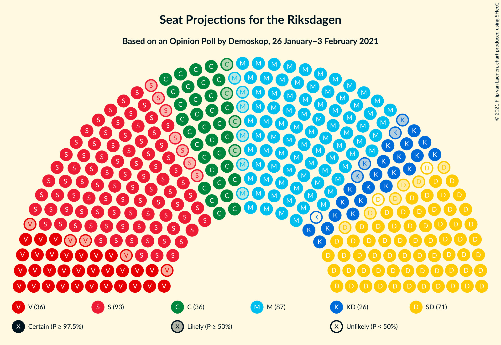
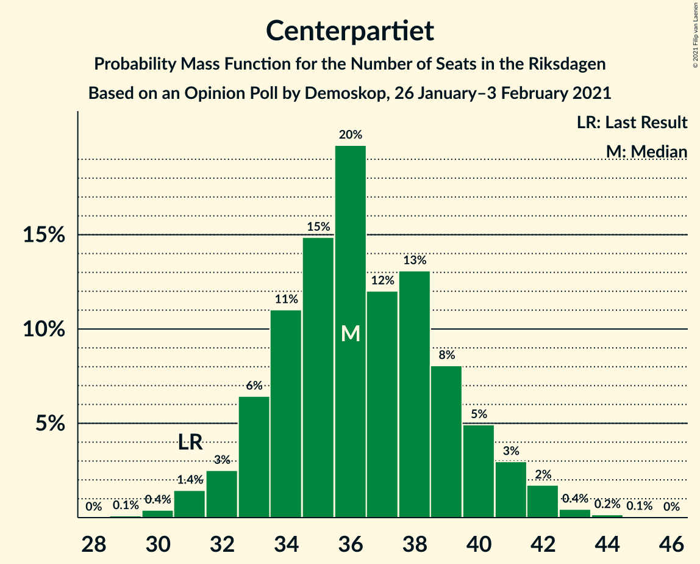
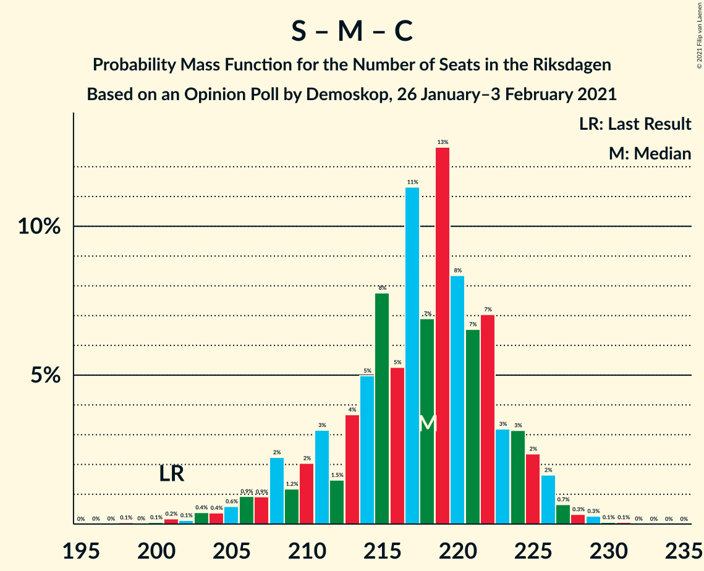
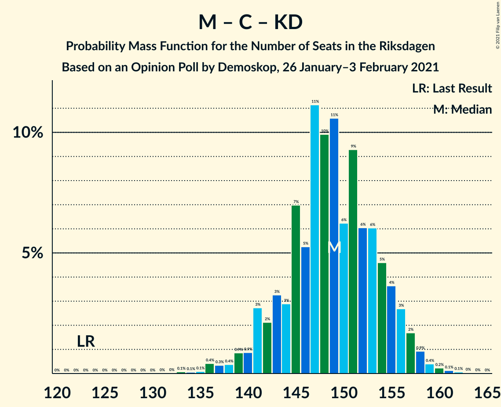

# Opinion Poll by Demoskop, 26 January–3 February 2021

<a href="#voting-intentions">Voting Intentions</a> | <a href="#seats">Seats</a> | <a href="#coalitions">Coalitions</a> | <a href="#technical-information">Technical Information</a>

## Voting Intentions

### Confidence Intervals

| Party | Last Result | Poll Result | 80% Confidence Interval | 90% Confidence Interval | 95% Confidence Interval | 99% Confidence Interval |
|:-----:|:-----------:|:-----------:|:-----------------------:|:-----------------------:|:-----------------------:|:-----------------------:|
| Sveriges socialdemokratiska arbetareparti | 28.3% | 24.7% | 23.5–25.9% |23.2–26.2% |22.9–26.5% |22.4–27.1% |
| Moderata samlingspartiet | 19.8% | 23.2% | 22.1–24.4% |21.8–24.8% |21.5–25.0% |21.0–25.6% |
| Sverigedemokraterna | 17.5% | 18.3% | 17.3–19.4% |17.0–19.7% |16.7–20.0% |16.3–20.5% |
| Centerpartiet | 8.6% | 9.6% | 8.8–10.5% |8.6–10.7% |8.4–10.9% |8.1–11.4% |
| Vänsterpartiet | 8.0% | 9.4% | 8.6–10.2% |8.4–10.5% |8.2–10.7% |7.9–11.1% |
| Kristdemokraterna | 6.3% | 6.5% | 5.9–7.2% |5.7–7.4% |5.5–7.6% |5.2–8.0% |
| Miljöpartiet de gröna | 4.4% | 3.5% | 3.0–4.0% |2.9–4.2% |2.8–4.3% |2.6–4.6% |
| Liberalerna | 5.5% | 3.1% | 2.7–3.7% |2.6–3.8% |2.5–3.9% |2.3–4.2% |

*Note:* The poll result column reflects the actual value used in the calculations. Published results may vary slightly, and in addition be rounded to fewer digits.

## Seats

### Confidence Intervals

| Party | Last Result | Median | 80% Confidence Interval | 90% Confidence Interval | 95% Confidence Interval | 99% Confidence Interval |
|:-----:|:-----------:|:------:|:-----------------------:|:-----------------------:|:-----------------------:|:-----------------------:|
| <a href="#sveriges-socialdemokratiska-arbetareparti">Sveriges socialdemokratiska arbetareparti</a> | 100 | 93 | 89–98 |87–100 |86–100 |84–103 |
| <a href="#moderata-samlingspartiet">Moderata samlingspartiet</a> | 70 | 87 | 83–92 |82–93 |81–95 |78–97 |
| <a href="#sverigedemokraterna">Sverigedemokraterna</a> | 62 | 69 | 65–73 |64–75 |63–75 |61–78 |
| <a href="#centerpartiet">Centerpartiet</a> | 31 | 36 | 33–40 |33–41 |32–41 |30–43 |
| <a href="#vänsterpartiet">Vänsterpartiet</a> | 28 | 36 | 33–39 |32–40 |31–40 |30–42 |
| <a href="#kristdemokraterna">Kristdemokraterna</a> | 22 | 25 | 22–27 |22–28 |21–29 |20–30 |
| <a href="#miljöpartiet-de-gröna">Miljöpartiet de gröna</a> | 16 | 0 | 0–15 |0–15 |0–16 |0–17 |
| <a href="#liberalerna">Liberalerna</a> | 20 | 0 | 0 |0 |0 |0–15 |

### Sveriges socialdemokratiska arbetareparti

*For a full overview of the results for this party, see the [Sveriges socialdemokratiska arbetareparti](party-sverigessocialdemokratiskaarbetareparti.html) page.*

| Number of Seats | Probability | Accumulated | Special Marks |
|:---------------:|:-----------:|:-----------:|:-------------:|
| 81 | 0.1% | 100% |  |
| 82 | 0.1% | 99.9% |  |
| 83 | 0.2% | 99.8% |  |
| 84 | 0.8% | 99.6% |  |
| 85 | 1.0% | 98.8% |  |
| 86 | 1.3% | 98% |  |
| 87 | 3% | 97% |  |
| 88 | 3% | 94% |  |
| 89 | 6% | 91% |  |
| 90 | 5% | 85% |  |
| 91 | 9% | 80% |  |
| 92 | 14% | 71% |  |
| 93 | 10% | 58% | Median |
| 94 | 11% | 48% |  |
| 95 | 6% | 37% |  |
| 96 | 13% | 31% |  |
| 97 | 7% | 18% |  |
| 98 | 3% | 11% |  |
| 99 | 3% | 8% |  |
| 100 | 4% | 5% | Last Result |
| 101 | 0.7% | 2% |  |
| 102 | 0.5% | 1.1% |  |
| 103 | 0.2% | 0.6% |  |
| 104 | 0.3% | 0.4% |  |
| 105 | 0.1% | 0.1% |  |
| 106 | 0% | 0% |  |

### Moderata samlingspartiet

*For a full overview of the results for this party, see the [Moderata samlingspartiet](party-moderatasamlingspartiet.html) page.*

| Number of Seats | Probability | Accumulated | Special Marks |
|:---------------:|:-----------:|:-----------:|:-------------:|
| 70 | 0% | 100% | Last Result |
| 71 | 0% | 100% |  |
| 72 | 0% | 100% |  |
| 73 | 0% | 100% |  |
| 74 | 0% | 100% |  |
| 75 | 0% | 100% |  |
| 76 | 0.1% | 99.9% |  |
| 77 | 0.1% | 99.9% |  |
| 78 | 0.3% | 99.8% |  |
| 79 | 0.7% | 99.5% |  |
| 80 | 1.1% | 98.8% |  |
| 81 | 2% | 98% |  |
| 82 | 3% | 96% |  |
| 83 | 4% | 93% |  |
| 84 | 6% | 89% |  |
| 85 | 8% | 84% |  |
| 86 | 9% | 76% |  |
| 87 | 18% | 66% | Median |
| 88 | 8% | 48% |  |
| 89 | 9% | 40% |  |
| 90 | 9% | 31% |  |
| 91 | 7% | 22% |  |
| 92 | 7% | 15% |  |
| 93 | 3% | 8% |  |
| 94 | 2% | 5% |  |
| 95 | 1.5% | 3% |  |
| 96 | 0.5% | 2% |  |
| 97 | 0.7% | 1.0% |  |
| 98 | 0.2% | 0.3% |  |
| 99 | 0% | 0.1% |  |
| 100 | 0% | 0% |  |

### Sverigedemokraterna

*For a full overview of the results for this party, see the [Sverigedemokraterna](party-sverigedemokraterna.html) page.*

| Number of Seats | Probability | Accumulated | Special Marks |
|:---------------:|:-----------:|:-----------:|:-------------:|
| 58 | 0.1% | 100% |  |
| 59 | 0.1% | 99.9% |  |
| 60 | 0.2% | 99.9% |  |
| 61 | 0.4% | 99.7% |  |
| 62 | 1.1% | 99.2% | Last Result |
| 63 | 2% | 98% |  |
| 64 | 3% | 96% |  |
| 65 | 5% | 93% |  |
| 66 | 7% | 88% |  |
| 67 | 8% | 81% |  |
| 68 | 12% | 73% |  |
| 69 | 12% | 61% | Median |
| 70 | 9% | 49% |  |
| 71 | 13% | 40% |  |
| 72 | 14% | 27% |  |
| 73 | 5% | 13% |  |
| 74 | 3% | 8% |  |
| 75 | 3% | 5% |  |
| 76 | 1.1% | 2% |  |
| 77 | 0.5% | 1.0% |  |
| 78 | 0.3% | 0.5% |  |
| 79 | 0.2% | 0.3% |  |
| 80 | 0% | 0.1% |  |
| 81 | 0% | 0% |  |

### Centerpartiet

*For a full overview of the results for this party, see the [Centerpartiet](party-centerpartiet.html) page.*

| Number of Seats | Probability | Accumulated | Special Marks |
|:---------------:|:-----------:|:-----------:|:-------------:|
| 29 | 0.1% | 100% |  |
| 30 | 0.4% | 99.9% |  |
| 31 | 1.4% | 99.5% | Last Result |
| 32 | 3% | 98% |  |
| 33 | 6% | 96% |  |
| 34 | 11% | 89% |  |
| 35 | 15% | 78% |  |
| 36 | 20% | 63% | Median |
| 37 | 12% | 43% |  |
| 38 | 13% | 31% |  |
| 39 | 8% | 18% |  |
| 40 | 5% | 10% |  |
| 41 | 3% | 5% |  |
| 42 | 2% | 2% |  |
| 43 | 0.4% | 0.7% |  |
| 44 | 0.2% | 0.2% |  |
| 45 | 0.1% | 0.1% |  |
| 46 | 0% | 0% |  |

### Vänsterpartiet

*For a full overview of the results for this party, see the [Vänsterpartiet](party-vänsterpartiet.html) page.*

| Number of Seats | Probability | Accumulated | Special Marks |
|:---------------:|:-----------:|:-----------:|:-------------:|
| 28 | 0.1% | 100% | Last Result |
| 29 | 0.3% | 99.9% |  |
| 30 | 1.1% | 99.7% |  |
| 31 | 3% | 98.6% |  |
| 32 | 5% | 96% |  |
| 33 | 8% | 91% |  |
| 34 | 13% | 82% |  |
| 35 | 18% | 70% |  |
| 36 | 18% | 51% | Median |
| 37 | 14% | 33% |  |
| 38 | 8% | 19% |  |
| 39 | 6% | 11% |  |
| 40 | 3% | 5% |  |
| 41 | 1.3% | 2% |  |
| 42 | 0.5% | 0.8% |  |
| 43 | 0.2% | 0.3% |  |
| 44 | 0.1% | 0.1% |  |
| 45 | 0% | 0% |  |

### Kristdemokraterna

*For a full overview of the results for this party, see the [Kristdemokraterna](party-kristdemokraterna.html) page.*

| Number of Seats | Probability | Accumulated | Special Marks |
|:---------------:|:-----------:|:-----------:|:-------------:|
| 19 | 0.3% | 100% |  |
| 20 | 0.9% | 99.7% |  |
| 21 | 4% | 98.7% |  |
| 22 | 10% | 95% | Last Result |
| 23 | 11% | 86% |  |
| 24 | 23% | 74% |  |
| 25 | 13% | 51% | Median |
| 26 | 19% | 38% |  |
| 27 | 12% | 18% |  |
| 28 | 3% | 6% |  |
| 29 | 3% | 4% |  |
| 30 | 0.5% | 0.9% |  |
| 31 | 0.2% | 0.3% |  |
| 32 | 0.1% | 0.1% |  |
| 33 | 0% | 0% |  |

### Miljöpartiet de gröna

*For a full overview of the results for this party, see the [Miljöpartiet de gröna](party-miljöpartietdegröna.html) page.*

| Number of Seats | Probability | Accumulated | Special Marks |
|:---------------:|:-----------:|:-----------:|:-------------:|
| 0 | 89% | 100% | Median |
| 1 | 0% | 11% |  |
| 2 | 0% | 11% |  |
| 3 | 0% | 11% |  |
| 4 | 0% | 11% |  |
| 5 | 0% | 11% |  |
| 6 | 0% | 11% |  |
| 7 | 0% | 11% |  |
| 8 | 0% | 11% |  |
| 9 | 0% | 11% |  |
| 10 | 0% | 11% |  |
| 11 | 0% | 11% |  |
| 12 | 0% | 11% |  |
| 13 | 0% | 11% |  |
| 14 | 0% | 11% |  |
| 15 | 7% | 11% |  |
| 16 | 3% | 4% | Last Result |
| 17 | 0.7% | 0.8% |  |
| 18 | 0.1% | 0.2% |  |
| 19 | 0% | 0% |  |

### Liberalerna

*For a full overview of the results for this party, see the [Liberalerna](party-liberalerna.html) page.*

| Number of Seats | Probability | Accumulated | Special Marks |
|:---------------:|:-----------:|:-----------:|:-------------:|
| 0 | 98.5% | 100% | Median |
| 1 | 0% | 1.5% |  |
| 2 | 0% | 1.5% |  |
| 3 | 0% | 1.5% |  |
| 4 | 0% | 1.5% |  |
| 5 | 0% | 1.5% |  |
| 6 | 0% | 1.5% |  |
| 7 | 0% | 1.5% |  |
| 8 | 0% | 1.5% |  |
| 9 | 0% | 1.5% |  |
| 10 | 0% | 1.5% |  |
| 11 | 0% | 1.5% |  |
| 12 | 0% | 1.5% |  |
| 13 | 0% | 1.5% |  |
| 14 | 0.1% | 1.5% |  |
| 15 | 1.0% | 1.4% |  |
| 16 | 0.4% | 0.5% |  |
| 17 | 0% | 0.1% |  |
| 18 | 0% | 0% |  |
| 19 | 0% | 0% |  |
| 20 | 0% | 0% | Last Result |

## Coalitions

### Confidence Intervals

| Coalition | Last Result | Median | Majority? | 80% Confidence Interval | 90% Confidence Interval | 95% Confidence Interval | 99% Confidence Interval |
|:---------:|:-----------:|:------:|:---------:|:-----------------------:|:-----------------------:|:-----------------------:|:-----------------------:|
| Sveriges socialdemokratiska arbetareparti – Moderata samlingspartiet – Centerpartiet | 201 | 218 | 100% | 211–223 | 208–225 | 206–226 | 203–228 |
| Moderata samlingspartiet – Sverigedemokraterna – Kristdemokraterna | 154 | 183 | 93% | 176–187 | 173–189 | 171–190 | 167–192 |
| Sveriges socialdemokratiska arbetareparti – Moderata samlingspartiet | 170 | 181 | 91% | 175–187 | 173–188 | 171–190 | 167–192 |
| Sveriges socialdemokratiska arbetareparti – Centerpartiet – Vänsterpartiet – Miljöpartiet de gröna – Liberalerna | 195 | 166 | 7% | 162–173 | 160–176 | 159–178 | 157–182 |
| Moderata samlingspartiet – Sverigedemokraterna | 132 | 158 | 0% | 151–163 | 149–164 | 147–165 | 144–168 |
| Moderata samlingspartiet – Centerpartiet – Kristdemokraterna – Liberalerna | 143 | 149 | 0% | 143–155 | 141–156 | 140–158 | 136–161 |
| Moderata samlingspartiet – Centerpartiet – Kristdemokraterna | 123 | 149 | 0% | 143–154 | 141–156 | 140–157 | 136–159 |
| Sveriges socialdemokratiska arbetareparti – Centerpartiet – Miljöpartiet de gröna – Liberalerna | 167 | 131 | 0% | 126–138 | 125–142 | 124–143 | 121–147 |
| Sveriges socialdemokratiska arbetareparti – Vänsterpartiet – Miljöpartiet de gröna | 144 | 130 | 0% | 125–137 | 123–140 | 122–142 | 120–145 |
| Sveriges socialdemokratiska arbetareparti – Vänsterpartiet | 128 | 129 | 0% | 123–134 | 122–136 | 120–136 | 117–139 |
| Moderata samlingspartiet – Centerpartiet – Liberalerna | 121 | 124 | 0% | 119–130 | 117–131 | 116–133 | 113–137 |
| Moderata samlingspartiet – Centerpartiet | 101 | 124 | 0% | 119–129 | 117–131 | 116–132 | 112–134 |
| Sveriges socialdemokratiska arbetareparti – Miljöpartiet de gröna | 116 | 94 | 0% | 90–102 | 88–105 | 87–107 | 85–110 |

### Sveriges socialdemokratiska arbetareparti – Moderata samlingspartiet – Centerpartiet

| Number of Seats | Probability | Accumulated | Special Marks |
|:---------------:|:-----------:|:-----------:|:-------------:|
| 198 | 0.1% | 100% |  |
| 199 | 0% | 99.9% |  |
| 200 | 0.1% | 99.9% |  |
| 201 | 0.2% | 99.8% | Last Result |
| 202 | 0.1% | 99.7% |  |
| 203 | 0.4% | 99.5% |  |
| 204 | 0.4% | 99.1% |  |
| 205 | 0.6% | 98.8% |  |
| 206 | 0.9% | 98% |  |
| 207 | 0.9% | 97% |  |
| 208 | 2% | 96% |  |
| 209 | 1.2% | 94% |  |
| 210 | 2% | 93% |  |
| 211 | 3% | 91% |  |
| 212 | 1.5% | 88% |  |
| 213 | 4% | 86% |  |
| 214 | 5% | 83% |  |
| 215 | 8% | 78% |  |
| 216 | 5% | 70% | Median |
| 217 | 11% | 65% |  |
| 218 | 7% | 53% |  |
| 219 | 13% | 46% |  |
| 220 | 8% | 34% |  |
| 221 | 7% | 25% |  |
| 222 | 7% | 19% |  |
| 223 | 3% | 12% |  |
| 224 | 3% | 9% |  |
| 225 | 2% | 5% |  |
| 226 | 2% | 3% |  |
| 227 | 0.7% | 1.4% |  |
| 228 | 0.3% | 0.7% |  |
| 229 | 0.3% | 0.4% |  |
| 230 | 0.1% | 0.1% |  |
| 231 | 0.1% | 0.1% |  |
| 232 | 0% | 0% |  |

### Moderata samlingspartiet – Sverigedemokraterna – Kristdemokraterna

| Number of Seats | Probability | Accumulated | Special Marks |
|:---------------:|:-----------:|:-----------:|:-------------:|
| 154 | 0% | 100% | Last Result |
| 155 | 0% | 100% |  |
| 156 | 0% | 100% |  |
| 157 | 0% | 100% |  |
| 158 | 0% | 100% |  |
| 159 | 0% | 100% |  |
| 160 | 0% | 100% |  |
| 161 | 0% | 100% |  |
| 162 | 0% | 100% |  |
| 163 | 0% | 100% |  |
| 164 | 0.1% | 100% |  |
| 165 | 0.1% | 99.9% |  |
| 166 | 0.2% | 99.8% |  |
| 167 | 0.1% | 99.6% |  |
| 168 | 0.1% | 99.5% |  |
| 169 | 0.4% | 99.4% |  |
| 170 | 1.1% | 99.0% |  |
| 171 | 1.2% | 98% |  |
| 172 | 2% | 97% |  |
| 173 | 1.3% | 95% |  |
| 174 | 1.3% | 94% |  |
| 175 | 2% | 93% | Majority |
| 176 | 2% | 91% |  |
| 177 | 4% | 88% |  |
| 178 | 6% | 84% |  |
| 179 | 5% | 78% |  |
| 180 | 8% | 73% |  |
| 181 | 8% | 65% | Median |
| 182 | 6% | 57% |  |
| 183 | 14% | 51% |  |
| 184 | 10% | 37% |  |
| 185 | 8% | 27% |  |
| 186 | 5% | 19% |  |
| 187 | 5% | 14% |  |
| 188 | 2% | 9% |  |
| 189 | 4% | 7% |  |
| 190 | 2% | 4% |  |
| 191 | 0.7% | 2% |  |
| 192 | 0.8% | 1.2% |  |
| 193 | 0.2% | 0.4% |  |
| 194 | 0.1% | 0.2% |  |
| 195 | 0.1% | 0.1% |  |
| 196 | 0% | 0% |  |

### Sveriges socialdemokratiska arbetareparti – Moderata samlingspartiet

| Number of Seats | Probability | Accumulated | Special Marks |
|:---------------:|:-----------:|:-----------:|:-------------:|
| 163 | 0% | 100% |  |
| 164 | 0% | 99.9% |  |
| 165 | 0.2% | 99.9% |  |
| 166 | 0.2% | 99.7% |  |
| 167 | 0.1% | 99.6% |  |
| 168 | 0.3% | 99.4% |  |
| 169 | 0.8% | 99.1% |  |
| 170 | 0.6% | 98% | Last Result |
| 171 | 1.0% | 98% |  |
| 172 | 1.0% | 97% |  |
| 173 | 2% | 96% |  |
| 174 | 2% | 93% |  |
| 175 | 3% | 91% | Majority |
| 176 | 3% | 88% |  |
| 177 | 5% | 85% |  |
| 178 | 5% | 81% |  |
| 179 | 12% | 76% |  |
| 180 | 6% | 64% | Median |
| 181 | 10% | 58% |  |
| 182 | 8% | 49% |  |
| 183 | 12% | 41% |  |
| 184 | 7% | 29% |  |
| 185 | 8% | 23% |  |
| 186 | 4% | 15% |  |
| 187 | 5% | 12% |  |
| 188 | 3% | 6% |  |
| 189 | 1.3% | 4% |  |
| 190 | 1.4% | 3% |  |
| 191 | 0.5% | 1.2% |  |
| 192 | 0.4% | 0.7% |  |
| 193 | 0.2% | 0.3% |  |
| 194 | 0% | 0.1% |  |
| 195 | 0% | 0.1% |  |
| 196 | 0% | 0% |  |

### Sveriges socialdemokratiska arbetareparti – Centerpartiet – Vänsterpartiet – Miljöpartiet de gröna – Liberalerna

| Number of Seats | Probability | Accumulated | Special Marks |
|:---------------:|:-----------:|:-----------:|:-------------:|
| 154 | 0.1% | 100% |  |
| 155 | 0.1% | 99.9% |  |
| 156 | 0.2% | 99.8% |  |
| 157 | 0.8% | 99.6% |  |
| 158 | 0.7% | 98.8% |  |
| 159 | 2% | 98% |  |
| 160 | 4% | 96% |  |
| 161 | 2% | 93% |  |
| 162 | 5% | 91% |  |
| 163 | 5% | 86% |  |
| 164 | 8% | 81% |  |
| 165 | 10% | 73% | Median |
| 166 | 14% | 63% |  |
| 167 | 6% | 49% |  |
| 168 | 8% | 43% |  |
| 169 | 8% | 35% |  |
| 170 | 5% | 27% |  |
| 171 | 6% | 22% |  |
| 172 | 4% | 16% |  |
| 173 | 2% | 12% |  |
| 174 | 2% | 9% |  |
| 175 | 1.3% | 7% | Majority |
| 176 | 1.3% | 6% |  |
| 177 | 2% | 5% |  |
| 178 | 1.2% | 3% |  |
| 179 | 1.1% | 2% |  |
| 180 | 0.4% | 1.0% |  |
| 181 | 0.1% | 0.6% |  |
| 182 | 0.1% | 0.5% |  |
| 183 | 0.2% | 0.4% |  |
| 184 | 0.1% | 0.2% |  |
| 185 | 0.1% | 0.1% |  |
| 186 | 0% | 0% |  |
| 187 | 0% | 0% |  |
| 188 | 0% | 0% |  |
| 189 | 0% | 0% |  |
| 190 | 0% | 0% |  |
| 191 | 0% | 0% |  |
| 192 | 0% | 0% |  |
| 193 | 0% | 0% |  |
| 194 | 0% | 0% |  |
| 195 | 0% | 0% | Last Result |

### Moderata samlingspartiet – Sverigedemokraterna

| Number of Seats | Probability | Accumulated | Special Marks |
|:---------------:|:-----------:|:-----------:|:-------------:|
| 132 | 0% | 100% | Last Result |
| 133 | 0% | 100% |  |
| 134 | 0% | 100% |  |
| 135 | 0% | 100% |  |
| 136 | 0% | 100% |  |
| 137 | 0% | 100% |  |
| 138 | 0% | 100% |  |
| 139 | 0% | 100% |  |
| 140 | 0% | 100% |  |
| 141 | 0% | 100% |  |
| 142 | 0.1% | 99.9% |  |
| 143 | 0.2% | 99.8% |  |
| 144 | 0.2% | 99.6% |  |
| 145 | 0.6% | 99.4% |  |
| 146 | 0.6% | 98.8% |  |
| 147 | 2% | 98% |  |
| 148 | 0.8% | 97% |  |
| 149 | 2% | 96% |  |
| 150 | 1.4% | 94% |  |
| 151 | 3% | 93% |  |
| 152 | 4% | 89% |  |
| 153 | 5% | 86% |  |
| 154 | 8% | 81% |  |
| 155 | 5% | 74% |  |
| 156 | 9% | 68% | Median |
| 157 | 8% | 60% |  |
| 158 | 14% | 52% |  |
| 159 | 12% | 38% |  |
| 160 | 7% | 27% |  |
| 161 | 6% | 20% |  |
| 162 | 2% | 14% |  |
| 163 | 7% | 12% |  |
| 164 | 2% | 6% |  |
| 165 | 2% | 4% |  |
| 166 | 1.1% | 2% |  |
| 167 | 0.3% | 1.0% |  |
| 168 | 0.4% | 0.7% |  |
| 169 | 0.1% | 0.3% |  |
| 170 | 0.1% | 0.1% |  |
| 171 | 0% | 0% |  |

### Moderata samlingspartiet – Centerpartiet – Kristdemokraterna – Liberalerna

| Number of Seats | Probability | Accumulated | Special Marks |
|:---------------:|:-----------:|:-----------:|:-------------:|
| 133 | 0% | 100% |  |
| 134 | 0% | 99.9% |  |
| 135 | 0.1% | 99.9% |  |
| 136 | 0.4% | 99.8% |  |
| 137 | 0.3% | 99.5% |  |
| 138 | 0.3% | 99.2% |  |
| 139 | 0.8% | 98.9% |  |
| 140 | 0.8% | 98% |  |
| 141 | 2% | 97% |  |
| 142 | 2% | 95% |  |
| 143 | 3% | 93% | Last Result |
| 144 | 3% | 90% |  |
| 145 | 7% | 87% |  |
| 146 | 5% | 80% |  |
| 147 | 11% | 75% |  |
| 148 | 10% | 64% | Median |
| 149 | 11% | 54% |  |
| 150 | 6% | 43% |  |
| 151 | 9% | 37% |  |
| 152 | 6% | 28% |  |
| 153 | 6% | 22% |  |
| 154 | 5% | 16% |  |
| 155 | 4% | 11% |  |
| 156 | 3% | 7% |  |
| 157 | 2% | 4% |  |
| 158 | 1.1% | 3% |  |
| 159 | 0.5% | 1.4% |  |
| 160 | 0.3% | 1.0% |  |
| 161 | 0.2% | 0.6% |  |
| 162 | 0.2% | 0.4% |  |
| 163 | 0.1% | 0.2% |  |
| 164 | 0.1% | 0.2% |  |
| 165 | 0% | 0.1% |  |
| 166 | 0% | 0% |  |

### Moderata samlingspartiet – Centerpartiet – Kristdemokraterna

| Number of Seats | Probability | Accumulated | Special Marks |
|:---------------:|:-----------:|:-----------:|:-------------:|
| 123 | 0% | 100% | Last Result |
| 124 | 0% | 100% |  |
| 125 | 0% | 100% |  |
| 126 | 0% | 100% |  |
| 127 | 0% | 100% |  |
| 128 | 0% | 100% |  |
| 129 | 0% | 100% |  |
| 130 | 0% | 100% |  |
| 131 | 0% | 100% |  |
| 132 | 0% | 100% |  |
| 133 | 0.1% | 100% |  |
| 134 | 0.1% | 99.9% |  |
| 135 | 0.1% | 99.8% |  |
| 136 | 0.4% | 99.8% |  |
| 137 | 0.3% | 99.3% |  |
| 138 | 0.4% | 99.0% |  |
| 139 | 0.9% | 98.6% |  |
| 140 | 0.9% | 98% |  |
| 141 | 3% | 97% |  |
| 142 | 2% | 94% |  |
| 143 | 3% | 92% |  |
| 144 | 3% | 89% |  |
| 145 | 7% | 86% |  |
| 146 | 5% | 79% |  |
| 147 | 11% | 74% |  |
| 148 | 10% | 63% | Median |
| 149 | 11% | 53% |  |
| 150 | 6% | 42% |  |
| 151 | 9% | 36% |  |
| 152 | 6% | 26% |  |
| 153 | 6% | 20% |  |
| 154 | 5% | 14% |  |
| 155 | 4% | 10% |  |
| 156 | 3% | 6% |  |
| 157 | 2% | 3% |  |
| 158 | 0.9% | 2% |  |
| 159 | 0.4% | 0.9% |  |
| 160 | 0.2% | 0.5% |  |
| 161 | 0.1% | 0.2% |  |
| 162 | 0.1% | 0.1% |  |
| 163 | 0% | 0% |  |

### Sveriges socialdemokratiska arbetareparti – Centerpartiet – Miljöpartiet de gröna – Liberalerna

| Number of Seats | Probability | Accumulated | Special Marks |
|:---------------:|:-----------:|:-----------:|:-------------:|
| 118 | 0% | 100% |  |
| 119 | 0.1% | 99.9% |  |
| 120 | 0.2% | 99.8% |  |
| 121 | 0.3% | 99.6% |  |
| 122 | 0.6% | 99.3% |  |
| 123 | 0.9% | 98.7% |  |
| 124 | 2% | 98% |  |
| 125 | 3% | 95% |  |
| 126 | 2% | 92% |  |
| 127 | 7% | 89% |  |
| 128 | 9% | 83% |  |
| 129 | 9% | 74% | Median |
| 130 | 13% | 65% |  |
| 131 | 9% | 52% |  |
| 132 | 10% | 44% |  |
| 133 | 5% | 33% |  |
| 134 | 4% | 28% |  |
| 135 | 5% | 24% |  |
| 136 | 5% | 19% |  |
| 137 | 2% | 14% |  |
| 138 | 3% | 12% |  |
| 139 | 1.4% | 9% |  |
| 140 | 1.2% | 7% |  |
| 141 | 1.0% | 6% |  |
| 142 | 2% | 5% |  |
| 143 | 1.1% | 3% |  |
| 144 | 0.9% | 2% |  |
| 145 | 0.5% | 1.3% |  |
| 146 | 0.3% | 0.9% |  |
| 147 | 0.1% | 0.5% |  |
| 148 | 0.1% | 0.5% |  |
| 149 | 0.1% | 0.3% |  |
| 150 | 0.1% | 0.2% |  |
| 151 | 0.1% | 0.1% |  |
| 152 | 0% | 0% |  |
| 153 | 0% | 0% |  |
| 154 | 0% | 0% |  |
| 155 | 0% | 0% |  |
| 156 | 0% | 0% |  |
| 157 | 0% | 0% |  |
| 158 | 0% | 0% |  |
| 159 | 0% | 0% |  |
| 160 | 0% | 0% |  |
| 161 | 0% | 0% |  |
| 162 | 0% | 0% |  |
| 163 | 0% | 0% |  |
| 164 | 0% | 0% |  |
| 165 | 0% | 0% |  |
| 166 | 0% | 0% |  |
| 167 | 0% | 0% | Last Result |

### Sveriges socialdemokratiska arbetareparti – Vänsterpartiet – Miljöpartiet de gröna

| Number of Seats | Probability | Accumulated | Special Marks |
|:---------------:|:-----------:|:-----------:|:-------------:|
| 116 | 0% | 100% |  |
| 117 | 0.1% | 99.9% |  |
| 118 | 0.1% | 99.9% |  |
| 119 | 0.3% | 99.8% |  |
| 120 | 0.5% | 99.5% |  |
| 121 | 0.8% | 99.0% |  |
| 122 | 0.8% | 98% |  |
| 123 | 3% | 97% |  |
| 124 | 2% | 95% |  |
| 125 | 3% | 92% |  |
| 126 | 8% | 89% |  |
| 127 | 7% | 81% |  |
| 128 | 11% | 75% |  |
| 129 | 8% | 63% | Median |
| 130 | 9% | 55% |  |
| 131 | 8% | 46% |  |
| 132 | 6% | 38% |  |
| 133 | 8% | 32% |  |
| 134 | 6% | 24% |  |
| 135 | 3% | 18% |  |
| 136 | 4% | 15% |  |
| 137 | 2% | 10% |  |
| 138 | 1.3% | 8% |  |
| 139 | 2% | 7% |  |
| 140 | 1.3% | 5% |  |
| 141 | 1.4% | 4% |  |
| 142 | 0.5% | 3% |  |
| 143 | 0.5% | 2% |  |
| 144 | 0.4% | 2% | Last Result |
| 145 | 0.7% | 1.2% |  |
| 146 | 0.1% | 0.5% |  |
| 147 | 0.3% | 0.4% |  |
| 148 | 0% | 0.1% |  |
| 149 | 0% | 0.1% |  |
| 150 | 0% | 0% |  |

### Sveriges socialdemokratiska arbetareparti – Vänsterpartiet

| Number of Seats | Probability | Accumulated | Special Marks |
|:---------------:|:-----------:|:-----------:|:-------------:|
| 114 | 0.1% | 100% |  |
| 115 | 0.1% | 99.9% |  |
| 116 | 0.2% | 99.8% |  |
| 117 | 0.4% | 99.6% |  |
| 118 | 0.5% | 99.2% |  |
| 119 | 0.8% | 98.7% |  |
| 120 | 0.9% | 98% |  |
| 121 | 2% | 97% |  |
| 122 | 2% | 95% |  |
| 123 | 4% | 93% |  |
| 124 | 4% | 90% |  |
| 125 | 5% | 86% |  |
| 126 | 9% | 82% |  |
| 127 | 7% | 73% |  |
| 128 | 12% | 66% | Last Result |
| 129 | 9% | 54% | Median |
| 130 | 9% | 45% |  |
| 131 | 8% | 36% |  |
| 132 | 6% | 28% |  |
| 133 | 8% | 22% |  |
| 134 | 5% | 14% |  |
| 135 | 3% | 8% |  |
| 136 | 3% | 5% |  |
| 137 | 1.0% | 2% |  |
| 138 | 0.7% | 1.4% |  |
| 139 | 0.3% | 0.8% |  |
| 140 | 0.2% | 0.4% |  |
| 141 | 0.2% | 0.2% |  |
| 142 | 0% | 0.1% |  |
| 143 | 0% | 0% |  |

### Moderata samlingspartiet – Centerpartiet – Liberalerna

| Number of Seats | Probability | Accumulated | Special Marks |
|:---------------:|:-----------:|:-----------:|:-------------:|
| 110 | 0% | 100% |  |
| 111 | 0.1% | 99.9% |  |
| 112 | 0.3% | 99.9% |  |
| 113 | 0.2% | 99.6% |  |
| 114 | 0.4% | 99.3% |  |
| 115 | 0.6% | 98.9% |  |
| 116 | 1.3% | 98% |  |
| 117 | 2% | 97% |  |
| 118 | 3% | 95% |  |
| 119 | 3% | 92% |  |
| 120 | 4% | 88% |  |
| 121 | 10% | 85% | Last Result |
| 122 | 5% | 75% |  |
| 123 | 14% | 69% | Median |
| 124 | 7% | 56% |  |
| 125 | 13% | 49% |  |
| 126 | 8% | 36% |  |
| 127 | 6% | 28% |  |
| 128 | 6% | 22% |  |
| 129 | 5% | 16% |  |
| 130 | 3% | 11% |  |
| 131 | 4% | 7% |  |
| 132 | 1.3% | 4% |  |
| 133 | 0.6% | 3% |  |
| 134 | 0.9% | 2% |  |
| 135 | 0.3% | 1.1% |  |
| 136 | 0.2% | 0.8% |  |
| 137 | 0.2% | 0.5% |  |
| 138 | 0.2% | 0.4% |  |
| 139 | 0% | 0.2% |  |
| 140 | 0.1% | 0.1% |  |
| 141 | 0% | 0.1% |  |
| 142 | 0% | 0% |  |

### Moderata samlingspartiet – Centerpartiet

| Number of Seats | Probability | Accumulated | Special Marks |
|:---------------:|:-----------:|:-----------:|:-------------:|
| 101 | 0% | 100% | Last Result |
| 102 | 0% | 100% |  |
| 103 | 0% | 100% |  |
| 104 | 0% | 100% |  |
| 105 | 0% | 100% |  |
| 106 | 0% | 100% |  |
| 107 | 0% | 100% |  |
| 108 | 0% | 100% |  |
| 109 | 0% | 100% |  |
| 110 | 0.1% | 99.9% |  |
| 111 | 0.1% | 99.9% |  |
| 112 | 0.3% | 99.8% |  |
| 113 | 0.3% | 99.5% |  |
| 114 | 0.4% | 99.2% |  |
| 115 | 0.7% | 98.7% |  |
| 116 | 1.3% | 98% |  |
| 117 | 2% | 97% |  |
| 118 | 3% | 94% |  |
| 119 | 4% | 91% |  |
| 120 | 4% | 87% |  |
| 121 | 10% | 84% |  |
| 122 | 5% | 74% |  |
| 123 | 14% | 68% | Median |
| 124 | 7% | 55% |  |
| 125 | 13% | 48% |  |
| 126 | 8% | 35% |  |
| 127 | 6% | 27% |  |
| 128 | 6% | 21% |  |
| 129 | 5% | 15% |  |
| 130 | 3% | 9% |  |
| 131 | 3% | 6% |  |
| 132 | 1.2% | 3% |  |
| 133 | 0.5% | 2% |  |
| 134 | 0.7% | 1.1% |  |
| 135 | 0.2% | 0.4% |  |
| 136 | 0.1% | 0.2% |  |
| 137 | 0.1% | 0.1% |  |
| 138 | 0% | 0% |  |

### Sveriges socialdemokratiska arbetareparti – Miljöpartiet de gröna

| Number of Seats | Probability | Accumulated | Special Marks |
|:---------------:|:-----------:|:-----------:|:-------------:|
| 83 | 0.1% | 100% |  |
| 84 | 0.2% | 99.9% |  |
| 85 | 0.5% | 99.7% |  |
| 86 | 0.8% | 99.2% |  |
| 87 | 1.2% | 98% |  |
| 88 | 2% | 97% |  |
| 89 | 4% | 95% |  |
| 90 | 4% | 91% |  |
| 91 | 7% | 87% |  |
| 92 | 13% | 79% |  |
| 93 | 9% | 67% | Median |
| 94 | 11% | 58% |  |
| 95 | 5% | 47% |  |
| 96 | 13% | 42% |  |
| 97 | 7% | 28% |  |
| 98 | 3% | 21% |  |
| 99 | 3% | 19% |  |
| 100 | 4% | 16% |  |
| 101 | 1.1% | 11% |  |
| 102 | 2% | 10% |  |
| 103 | 1.4% | 9% |  |
| 104 | 2% | 7% |  |
| 105 | 1.3% | 6% |  |
| 106 | 0.7% | 4% |  |
| 107 | 1.4% | 4% |  |
| 108 | 0.9% | 2% |  |
| 109 | 0.5% | 1.4% |  |
| 110 | 0.4% | 0.8% |  |
| 111 | 0.2% | 0.4% |  |
| 112 | 0.1% | 0.2% |  |
| 113 | 0.1% | 0.1% |  |
| 114 | 0% | 0% |  |
| 115 | 0% | 0% |  |
| 116 | 0% | 0% | Last Result |

## Technical Information

### Opinion Poll

+ **Polling firm:** Demoskop
+ **Commissioner(s):** —
+ **Fieldwork period:** 26 January–3 February 2021

### Calculations

+ **Sample size:** 2184
+ **Simulations done:** 1,048,576
+ **Error estimate:** 0.98%

