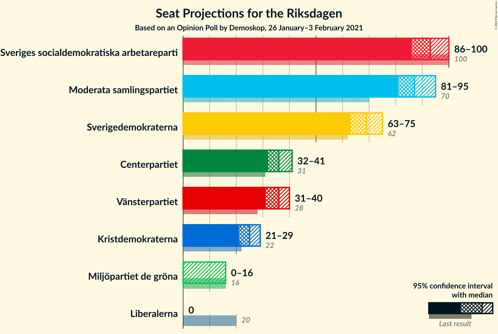
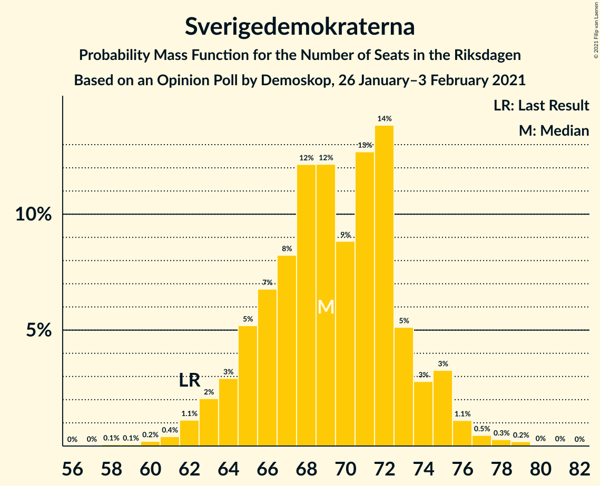
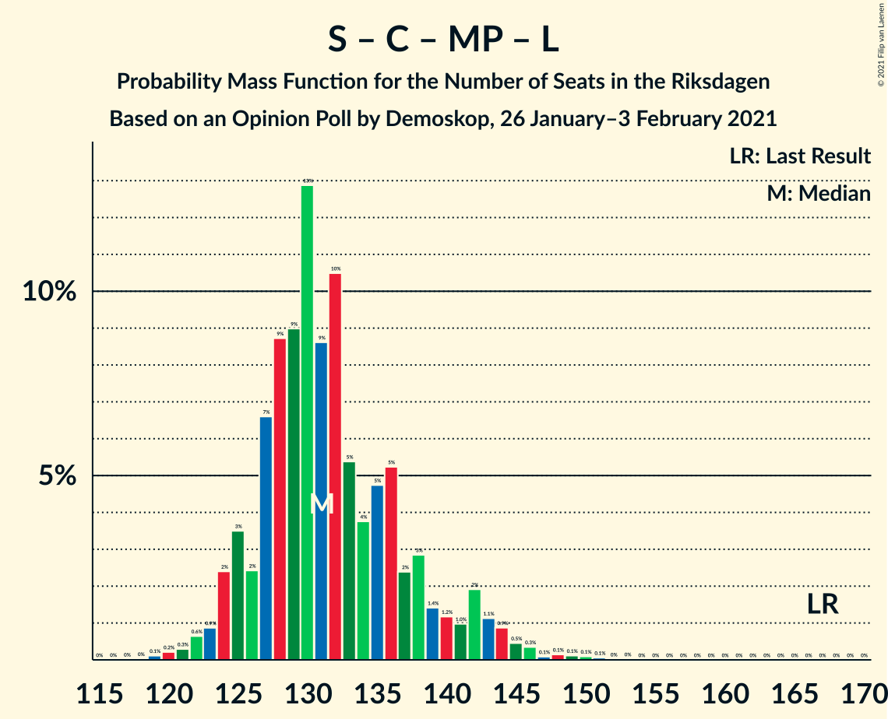
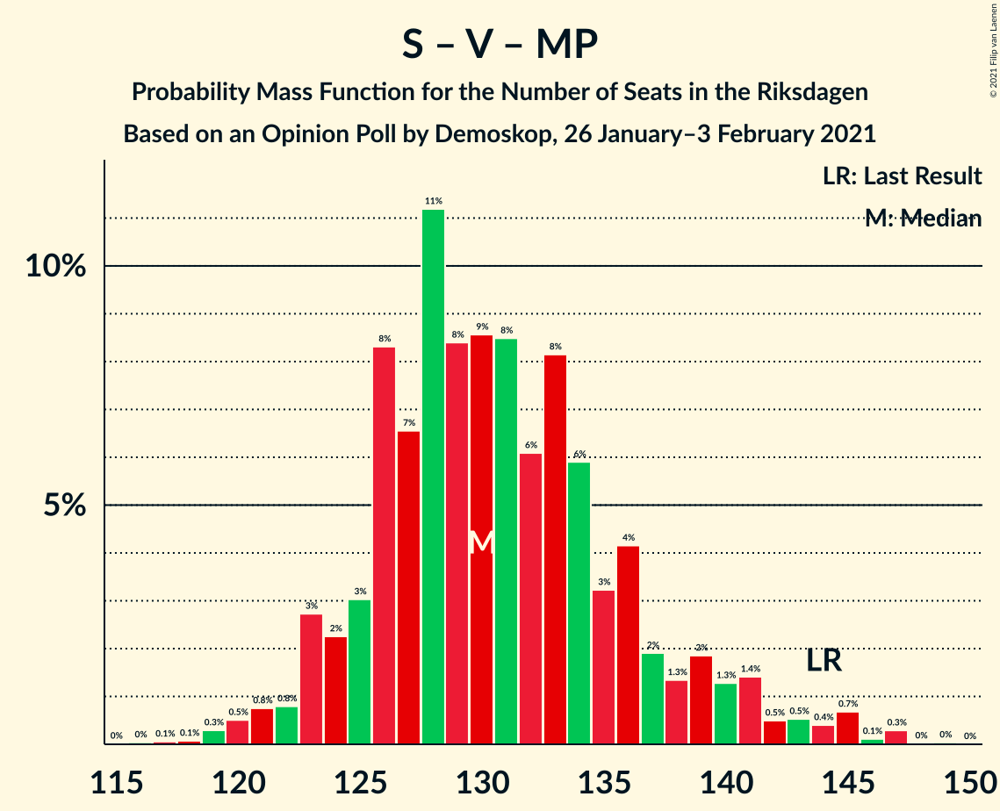

# Opinion Poll by Demoskop, 26 January–3 February 2021

<a href="#voting-intentions">Voting Intentions</a> | <a href="#seats">Seats</a> | <a href="#coalitions">Coalitions</a> | <a href="#technical-information">Technical Information</a>

## Voting Intentions

### Confidence Intervals

| Party | Last Result | Poll Result | 80% Confidence Interval | 90% Confidence Interval | 95% Confidence Interval | 99% Confidence Interval |
|:-----:|:-----------:|:-----------:|:-----------------------:|:-----------------------:|:-----------------------:|:-----------------------:|
| Sveriges socialdemokratiska arbetareparti | 28.3% | 24.7% | 23.5–25.9% |23.2–26.2% |22.9–26.5% |22.4–27.1% |
| Moderata samlingspartiet | 19.8% | 23.2% | 22.1–24.4% |21.8–24.8% |21.5–25.0% |21.0–25.6% |
| Sverigedemokraterna | 17.5% | 18.3% | 17.3–19.4% |17.0–19.7% |16.7–20.0% |16.3–20.5% |
| Centerpartiet | 8.6% | 9.6% | 8.8–10.5% |8.6–10.7% |8.4–10.9% |8.1–11.4% |
| Vänsterpartiet | 8.0% | 9.4% | 8.6–10.2% |8.4–10.5% |8.2–10.7% |7.9–11.1% |
| Kristdemokraterna | 6.3% | 6.5% | 5.9–7.2% |5.7–7.4% |5.5–7.6% |5.2–8.0% |
| Miljöpartiet de gröna | 4.4% | 3.5% | 3.0–4.0% |2.9–4.2% |2.8–4.3% |2.6–4.6% |
| Liberalerna | 5.5% | 3.1% | 2.7–3.7% |2.6–3.8% |2.5–3.9% |2.3–4.2% |

*Note:* The poll result column reflects the actual value used in the calculations. Published results may vary slightly, and in addition be rounded to fewer digits.

## Seats

### Confidence Intervals

| Party | Last Result | Median | 80% Confidence Interval | 90% Confidence Interval | 95% Confidence Interval | 99% Confidence Interval |
|:-----:|:-----------:|:------:|:-----------------------:|:-----------------------:|:-----------------------:|:-----------------------:|
| <a href="#sveriges-socialdemokratiska-arbetareparti">Sveriges socialdemokratiska arbetareparti</a> | 100 | 92 | 89–100 |87–100 |86–100 |84–102 |
| <a href="#moderata-samlingspartiet">Moderata samlingspartiet</a> | 70 | 87 | 84–91 |82–93 |81–94 |78–96 |
| <a href="#sverigedemokraterna">Sverigedemokraterna</a> | 62 | 72 | 65–73 |64–74 |63–75 |62–77 |
| <a href="#centerpartiet">Centerpartiet</a> | 31 | 38 | 34–40 |33–40 |32–42 |31–42 |
| <a href="#vänsterpartiet">Vänsterpartiet</a> | 28 | 36 | 32–37 |31–39 |31–40 |30–42 |
| <a href="#kristdemokraterna">Kristdemokraterna</a> | 22 | 24 | 22–27 |21–28 |21–29 |20–30 |
| <a href="#miljöpartiet-de-gröna">Miljöpartiet de gröna</a> | 16 | 0 | 0–15 |0–16 |0–16 |0–16 |
| <a href="#liberalerna">Liberalerna</a> | 20 | 0 | 0 |0 |0 |0–15 |

### Sveriges socialdemokratiska arbetareparti

*For a full overview of the results for this party, see the [Sveriges socialdemokratiska arbetareparti](party-sverigessocialdemokratiskaarbetareparti.html) page.*

| Number of Seats | Probability | Accumulated | Special Marks |
|:---------------:|:-----------:|:-----------:|:-------------:|
| 81 | 0% | 100% |  |
| 82 | 0.1% | 99.9% |  |
| 83 | 0.1% | 99.9% |  |
| 84 | 1.0% | 99.8% |  |
| 85 | 0.4% | 98.8% |  |
| 86 | 1.3% | 98% |  |
| 87 | 3% | 97% |  |
| 88 | 2% | 94% |  |
| 89 | 7% | 92% |  |
| 90 | 4% | 85% |  |
| 91 | 8% | 81% |  |
| 92 | 41% | 74% | Median |
| 93 | 2% | 32% |  |
| 94 | 3% | 30% |  |
| 95 | 3% | 27% |  |
| 96 | 2% | 24% |  |
| 97 | 3% | 21% |  |
| 98 | 2% | 19% |  |
| 99 | 4% | 17% |  |
| 100 | 12% | 14% | Last Result |
| 101 | 1.1% | 2% |  |
| 102 | 0.5% | 0.8% |  |
| 103 | 0.1% | 0.3% |  |
| 104 | 0.1% | 0.1% |  |
| 105 | 0% | 0.1% |  |
| 106 | 0% | 0% |  |

### Moderata samlingspartiet

*For a full overview of the results for this party, see the [Moderata samlingspartiet](party-moderatasamlingspartiet.html) page.*

| Number of Seats | Probability | Accumulated | Special Marks |
|:---------------:|:-----------:|:-----------:|:-------------:|
| 70 | 0% | 100% | Last Result |
| 71 | 0% | 100% |  |
| 72 | 0% | 100% |  |
| 73 | 0% | 100% |  |
| 74 | 0% | 100% |  |
| 75 | 0% | 100% |  |
| 76 | 0.1% | 100% |  |
| 77 | 0.1% | 99.9% |  |
| 78 | 0.5% | 99.8% |  |
| 79 | 0.4% | 99.3% |  |
| 80 | 0.5% | 98.9% |  |
| 81 | 1.3% | 98% |  |
| 82 | 5% | 97% |  |
| 83 | 0.9% | 92% |  |
| 84 | 4% | 91% |  |
| 85 | 14% | 87% |  |
| 86 | 5% | 73% |  |
| 87 | 39% | 68% | Median |
| 88 | 5% | 28% |  |
| 89 | 6% | 24% |  |
| 90 | 7% | 18% |  |
| 91 | 3% | 11% |  |
| 92 | 2% | 8% |  |
| 93 | 2% | 6% |  |
| 94 | 2% | 4% |  |
| 95 | 0.5% | 2% |  |
| 96 | 0.9% | 1.2% |  |
| 97 | 0% | 0.4% |  |
| 98 | 0.3% | 0.3% |  |
| 99 | 0% | 0% |  |

### Sverigedemokraterna

*For a full overview of the results for this party, see the [Sverigedemokraterna](party-sverigedemokraterna.html) page.*

| Number of Seats | Probability | Accumulated | Special Marks |
|:---------------:|:-----------:|:-----------:|:-------------:|
| 58 | 0% | 100% |  |
| 59 | 0% | 99.9% |  |
| 60 | 0.1% | 99.9% |  |
| 61 | 0.1% | 99.8% |  |
| 62 | 0.9% | 99.7% | Last Result |
| 63 | 2% | 98.8% |  |
| 64 | 4% | 97% |  |
| 65 | 6% | 93% |  |
| 66 | 5% | 87% |  |
| 67 | 4% | 82% |  |
| 68 | 13% | 78% |  |
| 69 | 4% | 65% |  |
| 70 | 8% | 61% |  |
| 71 | 3% | 54% |  |
| 72 | 39% | 50% | Median |
| 73 | 5% | 11% |  |
| 74 | 3% | 6% |  |
| 75 | 1.4% | 3% |  |
| 76 | 0.8% | 2% |  |
| 77 | 0.6% | 1.0% |  |
| 78 | 0.2% | 0.4% |  |
| 79 | 0.1% | 0.2% |  |
| 80 | 0.1% | 0.1% |  |
| 81 | 0% | 0% |  |

### Centerpartiet

*For a full overview of the results for this party, see the [Centerpartiet](party-centerpartiet.html) page.*

| Number of Seats | Probability | Accumulated | Special Marks |
|:---------------:|:-----------:|:-----------:|:-------------:|
| 29 | 0.1% | 100% |  |
| 30 | 0.1% | 99.9% |  |
| 31 | 2% | 99.8% | Last Result |
| 32 | 2% | 98% |  |
| 33 | 5% | 96% |  |
| 34 | 4% | 91% |  |
| 35 | 15% | 87% |  |
| 36 | 13% | 72% |  |
| 37 | 7% | 59% |  |
| 38 | 37% | 53% | Median |
| 39 | 4% | 16% |  |
| 40 | 8% | 11% |  |
| 41 | 0.2% | 3% |  |
| 42 | 3% | 3% |  |
| 43 | 0% | 0.3% |  |
| 44 | 0.2% | 0.3% |  |
| 45 | 0.1% | 0.1% |  |
| 46 | 0% | 0% |  |

### Vänsterpartiet

*For a full overview of the results for this party, see the [Vänsterpartiet](party-vänsterpartiet.html) page.*

| Number of Seats | Probability | Accumulated | Special Marks |
|:---------------:|:-----------:|:-----------:|:-------------:|
| 28 | 0% | 100% | Last Result |
| 29 | 0.1% | 99.9% |  |
| 30 | 0.6% | 99.8% |  |
| 31 | 5% | 99.2% |  |
| 32 | 10% | 94% |  |
| 33 | 3% | 84% |  |
| 34 | 3% | 82% |  |
| 35 | 5% | 79% |  |
| 36 | 55% | 74% | Median |
| 37 | 9% | 19% |  |
| 38 | 2% | 10% |  |
| 39 | 4% | 8% |  |
| 40 | 2% | 4% |  |
| 41 | 1.1% | 2% |  |
| 42 | 0.7% | 0.8% |  |
| 43 | 0.1% | 0.2% |  |
| 44 | 0% | 0% |  |

### Kristdemokraterna

*For a full overview of the results for this party, see the [Kristdemokraterna](party-kristdemokraterna.html) page.*

| Number of Seats | Probability | Accumulated | Special Marks |
|:---------------:|:-----------:|:-----------:|:-------------:|
| 19 | 0.3% | 100% |  |
| 20 | 1.3% | 99.7% |  |
| 21 | 5% | 98% |  |
| 22 | 4% | 94% | Last Result |
| 23 | 5% | 90% |  |
| 24 | 40% | 85% | Median |
| 25 | 17% | 45% |  |
| 26 | 13% | 28% |  |
| 27 | 9% | 15% |  |
| 28 | 3% | 6% |  |
| 29 | 2% | 3% |  |
| 30 | 0.9% | 1.0% |  |
| 31 | 0.1% | 0.2% |  |
| 32 | 0.1% | 0.1% |  |
| 33 | 0% | 0% |  |

### Miljöpartiet de gröna

*For a full overview of the results for this party, see the [Miljöpartiet de gröna](party-miljöpartietdegröna.html) page.*

| Number of Seats | Probability | Accumulated | Special Marks |
|:---------------:|:-----------:|:-----------:|:-------------:|
| 0 | 89% | 100% | Median |
| 1 | 0% | 11% |  |
| 2 | 0% | 11% |  |
| 3 | 0% | 11% |  |
| 4 | 0% | 11% |  |
| 5 | 0% | 11% |  |
| 6 | 0% | 11% |  |
| 7 | 0% | 11% |  |
| 8 | 0% | 11% |  |
| 9 | 0% | 11% |  |
| 10 | 0% | 11% |  |
| 11 | 0% | 11% |  |
| 12 | 0% | 11% |  |
| 13 | 0% | 11% |  |
| 14 | 0% | 11% |  |
| 15 | 5% | 11% |  |
| 16 | 5% | 6% | Last Result |
| 17 | 0.3% | 0.5% |  |
| 18 | 0.2% | 0.2% |  |
| 19 | 0% | 0% |  |

### Liberalerna

*For a full overview of the results for this party, see the [Liberalerna](party-liberalerna.html) page.*

| Number of Seats | Probability | Accumulated | Special Marks |
|:---------------:|:-----------:|:-----------:|:-------------:|
| 0 | 98.8% | 100% | Median |
| 1 | 0% | 1.2% |  |
| 2 | 0% | 1.2% |  |
| 3 | 0% | 1.2% |  |
| 4 | 0% | 1.2% |  |
| 5 | 0% | 1.2% |  |
| 6 | 0% | 1.2% |  |
| 7 | 0% | 1.2% |  |
| 8 | 0% | 1.2% |  |
| 9 | 0% | 1.2% |  |
| 10 | 0% | 1.2% |  |
| 11 | 0% | 1.2% |  |
| 12 | 0% | 1.2% |  |
| 13 | 0% | 1.2% |  |
| 14 | 0% | 1.2% |  |
| 15 | 1.0% | 1.2% |  |
| 16 | 0.1% | 0.1% |  |
| 17 | 0.1% | 0.1% |  |
| 18 | 0% | 0% |  |
| 19 | 0% | 0% |  |
| 20 | 0% | 0% | Last Result |

## Coalitions

### Confidence Intervals

| Coalition | Last Result | Median | Majority? | 80% Confidence Interval | 90% Confidence Interval | 95% Confidence Interval | 99% Confidence Interval |
|:---------:|:-----------:|:------:|:---------:|:-----------------------:|:-----------------------:|:-----------------------:|:-----------------------:|
| Sveriges socialdemokratiska arbetareparti – Moderata samlingspartiet – Centerpartiet | 201 | 217 | 100% | 210–222 | 208–224 | 206–225 | 203–228 |
| Sveriges socialdemokratiska arbetareparti – Moderata samlingspartiet | 170 | 179 | 89% | 174–186 | 171–188 | 171–190 | 168–192 |
| Moderata samlingspartiet – Sverigedemokraterna – Kristdemokraterna | 154 | 183 | 92% | 176–186 | 171–188 | 170–190 | 169–192 |
| Sveriges socialdemokratiska arbetareparti – Centerpartiet – Vänsterpartiet – Miljöpartiet de gröna – Liberalerna | 195 | 166 | 8% | 163–173 | 161–178 | 159–179 | 157–180 |
| Moderata samlingspartiet – Sverigedemokraterna | 132 | 159 | 0% | 152–160 | 148–163 | 147–165 | 146–167 |
| Moderata samlingspartiet – Centerpartiet – Kristdemokraterna – Liberalerna | 143 | 149 | 0% | 144–155 | 143–156 | 140–158 | 137–161 |
| Moderata samlingspartiet – Centerpartiet – Kristdemokraterna | 123 | 149 | 0% | 144–155 | 142–156 | 140–158 | 137–158 |
| Sveriges socialdemokratiska arbetareparti – Centerpartiet – Miljöpartiet de gröna – Liberalerna | 167 | 130 | 0% | 128–139 | 126–142 | 123–143 | 121–145 |
| Sveriges socialdemokratiska arbetareparti – Vänsterpartiet – Miljöpartiet de gröna | 144 | 128 | 0% | 125–136 | 123–140 | 122–141 | 120–145 |
| Sveriges socialdemokratiska arbetareparti – Vänsterpartiet | 128 | 128 | 0% | 123–136 | 121–136 | 119–136 | 118–138 |
| Moderata samlingspartiet – Centerpartiet – Liberalerna | 121 | 125 | 0% | 119–130 | 118–131 | 117–132 | 113–136 |
| Moderata samlingspartiet – Centerpartiet | 101 | 125 | 0% | 119–129 | 118–130 | 117–131 | 113–134 |
| Sveriges socialdemokratiska arbetareparti – Miljöpartiet de gröna | 116 | 92 | 0% | 91–101 | 89–104 | 87–105 | 85–111 |

### Sveriges socialdemokratiska arbetareparti – Moderata samlingspartiet – Centerpartiet

| Number of Seats | Probability | Accumulated | Special Marks |
|:---------------:|:-----------:|:-----------:|:-------------:|
| 199 | 0% | 100% |  |
| 200 | 0% | 99.9% |  |
| 201 | 0.1% | 99.9% | Last Result |
| 202 | 0.2% | 99.8% |  |
| 203 | 0.2% | 99.6% |  |
| 204 | 0.7% | 99.5% |  |
| 205 | 1.1% | 98.7% |  |
| 206 | 0.3% | 98% |  |
| 207 | 1.0% | 97% |  |
| 208 | 2% | 96% |  |
| 209 | 2% | 94% |  |
| 210 | 3% | 92% |  |
| 211 | 1.1% | 88% |  |
| 212 | 1.1% | 87% |  |
| 213 | 0.8% | 86% |  |
| 214 | 2% | 85% |  |
| 215 | 9% | 83% |  |
| 216 | 4% | 74% |  |
| 217 | 31% | 71% | Median |
| 218 | 6% | 39% |  |
| 219 | 3% | 33% |  |
| 220 | 12% | 30% |  |
| 221 | 6% | 18% |  |
| 222 | 3% | 12% |  |
| 223 | 3% | 8% |  |
| 224 | 2% | 5% |  |
| 225 | 1.0% | 3% |  |
| 226 | 0.5% | 2% |  |
| 227 | 0.8% | 2% |  |
| 228 | 0.3% | 0.7% |  |
| 229 | 0.4% | 0.5% |  |
| 230 | 0.1% | 0.1% |  |
| 231 | 0% | 0.1% |  |
| 232 | 0% | 0% |  |

### Sveriges socialdemokratiska arbetareparti – Moderata samlingspartiet

| Number of Seats | Probability | Accumulated | Special Marks |
|:---------------:|:-----------:|:-----------:|:-------------:|
| 165 | 0% | 100% |  |
| 166 | 0.1% | 99.9% |  |
| 167 | 0.2% | 99.9% |  |
| 168 | 0.3% | 99.7% |  |
| 169 | 0.2% | 99.4% |  |
| 170 | 0.9% | 99.2% | Last Result |
| 171 | 4% | 98% |  |
| 172 | 0.5% | 94% |  |
| 173 | 3% | 94% |  |
| 174 | 1.3% | 91% |  |
| 175 | 2% | 89% | Majority |
| 176 | 2% | 87% |  |
| 177 | 4% | 85% |  |
| 178 | 3% | 81% |  |
| 179 | 37% | 78% | Median |
| 180 | 3% | 41% |  |
| 181 | 8% | 37% |  |
| 182 | 2% | 30% |  |
| 183 | 2% | 28% |  |
| 184 | 0.9% | 26% |  |
| 185 | 15% | 25% |  |
| 186 | 2% | 10% |  |
| 187 | 3% | 8% |  |
| 188 | 3% | 6% |  |
| 189 | 0.2% | 3% |  |
| 190 | 1.4% | 3% |  |
| 191 | 0.1% | 1.1% |  |
| 192 | 0.9% | 1.0% |  |
| 193 | 0.1% | 0.1% |  |
| 194 | 0% | 0% |  |

### Moderata samlingspartiet – Sverigedemokraterna – Kristdemokraterna

| Number of Seats | Probability | Accumulated | Special Marks |
|:---------------:|:-----------:|:-----------:|:-------------:|
| 154 | 0% | 100% | Last Result |
| 155 | 0% | 100% |  |
| 156 | 0% | 100% |  |
| 157 | 0% | 100% |  |
| 158 | 0% | 100% |  |
| 159 | 0% | 100% |  |
| 160 | 0% | 100% |  |
| 161 | 0% | 100% |  |
| 162 | 0% | 100% |  |
| 163 | 0% | 100% |  |
| 164 | 0% | 100% |  |
| 165 | 0% | 99.9% |  |
| 166 | 0% | 99.9% |  |
| 167 | 0% | 99.9% |  |
| 168 | 0% | 99.8% |  |
| 169 | 0.3% | 99.8% |  |
| 170 | 3% | 99.5% |  |
| 171 | 2% | 97% |  |
| 172 | 0.5% | 94% |  |
| 173 | 0.8% | 94% |  |
| 174 | 0.7% | 93% |  |
| 175 | 0.5% | 92% | Majority |
| 176 | 3% | 92% |  |
| 177 | 2% | 89% |  |
| 178 | 10% | 87% |  |
| 179 | 5% | 77% |  |
| 180 | 6% | 72% |  |
| 181 | 2% | 66% |  |
| 182 | 2% | 63% |  |
| 183 | 35% | 61% | Median |
| 184 | 9% | 27% |  |
| 185 | 4% | 18% |  |
| 186 | 6% | 14% |  |
| 187 | 3% | 8% |  |
| 188 | 0.8% | 5% |  |
| 189 | 1.2% | 5% |  |
| 190 | 1.3% | 3% |  |
| 191 | 1.3% | 2% |  |
| 192 | 0.4% | 0.8% |  |
| 193 | 0.3% | 0.4% |  |
| 194 | 0% | 0.2% |  |
| 195 | 0.1% | 0.1% |  |
| 196 | 0% | 0% |  |

### Sveriges socialdemokratiska arbetareparti – Centerpartiet – Vänsterpartiet – Miljöpartiet de gröna – Liberalerna

| Number of Seats | Probability | Accumulated | Special Marks |
|:---------------:|:-----------:|:-----------:|:-------------:|
| 154 | 0.1% | 100% |  |
| 155 | 0% | 99.9% |  |
| 156 | 0.3% | 99.8% |  |
| 157 | 0.4% | 99.6% |  |
| 158 | 1.3% | 99.2% |  |
| 159 | 1.3% | 98% |  |
| 160 | 1.2% | 97% |  |
| 161 | 0.8% | 95% |  |
| 162 | 3% | 95% |  |
| 163 | 6% | 92% |  |
| 164 | 4% | 86% |  |
| 165 | 9% | 82% |  |
| 166 | 35% | 73% | Median |
| 167 | 2% | 39% |  |
| 168 | 2% | 37% |  |
| 169 | 6% | 34% |  |
| 170 | 5% | 28% |  |
| 171 | 10% | 23% |  |
| 172 | 2% | 13% |  |
| 173 | 3% | 11% |  |
| 174 | 0.5% | 8% |  |
| 175 | 0.7% | 8% | Majority |
| 176 | 0.8% | 7% |  |
| 177 | 0.5% | 6% |  |
| 178 | 2% | 6% |  |
| 179 | 3% | 3% |  |
| 180 | 0.3% | 0.5% |  |
| 181 | 0% | 0.2% |  |
| 182 | 0% | 0.2% |  |
| 183 | 0% | 0.1% |  |
| 184 | 0% | 0.1% |  |
| 185 | 0% | 0.1% |  |
| 186 | 0% | 0% |  |
| 187 | 0% | 0% |  |
| 188 | 0% | 0% |  |
| 189 | 0% | 0% |  |
| 190 | 0% | 0% |  |
| 191 | 0% | 0% |  |
| 192 | 0% | 0% |  |
| 193 | 0% | 0% |  |
| 194 | 0% | 0% |  |
| 195 | 0% | 0% | Last Result |

### Moderata samlingspartiet – Sverigedemokraterna

| Number of Seats | Probability | Accumulated | Special Marks |
|:---------------:|:-----------:|:-----------:|:-------------:|
| 132 | 0% | 100% | Last Result |
| 133 | 0% | 100% |  |
| 134 | 0% | 100% |  |
| 135 | 0% | 100% |  |
| 136 | 0% | 100% |  |
| 137 | 0% | 100% |  |
| 138 | 0% | 100% |  |
| 139 | 0% | 100% |  |
| 140 | 0.1% | 100% |  |
| 141 | 0% | 99.9% |  |
| 142 | 0% | 99.9% |  |
| 143 | 0% | 99.9% |  |
| 144 | 0.1% | 99.8% |  |
| 145 | 0.1% | 99.8% |  |
| 146 | 0.3% | 99.7% |  |
| 147 | 4% | 99.3% |  |
| 148 | 0.7% | 95% |  |
| 149 | 2% | 94% |  |
| 150 | 0.3% | 92% |  |
| 151 | 2% | 92% |  |
| 152 | 1.5% | 90% |  |
| 153 | 16% | 89% |  |
| 154 | 4% | 73% |  |
| 155 | 4% | 69% |  |
| 156 | 3% | 66% |  |
| 157 | 1.2% | 63% |  |
| 158 | 4% | 62% |  |
| 159 | 42% | 58% | Median |
| 160 | 7% | 16% |  |
| 161 | 2% | 9% |  |
| 162 | 1.2% | 7% |  |
| 163 | 2% | 6% |  |
| 164 | 0.8% | 5% |  |
| 165 | 2% | 4% |  |
| 166 | 2% | 2% |  |
| 167 | 0.3% | 0.7% |  |
| 168 | 0.2% | 0.4% |  |
| 169 | 0% | 0.2% |  |
| 170 | 0% | 0.2% |  |
| 171 | 0.1% | 0.1% |  |
| 172 | 0% | 0% |  |

### Moderata samlingspartiet – Centerpartiet – Kristdemokraterna – Liberalerna

| Number of Seats | Probability | Accumulated | Special Marks |
|:---------------:|:-----------:|:-----------:|:-------------:|
| 134 | 0% | 100% |  |
| 135 | 0.1% | 99.9% |  |
| 136 | 0.3% | 99.9% |  |
| 137 | 0.3% | 99.6% |  |
| 138 | 0.3% | 99.3% |  |
| 139 | 0.9% | 99.0% |  |
| 140 | 0.8% | 98% |  |
| 141 | 0.4% | 97% |  |
| 142 | 2% | 97% |  |
| 143 | 3% | 95% | Last Result |
| 144 | 3% | 92% |  |
| 145 | 14% | 89% |  |
| 146 | 2% | 75% |  |
| 147 | 0.9% | 73% |  |
| 148 | 11% | 72% |  |
| 149 | 34% | 61% | Median |
| 150 | 2% | 27% |  |
| 151 | 5% | 25% |  |
| 152 | 5% | 20% |  |
| 153 | 2% | 15% |  |
| 154 | 1.1% | 13% |  |
| 155 | 3% | 12% |  |
| 156 | 5% | 9% |  |
| 157 | 0.6% | 4% |  |
| 158 | 2% | 3% |  |
| 159 | 0.2% | 0.8% |  |
| 160 | 0.1% | 0.6% |  |
| 161 | 0.2% | 0.6% |  |
| 162 | 0.3% | 0.4% |  |
| 163 | 0% | 0.1% |  |
| 164 | 0% | 0.1% |  |
| 165 | 0% | 0.1% |  |
| 166 | 0% | 0% |  |

### Moderata samlingspartiet – Centerpartiet – Kristdemokraterna

| Number of Seats | Probability | Accumulated | Special Marks |
|:---------------:|:-----------:|:-----------:|:-------------:|
| 123 | 0% | 100% | Last Result |
| 124 | 0% | 100% |  |
| 125 | 0% | 100% |  |
| 126 | 0% | 100% |  |
| 127 | 0% | 100% |  |
| 128 | 0% | 100% |  |
| 129 | 0% | 100% |  |
| 130 | 0% | 100% |  |
| 131 | 0% | 100% |  |
| 132 | 0% | 100% |  |
| 133 | 0% | 100% |  |
| 134 | 0% | 99.9% |  |
| 135 | 0.1% | 99.9% |  |
| 136 | 0.3% | 99.8% |  |
| 137 | 0.3% | 99.5% |  |
| 138 | 0.3% | 99.2% |  |
| 139 | 0.9% | 98.9% |  |
| 140 | 0.8% | 98% |  |
| 141 | 1.0% | 97% |  |
| 142 | 2% | 96% |  |
| 143 | 3% | 94% |  |
| 144 | 3% | 91% |  |
| 145 | 14% | 88% |  |
| 146 | 2% | 74% |  |
| 147 | 1.1% | 72% |  |
| 148 | 11% | 71% |  |
| 149 | 34% | 60% | Median |
| 150 | 2% | 26% |  |
| 151 | 5% | 24% |  |
| 152 | 5% | 19% |  |
| 153 | 2% | 14% |  |
| 154 | 1.1% | 12% |  |
| 155 | 3% | 11% |  |
| 156 | 5% | 8% |  |
| 157 | 0.5% | 3% |  |
| 158 | 2% | 3% |  |
| 159 | 0.2% | 0.4% |  |
| 160 | 0% | 0.2% |  |
| 161 | 0.1% | 0.2% |  |
| 162 | 0.1% | 0.1% |  |
| 163 | 0% | 0% |  |

### Sveriges socialdemokratiska arbetareparti – Centerpartiet – Miljöpartiet de gröna – Liberalerna

| Number of Seats | Probability | Accumulated | Special Marks |
|:---------------:|:-----------:|:-----------:|:-------------:|
| 118 | 0.1% | 100% |  |
| 119 | 0.1% | 99.9% |  |
| 120 | 0.1% | 99.9% |  |
| 121 | 0.4% | 99.7% |  |
| 122 | 0.7% | 99.4% |  |
| 123 | 1.4% | 98.6% |  |
| 124 | 1.1% | 97% |  |
| 125 | 0.4% | 96% |  |
| 126 | 2% | 96% |  |
| 127 | 2% | 94% |  |
| 128 | 10% | 91% |  |
| 129 | 2% | 81% |  |
| 130 | 34% | 79% | Median |
| 131 | 8% | 46% |  |
| 132 | 3% | 38% |  |
| 133 | 5% | 35% |  |
| 134 | 4% | 30% |  |
| 135 | 9% | 26% |  |
| 136 | 4% | 17% |  |
| 137 | 0.9% | 13% |  |
| 138 | 1.3% | 12% |  |
| 139 | 3% | 11% |  |
| 140 | 1.3% | 7% |  |
| 141 | 0.5% | 6% |  |
| 142 | 3% | 6% |  |
| 143 | 2% | 3% |  |
| 144 | 0.4% | 1.3% |  |
| 145 | 0.5% | 0.9% |  |
| 146 | 0.1% | 0.4% |  |
| 147 | 0% | 0.2% |  |
| 148 | 0.1% | 0.2% |  |
| 149 | 0% | 0.1% |  |
| 150 | 0.1% | 0.1% |  |
| 151 | 0% | 0% |  |
| 152 | 0% | 0% |  |
| 153 | 0% | 0% |  |
| 154 | 0% | 0% |  |
| 155 | 0% | 0% |  |
| 156 | 0% | 0% |  |
| 157 | 0% | 0% |  |
| 158 | 0% | 0% |  |
| 159 | 0% | 0% |  |
| 160 | 0% | 0% |  |
| 161 | 0% | 0% |  |
| 162 | 0% | 0% |  |
| 163 | 0% | 0% |  |
| 164 | 0% | 0% |  |
| 165 | 0% | 0% |  |
| 166 | 0% | 0% |  |
| 167 | 0% | 0% | Last Result |

### Sveriges socialdemokratiska arbetareparti – Vänsterpartiet – Miljöpartiet de gröna

| Number of Seats | Probability | Accumulated | Special Marks |
|:---------------:|:-----------:|:-----------:|:-------------:|
| 116 | 0.2% | 100% |  |
| 117 | 0% | 99.8% |  |
| 118 | 0.1% | 99.8% |  |
| 119 | 0.2% | 99.7% |  |
| 120 | 1.5% | 99.6% |  |
| 121 | 0.6% | 98% |  |
| 122 | 0.5% | 98% |  |
| 123 | 6% | 97% |  |
| 124 | 0.7% | 91% |  |
| 125 | 2% | 91% |  |
| 126 | 4% | 89% |  |
| 127 | 3% | 85% |  |
| 128 | 33% | 82% | Median |
| 129 | 9% | 49% |  |
| 130 | 2% | 40% |  |
| 131 | 7% | 38% |  |
| 132 | 2% | 32% |  |
| 133 | 3% | 29% |  |
| 134 | 3% | 26% |  |
| 135 | 1.2% | 23% |  |
| 136 | 12% | 21% |  |
| 137 | 0.5% | 10% |  |
| 138 | 3% | 9% |  |
| 139 | 0.3% | 7% |  |
| 140 | 2% | 7% |  |
| 141 | 2% | 4% |  |
| 142 | 0.3% | 2% |  |
| 143 | 1.2% | 2% |  |
| 144 | 0.1% | 0.8% | Last Result |
| 145 | 0.3% | 0.7% |  |
| 146 | 0.3% | 0.4% |  |
| 147 | 0.1% | 0.1% |  |
| 148 | 0% | 0.1% |  |
| 149 | 0% | 0% |  |

### Sveriges socialdemokratiska arbetareparti – Vänsterpartiet

| Number of Seats | Probability | Accumulated | Special Marks |
|:---------------:|:-----------:|:-----------:|:-------------:|
| 115 | 0% | 100% |  |
| 116 | 0.2% | 99.9% |  |
| 117 | 0.1% | 99.7% |  |
| 118 | 2% | 99.7% |  |
| 119 | 0.9% | 98% |  |
| 120 | 2% | 97% |  |
| 121 | 0.8% | 95% |  |
| 122 | 1.2% | 94% |  |
| 123 | 6% | 93% |  |
| 124 | 0.9% | 87% |  |
| 125 | 6% | 86% |  |
| 126 | 4% | 80% |  |
| 127 | 4% | 76% |  |
| 128 | 33% | 72% | Last Result, Median |
| 129 | 9% | 39% |  |
| 130 | 2% | 30% |  |
| 131 | 7% | 28% |  |
| 132 | 2% | 21% |  |
| 133 | 3% | 18% |  |
| 134 | 0.8% | 15% |  |
| 135 | 1.2% | 15% |  |
| 136 | 11% | 13% |  |
| 137 | 0.3% | 2% |  |
| 138 | 1.3% | 2% |  |
| 139 | 0.1% | 0.5% |  |
| 140 | 0.2% | 0.4% |  |
| 141 | 0.2% | 0.2% |  |
| 142 | 0% | 0.1% |  |
| 143 | 0.1% | 0.1% |  |
| 144 | 0% | 0% |  |

### Moderata samlingspartiet – Centerpartiet – Liberalerna

| Number of Seats | Probability | Accumulated | Special Marks |
|:---------------:|:-----------:|:-----------:|:-------------:|
| 110 | 0% | 100% |  |
| 111 | 0% | 99.9% |  |
| 112 | 0.3% | 99.9% |  |
| 113 | 0.2% | 99.6% |  |
| 114 | 0.3% | 99.5% |  |
| 115 | 0.5% | 99.2% |  |
| 116 | 0.8% | 98.6% |  |
| 117 | 0.6% | 98% |  |
| 118 | 4% | 97% |  |
| 119 | 4% | 94% |  |
| 120 | 9% | 89% |  |
| 121 | 5% | 80% | Last Result |
| 122 | 4% | 75% |  |
| 123 | 7% | 71% |  |
| 124 | 7% | 64% |  |
| 125 | 36% | 57% | Median |
| 126 | 3% | 22% |  |
| 127 | 4% | 18% |  |
| 128 | 1.4% | 15% |  |
| 129 | 3% | 13% |  |
| 130 | 5% | 10% |  |
| 131 | 3% | 6% |  |
| 132 | 0.8% | 3% |  |
| 133 | 0.4% | 2% |  |
| 134 | 0.6% | 2% |  |
| 135 | 0.5% | 1.2% |  |
| 136 | 0.2% | 0.6% |  |
| 137 | 0.1% | 0.4% |  |
| 138 | 0.2% | 0.3% |  |
| 139 | 0% | 0.1% |  |
| 140 | 0% | 0.1% |  |
| 141 | 0% | 0.1% |  |
| 142 | 0% | 0% |  |

### Moderata samlingspartiet – Centerpartiet

| Number of Seats | Probability | Accumulated | Special Marks |
|:---------------:|:-----------:|:-----------:|:-------------:|
| 101 | 0% | 100% | Last Result |
| 102 | 0% | 100% |  |
| 103 | 0% | 100% |  |
| 104 | 0% | 100% |  |
| 105 | 0% | 100% |  |
| 106 | 0% | 100% |  |
| 107 | 0% | 100% |  |
| 108 | 0% | 100% |  |
| 109 | 0% | 100% |  |
| 110 | 0% | 100% |  |
| 111 | 0% | 99.9% |  |
| 112 | 0.3% | 99.9% |  |
| 113 | 0.2% | 99.6% |  |
| 114 | 0.3% | 99.4% |  |
| 115 | 0.6% | 99.1% |  |
| 116 | 0.9% | 98% |  |
| 117 | 0.6% | 98% |  |
| 118 | 4% | 97% |  |
| 119 | 4% | 93% |  |
| 120 | 10% | 89% |  |
| 121 | 5% | 79% |  |
| 122 | 4% | 74% |  |
| 123 | 7% | 70% |  |
| 124 | 7% | 63% |  |
| 125 | 36% | 56% | Median |
| 126 | 3% | 21% |  |
| 127 | 4% | 17% |  |
| 128 | 1.3% | 14% |  |
| 129 | 3% | 12% |  |
| 130 | 5% | 9% |  |
| 131 | 2% | 5% |  |
| 132 | 0.8% | 2% |  |
| 133 | 0.3% | 1.2% |  |
| 134 | 0.6% | 1.0% |  |
| 135 | 0.1% | 0.3% |  |
| 136 | 0.2% | 0.3% |  |
| 137 | 0% | 0.1% |  |
| 138 | 0% | 0% |  |

### Sveriges socialdemokratiska arbetareparti – Miljöpartiet de gröna

| Number of Seats | Probability | Accumulated | Special Marks |
|:---------------:|:-----------:|:-----------:|:-------------:|
| 83 | 0.1% | 100% |  |
| 84 | 0.3% | 99.9% |  |
| 85 | 0.2% | 99.6% |  |
| 86 | 0.7% | 99.4% |  |
| 87 | 1.3% | 98.7% |  |
| 88 | 1.3% | 97% |  |
| 89 | 3% | 96% |  |
| 90 | 3% | 93% |  |
| 91 | 7% | 90% |  |
| 92 | 41% | 83% | Median |
| 93 | 2% | 42% |  |
| 94 | 3% | 40% |  |
| 95 | 3% | 37% |  |
| 96 | 2% | 34% |  |
| 97 | 2% | 32% |  |
| 98 | 2% | 30% |  |
| 99 | 4% | 28% |  |
| 100 | 12% | 24% |  |
| 101 | 2% | 12% |  |
| 102 | 0.6% | 10% |  |
| 103 | 2% | 9% |  |
| 104 | 3% | 7% |  |
| 105 | 3% | 5% |  |
| 106 | 0.1% | 2% |  |
| 107 | 0.8% | 2% |  |
| 108 | 0.2% | 1.3% |  |
| 109 | 0.2% | 1.0% |  |
| 110 | 0.2% | 0.9% |  |
| 111 | 0.3% | 0.7% |  |
| 112 | 0.3% | 0.4% |  |
| 113 | 0% | 0.1% |  |
| 114 | 0% | 0% |  |
| 115 | 0% | 0% |  |
| 116 | 0% | 0% | Last Result |

## Technical Information

### Opinion Poll

+ **Polling firm:** Demoskop
+ **Commissioner(s):** —
+ **Fieldwork period:** 26 January–3 February 2021

### Calculations

+ **Sample size:** 2184
+ **Simulations done:** 131,072
+ **Error estimate:** 2.03%

